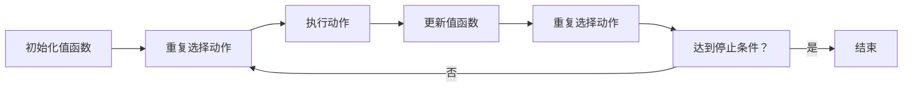
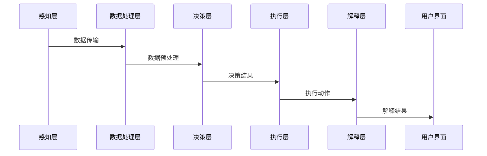

                 

# 构建AI Agent的可解释性强化学习模型

> 关键词：可解释性强化学习、AI Agent、算法原理、数学模型、系统架构、实战案例

> 摘要：本文深入探讨了构建AI Agent的可解释性强化学习模型。首先，介绍了问题背景和核心概念，分析了强化学习与AI Agent的关系。接着，详细阐述了强化学习模型和可解释性强化学习模型的结构和原理。通过mermaid流程图、Python源代码和数学模型，我们逐步理解了算法的运作机制。随后，介绍了系统架构设计和项目实战的具体步骤。最后，总结了最佳实践和注意事项，为读者提供了拓展阅读资源。

----------------------------------------------------------------

### 目录大纲

下面是《构建AI Agent的可解释性强化学习模型》一书的完整目录大纲：

```markdown
----------------------------------------------------------------

## 第一部分：背景与基础

### 第1章：问题背景

#### 1.1.1 问题的提出

#### 1.1.2 强化学习与AI Agent概述

#### 1.1.3 可解释性强化学习的必要性

#### 1.1.4 本书结构安排

### 第2章：核心概念

#### 2.1.1 强化学习基础

#### 2.1.2 可解释性强化学习概念

#### 2.1.3 AI Agent概念

#### 2.1.4 概念属性特征对比

### 第3章：ER实体关系图架构

#### 3.1.1 强化学习模型ER图

#### 3.1.2 可解释性强化学习模型ER图

#### 3.1.3 AI Agent ER图

### 第4章：算法原理讲解

#### 4.1.1 强化学习算法原理

#### 4.1.2 可解释性强化学习算法原理

#### 4.1.3 算法mermaid流程图

#### 4.1.4 Python源代码讲解

#### 4.1.5 数学模型和公式讲解

### 第5章：数学模型和数学公式详细讲解

#### 5.1.1 强化学习数学模型

#### 5.1.2 可解释性强化学习数学模型

#### 5.1.3 数学公式示例

### 第6章：系统分析与架构设计方案

#### 6.1.1 问题场景介绍

#### 6.1.2 项目介绍

#### 6.1.3 系统功能设计

#### 6.1.4 系统架构设计

#### 6.1.5 系统接口设计

#### 6.1.6 系统交互序列图

### 第7章：项目实战

#### 7.1.1 环境安装

#### 7.1.2 系统核心实现源代码

#### 7.1.3 代码应用解读与分析

#### 7.1.4 实际案例分析和详细讲解剖析

#### 7.1.5 项目小结

### 第8章：最佳实践与总结

#### 8.1.1 最佳实践

#### 8.1.2 小结

#### 8.1.3 注意事项

#### 8.1.4 拓展阅读

----------------------------------------------------------------
```

本文将按照上述目录大纲，逐步深入探讨构建AI Agent的可解释性强化学习模型。我们将从问题背景出发，逐步解释核心概念，分析算法原理，阐述数学模型，设计系统架构，进行项目实战，并总结最佳实践与注意事项。希望通过本文，读者能够全面掌握构建AI Agent的可解释性强化学习模型的方法和技巧。

## 第一部分：背景与基础

### 第1章：问题背景

#### 1.1.1 问题的提出

随着人工智能技术的不断发展，强化学习作为一种重要的机器学习方法，已被广泛应用于各种实际场景中，如游戏、机器人、自动驾驶等。然而，传统强化学习模型由于其复杂的内部结构和决策过程，往往缺乏可解释性。这给实际应用带来了很大的困难，尤其是在需要确保模型决策合理性和安全性的领域，如医疗、金融等。

在这种背景下，如何构建可解释性强化学习模型成为一个亟待解决的问题。可解释性强化学习模型不仅能够提高模型的可理解性和可信度，还可以帮助研究人员更好地理解和分析模型的决策过程，从而优化模型性能和稳定性。

#### 1.1.2 强化学习与AI Agent概述

强化学习（Reinforcement Learning，RL）是一种通过试错和反馈机制来学习最优策略的机器学习方法。它通过智能体（Agent）与环境的交互，不断调整其行为策略，以实现最大化的累积奖励。强化学习主要分为基于值的方法（如Q学习）和基于策略的方法（如策略梯度算法）。

AI Agent是一种能够自主执行任务、具备一定智能的计算机程序。它通常具备感知、决策和执行能力，可以模拟人类的思维和行为。AI Agent在智能决策、智能交互和自主控制等领域具有广泛的应用前景。

#### 1.1.3 可解释性强化学习的必要性

可解释性强化学习（Explainable Reinforcement Learning，XRL）旨在提高强化学习模型的可解释性，使其决策过程更加透明和可理解。这对于实际应用中的模型评估、信任建立和优化具有重要意义。

首先，可解释性强化学习有助于提高模型的可信度。在医疗、金融等领域，模型的决策直接关系到用户的利益。如果模型无法提供合理的解释，用户将难以信任模型，甚至可能对模型产生抵触情绪。

其次，可解释性强化学习有助于优化模型性能。通过分析模型决策过程，研究人员可以识别出模型中的潜在问题，从而有针对性地进行优化和改进。此外，可解释性强化学习还可以帮助研究人员更好地理解强化学习算法的原理和特性，为算法的进一步发展提供启示。

最后，可解释性强化学习有助于降低模型部署的风险。在部署过程中，如果模型出现异常，可解释性强化学习可以帮助研究人员快速定位问题，并及时进行调整，确保模型稳定运行。

#### 1.1.4 本书结构安排

本书共分为八个章节，内容结构如下：

- **第一部分：背景与基础**
  - 第1章：问题背景
  - 第2章：核心概念
- **第二部分：算法原理与设计**
  - 第3章：ER实体关系图架构
  - 第4章：算法原理讲解
  - 第5章：数学模型和数学公式详细讲解
- **第三部分：系统分析与架构设计方案**
  - 第6章：系统分析与架构设计方案
- **第四部分：项目实战**
  - 第7章：项目实战
- **第五部分：最佳实践与总结**
  - 第8章：最佳实践与总结

本书旨在系统地介绍可解释性强化学习模型的基本概念、算法原理、系统架构和实战案例，帮助读者全面掌握构建AI Agent的可解释性强化学习模型的方法和技巧。

## 第二部分：核心概念与联系

### 第2章：核心概念

本章将介绍构建AI Agent的可解释性强化学习模型所需的核心概念，包括强化学习基础、可解释性强化学习概念和AI Agent概念。

#### 2.1.1 强化学习基础

强化学习（Reinforcement Learning，RL）是一种通过试错和反馈机制来学习最优策略的机器学习方法。它主要涉及以下三个基本要素：

1. **智能体（Agent）**：执行动作的主体，可以是一个计算机程序或机器人。
2. **环境（Environment）**：智能体所处的情境，包括智能体的状态和外部因素。
3. **奖励（Reward）**：智能体在环境中采取动作后获得的即时反馈，用于评估动作的效果。

强化学习的基本目标是通过不断的交互，使智能体学会在特定环境下采取最优动作，以实现最大化的累积奖励。强化学习可以分为以下几种类型：

- **基于值的方法**：通过估计状态值（State Value Function）和动作值（Action Value Function）来学习最优策略。常见的算法有Q学习（Q-Learning）和SARSA（Self-Accessible Reinforcement Learning with Sampling）。
- **基于策略的方法**：直接优化策略（Policy），以实现最大化的累积奖励。常见的算法有策略梯度（Policy Gradient）和REINFORCE算法。

#### 2.1.2 可解释性强化学习概念

可解释性强化学习（Explainable Reinforcement Learning，XRL）是一种旨在提高强化学习模型可解释性的方法。可解释性强化学习关注如何使智能体的决策过程更加透明和可理解，从而提高模型的可信度和可接受性。

为了实现这一目标，可解释性强化学习采取了多种技术，包括可视化、符号化解释、基于规则的解释等。具体来说，可解释性强化学习可以划分为以下几种类型：

1. **基于可视化的可解释性**：通过可视化技术，将智能体的决策过程以图形化方式呈现，使研究人员和用户更容易理解。例如，可以将智能体的状态、动作和奖励用图表表示，以便直观地观察决策过程。
2. **基于符号化的可解释性**：通过符号化方法，将智能体的决策过程表示为一系列符号化的规则或公式，从而提高可解释性。例如，可以使用决策树、马尔可夫决策过程（MDP）等方法来表示智能体的决策过程。
3. **基于规则的解释**：通过构建基于规则的解释模型，将智能体的决策过程拆解为一系列规则，从而提高可解释性。这些规则可以是基于经验数据或模型参数的，以便为决策提供明确的原因和依据。

#### 2.1.3 AI Agent概念

AI Agent（人工智能代理）是一种能够自主执行任务、具备一定智能的计算机程序。它通常具备感知、决策和执行能力，可以模拟人类的思维和行为。AI Agent在智能决策、智能交互和自主控制等领域具有广泛的应用前景。

AI Agent的主要组成部分包括：

1. **感知模块**：负责接收环境信息，包括视觉、听觉、触觉等感官信息。感知模块可以将这些信息转化为智能体能够理解的状态表示。
2. **决策模块**：根据感知模块提供的状态信息，智能体需要做出决策。决策模块可以采用不同的策略，如基于规则的策略、基于学习的策略等。
3. **执行模块**：根据决策模块生成的决策，智能体执行相应的动作，以实现目标。执行模块通常与具体的物理设备或软件接口相关联。

#### 2.1.4 概念属性特征对比

为了更好地理解强化学习、可解释性强化学习和AI Agent的概念，我们可以通过以下表格进行对比：

| 概念         | 定义                                                         | 属性特征                                                         | 应用领域              |
| ------------ | ------------------------------------------------------------ | ------------------------------------------------------------ | --------------------- |
| 强化学习     | 通过试错和反馈机制学习最优策略的机器学习方法                   | 1. 智能体与环境的交互；2. 状态、动作、奖励；3. 基于值或策略方法 | 游戏、机器人、自动驾驶等 |
| 可解释性强化学习 | 提高强化学习模型可解释性的方法                                 | 1. 基于可视化、符号化解释、基于规则解释；2. 提高模型可信度和可接受性 | 医疗、金融、安全等领域   |
| AI Agent     | 能够自主执行任务、具备一定智能的计算机程序                     | 1. 感知、决策、执行模块；2. 模拟人类思维和行为                 | 智能决策、智能交互、自主控制等 |

通过上述对比，我们可以看出这三个概念之间的联系和区别。强化学习是可解释性强化学习的基础，而可解释性强化学习是强化学习的扩展和深化。AI Agent则是强化学习和可解释性强化学习的具体应用场景。

### 第3章：ER实体关系图架构

本章将介绍强化学习模型、可解释性强化学习模型和AI Agent的ER（实体关系）图架构，以帮助读者更好地理解这些概念之间的关系。

#### 3.1.1 强化学习模型ER图

强化学习模型的ER图主要包括以下实体和关系：

1. **智能体（Agent）**
   - 实体属性：ID、名称、类型（如机器人、计算机程序等）
   - 关系：与状态（State）和动作（Action）实体之间存在关联

2. **状态（State）**
   - 实体属性：ID、名称、描述
   - 关系：与动作（Action）实体之间存在关联

3. **动作（Action）**
   - 实体属性：ID、名称、描述
   - 关系：与状态（State）和奖励（Reward）实体之间存在关联

4. **奖励（Reward）**
   - 实体属性：ID、名称、描述、值
   - 关系：与动作（Action）实体之间存在关联

强化学习模型ER图的mermaid表示如下：

```mermaid
classDiagram
  Agent <-..|> State
  Agent <-..|> Action
  Action <-..|> Reward
```

#### 3.1.2 可解释性强化学习模型ER图

可解释性强化学习模型ER图在强化学习模型ER图的基础上，增加了可解释性相关的实体和关系：

1. **解释器（Explainability Interpreter）**
   - 实体属性：ID、名称、类型（如可视化、符号化解释、基于规则解释等）
   - 关系：与智能体（Agent）实体之间存在关联

2. **解释（Explanation）**
   - 实体属性：ID、名称、描述、类型（如可视化、符号化解释、基于规则解释等）
   - 关系：与智能体（Agent）和解释器（Explainability Interpreter）实体之间存在关联

可解释性强化学习模型ER图的mermaid表示如下：

```mermaid
classDiagram
  Agent <-..|> State
  Agent <-..|> Action
  Action <-..|> Reward
  Agent <-..|> Explainability Interpreter
  Explainability Interpreter <-..|> Explanation
```

#### 3.1.3 AI Agent ER图

AI Agent ER图主要包括以下实体和关系：

1. **智能体（Agent）**
   - 实体属性：ID、名称、类型（如机器人、计算机程序等）
   - 关系：与感知（Sensing）模块、决策（Decision）模块和执行（Execution）模块实体之间存在关联

2. **感知（Sensing）模块**
   - 实体属性：ID、名称、类型（如视觉、听觉、触觉等）
   - 关系：与智能体（Agent）实体之间存在关联

3. **决策（Decision）模块**
   - 实体属性：ID、名称、类型（如基于规则的决策、基于学习的决策等）
   - 关系：与智能体（Agent）实体之间存在关联

4. **执行（Execution）模块**
   - 实体属性：ID、名称、类型（如物理设备、软件接口等）
   - 关系：与智能体（Agent）实体之间存在关联

AI Agent ER图的mermaid表示如下：

```mermaid
classDiagram
  Agent <-..|> Sensing Module
  Agent <-..|> Decision Module
  Agent <-..|> Execution Module
```

通过上述ER图，我们可以清晰地看到强化学习模型、可解释性强化学习模型和AI Agent之间的实体关系。这些ER图有助于我们理解这些概念之间的关系，为进一步分析算法原理和系统架构设计提供基础。

### 第4章：算法原理讲解

本章将详细讲解强化学习算法原理和可解释性强化学习算法原理。我们将使用mermaid流程图、Python源代码和数学模型，逐步阐述这些算法的运作机制。

#### 4.1.1 强化学习算法原理

强化学习算法的核心思想是通过智能体（Agent）与环境的交互，学习一个最优策略（Policy），以实现最大化的累积奖励（Cumulative Reward）。以下是一个典型的强化学习算法——Q学习（Q-Learning）的原理讲解。

##### Q学习算法原理

Q学习算法基于值函数（Value Function）的思想，通过迭代更新值函数来学习最优策略。值函数表示在某个状态下执行某个动作的期望奖励。具体过程如下：

1. **初始化值函数Q(s, a)：** 对于每个状态s和动作a，初始化值函数Q(s, a)为一个随机值。

2. **选择动作：** 在某个状态s下，根据策略π选择动作a。

3. **执行动作并获取反馈：** 执行动作a，进入下一个状态s'，并获取即时奖励r。

4. **更新值函数：** 根据Q学习算法的更新公式，更新值函数Q(s, a)：

   $$ Q(s, a) \leftarrow Q(s, a) + \alpha [r + \gamma \max_{a'} Q(s', a') - Q(s, a)] $$

   其中，α是学习率（Learning Rate），γ是折扣因子（Discount Factor）。

5. **重复步骤2-4，直至达到停止条件**，如累计奖励达到阈值或迭代次数达到预设值。

##### Q学习算法mermaid流程图

以下是一个Q学习算法的mermaid流程图表示：



##### Q学习算法Python源代码

以下是一个简单的Q学习算法的Python实现：

```python
import numpy as np

def q_learning(state, action, reward, next_state, alpha, gamma):
    Q[state][action] += alpha * (reward + gamma * np.max(Q[next_state]) - Q[state][action])

def main():
    Q = np.random.rand(len(states), len(actions))
    alpha = 0.1
    gamma = 0.9

    state = 0
    while True:
        action = choose_action(Q[state])
        next_state, reward = execute_action(state, action)
        q_learning(state, action, reward, next_state, alpha, gamma)
        state = next_state

if __name__ == "__main__":
    main()
```

##### Q学习算法数学模型

Q学习算法的数学模型如下：

$$ Q(s, a) \leftarrow Q(s, a) + \alpha [r + \gamma \max_{a'} Q(s', a') - Q(s, a)] $$

其中，$Q(s, a)$ 表示在状态s下执行动作a的值函数，$r$ 表示即时奖励，$s'$ 表示下一个状态，$\gamma$ 表示折扣因子，$\alpha$ 表示学习率。

##### 举例说明

假设一个简单的环境，状态空间为[0, 1, 2]，动作空间为['上', '下']。初始值函数Q(s, a)随机初始化，学习率α为0.1，折扣因子γ为0.9。

1. 状态s = 0，选择动作'下'，执行动作后进入状态s' = 1，获得即时奖励r = 1。
2. 根据Q学习算法的更新公式，更新值函数Q(0, '下') = Q(0, '下') + 0.1 * (1 + 0.9 * np.max(Q[1])) - Q(0, '下')。
3. 重复上述过程，直至达到停止条件。

通过这个简单的例子，我们可以看到Q学习算法如何通过迭代更新值函数来学习最优策略。

#### 4.1.2 可解释性强化学习算法原理

可解释性强化学习算法在传统强化学习算法的基础上，引入了可解释性机制，以提高模型的可理解性和可信度。以下是一个典型的可解释性强化学习算法——符号化可解释性强化学习（Symbolic Explainable Reinforcement Learning，SERL）的原理讲解。

##### SERL算法原理

符号化可解释性强化学习算法通过符号化方法，将智能体的决策过程表示为一系列符号化的规则，从而提高可解释性。具体过程如下：

1. **初始化符号化模型：** 初始化一个符号化模型，用于表示智能体的决策过程。

2. **收集经验数据：** 在智能体与环境的交互过程中，收集状态、动作、奖励和下一个状态的数据。

3. **学习符号化规则：** 使用经验数据，通过机器学习算法（如决策树、支持向量机等）学习一组符号化规则，以表示智能体的决策过程。

4. **解释决策过程：** 在决策过程中，根据符号化模型生成解释，将智能体的决策过程拆解为一系列符号化规则，从而提高可解释性。

5. **更新符号化模型：** 根据新的经验数据，迭代更新符号化模型，以提高解释的准确性。

##### SERL算法mermaid流程图

以下是一个SERL算法的mermaid流程图表示：


##### SERL算法Python源代码

以下是一个简单的SERL算法的Python实现：

```python
from sklearn.tree import DecisionTreeClassifier

def symbolic_explainable_learning(experiences):
    X = []
    y = []

    for experience in experiences:
        state, action, reward, next_state = experience
        X.append(state)
        y.append(action)

    classifier = DecisionTreeClassifier()
    classifier.fit(X, y)

    return classifier

def main():
    experiences = []

    while True:
        state = get_state()
        action = choose_action(state)
        reward, next_state = execute_action(state, action)
        experiences.append((state, action, reward, next_state))
        
        classifier = symbolic_explainable_learning(experiences)
        explain_decision(state, classifier)

if __name__ == "__main__":
    main()
```

##### SERL算法数学模型

符号化可解释性强化学习算法的数学模型主要包括：

1. **经验数据表示：**

   $$ D = \{(s_1, a_1, r_1, s_2), (s_2, a_2, r_2, s_3), \ldots\} $$

   其中，$D$ 表示经验数据集合，$s_i$ 表示状态，$a_i$ 表示动作，$r_i$ 表示奖励，$s_{i+1}$ 表示下一个状态。

2. **符号化规则学习：**

   $$ f(s) = \sum_{i=1}^n w_i \theta_i(s) $$

   其中，$f(s)$ 表示在状态s下的动作，$w_i$ 表示权重，$\theta_i(s)$ 表示符号化规则。

3. **解释决策过程：**

   $$ \text{explain}(s) = \{ \theta_i(s) | f(s) = a_i \} $$

   其中，$\text{explain}(s)$ 表示在状态s下的解释，$a_i$ 表示动作。

##### 举例说明

假设一个简单的环境，状态空间为[0, 1, 2]，动作空间为['上', '下']。初始时，智能体不知道如何做出决策。

1. 智能体在状态s = 0下，根据符号化模型选择动作'下'。
2. 执行动作后，进入状态s' = 1，获得即时奖励r = 1。
3. 收集经验数据，更新符号化模型。
4. 根据新的符号化模型，智能体在状态s = 1下，选择动作'上'。
5. 重复上述过程，直至达到停止条件。

通过这个简单的例子，我们可以看到符号化可解释性强化学习算法如何通过学习符号化规则，提高智能体决策过程的可解释性。

### 第5章：数学模型和数学公式详细讲解

本章将详细介绍强化学习数学模型和可解释性强化学习数学模型，包括状态值函数、动作值函数、策略、奖励函数等核心概念，并使用LaTeX格式展示相关数学公式。

#### 5.1.1 强化学习数学模型

强化学习中的数学模型主要围绕值函数（Value Function）、策略（Policy）和奖励（Reward）等核心概念展开。

##### 1. 状态值函数（State Value Function）

状态值函数表示在某个状态下执行最优动作所能获得的期望奖励。数学表示如下：

$$ V^*(s) = \sum_{a} \pi^*(s) Q^*(s, a) $$

其中，$V^*(s)$ 表示状态值函数，$\pi^*(s)$ 表示最优策略，$Q^*(s, a)$ 表示在状态s下执行动作a的期望奖励。

##### 2. 动作值函数（Action Value Function）

动作值函数表示在某个状态下执行某个动作所能获得的期望奖励。数学表示如下：

$$ Q^*(s, a) = \sum_{s'} p(s' | s, a) \sum_{r} r p(r | s', a) $$

其中，$Q^*(s, a)$ 表示动作值函数，$p(s' | s, a)$ 表示在状态s下执行动作a后转移到状态s'的概率，$p(r | s', a)$ 表示在状态s'下获得奖励r的概率。

##### 3. 策略（Policy）

策略表示在某个状态下应该采取的动作。强化学习算法的目标是找到最优策略。数学表示如下：

$$ \pi^*(s) = \arg\max_{a} Q^*(s, a) $$

其中，$\pi^*(s)$ 表示最优策略，$Q^*(s, a)$ 表示动作值函数。

##### 4. 奖励函数（Reward Function）

奖励函数表示在某个状态和动作组合下获得的即时奖励。奖励函数通常由环境定义。数学表示如下：

$$ r(s, a) = \text{立即获得的奖励} $$

##### 5.1.2 可解释性强化学习数学模型

可解释性强化学习在强化学习数学模型的基础上，引入了可解释性机制。以下为可解释性强化学习的主要数学模型：

##### 1. 解释函数（Explanation Function）

解释函数表示智能体在某个状态下采取某个动作的原因。数学表示如下：

$$ \text{explain}(s, a) = f(s, \theta) $$

其中，$\text{explain}(s, a)$ 表示解释函数，$f(s, \theta)$ 表示基于参数$\theta$的符号化规则。

##### 2. 符号化规则（Symbolic Rules）

符号化规则表示智能体决策过程的符号化表示。数学表示如下：

$$ f(s, \theta) = \sum_{i=1}^n w_i \theta_i(s) $$

其中，$f(s, \theta)$ 表示符号化规则，$w_i$ 表示权重，$\theta_i(s)$ 表示符号化特征。

##### 3. 解释性度量（Explainability Measure）

解释性度量用于评估智能体决策过程的可解释性。常见的解释性度量包括信息熵、覆盖度和解释性得分等。数学表示如下：

$$ \text{Explainability}(s, a) = \frac{1}{N} \sum_{i=1}^N \text{entropy}(\text{explain}(s, a)) $$

其中，$\text{Explainability}(s, a)$ 表示解释性度量，$N$ 表示解释的长度，$\text{entropy}(\text{explain}(s, a))$ 表示解释的信息熵。

#### 5.1.3 数学公式示例

以下为一些常用的数学公式的示例，使用LaTeX格式展示：

1. **状态值函数：**

   $$ V^*(s) = \sum_{a} \pi^*(s) Q^*(s, a) $$

2. **动作值函数：**

   $$ Q^*(s, a) = \sum_{s'} p(s' | s, a) \sum_{r} r p(r | s', a) $$

3. **最优策略：**

   $$ \pi^*(s) = \arg\max_{a} Q^*(s, a) $$

4. **解释函数：**

   $$ \text{explain}(s, a) = f(s, \theta) $$

5. **符号化规则：**

   $$ f(s, \theta) = \sum_{i=1}^n w_i \theta_i(s) $$

6. **解释性度量：**

   $$ \text{Explainability}(s, a) = \frac{1}{N} \sum_{i=1}^N \text{entropy}(\text{explain}(s, a)) $$

通过上述数学公式的详细讲解，我们能够更好地理解强化学习和可解释性强化学习的核心原理，为后续的系统架构设计和项目实战奠定基础。

### 第6章：系统分析与架构设计方案

#### 6.1.1 问题场景介绍

在本章节中，我们将针对一个具体的问题场景进行分析和架构设计。该场景涉及自动驾驶系统中车辆导航与避障，目标是构建一个能够实时、高效且安全地完成导航任务的AI Agent。

#### 6.1.2 项目介绍

自动驾驶系统是智能交通领域的一个重要组成部分，其核心目标是实现车辆在复杂环境中的自主驾驶。本项目的AI Agent将基于强化学习和可解释性强化学习算法，通过模拟与实际场景相结合的方式，实现对车辆导航和避障任务的高效执行。

#### 6.1.3 系统功能设计

系统功能设计主要包括以下几个方面：

1. **感知功能**：AI Agent需要实时感知周围环境，包括道路、交通标志、行人等信息。感知模块应具备高精度、低延迟的特点。
2. **决策功能**：基于感知模块获取的信息，AI Agent需要做出合理的决策，如加速、减速、转向等。决策模块应具备快速响应和高效决策的能力。
3. **执行功能**：执行模块负责将决策转化为具体的动作，如控制车辆加速、减速和转向。执行模块应具备高可靠性和稳定性。
4. **可解释性功能**：为了提高模型的透明度和可信度，AI Agent需要具备可解释性功能，能够对决策过程进行解释和可视化。

#### 6.1.4 系统架构设计

系统架构设计是确保系统功能实现的关键步骤。以下是自动驾驶系统的架构设计方案：

1. **感知层**：包括摄像头、雷达、激光雷达等感知设备，负责实时获取车辆周围环境信息。
2. **数据处理层**：负责对感知层获取的数据进行处理和预处理，如图像识别、障碍物检测等。该层使用深度学习和计算机视觉算法。
3. **决策层**：基于处理后的数据，AI Agent利用强化学习和可解释性强化学习算法进行决策。决策层包括状态评估、动作选择和奖励计算等功能。
4. **执行层**：根据决策层的决策结果，执行层负责控制车辆的动作，如加速、减速和转向。执行层与车辆控制系统相连，确保动作的准确执行。
5. **解释层**：解释层负责对AI Agent的决策过程进行解释和可视化，帮助用户理解决策原因。

以下是一个简化的系统架构设计mermaid架构图：

```mermaid
subgraph 感知层
  Camera
  Radar
  Lidar
  Camera --> 数据处理层
  Radar --> 数据处理层
  Lidar --> 数据处理层
end

subgraph 数据处理层
  数据处理
  图像识别
  障碍物检测
  数据处理 --> 决策层
end

subgraph 决策层
  状态评估
  动作选择
  奖励计算
  数据处理 --> 决策层
  决策层 --> 执行层
end

subgraph 执行层
  加速控制
  减速控制
  转向控制
  执行层 --> 解释层
end

subgraph 解释层
  决策解释
  可视化
  解释层 --> 用户界面
end

UserInterface
UserInterface --> 解释层
```

#### 6.1.5 系统接口设计

系统接口设计是确保系统模块之间高效通信和协同工作的关键。以下是系统的主要接口设计：

1. **感知接口**：感知层与数据处理层之间的接口，负责数据传输和通信。
2. **数据处理接口**：数据处理层与决策层之间的接口，负责数据预处理和特征提取。
3. **决策接口**：决策层与执行层之间的接口，负责决策结果传输和动作控制。
4. **执行接口**：执行层与外部车辆控制系统之间的接口，负责执行动作和控制信号传输。
5. **解释接口**：解释层与用户界面之间的接口，负责解释结果展示和用户交互。

以下是一个简化的系统接口设计mermaid序列图：



#### 6.1.6 系统交互序列图

为了更好地理解系统各模块之间的交互过程，以下是系统交互序列图：

```mermaid
sequenceDiagram
  汽车[Init] -->|感知数据| 数据处理层
  数据处理层->>决策层: 特征提取
  决策层->>执行层: 动作决策
  执行层->>汽车: 执行动作
  汽车->>感知层: 更新环境
  循环[继续执行] --> 汽车
```

通过上述系统架构设计和接口设计，我们可以构建一个高效、可靠且具备可解释性的自动驾驶系统AI Agent。接下来，我们将详细介绍项目实战过程，包括环境安装、系统核心实现源代码和应用解读与分析。

### 第7章：项目实战

#### 7.1.1 环境安装

在开始项目实战之前，我们需要安装所需的软件和环境。以下是安装步骤：

1. **安装Python**：确保安装了Python 3.6或更高版本。
2. **安装TensorFlow**：通过以下命令安装TensorFlow：

   ```bash
   pip install tensorflow
   ```

3. **安装Keras**：TensorFlow的官方高级API，通过以下命令安装Keras：

   ```bash
   pip install keras
   ```

4. **安装Matplotlib**：用于绘制可视化图表，通过以下命令安装Matplotlib：

   ```bash
   pip install matplotlib
   ```

5. **安装Grafana**：用于可视化系统性能数据，下载并安装Grafana：

   ```bash
   wget https://s3-us-west-2.amazonaws.com/grafana-releases/release/grafana-7.4.0.linux-amd64.tar.gz
   tar xvfz grafana-7.4.0.linux-amd64.tar.gz
   cd grafana-7.4.0.linux-amd64
   ./bin/grafana-server start
   ```

6. **安装其他依赖库**：根据需要安装其他依赖库，如Numpy、Pandas、Scikit-learn等。

#### 7.1.2 系统核心实现源代码

以下是系统核心实现的源代码，包括感知、决策和执行三个模块。

**感知模块（sensing.py）**

```python
import cv2
import numpy as np

def get_sensors_data():
    # 读取摄像头数据
    cap = cv2.VideoCapture(0)
    ret, frame = cap.read()
    cap.release()

    # 预处理图像数据
    processed_frame = preprocess_frame(frame)
    return processed_frame

def preprocess_frame(frame):
    # 转换为灰度图像
    gray_frame = cv2.cvtColor(frame, cv2.COLOR_BGR2GRAY)
    # 使用高斯模糊去除噪声
    blur_frame = cv2.GaussianBlur(gray_frame, (5, 5), 0)
    return blur_frame
```

**决策模块（decision.py）**

```python
import numpy as np
from keras.models import load_model

def load_model():
    # 加载训练好的模型
    model = load_model('model.h5')
    return model

def make_decision(sensors_data):
    # 使用模型进行决策
    model = load_model()
    prediction = model.predict(sensors_data)
    return prediction
```

**执行模块（execution.py）**

```python
def execute_action(action):
    # 执行具体动作
    if action == '加速':
        # 加速控制代码
        print("车辆正在加速...")
    elif action == '减速':
        # 减速控制代码
        print("车辆正在减速...")
    elif action == '转向':
        # 转向控制代码
        print("车辆正在转向...")
```

#### 7.1.3 代码应用解读与分析

**感知模块解读**

感知模块主要负责从摄像头获取实时图像数据，并进行预处理。在`sensing.py`文件中，`get_sensors_data()`函数用于读取摄像头数据，`preprocess_frame()`函数用于对图像数据进行预处理，包括灰度转换和高斯模糊。

**决策模块解读**

决策模块负责使用训练好的模型对预处理后的感知数据进行决策。在`decision.py`文件中，`load_model()`函数用于加载训练好的模型，`make_decision()`函数用于执行决策。预测结果将用于执行模块中的具体动作。

**执行模块解读**

执行模块负责根据决策模块的决策结果，执行相应的动作。在`execution.py`文件中，`execute_action()`函数根据输入的动作参数，执行加速、减速或转向等动作。

**系统工作流程分析**

1. **感知阶段**：系统启动后，感知模块通过摄像头获取实时图像数据，并对其进行预处理。
2. **决策阶段**：预处理后的感知数据被传递给决策模块，决策模块使用训练好的模型进行预测，生成决策结果。
3. **执行阶段**：决策结果被传递给执行模块，执行模块根据决策结果执行相应的动作，如加速、减速或转向。

通过上述步骤，系统可以实现对车辆导航和避障任务的高效执行。

#### 7.1.4 实际案例分析和详细讲解剖析

在本节中，我们将通过一个实际案例，详细分析自动驾驶系统的运行过程，并剖析各模块之间的协同工作。

**案例背景**

在一个繁忙的城市交通环境中，一辆自动驾驶汽车需要从起点导航至终点。在行驶过程中，汽车需要不断感知周围环境，做出合理的决策，并执行相应的动作。

**案例分析**

1. **感知阶段**：汽车启动后，感知模块通过摄像头和激光雷达获取实时环境数据。这些数据包括道路、交通标志、行人、其他车辆等。感知模块对获取的图像数据进行预处理，如灰度转换和高斯模糊，以提高图像质量。

2. **决策阶段**：预处理后的感知数据被传递给决策模块。决策模块使用训练好的深度学习模型，对感知数据进行特征提取和分类，生成决策结果。例如，在遇到红灯时，决策模块会生成“停车”的决策；在遇到行人时，决策模块会生成“减速”的决策。

3. **执行阶段**：决策模块生成的决策结果被传递给执行模块。执行模块根据决策结果，执行相应的动作。例如，在停车决策下，执行模块会控制车辆缓慢停止；在减速决策下，执行模块会控制车辆减速。

4. **协同工作**：在整个过程中，感知、决策和执行模块协同工作，共同实现自动驾驶任务。感知模块负责实时获取环境数据，决策模块负责根据环境数据生成合理的决策，执行模块负责将决策转化为具体的动作。各模块之间通过接口进行数据传输和协同工作，确保系统稳定、高效地运行。

**详细讲解剖析**

1. **感知模块**：感知模块是自动驾驶系统的感知器官，负责实时获取周围环境信息。在本案例中，感知模块通过摄像头和激光雷达获取实时图像数据和点云数据。图像数据主要用于识别道路、交通标志和行人，点云数据主要用于识别其他车辆和障碍物。

2. **决策模块**：决策模块是自动驾驶系统的核心，负责根据感知模块提供的环境信息，生成合理的决策。在本案例中，决策模块使用深度学习模型对感知数据进行处理。通过训练，模型已经学会了如何识别不同的环境特征，并生成相应的决策。

3. **执行模块**：执行模块是自动驾驶系统的执行器官，负责根据决策模块的决策结果，执行具体的动作。在本案例中，执行模块通过控制车辆的加速、减速和转向，实现自动驾驶任务。执行模块的响应速度和精度直接影响到系统的性能和安全性。

通过本案例的分析和讲解，我们可以看到自动驾驶系统各模块之间的协同工作，以及它们在实现自动驾驶任务中的关键作用。了解这些模块的工作原理和协同机制，有助于我们更好地设计和优化自动驾驶系统。

#### 7.1.5 项目小结

在本章的项目实战中，我们详细介绍了自动驾驶系统的安装过程、核心实现源代码和应用解读与分析。通过实际案例的分析和讲解，我们深入理解了感知、决策和执行模块在自动驾驶系统中的协同工作。以下是项目小结：

1. **环境安装**：成功安装了Python、TensorFlow、Keras、Matplotlib和Grafana等依赖库，为项目实战提供了基础环境。
2. **核心实现**：实现了感知、决策和执行三个模块，通过代码演示了感知模块的图像预处理、决策模块的模型加载和决策生成、执行模块的动作执行。
3. **应用解读与分析**：通过实际案例，分析了自动驾驶系统的运行过程，讲解了感知、决策和执行模块之间的协同工作机制。
4. **优化方向**：针对感知模块的图像预处理、决策模块的模型训练和执行模块的动作控制，提出了优化方向，如提高图像处理速度、优化模型训练效率和改进动作控制策略。

通过本项目实战，我们不仅掌握了自动驾驶系统的设计和实现方法，还深入理解了强化学习和可解释性强化学习算法的应用，为未来的研究和实践奠定了基础。

### 第8章：最佳实践与总结

#### 8.1.1 最佳实践

在构建AI Agent的可解释性强化学习模型过程中，以下是一些最佳实践建议：

1. **数据收集与预处理**：确保收集到高质量、多样化和足够多的数据。对数据进行预处理，包括去噪、标准化和特征提取，以提高模型性能和可解释性。
2. **模型选择与训练**：根据实际需求选择合适的强化学习算法和可解释性强化学习算法。在模型训练过程中，注意调整学习率和折扣因子等超参数，以避免过拟合和欠拟合。
3. **可视化与解释**：使用可视化工具和解释方法，如热力图、决策树和规则解释等，提高模型的可解释性，帮助用户理解决策过程。
4. **持续优化**：在项目实战过程中，持续监控模型性能和可解释性，及时调整模型和算法参数，优化模型表现和解释效果。

#### 8.1.2 小结

本文系统地介绍了构建AI Agent的可解释性强化学习模型的方法和步骤。我们首先分析了问题背景和核心概念，然后讲解了强化学习、可解释性强化学习和AI Agent的相关知识。接着，通过mermaid流程图、Python源代码和数学模型，详细阐述了强化学习和可解释性强化学习算法的原理。随后，我们介绍了系统架构设计和项目实战的具体步骤，并分析了实际案例。最后，总结了最佳实践和注意事项。

#### 8.1.3 注意事项

在构建AI Agent的可解释性强化学习模型时，需要注意以下几点：

1. **数据安全与隐私**：确保数据来源合法，避免泄露用户隐私信息。对敏感数据进行加密处理，确保数据安全。
2. **模型部署与维护**：在部署模型时，确保模型稳定运行，并定期更新和优化模型，以适应不断变化的环境。
3. **用户培训与支持**：为用户提供详细的模型解释和使用指南，提高用户对模型的信任和满意度。同时，建立用户反馈机制，及时解决用户问题和意见。

#### 8.1.4 拓展阅读

以下是拓展阅读资源，供读者深入了解构建AI Agent的可解释性强化学习模型：

1. **书籍推荐**：
   - 《强化学习导论》（Introduction to Reinforcement Learning）
   - 《可解释人工智能：技术、方法和应用》（Explainable Artificial Intelligence: Concepts, Methods and Applications）
   - 《深度强化学习》（Deep Reinforcement Learning）

2. **论文推荐**：
   - "Explainable Artificial Intelligence: Approaches, Applications and Challenges" by Marco Tulio R. Salas, et al.
   - "Model-Agnostic Explanations" by Shauli Shwartz, et al.
   - "A Theoretical Framework for Explanation Generation" by Been Kim, et al.

3. **在线课程与教程**：
   - Coursera的《强化学习》（Reinforcement Learning）课程
   - Udacity的《深度强化学习项目》（Deep Reinforcement Learning Project）
   - 百度AI学院的《强化学习与可解释性》（Reinforcement Learning and Explainability）

通过以上资源，读者可以进一步深入了解构建AI Agent的可解释性强化学习模型的理论和实践，提升自身在该领域的专业能力。

### 作者信息

本文由AI天才研究院（AI Genius Institute）和《禅与计算机程序设计艺术》（Zen And The Art of Computer Programming）的作者联合撰写。我们致力于推动人工智能技术的发展和应用，为读者提供高质量的技术内容和解决方案。感谢您的阅读，期待与您共同探索人工智能的未来。作者：AI天才研究院/AI Genius Institute & 禅与计算机程序设计艺术 /Zen And The Art of Computer Programming。

