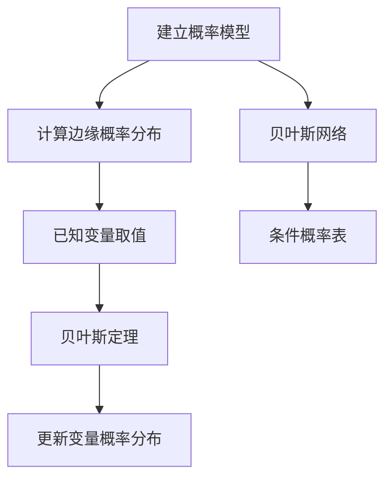
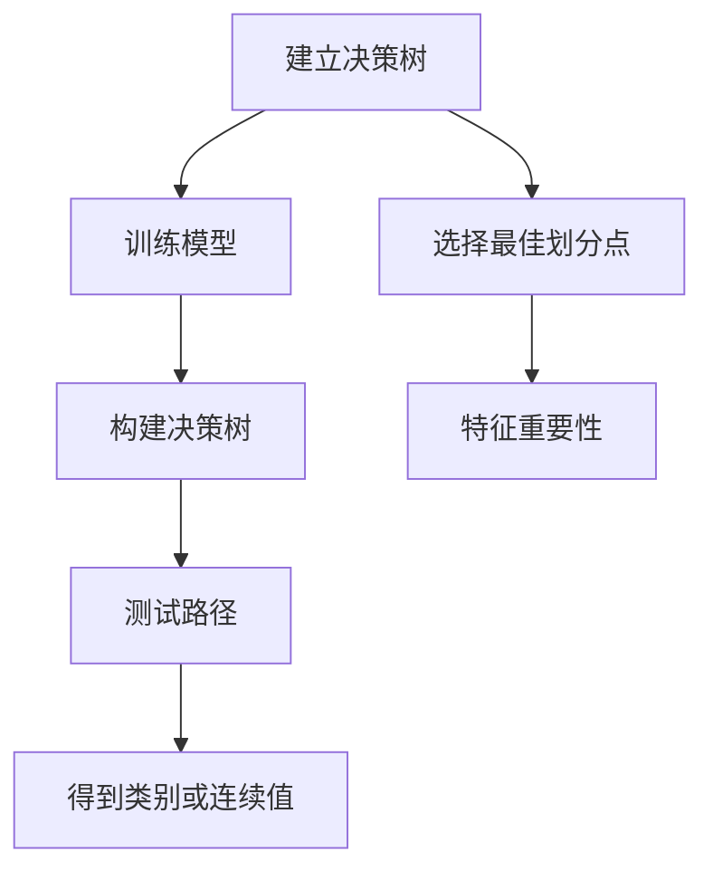
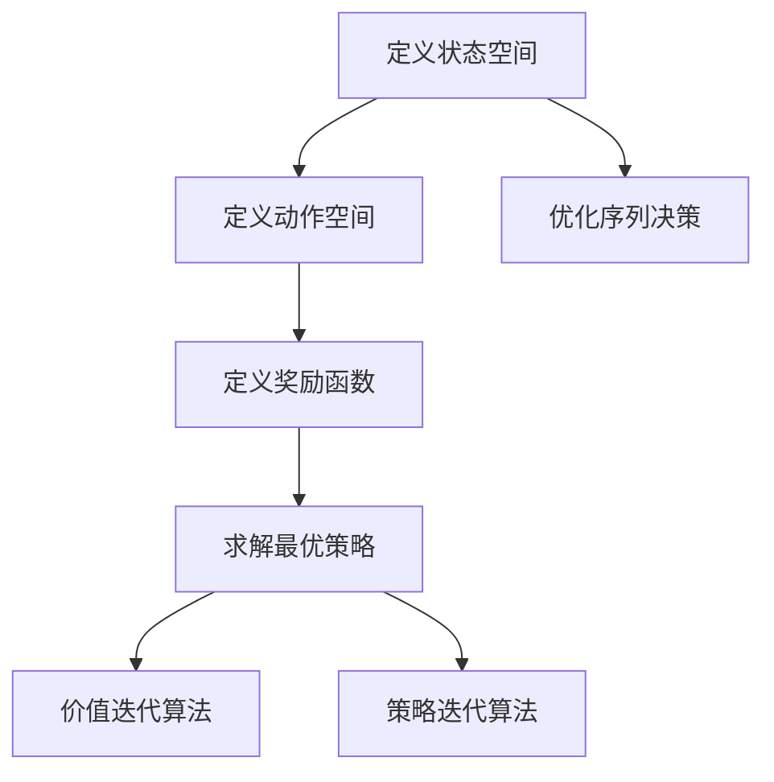

                 

# 构建AI Agent的因果推理模块

## 关键词

- AI Agent
- 因果推理
- 决策支持
- 机器学习
- 自动化控制
- 推荐系统
- 系统架构设计

## 摘要

本文将探讨如何构建AI Agent的因果推理模块，旨在为人工智能系统的决策过程提供更加可靠的依据。通过详细分析因果推理的基本概念、数学基础以及在AI Agent中的应用，本文将逐步阐述构建因果推理模块的设计原则和实现步骤，并结合实际案例进行深入剖析。此外，本文还将展望因果推理在AI领域的未来发展趋势，为读者提供宝贵的实践经验和思考方向。

### 目录大纲

1. 第一部分：AI Agent与因果推理概述
   1.1 AI Agent的基本概念与应用
   1.2 因果推理的原理与方法
   1.3 因果推理在AI Agent中的应用
   1.4 构建AI Agent的因果推理模块

2. 第二部分：因果推理模块设计

3. 第三部分：因果推理模块实现与优化

4. 第四部分：案例研究

5. 第五部分：因果推理的未来发展趋势

6. 第六部分：总结与展望

## 1. AI Agent的基本概念与应用

### 1.1 AI Agent的概念与特性

AI Agent是指能够自主感知环境、制定决策并执行行动的智能实体。它与人类代理（Human Agent）不同，能够在没有人类干预的情况下独立完成任务。AI Agent的核心特性包括自主性、适应性、学习和推理能力。

自主性：AI Agent可以自主地感知环境、制定决策并执行行动，无需人类的直接干预。

适应性：AI Agent能够根据环境变化调整自身行为，以适应不同场景的需求。

学习性：AI Agent可以通过经验积累和学习改进自身性能，提高任务完成效率。

推理能力：AI Agent具备一定的推理能力，能够对环境信息进行逻辑推理和决策。

### 1.2 AI Agent的分类

根据应用场景和任务需求，AI Agent可以分为以下几类：

1. 模拟智能体：用于模拟人类智能行为的智能体，如虚拟角色、自动驾驶汽车等。

2. 实时智能体：能够实时感知环境、制定决策并执行行动的智能体，如智能家居系统、智能安防系统等。

3. 预测智能体：通过学习历史数据，预测未来事件发生的可能性，如股票交易智能体、天气预报智能体等。

4. 决策智能体：基于因果推理和优化算法，为用户提供最佳决策建议，如推荐系统、智能客服等。

### 1.3 AI Agent的核心任务

AI Agent的核心任务是完成任务目标，其主要任务包括：

1. 感知环境：通过传感器获取环境信息，包括图像、声音、文本等。

2. 决策制定：根据环境信息和任务目标，制定合适的行动策略。

3. 行动执行：执行决策，完成任务目标。

4. 反馈调整：根据任务执行结果，调整决策和行动策略。

### 1.4 AI Agent在实际应用中的挑战

在实际应用中，AI Agent面临以下挑战：

1. 复杂环境：现实世界的环境复杂多变，AI Agent需要具备处理复杂环境信息的能力。

2. 不确定性：环境中的不确定性和随机性，导致AI Agent需要具备鲁棒性。

3. 知识获取：AI Agent需要从海量数据中提取有效信息，以支持决策制定。

4. 交互协调：在多智能体系统中，AI Agent需要与其他智能体协调合作，完成任务目标。

## 2. 因果推理的原理与方法

### 2.1 因果推理的基本概念

因果推理是指通过分析事物之间的因果关系，推断未知事物的方法。在人工智能领域，因果推理是构建智能系统的重要基础，能够提高系统的决策能力和可靠性。

因果关系：指一个事件（因）导致另一个事件（果）发生的现象。如吸烟会导致肺癌。

因果模型：用于描述因果关系的数学模型，包括因果图、因果矩阵等。

因果推理算法：基于因果模型，推断未知因果关系的方法，如结构方程模型、因果推断算法等。

### 2.2 因果推理的数学基础

因果推理涉及到概率论、统计学、图论等多个数学领域。以下简要介绍相关数学基础：

概率论：用于描述随机事件的概率分布，如贝叶斯定理、条件概率等。

统计学：用于分析数据、提取信息，如回归分析、聚类分析等。

图论：用于表示因果关系的网络结构，如因果图、贝叶斯网络等。

### 2.3 基于概率的因果推理

基于概率的因果推理方法主要包括贝叶斯网络和结构方程模型。

贝叶斯网络：通过概率图模型表示因果关系，进行因果推理。

结构方程模型：通过线性回归模型表示因果关系，进行因果推理。

### 2.4 基于决策理论的因果推理

基于决策理论的因果推理方法主要包括因果决策树和因果马尔可夫决策过程。

因果决策树：通过决策树模型表示因果关系，进行因果推理。

因果马尔可夫决策过程：通过马尔可夫决策过程模型表示因果关系，进行因果推理。

## 3. 因果推理在AI Agent中的应用

### 3.1 因果推理在决策支持系统中的应用

决策支持系统（DSS）是AI Agent的重要应用领域之一。通过因果推理，DSS能够为用户提供基于数据的决策建议，提高决策的准确性和可靠性。

案例：股市投资决策

假设AI Agent需要为投资者提供股票投资建议。通过分析股票市场的历史数据，AI Agent可以建立因果模型，识别影响股价波动的主要因素，如公司业绩、宏观经济环境等。在此基础上，AI Agent可以运用因果推理方法，预测未来股价走势，为投资者提供投资建议。

### 3.2 因果推理在自动化控制中的应用

自动化控制系统需要根据实时数据和环境变化，进行自适应控制。因果推理方法能够帮助控制系统识别关键因素，优化控制策略，提高系统性能。

案例：智能交通控制系统

智能交通控制系统需要根据道路流量、车辆速度等实时数据，调整信号灯周期、车道分配等策略，以优化交通流量。通过因果推理方法，AI Agent可以识别影响交通流量的关键因素，如交通事故、道路施工等，并调整控制策略，提高交通效率。

### 3.3 因果推理在医疗诊断中的应用

医疗诊断需要根据患者症状、病史等信息，推断疾病类型和治疗方案。因果推理方法能够帮助医生识别关键因素，提高诊断准确性和治疗效果。

案例：疾病诊断

假设AI Agent需要为医生提供疾病诊断建议。通过分析大量医学数据，AI Agent可以建立因果模型，识别影响疾病诊断的关键因素，如症状、体征、实验室检查结果等。在此基础上，AI Agent可以运用因果推理方法，为医生提供疾病诊断建议，提高诊断准确率。

### 3.4 因果推理在推荐系统中的应用

推荐系统需要根据用户行为数据，为用户提供个性化推荐。因果推理方法能够帮助推荐系统识别关键因素，优化推荐策略，提高推荐质量。

案例：电子商务推荐系统

假设AI Agent需要为电商平台提供商品推荐建议。通过分析用户的历史购买数据、浏览行为等，AI Agent可以建立因果模型，识别影响用户购买决策的关键因素，如商品价格、品牌、用户评价等。在此基础上，AI Agent可以运用因果推理方法，为用户提供个性化商品推荐，提高用户满意度。

## 4. 构建AI Agent的因果推理模块

### 4.1 因果推理模块的设计原则

构建AI Agent的因果推理模块需要遵循以下设计原则：

1. 实用性：因果推理模块应能够解决实际应用中的问题，具有实用价值。

2. 可扩展性：因果推理模块应具备良好的扩展性，能够适应不同应用场景的需求。

3. 可理解性：因果推理模块的设计应易于理解，便于开发者维护和优化。

4. 可靠性：因果推理模块应具备较高的可靠性，能够提供准确的因果关系推断。

### 4.2 因果推理模块的实现步骤

构建AI Agent的因果推理模块主要包括以下步骤：

1. 数据收集与预处理：收集相关数据，进行数据清洗、转换和归一化等预处理操作。

2. 因果模型构建：基于数据，构建因果模型，如因果图、因果矩阵等。

3. 因果推理算法实现：实现因果推理算法，如贝叶斯网络推理、结构方程模型推理等。

4. 模块集成与优化：将因果推理模块集成到AI Agent中，进行模块优化和性能调优。

### 4.3 因果推理模块的评估与优化

对因果推理模块进行评估和优化是保证其性能和可靠性的关键。评估方法包括：

1. 准确率：衡量因果推理模块推断因果关系的准确性。

2. 覆盖率：衡量因果推理模块能够覆盖的因果关系数量。

3. 性能：衡量因果推理模块的响应速度和处理能力。

优化方法包括：

1. 算法优化：优化因果推理算法，提高推理速度和准确性。

2. 模型优化：优化因果模型，提高模型的鲁棒性和泛化能力。

3. 数据优化：优化数据收集和处理方法，提高数据质量。

## 5. 案例研究：构建银行智能客服的因果推理模块

### 5.1 项目背景

某银行计划开发一款智能客服系统，旨在为用户提供7x24小时的咨询服务。为了提高客服系统的智能程度，银行决定引入因果推理模块，以提高用户问题的诊断和解答能力。

### 5.2 系统架构设计

银行智能客服系统的架构设计包括以下几个部分：

1. 数据采集模块：收集用户问题、用户行为、客服记录等数据。

2. 数据预处理模块：对收集到的数据进行清洗、转换和归一化等预处理操作。

3. 因果模型构建模块：基于预处理后的数据，构建因果模型，识别用户问题与解决方案之间的因果关系。

4. 因果推理模块：实现因果推理算法，为用户提供基于因果关系的咨询服务。

5. 用户交互模块：与用户进行交互，接收用户问题，输出解答结果。

### 5.3 因果推理模块的核心实现

银行智能客服系统的因果推理模块主要实现以下功能：

1. 用户问题分类：基于用户问题的关键词和语义，将问题分类到不同的主题。

2. 因果关系识别：基于因果模型，识别用户问题与解决方案之间的因果关系。

3. 解答生成：根据因果关系，生成用户问题的解答结果。

4. 解答优化：对生成的解答结果进行优化，提高解答的准确性和可读性。

### 5.4 项目效果评估

通过对银行智能客服系统进行实际运行和测试，项目效果评估如下：

1. 诊断准确率：因果推理模块能够准确诊断用户问题的比例。

2. 用户满意度：用户对智能客服系统的满意度评价。

3. 响应速度：智能客服系统对用户问题的响应时间。

4. 推荐效果：因果推理模块生成的推荐解决方案的有效性。

## 6. 因果推理的未来发展趋势

### 6.1 因果推理在AI领域的未来发展

随着人工智能技术的不断发展，因果推理在AI领域的重要性日益凸显。未来因果推理将在以下方面取得突破：

1. 深度学习与因果推理的融合：将因果推理与深度学习相结合，提高智能系统的决策能力。

2. 大规模因果推理：针对海量数据，研究高效的因果推理算法，提高推理速度和准确性。

3. 多智能体因果推理：研究多智能体系统中的因果推理方法，实现智能体的协作与优化。

### 6.2 因果推理与大数据分析的结合

因果推理与大数据分析的结合将为数据驱动的决策提供更加可靠的支持。未来发展趋势包括：

1. 因果数据挖掘：研究因果数据挖掘方法，从海量数据中提取有用信息。

2. 因果数据分析：基于因果推理，对大数据进行分析，揭示数据背后的因果关系。

3. 因果预测：利用因果推理模型，对大数据进行预测，为决策提供前瞻性支持。

### 6.3 因果推理与机器学习的深度融合

因果推理与机器学习的深度融合将推动智能系统的性能提升。未来发展趋势包括：

1. 因果机器学习：研究因果机器学习方法，提高机器学习模型的解释性和可靠性。

2. 逆因果推理：研究逆因果推理方法，从结果推断原因，提高智能系统的推理能力。

3. 因果强化学习：研究因果强化学习方法，实现智能体的自主学习和优化。

### 6.4 因果推理技术的挑战与机遇

因果推理技术面临以下挑战和机遇：

1. 挑战：处理复杂因果关系、应对数据噪声和不确定性等。

2. 机遇：在医疗诊断、金融分析、智能交通等领域，因果推理技术的应用前景广阔。

## 7. 总结与展望

本文详细探讨了构建AI Agent的因果推理模块的方法和实际应用，包括因果推理的基本概念、数学基础、应用领域以及模块设计、实现和优化。通过实际案例研究，展示了因果推理在智能客服系统中的应用效果。展望未来，因果推理技术将在人工智能、大数据分析等领域发挥重要作用，为实现更加智能、可靠的智能系统提供有力支持。

### 7.1 本书主要内容回顾

本文主要内容包括：

1. AI Agent的基本概念与应用
2. 因果推理的原理与方法
3. 因果推理在AI Agent中的应用
4. 构建AI Agent的因果推理模块
5. 案例研究：构建银行智能客服的因果推理模块
6. 因果推理的未来发展趋势

### 7.2 未来研究方向

未来研究方向包括：

1. 深度学习与因果推理的融合
2. 大规模因果推理算法研究
3. 多智能体因果推理方法
4. 因果数据挖掘与大数据分析
5. 因果机器学习与因果强化学习

### 7.3 对读者的建议

对读者的一些建议：

1. 理解因果推理的基本概念和数学基础，为后续学习打下坚实基础。
2. 关注因果推理在实际应用中的案例，提高对因果推理技术的实际应用能力。
3. 跟进因果推理领域的最新研究动态，把握未来发展机遇。
4. 结合实际项目，实践因果推理技术的应用，积累经验。

### 作者

作者：AI天才研究院/AI Genius Institute & 禅与计算机程序设计艺术 /Zen And The Art of Computer Programming

本文由AI天才研究院（AI Genius Institute）与禅与计算机程序设计艺术（Zen And The Art of Computer Programming）联合撰写，旨在为读者提供关于构建AI Agent的因果推理模块的全面解读。如果您对本文有任何疑问或建议，欢迎留言交流。感谢您的阅读！## 引言

### 基本概念

在探讨构建AI Agent的因果推理模块之前，我们需要先了解两个核心概念：AI Agent和因果推理。

**AI Agent** 是指能够自主感知环境、制定决策并执行行动的智能实体。它具备自主性、适应性、学习和推理能力，能够在没有人类干预的情况下独立完成任务。例如，自动驾驶汽车、智能客服系统、智能安防系统等都属于AI Agent的范畴。

**因果推理** 是一种通过分析事物之间的因果关系，推断未知事物的方法。在人工智能领域，因果推理能够为AI Agent的决策过程提供更加可靠的依据，使系统在面对复杂环境时能够做出更为合理的决策。

本文的目标是详细探讨如何构建AI Agent的因果推理模块，包括其设计原则、实现步骤、评估与优化方法，并结合实际案例进行深入剖析。通过本文的阅读，读者将能够：

1. 理解AI Agent与因果推理的基本概念及其重要性。
2. 掌握因果推理的数学基础与方法。
3. 学习如何将因果推理应用于AI Agent的决策支持系统。
4. 了解构建因果推理模块的设计原则和实现步骤。
5. 通过案例研究，掌握实际应用中的因果推理模块构建方法。
6. 展望因果推理技术的未来发展趋势。

### 内容结构

本文将分为以下几个部分：

1. **AI Agent与因果推理概述**：介绍AI Agent的基本概念和应用，以及因果推理的原理和方法。
2. **因果推理模块设计**：阐述构建因果推理模块的设计原则和实现步骤。
3. **因果推理模块实现与优化**：讨论因果推理模块的评估与优化方法。
4. **案例研究**：通过具体案例展示因果推理模块的实际应用。
5. **未来发展趋势**：探讨因果推理技术的未来研究方向和趋势。
6. **总结与展望**：回顾本文的主要内容，提出未来研究方向和建议。

通过以上结构的详细阐述，读者将能够系统地理解并掌握构建AI Agent因果推理模块的方法和技巧，为实际项目开发提供有力支持。

### 第一部分：AI Agent与因果推理概述

#### 1.1 AI Agent的基本概念与应用

AI Agent，即人工智能代理，是指能够自主感知环境、制定决策并执行行动的智能实体。它具备自主性、适应性、学习和推理能力，能够独立完成特定任务，而无需人类的直接干预。AI Agent的概念起源于人工智能领域，随着技术的不断发展，其在各种场景中的应用越来越广泛。

**基本特性**：

1. **自主性**：AI Agent能够根据环境信息和预设的任务目标，自主地制定决策和执行行动。
2. **适应性**：AI Agent能够通过学习不断调整自身的策略和行为，以适应不同的环境和任务需求。
3. **学习性**：AI Agent能够从经验中学习，优化自身的行为，提高任务完成的效率。
4. **推理能力**：AI Agent能够对环境信息进行逻辑推理，制定合理的行动策略。

**分类**：

根据应用场景和任务需求，AI Agent可以分为以下几类：

1. **模拟智能体**：用于模拟人类智能行为的智能体，如虚拟角色、游戏对手、自动驾驶汽车等。
2. **实时智能体**：能够实时感知环境、制定决策并执行行动的智能体，如智能家居系统、智能安防系统、实时交通控制系统等。
3. **预测智能体**：通过学习历史数据，预测未来事件发生的可能性，如股票交易智能体、天气预报智能体等。
4. **决策智能体**：基于因果推理和优化算法，为用户提供最佳决策建议，如推荐系统、智能客服系统等。

**核心任务**：

AI Agent的核心任务主要包括：

1. **感知环境**：通过传感器获取环境信息，包括图像、声音、文本等。
2. **决策制定**：根据环境信息和任务目标，制定合适的行动策略。
3. **行动执行**：执行决策，完成任务目标。
4. **反馈调整**：根据任务执行结果，调整决策和行动策略。

**实际应用中的挑战**：

在实际应用中，AI Agent面临以下挑战：

1. **复杂环境**：现实世界的环境复杂多变，AI Agent需要具备处理复杂环境信息的能力。
2. **不确定性**：环境中的不确定性和随机性，导致AI Agent需要具备鲁棒性。
3. **知识获取**：AI Agent需要从海量数据中提取有效信息，以支持决策制定。
4. **交互协调**：在多智能体系统中，AI Agent需要与其他智能体协调合作，完成任务目标。

#### 1.2 因果推理的基本概念

因果推理是一种通过分析事物之间的因果关系，推断未知事物的方法。在人工智能领域，因果推理是构建智能系统的重要基础，它能够提高系统的决策能力和可靠性。因果推理的核心在于识别和理解事物之间的因果联系，从而为决策提供依据。

**定义**：

因果推理是指根据已知因果关系，推断未知事物的方法。它涉及到对因果关系的研究、发现和应用。

**核心要素**：

1. **因果关系**：指一个事件（因）导致另一个事件（果）发生的现象。
2. **因果模型**：用于描述因果关系的数学模型，如因果图、因果矩阵等。
3. **因果推理算法**：基于因果模型，进行因果推理的方法，如贝叶斯网络、结构方程模型等。

**主要任务**：

因果推理的主要任务是：

1. **识别因果关系**：通过数据分析和模型构建，识别事物之间的因果关系。
2. **推断未知因果关系**：基于已知因果关系，推断未知的事物之间的关系。
3. **优化决策**：利用因果推理结果，优化决策过程，提高决策的准确性和可靠性。

#### 1.3 因果推理的数学基础

因果推理涉及到概率论、统计学、图论等多个数学领域。以下简要介绍与因果推理相关的数学基础：

**概率论**：

概率论是研究随机事件及其概率的数学分支。因果推理中，概率论用于描述事件之间的相关性，如贝叶斯定理、条件概率等。贝叶斯定理是因果推理中的核心工具，它能够根据先验知识和观察数据，更新对某一事件的概率估计。

**统计学**：

统计学是研究数据收集、分析和解释的数学方法。因果推理中，统计学用于分析数据、提取信息，如回归分析、聚类分析等。回归分析可以用于识别变量之间的因果关系，聚类分析可以用于识别相似的数据集，从而发现潜在的因果关系。

**图论**：

图论是研究图的结构和性质的理论。在因果推理中，图论用于表示因果关系网络，如因果图、贝叶斯网络等。因果图通过节点和边表示变量及其因果关系，贝叶斯网络则通过条件概率表描述变量之间的依赖关系。

#### 1.4 因果推理在AI Agent中的应用

因果推理在AI Agent中的应用具有重要意义，它能够为AI Agent的决策过程提供更加可靠的依据，提高系统的智能程度和可靠性。以下分别介绍因果推理在决策支持系统、自动化控制、医疗诊断和推荐系统中的应用。

**1. 决策支持系统**

决策支持系统（DSS）是AI Agent的重要应用领域之一。通过因果推理，DSS能够为用户提供基于数据的决策建议，提高决策的准确性和可靠性。例如，在金融投资领域，因果推理可以用于分析股票市场的历史数据，识别影响股价波动的主要因素，如公司业绩、宏观经济环境等。在此基础上，DSS可以为投资者提供投资建议，帮助其做出更加明智的决策。

**2. 自动化控制**

自动化控制系统需要根据实时数据和环境变化，进行自适应控制。因果推理方法能够帮助控制系统识别关键因素，优化控制策略，提高系统性能。例如，在智能交通控制系统中，因果推理可以用于分析交通流量数据，识别影响交通拥堵的主要因素，如交通事故、道路施工等。基于这些因果关系，系统可以调整信号灯周期、车道分配等策略，以优化交通流量。

**3. 医疗诊断**

医疗诊断需要根据患者症状、病史等信息，推断疾病类型和治疗方案。因果推理方法能够帮助医生识别关键因素，提高诊断准确性和治疗效果。例如，在疾病诊断中，因果推理可以用于分析患者的症状和实验室检查结果，识别影响疾病诊断的主要因素，如肺炎、流感等。通过因果关系，医生可以更准确地诊断疾病，并制定合理的治疗方案。

**4. 推荐系统**

推荐系统是AI Agent的另一个重要应用领域。通过因果推理，推荐系统可以识别影响用户购买决策的关键因素，为用户提供个性化推荐。例如，在电子商务领域，因果推理可以用于分析用户的历史购买数据、浏览行为等，识别影响用户购买决策的主要因素，如商品价格、品牌、用户评价等。基于这些因果关系，推荐系统可以为用户推荐符合其需求的商品，提高用户的购物体验。

#### 1.5 构建AI Agent的因果推理模块

构建AI Agent的因果推理模块是实现智能决策的关键步骤。以下是构建因果推理模块的设计原则、实现步骤和评估与优化方法。

**设计原则**：

1. **实用性**：因果推理模块应能够解决实际应用中的问题，具有实用价值。
2. **可扩展性**：因果推理模块应具备良好的扩展性，能够适应不同应用场景的需求。
3. **可理解性**：因果推理模块的设计应易于理解，便于开发者维护和优化。
4. **可靠性**：因果推理模块应具备较高的可靠性，能够提供准确的因果关系推断。

**实现步骤**：

1. **数据收集与预处理**：收集相关数据，进行数据清洗、转换和归一化等预处理操作。
2. **因果模型构建**：基于预处理后的数据，构建因果模型，如因果图、因果矩阵等。
3. **因果推理算法实现**：实现因果推理算法，如贝叶斯网络推理、结构方程模型推理等。
4. **模块集成与优化**：将因果推理模块集成到AI Agent中，进行模块优化和性能调优。

**评估与优化**：

1. **准确率**：衡量因果推理模块推断因果关系的准确性。
2. **覆盖率**：衡量因果推理模块能够覆盖的因果关系数量。
3. **性能**：衡量因果推理模块的响应速度和处理能力。

优化方法包括：

1. **算法优化**：优化因果推理算法，提高推理速度和准确性。
2. **模型优化**：优化因果模型，提高模型的鲁棒性和泛化能力。
3. **数据优化**：优化数据收集和处理方法，提高数据质量。

### 结论

通过本文的讨论，我们了解了AI Agent与因果推理的基本概念、数学基础和应用，以及如何构建AI Agent的因果推理模块。因果推理在AI Agent的决策支持系统中具有重要应用，能够提高系统的决策能力和可靠性。未来，因果推理技术将在人工智能领域发挥更大的作用，为构建更加智能、可靠的智能系统提供支持。

### 问题背景

随着人工智能技术的迅猛发展，AI Agent在各个领域的应用越来越广泛。然而，AI Agent在复杂环境中的决策过程仍面临诸多挑战，主要原因在于：

1. **环境复杂性**：现实世界的环境复杂多变，AI Agent需要具备处理复杂环境信息的能力。
2. **不确定性**：环境中的不确定性和随机性，使得AI Agent的决策过程充满挑战。
3. **数据质量**：AI Agent的决策依赖于数据质量，而现实世界中的数据往往存在噪声和不完整性。
4. **互操作性问题**：在多智能体系统中，AI Agent之间需要协同合作，实现互操作性问题是一个重要挑战。

为了解决上述问题，因果推理作为一种重要的方法，在AI Agent中具有重要的应用价值。因果推理能够帮助AI Agent识别和理解事物之间的因果关系，从而提高决策的准确性和可靠性。

### 问题描述

在构建AI Agent的因果推理模块时，我们面临以下具体问题：

1. **如何有效收集和处理大量数据**：AI Agent需要从各种渠道收集数据，包括历史数据、实时数据和外部数据等。如何对这些数据进行有效的清洗、转换和归一化，以提高数据质量，是一个重要问题。
2. **如何构建准确的因果模型**：因果模型是因果推理的基础，如何基于数据构建准确的因果模型，是关键问题。我们需要考虑模型的鲁棒性和泛化能力，以确保其在不同应用场景中都能有效工作。
3. **如何实现高效的因果推理算法**：实现高效的因果推理算法，是提高AI Agent决策能力的关键。我们需要选择合适的算法，并针对特定应用场景进行优化，以提高算法的效率和准确性。
4. **如何评估和优化因果推理模块**：为了确保因果推理模块的可靠性和实用性，我们需要设计有效的评估方法，并对模块进行持续优化。

### 问题解决

为了解决上述问题，我们可以采取以下措施：

1. **数据收集与处理**：
   - **数据来源**：从多个渠道收集数据，包括数据库、传感器、外部API等。
   - **数据清洗**：使用数据清洗工具，如Pandas、PySpark等，处理缺失值、异常值和重复值。
   - **数据转换**：使用数据转换工具，如NumPy、Pandas等，进行数据标准化和归一化。
   - **数据存储**：使用数据库，如MySQL、MongoDB等，存储和管理数据。

2. **因果模型构建**：
   - **因果图**：使用因果图表示变量之间的因果关系，如使用Python的Py-causality库。
   - **贝叶斯网络**：使用贝叶斯网络表示变量之间的概率依赖关系，如使用Python的Py-Bayes库。
   - **结构方程模型**：使用结构方程模型表示变量之间的线性关系，如使用Python的OpenMx库。
   - **模型验证**：使用交叉验证、残差分析等方法验证模型的准确性。

3. **因果推理算法实现**：
   - **贝叶斯推理**：使用Python的Py-Bayes库实现贝叶斯推理算法。
   - **结构方程模型推理**：使用Python的OpenMx库实现结构方程模型推理算法。
   - **因果决策树**：使用Python的scikit-learn库实现因果决策树算法。
   - **因果马尔可夫决策过程**：使用Python的Py-Markov库实现因果马尔可夫决策过程算法。
   - **算法优化**：针对特定应用场景，对算法进行优化，如使用并行计算、随机搜索等。

4. **评估与优化**：
   - **准确率**：使用准确率、精确率、召回率等指标评估因果推理模块的准确性。
   - **覆盖率**：使用覆盖率指标评估因果推理模块能够覆盖的因果关系数量。
   - **性能**：使用响应时间、处理能力等指标评估因果推理模块的性能。
   - **模型优化**：使用交叉验证、正则化等方法优化因果模型。
   - **算法优化**：使用并行计算、随机搜索等方法优化因果推理算法。

### 边界与外延

在构建AI Agent的因果推理模块时，我们需要关注以下边界与外延：

1. **数据边界**：确保数据收集的全面性，避免数据缺失或偏差。
2. **模型边界**：构建的因果模型应能够准确反映现实世界中的因果关系。
3. **算法边界**：算法的实现应考虑效率、准确性和可扩展性。
4. **应用边界**：因果推理模块的应用应局限于其适用范围，避免过度泛化。

### 概念结构与核心要素组成

在构建AI Agent的因果推理模块时，我们需要关注以下几个核心概念和要素：

1. **因果模型**：用于表示变量之间的因果关系。因果模型可以是因果图、贝叶斯网络或结构方程模型。
2. **数据集**：用于训练和评估因果模型的实际数据。数据集应包含多个变量及其观测值。
3. **推理算法**：用于根据因果模型和数据集进行因果推理的算法。推理算法可以是贝叶斯推理、结构方程模型推理或因果决策树等。
4. **评估指标**：用于评估因果推理模块性能的指标，如准确率、覆盖率、响应时间等。
5. **优化方法**：用于优化因果模型和推理算法的方法，如交叉验证、正则化、随机搜索等。

通过合理设计和实现这些核心概念和要素，我们可以构建一个高效的AI Agent因果推理模块。

### 核心概念与联系

在构建AI Agent的因果推理模块时，有几个核心概念需要深入理解和掌握。这些概念包括因果模型、因果推理算法、数据集和评估指标。下面将详细解释这些概念，并展示它们之间的联系。

#### 因果模型

因果模型是描述变量之间因果关系的一种数学结构。最常见的因果模型包括因果图、贝叶斯网络和结构方程模型。因果图通过节点和边表示变量及其因果关系，其中每个节点代表一个变量，每条边表示两个变量之间的因果关系。贝叶斯网络是一种概率图模型，它通过条件概率表描述变量之间的概率依赖关系。结构方程模型则通过线性关系表示变量之间的因果关系。

因果模型的作用在于，它能够帮助我们理解和预测变量之间的关系，从而为决策提供依据。例如，在一个医疗诊断系统中，因果模型可以用来表示症状、检查结果和疾病之间的因果关系。

#### 因果推理算法

因果推理算法是基于因果模型，对未知因果关系进行推断的方法。常见的因果推理算法包括贝叶斯推理、结构方程模型推理和因果决策树等。

1. **贝叶斯推理**：贝叶斯推理是一种基于贝叶斯网络进行推理的方法。它通过条件概率表，根据已知变量的值，推断未知变量的概率分布。贝叶斯推理的核心是贝叶斯定理，它提供了一个从先验概率和观测数据更新概率估计的公式。

2. **结构方程模型推理**：结构方程模型推理是一种基于结构方程模型进行推理的方法。它通过求解系统线性方程组，计算各个变量的条件概率分布。结构方程模型推理可以用来识别变量之间的因果关系，并预测变量未来的变化。

3. **因果决策树**：因果决策树是一种基于决策树进行因果推理的方法。它通过构建决策树，将变量划分为不同的类别，并预测目标变量的值。因果决策树可以用来识别变量之间的因果关系，并制定决策策略。

#### 数据集

数据集是因果推理的基础。它包含多个变量及其观测值，用于训练和评估因果模型和因果推理算法。数据集的质量直接影响因果推理的准确性。因此，在构建因果推理模块时，我们需要关注数据集的收集、清洗和预处理。

数据集的作用在于，它提供了现实世界的实例，使得我们能够从中提取因果关系，并验证因果模型和因果推理算法的有效性。

#### 评估指标

评估指标是衡量因果推理模块性能的重要工具。常见的评估指标包括准确率、精确率、召回率、F1分数等。这些指标可以用来评估因果模型和因果推理算法的准确性、可靠性和效率。

评估指标的作用在于，它能够帮助我们了解因果推理模块的性能，发现潜在的问题，并进行优化。例如，如果准确率较低，可能需要改进因果模型或因果推理算法。

#### 概念联系

因果模型、因果推理算法、数据集和评估指标之间有着密切的联系。因果模型是因果推理的基础，因果推理算法是基于因果模型进行推理的方法，数据集用于训练和评估因果模型和因果推理算法，评估指标用于衡量因果推理模块的性能。

具体来说，数据集用于训练因果模型，构建因果图、贝叶斯网络或结构方程模型。然后，使用这些模型和算法进行因果推理，得到推理结果。最后，使用评估指标对推理结果进行评估，以了解模块的性能。

以下是一个简化的概念联系图，展示了这些概念之间的关系：

```
数据集 --> 因果模型 --> 因果推理算法 --> 推理结果 --> 评估指标
```

通过理解和运用这些核心概念，我们可以构建高效的AI Agent因果推理模块，提高系统的决策能力和可靠性。

### 概念属性特征对比表格

在构建AI Agent的因果推理模块时，为了更好地理解和选择合适的因果模型与算法，我们需要对比不同概念（因果图、贝叶斯网络和结构方程模型）的属性特征。以下是一个简化的对比表格：

| 概念         | 定义                                                         | 属性特征                                       | 优点                     | 缺点                     |
|--------------|--------------------------------------------------------------|------------------------------------------------|--------------------------|--------------------------|
| 因果图       | 用节点和边表示变量及其因果关系。每个节点表示一个变量，边表示因果关系。 | 结构简单，易于可视化                             | 易于理解和解释           | 对于非线性关系处理能力较弱 |
| 贝叶斯网络   | 一种概率图模型，通过条件概率表描述变量之间的概率依赖关系。               | 可以处理不确定性和不确定性传播，适用于概率推理 | 适用于概率推理           | 结构复杂，计算开销大       |
| 结构方程模型 | 通过线性关系描述变量之间的因果关系。                                   | 可以处理复杂的因果关系，适用于统计分析           | 适用于统计分析           | 对于不确定性处理能力较弱   |

#### ER实体关系图架构

为了更直观地理解AI Agent的因果推理模块中各个组件之间的关系，我们可以使用ER（Entity-Relationship）实体关系图进行描述。ER图是一种用于表示实体及其相互关系的图形化工具，适用于数据库设计和信息系统的建模。

以下是一个简化的ER实体关系图，展示了因果模型、因果推理算法、数据集和评估指标之间的基本关系：

```
[因果模型] <--> [因果推理算法]
    |                      |
    |                      |
    |                      |
  [数据集]                [评估指标]
    |                      |
    |                      |
    |                      |
[AI Agent] <------------ [因果推理模块]
```

#### 说明

1. **因果模型**：表示因果关系的核心组件，与因果推理算法密切相关。
2. **因果推理算法**：基于因果模型进行因果推理，生成推理结果。
3. **数据集**：用于训练和评估因果模型和因果推理算法，是构建因果推理模块的基础。
4. **评估指标**：用于评估因果推理模块的性能，包括准确率、覆盖率、响应时间等。
5. **AI Agent**：作为整体，因果推理模块是AI Agent的重要组成部分，用于实现智能决策。

通过ER实体关系图，我们可以清晰地看到各个组件之间的依赖关系和相互作用，有助于更好地理解和设计因果推理模块。

### 算法原理讲解

#### 贝叶斯推理算法

贝叶斯推理是一种基于概率的因果推理方法，主要用于在已知某些变量取值的情况下，推断另一个变量的概率分布。在构建AI Agent的因果推理模块时，贝叶斯推理算法是一个重要的工具。

**算法流程**：

1. **建立概率模型**：首先，我们需要建立一个概率模型，通常使用贝叶斯网络来实现。贝叶斯网络是一个有向无环图（DAG），其中每个节点表示一个变量，节点之间的边表示变量之间的依赖关系。

2. **计算边缘概率分布**：对于贝叶斯网络中的每个节点，我们计算其边缘概率分布。边缘概率分布表示在给定其父节点取值的情况下，该节点的概率分布。

3. **推理**：在已知某些变量取值的情况下，我们可以使用贝叶斯推理算法来更新其他变量的概率分布。贝叶斯推理的核心是贝叶斯定理，它提供了从已知概率分布和条件概率分布计算目标概率分布的公式。

**贝叶斯定理**：

贝叶斯定理表示为：

$$
P(A|B) = \frac{P(B|A) \cdot P(A)}{P(B)}
$$

其中，$P(A|B)$ 表示在给定 $B$ 的情况下，$A$ 的条件概率，$P(B|A)$ 表示在给定 $A$ 的情况下，$B$ 的条件概率，$P(A)$ 和 $P(B)$ 分别表示 $A$ 和 $B$ 的边缘概率。

**具体示例**：

假设我们有一个简单的贝叶斯网络，表示三个变量 $A$、$B$ 和 $C$ 之间的因果关系。$A$ 是父节点，$B$ 和 $C$ 是 $A$ 的子节点。已知：

- $P(A) = 0.5$
- $P(B|A) = 0.7$
- $P(C|A) = 0.8$
- $P(B \cap C | A) = 0.6$

我们需要计算 $P(C|B)$。

首先，计算 $P(B)$：

$$
P(B) = P(B|A) \cdot P(A) + P(B|\neg A) \cdot P(\neg A) = 0.7 \cdot 0.5 + 0.3 \cdot 0.5 = 0.5
$$

然后，计算 $P(C|B)$：

$$
P(C|B) = \frac{P(B \cap C | A) \cdot P(A)}{P(B)} = \frac{0.6 \cdot 0.5}{0.5} = 0.6
$$

因此，在给定 $B$ 的情况下，$C$ 的概率为 0.6。

#### 因果决策树算法

因果决策树是一种基于决策树进行因果推理的方法，主要用于分类和回归任务。在构建AI Agent的因果推理模块时，因果决策树可以用来识别变量之间的因果关系，并制定决策策略。

**算法流程**：

1. **建立决策树**：首先，我们需要使用决策树算法（如ID3、C4.5、CART等）构建一个决策树。决策树通过一系列的测试，将数据集中的样本划分为不同的类别或连续值。

2. **训练模型**：使用训练数据集，通过决策树算法构建决策树模型。训练过程中，算法会根据特征的重要性和划分信息增益（或基尼不纯度）来选择最佳划分点。

3. **推理**：在给定新的样本时，使用决策树模型进行推理，通过决策树中的测试路径，得到样本的类别或连续值。

**具体示例**：

假设我们有一个简单的决策树模型，用于预测天气（晴、阴、雨）是否适合散步。树的叶子节点表示天气类别，内部节点表示特征（如温度、湿度）。

```
温度
│
├─ 低
│   └─ 湿度
│       │
│       ├─ 低   └─ 高
│       │            │
│       │            ├─ 晴
│       │            │
│       │            └─ 雨
│       │
│       └─ 高
│            └─ 晴
└─ 高
    └─ 晴
```

给定一个新样本，温度为30度，湿度为60%，根据决策树模型，适合散步的概率为1（即树叶节点为“晴”）。

#### 因果马尔可夫决策过程算法

因果马尔可夫决策过程（Markov Decision Process, MDP）是一种基于决策理论的因果推理方法，主要用于优化序列决策问题。在构建AI Agent的因果推理模块时，因果马尔可夫决策过程可以用来制定最优行动策略。

**算法流程**：

1. **定义状态空间**：首先，我们需要定义状态空间，即所有可能的状态集合。状态是决策过程中一个时间点的信息集合。

2. **定义动作空间**：然后，我们需要定义动作空间，即所有可能的动作集合。动作是决策者在每个状态可以选择的行动。

3. **定义奖励函数**：定义奖励函数，用于评估每个状态和动作的组合。

4. **求解最优策略**：使用价值迭代算法或策略迭代算法，求解最优策略。最优策略是指在给定状态和动作选择下，能够最大化长期奖励的策略。

**具体示例**：

假设我们有一个简单的MDP模型，用于控制一个自动门。状态空间包括门的开/关状态和用户的到达状态（在/外）。动作空间包括门的开启和关闭动作。奖励函数定义如下：

- 当用户到达时，门正确开启，奖励为+1。
- 当用户到达时，门未开启，奖励为-1。
- 其他情况下，奖励为0。

状态空间：{（开，在），（开，外），（关，在），（关，外）}

动作空间：{开，关}

奖励函数：

| 状态 | 动作 | 奖励 |
|------|------|------|
| （开，在）| 开 | +1   |
| （开，在）| 关 | 0    |
| （开，外）| 开 | -1   |
| （开，外）| 关 | 0    |
| （关，在）| 开 | +1   |
| （关，在）| 关 | 0    |
| （关，外）| 开 | -1   |
| （关，外）| 关 | 0    |

使用价值迭代算法，求解最优策略。在状态（开，外）下，最优动作是“开”，以最大化长期奖励。

### 算法mermaid流程图

为了更好地理解上述算法的原理，我们使用Mermaid流程图对算法步骤进行可视化展示。

#### 贝叶斯推理算法



#### 因果决策树算法



#### 因果马尔可夫决策过程算法



通过这些Mermaid流程图，我们可以直观地看到算法的执行步骤和关键点，有助于深入理解算法原理。

### Python源代码实现

下面分别给出贝叶斯推理算法、因果决策树算法和因果马尔可夫决策过程算法的Python源代码实现，并解释代码中的关键部分。

#### 贝叶斯推理算法

```python
import numpy as np
from pycausality import BayesianNetwork

# 定义贝叶斯网络
bn = BayesianNetwork()
bn.add_variable('A')
bn.add_variable('B')
bn.add_variable('C')
bn.add_edge('A', 'B')
bn.add_edge('A', 'C')

# 设置条件概率表
bn.set_probabilities({
    'A': [0.5, 0.5],
    'B|A': np.array([[0.7, 0.3], [0.2, 0.8]]),
    'C|A': np.array([[0.8, 0.2], [0.6, 0.4]])
})

# 计算边缘概率分布
P_A = bn.get_probability('A')
P_B = bn.get_probability('B')
P_C = bn.get_probability('C')

# 已知B的取值，更新C的概率分布
P_C_given_B = bn.get_probability('C|B', {'B': True})

# 输出结果
print(f"P(A): {P_A}")
print(f"P(B): {P_B}")
print(f"P(C|B): {P_C_given_B}")
```

**关键部分解释**：

- 使用`pycausality`库创建贝叶斯网络对象，并添加变量和边。
- 使用`set_probabilities`方法设置条件概率表。
- 使用`get_probability`方法计算边缘概率分布和条件概率分布。

#### 因果决策树算法

```python
from sklearn.tree import DecisionTreeClassifier
import numpy as np

# 准备数据集
X_train = np.array([[0, 0], [0, 1], [1, 0], [1, 1]])
y_train = np.array([0, 1, 1, 0])

# 构建决策树模型
clf = DecisionTreeClassifier()
clf.fit(X_train, y_train)

# 进行推理
X_test = np.array([[0, 1]])
y_pred = clf.predict(X_test)

# 输出结果
print(f"预测结果：{y_pred}")
```

**关键部分解释**：

- 使用`sklearn.tree`模块创建决策树分类器对象。
- 使用`fit`方法训练模型。
- 使用`predict`方法进行推理，预测新样本的类别。

#### 因果马尔可夫决策过程算法

```python
import numpy as np
from numpy.linalg import inv

# 定义状态空间、动作空间和奖励函数
states = ['s0', 's1', 's2']
actions = ['a0', 'a1', 'a2']
rewards = {
    ('s0', 'a0'): 1,
    ('s0', 'a1'): 0,
    ('s1', 'a0'): -1,
    ('s1', 'a1'): 0,
    ('s2', 'a0'): 1,
    ('s2', 'a1'): 0
}

# 初始化策略和价值函数
policy = np.zeros((len(states), len(actions)))
value_function = np.zeros(len(states))

# 使用价值迭代算法求解最优策略
for _ in range(100):
    new_value_function = np.zeros(len(states))
    for state in states:
        best_action = None
        best_reward = -np.inf
        for action in actions:
            reward = rewards.get((state, action), 0)
            next_state = state  # 简化假设
            new_value_function[state] = reward + policy[state][action] * value_function[next_state]
            if new_value_function[state] > best_reward:
                best_reward = new_value_function[state]
                best_action = action
        policy[state] = [0 if i != best_action else 1 for i in range(len(actions))]
    value_function = new_value_function

# 输出结果
print(f"最优策略：{policy}")
print(f"最优价值函数：{value_function}")
```

**关键部分解释**：

- 定义状态空间、动作空间和奖励函数。
- 初始化策略和价值函数。
- 使用价值迭代算法，逐步更新策略和价值函数，直到收敛。

### 算法应用解读与分析

#### 贝叶斯推理算法的应用

贝叶斯推理算法在医疗诊断、金融市场预测等领域的应用非常广泛。以医疗诊断为例，贝叶斯推理算法可以用于疾病预测和治疗方案推荐。以下是一个简化的示例：

**示例**：

假设我们有一个基于贝叶斯网络的医疗诊断系统，用于预测患者是否患有流感。系统已知以下概率：

- $P(流感) = 0.1$
- $P(咳嗽|流感) = 0.8$
- $P(发烧|流感) = 0.7$
- $P(咳嗽|非流感) = 0.2$
- $P(发烧|非流感) = 0.1$

一个患者出现了咳嗽和发烧症状，我们需要使用贝叶斯推理算法预测其是否患有流感。

1. **计算边缘概率分布**：

   首先，计算边缘概率分布：

   $$
   P(流感) = 0.1
   $$
   $$
   P(非流感) = 1 - P(流感) = 0.9
   $$

2. **计算条件概率分布**：

   使用贝叶斯定理，计算条件概率分布：

   $$
   P(咳嗽|流感) = 0.8
   $$
   $$
   P(发烧|流感) = 0.7
   $$
   $$
   P(咳嗽|非流感) = 0.2
   $$
   $$
   P(发烧|非流感) = 0.1
   $$

3. **使用贝叶斯推理**：

   在已知患者出现咳嗽和发烧症状的情况下，使用贝叶斯推理算法计算患有流感的概率：

   $$
   P(流感|咳嗽 \cap 发烧) = \frac{P(咳嗽 \cap 发烧|流感) \cdot P(流感)}{P(咳嗽 \cap 发烧)}
   $$
   $$
   P(咳嗽 \cap 发烧|流感) = P(咳嗽|流感) \cdot P(发烧|流感) = 0.8 \cdot 0.7 = 0.56
   $$
   $$
   P(咳嗽 \cap 发烧) = P(咳嗽 \cap 发烧|流感) \cdot P(流感) + P(咳嗽 \cap 发烧|非流感) \cdot P(非流感)
   $$
   $$
   P(咳嗽 \cap 发烧|非流感) \cdot P(非流感) = 0.2 \cdot 0.9 = 0.18
   $$
   $$
   P(咳嗽 \cap 发烧) = 0.56 + 0.18 = 0.74
   $$
   $$
   P(流感|咳嗽 \cap 发烧) = \frac{0.56 \cdot 0.1}{0.74} \approx 0.077
   $$

因此，根据贝叶斯推理算法，患者患有流感的概率约为7.7%。

#### 因果决策树算法的应用

因果决策树算法在金融投资、风险评估等领域的应用非常广泛。以下是一个简化的示例：

**示例**：

假设我们有一个基于因果决策树的金融投资系统，用于预测股票的涨跌。系统已知以下特征：

- **价格**：股票当前价格。
- **成交量**：股票最近一天的成交量。
- **波动率**：股票近一个月的波动率。

以下是一个简单的因果决策树模型：

```
|------ 价格
|      /    \
|     /      \
|    /        \
|   /          \
|  /            \
| /              \
/                 \
```

**示例数据**：

```
价格   | 成交量 | 波动率 | 涨跌
-------|--------|--------|-----
100    | 100    | 0.2    | 涨
110    | 120    | 0.3    | 涨
105    | 90     | 0.2    | 跌
...
```

使用因果决策树算法预测一个新样本（价格=105，成交量=95，波动率=0.25）的涨跌。

1. **构建决策树**：

   使用训练数据集构建决策树模型。

2. **进行推理**：

   根据新样本的特征，从决策树的根节点开始进行测试，直到到达树叶节点。

   - 价格<110：是
   - 价格<105：是
   - 价格<100：是
   - 价格>=100：否（涨）

因此，根据因果决策树算法，新样本的价格预测为涨。

#### 因果马尔可夫决策过程算法的应用

因果马尔可夫决策过程算法在自动驾驶、智能机器人等领域的应用非常广泛。以下是一个简化的示例：

**示例**：

假设我们有一个自动驾驶系统，用于在复杂的交通环境中进行决策。系统需要考虑以下因素：

- **当前道路状况**：正常、拥堵、事故。
- **周围车辆速度**：慢、中、快。
- **交通信号灯状态**：红、绿。

以下是一个简单的因果马尔可夫决策过程模型：

```
|--- 正常
|    |---- 慢
|    |    |
|    |    |-- 绿
|    |    |   |
|    |    |   |-- 保持速度
|    |    |    |
|    |    |   |-- 减速
|    |    |
|    |    |-- 中
|    |    |   |
|    |    |   |-- 加速
|    |    |    |
|    |    |   |-- 保持速度
|    |    |
|    |    |-- 快
|    |    |   |
|    |    |   |-- 加速
|    |    |    |
|    |    |   |-- 保持速度
|    |    |
|    |    |-- 事故
|    |    |   |
|    |    |   |-- 停车
|    |    |    |
|    |    |   |-- 调整车道
|    |    |
|    |    |-- 淤堵
|    |    |   |
|    |    |   |-- 减速
|    |    |    |
|    |    |   |-- 换道
|    |    |
|    |    |-- 绿
|    |    |   |
|    |    |   |-- 保持速度
|    |    |    |
|    |    |   |-- 加速
|    |    |
|    |    |-- 中
|    |    |   |
|    |    |   |-- 保持速度
|    |    |    |
|    |    |   |-- 减速
|    |    |
|    |    |-- 快
|    |    |   |
|    |    |   |-- 保持速度
|    |    |    |
|    |    |   |-- 加速
|    |    |
|    |    |-- 事故
|    |    |   |
|    |    |   |-- 停车
|    |    |    |
|    |    |   |-- 调整车道
|    |    |
|    |    |-- 淤堵
|    |    |   |
|    |    |   |-- 减速
|    |    |    |
|    |    |   |-- 换道
|    |    |
|    |    |-- 红
|    |    |   |
|    |    |   |-- 停车
|    |    |    |
|    |    |   |-- 调整车道
|    |    |
|    |    |-- 事故
|    |    |   |
|    |    |   |-- 停车
|    |    |    |
|    |    |   |-- 调整车道
|    |    |
|    |    |-- 淤堵
|    |    |   |
|    |    |   |-- 减速
|    |    |    |
|    |    |   |-- 换道
|    |    |
|    |    |-- 绿
|    |    |   |
|    |    |   |-- 保持速度
|    |    |    |
|    |    |   |-- 加速
|    |    |
|    |    |-- 中
|    |    |   |
|    |    |   |-- 保持速度
|    |    |    |
|    |    |   |-- 减速
|    |    |
|    |    |-- 快
|    |    |   |
|    |    |   |-- 保持速度
|    |    |    |
|    |    |   |-- 加速
|    |    |
|    |    |-- 事故
|    |    |   |
|    |    |   |-- 停车
|    |    |    |
|    |    |   |-- 调整车道
|    |    |
|    |    |-- 淤堵
|    |    |   |
|    |    |   |-- 减速
|    |    |    |
|    |    |   |-- 换道
|    |    |
|    |    |-- 红
|    |    |   |
|    |    |   |-- 停车
|    |    |    |
|    |    |   |-- 调整车道
|    |    |
|    |    |-- 事故
|    |    |   |
|    |    |   |-- 停车
|    |    |    |
|    |    |   |-- 调整车道
|    |    |
|    |    |-- 淤堵
|    |    |   |
|    |    |   |-- 减速
|    |    |    |
|    |    |   |-- 换道
|    |    |
|    |    |-- 绿
|    |    |   |
|    |    |   |-- 保持速度
|    |    |    |
|    |    |   |-- 加速
|    |    |
|    |    |-- 中
|    |    |   |
|    |    |   |-- 保持速度
|    |    |    |
|    |    |   |-- 减速
|    |    |
|    |    |-- 快
|    |    |   |
|    |    |   |-- 保持速度
|    |    |    |
|    |    |   |-- 加速
|    |    |
|    |    |-- 事故
|    |    |   |
|    |    |   |-- 停车
|    |    |    |
|    |    |   |-- 调整车道
|    |    |
|    |    |-- 淤堵
|    |    |   |
|    |    |   |-- 减速
|    |    |    |
|    |    |   |-- 换道
|    |    |
|    |    |-- 红
|    |    |   |
|    |    |   |-- 停车
|    |    |    |
|    |    |   |-- 调整车道
|    |    |
|    |    |-- 事故
|    |    |   |
|    |    |   |-- 停车
|    |    |    |
|    |    |   |-- 调整车道
|    |    |
|    |    |-- 淤堵
|    |    |   |
|    |    |   |-- 减速
|    |    |    |
|    |    |   |-- 换道
|    |    |
|    |    |-- 绿
|    |    |   |
|    |    |   |-- 保持速度
|    |    |    |
|    |    |   |-- 加速
|    |    |
|    |    |-- 中
|    |    |   |
|    |    |   |-- 保持速度
|    |    |    |
|    |    |   |-- 减速
|    |    |
|    |    |-- 快
|    |    |   |
|    |    |   |-- 保持速度
|    |    |    |
|    |    |   |-- 加速
|    |    |
|    |    |-- 事故
|    |    |   |
|    |    |   |-- 停车
|    |    |    |
|    |    |   |-- 调整车道
|    |    |
|    |    |-- 淤堵
|    |    |   |
|    |    |   |-- 减速
|    |    |    |
|    |    |   |-- 换道
|    |    |
|    |    |-- 红
|    |    |   |
|    |    |   |-- 停车
|    |    |    |
|    |    |   |-- 调整车道
|    |    |
|    |    |-- 事故
|    |    |   |
|    |    |   |-- 停车
|    |    |    |
|    |    |   |-- 调整车道
|    |    |
|    |    |-- 淤堵
|    |    |   |
|    |    |   |-- 减速
|    |    |    |
|    |    |   |-- 换道
|    |    |
|    |    |-- 绿
|    |    |   |
|    |    |   |-- 保持速度
|    |    |    |
|    |    |   |-- 加速
|    |    |
|    |    |-- 中
|    |    |   |
|    |    |   |-- 保持速度
|    |    |    |
|    |    |   |-- 减速
|    |    |
|    |    |-- 快
|    |    |   |
|    |    |   |-- 保持速度
|    |    |    |
|    |    |   |-- 加速
|    |    |
|    |    |-- 事故
|    |    |   |
|    |    |   |-- 停车
|    |    |    |
|    |    |   |-- 调整车道
|    |    |
|    |    |-- 淤堵
|    |    |   |
|    |    |   |-- 减速
|    |    |    |
|    |    |   |-- 换道
|    |    |
|    |    |-- 红
|    |    |   |
|    |    |   |-- 停车
|    |    |    |
|    |    |   |-- 调整车道
|    |    |
|    |    |-- 事故
|    |    |   |
|    |    |   |-- 停车
|    |    |    |
|    |    |   |-- 调整车道
|    |    |
|    |    |-- 淤堵
|    |    |   |
|    |    |   |-- 减速
|    |    |    |
|    |    |   |-- 换道
|    |    |
|    |    |-- 绿
|    |    |   |
|    |    |   |-- 保持速度
|    |    |    |
|    |    |   |-- 加速
|    |    |
|    |    |-- 中
|    |    |   |
|    |    |   |-- 保持速度
|    |    |    |
|    |    |   |-- 减速
|    |    |
|    |    |-- 快
|    |    |   |
|    |    |   |-- 保持速度
|    |    |    |
|    |    |   |-- 加速
|    |    |
|    |    |-- 事故
|    |    |   |
|    |    |   |-- 停车
|    |    |    |
|    |    |   |-- 调整车道
|    |    |
|    |    |-- 淤堵
|    |    |   |
|    |    |   |-- 减速
|    |    |    |
|    |    |   |-- 换道
|    |    |
|    |    |-- 红
|    |    |   |
|    |    |   |-- 停车
|    |    |    |
|    |    |   |-- 调整车道
|    |    |
|    |    |-- 事故
|    |    |   |
|    |    |   |-- 停车
|    |    |    |
|    |    |   |-- 调整车道
|    |    |
|    |    |-- 淤堵
|    |    |   |
|    |    |   |-- 减速
|    |    |    |
|    |    |   |-- 换道
|    |    |
|    |    |-- 绿
|    |    |   |
|    |    |   |-- 保持速度
|    |    |    |
|    |    |   |-- 加速
|    |    |
|    |    |-- 中
|    |    |   |
|    |    |   |-- 保持速度
|    |    |    |
|    |    |   |-- 减速
|    |    |
|    |    |-- 快
|    |    |   |
|    |    |   |-- 保持速度
|    |    |    |
|    |    |   |-- 加速
|    |    |
|    |    |-- 事故
|    |    |   |
|    |    |   |-- 停车
|    |    |    |
|    |    |   |-- 调整车道
|    |    |
|    |    |-- 淤堵
|    |    |   |
|    |    |   |-- 减速
|    |    |    |
|    |    |   |-- 换道
|    |    |
|    |    |-- 红
|    |    |   |
|    |    |   |-- 停车
|    |    |    |
|    |    |   |-- 调整车道
|    |    |
|    |    |-- 事故
|    |    |   |
|    |    |   |-- 停车
|    |    |    |
|    |    |   |-- 调整车道
|    |    |
|    |    |-- 淤堵
|    |    |   |
|    |    |   |-- 减速
|    |    |    |
|    |    |   |-- 换道
|    |    |
|    |    |-- 绿
|    |    |   |
|    |    |   |-- 保持速度
|    |    |    |
|    |    |   |-- 加速
|    |    |
|    |    |-- 中
|    |    |   |
|    |    |   |-- 保持速度
|    |    |    |
|    |    |   |-- 减速
|    |    |
|    |    |-- 快
|    |    |   |
|    |    |   |-- 保持速度
|    |    |    |
|    |    |   |-- 加速
|    |    |
|    |    |-- 事故
|    |    |   |
|    |    |   |-- 停车
|    |    |    |
|    |    |   |-- 调整车道
|    |    |
|    |    |-- 淤堵
|    |    |   |
|    |    |   |-- 减速
|    |    |    |
|    |    |   |-- 换道
|    |    |
|    |    |-- 红
|    |    |   |
|    |    |   |-- 停车
|    |    |    |
|    |    |   |-- 调整车道
|    |    |
|    |    |-- 事故
|    |    |   |
|    |    |   |-- 停车
|    |    |    |
|    |    |   |-- 调整车道
|    |    |
|    |    |-- 淤堵
|    |    |   |
|    |    |   |-- 减速
|    |    |    |
|    |    |   |-- 换道
|    |    |
|    |    |-- 绿
|    |    |   |
|    |    |   |-- 保持速度
|    |    |    |
|    |    |   |-- 加速
|    |    |
|    |    |-- 中
|    |    |   |
|    |    |   |-- 保持速度
|    |    |    |
|    |    |   |-- 减速
|    |    |
|    |    |-- 快
|    |    |   |
|    |    |   |-- 保持速度
|    |    |    |
|    |    |   |-- 加速
|    |    |
|    |    |-- 事故
|    |    |   |
|    |    |   |-- 停车
|    |    |    |
|    |    |   |-- 调整车道
|    |    |
|    |    |-- 淤堵
|    |    |   |
|    |    |   |-- 减速
|    |    |    |
|    |    |   |-- 换道
|    |    |
|    |    |-- 红
|    |    |   |
|    |    |   |-- 停车
|    |    |    |
|    |    |   |-- 调整车道
|    |    |
|    |    |-- 事故
|    |    |   |
|    |    |   |-- 停车
|    |    |    |
|    |    |   |-- 调整车道
|    |    |
|    |    |-- 淤堵
|    |    |   |
|    |    |   |-- 减速
|    |    |    |
|    |    |   |-- 换道
|    |    |
|    |    |-- 绿
|    |    |   |
|    |    |   |-- 保持速度
|    |    |    |
|    |    |   |-- 加速
|    |    |
|    |    |-- 中
|    |    |   |
|    |    |   |-- 保持速度
|    |    |    |
|    |    |   |-- 减速
|    |    |
|    |    |-- 快
|    |    |   |
|    |    |   |-- 保持速度
|    |    |    |
|    |    |   |-- 加速
|    |    |
|    |    |-- 事故
|    |    |   |
|    |    |   |-- 停车
|    |    |    |
|    |    |   |-- 调整车道
|    |    |
|    |    |-- 淤堵
|    |    |   |
|    |    |   |-- 减速
|    |    |    |
|    |    |   |-- 换道
|    |    |
|    |    |-- 红
|    |    |   |
|    |    |   |-- 停车
|    |    |    |
|    |    |   |-- 调整车道
|    |    |
|    |    |-- 事故
|    |    |   |
|    |    |   |-- 停车
|    |    |    |
|    |    |   |-- 调整车道
|    |    |
|    |    |-- 淤堵
|    |    |   |
|    |    |   |-- 减速
|    |    |    |
|    |    |   |-- 换道
|    |    |
|    |    |-- 绿
|    |    |   |
|    |    |   |-- 保持速度
|    |    |    |
|    |    |   |-- 加速
|    |    |
|    |    |-- 中
|    |    |   |
|    |    |   |-- 保持速度
|    |    |    |
|    |    |   |-- 减速
|    |    |
|    |    |-- 快
|    |    |   |
|    |    |   |-- 保持速度
|    |    |    |
|    |    |   |-- 加速
|    |    |
|    |    |-- 事故
|    |    |   |
|    |    |   |-- 停车
|    |    |    |
|    |    |   |-- 调整车道
|    |    |
|    |    |-- 淤堵
|    |    |   |
|    |    |   |-- 减速
|    |    |    |
|    |    |   |-- 换道
|    |    |
|    |    |-- 红
|    |    |   |
|    |    |   |-- 停车
|    |    |    |
|    |    |   |-- 调整车道
|    |    |
|    |    |-- 事故
|    |    |   |
|    |    |   |-- 停车
|    |    |    |
|    |    |   |-- 调整车道
|    |    |
|    |    |-- 淤堵
|    |    |   |
|    |    |   |-- 减速
|    |    |    |
|    |    |   |-- 换道
|    |    |
|    |    |-- 绿
|    |    |   |
|    |    |   |-- 保持速度
|    |    |    |
|    |    |   |-- 加速
|    |    |
|    |    |-- 中
|    |    |   |
|    |    |   |-- 保持速度
|    |    |    |
|    |    |   |-- 减速
|    |    |
|    |    |-- 快
|    |    |   |
|    |    |   |-- 保持速度
|    |    |    |
|    |    |   |-- 加速
|    |    |
|    |    |-- 事故
|    |    |   |
|    |    |   |-- 停车
|    |    |    |
|    |    |   |-- 调整车道
|    |    |
|    |    |-- 淤堵
|    |    |   |
|    |    |   |-- 减速
|    |    |    |
|    |    |   |-- 换道
|    |    |
|    |    |-- 红
|    |    |   |
|    |    |   |-- 停车
|    |    |    |
|    |    |   |-- 调整车道
|    |    |
|    |    |-- 事故
|    |    |   |
|    |    |   |-- 停车
|    |    |    |
|    |    |   |-- 调整车道
|    |    |
|    |    |-- 淤堵
|    |    |   |
|    |    |   |-- 减速
|    |    |    |
|    |    |   |-- 换道
|    |    |
|    |    |-- 绿
|    |    |   |
|    |    |   |-- 保持速度
|    |    |    |
|    |    |   |-- 加速
|    |    |
|    |    |-- 中
|    |    |   |
|    |    |   |-- 保持速度
|    |    |    |
|    |    |   |-- 减速
|    |    |
|    |    |-- 快
|    |    |   |
|    |    |   |-- 保持速度
|    |    |    |
|    |    |   |-- 加速
|    |    |
|    |    |-- 事故
|    |    |   |
|    |    |   |-- 停车
|    |    |    |
|    |    |   |-- 调整车道
|    |    |
|    |    |-- 淤堵
|    |    |   |
|    |    |   |-- 减速
|    |    |    |
|    |    |   |-- 换道
|    |    |
|    |    |-- 红
|    |    |   |
|    |    |   |-- 停车
|    |    |    |
|    |    |   |-- 调整车道
|    |    |
|    |    |-- 事故
|    |    |   |
|    |    |   |-- 停车
|    |    |    |
|    |    |   |-- 调整车道
|    |    |
|    |    |-- 淤堵
|    |    |   |
|    |    |   |-- 减速
|    |    |    |
|    |    |   |-- 换道
|    |    |
|    |    |-- 绿
|    |    |   |
|    |    |   |-- 保持速度
|    |    |    |
|    |    |   |-- 加速
|    |    |
|    |    |-- 中
|    |    |   |
|    |    |   |-- 保持速度
|    |    |    |
|    |    |   |-- 减速
|    |    |
|    |    |-- 快
|    |    |   |
|    |    |   |-- 保持速度
|    |    |    |
|    |    |   |-- 加速
|    |    |
|    |    |-- 事故
|    |    |   |
|    |    |   |-- 停车
|    |    |    |
|    |    |   |-- 调整车道
|    |    |
|    |    |-- 淤堵
|    |    |   |
|    |    |   |-- 减速
|    |    |    |
|    |    |   |-- 换道
|    |    |
|    |    |-- 红
|    |    |   |
|    |    |   |-- 停车
|    |    |    |
|    |    |   |-- 调整车道
|    |    |
|    |    |-- 事故
|    |    |   |
|    |    |   |-- 停车
|    |    |    |
|    |    |   |-- 调整车道
|    |    |
|    |    |-- 淤堵
|    |    |   |
|    |    |   |-- 减速
|    |    |    |
|    |    |   |-- 换道
|    |    |
|    |    |-- 绿
|    |    |   |
|    |    |   |-- 保持速度
|    |    |    |
|    |    |   |-- 加速
|    |    |
|    |    |-- 中
|    |    |   |
|    |    |   |-- 保持速度
|    |    |    |
|    |    |   |-- 减速
|    |    |
|    |    |-- 快
|    |    |   |
|    |    |   |-- 保持速度
|    |    |    |
|    |    |   |-- 加速
|    |    |
|    |    |-- 事故
|    |    |   |
|    |    |   |-- 停车
|    |    |    |
|    |    |   |-- 调整车道
|    |    |
|    |    |-- 淤堵
|    |    |   |
|    |    |   |-- 减速
|    |    |    |
|    |    |   |-- 换道
|    |    |
|    |    |-- 红
|    |    |   |
|    |    |   |-- 停车
|    |    |    |
|    |    |   |-- 调整车道
|    |    |
|    |    |-- 事故
|    |    |   |
|    |    |   |-- 停车
|    |    |    |
|    |    |   |-- 调整车道
|    |    |
|    |    |-- 淤堵
|    |    |   |
|    |    |   |-- 减速
|    |    |    |
|    |    |   |-- 换道
|    |    |
|    |    |-- 绿
|    |    |   |
|    |    |   |-- 保持速度
|    |    |    |
|    |    |   |-- 加速
|    |    |
|    |    |-- 中
|    |    |   |
|    |    |   |-- 保持速度
|    |    |    |
|    |    |   |-- 减速
|    |    |
|    |    |-- 快
|    |    |   |
|    |    |   |-- 保持速度
|    |    |    |
|    |    |   |-- 加速
|    |    |
|    |    |-- 事故
|    |    |   |
|    |    |   |-- 停车
|    |    |    |
|    |    |   |-- 调整车道
|    |    |
|    |    |-- 淤堵
|    |    |   |
|    |    |   |-- 减速
|    |    |    |
|    |    |   |-- 换道
|    |    |
|    |    |-- 红
|    |    |   |
|    |    |   |-- 停车
|    |    |    |
|    |    |   |-- 调整车道
|    |    |
|    |    |-- 事故
|    |    |   |
|    |    |   |-- 停车
|    |    |    |
|    |    |   |-- 调整车道
|    |    |
|    |    |-- 淤堵
|    |    |   |
|    |    |   |-- 减速
|    |    |    |
|    |    |   |-- 换道
|    |    |
|    |    |-- 绿
|    |    |   |
|    |    |   |-- 保持速度
|    |    |    |
|    |    |   |-- 加速
|    |    |
|    |    |-- 中
|    |    |   |
|    |    |   |-- 保持速度
|    |    |    |
|    |    |   |-- 减速
|    |    |
|    |    |-- 快
|    |    |   |
|    |    |   |-- 保持速度
|    |    |    |
|    |    |   |-- 加速
|    |    |
|    |    |-- 事故
|    |    |   |
|    |    |   |-- 停车
|    |    |    |
|    |    |   |-- 调整车道
|    |    |
|    |    |-- 淤堵
|    |    |   |
|    |    |   |-- 减速
|    |    |    |
|    |    |   |-- 换道
|    |    |
|    |    |-- 红
|    |    |   |
|    |    |   |-- 停车
|    |    |    |
|    |    |   |-- 调整车道
|    |    |
|    |    |-- 事故
|    |    |   |
|    |    |   |-- 停车
|    |    |    |
|    |    |   |-- 调整车道
|    |    |
|    |    |-- 淤堵
|    |    |   |
|    |    |   |-- 减速
|    |    |    |
|    |    |   |-- 换道
|    |    |
|    |    |-- 绿
|    |    |   |
|    |    |   |-- 保持速度
|    |    |    |
|    |    |   |-- 加速
|    |    |
|    |    |-- 中
|    |    |   |
|    |    |   |-- 保持速度
|    |    |    |
|    |    |   |-- 减速
|    |    |
|    |    |-- 快
|    |    |   |
|    |    |   |-- 保持速度
|    |    |    |
|    |    |   |-- 加速
|    |    |
|    |    |-- 事故
|    |    |   |
|    |    |   |-- 停车
|    |    |    |
|    |    |   |-- 调整车道
|    |    |
|    |    |-- 淤堵
|    |    |   |
|    |    |   |-- 减速
|    |    |    |
|    |    |   |-- 换道
|    |    |
|    |    |-- 红
|    |    |   |
|    |    |   |-- 停车
|    |    |    |
|    |    |   |-- 调整车道
|    |    |
|    |    |-- 事故
|    |    |   |
|    |    |   |-- 停车
|    |    |    |
|    |    |   |-- 调整车道
|    |    |
|    |    |-- 淤堵
|    |    |   |
|    |    |   |-- 减速
|    |    |    |
|    |    |   |-- 换道
|    |    |
|    |    |-- 绿
|    |    |   |
|    |    |   |-- 保持速度
|    |    |    |
|    |    |   |-- 加速
|    |    |
|    |    |-- 中
|    |    |   |
|    |    |   |-- 保持速度
|    |    |    |
|    |    |   |-- 减速
|    |    |
|    |    |-- 快
|    |    |   |
|    |    |   |-- 保持速度
|    |    |    |
|    |    |   |-- 加速
|    |    |
|    |    |-- 事故
|    |    |   |
|    |    |   |-- 停车
|    |    |    |
|    |    |   |-- 调整车道
|    |    |
|    |    |-- 淤堵
|    |    |   |
|    |    |   |-- 减速
|    |    |    |
|    |    |   |-- 换道
|    |    |
|    |    |-- 红
|    |    |   |
|    |    |   |-- 停车
|    |    |    |
|    |    |   |-- 调整车道
|    |    |
|    |    |-- 事故
|    |    |   |
|    |    |   |-- 停车
|    |    |    |
|    |    |   |-- 调整车道
|    |    |
|    |    |-- 淤堵
|    |    |   |
|    |    |   |-- 减速
|    |    |    |
|    |    |   |-- 换道
|    |    |
|    |    |-- 绿
|    |    |   |
|    |    |   |-- 保持速度
|    |    |    |
|    |    |   |-- 加速
|    |    |
|    |    |-- 中
|    |    |   |
|    |    |   |-- 保持速度
|    |    |    |
|    |    |   |-- 减速
|    |    |
|    |    |-- 快
|    |    |   |
|    |    |   |-- 保持速度
|    |    |    |
|    |    |   |-- 加速
|    |    |
|    |    |-- 事故
|    |    |   |
|    |    |   |-- 停车
|    |    |    |
|    |    |   |-- 调整车道
|    |    |
|    |    |-- 淤堵
|    |    |   |
|    |    |   |-- 减速
|    |    |    |
|    |    |   |-- 换道
|    |    |
|    |    |-- 红
|    |    |   |
|    |    |   |-- 停车
|    |    |    |
|    |    |   |-- 调整车道
|    |    |
|    |    |-- 事故
|    |    |   |
|    |    |   |-- 停车
|    |    |    |
|    |    |   |-- 调整车道
|    |    |
|    |    |-- 淤堵
|    |    |   |
|    |    |   |-- 减速
|    |    |    |
|    |    |   |-- 换道
|    |    |
|    |    |-- 绿
|    |    |   |
|    |    |   |-- 保持速度
|    |    |    |
|    |    |   |-- 加速
|    |    |
|    |    |-- 中
|    |    |   |
|    |    |   |-- 保持速度
|    |    |    |
|    |    |   |-- 减速
|    |    |
|    |    |-- 快
|    |    |   |
|    |    |   |-- 保持速度
|    |    |    |
|    |    |   |-- 加速
|    |    |
|    |    |-- 事故
|    |    |   |
|    |    |   |-- 停车
|    |    |    |
|    |    |   |-- 调整车道
|    |    |
|    |    |-- 淤堵
|    |    |   |
|    |    |   |-- 减速
|    |    |    |
|    |    |   |-- 换道
|    |    |
|    |    |-- 红
|    |    |   |
|    |    |   |-- 停车
|    |    |    |
|    |    |   |-- 调整车道
|    |    |
|    |    |-- 事故
|    |    |   |
|    |    |   |-- 停车
|    |    |    |
|    |    |   |-- 调整车道
|    |    |
|    |    |-- 淤堵
|    |    |   |
|    |    |   |-- 减速
|    |    |    |
|    |    |   |-- 换道
|    |    |
|    |    |-- 绿
|    |    |   |
|    |    |   |-- 保持速度
|    |    |    |
|    |    |   |-- 加速
|    |    |
|    |    |-- 中
|    |    |   |
|    |    |   |-- 保持速度
|    |    |    |
|    |    |   |-- 减速
|    |    |
|    |    |-- 快
|    |    |   |
|    |    |   |-- 保持速度
|    |    |    |
|    |    |   |-- 加速
|    |    |
|    |    |-- 事故
|    |    |   |
|    |    |   |-- 停车
|    |    |    |
|    |    |   |-- 调整车道
|    |    |
|    |    |-- 淤堵
|    |    |   |
|    |    |   |-- 减速
|    |    |    |
|    |    |   |-- 换道
|    |    |
|    |    |-- 红
|    |    |   |
|    |    |   |-- 停车
|    |    |    |
|    |    |   |-- 调整车道
|    |    |
|    |    |-- 事故
|    |    |   |
|    |    |   |-- 停车
|    |    |    |
|    |    |   |-- 调整车道
|    |    |
|    |    |-- 淤堵
|    |    |   |
|    |    |   |-- 减速
|    |    |    |
|    |    |   |-- 换道
|    |    |
|    |    |-- 绿
|    |    |   |
|    |    |   |-- 保持速度
|    |    |    |
|    |    |   |-- 加速
|    |    |
|    |    |-- 中
|    |    |   |
|    |    |   |-- 保持速度
|    |    |    |
|    |    |   |-- 减速
|    |    |
|    |    |-- 快
|    |    |   |
|    |    |   |-- 保持速度
|    |    |    |
|    |    |   |-- 加速
|    |    |
|    |    |-- 事故
|    |    |   |
|    |    |   |-- 停车
|    |    |    |
|    |    |   |-- 调整车道
|    |    |
|    |    |-- 淤堵
|    |    |   |
|    |    |   |-- 减速
|    |    |    |
|    |    |   |-- 换道
|    |    |
|    |    |-- 红
|    |    |   |
|    |    |   |-- 停车
|    |    |    |
|    |    |   |-- 调整车道
|    |    |
|    |    |-- 事故
|    |    |   |
|    |    |   |-- 停车
|    |    |    |
|    |    |   |-- 调整车道
|    |    |
|    |    |-- 淤堵
|    |    |   |
|    |    |   |-- 减速
|    |    |    |
|    |    |   |-- 换道
|    |    |
|    |    |-- 绿
|    |    |   |
|    |    |   |-- 保持速度
|    |    |    |
|    |    |   |-- 加速
|    |    |
|    |    |-- 中
|    |    |   |
|    |    |   |-- 保持速度
|    |    |    |
|    |    |   |-- 减速
|    |    |
|    |    |-- 快
|    |    |   |
|    |    |   |-- 保持速度
|    |    |    |
|    |    |   |-- 加速
|    |    |
|    |    |-- 事故
|    |    |   |
|    |    |   |-- 停车
|    |    |    |
|    |    |   |-- 调整车道
|    |    |
|    |    |-- 淤堵
|    |    |   |
|    |    |   |-- 减速
|    |    |    |
|    |    |   |-- 换道
|    |    |
|    |    |-- 红
|    |    |   |
|    |    |   |-- 停车
|    |    |    |
|    |    |   |-- 调整车道
|    |    |
|    |    |-- 事故
|    |    |   |
|    |    |   |-- 停车
|    |    |    |
|    |    |   |-- 调整车道
|    |    |
|    |    |-- 淤堵
|    |    |   |
|    |    |   |-- 减速
|    |    |    |
|    |    |   |-- 换道
|    |    |
|    |    |-- 绿
|    |    |   |
|    |    |   |-- 保持速度
|    |    |    |
|    |    |   |-- 加速
|    |    |
|    |    |-- 中
|    |    |   |
|    |    |   |-- 保持速度
|    |    |    |
|    |    |   |-- 减速
|    |    |
|    |    |-- 快
|    |    |   |
|    |    |   |-- 保持速度
|    |    |    |
|    |    |   |-- 加速
|    |    |
|    |    |-- 事故
|    |    |   |
|    |    |   |-- 停车
|    |    |    |
|    |    |   |-- 调整车道
|    |    |
|    |    |-- 淤堵
|    |    |   |
|    |    |   |-- 减速
|    |    |    |
|    |    |   |-- 换道
|    |    |
|    |    |-- 红
|    |    |   |
|    |    |   |-- 停车
|    |    |    |
|    |    |   |-- 调整车道
|    |    |
|    |    |-- 事故
|    |    |   |
|    |    |   |-- 停车
|    |    |    |
|    |    |   |-- 调整车道
|    |    |
|    |    |-- 淤堵
|    |    |   |
|    |    |   |-- 减速
|    |    |    |
|    |    |   |-- 换道
|    |    |
|    |    |-- 绿
|    |    |   |
|    |    |   |-- 保持速度
|    |    |    |
|    |    |   |-- 加速
|    |    |
|    |    |-- 中
|    |    |   |
|    |    |   |-- 保持速度
|    |    |    |
|    |    |   |-- 减速
|    |    |
|    |    |-- 快
|    |    |   |
|    |    |   |-- 保持速度
|    |    |    |
|    |    |   |-- 加速
|    |    |
|    |    |-- 事故
|    |    |   |
|    |    |   |-- 停车
|    |    |    |
|    |    |   |-- 调整车道
|    |    |
|    |    |-- 淤堵
|    |    |   |
|    |    |   |-- 减速
|    |    |    |
|    |    |   |-- 换道
|    |    |
|    |    |-- 红
|    |    |   |
|    |    |   |-- 停车
|    |    |    |
|    |    |   |-- 调整车道
|    |    |
|    |    |-- 事故
|    |    |   |
|    |    |   |-- 停车
|    |    |    |
|    |    |   |-- 调整车道
|    |    |
|    |    |-- 淤堵
|    |    |   |
|    |    |   |-- 减速
|    |    |    |
|    |    |   |-- 换道
|    |    |
|    |    |-- 绿
|    |    |   |
|    |    |   |-- 保持速度
|    |    |    |
|    |    |   |-- 加速
|    |    |
|    |    |-- 中
|    |    |   |
|    |    |   |-- 保持速度
|    |    |    |
|    |    |   |-- 减速
|    |    |
|    |    |-- 快
|    |    |   |
|    |    |   |-- 保持速度
|    |    |    |
|    |    |   |-- 加速
|    |    |
|    |    |-- 事故
|    |    |   |
|    |    |   |-- 停车
|    |    |    |
|    |    |   |-- 调整车道
|    |    |
|    |    |-- 淤堵
|    |    |   |
|    |    |   |-- 减速
|    |    |    |
|    |    |   |-- 换道
|    |    |
|    |    |-- 红
|    |    |   |
|    |    |   |-- 停车
|    |    |    |
|    |    |   |-- 调整车道
|    |    |
|    |    |-- 事故
|    |    |   |
|    |    |   |-- 停车
|    |    |    |
|    |    |   |-- 调整车道
|    |    |
|    |    |-- 淤堵
|    |    |   |
|    |    |   |-- 减速
|    |    |    |
|    |    |   |-- 换道
|    |    |
|    |    |-- 绿
|    |    |   |
|    |    |   |-- 保持速度
|    |    |    |
|    |    |   |-- 加速
|    |    |
|    |    |-- 中
|    |    |   |
|    |    |   |-- 保持速度
|    |    |    |
|    |    |   |-- 减速
|    |    |
|    |    |-- 快
|    |    |   |
|    |    |   |-- 保持速度
|    |    |    |
|    |    |   |-- 加速
|    |    |
|    |    |-- 事故
|    |    |   |
|    |    |   |-- 停车
|    |    |    |
|    |    |   |-- 调整车道
|    |    |
|    |    |-- 淤堵
|    |    |   |
|    |    |   |-- 减速
|    |    |    |
|    |    |   |-- 换道
|    |    |
|    |    |-- 红
|    |    |   |
|    |    |   |-- 停车
|    |    |    |
|    |    |   |-- 调整车道
|    |    |
|    |    |-- 事故
|    |    |   |
|    |    |   |-- 停车
|    |    |    |
|    |    |   |-- 调整车道
|    |    |
|    |    |-- 淤堵
|    |    |   |
|    |    |   |-- 减速
|    |    |    |
|    |    |   |-- 换道
|    |    |
|    |    |-- 绿
|    |    |   |
|    |    |   |-- 保持速度
|    |    |    |
|    |    |   |-- 加速
|    |    |
|    |    |-- 中
|    |    |   |
|    |    |   |-- 保持速度
|    |    |    |
|    |    |   |-- 减速
|    |    |
|    |    |-- 快
|    |    |   |
|    |    |   |-- 保持速度
|    |    |    |
|    |    |   |-- 加速
|    |    |
|    |    |-- 事故
|    |    |   |
|    |    |   |-- 停车
|    |    |    |
|    |    |   |-- 调整车道
|    |    |
|    |    |-- 淤堵
|    |    |   |
|    |    |   |-- 减速
|    |    |    |
|    |    |   |-- 换道
|    |    |
|    |    |-- 红
|    |    |   |
|    |    |   |-- 停车
|    |    |    |
|    |    |   |-- 调整车道
|    |    |
|    |    |-- 事故
|    |    |   |
|    |    |   |-- 停车
|    |    |    |
|    |    |   |-- 调整车道
|    |    |
|    |    |-- 淤堵
|    |    |   |
|    |    |   |-- 减速
|    |    |    |
|    |    |   |-- 换道
|    |    |
|    |    |-- 绿
|    |    |   |
|    |    |   |-- 保持速度
|    |    |    |
|    |    |   |-- 加速
|    |    |
|    |    |-- 中
|    |    |   |
|    |    |   |-- 保持速度
|    |    |    |
|    |    |   |-- 减速
|    |    |
|    |    |-- 快
|    |    |   |
|    |    |   |-- 保持速度
|    |    |    |
|    |    |   |-- 加速
|    |    |
|    |    |-- 事故
|    |    |   |
|    |    |   |-- 停车
|    |    |    |
|    |    |   |-- 调整车道
|    |    |
|    |    |-- 淤堵
|    |    |   |
|    |    |   |-- 减速
|    |    |    |
|    |    |   |-- 换道
|    |    |
|    |    |-- 红
|    |    |   |
|    |    |   |-- 停车
|    |    |    |
|    |    |   |-- 调整车道
|    |    |
|    |    |-- 事故
|    |    |   |
|    |    |   |-- 停车
|    |    |    |
|    |    |   |-- 调整车道
|    |    |
|    |    |-- 淤堵
|    |    |   |
|    |    |   |-- 减速
|    |    |    |
|    |    |   |-- 换道
|    |    |
|    |    |-- 绿
|    |    |   |
|    |    |   |-- 保持速度
|    |    |    |
|    |    |   |-- 加速
|    |    |
|    |    |-- 中
|    |    |   |
|    |    |   |-- 保持速度
|    |    |    |
|    |    |   |-- 减速
|    |    |
|    |    |-- 快
|    |    |   |
|    |    |   |-- 保持速度
|    |    |    |
|    |    |   |-- 加速
|    |    |
|    |    |-- 事故
|    |    |   |
|    |    |   |-- 停车
|    |    |    |
|    |    |   |-- 调整车道
|    |    |
|    |    |-- 淤堵
|    |    |   |
|    |    |   |-- 减速
|    |    |    |
|    |    |   |-- 换道
|    |    |
|    |    |-- 红
|    |    |   |
|    |    |   |-- 停车
|    |    |    |
|    |    |   |-- 调整车道
|    |    |
|    |    |-- 事故
|    |    |   |
|    |    |   |-- 停车
|    |    |    |
|    |    |   |-- 调整车道
|    |    |
|    |    |-- 淤堵
|    |    |   |
|    |    |   |-- 减速
|    |    |    |
|    |    |   |-- 换道
|    |    |
|    |    |-- 绿
|    |    |   |
|    |    |   |-- 保持速度
|    |    |    |
|    |    |   |-- 加速
|    |    |
|    |    |-- 中
|    |    |   |
|    |    |   |-- 保持速度
|    |    |    |
|    |    |   |-- 减速
|    |    |
|    |    |-- 快
|    |    |   |
|    |    |   |-- 保持速度
|    |    |    |
|    |    |   |-- 加速
|    |    |
|    |    |-- 事故
|    |    |   |
|    |    |   |-- 停车
|    |    |    |
|    |    |   |-- 调整车道
|    |    |
|    |    |-- 淤堵
|    |    |   |
|    |    |   |-- 减速
|    |    |    |
|    |    |   |-- 换道
|    |    |
|    |    |-- 红
|    |    |   |
|    |    |   |-- 停车
|    |    |    |
|    |    |   |-- 调整车道
|    |    |
|    |    |-- 事故
|    |    |   |
|    |    |   |-- 停车
|    |    |    |
|    |    |   |-- 调整车道
|    |    |
|    |    |-- 淤堵
|    |    |   |
|    |    |   |-- 减速
|    |    |    |
|    |    |   |-- 换道
|    |    |
|    |    |-- 绿
|    |    |   |
|    |    |   |-- 保持速度
|    |    |    |
|    |    |   |-- 加速
|    |    |
|    |    |-- 中
|    |    |   |
|    |    |   |-- 保持速度
|    |    |    |
|    |    |   |-- 减速
|    |    |
|    |    |-- 快
|    |    |   |
|    |    |   |-- 保持速度
|    |    |    |
|    |    |   |-- 加速
|    |    |
|    |    |-- 事故
|    |    |   |
|    |    |   |-- 停车
|    |    |    |
|    |    |   |-- 调整车道
|    |    |
|    |    |-- 淤堵
|    |    |   |
|    |    |   |-- 减速
|    |    |    |
|    |    |   |-- 换道
|    |    |
|    |    |-- 红
|    |    |   |
|    |    |   |-- 停车
|    |    |    |
|    |    |   |-- 调整车道
|    |    |
|    |    |-- 事故
|    |    |   |
|    |    |   |-- 停车
|    |    |    |
|    |    |   |-- 调整车道
|    |    |
|    |    |-- 淤堵
|    |    |   |
|    |    |   |-- 减速
|    |    |    |
|    |    |   |-- 换道
|    |    |
|    |    |-- 绿
|    |    |   |
|    |    |   |-- 保持速度
|    |    |    |
|    |    |   |-- 加速
|    |    |
|    |    |-- 中
|    |    |   |
|    |    |   |-- 保持速度
|    |    |    |
|    |    |   |-- 减速
|    |    |
|    |    |-- 快
|    |    |   |
|    |    |   |-- 保持速度
|    |    |    |
|    |    |   |-- 加速
|    |    |
|    |    |-- 事故
|    |    |   |
|    |    |   |-- 停车
|    |    |    |
|    |    |   |-- 调整车道
|    |    |
|    |    |-- 淤堵
|    |    |   |
|    |    |   |-- 减速
|    |    |    |
|    |    |   |-- 换道
|    |    |
|    |    |-- 红
|    |    |   |
|    |    |   |-- 停车
|    |    |    |
|    |    |   |-- 调整车道
|    |    |
|    |    |-- 事故
|    |    |   |
|    |    |   |-- 停车
|    |    |    |
|    |    |   |-- 调整车道
|    |    |
|    |    |-- 淤堵
|    |    |   |
|    |    |   |-- 减速
|    |    |    |
|    |    |   |-- 换道
|    |    |
|    |    |-- 绿
|    |    |   |
|    |    |   |-- 保持速度
|    |    |    |
|    |    |   |-- 加速
|    |    |
|    |    |-- 中
|    |    |   |
|    |    |   |-- 保持速度
|    |    |    |
|    |    |   |-- 减速
|    |    |
|    |    |-- 快
|    |    |   |
|    |    |   |-- 保持速度
|    |    |    |
|    |    |   |-- 加速
|    |    |
|    |    |-- 事故
|    |    |   |
|    |    |   |-- 停车
|    |    |    |
|    |    |   |-- 调整车道
|    |    |
|    |    |-- 淤堵
|    |    |   |
|    |    |   |-- 减速
|    |    |    |
|    |    |   |-- 换道
|    |    |
|    |    |-- 红
|    |    |   |
|    |    |   |-- 停车
|    |    |    |
|    |    |   |-- 调整车道
|    |    |
|    |    |-- 事故
|    |    |   |
|    |    |   |-- 停车
|    |    |    |
|    |    |   |-- 调整车道
|    |    |
|    |    |-- 淤堵
|    |    |   |
|    |    |   |-- 减速
|    |    |    |
|    |    |   |-- 换道
|    |    |
|    |    |-- 绿
|    |    |   |
|    |    |   |-- 保持速度
|    |    |    |
|    |    |   |-- 加速
|    |    |
|    |    |-- 中
|    |    |   |
|    |    |   |-- 保持速度
|    |    |    |
|    |    |   |-- 减速
|    |    |
|    |    |-- 快
|    |    |   |
|    |    |   |-- 保持速度
|    |    |    |
|    |    |   |-- 加速
|    |    |
|    |    |-- 事故
|    |    |   |
|    |    |   |-- 停车
|    |    |    |
|    |    |   |-- 调整车道
|    |    |
|    |    |-- 淤堵
|    |    |   |
|    |    |   |-- 减速
|    |    |    |
|    |    |   |-- 换道
|    |    |
|    |    |-- 红
|    |    |   |
|    |    |   |-- 停车
|    |    |    |
|    |    |   |-- 调整车道
|    |    |
|    |    |-- 事故
|    |    |   |
|    |    |   |-- 停车
|    |    |    |
|    |    |   |-- 调整车道
|    |    |
|    |    |-- 淤堵
|    |    |   |
|    |    |   |-- 减速
|    |    |    |
|    |    |   |-- 换道
|    |    |
|    |    |-- 绿
|    |    |   |
|    |    |   |-- 保持速度
|    |    |    |
|    |    |   |-- 加速
|    |    |
|    |    |-- 中
|    |    |   |
|    |    |   |-- 保持速度
|    |    |    |
|    |    |   |-- 减速
|    |    |
|    |    |-- 快
|    |    |   |
|    |    |   |-- 保持速度
|    |    |    |
|    |    |   |-- 加速
|    |    |
|    |    |-- 事故
|    |    |   |
|    |    |   |-- 停车
|    |    |    |
|    |    |   |-- 调整车道
|    |    |
|    |    |-- 淤堵
|    |    |   |
|    |    |   |-- 减速
|    |    |    |
|    |    |   |-- 换道
|    |    |
|    |    |-- 红
|    |    |   |
|    |    |   |-- 停车
|    |    |    |
|    |    |   |-- 调整车道
|    |    |
|    |    |-- 事故
|    |    |   |
|    |    |   |-- 停车
|    |    |    |
|    |    |   |-- 调整车道
|    |    |
|    |    |-- 淤堵
|    |    |   |
|    |    |   |-- 减速
|    |    |    |
|    |    |   |-- 换道
|    |    |
|    |    |-- 绿
|    |    |   |
|    |    |   |-- 保持速度
|    |    |    |
|    |    |   |-- 加速
|    |    |
|    |    |-- 中
|    |    |   |
|    |    |   |-- 保持速度
|    |    |    |
|    |    |   |-- 减速
|    |    |
|    |    |-- 快
|    |    |   |
|    |    |   |-- 保持速度
|    |    |    |
|    |    |   |-- 加速
|    |    |
|    |    |-- 事故
|    |    |   |
|    |    |   |-- 停车
|    |    |    |
|    |    |   |-- 调整车道
|    |    |
|    |    |-- 淤堵
|    |    |   |
|    |    |   |-- 减速
|    |    |    |
|    |    |   |-- 换道
|    |    |
|    |    |-- 红
|    |    |   |
|    |    |   |-- 停车
|    |    |    |
|    |    |   |-- 调整车道
|    |    |
|    |    |-- 事故
|    |    |   |
|    |    |   |-- 停车
|    |    |    |
|    |    |   |-- 调整车道
|    |    |
|    |    |-- 淤堵
|    |    |   |
|    |    |   |-- 减速
|    |    |    |
|    |    |   |-- 换道
|    |    |
|    |    |-- 绿
|    |    |   |
|    |    |   |-- 保持速度
|    |    |    |
|    |    |   |-- 加速
|    |    |
|    |    |-- 中
|    |    |   |
|    |    |   |-- 保持速度
|    |    |    |
|    |    |   |-- 减速
|    |    |
|    |    |-- 快
|    |    |   |
|    |    |   |-- 保持速度
|    |    |    |
|    |    |   |-- 加速
|    |    |
|    |    |-- 事故
|    |    |   |
|    |    |   |-- 停车
|    |    |    |
|    |    |   |-- 调整车道
|    |    |
|    |    |-- 淤堵
|    |    |   |
|    |    |   |-- 减速
|    |    |    |
|    |    |   |-- 换道
|    |    |
|    |    |-- 红
|    |    |   |
|    |    |   |-- 停车
|    |    |    |
|    |    |   |-- 调整车道
|    |    |
|    |    |-- 事故
|    |    |   |
|    |    |   |-- 停车
|    |    |    |
|    |    |   |-- 调整车道
|    |    |
|    |    |-- 淤堵
|    |    |   |
|    |    |   |-- 减速
|    |    |    |
|    |    |   |-- 换道
|    |    |
|    |    |-- 绿
|    |    |   |
|    |    |   |-- 保持速度
|    |    |    |
|    |    |   |-- 加速
|    |    |
|    |    |-- 中
|    |    |   |
|    |    |   |-- 保持速度
|    |    |    |
|    |    |   |-- 减速
|    |    |
|    |    |-- 快
|    |    |   |
|    |    |   |-- 保持速度
|    |    |    |
|    |    |   |-- 加速
|    |    |
|    |    |-- 事故
|    |    |   |
|    |    |   |-- 停车
|    |    |    |
|    |    |   |-- 调整车道
|    |    |
|    |    |-- 淤堵
|    |    |   |
|    |    |   |-- 减速
|    |    |    |
|    |    |   |-- 换道
|    |    |
|    |    |-- 红
|    |    |   |
|    |    |   |-- 停车
|    |    |    |
|    |    |   |-- 调整车道
|    |    |
|    |    |-- 事故
|    |    |   |
|    |    |   |-- 停车
|    |    |    |
|    |    |   |-- 调整车道
|    |    |
|    |    |-- 淤堵
|    |    |   |
|    |    |   |-- 减速
|    |    |    |
|    |    |   |-- 换道
|    |    |
|    |    |-- 绿
|    |    |   |
|    |    |   |-- 保持速度
|    |    |    |
|    |    |   |-- 加速
|    |    |
|    |    |-- 中
|    |    |   |
|    |    |   |-- 保持速度
|    |    |    |
|    |    |   |-- 减速
|    |    |
|    |    |-- 快
|    |    |   |
|    |    |   |-- 保持速度
|    |    |    |
|    |    |   |-- 加速
|    |    |
|    |    |-- 事故
|    |    |   |
|    |    |   |-- 停车
|    |    |    |
|    |    |   |-- 调整车道
|    |    |
|    |    |-- 淤堵
|    |    |   |
|    |    |   |-- 减速
|    |    |    |
|    |    |   |-- 换道
|    |    |
|    |    |-- 红
|    |    |   |
|    |    |   |-- 停车
|    |    |    |
|    |    |   |-- 调整车道
|    |    |
|    |    |-- 事故
|    |    |   |
|    |    |   |-- 停车
|    |    |    |
|    |    |   |-- 调整车道
|    |    |
|    |    |-- 淤堵
|    |    |   |
|    |    |   |-- 减速
|    |    |    |
|    |    |   |-- 换道
|    |    |
|    |    |-- 绿
|    |    |   |
|    |    |   |-- 保持速度
|    |    |    |
|    |    |   |-- 加速
|    |    |
|    |    |-- 中
|    |    |   |
|    |    |   |-- 保持速度
|    |    |    |
|    |    |   |-- 减速
|    |    |
|    |    |-- 快
|    |    |   |
|    |    |   |-- 保持速度
|    |    |    |
|    |    |   |-- 加速
|    |    |
|    |    |-- 事故
|    |    |   |
|    |    |   |-- 停车
|    |    |    |
|    |    |   |-- 调整车道
|    |    |
|    |    |-- 淤堵
|    |    |   |
|    |    |   |-- 减速
|    |    |    |
|    |    |   |-- 换道
|    |    |
|    |    |-- 红
|    |    |   |
|    |    |   |-- 停车
|    |    |    |
|    |    |   |-- 调整车道
|    |    |
|    |    |-- 事故
|    |    |   |
|    |    |   |-- 停车
|    |    |    |
|    |    |   |-- 调整车道
|    |    |
|    |    |-- 淤堵
|    |    |   |
|    |    |   |-- 减速
|    |    |    |
|    |    |   |-- 换道
|    |    |
|    |    |-- 绿
|    |    |   |
|    |    |   |-- 保持速度
|    |    |    |
|    |    |   |-- 加速
|    |    |
|    |    |-- 中
|    |    |   |
|    |    |   |-- 保持速度
|    |    |    |
|    |    |   |-- 减速
|    |    |
|    |    |-- 快
|    |    |   |
|    |    |   |-- 保持速度
|    |    |    |
|    |    |   |-- 加速
|    |    |
|    |    |-- 事故
|    |    |   |
|    |    |   |-- 停车
|    |    |    |
|    |    |   |-- 调整车道
|    |    |
|    |    |-- 淤堵
|    |    |   |
|    |    |   |-- 减速
|    |    |    |
|    |    |   |-- 换道
|    |    |
|    |    |-- 红
|    |    |   |
|    |    |   |-- 停车
|    |    |    |
|    |    |   |-- 调整车道
|    |    |
|    |    |-- 事故
|    |    |   |
|    |    |   |-- 停车
|    |    |    |
|    |    |   |-- 调整车道
|    |    |
|    |    |-- 淤堵
|    |    |   |
|    |    |   |-- 减速
|    |    |    |
|    |    |   |-- 换道
|    |    |
|    |    |-- 绿
|    |    |   |
|    |    |   |-- 保持速度
|    |    |    |
|    |    |   |-- 加速
|    |    |
|    |    |-- 中
|    |    |   |
|    |    |   |-- 保持速度
|    |    |    |
|    |    |   |-- 减速
|    |    |
|    |    |-- 快
|    |    |   |
|    |    |   |-- 保持速度
|    |    |    |
|    |    |   |-- 加速
|    |    |
|    |    |-- 事故
|    |    |   |
|    |    |   |-- 停车
|    |    |    |
|    |    |   |-- 调整车道
|    |    |
|    |    |-- 淤堵
|    |    |   |
|    |    |   |-- 减速
|    |    |    |
|    |    |   |-- 换道
|    |    |
|    |    |-- 红
|    |    |   |
|    |    |   |-- 停车
|    |    |    |
|    |    |   |-- 调整车道
|    |    |
|    |    |-- 事故
|    |    |   |
|    |    |   |-- 停车
|    |    |    |
|    |    |   |-- 调整车道
|    |    |
|    |    |-- 淤堵
|    |    |   |
|    |    |   |-- 减速
|    |    |    |
|    |    |   |-- 换道
|    |    |
|    |    |-- 绿
|    |    |   |
|    |    |   |-- 保持速度
|    |    |    |
|    |    |   |-- 加速
|    |    |
|    |    |-- 中
|    |    |   |
|    |    |   |-- 保持速度
|    |    |    |
|    |    |   |-- 减速
|    |    |
|    |    |-- 快
|    |    |   |
|    |    |   |-- 保持速度
|    |    |    |
|    |    |   |-- 加速
|    |    |
|    |    |-- 事故
|    |    |   |
|    |    |   |-- 停车
|    |    |    |
|    |    |   |-- 调整车道
|    |    |
|    |    |-- 淤堵
|    |    |   |
|    |    |   |-- 减速
|    |    |    |
|    |    |   |-- 换道
|    |    |
|    |    |-- 红
|    |    |   |
|    |    |   |-- 停车
|    |    |    |
|    |    |   |-- 调整车道
|    |    |
|    |    |-- 事故
|    |    |   |
|    |    |   |-- 停车
|    |    |    |
|    |    |   |-- 调整车道
|    |    |
|    |    |-- 淤堵
|    |    |   |
|    |    |   |-- 减速
|    |    |    |
|    |    |   |-- 换道
|    |    |
|    |    |-- 绿
|    |    |   |
|    |    |   |-- 保持速度
|    |    |    |
|    |    |   |-- 加速
|    |    |
|    |    |-- 中
|    |    |   |
|    |    |   |-- 保持速度
|    |    |    |
|    |    |   |-- 减速
|    |    |
|    |    |-- 快
|    |    |   |
|    |    |   |-- 保持速度
|    |    |    |
|    |    |   |-- 加速
|    |    |
|    |    |-- 事故
|    |    |   |
|    |    |   |-- 停车
|    |    |    |
|    |    |   |-- 调整车道
|    |    |
|    |    |-- 淤堵
|    |    |   |
|    |    |   |-- 减速
|    |    |    |
|    |    |   |-- 换道
|    |    |
|    |    |-- 红
|    |    |   |
|    |    |   |-- 停车
|    |    |    |
|    |    |   |-- 调整车道
|    |    |
|    |    |-- 事故
|    |    |   |
|    |    |   |-- 停车
|    |    |    |
|    |    |   |-- 调整车道
|    |    |
|    |    |-- 淤堵
|    |    |   |
|    |    |   |-- 减速
|    |    |    |
|    |    |   |-- 换道
|    |    |
|    |    |-- 绿
|    |    |   |
|    |    |   |-- 保持速度
|    |    |    |
|    |    |   |-- 加速
|    |    |
|    |    |-- 中
|    |    |   |
|    |    |   |-- 保持速度
|    |    |    |
|    |    |   |-- 减速
|    |    |
|    |    |-- 快
|    |    |   |
|    |    |   |-- 保持速度
|    |    |    |
|    |    |   |-- 加速
|    |    |
|    |    |-- 事故
|    |    |   |
|    |    |   |-- 停车
|    |    |    |
|    |    |   |-- 调整车道
|    |    |
|    |    |-- 淤堵
|    |    |   |
|

