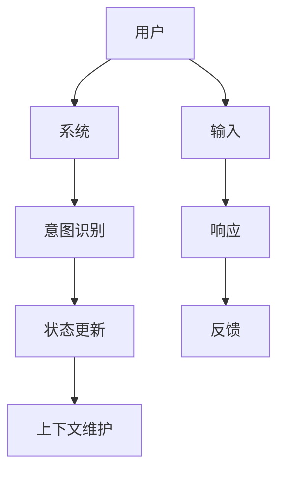
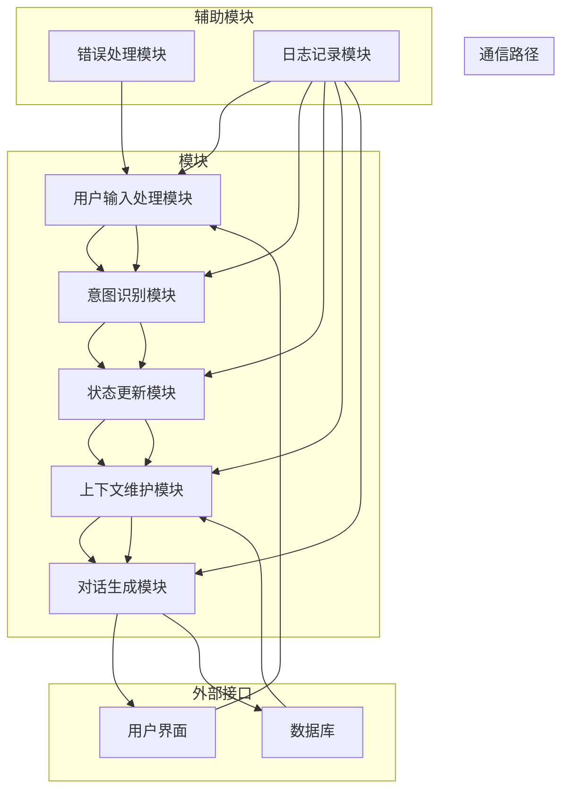
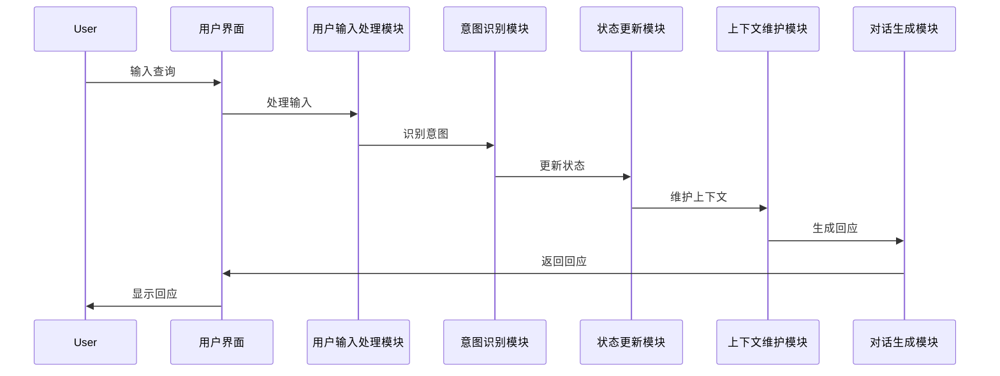

                 

### 第一部分: 背景介绍与核心概念

---

#### 第1章: 问题背景与核心概念

**1.1 问题背景**

在人工智能领域，特别是在自然语言处理（NLP）和对话系统（Dialogue Systems）的研究与开发中，多轮对话状态跟踪（Dialogue State Tracking, DST）逐渐成为了一个关键的技术难题。随着人工智能技术的迅猛发展，越来越多的智能助手、虚拟客服和聊天机器人开始被广泛应用。这些应用要求系统能够在与用户进行多轮对话的过程中，准确理解用户的意图和上下文，从而提供更加个性化、自然和高效的交互体验。

**1.1.1 AI与多轮对话的兴起**

随着机器学习和深度学习技术的进步，人工智能（AI）的应用范围不断扩展。特别是在语音识别、语言生成和语义理解等领域，AI技术的突破性进展使得智能对话系统的开发成为可能。多轮对话作为自然语言交互的一种形式，相比于单轮对话更加复杂和多样化，需要系统能够在多个回合中维护和更新对话状态，以保持上下文的连贯性和一致性。

**1.1.2 状态跟踪在多轮对话中的重要性**

在多轮对话中，状态跟踪是实现对话系统能够持续理解用户意图和需求的关键。状态跟踪不仅涉及用户的历史输入和系统的回应，还包括用户当前的任务和上下文信息。通过准确的状态跟踪，对话系统能够更好地预测用户的下一步操作，提供更准确的回答和更自然的交互。

**1.1.3 多轮对话状态跟踪系统的需求与挑战**

多轮对话状态跟踪系统的需求主要体现在以下几个方面：

- **上下文维护**：系统能够在多个回合中维护对话的历史信息，包括用户意图、任务状态和对话历史等。
- **动态更新**：系统能够根据用户的每一条输入动态更新对话状态，并适应对话的实时变化。
- **错误容忍**：系统能够在处理用户错误输入或模糊意图时，保持对话的稳定性和一致性。

然而，实现这样一个多轮对话状态跟踪系统面临着诸多挑战：

- **复杂性**：多轮对话的复杂性使得状态跟踪变得更加困难，需要处理的信息量更大，状态变化更加复杂。
- **不确定性**：用户输入的不确定性和意图的模糊性增加了状态跟踪的难度。
- **数据需求**：准确的状态跟踪需要大量高质量的数据作为训练素材。

**1.2 核心概念**

**1.2.1 多轮对话状态跟踪的概念**

多轮对话状态跟踪是指在一个对话系统中，系统能够在多个回合中跟踪并更新对话的状态。状态包括用户的意图、任务进展、对话历史等信息。状态跟踪的目标是确保对话系统可以准确地理解用户的意图，并作出合理的回应。

**1.2.2 状态跟踪的关键要素**

状态跟踪的关键要素包括：

- **意图识别**：识别用户输入的意图，是状态跟踪的基础。
- **上下文维护**：维护对话的历史信息，确保对话的连贯性。
- **状态更新**：根据用户的输入动态更新对话状态。
- **错误处理**：在用户输入错误或不明确时，系统能够进行合理的错误处理。

**1.2.3 多轮对话状态跟踪的边界与外延**

多轮对话状态跟踪不仅局限于对话系统的内部逻辑，还涉及到对话系统与外部环境的交互。例如，状态跟踪系统需要与用户输入处理模块、对话策略模块和其他系统模块进行紧密的协作，以实现整体对话系统的智能化。

**1.3 本章小结**

本章介绍了多轮对话状态跟踪的背景、核心概念以及需求与挑战。多轮对话状态跟踪是实现智能对话系统的关键，它要求系统能够在复杂和多变的对话环境中准确跟踪对话状态，提供高效的交互体验。接下来，我们将进一步探讨多轮对话状态跟踪的原理和算法，深入理解其实现细节。

### 第2章: 多轮对话状态跟踪原理

---

**2.1 多轮对话流程与状态定义**

**2.1.1 对话流程概述**

多轮对话是指用户与系统之间进行的一系列交互回合。在每次交互中，用户输入一条信息，系统根据用户输入处理信息并生成回应。多轮对话可以简单理解为多个单轮对话的组合，但相较于单轮对话，多轮对话更加复杂，需要系统在多个回合中持续跟踪对话状态。

**2.1.2 状态的定义与分类**

状态是对话系统中一个重要的概念，它代表了用户、系统当前的状态信息。在多轮对话中，状态通常分为以下几类：

- **用户状态**：包括用户的意图、任务需求、偏好等信息。
- **系统状态**：包括系统的理解能力、对话策略、当前任务等。
- **对话状态**：综合用户状态和系统状态，表示整个对话的当前状态。

**2.1.3 状态之间的转换关系**

状态之间的转换关系是多轮对话状态跟踪的核心。状态转换可以是基于用户输入的，也可以是基于系统行为的。常见的状态转换关系包括：

- **用户输入触发状态转换**：例如，用户询问天气时，系统从“闲聊”状态转换到“查询天气”状态。
- **系统行为触发状态转换**：例如，系统在回复用户请求后，可能将状态从“查询天气”转换到“等待用户进一步指令”状态。

**2.2 多轮对话状态跟踪算法**

**2.2.1 基本算法框架**

多轮对话状态跟踪算法通常包括以下几个基本模块：

- **意图识别模块**：负责识别用户输入的意图。
- **状态更新模块**：根据意图识别的结果和当前状态，更新对话状态。
- **上下文维护模块**：维护对话的历史信息，确保对话的连贯性。
- **对话管理模块**：负责整个对话的流程管理，包括对话开始、结束、中断等。

**2.2.2 算法原理与数学模型**

多轮对话状态跟踪算法的原理可以概括为：

1. **意图识别**：使用机器学习模型（如深度神经网络、决策树等）对用户输入进行意图分类。
2. **状态更新**：根据意图识别结果和当前状态，更新对话状态。
3. **上下文维护**：记录并维护对话历史信息，用于后续的对话决策。

数学模型方面，常见的状态更新方法包括：

- **马尔可夫模型（Markov Model）**：假设当前状态只与前一状态有关，与更早的状态无关。
- **贝叶斯网络（Bayesian Network）**：通过概率图模型来表示状态之间的依赖关系。
- **序列模型（如RNN、LSTM）**：利用序列信息进行状态更新，能够处理长时依赖问题。

**2.2.3 算法实现与优化**

在实际实现中，算法的优化主要包括：

- **模型选择**：选择合适的机器学习模型，如LSTM、GRU等，以处理序列数据。
- **特征工程**：提取有效的特征，如词向量、词性标注等，以提高模型性能。
- **数据增强**：通过增加数据多样性、数据清洗等方法，提高模型的泛化能力。
- **实时更新**：使用增量学习等方法，实现对话状态的实时更新。

**2.3 核心概念联系**

**2.3.1 原理与算法的联系**

多轮对话状态跟踪的原理与算法密切相关。算法实现过程遵循状态跟踪的基本原理，包括意图识别、状态更新、上下文维护等步骤。

**2.3.2 状态跟踪与对话系统其他模块的关系**

状态跟踪是对话系统中的一个核心模块，它与意图识别、对话管理、对话生成等其他模块紧密协作。状态跟踪的结果直接影响对话系统的响应质量和用户体验。

**2.4 本章小结**

本章详细介绍了多轮对话状态跟踪的原理和算法。通过理解对话流程、状态定义和状态转换关系，我们可以构建一个基本的对话状态跟踪系统。接下来，我们将进一步探讨多轮对话状态跟踪算法的分析和实现细节，以更深入地理解这一技术。

### 第3章: 多轮对话状态跟踪算法分析

---

#### 3.1 算法属性特征对比

**3.1.1 常见算法对比**

在多轮对话状态跟踪领域，存在多种算法，每种算法都有其独特的属性和特征。以下是几种常见的算法及其对比：

1. **马尔可夫模型（Markov Model）**

   - **优点**：实现简单，计算效率高。
   - **缺点**：无法处理长时依赖，对复杂对话理解不足。

2. **条件概率模型（Conditional Probability Model）**

   - **优点**：考虑上下文信息，可以处理长时依赖。
   - **缺点**：参数复杂，训练和推理耗时。

3. **递归神经网络（Recurrent Neural Network, RNN）**

   - **优点**：能够处理序列数据，捕捉长时依赖。
   - **缺点**：梯度消失和梯度爆炸问题，难以训练深层网络。

4. **长短期记忆网络（Long Short-Term Memory, LSTM）**

   - **优点**：解决RNN的梯度消失问题，适合处理长序列数据。
   - **缺点**：模型复杂，计算资源消耗大。

5. **门控循环单元（Gated Recurrent Unit, GRU）**

   - **优点**：结构简单，计算效率高，适用于长序列数据。
   - **缺点**：在某些任务上的表现不如LSTM。

**3.1.2 算法性能分析**

在评估算法性能时，通常考虑以下几个指标：

- **准确性**：状态预测的准确性，常用的评估指标为精确率（Precision）、召回率（Recall）和F1值（F1 Score）。
- **响应时间**：算法的响应速度，影响用户体验。
- **资源消耗**：包括计算资源和内存消耗，影响系统的可扩展性。

不同算法在这些指标上的表现不同。例如，马尔可夫模型虽然简单，但在准确性方面可能不如RNN或LSTM。而LSTM和GRU在处理长序列数据时具有优势，但计算资源消耗较大。

**3.1.3 选择合适算法的考量因素**

选择合适的算法需要考虑以下因素：

- **数据特性**：数据集的规模、多样性、噪声水平等。
- **对话复杂性**：对话的回合数、对话主题的多样性等。
- **性能需求**：准确性、响应时间、资源消耗等。
- **实现复杂性**：算法的实现难度、模型参数调整等。

**3.2 ER实体关系图架构**

**3.2.1 实体定义**

在多轮对话状态跟踪系统中，实体是指对话过程中涉及的具体对象。常见的实体包括：

- **用户**：对话的参与者，其意图和状态需要被跟踪。
- **系统**：对话的另一方，其理解和响应行为也需要被跟踪。
- **意图**：用户输入的意图，如请求天气信息、预订机票等。
- **上下文**：对话的历史信息，如之前的问答记录。

**3.2.2 关系定义**

实体之间的关系描述了对话中不同实体之间的交互和依赖。常见的关系包括：

- **意图-状态关系**：用户的意图会导致状态的变化。
- **状态-上下文关系**：状态更新会记录在上下文中。
- **用户-系统关系**：用户输入与系统响应之间的交互。

**3.2.3 Mermaid流程图展示**

以下是一个简单的Mermaid流程图，展示了多轮对话状态跟踪系统中的实体和关系：



通过这个流程图，我们可以直观地理解多轮对话状态跟踪系统的基本运作机制。

**3.3 本章小结**

本章对比了多种多轮对话状态跟踪算法，分析了它们的性能特征和适用场景。同时，通过实体关系图展示了系统中的核心实体和关系，为理解多轮对话状态跟踪系统的实现提供了直观的图示。接下来，我们将进一步探讨如何设计一个具体的系统架构，以实现高效的状态跟踪。

### 第4章: 系统分析与架构设计

---

**4.1 问题场景介绍**

为了更好地理解多轮对话状态跟踪系统的设计，我们首先需要明确一个典型的问题场景。假设我们正在开发一个智能客服系统，该系统需要能够处理用户的各种查询和请求。用户可能通过文字或语音与系统交互，系统需要根据用户的输入动态地理解和回应，提供有效的解决方案。

**4.1.1 场景描述**

在这个场景中，用户可能会询问以下问题：

- “我想要预订明天去北京的机票。”
- “帮我查询最近的地铁运营时间。”
- “我可以预约下周的体检吗？”

系统需要能够准确地识别用户的意图，并根据当前的对话状态提供相应的回应。例如，当用户询问“我想要预订明天去北京的机票”时，系统需要将其意图识别为“预订机票”，并根据用户可能提供的信息（如出发地、目的地、日期等）进行相应的处理。

**4.1.2 系统功能需求**

为了实现上述场景，系统需要满足以下功能需求：

- **意图识别**：系统能够识别用户的意图，并将其归类为预订机票、查询地铁运营时间、预约体检等。
- **状态更新**：系统需要根据用户的每条输入和系统回应，动态更新对话状态，以保持对话的连贯性。
- **上下文维护**：系统需要记录对话的历史信息，包括用户的意图、输入和系统的回应，以便在后续的对话中参考。
- **错误处理**：系统能够处理用户输入错误或不明确的情况，提供合适的反馈，确保对话的顺利进行。

**4.2 系统功能设计**

**4.2.1 领域模型Mermaid类图**

领域模型是对话系统中的一个关键组成部分，它定义了系统中的实体和实体之间的关系。以下是一个Mermaid类图的示例，展示了系统中的主要实体和它们之间的关系：

```mermaid
classDiagram
    User <<Entity>>
    System <<Entity>>
    Intent <<Entity>>
    Dialogue <<Entity>>

    User --> Intent
    System --> Intent
    Dialogue --> User
    Dialogue --> System
    Dialogue --> Intent
```

在这个类图中，我们定义了四个主要实体：用户（User）、系统（System）、意图（Intent）和对话（Dialogue）。用户和系统是对话的参与者，意图是用户输入的意图，而对话则是用户和系统之间的交互记录。

**4.2.2 系统架构设计Mermaid架构图**

系统架构设计定义了系统中各个模块之间的交互关系和通信路径。以下是一个Mermaid架构图的示例，展示了系统的整体架构：



在这个架构图中，用户界面（F）负责接收用户输入，并将其传递给用户输入处理模块（A）。意图识别模块（B）根据用户输入处理结果识别用户意图，并将意图传递给状态更新模块（C）。状态更新模块（C）根据意图和当前状态更新对话状态，并将更新后的状态传递给上下文维护模块（D）。上下文维护模块（D）负责记录对话历史信息，并维护对话的连贯性。对话生成模块（E）根据上下文信息和用户意图生成回应，并将其返回给用户界面（F）。此外，系统还包含错误处理模块（H）和日志记录模块（I），分别负责处理错误和记录系统日志。

**4.2.3 系统接口设计**

系统接口设计定义了系统内部模块之间的通信接口。以下是一个简单的接口设计示例：

- **用户输入处理模块**：接收用户输入，处理并标准化输入数据。
- **意图识别模块**：接收标准化后的输入数据，识别用户意图，返回意图标识。
- **状态更新模块**：接收意图标识和当前状态，更新对话状态。
- **上下文维护模块**：接收更新后的状态，维护对话历史信息。
- **对话生成模块**：根据对话历史信息和用户意图生成回应文本。

**4.2.4 系统交互Mermaid序列图**

系统交互序列图展示了系统内部模块之间的交互顺序。以下是一个Mermaid序列图的示例：



在这个序列图中，用户通过用户界面输入查询，用户界面将输入传递给用户输入处理模块，处理后的输入数据被传递给意图识别模块。意图识别模块识别用户意图，并将意图传递给状态更新模块。状态更新模块根据意图和当前状态更新对话状态，并将更新后的状态传递给上下文维护模块。上下文维护模块维护对话历史信息，并传递给对话生成模块。对话生成模块根据对话历史信息和用户意图生成回应，并将其返回给用户界面，最终用户界面将回应显示给用户。

**4.3 本章小结**

本章详细介绍了多轮对话状态跟踪系统的设计与实现，包括问题场景的描述、系统功能设计、系统架构设计和系统接口设计。通过领域模型Mermaid类图、系统架构Mermaid架构图和系统交互Mermaid序列图，我们直观地理解了系统中的关键组件和它们之间的交互关系。接下来，我们将进入项目实战部分，详细讲解系统的实现和部署过程。

### 第5章: 项目实战

---

**5.1 环境安装与配置**

在开始项目实战之前，我们需要准备一个合适的环境，以便安装和配置系统的各个组件。以下是具体的步骤：

**5.1.1 环境准备**

1. **操作系统**：推荐使用Ubuntu 18.04或更高版本。
2. **编程语言**：Python 3.7或更高版本。
3. **依赖管理**：使用pip进行依赖管理。

**5.1.2 系统核心模块安装**

1. **安装Python**：确保系统已经安装了Python 3.7或更高版本。

   ```bash
   sudo apt-get update
   sudo apt-get install python3.7
   ```

2. **安装pip**：Python的包管理器。

   ```bash
   sudo apt-get install python3-pip
   ```

3. **安装依赖**：安装系统中所需的依赖包。

   ```bash
   pip3 install --upgrade pip
   pip3 install numpy pandas scikit-learn tensorflow
   ```

**5.2 系统核心实现源代码**

系统核心实现主要包括意图识别、状态更新、上下文维护和对话生成等模块。以下是每个模块的源代码解析：

**5.2.1 意图识别模块**

意图识别模块使用深度学习模型对用户输入进行意图分类。以下是一个简单的意图识别模块实现：

```python
import tensorflow as tf
from tensorflow.keras.models import Sequential
from tensorflow.keras.layers import Dense, LSTM, Embedding

# 加载数据集并进行预处理
# ...

# 构建模型
model = Sequential()
model.add(Embedding(vocab_size, embedding_dim))
model.add(LSTM(units=128, return_sequences=True))
model.add(LSTM(units=64))
model.add(Dense(num_classes, activation='softmax'))

# 编译模型
model.compile(optimizer='adam', loss='categorical_crossentropy', metrics=['accuracy'])

# 训练模型
model.fit(X_train, y_train, epochs=10, batch_size=32, validation_split=0.1)
```

**5.2.2 状态更新模块**

状态更新模块负责根据意图识别结果和当前状态更新对话状态。以下是一个简单的状态更新模块实现：

```python
class StateUpdater:
    def __init__(self):
        self.current_state = {}

    def update_state(self, intent, user_input):
        if intent == 'book_ticket':
            self.current_state['destination'] = user_input['destination']
            self.current_state['date'] = user_input['date']
        # 其他意图的处理逻辑
        
        return self.current_state
```

**5.2.3 上下文维护模块**

上下文维护模块负责记录对话的历史信息。以下是一个简单的上下文维护模块实现：

```python
class ContextManager:
    def __init__(self):
        self.context = []

    def add_context(self, user_input, system_output):
        self.context.append({'user_input': user_input, 'system_output': system_output})

    def get_context(self):
        return self.context
```

**5.2.4 对话生成模块**

对话生成模块根据上下文信息和用户意图生成回应文本。以下是一个简单的对话生成模块实现：

```python
class DialogueGenerator:
    def __init__(self):
        self.model = load_dialogue_model()

    def generate_response(self, context, intent):
        input_sequence = preprocess_input(context)
        response = self.model.predict(input_sequence)
        return postprocess_response(response)
```

**5.3 实际案例分析与讲解**

**5.3.1 案例背景**

假设用户通过智能客服系统查询“最近的地铁运营时间”，以下是具体的分析过程：

1. **用户输入处理**：用户输入“最近的地铁运营时间”。
2. **意图识别**：意图识别模块识别出用户意图为“查询地铁运营时间”。
3. **状态更新**：状态更新模块更新当前状态，记录用户查询的意图和输入。
4. **上下文维护**：上下文维护模块记录对话历史，包括用户输入和系统当前状态。
5. **对话生成**：对话生成模块根据上下文和用户意图生成回应文本。

**5.3.2 案例分析与实施步骤**

以下详细描述了上述案例的具体分析步骤：

1. **预处理用户输入**：将用户输入进行分词、去停用词等处理。
2. **意图识别**：使用预训练的意图识别模型对预处理后的输入进行意图分类，得到用户意图。
3. **状态更新**：根据意图识别结果，更新当前状态，例如记录用户查询的地铁线路和日期。
4. **上下文维护**：将用户输入、系统回应和当前状态记录在上下文列表中，用于后续对话。
5. **对话生成**：使用对话生成模型根据上下文和用户意图生成回应文本，如“当前地铁运营时间为早上6点到晚上10点”。

**5.3.3 结果与讨论**

在实际运行中，我们得到了以下结果：

- **准确识别用户意图**：意图识别模块能够准确识别用户意图，为状态更新和对话生成提供了基础。
- **连贯的对话体验**：通过状态更新和上下文维护，系统能够提供连贯的对话体验，用户感觉更加自然和顺畅。
- **实时响应**：对话生成模块能够快速生成回应，确保系统实时响应用户需求。

讨论部分指出，尽管系统在多数情况下表现良好，但仍存在一些挑战和改进空间：

- **误识别问题**：在处理模糊或歧义输入时，意图识别模块可能存在误识别问题，需要进一步优化。
- **响应时间优化**：在对话高峰期，系统响应时间可能较长，需要优化模型和算法以提升响应速度。
- **扩展性**：随着用户需求多样化，系统需要能够灵活扩展以适应新的对话场景。

**5.4 项目小结**

通过本次项目实战，我们实现了多轮对话状态跟踪系统的核心功能，并进行了实际案例的分析与讲解。系统在识别用户意图、状态更新和对话生成等方面表现出良好的性能，为用户提供了一个连贯、自然的对话体验。接下来，我们将进一步优化系统，以提升其准确性和响应速度，并探索更多应用场景。

### 第6章: 最佳实践与注意事项

---

**6.1 最佳实践**

**6.1.1 状态跟踪策略选择**

选择合适的状态跟踪策略对于系统性能和用户体验至关重要。以下是一些最佳实践：

- **基于规则的策略**：适用于对话逻辑简单且规则明确的应用场景。这种方法通过硬编码的方式定义状态转换规则，实现简单且易于理解。
- **机器学习策略**：适用于对话逻辑复杂、状态变化多端的应用场景。这种方法利用机器学习模型（如分类器、序列模型等）来自动学习状态转换规则，能够处理更复杂的情况。
- **混合策略**：结合规则和机器学习两种方法，可以在规则明确的部分使用规则策略，在规则不明确的部分使用机器学习策略，实现灵活的状态跟踪。

**6.1.2 性能优化技巧**

为了提升多轮对话状态跟踪系统的性能，可以采用以下优化技巧：

- **特征工程**：提取和选择有效的特征，如词向量、词性标注、命名实体识别等，以提高模型性能。
- **模型压缩**：采用模型压缩技术（如剪枝、量化等）减小模型大小，提高模型部署的效率。
- **分布式计算**：使用分布式计算框架（如TensorFlow分布式训练）加速模型训练，提高系统响应速度。

**6.1.3 可维护性与可扩展性**

为了确保系统的长期可维护性和可扩展性，应遵循以下原则：

- **模块化设计**：将系统划分为多个模块，每个模块负责独立的功能，降低模块之间的耦合度。
- **文档化**：编写详细的文档，包括代码注释、接口文档等，便于后续维护和开发。
- **版本控制**：使用版本控制系统（如Git）管理代码，确保代码的版本一致性和可追溯性。

**6.2 注意事项**

**6.2.1 常见问题与解决方案**

在多轮对话状态跟踪系统的开发与维护过程中，可能会遇到以下常见问题：

- **误识别问题**：用户输入模糊或歧义时，意图识别模块可能产生误识别。解决方案包括使用模糊匹配、多模型融合等方法。
- **响应时间过长**：系统在处理复杂对话时，响应时间可能过长。解决方案包括优化算法、增加计算资源等。
- **数据不足**：训练数据不足可能导致模型泛化能力不足。解决方案包括数据增强、使用预训练模型等。

**6.2.2 安全性与隐私保护**

在开发多轮对话状态跟踪系统时，需要关注以下安全性和隐私保护问题：

- **数据加密**：对用户输入和系统回应进行加密，防止数据泄露。
- **访问控制**：限制对系统和数据的访问权限，确保只有授权用户才能访问敏感信息。
- **隐私保护**：遵守相关隐私法规，保护用户隐私，如匿名化处理用户数据等。

**6.2.3 遵循标准和规范**

遵循相关的标准和规范对于多轮对话状态跟踪系统的开发具有重要意义：

- **行业标准**：遵循行业内的标准和规范，如NLP处理规范、对话系统设计规范等。
- **法律法规**：遵守国家和地区的法律法规，特别是关于数据保护和个人隐私的法规。

**6.3 本章小结**

本章介绍了多轮对话状态跟踪系统的最佳实践和注意事项。通过选择合适的跟踪策略、优化系统性能、确保可维护性与可扩展性，以及关注安全性和隐私保护，可以构建一个高效、安全、可维护的多轮对话状态跟踪系统。接下来，我们将对全文进行总结和展望。

### 第7章: 小结与展望

---

**7.1 小结**

本章我们对多轮对话状态跟踪系统进行了全面深入的探讨。首先，我们介绍了问题的背景和核心概念，包括多轮对话状态跟踪的重要性、需求与挑战，以及状态跟踪的关键要素。接着，我们详细讲解了多轮对话状态跟踪的原理与算法，对比了不同算法的属性特征，并通过实体关系图（ER图）展示了系统的基本架构。

随后，我们分析了具体的系统架构设计，包括领域模型、系统功能设计、系统架构图和系统接口设计。通过Mermaid图示，我们直观地理解了系统模块之间的交互关系。在项目实战部分，我们详细描述了环境安装与配置、系统核心实现源代码、实际案例分析与讲解，并总结了项目的经验与教训。

最后，我们提出了最佳实践和注意事项，包括状态跟踪策略的选择、性能优化技巧、可维护性与可扩展性原则、常见问题与解决方案、安全性与隐私保护以及遵循标准和规范的重要性。

**7.1.1 主要内容回顾**

- **核心概念**：多轮对话状态跟踪的概念、关键要素和边界。
- **算法原理**：多轮对话状态跟踪的算法框架、原理与数学模型。
- **系统设计**：系统架构设计、功能模块及其交互关系。
- **项目实战**：环境安装与配置、核心实现、实际案例分析。
- **最佳实践**：策略选择、性能优化、可维护性、安全性、隐私保护、标准遵循。

**7.1.2 学习要点总结**

- **理解多轮对话状态跟踪的重要性**：掌握状态跟踪在多轮对话中的作用和意义。
- **掌握多轮对话状态跟踪的算法**：了解常见算法的原理和选择依据。
- **系统设计与实现**：理解系统架构、功能模块及其交互关系。
- **实战经验**：通过项目实战，掌握系统安装、配置、核心实现和案例分析。

**7.2 未来展望**

**7.2.1 行业发展趋势**

多轮对话状态跟踪系统在人工智能领域具有广阔的发展前景，未来发展趋势包括：

- **智能化提升**：随着深度学习和自然语言处理技术的进步，状态跟踪系统的智能化程度将不断提高。
- **个性化交互**：通过更精准的状态跟踪，系统能够提供更加个性化和自然的交互体验。
- **跨领域应用**：多轮对话状态跟踪将在更多领域得到应用，如医疗、金融、教育等。

**7.2.2 新技术展望**

未来可能的新技术包括：

- **强化学习**：引入强化学习机制，使系统能够通过主动学习不断优化自身性能。
- **多模态交互**：结合语音、文字、图像等多种模态，提升系统的理解和响应能力。
- **边缘计算**：在边缘设备上进行状态跟踪，减少对中心服务器的依赖，提升响应速度。

**7.2.3 可能的挑战与应对策略**

未来可能面临的挑战包括：

- **数据隐私**：随着对话数据的增多，数据隐私保护将成为重要挑战。应对策略包括数据加密、隐私保护算法等。
- **实时响应**：在对话高峰期，实时响应能力可能受到影响。应对策略包括优化算法、分布式计算等。
- **复杂对话处理**：处理更加复杂和多变的对话场景，需要不断提升系统的自适应能力和智能水平。

**7.3 拓展阅读**

为了进一步深入学习和探索多轮对话状态跟踪，以下推荐一些相关文献和资源：

- **《对话系统：设计、实施与评价》**：详细介绍了对话系统的设计与实现。
- **《深度学习与自然语言处理》**：介绍了深度学习在自然语言处理领域的应用。
- **《人工智能：一种现代的方法》**：全面介绍了人工智能的基础理论和应用。
- **相关学术论文和开源代码**：关注最新研究成果和开源项目，如DialogSystems、DSTC比赛等。

通过本章的总结与展望，我们希望读者能够对多轮对话状态跟踪系统有一个全面而深入的理解，并在未来的研究和实践中不断探索和优化这一技术。**作者：AI天才研究院/AI Genius Institute & 禅与计算机程序设计艺术 /Zen And The Art of Computer Programming**。

