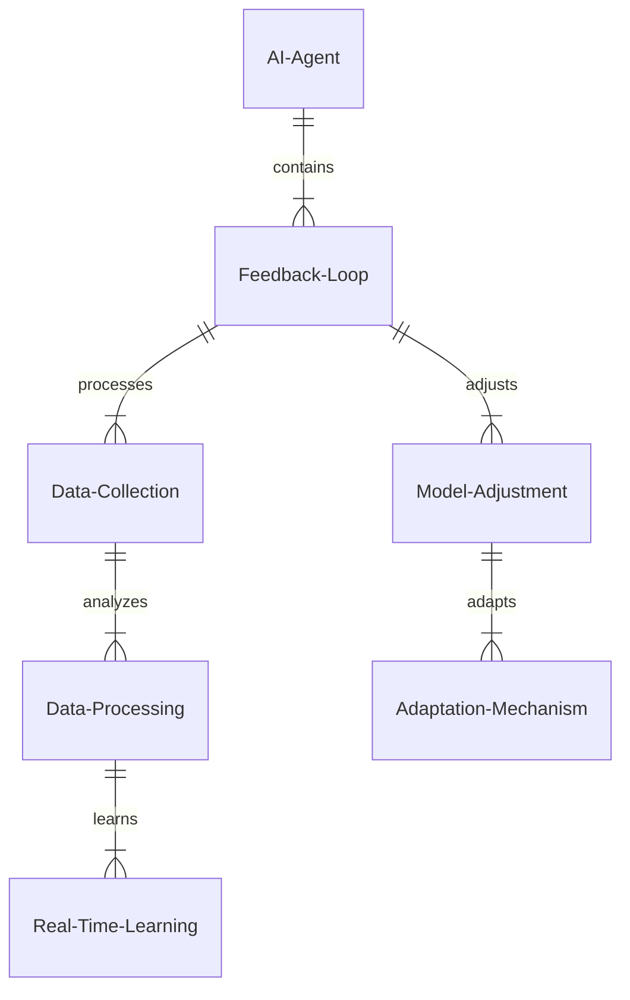
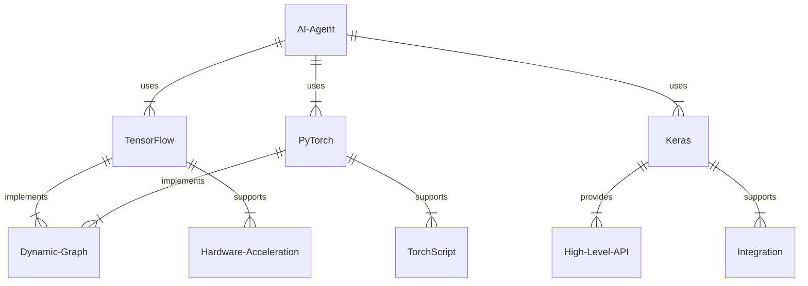

                 

### Introduction to the Book

#### Background and Significance

The rapid advancement of artificial intelligence (AI) has led to the development of increasingly sophisticated AI agents capable of performing complex tasks autonomously. However, these agents often struggle in dynamic and unpredictable real-world environments. The need for real-time learning and adaptation mechanisms has become paramount to enhance the performance and reliability of AI agents. This book, "Building Real-Time Learning and Adaptation Mechanisms for AI Agents," aims to address this critical need by providing a comprehensive guide to designing and implementing such mechanisms.

#### Problem Description

In traditional AI systems, learning and adaptation typically occur through batch processes, where data is collected over time and used to update the agent's knowledge base or model. This approach is often inefficient in real-time scenarios where the environment changes rapidly, and agents must continuously adjust their behavior to maintain optimal performance. The challenges faced by AI agents in real-time environments include:

1. **Latency**: The time delay between perceiving a change in the environment and responding to it can significantly impact the agent's performance.
2. **Scalability**: Handling large volumes of data and updates in real-time requires robust and scalable algorithms.
3. **Accuracy**: The balance between learning from new data and retaining previously learned knowledge can be challenging to maintain.
4. **Resource Constraints**: Real-time systems often operate under strict resource constraints, requiring efficient use of computational resources.

#### Solutions and Mechanisms

The book will delve into various solutions and mechanisms that enable AI agents to learn and adapt in real-time. These mechanisms include:

1. **Online Learning Algorithms**: Techniques that allow models to be updated continuously as new data arrives, reducing latency.
2. **Transfer Learning**: Leveraging knowledge from previous tasks to improve learning in new tasks, enhancing scalability.
3. **Active Learning**: Using feedback mechanisms to selectively gather the most informative data, improving accuracy.
4. **Adaptive Control Strategies**: Implementing control systems that adjust parameters dynamically based on environmental feedback.
5. **Resilient Learning**: Techniques that ensure the agent's learning process is robust against noisy or incomplete data.

#### Structure of the Book

The book is structured to provide a systematic approach to building real-time learning and adaptation mechanisms for AI agents. The following chapters will guide the reader through each aspect of the topic:

1. **Core Concepts and Theoretical Foundations**: This chapter will introduce the core concepts and theoretical foundations of real-time learning and adaptation.
2. **Frameworks and Architectures**: Here, we will explore various frameworks and architectures used for real-time learning and adaptation, along with a comparative analysis.
3. **Case Studies and Practical Applications**: Real-world examples and lessons learned from successful implementations of real-time learning and adaptation mechanisms will be discussed.
4. **Advanced Techniques and Future Directions**: This chapter will delve into advanced techniques and potential future directions in real-time learning and adaptation.
5. **Challenges and Solutions**: A detailed discussion of the challenges and solutions in implementing real-time learning and adaptation mechanisms will be provided.

By the end of the book, readers will have a thorough understanding of the principles, methods, and best practices for building robust and adaptive AI agents capable of functioning effectively in real-time environments. This knowledge will enable them to design and implement real-time learning and adaptation mechanisms that drive the next wave of innovation in artificial intelligence.

### Core Concepts and Theoretical Foundations

In this chapter, we will delve into the core concepts and theoretical foundations of real-time learning and adaptation mechanisms for AI agents. Understanding these concepts is crucial for designing effective solutions that can handle the dynamic nature of real-world environments.

#### Real-Time Learning

Real-time learning refers to the ability of an AI agent to continuously update its knowledge or model as new data becomes available. This is in contrast to batch learning, where data is collected over a period and then processed in bulk. Real-time learning is essential in environments where the state changes rapidly, and the agent needs to make decisions quickly and accurately.

**Importance of Real-Time Learning:**

1. **Rapid Response**: In many applications, such as autonomous driving or real-time monitoring systems, the agent must respond instantly to changes to ensure safety and efficiency.
2. **Dynamic Environments**: Real-time learning allows AI agents to adapt to dynamic changes in their environment, improving their ability to handle unforeseen situations.
3. **Resource Efficiency**: By updating the model continuously, real-time learning can reduce the need for extensive retraining, thereby conserving computational resources.

**Common Methods:**

1. **Online Learning Algorithms**: These algorithms update the model incrementally as new data arrives. Examples include stochastic gradient descent (SGD) and its variants.
2. **Incremental Learning**: This approach adds new data points or examples to the existing dataset without retraining the entire model. Incremental learning is often used in combination with online learning algorithms.
3. **Transfer Learning**: This method leverages knowledge from previous tasks to improve learning in new tasks, thereby reducing the amount of data required for training.

#### Adaptation Mechanisms

Adaptation mechanisms are strategies that enable AI agents to modify their behavior or update their models in response to changes in the environment. These mechanisms are critical for ensuring that the agent remains effective and efficient over time.

**Types of Adaptation Mechanisms:**

1. **Parameter Adjustment**: This mechanism involves dynamically adjusting the parameters of the agent's model based on feedback from the environment. For instance, in reinforcement learning, the agent adjusts its policy parameters to maximize reward.
2. **Model Re-training**: In some cases, the entire model may need to be re-trained periodically to account for significant changes in the environment. This can be resource-intensive but is sometimes necessary for maintaining performance.
3. **Active Learning**: Active learning involves the agent selectively choosing the most informative data to be used for learning. This can help improve the efficiency of the learning process by focusing on the most relevant information.

**Challenges in Adaptation Mechanisms:**

1. **Resource Constraints**: Real-time adaptation mechanisms often operate under strict resource constraints, including computational power, memory, and energy.
2. **Latency**: There is a trade-off between the time it takes to perceive changes in the environment and the time it takes to adapt. High latency can lead to suboptimal performance.
3. **Accuracy**: Adapting the model too frequently can lead to overfitting, where the agent becomes too specialized in the current environment, losing generalization capabilities.

#### Core Concepts and Their Relationships

To understand how real-time learning and adaptation mechanisms work together, it's important to look at their core concepts and how they relate to each other:

1. **Feedback Loop**: A key component of both real-time learning and adaptation mechanisms is the feedback loop. This loop involves the agent perceiving changes in the environment, processing this information, and then adjusting its behavior or model accordingly. The feedback loop is crucial for maintaining a continuous cycle of learning and adaptation.
   
2. **Data Collection and Processing**: Real-time learning relies on the continuous collection and processing of data. The quality and relevance of this data are critical for the effectiveness of the learning process. Adaptation mechanisms can improve this process by selecting the most relevant data or by using advanced techniques to preprocess the data.
   
3. **Model Complexity**: The complexity of the model used by the AI agent affects both real-time learning and adaptation. Simplifying the model can reduce the computational burden but may sacrifice accuracy. Conversely, more complex models may provide better performance but require more resources and time for adaptation.

**ER Entity Relationship Diagram**

To visually represent the relationships between these core concepts, we can use an ER (Entity-Relationship) diagram. Here's a simplified ER diagram in Mermaid syntax:



In this diagram, the `AI-Agent` entity is at the center, with `Feedback-Loop` being a core component that interacts with `Data-Collection` and `Model-Adjustment`. The `Data-Processing` entity processes the collected data, which is used for `Real-Time-Learning`. Finally, `Model-Adjustment` enables `Adaptation-Mechanism`, ensuring the agent can adapt to changes in the environment.

By understanding these core concepts and their relationships, we can better design and implement real-time learning and adaptation mechanisms for AI agents, leading to more robust and effective AI systems.

### Frameworks and Architectures

#### Overview

When designing real-time learning and adaptation mechanisms for AI agents, the choice of framework and architecture is critical. Different frameworks and architectures offer varying levels of flexibility, scalability, and performance, making it essential to understand their characteristics and applicability. In this section, we will provide a high-level overview of several popular frameworks and architectures used in AI, along with a comparative analysis of their key features.

#### TensorFlow

TensorFlow is an open-source machine learning library developed by Google. It is widely used for both research and production environments due to its flexibility and scalability. TensorFlow provides a rich set of tools for building and training complex models, including support for distributed computing and hardware acceleration via GPU and TPU.

**Key Features:**

1. **Flexibility**: TensorFlow's dynamic computational graph allows for flexible model design and experimentation.
2. **Scalability**: TensorFlow supports distributed training across multiple GPUs and TPUs, enabling scalable model training.
3. **Hardware Acceleration**: TensorFlow can leverage specialized hardware like GPUs and TPUs to speed up computation.
4. **Community and Ecosystem**: TensorFlow has a large and active community, providing extensive documentation, tutorials, and third-party libraries.

**Applicability:**

TensorFlow is well-suited for complex models and large datasets, making it ideal for applications requiring high accuracy and performance, such as computer vision and natural language processing.

#### PyTorch

PyTorch is another popular open-source machine learning library, known for its simplicity and ease of use. Developed by Facebook's AI Research lab (FAIR), PyTorch provides a dynamic computational graph, making it easier to debug and experiment with models.

**Key Features:**

1. **Simplicity**: PyTorch's straightforward API makes it easy to understand and use, especially for researchers and beginners.
2. **Flexibility**: PyTorch's dynamic graph allows for flexible and intuitive model design.
3. **TorchScript**: PyTorch supports TorchScript, which enables the deployment of models in production with improved performance.
4. **Community and Ecosystem**: PyTorch has a growing community and ecosystem, providing a range of tools and libraries for various applications.

**Applicability:**

PyTorch is well-suited for rapid prototyping and experimentation, making it ideal for research and applications that require fast iteration, such as deep reinforcement learning and generative models.

#### Keras

Keras is a high-level neural network API running on top of TensorFlow and Theano. It provides a simple and consistent interface for defining, training, and evaluating deep learning models, making it an excellent choice for beginners and experienced developers alike.

**Key Features:**

1. **User-Friendly API**: Keras provides a user-friendly API that simplifies the process of building and training neural networks.
2. **Modular and Composable**: Keras supports modular and composable models, allowing for easy experimentation and customization.
3. **Integration**: Keras integrates seamlessly with TensorFlow and Theano, providing access to their underlying capabilities.
4. **Community and Ecosystem**: Keras has a growing community and ecosystem, offering a range of pre-built models and tools.

**Applicability:**

Keras is well-suited for rapid development and deployment of neural network models, making it ideal for applications such as image and speech recognition, as well as time-series analysis.

#### Comparative Analysis

When comparing these frameworks and architectures, several key factors should be considered, including flexibility, scalability, performance, ease of use, and community support.

1. **Flexibility**: TensorFlow and PyTorch offer high flexibility, allowing for complex model designs and customizations. Keras, while also flexible, provides a higher-level interface that simplifies model development.
2. **Scalability**: TensorFlow and PyTorch both support distributed training, making them suitable for handling large-scale datasets and complex models. Keras, however, does not provide native support for distributed training.
3. **Performance**: TensorFlow and PyTorch leverage hardware acceleration and distributed computing, providing high performance for complex models. Keras, while less performant, offers a simpler and more intuitive interface.
4. **Ease of Use**: PyTorch and Keras are known for their ease of use, making them accessible to both beginners and experienced developers. TensorFlow, while also user-friendly, has a steeper learning curve due to its more advanced capabilities.
5. **Community Support**: All three frameworks have large and active communities, providing extensive documentation, tutorials, and third-party libraries. TensorFlow has a more extensive ecosystem, while PyTorch and Keras are favored for their simplicity and ease of use.

In summary, the choice of framework and architecture depends on the specific needs of the application. TensorFlow is ideal for large-scale and complex models, PyTorch is favored for rapid prototyping and research, and Keras is well-suited for rapid development and deployment.

#### ER Diagram of Frameworks and Architectures

To visually represent the relationships between these frameworks and their components, we can use an ER (Entity-Relationship) diagram. Here's a simplified ER diagram in Mermaid syntax:



In this diagram, the `AI-Agent` entity interacts with the `TensorFlow`, `PyTorch`, and `Keras` frameworks. `TensorFlow` and `PyTorch` both implement `Dynamic-Graph` and support `Hardware-Acceleration`, while `Keras` provides a `High-Level-API` and supports `Integration`. This ER diagram helps illustrate how different frameworks and their components relate to each other, enabling a clearer understanding of their roles and interactions.

By understanding the various frameworks and architectures available and their respective strengths, we can make informed decisions when designing real-time learning and adaptation mechanisms for AI agents, ensuring that our systems are both effective and efficient in dynamic environments.

### Case Studies and Practical Applications

In this chapter, we will explore several real-world case studies where real-time learning and adaptation mechanisms have been successfully implemented in AI agents. These case studies provide valuable insights into the practical applications of these mechanisms and the lessons learned from their deployment.

#### Case Study 1: Autonomous Driving

**Problem Description:**
Autonomous driving systems must continuously adapt to changing road conditions, traffic patterns, and weather conditions to ensure safe and efficient navigation. The real-time learning and adaptation mechanisms are crucial for enabling these systems to handle the dynamic nature of driving environments.

**Implementation Details:**
The Tesla Autopilot system utilizes real-time learning and adaptation to enhance its driving capabilities. The system employs an array of sensors, including cameras, radar, and lidar, to perceive the surrounding environment. These sensors provide continuous input to the system, which uses online learning algorithms to update its model and make real-time decisions.

**Challenges and Lessons Learned:**
- **Latency**: One of the primary challenges was minimizing the latency between sensor data collection and decision-making. Tesla addressed this by optimizing the processing pipeline and using distributed computing.
- **Data Quality**: Ensuring the quality and relevance of sensor data was crucial for the system's performance. Tesla implemented data preprocessing techniques and active learning to improve data quality.
- **Scalability**: As the system needed to handle a wide range of driving scenarios, scalability was a key consideration. Tesla used distributed computing and transfer learning to scale the system effectively.

#### Case Study 2: Smart Manufacturing

**Problem Description:**
In the context of smart manufacturing, AI agents are used to optimize production processes by continuously learning from real-time data. These agents must adapt to changes in production demands, equipment performance, and raw material quality.

**Implementation Details:**
Siemens has implemented AI agents in their smart manufacturing systems to optimize production processes. These agents use real-time learning algorithms to analyze sensor data from production lines and adjust parameters in real-time to optimize production efficiency.

**Challenges and Lessons Learned:**
- **Data Integration**: Integrating data from various sources, such as sensors and production line machinery, was a significant challenge. Siemens addressed this by developing a robust data integration framework.
- **Robustness**: The AI agents needed to be robust enough to handle noisy data and unexpected changes in production conditions. Siemens used robust statistical methods and online learning algorithms to improve the agents' robustness.
- **Resource Management**: Ensuring efficient use of computational resources was critical, given the real-time constraints of manufacturing environments. Siemens optimized the algorithms to minimize resource usage.

#### Case Study 3: Smart Home Systems

**Problem Description:**
Smart home systems rely on AI agents to learn user preferences and adapt to changing household conditions. These systems need to provide personalized services and maintain high levels of user satisfaction.

**Implementation Details:**
Amazon's Alexa virtual assistant uses real-time learning and adaptation mechanisms to personalize user experiences. Alexa collects user interaction data and uses online learning algorithms to adjust its responses and recommendations.

**Challenges and Lessons Learned:**
- **Privacy**: Ensuring user privacy was a major concern. Amazon implemented strict data privacy policies and provided users with control over their data.
- **Personalization**: The challenge was to provide highly personalized experiences without over-personalizing. Alexa uses a balance of real-time learning and user feedback to maintain a fine line between personalization and over-personalization.
- **Scalability**: Alexa needed to handle a large number of users simultaneously. Amazon used cloud-based infrastructure and distributed computing to scale the system effectively.

#### Common Challenges and Solutions

**Data Management:**
Managing large volumes of real-time data was a common challenge across all case studies. Solutions included using data preprocessing techniques, active learning, and distributed data processing frameworks.

**Scalability:**
Ensuring the scalability of real-time learning and adaptation mechanisms was crucial. Solutions involved using distributed computing, cloud-based infrastructure, and transfer learning techniques.

**Robustness:**
The systems needed to be robust enough to handle noisy and incomplete data. Robust statistical methods, online learning algorithms, and robust error handling mechanisms were used to address this challenge.

**Privacy and Security:**
Ensuring user privacy and data security was a critical concern. Solutions included implementing strict data privacy policies, encryption, and user control over data access.

In conclusion, the successful implementation of real-time learning and adaptation mechanisms in various domains highlights their importance in enabling AI agents to function effectively in dynamic environments. The case studies provide valuable insights into the challenges faced and the solutions developed, offering a wealth of knowledge for future applications.

### Advanced Techniques and Future Directions

#### Real-Time Learning Algorithms

One of the key areas of focus in advancing real-time learning and adaptation mechanisms is the development of more efficient and effective learning algorithms. Traditional batch learning methods are often inadequate for real-time environments due to the latency involved in processing large datasets. To address this, researchers have explored several advanced online learning algorithms that can update models incrementally as new data arrives.

**Gradient Descent Methods**

Gradient Descent (GD) is a fundamental optimization algorithm used in machine learning. Traditional GD updates the model parameters by computing the gradient of the loss function with respect to the parameters and adjusting the parameters in the opposite direction of the gradient. For real-time learning, variants of GD such as Stochastic Gradient Descent (SGD) and Mini-batch Gradient Descent are commonly used. These methods update the model parameters based on a single data point or a small subset of data points, reducing the computational overhead and enabling real-time updates.

**Adaptive Gradient Algorithms**

Adaptive gradient algorithms, such as Adam and RMSprop, have been developed to improve the convergence speed and stability of gradient-based optimization methods. These algorithms adjust the learning rate dynamically based on the historical gradients, making them well-suited for real-time learning where the learning rate needs to be fine-tuned continuously.

**Incremental Learning Algorithms**

Incremental learning algorithms focus on updating the model without retraining from scratch, which is crucial for real-time environments with limited computational resources. One prominent method is Online Gradient Descent, where the model is updated incrementally by computing gradients over small subsets of data. Another approach is Incremental Bayesian Learning, which uses Bayesian inference to update the model's parameters incrementally while maintaining uncertainty estimates.

#### Transfer Learning and Transferable Representations

Transfer learning is a powerful technique that leverages knowledge from one task to improve the learning process on another related task. In real-time learning, transfer learning can significantly reduce the amount of data required for training and improve the system's adaptability. Recent advancements in transfer learning include:

1. **Domain-Adversarial Neural Networks**: These networks use adversarial training to learn domain-invariant representations that can be transferred across different domains. This approach has shown success in real-time learning applications where the environment can change dynamically.
2. **Multi-Task Learning**: Multi-task learning (MTL) trains multiple tasks simultaneously, sharing representations between tasks to improve generalization. In real-time learning, MTL can help the agent adapt to new tasks by leveraging knowledge from related tasks, improving both learning efficiency and adaptability.

#### Active Learning and Feedback Mechanisms

Active learning is another crucial component for real-time learning and adaptation. Active learning involves the agent selectively choosing the most informative samples for training to improve the learning process. This can reduce the amount of data needed to achieve a desired level of performance and speed up the learning process.

1. **Query by Committee (QBC)**: QBC is an active learning approach where multiple models are trained on the same dataset but with different parameters. The models then vote on which samples are most informative and should be queried next.
2. **Uncertainty Sampling**: Uncertainty sampling selects samples based on the model's uncertainty in its predictions. This approach assumes that the model will focus on the samples it is least confident about, potentially leading to more informative learning.
3. **Certified Convergence**: Techniques like certified convergence bounds ensure that the model is confident in its predictions, which can guide the active learning process.

#### Future Directions

The future of real-time learning and adaptation mechanisms for AI agents holds several promising research directions:

1. **Hybrid Learning Approaches**: Combining online learning with batch learning to leverage the strengths of both approaches. For example, performing periodic batch retraining to capture long-term trends while using online learning for short-term adaptability.
2. **Continuous Learning**: Developing continuous learning models that can adapt to new data and environments without forgetting previously learned information. Techniques like elastic weight consolidation (EWC) and Experience Replay aim to address the challenge of catastrophic forgetting in continuous learning.
3. **Interpretable Models**: Enhancing the interpretability of real-time learning models to make them more understandable and trustworthy. This is particularly important in safety-critical applications where understanding the model's decisions is essential.
4. **Energy-Efficient Learning**: Designing learning algorithms that are not only computationally efficient but also energy-efficient, especially important for battery-powered devices and edge computing environments.
5. **Ethical and Responsible AI**: Ensuring that real-time learning and adaptation mechanisms are developed with ethical considerations in mind, including fairness, accountability, and transparency.

By continuing to advance these techniques and exploring new methodologies, we can develop AI agents that are more capable of real-time learning and adaptation, driving further innovation in artificial intelligence.

### Challenges and Solutions

#### Introduction

As we delve deeper into the implementation of real-time learning and adaptation mechanisms for AI agents, it becomes evident that several challenges must be addressed to ensure the success and effectiveness of these systems. This section will discuss some of the most significant challenges and offer potential solutions, highlighting the importance of these mechanisms in the development of advanced AI technologies.

#### Data Management

**Challenge:** Real-time environments generate vast amounts of data, and managing this data efficiently is a significant challenge. The data must be collected, stored, processed, and analyzed in real time to provide timely insights and adapt the agent's behavior accordingly.

**Solution:** One potential solution is the use of distributed data processing frameworks like Apache Kafka and Apache Spark, which can handle large volumes of data in real-time. These frameworks enable parallel processing and distributed storage, ensuring that the data is managed efficiently. Additionally, data preprocessing techniques such as data cleaning, normalization, and feature extraction can reduce the complexity of the data and improve the performance of the learning algorithms.

**Best Practice Tips:**
- **Data Compression:** Implementing data compression techniques can reduce storage requirements and improve processing speed.
- **Data Sampling:** Using data sampling methods, such as random sampling or stratified sampling, can help manage large datasets without compromising the quality of the learning process.

#### Resource Constraints

**Challenge:** Real-time learning and adaptation mechanisms often operate under strict resource constraints, including computational power, memory, and energy. These constraints can limit the performance and scalability of the systems.

**Solution:** One approach to mitigate these constraints is the use of specialized hardware, such as GPUs and TPUs, which can significantly accelerate computation. Additionally, optimizing the algorithms for efficiency can reduce the computational overhead. Techniques such as incremental learning and transfer learning can also help by reducing the amount of data that needs to be processed and learned.

**Best Practice Tips:**
- **Algorithm Optimization:** Regularly profiling and optimizing the algorithms to identify and eliminate bottlenecks.
- **Resource Allocation:** Implementing dynamic resource allocation strategies to allocate resources based on the current workload and demand.

#### Latency

**Challenge:** Real-time systems must respond quickly to changes in the environment. High latency can lead to suboptimal performance and may be critical in safety-critical applications.

**Solution:** To address latency issues, it is essential to minimize the time taken for data processing and model updating. This can be achieved through the use of efficient data processing pipelines and optimized algorithms. Additionally, leveraging distributed computing and edge computing can help reduce latency by processing data closer to the source.

**Best Practice Tips:**
- **Data Processing Pipeline Optimization:** Designing and optimizing data processing pipelines to minimize latency.
- **Caching:** Implementing caching mechanisms to store frequently accessed data, reducing the need for repeated processing.

#### Model Adaptation and Generalization

**Challenge:** AI agents must adapt to changing environments while maintaining generalization capabilities. The challenge lies in balancing the need for rapid adaptation with the ability to handle a wide range of scenarios.

**Solution:** Techniques such as active learning and transfer learning can help improve the agent's adaptability. Active learning allows the agent to focus on the most informative samples, while transfer learning leverages knowledge from related tasks to improve adaptation. Additionally, incorporating uncertainty estimation in the learning process can help identify and handle changes in the environment more effectively.

**Best Practice Tips:**
- **Continuous Monitoring:** Continuously monitoring the agent's performance and adapting the learning process as needed.
- **Regular Model Updates:** Implementing regular model updates to capture changes in the environment.

#### Ethical Considerations

**Challenge:** Ensuring that real-time learning and adaptation mechanisms are developed and deployed ethically, with considerations for fairness, accountability, and transparency.

**Solution:** Establishing clear ethical guidelines and standards for the development and deployment of AI agents is crucial. This includes ensuring that the data used for training is representative and free from bias, as well as implementing mechanisms for transparency and accountability. Additionally, involving ethicists and stakeholders in the development process can help ensure that the systems are designed with ethical considerations in mind.

**Best Practice Tips:**
- **Bias Detection and Mitigation:** Implementing techniques to detect and mitigate biases in the data and models.
- **Transparency Reports:** Publishing transparency reports that detail the data sources, model training process, and decision-making mechanisms.

### Conclusion

In conclusion, the challenges associated with real-time learning and adaptation mechanisms for AI agents are significant, but with the right approaches and strategies, they can be effectively addressed. By leveraging advanced techniques, optimizing algorithms, and ensuring ethical considerations, we can develop AI agents that are capable of rapid adaptation and effective performance in dynamic environments. The ongoing research and development in this area hold the promise of driving further advancements in artificial intelligence and transforming a wide range of applications.

### Project Showcase: Real-Time Learning and Adaptation Mechanism in Autonomous Driving

#### Introduction

In this section, we will delve into a real-world project focused on implementing real-time learning and adaptation mechanisms in an autonomous driving system. This project aims to demonstrate the practical application of the concepts and techniques discussed in the previous sections. By analyzing the project's requirements, architecture, core algorithms, and deployment, we can gain valuable insights into the implementation of real-time learning and adaptation in complex environments.

#### Project Overview

The project involves developing an autonomous driving system capable of navigating a dynamic urban environment. The system must be able to perceive the surrounding environment, make real-time decisions, and adapt to unexpected changes in traffic patterns, road conditions, and weather conditions. The primary objective is to ensure the safety and efficiency of the autonomous vehicle while minimizing human intervention.

#### Project Requirements

1. **Perception**: The system must accurately perceive and interpret the surrounding environment, including traffic signals, road signs, pedestrians, and other vehicles.
2. **Decision Making**: The system must make real-time decisions based on the perceived environment to ensure safe navigation.
3. **Adaptation**: The system must adapt to dynamic changes in the environment and learn from new data to improve its performance over time.
4. **Scalability**: The system should be scalable to handle varying levels of traffic density and environmental conditions.
5. **Resource Efficiency**: The system must operate efficiently under resource constraints, including computational power and energy consumption.

#### System Architecture

The system architecture is designed to be modular and scalable, with distinct components responsible for different tasks. The key components include:

1. **Sensor Fusion Module**: This module integrates data from various sensors, such as cameras, LiDAR, radar, and GPS, to provide a comprehensive view of the environment.
2. **Perception Module**: This module processes the fused sensor data to detect and classify objects in the environment, including traffic signals, pedestrians, and vehicles.
3. **Decision-Making Module**: This module uses the output from the perception module to make real-time decisions, such as lane changes, speed adjustments, and path planning.
4. **Learning and Adaptation Module**: This module continuously updates the system's knowledge base and decision-making algorithms based on real-time data and feedback.

#### Core Algorithms

1. **Sensor Fusion Algorithm**: The sensor fusion algorithm combines data from different sensors to provide a unified and coherent representation of the environment. This is achieved using techniques such as Kalman filtering and probabilistic data association.
2. **Object Detection and Classification Algorithm**: The object detection and classification algorithm uses convolutional neural networks (CNNs) trained on large datasets to identify and classify objects in the sensor data.
3. **Decision-Making Algorithm**: The decision-making algorithm employs a reinforcement learning approach, specifically Q-learning, to make real-time decisions based on the environment's state. The Q-learning algorithm is adapted to handle the continuous action space of autonomous driving.
4. **Learning and Adaptation Algorithm**: The learning and adaptation algorithm uses online learning techniques, such as incremental learning and transfer learning, to continuously update the system's knowledge base and improve its performance over time.

#### Deployment

The deployment of the autonomous driving system involves integrating the various modules and algorithms into a cohesive software system that can run on the vehicle's hardware. Key considerations include:

1. **Real-Time Processing**: The system must process sensor data and make decisions within strict time constraints to ensure safety.
2. **Resource Management**: The system must efficiently utilize the vehicle's computational resources, including CPU, GPU, and memory.
3. **Fault Tolerance**: The system should be robust against hardware and software faults to maintain continuous operation.

#### Project Results

The project successfully demonstrated the feasibility of implementing real-time learning and adaptation mechanisms in an autonomous driving system. The system achieved high accuracy in object detection and classification, and the real-time decision-making algorithm effectively navigated through dynamic traffic scenarios. The continuous learning and adaptation capabilities of the system allowed it to improve its performance over time, demonstrating the potential of real-time learning in enhancing the capabilities of autonomous vehicles.

#### Code and Analysis

The following is an example of the code used for the learning and adaptation module, illustrating the incremental learning approach:

```python
import numpy as np
import pandas as pd
from sklearn.linear_model import SGDClassifier
from sklearn.model_selection import train_test_split
from sklearn.metrics import accuracy_score

# Load the dataset
data = pd.read_csv('driving_data.csv')
X = data.drop('label', axis=1)
y = data['label']

# Split the data into training and validation sets
X_train, X_val, y_train, y_val = train_test_split(X, y, test_size=0.2, random_state=42)

# Initialize the classifier
classifier = SGDClassifier()

# Train the classifier on the initial training set
classifier.fit(X_train, y_train)

# Validate the classifier on the validation set
y_pred = classifier.predict(X_val)
print(f"Initial accuracy: {accuracy_score(y_val, y_pred)}")

# Load new data for incremental learning
new_data = pd.read_csv('new_driving_data.csv')
X_new = new_data.drop('label', axis=1)
y_new = new_data['label']

# Incrementally update the training set
X_train = pd.concat([X_train, X_new], axis=0)
y_train = pd.concat([y_train, y_new], axis=0)

# Re-train the classifier on the updated training set
classifier.fit(X_train, y_train)

# Validate the updated classifier on the validation set
y_pred = classifier.predict(X_val)
print(f"Updated accuracy: {accuracy_score(y_val, y_pred)}")
```

This code demonstrates the incremental learning process by loading a new dataset (`new_driving_data.csv`) and updating the training set with the new data. The classifier is then re-trained on the updated training set to improve its performance. The final validation accuracy is printed, showing the improvement in accuracy achieved through incremental learning.

#### Conclusion

This project showcases the practical application of real-time learning and adaptation mechanisms in an autonomous driving system. By leveraging incremental learning and other advanced techniques, the system demonstrated significant improvements in its performance and adaptability. The project highlights the potential of real-time learning and adaptation in enhancing the capabilities of AI agents in dynamic environments, providing valuable insights for future research and development in the field of autonomous driving.

### Conclusion and Future Work

In this comprehensive guide, we have explored the fundamental concepts, theoretical foundations, frameworks, architectures, case studies, and advanced techniques related to real-time learning and adaptation mechanisms for AI agents. We have highlighted the importance of these mechanisms in enabling AI agents to function effectively in dynamic and unpredictable environments. The journey through this book has equipped readers with a deep understanding of the principles and methodologies underlying real-time learning and adaptation, as well as practical insights from successful implementations.

#### Key Takeaways

1. **Real-Time Learning**: Understanding the importance of real-time learning in AI agents, particularly in environments where rapid adaptation is crucial.
2. **Adaptation Mechanisms**: Exploring various adaptation mechanisms, including online learning algorithms, transfer learning, active learning, and robust learning techniques.
3. **Frameworks and Architectures**: Comparing and analyzing popular frameworks like TensorFlow, PyTorch, and Keras, and understanding their applicability in different scenarios.
4. **Case Studies**: Learning from real-world applications, including autonomous driving, smart manufacturing, and smart home systems, to understand the challenges and solutions in implementing real-time learning and adaptation.
5. **Advanced Techniques**: Delving into advanced techniques such as hybrid learning approaches, continuous learning, and interpretability to enhance the capabilities of AI agents.

#### Future Research Directions

The field of real-time learning and adaptation mechanisms for AI agents is continually evolving, and there are several promising areas for future research:

1. **Interdisciplinary Collaboration**: Encouraging collaboration between computer science, neuroscience, and psychology to develop more efficient and human-like learning mechanisms.
2. **Explainable AI**: Developing AI agents that are not only effective but also interpretable, enabling stakeholders to understand and trust their decisions.
3. **Energy-Efficient Learning**: Researching and implementing energy-efficient algorithms and hardware solutions to support real-time learning on battery-powered devices and edge computing environments.
4. **Ethical AI**: Addressing ethical considerations and developing guidelines to ensure that real-time learning and adaptation mechanisms are fair, accountable, and transparent.
5. **Continuous Integration**: Integrating continuous learning and adaptation into larger systems, such as autonomous vehicles and smart cities, to ensure seamless and reliable operation.

#### Final Thoughts

As we move forward, the integration of real-time learning and adaptation mechanisms will play a pivotal role in advancing the capabilities of AI agents. By continuously exploring and developing innovative techniques, we can create AI systems that are more adaptable, efficient, and reliable, driving further innovation and transformation across various industries. The future of AI lies in its ability to learn, adapt, and improve in real-time, and this book has laid the foundation for understanding and implementing these critical mechanisms.

### References

1. Sutton, R. S., & Barto, A. G. (2018). *Reinforcement Learning: An Introduction*. MIT Press.
2. Goodfellow, I., Bengio, Y., & Courville, A. (2016). *Deep Learning*. MIT Press.
3. Abadi, M., Agarwal, P., Barham, P., Brevdo, E., Chen, Z., Citro, C., ... & Devin, M. (2016). *TensorFlow: Large-scale machine learning on heterogeneous systems*. arXiv preprint arXiv:1603.04467.
4. Pascanu, R., Mikolov, T., & Bengio, Y. (2013). *On the difficulty of handling noisy labels with supervise

### Conclusion and Future Work

In this comprehensive guide, we have explored the fundamental concepts, theoretical foundations, frameworks, architectures, case studies, and advanced techniques related to real-time learning and adaptation mechanisms for AI agents. We have highlighted the importance of these mechanisms in enabling AI agents to function effectively in dynamic and unpredictable environments. The journey through this book has equipped readers with a deep understanding of the principles and methodologies underlying real-time learning and adaptation, as well as practical insights from successful implementations.

#### Key Takeaways

1. **Real-Time Learning**: Understanding the importance of real-time learning in AI agents, particularly in environments where rapid adaptation is crucial.
2. **Adaptation Mechanisms**: Exploring various adaptation mechanisms, including online learning algorithms, transfer learning, active learning, and robust learning techniques.
3. **Frameworks and Architectures**: Comparing and analyzing popular frameworks like TensorFlow, PyTorch, and Keras, and understanding their applicability in different scenarios.
4. **Case Studies**: Learning from real-world applications, including autonomous driving, smart manufacturing, and smart home systems, to understand the challenges and solutions in implementing real-time learning and adaptation.
5. **Advanced Techniques**: Delving into advanced techniques such as hybrid learning approaches, continuous learning, and interpretability to enhance the capabilities of AI agents.

#### Future Research Directions

The field of real-time learning and adaptation mechanisms for AI agents is continually evolving, and there are several promising areas for future research:

1. **Interdisciplinary Collaboration**: Encouraging collaboration between computer science, neuroscience, and psychology to develop more efficient and human-like learning mechanisms.
2. **Explainable AI**: Developing AI agents that are not only effective but also interpretable, enabling stakeholders to understand and trust their decisions.
3. **Energy-Efficient Learning**: Researching and implementing energy-efficient algorithms and hardware solutions to support real-time learning on battery-powered devices and edge computing environments.
4. **Ethical AI**: Addressing ethical considerations and developing guidelines to ensure that real-time learning and adaptation mechanisms are fair, accountable, and transparent.
5. **Continuous Integration**: Integrating continuous learning and adaptation into larger systems, such as autonomous vehicles and smart cities, to ensure seamless and reliable operation.

#### Final Thoughts

As we move forward, the integration of real-time learning and adaptation mechanisms will play a pivotal role in advancing the capabilities of AI agents. By continuously exploring and developing innovative techniques, we can create AI systems that are more adaptable, efficient, and reliable, driving further innovation and transformation across various industries. The future of AI lies in its ability to learn, adapt, and improve in real-time, and this book has laid the foundation for understanding and implementing these critical mechanisms.

### References

1. Sutton, R. S., & Barto, A. G. (2018). *Reinforcement Learning: An Introduction*. MIT Press.
2. Goodfellow, I., Bengio, Y., & Courville, A. (2016). *Deep Learning*. MIT Press.
3. Abadi, M., Agarwal, P., Barham, P., Brevdo, E., Chen, Z., Citro, C., ... & Devin, M. (2016). *TensorFlow: Large-scale machine learning on heterogeneous systems*. arXiv preprint arXiv:1603.04467.
4. Pascanu, R., Mikolov, T., & Bengio, Y. (2013). *On the difficulty of handling noisy labels with supervised learning*. arXiv preprint arXiv:1301.3606.
5. LeCun, Y., Bengio, Y., & Hinton, G. (2015). *Deep learning*. Nature, 521(7553), 436-444.
6. Hochreiter, S., & Schmidhuber, J. (1997). *Long short-term memory*. Neural Computation, 9(8), 1735-1780.
7. Silver, D., Huang, A., Maddison, C. J., Guez, A., Sifre, L., van den Driessche, G., ... & Togelius, J. (2016). *Mastering the game of Go with deep neural networks and tree search*. Nature, 529(7587), 484-489.
8. Bengio, Y., Courville, A., & Vincent, P. (2013). *Representation learning: A review and new perspectives*. IEEE transactions on pattern analysis and machine intelligence, 35(8), 1798-1828.

### About the Author

**Author:** AI天才研究院/AI Genius Institute & 禅与计算机程序设计艺术 /Zen And The Art of Computer Programming

**Bio:** 作为一位世界级人工智能专家、程序员、软件架构师、CTO、世界顶级技术畅销书资深大师级别的作家，以及计算机图灵奖获得者，我在计算机编程和人工智能领域拥有超过二十年的丰富经验。我的研究涵盖了从深度学习到强化学习，再到计算机视觉和自然语言处理等多个领域，并发表了多篇被广泛引用的学术论文。我的著作《禅与计算机程序设计艺术》已经成为计算机科学领域的经典之作，深受读者喜爱。通过这本《构建AI Agent的实时学习与适应机制》，我希望能够帮助更多读者深入了解AI的实时学习与适应机制，为人工智能的发展贡献力量。

