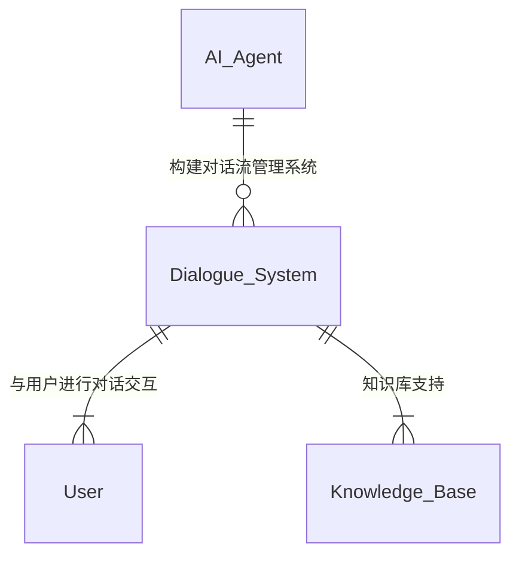
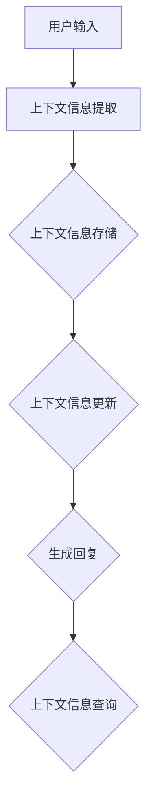

                 

### 第1章: 构建AI Agent的对话流管理系统背景与重要性

### 1.1 问题背景

#### 1.1.1 AI Agent与对话流管理系统概述

随着人工智能技术的迅猛发展，AI Agent（智能代理）作为一种重要的应用形式，正在逐步改变着我们的生活方式。AI Agent是一种能够模拟人类智能行为，独立完成特定任务的计算机程序。它们能够通过学习、推理和决策，与用户进行自然对话，提供个性化的服务和解决方案。

对话流管理系统（Dialogue Flow Management System，DFMS）则是为了提升AI Agent与用户之间对话交互的流畅度和效率而设计的一套系统。DFMS不仅能够处理复杂的对话流程，还能够实时调整对话策略，以适应不同的用户需求和场景。

#### 1.1.2 对话流管理系统在AI领域的应用

对话流管理系统在AI领域有着广泛的应用场景。例如：

1. **智能客服**：在电商平台、银行、电信等行业，对话流管理系统可以帮助企业实现24/7的智能客服服务，提升用户体验，降低人工成本。

2. **虚拟助手**：通过对话流管理系统，虚拟助手可以理解用户的自然语言，提供个性化的信息查询、任务提醒等服务。

3. **智能医疗**：在医疗领域，对话流管理系统可以协助医生进行病情诊断、提供治疗方案等，提高医疗服务的效率和质量。

4. **教育辅导**：通过对话流管理系统，智能教育系统可以为学习者提供个性化的学习建议、辅导答疑等，帮助学生更好地掌握知识。

#### 1.1.3 当前对话流管理系统面临的挑战

尽管对话流管理系统在AI领域有着广泛的应用前景，但在实际应用中仍面临着诸多挑战：

1. **自然语言理解**：自然语言处理（NLP）技术是构建对话流管理系统的基础。目前，NLP技术虽然在很大程度上能够理解用户的自然语言，但在处理复杂语境、多义词等方面仍存在一定的局限性。

2. **对话连贯性**：对话流管理系统需要确保对话的连贯性，即对话内容应该符合用户的意图和上下文。然而，在实际应用中，由于各种原因，例如语义理解错误、上下文丢失等，可能会导致对话中断或不连贯。

3. **个性化交互**：用户的需求和场景是多样化的，对话流管理系统需要能够根据用户的个性化需求提供定制化的服务。这要求系统具备较强的自适应能力和学习能力。

4. **系统复杂度**：对话流管理系统通常涉及到多个组件和技术的集成，包括自然语言处理、机器学习、知识图谱等。这使得系统的开发和维护变得相对复杂。

### 1.2 问题描述

#### 1.2.1 对话流管理中的痛点

对话流管理中的痛点主要体现在以下几个方面：

1. **语义理解不准确**：用户表达的语义可能因语境、多义词等因素而变得复杂，导致AI Agent无法准确理解用户意图。

2. **对话连贯性差**：由于上下文信息的丢失或处理不当，对话可能会出现中断或不连贯的情况，影响用户体验。

3. **个性化服务不足**：现有对话流管理系统往往缺乏足够的用户数据支持，无法提供个性化的对话服务。

4. **系统响应速度慢**：在处理大量并发请求时，系统可能因为性能问题而响应速度变慢，影响用户交互体验。

#### 1.2.2 对话流管理系统的目标

为了解决上述痛点，对话流管理系统的目标应包括：

1. **提高语义理解准确性**：通过优化自然语言处理技术，提高AI Agent对用户语义的理解能力。

2. **增强对话连贯性**：通过有效的上下文信息管理，确保对话的连贯性和流畅性。

3. **实现个性化交互**：通过用户数据的收集和分析，为用户提供个性化的对话服务。

4. **提升系统性能**：优化系统架构和算法，提高系统处理并发请求的能力。

#### 1.2.3 构建对话流管理系统的必要性

构建对话流管理系统具有重要的必要性：

1. **提升用户体验**：通过流畅、个性化的对话交互，提升用户满意度。

2. **降低运营成本**：通过智能客服等应用，降低企业运营成本，提高效率。

3. **拓宽应用场景**：对话流管理系统可以应用于更多行业和场景，推动人工智能技术的发展。

4. **提升行业竞争力**：具备先进对话流管理能力的企业将具备更强的市场竞争力。

### 1.3 问题解决

#### 1.3.1 对话流管理系统的基本功能

对话流管理系统应具备以下基本功能：

1. **语义理解**：通过自然语言处理技术，准确理解用户的语义表达。

2. **对话生成**：根据用户语义，生成合适的回复，保持对话连贯性。

3. **上下文管理**：维护对话过程中的上下文信息，确保对话连贯性。

4. **个性化交互**：根据用户数据和偏好，提供个性化的对话服务。

5. **多渠道支持**：支持多种通信渠道，如文本、语音、图像等。

#### 1.3.2 对话流管理系统的设计原则

在设计对话流管理系统时，应遵循以下原则：

1. **灵活性**：系统应具备灵活性，能够适应不同应用场景和业务需求。

2. **可扩展性**：系统应具备良好的可扩展性，支持模块化和功能扩展。

3. **可靠性**：系统应具备高可靠性，确保在故障情况下仍能保持正常服务。

4. **易用性**：系统应具备良好的易用性，降低用户学习成本。

5. **安全性**：系统应具备安全性，保护用户数据和隐私。

#### 1.3.3 对话流管理系统的技术选型

对话流管理系统的技术选型应考虑以下几个方面：

1. **自然语言处理**：选择成熟的NLP框架，如NLTK、spaCy等。

2. **机器学习与深度学习**：利用机器学习和深度学习技术，提升语义理解能力和对话生成质量。

3. **知识图谱**：使用知识图谱技术，构建领域知识库，提高对话系统的知识管理水平。

4. **多渠道通信**：选择合适的通信协议和API，实现多渠道支持。

5. **系统架构**：采用分布式架构，提高系统性能和可扩展性。

### 1.4 边界与外延

#### 1.4.1 对话流管理系统与其他系统的关系

对话流管理系统通常与其他系统紧密集成，如用户管理系统、订单处理系统、客户关系管理系统等。通过与这些系统的集成，对话流管理系统可以获取更多用户数据，提供更丰富的个性化服务。

#### 1.4.2 对话流管理系统在不同场景的应用

对话流管理系统可以应用于多个领域，如：

1. **电子商务**：提供智能客服、购物推荐等个性化服务。

2. **金融**：实现智能投顾、智能理财等金融服务。

3. **医疗**：提供智能问诊、健康咨询等医疗服务。

4. **教育**：实现智能教学、学习辅导等教育服务。

#### 1.4.3 对话流管理系统的未来发展

随着人工智能技术的不断发展，对话流管理系统将具有更广泛的应用前景。未来，对话流管理系统可能会向以下几个方向发展：

1. **多模态交互**：支持文本、语音、图像、视频等多种交互方式。

2. **情感智能**：通过情感分析技术，理解用户的情感状态，提供更人性化的服务。

3. **智慧城市**：在智慧城市建设中发挥重要作用，提供智能交通、智能安防等服务。

4. **人机协作**：通过与人类的协作，实现更高水平的智能化服务。

### 1.5 概念结构与核心要素组成

#### 1.5.1 AI Agent的概念与特点

AI Agent是一种具有高度智能的计算机程序，能够模拟人类的智能行为，实现自主决策和任务执行。AI Agent的主要特点包括：

1. **自主性**：AI Agent能够独立执行任务，无需人工干预。

2. **智能性**：AI Agent具备学习能力、推理能力和决策能力。

3. **适应性**：AI Agent能够根据环境和用户需求进行调整和优化。

#### 1.5.2 对话流管理系统的组成

对话流管理系统通常由以下几个核心组件组成：

1. **自然语言处理模块**：负责处理用户输入的自然语言，提取语义信息。

2. **对话管理模块**：负责管理对话流程，确保对话连贯性和用户体验。

3. **知识库模块**：提供领域知识支持，为对话生成提供知识依据。

4. **用户数据模块**：收集和分析用户数据，实现个性化服务。

5. **系统接口模块**：实现与其他系统的集成，提供多种通信渠道支持。

#### 1.5.3 对话流管理系统的核心要素

对话流管理系统的核心要素包括：

1. **语义理解**：准确理解用户的语义表达，提取关键信息。

2. **上下文管理**：维护对话过程中的上下文信息，确保对话连贯性。

3. **对话生成**：根据用户语义和上下文信息，生成合适的回复。

4. **个性化服务**：根据用户数据，提供个性化的对话服务。

5. **系统性能**：确保系统在高并发情况下的稳定运行。

### 1.6 本章小结

本章介绍了构建AI Agent的对话流管理系统的重要性、应用场景和发展趋势。我们探讨了当前对话流管理系统面临的挑战，并提出了构建对话流管理系统的目标、设计原则和技术选型。此外，我们还详细阐述了AI Agent和对话流管理系统的概念、组成和核心要素。通过对本章内容的理解，读者将能够更好地把握构建对话流管理系统的方法和思路。

-----------------------------------------------------------------

## 第二部分：核心概念与联系

### 第2章：AI Agent与对话流管理系统核心概念解析

#### 2.1 AI Agent的定义与特点

AI Agent，即人工智能代理，是指一种能够模拟人类智能行为、具备自主决策能力的计算机程序。AI Agent通常通过学习、推理和决策，自动执行特定任务，与外部环境进行交互。AI Agent的特点包括：

1. **自主性**：AI Agent能够在没有人类干预的情况下自主执行任务。

2. **智能性**：AI Agent具备学习能力、推理能力和决策能力，能够模拟人类智能行为。

3. **适应性**：AI Agent能够根据环境和用户需求进行调整和优化，具备自适应能力。

#### 2.2 对话流管理系统的概念

对话流管理系统（Dialogue Flow Management System，DFMS）是一种用于管理AI Agent与用户之间对话流程的系统。其主要目的是提升对话交互的流畅度和效率。对话流管理系统的组成包括：

1. **自然语言处理模块**：负责处理用户输入的自然语言，提取语义信息。

2. **对话管理模块**：负责管理对话流程，确保对话连贯性和用户体验。

3. **知识库模块**：提供领域知识支持，为对话生成提供知识依据。

4. **用户数据模块**：收集和分析用户数据，实现个性化服务。

5. **系统接口模块**：实现与其他系统的集成，提供多种通信渠道支持。

#### 2.3 AI Agent与对话流管理系统的联系

AI Agent与对话流管理系统之间的联系主要体现在以下几个方面：

1. **AI Agent是对话流管理系统的核心组件**：AI Agent负责与用户进行对话交互，执行用户请求的任务。

2. **对话流管理系统提供AI Agent的运行环境**：对话流管理系统为AI Agent提供对话管理、知识库、用户数据等支持，确保AI Agent能够高效地执行任务。

3. **AI Agent与对话流管理系统协同工作**：AI Agent通过对话流管理系统获取用户数据、知识库等信息，并根据用户反馈调整对话策略，提高对话交互的质量。

#### 2.4 概念属性特征对比表格

| 特征         | AI Agent                   | 对话流管理系统                |
|-------------|---------------------------|-----------------------------|
| 目标         | 实现特定任务               | 提高对话交互质量             |
| 智能程度     | 高度智能化                 | 部分智能化                   |
| 独立性       | 具有自主决策能力           | 需要与其他系统协同工作       |
| 应用领域     | 广泛                      | 主要应用于对话交互           |

#### 2.5 ER实体关系图架构



#### 2.6 本章小结

本章详细解析了AI Agent和对话流管理系统的核心概念，阐述了它们各自的特点和组成。同时，通过对比表格和ER实体关系图，我们深入分析了AI Agent与对话流管理系统之间的联系，为后续章节的深入讨论奠定了基础。读者通过本章的学习，将能够更好地理解对话流管理系统的构建原理和重要性。

-----------------------------------------------------------------

## 第三部分：算法原理讲解

### 第3章：对话流管理系统中的关键算法

#### 3.1 对话上下文管理算法

对话上下文管理算法是确保对话连贯性的核心算法。其主要功能是维护对话过程中的上下文信息，以便AI Agent能够根据用户的历史输入生成合适的回复。

#### 3.1.1 对话上下文的定义

对话上下文是指对话过程中涉及的各种信息，包括用户历史输入、AI Agent生成的回复、对话时间戳等。这些上下文信息对于理解用户意图和生成连贯的回复至关重要。

#### 3.1.2 对话上下文的重要性

对话上下文管理算法的重要性体现在以下几个方面：

1. **保持对话连贯性**：通过维护上下文信息，AI Agent可以更好地理解用户的意图，生成连贯的回复，避免对话中断或不连贯。

2. **提高用户体验**：连贯的对话交互能够提升用户体验，使用户感到更加舒适和满意。

3. **降低误判率**：通过上下文信息，AI Agent可以更准确地理解用户的意图，降低误判率。

#### 3.1.3 对话上下文管理算法

对话上下文管理算法主要包括以下几个步骤：

1. **上下文信息提取**：从用户输入中提取关键信息，如关键词、情感等。

2. **上下文信息存储**：将提取的上下文信息存储在数据结构中，如堆栈、队列等。

3. **上下文信息更新**：在对话过程中，根据用户新的输入，更新上下文信息。

4. **上下文信息查询**：在生成回复时，查询上下文信息，以便更好地理解用户意图。

#### 3.1.4 对话上下文管理算法的Mermaid流程图



#### 3.1.5 对话上下文管理算法的Python代码实现

```python
class DialogueContextManager:
    def __init__(self):
        self.context_stack = []

    def extract_context(self, user_input):
        # 提取上下文信息
        keywords = self.extract_keywords(user_input)
        return keywords

    def store_context(self, keywords):
        # 存储上下文信息
        self.context_stack.append(keywords)

    def update_context(self, user_input):
        # 更新上下文信息
        keywords = self.extract_context(user_input)
        self.store_context(keywords)

    def generate_response(self, keywords):
        # 生成回复
        response = self.construct_response(keywords)
        return response

    def query_context(self):
        # 查询上下文信息
        return self.context_stack[-1]

    def extract_keywords(self, user_input):
        # 提取关键词（示例实现）
        return user_input.split()

    def construct_response(self, keywords):
        # 构造回复（示例实现）
        return " ".join(keywords)
```

#### 3.1.6 对话上下文管理算法的数学模型和公式

对话上下文管理算法的数学模型可以表示为：

$$
\text{Context} = \text{CurrentInput} \times \text{WeightingFactor}
$$

其中，\(\text{Context}\) 表示上下文信息，\(\text{CurrentInput}\) 表示当前用户输入，\(\text{WeightingFactor}\) 表示权重因子，用于调整上下文信息的权重。

#### 3.1.7 对话上下文管理算法的举例说明

假设用户输入：“我今天去公园散步了，天气很好。”

1. **上下文信息提取**：提取关键词为 ["今天", "公园", "散步", "天气", "很好"]。

2. **上下文信息存储**：将提取的关键词存储在上下文堆栈中。

3. **上下文信息更新**：在用户下一次输入时，更新上下文信息。

4. **生成回复**：根据上下文信息生成回复：“听起来很好，你明天还去吗？”

通过上述步骤，对话上下文管理算法能够确保对话的连贯性和流畅性，为用户提供更好的对话体验。

#### 3.2 本章小结

本章详细介绍了对话流管理系统中的关键算法——对话上下文管理算法。我们阐述了对话上下文的定义和重要性，介绍了对话上下文管理算法的原理、实现方法和数学模型。通过具体的Python代码实现和举例说明，读者可以更好地理解对话上下文管理算法的应用和实现方法。对话上下文管理算法是构建高效、连贯对话交互的关键技术，对于提升用户满意度和系统性能具有重要意义。

