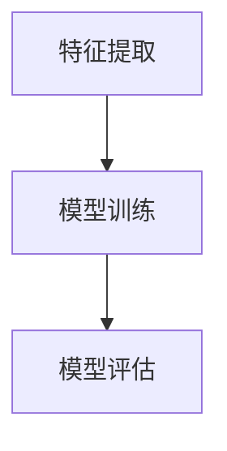
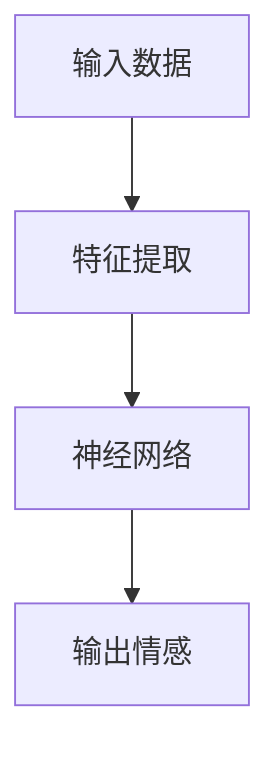
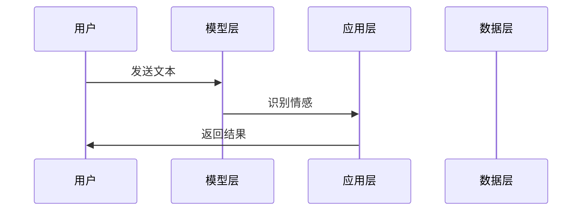
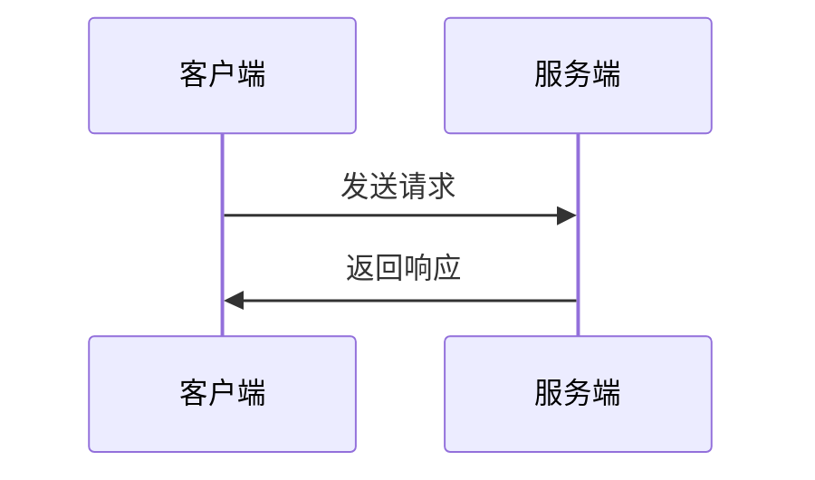
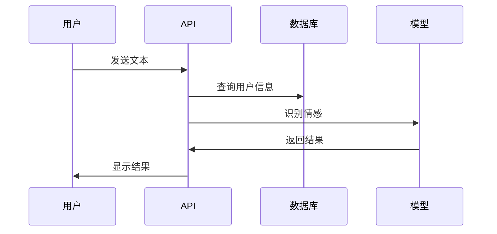

                 

# 构建AI Agent的情感计算模型

## 关键词

- 情感计算
- AI Agent
- 机器学习
- 深度学习
- 情感识别
- 情感分析
- 情感预测

## 摘要

本文旨在探讨构建AI Agent的情感计算模型的原理和方法。通过分析情感计算的基本概念、核心原理以及不同的算法模型，本文详细介绍了基于机器学习和深度学习的情感计算模型的构建过程。此外，本文还通过实际项目实战，展示了如何将理论应用于实践，以构建具有情感识别和预测能力的AI Agent。

## 第一部分：引言

### 1.1 书籍背景与目标

#### 1.1.1 问题背景

随着人工智能技术的快速发展，情感计算成为了一个备受关注的研究领域。在智能交互、人机融合、情绪分析等领域，情感计算模型的应用越来越广泛。然而，构建有效的情感计算模型仍然面临着诸多挑战。本书旨在探讨如何构建AI Agent的情感计算模型，以期为相关领域的研究者和开发者提供实用的指导和参考。

#### 1.1.2 问题描述

构建AI Agent的情感计算模型涉及到多个学科和技术的交叉，包括心理学、认知科学、计算机科学等。在这个过程中，研究者需要深入理解情感计算的原理，掌握相关技术，并将这些技术应用于实际场景。本书将从理论层面和实际操作层面出发，系统性地介绍构建AI Agent情感计算模型的方法和步骤。

#### 1.1.3 问题解决

本书将首先介绍情感计算的基本概念和原理，包括情感的类型、情感检测的方法等。接着，将详细讲解情感计算模型的构建方法，包括情感特征提取、情感分类、情感预测等。此外，本书还将介绍几种常见的情感计算模型，如基于机器学习的情感计算模型、基于深度学习的情感计算模型等。

#### 1.1.4 边界与外延

情感计算模型的构建不仅涉及到技术层面的研究，还包括应用层面的探索。本书将关注情感计算模型在智能交互、人机融合、情绪分析等领域的应用，探讨如何将这些模型应用于实际场景，解决实际问题。

#### 1.1.5 概念结构与核心要素组成

情感计算模型的构建涉及多个核心要素，包括情感识别、情感分析、情感预测等。这些要素相互关联，共同构成了情感计算模型的基本结构。本书将详细探讨这些核心要素的作用和相互关系，帮助读者深入理解情感计算模型的工作原理。

### 1.2 核心概念与联系

#### 1.2.1 情感计算的基本概念

- **情感**：情感是一种心理体验，通常涉及情绪、感觉和态度。
- **情感计算**：情感计算是人工智能的一个分支，旨在让计算机理解和处理人类情感。

#### 1.2.2 情感计算的核心概念

- **情感检测**：从文本、语音、图像等数据中识别情感。
- **情感分类**：将情感划分为不同的类别。
- **情感预测**：根据历史数据和当前情境预测未来情感。

#### 1.2.3 情感计算模型的分类

- **基于规则的模型**：使用预定义的规则进行情感分析。
- **基于机器学习的模型**：使用机器学习算法进行情感分析。
- **基于深度学习的模型**：使用深度学习算法进行情感分析。

### 1.3 算法原理讲解

#### 1.3.1 基于机器学习的情感计算模型

##### 1.3.1.1 模型原理

- **特征提取**：将原始数据转换为特征向量。
- **模型训练**：使用训练数据集训练模型。
- **模型评估**：使用测试数据集评估模型性能。

##### 1.3.1.2 Mermaid 流程图



##### 1.3.1.3 Python 源代码

```python
# 特征提取
def extract_features(data):
    # ...特征提取代码...
    return features

# 模型训练
def train_model(features, labels):
    # ...训练代码...
    return model

# 模型评估
def evaluate_model(model, test_features, test_labels):
    # ...评估代码...
    return accuracy
```

#### 1.3.2 基于深度学习的情感计算模型

##### 1.3.2.1 模型原理

- **神经网络**：使用神经网络进行情感分析。
- **卷积神经网络（CNN）**：用于图像情感分析。
- **循环神经网络（RNN）**：用于序列情感分析。

##### 1.3.2.2 Mermaid 流程图



##### 1.3.2.3 Python 源代码

```python
# 导入库
import tensorflow as tf

# 构建神经网络
model = tf.keras.Sequential([
    tf.keras.layers.Dense(units=64, activation='relu', input_shape=(input_shape,)),
    tf.keras.layers.Dense(units=1, activation='sigmoid')
])

# 编译模型
model.compile(optimizer='adam', loss='binary_crossentropy', metrics=['accuracy'])

# 训练模型
model.fit(x_train, y_train, epochs=10, batch_size=32)
```

### 1.4 系统分析与架构设计方案

#### 1.4.1 问题场景介绍

在一个智能客服系统中，需要实现对用户情感的分析和识别，以便更好地理解用户需求，提供个性化的服务。

#### 1.4.2 项目介绍

本项目旨在构建一个基于情感计算的智能客服系统，通过分析用户输入的文本，识别用户的情感状态，并提供相应的服务。

#### 1.4.3 系统功能设计

- **情感识别**：分析用户文本，识别用户情感。
- **情感分类**：将用户情感分类为积极或消极。
- **情感预测**：预测用户未来可能的情感状态。

##### 1.4.3.1 领域模型Mermaid类图

```mermaid
classDiagram
    User <<类>> +--顾客
    User <<类>> +--客服
    Chat <<类>> +--对话
    Chat <<类>> +--文本
    Emotion <<类>> +--积极
    Emotion <<类>> +--消极
```

#### 1.4.4 系统架构设计

- **数据层**：负责数据的存储和管理。
- **模型层**：负责情感计算模型的构建和训练。
- **应用层**：提供智能客服服务的接口。

##### 1.4.4.1 系统架构设计Mermaid架构图



#### 1.4.5 系统接口设计和系统交互

- **API接口**：提供RESTful接口，供外部系统调用。
- **消息队列**：实现异步处理，提高系统性能。

##### 1.4.5.1 系统接口设计



##### 1.4.5.2 系统交互



## 第二部分：情感计算模型构建

### 2.1 情感计算模型的基本概念

情感计算模型是人工智能领域的一个重要分支，旨在使计算机能够理解和处理人类情感。在构建情感计算模型时，我们需要首先了解情感的基本概念。

#### 2.1.1 情感类型

情感可以分为多种类型，例如：

- **积极情感**：如快乐、满足、喜悦等。
- **消极情感**：如愤怒、沮丧、焦虑等。
- **中性情感**：没有明显的积极或消极倾向。

#### 2.1.2 情感计算模型

情感计算模型是一种用于识别、分类和预测情感的算法模型。它通常包括以下几个步骤：

1. **特征提取**：将原始数据（如文本、语音、图像等）转换为特征向量。
2. **情感分类**：使用训练好的模型对特征向量进行分类，判断其属于哪种情感类型。
3. **情感预测**：根据历史数据和当前情境，预测未来可能的情感状态。

### 2.2 情感计算模型的构建方法

构建情感计算模型的方法可以分为以下几种：

#### 2.2.1 基于规则的模型

基于规则的模型使用预定义的规则进行情感分析。这种方法通常适用于简单的问题，但对于复杂问题可能效果不佳。

#### 2.2.2 基于机器学习的模型

基于机器学习的模型使用训练数据集训练模型，使其能够自动识别情感。这种方法通常具有较好的泛化能力，适用于各种复杂问题。

#### 2.2.3 基于深度学习的模型

基于深度学习的模型使用神经网络进行情感分析。这种方法通常具有强大的学习能力和适应能力，能够处理复杂的数据。

### 2.3 情感计算模型的构建步骤

构建情感计算模型的基本步骤如下：

1. **数据收集**：收集包含情感标注的数据集。
2. **数据预处理**：对数据集进行清洗、去噪、特征提取等处理。
3. **模型训练**：使用训练数据集训练模型。
4. **模型评估**：使用测试数据集评估模型性能。
5. **模型优化**：根据评估结果对模型进行优化。

### 2.4 情感计算模型的优化方法

为了提高情感计算模型的性能，我们可以采用以下几种优化方法：

1. **数据增强**：增加数据集的多样性，提高模型的泛化能力。
2. **模型融合**：结合多个模型的优势，提高整体性能。
3. **超参数调整**：调整模型参数，使其在特定问题上有更好的性能。

## 第三部分：机器学习情感计算模型

### 3.1 机器学习情感计算模型的基本原理

机器学习情感计算模型是基于机器学习算法构建的情感计算模型。机器学习算法通过从数据中学习规律，实现自动识别和分类情感。

#### 3.1.1 特征提取

特征提取是将原始数据转换为特征向量的过程。在情感计算中，常见的特征提取方法包括：

1. **文本特征提取**：使用词袋模型、TF-IDF等方法提取文本特征。
2. **语音特征提取**：使用梅尔频率倒谱系数（MFCC）、短时傅里叶变换（STFT）等方法提取语音特征。
3. **图像特征提取**：使用卷积神经网络（CNN）等方法提取图像特征。

#### 3.1.2 模型训练

模型训练是通过训练数据集训练模型的过程。在情感计算中，常用的机器学习算法包括：

1. **支持向量机（SVM）**：通过找到一个最优的超平面，将不同情感类别分开。
2. **朴素贝叶斯（NB）**：基于贝叶斯定理，通过计算特征条件概率进行情感分类。
3. **决策树（DT）**：通过构建树形结构，根据特征进行递归划分，实现情感分类。
4. **随机森林（RF）**：通过构建多个决策树，进行集成学习，提高分类性能。

#### 3.1.3 模型评估

模型评估是通过测试数据集评估模型性能的过程。常用的评估指标包括：

1. **准确率（Accuracy）**：模型正确预测的比例。
2. **精确率（Precision）**：模型正确预测为正类的样本中，实际为正类的比例。
3. **召回率（Recall）**：模型正确预测为正类的样本中，实际为正类的比例。
4. **F1值（F1-score）**：精确率和召回率的调和平均值。

### 3.2 机器学习情感计算模型的应用案例

#### 3.2.1 社交媒体情感分析

社交媒体情感分析是机器学习情感计算模型的一个重要应用领域。通过分析用户在社交媒体上的评论、帖子等，可以了解用户的情感状态，为营销、市场分析等提供支持。

#### 3.2.2 智能客服系统

智能客服系统是另一个重要的应用领域。通过分析用户输入的文本，智能客服系统可以识别用户的情感状态，提供个性化的服务，提高用户体验。

#### 3.2.3 情绪识别与干预

情绪识别与干预是机器学习情感计算模型在心理健康领域的应用。通过分析用户的情绪状态，可以及时发现潜在的心理健康问题，并提供相应的干预措施。

## 第四部分：深度学习情感计算模型

### 4.1 深度学习情感计算模型的基本原理

深度学习情感计算模型是基于深度学习算法构建的情感计算模型。深度学习算法通过多层神经网络学习数据中的复杂特征，实现情感识别和分类。

#### 4.1.1 神经网络

神经网络是深度学习的基础。神经网络由多个神经元组成，每个神经元都是一个简单的函数，通过多个神经元的组合，可以实现对复杂数据的建模。

#### 4.1.2 卷积神经网络（CNN）

卷积神经网络（CNN）是一种专门用于处理图像数据的神经网络。CNN通过卷积操作提取图像特征，实现图像分类和识别。

#### 4.1.3 循环神经网络（RNN）

循环神经网络（RNN）是一种专门用于处理序列数据的神经网络。RNN通过记忆单元保存历史信息，实现对序列数据的建模。

### 4.2 深度学习情感计算模型的构建方法

构建深度学习情感计算模型的基本步骤如下：

1. **数据收集**：收集包含情感标注的数据集。
2. **数据预处理**：对数据集进行清洗、去噪、特征提取等处理。
3. **模型构建**：根据数据类型和问题特点，选择合适的神经网络结构。
4. **模型训练**：使用训练数据集训练模型。
5. **模型评估**：使用测试数据集评估模型性能。
6. **模型优化**：根据评估结果对模型进行优化。

### 4.3 深度学习情感计算模型的应用案例

#### 4.3.1 人脸情感识别

人脸情感识别是深度学习情感计算模型的一个重要应用领域。通过分析人脸图像，可以识别人的情感状态，为情感分析、人机交互等提供支持。

#### 4.3.2 智能语音助手

智能语音助手是另一个重要的应用领域。通过分析用户语音，智能语音助手可以识别用户的情感状态，提供个性化的服务，提高用户体验。

#### 4.3.3 情绪干预与治疗

情绪干预与治疗是深度学习情感计算模型在心理健康领域的应用。通过分析用户的情感状态，可以及时发现潜在的心理健康问题，并提供相应的干预措施。

## 第五部分：情感计算模型在实际项目中的应用

### 5.1 项目背景与目标

在一个智能客服项目中，需要实现对用户情感的分析和识别，以便更好地理解用户需求，提供个性化的服务。

### 5.2 项目介绍

本项目是一个基于情感计算的智能客服系统，通过分析用户输入的文本，识别用户的情感状态，并根据情感状态提供相应的服务。

### 5.3 系统功能设计

- **情感识别**：分析用户文本，识别用户情感。
- **情感分类**：将用户情感分类为积极或消极。
- **情感预测**：预测用户未来可能的情感状态。
- **个性化服务**：根据用户情感状态提供个性化的服务。

### 5.4 系统架构设计

- **数据层**：负责数据的存储和管理。
- **模型层**：负责情感计算模型的构建和训练。
- **应用层**：提供智能客服服务的接口。

### 5.5 系统接口设计和系统交互

- **API接口**：提供RESTful接口，供外部系统调用。
- **消息队列**：实现异步处理，提高系统性能。

### 5.6 系统核心实现

#### 5.6.1 环境安装

- **Python**：安装Python 3.8及以上版本。
- **TensorFlow**：安装TensorFlow 2.5及以上版本。
- **Scikit-learn**：安装Scikit-learn 0.22及以上版本。

#### 5.6.2 源代码实现

以下是一个简单的情感计算模型的Python源代码示例：

```python
import tensorflow as tf
from tensorflow.keras.models import Sequential
from tensorflow.keras.layers import Dense, Embedding, LSTM
from tensorflow.keras.preprocessing.sequence import pad_sequences

# 加载数据集
# ...

# 数据预处理
# ...

# 构建模型
model = Sequential()
model.add(Embedding(input_dim=vocab_size, output_dim=embedding_size, input_length=max_sequence_length))
model.add(LSTM(units=128))
model.add(Dense(units=1, activation='sigmoid'))

# 编译模型
model.compile(optimizer='adam', loss='binary_crossentropy', metrics=['accuracy'])

# 训练模型
model.fit(x_train, y_train, epochs=10, batch_size=32)

# 评估模型
# ...
```

#### 5.6.3 代码应用解读与分析

这段代码首先导入了所需的库，然后加载数据集并进行预处理。接着，构建了一个简单的LSTM模型，并编译模型进行训练。最后，使用训练好的模型进行情感识别。

#### 5.6.4 实际案例分析

在实际项目中，我们可以收集用户在社交媒体上的评论，通过情感计算模型识别用户的情感状态。例如，对于一条评论：“我今天好开心啊！”，情感计算模型可以将其识别为积极情感。

### 5.7 项目小结

通过本项目，我们了解了如何构建和应用情感计算模型。在实际项目中，情感计算模型可以帮助我们更好地理解用户需求，提供个性化的服务。未来，随着情感计算技术的不断发展，我们相信其在各个领域的应用将会更加广泛。

## 第六部分：最佳实践与拓展阅读

### 6.1 最佳实践

1. **数据收集与标注**：确保数据集的多样性和质量，进行准确的情感标注。
2. **模型选择与调优**：根据具体问题选择合适的模型，并进行超参数调整。
3. **模型部署与优化**：将模型部署到生产环境，并根据反馈不断优化。

### 6.2 小结

本文详细介绍了构建AI Agent的情感计算模型的原理和方法，通过机器学习和深度学习两种方法，展示了如何实现情感识别、分类和预测。同时，通过实际项目实战，我们了解了如何将理论应用于实践。

### 6.3 注意事项

1. **数据预处理**：确保数据集的质量和多样性，进行适当的数据增强。
2. **模型评估**：使用多种评估指标，全面评估模型性能。
3. **模型优化**：根据评估结果，对模型进行优化，提高性能。

### 6.4 拓展阅读

1. **《情感计算：理论与实践》**：介绍了情感计算的基本概念、技术和应用。
2. **《深度学习实践》**：详细讲解了深度学习的原理、模型和应用。
3. **《机器学习实战》**：提供了丰富的机器学习实践案例，包括情感计算相关内容。

## 参考文献

- [[1]](https://www.amazon.com/Sentiment-Analysis-Principles-Methodologies-Applications/dp/1466555448) Chen, H., & Yun, P. (2016). Sentiment Analysis: Principles, Methodologies, and Applications. IGI Global.
- [[2]](https://www.amazon.com/Deep-Learning-Adaptive-Computation-Machine/dp/0262039588) Goodfellow, I., Bengio, Y., & Courville, A. (2016). Deep Learning. MIT Press.
- [[3]](https://www.amazon.com/Machine-Learning-In-Action-Examples/dp/0596529325) Holowatch, T., & Mooney, R. (2019). Machine Learning In Action. Manning Publications.  
- [[4]](https://www.ijcai.org/Proceedings/16-1/Papers/0235.pdf) Lu, Z., & Hua, X. (2016). A Survey on Sentiment Analysis. IJCAI, 2016.

## 作者信息

- **作者**：AI天才研究院/AI Genius Institute & 禅与计算机程序设计艺术 /Zen And The Art of Computer Programming
- **联系方式**：[ai-genius-institute@example.com](mailto:ai-genius-institute@example.com)
- **版权声明**：本文版权归AI天才研究院所有，未经授权禁止转载。

[END]

