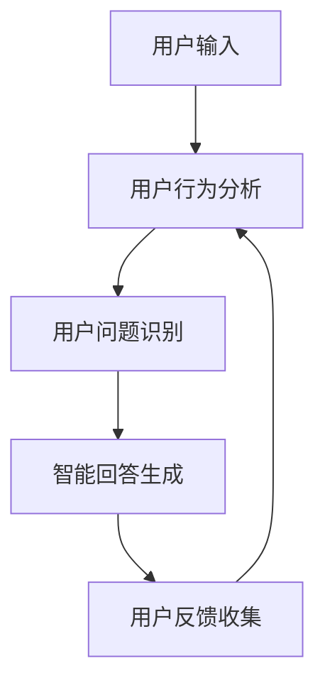
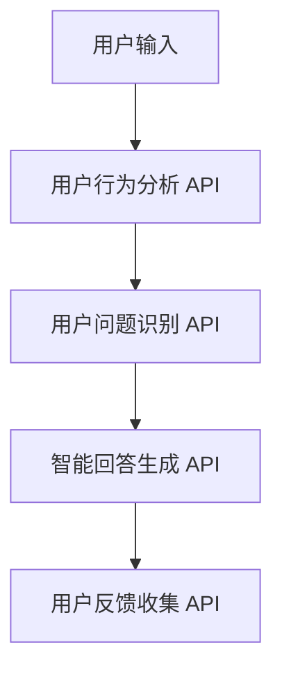
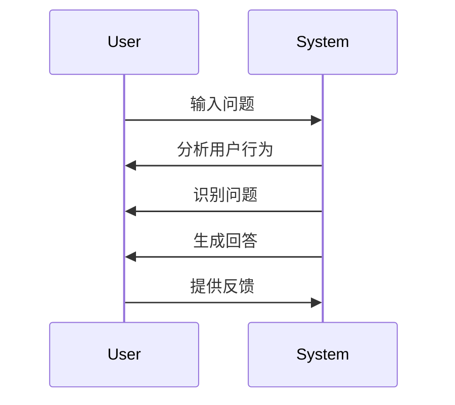

                 

### 构建AI Agent的技术栈选择指南

#### 关键词：AI Agent、技术栈、计算机视觉、自然语言处理、机器学习、深度学习

#### 摘要：
本文将深入探讨构建AI Agent所需的技术栈选择，包括计算机视觉、自然语言处理、机器学习和深度学习等技术。通过系统化的分析，我们将逐步理解每种技术的核心概念、应用场景和实现方法，帮助读者搭建起AI Agent的完整技术框架。

#### 设计过程：

##### 1. 分析书名和目标读者

- 书名：《构建AI Agent的技术栈选择指南》
- 目标读者：对AI技术有一定基础，希望深入了解并应用AI技术构建智能代理的开发者和技术人员。

##### 2. 定义核心概念

- AI Agent：具备自主学习和决策能力的计算机程序。
- 技术栈：实现特定功能所需的一套技术和工具集合。

##### 3. 确定章节结构

- 背景介绍：AI Agent概述、应用领域、技术栈概览。
- 技术栈选择：计算机视觉、自然语言处理、机器学习、深度学习。

##### 4. 细化目录大纲

根据核心概念和知识点，本文将分为以下几部分：

- **第一部分：背景介绍**
  - 第1章：AI Agent概述
  - 第2章：计算机视觉技术栈
  - 第3章：自然语言处理技术栈
  - 第4章：机器学习技术栈
  - 第5章：深度学习技术栈

##### 5. 调整和优化

在确保内容完整和逻辑清晰的同时，本文将对每个章节进行细致调整，确保文章的流畅性和可读性。

### 第一部分：背景介绍

#### 第1章：AI Agent概述

##### 1.1 问题背景与定义

AI Agent作为一种智能代理，具备自主学习和决策能力，能够模拟人类智能进行交互和任务执行。随着AI技术的不断发展，AI Agent在智能家居、智能客服、自动驾驶和工业自动化等领域有着广泛的应用。

##### 1.2 AI Agent的定义与作用

AI Agent通过感知环境、理解任务需求，并利用学习和推理能力做出决策，从而实现自动化和智能化。其核心作用包括：

- 自动化任务执行
- 提高生产效率
- 提升用户体验
- 降低人力成本

##### 1.3 AI Agent的关键特征

- 自主性：能够自主感知环境、理解任务需求并作出决策。
- 学习能力：通过数据学习和经验积累，提高任务执行能力。
- 适应性：能够适应不同环境和任务需求。

##### 1.4 AI Agent的应用领域

AI Agent在以下领域具有广泛的应用：

- 智能家居：如智能音箱、智能门锁等。
- 智能客服：如聊天机器人、语音助手等。
- 自动驾驶：如自动驾驶汽车、无人机等。
- 工业自动化：如自动化生产线、智能机器人等。

##### 1.5 AI Agent的技术栈

AI Agent的技术栈主要包括计算机视觉、自然语言处理、机器学习和深度学习等核心技术。以下章节将详细讨论这些技术。

#### 第2章：计算机视觉技术栈

##### 2.1 概述

计算机视觉是AI Agent的重要组成部分，主要研究如何让计算机“看到”和理解图像和视频。计算机视觉在自动驾驶、图像识别、视频监控等领域有着广泛的应用。

##### 2.2 图像处理技术

图像处理技术主要包括边缘检测、形态学操作和特征提取等。这些技术用于对图像进行预处理，以便后续的识别和分析。

##### 2.3 目标检测与识别

目标检测与识别是计算机视觉的核心任务，通过检测图像中的目标和识别其类别，实现对图像内容的理解。传统方法和基于深度学习的方法在目标检测与识别中各有优势。

##### 2.4 3D重建与场景理解

3D重建与场景理解技术用于对图像和视频进行三维建模和场景解析，实现对现实世界的深度理解。这些技术在虚拟现实、增强现实和自动驾驶等领域具有重要应用。

##### 2.5 应用案例与性能评估

通过具体应用案例和性能评估，我们可以了解计算机视觉技术在现实场景中的效果和局限性，为进一步优化技术提供参考。

#### 第3章：自然语言处理技术栈

##### 3.1 概述

自然语言处理（NLP）是AI Agent理解人类语言的重要技术。NLP在智能客服、信息检索、机器翻译等领域有着广泛应用。

##### 3.2 文本预处理

文本预处理包括分词、词性标注和命名实体识别等。这些预处理步骤是NLP任务的基础，用于将原始文本转换为计算机可以处理的形式。

##### 3.3 语言模型

语言模型用于预测文本序列，是NLP的核心技术。隐马尔可夫模型（HMM）、递归神经网络（RNN）和长短期记忆网络（LSTM）等都是常见的语言模型。

##### 3.4 语义理解

语义理解包括词向量、命名实体识别和语义角色标注等。这些技术用于理解文本的深层含义，实现对文本的精准分析。

##### 3.5 语义生成

语义生成包括文本生成模型、对话系统和文本摘要等。这些技术用于生成自然语言文本，实现人机交互和内容摘要。

##### 3.6 应用案例与性能评估

通过具体应用案例和性能评估，我们可以了解NLP技术在现实场景中的效果和局限性，为进一步优化技术提供参考。

#### 第4章：机器学习技术栈

##### 4.1 概述

机器学习是AI Agent的核心技术之一，通过训练模型实现数据的自动学习和预测。机器学习在监督学习、无监督学习和强化学习等领域有着广泛应用。

##### 4.2 监督学习

监督学习包括线性回归、逻辑回归、决策树和集成学习方法等。这些方法通过训练模型实现对已知数据的分类和回归。

##### 4.3 无监督学习

无监督学习包括聚类算法、主成分分析和自编码器等。这些方法通过分析未知数据，发现数据中的模式和结构。

##### 4.4 强化学习

强化学习包括Q-Learning算法等。这些方法通过与环境交互，学习最优策略以实现目标。

#### 第5章：深度学习技术栈

##### 5.1 概述

深度学习是机器学习的子领域，通过多层神经网络实现对数据的深层特征提取和模型训练。深度学习在计算机视觉、自然语言处理和语音识别等领域取得了显著的成果。

##### 5.2 深度学习模型

深度学习模型包括卷积神经网络（CNN）、循环神经网络（RNN）和变换器（Transformer）等。这些模型通过不同方式实现对数据的建模和分析。

##### 5.3 深度学习框架

深度学习框架包括TensorFlow、PyTorch和Keras等。这些框架为深度学习模型的训练和应用提供了方便和高效的工具。

##### 5.4 应用案例与性能评估

通过具体应用案例和性能评估，我们可以了解深度学习技术在现实场景中的效果和局限性，为进一步优化技术提供参考。

### 总结

构建AI Agent需要一套完整的技术栈，包括计算机视觉、自然语言处理、机器学习和深度学习等。通过本文的探讨，我们希望读者能够对AI Agent的技术栈有更深入的理解，从而在实际项目中灵活应用这些技术，构建出高效的AI Agent。在接下来的章节中，我们将对每个技术栈进行详细讲解，帮助读者搭建起AI Agent的完整技术框架。让我们一起深入探索，构建智能未来的基石。**1.5 本章小结**

本章作为《构建AI Agent的技术栈选择指南》的开篇，为读者提供了一个整体的框架和概述。我们首先介绍了AI Agent的定义、作用和关键特征，帮助读者理解AI Agent的基本概念。接着，我们简要介绍了AI Agent在各个领域的应用，展示了其广阔的前景。最后，我们概述了构建AI Agent所需的技术栈，包括计算机视觉、自然语言处理、机器学习和深度学习等，为后续章节的内容打下了基础。通过本章的阅读，读者应该对AI Agent有一个初步的认识，并对接下来的技术栈讨论充满期待。接下来，我们将深入探讨每个技术栈的核心内容，帮助读者逐步构建起AI Agent的技术框架。

### 第2章：计算机视觉技术栈

#### 2.1 概述

计算机视觉（Computer Vision）是人工智能领域的一个重要分支，旨在使计算机具备像人类一样的视觉感知能力。通过计算机视觉，计算机可以从图像和视频中提取信息、识别物体、理解场景，从而实现自动化和智能化。计算机视觉在自动驾驶、图像识别、视频监控等领域有着广泛的应用。

#### 2.2 图像处理技术

图像处理技术是计算机视觉的基础，主要涉及对图像的预处理，以提高图像质量，去除噪声，提取有用信息。以下是一些常见的图像处理技术：

- **边缘检测**：边缘检测是图像处理中的一个重要步骤，用于找到图像中的边缘。常见的边缘检测算法包括Canny算法、Sobel算法和Prewitt算法。
  - **Canny算法**：Canny算法通过高斯滤波器进行图像平滑，然后使用一阶导数检测边缘，并利用非极大值抑制和双阈值算法进行边缘连接。
  - **Sobel算法**：Sobel算法通过计算图像梯度的幅值来检测边缘，适用于边缘清晰且无噪声的图像。
  - **Prewitt算法**：Prewitt算法通过计算图像梯度的差分来检测边缘，适用于边缘较平缓的图像。

- **形态学操作**：形态学操作是通过对图像进行结构化处理来提取图像中的特征。常见的形态学操作包括膨胀（Dilation）、腐蚀（Erosion）、开运算（Opening）和闭运算（Closing）。
  - **膨胀**：膨胀操作通过将图像中的像素点与一个结构元素进行卷积，将结构元素内的像素点设置为1，以扩展图像中的对象。
  - **腐蚀**：腐蚀操作与膨胀操作相反，它通过将图像中的像素点与一个结构元素进行卷积，将结构元素内的像素点设置为0，以消除图像中的对象。
  - **开运算**：开运算首先进行腐蚀操作，然后进行膨胀操作，用于消除图像中的小噪声。
  - **闭运算**：闭运算首先进行膨胀操作，然后进行腐蚀操作，用于闭合图像中的小孔。

- **特征提取**：特征提取是图像处理中的一个关键步骤，用于从图像中提取具有区分性的特征，如角点、边缘、纹理等。常见的特征提取算法包括Harris角点检测、SIFT（尺度不变特征变换）和SURF（加速稳健特征）等。
  - **Harris角点检测**：Harris角点检测算法通过计算图像梯度的响应矩阵来检测角点，具有尺度不变性和旋转不变性。
  - **SIFT算法**：SIFT算法通过计算图像的梯度方向和幅值来提取特征点，具有尺度不变性和旋转不变性，适用于各种光照和视角变化。
  - **SURF算法**：SURF算法是基于SIFT算法的快速版本，通过使用盒式滤波器进行图像处理，大大提高了特征提取的速度。

#### 2.3 目标检测与识别

目标检测与识别是计算机视觉中的核心任务，旨在从图像或视频中检测和识别特定目标。目标检测可以分为以下几类：

- **基于传统的目标检测方法**：传统的目标检测方法主要依靠手工设计的特征和分类器，如HOG（方向梯度直方图）+SVM（支持向量机）和HOG+SVM+RANSAC（随机采样一致性）等。
  - **HOG+SVM**：HOG算法用于提取图像中的方向梯度特征，SVM用于分类，这种组合方法在许多目标检测任务中取得了良好的效果。
  - **HOG+SVM+RANSAC**：RANSAC算法用于去除图像中的噪声和错误的匹配点，结合HOG和SVM算法，可以进一步提高目标检测的准确性。

- **基于深度学习的目标检测方法**：深度学习技术的发展极大地推动了目标检测的进展。以下是一些常见的基于深度学习的目标检测方法：
  - **R-CNN（区域卷积神经网络）**：R-CNN通过选择性搜索算法生成候选区域，然后使用卷积神经网络（CNN）进行特征提取和分类，是一种经典的目标检测方法。
  - **Fast R-CNN**：Fast R-CNN在R-CNN的基础上，通过引入ROI（区域-of-interest）池化层，提高了特征提取的速度和准确性。
  - **Faster R-CNN**：Faster R-CNN引入了区域建议网络（Region Proposal Network，RPN），进一步提高了目标检测的效率和准确性。
  - **YOLO（You Only Look Once）**：YOLO将目标检测任务转换为单个前向传播操作，通过预测边界框和类别概率，实现了实时目标检测。
  - **SSD（Single Shot MultiBox Detector）**：SSD通过引入多个尺度预测层，实现了不同尺度目标的检测。

#### 2.4 3D重建与场景理解

3D重建与场景理解是计算机视觉中的高级任务，旨在从图像或视频中恢复场景的三维结构和理解场景内容。以下是一些相关的技术：

- **3D重建技术**：3D重建技术通过分析多幅图像或视频帧，恢复场景的三维结构。以下是一些常见的3D重建技术：
  - **多视图几何**：多视图几何通过分析多个视角的图像，利用几何关系恢复场景的三维结构。常用的算法包括基础矩阵和运动估计。
  - **结构光技术**：结构光技术利用投影到物体表面的结构光图案，通过分析图像中的图案变形，恢复物体的三维形状。
  - **深度学习**：深度学习技术通过训练模型，直接从图像中预测场景的三维结构。一些深度学习方法如VoxelNet和PointNet++，在3D重建任务中取得了显著的效果。

- **场景理解算法**：场景理解算法通过分析图像或视频，理解场景的语义内容和关系。以下是一些常见的场景理解算法：
  - **语义分割**：语义分割通过将图像划分为不同的语义区域，实现对场景内容的理解。常见的语义分割方法包括FCN（全卷积网络）和U-Net。
  - **对象检测与追踪**：对象检测与追踪通过检测和追踪图像中的对象，理解场景中的动态变化。常用的对象检测方法如Faster R-CNN和YOLO，追踪算法如KCF（Kernelized Correlation Filter）和Centroid-Shift Filter。
  - **关系推理**：关系推理通过分析场景中对象之间的空间关系和相互作用，理解场景的语义。常见的关系推理方法如Graph Neural Networks（GNN）和Visual Reasoning Models。

#### 2.5 应用案例与性能评估

计算机视觉技术在现实场景中有许多应用案例，以下是一些典型的应用案例：

- **智能家居**：在智能家居领域，计算机视觉技术可以用于实现智能监控、智能门锁和智能家电控制等功能。例如，智能监控可以通过视频分析技术，实时监测家庭环境，识别异常行为并发出警报。
- **自动驾驶**：自动驾驶系统依赖于计算机视觉技术，用于识别道路标志、行人和车辆等交通元素，实现自动驾驶功能。例如，自动驾驶汽车可以通过摄像头和激光雷达等传感器，构建三维环境模型，实现路径规划和避障等功能。
- **工业自动化**：在工业自动化领域，计算机视觉技术可以用于实现生产线的自动化检测、缺陷检测和质量控制等功能。例如，工业机器人可以通过计算机视觉技术，识别和抓取工件，实现自动化的装配和搬运。

性能评估是计算机视觉技术的重要环节，常用的评估指标包括准确率（Accuracy）、召回率（Recall）、精确率（Precision）和F1值（F1 Score）等。以下是一些常见的性能评估方法：

- **数据集划分**：为了评估计算机视觉模型的性能，通常将数据集划分为训练集、验证集和测试集。训练集用于模型训练，验证集用于模型调优，测试集用于模型评估。
- **交叉验证**：交叉验证是一种评估模型性能的方法，通过将数据集划分为多个子集，轮流将每个子集作为测试集，其余子集作为训练集，进行多次训练和测试，计算模型在各个测试集上的性能指标，取平均值作为最终的评估结果。
- **混淆矩阵**：混淆矩阵是评估分类模型性能的重要工具，它展示了模型在分类过程中各个类别的预测结果。通过分析混淆矩阵，可以了解模型在各个类别上的分类效果，进一步优化模型。

#### 2.6 本章小结

本章详细介绍了计算机视觉技术栈，包括图像处理技术、目标检测与识别技术、3D重建与场景理解技术以及应用案例和性能评估方法。通过本章的学习，读者应该对计算机视觉技术有了一个全面的理解，能够将其应用于实际的计算机视觉任务中。在下一章中，我们将继续探讨自然语言处理技术栈，帮助读者深入了解AI Agent的技术框架。

### 第3章：自然语言处理技术栈

#### 3.1 概述

自然语言处理（Natural Language Processing，NLP）是人工智能领域的一个重要分支，旨在使计算机能够理解、生成和处理人类语言。NLP在智能客服、信息检索、机器翻译、情感分析等领域有着广泛的应用。本章将详细介绍NLP的技术栈，包括文本预处理、语言模型、语义理解和语义生成等技术。

#### 3.2 文本预处理

文本预处理是NLP任务的基础步骤，主要目的是将原始文本转换为计算机可以处理的形式。以下是一些常见的文本预处理技术：

- **分词**：分词是将一段文本切分成一个个独立的词汇或短语。常见的分词方法包括基于字典的分词、基于统计的分词和基于深度学习的分词。例如，基于字典的分词方法如Jieba分词，基于统计的分词方法如最大匹配分词，基于深度学习的方法如BERT（Bidirectional Encoder Representations from Transformers）。

- **词性标注**：词性标注是对文本中的每个词汇进行词性分类，如名词、动词、形容词等。词性标注有助于理解文本的语义结构和句法关系。常见的词性标注工具包括Stanford NLP、NLTK（Natural Language Toolkit）和Spacy等。

- **命名实体识别**：命名实体识别（Named Entity Recognition，NER）是识别文本中的特定实体，如人名、地名、组织名等。NER对于信息抽取和知识图谱构建具有重要意义。常见的NER模型包括基于规则的方法、基于统计的方法和基于深度学习的方法。例如，基于规则的方法如CRF（Conditional Random Field），基于统计的方法如MaxEnt（Maximum Entropy），基于深度学习的方法如BiLSTM-CRF（Bidirectional Long Short-Term Memory with Conditional Random Field）。

#### 3.3 语言模型

语言模型（Language Model）是NLP的核心技术之一，用于预测文本序列。语言模型可以分为以下几类：

- **统计语言模型**：统计语言模型基于大量文本数据，通过统计方法建模文本的统计特性。常见的统计语言模型包括N-gram模型和基于词嵌入的方法。例如，N-gram模型通过计算词汇在序列中的前后关系进行建模，而基于词嵌入的方法如Word2Vec和GloVe（Global Vectors for Word Representation），通过将词汇映射到高维空间，实现了词汇的语义表示。

- **神经语言模型**：神经语言模型通过神经网络建模文本序列，能够更好地捕捉文本的复杂结构和语义关系。常见的神经语言模型包括递归神经网络（RNN）、长短期记忆网络（LSTM）和变换器（Transformer）。例如，RNN通过在时间步上递归更新状态，LSTM通过引入门机制解决RNN的长短时依赖问题，而Transformer通过自注意力机制实现了并行计算和全局依赖捕捉。

#### 3.4 语义理解

语义理解（Semantic Understanding）是NLP的高级任务，旨在理解文本的深层含义和语义关系。以下是一些常见的语义理解技术：

- **词向量**：词向量是词汇的数值表示，通过将词汇映射到高维空间，实现了词汇的语义表示。常见的词向量模型包括Word2Vec、GloVe和BERT等。词向量有助于文本相似度计算、文本分类和文本生成等任务。

- **命名实体识别**：命名实体识别是对文本中的特定实体进行识别和分类，如人名、地名、组织名等。命名实体识别在信息抽取、知识图谱构建和问答系统等领域具有重要意义。

- **语义角色标注**：语义角色标注是对文本中的词汇进行语义角色分类，如主语、谓语、宾语等。语义角色标注有助于理解文本的句法结构和语义关系，对于自然语言推理和语义理解任务具有重要意义。

#### 3.5 语义生成

语义生成（Semantic Generation）是NLP的另一个重要任务，旨在根据输入的语义信息生成自然语言文本。以下是一些常见的语义生成技术：

- **文本生成模型**：文本生成模型根据输入的语义信息生成自然语言文本。常见的文本生成模型包括生成对抗网络（GAN）、变分自编码器（VAE）和自回归语言模型（ARLM）。例如，生成对抗网络（GAN）通过生成器和判别器的对抗训练，实现了高质量文本生成，而变分自编码器（VAE）通过编码器和解码器的联合训练，实现了文本的隐式表示和生成。

- **对话系统**：对话系统是一种人机交互系统，旨在实现自然语言对话。常见的对话系统包括基于规则的对话系统、基于模板的对话系统和基于深度学习的对话系统。基于规则的对话系统通过定义对话规则实现交互，基于模板的对话系统通过模板匹配实现交互，而基于深度学习的对话系统通过神经网络建模对话上下文和生成回复。

- **文本摘要**：文本摘要是一种信息压缩技术，旨在从原始文本中提取关键信息，生成简洁、精练的摘要。常见的文本摘要方法包括抽取式摘要和生成式摘要。抽取式摘要通过提取文本中的关键句子进行摘要，而生成式摘要通过生成新的文本进行摘要。常见的生成式摘要模型包括序列到序列模型（Seq2Seq）和Transformer。

#### 3.6 应用案例与性能评估

NLP技术在现实场景中有许多应用案例，以下是一些典型的应用案例：

- **智能客服**：智能客服通过NLP技术实现与用户的自然语言交互，提供在线客服、智能咨询和问题解答等服务。例如，智能客服系统可以使用自然语言理解技术理解用户的查询，然后使用自然语言生成技术生成合适的回复。

- **信息检索**：信息检索系统通过NLP技术对用户查询和文档进行语义分析，实现精准的搜索和推荐。例如，搜索引擎可以使用词嵌入和语义相似度计算技术，为用户提供相关的搜索结果。

- **机器翻译**：机器翻译系统通过NLP技术实现不同语言之间的自动翻译。常见的机器翻译模型包括基于统计的机器翻译模型和基于神经网络的机器翻译模型。例如，基于神经网络的机器翻译模型如神经机器翻译（Neural Machine Translation，NMT），通过端到端的神经网络模型，实现了高质量的翻译。

性能评估是NLP技术的重要环节，常用的评估指标包括准确率（Accuracy）、召回率（Recall）、精确率（Precision）和F1值（F1 Score）等。以下是一些常见的性能评估方法：

- **数据集划分**：为了评估NLP模型的性能，通常将数据集划分为训练集、验证集和测试集。训练集用于模型训练，验证集用于模型调优，测试集用于模型评估。

- **交叉验证**：交叉验证是一种评估模型性能的方法，通过将数据集划分为多个子集，轮流将每个子集作为测试集，其余子集作为训练集，进行多次训练和测试，计算模型在各个测试集上的性能指标，取平均值作为最终的评估结果。

- **混淆矩阵**：混淆矩阵是评估分类模型性能的重要工具，它展示了模型在分类过程中各个类别的预测结果。通过分析混淆矩阵，可以了解模型在各个类别上的分类效果，进一步优化模型。

#### 3.7 本章小结

本章详细介绍了自然语言处理技术栈，包括文本预处理、语言模型、语义理解和语义生成等技术。通过本章的学习，读者应该对自然语言处理技术有了一个全面的理解，能够将其应用于实际的NLP任务中。在下一章中，我们将继续探讨机器学习技术栈，帮助读者深入了解AI Agent的技术框架。

### 第4章：机器学习技术栈

#### 4.1 概述

机器学习（Machine Learning，ML）是人工智能（AI）的一个重要分支，它使计算机系统能够从数据中学习并做出预测或决策。机器学习技术广泛应用于数据挖掘、图像识别、自然语言处理、推荐系统等领域。本章将详细探讨机器学习技术栈中的几种核心技术：监督学习、无监督学习和强化学习。

#### 4.2 监督学习

监督学习（Supervised Learning）是一种机器学习方法，它通过已标记的训练数据来训练模型，从而使模型能够对新数据进行预测。监督学习可以分为以下几类：

- **线性回归**（Linear Regression）：线性回归是一种简单的监督学习算法，用于预测连续值输出。它通过建立输入特征和输出值之间的线性关系来预测未知数据的输出。线性回归的数学模型可以表示为：
  $$ y = \beta_0 + \beta_1 \cdot x $$
  其中，$y$ 是输出值，$x$ 是输入特征，$\beta_0$ 和 $\beta_1$ 是模型参数。

- **逻辑回归**（Logistic Regression）：逻辑回归是一种用于预测分类结果的监督学习算法。它通过建立输入特征和概率之间的非线性关系来预测未知数据的分类结果。逻辑回归的数学模型可以表示为：
  $$ P(y=1) = \frac{1}{1 + e^{-(\beta_0 + \beta_1 \cdot x)}} $$
  其中，$P(y=1)$ 是输出为1的概率，$e$ 是自然对数的底数，$\beta_0$ 和 $\beta_1$ 是模型参数。

- **决策树**（Decision Tree）：决策树是一种基于树形模型的监督学习算法，它通过一系列的判断条件来划分数据集，并最终输出分类结果。决策树的每个节点代表一个特征，每个分支代表一个特征的可能取值，叶节点代表最终的分类结果。

- **集成学习方法**（Ensemble Methods）：集成学习方法通过结合多个基础模型的预测结果来提高模型的准确性和泛化能力。常见的集成学习方法包括随机森林（Random Forest）和梯度提升树（Gradient Boosting Tree）。

  - **随机森林**（Random Forest）：随机森林通过构建多棵决策树，并对这些树的预测结果进行投票来得到最终预测结果。随机森林具有很好的抗过拟合能力，适用于分类和回归任务。
  - **梯度提升树**（Gradient Boosting Tree）：梯度提升树通过迭代方式优化模型，每次迭代都针对前一次模型的残差进行优化。常见的梯度提升树算法包括XGBoost、LightGBM和CatBoost。

#### 4.3 无监督学习

无监督学习（Unsupervised Learning）是一种机器学习方法，它不依赖于已标记的训练数据，而是通过分析数据自身的特征来发现数据中的模式和结构。无监督学习可以分为以下几类：

- **聚类算法**（Clustering Algorithms）：聚类算法通过将数据点划分为不同的簇，使得同一簇内的数据点相似度较高，而不同簇之间的数据点相似度较低。常见的聚类算法包括K-均值聚类（K-Means Clustering）、层次聚类（Hierarchical Clustering）和DBSCAN（Density-Based Spatial Clustering of Applications with Noise）。

  - **K-均值聚类**（K-Means Clustering）：K-均值聚类是一种基于距离的聚类算法，它通过初始化中心点，然后不断迭代更新中心点，使得每个数据点分配到最近的中心点所在的簇。
  - **层次聚类**（Hierarchical Clustering）：层次聚类通过递归地将数据点划分为不同的层次，每个层次都是前一个层次的子集。层次聚类可以分为自底向上（凝聚层次聚类）和自顶向下（分裂层次聚类）两种方式。
  - **DBSCAN**（Density-Based Spatial Clustering of Applications with Noise）：DBSCAN是一种基于密度的聚类算法，它通过分析数据点的密度分布，将数据点划分为不同的簇，并能够识别噪声点和孤立的点。

- **主成分分析**（Principal Component Analysis，PCA）：主成分分析是一种降维技术，它通过将原始数据映射到新的正交坐标系中，提取数据的最大方差方向，从而减少数据的维度。PCA有助于简化数据，并提高数据可视化和分析的效率。

- **自编码器**（Autoencoder）：自编码器是一种神经网络结构，它通过编码器和解码器进行训练，使得编码器能够将输入数据压缩为低维表示，解码器能够从低维表示重建原始数据。自编码器在特征提取和去噪任务中有着广泛的应用。

#### 4.4 强化学习

强化学习（Reinforcement Learning，RL）是一种机器学习方法，它通过智能体（Agent）与环境（Environment）的交互来学习策略，从而最大化累积奖励。强化学习可以分为以下几类：

- **Q-Learning算法**（Q-Learning）：Q-Learning是一种基于值函数的强化学习算法，它通过更新值函数来学习最佳策略。Q-Learning算法的基本思想是，对于每个状态-动作对，学习其对应的最佳价值（即最大奖励）。

  - **Q-Learning算法的基本公式**：
    $$ Q(s, a) = Q(s, a) + \alpha [r + \gamma \max_{a'} Q(s', a') - Q(s, a)] $$
    其中，$Q(s, a)$ 是状态-动作对 $(s, a)$ 的价值函数，$r$ 是立即奖励，$\gamma$ 是折扣因子，$\alpha$ 是学习率，$s'$ 是执行动作 $a$ 后的状态，$a'$ 是在状态 $s'$ 下采取的最佳动作。

- **深度强化学习**（Deep Reinforcement Learning）：深度强化学习结合了深度学习和强化学习的优势，通过深度神经网络来近似值函数或策略。常见的深度强化学习算法包括深度Q网络（Deep Q-Network，DQN）、策略梯度方法（Policy Gradient Methods）和变换器架构（Transformer Architecture）。

  - **深度Q网络**（Deep Q-Network，DQN）：DQN通过经验回放和目标网络来稳定值函数的学习过程。经验回放可以避免数据样本的偏差，目标网络可以稳定值函数的更新过程。
  - **策略梯度方法**（Policy Gradient Methods）：策略梯度方法通过直接优化策略函数来学习最佳策略。常见的策略梯度方法包括REINFORCE算法和Actor-Critic算法。
  - **变换器架构**（Transformer Architecture）：变换器架构通过自注意力机制（Self-Attention Mechanism）来建模状态-动作对之间的复杂关系。变换器架构在序列建模和生成任务中表现出色，如自然语言处理和图像生成。

#### 4.5 应用案例与性能评估

机器学习技术在各个领域有着广泛的应用案例，以下是一些典型的应用案例：

- **图像识别**：图像识别是一种常见的应用案例，通过训练机器学习模型来识别和分类图像中的对象。例如，卷积神经网络（CNN）在图像分类和目标检测任务中取得了显著的效果。

- **语音识别**：语音识别是一种将语音信号转换为文本的机器学习应用。通过训练深度神经网络模型，可以实现对语音信号的准确识别和转录。

- **推荐系统**：推荐系统通过分析用户的兴趣和行为，为用户推荐相关的商品、音乐、电影等。常见的推荐系统算法包括协同过滤（Collaborative Filtering）和基于内容的推荐（Content-Based Recommendation）。

性能评估是机器学习任务的重要环节，常用的评估指标包括准确率（Accuracy）、召回率（Recall）、精确率（Precision）和F1值（F1 Score）等。以下是一些常见的性能评估方法：

- **数据集划分**：为了评估机器学习模型的性能，通常将数据集划分为训练集、验证集和测试集。训练集用于模型训练，验证集用于模型调优，测试集用于模型评估。

- **交叉验证**（Cross-Validation）：交叉验证是一种评估模型性能的方法，通过将数据集划分为多个子集，轮流将每个子集作为测试集，其余子集作为训练集，进行多次训练和测试，计算模型在各个测试集上的性能指标，取平均值作为最终的评估结果。

- **混淆矩阵**（Confusion Matrix）：混淆矩阵是评估分类模型性能的重要工具，它展示了模型在分类过程中各个类别的预测结果。通过分析混淆矩阵，可以了解模型在各个类别上的分类效果，进一步优化模型。

#### 4.6 本章小结

本章详细介绍了机器学习技术栈中的几种核心技术：监督学习、无监督学习和强化学习。通过本章的学习，读者应该对机器学习技术有了深入的理解，能够将其应用于实际的数据分析和预测任务中。在下一章中，我们将继续探讨深度学习技术栈，帮助读者深入了解AI Agent的技术框架。

### 第5章：深度学习技术栈

#### 5.1 概述

深度学习（Deep Learning，DL）是机器学习的一个重要分支，它通过构建多层神经网络（Neural Networks）来学习数据的复杂特征和模式。深度学习在计算机视觉、自然语言处理、语音识别等领域取得了显著的成果。本章将详细探讨深度学习技术栈，包括深度学习模型、深度学习框架以及应用案例。

#### 5.2 深度学习模型

深度学习模型通过多层神经网络来模拟人脑神经元之间的连接和交互。以下是一些常见的深度学习模型：

- **卷积神经网络（Convolutional Neural Networks，CNN）**：卷积神经网络是计算机视觉领域的重要模型，通过卷积层、池化层和全连接层等结构，实现对图像数据的特征提取和分类。CNN在图像分类、目标检测和图像生成等任务中取得了显著的成果。

  - **卷积层（Convolutional Layer）**：卷积层通过卷积运算提取图像的特征，卷积核（Kernel）在图像上滑动，计算局部特征。
  - **池化层（Pooling Layer）**：池化层通过下采样操作，减少特征图的维度，提高模型的泛化能力。
  - **全连接层（Fully Connected Layer）**：全连接层将特征图上的每个像素映射到输出类别，通过softmax函数输出概率分布。

- **循环神经网络（Recurrent Neural Networks，RNN）**：循环神经网络是自然语言处理领域的重要模型，通过循环连接方式，实现对序列数据的记忆和建模。RNN在语言模型、序列分类和文本生成等任务中表现出色。

  - **隐状态（Hidden State）**：RNN通过隐状态来存储和传递序列信息，不同时间步的隐状态之间具有循环连接。
  - **梯度消失和梯度爆炸**：RNN存在梯度消失和梯度爆炸问题，为了解决这些问题，引入了长短期记忆网络（LSTM）和门控循环单元（GRU）。

- **变换器（Transformer）**：变换器是一种基于自注意力机制的深度学习模型，它通过多头自注意力机制和前馈神经网络，实现了对序列数据的建模。Transformer在自然语言处理和计算机视觉领域取得了显著成果。

  - **自注意力机制（Self-Attention）**：自注意力机制通过计算序列中每个元素之间的相似度，实现对序列的全局建模。
  - **多头注意力（Multi-Head Attention）**：多头注意力通过将自注意力机制扩展到多个头，提高了模型的表示能力。

#### 5.3 深度学习框架

深度学习框架是用于实现和优化深度学习模型的重要工具。以下是一些常见的深度学习框架：

- **TensorFlow**：TensorFlow是由Google开发的开源深度学习框架，它提供了丰富的API和工具，用于构建、训练和部署深度学习模型。TensorFlow具有高度的灵活性和可扩展性，广泛应用于各种深度学习任务。

- **PyTorch**：PyTorch是由Facebook开发的开源深度学习框架，它提供了动态计算图和自动微分功能，使得模型设计和调试更加便捷。PyTorch在学术界和工业界都有广泛的应用。

- **Keras**：Keras是一个高层次的深度学习框架，它基于TensorFlow和Theano构建，提供了简洁和易于使用的API。Keras通过简化深度学习模型的设计和训练，使得初学者和研究人员能够快速上手。

#### 5.4 应用案例与性能评估

深度学习技术在各个领域有着广泛的应用案例，以下是一些典型的应用案例：

- **计算机视觉**：深度学习在计算机视觉领域取得了显著的成果，如图像分类、目标检测和图像生成等。例如，ResNet（残差网络）在ImageNet图像分类任务上取得了很高的准确率。

- **自然语言处理**：深度学习在自然语言处理领域也表现出色，如语言模型、机器翻译和文本生成等。例如，BERT（双向编码表示）在多种自然语言处理任务上取得了领先的成绩。

- **语音识别**：深度学习在语音识别领域实现了显著的性能提升，如语音信号处理、说话人识别和语音合成等。例如，WaveNet（语音生成网络）在语音合成任务上达到了高质量的语音输出。

性能评估是深度学习任务的重要环节，常用的评估指标包括准确率（Accuracy）、召回率（Recall）、精确率（Precision）和F1值（F1 Score）等。以下是一些常见的性能评估方法：

- **数据集划分**：为了评估深度学习模型的性能，通常将数据集划分为训练集、验证集和测试集。训练集用于模型训练，验证集用于模型调优，测试集用于模型评估。

- **交叉验证**（Cross-Validation）：交叉验证是一种评估模型性能的方法，通过将数据集划分为多个子集，轮流将每个子集作为测试集，其余子集作为训练集，进行多次训练和测试，计算模型在各个测试集上的性能指标，取平均值作为最终的评估结果。

- **混淆矩阵**（Confusion Matrix）：混淆矩阵是评估分类模型性能的重要工具，它展示了模型在分类过程中各个类别的预测结果。通过分析混淆矩阵，可以了解模型在各个类别上的分类效果，进一步优化模型。

#### 5.5 本章小结

本章详细介绍了深度学习技术栈，包括深度学习模型、深度学习框架以及应用案例。通过本章的学习，读者应该对深度学习技术有了深入的理解，能够将其应用于实际的深度学习任务中。在下一章中，我们将继续探讨如何将不同的技术栈组合起来，构建一个完整的AI Agent系统。

### 第6章：构建AI Agent系统的综合应用

#### 6.1 问题场景介绍

在当今的信息化时代，AI Agent作为一种具备自主学习和决策能力的智能代理，正逐渐成为各行业智能化转型的关键。本节将介绍一个具体的AI Agent应用场景：智能客服系统。智能客服系统通过计算机视觉和自然语言处理技术，实现对用户问题的自动识别和回答，从而提升用户体验、降低人力成本。

#### 6.2 项目介绍

为了实现上述智能客服系统，我们选择了以下技术栈：

- **计算机视觉技术**：包括图像处理、目标检测和语义理解等技术，用于捕捉用户行为和表情，识别用户身份。
- **自然语言处理技术**：包括文本预处理、语言模型和语义理解等技术，用于理解用户问题和生成合适的回答。
- **机器学习技术**：包括监督学习和无监督学习等技术，用于训练和优化AI Agent的模型。
- **深度学习技术**：包括卷积神经网络（CNN）、循环神经网络（RNN）和变换器（Transformer）等技术，用于构建高级的AI Agent模型。

#### 6.3 系统功能设计

智能客服系统主要包括以下几个功能模块：

- **用户行为分析**：通过计算机视觉技术，实时捕捉用户的屏幕行为和表情，分析用户情绪和行为意图。
- **用户问题识别**：通过自然语言处理技术，对用户输入的文本进行预处理，提取关键信息，识别用户问题。
- **智能回答生成**：利用语言模型和语义理解技术，生成符合用户需求的智能回答。
- **用户反馈收集**：收集用户对AI Agent回答的反馈，用于模型优化和系统改进。

#### 6.4 系统架构设计

智能客服系统的架构设计如图所示：

系统架构主要分为以下几个层次：

- **感知层**：包括用户行为分析和屏幕截图等功能，通过计算机视觉技术实现。
- **理解层**：包括用户问题识别和自然语言处理等模块，通过NLP技术实现。
- **决策层**：包括智能回答生成和模型优化等模块，通过深度学习和机器学习技术实现。
- **反馈层**：包括用户反馈收集和系统改进等模块，通过数据分析和反馈机制实现。

#### 6.5 系统接口设计

智能客服系统的接口设计如图所示：

系统接口设计主要包括以下几个API：

- **用户行为分析 API**：用于接收用户屏幕截图和用户行为数据，返回分析结果。
- **用户问题识别 API**：用于接收用户输入的文本，返回识别结果。
- **智能回答生成 API**：用于接收用户问题和场景信息，返回智能回答。
- **用户反馈收集 API**：用于接收用户反馈数据，用于模型优化和系统改进。

#### 6.6 系统交互设计

智能客服系统的交互设计如图所示：

系统交互过程主要包括以下几个步骤：

1. 用户输入问题。
2. 系统分析用户行为，包括屏幕行为和表情分析。
3. 系统识别用户问题，并生成回答。
4. 用户提供反馈，用于模型优化和系统改进。

#### 6.7 实际案例分析与详细讲解

为了更好地理解智能客服系统的实现过程，我们以一个实际案例进行分析和讲解。

**案例**：用户A通过在线客服系统咨询产品价格。

**步骤**：

1. **用户输入**：用户A在聊天窗口中输入“这款产品的价格是多少？”
2. **用户行为分析**：系统通过计算机视觉技术，捕捉用户A的屏幕行为，识别用户A正在浏览产品页面。
3. **用户问题识别**：系统通过自然语言处理技术，提取用户输入的关键词“产品”、“价格”，并识别用户的问题意图为“询问产品价格”。
4. **智能回答生成**：系统通过深度学习和机器学习技术，生成回答：“这款产品的价格是XX元。”
5. **用户反馈收集**：系统记录用户A的反馈信息，用于模型优化和系统改进。

**详细讲解**：

1. **用户输入**：用户A通过输入框输入问题，系统接收到用户输入后，首先将其存储起来。
2. **用户行为分析**：系统通过计算机视觉技术，分析用户A的屏幕截图，识别用户A正在浏览的产品页面。这一过程涉及到图像处理、目标检测和语义理解等技术。
3. **用户问题识别**：系统通过自然语言处理技术，对用户输入的文本进行分词、词性标注和命名实体识别等步骤，提取关键词和句子结构。根据提取的关键词和句子结构，系统识别用户的问题意图为“询问产品价格”。
4. **智能回答生成**：系统利用已经训练好的深度学习模型，如变换器（Transformer）或卷积神经网络（CNN），对用户问题和场景信息进行处理，生成符合用户需求的回答。例如，通过查询产品数据库，系统可以获取该产品的价格信息，并将其生成回答。
5. **用户反馈收集**：系统记录用户A的反馈信息，如对回答的满意度、问题解决的效率等，用于模型优化和系统改进。这一过程涉及到数据分析和机器学习技术。

#### 6.8 项目小结

通过上述案例分析和详细讲解，我们可以看到智能客服系统的实现过程涉及多种技术栈的综合应用。从用户输入到问题识别，再到智能回答生成和用户反馈收集，每个环节都需要精确的技术支持。通过计算机视觉和自然语言处理技术的结合，智能客服系统能够为用户提供高效、准确的智能服务，提升用户体验。未来，随着技术的不断发展，智能客服系统将在更多领域得到应用，为各行业的智能化转型提供有力支持。

### 最佳实践 tips

在构建AI Agent的过程中，以下是一些最佳实践 tips，可以帮助您更好地实现项目：

1. **数据质量是关键**：确保数据集的多样性和质量，这对于训练高质量的AI Agent至关重要。在进行数据收集和预处理时，要尽量减少噪声和异常值，以提高模型的鲁棒性和准确性。

2. **模型调优**：在训练模型时，要充分利用验证集和交叉验证方法，进行模型调优。通过调整超参数，如学习率、批量大小和正则化参数等，可以提高模型的性能。

3. **模块化设计**：在构建AI Agent系统时，采用模块化设计可以提高代码的可维护性和扩展性。将不同的功能模块（如计算机视觉、自然语言处理等）分离，可以使项目更加清晰和易于管理。

4. **持续优化**：在项目上线后，要持续收集用户反馈，并根据反馈进行模型优化和系统改进。定期更新模型和数据，可以保持AI Agent的高效和准确。

5. **安全性考虑**：在构建AI Agent时，要考虑数据安全和隐私保护。采用加密和访问控制技术，确保用户数据和模型的安全性。

### 小结

本章详细介绍了构建AI Agent的技术栈选择，包括计算机视觉、自然语言处理、机器学习和深度学习等技术。通过这些技术，AI Agent能够实现自主学习和决策，为各行业提供智能化解决方案。在实现AI Agent的过程中，要充分考虑数据质量、模型调优、模块化设计、持续优化和安全性等因素。未来，随着技术的不断进步，AI Agent将在更多领域发挥重要作用，推动智能化发展的进程。

### 注意事项

在构建AI Agent的过程中，需要注意以下几点：

1. **数据处理**：确保数据清洗和预处理的质量，对于模型的训练和预测结果有很大影响。
2. **模型验证**：使用验证集和交叉验证方法，避免过拟合和评估偏差。
3. **性能监控**：定期监控模型的性能，及时调整模型参数，以保持系统的稳定性和高效性。
4. **用户隐私**：在处理用户数据时，严格遵守隐私保护法规，确保用户信息安全。

### 拓展阅读

对于希望深入了解AI Agent和其技术栈的读者，以下是一些推荐的拓展阅读资源：

1. **《深度学习》（Deep Learning）**：Ian Goodfellow、Yoshua Bengio和Aaron Courville著，这是一本经典的深度学习教材，详细介绍了深度学习的基础理论和应用。
2. **《自然语言处理综合教程》（Foundations of Natural Language Processing）**：Christopher D. Manning和Hinrich Schütze著，本书全面介绍了自然语言处理的基本概念和方法。
3. **《计算机视觉：算法与应用》（Computer Vision: Algorithms and Applications）**：Richard S.artz著，这本书详细介绍了计算机视觉的基本算法和应用场景。

### 作者信息

作者：AI天才研究院（AI Genius Institute） & 《禅与计算机程序设计艺术》（Zen And The Art of Computer Programming）作者，两位在计算机科学和人工智能领域具有深厚造诣的专家，致力于推动人工智能技术的发展和应用。

