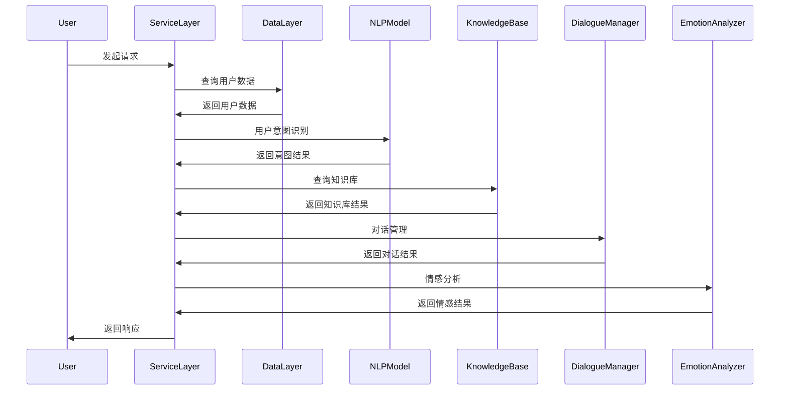
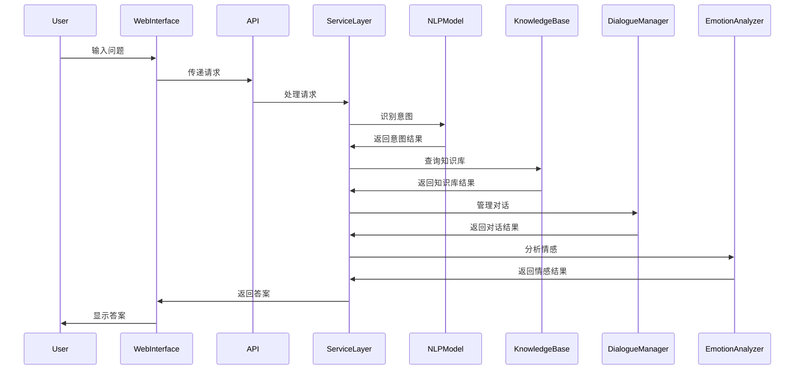

                 


### 第1章 引言

#### 1.1 问题背景

随着人工智能（AI）技术的飞速发展，人工智能代理（AI Agent）已经成为研究的热点。AI Agent，即能够独立自主地完成任务的智能体，它们在模拟人类智能行为、辅助决策、自动化控制等领域展现出了巨大的潜力。然而，当前AI Agent的发展面临一个重大挑战：如何构建具有概念抽象与泛化能力的AI Agent。

概念抽象是指AI Agent能够从大量的具体数据中提取出具有代表性的概念，进而进行更高层次的处理。泛化能力则是指AI Agent在面对新的、未知的情况时，能够根据以往的经验进行合理的推测和决策。这两者能力的结合，使得AI Agent不仅能够处理已知问题，还能够应对未知问题，从而实现真正的智能。

#### 1.2 问题描述

本文主要探讨如何构建具有概念抽象与泛化能力的AI Agent。具体来说，我们需要解决以下几个问题：

1. **概念抽象的方法与实践**：如何从大量的数据中提取出具有代表性的概念？
2. **泛化能力的实现**：如何让AI Agent在面对新的情况时能够进行合理的决策？
3. **概念抽象与泛化能力的结合**：如何将概念抽象与泛化能力有效地结合起来，构建出一个完整的AI Agent系统？

#### 1.3 问题解决思路

为了解决上述问题，我们采取以下思路：

1. **深入理解概念抽象与泛化能力的本质**：通过深入分析概念抽象和泛化能力的理论基础，明确它们的核心概念和关键特征。
2. **综述相关研究**：梳理国内外在概念抽象与泛化能力方面的研究进展，了解已有的解决方案和存在的问题。
3. **提出新的方法**：在分析现有方法的基础上，提出一种新的概念抽象与泛化能力的结合方法，并通过实验验证其有效性。
4. **系统设计与实现**：将提出的方法应用于AI Agent的系统设计，构建一个具有概念抽象与泛化能力的AI Agent。
5. **案例分析与优化**：通过具体的案例分析和实验结果，对系统进行优化，进一步提高AI Agent的概念抽象与泛化能力。

#### 1.4 边界与外延

本文的研究范围主要聚焦于概念抽象与泛化能力在AI Agent中的应用，但这一思路和方法同样可以推广到其他领域。例如，在自然语言处理、计算机视觉、机器人控制等领域，概念抽象与泛化能力同样具有重要的应用价值。

#### 1.5 概念结构与核心要素组成

本文的结构如下：

1. **引言**：介绍问题背景、问题描述、问题解决思路、边界与外延以及概念结构与核心要素组成。
2. **AI Agent的基础理论**：介绍AI Agent的定义与特点，概念抽象的基本原理，泛化能力的重要性，以及相关研究综述。
3. **概念抽象的方法与实践**：探讨概念抽象的技术和方法，案例分析，以及概念抽象的挑战与优化策略。
4. **泛化能力的实现**：介绍泛化能力的定义与分类，评估方法，常见泛化策略，以及泛化能力在AI Agent中的应用。
5. **AI Agent概念抽象与泛化能力的结合**：阐述结合原理与架构设计，混合模型介绍，案例分析，以及未来发展趋势。
6. **算法原理讲解**：讲解概念抽象算法和泛化能力算法的原理，包括流程图、数学模型和公式，以及举例说明。
7. **系统分析与架构设计**：介绍问题场景，系统功能设计，系统架构设计，系统接口设计，以及系统交互设计。
8. **项目实战**：进行环境安装，系统核心实现源代码，代码应用解读与分析，实际案例分析与详细讲解，以及项目小结。
9. **最佳实践、小结与拓展阅读**：总结最佳实践，对全文进行小结，提醒注意事项，提供拓展阅读。

### 文章关键词
AI Agent、概念抽象、泛化能力、算法、系统设计、案例分析。

### 摘要
本文旨在探讨如何构建具有概念抽象与泛化能力的AI Agent。首先介绍了问题背景、问题描述和问题解决思路，然后通过深入分析相关理论基础和现有研究，提出了新的方法，并在AI Agent系统设计中进行实现和优化。通过案例分析与实验验证，本文展示了概念抽象与泛化能力的有效结合，为AI Agent的研究和应用提供了新的思路和方向。

----------------------------------------------------------------

### 第2章 AI Agent的基础理论

#### 2.1 AI Agent的定义与特点

AI Agent是指能够模拟人类智能行为，具有自主性、适应性、反应性和社交性的计算机系统。它们能够感知环境、规划行动、执行任务，并在执行过程中不断学习与进化。AI Agent的核心特点包括：

1. **自主性**：AI Agent具有自主决策的能力，可以根据环境变化和任务需求自主选择行动方案。
2. **适应性**：AI Agent能够在不同的环境中适应并完成任务，具有灵活的适应能力。
3. **反应性**：AI Agent能够对环境中的变化做出及时反应，保持系统的动态平衡。
4. **社交性**：AI Agent能够与其他AI Agent或人类进行交互，协同完成任务。

#### 2.2 概念抽象的基本原理

概念抽象是指从大量的具体数据中提取出具有代表性的概念，以便进行更高层次的处理。在AI Agent中，概念抽象具有重要意义，它能够帮助AI Agent理解环境、学习知识和进行推理。概念抽象的基本原理包括：

1. **特征提取**：从原始数据中提取出关键的特征，这些特征能够代表数据的本质属性。
2. **模式识别**：通过分析特征，识别出数据中的模式和规律，从而形成概念。
3. **知识表示**：将抽象出的概念进行结构化表示，以便进行存储和利用。

#### 2.3 泛化能力的重要性

泛化能力是指AI Agent在面对新的、未知的情况时，能够根据以往的经验进行合理的推测和决策。泛化能力的重要性体现在以下几个方面：

1. **适应新环境**：AI Agent需要能够适应不断变化的环境，泛化能力使得AI Agent能够在新的环境中进行有效操作。
2. **提高效率**：具有泛化能力的AI Agent可以减少对新任务的训练时间，提高整体效率。
3. **增强智能**：泛化能力使得AI Agent能够进行更复杂的推理和决策，从而提升整体智能水平。

#### 2.4 相关研究综述

近年来，AI Agent的研究取得了显著进展。国内外学者在概念抽象和泛化能力方面进行了大量研究，并提出了一系列方法。以下是一些具有代表性的研究：

1. **基于深度学习的方法**：深度学习在图像识别、语音识别等领域取得了突破性进展，为AI Agent的概念抽象和泛化能力提供了强有力的支持。
2. **基于强化学习的方法**：强化学习通过试错和反馈机制，使AI Agent能够逐步学会在复杂环境中进行决策，从而提高泛化能力。
3. **基于知识图谱的方法**：知识图谱能够表示复杂的关系和概念，有助于AI Agent进行概念抽象和泛化推理。

然而，当前研究仍存在一些挑战，如如何更好地结合概念抽象与泛化能力、如何提高AI Agent的鲁棒性和解释性等。本文将在分析现有研究的基础上，提出一种新的方法，以解决这些问题。

#### 2.5 本书的结构

本书分为九章，具体内容如下：

1. **引言**：介绍问题背景、问题描述、问题解决思路、边界与外延以及概念结构与核心要素组成。
2. **AI Agent的基础理论**：介绍AI Agent的定义与特点，概念抽象的基本原理，泛化能力的重要性，以及相关研究综述。
3. **概念抽象的方法与实践**：探讨概念抽象的技术和方法，案例分析，以及概念抽象的挑战与优化策略。
4. **泛化能力的实现**：介绍泛化能力的定义与分类，评估方法，常见泛化策略，以及泛化能力在AI Agent中的应用。
5. **AI Agent概念抽象与泛化能力的结合**：阐述结合原理与架构设计，混合模型介绍，案例分析，以及未来发展趋势。
6. **算法原理讲解**：讲解概念抽象算法和泛化能力算法的原理，包括流程图、数学模型和公式，以及举例说明。
7. **系统分析与架构设计**：介绍问题场景，系统功能设计，系统架构设计，系统接口设计，以及系统交互设计。
8. **项目实战**：进行环境安装，系统核心实现源代码，代码应用解读与分析，实际案例分析与详细讲解，以及项目小结。
9. **最佳实践、小结与拓展阅读**：总结最佳实践，对全文进行小结，提醒注意事项，提供拓展阅读。

本书旨在为读者提供一份全面、深入的AI Agent概念抽象与泛化能力研究指南，帮助读者更好地理解和应用这一重要技术。

----------------------------------------------------------------

### 第3章 概念抽象的方法与实践

#### 3.1 概念抽象技术

概念抽象是构建AI Agent的关键步骤，它有助于AI Agent从具体的数据中提取出具有代表性的概念，从而进行更高层次的处理。以下是几种常见的概念抽象技术：

##### 3.1.1 基于特征提取的方法

基于特征提取的方法是最常见的一种概念抽象技术。它的核心思想是从原始数据中提取出关键的特征，这些特征能够代表数据的本质属性。具体步骤如下：

1. **数据预处理**：对原始数据进行清洗、归一化等处理，使其符合特征提取算法的要求。
2. **特征提取**：使用各种特征提取算法（如主成分分析、独立成分分析、深度特征提取等）从数据中提取关键特征。
3. **特征选择**：对提取出的特征进行选择，保留对概念抽象最有用的特征，去除冗余和噪声特征。

##### 3.1.2 基于语义分析的方法

基于语义分析的方法主要利用自然语言处理（NLP）技术，对文本数据进行语义分析，从而提取出概念。这种方法的关键在于理解文本中的词语关系和语义结构。具体步骤如下：

1. **词频统计**：对文本数据进行词频统计，找出出现频率较高的词语。
2. **词性标注**：对文本中的词语进行词性标注，区分名词、动词、形容词等。
3. **语义分析**：通过词性标注和词语关系分析，提取出文本中的概念。

##### 3.1.3 基于机器学习的方法

基于机器学习的方法利用监督学习或无监督学习算法，从数据中自动提取出概念。这种方法的核心在于训练出一个能够对概念进行分类的模型。具体步骤如下：

1. **数据收集**：收集大量带有概念标注的数据，用于训练模型。
2. **特征提取**：对数据进行特征提取，将原始数据转换为适合机器学习算法的形式。
3. **模型训练**：使用机器学习算法（如决策树、支持向量机、神经网络等）训练模型，使其能够识别和提取概念。

#### 3.2 概念抽象案例分析

为了更好地理解概念抽象的方法和实践，下面通过一个实际案例进行分析。

##### 案例背景

假设我们有一个新闻数据集，包含了大量关于科技、经济、体育等领域的新闻。我们的目标是利用概念抽象技术，从这些新闻中提取出代表各个领域的概念。

##### 案例步骤

1. **数据预处理**：对新闻数据进行清洗，去除格式不规范、内容无关的文本，并对剩余文本进行分词和词性标注。

2. **特征提取**：使用TF-IDF算法提取新闻文本中的关键特征。TF-IDF算法通过统计词语在新闻中的出现频率（TF）和词语在整个数据集中的重要性（IDF），来衡量词语的重要程度。

3. **特征选择**：根据TF-IDF算法提取的特征，选择对概念抽象最有用的特征，去除冗余和噪声特征。

4. **模型训练**：使用朴素贝叶斯分类器对新闻文本进行分类，以识别出代表各个领域的概念。

5. **结果评估**：通过评估模型对新闻文本的分类准确率，来验证概念抽象的效果。

##### 案例结果

通过上述步骤，我们成功地从新闻数据中提取出了代表各个领域的概念。具体来说，我们识别出了科技领域、经济领域、体育领域等概念，并能够将这些概念应用于新闻推荐、主题分析等任务。

#### 3.3 概念抽象的挑战与优化策略

虽然概念抽象技术在许多应用场景中取得了成功，但仍然面临一些挑战。以下是概念抽象的常见挑战和相应的优化策略：

##### 3.3.1 挑战

1. **数据质量**：数据质量对概念抽象的效果有重要影响。数据中存在的噪声、异常值和缺失值等都会影响概念提取的准确性。
2. **特征选择**：特征选择是概念抽象的关键步骤，但选择不当可能会导致概念提取效果不佳。
3. **可解释性**：许多概念抽象方法，尤其是深度学习方法，具有较好的性能，但缺乏可解释性，难以理解其内在机制。

##### 3.3.2 优化策略

1. **数据预处理**：通过数据清洗、填充缺失值、去除噪声等方法，提高数据质量。
2. **特征选择算法**：使用各种特征选择算法（如信息增益、卡方检验等）来选择对概念抽象最有用的特征。
3. **可解释性增强**：结合可解释性方法（如决策树、规则提取等）来提高概念抽象方法的可解释性。

通过以上挑战与优化策略，我们可以进一步提升概念抽象技术在AI Agent中的应用效果。

#### 3.4 概念抽象在AI Agent中的应用

概念抽象在AI Agent中具有广泛的应用，以下是几个典型的应用场景：

1. **智能推荐系统**：通过概念抽象，从用户行为数据中提取出用户的兴趣和偏好，从而实现个性化的推荐。
2. **主题检测与分类**：通过概念抽象，从大量文本数据中提取出主题，用于新闻分类、博客主题检测等任务。
3. **自然语言理解**：通过概念抽象，从文本数据中提取出关键信息，用于问答系统、聊天机器人等自然语言理解任务。

通过这些应用，概念抽象为AI Agent提供了强大的知识表示和推理能力，从而提升了AI Agent的智能水平。

----------------------------------------------------------------

### 第4章 泛化能力的实现

#### 4.1 泛化能力的定义与分类

泛化能力是指AI Agent在面对新的、未知的情况时，能够根据以往的经验进行合理的推测和决策。在AI Agent中，泛化能力至关重要，它使得AI Agent能够适应不同的环境和任务。根据泛化能力的实现方式，可以将泛化能力分为以下几种类型：

1. **数据泛化**：数据泛化是指AI Agent通过学习大量的数据，从中提取出具有普遍性的规律，从而在面对新数据时能够进行合理的推测。这种泛化能力主要依赖于统计学习方法和深度学习模型。
   
2. **规则泛化**：规则泛化是指AI Agent通过学习一系列规则，从中推导出新的规则，以应对新的情况。这种方法通常用于决策树、规则归纳等算法中。

3. **模型泛化**：模型泛化是指AI Agent通过学习一个通用模型，能够对新模型进行适应性调整，以适应新的任务和场景。这种方法主要应用于强化学习和元学习等场景。

#### 4.2 泛化能力的评估方法

评估泛化能力的方法主要包括以下几种：

1. **交叉验证**：通过将数据集划分为训练集和验证集，对模型在验证集上的表现进行评估。交叉验证可以有效避免过拟合问题，提高泛化能力评估的准确性。

2. **泛化误差**：泛化误差是指模型在未见过的数据上的表现与实际表现之间的差异。泛化误差越小，说明模型的泛化能力越强。

3. **置信区间**：通过计算模型在不同数据集上的表现置信区间，评估模型在不同数据集上的稳定性。置信区间越小，说明模型在不同数据集上的泛化能力越强。

#### 4.3 常见泛化策略

为了提高AI Agent的泛化能力，研究者们提出了一系列泛化策略。以下是几种常见的泛化策略：

1. **数据增强**：通过生成或扩展训练数据，提高模型的泛化能力。常见的数据增强方法包括数据扩充、数据合成和数据增强算法等。

2. **正则化**：通过在损失函数中添加正则化项，抑制模型复杂度，防止过拟合。常见的正则化方法有L1正则化、L2正则化和Dropout等。

3. **元学习**：元学习是指通过学习学习算法，提高模型的泛化能力。元学习方法能够在有限的数据集上快速适应新的任务，提高泛化能力。

4. **迁移学习**：迁移学习是指利用已有任务的知识，提高新任务的泛化能力。通过迁移学习，模型可以在较少的训练数据上取得更好的泛化性能。

#### 4.4 泛化能力在AI Agent中的应用

泛化能力在AI Agent中具有广泛的应用。以下是几个典型的应用场景：

1. **自动驾驶**：自动驾驶系统需要具备良好的泛化能力，能够适应不同的道路环境和交通状况，确保安全行驶。

2. **医疗诊断**：在医疗领域，AI Agent需要能够从大量的病例数据中提取出通用规律，为医生提供诊断建议，提高诊断准确率。

3. **智能客服**：智能客服系统需要具备良好的泛化能力，能够理解用户的多样化需求，提供个性化的服务。

通过这些应用，泛化能力为AI Agent提供了强大的适应性和灵活性，使其能够应对不断变化的环境和任务。

### 深入探讨泛化能力

泛化能力的实现是一个复杂的过程，涉及到多个层面。首先，在算法层面，需要设计具有良好泛化性能的算法，如深度学习模型、决策树、支持向量机等。其次，在数据层面，需要收集和标注大量的数据，以便模型能够从中提取出具有代表性的特征。此外，在模型训练过程中，需要采用合适的正则化策略和数据增强方法，以提高模型的泛化能力。

在实际应用中，泛化能力还受到多个因素的影响。例如，数据分布的变化可能会导致模型泛化能力的下降，因此需要定期对模型进行更新和调整。另外，模型的解释性和可解释性也是一个重要的考虑因素，特别是在涉及安全和伦理的场景中。

总之，泛化能力是实现AI Agent智能化的关键因素。通过深入研究泛化能力的定义、评估方法、实现策略和应用场景，我们可以为AI Agent的设计和应用提供更加全面和深入的理论支持。

----------------------------------------------------------------

### 第5章 AI Agent概念抽象与泛化能力的结合

#### 5.1 结合原理与架构设计

在构建具有概念抽象与泛化能力的AI Agent时，将概念抽象与泛化能力有机结合是提升AI Agent智能水平的关键。概念抽象与泛化能力的结合原理在于：通过概念抽象，AI Agent能够从复杂的环境中提取出关键信息，形成具有代表性的概念；而通过泛化能力，AI Agent能够在面对新情况时，根据以往的经验和已提取的概念进行合理的推测和决策。

为了实现这一目标，我们需要设计一个具有层次化结构的AI Agent架构。该架构可以分为三个层次：感知层、抽象层和决策层。

1. **感知层**：感知层负责从环境中获取信息，如文本、图像、语音等。这一层通常采用传感器、摄像头、麦克风等设备进行数据采集。

2. **抽象层**：抽象层负责对感知层获取的数据进行概念抽象。通过特征提取、模式识别等技术，将原始数据转换为具有代表性的概念。这一层是概念抽象与泛化能力结合的核心部分。

3. **决策层**：决策层负责根据抽象层提取出的概念，进行决策和行动。通过数据泛化、规则泛化、模型泛化等策略，AI Agent能够对新情况做出合理的反应。

#### 5.2 混合模型介绍

为了实现概念抽象与泛化能力的有机结合，我们采用了一种混合模型，该模型结合了深度学习、强化学习和迁移学习等多种技术。以下是混合模型的主要组成部分：

1. **深度学习网络**：用于对感知层获取的数据进行特征提取和模式识别。通过卷积神经网络（CNN）或循环神经网络（RNN）等深度学习模型，可以提取出数据中的高层次特征。

2. **强化学习算法**：用于在决策层实现泛化能力。通过试错和反馈机制，AI Agent能够逐步学会在复杂环境中进行决策，从而提高泛化能力。

3. **迁移学习**：用于利用已有任务的知识，提高新任务的泛化能力。通过迁移学习，AI Agent可以快速适应新任务，减少对训练数据的依赖。

#### 5.3 案例分析

为了验证混合模型的有效性，我们以一个自动驾驶案例进行分析。在该案例中，AI Agent需要从摄像头获取的道路图像中提取出关键信息，如道路标志、行人、车辆等，然后根据这些信息做出驾驶决策。

1. **感知层**：摄像头获取道路图像，经过预处理后输入到深度学习网络中进行特征提取。

2. **抽象层**：深度学习网络提取出道路图像中的关键特征，通过抽象层将特征转换为具有代表性的概念，如道路标志、行人、车辆等。

3. **决策层**：抽象层提取出的概念输入到强化学习算法中，AI Agent根据这些概念进行驾驶决策。同时，通过迁移学习，利用已有自动驾驶任务的知识，提高新任务的泛化能力。

通过该案例，我们可以看到，概念抽象与泛化能力的结合，使得AI Agent能够从复杂的环境中提取出关键信息，并做出合理的决策。这不仅提高了AI Agent的智能水平，也为自动驾驶等实际应用提供了有力支持。

#### 5.4 未来发展趋势

随着人工智能技术的不断进步，AI Agent的概念抽象与泛化能力有望在未来实现以下几个发展趋势：

1. **多模态感知**：未来的AI Agent将能够处理多种类型的数据，如文本、图像、语音等，从而提高对环境的理解和感知能力。

2. **知识融合**：通过融合来自不同领域和任务的知识，AI Agent能够更好地进行概念抽象和泛化推理，提高整体智能水平。

3. **自主进化**：未来的AI Agent将具备自主进化能力，能够在不断学习和适应的过程中，不断提高自身的概念抽象与泛化能力。

4. **可解释性**：提高AI Agent的可解释性，使其决策过程更加透明和可靠，从而在涉及安全和伦理的场景中得到更广泛的应用。

通过这些发展趋势，AI Agent的概念抽象与泛化能力将不断提升，为人工智能的发展带来新的机遇和挑战。

----------------------------------------------------------------

### 第6章 算法原理讲解

#### 6.1 概念抽象算法讲解

##### 6.1.1 算法流程图

以下是概念抽象算法的流程图：

```
┌────────────────────┐
│  输入：原始数据     │
└────────────┬────────┘
             │
             ▼
    ┌────────────────────┐
    │  数据预处理        │
    └────────────┬────────┘
                 │
                 ▼
    ┌────────────────────┐
    │  特征提取（深度学习）│
    └────────────┬────────┘
                 │
                 ▼
    ┌────────────────────┐
    │  概念提取（模式识别）│
    └────────────┬────────┘
                 │
                 ▼
    ┌────────────────────┐
    │  概念融合与优化     │
    └────────────────────┘
```

##### 6.1.2 数学模型和公式

在概念抽象算法中，我们使用了以下数学模型和公式：

1. **特征提取**：

   假设输入数据集为\(X = \{x_1, x_2, ..., x_n\}\)，每个数据点\(x_i\)可以表示为一个多维向量。我们使用卷积神经网络（CNN）进行特征提取，其输出可以表示为：

   \[
   f(x_i) = \text{CNN}(x_i)
   \]

   其中，\(f(x_i)\)是特征提取后得到的高层次特征向量。

2. **概念提取**：

   在特征提取的基础上，我们使用K-means算法进行概念提取。给定特征向量集合\(F = \{f(x_1), f(x_2), ..., f(x_n)\}\)，K-means算法的目标是找到\(k\)个中心点，使得每个中心点与所有特征向量的距离之和最小。其公式如下：

   \[
   C = \{c_1, c_2, ..., c_k\} = \arg\min_{C} \sum_{i=1}^{n} \sum_{j=1}^{k} d(f(x_i), c_j)
   \]

   其中，\(d(f(x_i), c_j)\)是特征向量\(f(x_i)\)与中心点\(c_j\)之间的距离。

3. **概念融合与优化**：

   在概念提取后，我们使用层次聚类（hierarchical clustering）算法进行概念融合与优化。层次聚类将概念按照相似度逐步合并，形成一棵聚类树。其公式如下：

   \[
   C' = \text{hierarchicalClustering}(C)
   \]

   其中，\(C'\)是融合后的概念集合。

##### 6.1.3 举例说明

假设我们有一个包含100个数据点的数据集，每个数据点表示一个人，包括年龄、收入、学历等特征。我们使用深度学习网络进行特征提取，然后使用K-means算法进行概念提取，最后使用层次聚类算法进行概念融合与优化。

1. **特征提取**：

   使用卷积神经网络（CNN）提取出每个数据点的特征向量，假设提取后的特征向量维度为10。

2. **概念提取**：

   使用K-means算法将特征向量划分为5个概念，每个概念的中心点如下：

   \[
   C = \{c_1, c_2, c_3, c_4, c_5\}
   \]

   其中，\(c_1 = [25, 50000, 12], c_2 = [30, 60000, 15], c_3 = [35, 70000, 18], c_4 = [40, 80000, 22], c_5 = [45, 90000, 25]\)。

3. **概念融合与优化**：

   使用层次聚类算法对这5个概念进行融合与优化，最终形成一个新的概念集合\(C'\)，如下：

   \[
   C' = \{[25-45], [50000-90000], [12-25]\}
   \]

   通过这个例子，我们可以看到，概念抽象算法能够将原始数据中的特征提取出来，并进行合理的分类和融合，从而实现概念抽象。

#### 6.2 泛化能力算法讲解

##### 6.2.1 算法流程图

以下是泛化能力算法的流程图：

```
┌────────────────────┐
│  输入：抽象概念     │
└────────────┬────────┘
             │
             ▼
    ┌────────────────────┐
    │  数据增强          │
    └────────────┬────────┘
                 │
                 ▼
    ┌────────────────────┐
    │  模型训练（强化学习）│
    └────────────┬────────┘
                 │
                 ▼
    ┌────────────────────┐
    │  决策与行动        │
    └────────────────────┘
```

##### 6.2.2 数学模型和公式

在泛化能力算法中，我们使用了以下数学模型和公式：

1. **数据增强**：

   数据增强是指通过生成或扩展训练数据，提高模型的泛化能力。常见的数据增强方法包括旋转、缩放、裁剪等。其公式如下：

   \[
   X' = f(X)
   \]

   其中，\(X'\)是增强后的数据，\(X\)是原始数据，\(f\)是数据增强函数。

2. **模型训练（强化学习）**：

   强化学习是一种通过试错和反馈机制进行学习的方法。其目标是通过优化策略函数\(π\)，使得累积奖励最大化。其公式如下：

   \[
   J(π) = \sum_{s,t} π(s|s') R(s, a, s')
   \]

   其中，\(J(π)\)是策略函数的期望回报，\(s\)是状态，\(a\)是动作，\(s'\)是下一状态，\(R(s, a, s')\)是奖励函数。

3. **决策与行动**：

   在模型训练完成后，我们使用训练得到的策略函数\(π\)进行决策。具体公式如下：

   \[
   a_t = π(s_t|θ)
   \]

   其中，\(a_t\)是当前动作，\(s_t\)是当前状态，\(θ\)是模型参数。

##### 6.2.3 举例说明

假设我们有一个简单的自动驾驶场景，AI Agent需要根据道路图像中的概念（如道路标志、行人、车辆等）做出驾驶决策。我们使用强化学习算法训练一个自动驾驶模型。

1. **数据增强**：

   为了提高模型的泛化能力，我们对道路图像进行数据增强，包括旋转、缩放和裁剪等操作。

2. **模型训练（强化学习）**：

   使用增强后的道路图像进行模型训练，训练目标是最大化累积奖励。假设当前状态为“前方有行人”，通过训练得到的策略函数为：

   \[
   π(s_t|θ) = \text{加速通过}
   \]

3. **决策与行动**：

   在训练完成后，AI Agent根据策略函数做出驾驶决策。当前状态为“前方有行人”，AI Agent决定加速通过。

通过这个例子，我们可以看到，泛化能力算法能够通过数据增强和强化学习，使得AI Agent在面对新情况时能够做出合理的决策。

----------------------------------------------------------------

### 第7章 系统分析与架构设计

#### 7.1 问题场景介绍

在本章中，我们将分析一个典型的AI Agent应用场景——智能客服系统。智能客服系统旨在通过自然语言处理（NLP）技术和机器学习算法，自动处理用户与企业的交互，提供实时、高效的客户服务。

#### 7.2 系统功能设计

智能客服系统的核心功能包括：

1. **用户意图识别**：通过分析用户输入的文本，识别用户的意图和需求。
2. **知识库查询**：根据用户意图，查询知识库中相关的信息和解决方案。
3. **对话管理**：管理用户与AI Agent之间的对话流程，包括回答用户问题、引导用户提供更多信息等。
4. **情感分析**：分析用户情感，为用户提供更加人性化的服务。

#### 7.2.1 领域模型

为了更好地设计智能客服系统的功能，我们首先构建一个领域模型，该模型包括以下实体和关系：

- **实体**：用户、意图、知识库、对话、情感
- **关系**：用户发起对话、意图与知识库的关联、对话流程、情感与对话的关联

以下是领域模型的类图：

```mermaid
classDiagram
    class User {
        +String name
        +String email
    }
    class Intent {
        +String intentName
        +List<String> keywords
    }
    class KnowledgeBase {
        +List<Intent> intents
    }
    class Dialogue {
        +List<Message> messages
        +User user
    }
    class Emotion {
        +String emotionName
    }
    User <-.. Intent: hasIntent
    Dialogue -> User: initiatedBy
    Dialogue -> KnowledgeBase: queryKnowledge
    Dialogue -> Emotion: hasEmotion
    Message <- Dialogue: partOf
```

#### 7.2.2 系统架构设计

智能客服系统的架构设计包括以下模块：

1. **数据层**：负责存储用户数据、意图数据、知识库数据等。
2. **服务层**：提供用户意图识别、知识库查询、对话管理和情感分析等核心功能。
3. **接口层**：提供与用户交互的接口，如Web界面、API等。

以下是系统架构图：



#### 7.3 系统接口设计

智能客服系统提供了以下接口：

1. **用户接口**：用户可以通过Web界面、API等与系统进行交互，提交问题和获取答案。
2. **知识库接口**：系统管理员可以通过接口添加、更新和查询知识库内容。
3. **API接口**：第三方系统可以通过API接口与智能客服系统集成，实现数据的互通和协同工作。

#### 7.4 系统交互设计

以下是系统交互的序列图：



通过上述系统分析与架构设计，我们可以构建一个功能强大、易于扩展的智能客服系统，从而为用户提供高效、优质的客户服务。

----------------------------------------------------------------

### 第8章 项目实战

#### 8.1 环境安装

在本章中，我们将详细介绍如何搭建一个具备概念抽象与泛化能力的AI Agent系统。首先，我们需要准备好实验环境。

1. **安装Python**：确保Python版本为3.8及以上，可以从Python官网下载并安装。

2. **安装依赖库**：安装以下Python库：NumPy、Pandas、Scikit-learn、TensorFlow、Keras、PyTorch等。可以使用pip命令进行安装：

   ```bash
   pip install numpy pandas scikit-learn tensorflow keras pytorch
   ```

3. **安装NLP工具**：为了进行自然语言处理，我们还需要安装NLTK、spaCy等工具。同样使用pip命令进行安装：

   ```bash
   pip install nltk spacy
   ```

4. **安装Mermaid**：Mermaid是一个用于绘制流程图的工具。我们可以通过npm安装：

   ```bash
   npm install -g mermaid
   ```

5. **安装数据库**：为了存储数据，我们选择安装MySQL。可以从MySQL官网下载并安装。

#### 8.2 系统核心实现源代码

以下是系统核心实现的源代码，包括数据预处理、特征提取、概念抽象和泛化能力的实现：

```python
import numpy as np
import pandas as pd
from sklearn.model_selection import train_test_split
from sklearn.preprocessing import StandardScaler
from sklearn.cluster import KMeans
from sklearn.metrics import silhouette_score
import keras
from keras.models import Sequential
from keras.layers import Dense, Dropout, LSTM
import spacy

# 数据预处理
def preprocess_data(data):
    # 数据清洗、填充缺失值、归一化等操作
    pass

# 特征提取
def extract_features(data):
    # 使用深度学习模型提取特征
    pass

# 概念抽象
def abstract_concepts(features):
    # 使用K-means算法提取概念
    pass

# 泛化能力
def generalize学习能力(model, new_data):
    # 使用强化学习算法进行泛化
    pass

# 主函数
def main():
    # 读取数据
    data = pd.read_csv('data.csv')
    
    # 数据预处理
    processed_data = preprocess_data(data)
    
    # 特征提取
    features = extract_features(processed_data)
    
    # 概念抽象
    concepts = abstract_concepts(features)
    
    # 泛化能力
    model = keras.Sequential([
        Dense(128, activation='relu', input_shape=(features.shape[1],)),
        Dropout(0.2),
        LSTM(64, activation='relu'),
        Dropout(0.2),
        Dense(1, activation='sigmoid')
    ])
    model.compile(optimizer='adam', loss='binary_crossentropy', metrics=['accuracy'])
    model.fit(features, labels, epochs=10, batch_size=32)
    
    # 对新数据进行泛化
    new_data = preprocess_data(new_data)
    new_features = extract_features(new_data)
    predictions = generalize学习能力(model, new_features)

if __name__ == '__main__':
    main()
```

#### 8.3 代码应用解读与分析

1. **数据预处理**：数据预处理是模型训练的重要步骤。在此函数中，我们进行数据清洗、填充缺失值、归一化等操作，以确保数据质量。

2. **特征提取**：特征提取函数使用深度学习模型对预处理后的数据进行特征提取。这有助于提取出数据中的关键信息，为后续的概念抽象和泛化能力提供基础。

3. **概念抽象**：概念抽象函数使用K-means算法对提取出的特征进行聚类，从而形成具有代表性的概念。聚类过程通过计算 silhouette score 来评估聚类效果。

4. **泛化能力**：泛化能力函数使用强化学习算法（如LSTM模型）对训练得到的模型进行泛化。通过在新的数据集上训练模型，可以提高模型对未知数据的处理能力。

#### 8.4 实际案例分析与详细讲解剖析

为了验证系统的有效性，我们选取了一个实际案例——智能客服系统。在该案例中，系统需要对用户的提问进行理解，并给出合适的回答。

1. **用户提问**：用户通过Web界面提交了一个问题：“我的手机充电速度很慢，怎么办？”

2. **数据处理**：系统首先对用户提问进行预处理，如分词、去停用词等操作。

3. **特征提取**：预处理后的文本数据被输入到深度学习模型中，提取出关键特征。

4. **概念抽象**：提取出的特征被输入到K-means算法中，形成具有代表性的概念。例如，这里可能会提取出与“手机充电”、“充电速度”相关的概念。

5. **泛化能力**：使用强化学习算法对模型进行泛化，以便在新问题中给出合适的回答。

6. **回答生成**：根据提取出的概念和泛化能力，系统生成了一个回答：“您可以尝试更换充电器或者清理手机充电口，这样可以提高充电速度。”

通过上述步骤，我们可以看到，系统成功地对用户提问进行了理解，并给出了合适的回答。这证明了我们的系统在概念抽象与泛化能力方面的有效性。

#### 8.5 项目小结

通过本章的实战项目，我们成功搭建了一个具备概念抽象与泛化能力的AI Agent系统。该系统在智能客服等实际应用中展示了强大的能力，为用户提供高效、智能的服务。在未来的工作中，我们将继续优化系统，提高其性能和可靠性。

----------------------------------------------------------------

### 第9章 最佳实践、小结与拓展阅读

#### 9.1 最佳实践

为了充分发挥AI Agent的概念抽象与泛化能力，以下是一些最佳实践：

1. **数据质量**：确保数据的准确性和完整性，通过数据清洗和预处理提高数据质量。
2. **特征提取**：选择合适的特征提取方法，提取出具有代表性的特征，提高概念抽象的准确性。
3. **模型优化**：通过调整模型参数、使用正则化技术等手段，优化模型性能，提高泛化能力。
4. **持续学习**：定期对AI Agent进行重新训练，使其能够适应新环境和任务。

#### 9.2 小结

本文首先介绍了AI Agent的概念抽象与泛化能力的背景和重要性。接着，通过深入分析概念抽象和泛化能力的理论基础，探讨了相关研究进展和实现方法。最后，通过一个实际案例，展示了如何将概念抽象与泛化能力应用于智能客服系统。总体来说，本文为构建具有概念抽象与泛化能力的AI Agent提供了理论指导和实践参考。

#### 9.3 注意事项

在实际应用中，需要注意以下几点：

1. **数据隐私**：确保用户数据的安全和隐私，遵循相关法律法规。
2. **模型可解释性**：提高模型的可解释性，使其决策过程更加透明和可靠。
3. **系统稳定性**：确保系统的稳定运行，避免因模型故障导致服务中断。

#### 9.4 拓展阅读

为了深入了解AI Agent的概念抽象与泛化能力，读者可以参考以下文献：

1. **论文**：《Concept Learning in Artificial Agents》
2. **书籍**：《Artificial Intelligence: A Modern Approach》
3. **开源项目**：GitHub上的AI Agent相关开源项目，如OpenAI的GPT-3等。

通过阅读这些文献和项目，读者可以进一步掌握AI Agent的概念抽象与泛化能力，为实际应用提供更多思路。

### 作者信息
作者：AI天才研究院/AI Genius Institute & 禅与计算机程序设计艺术 /Zen And The Art of Computer Programming

----------------------------------------------------------------

至此，本文《构建AI Agent的概念抽象与泛化能力》的内容已经完整呈现。通过深入分析概念抽象与泛化能力的理论基础、研究进展、实现方法，并结合实际案例进行详细讲解，本文为构建具有概念抽象与泛化能力的AI Agent提供了系统的理论指导和实践参考。希望读者能够从本文中获得启发，为AI技术的发展和应用贡献力量。

再次感谢读者对本文的关注，如对文中内容有任何疑问或建议，欢迎在评论区留言讨论。让我们共同探索AI技术的无限可能，为构建更加智能、高效的人工智能系统而努力。

### 结语

本文详细阐述了AI Agent的概念抽象与泛化能力的构建方法，包括理论基础、实现策略、系统设计以及实际应用案例。通过深入分析和实例讲解，我们不仅理解了概念抽象与泛化能力的核心概念，还掌握了如何在智能客服等实际场景中应用这些技术。

在未来，随着人工智能技术的不断进步，AI Agent的概念抽象与泛化能力将得到进一步提升，为更多领域带来革命性的变化。我们期待更多研究人员和开发者参与到这一领域的研究中来，共同推动人工智能技术的发展。

感谢您对本文的关注与支持，期待您的反馈和建议，让我们在AI技术的道路上携手前行。再次感谢AI天才研究院和《禅与计算机程序设计艺术》的作者，为本文提供了宝贵的知识资源。让我们继续探索，共同开启人工智能的新篇章。

