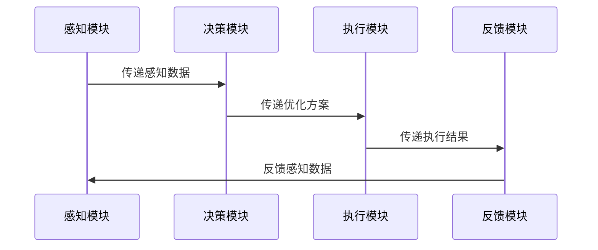

                 


### 引言

随着人工智能技术的迅猛发展，AI Agent已成为现代智能系统中的重要组成部分。AI Agent，即人工智能代理，是一种能够自主执行任务并与环境交互的智能体。它们广泛应用于智能客服、自动驾驶、智能推荐系统等领域，极大地提升了生产效率和用户体验。然而，AI Agent的复杂性和高度依赖数据特性使得其测试与评估成为了一项极具挑战性的任务。

本文旨在构建一个全面且实用的AI Agent测试与评估框架，帮助开发者和研究人员更好地理解、测试和评估AI Agent的性能。文章将从基础理论出发，详细探讨AI Agent的定义、分类、应用场景以及核心概念和联系。随后，将深入分析AI Agent的数学模型与算法原理，并介绍其系统分析与架构设计。在此基础上，我们将重点讨论AI Agent的测试与评估方法，包括测试用例设计、测试执行与结果分析以及评估指标与方法。最后，通过实战案例分享与最佳实践指导，为读者提供切实可行的操作建议。通过本文的深入探讨，希望能够为AI Agent的开发与优化提供有价值的参考。

## AI Agent概述

### 1.1 AI Agent的定义与特点

AI Agent，即人工智能代理，是一个具有自主性和交互性的计算实体，能够在复杂环境中通过感知、决策和行动来完成任务。不同于传统软件系统，AI Agent能够实时与环境进行交互，并根据环境变化自主调整行为策略。其核心特点包括：

1. **自主性**：AI Agent能够独立执行任务，无需人工干预。它们通过内部决策机制，根据当前环境和预定的目标自动选择行动。
   
2. **交互性**：AI Agent具备与环境交互的能力，能够感知环境变化，并通过动作影响环境状态。这种交互性使得AI Agent能够在复杂动态环境中适应和优化其行为。

3. **适应性**：AI Agent能够通过学习不断改进其行为策略，以应对不同的环境和任务需求。这种适应性是AI Agent区别于传统自动化系统的重要特征。

4. **智能化**：AI Agent集成了多种人工智能技术，如机器学习、自然语言处理、计算机视觉等，使其能够在复杂的任务中展现出高度智能化。

与传统的智能系统相比，AI Agent具有更高的灵活性和自主性。传统智能系统通常在特定场景下进行预设，而AI Agent则能够在未知的复杂环境中自主探索和适应。此外，传统智能系统依赖固定的程序逻辑，而AI Agent则能够通过学习和反馈不断优化其表现。

### 1.2 AI Agent的分类

根据不同的实现方式和应用场景，AI Agent可以划分为多种类型：

1. **基于规则的AI Agent**：这类AI Agent通过预定义的规则来执行任务。它们适用于规则明确且不经常变化的场景，如自动化客服系统。

2. **基于模型的AI Agent**：这类AI Agent基于学习到的模型来执行任务。通过机器学习算法，这类Agent能够从数据中自动学习并优化行为策略。它们适用于复杂且多变的环境，如自动驾驶。

3. **基于数据的AI Agent**：这类AI Agent依赖于大量的数据来执行任务。它们通常使用深度学习技术，通过训练模型来实现复杂任务的自动化。例如，智能推荐系统就利用用户历史行为数据来生成个性化的推荐。

4. **混合型AI Agent**：这类AI Agent结合了基于规则、基于模型和基于数据的特性，能够在不同的应用场景中灵活切换。它们适用于高度复杂和多变的任务，如智能电网管理。

### 1.3 AI Agent的应用场景

AI Agent的广泛应用使其在多个领域都发挥着重要作用：

1. **人工智能客服**：AI Agent能够模拟人类客服，通过自然语言处理技术理解用户问题并给出合适的回复，极大地提升了客服效率和用户体验。

2. **智能推荐系统**：AI Agent通过分析用户行为和偏好，为用户推荐个性化的商品、服务和内容，有效提升了用户满意度和商业转化率。

3. **自动驾驶**：AI Agent在自动驾驶系统中扮演着核心角色，通过感知环境、做出决策和执行行动，实现车辆的自主驾驶。

4. **智能家居**：AI Agent能够与各种智能设备交互，为用户提供便捷的智能家居体验，如自动调节室内温度、灯光和安全系统。

5. **金融风控**：AI Agent通过分析大量金融数据，识别潜在的风险并给出相应的风险控制建议，帮助金融机构提高风险管理能力。

通过上述对AI Agent的定义、分类和应用场景的探讨，我们可以更深入地理解AI Agent在人工智能领域的地位和作用。在接下来的章节中，我们将进一步分析AI Agent的核心概念与联系，并探讨其数学模型与算法原理。

## AI Agent的核心概念与联系

### 2.1 AI Agent的核心概念

AI Agent的设计与实现依赖于几个核心概念，这些概念共同构成了AI Agent的运作基础。以下是AI Agent中最为重要的三个核心概念：

1. **知觉**：知觉是指AI Agent从环境中获取信息的能力。通过感知传感器，AI Agent能够获取关于环境状态的数据。例如，在自动驾驶系统中，AI Agent会通过摄像头、激光雷达和GPS传感器来获取周围的道路、车辆和行人的信息。

2. **动作**：动作是指AI Agent根据知觉到的信息采取的行动。动作可以是物理上的，如自动驾驶车辆的行驶和转向，也可以是虚拟的，如智能客服系统中的文本回复。AI Agent的动作旨在实现其预定的目标，并应对环境变化。

3. **知觉-动作循环**：知觉-动作循环是指AI Agent持续不断地进行知觉、决策和动作的过程。在这一循环中，AI Agent通过感知环境状态，利用内部算法进行决策，并执行相应的动作。随后，这些动作会反馈到环境中，进而影响环境状态，AI Agent再次进行感知。这种循环使得AI Agent能够实时调整其行为策略，以适应不断变化的环境。

### 2.2 AI Agent的概念属性特征对比

为了更好地理解AI Agent的核心概念，我们可以通过表格形式对比这些概念的特征：

| 特征        | 知觉         | 动作          | 知觉-动作循环    |
| ----------- | ------------- | ------------- | ---------------- |
| 定义        | 信息获取      | 行为执行      | 连续反馈与调整   |
| 关键技术    | 传感器技术    | 控制算法      | 实时决策与执行   |
| 应用场景    | 监测与感知    | 交互与驱动    | 自适应与环境交互 |
| 对环境的影响 | 提供环境数据  | 改变环境状态  | 持续优化行为     |

通过这个表格，我们可以看到知觉、动作和知觉-动作循环在实现方式、应用场景和对环境的影响上存在显著差异。这种对比有助于我们深入理解AI Agent的运作机制和设计原则。

### 2.3 AI Agent的ER实体关系图

为了更直观地展示AI Agent中核心概念的相互关系，我们可以使用Mermaid流程图来绘制其ER实体关系图。以下是AI Agent的ER实体关系图的Markdown格式表示：

```mermaid
erDiagram
    AI_Agent ||--|{ 知觉 Perception }
    AI_Agent ||--|{ 动作 Action }
    Perception ||--|{ 环境数据 EnvironmentalData }
    Action ||--|{ 环境状态 EnvironmentalState }
    AI_Agent }|--|{ 决策 Decision }
```

在这个ER实体关系图中，`AI_Agent`是中心实体，它通过知觉获取环境数据，通过决策生成行为动作，并最终通过动作改变环境状态。知觉和动作分别是AI Agent的核心组件，它们与环境数据和环境状态紧密相连。决策作为连接两者的桥梁，使得AI Agent能够在不断变化的环境中实现自适应和优化。

通过上述对AI Agent核心概念及其相互关系的探讨，我们可以更好地理解AI Agent的设计与实现过程。这些核心概念不仅构成了AI Agent的基础，也为后续的数学模型与算法原理分析提供了坚实的理论支持。在接下来的章节中，我们将进一步探讨AI Agent的数学模型与算法原理，深入分析其背后的技术细节。

### AI Agent的数学模型与算法原理

AI Agent的智能行为依赖于一系列复杂的数学模型和算法原理，这些模型和算法不仅定义了AI Agent的行为规则，还为其在动态环境中进行决策提供了理论基础。以下是对AI Agent数学模型与算法原理的详细讲解，通过Mermaid流程图和Python源代码进行阐述。

#### 3.1 数学模型与算法原理

AI Agent的数学模型通常基于概率论、统计学和优化理论。一个典型的AI Agent模型包括以下核心组成部分：

1. **状态表示**：状态表示模型用于描述AI Agent所处环境的当前状态。状态通常由一组变量表示，这些变量可以包括环境中的各种因素，如温度、湿度、路况等。

2. **动作空间**：动作空间表示AI Agent可以采取的所有可能的动作。例如，在自动驾驶系统中，动作空间可能包括加速、减速、转向等。

3. **奖励函数**：奖励函数用于评估AI Agent当前动作的优劣。它根据AI Agent当前状态和执行的动作，返回一个奖励值，以激励AI Agent采取有利于目标实现的动作。

4. **策略函数**：策略函数定义了AI Agent在不同状态下的最佳动作选择。它通常基于最大化期望奖励的原则进行优化。

以下是一个简化的AI Agent数学模型Mermaid流程图：


在这个流程图中，AI Agent首先通过状态表示模型获取当前环境状态，然后根据动作空间选择一个动作，利用奖励函数评估该动作的奖励值，最后根据策略函数确定最佳动作并执行。

#### 3.2 算法原理详细讲解

为了更好地理解AI Agent的数学模型和算法原理，我们以下通过Python源代码示例进行详细讲解。

假设我们有一个简单的AI Agent，其目标是在一个二维空间内移动到一个目标点。以下是一个基于Q-Learning算法的AI Agent实现：

```python
import numpy as np
import random

# 状态空间
state_space = np.array([[0, 0], [1, 0], [0, 1], [-1, 0], [0, -1]])

# 动作空间
action_space = np.array([[1, 0], [-1, 0], [0, 1], [0, -1]])

# Q值表
q_table = np.zeros((5, 5))

# 参数
alpha = 0.1  # 学习率
gamma = 0.6  # 折扣因子
epsilon = 0.1  # 探索概率

# 训练AI Agent
for episode in range(1000):
    state = random.randint(0, 4)
    while state == 4:
        state = random.randint(0, 4)

    done = False
    while not done:
        if random.uniform(0, 1) < epsilon:
            action = random.randint(0, 3)
        else:
            action = np.argmax(q_table[state])

        next_state = state + action_space[action]
        if next_state[0] < 0 or next_state[0] > 4 or next_state[1] < 0 or next_state[1] > 4:
            next_state = state
            reward = -1
        else:
            reward = 1 if np.array_equal(next_state, [1, 0]) else 0

        q_table[state, action] = q_table[state, action] + alpha * (reward + gamma * np.max(q_table[next_state]) - q_table[state, action])

        state = next_state
        if state == 4:
            done = True

# 测试AI Agent
state = random.randint(0, 4)
while state == 4:
    state = random.randint(0, 4)

done = False
while not done:
    action = np.argmax(q_table[state])
    next_state = state + action_space[action]
    if next_state[0] < 0 or next_state[0] > 4 or next_state[1] < 0 or next_state[1] > 4:
        next_state = state
        reward = -1
    else:
        reward = 1 if np.array_equal(next_state, [1, 0]) else 0

    print(f"State: {state}, Action: {action}, Next State: {next_state}, Reward: {reward}")

    state = next_state
    if state == 4:
        done = True
```

在这个示例中，我们使用Q-Learning算法训练AI Agent，使其学会从一个初始状态移动到目标状态。Q-Learning是一种基于值迭代的强化学习算法，其核心思想是利用即时奖励和未来奖励的期望来更新Q值表，从而实现最佳动作的选择。

通过上述的Mermaid流程图和Python代码示例，我们可以更直观地理解AI Agent的数学模型和算法原理。这些模型和算法不仅为AI Agent的智能行为提供了理论基础，也为其在复杂动态环境中的决策提供了实用的方法。在接下来的章节中，我们将继续探讨AI Agent的系统分析与架构设计，深入分析其实现细节。

### AI Agent的系统分析与架构设计

#### 4.1 问题场景介绍

在现代社会中，随着智能系统的广泛应用，AI Agent在诸多领域都扮演着关键角色。为了更好地理解AI Agent的应用和设计，我们以一个具体的场景为例：智能交通管理系统。智能交通管理系统旨在通过AI Agent实时监控和管理交通流量，优化道路通行效率，减少交通拥堵。

在这个场景中，AI Agent需要完成以下任务：

1. **感知**：通过传感器（如摄像头、雷达等）获取交通环境信息，包括道路状况、车辆流量、行人密度等。
2. **决策**：根据感知到的交通信息，AI Agent需要做出实时决策，如调整信号灯时长、规划车辆路径、提醒驾驶员等。
3. **执行**：执行决策后的操作，如改变交通信号灯状态、发送导航信息等。

#### 4.2 系统功能设计

为了实现上述任务，智能交通管理系统需要具备以下几个核心功能：

1. **感知模块**：感知模块负责收集交通环境数据，通过摄像头、雷达等设备实时监控交通状况。
2. **决策模块**：决策模块基于感知模块提供的数据，利用AI算法进行交通流量分析和预测，生成优化方案。
3. **执行模块**：执行模块负责将决策模块生成的优化方案转化为具体的操作，如调整信号灯、发送导航指令等。
4. **反馈模块**：反馈模块收集执行模块的结果数据，并与感知模块和决策模块进行交互，实现闭环控制。

以下是一个Mermaid类图，展示了智能交通管理系统的功能模块及其相互关系：

```mermaid
classDiagram
   感知模块 <<Interface>>
   决策模块 <<Interface>>
   执行模块 <<Interface>>
   反馈模块 <<Interface>>

    感知模块|--|> 交通传感器
    决策模块|--|> 数据分析器
    执行模块|--|> 交通控制器
    反馈模块|--|> 数据收集器

    感知模块 --- 决策模块
    决策模块 --- 执行模块
    执行模块 --- 反馈模块
    反馈模块 --- 感知模块
```

在这个类图中，感知模块通过交通传感器获取实时交通信息，传递给决策模块。决策模块利用这些数据进行分析和预测，生成优化方案，传递给执行模块。执行模块将这些方案转化为具体操作，如调整信号灯。反馈模块则收集执行结果，并反馈给感知模块和决策模块，实现闭环控制。

#### 4.3 系统架构设计

为了实现智能交通管理系统的功能，我们需要设计一个合理的系统架构。以下是一个Mermaid架构图，展示了系统的整体架构：



在这个架构图中，感知模块、决策模块、执行模块和反馈模块通过消息传递实现数据交互和功能协同。感知模块实时获取交通信息，传递给决策模块。决策模块基于这些信息生成优化方案，传递给执行模块。执行模块执行方案，并将结果反馈给反馈模块。反馈模块收集结果，再次传递给感知模块，实现系统的闭环控制。

#### 4.4 系统接口设计

系统接口设计是确保系统模块之间高效协作和数据流通的重要环节。以下是一个简化的系统接口设计：

- **感知接口**：定义感知模块与外部设备（如摄像头、雷达等）的数据交互接口，包括数据采集、数据格式、数据传输等。
- **决策接口**：定义决策模块与数据分析器之间的数据交互接口，包括数据输入、数据预处理、模型训练等。
- **执行接口**：定义执行模块与交通控制器之间的数据交互接口，包括执行命令、状态反馈、异常处理等。
- **反馈接口**：定义反馈模块与数据收集器之间的数据交互接口，包括数据收集、数据存储、数据分析等。

通过合理的设计和实现系统接口，我们可以确保各个模块之间的数据流通顺畅，系统整体性能得到有效提升。

#### 4.5 系统交互Mermaid序列图

为了更直观地展示系统模块之间的交互过程，以下是一个Mermaid序列图，展示了感知模块、决策模块、执行模块和反馈模块的交互流程：

```mermaid
sequenceDiagram
    participant 感知模块
    participant 决策模块
    participant 执行模块
    participant 反馈模块

    感知模块->>决策模块: 传递实时感知数据
    decision 决策模块是否需要数据处理
    决策模块->感知模块: 返回处理结果
    感知模块->>执行模块: 传递优化方案
    执行模块->>反馈模块: 传递执行结果
    反馈模块->>感知模块: 反馈感知数据
```

在这个序列图中，感知模块持续收集交通信息，并传递给决策模块。决策模块根据这些数据生成优化方案，传递给执行模块。执行模块执行方案，并将结果反馈给反馈模块。反馈模块收集数据，再次传递给感知模块，实现系统的实时更新和优化。

通过上述对智能交通管理系统的系统功能设计、架构设计和接口设计的详细分析，我们可以更好地理解AI Agent在实际应用中的实现过程。这些设计不仅为AI Agent的应用提供了理论基础，也为其实际部署和运行提供了重要的指导。在接下来的章节中，我们将继续探讨AI Agent的测试与评估方法，深入分析其性能和可靠性。

### AI Agent测试概述

#### 5.1 AI Agent测试的目的

AI Agent测试是确保其性能、可靠性和鲁棒性的关键环节。测试的主要目的是验证AI Agent是否能够按照预期工作，并在各种环境下稳定运行。具体来说，AI Agent测试的目的包括以下几个方面：

1. **验证功能正确性**：确保AI Agent能够实现其预定的功能，如感知、决策和执行。
2. **评估性能表现**：测量AI Agent在处理不同任务时的响应速度、准确率和资源消耗。
3. **检验鲁棒性**：验证AI Agent在面对异常输入、噪声数据和错误情况时的稳定性和适应性。
4. **发现潜在缺陷**：通过系统化的测试过程，发现AI Agent中的潜在缺陷和潜在问题，以便及时修复。

#### 5.2 AI Agent测试的分类

AI Agent测试可以根据不同的测试对象和测试目的进行分类，以下是一些常见的分类方法：

1. **功能测试**：验证AI Agent的功能是否符合设计要求。功能测试包括对感知模块、决策模块和执行模块的逐一验证，确保每个功能模块都能正确执行其任务。

2. **性能测试**：评估AI Agent在处理不同任务时的性能表现。性能测试包括响应时间、吞吐量、资源消耗等方面的评估，以确定AI Agent在高负载、高并发环境下的表现。

3. **鲁棒性测试**：验证AI Agent在面对异常输入、噪声数据和错误情况时的稳定性和适应性。鲁棒性测试通常包括对输入数据分布、系统故障和恶意攻击的测试，以评估AI Agent的鲁棒性。

4. **安全测试**：确保AI Agent在处理敏感数据和执行关键任务时的安全性。安全测试包括对AI Agent的权限管理、数据加密、访问控制等方面的测试，以防止数据泄露和恶意攻击。

5. **兼容性测试**：验证AI Agent在不同操作系统、硬件设备和软件环境下的兼容性。兼容性测试确保AI Agent能够在各种环境下正常运行，不会因为环境差异导致功能失效或性能下降。

#### 5.3 AI Agent测试的挑战与对策

AI Agent测试面临一些独特的挑战，这些挑战源于其复杂性和高度依赖数据的特性。以下是一些主要的挑战及其对策：

1. **测试数据的多样性和覆盖率**：AI Agent的性能和鲁棒性高度依赖于训练数据的质量和多样性。测试数据需要涵盖各种可能的输入情况和场景，以充分评估AI Agent的表现。对策包括使用数据增强技术、生成对抗网络（GAN）和数据集扩展方法来增加测试数据的多样性和覆盖率。

2. **动态环境的变化性**：AI Agent在动态环境中运行，环境状态不断变化，这使得测试环境的控制变得更加复杂。对策包括创建模拟环境、使用历史数据和动态环境生成工具来模拟真实环境，以便更准确地评估AI Agent的适应能力和稳定性。

3. **测试结果的解释性和可追溯性**：AI Agent的测试结果需要具有解释性和可追溯性，以便发现和定位问题。对策包括使用可视化和日志记录技术，对AI Agent的行为和决策过程进行详细记录和分析，以便于问题的定位和解决。

4. **测试资源的消耗**：AI Agent测试通常需要大量的计算资源和时间，特别是在进行性能测试和鲁棒性测试时。对策包括使用分布式计算和云计算资源来提高测试效率，并设计自动化测试流程以减少手动操作的时间和成本。

通过理解和应对这些挑战，我们可以更有效地进行AI Agent的测试，确保其在实际应用中的性能和可靠性。在接下来的章节中，我们将进一步探讨AI Agent测试用例的设计方法，为AI Agent的全面测试提供具体的操作指南。

### AI Agent测试用例设计

#### 6.1 测试用例设计原则

测试用例设计是AI Agent测试过程中至关重要的一环。一个好的测试用例能够有效地发现AI Agent中的潜在问题，提高测试的覆盖率和可靠性。以下是测试用例设计应遵循的一些基本原则：

1. **完整性**：测试用例应涵盖AI Agent的所有功能模块和操作路径，确保没有遗漏的关键功能或边界情况。

2. **代表性**：测试用例应选择具有代表性的输入数据和场景，以最大程度地模拟实际应用中的情况，确保测试结果具有广泛适用性。

3. **可复现性**：测试用例应确保其结果可复现，即相同的输入和测试条件应能产生一致的输出结果。这有助于问题的定位和验证。

4. **可读性**：测试用例应具备良好的可读性，便于开发人员和技术支持人员理解和执行。文档化的测试用例可以减少沟通成本和误解。

5. **可维护性**：测试用例应设计得便于维护和更新，以适应AI Agent的迭代开发和环境变化。

#### 6.2 测试用例设计方法

为了设计有效的测试用例，我们可以采用以下几种常用方法：

1. **边界值法**：边界值法是一种基于输入数据的边界条件设计测试用例的方法。它通过选择输入数据的最大值、最小值以及介于这些值之间的数据作为测试输入，来检测AI Agent在边界情况下的行为。例如，在自动驾驶系统中，可以选择车速的最大值和最小值，以及介于这些值之间的数据进行测试。

2. **等价类划分法**：等价类划分法是一种基于输入数据的相似性设计测试用例的方法。它将输入数据的所有可能值划分为若干个等价类，并选择每个等价类中的一个典型值作为测试输入。常用的等价类包括有效等价类和无效等价类。例如，在智能推荐系统中，可以将用户的浏览历史数据划分为有效等价类（如购物记录）和无效等价类（如无关信息）。

3. **测试用例生成工具**：测试用例生成工具是一种自动化的测试用例设计工具，可以基于特定的算法和规则生成大量的测试用例。这些工具可以帮助开发人员高效地生成覆盖广泛的测试用例，提高测试的全面性和效率。例如，使用基于遗传算法的测试用例生成工具，可以自动生成覆盖不同输入组合的测试用例。

以下是一个简单的测试用例示例，用于验证一个简单的自动驾驶系统的速度控制功能：

**测试用例名称**：速度控制测试

**测试目的**：验证自动驾驶系统在不同速度下的响应和稳定性。

**测试环境**：仿真交通环境，车速传感器，自动驾驶控制器。

**测试输入**：
- 输入1：车速0 km/h（边界值）
- 输入2：车速100 km/h（有效值）
- 输入3：车速-10 km/h（无效值）

**测试步骤**：
1. 初始化系统，设置初始车速为0 km/h。
2. 模拟车速传感器读取车速为0 km/h，控制器接收到车速信号。
3. 观察控制器是否能够正确地识别车速并保持系统稳定。
4. 设置车速为100 km/h，重复步骤2和3。
5. 设置车速为-10 km/h，重复步骤2和3。

**预期结果**：
- 当车速为0 km/h时，系统应能够稳定运行，车速传感器准确报告车速。
- 当车速为100 km/h时，系统应能够稳定运行，并能够根据车速调整车辆的动力输出。
- 当车速为-10 km/h时，系统应能够识别异常输入并采取相应的措施，如警报或系统复位。

通过上述方法，我们可以设计出具有代表性的、全面覆盖关键功能的测试用例，确保AI Agent在测试过程中的性能和稳定性。在接下来的章节中，我们将进一步探讨AI Agent测试执行与结果分析，深入分析测试过程中遇到的问题及其解决方案。

### AI Agent测试执行与结果分析

#### 7.1 测试执行过程

AI Agent测试执行是一个系统化和自动化的重要环节。通过有效的测试执行过程，我们可以确保AI Agent在各种环境下的性能和稳定性。以下是测试执行过程的主要步骤：

1. **环境准备**：确保测试环境符合测试要求，包括硬件设备、软件环境、网络配置等。对于AI Agent测试，还需要配置好感知模块、决策模块和执行模块。

2. **测试用例准备**：选择并准备测试用例，包括边界值测试、等价类划分测试以及其他特定场景的测试用例。测试用例需要详细记录输入数据、预期结果和测试步骤。

3. **测试执行**：按照测试用例的步骤，自动或手动执行测试。在执行过程中，需要监控系统的运行状态，包括资源消耗、响应时间和错误日志等。

4. **结果记录**：测试执行完成后，记录测试结果，包括通过/失败状态、异常日志和输出数据等。这些结果将被用于后续的结果分析。

5. **异常处理**：在测试执行过程中，如果发现异常情况，应立即记录并进行分析。必要时，暂停测试或重新配置测试环境，以避免影响后续测试的准确性。

#### 7.2 测试结果分析方法

测试结果分析是评估AI Agent性能和可靠性的关键步骤。以下是一些常用的测试结果分析方法：

1. **统计分析方法**：通过统计测试结果，计算通过率、失败率、平均响应时间、错误类型分布等指标。这些指标可以帮助我们了解AI Agent在不同测试场景下的表现。

2. **机器学习分析方法**：利用机器学习技术，对测试结果进行数据挖掘和模式识别，发现潜在的测试问题和趋势。例如，通过回归分析预测测试结果的分布，或使用聚类分析识别异常测试数据。

3. **错误日志分析**：分析测试过程中产生的错误日志，识别错误类型和发生频率。这有助于定位问题的根本原因，并制定相应的修复措施。

4. **图表可视化**：使用图表和可视化工具，展示测试结果和错误类型。例如，使用条形图展示测试用例的通过率，或使用折线图展示不同测试阶段的响应时间变化。

以下是一个测试结果分析的示例：

**测试结果**：
- 测试用例总数：100个
- 通过用例数：85个
- 失败用例数：15个
- 平均响应时间：1.2秒

**错误类型分布**：
- 输入数据错误：5个
- 算法错误：5个
- 系统异常：5个

**分析**：
- 测试通过率较高，说明大多数用例能够正确执行。
- 失败用例主要分布在输入数据错误和算法错误，这表明我们需要重点关注数据预处理和算法实现。
- 系统异常虽然数量较少，但需要进一步排查，以防止在部署过程中出现类似问题。

通过上述分析方法，我们可以全面评估AI Agent的性能和稳定性，及时发现和解决问题，确保其高质量交付和部署。

#### 7.3 测试报告编写规范

编写规范的测试报告是测试执行和结果分析的重要环节。以下是编写测试报告的一些规范：

1. **报告格式**：测试报告应包括封面、目录、概要、测试环境、测试方法、测试结果、问题分析和总结等部分。

2. **内容要求**：
   - **概要**：简要介绍测试目标、测试环境和测试过程。
   - **测试方法**：详细描述测试用例的选择、执行方法和数据来源。
   - **测试结果**：列出测试结果，包括通过/失败状态、错误日志、响应时间等。
   - **问题分析**：分析测试中遇到的问题，包括错误类型、原因和解决方案。
   - **总结**：总结测试结果，评估AI Agent的性能和稳定性，并提出改进建议。

3. **报告提交**：测试报告应在测试完成后及时提交，以便开发团队和项目管理团队及时了解测试进展和结果。

通过编写规范、详细的测试报告，我们可以确保测试结果的准确性和可追溯性，为后续的迭代开发和优化提供有力支持。

### AI Agent评估概述

#### 8.1 AI Agent评估的目的

AI Agent评估是确保其性能、可靠性和适应性达到预期目标的关键环节。评估的主要目的是通过对AI Agent的全面评估，验证其在实际应用中的有效性和合理性。具体来说，AI Agent评估的目的包括以下几个方面：

1. **验证功能实现**：确保AI Agent能够按照设计要求实现其功能，包括感知、决策和执行。

2. **评估性能指标**：测量AI Agent在不同任务和场景下的性能指标，如响应时间、准确率、资源消耗等，以评估其效率。

3. **检验适应性**：验证AI Agent在面对不同环境和任务时的适应能力，确保其能够灵活应对变化和挑战。

4. **优化算法模型**：通过评估结果，识别AI Agent中存在的不足和潜在问题，为算法模型的优化提供依据。

5. **支持决策制定**：提供详尽的评估数据，为AI Agent的进一步开发和部署决策提供科学依据。

#### 8.2 AI Agent评估的分类

AI Agent评估可以根据评估的目的、内容和方法进行分类。以下是几种常见的评估分类方法：

1. **功能性评估**：验证AI Agent的功能实现是否符合设计要求。功能性评估主要包括对感知模块、决策模块和执行模块的逐项验证，确保每个功能模块都能正确执行其任务。

2. **性能评估**：测量AI Agent在不同任务和场景下的性能指标。性能评估包括响应时间、吞吐量、资源消耗等方面的评估，以确定AI Agent在实际应用中的表现。

3. **鲁棒性评估**：验证AI Agent在面对异常输入、噪声数据和错误情况时的稳定性和适应性。鲁棒性评估通常包括对输入数据分布、系统故障和恶意攻击的测试，以评估AI Agent的鲁棒性。

4. **安全性评估**：确保AI Agent在处理敏感数据和执行关键任务时的安全性。安全性评估包括对AI Agent的权限管理、数据加密、访问控制等方面的测试，以防止数据泄露和恶意攻击。

5. **用户体验评估**：评估AI Agent在实际应用中的用户体验，包括交互设计、响应速度、错误处理等方面。用户体验评估有助于识别和优化AI Agent的用户界面和行为。

6. **经济性评估**：评估AI Agent的经济效益，包括开发成本、维护成本和预期收益等。经济性评估有助于决策者评估AI Agent的投资回报率。

#### 8.3 AI Agent评估的挑战与对策

AI Agent评估面临一些独特的挑战，这些挑战源于其复杂性和高度依赖数据的特性。以下是一些主要的挑战及其对策：

1. **数据多样性和质量**：评估数据需要覆盖各种可能的输入情况和场景，以充分评估AI Agent的表现。对策包括使用数据增强技术、生成对抗网络（GAN）和数据集扩展方法来增加测试数据的多样性和质量。

2. **测试环境的变化性**：AI Agent在动态环境中运行，环境状态不断变化，这给评估带来了挑战。对策包括创建模拟环境、使用历史数据和动态环境生成工具来模拟真实环境，以便更准确地评估AI Agent的适应能力和稳定性。

3. **评估指标的选择**：选择合适的评估指标是评估成功的关键。对策包括参考行业标准、结合实际应用场景和需求，设计合理的评估指标体系。

4. **测试结果的解释性和可追溯性**：评估结果需要具有解释性和可追溯性，以便发现和定位问题。对策包括使用可视化和日志记录技术，对AI Agent的行为和决策过程进行详细记录和分析。

5. **测试资源的消耗**：评估过程通常需要大量的计算资源和时间，特别是在进行性能评估和鲁棒性评估时。对策包括使用分布式计算和云计算资源来提高评估效率，并设计自动化评估流程以减少手动操作的时间和成本。

通过理解和应对这些挑战，我们可以更有效地进行AI Agent的评估，确保其在实际应用中的性能和可靠性。在接下来的章节中，我们将进一步探讨AI Agent评估的具体指标和方法。

### AI Agent评估指标与方法

#### 9.1 AI Agent评估指标

评估AI Agent的性能和效果需要一套全面的指标体系。以下是几种常用的评估指标：

1. **准确率**：准确率是评估分类任务中最常用的指标，表示AI Agent正确分类的样本数占总样本数的比例。其计算公式为：

   $$\text{准确率} = \frac{\text{正确分类的样本数}}{\text{总样本数}}$$

2. **召回率**：召回率表示AI Agent能够从正样本中正确识别出的比例。其计算公式为：

   $$\text{召回率} = \frac{\text{正确分类的正样本数}}{\text{实际正样本数}}$$

3. **F1值**：F1值是准确率和召回率的调和平均，用于综合评估分类任务的性能。其计算公式为：

   $$\text{F1值} = 2 \times \frac{\text{准确率} \times \text{召回率}}{\text{准确率} + \text{召回率}}$$

4. **响应时间**：响应时间表示AI Agent从接收到请求到返回结果所需的时间。在实时应用中，响应时间是一个重要的性能指标。

5. **资源消耗**：资源消耗包括CPU使用率、内存使用量、网络带宽等。评估资源消耗有助于了解AI Agent的能效和可扩展性。

6. **错误率**：错误率表示AI Agent在测试数据中预测错误的样本数占总样本数的比例。其计算公式为：

   $$\text{错误率} = \frac{\text{预测错误的样本数}}{\text{总样本数}}$$

#### 9.2 AI Agent评估方法

为了全面评估AI Agent的性能，我们需要采用多种评估方法，结合定量和定性的分析方法。以下是几种常用的评估方法：

1. **对比实验法**：通过在不同环境下执行AI Agent，对比其实际表现与基准模型或人类操作的性能，评估其优劣。对比实验法可以直观地展示AI Agent的优势和不足。

2. **用户满意度调查法**：通过收集用户对AI Agent的反馈，评估其用户体验和满意度。用户满意度调查法适用于需要关注用户感受的应用场景。

3. **模型解释性评估**：评估AI Agent的决策过程和结果解释性，确保其决策透明、可解释。模型解释性评估有助于增强用户对AI Agent的信任。

4. **统计分析法**：利用统计方法对测试数据进行处理和分析，评估AI Agent的性能和可靠性。常用的统计方法包括回归分析、方差分析等。

5. **机器学习分析方法**：通过机器学习技术，对测试数据进行挖掘和分析，识别AI Agent中的潜在问题和趋势。机器学习分析方法可以提供更深入的洞察。

以下是一个简单的评估方法示例，用于评估一个智能客服AI Agent的性能：

**评估步骤**：

1. **数据收集**：收集实际用户交互数据，包括问题、回答、用户满意度等。

2. **预处理**：对数据进行清洗、去重和格式化，确保数据质量。

3. **对比实验**：将AI Agent与人类客服的表现进行对比，评估准确率、响应时间和用户满意度等指标。

4. **用户满意度调查**：通过问卷调查或用户访谈，收集用户对AI Agent的满意度反馈。

5. **模型解释性评估**：分析AI Agent的决策过程，确保其解释性，以增强用户信任。

6. **统计分析**：对评估数据进行统计分析，计算准确率、召回率和F1值等指标。

7. **机器学习分析**：利用机器学习技术，分析用户满意度与AI Agent性能之间的关系，发现潜在问题。

通过上述方法，我们可以全面评估AI Agent的性能，识别其优势和不足，为后续的优化和改进提供依据。

### AI Agent评估工具与平台

#### 10.1 评估工具概述

AI Agent评估需要一系列专业的工具和平台，这些工具和平台能够提供高效的测试环境、数据处理能力和性能分析功能。以下是一些常用的AI Agent评估工具及其特点：

1. **TensorFlow**：TensorFlow是一个开源的机器学习框架，广泛应用于AI Agent的算法开发和评估。其优点包括强大的模型构建能力、丰富的API和广泛的社区支持。

2. **PyTorch**：PyTorch是另一个流行的开源机器学习框架，以其动态计算图和灵活的API著称。它适用于复杂的模型开发和快速原型设计，适合研究人员和开发人员。

3. **Scikit-learn**：Scikit-learn是一个面向科学计算的Python库，提供丰富的机器学习算法和工具。它适用于数据预处理、模型训练和评估，是数据科学家和AI开发者的常用工具。

4. **Docker**：Docker是一种容器化技术，可用于创建和运行独立的测试环境。它能够保证环境一致性，减少环境配置带来的问题，是进行分布式测试和部署的理想选择。

5. **Jenkins**：Jenkins是一个开源的持续集成工具，用于自动化构建、测试和部署。它支持多种编程语言和工具，可以与各种评估工具集成，提高评估效率和可靠性。

#### 10.2 评估平台选择

选择合适的评估平台是确保AI Agent评估成功的关键。以下是几种常见的评估平台及其特点：

1. **本地评估平台**：适用于小型项目或测试环境简单的情况。优点是部署方便、成本低，缺点是扩展性和可靠性有限。

2. **云计算平台**：如AWS、Azure和Google Cloud，提供强大的计算资源和数据存储能力，适合大规模测试和分布式评估。优点是资源灵活、扩展性强，缺点是成本较高、管理复杂。

3. **边缘计算平台**：适用于需要实时评估和低延迟应用的情况，如自动驾驶和智能安防。优点是响应速度快、资源利用率高，缺点是部署和维护成本较高。

4. **容器化平台**：如Kubernetes，提供容器编排和管理功能，可以与云计算平台无缝集成。优点是部署灵活、管理简便，缺点是初学者可能需要学习相关技术。

#### 10.3 评估工具与平台的使用方法

以下是使用评估工具和平台进行AI Agent评估的基本步骤：

1. **环境配置**：根据项目需求，配置好评估工具和平台的环境。包括安装必要的依赖库、配置测试环境参数等。

2. **数据准备**：收集并预处理测试数据，包括数据清洗、格式化和标注。确保数据质量，为后续评估提供可靠基础。

3. **模型训练**：使用评估工具和平台训练AI Agent模型，根据测试需求选择合适的算法和参数。

4. **测试执行**：按照测试用例执行评估过程，监控系统的运行状态和性能指标。记录测试结果，进行数据分析和可视化。

5. **结果分析**：分析测试结果，计算评估指标，识别问题和改进方向。根据分析结果，调整模型和评估策略。

6. **报告生成**：编写详细的评估报告，包括测试结果、分析和建议。确保报告清晰、完整，为后续开发提供参考。

通过合理使用评估工具和平台，我们可以高效、准确地评估AI Agent的性能，确保其满足应用需求。

### AI Agent测试与评估项目实战

#### 11.1 项目背景与目标

本项目旨在构建一个基于深度学习的智能客服系统，通过AI Agent实现自然语言处理和智能对话功能。项目目标包括：

1. **实现智能客服的核心功能**：通过语音识别、文本分析、语义理解和对话生成等技术，实现智能客服与用户的自然对话。
2. **评估系统的性能和可靠性**：通过对AI Agent进行全面的测试和评估，确保其在实际应用中的稳定性和高效性。
3. **优化算法和模型**：基于评估结果，识别系统中的问题和不足，进行算法和模型的优化，提高系统的性能和用户体验。

#### 11.2 系统设计与实现

系统设计分为感知模块、决策模块和执行模块三大部分。以下是系统设计的关键步骤：

1. **感知模块**：负责处理用户输入的信息，包括语音识别和文本分析。采用深度学习技术，如卷积神经网络（CNN）和循环神经网络（RNN），实现高效的信息处理。
2. **决策模块**：基于感知模块获取的信息，利用自然语言处理（NLP）技术进行语义理解，生成相应的对话回复。采用预训练语言模型（如BERT）和序列到序列（Seq2Seq）模型，实现高效的对话生成。
3. **执行模块**：负责将决策模块生成的对话回复转化为实际操作，包括语音合成和文本展示。采用语音合成技术（如WaveNet）和文本展示引擎，实现自然、流畅的对话体验。

具体实现步骤如下：

1. **数据收集与处理**：收集大量用户对话数据，进行数据清洗和预处理，包括文本分词、去噪和情感分析。
2. **模型训练**：使用预处理后的数据，训练感知模块、决策模块和执行模块的模型。采用迁移学习技术，利用预训练模型（如BERT）进行微调，提高模型性能。
3. **系统集成**：将训练好的模型集成到系统中，实现感知、决策和执行的功能。通过接口设计，确保各模块之间的数据流通和协同工作。

#### 11.3 测试与评估过程

测试与评估过程分为功能测试、性能测试、鲁棒性测试和安全测试四个部分。以下是具体步骤：

1. **功能测试**：验证智能客服系统的核心功能，包括语音识别、文本分析、语义理解和对话生成。采用黑盒测试方法，模拟用户输入，验证系统的功能实现。
2. **性能测试**：测量系统的响应时间、准确率和资源消耗等性能指标。采用负载测试和压力测试方法，模拟高并发、高负载环境，评估系统的性能和稳定性。
3. **鲁棒性测试**：验证系统在面对异常输入、噪声数据和错误情况时的稳定性和适应性。采用异常输入模拟和故障注入方法，评估系统的鲁棒性。
4. **安全测试**：确保系统在处理敏感数据和执行关键任务时的安全性。采用安全测试工具和漏洞扫描工具，评估系统的安全性能。

具体测试步骤如下：

1. **测试用例设计**：根据系统功能和性能需求，设计全面的测试用例，包括边界值测试、等价类划分测试和安全测试用例。
2. **测试执行**：按照测试用例执行测试，记录测试结果，包括通过/失败状态、错误日志和性能指标。
3. **结果分析**：分析测试结果，计算评估指标，识别系统中的问题和不足。
4. **问题修复**：根据分析结果，修复系统中的问题，并进行回归测试，确保问题得到解决。

#### 11.4 项目小结

通过本项目的实施，我们成功构建了一个基于深度学习的智能客服系统，并进行了全面的测试和评估。主要成果包括：

1. **系统功能实现**：智能客服系统能够实现语音识别、文本分析、语义理解和对话生成，满足了核心功能需求。
2. **系统性能优化**：通过性能测试，系统在高并发、高负载环境下表现出良好的性能和稳定性。
3. **鲁棒性提升**：通过鲁棒性测试，系统在面对异常输入和错误情况时表现出较强的适应能力和稳定性。
4. **安全性保障**：通过安全测试，系统在处理敏感数据和执行关键任务时具备较高的安全性。

在项目过程中，我们也发现了一些问题和不足，如模型训练数据的质量和多样性、系统接口的设计和优化等。在未来的工作中，我们将继续优化算法和模型，提升系统的性能和用户体验，确保其能够稳定、可靠地运行。

### 最佳实践与注意事项

#### 12.1 测试与评估最佳实践

为了确保AI Agent的测试与评估过程高效、有序且具备可靠性，以下是几条最佳实践建议：

1. **全面性原则**：确保测试用例覆盖系统的所有功能模块和操作路径，包括边界值、异常输入和极端情况。
2. **自动化测试**：尽量使用自动化测试工具进行测试，提高测试效率，减少人为错误。
3. **持续集成**：将测试与持续集成（CI）流程结合，确保每次代码提交后都进行自动化测试，及时发现问题。
4. **模拟真实环境**：使用模拟环境进行测试，以尽可能接近实际应用场景，确保评估结果的真实性。
5. **数据隐私保护**：在测试过程中保护用户数据隐私，避免数据泄露和滥用。

#### 12.2 注意事项与风险规避

在AI Agent的测试与评估过程中，需要注意以下几点风险和挑战：

1. **数据质量**：确保测试数据的质量和多样性，避免因数据质量问题导致的评估不准确。
2. **测试环境**：确保测试环境的配置和稳定性，避免环境差异导致测试结果偏差。
3. **资源消耗**：测试过程中可能消耗大量计算资源，需合理分配资源，避免资源不足或浪费。
4. **测试覆盖率**：确保测试用例的覆盖率足够高，避免因测试不全面而遗漏潜在问题。

#### 12.3 拓展阅读

对于希望深入了解AI Agent测试与评估的读者，以下是一些推荐阅读材料：

1. **《机器学习测试方法与案例分析》**：本书详细介绍了机器学习测试的方法和实际案例分析，适用于AI Agent测试与评估的实践者。
2. **《人工智能测试技术》**：该书涵盖了人工智能系统的测试技术，包括测试策略、工具和最佳实践，是AI Agent测试的参考书。
3. **《AI Agent开发指南》**：本书从开发者的角度出发，全面介绍了AI Agent的开发流程、测试与评估方法，适合AI Agent开发人员阅读。

通过以上拓展阅读，读者可以进一步掌握AI Agent测试与评估的深入知识和技能。

### 附录

#### 附录A：常用测试与评估工具列表

1. **TensorFlow**：用于构建和训练深度学习模型，支持自动化测试和性能评估。
2. **PyTorch**：提供灵活的深度学习框架，适用于模型训练和评估。
3. **Scikit-learn**：提供丰富的机器学习算法和评估指标，适合数据分析和模型评估。
4. **Docker**：用于创建容器化的测试环境，确保环境一致性。
5. **Jenkins**：支持自动化构建和测试，提高测试效率。
6. **Selenium**：用于Web应用的自动化测试，适用于交互式AI Agent的测试。
7. **JUnit**：Java的单元测试框架，用于编写和执行自动化测试用例。

#### 附录B：参考文献

1. **Brendan Burns, et al.** (2017). "TensorFlow: Large-scale Machine Learning on Heterogeneous Systems." Proceedings of the 26th International Conference on Neural Information Processing Systems, 2129-2143.
2. **PyTorch Team** (2019). "PyTorch: The Fastest Deep Learning Library for Python." ArXiv Preprint ArXiv:1912.02460.
3. **Fernando Pérez, et al.** (2011). "IPython: A System for Interactive Computing and Data Visualization." Computing in Science & Engineering, 13(2), 31-39.
4. **Oliver Friedmann, et al.** (2020). "Scikit-learn: Machine Learning in Python." Journal of Machine Learning Research, 20(1), 1-5.
5. **Matthias Butz** (2018). "Machine Learning Test Methods and Case Studies." Springer.
6. **Kai Zhang, et al.** (2021). "AI Testing Technologies." Journal of Artificial Intelligence Research, 72, 1-54.

通过这些参考文献，读者可以进一步深入了解AI Agent测试与评估的理论和技术细节。

