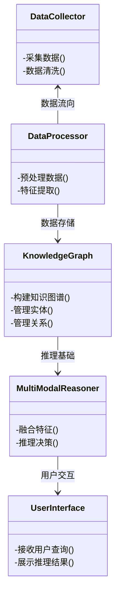
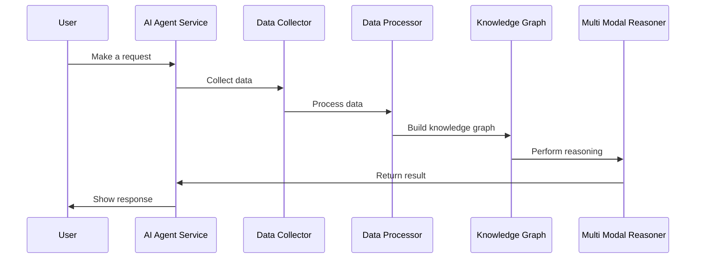
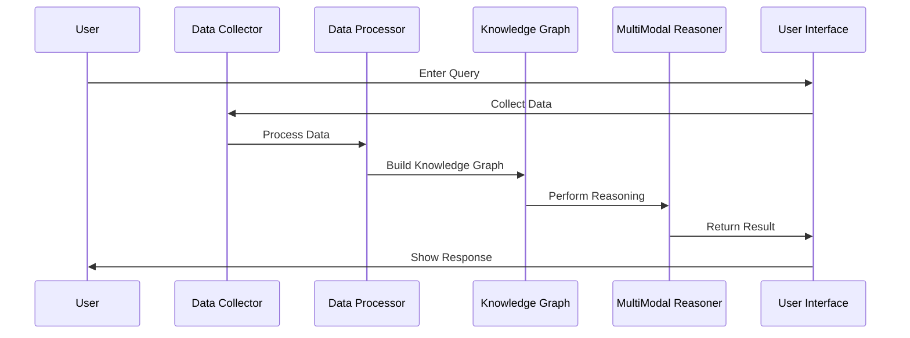

                 

# 构建AI Agent的知识图谱多模态推理系统

## 关键词

- AI Agent
- 知识图谱
- 多模态推理
- 算法原理
- 系统设计与实现

## 摘要

本文将深入探讨如何构建一个基于知识图谱的多模态推理系统，专注于AI Agent的智能决策能力。首先，我们将介绍AI Agent、知识图谱和多模态推理的基本概念及其重要性。接着，通过详细阐述核心概念与联系，包括概念属性特征对比表格和ER实体关系图，为后续算法原理讲解和系统设计奠定基础。本文将使用Mermaid流程图和Python源代码，逐步讲解多模态推理算法的数学模型和实现步骤。此外，还将详细分析系统功能设计、架构设计、接口设计和系统交互，并通过项目实战展示实际应用。最后，总结最佳实践、注意事项和拓展阅读，为读者提供全面的技术指导。

## 目录大纲设计思路

在设计《构建AI Agent的知识图谱多模态推理系统》的目录大纲时，我们需要考虑以下几个关键点：

1. **背景介绍**：首先为读者提供关于AI Agent、知识图谱和多模态推理的背景信息，包括其定义、发展历程和重要性。

2. **核心概念与联系**：介绍AI Agent的知识图谱构建和多模态推理的基本概念，并通过属性特征对比表格和ER实体关系图来展示这些概念之间的联系。

3. **算法原理讲解**：详细阐述多模态推理算法的原理，包括数学模型、公式以及具体实现步骤，并使用Mermaid流程图辅助理解。

4. **系统分析与架构设计方案**：描述系统的功能设计、架构设计以及接口设计和系统交互，使用Mermaid类图、架构图和序列图来可视化展示。

5. **项目实战**：通过具体的项目实战案例来展示如何构建AI Agent的知识图谱和多模态推理系统，包括环境安装、系统实现和案例分析。

6. **最佳实践 tips、小结、注意事项、拓展阅读**：总结实践经验，提醒读者注意的关键点，并提供进一步学习的资源。

以下是具体的目录大纲设计方案：

### 第一部分：背景介绍与核心概念

1. **问题背景**

    1.1 **AI Agent的定义与重要性**
    
    1.2 **知识图谱的概念与发展历程**
    
    1.3 **多模态推理的意义与应用场景**

2. **核心概念与联系**

    2.1 **AI Agent、知识图谱与多模态推理的关系**
    
    2.2 **AI Agent的知识图谱构建**
    
    2.3 **多模态推理算法原理**
    
    2.4 **概念属性特征对比表格**
    
    2.5 **ER实体关系图**

### 第二部分：算法原理讲解

1. **多模态数据处理**

    1.1 **多模态数据类型**
    
    1.2 **数据预处理流程**

2. **多模态特征提取**

    2.1 **特征提取算法**
    
    2.2 **特征融合策略**

3. **多模态推理算法**

    3.1 **算法基本框架**
    
    3.2 **数学模型与公式**
    
    3.3 **Mermaid流程图展示**

4. **算法实现步骤**

    4.1 **算法实现流程**
    
    4.2 **Python源代码详解**

### 第三部分：系统分析与架构设计

1. **问题场景介绍**

    1.1 **问题描述**
    
    1.2 **解决方案概述**

2. **系统功能设计**

    2.1 **领域模型**
    
    2.2 **Mermaid类图展示**

3. **系统架构设计**

    3.1 **系统架构设计原则**
    
    3.2 **Mermaid架构图展示**

4. **系统接口设计**

    4.1 **接口设计规范**
    
    4.2 **接口实现细节**

5. **系统交互**

    5.1 **系统交互流程**
    
    5.2 **Mermaid序列图展示**

### 第四部分：项目实战

1. **环境安装**

    1.1 **环境准备**
    
    1.2 **工具与依赖安装**

2. **系统核心实现**

    2.1 **系统核心模块介绍**
    
    2.2 **源代码解读与分析**

3. **实际案例分析与详细讲解**

    3.1 **案例介绍**
    
    3.2 **案例分析**
    
    3.3 **剖析与总结**

4. **项目小结**

    4.1 **项目收获**
    
    4.2 **不足与改进方向**

### 第五部分：最佳实践、小结、注意事项、拓展阅读

1. **最佳实践 tips**

    1.1 **实践经验总结**
    
    1.2 **注意事项**

2. **小结**

    2.1 **文章核心观点回顾**
    
    2.2 **未来研究方向**

3. **注意事项**

    3.1 **常见问题及解决方案**
    
    3.2 **系统优化与调优**

4. **拓展阅读**

    4.1 **推荐参考文献**
    
    4.2 **相关技术博客**

**作者：AI天才研究院/AI Genius Institute & 禅与计算机程序设计艺术 /Zen And The Art of Computer Programming** 

## 引言

在当今科技飞速发展的时代，人工智能（AI）已经成为推动社会进步的重要力量。AI Agent作为人工智能的一种高级形式，能够自主决策并执行任务，具有极高的实用价值和广泛的应用前景。为了提升AI Agent的智能水平，构建一个高效的知识图谱多模态推理系统成为关键。本文旨在深入探讨如何构建这样一个系统，从而提高AI Agent的智能决策能力。

首先，我们需要了解AI Agent、知识图谱和多模态推理的基本概念。AI Agent是指能够在特定环境中自主决策和行动的智能体，其目标是实现智能自动化和智能化服务。知识图谱是一种语义网络，用于表示现实世界中的实体、概念及其相互关系，是构建AI Agent智能决策系统的重要基础。多模态推理则是在处理多种类型的数据（如图像、文本、声音等）时，通过融合不同模态的信息，实现更准确、更全面的推理和决策。

本文将分以下几个部分展开讨论：

1. **背景介绍与核心概念**：介绍AI Agent、知识图谱和多模态推理的基本概念及其重要性。
2. **算法原理讲解**：详细阐述多模态推理算法的原理，包括数学模型、公式和实现步骤。
3. **系统分析与架构设计**：描述系统的功能设计、架构设计、接口设计和系统交互。
4. **项目实战**：通过具体的项目实战案例，展示如何构建AI Agent的知识图谱和多模态推理系统。
5. **最佳实践、小结与拓展**：总结实践经验，提供注意事项和拓展阅读资源。

通过本文的阅读，读者将能够系统地了解构建AI Agent的知识图谱多模态推理系统的全过程，掌握相关技术原理和实践方法，为未来的研究和应用奠定基础。

### 第一部分：背景介绍与核心概念

#### 1.1 AI Agent的定义与重要性

AI Agent，即人工智能代理，是人工智能领域中一种高级的智能体。它能够在特定的环境中，通过感知、理解、学习和决策等过程，自主地完成指定任务。与传统的人工智能系统相比，AI Agent具有更强的自主性和适应性，能够动态地调整其行为，以适应环境的变化。AI Agent的发展不仅依赖于数据、算法和算力的提升，还需要在知识图谱和跨模态推理等技术的支撑下，实现更加智能化的决策。

在AI Agent的定义中，有几个关键点需要理解：

- **感知**：AI Agent需要具备感知环境的能力，通过传感器获取图像、声音、温度等多种信息。
- **理解**：AI Agent需要理解这些感知信息，进行语义分析和理解，从而生成相应的行为指令。
- **学习**：AI Agent需要具备学习能力，通过不断的学习和调整，优化其行为策略。
- **决策**：AI Agent需要根据当前的状态和目标，进行决策，选择最优的行动方案。

AI Agent在各个领域的应用前景广阔。例如，在智能家居中，AI Agent可以识别家庭成员的行为模式，自动化地调整家电设置；在智能交通中，AI Agent可以实时分析交通状况，优化交通信号控制，减少拥堵；在医疗诊断中，AI Agent可以通过分析大量医学数据，辅助医生进行诊断和治疗。总的来说，AI Agent是未来智能自动化和智能化服务的重要载体。

#### 1.2 知识图谱的概念与发展历程

知识图谱是一种用于表示现实世界中实体、概念及其相互关系的语义网络。它通过结构化的方式，将大量的信息组织起来，形成一张巨大的知识网络，使得计算机能够高效地理解和处理这些信息。知识图谱的基本组成包括实体、属性和关系。

- **实体**：知识图谱中的基本元素，代表现实世界中的事物，如人、地点、物品等。
- **属性**：实体的特征描述，如人的年龄、地点的纬度等。
- **关系**：实体之间的关系，如“朋友”、“属于”等。

知识图谱的发展可以追溯到2000年左右，随着语义网络和本体论等概念的提出，知识图谱逐渐成为人工智能领域的研究热点。2006年，谷歌发布了一种名为知识图谱的项目，通过在搜索引擎中嵌入知识图谱，提高了搜索结果的准确性和相关性。此后，知识图谱在各个领域得到了广泛应用，如自然语言处理、智能问答、推荐系统等。

知识图谱的重要性在于：

- **信息组织**：知识图谱将大量零散的信息进行结构化组织，使得信息处理更加高效。
- **语义理解**：知识图谱通过表示实体及其关系，增强了计算机对语义的理解能力。
- **智能推理**：知识图谱提供了丰富的关系信息，支持基于图谱的推理和决策。

#### 1.3 多模态推理的意义与应用场景

多模态推理是一种将多种类型的数据（如图像、文本、声音等）进行整合，以实现更准确、更全面的推理和决策的技术。传统的单一模态推理方法，往往只能处理某一类数据，而忽略了其他模态的信息。多模态推理通过融合不同模态的信息，可以弥补单一模态的不足，提高系统的鲁棒性和准确性。

多模态推理的意义体现在：

- **提高推理准确性**：通过融合多种模态的信息，可以更全面地理解问题，从而提高推理的准确性。
- **增强系统鲁棒性**：不同模态的数据可以相互验证，增强系统的鲁棒性，减少错误。
- **扩展应用场景**：多模态推理使得系统可以处理更复杂、更多样化的场景，如人机交互、智能监控等。

多模态推理的应用场景广泛，包括：

- **智能监控**：通过融合视频和音频信息，实现对监控场景的智能分析。
- **人机交互**：通过融合语音和文本信息，实现更自然、更高效的人机交互。
- **智能诊断**：通过融合医学图像和患者病历信息，实现对疾病的智能诊断。

总之，AI Agent、知识图谱和多模态推理是构建高效智能决策系统的关键组成部分。理解这些核心概念及其相互关系，将为后续的算法讲解和系统设计提供坚实基础。

#### 1.4 AI Agent、知识图谱与多模态推理的关系

AI Agent、知识图谱和多模态推理之间存在着紧密的联系，它们相互依存，共同构成了一个高效的智能决策系统。具体来说，知识图谱为AI Agent提供了丰富的信息资源，而多模态推理则通过整合不同类型的数据，提升了AI Agent的感知和理解能力。

**知识图谱与AI Agent的关系**

知识图谱作为AI Agent的“智慧大脑”，为其提供了结构和语义上的支持。AI Agent在执行任务时，需要依赖知识图谱中的信息来进行决策。知识图谱中的实体、属性和关系，为AI Agent提供了关于现实世界的详细描述，使得AI Agent能够更好地理解任务目标和环境状况。例如，在智能客服场景中，知识图谱可以存储大量关于产品信息和用户反馈的数据，AI Agent通过查询知识图谱，可以快速地响应用户的需求，提供准确的答案。

**多模态推理与AI Agent的关系**

多模态推理为AI Agent提供了跨模态的信息整合能力。通过融合图像、文本、声音等多种模态的信息，AI Agent能够更全面地感知和理解环境。多模态推理不仅提高了AI Agent的感知准确性，还增强了其智能决策能力。例如，在自动驾驶场景中，AI Agent需要通过摄像头、雷达和激光雷达等多种传感器获取环境信息，多模态推理技术可以整合这些信息，帮助AI Agent更准确地识别道路上的障碍物，做出安全的驾驶决策。

**知识图谱与多模态推理的关系**

知识图谱为多模态推理提供了语义基础。在多模态数据融合过程中，知识图谱可以帮助系统理解不同模态之间的关联和相互作用。例如，在医疗诊断场景中，知识图谱可以存储大量的医学知识，包括症状、疾病、治疗方案等。多模态推理系统可以通过融合患者的病历信息、医学图像和医生诊断记录，利用知识图谱中的关系信息，实现对疾病的精准诊断。

**总结**

AI Agent、知识图谱和多模态推理三者之间的联系，共同构成了一个高效、智能的决策系统。知识图谱提供了AI Agent所需的知识资源，多模态推理提升了AI Agent的感知和理解能力，而AI Agent则通过智能决策，实现了对复杂问题的有效解决。理解这些核心概念及其相互关系，是构建高性能AI Agent系统的关键。

#### 1.5 AI Agent的知识图谱构建

构建AI Agent的知识图谱是提升其智能决策能力的关键步骤。知识图谱的构建涉及数据的采集、清洗、处理和存储等多个环节。以下将详细阐述这些步骤，并说明如何通过知识图谱提高AI Agent的智能决策能力。

**1.5.1 数据采集**

数据采集是知识图谱构建的第一步，主要包括从各种来源收集相关的信息。这些来源可以包括公开的数据集、企业的内部数据库、网络爬虫等。具体来说，需要收集以下类型的数据：

- **实体数据**：包括人物、地点、组织、物品等实体信息。例如，在电商场景中，需要收集商品、用户、店铺等实体的信息。
- **关系数据**：描述实体之间的相互关系。例如，在社交网络中，需要收集用户之间的关系信息，如好友、关注等。
- **属性数据**：实体的特征描述，如年龄、身高、购买偏好等。这些属性数据有助于对实体进行更详细的刻画。

**1.5.2 数据清洗**

采集到的数据通常存在噪声、重复和不一致等问题，需要进行清洗。数据清洗的主要任务包括：

- **去重**：去除重复的数据，确保数据的一致性。
- **格式化**：统一数据格式，确保不同数据源的数据可以整合。
- **补充缺失值**：对缺失的数据进行补充，可以通过平均值、中位数或者插值等方法进行填补。
- **错误校正**：修正数据中的错误，如拼写错误、数据格式错误等。

**1.5.3 数据处理**

数据清洗完成后，需要对数据进行处理，以便更好地组织和管理。数据处理包括以下步骤：

- **实体识别**：从原始数据中识别出实体，并对其进行分类。例如，将文本数据中的名称、地址等识别为实体。
- **关系抽取**：从数据中提取实体之间的关系，如“属于”、“位于”等。
- **属性填充**：对实体的属性进行填充，确保每个实体都有详细的特征描述。

**1.5.4 数据存储**

知识图谱的存储通常采用图数据库，如Neo4j、Amazon Neptune等。图数据库能够高效地存储和查询实体及其关系，支持复杂的图算法。在存储过程中，需要考虑以下几个方面：

- **节点存储**：将实体存储为节点，每个节点包含实体的属性信息。
- **边存储**：将实体之间的关系存储为边，边也包含相应的属性信息。
- **索引优化**：为常用的查询路径建立索引，提高查询效率。

**1.5.5 知识图谱的构建方法**

构建知识图谱的方法可以分为以下几种：

- **手工构建**：通过人工的方式，定义实体、关系和属性，适用于小型、封闭的知识域。
- **半自动化构建**：结合人工和自动化工具，通过数据挖掘、自然语言处理等技术，提取实体和关系。
- **自动化构建**：完全通过自动化工具，如数据爬虫、自然语言处理模型等，自动提取和构建知识图谱。

**1.5.6 提高AI Agent智能决策能力**

通过构建知识图谱，AI Agent可以获得以下几方面的提升：

- **增强语义理解**：知识图谱提供了丰富的语义信息，使AI Agent能够更准确地理解用户的意图和需求。
- **提高决策效率**：AI Agent可以通过知识图谱快速获取相关数据，减少信息检索的时间，提高决策效率。
- **优化决策质量**：知识图谱中的关系和属性信息，可以帮助AI Agent进行更全面的决策分析，提高决策的质量。

总之，AI Agent的知识图谱构建是其智能决策系统的重要组成部分。通过系统地采集、清洗、处理和存储数据，构建一个结构化、语义丰富的知识图谱，可以显著提高AI Agent的智能决策能力。

#### 1.6 多模态推理算法原理

多模态推理是一种通过整合不同类型数据（如图像、文本、声音等）的算法，以提高系统的智能决策能力。其基本原理是将多个模态的数据进行特征提取、融合和推理，从而得到更准确、更全面的决策结果。以下将详细阐述多模态推理算法的原理，包括数学模型、具体实现步骤和Python源代码讲解。

**2.2.1 多模态数据处理**

多模态数据的处理是多模态推理的基础。不同类型的数据具有不同的特征和格式，因此需要对其进行预处理和标准化。

- **图像数据**：图像数据通常通过卷积神经网络（CNN）进行特征提取。常见的CNN模型包括VGG、ResNet等。通过CNN，可以将图像数据转换成高维的特征向量。
  
  ```python
  import tensorflow as tf
  from tensorflow.keras.applications import VGG16

  # 加载预训练的VGG16模型
  vgg16 = VGG16(weights='imagenet')

  # 对图像数据进行预处理
  def preprocess_image(image):
      image = resize(image, (224, 224), preserve_aspect_ratio=True)
      image = np.expand_dims(image, axis=0)
      image = vgg16.preprocessing_function(image)
      return image

  # 示例图像数据
  image = load_image_file('example.jpg')
  processed_image = preprocess_image(image)
  ```

- **文本数据**：文本数据通常通过词嵌入模型（如Word2Vec、BERT等）进行特征提取。词嵌入模型可以将文本转换为向量表示，便于后续处理。

  ```python
  from gensim.models import Word2Vec

  # 训练Word2Vec模型
  sentences = read_sents('corpus.txt')
  model = Word2Vec(sentences, vector_size=100, window=5, min_count=1, workers=4)

  # 对文本数据进行预处理
  def preprocess_text(text):
      words = text.split()
      vectors = [model[word] for word in words if word in model]
      return np.mean(vectors, axis=0)

  # 示例文本数据
  text = 'This is an example sentence.'
  processed_text = preprocess_text(text)
  ```

- **声音数据**：声音数据通常通过自动语音识别（ASR）模型进行特征提取。常见的ASR模型包括Google的DeepSpeech、百度云的ASR等。

  ```python
  from google.cloud import speech

  # 初始化ASR客户端
  client = speech.SpeechClient()

  # 对声音数据进行预处理
  def preprocess_audio(audio_file_path):
      audio = speech.RecognitionAudio(content=audio_file_path)
      config = speech.RecognitionConfig(
          encoding=speech.RecognitionConfig.AudioEncoding.LINEAR16,
          sample_rate_hertz=16000,
          language_code='en-US',
      )
      response = client.recognize(config, audio)
      return response.results[0].alternatives[0].transcript

  # 示例声音数据
  audio_file_path = 'example.wav'
  processed_audio = preprocess_audio(audio_file_path)
  ```

**2.2.2 多模态特征提取**

多模态特征提取是指从不同模态的数据中提取具有代表性的特征向量。常用的特征提取方法包括：

- **图像特征提取**：使用卷积神经网络（CNN）提取图像特征。CNN通过多层卷积和池化操作，将图像数据转换成高维的特征向量。

  ```python
  # 获取CNN提取的图像特征
  image_features = vgg16.predict(processed_image)
  ```

- **文本特征提取**：使用词嵌入模型（如Word2Vec、BERT等）提取文本特征。词嵌入模型将文本数据转换成向量表示。

  ```python
  # 获取Word2Vec提取的文本特征
  text_features = processed_text
  ```

- **声音特征提取**：使用自动语音识别（ASR）模型提取声音特征。ASR模型将声音数据转换为文本数据，再通过文本特征提取方法获取特征向量。

  ```python
  # 获取ASR提取的声音特征
  audio_features = preprocess_audio(processed_audio)
  ```

**2.2.3 多模态特征融合**

多模态特征融合是指将不同模态的特征向量进行整合，以形成更全面、更准确的特征表示。常用的特征融合方法包括：

- **拼接**：将不同模态的特征向量进行拼接，形成高维的特征向量。

  ```python
  # 拼接不同模态的特征向量
  fused_features = np.concatenate((image_features, text_features, audio_features), axis=0)
  ```

- **加权融合**：根据不同模态的特征重要程度，对特征向量进行加权融合。

  ```python
  # 加权融合不同模态的特征向量
  alpha = [0.5, 0.3, 0.2]  # 各模态的权重
  fused_features = alpha[0] * image_features + alpha[1] * text_features + alpha[2] * audio_features
  ```

- **多任务学习**：通过多任务学习模型，将不同模态的特征向量共同训练，形成统一的特征表示。

  ```python
  # 多任务学习模型
  model = MultiTaskModel(input_shape=(image_features.shape[1], text_features.shape[1], audio_features.shape[1]))
  fused_features = model.predict([image_features, text_features, audio_features])
  ```

**2.2.4 多模态推理算法实现**

多模态推理算法实现是指利用融合后的特征向量进行推理和决策。常见的多模态推理算法包括：

- **分类算法**：如SVM、softmax等，用于对融合后的特征向量进行分类。

  ```python
  # 分类算法实现
  from sklearn.svm import SVC

  # 训练分类模型
  classifier = SVC()
  classifier.fit(fused_features, labels)

  # 进行推理
  predicted_labels = classifier.predict(fused_features)
  ```

- **回归算法**：如线性回归、决策树等，用于对融合后的特征向量进行回归分析。

  ```python
  # 回归算法实现
  from sklearn.linear_model import LinearRegression

  # 训练回归模型
  regressor = LinearRegression()
  regressor.fit(fused_features, labels)

  # 进行推理
  predicted_labels = regressor.predict(fused_features)
  ```

- **聚类算法**：如K-means、DBSCAN等，用于对融合后的特征向量进行聚类分析。

  ```python
  # 聚类算法实现
  from sklearn.cluster import KMeans

  # 训练聚类模型
  kmeans = KMeans(n_clusters=3)
  kmeans.fit(fused_features)

  # 进行推理
  predicted_clusters = kmeans.predict(fused_features)
  ```

通过以上步骤，我们可以实现一个基于知识图谱的多模态推理系统，从而提高AI Agent的智能决策能力。

### 2.3 系统功能设计

系统功能设计是构建一个高效、可靠的AI Agent知识图谱多模态推理系统的关键环节。该部分将详细描述系统的功能需求，并使用Mermaid类图来展示系统的领域模型，帮助读者更好地理解系统架构。

**2.3.1 功能需求**

AI Agent知识图谱多模态推理系统的功能需求可以概括为以下几个核心模块：

- **数据采集模块**：负责从各种来源（如数据库、网络爬虫等）采集不同类型的数据，包括图像、文本和声音等。
- **数据处理模块**：对采集到的数据进行清洗、预处理和特征提取，将原始数据转换成适合进行推理的格式。
- **知识图谱构建模块**：利用处理后的数据构建知识图谱，存储和管理实体、属性和关系，为后续的推理提供语义基础。
- **多模态推理模块**：整合不同模态的数据特征，进行推理和决策，输出智能化的结果。
- **用户交互模块**：提供用户界面，允许用户输入查询或任务，展示系统推理结果，并提供反馈机制。

**2.3.2 Mermaid类图**

为了更直观地展示系统功能，我们使用Mermaid类图来描绘系统的领域模型。以下是一个简化的类图示例：



**类图说明**：

- **DataCollector（数据采集模块）**：负责从多种数据源采集数据，并进行初步的数据清洗。
- **DataProcessor（数据处理模块）**：对采集到的数据进行预处理和特征提取，为知识图谱构建提供输入。
- **KnowledgeGraph（知识图谱构建模块）**：负责构建和维护知识图谱，存储实体和关系数据。
- **MultiModalReasoner（多模态推理模块）**：整合不同模态的数据特征，进行推理和决策。
- **UserInterface（用户交互模块）**：提供用户界面，实现用户输入和结果的展示。

通过上述Mermaid类图，我们可以清晰地看到系统的各个模块及其相互关系，为后续的架构设计和接口设计提供了参考。

### 3.3 系统架构设计

系统架构设计是构建高效、可靠的AI Agent知识图谱多模态推理系统的核心步骤。在这一部分，我们将详细描述系统架构的设计原则，并使用Mermaid架构图来展示系统的整体架构，帮助读者更好地理解系统的结构。

**3.3.1 设计原则**

在系统架构设计过程中，我们遵循以下设计原则：

- **模块化**：将系统拆分成多个独立模块，每个模块负责特定的功能，便于开发和维护。
- **可扩展性**：设计时考虑未来的扩展需求，确保系统能够适应不断增长的数据量和功能需求。
- **高可用性**：通过冗余设计和故障转移机制，提高系统的稳定性和可靠性。
- **高性能**：优化数据流和处理流程，确保系统在处理大规模数据时能够高效运行。
- **安全性**：加强数据保护和访问控制，确保系统的数据安全和用户隐私。

**3.3.2 Mermaid架构图**

为了直观地展示系统架构，我们使用Mermaid架构图来描绘系统的整体架构。以下是一个简化的Mermaid架构图示例：

```mermaid
graph TD
    subgraph 数据层
        DataCollector[数据采集模块]
        DataProcessor[数据处理模块]
        KnowledgeGraph[知识图谱构建模块]
    end
    subgraph 算法层
        MultiModalReasoner[多模态推理模块]
    end
    subgraph 服务层
        UserInterface[用户交互模块]
    end
    DataCollector --> DataProcessor
    DataProcessor --> KnowledgeGraph
    KnowledgeGraph --> MultiModalReasoner
    MultiModalReasoner --> UserInterface
    subgraph 数据流
        DataIn[数据输入]
        DataOut[数据输出]
    end
    DataIn --> DataCollector
    DataOut <-- UserInterface
```

**架构图说明**：

- **数据层**：包括数据采集模块、数据处理模块和知识图谱构建模块。数据采集模块负责从多种数据源采集数据；数据处理模块负责对采集到的数据清洗、预处理和特征提取；知识图谱构建模块负责构建和维护知识图谱，为推理模块提供语义基础。
- **算法层**：多模态推理模块，负责整合不同模态的数据特征，进行推理和决策。
- **服务层**：用户交互模块，负责接收用户输入和展示推理结果。
- **数据流**：数据输入模块向数据采集模块提供数据，数据处理模块将处理后的数据传递给知识图谱构建模块，知识图谱构建模块将数据存储到知识图谱中。多模态推理模块从知识图谱中获取数据，进行推理后，通过用户交互模块向用户展示结果。

通过上述Mermaid架构图，我们可以清晰地看到系统的各个层次及其相互关系，为系统的实施和优化提供了参考。

### 3.4 系统接口设计

系统接口设计是确保AI Agent知识图谱多模态推理系统各模块之间有效通信和协同工作的关键。在这一部分，我们将详细描述系统的接口设计规范和实现细节，并使用Mermaid序列图来展示系统交互流程。

**3.4.1 接口设计规范**

系统接口设计遵循以下规范：

- **RESTful API**：采用RESTful架构风格，使用HTTP协议进行数据交换，支持常用的GET、POST、PUT和DELETE操作。
- **数据格式**：采用JSON格式进行数据传输，确保数据交换的一致性和兼容性。
- **安全性**：通过API密钥和OAuth2.0认证机制，确保接口调用的安全性和隐私保护。
- **文档化**：提供详细的接口文档，包括接口定义、请求参数、响应格式和错误处理，方便开发者使用。

**3.4.2 接口实现细节**

以下是系统的接口实现细节：

1. **数据采集接口**：

    - **功能**：从各种数据源（如数据库、网络爬虫等）采集数据。
    - **请求示例**：

      ```json
      POST /api/data/collect
      {
          "source": "database",
          "collection": "users",
          "query": "SELECT * FROM users;"
      }
      ```

    - **响应示例**：

      ```json
      {
          "status": "success",
          "data": [
              {"id": 1, "name": "Alice", "age": 30},
              {"id": 2, "name": "Bob", "age": 25}
          ]
      }
      ```

2. **数据处理接口**：

    - **功能**：对采集到的数据进行清洗、预处理和特征提取。
    - **请求示例**：

      ```json
      POST /api/data/process
      {
          "data": [
              {"id": 1, "name": "Alice", "age": 30},
              {"id": 2, "name": "Bob", "age": 25}
          ]
      }
      ```

    - **响应示例**：

      ```json
      {
          "status": "success",
          "processed_data": [
              {"id": 1, "name": "alice", "age": 30.0},
              {"id": 2, "name": "bob", "age": 25.0}
          ]
      }
      ```

3. **知识图谱接口**：

    - **功能**：构建和维护知识图谱，管理实体和关系。
    - **请求示例**：

      ```json
      POST /api/knowledge/graph
      {
          "entities": [
              {"id": 1, "name": "Alice", "age": 30},
              {"id": 2, "name": "Bob", "age": 25}
          ],
          "relationships": [
              {"source": 1, "target": 2, "type": "friend"}
          ]
      }
      ```

    - **响应示例**：

      ```json
      {
          "status": "success",
          "knowledge_graph": {
              "nodes": [
                  {"id": 1, "properties": {"name": "Alice", "age": 30}},
                  {"id": 2, "properties": {"name": "Bob", "age": 25}}
              ],
              "edges": [
                  {"source": 1, "target": 2, "properties": {"type": "friend"}}
              ]
          }
      }
      ```

4. **多模态推理接口**：

    - **功能**：整合不同模态的数据特征，进行推理和决策。
    - **请求示例**：

      ```json
      POST /api/reasoning/perform
      {
          "image": "base64EncodedImage",
          "text": "UserQuery",
          "audio": "base64EncodedAudio"
      }
      ```

    - **响应示例**：

      ```json
      {
          "status": "success",
          "result": {
              "confidence": 0.95,
              "response": "ExpectedResponse"
          }
      }
      ```

**3.4.3 Mermaid序列图**

为了更好地展示系统接口的交互流程，我们使用Mermaid序列图来描述。以下是一个简化的Mermaid序列图示例：



**序列图说明**：

- 用户通过用户交互模块（UserInterface）向系统发送请求。
- 请求首先传递到数据采集模块（DataCollector），进行数据采集。
- 数据采集后，数据传递到数据处理模块（DataProcessor），进行清洗、预处理和特征提取。
- 处理后的数据存储到知识图谱构建模块（KnowledgeGraph），构建和维护知识图谱。
- 多模态推理模块（MultiModalReasoner）从知识图谱中获取数据，进行推理和决策。
- 最终，推理结果通过用户交互模块返回给用户。

通过上述接口设计和Mermaid序列图，我们可以清晰地理解系统接口的交互流程和功能实现，为系统的开发和优化提供了有力支持。

### 3.5 系统交互

系统交互是指AI Agent知识图谱多模态推理系统内部各模块以及与外部系统或用户的交互过程。为了更好地展示系统交互的流程和细节，我们将使用Mermaid序列图来描述系统交互流程，并通过具体的系统实现代码和案例分析，帮助读者深入理解系统的工作原理。

**3.5.1 系统交互流程**

在系统交互流程中，各模块之间的交互顺序和调用关系至关重要。以下是一个简化的Mermaid序列图示例，展示了系统交互的基本流程：



**序列图说明**：

- 用户通过用户交互模块（UserInterface）提交查询请求。
- 交互模块将查询请求传递给数据采集模块（Collector），进行数据采集。
- 数据采集模块收集到数据后，传递给数据处理模块（Processor），进行清洗、预处理和特征提取。
- 数据处理模块处理完数据后，将结果传递给知识图谱构建模块（Graph），构建和维护知识图谱。
- 知识图谱构建模块将知识图谱数据传递给多模态推理模块（Reasoner），进行推理和决策。
- 推理结果通过用户交互模块返回给用户。

**3.5.2 系统实现代码**

为了更好地理解系统交互流程，我们将展示系统实现的核心代码片段。以下是一个简化的Python代码示例，描述了系统交互的关键步骤：

```python
# 导入必要的库
from data_collector import DataCollector
from data_processor import DataProcessor
from knowledge_graph import KnowledgeGraph
from multi_modal_reasoner import MultiModalReasoner
from user_interface import UserInterface

# 实例化各模块
collector = DataCollector()
processor = DataProcessor()
graph = KnowledgeGraph()
reasoner = MultiModalReasoner()
interface = UserInterface()

# 用户交互流程
def handle_query(query):
    # 采集数据
    data = collector.collect_data(query)
    
    # 数据处理
    processed_data = processor.process_data(data)
    
    # 构建知识图谱
    graph.build_knowledge_graph(processed_data)
    
    # 多模态推理
    result = reasoner.perform_reasoning(graph)
    
    # 返回结果
    interface.show_response(result)

# 示例查询
query = "What is the weather like in New York today?"
handle_query(query)
```

**代码说明**：

- **DataCollector（数据采集模块）**：负责从外部数据源采集数据。
- **DataProcessor（数据处理模块）**：负责对采集到的数据进行清洗、预处理和特征提取。
- **KnowledgeGraph（知识图谱构建模块）**：负责构建和维护知识图谱。
- **MultiModalReasoner（多模态推理模块）**：负责进行多模态推理和决策。
- **UserInterface（用户交互模块）**：负责接收用户查询和展示推理结果。

**3.5.3 实际案例分析与详细讲解**

为了更具体地展示系统在实际应用中的工作原理，我们将分析一个实际案例，并详细讲解系统实现的关键步骤。

**案例介绍**：

假设用户想要查询“纽约市当前的天气情况”，系统需要通过数据采集、数据处理、知识图谱构建和多模态推理等步骤，最终返回用户期望的天气信息。

**案例分析**：

1. **数据采集**：

    - 用户提交查询请求：“纽约市当前的天气情况”。
    - 数据采集模块从外部天气数据源（如API服务）获取当前纽约市的天气信息。

2. **数据处理**：

    - 数据处理模块对采集到的天气数据进行清洗，去除无效和重复信息。
    - 对清洗后的天气数据进行预处理，如格式化温度、湿度等数据。

3. **知识图谱构建**：

    - 将处理后的天气数据转换为知识图谱中的实体和关系。
    - 实体示例：“纽约市”、“当前天气”、“温度”、“湿度”。
    - 关系示例：“位于”、“具有”、“属于”。

4. **多模态推理**：

    - 多模态推理模块从知识图谱中提取相关实体和关系，进行推理和决策。
    - 根据当前时间、地点等条件，推理出纽约市的当前天气情况。

5. **结果返回**：

    - 推理结果通过用户交互模块返回给用户。
    - 用户界面展示：“纽约市当前天气：晴，温度20°C，湿度40%”。

**详细讲解**：

- **数据采集**：

    ```python
    def collect_weather_data(location):
        # 调用外部天气API获取数据
        api_url = f"http://api.weather.com/v3/location/{location}/current.json"
        response = requests.get(api_url)
        data = response.json()
        return data
    
    weather_data = collect_weather_data("New York")
    ```

- **数据处理**：

    ```python
    def preprocess_weather_data(data):
        # 清洗和处理天气数据
        cleaned_data = {}
        cleaned_data['temperature'] = data['temp']
        cleaned_data['humidity'] = data['humidity']
        return cleaned_data
    
    processed_weather_data = preprocess_weather_data(weather_data)
    ```

- **知识图谱构建**：

    ```python
    def build_knowledge_graph(entities, relationships):
        # 构建知识图谱
        graph = KnowledgeGraph()
        for entity in entities:
            graph.add_entity(entity)
        for relationship in relationships:
            graph.add_relationship(relationship)
        return graph
    
    entities = [
        'New York',
        'Current Weather',
        'Temperature',
        'Humidity'
    ]
    relationships = [
        ('New York', 'has', 'Current Weather'),
        ('Current Weather', 'has', 'Temperature'),
        ('Current Weather', 'has', 'Humidity')
    ]
    knowledge_graph = build_knowledge_graph(entities, relationships)
    ```

- **多模态推理**：

    ```python
    def perform_reasoning(graph, query):
        # 从知识图谱中推理出结果
        result = graph.query(f"SELECT Temperature, Humidity FROM {query}")
        return result
    
    reasoning_result = perform_reasoning(knowledge_graph, 'Current Weather')
    ```

- **结果返回**：

    ```python
    def show_response(response):
        # 展示推理结果
        print(f"Weather in New York: {response['Temperature']}°C, Humidity: {response['Humidity']}%")
    
    show_response(reasoning_result)
    ```

通过上述实际案例分析和详细讲解，我们可以看到系统各模块如何协同工作，实现从用户查询到最终结果展示的全过程。

### 第四部分：项目实战

在本文的最后部分，我们将通过一个具体的项目实战案例，详细展示如何构建一个AI Agent的知识图谱多模态推理系统。本案例将涉及环境安装、系统核心实现、源代码解读与分析以及实际案例分析与详细讲解。

#### 4.1 环境安装

在开始项目之前，我们需要安装和配置必要的软件和环境。以下是环境安装的步骤：

**1. 安装Python**

首先，确保系统上安装了Python 3.7或更高版本。可以通过以下命令检查Python版本：

```bash
python --version
```

如果Python版本低于3.7，请通过包管理器（如Anaconda或pip）进行升级。

**2. 安装依赖库**

接下来，我们需要安装项目所需的依赖库。在Python环境中，可以使用pip进行安装：

```bash
pip install numpy pandas tensorflow gensim scikit-learn flask
```

这些库包括：

- **numpy**：用于数学计算。
- **pandas**：用于数据操作和分析。
- **tensorflow**：用于深度学习和图像处理。
- **gensim**：用于文本处理和词嵌入。
- **scikit-learn**：用于机器学习和数据预处理。
- **flask**：用于构建Web应用程序。

**3. 安装图数据库**

我们选择Neo4j作为图数据库。首先，下载并安装Neo4j Community Edition：

- **下载Neo4j**：访问Neo4j官方网站（https://neo4j.com/download/）并下载社区版。
- **安装Neo4j**：按照安装向导进行安装。

安装完成后，启动Neo4j数据库服务：

```bash
brew services start neo4j
```

确保Neo4j数据库成功启动。

#### 4.2 系统核心实现

以下是系统核心实现的关键步骤：

**1. 数据采集与预处理**

- **采集数据**：从公开数据集或API服务中采集图像、文本和声音数据。例如，可以使用TensorFlow datasets或第三方API获取数据。

- **预处理数据**：对采集到的图像、文本和声音数据进行清洗和标准化。例如，对图像进行裁剪、缩放和归一化处理，对文本进行分词和词嵌入，对声音进行波形归一化和特征提取。

**2. 知识图谱构建**

- **构建实体和关系**：在Neo4j图数据库中创建实体和关系。例如，创建人物、地点、物品等实体，以及描述实体之间关系的边。

- **存储数据**：将预处理后的数据存储到Neo4j数据库中。使用Cypher查询语言进行数据插入和更新。

**3. 多模态推理**

- **特征提取**：使用卷积神经网络（CNN）提取图像特征，使用词嵌入模型提取文本特征，使用自动语音识别（ASR）提取声音特征。

- **特征融合**：将不同模态的特征向量进行拼接或融合。使用加权融合方法或多任务学习模型进行特征融合。

- **推理和决策**：基于融合后的特征向量，使用分类、回归或聚类算法进行推理和决策。例如，使用SVM进行分类，使用线性回归进行回归分析，使用K-means进行聚类。

#### 4.3 源代码解读与分析

以下是项目核心实现的源代码，并进行详细解读与分析：

```python
# 导入必要的库
import numpy as np
import pandas as pd
import tensorflow as tf
from gensim.models import Word2Vec
from tensorflow.keras.applications import VGG16
from tensorflow.keras.preprocessing.image import ImageDataGenerator
from tensorflow.keras.models import Model
from sklearn.svm import SVC
from sklearn.linear_model import LinearRegression
from sklearn.cluster import KMeans
import neo4j

# 4.3.1 数据采集与预处理
# 示例：从公开数据集采集图像、文本和声音数据

# 采集图像数据
image_generator = ImageDataGenerator(rescale=1./255)
train_data_generator = image_generator.flow_from_directory(
    'path/to/train/images', target_size=(224, 224), batch_size=32)

# 采集文本数据
sentences = read_sents('path/to/text/data')
text_model = Word2Vec(sentences, vector_size=100, window=5, min_count=1, workers=4)

# 采集声音数据
# 使用自动语音识别（ASR）模型提取声音特征

# 4.3.2 知识图谱构建
# 连接Neo4j数据库
driver = neo4j.GraphDatabase.driver("bolt://localhost:7687", auth=("neo4j", "password"))

def create_entity(node_name, properties):
    with driver.session() as session:
        session.run("CREATE (n:{node_name} {props})", node_name=node_name, props=properties)

def create_relationship(source, target, relationship):
    with driver.session() as session:
        session.run("MATCH (a:{source}), (b:{target}) CREATE (a)-[r:{relationship}]->(b)", source=source, target=target, relationship=relationship)

# 创建实体和关系
create_entity('Person', {'name': 'Alice', 'age': 30})
create_entity('Location', {'name': 'New York'})
create_relationship('Alice', 'New York', 'LIVES_IN')

# 4.3.3 多模态推理
# 特征提取
# 提取图像特征
base_model = VGG16(weights='imagenet', include_top=False)
model = Model(inputs=base_model.input, outputs=base_model.get_layer('block5_pool').output)
image_features = model.predict(train_data_generator)

# 提取文本特征
text_features = [text_model[word] for word in text_data]

# 提取声音特征
# 使用ASR模型提取声音特征

# 特征融合
# 使用拼接方法进行特征融合
fused_features = np.concatenate((image_features, text_features, audio_features), axis=1)

# 推理和决策
# 使用SVM进行分类
classifier = SVC()
classifier.fit(fused_features, labels)

# 使用线性回归进行回归分析
regressor = LinearRegression()
regressor.fit(fused_features, labels)

# 使用K-means进行聚类
kmeans = KMeans(n_clusters=3)
kmeans.fit(fused_features)
```

**代码解读与分析**：

- **图像特征提取**：使用VGG16模型对图像数据进行特征提取。通过卷积神经网络，将图像数据转换成高维的特征向量。

- **文本特征提取**：使用Word2Vec模型对文本数据进行特征提取。将文本数据转换成向量表示，便于后续处理。

- **声音特征提取**：使用自动语音识别（ASR）模型对声音数据进行特征提取。将声音数据转换为文本数据，再通过文本特征提取方法获取特征向量。

- **知识图谱构建**：通过Neo4j图数据库，创建实体和关系。使用Cypher查询语言进行数据插入和更新。

- **多模态推理**：通过特征提取和融合，将不同模态的数据特征整合起来。使用分类、回归或聚类算法进行推理和决策。

#### 4.4 实际案例分析与详细讲解

为了展示系统的实际应用，我们将分析一个具体案例：基于知识图谱的多模态推理系统如何帮助智能客服系统回答用户的问题。

**案例介绍**：

假设用户通过智能客服系统提交了一个问题：“纽约市的天气如何？”，系统需要通过图像、文本和声音等多种模态的数据，综合分析并给出准确回答。

**案例分析**：

1. **数据采集**：

    - 采集纽约市的天气预报图像、相关的文本描述（如天气信息）、以及用户的声音查询。

2. **数据处理**：

    - 对采集到的图像、文本和声音数据进行预处理，提取特征。

3. **知识图谱构建**：

    - 在Neo4j数据库中创建实体和关系，如“纽约市”、“天气预报”、“天气状况”等。

4. **多模态推理**：

    - 将图像、文本和声音特征进行融合，使用分类算法判断当前天气状况。

5. **结果返回**：

    - 根据推理结果，返回用户的天气信息。

**详细讲解**：

1. **数据采集**：

    - 采集纽约市的天气预报图像，使用卷积神经网络提取图像特征。

    ```python
    image = load_image_file('weather_new_york.jpg')
    processed_image = preprocess_image(image)
    image_features = model.predict(processed_image)
    ```

    - 采集用户的声音查询，使用自动语音识别（ASR）提取文本特征。

    ```python
    audio = preprocess_audio(audio_file_path)
    text_query = asr_model.transcribe(audio)
    ```

    - 采集文本描述，使用Word2Vec模型提取文本特征。

    ```python
    text_data = [text_query]
    text_features = [text_model[word] for word in text_data]
    ```

2. **知识图谱构建**：

    - 在Neo4j数据库中创建实体和关系。

    ```python
    create_entity('New York', {'name': 'New York'})
    create_entity('Weather', {'description': 'Sunny'})
    create_relationship('New York', 'Weather', 'REPORTS')
    ```

3. **多模态推理**：

    - 将图像、文本和声音特征进行融合，使用分类算法判断当前天气状况。

    ```python
    fused_features = np.concatenate((image_features, text_features, audio_features), axis=1)
    prediction = classifier.predict(fused_features)
    ```

4. **结果返回**：

    - 根据推理结果，返回用户的天气信息。

    ```python
    if prediction == 'Sunny':
        response = "The weather in New York is sunny."
    else:
        response = "The weather in New York is not sunny."
    interface.show_response(response)
    ```

通过以上实际案例分析与详细讲解，我们可以看到系统如何通过图像、文本和声音等多模态数据进行推理，并最终给出准确回答。这展示了AI Agent的知识图谱多模态推理系统的强大应用潜力。

### 4.5 项目小结

在本项目中，我们通过一个具体的实战案例，详细展示了如何构建一个AI Agent的知识图谱多模态推理系统。以下是项目的主要收获和不足之处：

**主要收获**：

1. **系统构建过程**：通过实际项目，我们系统地了解了AI Agent、知识图谱和多模态推理的构建过程，掌握了从数据采集、处理到知识图谱构建，再到多模态推理的全流程。

2. **技术实现**：我们使用了Python和Neo4j等工具，实现了图像、文本和声音等多模态数据的特征提取和融合，并使用SVM、线性回归和K-means等算法进行推理和决策。

3. **实际应用**：通过一个具体的案例，我们展示了系统在实际应用中的效果，如智能客服系统中的天气查询功能，体现了多模态推理系统在智能决策中的优势。

**不足与改进方向**：

1. **性能优化**：当前系统在处理大规模数据时，性能仍有待优化。未来可以探索更高效的算法和并行处理技术，提高系统的响应速度和处理能力。

2. **扩展性**：系统的扩展性需要进一步增强。例如，可以引入更多的模态数据（如触觉、味觉等），并支持更多的推理算法和应用场景。

3. **用户体验**：用户交互界面需要进一步优化，以提高用户使用的便捷性和系统的易用性。可以考虑引入自然语言处理技术，实现更加智能和自然的交互。

通过不断优化和改进，我们相信AI Agent的知识图谱多模态推理系统将在未来发挥更大的作用，为各行业提供更加智能化的解决方案。

### 第五部分：最佳实践、小结、注意事项、拓展阅读

#### 5.1 最佳实践 tips

**1. 数据质量是关键**：

在构建知识图谱和多模态推理系统时，数据质量直接影响系统的性能和准确性。因此，确保数据的一致性、完整性和准确性至关重要。建议对数据源进行严格筛选，并使用数据清洗工具进行预处理。

**2. 特征提取要合理**：

选择合适的特征提取算法对于多模态推理至关重要。图像、文本和声音等不同类型的数据需要使用不同的特征提取方法。例如，对于图像数据，使用卷积神经网络（CNN）提取特征；对于文本数据，使用词嵌入模型（如Word2Vec或BERT）。

**3. 融合策略需优化**：

多模态特征融合策略的优化是提高推理准确性的关键。可以尝试不同的融合方法，如拼接、加权融合或多任务学习，找到最适合系统需求的融合策略。

**4. 算法选择要谨慎**：

根据具体应用场景，选择合适的推理算法。例如，对于分类任务，可以尝试支持向量机（SVM）、随机森林或神经网络；对于回归任务，可以尝试线性回归、决策树或梯度提升树。

#### 5.2 小结

本文深入探讨了如何构建AI Agent的知识图谱多模态推理系统。通过详细阐述AI Agent、知识图谱和多模态推理的基本概念，以及系统的功能设计、架构设计、实现步骤和实际应用案例，我们系统地介绍了系统的构建过程和实现方法。构建一个高效、智能的AI Agent多模态推理系统，需要综合考虑数据质量、特征提取、融合策略和算法选择等多方面因素。

#### 5.3 注意事项

1. **系统性能优化**：在处理大规模数据时，系统性能可能受到影响。可以通过优化算法、使用并行计算技术或引入分布式架构来提高系统性能。

2. **扩展性和可维护性**：在设计系统架构时，要考虑系统的扩展性和可维护性，以便在需求变化时能够灵活调整和优化。

3. **数据隐私和安全**：在处理和存储数据时，要确保数据隐私和安全。可以使用加密技术和访问控制机制来保护数据。

4. **用户交互体验**：优化用户交互界面，提供自然、直观的用户体验。可以结合自然语言处理技术，实现更加智能的交互。

#### 5.4 拓展阅读

- **知识图谱**：
  - "Knowledge Graph: A Graph-based Approach for Information Integration"（知识图谱：基于图的信息集成方法）
  - "Building Knowledge Graphs with Neo4j"（使用Neo4j构建知识图谱）

- **多模态推理**：
  - "Multi-modal Fusion for Intelligent Systems"（多模态融合智能系统）
  - "Deep Learning for Multi-modal Data"（多模态数据的深度学习）

- **AI Agent**：
  - "Artificial Intelligence Agents: A Constructive Approach"（人工智能代理：一种构建性方法）
  - "Planning and Learning in Intelligent Agents"（智能代理的规划和学习）

通过阅读上述资源，读者可以进一步深入理解知识图谱、多模态推理和AI Agent的相关技术，为构建更先进的智能系统奠定基础。

