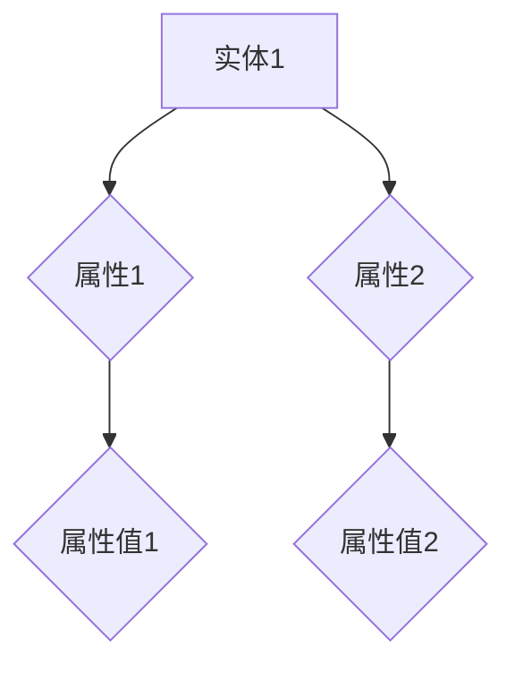
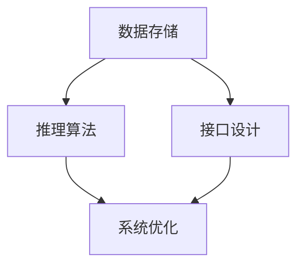

                 

# 构建AI Agent的知识图谱推理引擎

## 引言

### 1.1 人工智能发展现状与挑战

人工智能作为21世纪最具前景的科技领域之一，已经在多个行业中取得了显著的成果。然而，随着技术的不断进步，人工智能也面临着诸多挑战。首先，数据质量与数量问题依然是制约人工智能发展的瓶颈。其次，算法的可解释性较差，使得人工智能系统在决策过程中缺乏透明度。此外，人工智能在处理复杂任务时，仍需依赖人类提供的知识，缺乏自主推理能力。

### 1.2 知识图谱的定义与作用

知识图谱是一种语义网络，通过实体、属性和关系的描述来表示知识。它不仅能够有效地组织海量信息，还能够提供强大的语义理解能力。在人工智能领域，知识图谱的作用主要体现在以下几个方面：

- 提高自然语言处理能力，实现语义解析与语义匹配。
- 为推荐系统和搜索引擎提供丰富的语义信息，提高个性化推荐和搜索结果的准确性。
- 支持智能问答和知识图谱推理，实现智能决策和自动化推理。

### 1.3 知识图谱推理引擎的作用

知识图谱推理引擎是构建AI Agent的核心组件，负责从知识图谱中自动推导出新的知识。其主要作用如下：

- 实现基于知识图谱的语义查询，获取相关实体和关系。
- 提供智能推理能力，为AI Agent提供决策支持。
- 支持动态知识更新和演化，保证知识图谱的实时性和准确性。

## 第1章 问题背景与知识图谱概述

### 1.1 人工智能发展现状与挑战

人工智能（AI）作为计算机科学的一个重要分支，近年来取得了飞速的发展。从早期的规则推理和统计学习，到如今的深度学习和强化学习，人工智能技术在各个领域都展现出了巨大的潜力。然而，人工智能的发展也面临着一些挑战：

1. **数据质量与数量问题**：人工智能系统对数据质量有很高的要求，数据的质量和数量直接影响到模型的性能。当前，数据来源多样，数据质量参差不齐，如何从海量数据中提取高质量的数据，是人工智能领域的一个重要挑战。

2. **算法的可解释性**：传统的机器学习算法，如神经网络，在处理复杂问题时表现出色，但其内部工作机制复杂，缺乏可解释性。这使得用户难以理解模型的决策过程，增加了算法的信任度问题。

3. **复杂任务的处理**：尽管人工智能在图像识别、语音识别等领域取得了显著的进展，但在处理复杂任务时，如自然语言处理和智能决策，仍需依赖人类提供的知识。这限制了人工智能在自主推理和决策方面的能力。

### 1.2 知识图谱的定义与作用

知识图谱（Knowledge Graph）是一种用于结构化、语义化的知识表示形式。它通过实体、属性和关系的描述，将现实世界中的知识以图形化的方式组织起来，形成一个语义丰富的知识网络。

- **实体**：实体是知识图谱中的基本元素，表示现实世界中的个体或概念，如“人”、“地点”、“组织”等。

- **属性**：属性描述了实体之间的特征，如“年龄”、“身高”、“职业”等。

- **关系**：关系描述了实体之间的关联，如“属于”、“工作于”、“结婚给”等。

知识图谱的作用主要体现在以下几个方面：

1. **语义搜索**：知识图谱提供了语义化的信息表示，使得搜索引擎能够基于语义进行搜索，提高搜索的准确性和个性化。

2. **智能推荐**：知识图谱为推荐系统提供了丰富的语义信息，使得推荐系统能够基于用户兴趣、实体关系进行精准推荐。

3. **自然语言处理**：知识图谱为自然语言处理提供了语义理解的基础，使得机器能够更好地理解和处理人类语言。

4. **智能问答**：知识图谱能够支持智能问答系统，通过对图谱的查询和推理，回答用户的问题。

### 1.3 知识图谱推理引擎的作用

知识图谱推理引擎（Knowledge Graph Reasoning Engine）是知识图谱应用的核心组件，负责从知识图谱中自动推导出新的知识。它的作用主要体现在以下几个方面：

1. **语义查询**：知识图谱推理引擎能够从知识图谱中获取与特定查询相关的实体和关系，实现基于语义的查询。

2. **推理能力**：知识图谱推理引擎能够基于图谱中的实体、属性和关系，进行逻辑推理，从而发现新的知识或解决特定问题。

3. **动态演化**：知识图谱推理引擎能够支持知识图谱的动态更新和演化，保证图谱的实时性和准确性。

4. **自动化决策**：知识图谱推理引擎能够为AI Agent提供智能决策支持，使得AI Agent能够自主推理和决策。

## 第2章 知识图谱核心概念与联系

### 2.1 实体、属性和关系的定义

在知识图谱中，实体、属性和关系是核心概念，它们共同构成了知识图谱的语义网络。

- **实体（Entity）**：实体是知识图谱中的基本元素，表示现实世界中的个体或概念。实体可以是具体的个体，如“张三”、“北京”，也可以是抽象的概念，如“人”、“城市”。

- **属性（Attribute）**：属性描述了实体之间的特征。属性通常与实体之间存在一种映射关系，如“张三”的“年龄”是“30岁”。

- **关系（Relationship）**：关系描述了实体之间的关联。关系通常表示为实体之间的对偶对，如“张三”与“北京”之间存在“居住地”关系。

### 2.2 知识图谱中的核心概念联系

知识图谱中的核心概念之间存在紧密的联系，这些联系构成了知识图谱的语义网络。

- **实体与属性的关系**：实体与属性之间的关系是知识图谱中最基本的联系。每个实体都有多个属性，每个属性都与特定的实体相关联。

- **实体与关系的关系**：实体与关系之间的关系是知识图谱中的另一重要联系。实体通过关系与另一个实体相连，从而形成了复杂的网络结构。

- **属性与关系的关系**：属性与关系之间的关系是知识图谱中的另一个关键联系。属性通常与关系相关联，描述了实体之间的具体特征。

### 2.3 知识图谱ER实体关系图

ER图（Entity-Relationship Diagram）是用于表示实体和关系之间联系的一种图形化方法。在知识图谱中，ER图可以用来描述实体、属性和关系之间的结构。

- **实体集（Entity Set）**：实体集是知识图谱中的实体集合，表示现实世界中的个体或概念。

- **属性集（Attribute Set）**：属性集是知识图谱中的属性集合，描述了实体之间的特征。

- **关系集（Relationship Set）**：关系集是知识图谱中的关系集合，描述了实体之间的关联。

下面是一个简单的知识图谱ER实体关系图的例子：

在这个例子中，实体1（A）有两个属性：属性1（B）和属性2（C）。属性1有一个属性值（D），属性2有一个属性值（E）。实体1通过属性1和属性2与实体2（B）和实体3（C）建立关系。

## 第3章 知识图谱构建方法

### 3.1 数据源收集与处理

知识图谱的构建首先需要收集丰富的数据源。数据源可以分为以下几类：

- **结构化数据**：如关系数据库、表格数据等，这类数据通常具有明确的字段和格式，便于处理和抽取。
- **半结构化数据**：如XML、JSON等格式，这类数据具有一定的结构，但不如结构化数据严格。
- **非结构化数据**：如文本、图片、音频等，这类数据缺乏明确的结构，需要通过文本挖掘、图像识别等技术进行处理。

在收集数据源之后，需要对数据进行预处理，包括数据清洗、去重、格式化等操作，以确保数据的质量和一致性。

### 3.2 知识抽取方法

知识抽取是构建知识图谱的关键步骤，它从原始数据中提取实体、属性和关系。知识抽取方法可以分为以下几类：

- **基于规则的方法**：通过定义一组规则，从原始数据中自动提取实体和关系。这类方法的优点是简单易实现，但缺点是规则定义复杂且难以覆盖所有情况。
- **基于统计的方法**：利用统计学习模型，从原始数据中学习实体和关系的模式。这类方法的优点是自适应性强，但需要大量标注数据。
- **基于深度学习的方法**：利用深度神经网络，从原始数据中学习实体和关系的特征。这类方法的优点是模型能力强，但需要大量计算资源和训练数据。

### 3.3 知识融合与融合算法

知识融合是将来自不同源的知识整合为一个统一的知识体系。知识融合的挑战在于如何处理知识中的冗余、冲突和不确定性。

- **冗余处理**：通过去除重复的实体和关系，减少知识库的大小。
- **冲突处理**：通过比较不同源的知识，识别并解决冲突。
- **不确定性处理**：通过概率模型、模糊逻辑等方法，处理知识中的不确定性。

常用的知识融合算法包括：

- **基于规则的融合算法**：通过定义一组规则，处理知识融合中的冲突和不确定性。
- **基于聚类的方法**：通过聚类算法，将相似的知识整合为一个集合。
- **基于模型的方法**：通过机器学习模型，学习知识融合的策略。

## 第4章 知识图谱推理算法原理

### 4.1 推理算法概述

知识图谱推理算法是知识图谱应用的核心，它从知识图谱中自动推导出新的知识。推理算法可以分为以下几类：

- **基于图论的推理算法**：利用图论中的算法，如图遍历、最短路径、最大匹配等，进行知识推理。
- **基于逻辑的推理算法**：利用逻辑推理规则，进行知识推导。
- **基于机器学习的推理算法**：利用机器学习模型，从数据中学习推理规则。

### 4.2 基于图论的推理算法

基于图论的推理算法利用图结构进行知识推理，主要包括以下几种：

- **图遍历算法**：如深度优先搜索（DFS）和广度优先搜索（BFS），用于遍历知识图谱，查找相关实体和关系。
- **最短路径算法**：如Dijkstra算法和A*算法，用于计算两个实体之间的最短路径。
- **最大匹配算法**：如匈牙利算法，用于在知识图谱中找到最大匹配的实体和关系。

### 4.3 基于逻辑的推理算法

基于逻辑的推理算法利用逻辑推理规则进行知识推理，主要包括以下几种：

- **首尔定理（Sequent Calculus）**：是一种形式化的逻辑推理方法，用于证明命题之间的逻辑关系。
- **模态逻辑推理**：用于处理现实世界中的可能性、必然性等模态概念，进行知识推理。
- **可能世界推理**：基于可能世界的概念，对知识图谱中的实体和关系进行推理。

## 第5章 知识图谱推理引擎实现

### 5.1 推理引擎架构设计

知识图谱推理引擎的架构设计需要考虑以下几个方面：

- **数据存储**：选择合适的数据库系统，存储知识图谱的实体、属性和关系。
- **推理算法**：设计支持多种推理算法的模块，实现知识图谱的推理功能。
- **接口设计**：提供简洁易用的API接口，方便用户进行知识查询和推理。
- **系统优化**：考虑系统的性能和可扩展性，设计高效的推理引擎。

下面是一个简单的知识图谱推理引擎架构设计图：

### 5.2 推理引擎实现方法

推理引擎的实现主要包括以下几个方面：

- **数据存储**：选择合适的数据库系统，如Neo4j、Titan等，存储知识图谱的实体、属性和关系。
- **推理算法**：实现基于图论、逻辑和机器学习的推理算法，如DFS、BFS、Dijkstra算法等。
- **接口设计**：设计简洁易用的API接口，如RESTful API，提供知识查询和推理功能。
- **系统优化**：通过索引、缓存、并行处理等技术，优化系统的性能和可扩展性。

### 5.3 推理引擎测试与优化

推理引擎的测试与优化是确保其性能和可靠性的关键步骤。主要包括以下几个方面：

- **性能测试**：通过模拟大规模数据场景，测试推理引擎的响应时间和处理能力。
- **准确性测试**：通过比较推理结果与预期结果，评估推理引擎的准确性。
- **优化策略**：通过索引、缓存、并行处理等技术，优化推理引擎的性能和可扩展性。

## 第6章 AI Agent应用案例

### 6.1 AI Agent的基本概念

AI Agent（人工智能代理）是一种具有自主推理和决策能力的智能体，它能够在复杂环境中执行任务，并根据环境变化进行调整。AI Agent的基本概念包括：

- **感知**：AI Agent通过传感器感知环境中的信息。
- **决策**：AI Agent根据感知到的信息和预设的规则，做出决策。
- **执行**：AI Agent根据决策执行相应的动作。
- **学习**：AI Agent通过不断学习和优化，提高决策和执行能力。

### 6.2 知识图谱在AI Agent中的应用

知识图谱在AI Agent中具有广泛的应用，主要包括以下几个方面：

- **知识表示**：知识图谱为AI Agent提供了丰富的知识表示，使其能够更好地理解和处理环境信息。
- **推理能力**：知识图谱推理引擎为AI Agent提供了强大的推理能力，使其能够基于知识进行决策。
- **交互能力**：知识图谱为AI Agent提供了与用户和环境的交互能力，使其能够更好地适应和满足用户需求。

### 6.3 AI Agent案例分析

以下是一个简单的AI Agent案例分析：

**案例背景**：某电商公司希望开发一个智能客服机器人，以提供24/7的客户服务。

**实现步骤**：

1. **感知**：AI Agent通过聊天机器人与用户进行交互，获取用户的问题和需求。
2. **决策**：AI Agent利用知识图谱进行推理，识别用户问题，并选择合适的回答。
3. **执行**：AI Agent生成回答，并通过聊天机器人发送给用户。
4. **学习**：AI Agent将用户问题和回答记录在知识图谱中，以优化未来的决策。

通过这个案例，可以看出知识图谱在AI Agent中的应用，使得智能客服机器人能够提供高效、精准的客户服务。

## 第7章 知识图谱推理引擎最佳实践与总结

### 7.1 最佳实践

构建知识图谱推理引擎需要遵循以下最佳实践：

1. **数据源选择**：选择高质量的、多样化的数据源，确保知识图谱的丰富性和准确性。
2. **知识抽取**：采用多种知识抽取方法，提高知识抽取的准确性和覆盖面。
3. **推理算法**：选择适合应用场景的推理算法，确保推理效率和质量。
4. **接口设计**：设计简洁、易用的API接口，方便用户使用推理引擎。
5. **系统优化**：通过索引、缓存、并行处理等技术，优化系统性能和可扩展性。

### 7.2 小结

本文介绍了知识图谱推理引擎的构建方法、实现步骤和应用案例。知识图谱推理引擎在AI Agent中具有广泛的应用前景，能够为智能决策和自动化推理提供强大的支持。未来，随着人工智能技术的不断发展，知识图谱推理引擎将在更多领域得到应用，为人类带来更多便利。

### 7.3 拓展阅读

- **相关书籍**：《知识图谱：从数据到智慧》、《图计算：方法与实践》
- **网络资源**：[知识图谱百科](https://www.knowledgegraph.cn/)、[人工智能教程网](https://www.ai-tutorial.org/)

