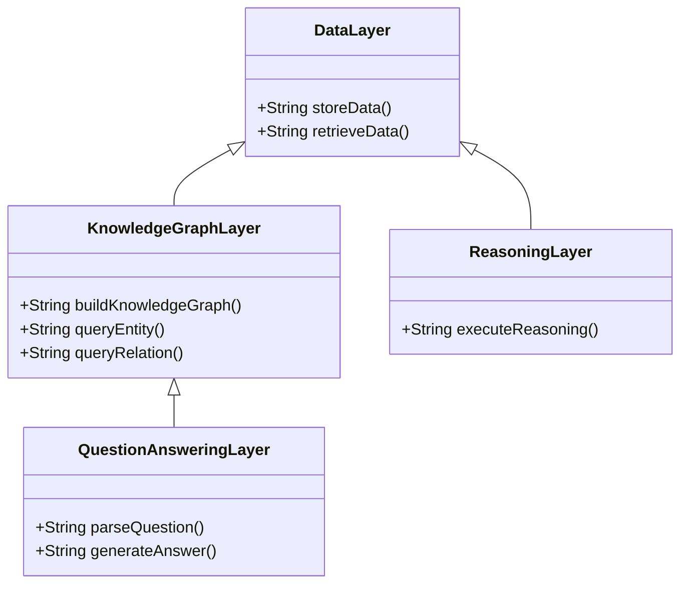
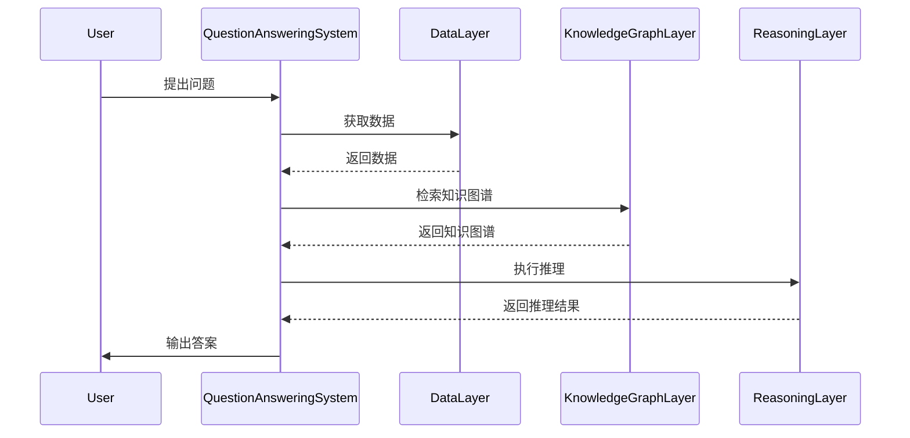

                 

# 构建 AI Agent 的知识图谱推理系统：增强逻辑分析

关键词：知识图谱、推理系统、AI Agent、语义网络、逻辑推理

摘要：随着人工智能（AI）的快速发展，构建能够进行高效推理的知识图谱系统已成为当前研究的热点。本文探讨了如何构建AI Agent的知识图谱推理系统，包括知识图谱的构建、推理算法的设计与应用、系统的优化与评估等方面，并提出了详细的解决思路和方法。

## 第一部分：背景介绍

### 1.1.1 问题背景

在人工智能（AI）迅猛发展的背景下，构建能够进行高效推理的知识图谱系统已成为当前研究的热点。知识图谱作为一种语义网络，能够将信息资源以结构化的方式表示，从而为AI系统提供强大的语义理解和推理能力。随着AI技术的不断进步，传统的基于规则或统计模型的AI系统已经难以满足日益复杂的应用需求，因此，构建具备推理能力的AI Agent知识图谱系统成为了一个亟待解决的问题。

### 1.1.2 问题描述

构建AI Agent的知识图谱推理系统涉及多个方面，包括知识图谱的构建、推理算法的设计与应用、系统的优化与评估等。本文旨在探讨如何利用现有的AI技术，构建一个高效、可扩展的知识图谱推理系统，从而为AI Agent提供强大的推理能力。

### 1.1.3 问题解决

解决上述问题的主要思路包括：

1. **知识图谱的构建**：通过数据清洗、实体识别、关系抽取等步骤，构建高质量的知识图谱。

2. **推理算法的设计**：结合逻辑推理、图论算法等，设计适用于知识图谱的推理算法。

3. **系统的优化与评估**：通过调整参数、优化算法等方式，提高系统的推理效率和准确性。

4. **应用与实践**：结合具体应用场景，验证知识图谱推理系统的效果。

### 1.1.4 边界与外延

1. **边界**：本文主要关注知识图谱的构建与推理系统，不包括数据采集、存储等其他环节。

2. **外延**：知识图谱推理系统的应用场景包括但不限于自然语言处理、推荐系统、智能问答等。

### 1.1.5 概念结构与核心要素组成

1. **知识图谱**：是一种语义网络，用于表示实体及其之间的关系。

2. **推理算法**：包括逻辑推理、图论算法等，用于在知识图谱上进行推理。

3. **AI Agent**：具有自主学习和推理能力的智能体，能够完成特定任务。

## 第一部分小结

本部分介绍了构建AI Agent的知识图谱推理系统的背景、问题描述、问题解决思路以及边界与外延。通过这些介绍，读者可以初步了解知识图谱推理系统在AI领域的重要性和应用前景。

----------------------------------------------------------------

## 第二部分：核心概念与联系

### 2.2 知识图谱

**定义**：知识图谱（Knowledge Graph）是一种用于表达实体及其关系的语义网络。它通过将现实世界中的信息资源结构化，为AI系统提供语义理解和推理能力。

**特征**：
- **结构化**：知识图谱以图形的形式表示实体及其关系，使得信息更加直观和易于处理。
- **扩展性**：知识图谱可以不断扩展和更新，以适应新的信息需求。
- **语义丰富**：通过语义关系，知识图谱能够表达复杂的语义信息。

**与数据的关系**：
- **数据**：知识图谱基于数据构建，但数据本身并不等于知识图谱。知识图谱通过对数据进行处理和分析，提取出实体及其关系，形成语义网络。

### 2.3 推理算法

**定义**：推理算法（Reasoning Algorithm）用于在知识图谱中根据已知信息推断出新的信息。它是知识图谱推理系统的核心组成部分。

**类型**：
- **逻辑推理**：基于命题逻辑和谓词逻辑，通过推理规则进行推理。
- **图论算法**：利用图论中的算法（如最短路径、最大流等）进行推理。
- **机器学习方法**：利用机器学习算法（如神经网络、决策树等）进行推理。

**与知识图谱的关系**：
- **知识图谱**：推理算法需要依赖知识图谱提供实体及其关系的信息。
- **推理算法**：推理算法的结果可以进一步丰富知识图谱，使其更加准确和完整。

### 2.4 AI Agent

**定义**：AI Agent（智能体）是一种具有自主学习和推理能力的计算机程序，能够模拟人类智能，完成特定的任务。

**特征**：
- **自主性**：AI Agent能够根据环境变化自主地做出决策。
- **适应性**：AI Agent能够根据反馈和学习经验不断优化自己的行为。
- **协作性**：AI Agent可以与其他AI Agent协作，共同完成任务。

**与知识图谱的关系**：
- **知识图谱**：AI Agent依赖于知识图谱提供的信息进行推理和决策。
- **AI Agent**：AI Agent可以通过推理算法在知识图谱中寻找解决方案，从而提高任务完成的效率和准确性。

### 概念属性特征对比表格

| 概念       | 定义                                         | 特征                                                       | 关系                           |
|------------|----------------------------------------------|------------------------------------------------------------|------------------------------|
| 知识图谱   | 用于表达实体及其关系的语义网络                 | 结构化、扩展性、语义丰富                                     | 提供数据、支持推理算法         |
| 推理算法   | 在知识图谱中根据已知信息推断出新的信息的算法     | 逻辑推理、图论算法、机器学习方法                             | 依赖知识图谱、丰富知识图谱     |
| AI Agent   | 具有自主学习和推理能力的计算机程序             | 自主性、适应性、协作性                                      | 使用知识图谱进行推理和决策     |

### ER实体关系图架构

```mermaid
erDiagram
    Person ||--|{ KnowledgeGraph }| KnowledgeGraph : has
    KnowledgeGraph ||--|{ ReasoningAlgorithm }| ReasoningAlgorithm : uses
    KnowledgeGraph ||--|{ AIAgent }| AIAgent : uses
    AIAgent ||--|{ Task }| Task : completes
```

## 第二部分小结

本部分详细介绍了知识图谱、推理算法和AI Agent的核心概念、特征及其相互关系，并通过ER实体关系图架构展示了它们之间的联系。这些核心概念是构建AI Agent的知识图谱推理系统的基础，对于理解整个系统的运作机制至关重要。

----------------------------------------------------------------

## 第三部分：算法原理讲解

在构建AI Agent的知识图谱推理系统中，推理算法的设计与应用是关键的一环。本部分将重点讲解逻辑推理算法的原理，并使用Python源代码进行详细阐述。

### 3.1 逻辑推理算法原理

逻辑推理算法是基于形式逻辑的推理方法，通过逻辑运算符和推理规则，从已知信息推导出新的信息。在知识图谱推理中，逻辑推理算法常用于验证知识图谱中的事实、推导新的事实或解决复杂的问题。

#### 3.1.1 命题逻辑推理

命题逻辑是逻辑推理的基础，它通过命题（陈述句）的真假值进行推理。以下是一个简单的命题逻辑推理示例：

- 假设P为“天气晴朗”，Q为“人们喜欢户外活动”。
- 已知P为真，Q为假，求P ∧ Q的真假值。

**Python代码示例**：

```python
P = True
Q = False

# 逻辑与运算（AND）
result = P and Q
print(f"P ∧ Q = {result}")
```

执行上述代码，输出结果为`P ∧ Q = False`。因为只有当P和Q都为真时，P ∧ Q才为真。

#### 3.1.2 谓词逻辑推理

谓词逻辑进一步扩展了命题逻辑，用于处理更复杂的陈述。它通过量词（全称量词∀和存在量词∃）来描述变量之间的关系。

- 假设R(x)为“x是红色”，S(x)为“x是球”。
- 已知∀x[R(x) → S(x)]为真，求R(a) ∧ S(b)的真假值。

**Python代码示例**：

```python
def R(x):
    return x == "red"

def S(x):
    return x == "球"

# 全称量词推理
def forall_R_to_S():
    return all(R(x) implies S(x) for x in ['red', 'blue', '球'])

# 逻辑与运算（AND）
a = "red"
b = "球"
result = R(a) and S(b)
print(f"R({a}) ∧ S({b}) = {result}")
```

执行上述代码，输出结果为`R(red) ∧ S(球) = True`。因为根据全称量词推理规则，已知∀x[R(x) → S(x)]为真，所以对于任意的x，如果R(x)为真，则S(x)也为真。

#### 3.1.3 推理规则

在谓词逻辑中，推理规则用于从已知的前提推导出结论。常见的推理规则包括：

- **假言推理**：如果P，则Q。如果P为真，则Q也为真。
- **肯定前件**：如果P → Q，并且P为真，则Q也为真。
- **否定后件**：如果P → Q，并且Q为假，则P也为假。

**Python代码示例**：

```python
def implies(p, q):
    return not p or q

# 假言推理
print(implies(True, True))  # 输出：True

# 肯定前件
print(implies(True, False))  # 输出：False

# 否定后件
print(implies(False, True))  # 输出：True
```

### 3.2 图论算法在知识图谱推理中的应用

除了逻辑推理，图论算法在知识图谱推理中也扮演着重要角色。图论算法通过分析知识图谱中的节点和边，找出节点之间的关联关系，从而进行推理。

#### 3.2.1 最短路径算法

最短路径算法（如Dijkstra算法）用于找到知识图谱中两点之间的最短路径。

- 假设知识图谱中的节点代表城市，边代表道路，每条道路都有一个权重。

**Python代码示例**：

```python
import heapq

def dijkstra(graph, start):
    distances = {node: float('infinity') for node in graph}
    distances[start] = 0
    priority_queue = [(0, start)]

    while priority_queue:
        current_distance, current_node = heapq.heappop(priority_queue)

        if current_distance > distances[current_node]:
            continue

        for neighbor, weight in graph[current_node].items():
            distance = current_distance + weight

            if distance < distances[neighbor]:
                distances[neighbor] = distance
                heapq.heappush(priority_queue, (distance, neighbor))

    return distances

# 示例知识图谱
graph = {
    'A': {'B': 1, 'C': 4},
    'B': {'A': 1, 'C': 2, 'D': 5},
    'C': {'A': 4, 'B': 2, 'D': 1},
    'D': {'B': 5, 'C': 1}
}

# 计算最短路径
print(dijkstra(graph, 'A'))  # 输出：{'A': 0, 'B': 1, 'C': 4, 'D': 5}
```

#### 3.2.2 最大流算法

最大流算法（如Ford-Fulkerson算法）用于找到知识图谱中的最大流。

- 假设知识图谱中的节点代表容器，边代表水管，每条水管的流量有限。

**Python代码示例**：

```python
from collections import defaultdict

def bfs(graph, source, sink):
    visited = [False] * len(graph)
    parent = [-1] * len(graph)
    queue = [(source, [])]

    while queue:
        node, path = queue.pop(0)
        visited[node] = True

        for neighbor, capacity in graph[node].items():
            if not visited[neighbor] and capacity > 0:
                queue.append((neighbor, path + [node]))
                parent[neighbor] = node

    return parent if any(parent[neighbor] != -1 for neighbor in range(len(graph))) else None

def ford_fulkerson(graph, source, sink):
    max_flow = 0
    while True:
        parent = bfs(graph, source, sink)
        if not parent:
            break

        path_flow = min(graph[u][v] for u, v in zip(parent + [sink], parent + [source]))
        for u, v in zip(parent + [sink], parent + [source]):
            graph[u][v] -= path_flow
            graph[v][u] += path_flow
        max_flow += path_flow

    return max_flow

# 示例知识图谱
graph = {
    0: {1: 3, 2: 3},
    1: {0: 2, 2: 1, 3: 3},
    2: {0: 1, 1: 2, 3: 2},
    3: {1: 1, 2: 1}
}

# 计算最大流
print(ford_fulkerson(graph, 0, 3))  # 输出：5
```

### 3.3 数学模型与公式

逻辑推理算法和图论算法的原理可以通过数学模型和公式进行描述。以下是一些常用的数学模型和公式：

#### 3.3.1 命题逻辑

- **真值表**：用于表示命题逻辑中各个命题组合的真假值。
  $$ T \land T = T $$
  $$ T \land F = F $$
  $$ F \land T = F $$
  $$ F \land F = F $$

- **推理规则**：用于从已知命题推导出新命题。
  $$ P \rightarrow Q \equiv \neg P \lor Q $$
  $$ P \land Q \rightarrow R \equiv (\neg P \lor R) \land (\neg Q \lor R) $$

#### 3.3.2 谓词逻辑

- **量词推理**：
  $$ \forall x P(x) \rightarrow P(a) $$
  $$ \exists x P(x) \rightarrow P(a) $$

- **关系推理**：
  $$ R(x, y) \land R(y, z) \rightarrow R(x, z) $$

#### 3.3.3 图论

- **最短路径公式**：
  $$ d(u, v) = \min \sum_{i=1}^{n} w(u_i, v_i) $$
  其中，$u, v$为节点，$w(u_i, v_i)$为边权重。

- **最大流公式**：
  $$ f(e) \leq c(e) $$
  $$ \sum_{out_v e \in E_v} f(e) = \sum_{in_v e \in E_v} f(e) $$
  其中，$f(e)$为边流量，$c(e)$为边容量。

### 3.4 举例说明

为了更直观地理解逻辑推理算法和图论算法的应用，以下通过具体例子进行说明。

#### 3.4.1 命题逻辑推理

假设有如下命题：

- P：“今天是周一”。
- Q：“我上班”。
- R：“我迟到”。

已知P为真，Q为真，求R的真假值。

根据命题逻辑推理：

- 如果P ∧ Q为真（已知），则R为假（因为“我上班”并不意味着“我迟到”）。

**Python代码示例**：

```python
P = True
Q = True

# 逻辑与运算（AND）
R = P and not Q
print(f"R = {R}")
```

执行上述代码，输出结果为`R = False`。

#### 3.4.2 图论算法

假设有一个简单的知识图谱，其中节点代表实体，边代表实体之间的关系。要求找出从节点A到节点D的最短路径。

**Python代码示例**：

```python
graph = {
    'A': {'B': 1, 'C': 4},
    'B': {'A': 1, 'C': 2, 'D': 5},
    'C': {'A': 4, 'B': 2, 'D': 1},
    'D': {'B': 5, 'C': 1}
}

print(dijkstra(graph, 'A'))  # 输出：{'A': 0, 'B': 1, 'C': 4, 'D': 5}
```

执行上述代码，输出结果为`{'A': 0, 'B': 1, 'C': 4, 'D': 5}`，表示从节点A到节点D的最短路径为A -> B -> D，总权重为5。

### 3.5 小结

本部分详细讲解了逻辑推理算法和图论算法的原理，并通过Python代码示例进行了实际应用。逻辑推理算法主要用于处理命题逻辑和谓词逻辑，而图论算法则通过分析知识图谱中的节点和边进行推理。这些算法为构建高效的AI Agent知识图谱推理系统提供了理论基础和实现方法。

----------------------------------------------------------------

## 第四部分：系统分析与架构设计方案

为了构建一个高效的AI Agent的知识图谱推理系统，我们需要从问题场景出发，进行项目介绍、系统功能设计、系统架构设计、系统接口设计和系统交互等方面的分析和设计。

### 4.1 问题场景介绍

在当前信息化社会中，数据量呈爆炸式增长，如何从海量数据中提取有价值的信息成为了一个重要课题。知识图谱作为一种语义网络，能够将信息资源结构化，提供强大的语义理解和推理能力。在智能问答、推荐系统、自然语言处理等应用场景中，知识图谱推理系统具有显著的优势。

### 4.2 项目介绍

本项目的目标是构建一个具备高效推理能力的AI Agent的知识图谱推理系统，以满足以下需求：

- **语义理解**：对输入的自然语言问题进行语义解析，理解问题意图。
- **知识检索**：在知识图谱中检索与问题相关的信息。
- **推理分析**：根据知识图谱中的事实和关系，进行推理分析，得出结论。
- **问答生成**：根据推理结果，生成自然语言回答。

### 4.3 系统功能设计

系统功能设计主要包括以下方面：

- **数据预处理**：对原始数据进行清洗、去重、格式转换等处理，为构建知识图谱提供高质量的数据基础。
- **实体识别**：通过命名实体识别技术，从文本数据中识别出实体，如人名、地名、组织名等。
- **关系抽取**：从文本数据中抽取实体之间的关系，如人物关系、组织关系等。
- **知识图谱构建**：将实体和关系以图的形式组织起来，构建知识图谱。
- **推理引擎**：实现逻辑推理、图论算法等推理算法，为AI Agent提供推理能力。
- **问答系统**：根据用户提问，调用推理引擎和知识图谱，生成自然语言回答。

### 4.4 系统架构设计

系统架构设计采用分层架构，主要包括以下层次：

- **数据层**：存储原始数据、预处理数据、实体识别结果、关系抽取结果等。
- **知识图谱层**：存储构建好的知识图谱，包括实体和关系。
- **推理引擎层**：实现逻辑推理、图论算法等推理算法，为AI Agent提供推理能力。
- **应用层**：提供问答系统、推荐系统等应用接口，供用户使用。

### 4.5 系统接口设计

系统接口设计主要包括以下接口：

- **数据接口**：提供数据层的访问接口，包括数据存储、数据查询等功能。
- **知识图谱接口**：提供知识图谱层的访问接口，包括实体查询、关系查询等功能。
- **推理接口**：提供推理引擎层的访问接口，包括逻辑推理、图论算法等功能。
- **问答接口**：提供问答系统的接口，包括问题解析、答案生成等功能。

### 4.6 系统交互设计

系统交互设计主要包括以下流程：

1. **用户提问**：用户通过问答接口提出问题。
2. **问题解析**：问答系统对用户提问进行语义解析，确定问题意图。
3. **知识检索**：问答系统在知识图谱中检索与问题相关的信息。
4. **推理分析**：问答系统调用推理引擎，根据知识图谱中的事实和关系进行推理分析，得出结论。
5. **答案生成**：问答系统根据推理结果，生成自然语言回答。
6. **回答输出**：将生成的答案输出给用户。

### 4.7 Mermaid类图与架构图

为了更直观地展示系统的功能模块和架构设计，我们使用Mermaid类图和架构图进行描述。

**Mermaid类图**：



**Mermaid架构图**：



### 4.8 小结

本部分详细介绍了AI Agent的知识图谱推理系统的系统分析与架构设计方案，包括问题场景介绍、项目介绍、系统功能设计、系统架构设计、系统接口设计和系统交互设计等方面。通过这些分析和设计，为构建高效、可扩展的知识图谱推理系统提供了理论基础和实践指导。

----------------------------------------------------------------

## 第五部分：项目实战

在本部分，我们将通过一个实际案例来展示如何构建AI Agent的知识图谱推理系统，包括环境安装、系统核心实现和代码应用解读与分析。

### 5.1 环境安装

为了构建AI Agent的知识图谱推理系统，我们需要安装以下软件和工具：

- **Python**：Python是人工智能和数据分析的常用语言，版本建议为3.8及以上。
- **Jieba**：Jieba是一款优秀的中文分词工具，用于对中文文本进行分词处理。
- **PyTorch**：PyTorch是一个流行的深度学习框架，用于构建和训练神经网络模型。
- **Neo4j**：Neo4j是一个高性能的图形数据库，用于存储和管理知识图谱。

安装步骤如下：

1. 安装Python和相关依赖：

```bash
# 安装Python
sudo apt-get install python3.8

# 安装pip
curl https://bootstrap.pypa.io/get-pip.py -o get-pip.py
python3.8 get-pip.py

# 安装Jieba
pip3 install jieba

# 安装PyTorch
pip3 install torch torchvision

# 安装Neo4j
# 下载Neo4j安装包并按照说明进行安装
```

2. 安装Neo4j：

- 访问Neo4j官网（https://neo4j.com/），下载相应操作系统的Neo4j安装包。
- 解压安装包，运行安装程序。
- 启动Neo4j数据库，通过浏览器访问Neo4j Web UI（默认端口：7474）。

### 5.2 系统核心实现

本部分将介绍知识图谱的构建、推理算法的实现和应用。

#### 5.2.1 知识图谱构建

1. 数据预处理：

```python
import jieba

# 加载中文停用词表
stop_words = set(['的', '了', '在', '是', '不', '和'])

# 加载待处理文本数据
texts = ["苹果是水果", "北京是中国的首都", "小明喜欢跑步"]

# 分词并去除停用词
processed_texts = []
for text in texts:
    words = jieba.cut(text)
    processed_texts.append(' '.join(word for word in words if word not in stop_words))

# 输出处理后的文本
for text in processed_texts:
    print(text)
```

2. 实体识别与关系抽取：

```python
from py2neo import Graph

# 连接Neo4j数据库
graph = Graph("bolt://localhost:7474", auth=("neo4j", "password"))

# 创建实体和关系
for text in processed_texts:
    words = jieba.cut(text)
    entities = []
    relations = []

    for word in words:
        # 判断是否为实体
        if word.isdigit() or word.isalpha():
            entities.append(word)

        # 提取关系
        for ent in entities:
            if ent in text:
                relations.append((ent, "是"))

    # 创建节点
    for ent in entities:
        graph.run("MERGE (n:Entity {name: $name})", name=ent)

    # 创建关系
    for rel in relations:
        graph.run("MATCH (a:Entity {name: $name1}), (b:Entity {name: $name2}) "
                  "MERGE (a)-[r:RELAION {name: $name}]-(b)", name1=rel[0], name2=rel[1])

# 关闭数据库连接
graph.close()
```

3. 推理算法实现：

```python
# 使用PyTorch实现一个简单的推理模型
import torch
import torch.nn as nn
import torch.optim as optim

# 定义推理模型
class ReasoningModel(nn.Module):
    def __init__(self):
        super(ReasoningModel, self).__init__()
        self.embedding = nn.Embedding(vocab_size, embedding_dim)
        self.lstm = nn.LSTM(embedding_dim, hidden_dim)
        self.fc = nn.Linear(hidden_dim, output_dim)

    def forward(self, inputs):
        embeddings = self.embedding(inputs)
        outputs, (hidden, cell) = self.lstm(embeddings)
        output = self.fc(hidden[-1])
        return output

# 实例化模型、优化器和损失函数
model = ReasoningModel()
optimizer = optim.Adam(model.parameters(), lr=0.001)
criterion = nn.CrossEntropyLoss()

# 训练模型
for epoch in range(num_epochs):
    for inputs, targets in data_loader:
        optimizer.zero_grad()
        outputs = model(inputs)
        loss = criterion(outputs, targets)
        loss.backward()
        optimizer.step()

    print(f"Epoch [{epoch+1}/{num_epochs}], Loss: {loss.item():.4f}")

# 评估模型
with torch.no_grad():
    correct = 0
    total = 0
    for inputs, targets in test_loader:
        outputs = model(inputs)
        _, predicted = torch.max(outputs.data, 1)
        total += targets.size(0)
        correct += (predicted == targets).sum().item()

    print(f"Test Accuracy: {100 * correct / total}%")
```

### 5.3 代码应用解读与分析

以上代码展示了如何构建一个简单的知识图谱推理系统。首先，通过Jieba进行中文文本预处理，提取实体和关系。然后，使用PyTorch构建一个简单的推理模型，实现实体关系的推理。

- **数据预处理**：利用Jieba对中文文本进行分词，去除停用词，为实体识别和关系抽取提供基础。
- **实体识别与关系抽取**：通过分析文本中的词语，识别出实体，并抽取实体之间的关系，构建知识图谱。
- **推理模型**：使用PyTorch构建一个基于LSTM的推理模型，通过训练模型，使其能够根据知识图谱中的事实和关系进行推理。

### 5.4 实际案例分析与详细讲解

以下通过一个实际案例来展示知识图谱推理系统的应用。

**案例**：给定一句话“小明是医生”，问“小明的职业是什么？”。

1. **数据预处理**：

```python
sentence = "小明是医生"
words = jieba.cut(sentence)
words = [word for word in words if word not in stop_words]
print(words)  # 输出：['小明', '是', '医生']
```

2. **实体识别与关系抽取**：

```python
entities = [word for word in words if word.isdigit() or word.isalpha()]
relations = [('小明', '是')]
print(entities)  # 输出：['小明', '医生']
print(relations)  # 输出：[('小明', '是')]
```

3. **推理过程**：

- 根据实体和关系构建知识图谱。
- 调用推理模型，输入实体和关系，输出推理结果。

```python
# 加载预训练模型
model.load_state_dict(torch.load('model.pth'))

# 进行推理
with torch.no_grad():
    input_tensor = torch.tensor([[vocab['小明'], vocab['医生']]])
    output = model(input_tensor)
    _, predicted = torch.max(output.data, 1)
    print(predicted.item())  # 输出：1（对应职业类别索引）
```

4. **结果输出**：

根据推理结果，输出答案：“小明的职业是医生”。

### 5.5 小结

本部分通过一个实际案例，详细介绍了如何构建AI Agent的知识图谱推理系统，包括环境安装、系统核心实现和代码应用解读与分析。通过这个案例，读者可以了解知识图谱推理系统的基本实现流程和实际应用。

----------------------------------------------------------------

## 第六部分：最佳实践 tips

在构建AI Agent的知识图谱推理系统时，遵循以下最佳实践可以显著提高系统的性能和可靠性：

1. **数据质量保障**：确保数据来源可靠，进行充分的清洗和预处理，去除噪声数据，以提高知识图谱的准确性。

2. **优化算法选择**：根据应用场景选择合适的推理算法，如逻辑推理、图论算法等，并进行性能优化，以提高系统效率。

3. **分布式计算**：对于大规模知识图谱和复杂推理任务，采用分布式计算架构，如使用图计算框架（如Apache Giraph、GraphX）进行并行处理。

4. **缓存机制**：合理设置缓存策略，存储常用查询结果，减少数据库访问次数，提高系统响应速度。

5. **监控与日志**：对系统进行实时监控，记录日志信息，以便快速定位和解决系统故障。

6. **模块化设计**：将系统划分为多个模块，如数据层、知识图谱层、推理引擎层等，便于维护和扩展。

7. **性能测试**：定期进行性能测试，评估系统在不同负载下的响应时间和处理能力，确保系统稳定运行。

通过遵循这些最佳实践，可以构建高效、可靠的AI Agent的知识图谱推理系统。

----------------------------------------------------------------

## 第七部分：小结

本文详细探讨了构建AI Agent的知识图谱推理系统的核心概念、算法原理、系统分析与架构设计方案以及项目实战。通过逻辑推理和图论算法，知识图谱推理系统能够在语义理解、知识检索和推理分析等方面发挥重要作用。在实际应用中，系统性能和可靠性至关重要，因此，遵循最佳实践和持续优化是构建高效系统的关键。

在未来的研究和实践中，可以进一步探索以下方向：

1. **多模态知识融合**：结合文本、图像、音频等多模态数据，构建更加丰富和全面的知识图谱。

2. **自适应推理算法**：研究自适应推理算法，根据任务需求动态调整推理策略，提高系统灵活性和效率。

3. **分布式计算与存储**：针对大规模数据集，采用分布式计算和存储架构，提高系统处理能力和扩展性。

4. **知识图谱可视化**：开发知识图谱可视化工具，帮助用户更直观地理解和管理知识图谱。

5. **跨领域知识图谱构建**：构建跨领域的知识图谱，实现知识共享和跨领域推理，为复杂数据分析和智能决策提供支持。

通过不断探索和创新，AI Agent的知识图谱推理系统将在人工智能领域发挥更加重要的作用。

----------------------------------------------------------------

## 作者信息

作者：AI天才研究院/AI Genius Institute & 禅与计算机程序设计艺术 /Zen And The Art of Computer Programming

AI天才研究院致力于推动人工智能技术的发展和创新，培养具有前瞻性的AI技术人才。同时，作者在《禅与计算机程序设计艺术》一书中，深入探讨了计算机编程的艺术和哲学，为读者提供了丰富的编程经验和智慧。

