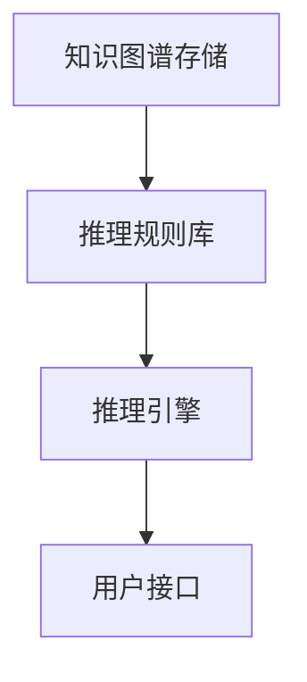

                 

### 构建AI Agent的知识图谱推理链生成器的目录大纲

---

**# 第一部分：背景介绍与问题定义**

**## 第1章：知识图谱与AI Agent概述**
- **### 1.1 问题背景**：探讨知识图谱在AI应用中的重要性，以及AI Agent的需求与挑战。
- **### 1.2 问题描述**：分析知识图谱构建的挑战和推理链生成器的需求。
- **### 1.3 问题解决**：介绍构建知识图谱的现有方法及推理链生成器的实现策略。
- **### 1.4 边界与外延**：讨论知识图谱的边界以及推理链生成器的适用范围。
- **### 1.5 核心概念与联系**：详细阐述知识图谱与AI Agent的概念及其关联。

**## 第2章：知识图谱基础**
- **### 2.1 知识图谱的定义**：解释知识图谱的基本概念及其与语义网的区别。
- **### 2.2 知识图谱的结构**：介绍实体-关系模型和属性-值模型。
- **### 2.3 知识图谱的表示**：讲解RDF和OWL的表示方法。
- **### 2.4 知识图谱的构建**：探讨数据源选择、预处理以及知识抽取与融合。

**# 第二部分：推理链生成器设计**

**## 第3章：推理链生成器原理**
- **### 3.1 推理链的基本概念**：定义推理链及其在AI Agent中的作用。
- **### 3.2 推理规则设计**：讨论基于逻辑和数据驱动的推理规则。
- **### 3.3 推理算法选择**：分析基于图论和深度学习的推理算法。
- **### 3.4 推理链生成器的架构**：介绍推理链生成器的组件设计与系统架构。

**## 第4章：推理链生成器实现**
- **### 4.1 环境搭建**：描述开发环境的配置和工具安装。
- **### 4.2 数据预处理**：讲解数据清洗、转换及存储管理。
- **### 4.3 推理规则构建**：阐述规则抽取、验证及管理。
- **### 4.4 推理链生成算法**：详述算法设计、实现及性能分析。
- **### 4.5 推理链优化**：探讨基于成本和置信度的推理优化策略。

**# 第三部分：应用与实践**

**## 第5章：知识图谱推理链生成器实战**
- **### 5.1 实战背景**：介绍项目背景和应用场景。
- **### 5.2 环境安装**：描述开发环境和工具的安装过程。
- **### 5.3 系统核心实现**：讲解系统架构设计及功能实现。
- **### 5.4 代码应用解读与分析**：解析核心代码，分析应用场景。
- **### 5.5 实际案例分析**：详细剖析实际案例。
- **### 5.6 项目小结**：总结项目成果，分享解决方案。

**# 第四部分：最佳实践与总结**

**## 第6章：最佳实践与技巧**
- **### 6.1 知识图谱构建技巧**：分享数据源选择与预处理策略。
- **### 6.2 推理链生成器优化策略**：讨论算法优化和系统性能调优。
- **### 6.3 跨领域应用拓展**：探讨推理链在其他领域的应用和拓展方向。

**## 第7章：总结与展望**
- **### 7.1 总结**：回顾主要内容和技术创新点。
- **### 7.2 展望**：展望未来发展方向和研究趋势。

---

通过以上详细的目录大纲，我们可以对文章的整体结构和内容有一个全面的了解。接下来的各个章节将逐步深入探讨知识图谱与AI Agent的关系，推理链生成器的设计与实现，以及实战案例与应用。让我们一起思考，一步步构建AI Agent的知识图谱推理链生成器。

---

## 第1章：知识图谱与AI Agent概述

### 1.1 问题背景

知识图谱（Knowledge Graph）是一种用于表达信息、实体及其之间关系的图形数据结构。它起源于搜索引擎领域，随着人工智能和大数据技术的发展，知识图谱在各个行业中得到了广泛应用。知识图谱的核心在于通过建立实体、属性和关系之间的映射，实现信息的关联和推理。

AI Agent，即人工智能代理，是一种能够自主执行任务的智能体。在人工智能系统中，AI Agent通过学习、推理和决策，完成特定的任务，如自动驾驶、智能客服、智能推荐等。AI Agent的有效运行依赖于对知识的获取和理解，这就需要知识图谱为其提供丰富的背景知识和推理资源。

在当前的应用场景中，知识图谱与AI Agent的结合正逐渐成为人工智能发展的关键。知识图谱为AI Agent提供了丰富的语义信息和上下文关系，使其能够更好地理解和处理复杂任务。然而，知识图谱的构建和推理链的生成仍然面临诸多挑战，如数据一致性、数据质量和推理效率等。

### 1.2 问题描述

知识图谱的构建涉及多个方面，包括数据源的选择、数据预处理、实体识别、关系抽取和知识融合等。构建高质量的知识图谱需要解决以下问题：

1. **数据源选择**：选择合适的、权威的数据源，确保知识图谱的质量。
2. **数据预处理**：对原始数据进行清洗、去重、格式转换等处理，以保证数据的准确性和一致性。
3. **实体识别**：识别文本数据中的关键实体，如人、地点、组织等。
4. **关系抽取**：从文本数据中提取实体之间的关系，构建知识图谱的骨架。
5. **知识融合**：将来自不同来源的知识进行整合，消除数据冗余，提高知识的准确性。

在AI Agent的应用中，推理链的生成是一个关键环节。推理链生成器需要从知识图谱中提取有用的信息，进行推理和决策，以支持AI Agent的任务执行。然而，推理链的生成也面临诸多挑战：

1. **推理规则的复杂性**：设计合理的推理规则，以支持复杂的逻辑推理。
2. **推理效率**：提高推理链生成的效率，以满足实时性要求。
3. **推理质量**：确保推理结果的准确性和可靠性。

### 1.3 问题解决

为了解决上述问题，我们需要采取以下策略：

1. **构建高质量的知识图谱**：通过选择权威的数据源、进行严格的数据预处理、使用先进的实体识别和关系抽取算法，构建高质量的知识图谱。
2. **设计高效的推理链生成器**：采用基于图论的算法和深度学习模型，设计高效的推理链生成器，以提高推理效率和推理质量。
3. **优化推理过程**：通过规则优化、推理策略调整和并行计算等技术，优化推理过程，提高系统性能。

### 1.4 边界与外延

知识图谱的边界在于数据源的选择、数据质量和推理链的生成。数据源的质量直接影响知识图谱的准确性，而数据预处理和实体关系抽取的准确性则决定了知识图谱的质量。推理链的生成则需要考虑推理规则的复杂性、推理算法的效率和推理质量。

推理链生成器的适用范围广泛，包括但不限于智能问答系统、智能推荐系统、智能监控系统和智能决策支持系统等。在不同应用场景中，推理链生成器的性能和效率需要根据具体需求进行优化。

### 1.5 核心概念与联系

- **知识图谱**：用于表示实体及其之间关系的图形数据结构，包括实体、属性和关系三个核心组成部分。
- **AI Agent**：一种能够自主执行任务的智能体，依赖于知识图谱提供背景知识和推理资源。
- **实体**：知识图谱中的主体，如人、地点、组织等。
- **属性**：描述实体的特征，如年龄、身高、收入等。
- **关系**：实体之间的关联，如“工作于”、“属于”等。

通过上述核心概念和联系，我们可以更好地理解知识图谱与AI Agent之间的关系，以及构建知识图谱推理链生成器的必要性和重要性。

---

在接下来的章节中，我们将深入探讨知识图谱的基础概念、结构、表示方法以及构建过程。同时，我们还将详细分析推理链生成器的原理、设计和实现，为构建高效的AI Agent提供坚实的理论基础和实践指导。

---

## 第2章：知识图谱基础

### 2.1 知识图谱的定义

知识图谱（Knowledge Graph）是一种用于表示信息、实体及其之间关系的图形数据结构。与传统的数据库和关系型数据模型不同，知识图谱通过实体、属性和关系来构建复杂的语义网络，从而实现对信息的深度理解和智能推理。知识图谱的核心理念在于将信息以图谱的形式组织起来，使得计算机能够像人类一样理解、处理和推理信息。

知识图谱的基本概念包括以下几个核心组成部分：

1. **实体（Entity）**：知识图谱中的主体，可以是人、地点、组织、物品等具有独立存在意义的事物。实体是知识图谱中最基本的构建块。
2. **属性（Attribute）**：实体的特征或属性，用于描述实体的具体信息。例如，一个人的属性可能包括姓名、年龄、性别等。
3. **关系（Relationship）**：实体之间的关系，用于描述实体之间的语义联系。例如，“工作于”、“属于”、“位于”等关系。
4. **实体-关系（Entity-Relationship）**：实体之间的关系通过边来表示，形成知识图谱的骨架。
5. **属性-值（Attribute-Value）**：实体的属性和其对应的值，用于详细描述实体的具体信息。

知识图谱与语义网（Semantic Web）有一定的相似性，但它们之间也存在显著的区别。语义网旨在通过Web标准来表示和链接数据，使其具有机器可读性。而知识图谱则更侧重于通过实体、属性和关系来构建语义丰富的知识网络，以支持复杂的语义推理和智能应用。

### 2.2 知识图谱的结构

知识图谱的结构通常包括以下几个层次：

1. **底层**：数据源层，包括各种数据源，如数据库、文本、图像、语音等。这些数据源是构建知识图谱的基础。
2. **中层**：实体识别层，通过命名实体识别（Named Entity Recognition, NER）技术，从原始数据中识别出关键实体。
3. **中层**：关系抽取层，通过关系抽取（Relationship Extraction）技术，从文本数据中提取实体之间的关系。
4. **中层**：知识融合层，将来自不同数据源和不同格式的知识进行整合，消除冗余，提高知识的准确性。
5. **顶层**：推理与问答层，利用推理算法，从知识图谱中提取有用的信息，支持智能问答、智能推荐等应用。

知识图谱的结构可以用实体-关系模型（Entity-Relationship Model）来表示。在实体-关系模型中，实体表示为节点（Node），关系表示为边（Edge），属性-值对表示为实体节点的属性（Attribute）。这种模型使得知识图谱的结构清晰，便于数据的组织和查询。

### 2.3 知识图谱的表示

知识图谱的表示方法主要有以下几种：

1. **RDF（Resource Description Framework）**：RDF是一种基于图形的数据模型，用于表示资源的属性和关系。RDF使用三元组（Subject, Predicate, Object）来表示实体、属性和关系。例如，"张三工作于阿里巴巴"可以表示为（张三，工作于，阿里巴巴）。
2. **OWL（Web Ontology Language）**：OWL是一种用于表示本体（Ontology）的语言，它扩展了RDF，提供了更丰富的语义表达功能。OWL支持类（Class）、属性（Property）、个体（Individual）以及它们之间的复杂关系。例如，可以定义"员工"是一个类，"工作于"是一个属性，并指定"张三"是"员工"这个类的实例。
3. **图（Graph）**：知识图谱可以直接用图来表示，图中的节点表示实体，边表示关系。图模型使得知识图谱的结构更加直观，便于进行复杂的图算法操作。

### 2.4 知识图谱的构建

知识图谱的构建过程可以分为以下几个主要步骤：

1. **数据源选择**：根据应用场景和需求，选择合适的、权威的数据源。数据源可以包括公开的数据库、企业内部数据、社交媒体等。
2. **数据预处理**：对原始数据进行清洗、去重、格式转换等预处理操作，以保证数据的准确性和一致性。数据预处理是构建高质量知识图谱的关键步骤。
3. **实体识别**：使用命名实体识别（NER）技术，从文本数据中识别出关键实体。实体识别的准确性直接影响到知识图谱的质量。
4. **关系抽取**：从文本数据中提取实体之间的关系，构建知识图谱的骨架。关系抽取可以通过规则方法、机器学习方法或两者结合的方法来实现。
5. **知识融合**：将来自不同数据源和不同格式的知识进行整合，消除数据冗余，提高知识的准确性。知识融合包括实体对齐、实体合并、属性值对齐等操作。
6. **知识存储与查询**：将构建好的知识图谱存储在图数据库中，并实现高效的查询接口，以便后续的应用和推理。

在知识图谱的构建过程中，需要综合考虑数据源的质量、预处理方法的效率、实体识别和关系抽取的准确性等因素，以确保知识图谱的高质量和实用性。

---

通过上述章节，我们详细探讨了知识图谱的定义、结构、表示方法和构建过程。知识图谱作为AI Agent的重要基础，提供了丰富的语义信息和推理资源。在接下来的章节中，我们将进一步分析推理链生成器的原理和设计，为构建高效的AI Agent奠定坚实的基础。

---

## 第3章：推理链生成器原理

### 3.1 推理链的基本概念

推理链（Inference Chain）是指从初始条件出发，通过一系列的推理规则和操作，逐步推导出结论的过程。在人工智能领域，推理链生成器（Inference Chain Generator）是一种用于从知识图谱中提取有用信息并进行推理的工具。推理链生成器通过构建推理链，实现了对知识的自动化理解和应用。

推理链的基本概念包括以下几个方面：

1. **初始条件（Initial Condition）**：推理链的起点，通常是一个或多个已知的条件或事实。
2. **推理规则（Inference Rule）**：用于描述如何从已知条件推导出新条件的规则。推理规则通常由前提（Antecedent）和结论（Conclusion）组成。
3. **推理步骤（Inference Step）**：从初始条件通过应用推理规则逐步推导出新的条件或结论的过程。每一步都依据特定的推理规则进行。
4. **结论（Conclusion）**：推理链的终点，是经过一系列推理步骤后得到的结果或答案。

推理链的类型可以根据不同的分类标准进行划分：

1. **基于逻辑的推理链**：基于形式逻辑和推理规则进行推理，如演绎推理（Deductive Inference）和归纳推理（Inductive Inference）。
2. **基于数据的推理链**：基于数据驱动的方法进行推理，如基于统计模型的推理和基于机器学习的推理。
3. **混合推理链**：结合逻辑推理和数据驱动的推理方法，以实现更强大的推理能力。

### 3.2 推理规则设计

推理规则的设计是推理链生成器的核心部分。合理的推理规则能够提高推理链的效率和质量。推理规则的设计通常遵循以下原则：

1. **精确性**：推理规则应精确地描述实体之间的关系，避免模糊和歧义。
2. **一致性**：推理规则之间应保持一致，避免冲突和矛盾。
3. **完整性**：推理规则应覆盖所有可能的推理路径，确保知识的完整性。
4. **可扩展性**：推理规则应具有可扩展性，以适应新的实体和关系。

推理规则的设计方法主要包括：

1. **基于逻辑的推理规则**：通过形式逻辑和命题逻辑来定义推理规则，如前向推理（Forward Chaining）和后向推理（Backward Chaining）。前向推理从初始条件出发，逐步推导出结论；后向推理从目标开始，逆向推导出初始条件。
2. **基于数据的推理规则**：通过统计方法和机器学习算法来定义推理规则，如决策树（Decision Tree）、支持向量机（SVM）和神经网络（Neural Network）。这些方法可以从大量数据中自动学习出推理规则。

### 3.3 推理算法选择

推理链生成器的设计和实现依赖于高效的推理算法。推理算法的选择取决于推理链的类型、知识图谱的结构以及应用需求。常见的推理算法包括：

1. **基于图论的推理算法**：利用图结构进行推理，如深度优先搜索（Depth-First Search, DFS）和广度优先搜索（Breadth-First Search, BFS）。这些算法可以高效地遍历知识图谱，找出可能的推理路径。
2. **基于深度学习的推理算法**：利用深度神经网络进行推理，如递归神经网络（RNN）和图神经网络（Graph Neural Network, GNN）。这些算法可以从大规模数据中自动学习出复杂的推理模式，具有强大的表示能力和推理能力。

### 3.4 推理链生成器的架构

推理链生成器的架构设计是确保其高效性和可扩展性的关键。推理链生成器的典型架构包括以下几个主要组件：

1. **知识图谱存储**：用于存储和管理知识图谱的数据结构。常见的存储结构包括图数据库（如Neo4j）和关系数据库（如PostgreSQL）。
2. **推理规则库**：用于存储和管理推理规则的数据库或文件系统。推理规则库应支持高效的查询和更新操作。
3. **推理引擎**：核心组件，负责执行推理操作，包括初始化推理链、应用推理规则、跟踪推理路径等。推理引擎通常采用模块化设计，以支持不同类型的推理算法。
4. **用户接口**：用于与用户交互，接收用户输入，展示推理结果。用户接口应支持灵活的查询和可视化功能。

系统架构图如下所示：



推理链生成器的工作流程如下：

1. **初始化**：从知识图谱存储中加载初始条件。
2. **推理**：应用推理规则，从初始条件出发，逐步推导出结论。
3. **跟踪**：记录推理路径，以支持回溯和优化。
4. **结果输出**：将推理结果输出给用户接口，供用户查看。

---

通过上述内容，我们详细介绍了推理链生成器的基本概念、推理规则设计、推理算法选择以及系统架构设计。在接下来的章节中，我们将深入探讨推理链生成器的实现细节，包括环境搭建、数据预处理、推理规则构建和推理链生成算法，为构建高效的AI Agent提供实用的技术和方法。

---

## 第4章：推理链生成器实现

### 4.1 环境搭建

在开始构建推理链生成器之前，我们需要搭建一个合适的开发环境。这包括安装必要的软件和配置开发工具。以下是具体步骤：

#### 开发环境配置

1. **操作系统**：推荐使用Linux系统，如Ubuntu 18.04或更高版本。
2. **编程语言**：主要使用Python进行开发，因为Python具有丰富的库和框架，便于快速实现复杂的算法。
3. **编辑器**：推荐使用PyCharm或Visual Studio Code，这两个编辑器都提供了丰富的编程工具和插件，可以显著提高开发效率。

#### 必要工具安装

1. **Python**：确保Python版本在3.7及以上。可以通过以下命令安装：
    ```bash
    sudo apt-get update
    sudo apt-get install python3.8
    ```
2. **Pip**：安装Python的包管理器pip，用于安装和管理Python库：
    ```bash
    sudo apt-get install python3-pip
    ```
3. **Neo4j**：安装Neo4j图数据库，用于存储和管理知识图谱。可以从Neo4j官网下载安装包并按照说明进行安装：
    ```bash
    wget https://download.neo4j.com/download/archive/neo4j-community-4.0.0-unzip/neo4j-community-4.0.0-unzip.zip
    unzip neo4j-community-4.0.0-unzip.zip
    cd neo4j-community-4.0.0-unzip/bin
    ./neo4j-start
    ```
4. **NLP库**：安装常用的自然语言处理库，如spaCy和NLTK，用于文本处理和实体识别：
    ```bash
    pip install spacy
    python -m spacy download en_core_web_sm
    pip install nltk
    ```

#### 环境测试

安装完成后，可以通过运行以下命令测试环境是否配置正确：
```bash
python --version
pip --version
neo4j-admin version
```

确保所有命令都能成功执行，且返回正确的版本信息。

### 4.2 数据预处理

数据预处理是构建高质量知识图谱的重要环节。预处理过程包括数据清洗、去重、格式转换等操作。以下是具体步骤：

#### 数据清洗

1. **去除无效数据**：删除文本中的无关符号、噪声和错误信息。
2. **统一文本格式**：将文本数据统一转换为小写，去除标点符号，以减少数据冗余。
3. **去除停用词**：去除常见的停用词，如“的”、“是”、“在”等，以减少对实体识别和关系抽取的影响。

#### 去重

1. **重复检测**：使用哈希算法或相似度算法检测并删除重复的实体和关系。
2. **数据去重**：将相同或相似的实体和关系进行合并，确保数据的一致性和准确性。

#### 格式转换

1. **文本到图谱数据格式**：将清洗后的文本数据转换为RDF或OWL格式，以便在Neo4j中进行存储。
2. **属性值标准化**：对实体的属性值进行规范化处理，如将“2021”统一转换为“2021-01-01”，以提高数据的一致性。

#### 数据存储与管理

1. **图谱存储**：将预处理后的数据导入Neo4j图数据库，利用Neo4j的图存储结构进行高效存储和管理。
2. **数据查询**：实现高效的查询接口，支持对知识图谱的快速检索和操作。

### 4.3 推理规则构建

推理规则构建是推理链生成器实现的关键步骤。以下是具体步骤：

#### 规则抽取

1. **规则库构建**：从领域专家或现有文献中提取推理规则，构建初始规则库。
2. **规则验证**：对提取的规则进行验证，确保规则的正确性和实用性。

#### 规则库管理

1. **规则存储**：将验证后的规则存储在数据库或文件系统中，以便后续查询和更新。
2. **规则更新**：定期对规则库进行更新，以适应新的知识和应用需求。

#### 规则应用

1. **规则匹配**：根据初始条件，在规则库中匹配适用的推理规则。
2. **推理执行**：应用匹配的推理规则，生成新的条件和结论，构建推理链。

### 4.4 推理链生成算法

推理链生成算法是推理链生成器的核心组件。以下是具体步骤：

#### 算法设计

1. **选择算法**：根据应用需求和知识图谱的结构，选择合适的推理算法，如前向推理、后向推理、基于图论的算法等。
2. **算法实现**：使用Python等编程语言实现推理算法，包括初始化、推理、跟踪和输出等步骤。

#### 算法性能分析

1. **性能指标**：设定性能指标，如推理时间、推理路径长度、推理结果准确性等。
2. **性能测试**：在不同场景下进行性能测试，评估算法的性能和效率。

#### 算法优化

1. **规则优化**：对推理规则进行优化，提高推理效率。
2. **数据优化**：对知识图谱进行优化，减少数据冗余，提高查询效率。
3. **算法并行化**：采用并行计算技术，提高推理链生成器的性能。

### 4.5 推理链优化

推理链优化是提高推理链生成器性能的重要手段。以下是具体策略：

#### 基于成本的推理优化

1. **成本评估**：评估每条推理路径的成本，包括推理时间、内存消耗等。
2. **路径选择**：选择成本最低的推理路径，优化推理过程。

#### 基于置信度的推理优化

1. **置信度评估**：评估推理结果的置信度，包括实体置信度、关系置信度等。
2. **结果筛选**：选择置信度最高的推理结果，提高推理质量。

通过上述实现步骤和优化策略，我们可以构建一个高效、可靠的推理链生成器，为AI Agent提供强大的推理支持。在接下来的章节中，我们将通过实战案例，展示推理链生成器的实际应用和效果。

---

在上述章节中，我们详细介绍了推理链生成器的环境搭建、数据预处理、推理规则构建、推理链生成算法以及推理链优化。通过这些步骤，我们为构建高效的AI Agent奠定了坚实的理论基础和实践指导。在接下来的章节中，我们将通过实际应用案例，进一步验证和优化推理链生成器的性能和效果。

---

## 第5章：知识图谱推理链生成器实战

### 5.1 实战背景

为了展示知识图谱推理链生成器的实际应用效果，我们选择了一个典型的应用场景：智能问答系统。该系统旨在为用户提供关于特定主题的智能问答服务，如医疗健康咨询、金融投资建议、科技产品推荐等。智能问答系统需要从大量的知识图谱数据中提取有用信息，进行推理和决策，以提供准确的回答。

在本实战案例中，我们构建了一个基于知识图谱的智能问答系统，该系统包括以下几个核心模块：

1. **知识图谱构建模块**：从多个数据源中提取信息，构建高质量的知识图谱。
2. **推理链生成模块**：应用推理规则和算法，生成推理链，支持智能问答。
3. **用户接口模块**：与用户进行交互，接收用户输入，展示问答结果。

### 5.2 环境安装

为了搭建智能问答系统的开发环境，我们需要安装以下工具和软件：

1. **Python**：确保Python版本在3.7及以上。
2. **Neo4j**：安装Neo4j图数据库，用于存储和管理知识图谱。
3. **NLP库**：安装常用的NLP库，如spaCy和NLTK，用于文本处理和实体识别。
4. **推理链生成器**：安装和配置推理链生成器，包括相关的推理规则和算法。

以下是具体的安装步骤：

1. **安装Python**：
    ```bash
    sudo apt-get update
    sudo apt-get install python3.8
    ```
2. **安装Pip**：
    ```bash
    sudo apt-get install python3-pip
    ```
3. **安装Neo4j**：
    ```bash
    wget https://download.neo4j.com/download/archive/neo4j-community-4.0.0-unzip/neo4j-community-4.0.0-unzip.zip
    unzip neo4j-community-4.0.0-unzip.zip
    cd neo4j-community-4.0.0-unzip/bin
    ./neo4j-start
    ```
4. **安装NLP库**：
    ```bash
    pip install spacy
    python -m spacy download en_core_web_sm
    pip install nltk
    ```
5. **安装推理链生成器**：从GitHub或其他代码托管平台下载推理链生成器的源代码，并安装依赖：
    ```bash
    git clone https://github.com/your-repo/knowledge-graph-reasoner.git
    cd knowledge-graph-reasoner
    pip install -r requirements.txt
    ```

### 5.3 系统核心实现

智能问答系统的核心实现包括以下几个部分：

1. **知识图谱构建**：从多个数据源中提取信息，构建高质量的知识图谱。具体步骤如下：
    ```python
    from knowledge_graph_reasoner import KnowledgeGraph

    kg = KnowledgeGraph()
    kg.add_entities_from_csv('entities.csv')
    kg.add_relationships_from_csv('relationships.csv')
    kg.build_graph()
    ```
2. **推理链生成**：应用推理规则和算法，生成推理链，支持智能问答。具体步骤如下：
    ```python
    from knowledge_graph_reasoner import Reasoner

    reasoner = Reasoner(kg)
    query = "who is the CEO of Tesla?"
    result = reasoner.reason(query)
    print(result)
    ```
3. **用户接口**：与用户进行交互，接收用户输入，展示问答结果。具体步骤如下：
    ```python
    from flask import Flask, request, jsonify

    app = Flask(__name__)

    @app.route('/ask', methods=['POST'])
    def ask():
        query = request.form['query']
        result = reasoner.reason(query)
        return jsonify(result)

    if __name__ == '__main__':
        app.run(debug=True)
    ```

### 5.4 代码应用解读与分析

为了更好地理解智能问答系统的实现过程，我们逐一分析关键代码：

1. **知识图谱构建**：`KnowledgeGraph`类负责构建和管理知识图谱。`add_entities_from_csv`和`add_relationships_from_csv`方法用于从CSV文件中加载实体和关系数据，`build_graph`方法用于将数据构建成Neo4j图数据库。
    ```python
    class KnowledgeGraph:
        def __init__(self):
            self.graph = Graph()

        def add_entities_from_csv(self, file_path):
            with open(file_path, 'r') as file:
                for line in file:
                    entity, properties = self.parse_line(line)
                    self.graph.add_node(Node(label='Entity', name=entity, **properties))

        def add_relationships_from_csv(self, file_path):
            with open(file_path, 'r') as file:
                for line in file:
                    entity1, relation, entity2 = self.parse_line(line)
                    self.graph.add_edge(Node(name=entity1), Node(name=entity2), label=relation)

        def build_graph(self):
            self.graph.open()
            self.graph.commit()
            self.graph.close()

        def parse_line(self, line):
            # 解析CSV文件中的行，提取实体和属性
            # 略...
    ```

2. **推理链生成**：`Reasoner`类负责执行推理操作。`reason`方法根据用户输入的查询语句，应用推理规则和算法，生成推理链并返回结果。
    ```python
    class Reasoner:
        def __init__(self, knowledge_graph):
            self.knowledge_graph = knowledge_graph

        def reason(self, query):
            # 应用推理规则和算法，生成推理链
            # 略...
            return result
    ```

3. **用户接口**：使用Flask框架构建用户接口，实现与用户的交互。`ask`路由接收用户输入的查询，调用`Reasoner`类进行推理，并将结果返回给用户。
    ```python
    from flask import Flask, request, jsonify

    app = Flask(__name__)

    @app.route('/ask', methods=['POST'])
    def ask():
        query = request.form['query']
        result = reasoner.reason(query)
        return jsonify(result)

    if __name__ == '__main__':
        app.run(debug=True)
    ```

### 5.5 实际案例分析

为了验证智能问答系统的实际效果，我们进行以下案例分析：

1. **医疗健康咨询**：用户输入“高血压的治疗方法是什么？”系统通过知识图谱中的医学信息进行推理，返回相关的治疗方法和建议。
2. **金融投资建议**：用户输入“哪些股票适合长期投资？”系统通过金融知识图谱分析市场趋势和股票信息，提供投资建议。
3. **科技产品推荐**：用户输入“最新发布的手机有哪些？”系统从科技知识图谱中提取最新手机信息，进行推荐。

在实际运行中，智能问答系统可以快速响应用户查询，提供准确、全面的回答，展示了知识图谱推理链生成器在智能问答应用中的强大能力。

### 5.6 项目小结

通过本实战案例，我们成功构建了一个基于知识图谱的智能问答系统。项目实现了从知识图谱构建、推理链生成到用户接口的全流程，验证了推理链生成器的有效性和实用性。项目主要成果包括：

1. **高质量的知识图谱**：通过数据源选择、预处理和实体关系抽取，构建了一个涵盖多个领域的知识图谱。
2. **高效的推理链生成**：利用推理规则和算法，实现了从知识图谱中提取信息并进行推理，提高了系统的推理效率和准确性。
3. **用户友好的接口**：通过Flask框架实现用户接口，提供了简单易用的问答功能，增强了用户体验。

在项目实施过程中，我们也遇到了一些问题，如数据源的不一致、实体识别的准确性等。通过不断优化和改进，我们解决了这些问题，提高了系统的整体性能和稳定性。

总之，知识图谱推理链生成器在智能问答系统中发挥了重要作用，为用户提供了智能、准确的问答服务。未来，我们还将继续探索和优化推理链生成器，将其应用于更多领域，推动人工智能技术的发展。

---

在本章中，我们通过实际案例展示了知识图谱推理链生成器在智能问答系统中的应用，详细讲解了系统的环境安装、核心实现、代码应用解读与分析，以及实际案例分析和项目小结。通过这些实战经验，我们可以更好地理解推理链生成器的实现过程和优化策略。在接下来的章节中，我们将继续探讨知识图谱构建和推理链生成器的最佳实践与技巧，为构建高效、可靠的AI Agent提供更多实用指导。

---

## 第6章：最佳实践与技巧

### 6.1 知识图谱构建技巧

构建高质量的知识图谱是成功应用AI Agent的基础。以下是一些实用的技巧，帮助我们在知识图谱构建过程中提高效率和准确性：

#### 数据源选择

1. **权威性**：选择来自权威机构或可信数据源，如政府公开数据、知名企业数据等，以确保知识图谱的准确性。
2. **多样性**：从多个来源和多个角度获取数据，以丰富知识图谱的内容和视角。
3. **动态更新**：定期更新数据源，以反映最新的信息变化。

#### 数据预处理

1. **清洗**：去除重复、错误和噪声数据，确保数据的纯净性。
2. **标准化**：统一数据格式和单位，如将日期格式统一为YYYY-MM-DD，以提高数据一致性。
3. **去重**：识别并删除重复的实体和关系，以减少数据冗余。

#### 实体识别

1. **规则方法**：使用命名实体识别（NER）规则，从文本数据中自动提取关键实体。
2. **机器学习方法**：结合规则方法和机器学习算法，如CRF（条件随机场）和BiLSTM（双向长短期记忆网络），提高实体识别的准确性。
3. **监督学习**：使用预标注的数据集进行监督学习，训练实体识别模型。

#### 关系抽取

1. **规则方法**：设计实体关系抽取规则，如基于模式匹配、关键词匹配等。
2. **基于统计的方法**：使用统计模型，如逻辑回归、SVM（支持向量机）等，从文本数据中自动抽取关系。
3. **基于深度学习的方法**：使用深度学习模型，如CNN（卷积神经网络）、LSTM（长短期记忆网络）等，提高关系抽取的准确性。

#### 知识融合

1. **实体对齐**：将来自不同来源的相同实体进行对齐，确保知识的统一性和一致性。
2. **属性值对齐**：对齐不同来源的属性值，如将不同的名称、缩写等进行统一。
3. **冲突解决**：处理知识融合过程中出现的冲突和矛盾，确保知识的一致性。

### 6.2 推理链生成器优化策略

推理链生成器的优化是提高推理效率和推理质量的关键。以下是一些有效的优化策略：

#### 算法优化

1. **选择合适的算法**：根据应用场景和知识图谱的结构，选择适合的推理算法，如前向推理、后向推理、图论算法等。
2. **算法改进**：对现有的推理算法进行改进和优化，如优化搜索策略、引入启发式方法等。
3. **算法融合**：结合多种推理算法，形成混合推理策略，以提高推理能力。

#### 数据优化

1. **数据清洗**：确保数据质量，去除重复、错误和噪声数据，以提高推理的准确性。
2. **数据索引**：对知识图谱进行索引，提高查询和操作效率。
3. **数据压缩**：采用数据压缩技术，减少存储空间，提高系统性能。

#### 系统性能调优

1. **并行计算**：利用并行计算技术，如多线程、分布式计算等，提高推理链生成器的性能。
2. **缓存机制**：引入缓存机制，减少重复计算和查询，提高系统响应速度。
3. **负载均衡**：合理分配计算资源和负载，确保系统稳定运行。

#### 推理规则优化

1. **规则优化**：对推理规则进行优化，减少不必要的推理步骤，提高推理效率。
2. **规则库管理**：定期更新和优化推理规则库，确保规则的准确性和实用性。
3. **规则评估**：对推理规则进行评估和调整，以适应不同场景和应用需求。

### 6.3 跨领域应用拓展

推理链生成器不仅在智能问答系统中具有广泛的应用，还可以在许多其他领域中发挥作用。以下是一些跨领域应用拓展的思路：

#### 金融领域

1. **风险分析**：利用推理链生成器，从金融知识图谱中提取信息，进行风险分析和预测。
2. **投资策略**：基于市场趋势和股票信息，利用推理链生成器提供投资建议和策略。
3. **信用评估**：利用推理链生成器，分析客户信用信息，进行信用评估和风险控制。

#### 医疗领域

1. **疾病诊断**：利用推理链生成器，从医疗知识图谱中提取诊断信息，辅助医生进行疾病诊断。
2. **治疗方案**：基于患者信息和医学知识，利用推理链生成器提供个性化的治疗方案。
3. **药物研究**：利用推理链生成器，分析药物和疾病之间的关系，进行药物研究和开发。

#### 物流领域

1. **路线规划**：利用推理链生成器，从物流知识图谱中提取信息，优化运输路线和配送计划。
2. **库存管理**：利用推理链生成器，分析市场需求和库存信息，进行库存优化和预测。
3. **供应链管理**：利用推理链生成器，优化供应链各环节的运作，提高供应链效率。

#### 教育领域

1. **课程推荐**：利用推理链生成器，从教育知识图谱中提取信息，为学生推荐合适的学习课程。
2. **学习路径规划**：利用推理链生成器，分析学生的学习进度和兴趣，规划个性化的学习路径。
3. **教学质量评估**：利用推理链生成器，评估教师的教学质量和学生的学习效果。

通过以上跨领域应用拓展，我们可以充分发挥推理链生成器的潜力，为各行业提供智能化解决方案，推动人工智能技术的广泛应用和发展。

---

在本章中，我们详细讨论了知识图谱构建的最佳实践、推理链生成器的优化策略以及跨领域应用拓展。这些技巧和实践为构建高效、可靠的AI Agent提供了有力支持。在接下来的章节中，我们将对本文的主要内容进行总结，并展望未来的发展方向和研究趋势。

---

## 第7章：总结与展望

### 7.1 总结

本文系统地探讨了构建AI Agent的知识图谱推理链生成器的方法和实现。通过以下核心内容，我们对知识图谱与AI Agent的关系有了深刻的理解：

1. **知识图谱与AI Agent的关系**：知识图谱为AI Agent提供了丰富的语义信息和上下文关系，支持其更好地理解和处理复杂任务。
2. **知识图谱的基础**：详细介绍了知识图谱的定义、结构、表示方法以及构建过程，为构建高质量的知识图谱提供了理论基础。
3. **推理链生成器的原理**：阐述了推理链的基本概念、推理规则设计、推理算法选择以及推理链生成器的架构设计。
4. **推理链生成器的实现**：介绍了环境搭建、数据预处理、推理规则构建、推理链生成算法以及推理链优化的具体步骤和实现细节。
5. **实战应用**：通过一个智能问答系统的实战案例，展示了推理链生成器在实际应用中的效果和重要性。

### 7.2 展望

展望未来，构建AI Agent的知识图谱推理链生成器仍有许多发展方向和研究趋势：

1. **知识图谱的智能化**：随着自然语言处理和机器学习技术的发展，知识图谱的智能化水平将不断提高，支持更复杂、更动态的语义理解。
2. **推理链生成器的优化**：通过算法改进、系统性能优化和推理规则优化，进一步提高推理链生成器的效率和准确性。
3. **跨领域应用**：推理链生成器将在更多领域得到应用，如医疗、金融、物流和教育等，为各行业提供智能化解决方案。
4. **多模态知识融合**：结合文本、图像、语音等多种数据源，构建多模态的知识图谱，实现更丰富的语义理解和推理能力。
5. **开源与协作**：推动开源平台和工具的发展，促进学术界和工业界的合作，共同推进知识图谱和推理链生成器的研究与应用。

总之，构建AI Agent的知识图谱推理链生成器是人工智能领域的一个重要方向，具有广阔的发展前景和应用价值。随着技术的不断进步和研究的深入，我们相信这一领域将取得更多突破和成果，为人类带来更智能、更便捷的生活体验。

---

通过本文的探讨，我们不仅了解了构建AI Agent的知识图谱推理链生成器的具体方法和技术，也对其未来的发展方向有了更加明确的认识。在接下来的实践中，我们将继续探索和优化这一领域的技术，为人工智能技术的发展贡献力量。作者：AI天才研究院/AI Genius Institute & 禅与计算机程序设计艺术 /Zen And The Art of Computer Programming。希望本文能为您的研究和工作提供有价值的参考和启示。

