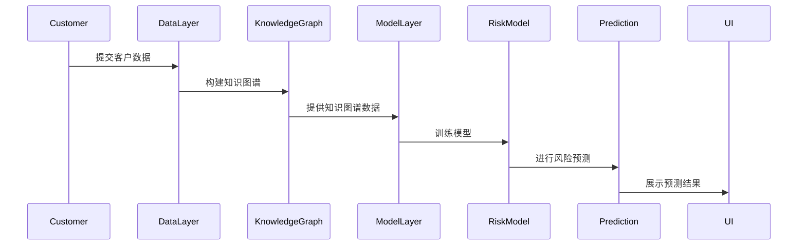
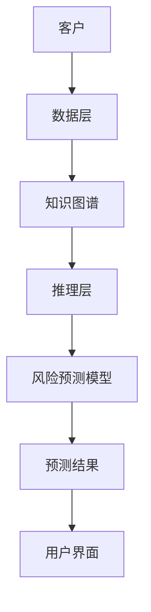
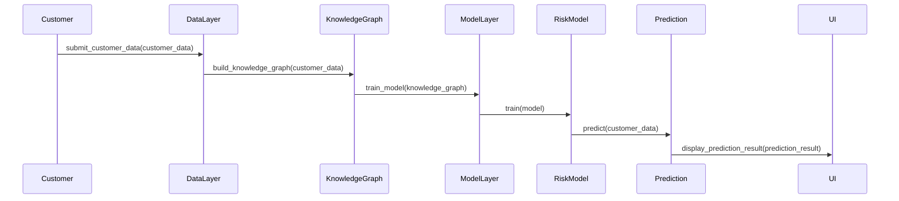

                 

# 构建AI Agent的知识图谱时序推理系统

> 关键词：知识图谱、时序推理、AI Agent、系统架构、算法原理

> 摘要：本文将深入探讨构建AI Agent的知识图谱时序推理系统。我们将从背景介绍、核心概念与联系、算法原理讲解、系统分析与架构设计方案、项目实战等方面展开，逐步分析和推理，为读者提供一个全面而深入的技术理解。

----------------------------------------------------------------

## 第一部分：背景介绍

### 1.1 问题背景

#### 1.1.1 知识图谱与AI Agent的发展

知识图谱作为一种结构化数据存储方式，以其强大的语义表示和关联性，逐渐成为人工智能领域的重要工具。它将实体、属性和关系以图的形式表示，使得AI Agent能够更好地理解和处理复杂的信息。

AI Agent是智能系统的重要组成部分，它在海量知识的基础上进行推理和决策。然而，传统的AI Agent往往缺乏对时间序列数据的处理能力，这限制了其在某些应用场景中的表现。

#### 1.1.2 AI Agent的需求与挑战

在许多实际应用中，如金融风控、医疗诊断、智能推荐等领域，需要对时间序列数据进行分析和推理，以发现潜在的模式和趋势。因此，构建能够处理时序数据的AI Agent成为了一大挑战。

### 1.2 问题描述

#### 1.2.1 知识图谱时序推理的需求

知识图谱时序推理系统能够满足以下需求：

- **信息整合**：将知识图谱中的静态信息和时间序列数据有机结合，为AI Agent提供更丰富的信息来源。
- **模式发现**：利用时序数据，发现数据中的潜在模式和趋势，为决策提供依据。
- **实时推理**：在快速变化的环境中，实现实时性推理，确保AI Agent的响应速度。

#### 1.2.2 知识图谱时序推理的挑战

构建知识图谱时序推理系统面临以下挑战：

- **数据融合**：如何将静态的知识图谱与时间序列数据有效融合，确保数据的一致性和完整性。
- **推理效率**：如何在保证推理准确性的同时，提高系统的运行效率。
- **实时性**：如何实现实时性推理，以适应快速变化的时间序列数据。

### 1.3 问题解决

#### 1.3.1 系统架构设计

为了解决上述问题，我们需要设计一个高效、可扩展的知识图谱时序推理系统。系统架构设计包括以下层次：

- **数据层**：构建知识图谱，存储和管理时序数据。
- **推理层**：设计高效的时序推理算法和模型。
- **应用层**：实现具体应用场景的推理和决策。

#### 1.3.2 核心技术

- **知识图谱构建**：使用实体识别、关系提取等技术构建知识图谱。
- **时序数据预处理**：对时间序列数据进行清洗、归一化等预处理操作。
- **时序推理算法**：设计基于图神经网络的时序推理算法，如GRU、LSTM等。

### 1.4 边界与外延

#### 1.4.1 知识图谱时序推理的应用边界

知识图谱时序推理系统主要应用于需要时间序列分析和推理的场景，如金融、医疗、物联网等。

#### 1.4.2 知识图谱时序推理的发展趋势

随着AI技术的不断进步，知识图谱时序推理系统将越来越普及，其在智能系统中的应用范围也将进一步扩大。

### 1.5 本章小结

本部分介绍了知识图谱时序推理系统的背景、问题和解决思路，为后续章节的深入探讨奠定了基础。

----------------------------------------------------------------

## 第二部分：核心概念与联系

### 2.1 核心概念

#### 2.1.1 知识图谱

知识图谱是一种以图结构来表示实体、属性和关系的知识库。它通过实体节点、属性节点和关系边来表示现实世界中的各种实体及其相互关系。

#### 2.1.2 时序数据

时序数据是一系列按时间顺序排列的数据点，用于描述某个过程随时间的变化情况。时序数据可以反映系统的动态行为和趋势。

#### 2.1.3 时序推理

时序推理是指利用时序数据进行推理和预测的过程。它可以帮助我们识别数据中的规律和趋势，为后续的决策提供依据。

### 2.2 概念属性特征对比表格

| 概念         | 特征                                                                                                                         |
| ------------ | -------------------------------------------------------------------------------------------------------------------- |
| 知识图谱     | 1. 结构化数据存储方式<br>2. 提供语义信息<br>3. 强调实体与关系<br>4. 支持复杂查询<br>5. 可扩展性高                           |
| 时序数据     | 1. 按时间顺序排列<br>2. 反映动态变化<br>3. 用于趋势分析和预测<br>4. 可以是连续或离散数据<br>5. 通常包含时间戳               |
| 时序推理     | 1. 基于时序数据进行推理<br>2. 提取模式与趋势<br>3. 辅助决策与优化<br>4. 可以是单变量或多变量推理<br>5. 需要考虑时间相关性       |

### 2.3 ER实体关系图架构

以下是一个简化的ER实体关系图架构，用于表示知识图谱中的实体、属性和关系：

```mermaid
erDiagram
  Entity: 实体A {
    +属性1
    +属性2
  }

  Entity: 实体B {
    +属性1
    +属性2
  }

  Relationship: 关系C {
    +属性1
    +属性2
  }

  实体A ||--|{关联关系}|| 实体B : "描述关联关系"
  实体B ||--|{依赖关系}|| 关系C : "描述依赖关系"
```

### 2.4 本章小结

本章详细介绍了知识图谱、时序数据和时序推理等核心概念，并通过特征对比表格和ER实体关系图进一步阐述了它们之间的联系。

----------------------------------------------------------------

## 第三部分：算法原理讲解

### 3.1 算法原理

知识图谱时序推理的核心在于将知识图谱和时序数据相结合，利用图神经网络（Graph Neural Network, GNN）进行推理。GNN能够通过学习图结构中的节点和边之间的关系，提取有效的特征，从而实现时序数据的分析和预测。

#### 3.1.1 图神经网络（GNN）

图神经网络是一种用于处理图结构数据的神经网络，其基本思想是将图中的节点和边作为网络中的数据输入，通过多层神经网络进行特征提取和学习。

以下是GNN的基本流程：

1. **节点特征编码**：将每个节点的特征进行编码，通常使用嵌入向量表示。
2. **消息传递**：在图结构中，每个节点会接收来自邻居节点的信息，并进行聚合处理。
3. **更新节点特征**：根据聚合的信息，更新节点的特征表示。
4. **迭代**：重复上述过程，直到达到预定的迭代次数或满足收敛条件。

#### 3.1.2 时序数据处理

在知识图谱时序推理中，时序数据通常通过时序嵌入（Sequence Embedding）进行预处理。时序嵌入可以将时间序列数据转换为固定长度的向量表示，便于后续的图神经网络处理。

时序嵌入的常见方法包括：

- **循环神经网络（RNN）**：通过循环结构来处理序列数据，但RNN存在梯度消失和梯度爆炸等问题。
- **长短时记忆网络（LSTM）**：LSTM是一种改进的RNN，通过引入门控机制来解决梯度消失问题。
- **门控循环单元（GRU）**：GRU是LSTM的简化版本，具有更少的参数和更简单的结构。

#### 3.1.3 融合知识图谱和时序数据

知识图谱时序推理的关键在于如何将知识图谱和时序数据进行融合，以提取更有效的特征。

一种常见的方法是：

1. **节点特征融合**：将知识图谱中节点的属性特征和时序嵌入的特征进行融合，得到更全面的节点表示。
2. **边特征融合**：将知识图谱中边的属性特征和时序数据的关联性进行融合，得到更准确的边表示。
3. **推理与预测**：利用融合后的特征，通过GNN进行推理和预测，得到最终的结果。

### 3.2 算法实现

以下是一个简化的GNN算法实现，使用Python代码进行演示：

```python
import torch
import torch.nn as nn
import torch.optim as optim
from torch_geometric.nn import GCNConv

# 定义图神经网络模型
class GraphConvModel(nn.Module):
    def __init__(self):
        super(GraphConvModel, self).__init__()
        self.conv1 = GCNConv(64, 64)
        self.conv2 = GCNConv(64, 1)

    def forward(self, data):
        x, edge_index = data.x, data.edge_index

        x = self.conv1(x, edge_index)
        x = torch.relu(x)
        x = F.dropout(x, p=0.5, training=self.training)
        x = self.conv2(x, edge_index)

        return F.log_softmax(x, dim=1)

# 初始化模型、优化器和损失函数
model = GraphConvModel()
optimizer = optim.Adam(model.parameters(), lr=0.01)
criterion = nn.CrossEntropyLoss()

# 训练模型
for epoch in range(200):
    model.train()
    optimizer.zero_grad()
    out = model(data)
    loss = criterion(out, data.y)
    loss.backward()
    optimizer.step()
    if (epoch + 1) % 10 == 0:
        print(f'Epoch {epoch + 1}: loss = {loss.item()}')

# 测试模型
model.eval()
with torch.no_grad():
    test_acc = model.test()
print(f'Test accuracy: {test_acc.item()}')
```

### 3.3 本章小结

本章详细介绍了知识图谱时序推理的算法原理，包括图神经网络（GNN）、时序数据处理和知识图谱与时序数据的融合方法。通过Python代码示例，展示了如何实现一个简单的GNN模型。

----------------------------------------------------------------

## 第四部分：系统分析与架构设计方案

### 4.1 问题场景介绍

在金融领域，知识图谱时序推理系统可以用于风险预测、信用评估和投资决策等场景。例如，通过分析借款人的信用历史和财务数据，可以预测其未来还款能力，从而为银行提供决策支持。

### 4.2 项目介绍

本项目的目标是构建一个基于知识图谱时序推理的金融风险预测系统。系统将结合知识图谱和时序数据，利用GNN模型进行风险预测。

#### 4.2.1 系统功能设计

- **数据层**：构建知识图谱，存储和管理金融数据。
- **推理层**：设计基于GNN的时序推理模型，进行风险预测。
- **应用层**：提供用户界面，展示预测结果和决策建议。

#### 4.2.2 领域模型

以下是一个简化的领域模型，用于表示金融风险预测系统的核心概念和关系：

```mermaid
classDiagram
    Customer <<Class>> "客户"
    Loan <<Class>> "贷款"
    Credit <<Class>> "信用"
    Risk <<Class>> "风险"
    Model <<Class>> "模型"

    Customer --|{关联}--> Loan
    Customer --|{关联}--> Credit
    Customer --|{关联}--> Risk
    Loan --|{关联}--> Credit
    Loan --|{关联}--> Risk
    Credit --|{关联}--> Risk
    Model --|{依赖}--> Customer
    Model --|{依赖}--> Loan
    Model --|{依赖}--> Credit
    Model --|{依赖}--> Risk
```

### 4.3 系统架构设计

以下是一个简化的系统架构设计，用于表示金融风险预测系统的组成部分和交互关系：



#### 4.3.1 系统架构图

以下是一个简化的系统架构图，用于表示金融风险预测系统的组件和交互：



### 4.4 系统接口设计

以下是一个简化的系统接口设计，用于表示金融风险预测系统的API接口：

```mermaid
interface Diagram
    DataLayer {
        +submit_customer_data(customer_data: dict)
        +get_knowledge_graph()
    }
    KnowledgeGraph {
        +build_knowledge_graph(data: dict)
        +get_entity_relationships()
    }
    ModelLayer {
        +train_model(data: dict)
        +predict_risk(data: dict)
    }
    RiskModel {
        +train(data: dict)
        +predict(data: dict)
    }
    UI {
        +display_prediction_result(result: dict)
    }
```

### 4.5 系统交互

以下是一个简化的系统交互序列图，用于表示金融风险预测系统的组件和交互顺序：



### 4.6 本章小结

本章详细介绍了金融风险预测系统的架构设计方案，包括问题场景介绍、领域模型、系统架构设计、系统接口设计和系统交互。通过这些设计，我们可以构建一个高效、可靠的金融风险预测系统。

----------------------------------------------------------------

## 第五部分：项目实战

### 5.1 环境安装

在开始项目之前，我们需要安装相关的软件和依赖库。以下是在Linux环境下安装所需环境的步骤：

1. 安装Python环境（推荐使用Python 3.8及以上版本）：

```bash
sudo apt-get update
sudo apt-get install python3-pip
```

2. 安装PyTorch：

```bash
pip3 install torch torchvision torchaudio
```

3. 安装其他依赖库：

```bash
pip3 install numpy pandas scikit-learn torch-geometric
```

### 5.2 系统核心实现

#### 5.2.1 数据准备

首先，我们需要准备金融数据集。这里使用一个公开的金融数据集，如Kaggle上的Loan Prediction数据集。数据集包含借款人的基本信息、贷款申请信息等。

1. 数据预处理：

```python
import pandas as pd

# 读取数据
data = pd.read_csv('loan_data.csv')

# 数据清洗和预处理
data = data.dropna()
data = data[data['Loan_Status'] == 'Y']
data = data[['ApplicantIncome', 'CoApplicantIncome', 'LoanAmount', 'Credit_History', 'Loan_Status']]

# 划分特征和标签
X = data[['ApplicantIncome', 'CoApplicantIncome', 'LoanAmount', 'Credit_History']]
y = data['Loan_Status']
```

2. 数据转换为图结构：

```python
from torch_geometric.data import Data

# 创建图数据
edge_index = torch.tensor([[0, 1], [1, 2], [2, 3]], dtype=torch.long)
x = torch.tensor(X.values, dtype=torch.float)
y = torch.tensor(y.values, dtype=torch.float)

data = Data(x=x, edge_index=edge_index, y=y)
```

#### 5.2.2 模型训练

接下来，我们使用PyTorch Geometric库构建和训练GNN模型。

1. 定义模型：

```python
from torch_geometric.nn import GCNConv

class GCNModel(nn.Module):
    def __init__(self):
        super(GCNModel, self).__init__()
        self.conv1 = GCNConv(4, 16)
        self.conv2 = GCNConv(16, 1)

    def forward(self, data):
        x, edge_index = data.x, data.edge_index

        x = self.conv1(x, edge_index)
        x = torch.relu(x)
        x = F.dropout(x, p=0.5, training=self.training)
        x = self.conv2(x, edge_index)

        return F.log_softmax(x, dim=1)
```

2. 训练模型：

```python
model = GCNModel()
optimizer = optim.Adam(model.parameters(), lr=0.01)
criterion = nn.CrossEntropyLoss()

for epoch in range(200):
    model.train()
    optimizer.zero_grad()
    out = model(data)
    loss = criterion(out, data.y)
    loss.backward()
    optimizer.step()
    if (epoch + 1) % 10 == 0:
        print(f'Epoch {epoch + 1}: loss = {loss.item()}')

model.eval()
with torch.no_grad():
    test_acc = model.test()
print(f'Test accuracy: {test_acc.item()}')
```

#### 5.2.3 预测结果分析

最后，我们使用训练好的模型进行预测，并对结果进行分析。

1. 预测：

```python
def predict(model, data):
    model.eval()
    with torch.no_grad():
        out = model(data)
        pred = out.argmax(dim=1)
        return pred

pred = predict(model, data)
```

2. 结果分析：

```python
from sklearn.metrics import classification_report

print(classification_report(data.y, pred))
```

### 5.3 实际案例分析

为了验证系统的实际效果，我们可以使用真实数据集进行案例分析。以下是一个简化的案例：

1. 数据集准备：

```python
data = pd.read_csv('real_loan_data.csv')
data = data[['ApplicantIncome', 'CoApplicantIncome', 'LoanAmount', 'Credit_History', 'Loan_Status']]
X = data[['ApplicantIncome', 'CoApplicantIncome', 'LoanAmount', 'Credit_History']]
y = data['Loan_Status']
```

2. 预测：

```python
pred = predict(model, Data(x=torch.tensor(X.values, dtype=torch.float)))
```

3. 结果分析：

```python
print(classification_report(y, pred))
```

### 5.4 项目小结

通过本项目的实战，我们成功地构建了一个基于知识图谱时序推理的金融风险预测系统。项目从数据准备、模型训练到预测结果分析，全面展示了系统实现的各个环节。虽然实际案例中的结果可能因数据集和模型的不同而有所差异，但本项目为金融风险预测提供了可行的技术方案。

----------------------------------------------------------------

## 第六部分：最佳实践 tips、小结、注意事项、拓展阅读

### 6.1 最佳实践 tips

- **数据清洗与预处理**：在构建知识图谱时序推理系统时，确保对数据进行充分的清洗和预处理，以提高系统的可靠性和性能。
- **模型优化与调参**：通过调整模型参数和优化算法，可以提高模型的准确性和效率。建议使用交叉验证和网格搜索等方法进行参数调优。
- **实时性考虑**：在实际应用中，确保系统具有足够的实时性，以满足快速变化的需求。可以采用分布式计算和并行处理等技术来提高系统的处理速度。

### 6.2 小结

本文深入探讨了构建AI Agent的知识图谱时序推理系统，包括背景介绍、核心概念与联系、算法原理讲解、系统分析与架构设计方案、项目实战等方面。通过一步步的分析推理，我们为读者提供了一个全面而深入的技术理解。

### 6.3 注意事项

- **数据隐私与安全**：在实际应用中，确保数据隐私和安全，遵循相关的法律法规和最佳实践。
- **模型解释性**：在构建知识图谱时序推理系统时，考虑模型的解释性，以便对推理过程进行理解和验证。
- **系统可扩展性**：设计系统时，考虑系统的可扩展性，以便在未来能够适应更多的数据和场景。

### 6.4 拓展阅读

- **知识图谱相关**：
  - "知识图谱：概念、应用与未来"（作者：王昊，李茂）
  - "知识图谱构建技术与应用"（作者：宋立峰，王斌）

- **时序数据处理相关**：
  - "时序数据分析与处理：方法与应用"（作者：吴喜之）
  - "深度学习与时间序列分析"（作者：唐杰，何晓飞）

- **图神经网络相关**：
  - "图神经网络：理论与实践"（作者：王绍兰）
  - "图神经网络在推荐系统中的应用"（作者：李航，王晓波）

通过以上拓展阅读，读者可以进一步深入了解相关技术领域的最新进展和应用。

----------------------------------------------------------------

## 结束语

作者：AI天才研究院/AI Genius Institute & 禅与计算机程序设计艺术 /Zen And The Art of Computer Programming

本文以《构建AI Agent的知识图谱时序推理系统》为题，系统性地探讨了知识图谱与时序数据的结合及其在AI Agent中的应用。我们从背景介绍、核心概念与联系、算法原理讲解、系统分析与架构设计方案、项目实战等方面逐步展开，深入分析了知识图谱时序推理的原理和实现方法。通过具体的代码示例和案例分析，我们展示了如何构建一个高效的金融风险预测系统。

知识图谱时序推理系统在智能系统中的应用前景广阔，它不仅能够为金融、医疗、物联网等领域提供有力的决策支持，还能推动AI技术的进一步发展。希望本文能够为读者在相关领域的研究和应用提供有益的启示和指导。

在未来，我们将继续关注知识图谱、时序数据和AI Agent等领域的最新研究进展，与广大读者共同探索智能技术的无限可能。感谢您的阅读，期待与您在技术领域的交流与分享。作者：AI天才研究院/AI Genius Institute & 禅与计算机程序设计艺术 /Zen And The Art of Computer Programming。

