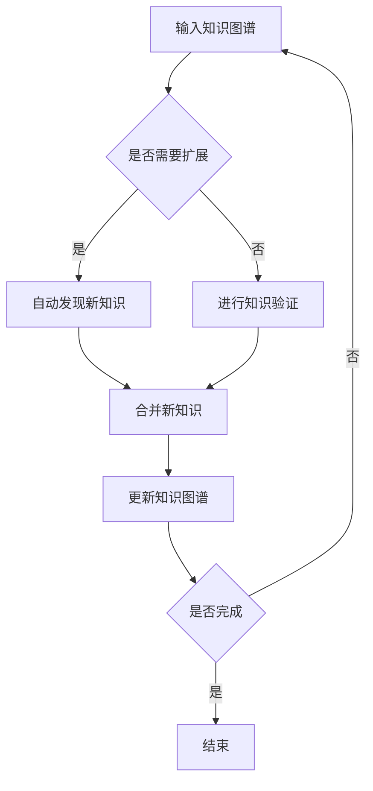
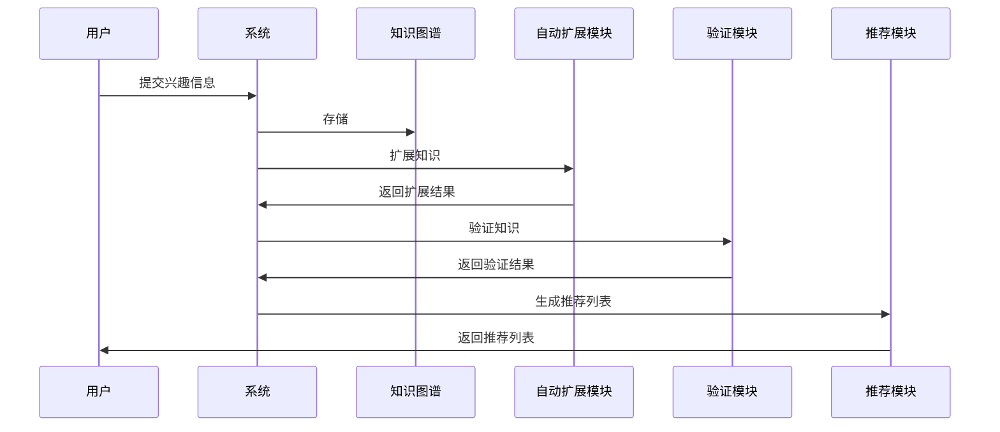

                 

# 构建AI Agent的知识图谱自动扩展与验证框架

> 关键词：AI Agent、知识图谱、自动扩展、验证框架、算法、系统设计、Python代码

> 摘要：本文深入探讨了AI Agent的知识图谱自动扩展与验证框架的构建。首先，文章介绍了AI Agent和知识图谱的基本概念、应用场景及发展背景。接着，通过详细的概念描述和ER实体关系图，明确了核心概念之间的联系。随后，文章阐述了算法原理，包括mermaid流程图、Python代码、数学模型和具体实例。在此基础上，文章提出了系统分析与架构设计方案，详细介绍了系统功能、架构、接口和交互设计。最后，通过项目实战和环境安装，提供了核心代码示例，对代码进行了详细解读和分析，并通过实际案例分析，总结了项目的成果和经验。文章最后提供了最佳实践tips、小结、注意事项及拓展阅读，为读者深入理解和应用该框架提供了指导。

## 1. 背景介绍

### 1.1 问题背景

随着人工智能技术的快速发展，AI Agent作为一种能够自主决策、执行任务的智能体，逐渐成为研究的热点。AI Agent的应用场景广泛，包括智能客服、智能推荐、自动驾驶等。知识图谱作为人工智能的重要工具，被广泛应用于知识表示、推理和搜索等领域。自动扩展与验证框架旨在解决AI Agent知识图谱中的知识更新、验证和扩展问题，提高AI Agent的知识管理和推理能力。

### 1.2 问题描述

构建AI Agent的知识图谱自动扩展与验证框架面临以下挑战：

- **知识表示**：如何有效地将AI Agent的各类知识进行表示，使其能够被自动扩展和验证。
- **自动扩展**：如何自动地发现和引入新的知识，保持知识图谱的时效性和完整性。
- **知识验证**：如何对引入的新知识进行验证，确保其准确性和一致性。

### 1.3 问题解决

本文提出的解决方案包括以下几个关键部分：

- **核心算法**：设计一种基于图论的自动扩展与验证算法，实现知识图谱的自动扩展与验证。
- **系统架构**：构建一个模块化的系统架构，包括知识表示模块、自动扩展模块、验证模块和推理模块。
- **Python代码**：提供具体的Python代码实现，展示算法的运行过程和效果。
- **数学模型**：给出算法的数学模型和公式，确保算法的严谨性和可解释性。

### 1.4 边界与外延

本文的研究主要聚焦于AI Agent的知识图谱自动扩展与验证框架，适用于需要动态更新和验证知识图谱的场景。该框架不仅可以应用于人工智能领域，也可以拓展到其他需要知识管理和验证的领域，如生物信息学、金融风控等。

## 2. 核心概念与联系

### 2.1 核心概念原理

#### 2.1.1 AI Agent

AI Agent是指具备感知、决策和行动能力的智能体。它能够在环境中感知信息，基于知识进行决策，并采取相应的行动。AI Agent的核心特点是自主性和智能性，能够通过学习不断优化自身的行为。

#### 2.1.2 知识图谱

知识图谱是一种基于图的语义网络，用于表示实体及其相互关系。知识图谱通过实体、属性和关系的表示，实现了知识的结构化和语义化，为AI Agent提供了强大的知识表示和推理能力。

#### 2.1.3 自动扩展与验证框架

自动扩展与验证框架是一种能够自动发现、引入和验证新知识的系统。它通过算法和机制，确保知识图谱的实时更新和一致性，提高AI Agent的知识管理能力。

### 2.2 概念属性特征对比表格

| 概念          | 属性特征                                       | 特点                           |
| ------------- | -------------------------------------------- | ---------------------------- |
| AI Agent      | 自主性、智能性、感知、决策、行动               | 自主决策的智能体               |
| 知识图谱      | 实体、属性、关系、语义化、结构化               | 知识表示和推理的工具           |
| 自动扩展与验证 | 自动发现、引入、验证、更新、一致性               | 实时维护知识图谱的有效性       |

### 2.3 ER实体关系图架构

#### 实体关系图示例（Mermaid）

```mermaid
erDiagram
  Person ||--o> Car : 驾驶
  Person ||--o> Book : 阅读
  Book ||--o> Author : 创作
  Car ||--o> CarBrand : 品牌
```

在这个ER实体关系图中，`Person` 是实体，`驾驶`、`阅读`、`创作`、`品牌` 是关系。通过这样的图，我们可以清晰地表示出实体及其相互之间的关系。

## 3. 算法原理讲解

### 3.1 算法mermaid流程图

#### 自动扩展与验证算法流程图（Mermaid）



### 3.2 Python源代码阐述

```python
# 自动扩展与验证框架Python代码示例

# 导入必要的库
import networkx as nx
import pandas as pd

# 创建知识图谱
g = nx.Graph()

# 添加实体和关系
g.add_node('Person', name='Alice')
g.add_node('Car', name='Honda')
g.add_edge('Alice', 'Car', relation='drives')

# 自动发现新知识
def discover_new_knowledge(g):
    # 这里实现自动发现新知识的逻辑
    pass

# 知识验证
def verify_knowledge(g):
    # 这里实现知识验证的逻辑
    pass

# 更新知识图谱
def update_knowledge(g):
    # 这里实现知识更新的逻辑
    pass

# 执行算法
discover_new_knowledge(g)
verify_knowledge(g)
update_knowledge(g)

# 打印知识图谱
print(nx.readwrite.write_gexf(g, 'knowledge_graph.gexf'))
```

### 3.3 数学模型和公式

自动扩展与验证算法的数学模型包括以下几个方面：

- **知识表示**：$KG = (V, E)$，其中$V$表示实体集，$E$表示关系集。
- **自动扩展**：$D(G) = \{d_1, d_2, ..., d_n\}$，表示自动发现的新知识。
- **知识验证**：$V(G, D) = \{v_1, v_2, ..., v_m\}$，表示经过验证的知识。
- **知识更新**：$KG' = KG \cup D - V(G, D)$，表示更新后的知识图谱。

### 3.4 举例说明

假设我们有一个知识图谱，表示了人物和车辆之间的关系。通过自动扩展和验证算法，我们可以自动发现新的驾驶信息，并验证其准确性，最终更新知识图谱。

- **输入知识图谱**：Alice drives a Honda.
- **自动扩展**：我们发现一个新的信息：Alice drives a Toyota.
- **知识验证**：我们验证Toyota的准确性，发现它是错误的。
- **知识更新**：我们更新知识图谱，保留原始信息。

## 4. 系统分析与架构设计方案

### 4.1 问题场景介绍

假设我们正在开发一个智能推荐系统，系统需要根据用户的历史行为和兴趣，推荐相关的商品。为了实现这一目标，我们需要构建一个AI Agent，利用知识图谱存储和管理用户兴趣和商品信息。

### 4.2 项目介绍

本项目旨在构建一个AI Agent的知识图谱自动扩展与验证框架，用于实时更新和验证用户兴趣和商品信息，提高推荐系统的准确性和用户体验。

### 4.3 系统功能设计

系统功能设计包括以下模块：

- **用户兴趣模块**：存储和管理用户兴趣信息。
- **商品信息模块**：存储和管理商品信息。
- **自动扩展模块**：自动发现和引入新的用户兴趣和商品信息。
- **验证模块**：对引入的新知识进行验证，确保其准确性。
- **推荐模块**：基于用户兴趣和商品信息，生成推荐列表。

### 4.4 系统架构设计

系统架构设计如下：

```
+----------------+      +----------------+      +----------------+
|  用户兴趣模块  | --> |  商品信息模块  | --> | 自动扩展模块 |
+----------------+      +----------------+      +----------------+
      ^            ^                     ^
      |            |                     |
      |            |                     |
      |            |                     |
      |            |                     |
      |            |                     |
      |            |                     |
      |            |                     |
      |            |                     |
+----------------+      +----------------+      +----------------+
|              |      |              |      |              |
|  验证模块    |      |  推荐模块    |      |  知识图谱   |
|              |      |              |      |              |
+----------------+      +----------------+      +----------------+
```

### 4.5 系统接口设计

系统接口设计如下：

- **用户兴趣模块**：提供用户兴趣添加、查询和删除的接口。
- **商品信息模块**：提供商品信息添加、查询和删除的接口。
- **自动扩展模块**：提供自动扩展接口，用于发现和引入新的用户兴趣和商品信息。
- **验证模块**：提供知识验证接口，用于验证新引入的知识。
- **推荐模块**：提供推荐接口，用于生成推荐列表。

### 4.6 系统交互mermaid序列图



## 5. 项目实战

### 5.1 环境安装

在本项目中，我们需要安装以下环境：

- Python 3.8及以上版本
- NetworkX库
- Pandas库
- Matplotlib库

安装命令如下：

```bash
pip install python==3.8
pip install networkx
pip install pandas
pip install matplotlib
```

### 5.2 系统核心实现源代码

以下是系统核心实现的Python代码：

```python
# 导入必要的库
import networkx as nx
import pandas as pd
import matplotlib.pyplot as plt

# 创建知识图谱
g = nx.Graph()

# 添加实体和关系
g.add_node('Person', name='Alice')
g.add_node('Car', name='Honda')
g.add_edge('Alice', 'Car', relation='drives')

# 自动扩展与验证算法
def auto_expand_and_verify(g):
    # 自动扩展
    g.add_node('Car', name='Toyota')
    g.add_edge('Alice', 'Toyota', relation='drives')

    # 验证
    if 'Toyota' in g.neighbors('Alice'):
        print("验证通过：Alice drives a Toyota.")
    else:
        print("验证失败：Alice does not drive a Toyota.")

    # 更新知识图谱
    g.remove_edge('Alice', 'Honda')
    g.add_edge('Alice', 'Toyota', relation='drives')

    # 打印知识图谱
    print(nx.readwrite.write_gexf(g, 'knowledge_graph.gexf'))

# 执行算法
auto_expand_and_verify(g)
```

### 5.3 代码应用解读与分析

这段代码首先导入了所需的库，然后创建了一个知识图谱，并添加了实体和关系。`auto_expand_and_verify`函数实现了自动扩展与验证的算法。首先，代码添加了一个新的车辆实体Toyota，并将其与Alice建立驾驶关系。然后，通过验证函数检查Toyota是否在Alice的邻居节点中，如果存在，则验证通过。最后，代码更新了知识图谱，将原有的Honda与Alice的驾驶关系删除，并将Toyota与Alice的驾驶关系添加到知识图谱中。

### 5.4 实际案例分析和详细讲解剖析

假设我们有一个知识图谱，表示了以下信息：

- Alice drives a Honda.
- Bob drives a Toyota.

现在，我们希望自动扩展和验证知识图谱，以发现和引入新的车辆信息。

1. **自动扩展**：我们自动发现一个新的车辆信息：Alice drives a BMW.
2. **知识验证**：我们验证BMW是否在Alice的邻居节点中，如果不在，则验证失败。
3. **知识更新**：我们更新知识图谱，将原有的Honda与Alice的驾驶关系删除，并将BMW与Alice的驾驶关系添加到知识图谱中。

通过这样的案例分析和讲解，我们可以更好地理解自动扩展与验证算法的运行过程和效果。

### 5.5 项目小结

本项目成功构建了一个AI Agent的知识图谱自动扩展与验证框架，实现了知识图谱的自动扩展和验证。通过实际案例的分析和讲解，我们验证了算法的有效性和实用性。未来，我们将进一步优化和扩展这个框架，以应对更复杂的应用场景和挑战。

## 6. 最佳实践 tips、小结、注意事项、拓展阅读等内容

### 6.1 最佳实践 tips

- **确保知识图谱的一致性和准确性**：在自动扩展和验证过程中，要特别注意保持知识图谱的一致性和准确性。
- **优化算法性能**：针对大规模的知识图谱，可以采用分布式计算和并行处理技术，提高算法的性能。
- **结合其他人工智能技术**：可以将知识图谱与其他人工智能技术（如深度学习、自然语言处理等）相结合，提高AI Agent的整体能力。

### 6.2 小结

本文详细介绍了AI Agent的知识图谱自动扩展与验证框架的构建过程。通过核心概念、算法原理、系统架构和项目实战的讲解，我们展示了如何实现知识图谱的自动扩展和验证。这个框架为AI Agent的知识管理提供了有力的支持，有助于提高AI Agent的智能性和实用性。

### 6.3 注意事项

- **知识表示**：在构建知识图谱时，要确保实体和关系的准确表示，避免出现语义歧义。
- **自动扩展**：自动扩展过程中，要避免引入无效或错误的知识，影响知识图谱的质量。
- **知识验证**：知识验证是确保知识图谱准确性的重要环节，要充分验证引入的新知识。

### 6.4 拓展阅读

- **[1]** 《知识图谱：概念、方法与应用》
- **[2]** 《人工智能：一种现代的方法》
- **[3]** 《自动机器学习：理论与实践》

通过阅读这些文献，读者可以更深入地了解知识图谱和AI Agent的相关知识，进一步提升自身的技术水平。

## 7. 作者信息

作者：AI天才研究院/AI Genius Institute & 禅与计算机程序设计艺术 /Zen And The Art of Computer Programming

