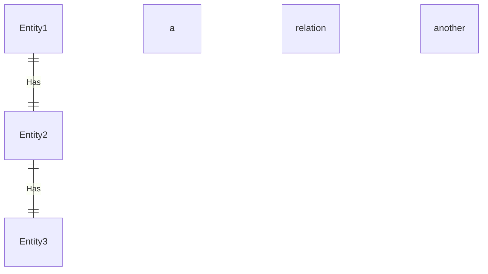
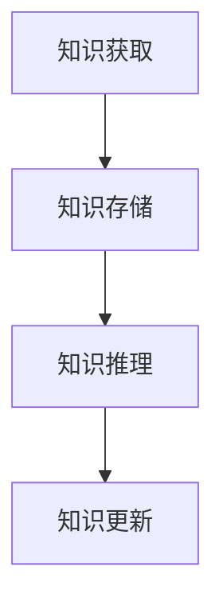
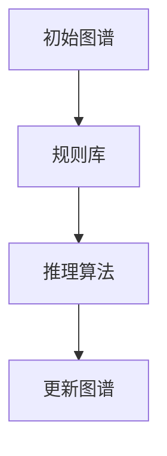

                 

### 构建AI Agent的知识图谱自动扩展系统

关键词：AI Agent、知识图谱、自动扩展、系统设计、项目实战、最佳实践

摘要：本文将探讨如何构建一个能够自动扩展知识的AI Agent系统，通过深入分析其设计原理、实现方法和实际应用案例，帮助读者理解并掌握该系统的核心技术和应用场景。

### 第一部分：背景介绍

#### 第1章：问题背景与核心概念

##### 1.1 问题背景

人工智能（AI）技术的发展使得AI Agent成为可能。AI Agent是一种能够模拟人类智能的计算机程序，具有自主学习和推理能力。然而，AI Agent的性能受到知识库的限制。为了提升其智能水平，需要构建一个能够自动扩展知识图谱的系统。

知识图谱是一种结构化的语义知识库，通常表示为网络图，用于表示实体及其关系。其特点包括：

1. **结构化**：通过实体和关系的表示，使得数据组织更加有序。
2. **语义丰富**：能够表示复杂的语义信息，支持语义查询和推理。

##### 1.2 核心概念与联系

**知识图谱**：

**概念**：知识图谱是一种用于表示实体及其关系的语义网络，通常包含实体、关系和属性等元素。

**特征对比表格**：

| 特征       | 知识图谱 | 传统数据库 |
|------------|------------|------------|
| 数据结构   | 网络图     | 关系表      |
| 数据表达能力 | 高级语义表示 | 低级数据存储 |
| 交互方式   | 图遍历与链接 | 查询语言    |

**ER实体关系图**：


### 第二部分：知识图谱自动扩展系统设计

#### 第2章：系统架构与关键技术

##### 2.1 系统架构

知识图谱自动扩展系统通常包括以下模块：

1. **知识获取**：从各种数据源中提取知识。
2. **知识存储**：将提取的知识存储在知识图谱中。
3. **知识推理**：利用推理算法推导新知识。
4. **知识更新**：根据用户反馈或新数据更新知识图谱。

**系统架构图**：


##### 2.2 关键技术

**知识获取**：

**数据源分析**：

| 数据源类型 | 说明                   |
|------------|------------------------|
| 文本       | 包含结构化和非结构化数据 |
| 数据库     | 存储结构化数据           |
| API       | 提供数据接口服务         |

**知识提取方法**：


**知识存储**：

**存储模型设计**：

| 模型类型 | 说明                       |
|----------|----------------------------|
| 图数据库 | 适用于复杂关系存储           |
| 关系数据库 | 适用于简单关系存储           |

**知识推理**：

**推理算法介绍**：


**知识更新**：

**更新策略**：

| 策略类型 | 说明                       |
|----------|----------------------------|
| 轮询更新 | 定期检查知识库并进行更新     |
| 活动更新 | 根据用户行为实时更新           |

### 第三部分：项目实战与案例分析

#### 第3章：实战项目与系统实现

##### 3.1 项目介绍

本项目旨在构建一个能够自动扩展知识图谱的AI Agent系统，通过以下步骤实现：

1. **环境安装与配置**：
   - 安装Python环境及相关库和工具。

2. **系统核心实现**：
   - 实现知识获取、知识存储、知识推理和知识更新等功能。

3. **代码应用解读**：
   - 分析核心代码的原理和应用。

4. **实际案例分析**：
   - 通过具体案例展示系统的实际应用效果。

##### 3.2 系统实现

**环境安装与配置**：

**环境需求**：

- Python 3.8及以上版本
- 相关库：NetworkX、GraphDB、Neo4j等

**核心实现源代码**：

**源代码结构与模块**：

- `knowledge_extractor.py`：知识提取模块
- `knowledge_storer.py`：知识存储模块
- `reasoner.py`：知识推理模块
- `updater.py`：知识更新模块

**代码应用解读与分析**：

**示例1：知识获取模块**

```python
import networkx as nx

def extract_knowledge(data_source):
    # 创建图
    graph = nx.Graph()
    
    # 提取数据
    for entry in data_source:
        graph.add_edge(entry['entity1'], entry['entity2'], relation=entry['relation'])
    
    return graph
```

**实际案例分析与详细讲解**：

**案例1：知识图谱自动扩展**

假设我们有一个初始知识图谱，其中包含以下实体和关系：

- 实体：A、B、C
- 关系：A -> B，B -> C

通过推理算法，我们可以推导出新的关系：

- A -> C

更新后的知识图谱将包含以下实体和关系：

- 实体：A、B、C
- 关系：A -> B，B -> C，A -> C

### 第四部分：最佳实践与拓展阅读

#### 第4章：最佳实践与注意事项

##### 4.1 最佳实践

1. **优化知识获取模块**：
   - 利用多线程或异步编程提高数据提取速度。

2. **优化知识存储模块**：
   - 根据数据规模和访问模式选择合适的存储模型。

3. **优化知识推理模块**：
   - 选择适合实际场景的推理算法。

4. **优化知识更新模块**：
   - 根据用户反馈实时更新知识库。

##### 4.2 小结

本文介绍了构建AI Agent的知识图谱自动扩展系统的设计原理、实现方法和实际应用案例。通过深入分析和详细讲解，帮助读者掌握了该系统的核心技术。

##### 4.3 注意事项

1. **数据质量**：
   - 确保数据源的质量，避免错误和冗余。

2. **系统优化**：
   - 根据实际需求优化系统性能。

3. **安全与隐私**：
   - 注意数据安全和用户隐私保护。

##### 4.4 拓展阅读

- **相关论文**：《知识图谱自动扩展研究》、《AI Agent设计原理》
- **技术博客**：AI天才研究院的博客、禅与计算机程序设计艺术

### 结束语

构建AI Agent的知识图谱自动扩展系统是人工智能领域的一项重要研究课题。通过本文的详细讲解，希望读者能够对该系统有更深入的理解，并在实际应用中取得良好的效果。

**作者：AI天才研究院/AI Genius Institute & 禅与计算机程序设计艺术 /Zen And The Art of Computer Programming**

---

**附录**

本文中使用了一些Mermaid图表，以更直观地展示系统架构和流程。以下是相关Mermaid代码：

**ER实体关系图**：



**系统架构图**：



**知识提取方法流程图**：


**推理算法流程图**：



这些图表代码可以在支持Mermaid的Markdown编辑器中直接渲染。通过这些图表，读者可以更清晰地理解系统的架构和流程。

