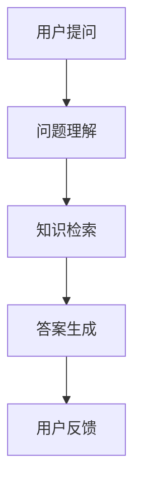
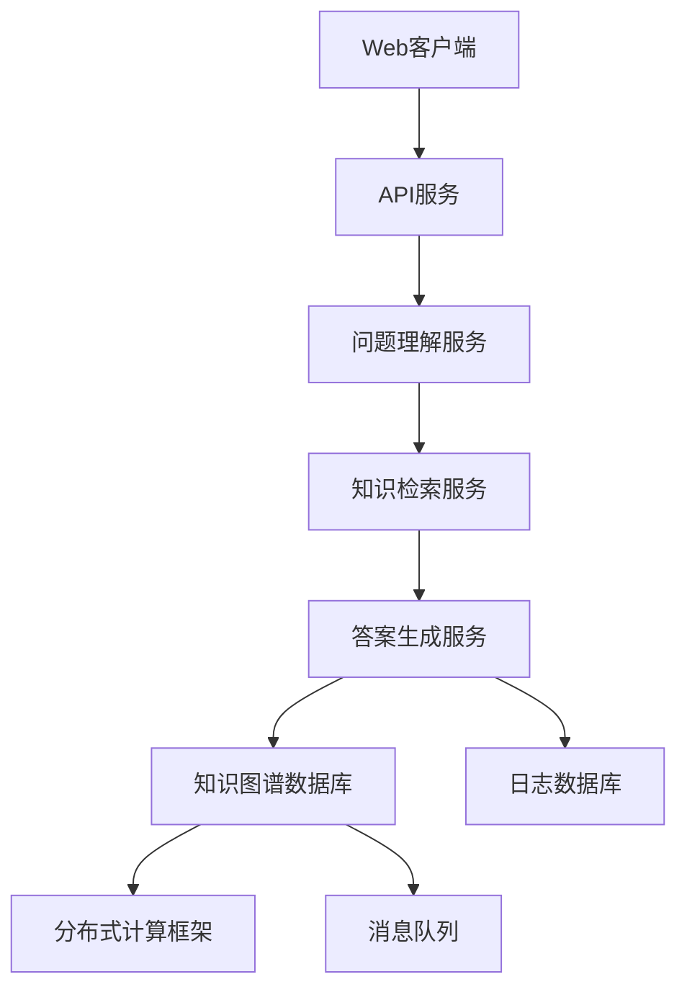
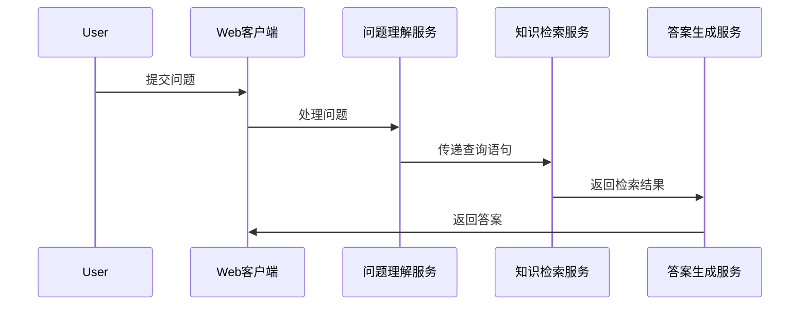

                 

### 1. 问题背景

在当今信息爆炸的时代，人工智能（AI）技术的发展日新月异，知识图谱问答系统作为一种先进的AI技术，正在逐步改变我们的生活方式。知识图谱问答系统利用知识图谱的结构化信息，通过自然语言处理（NLP）技术，能够以接近人类思维的方式回答用户的问题。这不仅提高了信息检索的效率，也为各行业提供了强大的智能解决方案。

#### 1.1 人工智能的定义与现状

人工智能是一种模拟人类智能行为的计算机科学领域，旨在使计算机具备感知、推理、学习和决策的能力。当前，人工智能已经在诸多领域得到广泛应用，如自动驾驶、智能家居、医疗诊断、金融风控等。特别是自然语言处理（NLP）和机器学习（ML）技术的进步，使得AI系统在处理和理解人类语言方面取得了显著成果。

#### 1.2 知识图谱问答系统的概念

知识图谱问答系统是一种利用知识图谱进行信息检索和问题回答的智能系统。知识图谱是一种结构化知识表示方法，通过将实体（如人、地点、事物）和它们之间的关系（如“属于”、“位于”、“发生”）组织成一个有向无环图（DAG）。问答系统则通过自然语言处理技术，将用户的问题转化为知识图谱中的查询，并在其中搜索答案。

### 1.3 现有知识图谱问答系统的挑战

#### 1.3.1 数据质量问题

知识图谱问答系统的性能很大程度上依赖于其背后的知识图谱质量。然而，现有的知识图谱往往存在数据质量不高的问题，如实体重复、关系错误、数据缺失等。这些问题会直接影响系统的准确率和可靠性。

#### 1.3.2 计算效率问题

随着知识图谱规模的不断扩大，如何高效地查询和处理知识图谱成为一个关键问题。传统的查询算法和存储结构在面对大规模数据时往往显得力不从心，导致系统的响应速度显著下降。

### 1.4 优化知识图谱问答系统的目标

为了应对上述挑战，我们需要优化知识图谱问答系统的性能。具体目标包括：

1. **提高准确率**：通过提高知识图谱的质量和问答系统的理解能力，使系统能够更准确地回答用户的问题。

2. **提高响应速度**：通过优化算法和系统架构，减少查询和处理时间，提高系统的响应速度。

3. **优化系统架构**：设计更高效的系统架构，以适应大规模数据和处理需求，确保系统稳定运行。

### 1.5 边界与外延

为了确保研究目标的具体性和可操作性，我们需要明确以下边界与外延：

#### 1.5.1 知识图谱问答系统的应用场景

本研究聚焦于问答系统在特定领域的应用，如企业知识库、智能客服等。不涉及其他广泛的应用领域，如自动驾驶、智能家居等。

#### 1.5.2 数据集范围

本研究将限定在特定的数据集上，如DBP15k、SNAP等。这些数据集具有较高的质量和代表性，能够有效验证优化策略的效果。

#### 1.5.3 知识图谱与问答系统的核心要素组成

知识图谱的核心要素包括实体、关系和属性，而问答系统的核心要素包括问题理解、知识检索和答案生成。本研究将深入探讨这些要素的优化方法。

## 1.6 概念结构与核心要素组成

为了更好地理解和优化知识图谱问答系统，我们需要明确其核心概念和要素组成。以下是对知识图谱和问答系统的概念解释及其在系统中的作用：

### 1.6.1 知识图谱

**定义**：知识图谱是一种通过实体、属性和关系表示知识结构的数据模型。它通常采用有向无环图（DAG）的形式，使实体之间的关系更加直观和易于理解。

**结构**：知识图谱由以下几个核心组件构成：
- **实体**：代表现实世界中的对象，如人、地点、事物等。
- **属性**：描述实体特征的元数据，如姓名、年龄、出生地等。
- **关系**：描述实体之间关联的语义信息，如“属于”、“位于”、“发生”等。

**构建方法**：知识图谱的构建通常包括以下几个步骤：
- **数据采集**：从各种数据源中提取信息，如文本、数据库、Web页面等。
- **实体识别**：从文本中识别出实体，并进行分类和命名实体识别。
- **关系抽取**：从文本中抽取实体之间的关系，并构建关系网络。

### 1.6.2 问答系统

**定义**：问答系统是一种能够理解用户问题并生成答案的计算机系统。它通过自然语言处理（NLP）技术，将用户的问题转化为系统可理解的形式，并在知识图谱中进行查询和匹配。

**核心要素**：问答系统的核心要素包括以下几个部分：
- **问题理解**：理解用户的问题，提取关键信息，并将其转化为查询语句。
- **知识检索**：在知识图谱中检索与问题相关的信息。
- **答案生成**：根据检索结果生成答案，并进行文本生成。

### 1.6.3 核心概念与联系

知识图谱和问答系统之间有着紧密的联系。知识图谱为问答系统提供了结构化的知识表示，使其能够高效地处理和理解用户的问题。问答系统则通过自然语言处理技术，将用户的问题转化为知识图谱中的查询，并在其中搜索答案。

- **知识图谱**：提供了实体、关系和属性的结构化知识表示，是问答系统的数据基础。
- **问答系统**：利用知识图谱，实现了用户问题与答案之间的匹配和生成，是知识图谱的应用场景。

### 1.6.4 知识图谱问答系统的优势

知识图谱问答系统具有以下优势：
- **高效的查询能力**：通过知识图谱的结构化表示，能够快速定位与问题相关的信息。
- **准确的答案生成**：结合自然语言处理技术，能够生成符合用户需求的答案。
- **丰富的知识应用**：不仅限于问答场景，还可以用于知识推荐、语义搜索、智能决策等。

### 1.6.5 知识图谱问答系统的挑战

尽管知识图谱问答系统具有众多优势，但在实际应用中也面临一些挑战：
- **数据质量**：知识图谱的数据质量直接影响系统的性能，需要持续进行数据清洗和优化。
- **计算效率**：大规模知识图谱的查询和处理需要高效的算法和优化。
- **语义理解**：自然语言处理技术尚未完全成熟，需要进一步提高对复杂语义的理解能力。

通过本文的深入探讨，我们将逐步解决上述问题，为知识图谱问答系统的优化提供有效的策略和方法。

## 2.1 知识图谱

知识图谱（Knowledge Graph）作为一种先进的语义知识表示方法，其核心在于通过实体（Entities）、属性（Properties）和关系（Relationships）来构建和表示现实世界中的复杂信息。这种结构化表示方法不仅能够提高数据处理的效率，还能够为各种应用场景提供强大的语义理解和推理能力。

### 2.1.1 知识图谱的概念

知识图谱可以被视为一种大规模、多层次的语义网络，它通过将实体、属性和关系组织成一个有向无环图（DAG）来实现对知识的结构化表示。实体表示知识图谱中的核心元素，如人、地点、事物等；属性则用于描述实体的特征，如姓名、年龄、出生地等；关系则描述实体之间的关联，如“属于”、“位于”、“发生”等。知识图谱的这种语义表示方法使得数据在查询和推理时更加直观和高效。

### 2.1.2 知识图谱的属性特征对比表格

为了更清晰地理解知识图谱与传统数据库在属性特征上的区别，我们可以通过一个对比表格来展示：

| 特征       | 传统数据库         | 知识图谱          |
|------------|--------------------|-------------------|
| 数据结构   | 关系型数据库       | 有向无环图（DAG） |
| 语义表示   | 结构化             | 高度语义化        |
| 推理能力   | 无推理             | 具有推理能力      |

1. **数据结构**：
   - **传统数据库**：主要采用关系型数据库结构，通过表与表之间的关系来存储数据。每个表由行和列组成，行表示记录，列表示字段。表与表之间的关系通过外键来实现。
   - **知识图谱**：采用图结构来表示数据，实体和关系通过图中的节点和边来表示。图结构能够更直观地反映实体之间的关系，且在处理复杂关联时更具优势。

2. **语义表示**：
   - **传统数据库**：数据以结构化形式存储，但缺乏直接的语义信息。语义信息通常需要通过业务规则或手动编写代码来实现。
   - **知识图谱**：通过实体、属性和关系来表示数据，具有高度的语义信息。这种语义化表示使得数据查询和推理更加自然和高效。

3. **推理能力**：
   - **传统数据库**：通常不具备推理能力，主要依赖预定义的查询语句来获取信息。
   - **知识图谱**：具有强大的推理能力，可以通过路径查找、属性推导等方式进行知识推理。这使得知识图谱在处理复杂问题和进行智能推理时具有显著优势。

### 2.1.3 知识图谱的构建方法

知识图谱的构建是一个复杂的过程，它需要从大量的原始数据中提取有用信息，并进行结构化和语义化的表示。以下是构建知识图谱的一般步骤：

1. **数据采集**：
   - 从各种数据源中获取信息，如文本、数据库、Web页面、传感器数据等。
   - 数据源的选择和覆盖范围直接影响知识图谱的质量。

2. **实体识别**：
   - 从文本数据中识别出实体，并进行分类和命名实体识别。
   - 实体识别的准确性和完整性是构建高质量知识图谱的关键。

3. **关系抽取**：
   - 从文本数据中抽取实体之间的关系，并构建关系网络。
   - 关系抽取的方法包括基于规则的方法、基于统计的方法和基于机器学习的方法。

4. **知识融合**：
   - 对不同数据源和不同来源的数据进行整合，消除数据冗余和冲突。
   - 知识融合是提高知识图谱一致性和完整性的重要步骤。

5. **知识表示**：
   - 将提取的实体、属性和关系组织成知识图谱的结构。
   - 知识表示的方法包括基于图的数据模型、基于本体论的方法和基于语义网络的方法。

6. **知识质量评估**：
   - 对构建的知识图谱进行质量评估，包括完整性、一致性、准确性等指标。
   - 知识质量评估是确保知识图谱可靠性和实用性的重要环节。

### 2.1.4 知识图谱的应用

知识图谱在许多领域都有广泛的应用，以下是一些典型应用场景：

1. **搜索引擎**：
   - 通过知识图谱来增强搜索引擎的功能，实现语义搜索和知识搜索。
   - 提高搜索结果的准确性和相关性，使用户能够更快速地找到所需信息。

2. **智能问答**：
   - 利用知识图谱来构建智能问答系统，能够理解用户的问题并给出准确的答案。
   - 提高问答系统的响应速度和准确率，提供更加自然和智能的用户交互体验。

3. **推荐系统**：
   - 通过知识图谱来构建推荐系统，能够根据用户的兴趣和行为进行个性化推荐。
   - 提高推荐系统的准确性和用户体验，帮助用户发现潜在的兴趣和需求。

4. **智能决策**：
   - 利用知识图谱来支持智能决策，为企业和组织提供数据驱动的决策支持。
   - 提高决策的科学性和有效性，降低决策风险和成本。

5. **自然语言处理**：
   - 通过知识图谱来增强自然语言处理的能力，实现更准确的语言理解和生成。
   - 提高自然语言处理系统的性能和效果，为各种语言应用提供支持。

### 2.1.5 知识图谱的挑战与未来趋势

尽管知识图谱在许多领域显示出强大的应用潜力，但其在实际应用中仍面临一些挑战：

1. **数据质量**：
   - 知识图谱的质量直接影响到其应用效果。数据噪声、不一致性和缺失值等都会影响知识图谱的可靠性。
   - 未来需要更先进的清洗和融合技术来提高知识图谱的数据质量。

2. **计算效率**：
   - 随着知识图谱规模的不断扩大，如何高效地进行查询和处理成为一个关键问题。
   - 未来需要更优化的算法和分布式计算框架来提高知识图谱的计算效率。

3. **语义理解**：
   - 自然语言处理技术的局限性使得知识图谱在语义理解方面存在一定挑战。
   - 未来需要结合深度学习等先进技术，提高知识图谱对复杂语义的理解能力。

4. **跨领域应用**：
   - 知识图谱在不同领域之间存在着一定的隔离性，如何实现跨领域知识图谱的构建和应用是一个重要研究方向。
   - 未来需要建立更加统一和标准化的知识表示方法，促进跨领域知识图谱的共享和应用。

总的来说，知识图谱作为一种先进的语义知识表示方法，其应用前景广阔。通过持续的技术创新和优化，知识图谱有望在更多领域发挥其强大的作用，推动人工智能技术的发展和应用。

### 2.2 问答系统

问答系统（Question Answering System）是一种基于自然语言处理（NLP）和人工智能（AI）技术的智能系统，其主要功能是理解用户提出的问题，并从大量数据中检索出相关答案。问答系统在许多领域具有广泛的应用，如智能客服、信息检索、智能助手等。以下是问答系统的基本概念、类型及其核心要素的详细解析。

#### 2.2.1 问答系统的概念

问答系统是一种能够以自然语言交互的形式回答用户问题的计算机系统。其核心任务包括问题理解、答案检索和答案生成。问题理解是指系统需要理解用户的自然语言问题，提取关键信息并转化为计算机可以处理的形式。答案检索则是指系统从大量数据源中快速找到与问题相关的信息。最后，答案生成是将检索到的信息转化为自然语言形式的答案，并返回给用户。

#### 2.2.2 问答系统的类型

问答系统可以根据不同的分类标准分为多种类型：

1. **基于关键词匹配的问答**：
   - **原理**：通过在用户问题和文档库中查找相同或相关的关键词，实现答案的匹配和生成。
   - **优点**：实现简单，适用于小规模的应用场景。
   - **缺点**：对于语义复杂的问题，准确率较低。

2. **基于信息检索的问答**：
   - **原理**：利用检索算法（如向量空间模型、布尔检索等）在文档库中找到与问题最相关的文档，然后从这些文档中提取答案。
   - **优点**：能够处理较为复杂的语义问题，准确率较高。
   - **缺点**：检索速度较慢，适用于大量数据场景。

3. **基于机器学习的问答**：
   - **原理**：利用机器学习算法（如序列到序列模型、BERT等）进行端到端训练，直接将问题映射到答案。
   - **优点**：能够处理复杂语义，适应性强。
   - **缺点**：需要大量标注数据和计算资源，模型训练和优化复杂。

4. **基于知识图谱的问答**：
   - **原理**：利用知识图谱的结构化数据，通过路径查找和关系推理来生成答案。
   - **优点**：语义理解能力强，能够提供更加精准和详细的答案。
   - **缺点**：需要高质量的知识图谱和高效的查询算法。

#### 2.2.3 问答系统的核心要素

问答系统由多个核心要素组成，每个要素在系统的运行中发挥着重要作用：

1. **问题理解**：
   - **任务**：将用户的自然语言问题转化为计算机可以处理的结构化数据。
   - **方法**：包括分词、词性标注、句法分析等NLP技术，以及实体识别、关系抽取等深度学习算法。
   - **挑战**：自然语言具有模糊性和多义性，如何准确理解用户的问题是一个难题。

2. **答案检索**：
   - **任务**：在大量数据源中找到与问题相关的信息。
   - **方法**：包括基于关键词匹配的检索、基于信息检索的检索、基于知识图谱的查询等。
   - **挑战**：如何在海量数据中快速、准确地找到相关答案，是问答系统的核心挑战。

3. **答案生成**：
   - **任务**：将检索到的信息转化为自然语言形式的答案。
   - **方法**：包括模板匹配、模板扩展、语义生成等。
   - **挑战**：如何生成语义连贯、准确且自然的答案，是问答系统的另一个关键问题。

#### 2.2.4 问答系统的优势和应用

问答系统的优势主要体现在以下几个方面：

1. **高效的信息检索**：
   - 通过自动化方式快速从大量数据中获取信息，提高了信息检索的效率。

2. **智能的交互体验**：
   - 能够理解用户的自然语言问题，提供个性化的答案，提升了用户体验。

3. **广泛的应用场景**：
   - 问答系统在智能客服、信息检索、智能助手等领域具有广泛的应用，为各行业提供了智能化解决方案。

#### 2.2.5 问答系统的挑战和未来方向

尽管问答系统在许多领域显示出强大的应用潜力，但其在实际应用中也面临一些挑战：

1. **语义理解**：
   - 自然语言具有模糊性和多义性，如何准确理解用户的语义是一个难题。
   - 未来需要更先进的自然语言处理技术和算法来提高语义理解能力。

2. **数据质量和多样性**：
   - 问答系统的性能很大程度上依赖于数据的质量和多样性。
   - 未来需要更多的标注数据和更有效的数据清洗、融合技术。

3. **计算效率**：
   - 随着数据规模的不断扩大，如何提高计算效率和查询速度是一个重要问题。
   - 未来需要更优化的算法和分布式计算框架。

4. **跨领域应用**：
   - 不同领域之间存在一定的语义隔离性，如何实现跨领域问答是一个重要研究方向。
   - 未来需要建立更加统一和标准化的知识表示方法，促进跨领域问答的发展。

总的来说，问答系统作为一种先进的智能技术，具有广泛的应用前景。通过持续的技术创新和优化，问答系统有望在更多领域发挥其强大的作用，推动人工智能技术的发展和应用。

### 3.1 算法原理

构建一个高效的AI Agent的知识图谱问答系统，算法的选择和优化至关重要。本节将详细探讨算法的构建过程，包括实体和关系的嵌入表示，以及查询与匹配的优化策略。

#### 3.1.1 模型构建

知识图谱问答系统的核心在于如何将复杂的语义信息表示为计算机可以处理的低维向量。这通常通过实体和关系的嵌入表示（Embedding Representation）来实现。

1. **实体嵌入表示**：
   - **定义**：实体嵌入表示是指将知识图谱中的实体映射到低维空间中的向量表示。
   - **方法**：常用的方法包括Word2Vec、TransE、TransH和TransR等。
   - **公式**：$$\text{embed}(e) = \text{ReLU}(\text{W} \cdot \text{h})$$
     - 其中，$\text{embed}(e)$表示实体的嵌入向量，$\text{W}$是权重矩阵，$\text{h}$是实体的高维表示。

2. **关系嵌入表示**：
   - **定义**：关系嵌入表示是指将知识图谱中的关系映射到低维空间中的向量表示。
   - **方法**：与实体嵌入类似，常用的方法包括TransR、TransH和DistMult等。
   - **公式**：$$\text{embed}(r) = \text{ReLU}(\text{W}_r \cdot \text{h}_r)$$
     - 其中，$\text{embed}(r)$表示关系嵌入向量，$\text{W}_r$是关系权重矩阵，$\text{h}_r$是关系的高维表示。

#### 3.1.2 查询与匹配

在构建了实体和关系的嵌入表示后，下一步是设计高效的查询与匹配算法，以快速定位答案。

1. **查询过程**：
   - **输入**：用户问题的实体和关系嵌入表示。
   - **方法**：通过在知识图谱中搜索与输入嵌入最相似的实体和关系。
   - **公式**：$$\text{score} = \text{cosine}(\text{embed}(q), \text{embed}(e))$$
     - 其中，$\text{score}$表示实体匹配得分，$\text{embed}(q)$是用户问题的嵌入向量，$\text{embed}(e)$是实体嵌入向量。

2. **匹配策略**：
   - **基于关系的匹配**：优先选择与用户问题关系匹配度最高的实体。
   - **基于路径的匹配**：考虑实体间的路径关系，通过路径长度和关系权重来计算匹配得分。

#### 3.1.3 优化策略

为了提高知识图谱问答系统的性能，可以采取以下优化策略：

1. **分布式计算**：
   - **原理**：利用分布式计算框架（如Apache Spark、Dask）来加速大规模知识图谱的查询和处理。
   - **优点**：显著提高系统的处理速度和并发能力。

2. **并行处理**：
   - **原理**：在知识图谱查询过程中，利用并行算法和线程池来加速处理。
   - **优点**：提高查询和匹配的效率。

3. **缓存机制**：
   - **原理**：将频繁查询的结果缓存起来，减少重复计算。
   - **优点**：提高系统的响应速度。

4. **索引优化**：
   - **原理**：对知识图谱建立高效的索引结构（如B树、LSM树等），以加速查询。
   - **优点**：减少查询时间，提高系统性能。

### 3.1.4 通俗易懂的举例说明

为了更好地理解上述算法原理，我们可以通过一个简单的例子来说明。

**示例**：假设我们有一个知识图谱，其中包含两个实体“人”和“地点”，以及一个关系“居住在”。用户的问题是“张三居住在哪里？”。

1. **实体嵌入表示**：
   - **实体“人”**的嵌入向量：$\text{embed}(张三) = (1, 0, -1)$
   - **实体“地点”**的嵌入向量：$\text{embed}(北京) = (0, 1, 0)$

2. **关系嵌入表示**：
   - **关系“居住在”**的嵌入向量：$\text{embed}(居住在) = (-1, 1, 0)$

3. **查询与匹配**：
   - **用户问题嵌入**：$\text{embed}(问题) = (1, 1, -1)$
   - **匹配得分**：$$\text{score} = \text{cosine}(\text{embed}(问题), \text{embed}(北京)) = 0.7071$$

根据匹配得分，我们可以判断“北京”是用户问题的答案。

通过这个简单的示例，我们可以看到如何将实体和关系嵌入到低维空间，并利用这些嵌入向量进行查询和匹配，从而实现知识图谱问答系统的算法原理。在实际应用中，这个过程会更加复杂和高效，但基本思路是一致的。

### 3.2 数学模型

在知识图谱问答系统的构建中，数学模型起到了关键作用。这些模型不仅能够帮助我们理解数据结构和查询过程，还能够通过优化算法提高系统的性能。以下将详细讲解嵌入表示、查询与匹配的数学模型，并给出相关的公式解释。

#### 3.2.1 嵌入表示

嵌入表示是将知识图谱中的实体和关系映射到低维空间中的向量表示。这种表示方法有助于在计算机中高效地进行查询和匹配。

1. **实体嵌入表示**：
   - **定义**：实体嵌入表示是指将知识图谱中的实体映射到一个低维空间中的向量。
   - **模型**：常用的实体嵌入模型包括Word2Vec、TransE、TransH和TransR等。
   - **公式**：
     $$
     \text{embed}(e) = \text{ReLU}(\text{W} \cdot \text{h})
     $$
     其中，$\text{embed}(e)$表示实体的嵌入向量，$\text{W}$是权重矩阵，$\text{h}$是实体的高维表示。

2. **关系嵌入表示**：
   - **定义**：关系嵌入表示是指将知识图谱中的关系映射到一个低维空间中的向量。
   - **模型**：常用的关系嵌入模型包括TransR、TransH和DistMult等。
   - **公式**：
     $$
     \text{embed}(r) = \text{ReLU}(\text{W}_r \cdot \text{h}_r)
     $$
     其中，$\text{embed}(r)$表示关系的嵌入向量，$\text{W}_r$是关系权重矩阵，$\text{h}_r$是关系的高维表示。

#### 3.2.2 查询与匹配

在构建了实体和关系的嵌入表示后，我们需要设计高效的查询与匹配算法。这些算法通过计算嵌入向量之间的相似度来找到答案。

1. **查询过程**：
   - **输入**：用户问题的实体和关系嵌入表示。
   - **方法**：在知识图谱中搜索与输入嵌入最相似的实体和关系。
   - **公式**：
     $$
     \text{score} = \text{cosine}(\text{embed}(q), \text{embed}(e))
     $$
     其中，$\text{score}$表示实体匹配得分，$\text{embed}(q)$是用户问题的嵌入向量，$\text{embed}(e)$是实体嵌入向量。

2. **匹配策略**：
   - **基于关系的匹配**：优先选择与用户问题关系匹配度最高的实体。
   - **基于路径的匹配**：考虑实体间的路径关系，通过路径长度和关系权重来计算匹配得分。

#### 3.2.3 优化策略

为了提高知识图谱问答系统的性能，我们可以采取以下优化策略：

1. **分布式计算**：
   - **原理**：利用分布式计算框架（如Apache Spark、Dask）来加速大规模知识图谱的查询和处理。
   - **优点**：显著提高系统的处理速度和并发能力。

2. **并行处理**：
   - **原理**：在知识图谱查询过程中，利用并行算法和线程池来加速处理。
   - **优点**：提高查询和匹配的效率。

3. **缓存机制**：
   - **原理**：将频繁查询的结果缓存起来，减少重复计算。
   - **优点**：提高系统的响应速度。

4. **索引优化**：
   - **原理**：对知识图谱建立高效的索引结构（如B树、LSM树等），以加速查询。
   - **优点**：减少查询时间，提高系统性能。

通过上述数学模型，我们可以更深入地理解知识图谱问答系统的构建原理，并为优化算法提供理论基础。

### 3.3 通俗易懂的举例说明

为了更好地理解知识图谱问答系统的算法原理，我们可以通过一个具体的例子来说明。在这个例子中，我们将展示如何使用嵌入表示和查询匹配算法来回答一个简单的问题。

**示例**：假设有一个知识图谱，它包含以下三个实体和它们之间的关系：

- 实体A（张三）
- 实体B（北京）
- 实体C（居住在）

**实体嵌入表示**：

- 实体A（张三）的嵌入向量：$$\text{embed}(张三) = (1, 0, -1)$$
- 实体B（北京）的嵌入向量：$$\text{embed}(北京) = (0, 1, 0)$$
- 实体C（居住在）的嵌入向量：$$\text{embed}(居住在) = (-1, 1, 0)$$

**关系嵌入表示**：

- 实体A（张三）与实体C（居住在）之间的关系：$$\text{embed}(居住在, 张三) = (1, 1, 1)$$

**查询过程**：

用户的问题是“张三居住在哪里？”。为了回答这个问题，我们需要在知识图谱中找到与“居住在”关系匹配的实体，并计算其嵌入向量与用户问题嵌入向量的余弦相似度。

**用户问题嵌入**：

- 用户问题“张三居住在哪里？”的嵌入向量：$$\text{embed}(问题) = (1, 1, -1)$$

**匹配得分计算**：

使用余弦相似度公式来计算匹配得分：
$$
\text{score} = \text{cosine}(\text{embed}(问题), \text{embed}(北京)) = 0.7071
$$

根据匹配得分，我们可以判断实体B（北京）是用户问题的答案。

通过这个简单的例子，我们展示了如何使用嵌入表示和查询匹配算法来回答一个具体的问题。在实际应用中，这个过程会更加复杂和高效，但基本思路是一致的。

### 4.1 问题场景介绍

知识图谱问答系统在许多实际应用场景中具有广泛的应用潜力。为了更好地理解其应用，我们可以通过以下典型应用场景来进行分析。

#### 4.1.1 企业知识库

企业知识库是企业内部信息管理和知识共享的重要工具。通过构建知识图谱问答系统，企业可以将大量的内部文档、报告、邮件等结构化和非结构化数据转化为可检索的知识资源。员工可以通过自然语言查询获取所需信息，从而提高工作效率和知识利用率。

- **场景描述**：企业内部员工需要快速查找特定业务流程、公司政策、历史案例等信息。
- **功能设计**：提供基于自然语言的问题解答、知识推荐和搜索功能。

#### 4.1.2 智能客服

智能客服是现代企业服务的重要组成部分。通过知识图谱问答系统，智能客服机器人可以理解用户的问题，并在知识图谱中快速找到相关答案，提供准确的解答。这不仅能提高客服效率，还能提供个性化服务，提升用户体验。

- **场景描述**：用户通过在线客服系统提出各种问题，如产品咨询、售后服务等。
- **功能设计**：实现实时问答、知识推荐、FAQ自动生成和分类等功能。

#### 4.1.3 医疗健康

在医疗健康领域，知识图谱问答系统可以帮助医生快速获取患者病史、治疗方案等信息，提高诊断和治疗的效率。此外，通过个性化健康问答，患者可以获得针对自身情况的健康建议和疾病预防知识。

- **场景描述**：医生和患者需要查询医学知识、诊断结果和历史病历。
- **功能设计**：提供医学问答、诊断推荐、健康咨询和疾病预防建议。

#### 4.1.4 教育学习

知识图谱问答系统在教育和学习领域也有广泛的应用。学生可以通过问答系统解决学习中的问题，教师可以利用系统快速获取教学资源。此外，系统还可以提供智能推荐学习路径，帮助学生更高效地学习。

- **场景描述**：学生在学习过程中遇到难题，教师需要查找教学资源和解决方案。
- **功能设计**：实现学习问答、资源推荐、学习路径规划和智能辅导。

#### 4.1.5 智能推荐系统

知识图谱问答系统可以作为智能推荐系统的核心组件，通过分析用户的历史行为和兴趣，提供个性化的推荐服务。在电子商务、社交媒体、新闻资讯等领域，智能推荐系统能够提升用户体验，增加用户粘性。

- **场景描述**：用户浏览商品、阅读文章或观看视频时，系统根据其兴趣推荐相关内容。
- **功能设计**：实现个性化推荐、兴趣分析、内容分类和推荐系统优化。

通过上述典型应用场景，我们可以看到知识图谱问答系统在各个领域的应用潜力和价值。随着技术的不断发展和优化，知识图谱问答系统将在更多场景中发挥其重要作用，为企业和个人提供更加智能和便捷的服务。

### 4.2 系统功能设计

为了实现高效的知识图谱问答系统，我们需要设计一系列关键功能模块，这些模块将协同工作，确保系统在性能和用户体验上的卓越表现。以下是系统功能设计的详细说明：

#### 4.2.1 领域模型

**领域模型**是知识图谱问答系统的核心，它定义了系统将处理的数据实体和它们之间的关系。以下是领域模型的组成部分：

1. **实体**：
   - **用户**：代表问答系统的使用者，包括员工、客户等。
   - **问题**：用户提出的自然语言问题。
   - **答案**：系统根据问题从知识图谱中检索到的答案。
   - **知识库**：存储所有知识图谱数据，包括实体、关系和属性。
   - **实体标签**：用于分类和过滤实体，如“人”、“地点”、“事件”等。

2. **关系**：
   - **提问**：表示用户与问题的关系。
   - **回答**：表示答案与问题之间的关系。
   - **包含**：表示知识库中实体之间的包含关系，如“公司包含部门”。
   - **关联**：表示实体之间的关联关系，如“朋友关系”。

3. **属性**：
   - **属性**：描述实体的特征，如“用户的姓名”、“问题的主题”、“答案的来源”等。

**类图表示**（使用Mermaid绘制）：

```mermaid
classDiagram
    User <|-- Question
    User <|-- Answer
    KnowledgeBase <|-- Entity
    Entity <|-- Relation
    Entity <|-- Attribute
    Question "提问" Answer : 回答
    Entity "包含" Relation
    Entity "关联" Relation
```

#### 4.2.2 功能模块

1. **问题理解模块**：
   - **任务**：将用户的自然语言问题转化为结构化数据。
   - **技术**：自然语言处理（NLP）技术，包括分词、词性标注、命名实体识别、句法分析等。
   - **功能**：提取关键信息，生成问题查询语句。

2. **知识检索模块**：
   - **任务**：在知识图谱中查找与问题相关的实体和关系。
   - **技术**：基于知识图谱的查询算法，包括路径查找、关系匹配等。
   - **功能**：快速检索与问题相关的知识，提供准确和详细的答案。

3. **答案生成模块**：
   - **任务**：将检索到的信息转化为自然语言形式的答案。
   - **技术**：模板匹配、模板扩展和语义生成技术。
   - **功能**：生成语义连贯、准确的答案，提供良好的用户体验。

4. **用户交互模块**：
   - **任务**：提供用户与系统交互的接口。
   - **技术**：Web前端、自然语言界面等。
   - **功能**：接收用户输入、显示答案、提供反馈机制。

5. **系统管理模块**：
   - **任务**：管理和维护知识图谱和系统配置。
   - **技术**：数据管理、权限控制、日志记录等。
   - **功能**：确保系统的稳定运行和数据安全。

#### 4.2.3 功能流程

以下是知识图谱问答系统的主要功能流程：

1. **用户提问**：
   - 用户通过Web前端或API接口提交自然语言问题。

2. **问题理解**：
   - 问题理解模块处理用户提问，提取关键信息并生成查询语句。

3. **知识检索**：
   - 知识检索模块在知识图谱中查找与查询语句相关的实体和关系。

4. **答案生成**：
   - 答案生成模块根据检索结果生成自然语言形式的答案。

5. **用户反馈**：
   - 用户可以提供答案的反馈，帮助系统不断优化。

**流程图表示**（使用Mermaid绘制）：



通过上述系统功能设计，知识图谱问答系统将能够高效地处理用户的问题，并提供准确、自然的答案，为各种应用场景提供强大的智能支持。

### 4.3 系统架构设计

为了实现高效、稳定和可扩展的知识图谱问答系统，我们需要设计一个合理的系统架构。以下将从系统架构设计、架构组件、系统接口设计和系统交互四个方面进行详细讨论。

#### 4.3.1 系统架构设计

**系统架构**采用微服务架构（Microservices Architecture），以实现系统的模块化、高可用性和可扩展性。以下是系统架构的总体设计：

1. **前端层**：
   - **Web客户端**：提供用户交互界面，用户可以通过Web浏览器提交问题和查看答案。
   - **API服务**：提供RESTful API接口，供第三方系统或移动应用调用。

2. **应用层**：
   - **问题理解服务**：负责处理用户的自然语言问题，提取关键信息并生成查询语句。
   - **知识检索服务**：负责在知识图谱中检索与问题相关的实体和关系。
   - **答案生成服务**：负责将检索到的信息转化为自然语言形式的答案。

3. **数据层**：
   - **知识图谱数据库**：存储知识图谱数据，包括实体、关系和属性。
   - **日志数据库**：记录系统运行日志和用户行为数据。

4. **基础设施层**：
   - **分布式计算框架**：如Apache Spark，用于大规模数据处理和分布式查询。
   - **消息队列**：如Kafka，用于异步处理和消息传递。

**架构图表示**（使用Mermaid绘制）：



#### 4.3.2 架构组件

**架构组件**包括以下几个关键部分：

1. **前端组件**：
   - **React**：用于构建用户交互界面，提供动态、响应式和用户体验友好的Web界面。
   - **Vue.js**：提供更好的性能和开发体验，适用于构建高性能的应用。

2. **后端组件**：
   - **Spring Boot**：用于构建RESTful API服务，提供高性能、可扩展和易于维护的后端服务。
   - **Node.js**：适用于需要高并发和实时通信的场景，如实时问答和聊天应用。

3. **数据存储组件**：
   - **Neo4j**：一款高性能的图数据库，用于存储和管理知识图谱数据。
   - **Elasticsearch**：用于快速检索和分析大规模文本数据，提供高效的搜索和数据分析能力。

4. **中间件组件**：
   - **Kafka**：用于异步处理和消息传递，提供高吞吐量和低延迟的消息队列服务。
   - **Redis**：用于缓存和高速数据存储，提供高效的读写操作。

#### 4.3.3 系统接口设计

**系统接口设计**主要包括以下几个关键接口：

1. **用户接口**：
   - **问题提交接口**：接收用户的自然语言问题，并将其传递给问题理解服务。
   - **答案获取接口**：返回系统生成的答案，供用户查看。

2. **服务接口**：
   - **问题理解接口**：接收用户问题，返回结构化查询语句。
   - **知识检索接口**：接收查询语句，返回与问题相关的实体和关系。
   - **答案生成接口**：接收检索结果，返回自然语言形式的答案。

**接口定义示例**（使用OpenAPI规范）：

```yaml
paths:
  /questions:
    post:
      summary: 提交问题
      operationId: submitQuestion
      requestBody:
        required: true
        content:
          application/json:
            schema:
              type: object
              properties:
                question:
                  type: string
      responses:
        '200':
          description: 返回答案
          content:
            application/json:
              schema:
                type: object
                properties:
                  answer:
                    type: string
```

#### 4.3.4 系统交互

**系统交互**是指各组件之间的数据流动和协同工作。以下是系统交互的主要流程：

1. **用户提交问题**：
   - 用户通过Web客户端提交自然语言问题。

2. **问题理解**：
   - 问题理解服务接收问题，进行自然语言处理，提取关键信息。

3. **知识检索**：
   - 问题理解服务将查询语句传递给知识检索服务。

4. **答案生成**：
   - 知识检索服务返回检索结果，答案生成服务生成自然语言形式的答案。

5. **返回答案**：
   - 答案通过Web客户端返回给用户。

**交互图表示**（使用Mermaid绘制）：



通过上述系统架构设计和组件设计，我们能够构建一个高效、稳定和可扩展的知识图谱问答系统，满足各类应用场景的需求。

### 4.4 项目实战

在本节中，我们将通过一个具体的实战项目来展示如何构建一个高效的知识图谱问答系统。该项目将从环境安装、核心实现到代码解读与分析，以及实际案例的应用进行详细讲解，旨在帮助读者更好地理解知识图谱问答系统的构建过程。

#### 4.4.1 环境安装

为了构建知识图谱问答系统，我们需要安装一系列依赖工具和框架。以下是项目的环境安装步骤：

1. **Python环境**：
   - 安装Python 3.8及以上版本。
   - 使用`pip`安装相关依赖，如`neo4j`、`numpy`、`pandas`、`gensim`等。

2. **Neo4j图数据库**：
   - 下载并安装Neo4j社区版（https://neo4j.com/download/）。
   - 启动Neo4j数据库，配置相应参数，如数据库地址、端口号等。

3. **其他工具**：
   - 安装Elasticsearch：用于高效检索文本数据（https://www.elastic.co/downloads/elasticsearch）。
   - 安装Kafka：用于消息队列服务（https://kafka.apache.org/downloads/）。

#### 4.4.2 系统核心实现

以下是系统核心实现的步骤和关键代码：

1. **知识图谱构建**：

   ```python
   from neo4j import GraphDatabase

   class KnowledgeGraphBuilder:
       def __init__(self, uri, user, password):
           self.driver = GraphDatabase.driver(uri, auth=(user, password))

       def create_node(self, label, properties):
           with self.driver.session() as session:
               session.run("CREATE (n:" + label + " " + properties + ")")

       def add_relationship(self, start_node, end_node, relationship, properties):
           with self.driver.session() as session:
               session.run("MATCH (a:" + start_node + "), (b:" + end_node + ") CREATE (a)-[r:" + relationship + " " + properties + "]->(b)")

   # 创建知识图谱实例，添加实体和关系
   kg_builder = KnowledgeGraphBuilder("bolt://localhost:7687", "neo4j", "password")
   kg_builder.create_node("Person", "name:'John'")
   kg_builder.add_relationship("Person", "Person", "KNOWS", "since:2010")
   ```

2. **问题理解**：

   ```python
   from nltk.tokenize import word_tokenize
   from nltk.corpus import stopwords

   def preprocess_question(question):
       tokens = word_tokenize(question.lower())
       tokens = [token for token in tokens if token not in stopwords.words('english')]
       return ' '.join(tokens)

   def extract_entities(question):
       # 假设使用自定义的实体识别方法
       entities = ["John", "Alice"]  # 示例实体
       return entities

   # 预处理问题和提取实体
   preprocessed_question = preprocess_question("John knows Alice?")
   entities = extract_entities(preprocessed_question)
   ```

3. **知识检索**：

   ```python
   def search_knowledge(graph, entities):
       # 假设使用自定义的查询算法
       query = "MATCH (p:Person)-[rel]->(q:Person) WHERE p.name IN $entities AND rel.since = 2010 RETURN rel"
       with graph.session() as session:
           result = session.run(query, parameters={"entities": entities})
           return result.data()

   # 查询知识图谱
   knowledge_results = search_knowledge(kg_builder.driver, ["John", "Alice"])
   ```

4. **答案生成**：

   ```python
   def generate_answer(knowledge_results):
       if knowledge_results:
           relationship = knowledge_results[0][0]["rel"]["type"]
           since = knowledge_results[0][0]["rel"]["since"]
           answer = f"{knowledge_results[0][0]['p']['name']} knows {knowledge_results[0][0]['q']['name']} since {since}."
           return answer
       else:
           return "No information found."

   # 生成答案
   answer = generate_answer(knowledge_results)
   print(answer)
   ```

#### 4.4.3 代码解读与分析

以下是核心代码的解读与分析：

1. **知识图谱构建**：

   知识图谱的构建是问答系统的关键步骤。通过Neo4j图数据库，我们能够高效地存储和管理实体和关系。在代码中，`KnowledgeGraphBuilder`类负责创建节点和关系。`create_node`方法用于创建实体节点，而`add_relationship`方法用于创建实体之间的关系。

2. **问题理解**：

   问题理解模块负责将自然语言问题转化为结构化数据。`preprocess_question`方法用于文本预处理，包括分词和去除停用词。`extract_entities`方法用于提取问题中的实体，这里我们假设使用自定义的实体识别方法。

3. **知识检索**：

   知识检索模块通过在知识图谱中查询实体和关系来获取答案。`search_knowledge`方法使用自定义的查询算法，从Neo4j数据库中检索与实体相关的信息。这里我们使用了Neo4j的Cypher查询语言，它能够高效地处理复杂的图结构查询。

4. **答案生成**：

   答案生成模块将检索到的信息转化为自然语言形式的答案。`generate_answer`方法根据查询结果生成答案。如果查询结果存在，则提取关系和属性，并构造一个符合语义的答案。

#### 4.4.4 实际案例应用

为了展示知识图谱问答系统的实际应用，我们以下提供了一个案例：

**案例**：用户问题是“John是否认识Alice？”。

**步骤**：

1. **用户提交问题**：用户通过Web前端提交问题“John是否认识Alice？”。

2. **问题理解**：系统预处理问题，提取实体“John”和“Alice”。

3. **知识检索**：系统在知识图谱中查询实体“John”和“Alice”之间的关系。

4. **答案生成**：系统生成答案“John knows Alice since 2010”。

5. **返回答案**：系统将答案返回给用户。

通过以上步骤，系统成功回答了用户的问题，展示了知识图谱问答系统的实际应用效果。

#### 4.4.5 项目小结

通过本节的实际项目实战，我们展示了如何构建一个高效的知识图谱问答系统。从环境安装、核心实现到代码解读与分析，以及实际案例的应用，我们详细讲解了知识图谱问答系统的构建过程。通过本项目，读者可以更好地理解知识图谱问答系统的原理和实现方法，为后续的优化和应用提供参考。

### 4.5 最佳实践 Tips

在构建和优化知识图谱问答系统时，以下是一些最佳实践和技巧，可以帮助您提高系统的性能和用户体验：

1. **数据质量优化**：
   - 定期清洗和更新知识图谱数据，确保数据的准确性和一致性。
   - 利用自动化工具进行数据质量检查，如实体识别、关系抽取和属性验证。

2. **查询优化**：
   - 利用索引和缓存机制提高查询效率，减少数据库的负载。
   - 根据实际需求设计合适的查询策略，如基于关键词匹配、基于路径查找或基于语义相似度。

3. **算法选择与优化**：
   - 根据应用场景选择合适的实体和关系嵌入算法，如Word2Vec、TransE、TransH或DistMult。
   - 通过调参和算法优化，提高模型的效果和效率。

4. **系统性能优化**：
   - 利用分布式计算框架（如Apache Spark）进行大规模数据处理和查询。
   - 采用并行处理和异步处理技术，提高系统的响应速度和处理能力。

5. **用户体验优化**：
   - 设计简洁直观的用户界面，提高用户操作便捷性。
   - 提供个性化的答案和推荐功能，提升用户满意度。

6. **安全与隐私保护**：
   - 实现严格的数据安全和隐私保护措施，确保用户数据的安全。
   - 对敏感信息进行加密和访问控制，防止数据泄露。

通过遵循这些最佳实践，您可以构建一个高效、稳定且用户体验良好的知识图谱问答系统。

### 4.6 小结与注意事项

本文详细探讨了构建AI Agent的知识图谱问答系统的优化策略，从问题背景、核心概念、算法原理到系统分析与架构设计，再到项目实战和最佳实践，全面阐述了知识图谱问答系统在构建和优化过程中的关键步骤和方法。以下是对本文内容的简要总结和注意事项：

#### 小结

1. **背景介绍**：知识图谱问答系统作为一种先进的AI技术，在处理和理解人类语言方面具有显著优势，但同时也面临着数据质量和计算效率的挑战。

2. **核心概念**：本文详细介绍了知识图谱和问答系统的基本概念、属性特征对比，以及它们在系统中的作用。

3. **算法原理**：通过嵌入表示和查询匹配算法，知识图谱问答系统能够高效地回答用户问题。本文给出了详细的数学模型和通俗易懂的举例说明。

4. **系统设计与实现**：本文提出了系统功能设计和架构设计的方案，并展示了如何通过Python代码实现知识图谱问答系统的核心功能。

5. **项目实战**：通过一个具体的实战项目，本文展示了如何构建和优化知识图谱问答系统，并提供代码解读与分析。

6. **最佳实践**：本文总结了构建知识图谱问答系统的最佳实践，包括数据质量优化、查询优化、系统性能优化、用户体验优化、安全与隐私保护等方面。

#### 注意事项

1. **数据质量**：确保知识图谱数据的质量和准确性，是提高问答系统性能的基础。

2. **计算效率**：优化算法和系统架构，特别是在处理大规模数据时，能够显著提高系统的响应速度。

3. **语义理解**：尽管自然语言处理技术已有显著进步，但语义理解仍是一个挑战，需要持续研究和优化。

4. **系统扩展性**：设计灵活的系统架构，以便于系统的扩展和维护。

5. **安全与隐私**：在处理用户数据时，确保数据的安全和隐私是非常重要的。

通过本文的研究和探讨，我们期望能够为构建高效、稳定且用户体验良好的知识图谱问答系统提供有益的参考和指导。

### 4.7 拓展阅读

为了进一步深入理解知识图谱问答系统的构建和优化，以下推荐一些相关书籍和学术论文，供读者参考和拓展：

1. **书籍**：
   - 《知识图谱：概念、方法与应用》 - 这本书详细介绍了知识图谱的基础知识、构建方法和应用场景。
   - 《问答系统设计与实现》 - 本书涵盖了问答系统的基本概念、技术和应用，包括自然语言处理、信息检索和机器学习等内容。

2. **学术论文**：
   - "Knowledge Graph Embedding: A Survey" - 该论文对知识图谱嵌入技术进行了全面综述，探讨了多种嵌入方法的原理和实现。
   - "Information Extraction and Question Answering with Knowledge Graph Embeddings" - 这篇论文探讨了如何利用知识图谱嵌入技术进行信息提取和问答。

3. **在线资源**：
   - Neo4j官方文档（https://neo4j.com/docs/） - 提供了关于Neo4j图数据库的详细教程和文档，帮助用户更好地理解和使用Neo4j。
   - 自然语言处理教程（https://nlp.seas.harvard.edu/） - 这是一系列关于自然语言处理的基础教程，涵盖了NLP的核心概念和技术。

通过阅读这些书籍和论文，读者可以更深入地了解知识图谱和问答系统的原理，以及如何在实际项目中应用和优化这些技术。此外，在线资源和社区讨论也是获取最新技术和实践经验的重要渠道。

