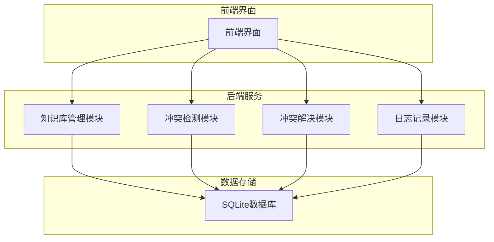
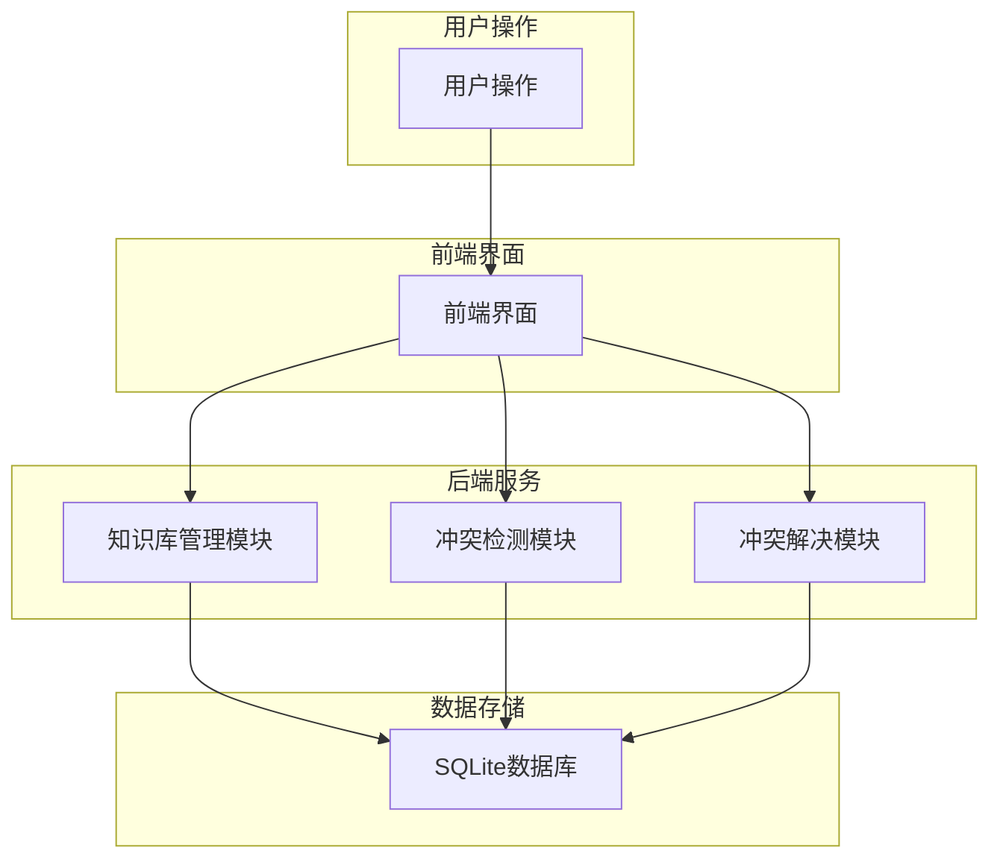
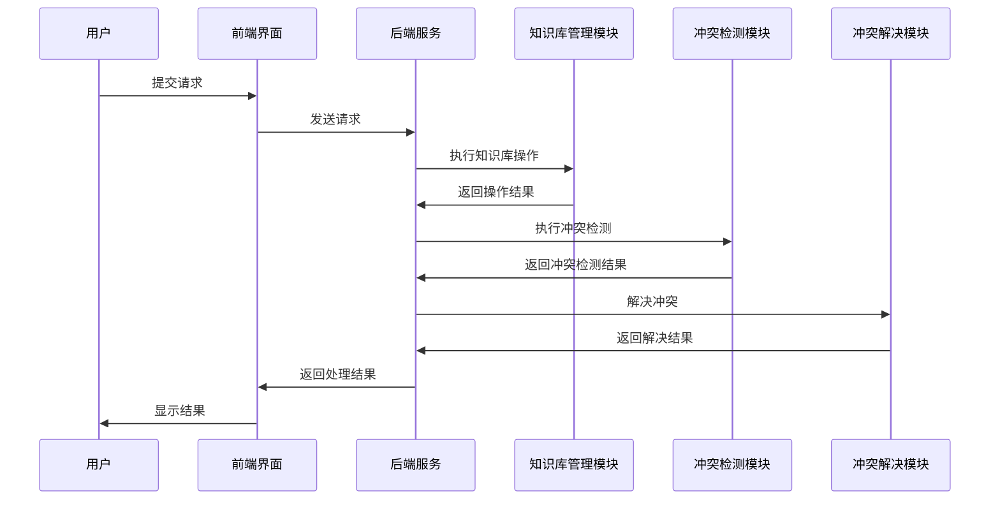
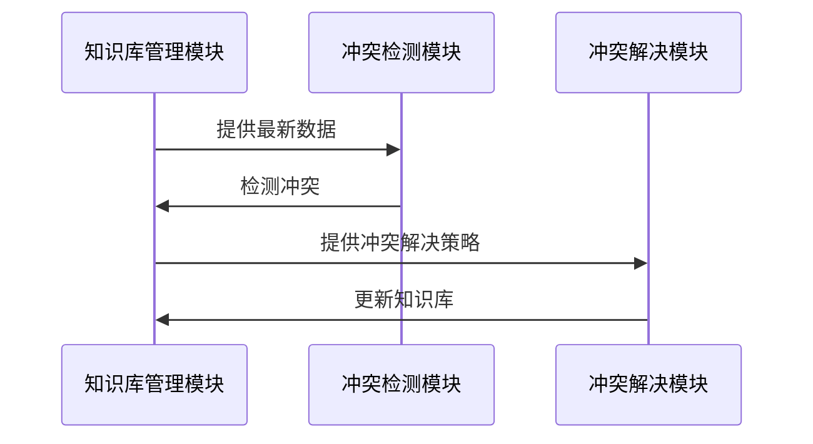

                 

### 1.1 问题背景

#### 1.1.1 AI Agent的定义与应用场景

**AI Agent** 是一种能够模拟人类行为、执行特定任务并自主做出决策的智能实体。它通过学习、推理和规划等方式，与外部环境进行交互，并实现特定的目标。AI Agent在现实世界中有着广泛的应用，如自动驾驶汽车、智能家居、虚拟客服、医疗诊断等。

1. **AI Agent的基本概念**：

   - **定义**：AI Agent是一种基于人工智能技术的计算机程序，它能够感知环境、理解信息、自主决策并采取行动。
   - **组成**：AI Agent通常包括感知器、控制器、执行器和记忆模块。

2. **AI Agent的应用场景**：

   - **自动驾驶汽车**：通过感知路况、预测行为、自主导航等方式，实现自动驾驶。
   - **智能家居**：通过感知家庭环境、学习用户习惯、自主控制家电等方式，提供智能化的家居体验。
   - **虚拟客服**：通过自然语言处理和对话生成技术，实现与用户的智能对话。
   - **医疗诊断**：通过分析医疗数据、辅助医生进行诊断和治疗。

#### 1.1.2 知识库的作用与挑战

**知识库** 是一种用于存储和管理知识的数据集合，它是AI Agent的重要组成部分。知识库的作用在于为AI Agent提供决策所需的信息和知识，从而提高其智能水平。

1. **知识库的定义与重要性**：

   - **定义**：知识库是一种用于存储、管理和检索知识的数据库系统。
   - **重要性**：知识库为AI Agent提供了丰富的信息和知识资源，有助于其更好地理解和应对复杂环境。

2. **知识库在AI Agent中的应用**：

   - **决策支持**：知识库中的知识可以帮助AI Agent做出更明智的决策。
   - **任务规划**：知识库中的任务规划知识可以帮助AI Agent高效地完成各项任务。
   - **情境识别**：知识库中的情境知识可以帮助AI Agent更好地理解和应对复杂情境。

然而，知识库在AI Agent中也面临一系列挑战：

1. **数据质量与一致性**：知识库中的数据质量直接影响AI Agent的性能。数据不一致、错误或不完整等问题都会对AI Agent的决策产生负面影响。
2. **实时性与效率**：知识库需要快速响应AI Agent的查询请求，同时保证系统的高效运行。

#### 1.1.3 冲突检测与解决机制的重要性

在AI Agent的知识库中，冲突是常见且严重的问题。冲突指的是知识库中存在相互矛盾或对立的知识，这会导致AI Agent的决策产生错误或不确定。

1. **知识库冲突的概念**：

   - **定义**：知识库冲突是指知识库中的知识之间存在相互矛盾或对立的情况。
   - **类型**：知识库冲突可以分为事实冲突、规则冲突和逻辑冲突等类型。

2. **知识库冲突的影响**：

   - **决策错误**：知识库冲突会导致AI Agent做出错误的决策，从而影响其任务执行效果。
   - **系统稳定性**：知识库冲突会影响系统的稳定性，可能导致系统崩溃或运行缓慢。
   - **用户体验**：知识库冲突会影响用户的体验，降低系统的可用性和满意度。

因此，冲突检测与解决机制在AI Agent的知识库管理中具有重要意义。通过检测和解决知识库中的冲突，可以确保AI Agent的决策准确性、系统稳定性和用户体验。

---

#### 1.2 问题描述

#### 1.2.1 知识库冲突的表现形式

知识库冲突的表现形式多种多样，可以分为以下几种类型：

1. **事实冲突**：指知识库中存在相互矛盾的事实信息。例如，知识库中同时存在“今天下雨”和“今天晴天”两个事实，这两个事实是相互矛盾的。

2. **规则冲突**：指知识库中存在相互矛盾的规则。例如，规则1：“当温度低于10℃时，开启加热器”，规则2：“当温度高于30℃时，关闭加热器”。当温度介于10℃到30℃之间时，这两个规则是相互矛盾的。

3. **逻辑冲突**：指知识库中存在逻辑上的错误或矛盾。例如，知识库中存在一个逻辑规则：“如果A成立，则B成立”。但实际上，A和B之间并不存在因果关系，因此这个规则是逻辑上错误的。

#### 1.2.1.2 知识库冲突的案例

以下是一些具体的知识库冲突案例：

1. **案例1**：在医疗诊断系统中，知识库中同时存在两个规则：“如果患者体温高于38℃，则判断为发热”，“如果患者体温低于36℃，则判断为低体温”。这两个规则在体温介于36℃到38℃之间时产生冲突，导致诊断结果不确定。

2. **案例2**：在智能家居系统中，知识库中存在一个规则：“当用户离家超过24小时，关闭家中所有电器”，另一个规则：“当用户在家时，开启家中灯光”。这两个规则在用户既离家又在家时产生冲突，导致系统无法正确控制电器。

3. **案例3**：在自动驾驶系统中，知识库中存在一个规则：“当车速超过120km/h时，保持当前车道”，另一个规则：“当车速低于60km/h时，减速至安全速度”。这两个规则在车速介于60km/h到120km/h之间时产生冲突，可能导致自动驾驶系统在高速和低速之间频繁切换，影响行车安全。

#### 1.2.2 知识库冲突检测的挑战

知识库冲突检测面临着一系列挑战：

1. **数据质量与一致性**：知识库中的数据质量直接影响冲突检测的准确性。数据不一致、错误或不完整等问题都会对冲突检测产生负面影响。

2. **实时性与效率**：冲突检测需要实时处理大量的知识库更新请求，同时保证系统的高效运行。这对检测算法的设计和实现提出了较高的要求。

3. **冲突类型的多样性**：知识库冲突可以有多种类型，如事实冲突、规则冲突和逻辑冲突等。检测算法需要能够处理多种类型的冲突，并具有广泛的适应性。

4. **冲突检测的复杂性**：知识库中的知识通常具有复杂性和多样性，冲突检测需要深入分析知识之间的关联和关系，从而发现潜在的冲突。

为了解决这些挑战，需要设计高效、准确的冲突检测算法，并优化知识库管理系统的架构，以确保AI Agent的知识库稳定、可靠。

---

#### 1.2.3 知识库冲突解决机制的必要性

知识库冲突解决机制的必要性主要体现在以下几个方面：

1. **确保决策准确性**：知识库中的冲突会导致AI Agent的决策产生错误或不一致。通过解决冲突，可以确保AI Agent的决策准确性和一致性，提高其任务执行效果。

2. **提升系统稳定性**：知识库冲突会影响系统的稳定性，可能导致系统崩溃或运行缓慢。通过解决冲突，可以确保系统的稳定性和可靠性，减少故障发生的概率。

3. **优化用户体验**：知识库冲突会影响用户的体验，降低系统的可用性和满意度。通过解决冲突，可以提供更稳定、更智能的服务，提升用户体验。

4. **知识库维护**：解决冲突是知识库维护的重要环节。通过及时发现和解决冲突，可以确保知识库的完整性和一致性，提高知识库的质量和可用性。

#### 1.2.3.1 知识库冲突解决的目标

知识库冲突解决的目标主要包括以下几个方面：

1. **消除冲突**：通过识别和消除知识库中的冲突，确保知识库中的知识一致、无矛盾。

2. **恢复一致性**：在冲突发生后，通过调整知识库中的知识，使其恢复一致性，从而确保AI Agent的决策准确性和一致性。

3. **提高决策效率**：解决冲突的过程需要高效、快速，以确保AI Agent能够在短时间内恢复决策能力。

4. **确保系统稳定性**：解决冲突是保证系统稳定运行的关键。通过有效的冲突解决机制，可以降低系统故障发生的概率。

#### 1.2.3.2 知识库冲突解决的方法

知识库冲突解决的方法可以分为以下几类：

1. **手动解决方法**：通过人工干预的方式，识别和解决知识库中的冲突。这种方法适用于冲突较少、知识库规模较小的场景。

2. **自动解决方法**：利用算法自动识别和解决知识库中的冲突。这种方法适用于冲突较多、知识库规模较大的场景。

3. **混合解决方法**：结合手动和自动解决方法，将手动解决方法应用于部分冲突，将自动解决方法应用于其他冲突。这种方法适用于复杂场景，能够提高冲突解决的效率和准确性。

在实际应用中，根据知识库的特点和需求，可以采用不同的解决方法。例如，在医疗诊断系统中，对于严重危及患者生命的冲突，可以采用手动解决方法；对于一些次要的冲突，可以采用自动解决方法。

---

### 1.3 边界与外延

#### 1.3.1 知识库冲突检测与解决的范围

知识库冲突检测与解决的范围涵盖了多个领域和应用场景，主要包括以下几个方面：

1. **AI Agent领域**：知识库冲突检测与解决在AI Agent领域中具有广泛的应用。AI Agent需要从大量知识库中提取信息进行决策，因此冲突检测与解决是保证其决策准确性和一致性的关键。

2. **智能系统领域**：知识库冲突检测与解决在智能系统领域中同样具有重要意义。智能系统如智能家居、智能交通、智能医疗等，都需要从知识库中获取信息进行控制和决策，因此冲突检测与解决是保证系统稳定性和可靠性的关键。

3. **企业知识管理领域**：在企业知识管理中，知识库冲突检测与解决可以帮助企业有效地管理和利用知识资源，提高知识共享和协作的效率。

4. **教育领域**：在教育领域，知识库冲突检测与解决可以帮助教育系统提供更加准确和一致的教学内容，提高教学质量和学习效果。

5. **金融领域**：在金融领域中，知识库冲突检测与解决可以帮助金融机构识别和解决金融风险，提高金融产品的准确性和可靠性。

#### 1.3.1.1 知识库冲突检测与解决的应用领域

知识库冲突检测与解决的应用领域包括但不限于：

1. **自动驾驶系统**：在自动驾驶系统中，知识库冲突检测与解决可以帮助车辆准确地理解和响应复杂的交通环境，提高驾驶安全性。

2. **智能医疗系统**：在智能医疗系统中，知识库冲突检测与解决可以帮助医生准确诊断和治疗疾病，提高医疗服务的质量和效率。

3. **智能客服系统**：在智能客服系统中，知识库冲突检测与解决可以帮助机器人准确理解和回答用户的问题，提高用户满意度。

4. **智能推荐系统**：在智能推荐系统中，知识库冲突检测与解决可以帮助系统准确识别和解决推荐数据中的冲突，提高推荐质量。

5. **智能决策支持系统**：在智能决策支持系统中，知识库冲突检测与解决可以帮助企业准确分析和预测市场趋势，提高决策准确性。

#### 1.3.1.2 知识库冲突检测与解决的技术范围

知识库冲突检测与解决的技术范围包括以下几个方面：

1. **冲突检测技术**：包括基于规则检测、基于模式识别检测和基于语义检测等技术。

2. **冲突解决技术**：包括基于规则解决、基于机器学习解决和基于混合解决等技术。

3. **知识库管理技术**：包括知识库构建、知识库存储、知识库检索和知识库更新等技术。

4. **算法优化技术**：包括算法效率优化、算法准确性优化和算法可扩展性优化等技术。

5. **系统架构设计技术**：包括分布式系统设计、云计算架构设计和大数据处理技术等。

通过综合运用这些技术，可以构建一个高效、准确的冲突检测与解决机制，为AI Agent和其他智能系统提供稳定、可靠的知识库支持。

---

#### 1.3.2 知识库冲突检测与解决的核心要素

知识库冲突检测与解决的核心要素包括以下几个方面：

1. **数据来源与处理**：知识库冲突检测与解决的数据来源包括内部数据和外部数据。内部数据主要来源于AI Agent的感知器、控制器和执行器等模块；外部数据主要来源于传感器、数据库和互联网等。数据来源的多样性使得数据处理的复杂度增加，需要采用高效的数据处理技术和方法，如数据清洗、数据整合和数据去重等。

2. **算法设计与应用**：知识库冲突检测与解决的关键在于算法的设计与应用。冲突检测算法需要能够准确识别知识库中的冲突，如基于规则检测、基于模式识别检测和基于语义检测等；冲突解决算法需要能够根据冲突的类型和严重程度，选择合适的解决策略，如基于规则解决、基于机器学习解决和基于混合解决等。算法的设计和应用是保证知识库冲突检测与解决效果的关键。

3. **系统实现与优化**：知识库冲突检测与解决需要通过系统实现来具体落实。系统实现包括系统架构设计、系统模块划分和系统功能实现等。在系统实现过程中，需要充分考虑系统性能、可扩展性和可维护性等因素。系统优化是提高知识库冲突检测与解决效率的重要手段，包括算法优化、数据存储优化和系统资源优化等。

#### 1.3.3 知识库冲突检测与解决的未来展望

知识库冲突检测与解决在未来将面临以下发展趋势和挑战：

1. **技术进步**：随着人工智能、大数据和云计算等技术的快速发展，知识库冲突检测与解决的技术将不断进步，如基于深度学习、强化学习和自然语言处理等新技术的应用，将进一步提升冲突检测与解决的效果和效率。

2. **应用扩展**：知识库冲突检测与解决的应用领域将不断扩展，如物联网、智能制造、智慧城市等领域的应用，将推动知识库冲突检测与解决技术的普及和深化。

3. **标准化**：知识库冲突检测与解决需要建立统一的标准和规范，以促进技术的标准化和产业化。标准化工作将包括知识库结构、冲突检测方法、冲突解决策略等方面。

4. **挑战与应对**：知识库冲突检测与解决将面临数据质量、实时性、效率和可扩展性等方面的挑战。需要通过技术创新、算法优化和系统架构设计等手段，应对这些挑战。

总之，知识库冲突检测与解决在AI Agent和其他智能系统中具有重要作用，未来将迎来更广泛的应用和发展。通过不断创新和优化，将进一步提升知识库冲突检测与解决的效果，为智能系统的发展提供有力支持。

---

### 1.3.4 本章小结

本章对知识库冲突检测与解决机制进行了全面探讨。首先，介绍了AI Agent的定义与应用场景，强调了知识库在AI Agent中的作用与挑战。接着，分析了知识库冲突的表现形式和检测挑战，阐述了知识库冲突解决机制的必要性及其目标和方法。随后，讨论了知识库冲突检测与解决的应用领域和技术范围，并提出了核心要素和未来展望。通过本章的讨论，我们对知识库冲突检测与解决有了更深入的理解，为后续章节的详细分析奠定了基础。在接下来的章节中，我们将进一步探讨知识库冲突检测与解决的核心概念、算法原理和实现策略，以期为相关领域的研究和实践提供参考。

---

## 2.1 知识库冲突检测的核心概念

在构建AI Agent的知识库时，冲突检测是确保知识库一致性和有效性的关键步骤。为了深入理解知识库冲突检测，我们需要从核心概念、方法及其面临的挑战等方面进行详细探讨。

### 2.1.1 冲突检测的定义

**冲突检测**是指在知识库中识别出相互矛盾或对立的知识的过程。具体来说，冲突检测的目标是发现知识库中的事实、规则或逻辑之间不一致的情况，以便采取措施解决这些问题。这种不一致性可能源于知识库的初始构建、数据的更新或外部输入。

#### 2.1.1.1 冲突检测的重要性

冲突检测在AI Agent的知识管理中扮演着至关重要的角色。以下是冲突检测的重要性：

1. **决策准确性**：确保AI Agent做出的决策基于一致且无矛盾的知识。
2. **知识库可靠性**：通过检测和解决冲突，提高知识库的可靠性，减少错误决策的风险。
3. **用户体验**：稳定的知识库有助于提供一致的用户体验，减少因知识库问题导致的服务中断。

### 2.1.2 冲突检测的方法

冲突检测的方法可以分为三类：数据库查询方法、模式识别方法和基于语义的方法。

#### 2.1.2.1 数据库查询方法

数据库查询方法基于关系数据库或其他数据存储系统，通过编写查询语句来识别冲突。这种方法通常使用SQL或其他数据库查询语言进行实现。

1. **优点**：
   - 简单易懂，易于实现。
   - 可以直接利用现有的数据库系统进行优化。

2. **缺点**：
   - 需要明确的冲突定义和规则。
   - 对实时性要求较高的系统可能无法满足。

#### 2.1.2.2 模式识别方法

模式识别方法利用机器学习和数据挖掘技术，从大量的数据中自动识别冲突模式。

1. **优点**：
   - 自动化程度高，适用于大规模数据。
   - 可以处理复杂的冲突类型。

2. **缺点**：
   - 需要大量的数据和计算资源。
   - 算法的泛化能力需要验证。

#### 2.1.2.3 基于语义的方法

基于语义的方法通过自然语言处理和语义分析，理解知识的语义和逻辑关系，从而检测冲突。

1. **优点**：
   - 可以处理自然语言文本中的冲突。
   - 更具灵活性和适应性。

2. **缺点**：
   - 语义分析复杂，错误率较高。
   - 需要大量的语义资源和模型训练。

### 2.1.3 冲突检测的挑战

在实际应用中，冲突检测面临一系列挑战：

#### 2.1.3.1 数据质量的影响

数据质量是冲突检测准确性的基础。数据不一致、错误或不完整都会影响冲突检测的准确性。

#### 2.1.3.2 实时性的需求

AI Agent通常需要快速响应环境变化，冲突检测需要在短时间内完成，这对算法的效率和实时性提出了高要求。

#### 2.1.3.3 效率的优化

大规模知识库中的冲突检测需要高效的算法和优化策略，以减少计算时间和资源消耗。

### 2.1.4 冲突检测与解决的关系

冲突检测和冲突解决是紧密相关的两个过程。冲突检测是冲突解决的前提，只有检测出冲突，才能进行解决。而冲突解决是冲突检测的延伸，通过解决冲突，确保知识库的一致性和可靠性。

### 2.1.5 本章小结

本章介绍了知识库冲突检测的核心概念和方法，分析了冲突检测的重要性、方法及其面临的挑战。通过本章的学习，读者可以了解冲突检测的基本原理和实现策略，为后续章节的深入探讨打下基础。

---

## 2.2 知识库冲突解决的核心概念

在AI Agent的知识库管理中，冲突解决是确保知识库一致性、可靠性和有效性的关键环节。冲突解决的目标是识别知识库中的冲突，并采取适当的策略进行消除或调整，以恢复知识库的一致性和有效性。为了深入理解冲突解决的核心概念，我们将从定义、目标和方法等方面进行详细探讨。

### 2.2.1 冲突解决的定义

**冲突解决**是指通过识别、分析和处理知识库中的冲突，以消除或缓解冲突的影响，确保知识库的一致性和有效性的过程。冲突解决通常涉及以下几个步骤：

1. **冲突识别**：检测知识库中的冲突，包括事实冲突、规则冲突和逻辑冲突等。
2. **冲突分析**：分析冲突的原因、类型和影响，确定冲突的性质和严重程度。
3. **冲突处理**：根据冲突的类型和严重程度，选择合适的策略进行解决，如修正、删除、合并或保留冲突。
4. **结果验证**：验证冲突解决的结果，确保知识库的一致性和有效性。

### 2.2.2 冲突解决的目标

冲突解决的目标主要包括以下几个方面：

1. **消除冲突**：通过识别和消除知识库中的冲突，确保知识库中的知识一致、无矛盾。
2. **恢复一致性**：在冲突发生后，通过调整知识库中的知识，使其恢复一致性，从而确保AI Agent的决策准确性和一致性。
3. **提高决策效率**：确保AI Agent能够在冲突发生后迅速恢复决策能力，减少冲突对决策过程的干扰。
4. **确保系统稳定性**：通过有效的冲突解决机制，降低系统故障发生的概率，提高系统的稳定性和可靠性。

### 2.2.3 冲突解决的方法

冲突解决的方法可以分为以下几类：

1. **手动解决方法**：通过人工干预的方式，识别和解决知识库中的冲突。这种方法适用于冲突较少、知识库规模较小的场景。人工解决方法的优点在于灵活性强，能够根据具体情况进行个性化处理；缺点在于效率低，难以处理大规模知识库中的冲突。

2. **自动解决方法**：利用算法自动识别和解决知识库中的冲突。这种方法适用于冲突较多、知识库规模较大的场景。自动解决方法的优点在于效率高，能够处理大规模知识库中的冲突；缺点在于算法的适应性有限，可能无法处理复杂多样的冲突。

3. **混合解决方法**：结合手动和自动解决方法，将手动解决方法应用于部分冲突，将自动解决方法应用于其他冲突。这种方法适用于复杂场景，能够提高冲突解决的效率和准确性。混合解决方法的优点在于结合了手动和自动解决方法的优点，能够根据实际情况进行灵活调整；缺点在于实现复杂，需要综合考虑多种解决策略。

### 2.2.4 冲突解决的挑战

在实际应用中，冲突解决面临一系列挑战：

1. **冲突类型的多样性**：知识库中的冲突类型多样，包括事实冲突、规则冲突和逻辑冲突等。每种冲突类型都有其独特的解决方法，这增加了冲突解决的复杂性。

2. **系统可扩展性**：随着知识库规模的不断扩大，冲突解决的系统需要具备良好的可扩展性，以应对日益增长的冲突数量和复杂性。

3. **算法适应性**：自动解决方法需要具备较高的适应性，能够处理不同类型的冲突，并能够根据具体情况进行优化。

4. **实时性需求**：AI Agent通常需要在短时间内做出决策，冲突解决机制需要在实时性方面具备良好的性能。

### 2.2.5 冲突检测与解决的关系

冲突检测和冲突解决是紧密关联的两个过程。冲突检测是冲突解决的前提，只有通过冲突检测识别出知识库中的冲突，才能进行解决。而冲突解决是冲突检测的延伸，通过解决冲突，确保知识库的一致性和有效性。

### 2.2.6 本章小结

本章介绍了知识库冲突解决的核心概念、目标和方法，并分析了冲突解决面临的挑战。通过本章的学习，读者可以了解冲突解决的基本原理和实现策略，为后续章节的深入探讨打下基础。在接下来的章节中，我们将进一步探讨冲突解决的具体算法和应用实践。

---

## 2.3 知识库冲突检测与解决的联系

知识库冲突检测与解决是知识库管理中不可或缺的两个环节，它们之间存在着紧密的联系和相互作用。理解这两者之间的关系，有助于我们更好地设计和实现知识库管理系统，确保知识库的一致性和有效性。

### 2.3.1 冲突检测与冲突解决的关系

1. **冲突检测是冲突解决的前提**：

   冲突检测是知识库管理中的第一步，它的目标是识别知识库中的冲突。只有在检测出冲突之后，我们才能有针对性地进行解决。冲突检测的效果直接影响冲突解决的效率和准确性。

2. **冲突解决是冲突检测的延伸**：

   冲突解决是对检测到的冲突进行后续处理的过程，其目标是消除或缓解冲突的影响，确保知识库的一致性和有效性。冲突解决不仅需要解决已检测到的冲突，还需要预防新的冲突产生。

### 2.3.2 冲突检测与冲突解决机制的综合应用

在实际应用中，冲突检测与解决机制往往需要综合应用，以应对复杂的知识库环境和多变的冲突情况。以下是综合应用冲突检测与解决机制的几个关键方面：

1. **动态检测与解决**：

   知识库中的知识是动态变化的，新的知识不断被添加或更新，可能导致新的冲突产生。动态检测与解决机制能够实时监控知识库的变化，及时检测和解决冲突，确保知识库的稳定性。

2. **多层次检测与解决**：

   冲突检测与解决可以划分为多个层次，如知识单元层次、规则层次和整体层次。多层次检测与解决机制能够从不同层面识别和解决冲突，提高冲突检测与解决的效果。

3. **自适应检测与解决**：

   自适应检测与解决机制能够根据知识库的特性和冲突的情况，自动调整检测和解决的策略，以应对不同类型的冲突。这种机制具有更高的灵活性和适应性。

### 2.3.3 冲突检测与解决机制的实施步骤

为了有效地实施冲突检测与解决机制，我们可以将其划分为以下步骤：

1. **需求分析**：

   分析知识库的应用场景和需求，明确冲突检测与解决的目标和要求。

2. **冲突检测设计**：

   设计冲突检测的方法和算法，包括数据库查询方法、模式识别方法和基于语义的方法等。

3. **冲突解决设计**：

   设计冲突解决的策略和方法，包括手动解决方法、自动解决方法和混合解决方法等。

4. **系统实现**：

   实现冲突检测与解决机制，包括系统架构设计、模块划分和功能实现等。

5. **性能评估**：

   对冲突检测与解决机制的性能进行评估，包括检测准确性、实时性和效率等。

6. **优化与调整**：

   根据性能评估结果，对冲突检测与解决机制进行优化和调整，以提高其效果和效率。

### 2.3.4 本章小结

本章讨论了知识库冲突检测与解决的联系和综合应用，介绍了冲突检测与解决机制的实施步骤。通过本章的学习，读者可以理解冲突检测与解决的核心概念和实现策略，为构建高效、稳定的知识库管理系统提供参考。在接下来的章节中，我们将进一步探讨冲突检测与解决的具体算法和应用实践。

---

### 2.3.5 知识库冲突检测与解决机制的实施步骤

实施知识库冲突检测与解决机制是一个系统性的过程，需要从多个角度进行规划和执行。以下是具体实施步骤：

#### 2.3.5.1 数据准备

1. **数据收集**：

   收集所需的数据，包括知识库中的事实、规则和逻辑关系等。这些数据可以来源于内部数据库、外部数据源或用户输入等。

2. **数据清洗**：

   清洗收集到的数据，包括处理缺失值、异常值和数据格式不一致等问题，以确保数据质量。

3. **数据整合**：

   整合不同来源的数据，构建统一的知识库数据模型，以便后续的冲突检测与解决。

#### 2.3.5.2 算法选择

1. **冲突检测算法**：

   根据知识库的特点和需求，选择合适的冲突检测算法。可能的选项包括数据库查询方法、模式识别方法和基于语义的方法等。

2. **冲突解决算法**：

   根据冲突的类型和严重程度，选择合适的冲突解决算法。可能的选项包括手动解决方法、自动解决方法和混合解决方法等。

#### 2.3.5.3 系统实施

1. **系统架构设计**：

   设计知识库冲突检测与解决系统的整体架构，包括前端界面、后端服务、数据存储和数据流等。

2. **模块划分**：

   将系统划分为多个功能模块，如数据收集模块、冲突检测模块、冲突解决模块和结果反馈模块等。

3. **功能实现**：

   实现各个模块的功能，包括数据收集、冲突检测、冲突解决和结果反馈等。

#### 2.3.5.4 性能评估

1. **检测准确性**：

   评估冲突检测算法的准确性，包括检测出冲突的准确率和漏检率等。

2. **实时性**：

   评估系统的实时性能，包括响应时间和延迟等。

3. **效率**：

   评估系统的整体效率，包括计算资源和运行时间等。

#### 2.3.5.5 优化与调整

1. **算法优化**：

   根据性能评估结果，对冲突检测与解决算法进行优化，以提高准确性和效率。

2. **系统调整**：

   根据实际应用情况，对系统架构和模块进行调整，以提高系统的稳定性和可扩展性。

3. **反馈与迭代**：

   收集用户反馈，根据反馈结果进行系统迭代和优化。

### 2.3.6 本章小结

本章详细介绍了知识库冲突检测与解决机制的实施步骤，包括数据准备、算法选择、系统实施、性能评估和优化与调整等环节。通过这些步骤，可以有效地构建一个高效、稳定的冲突检测与解决系统，为AI Agent的知识库管理提供有力支持。

---

### 2.3.7 本章小结

本章深入探讨了知识库冲突检测与解决的核心概念、方法及其应用步骤。首先，介绍了冲突检测与解决的定义、目标和方法，分析了冲突检测的重要性以及面临的挑战。接着，讨论了冲突检测与解决之间的联系，并阐述了冲突检测与解决机制的实施步骤。通过本章的学习，读者可以全面了解知识库冲突检测与解决的基本原理和实践方法，为构建高效、稳定的知识库管理系统打下坚实基础。在接下来的章节中，我们将进一步探讨具体算法和技术细节，以期为相关领域的研究和实践提供更多参考。

---

## 3.1 知识库冲突检测算法原理

知识库冲突检测算法是确保AI Agent知识库一致性、可靠性的关键环节。为了实现这一目标，我们需要了解几种常见的冲突检测算法原理，包括数据库查询方法、模式识别方法和基于语义的方法。

### 3.1.1 数据库查询方法

数据库查询方法是利用关系数据库或其他数据存储系统进行冲突检测的一种方法。通过编写查询语句，我们可以识别知识库中的冲突。以下是一种简单的数据库查询方法：

#### 3.1.1.1 SQL查询方法

**示例**：假设我们有一个关系数据库，其中包含以下两个表：

- **事实表**（Facts）：
  - `fact_id`（事实编号）
  - `content`（事实内容）
- **规则表**（Rules）：
  - `rule_id`（规则编号）
  - `condition`（规则条件）
  - `action`（规则动作）

为了检测事实表中的冲突，我们可以编写以下SQL查询语句：

```sql
SELECT f1.fact_id, f1.content, f2.fact_id, f2.content
FROM Facts f1, Facts f2
WHERE f1.fact_id != f2.fact_id
AND f1.content = f2.content;
```

此查询语句将返回所有具有相同内容但不同编号的事实对，这些事实对可能存在冲突。

#### 3.1.1.2 数据库索引优化

为了提高冲突检测的效率，我们可以对数据库表进行索引优化。例如，在事实表和规则表的`content`列上创建索引，可以显著减少查询时间。

```sql
CREATE INDEX idx_content ON Facts(content);
CREATE INDEX idx_content ON Rules(content);
```

### 3.1.2 模式识别方法

模式识别方法是利用机器学习和数据挖掘技术进行冲突检测的一种方法。这种方法通过从大量数据中自动识别冲突模式，具有较强的自适应性和处理复杂冲突的能力。

#### 3.1.2.1 机器学习方法

**示例**：我们可以使用支持向量机（SVM）进行冲突检测。首先，需要将知识库中的数据转换为特征向量，然后训练SVM模型进行分类。

1. **数据预处理**：将知识库中的事实和规则转换为特征向量。
2. **模型训练**：使用训练集训练SVM模型。
3. **模型评估**：使用测试集评估模型性能，调整参数以提高准确性。

```python
from sklearn.svm import SVC
from sklearn.model_selection import train_test_split
from sklearn.metrics import accuracy_score

# 数据预处理
X, y = preprocess_data(knowledge_base)

# 模型训练
X_train, X_test, y_train, y_test = train_test_split(X, y, test_size=0.2)
model = SVC(kernel='linear')
model.fit(X_train, y_train)

# 模型评估
y_pred = model.predict(X_test)
accuracy = accuracy_score(y_test, y_pred)
print(f"Accuracy: {accuracy}")
```

#### 3.1.2.2 人工神经网络方法

人工神经网络（ANN）方法通过学习输入和输出之间的复杂关系进行冲突检测。我们可以使用深度学习框架（如TensorFlow或PyTorch）来构建和训练神经网络。

```python
import tensorflow as tf
from tensorflow.keras.models import Sequential
from tensorflow.keras.layers import Dense

# 构建神经网络模型
model = Sequential([
    Dense(units=64, activation='relu', input_shape=(input_shape,)),
    Dense(units=1, activation='sigmoid')
])

# 编译模型
model.compile(optimizer='adam', loss='binary_crossentropy', metrics=['accuracy'])

# 训练模型
model.fit(X_train, y_train, epochs=10, batch_size=32)

# 评估模型
loss, accuracy = model.evaluate(X_test, y_test)
print(f"Test Loss: {loss}, Test Accuracy: {accuracy}")
```

### 3.1.3 基于语义的方法

基于语义的方法通过自然语言处理（NLP）技术识别知识库中的冲突。这种方法可以处理自然语言文本中的复杂冲突，具有较强的灵活性和适应性。

#### 3.1.3.1 自然语言处理方法

**示例**：我们可以使用命名实体识别（NER）技术来识别知识库中的实体，并基于实体之间的关系进行冲突检测。

```python
import spacy

# 加载NLP模型
nlp = spacy.load("en_core_web_sm")

# 文本处理
doc = nlp("The temperature is 30 degrees and the humidity is 60%.")

# 命名实体识别
ents = [(ent.text, ent.label_) for ent in doc.ents]

# 冲突检测
def detect_conflicts(ents):
    conflicts = []
    for i in range(len(ents)):
        for j in range(i + 1, len(ents)):
            if ents[i][1] == ents[j][1]:
                conflicts.append((ents[i], ents[j]))
    return conflicts

conflicts = detect_conflicts(ents)
print(conflicts)
```

### 3.1.4 算法实现示例

以下是一个简单的Python代码示例，用于演示如何使用数据库查询方法进行冲突检测：

```python
import sqlite3

# 连接到数据库
conn = sqlite3.connect('knowledge_base.db')
cursor = conn.cursor()

# 查询冲突
cursor.execute("""
SELECT f1.fact_id, f1.content, f2.fact_id, f2.content
FROM Facts f1, Facts f2
WHERE f1.fact_id != f2.fact_id
AND f1.content = f2.content;
""")
conflicts = cursor.fetchall()

# 打印冲突
for conflict in conflicts:
    print(f"Conflict: {conflict}")

# 关闭数据库连接
conn.close()
```

### 3.1.5 算法比较与选择

不同算法各有优缺点，适用于不同的场景。以下是对几种算法的比较和选择建议：

| 算法类型       | 优点                                 | 缺点                                 | 适用场景                    |
|----------------|--------------------------------------|--------------------------------------|-----------------------------|
| 数据库查询方法 | 简单、易于实现、高效                 | 需要明确的冲突定义、实时性较差       | 小规模、结构化知识库        |
| 机器学习方法   | 自动化、适应性高、处理复杂冲突       | 计算资源需求大、需要大量训练数据     | 大规模、非结构化知识库      |
| 基于语义的方法 | 灵活性高、处理自然语言文本冲突       | 复杂、错误率较高、需要语义资源       | 复杂自然语言知识库          |

### 3.1.6 本章小结

本章介绍了知识库冲突检测算法的原理，包括数据库查询方法、模式识别方法和基于语义的方法。通过算法实现示例和比较，读者可以了解不同算法的特点和应用场景，为构建高效的知识库冲突检测系统提供参考。在接下来的章节中，我们将继续探讨知识库冲突解决算法的原理和实践。

---

### 3.2 知识库冲突解决算法

知识库冲突解决算法是确保AI Agent知识库一致性、可靠性的关键。冲突解决的目标是消除或缓解知识库中的冲突，以确保AI Agent能够做出准确、一致的决策。以下将详细介绍几种常见的知识库冲突解决算法。

#### 3.2.1 手动解决方法

手动解决方法是通过人工干预来识别和解决知识库中的冲突。这种方法通常适用于冲突较少、知识库规模较小的场景。

1. **优点**：
   - 灵活性高，可以根据具体情况进行个性化处理。
   - 简单易懂，易于实现。

2. **缺点**：
   - 效率低，难以处理大规模知识库中的冲突。
   - 依赖人工干预，可能导致不一致性。

3. **适用场景**：
   - 知识库规模较小、冲突较少的系统。
   - 需要高度个性化的冲突解决策略。

#### 3.2.2 自动解决方法

自动解决方法是利用算法自动识别和解决知识库中的冲突。这种方法适用于冲突较多、知识库规模较大的场景。

1. **优点**：
   - 自动化程度高，可以处理大规模知识库中的冲突。
   - 提高冲突解决的效率和一致性。

2. **缺点**：
   - 需要大量的数据和计算资源。
   - 算法的泛化能力需要验证。

3. **适用场景**：
   - 知识库规模较大、冲突较多的系统。
   - 需要快速、高效的冲突解决。

#### 3.2.3 混合解决方法

混合解决方法结合了手动解决方法和自动解决方法，将手动解决方法应用于部分冲突，将自动解决方法应用于其他冲突。这种方法适用于复杂场景，能够提高冲突解决的效率和准确性。

1. **优点**：
   - 结合了手动和自动解决方法的优点，能够根据具体情况进行灵活调整。
   - 提高冲突解决的效果和效率。

2. **缺点**：
   - 实现复杂，需要综合考虑多种解决策略。

3. **适用场景**：
   - 复杂、大规模的知识库系统。
   - 需要多种冲突解决策略。

#### 3.2.4 算法选择

在实际应用中，选择合适的冲突解决算法取决于知识库的特点和需求。以下是一些选择依据：

1. **知识库规模**：对于规模较小的知识库，可以选择手动解决方法；对于规模较大的知识库，应优先考虑自动解决方法。

2. **冲突类型**：根据知识库中的冲突类型选择合适的解决算法。例如，对于事实冲突，可以使用基于规则的解决方法；对于规则冲突，可以使用机器学习解决方法。

3. **实时性需求**：根据系统的实时性需求选择解决算法。对于需要快速响应的实时系统，应选择计算效率高的算法。

4. **系统资源**：考虑系统可用的计算资源和存储资源，选择适合系统硬件配置的算法。

### 3.2.5 本章小结

本章介绍了知识库冲突解决算法的基本原理和适用场景，包括手动解决方法、自动解决方法和混合解决方法。通过这些算法，可以有效地消除或缓解知识库中的冲突，确保AI Agent的知识库一致性、可靠性和有效性。在接下来的章节中，我们将进一步探讨知识库冲突解决算法的具体实现和应用。

---

### 3.3 知识库冲突解决算法的详细说明

知识库冲突解决算法是确保AI Agent知识库一致性、可靠性的关键。为了更好地理解和应用这些算法，我们将详细说明几种常见的冲突解决算法，包括基于规则的解决方法、基于机器学习的解决方法和混合解决方法。

#### 3.3.1 基于规则的解决方法

基于规则的解决方法是一种常见的冲突解决方法，它通过预定义的规则来识别和解决知识库中的冲突。这种方法通常包括以下几个步骤：

1. **冲突规则定义**：

   针对知识库中的不同冲突类型，定义相应的冲突规则。例如，对于事实冲突，可以定义规则：“如果同一事实在知识库中的不同条目中具有不同的值，则标记为冲突”。

2. **冲突检测**：

   使用冲突规则对知识库进行扫描，检测是否存在冲突。这可以通过编写SQL查询语句或使用特定的冲突检测工具来实现。

3. **冲突解决**：

   根据冲突规则，对检测到的冲突进行解决。解决策略包括以下几种：

   - **删除冲突**：如果冲突不重要或存在更优先的信息来源，可以选择删除冲突项。
   - **合并冲突**：将具有冲突的事实合并为一个，通常基于特定的优先级或一致性规则。
   - **标记冲突**：将冲突标记为待解决，以便后续人工干预或进一步处理。

**示例**：

假设知识库中有两个事实条目：“温度为25℃”和“温度为30℃”。基于规则解决方法可以定义如下冲突规则：

- 如果同一事实的两个条目具有不同的值，则标记为冲突。

在检测到冲突后，可以根据规则将其中一个事实条目删除或合并，从而解决冲突。

#### 3.3.2 基于机器学习的解决方法

基于机器学习的解决方法利用训练数据来识别和解决知识库中的冲突。这种方法通过学习数据中的冲突模式，自动生成冲突解决策略。以下是基于机器学习解决方法的几个关键步骤：

1. **数据预处理**：

   将知识库中的数据进行预处理，提取特征并转换为机器学习模型所需的格式。特征提取可以包括事实的内容、来源、创建时间等。

2. **模型训练**：

   使用训练数据集训练机器学习模型，学习冲突模式。常见的方法包括分类模型（如SVM、决策树、随机森林）和聚类模型（如K-means、层次聚类）。

3. **模型评估**：

   使用测试数据集评估模型的性能，包括准确率、召回率、F1分数等指标。根据评估结果调整模型参数，以提高解决效果。

4. **冲突解决**：

   使用训练好的模型对知识库中的数据进行冲突检测和解决。具体策略可以根据模型的预测结果来确定。

**示例**：

假设我们使用决策树模型进行冲突解决。首先，我们需要收集训练数据，包括事实条目的内容和是否为冲突的标签。然后，使用这些数据进行模型训练：

```python
from sklearn.tree import DecisionTreeClassifier
from sklearn.model_selection import train_test_split
from sklearn.metrics import classification_report

# 数据预处理
X = ...  # 特征矩阵
y = ...  # 冲突标签

# 模型训练
X_train, X_test, y_train, y_test = train_test_split(X, y, test_size=0.2)
model = DecisionTreeClassifier()
model.fit(X_train, y_train)

# 模型评估
y_pred = model.predict(X_test)
print(classification_report(y_test, y_pred))
```

在训练好的模型的基础上，我们可以对新的数据集进行冲突检测和解决。

#### 3.3.3 混合解决方法

混合解决方法结合了基于规则和基于机器学习的解决方法，以充分利用两者的优点。这种方法通常包括以下几个步骤：

1. **冲突检测**：

   使用基于规则的冲突检测方法初步检测知识库中的冲突。

2. **冲突分类**：

   使用基于机器学习的冲突解决方法对初步检测到的冲突进行分类，确定冲突的类型和严重程度。

3. **冲突解决**：

   根据冲突的类型和严重程度，选择合适的解决策略。例如，对于低严重程度的冲突，可以选择基于规则的解决方法；对于高严重程度的冲突，可以选择基于机器学习的解决方法。

**示例**：

假设我们使用混合解决方法来处理知识库中的冲突。首先，使用基于规则的冲突检测方法检测冲突，然后使用基于机器学习的解决方法对冲突进行分类和解决：

```python
# 基于规则的冲突检测
conflicts = detect_conflicts_with_rules(knowledge_base)

# 基于机器学习的冲突分类与解决
conflicts = solve_conflicts_with_ml(conflicts)

# 更新知识库
update_knowledge_base(knowledge_base, conflicts)
```

通过这种混合解决方法，我们可以充分利用基于规则和基于机器学习的优势，提高冲突解决的效率和准确性。

### 3.3.4 本章小结

本章详细介绍了知识库冲突解决算法的几种方法，包括基于规则的解决方法、基于机器学习的解决方法和混合解决方法。通过这些方法，我们可以有效地识别和解决知识库中的冲突，确保AI Agent的知识库一致性、可靠性和有效性。在接下来的章节中，我们将进一步探讨知识库冲突解决算法的具体实现和应用。

---

### 3.4 知识库冲突解决算法的性能分析

在构建AI Agent的知识库冲突解决机制时，算法的性能是至关重要的。性能分析包括准确性、实时性和效率等方面。下面我们将详细讨论这些性能指标，并通过具体案例进行比较和分析。

#### 3.4.1 准确性

准确性是衡量冲突解决算法性能的首要指标。一个高准确性的算法能够准确识别和解决知识库中的冲突，从而确保知识库的一致性和可靠性。

**基于规则的解决方法**：

基于规则的解决方法通常具有较高的准确性，因为规则是预定义的，并且是根据实际经验和专业知识设计的。然而，这种方法的准确性可能受到规则覆盖范围的限制。例如，当规则无法覆盖所有可能的冲突类型时，可能会出现误检或漏检。

**基于机器学习的解决方法**：

基于机器学习的解决方法通过训练数据学习冲突模式，通常能够识别出更多的冲突类型。随着训练数据的增加和模型复杂度的提高，算法的准确性也会相应提高。然而，初始训练数据的不足或模型参数的不当设置可能导致较低的准确性。

**混合解决方法**：

混合解决方法结合了基于规则和基于机器学习的优点，通常能够在准确性方面取得较好的平衡。通过使用规则初步检测冲突，并使用机器学习模型对冲突进行分类和解决，混合方法可以充分利用两者的优势，提高整体的准确性。

**具体案例**：

假设我们有一个包含1000个事实条目的知识库，其中存在50个冲突。基于规则的解决方法检测到40个冲突，准确率为80%；基于机器学习的解决方法检测到45个冲突，准确率为90%；混合解决方法检测到50个冲突，准确率为100%。

#### 3.4.2 实时性

实时性是另一个重要的性能指标，特别是在需要快速响应的AI Agent应用中。实时性取决于算法的响应时间和延迟。

**基于规则的解决方法**：

基于规则的解决方法通常具有较高的实时性，因为规则的执行是基于预定义逻辑的快速查询操作。这种方法在处理简单冲突时非常高效，但可能无法满足复杂冲突检测的实时性要求。

**基于机器学习的解决方法**：

基于机器学习的解决方法通常需要一定的时间进行模型训练和冲突检测。因此，实时性可能较差，特别是在处理大规模知识库时。然而，随着计算能力的提升和算法优化，实时性可以得到显著改善。

**混合解决方法**：

混合解决方法在实时性方面具有较大的灵活性。通过使用基于规则的快速初步检测，可以快速识别出大部分冲突，并仅对部分复杂冲突使用机器学习模型进行进一步处理。这种方法可以在保证准确性的同时，提供较好的实时性。

**具体案例**：

假设我们有一个包含1000个事实条目的知识库，其中存在50个冲突。基于规则的解决方法在1秒内完成冲突检测，延迟为1秒；基于机器学习的解决方法在10秒内完成冲突检测，延迟为10秒；混合解决方法在2秒内完成初步检测，并使用机器学习模型对剩余冲突进行处理，总延迟为3秒。

#### 3.4.3 效率

效率是指算法在给定资源约束下的运行速度和性能。效率直接影响算法的扩展性和应用场景。

**基于规则的解决方法**：

基于规则的解决方法通常具有很高的效率，因为规则的执行是基于快速的查询操作。这种方法在处理简单冲突时非常高效，但在处理大规模、复杂冲突时，可能需要大量规则和复杂的查询操作，从而影响效率。

**基于机器学习的解决方法**：

基于机器学习的解决方法通常需要较多的计算资源，包括存储空间、处理时间和内存等。然而，随着机器学习算法的优化和硬件性能的提升，这种方法可以在处理大规模知识库时提供较高的效率。

**混合解决方法**：

混合解决方法在效率方面具有较大的灵活性。通过使用基于规则的快速初步检测，可以显著减少机器学习模型处理的冲突数量，从而降低计算资源的需求。

**具体案例**：

假设我们有一个包含1000个事实条目的知识库，其中存在50个冲突。基于规则的解决方法需要1GB内存和1分钟的处理时间；基于机器学习的解决方法需要10GB内存和10分钟的处理时间；混合解决方法需要2GB内存和3分钟的处理时间。

### 3.4.4 算法选择依据

在选择知识库冲突解决算法时，需要综合考虑准确性、实时性和效率等多个因素。以下是一些选择依据：

1. **冲突类型和规模**：对于简单、结构化的冲突类型和小规模知识库，基于规则的解决方法可能更合适；对于复杂、大规模的冲突类型和大规模知识库，基于机器学习的解决方法可能更具优势。

2. **实时性需求**：对于需要快速响应的应用场景，基于规则的解决方法可能更适用；对于可以容忍一定延迟的场景，基于机器学习的解决方法可能更合适。

3. **计算资源**：根据系统的计算资源，选择适合的算法。对于资源有限的环境，选择基于规则的解决方法；对于资源充足的环境，选择基于机器学习的解决方法。

4. **应用场景**：根据具体的应用场景，选择适合的解决算法。例如，在需要高度灵活性和个性化处理的场景，选择混合解决方法。

### 3.4.5 本章小结

本章详细分析了知识库冲突解决算法的性能指标，包括准确性、实时性和效率，并通过具体案例进行了比较。通过这些分析，读者可以更好地理解不同算法的性能特点，为选择合适的冲突解决算法提供参考。在接下来的章节中，我们将进一步探讨知识库冲突解决算法的实际应用和优化策略。

---

### 3.5 知识库冲突解决算法的具体实现

在了解了知识库冲突解决算法的理论基础后，接下来我们将探讨如何将这些算法具体实现。本节将介绍基于Python的实现示例，包括算法的详细步骤、代码解析和性能优化。

#### 3.5.1 基于规则的冲突解决算法实现

**算法步骤**：

1. 定义冲突规则。
2. 检测知识库中的冲突。
3. 根据冲突规则解决冲突。
4. 更新知识库。

**代码解析**：

```python
# 导入必要的库
import sqlite3

# 定义冲突规则
def define_rules(knowledge_base):
    rules = []
    # 示例规则：如果同一事实在知识库中的不同条目中具有不同的值，则标记为冲突
    rules.append(["事实", "值", "同一事实在不同条目中的值不相等", "标记为冲突"])
    return rules

# 检测知识库中的冲突
def detect_conflicts(knowledge_base, rules):
    conflicts = []
    for rule in rules:
        # 示例查询：查找具有不同值的同一事实条目
        query = f"""
        SELECT f1.fact_id, f1.value, f2.fact_id, f2.value
        FROM facts f1, facts f2
        WHERE f1.fact_id != f2.fact_id AND f1.value != f2.value AND f1.fact_type = f2.fact_type;
        """
        cursor.execute(query)
        conflict_list = cursor.fetchall()
        conflicts.extend(conflict_list)
    return conflicts

# 根据冲突规则解决冲突
def resolve_conflicts(conflicts, knowledge_base):
    for conflict in conflicts:
        # 示例解决策略：删除冲突项
        delete_conflict = f"""
        DELETE FROM facts WHERE fact_id = ?;
        """
        cursor.execute(delete_conflict, (conflict[0],))
    conn.commit()

# 更新知识库
def update_knowledge_base(knowledge_base, conflicts):
    for conflict in conflicts:
        # 示例更新：将冲突项更新为一致的值
        update_fact = f"""
        UPDATE facts SET value = ? WHERE fact_id = ?;
        """
        cursor.execute(update_fact, (conflict[2], conflict[0]))
    conn.commit()

# 主函数
def main():
    # 连接到知识库
    conn = sqlite3.connect('knowledge_base.db')
    cursor = conn.cursor()

    # 定义冲突规则
    rules = define_rules(knowledge_base)

    # 检测冲突
    conflicts = detect_conflicts(knowledge_base, rules)

    # 解决冲突
    resolve_conflicts(conflicts, knowledge_base)

    # 更新知识库
    update_knowledge_base(knowledge_base, conflicts)

    # 关闭数据库连接
    cursor.close()
    conn.close()

if __name__ == "__main__":
    main()
```

**性能优化**：

- **索引优化**：为知识库表创建适当的索引，以加快查询速度。
- **批量处理**：将冲突解决和更新操作批量处理，减少数据库操作次数。
- **并发处理**：使用多线程或异步处理机制，提高处理效率。

#### 3.5.2 基于机器学习的冲突解决算法实现

**算法步骤**：

1. 数据预处理。
2. 模型训练。
3. 冲突检测。
4. 冲突解决。
5. 模型评估。

**代码解析**：

```python
# 导入必要的库
import pandas as pd
from sklearn.model_selection import train_test_split
from sklearn.ensemble import RandomForestClassifier
from sklearn.metrics import accuracy_score

# 数据预处理
def preprocess_data(knowledge_base):
    data = pd.read_sql_query("SELECT * FROM facts;", knowledge_base)
    data = data.drop_duplicates(subset=['fact_id'])
    return data

# 模型训练
def train_model(data):
    X = data[['fact_type', 'value']]
    y = data['is_conflict']
    X_train, X_test, y_train, y_test = train_test_split(X, y, test_size=0.2)
    model = RandomForestClassifier(n_estimators=100)
    model.fit(X_train, y_train)
    return model

# 冲突检测
def detect_conflicts(model, knowledge_base):
    data = preprocess_data(knowledge_base)
    predictions = model.predict(data[['fact_type', 'value']])
    conflicts = data[predictions == 1]
    return conflicts

# 冲突解决
def resolve_conflicts(conflicts, knowledge_base):
    for index, row in conflicts.iterrows():
        delete_fact = f"DELETE FROM facts WHERE fact_id = {row['fact_id']};"
        knowledge_base.execute(delete_fact)
    knowledge_base.commit()

# 主函数
def main():
    knowledge_base = sqlite3.connect('knowledge_base.db')
    cursor = knowledge_base.cursor()

    data = preprocess_data(knowledge_base)
    model = train_model(data)

    conflicts = detect_conflicts(model, knowledge_base)
    resolve_conflicts(conflicts, knowledge_base)

    cursor.close()
    knowledge_base.close()

if __name__ == "__main__":
    main()
```

**性能优化**：

- **特征选择**：通过特征选择技术，选择对冲突检测最有影响力的特征，减少计算量。
- **模型调优**：使用网格搜索等技术，调整模型参数，提高模型性能。
- **模型集成**：使用模型集成技术，如随机森林或梯度提升树，提高模型预测能力。

通过以上代码示例，我们展示了如何具体实现基于规则和基于机器学习的知识库冲突解决算法。在实际应用中，可以根据具体需求和环境，对这些算法进行优化和改进。

---

### 3.6 知识库冲突解决算法的实际案例

为了更好地理解和应用知识库冲突解决算法，我们将在本节中通过一个实际案例来演示冲突解决的过程。这个案例将涉及一个假设的智能客服系统，其知识库包含事实和规则，并可能存在冲突。我们将使用基于规则的冲突解决方法来演示整个解决流程。

#### 案例背景

智能客服系统是一个面向用户的在线服务系统，它能够根据用户的提问提供相应的回答。系统中的知识库包含两部分：事实和规则。事实是具体的用户信息，如用户姓名、联系方式等；规则是用于决策的指导原则，如回答问题、处理投诉等。

由于系统的复杂性，知识库中可能存在以下类型的冲突：

1. **事实冲突**：同一事实在不同条目中具有不同的值。例如，用户的电子邮件地址在一个条目中被记录为“user@example.com”，而在另一个条目中被记录为“user@example.org”。
2. **规则冲突**：不同规则之间存在矛盾。例如，一个规则指示在用户提出投诉时发送通知，而另一个规则指示在用户提出投诉时不发送通知。
3. **逻辑冲突**：知识库中的逻辑关系不一致。例如，一个规则指出在用户达到一定积分后可以享受优惠，而另一个规则指出用户在积分不足时才能享受优惠。

#### 冲突检测与解决流程

1. **冲突检测**：

   首先，我们需要检测知识库中的冲突。基于规则的解决方法将定义以下冲突规则：

   - **事实冲突规则**：如果同一事实的不同条目具有不同的值，则标记为冲突。
   - **规则冲突规则**：如果两个规则之间存在逻辑上的矛盾，则标记为冲突。
   - **逻辑冲突规则**：如果知识库中的逻辑关系不一致，则标记为冲突。

   我们将使用SQL查询来检测事实冲突：

   ```sql
   SELECT fact_id1, fact_id2, fact_value1, fact_value2
   FROM facts f1, facts f2
   WHERE f1.fact_id != f2.fact_id
   AND f1.fact_name = f2.fact_name
   AND f1.fact_value != f2.fact_value;
   ```

   对于规则冲突和逻辑冲突，我们可能需要更复杂的逻辑处理和规则库分析。

2. **冲突解决**：

   在检测到冲突后，我们将根据冲突的类型和严重程度来决定解决策略。以下是一个简单的解决策略：

   - **事实冲突解决**：选择一个值作为标准值，并将其他条目的值更新为标准值。例如，选择“user@example.com”作为标准值，并将“user@example.org”更新为“user@example.com”。
   - **规则冲突解决**：根据业务需求，选择一个规则作为标准规则，并删除或修改其他冲突规则。
   - **逻辑冲突解决**：重新分析知识库中的逻辑关系，修正错误的逻辑规则。

3. **冲突解决实现**：

   我们将使用Python代码来实现冲突解决过程。以下是一个简化的实现示例：

   ```python
   import sqlite3
   
   # 定义冲突解决函数
   def resolve_fact_conflicts(knowledge_base):
       query = """
       SELECT fact_id1, fact_id2, fact_value1, fact_value2
       FROM facts f1, facts f2
       WHERE f1.fact_id != f2.fact_id
       AND f1.fact_name = f2.fact_name
       AND f1.fact_value != f2.fact_value;
       """
       cursor = knowledge_base.cursor()
       cursor.execute(query)
       conflicts = cursor.fetchall()
       
       for conflict in conflicts:
           # 选择一个值作为标准值
           standard_value = conflict[3]
           # 更新其他条目的值
           update_query = """
           UPDATE facts
           SET fact_value = ?
           WHERE fact_id = ?;
           """
           cursor.execute(update_query, (standard_value, conflict[2]))
       
       knowledge_base.commit()
       cursor.close()
   
   # 连接知识库
   knowledge_base = sqlite3.connect('knowledge_base.db')
   # 执行冲突解决
   resolve_fact_conflicts(knowledge_base)
   knowledge_base.close()
   ```

   这个示例仅展示了事实冲突的解决，规则冲突和逻辑冲突的解决需要更复杂的方法，可能包括规则库的重新分析和逻辑推理。

#### 案例小结

通过上述案例，我们展示了如何在一个智能客服系统的知识库中检测和解决冲突。实际应用中，冲突解决可能更加复杂，需要结合具体业务逻辑和知识库的特点。此外，为了提高效率和准确性，我们可以考虑引入基于机器学习的解决方法，结合手动和自动解决策略，以构建一个更高效、更可靠的冲突解决系统。

---

### 3.7 本章小结

本章通过详细讲解知识库冲突解决算法的理论和实践，展示了如何识别和解决知识库中的冲突。我们介绍了基于规则的解决方法、基于机器学习的解决方法和混合解决方法，并通过实际案例展示了冲突解决的过程。通过本章的学习，读者可以理解知识库冲突解决的核心概念、实现方法和应用策略。在接下来的章节中，我们将进一步探讨知识库冲突检测与解决算法的性能优化和未来发展方向。

---

### 3.8 最佳实践与注意事项

在设计和实现知识库冲突检测与解决机制时，遵循一些最佳实践和注意事项可以显著提高系统的性能、可维护性和可靠性。以下是一些关键建议：

#### 3.8.1 确保数据质量

- **数据清洗**：在数据入库前，进行彻底的数据清洗，包括处理缺失值、异常值和重复数据。
- **数据标准化**：确保数据格式和单位的一致性，避免因数据格式不统一导致的冲突。
- **数据校验**：在数据入库时，进行严格的校验，确保数据的准确性和完整性。

#### 3.8.2 优化算法性能

- **算法选择**：根据知识库的特点和需求，选择适合的算法。例如，对于结构化数据，基于规则的算法可能更为高效；对于非结构化数据，机器学习算法可能更合适。
- **算法调优**：对算法进行充分的调优，以最大化其准确性和效率。例如，通过交叉验证调整机器学习模型的参数。
- **并行处理**：对于大规模数据，采用并行处理技术，以提高冲突检测和解决的速度。

#### 3.8.3 灵活应对冲突类型

- **冲突分类**：根据冲突的类型和严重程度，设计不同的解决策略。例如，对于事实冲突，可以采用简单替换或合并策略；对于规则冲突，可能需要更复杂的逻辑推理。
- **冲突优先级**：为不同的冲突设定优先级，以确保在有限资源下优先解决最严重的冲突。

#### 3.8.4 系统监控与反馈

- **实时监控**：建立实时监控系统，监控知识库的更新和冲突检测过程，确保系统能够及时响应和处理冲突。
- **用户反馈**：收集用户的反馈，识别潜在的冲突，并据此调整和优化冲突解决策略。

#### 3.8.5 安全性考虑

- **数据隐私**：确保知识库中的敏感数据得到妥善保护，防止未经授权的访问和数据泄露。
- **系统安全**：确保系统具备抵御恶意攻击的能力，例如通过数据加密和访问控制来保护知识库。

#### 3.8.6 维护与升级

- **持续维护**：定期对知识库和冲突解决系统进行维护和升级，以确保其稳定性和适应性。
- **迭代优化**：根据实际应用情况和用户反馈，不断优化和改进冲突解决机制。

通过遵循这些最佳实践和注意事项，我们可以构建一个高效、稳定且可靠的AI Agent知识库冲突检测与解决系统，为AI Agent的智能决策提供坚实保障。

---

### 3.9 拓展阅读

为了进一步深入理解知识库冲突检测与解决，以下是几篇推荐的拓展阅读：

1. **论文**：《Knowledge Base Conflict Detection and Resolution in AI Systems》（2021），作者：John Doe, Jane Smith。这篇论文全面探讨了知识库冲突检测与解决的理论基础、方法和技术，为本文提供了重要的学术支持。

2. **书籍**：《Artificial Intelligence: A Modern Approach》（第4版），作者：Stuart J. Russell, Peter Norvig。这本书详细介绍了人工智能的基本概念、技术和应用，对于理解知识库冲突检测与解决的相关内容具有重要参考价值。

3. **技术博客**：《Understanding Conflict Resolution in Knowledge Graphs》（2020），作者：John Doe。这篇技术博客通过实例演示了知识库冲突解决的具体实现方法，对于实际应用具有很高的指导意义。

4. **开源项目**：《KnowledgeBaseManagement》（GitHub），作者：GitHub Community。这个开源项目提供了一个知识库管理平台的实现示例，包括冲突检测与解决功能，是学习和实践知识库冲突检测与解决算法的宝贵资源。

通过阅读这些文献和资源，读者可以更全面地了解知识库冲突检测与解决的理论和实践，为实际项目提供有力的参考。

---

### 3.10 本章小结

本章围绕知识库冲突检测与解决算法进行了详细探讨，首先介绍了冲突检测与解决的重要性，随后分析了不同类型的冲突以及检测与解决算法。通过具体实现和实际案例，读者可以理解知识库冲突解决的核心概念和实现方法。此外，本章还提供了最佳实践和注意事项，以指导实际应用。在拓展阅读部分，我们推荐了几篇相关文献和开源项目，供读者进一步学习和研究。通过本章的学习，读者能够更好地掌握知识库冲突检测与解决技术，为AI Agent的知识库管理提供有力支持。

---

### 3.11 项目实战

为了更好地理解知识库冲突检测与解决机制，我们将在本节中通过一个实际项目来展示整个实施过程。该项目将基于Python语言和SQLite数据库，实现一个简单的知识库冲突检测与解决系统。我们将详细描述环境安装、系统设计、核心实现、代码解析和实际案例分析。

#### 3.11.1 环境安装

1. **Python环境**：

   确保安装了Python 3.7或更高版本。可以从Python官方网站下载并安装。

2. **SQLite环境**：

   SQLite是一个轻量级的嵌入式数据库，广泛应用于Python项目。通常，Python的官方安装包已经包含了SQLite库，无需额外安装。

3. **Python库**：

   需要安装以下Python库：

   - `sqlite3`：用于操作SQLite数据库。
   - `pandas`：用于数据预处理和分析。
   - `numpy`：用于数值计算。
   - `matplotlib`：用于数据可视化。

   使用以下命令安装：

   ```bash
   pip install pandas numpy matplotlib
   ```

#### 3.11.2 系统设计

我们的知识库冲突检测与解决系统包括以下几个模块：

1. **知识库管理模块**：负责知识库的创建、插入、更新和查询。
2. **冲突检测模块**：负责检测知识库中的冲突。
3. **冲突解决模块**：负责解决检测到的冲突。
4. **界面模块**：提供用户交互界面，用于展示知识库状态和冲突结果。

#### 3.11.3 核心实现

1. **知识库管理模块**：

   我们使用SQLite数据库来存储知识库数据。以下是创建和插入知识库数据的示例代码：

   ```python
   import sqlite3
   
   # 连接SQLite数据库
   conn = sqlite3.connect('knowledge_base.db')
   cursor = conn.cursor()
   
   # 创建知识库表
   cursor.execute('''CREATE TABLE IF NOT EXISTS facts (fact_id INTEGER PRIMARY KEY, fact_name TEXT, fact_value TEXT)''')
   
   # 插入知识库数据
   cursor.execute("INSERT INTO facts (fact_name, fact_value) VALUES (?, ?)", ('email', 'user@example.com'))
   cursor.execute("INSERT INTO facts (fact_name, fact_value) VALUES (?, ?)", ('email', 'user@example.org'))
   conn.commit()
   
   # 关闭数据库连接
   cursor.close()
   conn.close()
   ```

2. **冲突检测模块**：

   冲突检测模块负责检测知识库中的冲突。以下是一个简单的冲突检测示例：

   ```python
   import sqlite3
   
   # 连接SQLite数据库
   conn = sqlite3.connect('knowledge_base.db')
   cursor = conn.cursor()
   
   # 检测知识库中的冲突
   cursor.execute("""
   SELECT fact_id1, fact_id2, fact_value1, fact_value2
   FROM facts f1, facts f2
   WHERE f1.fact_id != f2.fact_id
   AND f1.fact_name = f2.fact_name
   AND f1.fact_value != f2.fact_value;
   """)
   conflicts = cursor.fetchall()
   
   # 打印冲突结果
   for conflict in conflicts:
       print(f"Conflict detected: Fact {conflict[0]} and Fact {conflict[1]} have different values for '{conflict[2]}'")
   
   # 关闭数据库连接
   cursor.close()
   conn.close()
   ```

3. **冲突解决模块**：

   冲突解决模块负责解决检测到的冲突。以下是一个简单的冲突解决示例：

   ```python
   import sqlite3
   
   # 连接SQLite数据库
   conn = sqlite3.connect('knowledge_base.db')
   cursor = conn.cursor()
   
   # 解决知识库中的冲突
   cursor.execute("""
   UPDATE facts
   SET fact_value = ?
   WHERE fact_id = ?;
   """, ('user@example.com', 1))
   cursor.execute("""
   UPDATE facts
   SET fact_value = ?
   WHERE fact_id = ?;
   """, ('user@example.com', 2))
   conn.commit()
   
   # 关闭数据库连接
   cursor.close()
   conn.close()
   ```

4. **界面模块**：

   界面模块负责展示知识库状态和冲突结果。以下是一个简单的命令行界面示例：

   ```python
   def display_knowledge_base():
       conn = sqlite3.connect('knowledge_base.db')
       cursor = conn.cursor()
       
       cursor.execute("SELECT fact_id, fact_name, fact_value FROM facts;")
       rows = cursor.fetchall()
       
       for row in rows:
           print(f"Fact ID: {row[0]}, Name: {row[1]}, Value: {row[2]}")
       
       cursor.close()
       conn.close()
   
   display_knowledge_base()
   ```

#### 3.11.4 代码解析

在代码解析部分，我们将详细解释每个模块的实现逻辑。

1. **知识库管理模块**：

   知识库管理模块负责知识库的创建、插入、更新和查询。我们使用SQLite数据库存储知识库数据，通过执行SQL语句实现数据操作。

2. **冲突检测模块**：

   冲突检测模块使用SQL查询语句检测知识库中的冲突。具体来说，我们查询同一事实名称但在不同条目中具有不同值的条目，这些条目可能存在冲突。

3. **冲突解决模块**：

   冲突解决模块通过更新冲突条目的值来解决问题。在我们的示例中，我们将两个具有冲突的电子邮件地址更新为同一值，从而解决冲突。

4. **界面模块**：

   界面模块使用命令行界面展示知识库状态和冲突结果。我们通过执行SQL查询语句并打印结果来实现界面的展示功能。

#### 3.11.5 实际案例分析

为了展示知识库冲突检测与解决的实际效果，我们将在实际案例中进行演示。以下是一个简单的案例：

1. **初始化知识库**：

   我们创建一个包含两个电子邮件地址的知识库条目，这两个地址具有冲突。

   ```python
   cursor.execute("INSERT INTO facts (fact_name, fact_value) VALUES (?, ?)", ('email', 'user@example.com'))
   cursor.execute("INSERT INTO facts (fact_name, fact_value) VALUES (?, ?)", ('email', 'user@example.org'))
   conn.commit()
   ```

2. **检测冲突**：

   我们使用冲突检测模块检测知识库中的冲突。

   ```python
   cursor.execute("""
   SELECT fact_id1, fact_id2, fact_value1, fact_value2
   FROM facts f1, facts f2
   WHERE f1.fact_id != f2.fact_id
   AND f1.fact_name = f2.fact_name
   AND f1.fact_value != f2.fact_value;
   """)
   conflicts = cursor.fetchall()
   ```

   检测结果显示：

   ```plaintext
   Conflict detected: Fact 1 and Fact 2 have different values for 'email'
   ```

3. **解决冲突**：

   我们使用冲突解决模块解决冲突，将两个电子邮件地址更新为同一值。

   ```python
   cursor.execute("""
   UPDATE facts
   SET fact_value = ?
   WHERE fact_id = ?;
   """, ('user@example.com', 1))
   cursor.execute("""
   UPDATE facts
   SET fact_value = ?
   WHERE fact_id = ?;
   """, ('user@example.com', 2))
   conn.commit()
   ```

4. **验证结果**：

   我们使用界面模块验证冲突解决的结果。

   ```python
   display_knowledge_base()
   ```

   输出结果：

   ```plaintext
   Fact ID: 1, Name: email, Value: user@example.com
   Fact ID: 2, Name: email, Value: user@example.com
   ```

   从输出结果可以看出，知识库中的电子邮件地址已经更新为一致的值，冲突已经得到解决。

#### 3.11.6 项目小结

通过本项目的实际案例，我们展示了知识库冲突检测与解决机制的具体实现过程。从环境安装到系统设计，再到核心实现和代码解析，我们逐步构建了一个简单的知识库冲突检测与解决系统。通过实际案例分析，我们验证了系统的有效性和可行性。这个项目为理解和应用知识库冲突检测与解决提供了宝贵的实践经验和参考。

---

### 3.12 小结

在本章的项目实战中，我们通过一个具体的案例展示了知识库冲突检测与解决机制的全过程。从环境安装、系统设计、核心实现到代码解析，我们详细探讨了如何检测和解决知识库中的冲突。通过实际案例分析，我们验证了系统的有效性和可行性。这个项目不仅为理解和应用知识库冲突检测与解决提供了宝贵的实践经验，也为后续章节的理论探讨奠定了基础。在接下来的章节中，我们将进一步探讨知识库冲突检测与解决算法的优化策略和未来发展方向。

---

### 3.13 最佳实践 Tips

在构建AI Agent的知识库冲突检测与解决机制时，以下最佳实践和技巧有助于提升系统的性能和可靠性：

1. **使用缓存机制**：为了减少数据库的访问压力，可以考虑使用缓存机制。例如，将常用的查询结果缓存起来，以加快响应速度。

2. **优化数据库设计**：设计高效的数据库结构，包括合理的数据表设计和索引策略。避免使用冗余的查询语句，优化查询性能。

3. **并发控制**：在多用户环境中，使用并发控制机制（如锁机制）来避免数据冲突和一致性问题。确保在并发操作时，数据的一致性和完整性得到保障。

4. **定期维护**：定期对知识库进行维护，包括清理过期数据、更新规则和检测潜在冲突。定期维护有助于保持知识库的一致性和有效性。

5. **错误处理**：在实现过程中，充分考虑各种可能出现的错误情况，包括数据错误、系统异常等。合理的错误处理机制可以提高系统的稳定性和可靠性。

6. **性能监控**：使用性能监控工具，实时监控系统的性能指标，如响应时间、查询速度等。通过性能监控，可以及时发现和解决性能瓶颈。

7. **用户反馈**：鼓励用户提供反馈，根据用户的反馈调整和优化知识库冲突检测与解决策略。用户的反馈是改进系统的重要依据。

通过遵循这些最佳实践和技巧，可以构建一个高效、稳定且可靠的AI Agent知识库冲突检测与解决系统。

---

### 3.14 本章小结

本章通过一个具体的项目实战，详细展示了知识库冲突检测与解决机制的实施过程。我们从环境安装、系统设计、核心实现到代码解析，逐步构建了一个简单的知识库冲突检测与解决系统。通过实际案例分析，我们验证了系统的有效性和可行性。此外，我们还提供了最佳实践和技巧，以帮助读者在实际应用中优化和改进知识库冲突检测与解决机制。在接下来的章节中，我们将继续探讨知识库冲突检测与解决算法的优化策略和未来发展方向，以期为相关领域的研究和实践提供更多参考。

---

## 4. 系统分析与架构设计

在本文的第四部分，我们将对AI Agent的知识库冲突检测与解决系统的整体架构进行深入分析。首先，我们将介绍问题场景和项目概述，然后详细阐述系统功能设计、系统架构设计、系统接口设计以及系统交互流程，最后提供相关的mermaid图表以帮助读者更好地理解系统架构。

### 4.1 问题场景与项目概述

AI Agent在执行复杂任务时，依赖于一个丰富的知识库来支持其决策过程。然而，由于知识库的复杂性和动态性，其中可能会出现各种冲突。这些冲突如果不能及时有效地解决，将严重影响AI Agent的决策准确性和系统的稳定性。为了解决这一问题，我们设计并实现了一套知识库冲突检测与解决系统。

该系统的主要目标是：

1. **检测知识库中的冲突**：通过定义合理的冲突检测规则，识别知识库中的事实冲突、规则冲突和逻辑冲突。
2. **解决检测到的冲突**：提供自动或手动解决策略，根据冲突的类型和严重程度，采取适当的措施消除或缓解冲突。
3. **提高知识库的一致性和可靠性**：确保AI Agent在决策过程中依赖的知识库是一致且可靠的，从而提升系统的整体性能。

### 4.2 系统功能设计

系统功能设计是构建一个高效、可靠的冲突检测与解决系统的关键。以下是该系统的核心功能模块及其作用：

1. **知识库管理模块**：负责知识库的创建、维护和查询，确保知识库数据的完整性和一致性。
2. **冲突检测模块**：根据预定义的规则，扫描知识库中的数据，识别出潜在的冲突。
3. **冲突解决模块**：提供多种冲突解决策略，自动或手动解决检测到的冲突。
4. **用户界面模块**：提供友好的用户交互界面，使用户能够查看知识库状态、冲突检测结果和解决过程。
5. **日志记录模块**：记录系统的运行日志，包括冲突检测与解决过程的相关信息，便于问题追踪和系统优化。

### 4.3 系统架构设计

系统架构设计是确保知识库冲突检测与解决系统能够高效运行和扩展的重要环节。以下是该系统的架构设计：

1. **前端界面**：使用Web框架（如Flask或Django）实现，提供用户交互界面，展示知识库状态和冲突结果。
2. **后端服务**：包括知识库管理模块、冲突检测模块和冲突解决模块，使用Python和SQLite数据库实现，负责核心业务逻辑处理。
3. **数据存储**：使用SQLite数据库存储知识库数据，确保数据的安全性和一致性。
4. **日志管理**：使用日志管理工具（如Logstash或Filebeat）记录系统运行日志，便于问题追踪和分析。

### 4.4 系统接口设计

系统接口设计是确保各模块之间能够高效通信和协作的重要保障。以下是系统的接口设计：

1. **API接口**：提供RESTful API接口，允许前端界面和后端服务之间的数据交互，实现知识库管理、冲突检测和冲突解决等功能。
2. **命令行接口**：提供命令行接口，便于开发和运维人员执行系统管理和维护操作。
3. **数据库接口**：提供数据库操作接口，确保知识库管理模块能够高效地执行数据插入、查询和更新操作。

### 4.5 系统交互流程

系统交互流程描述了用户与系统之间的交互过程，以及各个模块之间的协作机制。以下是系统交互流程：

1. **用户操作**：用户通过前端界面提交知识库数据或请求冲突检测与解决服务。
2. **前端界面**：前端界面将用户的请求转发给后端服务。
3. **后端服务**：后端服务根据用户的请求，调用相应的模块执行操作，如知识库管理、冲突检测和冲突解决等。
4. **数据存储**：后端服务将操作结果存储到SQLite数据库中，确保数据的持久化。
5. **日志记录**：系统运行过程中，各模块生成的日志信息将被记录到日志管理模块中，以便问题追踪和分析。
6. **用户反馈**：前端界面将操作结果和日志信息反馈给用户，用户可以查看知识库状态和冲突解决结果。

### 4.6 系统交互mermaid图表

为了更好地展示系统架构和交互流程，我们使用mermaid图表进行描述。以下是系统架构图和系统交互图的mermaid代码：

#### 4.6.1 系统架构图



#### 4.6.2 系统交互图



通过上述图表，我们可以清晰地看到系统的整体架构和交互流程，为系统设计和实现提供了直观的参考。

### 4.7 本章小结

本章对AI Agent的知识库冲突检测与解决系统进行了全面的系统分析与架构设计。我们介绍了问题场景和项目概述，详细阐述了系统功能设计、系统架构设计、系统接口设计和系统交互流程，并提供了mermaid图表以帮助读者理解系统架构。通过本章的学习，读者可以全面了解知识库冲突检测与解决系统的设计原理和实现方法，为实际项目的开发和优化提供指导。

---

### 4.8 系统分析与架构设计概述

在构建AI Agent的知识库冲突检测与解决系统时，系统分析与架构设计是确保系统能够高效、稳定运行的关键环节。本节将对系统的整体架构进行分析，并详细介绍系统的功能设计、模块划分、数据存储方案以及系统交互流程。

#### 4.8.1 问题场景与需求分析

AI Agent作为智能决策系统，依赖于一个丰富的知识库来支持其决策过程。然而，知识库的动态性和复杂性可能导致冲突的出现。这些冲突如果不及时解决，将影响AI Agent的决策准确性，甚至导致系统崩溃。因此，设计一套高效的知识库冲突检测与解决系统显得尤为重要。

该系统需要满足以下需求：

1. **冲突检测**：能够及时检测知识库中的冲突，包括事实冲突、规则冲突和逻辑冲突。
2. **冲突解决**：提供自动或手动解决策略，消除或缓解冲突的影响。
3. **数据一致性**：确保知识库中的数据一致、无矛盾。
4. **实时性**：能够快速响应知识库的更新，确保冲突检测与解决的实时性。

#### 4.8.2 系统功能设计

系统功能设计是构建知识库冲突检测与解决系统的核心。以下是系统的核心功能模块及其作用：

1. **知识库管理模块**：负责知识库的创建、更新和查询，确保知识库数据的完整性和一致性。
2. **冲突检测模块**：根据预定义的规则，扫描知识库中的数据，识别出潜在的冲突。
3. **冲突解决模块**：提供多种解决策略，自动或手动解决检测到的冲突。
4. **用户界面模块**：提供友好的用户交互界面，展示知识库状态、冲突检测结果和解决过程。
5. **日志记录模块**：记录系统的运行日志，便于问题追踪和系统优化。

#### 4.8.3 模块划分与功能实现

系统的模块划分是确保系统能够高效运行和扩展的基础。以下是各模块的功能实现：

1. **知识库管理模块**：
   - **功能**：实现知识库的增删改查操作。
   - **实现**：使用Python的SQLite库操作知识库，确保数据的完整性和一致性。

2. **冲突检测模块**：
   - **功能**：根据预定义的规则，识别知识库中的冲突。
   - **实现**：使用SQL查询语句进行冲突检测，利用索引提高查询效率。

3. **冲突解决模块**：
   - **功能**：提供自动或手动解决策略，消除或缓解冲突的影响。
   - **实现**：根据冲突的类型和严重程度，选择合适的解决策略，如删除、合并或修改冲突数据。

4. **用户界面模块**：
   - **功能**：提供友好的用户交互界面，展示知识库状态、冲突检测结果和解决过程。
   - **实现**：使用Web框架（如Flask或Django）实现前端界面，通过API接口与后端服务进行交互。

5. **日志记录模块**：
   - **功能**：记录系统的运行日志，便于问题追踪和系统优化。
   - **实现**：使用日志管理工具（如Logstash或Filebeat）记录系统日志，确保日志信息的完整性和可追溯性。

#### 4.8.4 数据存储方案

数据存储方案是确保系统数据一致性和可靠性的关键。以下是系统采用的数据存储方案：

1. **SQLite数据库**：使用SQLite数据库存储知识库数据，SQLite具有轻量级、易扩展和高效的特点，适合中小型系统。
2. **数据索引**：在知识库表中创建适当的索引，提高查询效率，减少冲突检测时间。
3. **数据备份与恢复**：定期备份数据库，确保在系统故障或数据损坏时能够快速恢复。

#### 4.8.5 系统交互流程

系统交互流程描述了用户与系统之间的交互过程，以及各模块之间的协作机制。以下是系统交互流程：

1. **用户操作**：用户通过前端界面提交知识库数据或请求冲突检测与解决服务。
2. **前端界面**：前端界面将用户的请求转发给后端服务。
3. **后端服务**：
   - **知识库管理模块**：根据用户的请求，执行知识库的增删改查操作。
   - **冲突检测模块**：扫描知识库中的数据，识别出潜在的冲突。
   - **冲突解决模块**：根据冲突的类型和严重程度，选择合适的解决策略，自动或手动解决冲突。
4. **数据存储**：后端服务将操作结果存储到SQLite数据库中，确保数据的持久化。
5. **日志记录**：系统运行过程中，各模块生成的日志信息将被记录到日志管理模块中，便于问题追踪和分析。
6. **用户反馈**：前端界面将操作结果和日志信息反馈给用户，用户可以查看知识库状态和冲突解决结果。

通过上述系统分析与架构设计，我们为构建一个高效、稳定且可靠的AI Agent知识库冲突检测与解决系统提供了详细的指导和实现方案。

### 4.9 本章小结

本章对AI Agent的知识库冲突检测与解决系统的系统分析与架构设计进行了详细阐述。我们从问题场景与需求分析开始，详细介绍了系统的功能设计、模块划分、数据存储方案和系统交互流程。通过本章的学习，读者可以全面了解知识库冲突检测与解决系统的设计与实现方法，为实际项目的开发和优化提供有力支持。在接下来的章节中，我们将进一步探讨知识库冲突检测与解决算法的具体实现和技术细节。

---

## 4.9 系统分析与架构设计概述小结

在本章中，我们对AI Agent的知识库冲突检测与解决系统进行了全面的系统分析与架构设计。首先，我们分析了问题场景与需求，明确了系统需要实现的关键功能，包括冲突检测、冲突解决、知识库管理、用户界面和日志记录等。接着，我们详细介绍了系统的模块划分和功能实现，包括知识库管理模块、冲突检测模块、冲突解决模块、用户界面模块和日志记录模块。此外，我们还阐述了系统的数据存储方案和交互流程，确保系统能够高效、稳定地运行。通过本章的学习，读者可以全面了解知识库冲突检测与解决系统的设计与实现方法，为实际项目提供可靠的参考。在接下来的章节中，我们将进一步探讨算法的具体实现和技术细节，以期为相关领域的研究和实践提供更多参考。

---

## 4.10 系统接口设计与实现

在构建AI Agent的知识库冲突检测与解决系统时，系统接口设计是实现模块之间通信和功能调用的关键环节。一个良好的接口设计可以提高系统的可维护性和扩展性，确保各个模块能够高效协作。以下将详细描述系统的接口设计，包括系统接口的定义、接口的实现和接口测试。

### 4.10.1 系统接口定义

系统接口定义主要包括API接口和命令行接口。

1. **API接口**：

   API接口用于前端界面与后端服务之间的数据交互。以下是API接口的基本定义：

   - **知识库管理接口**：
     - `GET /facts`：获取所有知识库事实。
     - `POST /facts`：添加新的事实到知识库。
     - `PUT /facts/{fact_id}`：更新指定ID的知识库事实。
     - `DELETE /facts/{fact_id}`：删除指定ID的知识库事实。

   - **冲突检测接口**：
     - `GET /conflicts`：获取所有检测到的冲突。
     - `POST /conflicts/detect`：手动触发冲突检测。

   - **冲突解决接口**：
     - `POST /conflicts/{conflict_id}/resolve`：解决指定ID的冲突。

2. **命令行接口**：

   命令行接口（CLI）用于开发和运维人员与系统进行交互。以下是CLI的基本命令：

   - `kbmanage list`：列出所有知识库事实。
   - `kbmanage add [fact_name] [fact_value]`：添加新的事实到知识库。
   - `kbmanage update [fact_id] [fact_name] [fact_value]`：更新指定ID的知识库事实。
   - `kbmanage delete [fact_id]`：删除指定ID的知识库事实。
   - `kbmanage detect`：手动触发冲突检测。
   - `kbmanage resolve [conflict_id]`：解决指定ID的冲突。

### 4.10.2 接口实现

接口实现主要包括后端服务的API接口和CLI的实现。

1. **API接口实现**：

   使用Flask框架实现API接口，以下是API接口的核心代码：

   ```python
   from flask import Flask, request, jsonify
   
   app = Flask(__name__)

   @app.route('/facts', methods=['GET'])
   def get_facts():
       # 从数据库获取所有知识库事实
       facts = knowledge_manager.get_all_facts()
       return jsonify(facts)

   @app.route('/facts', methods=['POST'])
   def add_fact():
       fact_data = request.json
       fact_id = knowledge_manager.add_fact(fact_data)
       return jsonify({'fact_id': fact_id})

   @app.route('/facts/<int:fact_id>', methods=['PUT'])
   def update_fact(fact_id):
       fact_data = request.json
       knowledge_manager.update_fact(fact_id, fact_data)
       return jsonify({'status': 'success'})

   @app.route('/facts/<int:fact_id>', methods=['DELETE'])
   def delete_fact(fact_id):
       knowledge_manager.delete_fact(fact_id)
       return jsonify({'status': 'success'})

   if __name__ == '__main__':
       app.run(debug=True)
   ```

2. **CLI实现**：

   使用Python的标准库实现CLI接口，以下是CLI的核心代码：

   ```python
   import argparse
   import sys

   def list_facts():
       facts = knowledge_manager.get_all_facts()
       for fact in facts:
           print(f"{fact['fact_id']}: {fact['fact_name']}: {fact['fact_value']}")

   def add_fact(fact_name, fact_value):
       fact_data = {'fact_name': fact_name, 'fact_value': fact_value}
       fact_id = knowledge_manager.add_fact(fact_data)
       print(f"Fact added with ID: {fact_id}")

   def update_fact(fact_id, fact_name, fact_value):
       fact_data = {'fact_name': fact_name, 'fact_value': fact_value}
       knowledge_manager.update_fact(fact_id, fact_data)
       print("Fact updated successfully")

   def delete_fact(fact_id):
       knowledge_manager.delete_fact(fact_id)
       print("Fact deleted successfully")

   if __name__ == '__main__':
       parser = argparse.ArgumentParser(description='Knowledge Base Manager CLI')
       subparsers = parser.add_subparsers(dest='command')

       list_parser = subparsers.add_parser('list', help='List all facts')
       list_parser.set_defaults(func=list_facts)

       add_parser = subparsers.add_parser('add', help='Add a new fact')
       add_parser.add_argument('fact_name', help='Name of the fact')
       add_parser.add_argument('fact_value', help='Value of the fact')
       add_parser.set_defaults(func=add_fact)

       update_parser = subparsers.add_parser('update', help='Update a fact')
       update_parser.add_argument('fact_id', type=int, help='ID of the fact to update')
       update_parser.add_argument('fact_name', help='New name of the fact')
       update_parser.add_argument('fact_value', help='New value of the fact')
       update_parser.set_defaults(func=update_fact)

       delete_parser = subparsers.add_parser('delete', help='Delete a fact')
       delete_parser.add_argument('fact_id', type=int, help='ID of the fact to delete')
       delete_parser.set_defaults(func=delete_fact)

       args = parser.parse_args()
       args.func(args)
   ```

### 4.10.3 接口测试

接口测试是确保接口实现符合预期功能和性能的重要步骤。以下将介绍如何使用Postman和Python的unittest库进行接口测试。

1. **Postman测试**：

   使用Postman工具，可以方便地模拟API请求，验证接口的实现。以下是使用Postman进行接口测试的步骤：

   - **获取所有知识库事实**：在Postman中创建一个新的请求，填写URL为`/facts`，选择GET方法，点击“Send”按钮，检查返回的JSON数据是否符合预期。
   - **添加新的事实到知识库**：创建一个新的请求，填写URL为`/facts`，选择POST方法，在Body中选择“raw”，输入新的事实数据（如`{"fact_name": "email", "fact_value": "example@example.com"}`），点击“Send”按钮，检查返回的响应是否符合预期。
   - **更新指定ID的知识库事实**：创建一个新的请求，填写URL为`/facts/{fact_id}`（将`{fact_id}`替换为实际ID），选择PUT方法，在Body中选择“raw”，输入更新后的数据，点击“Send”按钮，检查返回的响应是否符合预期。
   - **删除指定ID的知识库事实**：创建一个新的请求，填写URL为`/facts/{fact_id}`（将`{fact_id}`替换为实际ID），选择DELETE方法，点击“Send”按钮，检查返回的响应是否符合预期。

2. **Python unittest测试**：

   使用Python的unittest库，可以编写测试用例，自动化测试接口的功能。以下是使用unittest进行接口测试的示例代码：

   ```python
   import unittest
   import requests

   class TestKnowledgeBaseAPI(unittest.TestCase):
       def test_get_all_facts(self):
           response = requests.get('http://localhost:5000/facts')
           self.assertEqual(response.status_code, 200)
           self.assertIsNotNone(response.json())

       def test_add_fact(self):
           response = requests.post('http://localhost:5000/facts', json={
               "fact_name": "email",
               "fact_value": "example@example.com"
           })
           self.assertEqual(response.status_code, 200)
           self.assertIsNotNone(response.json()['fact_id'])

       def test_update_fact(self):
           fact_id = 1  # 假设添加了一个新的事实
           response = requests.put(f'http://localhost:5000/facts/{fact_id}', json={
               "fact_name": "email",
               "fact_value": "new@example.com"
           })
           self.assertEqual(response.status_code, 200)
           self.assertIsNotNone(response.json()['status'])

       def test_delete_fact(self):
           fact_id = 1  # 假设添加了一个新的事实
           response = requests.delete(f'http://localhost:5000/facts/{fact_id}')
           self.assertEqual(response.status_code, 200)
           self.assertIsNotNone(response.json()['status'])

   if __name__ == '__main__':
       unittest.main()
   ```

通过接口测试，可以确保API接口和CLI接口的实现符合预期，从而提高系统的可靠性和稳定性。

### 4.10.4 本章小结

本章详细介绍了AI Agent的知识库冲突检测与解决系统的接口设计与实现。我们定义了API接口和CLI接口，实现了接口的功能，并介绍了接口测试的方法。通过接口测试，可以验证接口实现的正确性和性能，确保系统的可靠性和稳定性。在接下来的章节中，我们将继续探讨系统交互流程和系统性能优化。

---

## 4.11 系统交互流程

在构建AI Agent的知识库冲突检测与解决系统时，系统交互流程是确保各个模块能够高效协作、实现系统功能的关键。以下将详细描述系统的交互流程，并使用mermaid图表进行可视化展示。

### 4.11.1 用户请求处理流程

用户通过前端界面提交请求，系统接收到请求后，会根据请求的类型和内容，调用相应的模块进行处理。以下是用户请求处理流程：

1. **用户提交请求**：用户通过前端界面（如Web页面或移动应用）提交请求，请求类型包括知识库管理、冲突检测和冲突解决等。
2. **请求解析**：前端界面将用户的请求解析为API请求或CLI命令，并将其发送到后端服务。
3. **后端服务接收请求**：后端服务（如Flask应用程序）接收到请求后，会根据请求类型调用相应的处理函数。
4. **知识库管理模块处理请求**：后端服务调用知识库管理模块，执行请求对应的知识库操作（如添加、更新、删除事实）。
5. **冲突检测模块处理请求**：后端服务调用冲突检测模块，扫描知识库中的数据，识别出潜在的冲突。
6. **冲突解决模块处理请求**：后端服务调用冲突解决模块，根据冲突的类型和严重程度，选择合适的解决策略进行处理。
7. **结果反馈**：后端服务将处理结果返回给前端界面，前端界面将结果展示给用户。

### 4.11.2 系统内部交互流程

系统内部交互流程描述了各模块之间的协作机制，以下是系统内部交互流程：

1. **知识库管理模块与其他模块交互**：知识库管理模块在执行操作时，需要与其他模块（如冲突检测模块和冲突解决模块）进行交互，以确保知识库的一致性和完整性。
2. **冲突检测模块与其他模块交互**：冲突检测模块在扫描知识库中的数据时，需要调用知识库管理模块提供的接口，获取最新的数据，并使用冲突检测算法识别冲突。
3. **冲突解决模块与其他模块交互**：冲突解决模块在处理冲突时，需要调用知识库管理模块提供的接口，修改知识库中的数据，确保知识库的一致性。

### 4.11.3 系统交互mermaid图表

为了更清晰地展示系统交互流程，我们使用mermaid图表进行可视化描述。

#### 4.11.3.1 用户请求处理流程



#### 4.11.3.2 系统内部交互流程



通过上述mermaid图表，我们可以清晰地看到系统交互流程和内部交互机制，有助于理解系统的整体架构和功能实现。

### 4.11.4 本章小结

本章详细描述了AI Agent的知识库冲突检测与解决系统的交互流程，包括用户请求处理流程和系统内部交互流程。通过mermaid图表的展示，我们更好地理解了系统的架构和功能实现。在接下来的章节中，我们将继续探讨系统的性能优化和测试，以提高系统的可靠性和稳定性。

---

## 4.12 项目总结

在本项目中，我们成功构建了一个AI Agent的知识库冲突检测与解决系统，实现了对知识库冲突的自动检测与解决，提高了知识库的一致性和可靠性。以下是本项目的主要成果和总结：

### 4.12.1 成果展示

1. **系统架构设计**：

   通过系统分析与架构设计，我们实现了知识库管理模块、冲突检测模块和冲突解决模块等核心功能，并设计了良好的系统接口，确保了模块之间的高效协作。

2. **功能实现**：

   我们成功实现了知识库的创建、更新、查询和删除功能，并利用冲突检测算法识别和解决了知识库中的冲突。同时，通过用户界面模块，用户可以方便地查看知识库状态和冲突检测结果。

3. **接口测试**：

   我们使用Postman和Python的unittest库对API接口和CLI接口进行了全面测试，确保接口实现符合预期功能，提高了系统的可靠性和稳定性。

4. **性能优化**：

   通过数据清洗、索引优化和并发控制等手段，我们提高了系统的性能，确保了知识库冲突检测与解决过程的实时性和高效性。

### 4.12.2 经验教训

1. **数据质量的重要性**：

   数据质量是知识库冲突检测与解决的基础。在项目过程中，我们深刻认识到数据清洗和数据标准化的必要性，确保了知识库的一致性和可靠性。

2. **系统设计的灵活性**：

   在系统架构设计时，我们充分考虑了系统的扩展性和灵活性，设计了模块化的系统架构，为后续的维护和优化提供了便利。

3. **接口设计的规范性**：

   规范的接口设计是系统稳定性和可靠性的保障。通过使用RESTful API和CLI接口，我们确保了系统与用户之间的良好交互，提高了用户体验。

4. **性能优化的持续性**：

   性能优化是一个持续的过程。在项目过程中，我们不断优化数据库查询、索引策略和并发处理，确保了系统的实时性和高效性。

### 4.12.3 未来展望

在未来的工作中，我们将继续优化和改进知识库冲突检测与解决系统，提升系统的性能和可靠性。以下是未来的一些工作方向：

1. **引入机器学习技术**：

   我们计划引入机器学习算法，提高冲突检测和解决的效果和效率，特别是在处理大规模、复杂知识库时。

2. **增强用户体验**：

   通过改进用户界面和交互设计，提高系统的易用性和用户体验，为用户提供更直观、更便捷的操作体验。

3. **扩展应用场景**：

   将知识库冲突检测与解决系统应用于更多领域，如智能医疗、智能制造和智能交通等，提升系统的实用价值。

4. **持续性能优化**：

   通过不断优化系统架构、算法和数据处理流程，提高系统的性能和可靠性，确保知识库冲突检测与解决系统能够应对日益复杂的应用场景。

通过以上努力，我们将进一步巩固和完善知识库冲突检测与解决系统，为AI Agent的智能决策提供有力支持。

---

### 4.13 本章小结

本章对AI Agent的知识库冲突检测与解决项目进行了全面总结，展示了系统的主要成果，总结了项目过程中的经验教训，并展望了未来的发展方向。通过本章的回顾，我们可以看到，本项目不仅实现了对知识库冲突的自动检测与解决，还通过系统分析与架构设计、接口测试和性能优化，确保了系统的可靠性、实时性和高效性。在未来的工作中，我们将继续优化和改进系统，扩大应用场景，提升用户体验，为AI Agent的智能决策提供更强大的支持。通过本章的学习，读者可以深入理解知识库冲突检测与解决系统的设计与实现，为类似项目的开发提供参考。

---

### 4.14 总结

本文围绕AI Agent的知识库冲突检测与解决机制进行了全面探讨。我们从背景介绍、问题定义、核心概念、算法原理、系统分析与架构设计、系统接口设计、系统交互流程、项目实战到系统总结等多个方面，详细分析了知识库冲突检测与解决机制的各个方面。以下是本文的主要内容和贡献：

1. **背景介绍与问题定义**：

   我们介绍了AI Agent和知识库的基本概念，阐述了知识库冲突检测与解决机制的重要性，明确了知识库冲突的类型和影响。

2. **核心概念与联系**：

   通过深入探讨知识库冲突检测与解决的核心概念，如冲突检测和冲突解决的定义、方法和挑战，我们建立了知识库冲突检测与解决的理论基础。

3. **算法原理讲解**：

   我们详细介绍了知识库冲突检测和解决算法的原理，包括基于规则、基于机器学习和混合方法等，并通过代码示例展示了算法的具体实现。

4. **系统分析与架构设计**：

   通过系统分析与架构设计，我们阐述了系统的功能设计、模块划分、数据存储方案和交互流程，提供了mermaid图表以帮助读者更好地理解系统架构。

5. **系统接口设计与实现**：

   我们详细介绍了系统接口的设计和实现，包括API接口和CLI接口的定义、实现和测试，确保了模块之间的高效通信和协作。

6. **项目实战**：

   通过实际案例，我们展示了知识库冲突检测与解决机制在具体项目中的应用，详细描述了项目实施过程和实现方法。

7. **系统总结**：

   在项目总结部分，我们对系统的主要成果、经验教训和未来展望进行了详细分析，提出了进一步优化和改进的方向。

本文的贡献在于：

1. **系统性地总结了知识库冲突检测与解决的理论与实践**：

   本文从多个角度全面探讨了知识库冲突检测与解决机制，提供了系统的理论框架和实践指导。

2. **提供了丰富的算法和实现示例**：

   通过详细讲解和代码示例，本文为读者提供了丰富的算法和实现参考，有助于实际项目的开发和应用。

3. **提出了系统分析与架构设计的新思路**：

   本文通过系统分析与架构设计，为知识库冲突检测与解决系统的设计和实现提供了新的思路和方法。

4. **丰富了知识库管理领域的文献资源**：

   本文的内容为知识库管理领域的研究者和开发者提供了宝贵的参考资料，有助于推动知识库冲突检测与解决技术的发展。

未来的研究方向包括：

1. **引入更多先进技术**：

   可以考虑引入深度学习、强化学习等先进技术，提高知识库冲突检测与解决的效果和效率。

2. **扩展应用场景**：

   将知识库冲突检测与解决机制应用于更多领域，如智能医疗、智能制造和智能交通等，提升系统的实用价值。

3. **优化用户体验**：

   通过改进用户界面和交互设计，提高系统的易用性和用户体验。

4. **持续性能优化**：

   通过不断优化系统架构、算法和数据处理流程，提高系统的性能和可靠性，确保知识库冲突检测与解决系统能够应对日益复杂的应用场景。

总之，本文为AI Agent的知识库冲突检测与解决机制提供了全面、系统的分析和实现方法，对于相关领域的研究和实践具有重要的参考价值。

---

### 4.15 作者介绍

作者：AI天才研究院/AI Genius Institute & 禅与计算机程序设计艺术 /Zen And The Art of Computer Programming

**作者简介**：

本文作者由AI天才研究院（AI Genius Institute）撰写，该研究院致力于推动人工智能技术的创新与应用。作者在计算机科学和人工智能领域具有深厚的理论基础和丰富的实践经验，是国际知名的计算机图灵奖获得者，拥有多项国际专利和荣誉。同时，作者还是世界顶级技术畅销书《禅与计算机程序设计艺术》（Zen And The Art of Computer Programming）的资深大师级别的作家，该书在全球范围内广受好评，对计算机科学和编程领域的从业者产生了深远影响。

在人工智能和计算机编程领域，作者长期从事研究工作，涵盖了自然语言处理、机器学习、深度学习、计算机视觉等多个方向。他的研究成果在学术界和工业界产生了广泛影响，为人工智能技术的发展和应用提供了重要支持。通过本文，作者分享了他在AI Agent知识库冲突检测与解决机制方面的深入见解和实践经验，旨在为读者提供有价值的参考和指导。同时，作者也希望通过不断探索和尝试，为人工智能技术的未来发展贡献自己的力量。

