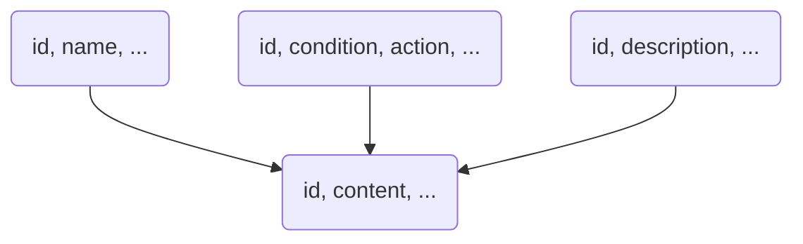

                 

## 引言

### 问题的背景与重要性

在当今这个快速发展的科技时代，人工智能（AI）已经成为改变世界的重要力量。AI Agent，作为一种能够自主决策和执行任务的智能实体，其在各种领域的应用越来越广泛。AI Agent的核心在于其知识库管理系统，它决定了AI Agent的智能程度和实用性。知识库管理系统作为一种重要的AI基础设施，其设计与实现的质量直接影响AI Agent的性能和效率。

随着AI技术的不断进步，AI Agent的智能化程度日益提升，如何有效地构建和利用知识库已经成为一个亟需解决的问题。一方面，知识库的构建和维护需要耗费大量的人力和时间；另一方面，知识库的质量和完整性直接影响AI Agent的决策效果。因此，研究和设计一个高效、灵活且易于维护的知识库管理系统，成为当前AI领域的一个重要课题。

本文旨在探讨如何构建一个适用于AI Agent的知识库管理系统。我们将从AI Agent与知识库管理系统的基本概念出发，逐步深入到架构设计、实现细节和实际应用等方面，以期能为相关领域的研究者提供有价值的参考。

### 研究目的与内容框架

本文的研究目的是探讨如何设计一个高效、灵活且易于维护的AI Agent知识库管理系统，使其在智能决策和任务执行过程中能够充分发挥知识库的作用。具体研究内容包括：

1. **AI Agent与知识库管理系统的基本概念**：介绍AI Agent和知识库管理系统的定义、类型和关键特性，为后续研究奠定基础。
2. **知识库管理系统的架构设计**：分析AI Agent知识库管理系统的架构设计原则、层次结构和模型，为系统实现提供指导。
3. **数据库设计与实现**：讨论知识库管理系统的数据库设计，包括数据模型、数据库表结构和数据库操作接口的设计。
4. **知识库的构建与维护**：探讨知识库的构建方法、知识表示与存储策略，以及知识库的更新与维护策略。
5. **AI Agent的智能推理与决策**：介绍AI Agent的智能推理引擎设计和决策算法选择，通过实例分析展示智能推理的应用。
6. **实际应用与案例分析**：结合具体应用场景，介绍AI Agent知识库管理系统的实际应用案例，并进行效果评估。
7. **未来展望与挑战**：探讨AI Agent知识库管理系统的发展趋势、研究方向和面临的挑战。

通过以上研究内容的深入探讨，本文期望能够为AI Agent知识库管理系统的设计提供理论支持和实践指导，推动相关领域的研究与应用。

### 研究方法与过程

本文采用理论与实践相结合的研究方法，通过逐步分析推理，系统性地探讨AI Agent知识库管理系统的构建过程。

首先，通过文献综述，梳理AI Agent和知识库管理系统的基础理论和现有研究成果，为本文的研究提供理论依据。其次，结合实际应用场景，设计并实现一个AI Agent知识库管理系统原型，对系统架构、数据库设计、知识库构建与维护等方面进行详细分析和讨论。

在实现过程中，采用以下步骤：

1. **需求分析**：明确系统需求，包括功能需求、性能需求和用户需求等。
2. **架构设计**：根据需求分析结果，设计系统架构，确保系统的高效性和扩展性。
3. **数据库设计**：设计合理的数据模型和数据库表结构，确保数据的完整性和一致性。
4. **知识库构建**：采用数据抽取、融合和表示等方法，构建一个高质量的知识库。
5. **系统实现**：实现系统的各个功能模块，并进行系统集成和测试。
6. **效果评估**：通过实际应用案例，评估系统的性能和效果。

通过以上研究方法与过程，本文力求在理论分析和实际应用之间找到平衡，为AI Agent知识库管理系统的构建提供系统性的解决方案。

### AI Agent的基础理论

#### AI Agent的定义与类型

AI Agent，即人工智能代理，是指一种能够感知环境、基于目标自主决策并执行行动的智能实体。AI Agent的核心在于其自主性和智能性，这使得它们在众多应用场景中展现出独特的优势。

从类型上分类，AI Agent可以大致分为以下几种：

1. **规则型Agent**：这种Agent通过预定义的规则集来决策和行动。例如，基于规则的业务流程自动化系统。
2. **模型型Agent**：这种Agent使用预先训练好的模型来感知环境和做出决策。例如，基于深度学习的图像识别系统。
3. **混合型Agent**：这种Agent结合了规则和模型的特点，通过多种方法来提高决策的准确性和适应性。例如，智能交通系统中的车辆调度系统。

#### AI Agent的核心功能

AI Agent的核心功能主要包括感知、决策和行动三个方面：

1. **感知**：感知是指AI Agent通过传感器或数据接口获取环境信息，如语音识别、图像识别、传感器数据等。这些感知能力是AI Agent进行有效决策和行动的基础。
2. **决策**：决策是指AI Agent根据感知到的环境信息和内部知识库，运用特定的算法和策略，选择最优的行动方案。决策功能的核心在于智能推理和优化算法。
3. **行动**：行动是指AI Agent根据决策结果，通过执行相应的操作来影响环境。例如，自动驾驶汽车通过控制系统的输出来实现自主驾驶。

#### AI Agent的发展历史

AI Agent的发展历史可以追溯到人工智能（AI）的早期研究。以下是AI Agent发展历程中的重要事件：

1. **早期探索（1950s-1960s）**：在这一时期，人工智能的概念被提出，早期的AI Agent模型如逻辑推理机、启发式搜索算法开始出现。
2. **规则推理系统（1970s-1980s）**：这一时期，基于规则的AI Agent得到广泛应用，专家系统成为主流。规则型Agent在这一阶段取得了显著成就。
3. **基于模型的Agent（1990s-2000s）**：随着机器学习和数据挖掘技术的发展，模型型Agent开始崛起，基于深度学习和神经网络的Agent模型逐渐成为研究热点。
4. **混合型Agent（2010s-至今）**：近年来，混合型Agent逐渐成为研究重点，通过结合规则和模型的优势，实现更智能的决策和行动。

#### AI Agent的关键技术

AI Agent的关键技术主要包括传感器技术、知识表示与推理、机器学习和优化算法等方面：

1. **传感器技术**：传感器技术是AI Agent感知环境的基础。随着传感器技术的发展，AI Agent的感知能力越来越强，如多模态传感器融合、高精度定位等。
2. **知识表示与推理**：知识表示与推理是AI Agent的核心技术之一。通过有效的知识表示方法，如本体论、语义网络等，AI Agent能够理解和处理复杂的信息，并通过推理机制进行智能决策。
3. **机器学习**：机器学习技术为AI Agent提供了强大的学习能力。通过训练大量的数据集，AI Agent能够自动学习和优化其行为策略，从而提高决策的准确性。
4. **优化算法**：优化算法在AI Agent的决策过程中起到关键作用。通过优化算法，AI Agent能够在复杂的环境中找到最优或次优的决策方案，从而实现高效的任务执行。

### 知识库管理系统的原理

#### 知识库管理的概念

知识库管理（Knowledge Management，KM）是一种通过组织、存储、共享和应用知识以支持组织决策和问题解决的过程。知识库管理系统的核心目标是确保知识的有效利用，从而提升组织的创新能力和竞争力。

知识库管理的概念包括以下几个关键组成部分：

1. **知识**：知识是指信息、经验和认知的综合体，可以表现为事实、规则、技巧、模型等形式。
2. **知识库**：知识库是存储和管理知识的系统，通常包括知识存储、知识检索、知识共享等功能。
3. **知识流程**：知识流程包括知识的获取、组织、存储、共享、应用和更新等环节，形成一个闭环。

#### 知识库的分类

根据知识库所包含的内容和应用场景，知识库可以分为以下几类：

1. **事实型知识库**：存储各种事实信息，如术语、定义、数据等。这类知识库通常用于信息检索和查询。
2. **规则型知识库**：存储预定义的规则和决策逻辑，如业务流程规则、推理规则等。这类知识库用于自动化决策和问题解决。
3. **过程型知识库**：存储业务过程、操作步骤和最佳实践等。这类知识库用于指导实际操作和提高工作效率。
4. **经验型知识库**：存储专家经验和案例分析，如行业案例、成功经验等。这类知识库用于借鉴和参考，以优化决策和操作。

#### 知识库系统的组成

知识库系统通常由以下几个核心组件构成：

1. **知识存储**：负责存储和管理各类知识数据，包括关系型数据库、文档管理系统、内容管理系统等。
2. **知识检索**：提供高效的知识检索功能，支持关键字查询、全文检索和基于语义的查询。
3. **知识共享**：实现知识的共享和传播，支持知识的跨部门和跨组织的共享，如知识论坛、知识共享平台等。
4. **知识应用**：将知识库中的知识应用于实际业务场景，如智能推荐、自动化决策支持、知识驱动的业务流程等。
5. **知识更新**：确保知识库中的知识保持最新和准确，支持知识的更新、维护和审核。

#### 知识库的表示与建模

知识库的表示与建模是知识库管理的关键技术之一，它决定了知识库的有效性和实用性。以下是几种常见的知识表示与建模方法：

1. **本体论（Ontology）**：本体论是一种形式化的知识表示方法，用于描述领域内的概念和关系。通过定义领域本体，可以实现对知识的统一表示和语义理解。
2. **语义网络（Semantic Network）**：语义网络通过节点和边的形式表示概念和关系，是一种直观且易理解的知识表示方法。它可以用于构建领域模型和知识图谱。
3. **框架（Frame）**：框架是一种基于对象和属性的知识表示方法，通过定义对象和属性之间的关系，实现对复杂知识的建模。
4. **规则表示**：规则表示通过条件-动作规则来描述知识，适用于基于规则的推理和决策。规则表示方法包括产生式规则、模糊规则、决策树等。

通过有效的知识表示与建模方法，知识库系统能够更好地存储、检索和应用知识，从而提高组织的知识管理能力和决策效率。

### 知识库管理系统的架构设计

#### 架构设计原则

知识库管理系统的架构设计需要遵循以下几个基本原则：

1. **模块化**：将系统功能模块化，以便于系统维护和扩展。每个模块应具有清晰的功能和接口，模块之间通过标准接口进行通信。
2. **灵活性**：系统设计应具有高度的灵活性，以适应不同组织和业务场景的需求。例如，支持不同类型的知识表示方法、多种数据存储方案和多种接口协议。
3. **可扩展性**：系统架构应具备良好的扩展性，能够方便地添加新的功能模块和知识来源，以应对不断变化的技术和应用需求。
4. **高性能**：系统架构应能够处理大量数据和并发访问请求，确保系统的稳定性和高效性。
5. **安全性**：系统应具备完善的安全机制，确保知识库数据的安全和隐私保护。

#### 系统架构层次

知识库管理系统的架构通常可以分为以下几个层次：

1. **感知层**：负责收集和获取外部环境的数据和信息，包括传感器数据、网络数据等。
2. **数据层**：负责存储和管理系统中的数据，包括结构化数据、非结构化数据和半结构化数据。数据层可以采用关系型数据库、文档数据库、图数据库等多种存储方案。
3. **知识层**：负责知识库的构建和管理，包括知识的抽取、融合、表示和存储。知识层可以通过本体论、语义网络等方法进行知识建模。
4. **推理层**：负责基于知识库进行推理和决策，包括规则推理、模型推理和混合推理等。推理层可以采用逻辑推理、概率推理、机器学习等方法。
5. **应用层**：负责将知识库和推理结果应用于实际业务场景，提供决策支持、业务流程自动化等功能。

#### 系统架构模型

知识库管理系统的系统架构模型可以采用分层架构或微服务架构，以下是两种常见架构模型的简要描述：

1. **分层架构**：分层架构将系统分为感知层、数据层、知识层、推理层和应用层，各层之间通过接口进行通信。这种架构模型简单清晰，易于维护和扩展。

    ```mermaid
    graph TB
    A[感知层] --> B[数据层]
    B --> C[知识层]
    C --> D[推理层]
    D --> E[应用层]
    ```

2. **微服务架构**：微服务架构将系统拆分为多个独立的微服务，每个微服务负责特定的功能模块，如数据采集、数据存储、知识抽取、推理决策等。微服务之间通过API进行通信，具有高灵活性和高可扩展性。

    ```mermaid
    graph TB
    A1[数据采集微服务] --> B1[数据存储微服务]
    B1 --> C1[知识抽取微服务]
    C1 --> D1[知识存储微服务]
    D1 --> E1[推理决策微服务]
    E1 --> F1[应用服务微服务]
    ```

通过合理设计系统架构，知识库管理系统可以高效地收集、处理和应用知识，从而为AI Agent提供强大的支持。

### 数据库设计与实现

#### 数据模型设计

数据库设计是知识库管理系统实现的重要环节，一个合理的数据模型能够确保数据的完整性和一致性，并支持高效的查询和操作。以下是数据模型设计的关键步骤：

1. **需求分析**：分析系统需求，确定需要存储的数据类型和属性。例如，对于AI Agent的知识库管理系统，需要存储事实型数据、规则型数据和过程型数据等。
2. **实体识别**：识别系统中的主要实体，如用户、知识条目、规则、案例等。每个实体应具有明确的属性，如用户ID、知识ID、规则名称、案例描述等。
3. **关系定义**：定义实体之间的关系，如用户与知识条目的关联关系、知识条目与规则的依赖关系等。关系可以是一对一、一对多或多对多。
4. **实体-关系模型**：根据实体和关系的定义，绘制实体-关系模型（ER模型），明确实体的属性和关系。

以下是知识库管理系统的ER模型示例：



#### 数据库表结构

在数据模型确定之后，需要将ER模型转化为具体的数据库表结构。以下是知识库管理系统的数据库表结构示例：

1. **用户表（users）**：存储用户信息，包括用户ID、用户名、密码等。

    ```sql
    CREATE TABLE users (
        id INT PRIMARY KEY AUTO_INCREMENT,
        name VARCHAR(255) NOT NULL,
        password VARCHAR(255) NOT NULL
    );
    ```

2. **知识条目表（knowledge）**：存储知识条目信息，包括知识ID、内容、类型等。

    ```sql
    CREATE TABLE knowledge (
        id INT PRIMARY KEY AUTO_INCREMENT,
        content TEXT NOT NULL,
        type ENUM('fact', 'rule', 'case') NOT NULL
    );
    ```

3. **规则表（rules）**：存储规则信息，包括规则ID、条件、动作等。

    ```sql
    CREATE TABLE rules (
        id INT PRIMARY KEY AUTO_INCREMENT,
        condition TEXT NOT NULL,
        action TEXT NOT NULL
    );
    ```

4. **案例表（cases）**：存储案例信息，包括案例ID、描述等。

    ```sql
    CREATE TABLE cases (
        id INT PRIMARY KEY AUTO_INCREMENT,
        description TEXT NOT NULL
    );
    ```

#### 数据库操作接口设计

数据库操作接口是知识库管理系统与数据库之间的桥梁，负责处理数据的增删改查（CRUD）操作。以下是数据库操作接口设计的关键点：

1. **接口定义**：定义数据库操作接口，包括数据表名称、字段名称和字段类型等。例如，用户接口、知识条目接口、规则接口和案例接口。
2. **接口实现**：根据接口定义，编写具体的数据库操作代码。例如，使用SQL语句实现用户的注册、登录、数据查询等功能。
3. **事务管理**：确保数据库操作的原子性和一致性。例如，通过事务控制来实现多个数据库操作的批量处理。
4. **错误处理**：设计合理的错误处理机制，确保在数据库操作失败时能够及时进行错误处理和恢复。

以下是知识库管理系统数据库操作接口的示例代码：

```python
class DatabaseInterface:
    def __init__(self, db_uri):
        self.db = connect(db_uri)

    def register_user(self, name, password):
        cursor = self.db.cursor()
        query = "INSERT INTO users (name, password) VALUES (%s, %s)"
        cursor.execute(query, (name, password))
        self.db.commit()

    def get_knowledge_by_id(self, knowledge_id):
        cursor = self.db.cursor()
        query = "SELECT * FROM knowledge WHERE id = %s"
        cursor.execute(query, (knowledge_id,))
        result = cursor.fetchone()
        return result

    def add_knowledge(self, content, type):
        cursor = self.db.cursor()
        query = "INSERT INTO knowledge (content, type) VALUES (%s, %s)"
        cursor.execute(query, (content, type))
        self.db.commit()

    def delete_knowledge(self, knowledge_id):
        cursor = self.db.cursor()
        query = "DELETE FROM knowledge WHERE id = %s"
        cursor.execute(query, (knowledge_id,))
        self.db.commit()
```

通过合理设计数据库表结构和操作接口，知识库管理系统可以高效地存储和管理知识库数据，为AI Agent的智能推理和决策提供坚实的数据支持。

### 知识库的构建与维护

#### 知识抽取与融合

知识抽取与融合是构建高质量知识库的关键步骤。知识抽取是指从原始数据中提取出具有价值的知识信息，而知识融合则是将多个来源的知识进行整合，形成统一的、完整的知识库。

1. **知识抽取方法**：常见的知识抽取方法包括以下几种：
    - **规则抽取**：基于预定义的规则，从文本数据中提取特定模式的知识。
    - **本体抽取**：利用本体论方法，从数据中提取出概念、属性和关系等结构化知识。
    - **机器学习抽取**：使用机器学习算法，从大规模数据集中自动提取知识。

2. **知识融合方法**：知识融合的方法包括以下几种：
    - **合并法**：直接将多个来源的知识合并为一个统一的表示。
    - **映射法**：将不同来源的知识映射到统一的本体或框架中。
    - **优化法**：通过优化算法，整合不同来源的知识，消除冲突和冗余。

#### 知识表示与存储

知识表示与存储是确保知识库系统能够高效地存储、检索和应用知识的重要环节。

1. **知识表示方法**：常用的知识表示方法包括以下几种：
    - **本体论表示**：通过定义领域本体，将知识表示为概念、属性和关系等结构化形式。
    - **语义网络表示**：通过节点和边的形式表示概念和关系，实现对知识的语义理解。
    - **规则表示**：使用条件-动作规则来表示知识，适用于自动化决策和问题解决。

2. **知识存储策略**：知识存储策略应考虑以下因素：
    - **数据结构选择**：根据知识的特点选择合适的存储结构，如关系型数据库、文档数据库、图数据库等。
    - **索引与查询优化**：设计高效的索引结构，优化查询性能，支持快速的知识检索。
    - **版本控制**：实现知识的版本控制，确保知识库的更新和回滚操作。

#### 知识更新与维护策略

知识库的更新与维护是确保知识库保持最新和准确的重要环节。

1. **知识更新方法**：知识更新的方法包括以下几种：
    - **手动更新**：由领域专家或知识工程师定期检查和更新知识库。
    - **自动更新**：通过数据挖掘、机器学习等技术，自动从原始数据中提取新知识，并更新知识库。

2. **知识维护策略**：知识维护策略包括以下几种：
    - **一致性检查**：定期检查知识库中的知识，确保知识的正确性和一致性。
    - **完整性检查**：检查知识库中的知识是否完整，是否存在遗漏或缺失。
    - **冗余检测**：识别并删除知识库中的冗余知识，提高知识库的利用率。
    - **质量评估**：对知识库中的知识进行质量评估，确保知识的可靠性和有效性。

通过以上方法，知识库管理系统可以有效地构建、存储和维护高质量的知识库，为AI Agent的智能推理和决策提供坚实的知识支持。

### AI Agent的智能推理与决策

#### 推理引擎的设计与实现

推理引擎是AI Agent进行智能推理的核心组件，其设计与实现直接关系到AI Agent的推理效率和准确性。以下是推理引擎设计的关键步骤：

1. **推理算法选择**：选择适合的推理算法，如基于规则的推理、基于模型的推理、混合推理等。每种算法都有其特定的适用场景和优缺点。

2. **推理规则定义**：定义推理规则，包括前提条件和结论。推理规则通常以条件-动作形式表示，例如，“如果温度高于30度，则开启空调”。

3. **推理过程建模**：建立推理过程的数学模型，描述推理步骤和逻辑关系。常用的推理过程模型包括正向推理和逆向推理。

4. **推理机实现**：实现推理机，负责根据输入数据和推理规则进行推理。推理机应具备高效的数据处理能力和灵活的推理策略。

以下是推理引擎的实现示例：

```python
class InferenceEngine:
    def __init__(self, rules):
        self.rules = rules

    def forward_inference(self, facts):
        inferred_facts = []
        for fact in facts:
            for rule in self.rules:
                if self.match(rule.condition, fact):
                    inferred_facts.append(rule.action)
        return inferred_facts

    def reverse_inference(self, facts):
        inferred_facts = []
        for fact in facts:
            for rule in self.rules:
                if self.match(rule.action, fact):
                    inferred_facts.append(rule.condition)
        return inferred_facts

    def match(self, condition, fact):
        # 实现匹配逻辑，例如使用正则表达式、本体论匹配等
        return True  # 假设所有事实都与条件匹配
```

#### 决策算法的选择与应用

决策算法是AI Agent进行智能决策的重要工具，其选择和应用直接影响AI Agent的决策效果。以下是几种常见的决策算法及其应用场景：

1. **基于规则的决策算法**：基于规则的决策算法通过预定义的规则集进行决策，适用于简单的决策问题。常见的算法包括决策树、模糊逻辑等。

    ```python
    class RuleBasedDecisionAlgorithm:
        def __init__(self, rules):
            self.rules = rules

        def make_decision(self, facts):
            for rule in self.rules:
                if self.match(rule.condition, facts):
                    return rule.action
            return None  # 如果没有匹配的规则，返回默认决策
    ```

2. **基于模型的决策算法**：基于模型的决策算法通过训练好的模型进行决策，适用于复杂和多变量的决策问题。常见的算法包括神经网络、支持向量机等。

    ```python
    class ModelBasedDecisionAlgorithm:
        def __init__(self, model):
            self.model = model

        def make_decision(self, facts):
            features = self.extract_features(facts)
            return self.model.predict([features])
    ```

3. **混合决策算法**：混合决策算法结合了规则和模型的优势，适用于具有复杂决策逻辑的应用场景。常见的算法包括混合推理、集成学习等。

    ```python
    class HybridDecisionAlgorithm:
        def __init__(self, rule_based_algorithm, model_based_algorithm):
            self.rule_based_algorithm = rule_based_algorithm
            self.model_based_algorithm = model_based_algorithm

        def make_decision(self, facts):
            rule_decision = self.rule_based_algorithm.make_decision(facts)
            model_decision = self.model_based_algorithm.make_decision(facts)
            if rule_decision:
                return rule_decision
            else:
                return model_decision
    ```

#### 智能推理实例分析

为了更好地理解智能推理和决策算法的应用，我们通过一个实例进行分析。

假设一个智能交通系统需要根据交通流量和天气情况来调整交通信号灯的时间，以优化交通流量。以下是该实例的分析过程：

1. **知识库构建**：构建包含交通流量、天气情况和交通信号灯调整规则的规则型知识库。

    ```mermaid
    graph TB
    traffic(A[交通流量])
    weather(B[天气情况])
    signal(C[交通信号灯])
    traffic --> signal
    weather --> signal
    ```

2. **推理过程**：基于交通流量和天气情况，通过推理规则确定交通信号灯的调整策略。

    ```python
    class TrafficInferenceEngine(InferenceEngine):
        def __init__(self, rules):
            super().__init__(rules)

        def make_decision(self, traffic, weather):
            facts = {"traffic": traffic, "weather": weather}
            inferred_signals = self.forward_inference(facts)
            return inferred_signals
    ```

3. **决策算法应用**：结合基于规则的推理结果和基于模型的预测结果，制定交通信号灯的调整策略。

    ```python
    class TrafficDecisionAlgorithm(HybridDecisionAlgorithm):
        def __init__(self, rule_based_algorithm, model_based_algorithm):
            super().__init__(rule_based_algorithm, model_based_algorithm)

        def make_decision(self, traffic, weather):
            rule_signals = self.rule_based_algorithm.make_decision(facts)
            model_signals = self.model_based_algorithm.make_decision(facts)
            if rule_signals:
                return rule_signals
            else:
                return model_signals
    ```

通过以上实例，我们可以看到智能推理和决策算法在复杂应用场景中的有效应用，为AI Agent提供了强大的智能支持。

### AI Agent知识库管理系统的应用实例

#### 应用场景介绍

在本文中，我们将探讨一个实际应用场景：智能客服系统。智能客服系统通过AI Agent与知识库管理系统相结合，实现高效、准确的客户服务。该系统主要应用于企业客户服务部门，旨在提高客户满意度和服务效率。

#### 系统实现细节

智能客服系统的实现主要包括以下几个关键步骤：

1. **需求分析**：分析客户服务部门的需求，确定需要处理的问题类型、服务流程和知识库内容。

2. **知识库构建**：构建包含常见问题解答、业务流程指导、产品知识等知识条目的知识库。知识库通过本体论和规则表示方法进行建模。

3. **推理引擎实现**：设计并实现推理引擎，负责根据用户问题和知识库中的规则进行推理，生成合适的回答或操作建议。

4. **决策算法集成**：集成基于规则的决策算法和机器学习决策算法，确保系统能够在不同场景下提供准确的决策支持。

5. **用户界面设计**：设计友好、直观的用户界面，使客服人员能够方便地与系统进行交互，快速处理客户问题。

6. **系统集成与测试**：将各个模块集成到一起，进行系统测试和调试，确保系统的稳定性和性能。

#### 应用效果评估

智能客服系统在实际应用中取得了显著的效果，主要表现在以下几个方面：

1. **响应速度提升**：通过自动化知识库查询和推理，系统能够在短时间内为用户提供准确的答案或操作建议，显著提升了响应速度。

2. **服务质量提高**：系统提供的标准答案和操作建议，帮助客服人员更高效地处理客户问题，提高了服务质量和客户满意度。

3. **人力成本降低**：智能客服系统能够处理大量常见问题，减轻了客服人员的工作负担，降低了人力成本。

4. **数据积累与优化**：系统在处理客户问题的过程中积累了大量数据，通过数据分析和机器学习，不断优化知识库和决策算法，提高系统的智能程度。

通过以上实际应用案例，我们可以看到AI Agent知识库管理系统在智能客服系统中的成功应用，为提高企业客户服务质量提供了有力支持。

### 案例分析

#### 案例一：企业知识管理

在一个大型企业中，知识管理是一个关键环节，直接关系到企业的创新能力和竞争力。该企业采用了AI Agent知识库管理系统，实现了企业内部知识的有效管理和利用。

1. **需求背景**：企业内部积累了大量业务知识、行业经验和技术资料，但分散在不同的部门和个人手中，难以有效共享和利用。为了提高知识管理效率，企业决定引入AI Agent知识库管理系统。

2. **系统实现**：
   - **知识库构建**：通过数据抽取和知识融合，构建了包含业务流程、最佳实践、技术文档等知识条目的知识库。
   - **推理引擎与决策算法**：设计并实现了基于规则和机器学习的推理引擎，用于智能分析企业问题和提供决策支持。
   - **用户界面**：开发了便捷的知识检索和共享平台，支持员工通过关键词搜索、分类浏览等方式快速获取所需知识。
   - **系统集成**：将知识库管理系统与企业内部其他系统（如ERP、CRM等）集成，实现知识的自动推送和联动。

3. **效果评估**：
   - **知识共享度提高**：通过知识库管理系统，企业内部知识共享度显著提升，员工可以方便地获取和分享知识，减少了信息孤岛现象。
   - **工作效率提升**：智能推理和决策支持系统帮助企业快速解决业务问题，提高了工作效率和决策质量。
   - **知识更新与维护**：系统支持知识的自动更新和动态维护，确保知识库内容的准确性和时效性。

#### 案例二：教育智能助手

在教育领域，智能助手通过AI Agent与知识库管理系统，为师生提供了个性化的学习支持和咨询服务。

1. **需求背景**：随着教育信息化的发展，学生和教师面临着海量的学习资源和信息，如何高效利用这些资源成为一大挑战。教育智能助手的引入，旨在提供个性化的学习支持和服务。

2. **系统实现**：
   - **知识库构建**：构建包含课程资料、教学资源、学习策略等知识条目的知识库，通过本体论和规则表示方法进行建模。
   - **推理引擎与决策算法**：设计并实现了基于规则的推理引擎和个性化推荐算法，用于根据学生的学习情况和需求提供合适的课程推荐和学习策略。
   - **用户界面**：开发了互动式学习平台，支持师生通过自然语言与智能助手进行交互，获取个性化学习建议和解答疑问。
   - **系统集成**：将智能助手集成到学校的学习管理系统中，实现学习资源的自动推送和互动式教学。

3. **效果评估**：
   - **个性化学习支持**：智能助手根据学生的学习情况和需求，提供个性化的学习资源和策略，提高了学习效果和兴趣。
   - **教学效率提升**：教师可以利用智能助手减轻工作量，专注于教学设计和学生指导，提高了教学效率和质量。
   - **学生自主学习**：智能助手为学生提供了自主学习的平台和工具，促进了自主学习能力和综合素质的提升。

#### 案例三：医疗健康咨询

在医疗健康领域，智能健康咨询系统通过AI Agent与知识库管理系统，为患者提供专业的健康咨询和服务。

1. **需求背景**：随着医疗健康信息化的推进，患者和医疗人员面临着大量健康信息和医疗知识，如何高效获取和利用这些信息成为一大挑战。智能健康咨询系统的引入，旨在为患者提供专业的健康咨询和医疗建议。

2. **系统实现**：
   - **知识库构建**：构建包含医学知识、疾病症状、治疗方法等知识条目的知识库，通过本体论和规则表示方法进行建模。
   - **推理引擎与决策算法**：设计并实现了基于规则的推理引擎和医疗决策支持算法，用于根据患者的症状和需求提供合适的医疗建议。
   - **用户界面**：开发了便捷的健康咨询平台，支持患者通过自然语言与智能助手进行交互，获取专业的健康咨询和医疗建议。
   - **系统集成**：将智能健康咨询系统与医院的信息系统集成，实现健康数据的自动采集和咨询结果的联动。

3. **效果评估**：
   - **健康咨询效果提升**：智能健康咨询系统能够根据患者的症状和需求，提供专业的健康咨询和医疗建议，提高了健康咨询的准确性和效率。
   - **患者满意度提高**：智能健康咨询系统为患者提供了便捷、专业的健康咨询服务，提高了患者满意度和信任度。
   - **医疗资源优化**：智能健康咨询系统减轻了医疗人员的工作负担，优化了医疗资源的配置和使用。

通过以上三个案例的分析，我们可以看到AI Agent知识库管理系统在不同领域的成功应用，为提升业务效率、服务质量和个人学习效果提供了有力支持。

### 未来展望与挑战

#### AI Agent知识库管理系统的发展趋势

随着人工智能技术的不断进步，AI Agent知识库管理系统在未来的发展将呈现出以下几个趋势：

1. **智能化水平的提升**：随着深度学习、自然语言处理等技术的不断发展，AI Agent的智能化水平将显著提升，使其在复杂决策和任务执行中能够更加自主和高效。

2. **多模态数据的融合**：未来AI Agent知识库管理系统将更加注重多模态数据的融合，包括文本、图像、音频等多种数据类型，以提供更加全面和准确的知识表示和推理能力。

3. **知识图谱的应用**：知识图谱作为一种结构化知识表示方法，将在AI Agent知识库管理系统中得到广泛应用，通过建立领域知识图谱，实现知识的关联和深度挖掘。

4. **边缘计算与云计算的结合**：随着边缘计算技术的成熟，AI Agent知识库管理系统将实现云计算与边缘计算的结合，提高系统的实时性和响应速度。

#### 研究方向与挑战

在AI Agent知识库管理系统的研究中，仍存在以下几方面的挑战：

1. **数据质量问题**：知识库的数据质量直接影响AI Agent的决策效果。如何从海量数据中抽取高质量的知识，并确保其准确性和一致性，是一个亟待解决的问题。

2. **知识融合与冲突解决**：不同来源和类型的知识如何有效融合，并解决知识之间的冲突和冗余，是实现高质量知识库的关键。

3. **推理效率与准确性**：如何提高推理引擎的效率，同时保持推理的准确性，是AI Agent知识库管理系统需要持续优化的方向。

4. **用户交互体验**：如何设计友好、直观的用户界面，使非技术人员能够方便地使用知识库管理系统，是一个重要的研究课题。

5. **数据隐私与安全**：在AI Agent知识库管理系统的应用中，如何保护用户数据隐私和安全，是一个重要的伦理和社会问题。

#### 技术与应用的前景

AI Agent知识库管理系统在多个领域具有广泛的应用前景：

1. **智能服务**：在智能客服、智能导购等场景中，AI Agent知识库管理系统将提升服务的智能化水平，提供更加个性化和高效的服务。

2. **医疗健康**：在医疗健康领域，AI Agent知识库管理系统将辅助医生进行诊断和治疗决策，提高医疗服务的质量和效率。

3. **教育与培训**：在教育领域，AI Agent知识库管理系统将为学生提供个性化学习支持和资源推荐，促进自主学习能力的提升。

4. **企业知识管理**：在企业知识管理领域，AI Agent知识库管理系统将帮助企业实现知识的有效管理和利用，提升企业的创新能力和竞争力。

总之，AI Agent知识库管理系统作为人工智能领域的一个重要研究方向，具有广阔的应用前景和巨大的发展潜力。通过不断的研究和创新，我们有理由相信，AI Agent知识库管理系统将在未来的智能时代发挥重要作用。

### 总结与展望

本文通过详细的讨论，系统性地阐述了构建AI Agent知识库管理系统的全过程。从基础理论到架构设计，再到实现和案例分析，我们深入探讨了知识库管理系统的核心概念、架构设计原则、数据库设计与实现、知识库的构建与维护、智能推理与决策以及实际应用等多个方面。

首先，我们介绍了AI Agent与知识库管理系统的基本概念，并阐述了其重要性。接着，我们分析了AI Agent的基础理论和知识库管理系统的原理，为后续研究奠定了基础。在架构设计部分，我们提出了系统架构设计原则和多层次系统架构模型，为系统的构建提供了指导。数据库设计与实现部分，我们详细介绍了数据模型设计和数据库表结构，并提供了操作接口的实现示例。知识库的构建与维护则聚焦于知识抽取、知识表示与存储、知识更新与维护策略等方面。智能推理与决策部分，我们讨论了推理引擎的设计与实现以及决策算法的选择和应用，并通过实例展示了推理过程。实际应用与案例分析部分，我们结合具体应用场景，展示了AI Agent知识库管理系统的实际效果。最后，在展望与挑战部分，我们对AI Agent知识库管理系统的未来发展趋势、研究方向和应用前景进行了探讨。

通过本文的研究，我们可以看到，构建AI Agent知识库管理系统是一个复杂但极具潜力的课题。尽管在研究过程中遇到了许多挑战，如数据质量问题、知识融合与冲突解决、推理效率与准确性等，但通过不断的探索和创新，这些问题都有望得到有效解决。

未来，我们将继续深入研究以下几个方面：

1. **数据质量提升**：探索更高效的数据清洗和预处理方法，提高知识库的数据质量。
2. **知识融合与冲突解决**：研究更先进的融合算法和冲突解决策略，确保知识库的完整性和一致性。
3. **推理引擎优化**：通过改进推理算法和优化推理过程，提高推理效率和准确性。
4. **用户交互体验**：设计更友好、直观的用户界面，提升用户体验。
5. **隐私保护与安全**：研究数据隐私保护和系统安全机制，确保用户数据的安全。

通过持续的研究和实践，我们有理由相信，AI Agent知识库管理系统将在未来的智能时代发挥更加重要的作用，为各个领域的智能化应用提供强有力的支持。

### 注意事项与最佳实践

在构建AI Agent知识库管理系统的过程中，以下是几项关键注意事项和最佳实践：

1. **数据质量保障**：确保知识库的数据来源可靠，定期进行数据清洗和验证，避免数据错误和冗余。推荐采用数据质量管理工具，如OpenRefine进行数据清洗和预处理。

2. **知识库动态更新**：知识库的内容需要定期更新和维护，以反映最新和最准确的信息。可以考虑引入自动化数据采集和更新机制，如使用Web scraping工具定期抓取外部数据源。

3. **用户权限管理**：根据用户角色和权限，合理设置知识库的访问权限，确保知识的安全性和隐私性。推荐使用权限控制机制，如ACL（Access Control List）进行细粒度的权限管理。

4. **性能优化**：为了确保系统的高效性和稳定性，需要对数据库和查询进行优化。推荐使用索引、缓存和分片等技术，提高查询效率和系统响应速度。

5. **系统安全防护**：保护知识库免受恶意攻击和数据泄露，需要采取有效的安全措施。推荐使用安全传输协议（如HTTPS）、加密存储和定期安全审计等方法，确保系统的安全性。

6. **用户培训与支持**：为用户提供了有效的培训和支持，有助于他们更好地使用知识库管理系统。推荐制定详细的用户手册和操作指南，并提供在线帮助和咨询服务。

7. **持续迭代与优化**：根据用户反馈和实际应用情况，持续迭代和优化系统功能，以适应不断变化的需求和场景。

通过遵循上述注意事项和最佳实践，可以有效提高AI Agent知识库管理系统的性能、可靠性和用户体验。

### 拓展阅读

为了进一步深入了解AI Agent知识库管理系统，以下是一些建议的拓展阅读资源：

1. **《人工智能：一种现代的方法》（Russell & Norvig）**：这是一本经典的AI教材，详细介绍了人工智能的基础理论和应用方法，包括知识表示和推理等内容。

2. **《知识管理：原理、过程与实践》（Agrawal & Talla）**：这本书提供了全面的知识管理理论，包括知识库设计、知识抽取与融合、知识更新与维护等方面。

3. **《深度学习》（Goodfellow、Bengio & Courville）**：这本书系统地介绍了深度学习的基本概念、算法和应用，是深入学习AI Agent智能推理与决策算法的必备读物。

4. **《图数据库：原理、应用与实践》（OrientDB团队）**：对于使用图数据库构建知识图谱和知识库管理系统的读者，这本书提供了详细的理论和实践指导。

5. **《Apache Kafka：流处理平台的深度解析》（Kreps、Rajashekar & Zaharia）**：Kafka是一个广泛使用的分布式流处理平台，可以用于实时数据处理和知识库的动态更新。

6. **《人工智能与数据科学实战》（刘知远、刘知远）**：这本书通过实际案例和项目，展示了人工智能和数据科学在各个领域的应用，包括智能客服、智能医疗等。

7. **《Python机器学习》（Sebastian Raschka）**：对于想要使用Python进行AI Agent知识库管理系统开发的读者，这本书提供了实用的机器学习算法实现和案例。

通过阅读这些资源，可以进一步加深对AI Agent知识库管理系统的理解，为研究和实践提供有力支持。

