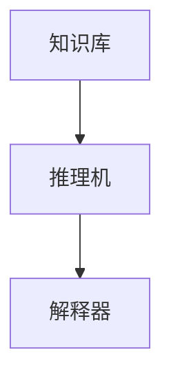
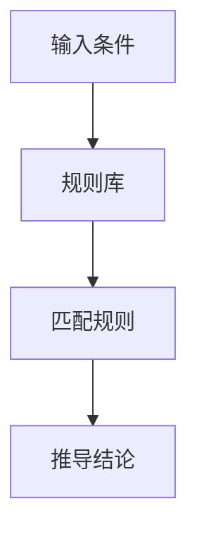
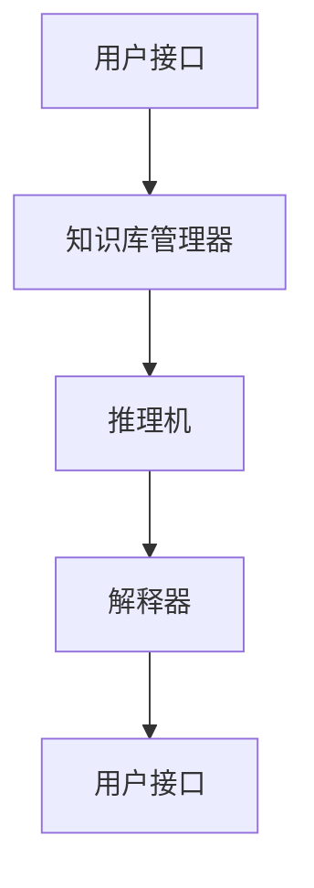
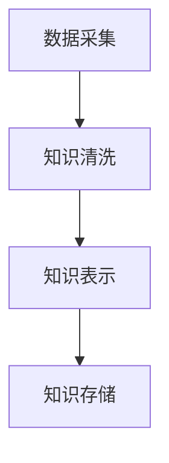
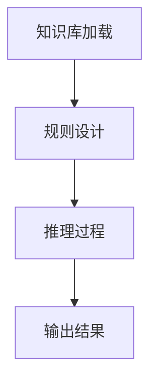
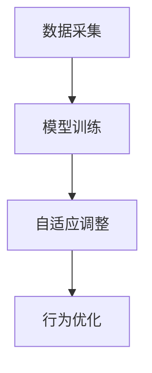

                 

# 引言

## 1.1 书籍背景与目的

在当今快速发展的技术时代，人工智能（AI）已经成为推动社会进步的重要力量。随着AI技术的不断成熟，AI Agent——一种具有自主推理和学习能力的智能体，正逐渐成为各行各业的关键应用。为了更好地理解和应用AI Agent，我们编写了这本《构建AI Agent的知识推理链可视化工具》。

本书旨在为开发者和技术爱好者提供一套系统、全面的指南，帮助读者了解和构建AI Agent所需的知识推理链及其可视化工具。我们将从基础知识出发，逐步深入，介绍知识推理链的定义、应用、优势与挑战，以及如何使用可视化工具来增强理解和分析能力。

## 1.2 人工智能与知识推理链

人工智能是计算机科学的一个分支，致力于使机器能够执行通常需要人类智能才能完成的任务。AI Agent是人工智能的一个典型应用，它能够自主学习、推理和执行任务。知识推理链是AI Agent的核心组成部分，负责将知识表示、推理算法和决策过程有机结合，从而实现智能推理。

知识推理链在AI中的应用主要体现在以下几个方面：

1. **问题解决**：通过推理，AI Agent能够发现问题和解决方案之间的联系，从而解决复杂问题。
2. **知识管理**：知识推理链帮助AI Agent从大量数据中提取关键信息，进行知识管理和利用。
3. **决策支持**：基于知识推理，AI Agent能够提供决策支持，辅助人类做出更加合理的决策。

## 1.3 可视化工具的重要性

可视化工具在理解和分析复杂系统中扮演着重要角色。在构建AI Agent的知识推理链时，可视化工具可以帮助我们：

1. **直观理解**：通过图形化的方式展示知识推理链的结构和过程，使复杂概念变得易于理解。
2. **问题定位**：可视化工具能够快速定位问题发生的环节，便于调试和优化。
3. **协作沟通**：可视化工具能够帮助团队成员更好地协作和沟通，提高工作效率。

接下来，我们将深入探讨知识推理链的基础知识，包括核心概念、联系、算法原理，以及如何使用Mermaid流程图进行展示。我们将一步步分析，确保读者能够清晰地理解每一个概念和步骤。

## 第一部分：知识推理链基础

### 1. 知识推理链概述

#### 1.1 知识推理链的定义

知识推理链（Knowledge Reasoning Chain）是一种将知识表示、推理算法和决策过程有机结合的框架，用于支持人工智能系统进行智能推理。知识推理链通常包括以下几个基本组成部分：

1. **知识表示**：将现实世界的知识以结构化的形式存储在知识库中，为推理提供基础。
2. **推理算法**：根据知识库中的知识，使用推理算法推导出新的结论。
3. **决策过程**：基于推理结果，做出相应的决策。

#### 1.2 知识推理链在人工智能中的应用

知识推理链在人工智能中的应用非常广泛，以下是一些典型的应用场景：

1. **智能问答系统**：通过知识推理链，系统可以回答用户关于特定领域的问题。
2. **智能诊断系统**：在医疗领域，知识推理链可以帮助医生进行疾病诊断。
3. **智能推荐系统**：在电子商务领域，知识推理链可以帮助系统进行个性化推荐。

#### 1.3 知识推理链的优势与挑战

知识推理链的优势包括：

1. **自动化推理**：能够自动推导出结论，减少人工干预。
2. **知识复用**：通过知识库的建立，可以实现知识的复用和共享。

然而，知识推理链也面临一些挑战：

1. **知识表示**：如何有效地表示复杂领域的知识是一个难题。
2. **推理效率**：随着知识库的增大，推理效率会受到影响。

#### 1.4 知识推理链的组成

知识推理链主要由以下三个部分组成：

1. **知识库**：存储领域知识和事实。
2. **推理机**：负责根据知识库中的知识进行推理。
3. **解释器**：用于解释推理结果，提供决策支持。

下面使用Mermaid流程图展示知识推理链的基本结构：



### 2. 核心概念与联系

#### 2.1 知识表示

知识表示是知识推理链的基础，它涉及到如何将现实世界的知识以计算机可以理解的形式进行存储。常用的知识表示方法包括：

1. **命题表示**：使用命题逻辑表示知识，如“所有猫都会叫”。
2. **谓词逻辑表示**：使用谓词逻辑表示复杂的知识，如“如果今天下雨，那么我带伞”。
3. **框架表示**：使用框架表示结构化的知识，如“医生负责诊断和治疗疾病”。

下面是知识表示的对比表格：

| 知识表示方法 | 优点 | 缺点 |
| --- | --- | --- |
| 命题表示 | 简单直观 | 只能表示简单的知识 |
| 谓词逻辑表示 | 能表示更复杂的知识 | 表示复杂时容易产生大量计算 |
| 框架表示 | 适用于结构化知识 | 表示复杂时较为繁琐 |

下面使用Mermaid ER实体关系图展示知识表示的架构：

```mermaid
erDiagram
    Class_Knowledge ||--|{ Fact : 包含事实 }|
    Class_Knowledge ||--|{ Rule : 包含规则 }|
    Class_Knowledge ||--|{ Concept : 包含概念 }|
```

#### 2.2 推理算法

推理算法是知识推理链的核心，负责根据知识库中的知识进行推导。常见的推理算法包括：

1. **基于规则的推理**：使用规则进行推理，如“如果A且B，则C”。
2. **基于模型的推理**：使用模型进行推理，如神经网络模型。
3. **基于案例的推理**：使用案例进行推理，如基于历史案例进行决策。

下面是推理算法的对比表格：

| 推理算法 | 优点 | 缺点 |
| --- | --- | --- |
| 基于规则的推理 | 简单直观 | 难以处理复杂关系 |
| 基于模型的推理 | 鲁棒性强 | 需要大量训练数据 |
| 基于案例的推理 | 易于理解 | 需要大量历史数据 |

下面使用Mermaid流程图展示基于规则的推理算法：



#### 2.3 知识推理链的组成

知识推理链由多个组件构成，它们协同工作以实现智能推理。主要组件包括：

1. **知识库管理器**：负责知识库的创建、更新和维护。
2. **推理机**：负责根据知识库进行推理。
3. **解释器**：负责解释推理结果，为用户提供决策支持。
4. **用户接口**：负责与用户交互，接收用户输入和反馈。

下面使用Mermaid流程图展示知识推理链的组成：



#### 2.4 Mermaid流程图与ER实体关系图展示

为了更好地理解知识推理链，我们使用Mermaid工具绘制了流程图和ER实体关系图。

**知识表示架构（ER实体关系图）**：

```mermaid
erDiagram
    Class_Knowledge ||--|{ Fact : 包含事实 }|
    Class_Knowledge ||--|{ Rule : 包含规则 }|
    Class_Knowledge ||--|{ Concept : 包含概念 }|
```

**推理算法流程（Mermaid流程图）**：


**知识推理链组成（Mermaid流程图）**：


通过上述展示，我们可以清晰地看到知识推理链的基本结构和核心概念。接下来，我们将进一步探讨AI Agent的构建，以及如何实现知识推理链的可视化。

## 第二部分：AI Agent的构建

### 1. AI Agent概述

#### 1.1 AI Agent的定义

AI Agent，即人工智能代理，是一种具有自主推理和学习能力的智能体。它能够模拟人类智能，在特定环境中进行感知、决策和行动。AI Agent的基本定义如下：

AI Agent = 感知 + 决策 + 行动

其中，感知是指AI Agent接收外部环境的信息；决策是指AI Agent根据感知到的信息，选择合适的行动；行动是指AI Agent对外部环境进行操作。

#### 1.2 AI Agent的结构与功能

AI Agent通常由以下几个关键部分组成：

1. **感知模块**：负责接收外部环境的信息，如文本、图像、声音等。
2. **决策模块**：负责基于感知模块获取的信息，进行推理和决策。
3. **行动模块**：负责根据决策模块的决策结果，执行相应的行动。

AI Agent的功能包括：

1. **自主推理**：AI Agent能够根据环境信息和已有知识进行推理，生成新的结论。
2. **学习与适应**：AI Agent能够从经验中学习，不断优化自身的行为。
3. **交互能力**：AI Agent能够与用户或其他系统进行交互，提供决策支持。

#### 1.3 AI Agent的分类

根据应用场景和功能特点，AI Agent可以分为以下几类：

1. **对话型AI Agent**：主要应用于人机对话场景，如智能客服、智能助手等。
2. **决策支持型AI Agent**：主要用于复杂决策场景，如金融风控、医疗诊断等。
3. **自动化执行型AI Agent**：主要用于自动化执行任务，如自动驾驶、智能家居等。
4. **知识推理型AI Agent**：主要用于知识管理和推理，如智能推荐系统、智能问答系统等。

#### 1.4 Mermaid实体关系图展示

为了更好地理解AI Agent的构成和分类，我们使用Mermaid工具绘制了实体关系图。

**AI Agent实体关系图**：

```mermaid
erDiagram
    Class_AI_Agent ||--|{ Perception : 感知模块 }|
    Class_AI_Agent ||--|{ Decision : 决策模块 }|
    Class_AI_Agent ||--|{ Action : 行动模块 }|
```

### 2. AI Agent的核心技术

#### 2.1 知识库构建

知识库是AI Agent的基础，用于存储领域知识和事实。构建知识库的关键步骤包括：

1. **知识获取**：通过数据采集、网络爬虫等技术获取领域知识。
2. **知识清洗**：对获取的知识进行清洗和预处理，去除噪声和冗余信息。
3. **知识表示**：使用命题表示、谓词表示等方法，将知识转化为计算机可以处理的形式。
4. **知识存储**：将处理后的知识存储在数据库或知识库系统中。

下面是知识库构建的Python代码示例：

```python
import pandas as pd

# 读取数据
data = pd.read_csv('knowledge_data.csv')

# 数据清洗
data = data.dropna()

# 知识表示
knowledge = data.set_index('entity').T.to_dict()

# 知识存储
import json
with open('knowledge.json', 'w') as f:
    json.dump(knowledge, f)
```

#### 2.2 推理引擎设计

推理引擎是AI Agent的核心，用于根据知识库中的知识进行推理。设计推理引擎的关键步骤包括：

1. **推理算法选择**：选择合适的推理算法，如基于规则的推理、基于模型的推理等。
2. **推理流程设计**：设计推理流程，包括输入处理、知识匹配、推理过程、输出结果等。
3. **推理优化**：针对具体应用场景，对推理过程进行优化，提高推理效率。

下面是推理引擎设计的Python代码示例：

```python
from rule_engine import RuleEngine

# 加载知识库
knowledge = json.load(open('knowledge.json'))

# 设计规则
rules = [
    {
        'condition': 'age > 18',
        'action': '成年'
    },
    {
        'condition': 'age < 18',
        'action': '未成年'
    }
]

# 创建推理引擎
engine = RuleEngine(knowledge, rules)

# 进行推理
result = engine.execute('age = 20')

# 输出结果
print(result)
```

#### 2.3 学习与适应能力

学习与适应能力是AI Agent的重要特征，使其能够从经验中学习，不断优化自身行为。实现学习与适应能力的关键步骤包括：

1. **数据采集**：从外部环境中采集数据，用于训练和优化AI Agent。
2. **模型训练**：使用采集到的数据对AI Agent进行训练，优化其推理能力和决策能力。
3. **自适应调整**：根据环境变化，自适应调整AI Agent的行为和策略。

下面是学习与适应能力的Python代码示例：

```python
from sklearn.neural_network import MLPRegressor

# 加载数据
X = pd.read_csv('training_data.csv').values[:, :-1]
y = pd.read_csv('training_data.csv').values[:, -1]

# 创建模型
model = MLPRegressor(hidden_layer_sizes=(100,), max_iter=1000)

# 训练模型
model.fit(X, y)

# 预测
X_new = pd.read_csv('test_data.csv').values
y_pred = model.predict(X_new)

# 输出预测结果
print(y_pred)
```

#### 2.4 Mermaid流程图与Python代码示例

为了更好地展示AI Agent的核心技术，我们使用Mermaid工具绘制了流程图，并结合Python代码进行了实现。

**知识库构建流程（Mermaid流程图）**：



**推理引擎设计流程（Mermaid流程图）**：



**学习与适应能力流程（Mermaid流程图）**：



通过上述流程图和代码示例，我们可以清晰地理解AI Agent的核心技术和实现方法。接下来，我们将探讨如何实现知识推理链的可视化。

## 第三部分：知识推理链可视化工具

### 1. 可视化工具的重要性

可视化工具在知识推理链的构建和解释过程中扮演着至关重要的角色。它们能够将复杂的知识和推理过程以图形化的方式呈现，使得开发者、分析师和用户能够更直观地理解系统的运作原理。以下是一些可视化工具的重要性：

1. **直观理解**：通过图形化的表示，复杂的概念和流程变得易于理解，有助于知识的传播和应用。
2. **问题定位**：可视化工具能够快速展示系统的各个部分和流程，有助于定位问题和优化系统。
3. **协作沟通**：可视化工具可以帮助团队成员更好地协作和沟通，提高工作效率和项目的成功概率。
4. **决策支持**：可视化工具能够提供直观的决策支持，帮助用户更好地理解数据和推理结果，从而做出更明智的决策。

### 2. 可视化工具的分类

根据用途和特点，可视化工具可以分为以下几类：

1. **流程图工具**：用于展示系统的流程和步骤，如Mermaid、D3.js等。
2. **类图和架构图工具**：用于展示系统的类和架构，如Eclipse Mat

