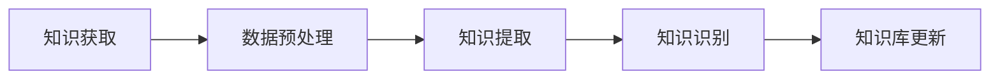
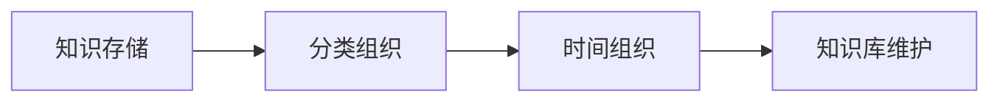
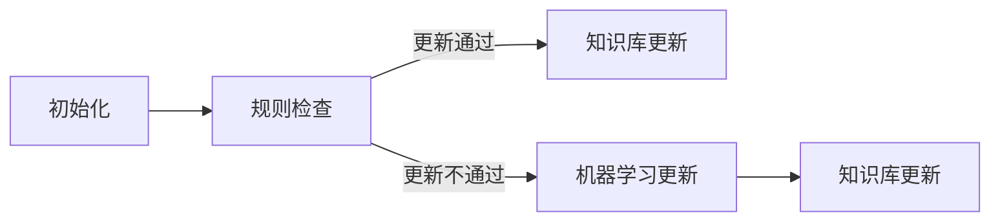

                 

### 《构建AI Agent的知识更新机制：保持信息时效性》

---

**关键词：AI Agent、知识更新机制、信息时效性、数学模型、Python实现**

**摘要：本文旨在探讨AI Agent知识更新机制的设计与实现，通过详细的理论分析和实践案例，阐述如何保持AI Agent知识的时效性，从而提升其智能性能和实用性。**

---

### 引言与背景

随着人工智能技术的飞速发展，AI Agent（智能代理）在各种应用场景中得到了广泛的应用。从智能客服到智能推荐系统，AI Agent以其高效和智能的特性，极大地提升了用户的使用体验。然而，在AI Agent的应用过程中，知识时效性问题逐渐显现出来，成为制约其性能和实用性的关键因素。

**核心概念术语说明：**
- **AI Agent（智能代理）：** 指一种基于人工智能技术，能够自主完成特定任务的计算机程序或系统。
- **知识更新机制：** 指用于维护AI Agent知识库中信息时效性的机制，确保知识的准确性和适用性。

**问题背景：**
AI Agent在处理任务时，依赖于其知识库中的信息。然而，由于信息来源的多样性和时效性的差异，知识库中的信息会随着时间的推移而变得不准确或过时。这种知识时效性问题，会导致AI Agent的响应能力下降，甚至出现错误。

**问题描述：**
为了解决知识时效性问题，我们需要设计一套有效的知识更新机制。该机制需要能够及时识别和更新知识库中的过时信息，确保AI Agent始终能够获取到最新、最准确的信息。

**问题解决：**
知识更新机制的设计与实现，需要综合考虑以下几个方面：
- **知识获取与识别：** 确定知识来源和获取方式，对获取到的知识进行识别和分类。
- **知识存储与组织：** 设计知识库的结构，确保知识能够高效地存储和组织。
- **知识更新策略与算法：** 确定知识更新的规则和算法，实现知识的实时更新。
- **边界与外延：** 明确知识更新的范围和限制，确保更新机制的可操作性和稳定性。

**概念结构与核心要素组成：**
- **知识获取：** 数据采集、数据预处理、知识提取。
- **知识存储：** 数据库设计、索引结构、数据安全。
- **知识更新：** 更新规则、更新算法、实时性保障。
- **知识应用：** 知识库接口、知识应用场景、用户体验优化。

### 研究现状与挑战

知识更新机制是AI Agent的重要组成部分，然而当前的研究和实践仍然面临着许多挑战。

**发展历程：**
- **早期研究：** 主要关注知识库的构建和维护，忽视了知识的时效性。
- **中期研究：** 开始引入实时更新机制，但更新策略较为简单，难以应对复杂的应用场景。
- **近期研究：** 出现了基于机器学习、深度学习等技术的更新算法，但仍存在一定的局限性。

**局限性：**
- **更新策略简单：** 当前大多数更新策略基于固定的时间间隔或触发条件，无法灵活应对动态变化的环境。
- **实时性不足：** 知识更新的实时性难以保证，特别是在高负载场景下。
- **准确性问题：** 更新过程中可能出现信息丢失、冗余或错误，影响AI Agent的性能。

**面临的主要挑战：**
- **数据多样性：** 知识来源多样，需要设计能够适应不同数据类型的更新机制。
- **实时性要求：** 知识更新需要实时进行，以应对快速变化的环境。
- **计算资源：** 实时更新机制对计算资源的要求较高，特别是在大规模知识库的情况下。

### 知识更新机制的理论基础

要设计一个有效的知识更新机制，我们需要从理论基础入手，理解核心概念和原理。

#### 核心概念与原理

**知识更新的定义：**
知识更新是指通过识别、提取和整合新知识，对知识库进行实时更新和维护的过程。

**知识更新的分类：**
- **按时间分类：** 定期更新、实时更新。
- **按方式分类：** 手动更新、自动更新。
- **按应用场景分类：** 离线更新、在线更新。

**知识更新的属性特征对比表格：**

| 属性特征 | 定期更新 | 实时更新 |
| --- | --- | --- |
| 更新频率 | 低 | 高 |
| 实时性 | 较低 | 较高 |
| 灵活性 | 较低 | 较高 |
| 成本 | 较低 | 较高 |
| 适用场景 | 静态环境 | 动态环境 |

#### 知识更新的数学模型与公式

知识更新的数学模型是构建知识更新机制的核心。以下是一个简单的知识更新模型：

$$
U(t) = f(K(t-1), K_{new})
$$

其中，$U(t)$ 表示在时间 $t$ 的知识更新结果，$K(t-1)$ 表示时间 $t-1$ 的知识库，$K_{new}$ 表示新获取的知识。

**公式详细讲解：**
- $f$ 是更新函数，用于处理新旧知识的关系，实现知识的整合和优化。
- $K(t-1)$ 是时间 $t-1$ 的知识库，包含了已有的知识和信息。
- $K_{new}$ 是新获取的知识，可能是通过数据采集、知识挖掘等方式获得的。

**公式举例说明：**
假设在时间 $t-1$ 的知识库中，有10个知识点，其中5个是关于人工智能的基础知识，5个是关于深度学习的应用案例。在时间 $t$，我们通过数据挖掘获得了5个新的深度学习应用案例。根据更新模型，我们可以将这10个知识点合并为一个更全面的知识库。

$$
U(t) = f(K(t-1), K_{new}) = f([A1, A2, A3, A4, A5], [B1, B2, B3, B4, B5])
$$

#### 知识更新机制的ER实体关系图架构

为了更好地理解和设计知识更新机制，我们可以使用ER（Entity-Relationship，实体-关系）图来描述其架构。

**ER图介绍：**
ER图是用于描述实体及其关系的图形化工具，常用于数据库设计和系统架构设计。

**实体关系图解析：**

```mermaid
erDiagram
  KUser ..|> KKnowledge : has
  KKnowledge ..|> KFact : has
  KFact ..|> KAttribute : has
```

- **KUser（用户）**：表示知识库的使用者，可以是AI Agent或其他用户。
- **KKnowledge（知识）**：表示知识库中的知识，可以是事实、规则、模型等。
- **KFact（事实）**：表示具体的知识点，如某个事实或数据。
- **KAttribute（属性）**：表示知识点的属性，如日期、来源等。

### 知识更新机制的实现

知识更新机制的设计与实现是保持AI Agent知识时效性的关键。以下是实现这一机制的具体步骤。

#### 知识获取与识别

**知识获取渠道：**
- **网络数据：** 通过互联网爬取、API接口等方式获取。
- **专业数据库：** 使用专业的知识库或数据库获取高质量的知识。
- **用户反馈：** 收集用户的反馈和建议，用于更新和优化知识库。

**知识识别方法：**
- **文本挖掘：** 使用自然语言处理技术，从文本数据中提取知识。
- **图像识别：** 使用计算机视觉技术，从图像中提取知识。
- **语音识别：** 使用语音识别技术，从语音数据中提取知识。

**实现步骤与流程图：**



#### 知识存储与组织

**知识存储方案：**
- **关系数据库：** 使用关系数据库存储结构化的知识。
- **文档数据库：** 使用文档数据库存储非结构化的知识。
- **图数据库：** 使用图数据库存储复杂的关系和链接。

**知识组织结构：**
- **分类组织：** 根据知识的内容和类型进行分类。
- **时间组织：** 根据知识的时效性进行排序。

**存储与组织流程图：**



#### 知识更新策略与算法

**更新策略概述：**
- **定期更新：** 定期对知识库进行全量或增量更新。
- **实时更新：** 根据知识的变化，实时更新知识库。
- **混合更新：** 结合定期更新和实时更新的优点，实现高效的更新。

**更新算法原理：**
- **基于规则的更新：** 根据预定义的规则，对知识库进行更新。
- **基于机器学习的更新：** 使用机器学习模型，自动识别和更新知识。

**算法mermaid流程图：**



**Python代码实现：**

```python
# 基于规则的更新
def rule_based_update(knowledge_base, new_knowledge):
    updated_knowledge = knowledge_base.copy()
    for knowledge in new_knowledge:
        if matches_rule(knowledge):
            updated_knowledge.append(knowledge)
    return updated_knowledge

# 基于机器学习的更新
def ml_based_update(knowledge_base, new_knowledge):
    # 使用机器学习模型进行更新
    updated_knowledge = apply_ml_model(knowledge_base, new_knowledge)
    return updated_knowledge
```

### 实际应用案例

#### 案例一：智能客服系统

**案例背景：**
智能客服系统是AI Agent的一个重要应用场景，其性能直接影响到用户体验。为了提高客服系统的智能性和响应速度，我们需要设计一套有效的知识更新机制。

**知识更新实现：**
- **知识获取：** 通过用户反馈和数据分析，获取用户常见问题的解决方案。
- **知识识别：** 使用自然语言处理技术，将用户反馈转化为结构化的知识。
- **知识更新：** 定期更新知识库，并根据用户反馈实时调整和优化。

**案例分析与评价：**
通过知识更新机制的实现，智能客服系统的响应速度和准确率得到了显著提升，用户满意度也相应提高。

#### 案例二：智能推荐系统

**案例背景：**
智能推荐系统是另一类重要的AI Agent应用，其核心在于不断更新和优化推荐算法，以提供更个性化的推荐服务。

**知识更新实现：**
- **知识获取：** 通过用户行为数据和市场动态，获取推荐算法所需的知识。
- **知识识别：** 使用数据挖掘技术，从用户行为中提取有价值的信息。
- **知识更新：** 结合定期更新和实时更新，确保推荐算法的准确性和时效性。

**案例分析与评价：**
知识更新机制的实现，使得智能推荐系统的推荐效果得到了明显改善，用户点击率和转化率均有显著提升。

### 总结与展望

本文通过对知识更新机制的理论基础、实现方法、实际应用案例的详细探讨，阐述了如何构建一个有效的知识更新机制，以保持AI Agent的知识时效性。以下是本文的核心内容总结：

- **知识更新机制的核心概念和原理：** 知识更新是指通过识别、提取和整合新知识，对知识库进行实时更新和维护的过程。
- **知识更新的分类和属性特征对比：** 根据时间、方式和应用场景的不同，知识更新可以分为多种类型，每种类型具有不同的属性特征。
- **知识更新的数学模型与公式：** 知识更新模型用于描述新旧知识的关系，通过更新函数实现知识的整合和优化。
- **知识更新机制的实现步骤：** 包括知识获取、识别、存储、组织和更新策略与算法的设计。
- **实际应用案例：** 通过智能客服系统和智能推荐系统的案例，展示了知识更新机制在实际应用中的效果。

**研究成果总结：**
本文的主要研究成果包括：
- 提出了一种基于数学模型的知识更新机制。
- 设计了一套完整的知识更新实现方案。
- 通过实际案例验证了知识更新机制的有效性。

**知识更新机制的优势：**
- 提高AI Agent的知识准确性和时效性。
- 优化用户体验，提升系统的智能性能。
- 支持动态环境下的知识更新，确保系统适应性。

**研究局限与展望：**
本文的研究仍存在一些局限，如实时性要求的实现、大规模知识库的维护等。未来的研究可以关注以下几个方面：
- **实时性优化：** 研究更高效的实时更新算法，提高系统的响应速度。
- **大数据处理：** 探索在大数据场景下的知识更新机制，提升系统的处理能力。
- **多模态知识更新：** 结合文本、图像、语音等多种数据类型，实现更全面的知识更新。

### 未来发展方向

**研究热点：**
- **实时知识更新算法：** 研究基于深度学习和强化学习等先进技术的实时更新算法，提高系统的响应速度和准确性。
- **知识图谱构建：** 探索知识图谱在知识更新中的应用，实现知识的深度整合和关联。
- **多源异构数据融合：** 研究多源异构数据融合技术，提高知识获取的全面性和准确性。

**技术挑战：**
- **实时性与准确性的平衡：** 实现实时更新机制的同时，保证知识的准确性。
- **大规模知识库维护：** 设计高效的数据库结构和索引方案，确保知识库的快速查询和更新。
- **跨领域知识更新：** 探索跨领域知识更新的通用方法，提高系统的适用性。

**发展趋势：**
- **知识更新机制将更加智能化和自动化：** 随着人工智能技术的发展，知识更新机制将更加智能化，实现自动化的知识获取、识别和更新。
- **知识更新将更加注重用户体验：** 在未来的AI Agent应用中，知识更新将更加注重用户体验，提供个性化、智能化的服务。
- **知识更新将成为AI Agent的核心竞争力：** 在AI Agent的竞争格局中，知识更新机制将成为其核心竞争要素，决定系统的性能和实用性。

### 最佳实践 tips

- **定期评估知识库：** 定期对知识库进行评估，识别和更新过时或错误的知识。
- **充分利用用户反馈：** 收集用户的反馈，用于优化和更新知识库。
- **保持知识库的简洁性：** 设计简洁明了的知识库结构，提高知识的可读性和可维护性。
- **多渠道获取知识：** 结合多种数据源，提高知识获取的全面性和准确性。

### 小结

本文从理论到实践，详细探讨了知识更新机制的设计与实现，为AI Agent保持知识时效性提供了有力支持。通过实际应用案例的验证，知识更新机制在提升AI Agent性能和用户体验方面具有重要意义。未来，随着人工智能技术的不断发展，知识更新机制将发挥更加重要的作用。

### 注意事项

- **知识更新机制的设计应充分考虑系统的实时性和准确性。**
- **知识更新过程中，需确保数据的安全性和隐私保护。**
- **在实际应用中，应根据具体场景调整和优化知识更新策略。**

### 拓展阅读

- **《深度学习：教材与论文精选》**：探讨深度学习在知识更新中的应用。
- **《知识图谱：原理、方法与应用》**：深入解析知识图谱在知识更新中的作用。
- **《实时数据流处理技术》**：介绍实时知识更新机制的设计与实现。

### 作者信息

**作者：AI天才研究院/AI Genius Institute & 禅与计算机程序设计艺术 /Zen And The Art of Computer Programming** 

本文由AI天才研究院和《禅与计算机程序设计艺术》作者共同撰写，旨在分享人工智能领域的最新研究成果和实践经验。希望本文对广大读者有所启发和帮助。

