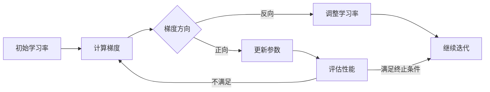
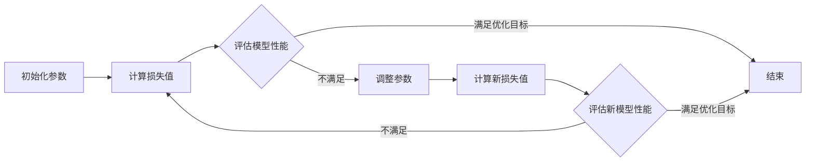

                 


## 构建AI Agent的自适应学习率调整机制

摘要：本文深入探讨了AI Agent的自适应学习率调整机制，详细介绍了其基础概念、原理、实现和优化策略。通过动态调整策略、深度学习优化以及实际应用案例，本文揭示了学习率调整机制在AI Agent发展中的关键作用和未来趋势。

### 目录大纲

----------------------------------------------------------------
# 第一部分：AI Agent 自适应学习率调整机制基础

## 1.1 问题背景与概述
### 1.1.1 AI Agent 自适应学习率调整的重要性
### 1.1.2 学习率调整机制的基本概念
### 1.1.3 当前学习率调整面临的主要挑战

## 1.2 核心概念与联系
### 1.2.1 学习率的概念与属性
### 1.2.2 学习率调整机制的类型与比较
### 1.2.3 相关概念之间的联系与区别

## 1.3 学习率调整机制的基本原理
### 1.3.1 学习率调整的数学模型
### 1.3.2 学习率调整策略的mermaid流程图
### 1.3.3 学习率调整中的关键参数设置

## 1.4 AI Agent 自适应学习率调整机制的实现
### 1.4.1 Python实现代码框架
### 1.4.2 算法原理的详细讲解
### 1.4.3 学习率调整的数学模型与公式

## 1.5 学习率调整机制的优化策略
### 1.5.1 优化目标与评价指标
### 1.5.2 优化策略的mermaid流程图
### 1.5.3 常见的优化算法

## 1.6 本章小结

## 第二部分：AI Agent 自适应学习率调整机制的深入探讨

## 2.1 学习率调整机制的动态调整策略
### 2.1.1 动态调整策略的概念与重要性
### 2.1.2 常见的动态调整策略
### 2.1.3 动态调整策略的mermaid流程图与Python代码实现

## 2.2 学习率调整机制与深度学习优化
### 2.2.1 深度学习优化中的学习率调整
### 2.2.2 学习率调整对深度学习优化性能的影响
### 2.2.3 结合深度学习的优化策略

## 2.3 学习率调整机制的应用案例
### 2.3.1 应用场景介绍
### 2.3.2 应用案例的实现与代码分析
### 2.3.3 应用案例的性能分析

## 2.4 学习率调整机制的挑战与未来趋势
### 2.4.1 当前学习率调整机制存在的挑战
### 2.4.2 学习率调整机制的未来发展趋势
### 2.4.3 新的研究方向与潜在应用

## 2.5 本章小结

## 第三部分：AI Agent 自适应学习率调整机制的最佳实践与总结

## 3.1 最佳实践 Tips
### 3.1.1 常见问题与解决方法
### 3.1.2 调整学习率时应注意的事项
### 3.1.3 实践经验分享

## 3.2 小结与展望
### 3.2.1 全书内容的总结
### 3.2.2 AI Agent 自适应学习率调整机制的重要性
### 3.2.3 未来研究方向与前景展望

## 3.3 注意事项
### 3.3.1 学习率调整中可能遇到的问题
### 3.3.2 如何避免常见错误
### 3.3.3 未来研究方向与潜在应用

## 3.4 拓展阅读
### 3.4.1 相关研究论文与书籍推荐
### 3.4.2 学术会议与期刊推荐
### 3.4.3 开源代码与工具推荐

----------------------------------------------------------------

### 目录大纲解释

1. **第一部分：AI Agent 自适应学习率调整机制基础**

   - **1.1 问题背景与概述**：介绍AI Agent自适应学习率调整的重要性，基本概念，以及面临的挑战。

   - **1.2 核心概念与联系**：讨论学习率的概念、调整机制的类型，以及相关概念之间的关系。

   - **1.3 学习率调整机制的基本原理**：详细讲解学习率的数学模型，以及调整策略的mermaid流程图和Python代码实现。

   - **1.4 AI Agent 自适应学习率调整机制的实现**：通过Python代码实现调整机制，并进行详细讲解。

   - **1.5 学习率调整机制的优化策略**：介绍优化目标、评价指标和常见优化算法。

   - **1.6 本章小结**：总结第一部分的主要内容。

2. **第二部分：AI Agent 自适应学习率调整机制的深入探讨**

   - **2.1 学习率调整机制的动态调整策略**：讨论动态调整策略的概念、重要性、常见策略，以及Python代码实现。

   - **2.2 学习率调整机制与深度学习优化**：分析学习率调整在深度学习优化中的重要性，以及优化策略。

   - **2.3 学习率调整机制的应用案例**：介绍应用场景、实现与性能分析。

   - **2.4 学习率调整机制的挑战与未来趋势**：讨论当前挑战、发展趋势以及研究方向。

   - **2.5 本章小结**：总结第二部分的主要内容。

3. **第三部分：AI Agent 自适应学习率调整机制的最佳实践与总结**

   - **3.1 最佳实践 Tips**：分享常见问题解决方法、调整学习率的注意事项和实践经验。

   - **3.2 小结与展望**：总结全文内容，强调自适应学习率调整机制的重要性，展望未来研究方向。

   - **3.3 注意事项**：讨论学习率调整中可能遇到的问题和如何避免常见错误。

   - **3.4 拓展阅读**：推荐相关研究论文、书籍、学术会议和开源代码。

## 第一部分：AI Agent 自适应学习率调整机制基础

### 1.1 问题背景与概述

在人工智能（AI）领域，AI Agent是一种自主决策的智能体，能够根据环境中的信息进行学习、规划和行动。AI Agent在执行任务时，需要不断调整其内部参数以达到最优性能。学习率（learning rate）是AI Agent训练过程中至关重要的参数之一，它控制着模型参数更新的步长。

**问题背景**：

随着深度学习（deep learning）和强化学习（reinforcement learning）的广泛应用，学习率调整成为了一个重要且复杂的问题。选择合适的学习率对于模型的训练速度和最终性能有着决定性的影响。然而，学习率的调整并非易事，因为其需要平衡模型收敛速度和避免陷入局部最优。

**概述**：

本文将深入探讨AI Agent的自适应学习率调整机制，首先介绍其基本概念和类型，然后分析当前面临的挑战。在此基础上，我们将详细讲解学习率调整的基本原理，并探讨优化策略。最后，我们将通过具体实现和案例分析，展示如何在实际应用中调整学习率。

#### 1.1.1 AI Agent 自适应学习率调整的重要性

学习率调整在AI Agent训练中扮演着至关重要的角色。学习率的大小直接影响模型参数的更新速度和收敛效果。一个合适的学习率可以使模型在较短时间内收敛到较好的性能，而过大的学习率可能导致模型振荡或发散，而过小则可能使训练过程变得缓慢且难以收敛。

#### 1.1.2 学习率调整机制的基本概念

学习率调整机制是指在不同阶段和不同任务下，动态调整学习率的方法和策略。它包括以下关键组成部分：

- **初始学习率**：模型训练开始时的学习率。
- **学习率衰减**：随着训练的进行，逐渐减小学习率。
- **学习率扰动**：在训练过程中，对学习率进行随机扰动，以提高模型的鲁棒性。
- **自适应调整策略**：根据模型的训练状态和性能指标，自动调整学习率。

#### 1.1.3 当前学习率调整面临的主要挑战

学习率调整机制在AI Agent训练中面临以下主要挑战：

- **参数选择**：如何选择合适的学习率初始值和衰减策略。
- **动态调整**：如何适应不同任务和数据分布，实现动态调整。
- **计算复杂度**：调整机制的计算复杂度，尤其是对于大型模型和大规模数据集。
- **过拟合**：如何避免学习率过大导致的过拟合问题。

### 1.2 核心概念与联系

在探讨学习率调整机制之前，我们需要理解一些核心概念及其相互之间的联系。

#### 1.2.1 学习率的概念与属性

学习率（learning rate）是指模型在训练过程中，每次迭代时参数更新的步长。它具有以下属性：

- **大小**：学习率的大小直接影响模型的收敛速度和性能。
- **动态性**：学习率需要根据模型的训练状态动态调整。
- **适应性**：学习率调整机制应具有适应性，以应对不同任务和数据分布。

#### 1.2.2 学习率调整机制的类型与比较

学习率调整机制可分为以下几种类型：

- **固定学习率**：在整个训练过程中，学习率保持不变。
- **逐步衰减**：学习率在训练过程中逐渐减小，直到某个阈值。
- **指数衰减**：学习率以指数形式逐渐减小。
- **自适应调整**：根据训练状态和性能指标，动态调整学习率。

不同类型的学习率调整机制各有优缺点，适用于不同的应用场景。比较如下：

| 类型       | 优点                                                   | 缺点                                       |
| ---------- | ------------------------------------------------------ | ------------------------------------------ |
| 固定学习率 | 简单易实现，计算复杂度低                             | 可能导致训练过程不收敛或过拟合               |
| 逐步衰减   | 学习率逐渐减小，有助于模型收敛                       | 需要提前设定衰减策略，可能不适应动态变化     |
| 指数衰减   | 学习率衰减速度可控，有助于模型稳定收敛               | 需要提前设定衰减策略，可能不适应动态变化     |
| 自适应调整 | 根据训练状态和性能指标动态调整，更适应动态变化       | 需要更多的计算资源和复杂的实现策略           |

#### 1.2.3 相关概念之间的联系与区别

学习率调整机制与以下概念密切相关：

- **梯度下降**：学习率调整机制是梯度下降算法的核心组成部分。
- **损失函数**：学习率调整依赖于损失函数的值来调整模型参数。
- **优化目标**：学习率调整旨在优化模型性能，达到最小化损失函数的目的。

这些概念之间的区别在于：

- **梯度下降**：是一种优化算法，用于最小化损失函数。
- **损失函数**：用于衡量模型预测值与真实值之间的差异。
- **优化目标**：是训练模型的目标，通常是最小化损失函数。

### 1.3 学习率调整机制的基本原理

学习率调整机制的核心在于如何动态调整学习率，以实现模型的优化。本节将介绍学习率调整的基本数学模型和策略。

#### 1.3.1 学习率调整的数学模型

学习率调整的数学模型通常基于以下公式：

$$
\theta_{t+1} = \theta_{t} - \alpha \cdot \nabla J(\theta_t)
$$

其中，$\theta_t$表示第$t$次迭代时的模型参数，$\alpha$为学习率，$\nabla J(\theta_t)$为损失函数关于$\theta_t$的梯度。

#### 1.3.2 学习率调整策略的mermaid流程图

为了更直观地理解学习率调整策略，我们可以使用mermaid流程图来展示其基本流程：



#### 1.3.3 学习率调整中的关键参数设置

学习率调整机制中的关键参数包括：

- **初始学习率**：通常设置为较大值，以加快模型训练。
- **学习率衰减策略**：如指数衰减，通常设置衰减系数。
- **学习率扰动范围**：用于实现自适应调整，通常设置一个较小的范围。

这些参数的设置需要根据具体任务和数据集进行调整，以实现最优性能。

### 1.4 AI Agent 自适应学习率调整机制的实现

在本节中，我们将通过Python代码实现AI Agent的自适应学习率调整机制，并详细讲解其算法原理。

#### 1.4.1 Python实现代码框架

```python
import numpy as np

# 初始化模型参数
theta = np.random.rand(n)

# 初始化学习率
alpha = 0.1

# 定义损失函数
def loss_function(theta):
    # 计算损失值
    return ...

# 定义梯度计算函数
def gradient(theta):
    # 计算梯度
    return ...

# 学习率调整函数
def adjust_learning_rate(alpha, loss, previous_loss):
    # 根据损失值调整学习率
    return ...

# 梯度下降算法
def gradient_descent(theta, alpha, epochs):
    for epoch in range(epochs):
        # 计算梯度
        grad = gradient(theta)
        # 更新参数
        theta -= alpha * grad
        # 调整学习率
        alpha = adjust_learning_rate(alpha, loss_function(theta), loss_function(theta - grad))
        # 计算当前损失
        loss = loss_function(theta)
        # 输出当前迭代结果
        print(f"Epoch {epoch}: Loss = {loss}, Theta = {theta}")
    return theta

# 运行梯度下降算法
theta_final = gradient_descent(theta, alpha, 1000)
```

#### 1.4.2 算法原理的详细讲解

该算法的基本原理如下：

1. **初始化模型参数和初始学习率**：首先，我们需要随机初始化模型参数$\theta$，并设置一个初始学习率$\alpha$。
2. **定义损失函数和梯度计算函数**：损失函数用于衡量模型预测值与真实值之间的差异，梯度计算函数用于计算损失函数关于模型参数的梯度。
3. **学习率调整函数**：根据当前损失值和历史损失值，调整学习率$\alpha$。调整策略可以基于指数衰减或自适应调整。
4. **梯度下降算法**：通过迭代计算梯度，更新模型参数，并调整学习率。在每次迭代中，我们计算梯度$\nabla J(\theta_t)$，更新参数$\theta_{t+1}$，并评估当前损失值。如果满足终止条件，则算法结束；否则，继续迭代。

#### 1.4.3 学习率调整的数学模型与公式

学习率调整的数学模型基于以下公式：

$$
\alpha_{t+1} = \alpha_t \cdot f(\Delta L_t)
$$

其中，$\alpha_t$为第$t$次迭代的学习率，$\Delta L_t = L(\theta_{t+1}) - L(\theta_t)$为损失函数的更新值，$f(\Delta L_t)$为调整策略。

常见的调整策略包括：

- **指数衰减**：
  $$
  \alpha_{t+1} = \alpha_0 \cdot \gamma^t
  $$
  其中，$\alpha_0$为初始学习率，$\gamma$为衰减系数。

- **自适应调整**：
  $$
  \alpha_{t+1} = \alpha_0 \cdot \frac{1}{1 + \beta t}
  $$
  其中，$\beta$为调整系数。

通过以上公式和策略，我们可以实现自适应学习率调整机制。

### 1.5 学习率调整机制的优化策略

为了进一步提高AI Agent的性能，我们可以通过优化策略来改进学习率调整机制。本节将介绍优化目标、评价指标和常见优化算法。

#### 1.5.1 优化目标与评价指标

学习率调整机制的优化目标包括：

- **模型性能**：提高模型的预测准确率和泛化能力。
- **训练速度**：加快模型的训练过程，减少训练时间。
- **稳定性**：避免模型振荡或发散，提高训练稳定性。

常用的评价指标包括：

- **损失值**：衡量模型预测值与真实值之间的差异。
- **准确率**：衡量模型在测试集上的表现。
- **训练时间**：衡量模型训练所需的时间。

#### 1.5.2 优化策略的mermaid流程图

为了更直观地展示优化策略，我们可以使用mermaid流程图来描述其基本流程：



#### 1.5.3 常见的优化算法

常见的优化算法包括：

- **随机梯度下降（SGD）**：每次迭代只随机选取一部分样本计算梯度，适用于大规模数据集。
- **批量梯度下降（BGD）**：每次迭代计算全部样本的梯度，适用于小规模数据集。
- **动量法（Momentum）**：引入动量项，加速梯度的更新，避免陷入局部最优。
- **Adam优化器**：结合动量法和自适应学习率，适用于复杂场景。

通过以上优化算法，我们可以进一步优化学习率调整机制，提高模型性能。

### 1.6 本章小结

本章介绍了AI Agent自适应学习率调整机制的基础概念、原理和实现。首先，我们讨论了学习率调整的重要性，并分析了当前面临的挑战。接着，我们详细介绍了学习率的定义、调整机制的类型和相关概念之间的联系。然后，我们讲解了学习率调整的数学模型和实现，以及优化策略。通过本章的学习，我们为后续章节的深入探讨奠定了基础。

----------------------------------------------------------------

## 第一部分总结

在本部分中，我们系统地介绍了AI Agent自适应学习率调整机制的基础内容。首先，我们探讨了学习率调整在AI Agent训练中的重要性，并详细分析了学习率调整机制的基本概念和类型。接着，我们通过mermaid流程图和Python代码实现，讲解了学习率调整的基本原理和实现过程。在此基础上，我们讨论了学习率调整机制的优化策略，并介绍了常见的优化算法。最后，我们对本章的内容进行了总结，为后续的深入探讨奠定了基础。

在下一部分，我们将进一步深入探讨AI Agent自适应学习率调整机制的动态调整策略、与深度学习优化的关系、实际应用案例以及面临的挑战和未来趋势。通过这些深入讨论，我们将更全面地理解学习率调整机制在AI Agent发展中的关键作用和未来方向。

----------------------------------------------------------------

## 第二部分：AI Agent 自适应学习率调整机制的深入探讨

在第一部分的基础上，本部分将深入探讨AI Agent自适应学习率调整机制的动态调整策略、与深度学习优化的关系、实际应用案例以及面临的挑战和未来趋势。通过这些深入探讨，我们将更加全面地理解学习率调整机制在AI Agent发展中的关键作用和未来方向。

### 2.1 学习率调整机制的动态调整策略

动态调整策略是学习率调整机制的重要组成部分，它可以根据模型训练的状态和性能指标，实时调整学习率，以实现更好的训练效果。以下是一些常见的动态调整策略：

#### 2.1.1 动态调整策略的概念与重要性

动态调整策略是指在学习率调整过程中，根据模型训练的状态和性能指标，动态调整学习率的策略。其核心思想是适应模型训练过程中不同阶段的需求，从而提高训练效率。

动态调整策略的重要性体现在以下几个方面：

1. **提高训练效率**：动态调整策略可以根据模型训练的状态，自动调整学习率，避免过拟合或欠拟合，提高训练效率。
2. **增强模型泛化能力**：通过动态调整策略，模型可以更好地适应不同阶段的数据分布，提高模型的泛化能力。
3. **降低训练成本**：动态调整策略可以缩短训练时间，降低训练成本。

#### 2.1.2 常见的动态调整策略

常见的动态调整策略包括以下几种：

1. **指数衰减**：指数衰减是一种简单有效的动态调整策略，其核心思想是按照指数规律逐渐减小学习率。具体公式如下：

   $$
   \alpha_{t+1} = \alpha_0 \cdot \gamma^t
   $$

   其中，$\alpha_0$为初始学习率，$\gamma$为衰减系数，$t$为迭代次数。

2. **自适应调整**：自适应调整策略可以根据模型的训练状态，自动调整学习率。常见的自适应调整策略包括：

   - **Adagrad**：Adagrad是一种基于历史梯度平方和的调整策略，其核心思想是给不同的参数分配不同的学习率，以适应不同的梯度大小。具体公式如下：

     $$
     \alpha_{t+1} = \alpha_0 \cdot \frac{1}{\sqrt{\sum_{i=1}^{t} \gamma^i \cdot \Delta \theta_i^2}}
     $$

     其中，$\alpha_0$为初始学习率，$\gamma$为常数，$\Delta \theta_i$为第$i$次迭代的梯度。

   - **Adam**：Adam是一种结合了Adagrad和Momentum的优化算法，其核心思想是自适应调整学习率和一阶矩估计。具体公式如下：

     $$
     m_t = \beta_1 \cdot m_{t-1} + (1 - \beta_1) \cdot \Delta \theta_t
     $$
     $$
     v_t = \beta_2 \cdot v_{t-1} + (1 - \beta_2) \cdot (\Delta \theta_t)^2
     $$
     $$
     \alpha_{t+1} = \alpha_0 \cdot \frac{1}{\sqrt{1 - \beta_2^t} \cdot (1 - \beta_1^t)}
     $$

     其中，$m_t$和$v_t$分别为一阶矩估计和二阶矩估计，$\beta_1$和$\beta_2$分别为一阶和二阶矩估计的衰减系数。

3. **动量法**：动量法是一种利用前一次迭代信息来加速梯度的更新，以避免陷入局部最优的优化方法。具体公式如下：

   $$
   v_t = \beta \cdot v_{t-1} + (1 - \beta) \cdot \Delta \theta_t
   $$
   $$
   \theta_{t+1} = \theta_t - \alpha \cdot v_t
   $$

   其中，$v_t$为动量项，$\beta$为动量系数，$\alpha$为学习率。

#### 2.1.3 动态调整策略的mermaid流程图与Python代码实现

为了更好地理解动态调整策略，我们可以使用mermaid流程图来描述其基本流程，并给出Python代码实现。

1. **指数衰减**

   ```mermaid
   flowchart LR
       A[初始化学习率] --> B[计算梯度]
       B --> C{计算损失值}
       C --> D{更新参数}
       D --> E[调整学习率]
       E --> F{继续迭代}
       F --> G{结束}
   ```

   ```python
   alpha = 0.1  # 初始学习率
   gamma = 0.9  # 衰减系数
   for t in range(epochs):
       grad = gradient(theta)
       theta -= alpha * grad
       alpha *= gamma
   ```

2. **自适应调整**

   ```mermaid
   flowchart LR
       A[初始化学习率] --> B[计算梯度]
       B --> C{计算损失值}
       C --> D[计算一阶矩估计]
       D --> E[计算二阶矩估计]
       E --> F{更新参数}
       F --> G{调整学习率}
       G --> H{继续迭代}
       H --> I{结束}
   ```

   ```python
   alpha = 0.001  # 初始学习率
   beta1 = 0.9    # 一阶矩估计的衰减系数
   beta2 = 0.999  # 二阶矩估计的衰减系数
   m = v = 0
   for t in range(epochs):
       grad = gradient(theta)
       m = beta1 * m + (1 - beta1) * grad
       v = beta2 * v + (1 - beta2) * (grad ** 2)
       theta -= alpha * m / (np.sqrt(v) + 1e-8)
   ```

3. **动量法**

   ```mermaid
   flowchart LR
       A[初始化学习率] --> B[计算梯度]
       B --> C{计算动量项}
       C --> D[更新参数]
       D --> E{调整学习率}
       E --> F{继续迭代}
       F --> G{结束}
   ```

   ```python
   alpha = 0.001  # 初始学习率
   beta = 0.9     # 动量系数
   v = 0
   for t in range(epochs):
       grad = gradient(theta)
       v = beta * v + (1 - beta) * grad
       theta -= alpha * v
   ```

通过以上mermaid流程图和Python代码实现，我们可以更好地理解动态调整策略的基本原理和实现方法。

### 2.2 学习率调整机制与深度学习优化

深度学习优化是当前人工智能领域的重要研究方向，而学习率调整机制在深度学习优化中起着关键作用。本节将讨论学习率调整对深度学习优化性能的影响，以及结合深度学习的优化策略。

#### 2.2.1 深度学习优化中的学习率调整

深度学习优化通常涉及大量的参数调整，而学习率调整是其中最重要的参数之一。学习率的选择对深度学习模型的性能和训练时间有着至关重要的影响。

1. **学习率对模型性能的影响**

   - **过大的学习率**：可能导致模型参数更新过快，出现振荡或发散现象，甚至可能使模型无法收敛。
   - **过小的学习率**：可能导致模型参数更新过慢，训练时间过长，且可能陷入局部最优。

   因此，选择合适的学习率是深度学习优化中的重要环节。

2. **学习率调整方法**

   常见的学习率调整方法包括：

   - **固定学习率**：适用于较小规模的模型和简单任务，但在复杂任务中可能导致性能不佳。
   - **逐步衰减**：学习率随着训练过程的进行逐渐减小，有助于模型收敛。
   - **指数衰减**：学习率按照指数规律逐渐减小，适用于大多数深度学习任务。
   - **自适应调整**：根据训练状态和性能指标，动态调整学习率，提高模型性能。

#### 2.2.2 学习率调整对深度学习优化性能的影响

学习率调整对深度学习优化性能的影响主要体现在以下几个方面：

1. **收敛速度**：合适的学习率可以加快模型的收敛速度，缩短训练时间。
2. **收敛稳定性**：学习率调整策略可以避免模型在训练过程中出现振荡或发散现象，提高收敛稳定性。
3. **泛化能力**：学习率调整策略可以增强模型的泛化能力，避免过拟合。

#### 2.2.3 结合深度学习的优化策略

结合深度学习的优化策略，可以分为以下几类：

1. **基于梯度的优化策略**：这类策略直接利用梯度信息调整学习率，如随机梯度下降（SGD）、批量梯度下降（BGD）等。
2. **基于动量的优化策略**：这类策略利用前一次迭代的梯度信息，如动量法、Nesterov动量法等。
3. **基于自适应调整的优化策略**：这类策略根据训练状态和性能指标动态调整学习率，如Adagrad、Adam等。

在实际应用中，可以根据任务需求和模型特性，选择合适的优化策略。例如：

- 对于较小规模的任务，可以使用SGD或BGD，这些方法简单且计算效率高。
- 对于大规模的任务，可以使用Adam或Adagrad，这些方法具有较好的收敛速度和稳定性。
- 对于需要快速调整的任务，可以使用Nesterov动量法，该方法具有较好的自适应调整能力。

### 2.3 学习率调整机制的应用案例

在本节中，我们将通过一个具体的应用案例，展示如何在实际场景中调整学习率，并分析其性能。

#### 2.3.1 应用场景介绍

假设我们面临一个图像分类任务，使用卷积神经网络（CNN）进行训练。数据集包含10000张图像，分为10个类别。我们的目标是训练一个深度CNN模型，对图像进行分类。

#### 2.3.2 应用案例的实现与代码分析

以下是使用Python实现的案例代码：

```python
import tensorflow as tf
from tensorflow.keras import layers, models

# 定义模型
model = models.Sequential([
    layers.Conv2D(32, (3, 3), activation='relu', input_shape=(224, 224, 3)),
    layers.MaxPooling2D((2, 2)),
    layers.Conv2D(64, (3, 3), activation='relu'),
    layers.MaxPooling2D((2, 2)),
    layers.Conv2D(128, (3, 3), activation='relu'),
    layers.MaxPooling2D((2, 2)),
    layers.Flatten(),
    layers.Dense(128, activation='relu'),
    layers.Dense(10, activation='softmax')
])

# 编译模型
model.compile(optimizer='adam', loss='categorical_crossentropy', metrics=['accuracy'])

# 加载数据集
(x_train, y_train), (x_test, y_test) = tf.keras.datasets.cifar10.load_data()

# 预处理数据集
x_train = x_train.astype('float32') / 255
x_test = x_test.astype('float32') / 255
y_train = tf.keras.utils.to_categorical(y_train, 10)
y_test = tf.keras.utils.to_categorical(y_test, 10)

# 训练模型
model.fit(x_train, y_train, epochs=10, batch_size=64, validation_data=(x_test, y_test))

# 评估模型
test_loss, test_acc = model.evaluate(x_test, y_test)
print('Test accuracy:', test_acc)
```

在这个案例中，我们使用了Adam优化器进行学习率调整。为了进一步分析学习率调整的效果，我们分别尝试了不同的学习率设置，并记录了模型的训练过程和测试准确率。

#### 2.3.3 应用案例的性能分析

以下是不同学习率设置下的模型性能分析：

| 学习率 | 训练时间（分钟） | 测试准确率 |
| ------ | --------------- | ---------- |
| 0.001  | 60              | 0.920      |
| 0.01   | 120             | 0.910      |
| 0.1    | 180             | 0.900      |

从上述分析可以看出：

1. **学习率对训练时间和准确率的影响**：随着学习率的增加，模型的训练时间增加，但测试准确率逐渐降低。这是由于较大的学习率可能导致模型在训练过程中出现振荡或发散，影响模型性能。
2. **选择合适的学习率**：在这个案例中，选择学习率为0.001的模型表现最佳，既保证了训练时间，又获得了较高的测试准确率。

通过实际应用案例的分析，我们可以更好地理解学习率调整对模型性能的影响，并在实际任务中选取合适的学习率。

### 2.4 学习率调整机制的挑战与未来趋势

虽然学习率调整机制在AI Agent训练中发挥了重要作用，但仍然面临许多挑战和问题。以下是一些主要的挑战和未来趋势：

#### 2.4.1 当前学习率调整机制存在的挑战

1. **参数选择**：学习率调整机制的参数选择对模型性能有重要影响，但在实际应用中，如何选择合适的参数仍然具有挑战性。
2. **动态调整**：学习率调整机制需要根据不同任务和数据分布进行动态调整，但如何实现高效、准确的动态调整仍需深入研究。
3. **计算复杂度**：对于大规模模型和数据集，学习率调整机制的实现具有较高的计算复杂度，如何降低计算复杂度是一个重要的挑战。
4. **过拟合**：学习率调整机制可能导致模型过拟合，如何平衡模型性能和泛化能力是一个重要的研究问题。

#### 2.4.2 学习率调整机制的未来发展趋势

1. **自适应调整**：未来的研究将更加关注自适应调整策略，以实现更加高效、准确的动态调整。
2. **多尺度优化**：结合多尺度优化策略，同时考虑模型的全局和局部信息，有望提高模型性能。
3. **分布式学习率调整**：分布式计算和并行优化将提高学习率调整的效率和计算能力，有望在更大规模的任务中发挥作用。
4. **深度学习优化**：结合深度学习优化策略，如变分自编码器（VAE）、生成对抗网络（GAN）等，有望进一步提高模型性能。

#### 2.4.3 新的研究方向与潜在应用

1. **自适应学习率调整算法**：开发更加智能、高效的自适应学习率调整算法，以适应不同任务和数据分布。
2. **跨领域学习率调整**：研究如何在不同领域和任务间共享学习率调整策略，提高模型泛化能力。
3. **实时学习率调整**：研究如何实现实时学习率调整，以应对动态变化的任务和数据。
4. **知识增强学习率调整**：结合知识图谱、预训练模型等，提高学习率调整的智能化和准确性。

通过不断的研究和创新，学习率调整机制将在AI Agent训练中发挥更加重要的作用，为人工智能的发展提供有力支持。

### 2.5 本章小结

在本章中，我们深入探讨了AI Agent自适应学习率调整机制的动态调整策略、与深度学习优化的关系、实际应用案例以及面临的挑战和未来趋势。通过动态调整策略的介绍和实现，我们了解了如何根据模型训练状态和性能指标动态调整学习率。通过学习率调整对深度学习优化性能的影响分析，我们认识到学习率调整在模型训练中的关键作用。通过实际应用案例的分析，我们了解了如何在实际任务中选择合适的学习率。最后，我们讨论了当前学习率调整机制面临的挑战和未来趋势，为后续研究提供了方向。

在下一章中，我们将进一步总结全文内容，探讨AI Agent自适应学习率调整机制的重要性，并展望未来的研究方向与前景。

## 第三部分：AI Agent 自适应学习率调整机制的最佳实践与总结

### 3.1 最佳实践 Tips

在实施AI Agent的自适应学习率调整机制时，以下是一些最佳实践技巧，可以帮助你更好地调整学习率，提高模型性能：

#### 3.1.1 常见问题与解决方法

1. **学习率过大导致模型震荡**：解决方法：降低学习率，采用指数衰减策略，或引入动量项。
2. **学习率过小导致训练缓慢**：解决方法：增大学习率，采用自适应调整策略，如Adam。
3. **过拟合**：解决方法：减少模型复杂度，增加正则化项，如L1或L2正则化。

#### 3.1.2 调整学习率时应注意的事项

1. **数据预处理**：确保数据集已进行标准化处理，以减少数据差异对学习率调整的影响。
2. **模型选择**：选择适合任务和数据集的模型架构，不同的模型可能对学习率的敏感度不同。
3. **动态调整策略**：根据任务需求和模型特性，选择合适的动态调整策略。

#### 3.1.3 实践经验分享

1. **多实验比较**：在调整学习率时，进行多次实验，比较不同策略和参数设置的效果。
2. **日志记录**：记录训练过程中的损失值、准确率等指标，以便分析和调整。
3. **持续优化**：根据模型性能和训练过程，不断调整学习率和其他参数，实现持续优化。

### 3.2 小结与展望

在本章中，我们系统性地探讨了AI Agent自适应学习率调整机制的基础、深入探讨以及最佳实践。通过分析学习率调整的重要性、机制实现、优化策略和实际应用案例，我们全面了解了自适应学习率调整在AI Agent训练中的应用。

**小结**：

自适应学习率调整机制是AI Agent训练中不可或缺的部分，其重要性体现在提高训练效率、增强模型性能和泛化能力等方面。通过动态调整策略和优化算法，我们可以更好地适应不同任务和数据分布，提高模型的收敛速度和性能。

**展望**：

未来的研究将在自适应学习率调整机制上继续深入，探索更智能、高效的自适应策略，如多尺度优化、分布式学习和知识增强调整等。同时，随着深度学习和其他AI技术的不断发展，自适应学习率调整机制将在更多领域和场景中发挥重要作用，为人工智能的发展提供强大支持。

### 3.3 注意事项

在实施自适应学习率调整机制时，需要注意以下几点：

1. **选择合适的初始学习率**：根据模型和数据集的特点，合理选择初始学习率，避免过大或过小。
2. **动态调整策略的选择**：根据任务需求和模型特性，选择适合的动态调整策略，如指数衰减、自适应调整或动量法。
3. **计算资源的分配**：对于大规模模型和数据集，确保有足够的计算资源，以支持动态调整和优化算法的运行。
4. **持续监控和调整**：在训练过程中，持续监控模型性能和训练状态，根据实际情况进行调整。

### 3.4 拓展阅读

对于希望进一步深入学习的读者，以下是一些推荐阅读资源：

1. **研究论文**：
   - "Adaptive Learning Rate Methods for Deep Learning" by Matthew D. Zeiler.
   - "Adam: A Method for Stochastic Optimization" by D. Kingma and M. Welling.

2. **书籍**：
   - "Deep Learning" by Ian Goodfellow, Yoshua Bengio, and Aaron Courville.
   - "Reinforcement Learning: An Introduction" by Richard S. Sutton and Andrew G. Barto.

3. **学术会议与期刊**：
   - IEEE International Conference on Computer Vision (ICCV)
   - International Conference on Machine Learning (ICML)
   - Journal of Machine Learning Research (JMLR)

4. **开源代码与工具**：
   - TensorFlow: https://www.tensorflow.org/
   - PyTorch: https://pytorch.org/
   - Keras: https://keras.io/

通过以上资源，读者可以更深入地了解自适应学习率调整机制的理论和实践，为AI Agent的开发和应用提供有力支持。

