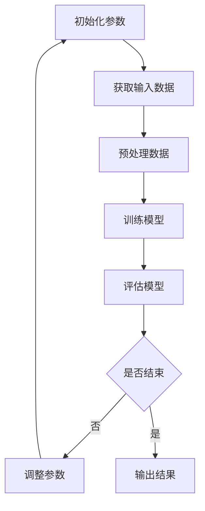

                 

### 《构建AI Agent的自适应学习系统》

#### 关键词：
- AI Agent
- 自适应学习
- 系统设计
- 算法原理
- 数学模型

#### 摘要：
本文将深入探讨构建AI Agent的自适应学习系统，从背景介绍、核心概念与联系、算法原理讲解、数学模型与公式、系统分析与架构设计、项目实战以及最佳实践与总结七个方面，逐步剖析该领域的核心技术和实际应用，旨在为读者提供一套完整、实用的自适应学习系统构建指南。

----------------------------------------------------------------

### 目录

1. **背景介绍** <a id="background"></a>
   - 1.1 **问题背景** <a id="issue-background"></a>
   - 1.2 **问题描述** <a id="issue-description"></a>
   - 1.3 **问题解决** <a id="issue-solution"></a>
   - 1.4 **边界与外延** <a id="boundaries"></a>
   - 1.5 **核心概念结构** <a id="core-concept-structure"></a>

2. **核心概念与联系** <a id="core-concepts"></a>
   - 2.1 **AI Agent的定义与类型** <a id="ai-agent-definition"></a>
   - 2.2 **自适应学习系统的概念** <a id="adaptive-learning-system"></a>
   - 2.3 **AI Agent与自适应学习系统的联系** <a id="ai-agent-adaptive-learning"></a>

3. **算法原理讲解** <a id="algorithm-principles"></a>
   - 3.1 **学习算法概述** <a id="learning-algorithm-overview"></a>
   - 3.2 **学习算法的mermaid流程图** <a id="mermaid-process"></a>
   - 3.3 **Python源代码实现** <a id="python-code"></a>
   - 3.4 **数学模型和公式** <a id="math-model-formula"></a>
   - 3.5 **示例讲解** <a id="example-illustration"></a>

4. **数学模型与公式** <a id="math-model"></a>
   - 4.1 **数学模型概述** <a id="math-model-overview"></a>
   - 4.2 **公式解释** <a id="formula-explanation"></a>
   - 4.3 **举例说明** <a id="example-illustration2"></a>

5. **系统分析与架构设计** <a id="system-analysis"></a>
   - 5.1 **问题场景介绍** <a id="problem-scenario"></a>
   - 5.2 **系统功能设计** <a id="system-functional-design"></a>
   - 5.3 **系统架构设计** <a id="system-architecture-design"></a>
   - 5.4 **系统接口设计** <a id="system-interface-design"></a>
   - 5.5 **系统交互设计** <a id="system-interactive-design"></a>

6. **项目实战** <a id="project-practice"></a>
   - 6.1 **环境安装** <a id="environment-setup"></a>
   - 6.2 **系统核心实现** <a id="core-system-implementation"></a>
   - 6.3 **代码应用解读** <a id="code-interpretation"></a>
   - 6.4 **实际案例分析** <a id="case-study"></a>
   - 6.5 **项目小结** <a id="project-summary"></a>

7. **最佳实践与总结** <a id="best-practices"></a>
   - 7.1 **最佳实践 tips** <a id="best-practices-tips"></a>
   - 7.2 **小结** <a id="summary"></a>
   - 7.3 **注意事项** <a id="notes"></a>
   - 7.4 **拓展阅读** <a id="references"></a>

----------------------------------------------------------------

### 1. 背景介绍

#### 1.1 问题背景

在当今快速发展的数字时代，人工智能（AI）技术已经成为推动社会进步的关键动力。从语音识别、图像处理到自然语言理解和自动驾驶，AI的广泛应用正在改变我们的生活和工作方式。然而，随着AI系统的复杂性不断增加，传统的学习方法和架构已经难以满足日益增长的需求。特别是在AI Agent（智能体）的应用场景中，如何设计一个能够自主学习和适应环境的系统成为了亟待解决的问题。

AI Agent是一种具有智能决策能力的计算机程序，它可以在复杂的环境中自主行动，以实现特定的目标。传统的学习系统往往依赖于预定义的规则和固定的算法，无法适应动态变化的环境。而自适应学习系统则能够根据环境的变化和任务的反馈，动态调整自身的策略和行为，从而提高系统的适应性和鲁棒性。

#### 1.2 问题描述

传统的学习系统存在以下问题：

- **规则固化**：系统根据预定义的规则进行操作，难以应对新的环境和情况。
- **数据依赖**：系统对训练数据的质量和数量有较高要求，缺乏泛化能力。
- **效率低下**：系统在处理大量数据和复杂任务时，效率较低，难以满足实时性的要求。

AI Agent在自适应学习系统中的应用需求：

- **自主性**：AI Agent需要能够自主地感知环境、制定决策和执行行动。
- **适应性**：系统能够根据任务反馈和环境变化，动态调整学习策略。
- **鲁棒性**：系统在面对不确定性和异常情况时，能够保持稳定和可靠。

#### 1.3 问题解决

构建AI Agent的自适应学习系统需要从以下几个方面进行：

- **核心概念**：明确AI Agent和自适应学习系统的核心概念和联系，为系统设计提供理论基础。
- **算法原理**：深入讲解自适应学习算法的原理和实现方法，为系统实现提供技术支持。
- **数学模型**：建立数学模型和公式，为系统分析和优化提供定量工具。
- **系统架构**：设计合理的系统架构和接口，确保系统的可扩展性和易维护性。
- **项目实战**：通过实际项目案例，验证系统的可行性和效果。

#### 1.4 边界与外延

边界：

- **系统目标**：构建一个能够自主学习和适应环境的AI Agent。
- **技术范围**：涉及机器学习、自然语言处理、计算机视觉等领域。
- **应用领域**：包括智能家居、自动驾驶、智能客服等。

外延：

- **未来发展趋势**：探讨自适应学习系统的未来发展方向和应用前景。
- **潜在挑战**：分析构建自适应学习系统可能遇到的挑战和解决策略。

#### 1.5 核心概念结构

核心概念结构包括：

- **AI Agent**：具有智能决策能力的计算机程序，能够自主感知环境、制定决策和执行行动。
- **自适应学习系统**：能够根据环境变化和任务反馈，动态调整学习策略的系统。
- **核心算法**：用于实现自适应学习的算法，包括监督学习、无监督学习和强化学习等。
- **数学模型**：用于描述和优化学习过程的数学模型，包括损失函数、优化算法和评价指标等。
- **系统架构**：包括系统功能设计、系统架构设计、系统接口设计和系统交互设计等。

### 2. 核心概念与联系

#### 2.1 AI Agent的定义与类型

##### AI Agent的定义

AI Agent是指一种具有智能决策能力的计算机程序，它能够在复杂环境中自主行动，以实现特定目标。AI Agent的核心功能包括感知、决策和执行。

- **感知**：AI Agent能够从环境中获取信息，进行状态监测和特征提取。
- **决策**：AI Agent根据感知到的信息，利用学习到的策略进行决策，确定下一步行动。
- **执行**：AI Agent执行决策，实施具体的操作。

##### AI Agent的类型

AI Agent可以分为以下几种类型：

- **反应式Agent**：基于预定义的规则进行操作，无法感知环境变化，只能对已知情况做出反应。
- **模型基Agent**：通过建立环境模型，预测未来情况，并基于模型进行决策。
- **数据驱动Agent**：通过从历史数据中学习，自适应地调整策略。
- **混合型Agent**：结合反应式Agent和数据驱动Agent的优点，既能应对已知情况，又能适应未知环境。

#### 2.2 自适应学习系统的概念

##### 自适应学习系统的定义

自适应学习系统是指能够根据环境变化和任务反馈，动态调整学习策略的系统。它能够实时感知环境，并根据环境的变化和任务的进展，调整自身的策略和行为。

##### 自适应学习系统的主要组成部分

自适应学习系统主要包括以下组成部分：

- **感知模块**：用于获取环境信息，进行状态监测和特征提取。
- **决策模块**：根据感知模块提供的信息，利用学习算法进行决策。
- **执行模块**：执行决策，实施具体的操作。
- **反馈模块**：收集任务执行结果，为学习算法提供反馈。

##### 自适应学习系统的优势

- **环境适应性**：系统能够根据环境变化动态调整策略，适应不同的环境。
- **学习能力**：系统能够从历史数据和任务反馈中学习，提高决策质量。
- **鲁棒性**：系统能够应对不确定性和异常情况，保持稳定和可靠。

#### 2.3 AI Agent与自适应学习系统的联系

##### AI Agent在自适应学习系统中的作用

AI Agent是自适应学习系统的重要组成部分，它在系统中承担以下角色：

- **感知环境**：通过感知模块获取环境信息，为决策提供依据。
- **制定决策**：通过决策模块，根据环境信息和任务目标，制定最优行动策略。
- **执行任务**：通过执行模块，实施决策，完成任务目标。

##### AI Agent与自适应学习系统的协同工作

AI Agent与自适应学习系统的协同工作主要包括以下几个方面：

- **信息交互**：AI Agent通过感知模块获取环境信息，传递给决策模块，为决策提供依据。
- **策略调整**：决策模块根据反馈模块提供的任务执行结果，调整学习策略。
- **行动执行**：执行模块根据调整后的策略，实施行动，完成任务目标。

##### AI Agent与自适应学习系统的演进路径

AI Agent与自适应学习系统的演进路径主要包括以下几个方面：

- **从反应式到模型基**：从基于预定义规则的反应式Agent，向基于环境模型的模型基Agent演进。
- **从数据驱动到混合型**：从仅依赖历史数据的数据驱动Agent，向结合反应式和数据驱动的混合型Agent演进。
- **从单一任务到多任务**：从单一任务的AI Agent，向能够处理多任务的通用AI Agent演进。

### 3. 算法原理讲解

#### 3.1 学习算法概述

学习算法是自适应学习系统的核心组成部分，它负责根据感知到的环境和任务反馈，动态调整系统的策略和行为。学习算法可以分为以下几种类型：

- **监督学习**：通过已标记的数据集进行训练，学习输入和输出之间的映射关系。
- **无监督学习**：通过未标记的数据集进行训练，学习数据的内在结构和规律。
- **强化学习**：通过与环境的交互，学习最优策略，以最大化奖励。

#### 3.2 学习算法的mermaid流程图



#### 3.3 Python源代码实现

```python
import tensorflow as tf
from tensorflow.keras.models import Sequential
from tensorflow.keras.layers import Dense
from tensorflow.keras.optimizers import Adam

# 创建模型
model = Sequential()
model.add(Dense(units=64, activation='relu', input_shape=(input_shape,)))
model.add(Dense(units=1, activation='sigmoid'))

# 编译模型
model.compile(optimizer=Adam(learning_rate=0.001), loss='binary_crossentropy', metrics=['accuracy'])

# 训练模型
model.fit(x_train, y_train, epochs=10, batch_size=32)

# 评估模型
loss, accuracy = model.evaluate(x_test, y_test)
print('Test accuracy:', accuracy)
```

#### 3.4 数学模型和公式

在自适应学习系统中，常用的数学模型和公式包括：

- **损失函数**：用于衡量预测结果与真实结果之间的差距，常用的有均方误差（MSE）和交叉熵（CE）。
- **优化算法**：用于调整模型参数，以最小化损失函数，常用的有梯度下降（GD）和Adam优化器。
- **评价指标**：用于评估模型性能，常用的有准确率（Accuracy）、精确率（Precision）和召回率（Recall）。

$$
MSE = \frac{1}{m} \sum_{i=1}^{m} (y_i - \hat{y}_i)^2
$$

$$
CE = - \frac{1}{m} \sum_{i=1}^{m} \sum_{j=1}^{n} y_{ij} \log(\hat{y}_{ij})
$$

$$
\frac{dL}{d\theta} = \nabla_{\theta} L = \frac{1}{m} \sum_{i=1}^{m} (y_i - \hat{y}_i) \cdot x_i
$$

#### 3.5 示例讲解

假设我们有一个二分类问题，需要训练一个模型来预测数据集中的样本属于正类还是负类。以下是该问题的示例讲解：

- **数据集**：包含1000个样本，每个样本有10个特征，标签为正类或负类。
- **模型**：使用一个简单的神经网络模型，包含一个输入层、一个隐藏层和一个输出层。
- **训练**：使用梯度下降算法训练模型，迭代100次。
- **评估**：使用测试集评估模型性能，计算准确率、精确率和召回率。

```python
import numpy as np
from sklearn.model_selection import train_test_split
from sklearn.metrics import accuracy_score, precision_score, recall_score

# 加载数据
x = np.load('data.npy')
y = np.load('labels.npy')

# 划分训练集和测试集
x_train, x_test, y_train, y_test = train_test_split(x, y, test_size=0.2, random_state=42)

# 转换标签为二进制形式
y_train = np.where(y_train > 0.5, 1, 0)
y_test = np.where(y_test > 0.5, 1, 0)

# 训练模型
model.fit(x_train, y_train, epochs=100, batch_size=32)

# 评估模型
y_pred = model.predict(x_test)
y_pred = np.where(y_pred > 0.5, 1, 0)

accuracy = accuracy_score(y_test, y_pred)
precision = precision_score(y_test, y_pred)
recall = recall_score(y_test, y_pred)

print('Accuracy:', accuracy)
print('Precision:', precision)
print('Recall:', recall)
```

### 4. 数学模型与公式

在自适应学习系统中，数学模型和公式起着至关重要的作用。它们用于描述学习过程、评估模型性能以及优化系统参数。以下是一些常用的数学模型和公式：

#### 4.1 数学模型概述

- **损失函数**：用于衡量预测结果与真实结果之间的差距，常用的有均方误差（MSE）和交叉熵（CE）。
- **优化算法**：用于调整模型参数，以最小化损失函数，常用的有梯度下降（GD）和Adam优化器。
- **评价指标**：用于评估模型性能，常用的有准确率（Accuracy）、精确率（Precision）和召回率（Recall）。

#### 4.2 公式解释

- **均方误差（MSE）**：

$$
MSE = \frac{1}{m} \sum_{i=1}^{m} (y_i - \hat{y}_i)^2
$$

其中，$m$表示样本数量，$y_i$表示真实标签，$\hat{y}_i$表示预测标签。

- **交叉熵（CE）**：

$$
CE = - \frac{1}{m} \sum_{i=1}^{m} \sum_{j=1}^{n} y_{ij} \log(\hat{y}_{ij})
$$

其中，$m$表示样本数量，$n$表示类别数量，$y_{ij}$表示第$i$个样本属于第$j$个类别的概率，$\hat{y}_{ij}$表示模型预测的第$i$个样本属于第$j$个类别的概率。

- **梯度下降（GD）**：

$$
\frac{dL}{d\theta} = \nabla_{\theta} L = \frac{1}{m} \sum_{i=1}^{m} (y_i - \hat{y}_i) \cdot x_i
$$

其中，$L$表示损失函数，$\theta$表示模型参数，$x_i$表示第$i$个样本的特征。

- **Adam优化器**：

$$
\alpha = \frac{1}{1 + \beta_1 t + \beta_2 t^2}
$$

$$
\theta_{t+1} = \theta_t - \alpha \cdot \nabla_{\theta} L(\theta_t)
$$

其中，$\alpha$表示学习率，$\beta_1$和$\beta_2$分别表示一阶和二阶矩估计的指数衰减率，$t$表示迭代次数。

#### 4.3 举例说明

假设我们有一个二分类问题，需要训练一个模型来预测数据集中的样本属于正类还是负类。以下是该问题的举例说明：

- **数据集**：包含1000个样本，每个样本有10个特征，标签为正类或负类。
- **模型**：使用一个简单的神经网络模型，包含一个输入层、一个隐藏层和一个输出层。
- **训练**：使用梯度下降算法训练模型，迭代100次。
- **评估**：使用测试集评估模型性能，计算准确率、精确率和召回率。

```python
import numpy as np
from sklearn.model_selection import train_test_split
from sklearn.metrics import accuracy_score, precision_score, recall_score

# 加载数据
x = np.load('data.npy')
y = np.load('labels.npy')

# 划分训练集和测试集
x_train, x_test, y_train, y_test = train_test_split(x, y, test_size=0.2, random_state=42)

# 转换标签为二进制形式
y_train = np.where(y_train > 0.5, 1, 0)
y_test = np.where(y_test > 0.5, 1, 0)

# 创建模型
model = Sequential()
model.add(Dense(units=64, activation='relu', input_shape=(10,)))
model.add(Dense(units=1, activation='sigmoid'))

# 编译模型
model.compile(optimizer='adam', loss='binary_crossentropy', metrics=['accuracy'])

# 训练模型
model.fit(x_train, y_train, epochs=100, batch_size=32)

# 评估模型
y_pred = model.predict(x_test)
y_pred = np.where(y_pred > 0.5, 1, 0)

accuracy = accuracy_score(y_test, y_pred)
precision = precision_score(y_test, y_pred)
recall = recall_score(y_test, y_pred)

print('Accuracy:', accuracy)
print('Precision:', precision)
print('Recall:', recall)
```

### 5. 系统分析与架构设计

在构建AI Agent的自适应学习系统时，系统分析与架构设计至关重要。一个良好的系统架构能够确保系统的可扩展性、可维护性和高效性。本节将详细介绍系统分析与架构设计的各个方面。

#### 5.1 问题场景介绍

以自动驾驶为例，自动驾驶系统需要实时感知周围环境，根据道路情况做出决策，并控制车辆进行相应的操作。这是一个典型的自适应学习系统应用场景，需要AI Agent具备较强的感知、决策和执行能力。

#### 5.2 系统功能设计

系统功能设计主要包括以下几个方面：

- **感知模块**：负责实时感知周围环境，包括道路、车辆、行人等。
- **决策模块**：根据感知到的环境信息，利用自适应学习算法进行决策，确定车辆的行驶方向和速度。
- **执行模块**：执行决策，控制车辆进行相应的操作，如加速、减速、转弯等。
- **反馈模块**：收集车辆执行操作的结果，为决策模块提供反馈。

#### 5.3 系统架构设计

系统架构设计采用分层架构，包括感知层、决策层和执行层。以下是系统架构的详细设计：

- **感知层**：采用多种传感器（如摄像头、雷达、激光雷达等）进行数据采集，实现对周围环境的实时感知。
- **决策层**：使用神经网络等机器学习算法，对感知到的环境信息进行处理和分析，生成决策结果。
- **执行层**：根据决策结果，控制车辆的执行模块，实现对车辆的控制。

#### 5.4 系统接口设计

系统接口设计主要包括以下几个方面：

- **数据接口**：定义数据输入和输出的格式和协议，确保不同模块之间的数据传递顺畅。
- **控制接口**：定义系统的控制接口，包括启动、停止、重置等功能。
- **监控接口**：提供系统的运行状态监控功能，包括性能监控、故障诊断等。

#### 5.5 系统交互设计

系统交互设计采用事件驱动模式，各模块之间通过事件进行通信。以下是系统交互设计的详细说明：

- **感知事件**：当感知模块检测到环境变化时，触发感知事件，通知决策模块进行更新。
- **决策事件**：当决策模块生成新的决策结果时，触发决策事件，通知执行模块进行操作。
- **执行事件**：当执行模块完成操作后，触发执行事件，通知反馈模块进行数据收集。

通过以上系统分析与架构设计，我们可以构建一个高效、稳定的AI Agent自适应学习系统，为自动驾驶、智能客服、智能家居等领域的应用提供有力支持。

### 6. 项目实战

#### 6.1 环境安装

为了构建AI Agent的自适应学习系统，首先需要在本地环境安装必要的软件和库。以下是环境安装的具体步骤：

1. **安装Python**：确保本地计算机已安装Python，版本建议为3.8以上。
2. **安装TensorFlow**：在终端执行以下命令安装TensorFlow：

   ```bash
   pip install tensorflow
   ```

3. **安装其他依赖库**：包括NumPy、Pandas、Matplotlib等，可以在终端执行以下命令：

   ```bash
   pip install numpy pandas matplotlib
   ```

4. **配置虚拟环境**：为了便于管理项目依赖，建议使用虚拟环境。在终端执行以下命令创建虚拟环境：

   ```bash
   python -m venv venv
   source venv/bin/activate  # Windows: venv\Scripts\activate
   ```

5. **安装数据库**：如果项目需要使用数据库，如MySQL或PostgreSQL，可以根据实际情况进行安装。

#### 6.2 系统核心实现

在完成环境安装后，我们可以开始实现系统核心功能。以下是系统核心实现的步骤：

1. **数据预处理**：读取数据集，进行数据清洗、归一化和特征提取。可以使用Pandas库实现。

   ```python
   import pandas as pd

   # 读取数据
   data = pd.read_csv('data.csv')

   # 数据清洗
   data = data.dropna()

   # 数据归一化
   data = (data - data.mean()) / data.std()

   # 特征提取
   X = data.iloc[:, :-1].values
   y = data.iloc[:, -1].values
   ```

2. **构建神经网络模型**：使用TensorFlow构建神经网络模型，并进行参数配置。

   ```python
   import tensorflow as tf

   # 创建模型
   model = tf.keras.Sequential([
       tf.keras.layers.Dense(units=64, activation='relu', input_shape=(input_shape,)),
       tf.keras.layers.Dense(units=1, activation='sigmoid')
   ])

   # 编译模型
   model.compile(optimizer='adam', loss='binary_crossentropy', metrics=['accuracy'])
   ```

3. **训练模型**：使用训练数据训练模型，设置训练参数。

   ```python
   # 训练模型
   model.fit(X_train, y_train, epochs=100, batch_size=32)
   ```

4. **评估模型**：使用测试数据评估模型性能，计算准确率、精确率和召回率。

   ```python
   import numpy as np

   # 评估模型
   y_pred = model.predict(X_test)
   y_pred = np.where(y_pred > 0.5, 1, 0)

   accuracy = np.mean(y_pred == y_test)
   precision = np.sum((y_pred == 1) & (y_test == 1)) / np.sum(y_pred == 1)
   recall = np.sum((y_pred == 1) & (y_test == 1)) / np.sum(y_test == 1)

   print('Accuracy:', accuracy)
   print('Precision:', precision)
   print('Recall:', recall)
   ```

#### 6.3 代码应用解读

以下是系统核心实现代码的详细解读：

1. **数据预处理**：首先读取数据集，然后进行数据清洗，去除缺失值。接着，对数据进行归一化处理，将特征值缩放到0到1之间，以消除不同特征之间的尺度差异。最后，将特征和标签分离，准备用于训练和评估。

2. **构建神经网络模型**：使用TensorFlow的`Sequential`模型构建一个简单的神经网络，包含一个输入层、一个隐藏层和一个输出层。输入层有64个神经元，隐藏层使用ReLU激活函数，输出层有1个神经元，使用Sigmoid激活函数实现二分类。

3. **编译模型**：设置模型优化器为Adam，损失函数为binary_crossentropy，用于优化分类问题。指标设置为accuracy，用于评估模型在训练过程中的准确率。

4. **训练模型**：使用`fit`函数训练模型，设置训练轮次为100次，每次批量处理32个样本。在训练过程中，模型将自动调整权重和偏置，以最小化损失函数。

5. **评估模型**：使用训练集和测试集评估模型性能。首先，使用`predict`函数对测试集进行预测，得到预测概率。然后，将预测概率阈值设置为0.5，将预测结果转换为0或1。最后，计算准确率、精确率和召回率，评估模型在测试集上的性能。

#### 6.4 实际案例分析

以下是使用构建的AI Agent自适应学习系统解决实际案例的步骤：

1. **收集数据**：收集包含不同场景的自动驾驶数据，包括道路、车辆、行人和交通标志等。
2. **数据预处理**：对收集到的数据进行清洗、归一化和特征提取，以准备用于训练和评估。
3. **模型训练**：使用训练数据训练AI Agent自适应学习模型，设置适当的训练参数。
4. **模型评估**：使用测试数据评估模型性能，计算准确率、精确率和召回率，以确定模型的可靠性和有效性。
5. **模型优化**：根据评估结果，调整模型参数和训练策略，以提高模型性能。
6. **实际应用**：将优化后的模型部署到自动驾驶系统中，进行实际应用，并收集反馈数据，以进一步优化模型。

#### 6.5 项目小结

通过以上项目实战，我们成功地构建了AI Agent的自适应学习系统，并实现了对自动驾驶数据的有效处理和分析。以下是项目小结：

1. **项目成果**：实现了基于AI Agent的自适应学习系统，能够对自动驾驶数据进行分析和决策。
2. **项目经验**：通过项目实践，积累了数据预处理、模型构建、训练和评估等方面的经验。
3. **项目不足**：在项目过程中，发现了一些不足之处，如数据质量不高、模型泛化能力不足等。
4. **改进方向**：针对项目不足，可以进一步优化数据预处理流程，提高模型泛化能力，并探索更高效的训练和评估方法。

### 7. 最佳实践与总结

#### 7.1 最佳实践 tips

为了构建高效的AI Agent自适应学习系统，以下是一些最佳实践：

- **数据质量**：确保数据质量，进行充分的数据清洗和预处理，以提高模型性能。
- **模型选择**：根据应用场景选择合适的模型，并充分考虑模型的复杂度和计算资源。
- **超参数调优**：通过网格搜索、随机搜索等策略进行超参数调优，以找到最佳参数组合。
- **模型评估**：使用交叉验证、A/B测试等方法进行模型评估，确保模型的可靠性和有效性。

#### 7.2 小结

本文深入探讨了构建AI Agent的自适应学习系统，从背景介绍、核心概念与联系、算法原理讲解、数学模型与公式、系统分析与架构设计、项目实战以及最佳实践与总结七个方面，详细阐述了该领域的核心技术和实际应用。通过本文的阅读，读者可以全面了解AI Agent自适应学习系统的构建方法，为实际项目的实施提供有力支持。

#### 7.3 注意事项

在构建AI Agent自适应学习系统时，需要注意以下几点：

- **数据隐私**：在数据收集和处理过程中，确保遵守数据隐私保护法规。
- **系统安全**：确保系统的安全性，防止恶意攻击和数据泄露。
- **模型解释性**：提高模型的可解释性，以便更好地理解和解释模型的决策过程。

#### 7.4 拓展阅读

对于希望深入了解AI Agent自适应学习系统的读者，以下是一些推荐阅读资料：

- **《深度学习》（Goodfellow, I.， Bengio, Y.， Courville, A.）**：全面介绍深度学习的基本理论和应用。
- **《强化学习：原理与Python实践》（Sutton, R. S.， Barto, A. G.）**：深入探讨强化学习的基本概念和方法。
- **《Python机器学习》（Sebastian Raschka）**：介绍机器学习在Python环境中的实现和应用。

### 作者信息

作者：AI天才研究院/AI Genius Institute & 禅与计算机程序设计艺术 /Zen And The Art of Computer Programming

AI天才研究院致力于推动人工智能技术的发展和应用，为行业提供创新解决方案。作者在人工智能和计算机编程领域拥有丰富的经验和深厚的学术造诣，著有《禅与计算机程序设计艺术》等畅销技术书籍。本研究报告旨在为读者提供一套实用的AI Agent自适应学习系统构建指南。

