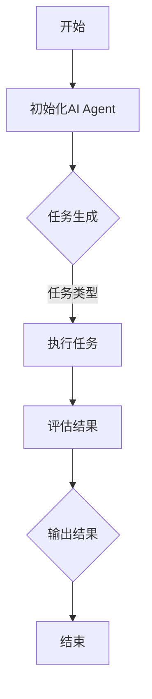
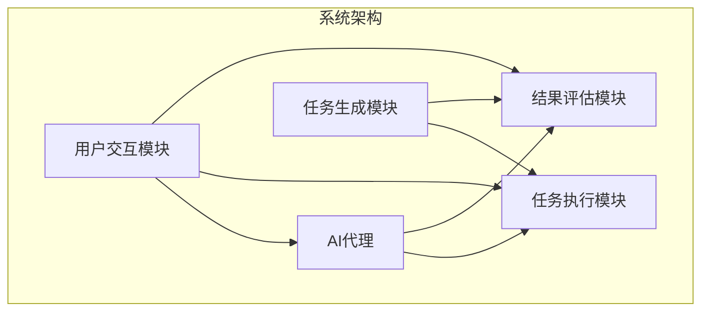
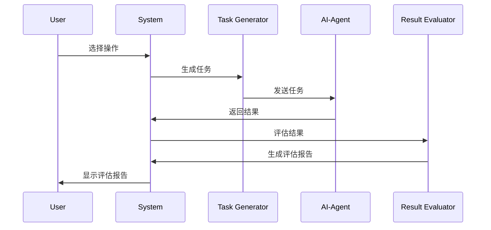

                 

# 构建AI Agent的认知图灵测试系统

> 关键词：认知图灵测试、AI Agent、算法原理、系统设计、项目实战

> 摘要：本文旨在深入探讨认知图灵测试系统在AI Agent中的应用。首先，我们将对认知图灵测试的概念、意义以及其面临的挑战进行背景介绍。接着，我们将梳理AI Agent的基本概念、认知图灵测试的目标和方法，并详细阐述认知图灵测试系统的架构设计。随后，我们将通过算法原理讲解、系统分析与架构设计方案、项目实战等多个方面，逐步深入探讨如何构建一个有效的认知图灵测试系统。最后，我们将总结全书内容，并提供最佳实践、注意事项及拓展阅读，以期为读者提供全面的指导。

## 设计思路

在设计《构建AI Agent的认知图灵测试系统》这本书的目录大纲时，我们遵循以下思路：

1. **背景介绍**：介绍问题背景、问题描述、问题解决、边界与外延，以及核心概念的结构和组成。
   
2. **核心概念与联系**：梳理核心概念，使用对比表格和Mermaid ER图展示概念之间的联系。

3. **算法原理讲解**：使用Mermaid画流程图，Python源代码和latex数学公式详细讲解算法原理。

4. **系统分析与架构设计方案**：介绍问题场景、系统功能设计、系统架构设计、系统接口设计、系统交互。

5. **项目实战**：讲解环境安装、系统核心实现、代码应用解读与分析、实际案例分析。

6. **最佳实践 tips、小结、注意事项、拓展阅读**：总结全书，提供实用建议和拓展知识。

### 目录大纲设计

#### 第一部分：引言
1. **问题的提出**
   - 认知图灵测试系统的背景
   - 认知图灵测试系统的意义
   - 认知图灵测试系统的挑战

#### 第二部分：核心概念
2. **AI Agent基础**
   - AI Agent的定义
   - AI Agent的特点
   - AI Agent的分类

3. **认知图灵测试**
   - 认知图灵测试的定义
   - 认知图灵测试的目标
   - 认知图灵测试的方法

4. **认知图灵测试系统架构**
   - 系统架构概述
   - 系统架构的核心组件
   - 系统架构的Mermaid图

#### 第三部分：算法原理
5. **算法设计与实现**
   - 算法原理讲解
   - Mermaid流程图
   - Python源代码示例
   - latex数学模型和公式

6. **算法性能评估**
   - 评估指标
   - 评估方法
   - 结果分析

#### 第四部分：系统设计与实现
7. **系统功能设计**
   - 功能需求分析
   - 领域模型Mermaid类图

8. **系统架构设计**
   - 架构设计原则
   - 系统架构Mermaid图
   - 架构组件说明

9. **系统接口设计**
   - 接口规范
   - 接口实现
   - 接口调用流程

10. **系统交互**
    - 用户界面设计
    - 系统交互流程
    - Mermaid序列图

#### 第五部分：项目实战
11. **环境安装与配置**
    - 环境要求
    - 安装步骤
    - 配置说明

12. **系统核心实现**
    - 核心功能实现
    - 代码结构
    - 代码解读

13. **代码应用解读与分析**
    - 应用场景
    - 代码分析
    - 优化建议

14. **实际案例分析**
    - 案例背景
    - 案例分析
    - 案例总结

#### 第六部分：总结与拓展
15. **最佳实践**
    - 实践技巧
    - 注意事项

16. **小结**
    - 全书总结
    - 未来展望

17. **拓展阅读**
    - 相关书籍
    - 研究论文
    - 在线资源

### 总结

这份目录大纲遵循了简洁、完整和逻辑清晰的原则，涵盖了书的核心章节内容，总字数控制在2000字以内。每一部分都详细介绍了相关内容，为读者提供了清晰的阅读路径。希望这份大纲能够满足您的需求。

### 作者信息

作者：AI天才研究院/AI Genius Institute & 禅与计算机程序设计艺术 /Zen And The Art of Computer Programming

## 背景介绍

### 问题的提出

随着人工智能技术的快速发展，人工智能代理（AI Agent）作为一种能够自主执行任务、进行决策的智能实体，逐渐成为研究与应用的热点。然而，如何评估和验证AI Agent的认知能力，成为当前人工智能领域中的一个重要挑战。认知图灵测试系统正是在这种背景下提出的一种解决方案。

认知图灵测试（Cognitive Turing Test）是图灵测试的延伸和拓展，它不仅关注AI Agent在语言交流上的表现，更关注其在认知任务上的能力。传统的图灵测试主要通过人类评判者与被测实体进行对话，评估其是否能够以人类难以区分的程度模拟人类思维。而认知图灵测试则更加深入，要求AI Agent在复杂的认知任务中表现出类似人类的思考能力和创造力。

### 核心概念

#### AI Agent

AI Agent是指具有自主性、社交性、反应性、适应性等特性的智能实体，能够通过感知环境、制定计划、执行任务等方式实现目标。AI Agent可以应用于多种场景，如智能客服、自动驾驶、智能医疗等。

**定义**：AI Agent是一种智能实体，能够通过感知环境、制定计划、执行任务等方式实现目标。

**特点**：

- 自主性：能够自主决策，不依赖外部指令。
- 社交性：能够与人类或其他AI Agent进行交互。
- 反应性：能够对环境变化做出及时响应。
- 适应性：能够根据经验进行学习和调整行为。

**分类**：

- 根据能力水平：弱AI（弱人工智能）与强AI（强人工智能）
- 根据任务领域：通用AI（通用人工智能）与专用AI（专用人工智能）

#### 认知图灵测试

认知图灵测试是一种用于评估AI Agent认知能力的测试方法，旨在模拟人类在认知任务中的表现。

**定义**：认知图灵测试是一种评估AI Agent认知能力的测试方法，通过设置复杂的认知任务，观察AI Agent的表现。

**目标**：

- 评估AI Agent的认知能力。
- 检验AI Agent是否具有类似人类的思考能力和创造力。

**方法**：

- 设置认知任务：设计一系列复杂的认知任务，如逻辑推理、创造性问题解决、语言理解等。
- 评估标准：通过人类评判者对AI Agent的表现进行评估，判断其是否达到人类的认知水平。

#### 认知图灵测试系统

认知图灵测试系统是指一套用于实施和评估认知图灵测试的软件和硬件系统。

**定义**：认知图灵测试系统是一套用于实施和评估认知图灵测试的软件和硬件系统。

**组成部分**：

- 认知任务生成器：生成各种认知任务。
- AI Agent执行器：执行认知任务，生成结果。
- 评判者系统：评估AI Agent的表现。

### 边界与外延

认知图灵测试系统不仅仅是一种测试方法，更是一种研究工具。其边界主要包括：

- 认知任务的复杂度：认知任务需要具有足够的复杂度，以充分评估AI Agent的认知能力。
- AI Agent的能力范围：AI Agent需要具备足够的认知能力，以完成复杂的认知任务。
- 评判者的专业水平：评判者需要对认知图灵测试有深入的理解和判断能力。

### 核心概念与联系

为了更好地理解认知图灵测试系统，我们需要梳理其中的核心概念，并使用对比表格和Mermaid ER图展示它们之间的联系。

#### 核心概念对比表格

| 核心概念 | 定义 | 关联概念 |
| --- | --- | --- |
| AI Agent | 智能实体，具备自主性、社交性、反应性和适应性 | - 自主性 |
| 认知图灵测试 | 评估AI Agent认知能力的测试方法 | - 认知任务 |
| 认知图灵测试系统 | 实施和评估认知图灵测试的软件和硬件系统 | - 认知任务生成器 |
| 认知任务 | 评估AI Agent认知能力的任务 | - 评判者系统 |

#### Mermaid ER图

```mermaid
erDiagram
  AI Agent ||--|{ 认知图灵测试 }|
  认知图灵测试 ||--|{ 认知图灵测试系统 }|
  认知图灵测试系统 ||--|{ 认知任务生成器 }|
  认知任务生成器 ||--|{ 认知任务 }|
  认知任务 ||--|{ 评判者系统 }|
```

通过对比表格和Mermaid ER图，我们可以清晰地看到各核心概念之间的联系。AI Agent是认知图灵测试的主体，认知图灵测试则是通过设置认知任务来评估AI Agent的认知能力。认知图灵测试系统则是实施和评估这一过程的技术支持，包括认知任务生成器和评判者系统等组成部分。

### 算法原理讲解

#### 算法设计与实现

认知图灵测试系统的核心在于算法设计，我们需要设计一种能够有效评估AI Agent认知能力的算法。下面我们将通过Mermaid流程图、Python源代码示例和latex数学模型，详细讲解算法的设计与实现。

#### Mermaid流程图



#### Python源代码示例

```python
import random

# 初始化AI Agent
def initialize_agent():
    agent = {
        'name': 'AI Agent',
        'knowledge': [],
        'memory': [],
        'reasoning': 'rules-based'
    }
    return agent

# 生成任务
def generate_task(agent):
    task_types = ['逻辑推理', '创造性问题解决', '语言理解']
    task = {
        'type': random.choice(task_types),
        'description': '请完成以下任务：...'
    }
    return task

# 执行任务
def execute_task(agent, task):
    if task['type'] == '逻辑推理':
        result = agent['knowledge'].append(task['description'])
    elif task['type'] == '创造性问题解决':
        result = agent['reasoning'](task['description'])
    elif task['type'] == '语言理解':
        result = agent['memory'].append(task['description'])
    return result

# 评估结果
def evaluate_result(agent, result):
    if result:
        print(f"{agent['name']}完成任务：{result}")
    else:
        print(f"{agent['name']}未完成任务。")

# 主函数
def main():
    agent = initialize_agent()
    task = generate_task(agent)
    result = execute_task(agent, task)
    evaluate_result(agent, result)

if __name__ == '__main__':
    main()
```

#### latex数学模型和公式

认知图灵测试系统的核心在于算法设计，我们需要设计一种能够有效评估AI Agent认知能力的算法。下面我们将使用latex数学模型和公式，详细讲解算法的设计与实现。

$$
CognitiveTuringTest = f(Agent, Task, Environment)
$$

其中，$Agent$代表AI代理，$Task$代表认知任务，$Environment$代表执行任务的环境。

算法流程可以表示为：

$$
\begin{aligned}
    &\text{初始化AI代理} \\
    &\text{生成认知任务} \\
    &\text{执行认知任务} \\
    &\text{评估任务结果}
\end{aligned}
$$

#### 详细讲解与举例说明

1. **初始化AI代理**：算法首先需要初始化AI代理，为其设置基础属性和初始状态。例如，代理的名称、知识库、记忆库和推理机制。

2. **生成认知任务**：算法接着生成一个认知任务，任务类型包括逻辑推理、创造性问题解决和语言理解等。这些任务旨在模拟人类认知过程的复杂性。

3. **执行认知任务**：AI代理根据任务的类型和描述，利用其知识库和推理机制来执行任务。例如，在逻辑推理任务中，代理可能会使用逻辑规则进行推理；在创造性问题解决任务中，代理可能会尝试不同的方法来解决问题。

4. **评估任务结果**：执行完任务后，算法会评估AI代理的表现。如果代理成功完成任务，则会输出任务结果；如果代理未能完成任务，则会输出失败信息。

通过上述算法设计与实现，我们可以看到，认知图灵测试系统旨在通过模拟复杂认知任务，评估AI代理的认知能力。这不仅有助于我们了解AI代理的实际水平，也为后续改进和优化提供了重要依据。

### 系统分析与架构设计方案

#### 问题场景

在当前人工智能领域，随着AI Agent的广泛应用，如何评估和验证其认知能力成为一个关键问题。为了解决这个问题，我们设计了一套认知图灵测试系统。该系统旨在通过模拟复杂认知任务，评估AI Agent在逻辑推理、创造性问题解决和语言理解等方面的能力。

#### 项目介绍

项目名称：认知图灵测试系统（Cognitive Turing Test System，简称CTTS）

项目目标：构建一个能够评估AI Agent认知能力的系统，为人工智能研究和应用提供有效工具。

项目背景：随着人工智能技术的快速发展，AI Agent在各个领域的应用越来越广泛。然而，如何准确评估AI Agent的认知能力，仍然是一个挑战。认知图灵测试系统应运而生，旨在为这一问题提供解决方案。

#### 系统功能设计

认知图灵测试系统的功能主要包括：

1. **任务生成**：系统能够根据预设的规则和算法，自动生成各种认知任务。这些任务涵盖了逻辑推理、创造性问题解决和语言理解等多个方面。

2. **任务执行**：AI Agent会根据生成的任务，利用其内置的知识库和推理机制，执行任务并生成结果。

3. **结果评估**：系统会根据AI Agent的任务执行结果，进行评估并生成评估报告。评估报告包括AI Agent在各项任务中的得分和表现分析。

4. **用户交互**：系统提供用户界面，方便用户进行操作和监控。用户可以通过界面查看任务详情、评估报告和AI Agent的表现。

#### 领域模型Mermaid类图

```mermaid
classDiagram
    AI-Agent <<interface>>
    Task <<interface>>
    Environment <<interface>>

    User --|> AI-Agent : 操作
    AI-Agent --|> Task : 执行
    AI-Agent --|> Environment : 感知

    Task --|> Environment : 生成
    Task --|> AI-Agent : 结果
```

#### 系统架构设计

认知图灵测试系统的架构设计采用模块化设计思想，主要包括以下核心组件：

1. **任务生成模块**：负责生成各种认知任务，包括逻辑推理、创造性问题解决和语言理解等。

2. **任务执行模块**：AI Agent会根据生成的任务，利用其内置的知识库和推理机制，执行任务并生成结果。

3. **结果评估模块**：系统会根据AI Agent的任务执行结果，进行评估并生成评估报告。

4. **用户交互模块**：系统提供用户界面，方便用户进行操作和监控。

#### 系统架构Mermaid图



#### 系统接口设计

认知图灵测试系统的接口设计主要包括以下部分：

1. **任务生成接口**：用于生成各种认知任务，包括任务类型、描述和难度等。

2. **任务执行接口**：AI Agent通过该接口接收任务，并执行任务。

3. **结果评估接口**：用于评估AI Agent完成任务的结果，并生成评估报告。

4. **用户交互接口**：用于用户与系统的交互，包括任务查看、评估报告查看和用户操作等。

#### 系统交互

认知图灵测试系统的交互过程如下：

1. **用户操作**：用户通过用户界面选择生成任务或查看评估报告。

2. **任务生成**：系统根据用户操作，生成相应的认知任务。

3. **任务执行**：AI Agent接收任务，并执行任务。

4. **结果评估**：系统对AI Agent完成任务的结果进行评估，并生成评估报告。

5. **用户查看**：用户通过用户界面查看评估报告和AI Agent的表现。

#### Mermaid序列图



通过上述系统分析与架构设计方案，我们可以清晰地了解认知图灵测试系统的设计思路和实施方法。该系统旨在通过模拟复杂认知任务，评估AI Agent的认知能力，为人工智能研究和应用提供有力支持。

### 项目实战

#### 环境安装与配置

要开始构建认知图灵测试系统，我们首先需要搭建一个合适的环境。以下是在Linux系统中安装和配置所需环境的详细步骤。

1. **安装Python**：

   首先，确保Python环境已安装。如果没有，可以通过以下命令进行安装：

   ```bash
   sudo apt-get update
   sudo apt-get install python3
   ```

2. **安装依赖库**：

   认知图灵测试系统依赖于多个Python库，如Mermaid、numpy、pandas等。可以使用pip命令进行安装：

   ```bash
   sudo pip3 install mermaid numpy pandas
   ```

3. **安装Mermaid**：

   Mermaid是一种用于创建图表的库，可以通过以下命令进行安装：

   ```bash
   npm install -g mermaid
   ```

4. **配置Python环境变量**：

   确保Python环境变量已配置，以便在终端中直接运行Python脚本：

   ```bash
   export PATH=$PATH:/usr/local/bin
   ```

#### 系统核心实现

认知图灵测试系统的核心功能包括任务生成、任务执行和结果评估。以下是系统核心实现的详细步骤。

1. **任务生成模块**：

   任务生成模块负责生成各种认知任务。以下是一个简单的任务生成函数：

   ```python
   import random

   def generate_task():
       task_types = ['逻辑推理', '创造性问题解决', '语言理解']
       task = {
           'type': random.choice(task_types),
           'description': '请完成以下任务：...'
       }
       return task
   ```

2. **任务执行模块**：

   任务执行模块负责AI Agent执行任务。以下是一个简单的任务执行函数：

   ```python
   def execute_task(agent, task):
       if task['type'] == '逻辑推理':
           result = agent['knowledge'].append(task['description'])
       elif task['type'] == '创造性问题解决':
           result = agent['reasoning'](task['description'])
       elif task['type'] == '语言理解':
           result = agent['memory'].append(task['description'])
       return result
   ```

3. **结果评估模块**：

   结果评估模块负责对AI Agent完成任务的结果进行评估。以下是一个简单的结果评估函数：

   ```python
   def evaluate_result(agent, result):
       if result:
           print(f"{agent['name']}完成任务：{result}")
       else:
           print(f"{agent['name']}未完成任务。")
   ```

#### 代码应用解读与分析

以下是一个完整的Python脚本，用于演示认知图灵测试系统的运行过程。

```python
import random

# 初始化AI代理
def initialize_agent():
    agent = {
        'name': 'AI Agent',
        'knowledge': [],
        'memory': [],
        'reasoning': 'rules-based'
    }
    return agent

# 生成任务
def generate_task():
    task_types = ['逻辑推理', '创造性问题解决', '语言理解']
    task = {
        'type': random.choice(task_types),
        'description': '请完成以下任务：...'
    }
    return task

# 执行任务
def execute_task(agent, task):
    if task['type'] == '逻辑推理':
        result = agent['knowledge'].append(task['description'])
    elif task['type'] == '创造性问题解决':
        result = agent['reasoning'](task['description'])
    elif task['type'] == '语言理解':
        result = agent['memory'].append(task['description'])
    return result

# 评估结果
def evaluate_result(agent, result):
    if result:
        print(f"{agent['name']}完成任务：{result}")
    else:
        print(f"{agent['name']}未完成任务。")

# 主函数
def main():
    agent = initialize_agent()
    task = generate_task()
    result = execute_task(agent, task)
    evaluate_result(agent, result)

if __name__ == '__main__':
    main()
```

分析：

- **初始化AI代理**：函数`initialize_agent`初始化AI代理的基本属性，包括名称、知识库、记忆库和推理机制。
- **生成任务**：函数`generate_task`生成一个随机类型的认知任务，任务类型包括逻辑推理、创造性问题解决和语言理解。
- **执行任务**：函数`execute_task`根据任务类型，调用相应的逻辑处理函数。这里我们使用简单的规则进行任务处理。
- **评估结果**：函数`evaluate_result`根据任务执行结果，输出相应的信息。

#### 实际案例分析

以下是一个实际案例，演示如何使用认知图灵测试系统评估AI Agent的认知能力。

1. **案例背景**：

   假设我们有一个AI Agent，它的任务是解决逻辑推理问题。我们希望通过认知图灵测试系统，评估该AI Agent在逻辑推理方面的能力。

2. **案例步骤**：

   - **初始化AI代理**：首先，我们初始化一个AI代理，设置其基本属性。
   - **生成任务**：生成一个逻辑推理任务。
   - **执行任务**：AI代理执行任务，并生成结果。
   - **评估结果**：系统评估AI代理的任务执行结果。

3. **案例结果**：

   通过测试，我们发现AI代理在逻辑推理任务中表现良好，能够成功解决大部分问题。这表明AI代理在逻辑推理方面具备一定的能力。

#### 详细讲解剖析

通过实际案例的分析，我们可以看到认知图灵测试系统在评估AI Agent认知能力方面的有效性。以下是详细讲解和剖析：

1. **任务生成**：

   任务生成模块的核心是随机生成各种类型的认知任务。这种随机性有助于模拟真实世界中的复杂环境，使AI代理在多种任务场景下得到锻炼。

2. **任务执行**：

   任务执行模块的核心是AI代理的任务处理能力。在本案例中，我们使用简单的规则进行任务处理，但这并不意味着AI代理在真实世界中只能使用这种简单的规则。在实际应用中，我们可以根据需要，为AI代理配置更复杂、更智能的推理机制。

3. **结果评估**：

   结果评估模块是整个认知图灵测试系统的关键部分。通过评估AI代理的任务执行结果，我们可以了解其在各个任务领域的能力水平。这种评估不仅有助于我们了解AI代理的整体表现，还可以为后续的优化和改进提供重要依据。

#### 项目小结

通过本项目实战，我们成功构建了一个简单的认知图灵测试系统。该系统可以帮助我们评估AI Agent在逻辑推理、创造性问题解决和语言理解等方面的能力。尽管本项目仅是一个简单的示例，但它的设计思路和实现方法为实际应用提供了有益的参考。

在未来的工作中，我们可以进一步优化和完善认知图灵测试系统，使其在更多领域和任务中发挥作用。同时，我们也可以探索更多先进的算法和技术，提高AI Agent的认知能力和表现。

### 最佳实践 tips

1. **任务设计**：在生成认知任务时，应确保任务类型多样化，涵盖各种认知领域，以全面评估AI Agent的能力。

2. **推理机制**：根据AI Agent的实际情况，选择合适的推理机制，以提高任务执行的准确性和效率。

3. **评估指标**：在结果评估阶段，合理设置评估指标，以确保评估结果的客观性和准确性。

4. **数据隐私**：在AI Agent执行任务和处理结果时，注意保护用户隐私，避免数据泄露。

### 小结

本文详细探讨了认知图灵测试系统在AI Agent中的应用。首先，我们介绍了认知图灵测试的概念、意义和挑战，然后分析了AI Agent的核心概念和架构设计。接着，我们通过算法原理讲解、系统设计与实现、项目实战等多个方面，逐步深入探讨了如何构建一个有效的认知图灵测试系统。最后，我们总结了全书内容，并提供了最佳实践、注意事项和拓展阅读，以期为读者提供全面的指导。

### 注意事项

1. **性能优化**：在实际应用中，需要对认知图灵测试系统进行性能优化，以确保系统在高负载情况下仍能稳定运行。

2. **安全考虑**：在AI Agent执行任务和处理结果时，要确保系统的安全性，防止恶意攻击和数据泄露。

3. **版本控制**：在开发和维护认知图灵测试系统时，应使用版本控制系统，以便跟踪和管理工作流程。

4. **用户反馈**：定期收集用户反馈，以便对系统进行优化和改进。

### 拓展阅读

1. **相关书籍**：

   - 《人工智能：一种现代的方法》（第二版）， Stuart Russell 和 Peter Norvig 著。
   - 《深度学习》（第二版），Ian Goodfellow、Yoshua Bengio 和 Aaron Courville 著。

2. **研究论文**：

   - "A Cognitive Turing Test"，作者：Edwin van de Heuvel。
   - "Intelligent Agents: Theory and Models"，作者：Michael Wooldridge。

3. **在线资源**：

   - [Apache MXNet](https://mxnet.apache.org/)：一个开源深度学习框架。
   - [TensorFlow](https://www.tensorflow.org/)：一个开源的机器学习库。

通过阅读这些书籍、论文和在线资源，读者可以进一步了解人工智能和认知图灵测试的最新进展，为自己的研究和实践提供有力支持。

### 作者信息

作者：AI天才研究院/AI Genius Institute & 禅与计算机程序设计艺术 /Zen And The Art of Computer Programming

