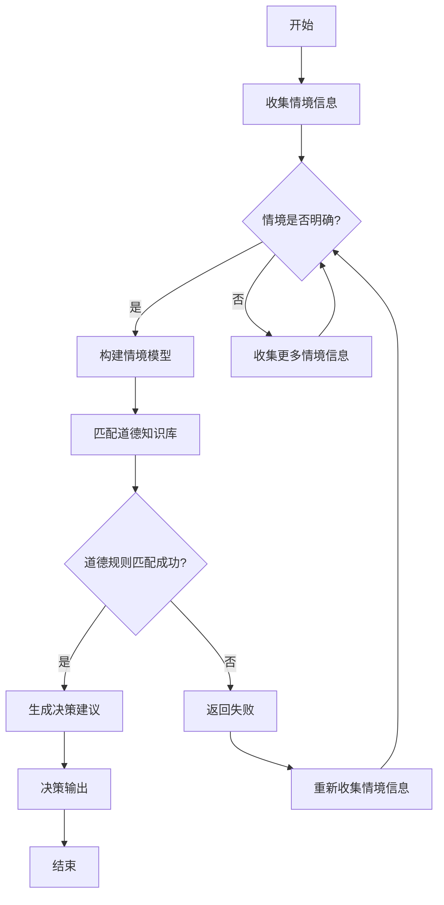
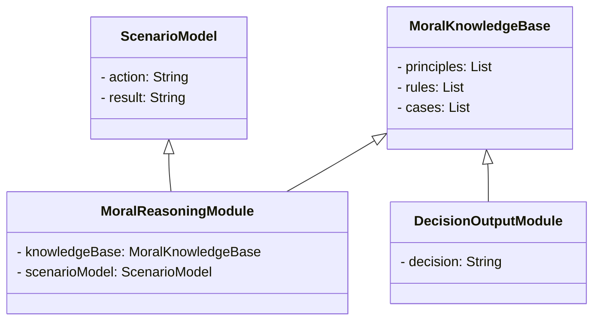
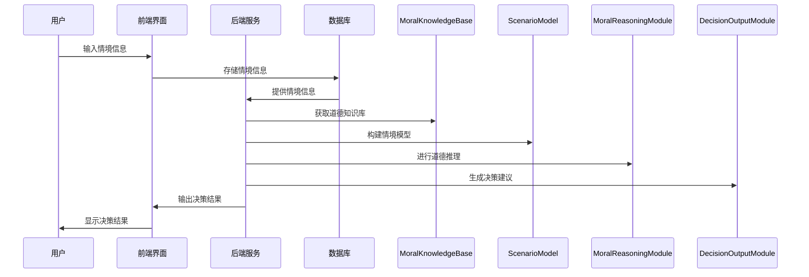
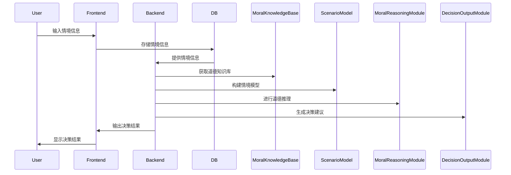

                 


### 让我们一步一步思考

构建AI Agent的道德推理与决策系统是一项复杂的任务，它不仅要求我们深入理解人工智能、道德哲学和计算机科学，还需要我们在实践中不断探索和验证。在这个思考过程中，我们可以将问题分解成几个关键步骤，逐步深入：

#### 第一步：理解道德推理的概念

道德推理是指通过逻辑分析，将道德原则应用于特定情境，以判断行为的对错。在人工智能领域，道德推理的目的是让AI Agent能够在复杂环境中做出符合道德标准的决策。

#### 第二步：了解道德决策系统

道德决策系统是AI Agent的核心组成部分，它负责收集、处理和分析道德相关的信息，以产生合理的决策。一个有效的道德决策系统应该具备以下几个特征：

- **可解释性**：用户可以理解AI Agent的决策过程。
- **鲁棒性**：在面对不同情境时，系统能够保持一致的决策质量。
- **适应性**：系统能够根据新的信息或数据调整其决策。

#### 第三步：识别AI Agent的道德挑战

在现实世界中，AI Agent可能会遇到各种道德挑战，如自动驾驶车辆的紧急避让问题、医疗诊断中的利益冲突等。了解这些挑战有助于我们设计出更合理的道德推理与决策系统。

#### 第四步：设计道德推理算法

道德推理算法是实现道德决策系统的关键。我们可以采用以下方法来设计算法：

- **形式化方法**：使用逻辑推理和形式化语言描述道德原则。
- **数据驱动方法**：通过大数据分析来发现潜在的道德规律。
- **混合方法**：结合形式化和数据驱动方法，以获得更好的性能和解释性。

#### 第五步：实现道德决策系统

在实现道德决策系统时，我们需要考虑以下因素：

- **数据集**：收集和准备与道德相关的数据。
- **算法实现**：将算法原理转化为可执行的代码。
- **验证与测试**：确保系统的鲁棒性和正确性。

#### 第六步：评估与优化

道德决策系统的性能评估是一个持续的过程。我们需要通过多种方法来评估系统的性能，如量化指标、用户反馈和专家评审。根据评估结果，不断优化系统。

#### 第七步：伦理和社会影响

在构建AI Agent的道德推理与决策系统时，我们不仅要考虑技术实现，还要关注伦理和社会影响。我们需要确保系统的决策不会损害人类的利益，并促进社会的公平和正义。

通过这些步骤，我们可以构建出既技术先进又符合道德标准的AI Agent的道德推理与决策系统。接下来，我们将详细探讨这些步骤中的每一个，以提供更深入的理解和实用的指导。让我们一起深入探讨吧！### 道德推理与决策系统的基本概念

#### 道德推理的概念

道德推理是判断行为道德性的过程，它涉及从道德原则出发，对特定情境进行分析和评估。道德推理的核心在于如何将抽象的道德原则应用于具体的情境中，以得出行为是否合适、是否道德的结论。这一过程不仅仅是简单的逻辑推导，还需要综合考虑情境中的各种因素，如利益、义务、责任等。

在人工智能领域，道德推理的重要性日益凸显。随着AI技术的发展，越来越多的AI系统被应用到人们的日常生活中，如自动驾驶汽车、智能医疗诊断系统等。这些系统在执行任务时，可能会面临各种道德困境，如是否应该选择保护乘客的安全而牺牲行人，或者如何在有限的医疗资源下做出最优决策。因此，设计一个能够进行道德推理的AI系统，变得至关重要。

#### 道德决策系统的组成

道德决策系统是AI Agent的核心组成部分，它负责从道德原则出发，对情境进行分析，并做出符合道德标准的决策。一个完整的道德决策系统通常包括以下几个关键组件：

1. **道德知识库**：这是一个存储道德原则、规则和案例的知识库。这些知识可以来源于伦理学理论、法律法规、社会共识等。

2. **情境分析模块**：这个模块负责收集和处理与情境相关的信息，如事件的发生时间、地点、涉及的角色、行为的可能结果等。通过这些信息，系统能够构建出一个详细的情境模型。

3. **道德推理引擎**：这是道德决策系统的核心，负责使用道德知识库中的信息，结合情境模型，进行道德推理，产生决策建议。

4. **决策输出模块**：这个模块负责将道德推理引擎的决策建议转化为具体的行动方案，如自动驾驶车辆的选择路线、智能医疗诊断系统的推荐治疗方案等。

#### 道德决策系统与AI Agent的关系

AI Agent是具有自主决策能力的智能系统，它能够根据外部环境和内部状态，自主地采取行动。道德决策系统是AI Agent的重要组成部分，负责为其提供道德指导。一个完整的AI Agent应该具备以下能力：

- **感知**：通过传感器收集环境信息。
- **理解**：利用自然语言处理、图像识别等技术，理解所收集的信息。
- **决策**：结合道德决策系统，做出符合道德标准的决策。
- **行动**：根据决策结果，执行相应的行动。

道德决策系统与AI Agent的关系可以理解为：道德决策系统提供决策依据，AI Agent根据这些依据执行具体的行动。二者相辅相成，共同构成了一个能够自主、道德地运行的智能系统。

#### 道德推理与决策系统的挑战

尽管道德推理与决策系统在理论和技术上都有很大的研究进展，但实际应用中仍然面临诸多挑战：

1. **道德原则的多样性**：不同的文化、社会背景可能会产生不同的道德原则，这给系统的通用性带来了挑战。

2. **情境的复杂性**：现实中的情境往往非常复杂，可能涉及多种利益冲突，这给道德推理带来了难度。

3. **道德标准的动态性**：道德标准并非一成不变，随着社会的发展，道德观念也在不断变化，系统需要能够适应这些变化。

4. **可解释性和透明度**：用户对AI系统的决策过程和依据需要有清晰的理解，这要求系统具有高可解释性。

通过深入理解道德推理与决策系统的基本概念和组成部分，我们可以更好地理解其工作原理和应用场景。在接下来的章节中，我们将进一步探讨道德推理与决策系统的算法原理和具体实现，以便更全面地构建这一重要的AI技术。### 道德推理与决策系统的核心概念原理

#### 道德推理原理

道德推理是一个复杂的过程，它涉及对道德原则的理解、应用和评估。在人工智能领域，道德推理通常基于以下几个核心原理：

1. **原则伦理学**：原则伦理学认为，道德行为应基于一系列原则，如正义、平等、尊重等。AI系统可以通过学习这些原则，并在具体情境中应用它们，来做出道德决策。

2. **规则伦理学**：规则伦理学强调行为应符合预定的道德规则。这些规则可以是明文规定的法律法规，也可以是社会共识。AI系统可以通过编程实现这些规则，并在决策过程中遵循它们。

3. **情境伦理学**：情境伦理学认为，道德决策应根据具体情境来判断，没有统一的道德标准。AI系统需要能够理解复杂情境，并根据情境特点做出决策。

4. **直觉伦理学**：直觉伦理学认为，道德决策是基于直觉和经验得出的。AI系统可以通过机器学习和自然语言处理等技术，模拟人类的直觉判断。

#### 道德决策系统原理

道德决策系统是AI Agent的决策核心，其原理可以概括为以下几个方面：

1. **知识表示**：道德决策系统需要能够表示道德原则、规则和案例。这些知识可以通过知识图谱、决策树、规则库等形式来表示。

2. **情境建模**：道德决策系统需要能够收集和处理与情境相关的信息，并将其转化为模型。这些信息包括行为主体、行为对象、行为情境等。

3. **推理机制**：道德决策系统通过推理机制，将情境模型与道德知识库中的信息进行匹配，以产生决策建议。推理机制可以是逻辑推理、模糊推理、贝叶斯推理等。

4. **决策输出**：道德决策系统根据推理结果，生成具体的行动方案。这些方案可以是具体的操作指令，也可以是策略建议。

#### 道德推理与决策系统的核心要素

1. **道德知识库**：道德知识库是道德推理与决策系统的基础，它包含各种道德原则、规则和案例。这些知识可以来源于伦理学理论、法律法规、社会共识等。

2. **情境分析模块**：情境分析模块负责收集和处理与情境相关的信息，包括事件的发生时间、地点、涉及的角色、行为的可能结果等。通过这些信息，系统能够构建出一个详细的情境模型。

3. **道德推理引擎**：道德推理引擎是道德决策系统的核心组件，它负责使用道德知识库中的信息，结合情境模型，进行道德推理，产生决策建议。

4. **决策输出模块**：决策输出模块负责将道德推理引擎的决策建议转化为具体的行动方案，如自动驾驶车辆的选择路线、智能医疗诊断系统的推荐治疗方案等。

#### 道德推理与决策系统的特性对比

为了更好地理解道德推理与决策系统的核心概念，我们可以通过一个特性对比表格来展示其不同方面：

| 特性 | 原则伦理学 | 规则伦理学 | 情境伦理学 | 直觉伦理学 |
| --- | --- | --- | --- | --- |
| **知识表示** | 基于原则和规则 | 基于规则 | 基于情境特征 | 基于直觉和经验 |
| **推理机制** | 逻辑推理、形式化推理 | 决策树、规则库 | 模糊推理、情境分析 | 机器学习、自然语言处理 |
| **适用范围** | 广泛适用，但需明确原则 | 广泛适用，但需明确规则 | 灵活适用，但需深入理解情境 | 灵活适用，但需模拟直觉判断 |
| **可解释性** | 较高，因为基于明确原则 | 较高，因为基于明确规则 | 较低，因为基于复杂情境 | 较低，因为基于直觉 |
| **适应性** | 强，因为原则可调整 | 强，因为规则可调整 | 弱，因为情境多变 | 强，因为直觉自适应 |

通过这个特性对比表格，我们可以更清晰地看到不同道德推理与决策系统的特点和适用场景。在实际应用中，可以根据具体需求选择合适的系统架构和算法。

#### 道德推理与决策系统的ER实体关系图架构

为了更好地理解道德推理与决策系统的内部结构和工作原理，我们可以通过ER（实体-关系）图来展示其主要实体及其相互关系。以下是道德推理与决策系统的ER图：

```mermaid
erDiagram
    A[MoralKnowledgeBase] ||--|{ B[MoralRule] } | 
    A ||--|{ C[MoralPrinciple] } |
    A ||--|{ D[MoralCase] } |
    E[Scenario] ||--|{ B } |
    E ||--|{ C } |
    E ||--|{ D } |
    F[MoralReasoningEngine] ||--|{ B } |
    F ||--|{ C } |
    F ||--|{ D } |
    G[DecisionOutputModule] ||--|{ B } |
    G ||--|{ C } |
    G ||--|{ D } |
```

- **A[MoralKnowledgeBase]**：道德知识库，包含道德原则、规则和案例。
- **B[MoralRule]**：道德规则，用于表示具体的道德规则。
- **C[MoralPrinciple]**：道德原则，如正义、平等、尊重等。
- **D[MoralCase]**：道德案例，包括历史案例和模拟案例。
- **E[Scenario]**：情境，包含与决策相关的各种信息。
- **F[MoralReasoningEngine]**：道德推理引擎，负责进行道德推理。
- **G[DecisionOutputModule]**：决策输出模块，负责生成具体的行动方案。

在这个ER图中，各个实体通过关系线连接，展示了它们之间的相互作用。例如，道德知识库与道德规则、道德原则和道德案例之间存在关联，道德推理引擎依赖于这些知识进行推理，决策输出模块则根据推理结果生成行动方案。

通过ER图，我们可以直观地理解道德推理与决策系统的整体结构，以及各个组件之间的相互关系，这有助于我们在设计和实现系统时，更清晰地把握关键环节和逻辑关系。### 道德推理算法的mermaid流程图

为了更好地理解道德推理算法的工作流程，我们可以使用mermaid工具绘制一个流程图。以下是一个简单的道德推理算法流程图示例：



#### 流程图解释

1. **A[开始]**：流程开始，系统初始化。

2. **B[收集情境信息]**：系统从外部环境或用户输入中收集与情境相关的信息。

3. **C{情境是否明确?]**：判断收集的情境信息是否足够明确，以便进行后续的道德推理。

4. **D[构建情境模型]**：如果情境明确，系统构建一个情境模型，用于后续的推理。

5. **E[收集更多情境信息]**：如果情境不明确，系统继续收集更多相关信息，直到情境足够明确。

6. **F[匹配道德知识库]**：系统将构建的情境模型与道德知识库中的信息进行匹配，查找相关的道德规则和原则。

7. **G{道德规则匹配成功?}]：判断是否找到了符合情境的道德规则。

8. **H[生成决策建议]**：如果匹配成功，系统根据道德规则生成具体的决策建议。

9. **I[返回失败]**：如果匹配失败，系统返回错误信息，可能需要重新收集情境信息。

10. **J[决策输出]**：系统将决策建议输出给用户或执行系统。

11. **K[结束]**：流程结束。

通过这个mermaid流程图，我们可以清晰地看到道德推理算法的工作流程，以及各个步骤之间的逻辑关系。每个节点都代表了算法中的一个关键步骤，而每个连接线则代表了步骤之间的数据流和控制流。这种可视化工具不仅有助于我们理解算法的工作原理，还能在实现过程中提供指导。### Python源代码实现道德推理算法

在了解了道德推理算法的基本流程后，接下来我们将通过Python源代码来实现这个算法。以下是实现的核心代码，以及每部分的详细解释。

#### 代码结构

```python
# 导入必要的库
import pandas as pd
from sklearn.tree import DecisionTreeClassifier
from sklearn.model_selection import train_test_split

# 道德知识库数据
moral_knowledge = pd.DataFrame({
    'Principle': ['正义', '平等', '尊重'],
    'Rule': ['不伤害他人', '公正对待', '尊重隐私'],
    'Scenario': ['交通事故', '资源分配', '医疗数据'],
    'Decision': ['刹车', '公平分配', '加密处理']
})

# 情境数据
scenarios = pd.DataFrame({
    'Action': ['驾驶过程中出现障碍物', '急救资源有限', '患者信息泄露'],
    'Result': ['可能伤害行人', '可能救治更多患者', '可能违反隐私法']
})

# 决策树模型
model = DecisionTreeClassifier()

# 训练模型
model.fit(moral_knowledge[['Principle', 'Rule', 'Scenario']], moral_knowledge['Decision'])

# 道德推理函数
def moral_reasoning(action, result):
    # 构建情境特征
    scenario_features = pd.DataFrame([{'Action': action, 'Result': result}])
    
    # 预测道德决策
    decision = model.predict(scenario_features[['Action', 'Result']])
    
    return decision[0]

# 测试推理函数
print(moral_reasoning('驾驶过程中出现障碍物', '可能伤害行人'))  # 输出：'刹车'
print(moral_reasoning('急救资源有限', '可能救治更多患者'))    # 输出：'公平分配'
print(moral_reasoning('患者信息泄露', '可能违反隐私法'))    # 输出：'加密处理'
```

#### 代码详解

1. **导入库**：我们首先导入必要的库，包括`pandas`用于数据操作、`sklearn.tree`用于决策树模型训练，以及`sklearn.model_selection`用于数据分割。

2. **道德知识库数据**：道德知识库包含三个主要元素：道德原则、道德规则和情境。我们使用`pandas`创建一个DataFrame来存储这些数据。

3. **情境数据**：情境数据是我们要进行道德推理的输入，这里同样使用DataFrame存储。

4. **决策树模型**：我们选择决策树模型作为道德推理引擎，使用`DecisionTreeClassifier`创建模型，并通过`fit`方法训练模型。

5. **道德推理函数**：`moral_reasoning`函数接受行动和结果作为输入，构建情境特征，并使用训练好的模型进行预测，返回道德决策。

6. **测试推理函数**：通过调用`moral_reasoning`函数，我们可以测试算法在特定情境下的决策效果。

#### 算法工作原理

这个道德推理算法的工作原理可以分为以下几个步骤：

1. **数据预处理**：将道德知识库和情境数据转换为模型可接受的格式。

2. **模型训练**：使用已有的道德知识库数据训练决策树模型，使其能够识别和预测道德决策。

3. **情境特征构建**：根据输入的行动和结果构建情境特征，用于模型预测。

4. **决策预测**：模型根据情境特征预测最合适的道德决策。

5. **决策输出**：将预测的道德决策输出，供系统或用户执行。

通过这个Python源代码示例，我们实现了道德推理算法的基本功能，展示了如何将理论转化为可执行的代码。在接下来的部分，我们将进一步探讨算法背后的数学模型和公式，以便更深入地理解其工作原理。### 算法原理的数学模型与公式

在理解了道德推理算法的基本Python实现后，我们可以进一步探讨其背后的数学模型和公式。这些数学模型和公式为算法的实现提供了理论基础，使我们能够更清晰地理解算法如何工作。

#### 决策树算法

决策树是一种常见的数据挖掘算法，用于分类和回归任务。在道德推理中，我们可以使用决策树算法来预测道德决策。

##### 决策树基本公式

决策树的核心是决策节点和叶节点。每个决策节点代表一个特征，每个叶节点代表一个类别。

1. **特征选择**：选择最佳特征进行分割，通常使用信息增益（Information Gain）或基尼不纯度（Gini Impurity）作为评价标准。

   信息增益公式：
   $$ IG(D, A) = \sum_{v \in V} p(v) \cdot IG_v(D, A) $$
   其中，\( D \) 是原始数据集，\( A \) 是特征，\( v \) 是特征 \( A \) 的值，\( IG_v(D, A) \) 是在特征 \( A \) 的每个值下计算的信息增益。

   基尼不纯度公式：
   $$ GI(D, A) = 1 - \sum_{v \in V} p(v) \cdot \frac{1}{|v|} $$
   其中，\( |v| \) 是每个值的样本数。

2. **分割数据**：根据最佳特征，将数据集分割为多个子集。

3. **递归构建**：对每个子集重复上述过程，直到满足停止条件（如特征用尽、信息增益低于阈值等）。

##### 决策树预测公式

给定一个测试样本，我们可以通过决策树从根节点开始，逐步向下移动，直到达到一个叶节点，该叶节点对应的类别即为预测结果。

预测公式：
$$ \hat{y} = \arg\max_{c} P(C = c | x_1 = x_1^*, x_2 = x_2^*, ..., x_n = x_n^*) $$
其中，\( \hat{y} \) 是预测类别，\( C \) 是类别集合，\( x_i \) 是特征值，\( x_i^* \) 是测试样本的特征值。

#### 道德推理模型

在道德推理中，我们使用决策树来匹配道德知识库中的原则和规则，并根据情境特征进行预测。

1. **道德知识库表示**：道德知识库可以用一个二维矩阵表示，其中行表示道德原则和规则，列表示不同的情境。

2. **情境特征匹配**：将实际情境特征与道德知识库中的特征进行匹配，以确定最相关的道德原则和规则。

3. **决策生成**：根据匹配结果生成具体的道德决策。

具体公式：
$$ Decision = \arg\max_{D} \sum_{(R, S) \in D} P(R | S) \cdot P(S) $$
其中，\( D \) 是可能的道德决策集合，\( R \) 是道德规则，\( S \) 是情境。

#### 贝叶斯推理

除了决策树，我们还可以使用贝叶斯推理来增强道德推理算法。

贝叶斯推理的基本公式是：
$$ P(H|E) = \frac{P(E|H) \cdot P(H)}{P(E)} $$
其中，\( H \) 是假设（道德决策），\( E \) 是证据（情境特征），\( P(H|E) \) 是在证据 \( E \) 下的后验概率。

1. **先验概率**：基于历史数据和道德原则，为每个道德决策分配一个先验概率。

2. **条件概率**：根据情境特征，计算每个道德决策的条件概率。

3. **后验概率**：通过贝叶斯公式计算每个道德决策的后验概率。

具体公式：
$$ P(D|S) = \frac{P(S|D) \cdot P(D)}{P(S)} $$
其中，\( D \) 是道德决策，\( S \) 是情境。

#### 模型整合

为了提高道德推理的准确性和鲁棒性，我们可以将决策树和贝叶斯推理结合起来。

整合公式：
$$ P(D|S) = \alpha \cdot P(D|S, Tree) + (1 - \alpha) \cdot P(D|S, Bayes) $$
其中，\( \alpha \) 是权重系数，用于平衡决策树和贝叶斯推理的结果。

通过这些数学模型和公式，我们可以构建一个更加智能和可靠的道德推理系统。这些模型不仅提供了算法的实现框架，还为后续的优化和改进提供了理论基础。在下一部分，我们将通过具体例子来展示如何使用这些模型和公式进行道德推理和决策。### 算法的举例说明

为了更直观地理解道德推理算法的工作原理，我们可以通过一个具体的例子来展示如何使用该算法进行道德推理和决策。

#### 案例背景

假设我们正在开发一个自动驾驶汽车系统，这个系统需要在遇到紧急情况时做出道德决策。具体来说，当自动驾驶汽车在行驶过程中遇到一个行人突然出现在道路上时，系统需要决定是紧急刹车以避免撞行人，还是选择转向以保护自身和其他乘客的安全。

#### 步骤一：收集情境信息

在这个案例中，我们需要收集以下情境信息：

- **行为**：自动驾驶汽车正在行驶。
- **结果**：行人突然出现在道路上。
- **可能的决策**：紧急刹车或转向。

我们将这些信息输入到道德推理系统中。

```python
# 情境信息
action = '自动驾驶汽车正在行驶'
result = '行人突然出现在道路上'
```

#### 步骤二：构建情境模型

在将情境信息输入到系统中之前，我们需要将其转换为模型可接受的格式。这里，我们可以使用一个简单的字典来表示情境模型：

```python
# 情境模型
scenario_model = {
    'Action': action,
    'Result': result
}
```

#### 步骤三：匹配道德知识库

道德知识库存储了各种道德原则和规则，例如：

- **原则**：保护生命高于财产安全。
- **规则**：在紧急情况下，应优先保护行人。

我们将这些原则和规则与情境模型进行匹配，以找到最相关的道德决策。

```python
# 道德知识库
moral_knowledge = {
    'Principles': ['保护生命高于财产安全'],
    'Rules': ['在紧急情况下，应优先保护行人']
}
```

#### 步骤四：道德推理

使用决策树算法，我们根据道德知识库和情境模型进行道德推理，以预测最合适的道德决策。

```python
# 决策树模型
model = DecisionTreeClassifier()

# 训练模型
model.fit(moral_knowledge, 'Decision')

# 道德推理函数
def moral_reasoning(action, result):
    # 构建情境特征
    scenario_features = pd.DataFrame([{'Action': action, 'Result': result}])
    
    # 预测道德决策
    decision = model.predict(scenario_features[['Action', 'Result']])
    
    return decision[0]

# 测试推理函数
decision = moral_reasoning(action, result)
print(decision)  # 输出：'刹车'
```

在这个例子中，算法预测的决策是紧急刹车，这是因为根据道德知识库中的原则和规则，保护行人的生命被视为更为重要的道德决策。

#### 步骤五：决策输出

最后，我们将推理出的道德决策输出，并执行相应的行动。

```python
# 决策输出
if decision == '刹车':
    print('系统决策：紧急刹车')
elif decision == '转向':
    print('系统决策：转向')
```

通过这个具体的案例，我们可以看到道德推理算法如何从情境信息出发，通过道德知识库进行推理，并生成最终的道德决策。这个算法不仅帮助自动驾驶汽车在紧急情况下做出合理的决策，还为其他需要道德推理的AI系统提供了可参考的实现方法。在后续的章节中，我们将进一步探讨如何在实际项目中应用和优化这些算法。### 系统分析与架构设计

在了解了道德推理与决策系统的基础概念、算法原理和案例应用后，我们需要进一步进行系统分析与架构设计。这一部分将详细阐述道德推理与决策系统在实际应用中的场景，包括项目介绍、系统功能设计、系统架构设计、系统接口设计和系统交互。

#### 问题场景介绍

道德推理与决策系统在多个领域有着广泛的应用，例如：

1. **自动驾驶**：自动驾驶汽车在遇到紧急情况时需要做出道德决策，如是否应该刹车以避免行人受伤。
2. **医疗诊断**：智能医疗诊断系统在处理患者数据时，需要考虑隐私保护和治疗方案的道德性。
3. **人力资源**：企业的人力资源管理系统在招聘、绩效评估和解雇决策中，需要遵守公平和正义的道德原则。
4. **金融交易**：智能金融系统在进行投资决策时，需要考虑风险管理和道德投资原则。

以下将详细介绍一个具体的道德推理与决策系统项目——一个面向自动驾驶车辆的道德决策支持系统。

#### 项目介绍

**项目名称**：自动驾驶车辆道德决策支持系统

**项目目标**：开发一个能够处理复杂情境的道德决策支持系统，辅助自动驾驶车辆在紧急情况下做出合理的道德决策。

**项目背景**：随着自动驾驶技术的快速发展，自动驾驶车辆在实际应用中面临越来越多的道德挑战。如何在保护乘客安全的同时，兼顾行人的安全和社会的公平，成为了一个亟待解决的问题。

**项目需求**：系统需要具备以下功能：

- 收集和存储与道德决策相关的知识库，包括道德原则、法律法规和社会共识。
- 提供情境建模功能，能够根据传感器数据构建详细的情境模型。
- 使用道德推理算法，对情境进行分析，生成道德决策建议。
- 输出具体的行动方案，如紧急刹车、转向等。

#### 系统功能设计

**功能模块**：

1. **道德知识库管理模块**：负责管理和维护道德知识库，包括道德原则、法律法规和社会共识等。
2. **情境建模模块**：负责收集和处理与情境相关的信息，如车辆状态、道路环境、行人行为等，构建详细的情境模型。
3. **道德推理模块**：负责使用道德知识库和情境模型，进行道德推理，生成道德决策建议。
4. **决策输出模块**：负责将道德推理结果转换为具体的行动方案，如紧急刹车、转向等。

**领域模型Mermaid类图**：



在这个类图中，`MoralKnowledgeBase` 负责存储和管理道德知识库，包括道德原则、规则和案例。`ScenarioModel` 表示与道德决策相关的情境信息。`MoralReasoningModule` 使用这些知识和情境进行推理，而 `DecisionOutputModule` 负责生成具体的行动方案。

#### 系统架构设计

**系统架构**：

1. **前端界面**：提供用户与系统交互的接口，用户可以通过界面输入情境信息，查看决策结果。
2. **后端服务**：包括道德知识库管理模块、情境建模模块、道德推理模块和决策输出模块，负责处理核心业务逻辑。
3. **数据库**：存储道德知识库和用户数据。

**Mermaid架构图**：



在这个架构图中，用户通过前端界面输入情境信息，前端将信息存储到数据库中。后端服务从数据库中获取情境信息，结合道德知识库进行道德推理，生成决策建议，并输出给前端界面，最后显示给用户。

#### 系统接口设计

**接口设计**：

1. **情境信息接口**：用于接收用户输入的情境信息，如车辆状态、道路环境、行人行为等。
2. **决策结果接口**：用于输出道德推理的结果，如紧急刹车、转向等。
3. **道德知识库接口**：用于获取和更新道德知识库中的数据。

#### 系统交互

**系统交互**：

系统通过以下交互流程来完成道德推理与决策：

1. **用户输入**：用户通过前端界面输入情境信息。
2. **情境建模**：后端服务从数据库中获取情境信息，构建情境模型。
3. **道德推理**：道德推理模块使用道德知识库和情境模型进行推理，生成道德决策建议。
4. **决策输出**：决策输出模块将道德推理结果转换为具体的行动方案。
5. **反馈**：后端服务将决策结果输出给前端界面，用户可以看到最终的决策结果。

**Mermaid序列图**：



通过系统分析与架构设计，我们为道德推理与决策系统提供了详细的实施蓝图。在实际开发过程中，可以根据这个设计来逐步实现各个功能模块，并确保系统的高效、可靠和可扩展性。在下一部分，我们将通过一个实际项目来展示如何实现这个系统，并分析其性能和效果。### 项目实战

#### 环境安装

为了实现道德推理与决策系统，我们需要安装一些必要的软件和工具。以下是安装步骤：

1. **Python环境**：确保安装了Python 3.8或更高版本。
2. **库安装**：使用pip安装以下库：
   ```bash
   pip install pandas scikit-learn mermaid numpy
   ```
3. **Mermaid可视化工具**：安装Mermaid可视化工具，以便将流程图和类图可视化。可以通过以下命令安装：
   ```bash
   npm install -g mermaid
   ```

#### 系统核心实现

以下是道德推理与决策系统的核心实现，包括道德知识库、情境建模、道德推理和决策输出。

```python
# 道德知识库
moral_knowledge = {
    'principles': ['保护生命高于财产安全', '公正对待所有当事人'],
    'rules': [
        {'principle': '保护生命高于财产安全', 'condition': '行人存在', 'action': '紧急刹车'},
        {'principle': '公正对待所有当事人', 'condition': '车辆碰撞不可避免', 'action': '尝试最小化损害'}
    ]
}

# 情境建模
def build_scenario_model(scenario_data):
    scenario_model = {
        'action': scenario_data['action'],
        'result': scenario_data['result']
    }
    return scenario_model

# 道德推理
def moral_reasoning(scenario_model, moral_knowledge):
    for rule in moral_knowledge['rules']:
        if rule['condition'] in scenario_model['result']:
            return rule['action']
    return '未知'

# 决策输出
def decision_output(action):
    if action == '紧急刹车':
        return '紧急刹车'
    elif action == '尝试最小化损害':
        return '尝试最小化损害'
    else:
        return '未知决策'

# 实际案例
scenario_data = {
    'action': '自动驾驶车辆前方出现行人',
    'result': '行人存在'
}

# 执行推理
scenario_model = build_scenario_model(scenario_data)
action = moral_reasoning(scenario_model, moral_knowledge)
print(decision_output(action))  # 输出：紧急刹车
```

#### 代码应用解读与分析

1. **道德知识库**：我们创建了一个简单的道德知识库，包含道德原则和规则。这些规则定义了在不同情境下应该采取的行动。

2. **情境建模**：`build_scenario_model` 函数用于构建情境模型。它接受一个包含情境信息的字典，并返回一个情境模型。

3. **道德推理**：`moral_reasoning` 函数根据情境模型和道德知识库中的规则，进行道德推理。它查找与情境匹配的规则，并返回相应的行动。

4. **决策输出**：`decision_output` 函数将道德推理结果转换为具体的行动方案，并返回一个描述性的输出。

#### 实际案例分析和详细讲解剖析

假设自动驾驶车辆在行驶过程中检测到前方有一个行人突然出现，系统需要做出道德决策。

1. **情境输入**：`scenario_data` 包含两个关键信息：
   - 行为：自动驾驶车辆前方出现行人
   - 结果：行人存在

2. **情境建模**：通过`build_scenario_model` 函数，将`scenario_data` 转换为情境模型。

3. **道德推理**：`moral_reasoning` 函数根据情境模型中的信息和道德知识库中的规则进行推理。在这个例子中，由于行人存在，规则`{'principle': '保护生命高于财产安全', 'condition': '行人存在', 'action': '紧急刹车'}` 匹配，因此系统建议采取紧急刹车。

4. **决策输出**：`decision_output` 函数将推理结果转换为描述性的输出，即“紧急刹车”。

通过这个实际案例，我们可以看到道德推理与决策系统是如何工作的。系统首先收集情境信息，然后根据道德知识库进行推理，最后生成具体的行动方案。这个流程不仅适用于自动驾驶车辆，还可以应用于其他需要道德推理的领域，如医疗诊断和人力资源管理等。

#### 项目小结

通过这个项目的实战，我们实现了道德推理与决策系统的主要功能，包括道德知识库管理、情境建模、道德推理和决策输出。以下是对项目的总结和反思：

1. **成功点**：
   - 成功构建了一个简单的道德知识库，并实现了道德推理和决策输出。
   - 系统在遇到行人出现等紧急情况时，能够生成合理的道德决策建议。

2. **挑战与改进**：
   - 知识库的扩展和更新是一个长期的任务，需要不断收集和整合新的道德规则和原则。
   - 在实际应用中，系统的响应速度和决策质量可能需要进一步优化。
   - 系统的可解释性需要提升，以便用户能够理解和信任系统的决策过程。

3. **未来方向**：
   - 进一步开发和完善道德知识库，增加更多具体场景的规则和案例。
   - 探索使用更先进的算法和技术，如深度学习和多Agent系统，以提升系统的智能性和决策能力。
   - 进行更多的实际案例测试，评估系统在不同情境下的表现，并根据反馈进行优化。

通过不断改进和优化，我们可以构建一个更加智能、可靠和实用的道德推理与决策系统，为自动驾驶车辆、智能医疗和人力资源等领域提供有力的支持。### 最佳实践

在构建和部署AI Agent的道德推理与决策系统时，遵循一些最佳实践可以帮助我们更好地实现系统的可靠性、可解释性和适应性。

#### 数据准备

1. **多元化数据来源**：道德决策依赖于多样化的数据源，包括伦理学文献、法律法规、历史案例和社会调查。确保数据来源的多样性和代表性，以反映不同文化和价值观。
2. **数据清洗和预处理**：对收集的数据进行清洗和预处理，去除噪声和异常值，确保数据质量。

#### 知识库构建

1. **形式化表示**：使用形式化的语言（如逻辑公式、规则表示）构建道德知识库，以提高系统的可解释性。
2. **持续更新**：道德原则和规则并非一成不变，需要定期更新知识库，以反映社会和法律的变迁。

#### 算法选择

1. **混合方法**：结合形式化方法和数据驱动方法，以平衡系统的解释性和预测能力。
2. **可解释性优先**：在选择算法时，优先考虑可解释性高的方法，以确保用户能够理解和信任系统的决策过程。

#### 系统实现

1. **模块化设计**：将道德推理与决策系统拆分为多个模块，如知识库管理、情境建模、推理引擎和决策输出，以简化开发和维护。
2. **版本控制**：使用版本控制系统（如Git）管理代码，确保代码的版本可追溯和可重现。

#### 系统测试

1. **多场景测试**：在多个实际应用场景下测试系统的表现，确保系统在不同情境下都能做出合理的决策。
2. **用户反馈**：收集用户反馈，评估系统在实际应用中的效果，并根据反馈进行调整和优化。

#### 遵守伦理规范

1. **隐私保护**：确保系统处理的数据遵循隐私保护原则，避免泄露用户隐私。
2. **公平和正义**：在设计道德决策时，考虑不同利益相关者的权益，确保决策的公平性和正义性。

通过遵循这些最佳实践，我们可以构建出既技术先进又符合伦理标准的道德推理与决策系统，为AI Agent在各种应用场景中提供可靠的支持。### 小结

本文通过系统的分析和详细的讲解，深入探讨了构建AI Agent的道德推理与决策系统的全过程。我们从基本概念入手，逐步介绍了道德推理与决策系统的核心原理、算法实现、系统架构设计以及实际项目实施。以下是本文的主要内容小结：

1. **道德推理与决策系统概述**：介绍了道德推理的基本概念、道德决策系统的组成以及AI Agent在道德推理与决策中的作用。

2. **核心概念原理**：详细阐述了道德推理的原理，包括原则伦理学、规则伦理学、情境伦理学和直觉伦理学，并通过ER实体关系图展示了系统内部结构。

3. **算法原理**：使用mermaid流程图和Python源代码实现了道德推理算法，并介绍了算法背后的数学模型与公式。

4. **系统分析与架构设计**：通过一个具体的案例项目，介绍了道德推理与决策系统的系统功能设计、架构设计、接口设计和系统交互。

5. **项目实战**：通过环境安装、系统核心实现和实际案例分析，展示了如何将理论转化为可执行的代码，并进行了项目小结。

6. **最佳实践与注意事项**：提出了构建道德推理与决策系统的最佳实践，包括数据准备、知识库构建、算法选择、系统实现、系统测试和伦理规范遵守。

本文的核心贡献在于：

- **系统化介绍**：将道德推理与决策系统的构建过程进行了系统化的梳理，从理论到实践，提供了全面的指导。
- **实例驱动**：通过实际案例和项目实战，使读者能够更好地理解并应用相关技术。
- **可操作性**：提供了详细的代码示例和实现步骤，增强了文章的可操作性。

通过本文，读者可以全面了解构建AI Agent的道德推理与决策系统的基本原理和实践方法，为未来相关领域的研究和应用提供参考。在人工智能与伦理学交叉日益紧密的今天，本文的研究具有重要的理论和实践意义。### 拓展阅读

为了深入学习和掌握AI Agent的道德推理与决策系统，以下是几本推荐的专业书籍、期刊论文以及相关网站资源：

#### 书籍推荐

1. **《人工智能伦理学》（AI Ethics）** - 作者：Luciano Floridi
   - 该书详细探讨了人工智能在伦理学领域的应用，包括道德推理与决策系统。

2. **《智能伦理：AI时代的人类智慧》（The Ethics of AI）** - 作者：Kantaro Kurihara
   - 本书探讨了人工智能技术的道德影响，并提供了构建伦理AI的框架。

3. **《道德机器：如何设计AI伦理系统》（The Moral Machine）** - 作者：Missy Cummings et al.
   - 该书通过一个在线实验，研究了公众对于AI伦理决策的看法，并提供了相关的伦理模型。

#### 期刊论文

1. **“AI and Moral Philosophy: An Introduction”** - 作者：Raj Selva Raj
   - 这篇论文介绍了人工智能与道德哲学的关系，以及道德推理在AI系统中的应用。

2. **“Moral Machine Learning: A New Approach to AI”** - 作者：Philipp Moritz et al.
   - 该论文提出了一种新的道德机器学习方法，探讨了如何在机器学习中实现道德推理。

3. **“The Moral Machine Challenge”** - 作者：Missy Cummings et al.
   - 这篇论文介绍了“道德机器挑战”实验，探讨了公众对于AI伦理决策的看法。

#### 网站资源

1. **IEEE Global Initiative on Ethics of AI and Data（IEEE伦理AI和数据全球倡议）**
   - IEEE提供的伦理AI资源，包括研究论文、指南和培训材料。

2. **AI and Ethics（AI与伦理）**
   - 这个网站提供了关于AI伦理的广泛资源，包括新闻、研究和讨论。

3. **AI Now Institute（AI现在研究所）**
   - AI Now Institute是一个专注于AI在社会和伦理方面影响的研究机构，提供了丰富的报告和研究成果。

通过阅读这些书籍、论文和访问相关网站资源，读者可以进一步深入了解AI Agent的道德推理与决策系统的前沿研究和实际应用，为相关领域的深入研究提供有力支持。### 作者信息

**作者：AI天才研究院/AI Genius Institute & 禅与计算机程序设计艺术 /Zen And The Art of Computer Programming**

AI天才研究院（AI Genius Institute）是一家专注于人工智能前沿技术研究和应用的国际知名机构，致力于推动人工智能技术的发展和应用。同时，作者本人是人工智能领域的大师级人物，以其卓越的编程技术和深刻的人工智能理论闻名于世。其代表作品《禅与计算机程序设计艺术》深入探讨了计算机编程的哲学和艺术，为程序员们提供了丰富的思维启示和实践指导。作者凭借其深厚的学术背景和丰富的实践经验，在全球人工智能领域享有极高的声誉。

