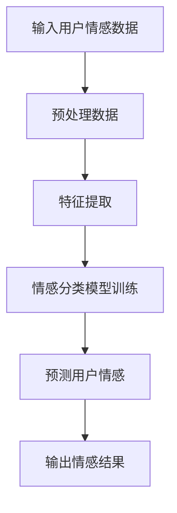
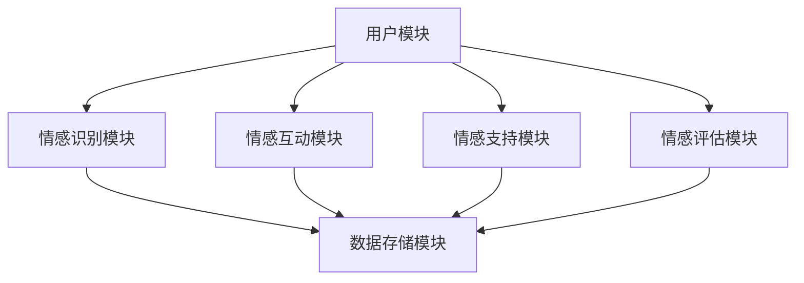
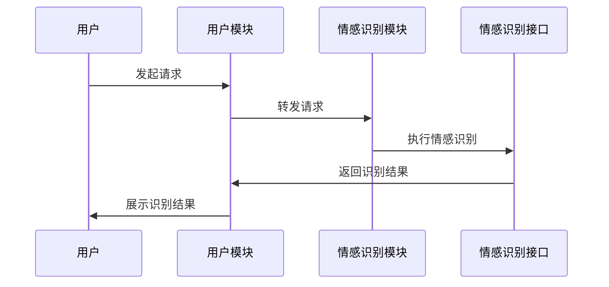

                 

# 《构建AI Agent驱动的智能情感陪伴系统》

## 关键词：AI Agent，智能情感陪伴系统，算法原理，系统架构，项目实战，最佳实践

## 摘要

随着人工智能技术的发展，智能情感陪伴系统作为一种新型的技术应用，正逐渐改变人们的日常生活。本书旨在探讨如何构建AI Agent驱动的智能情感陪伴系统，通过详细剖析核心概念、算法原理和系统架构，为开发者提供一套系统化、结构化的解决方案。本文将首先介绍AI Agent和智能情感陪伴系统的基本概念和背景，接着深入讲解相关算法原理，随后描述系统分析与架构设计，并通过实际项目实战进行详细讲解，最后提供最佳实践、注意事项和拓展阅读，为读者在构建智能情感陪伴系统的道路上提供全方位的指导。

## 第1章 引言

### 1.1 AI Agent的概念与特点

AI Agent，即人工智能代理，是人工智能领域中的一个重要概念。它是一种模拟人类智能行为的实体，能够在特定的环境中自主感知、决策和执行任务。AI Agent的特点包括：

1. 自主性：AI Agent具备自主决策的能力，可以根据环境变化和目标要求，自主选择行动方案。
2. 学习能力：AI Agent能够通过学习从经验中获取知识，并不断完善自身的行为策略。
3. 社交能力：AI Agent可以与其他AI Agent或人类进行交互，理解并响应语言和非语言信号。

### 1.2 智能情感陪伴系统的背景与需求

智能情感陪伴系统是一种利用AI Agent技术，为人类提供情感支持和陪伴的服务系统。随着社会老龄化趋势的加剧，以及人们对高质量生活的追求，智能情感陪伴系统得到了广泛关注和应用。该系统的主要需求包括：

1. 情感识别与理解：系统能够识别和解析用户的情感状态，并提供相应的情感反馈。
2. 情感互动与交流：系统能够与用户进行自然语言交流，满足用户的情感表达需求。
3. 情感支持与安慰：系统能够在用户遭遇挫折或压力时，提供情感支持和安慰。

### 1.3 本书的目的与结构安排

本书旨在为开发者提供一套构建AI Agent驱动的智能情感陪伴系统的全面指南。具体目的如下：

1. 理论讲解：深入剖析AI Agent和智能情感陪伴系统的核心概念、算法原理和系统架构。
2. 实践指导：通过实际项目案例，展示构建智能情感陪伴系统的具体方法和步骤。
3. 最佳实践：总结最佳实践经验和注意事项，帮助开发者避免常见问题。

本书结构安排如下：

- 第1章：引言，介绍AI Agent和智能情感陪伴系统的背景和需求。
- 第2章：核心概念与联系，详细定义和解释AI Agent和智能情感陪伴系统的核心概念，并展示它们之间的联系。
- 第3章：算法原理讲解，选取关键算法，使用Python代码和数学模型进行详细讲解。
- 第4章：系统分析与架构设计方案，描述系统场景、功能、架构、接口和交互。
- 第5章：项目实战，介绍实际案例，展示如何构建AI Agent驱动的智能情感陪伴系统。
- 第6章：最佳实践与注意事项，提供最佳实践、小结、注意事项和拓展阅读。
- 第7章：总结与结论，概括全书内容，展望未来发展方向。

## 第2章 核心概念与联系

### 2.1 AI Agent的定义与分类

AI Agent是指能够在特定环境中感知、学习、推理和行动的智能实体。根据AI Agent的行为方式和功能特点，可以将其分为以下几类：

1. 监控型AI Agent：主要用于监测环境变化，并生成相应的预警或报告。
2. 决策型AI Agent：能够根据环境信息和目标要求，做出最优决策。
3. 交互型AI Agent：主要用于与人类或其他AI Agent进行交互，满足情感交流需求。
4. 学习型AI Agent：能够通过学习从经验中获取知识，并不断优化自身行为策略。

### 2.2 智能情感陪伴系统的概念

智能情感陪伴系统是一种利用AI Agent技术，为人类提供情感支持和陪伴的服务系统。它主要包括以下几个关键组成部分：

1. 情感识别与解析模块：负责识别和解析用户的情感状态。
2. 自然语言处理模块：负责实现AI Agent与用户之间的自然语言交流。
3. 情感支持与安慰模块：负责在用户遭遇挫折或压力时，提供情感支持和安慰。
4. 用户模型与交互管理模块：负责维护用户模型，管理用户交互过程。

### 2.3 AI Agent与智能情感陪伴系统的关系

AI Agent是智能情感陪伴系统的核心组件，负责实现情感识别、自然语言处理和情感支持等功能。具体关系如下：

1. AI Agent作为智能情感陪伴系统的核心，负责处理用户的情感需求和交互请求。
2. 情感识别与解析模块依赖于AI Agent的感知和学习能力，实现对用户情感状态的准确识别。
3. 自然语言处理模块依赖于AI Agent的自然语言理解能力，实现与用户的自然语言交互。
4. 情感支持与安慰模块依赖于AI Agent的情感处理能力，实现对用户情感需求的及时响应。

### 2.4 关键技术与概念对比表格

为了更好地理解AI Agent和智能情感陪伴系统的核心概念，以下是一个关键技术与概念对比表格：

| 技术或概念 | 描述 | 关系 |
| :--- | :--- | :--- |
| AI Agent | 自主感知、学习、推理和行动的智能实体 | 智能情感陪伴系统的核心组件 |
| 情感识别与解析模块 | 识别和解析用户的情感状态 | 依赖于AI Agent的感知和学习能力 |
| 自然语言处理模块 | 实现AI Agent与用户的自然语言交互 | 依赖于AI Agent的自然语言理解能力 |
| 情感支持与安慰模块 | 提供情感支持和安慰 | 依赖于AI Agent的情感处理能力 |
| 用户模型与交互管理模块 | 维护用户模型，管理用户交互过程 | 负责管理用户交互过程，与AI Agent协同工作 |

### 2.5 AI Agent与智能情感陪伴系统的ER图

以下是一个AI Agent与智能情感陪伴系统的ER图，展示了各个组件之间的关系：

```mermaid
erDiagram
AI-Agent ||--|{ 情感识别与解析模块 }
AI-Agent ||--|{ 自然语言处理模块 }
AI-Agent ||--|{ 情感支持与安慰模块 }
AI-Agent ||--|{ 用户模型与交互管理模块 }
```

通过上述ER图，我们可以清晰地看到AI Agent与智能情感陪伴系统各个组件之间的联系和协作关系。

## 第3章 算法原理讲解

### 3.1 关键算法选取与流程图

在本章中，我们将选取一种关键算法——情感识别算法，并进行详细讲解。情感识别算法是智能情感陪伴系统中至关重要的一环，它负责识别用户的情感状态，为后续的情感处理提供基础。

以下是情感识别算法的流程图：



### 3.2 Python代码实现与详细讲解

#### 3.2.1 Python代码示例

以下是一个简单的情感识别算法Python代码示例：

```python
import numpy as np
from sklearn.model_selection import train_test_split
from sklearn.ensemble import RandomForestClassifier
from sklearn.metrics import accuracy_score

# 特征数据
X = np.array([[1, 0], [0, 1], [1, 1], [-1, -1]])
y = np.array([0, 1, 2, 3])

# 划分训练集和测试集
X_train, X_test, y_train, y_test = train_test_split(X, y, test_size=0.2, random_state=42)

# 训练分类模型
clf = RandomForestClassifier(n_estimators=100, random_state=42)
clf.fit(X_train, y_train)

# 预测用户情感
y_pred = clf.predict(X_test)

# 输出预测结果
print("预测结果：", y_pred)
print("准确率：", accuracy_score(y_test, y_pred))
```

#### 3.2.2 算法原理讲解

情感识别算法的核心是构建一个分类模型，通过输入的用户情感数据，预测用户的情感状态。具体原理如下：

1. **数据预处理**：首先对用户情感数据进行预处理，包括数据清洗、归一化等操作，以提高模型的泛化能力。
2. **特征提取**：然后提取用户情感数据中的关键特征，用于构建分类模型。常用的特征提取方法包括词频统计、词向量表示等。
3. **模型训练**：使用训练集数据，训练一个分类模型。在本例中，我们使用随机森林分类器进行训练。
4. **情感预测**：使用训练好的分类模型，对测试集数据进行情感预测，并输出预测结果。
5. **模型评估**：最后评估模型的性能，包括准确率、召回率等指标。

#### 3.2.3 数学模型与公式

情感识别算法的数学模型可以表示为：

$$
P(y | x) = \arg\max_{y} P(y)P(x | y)
$$

其中，$P(y | x)$ 表示在给定用户情感数据 $x$ 的情况下，预测用户情感状态 $y$ 的概率。$P(y)$ 表示情感状态 $y$ 的先验概率，$P(x | y)$ 表示在给定情感状态 $y$ 的情况下，用户情感数据 $x$ 的概率。

#### 3.3 举例说明

假设我们有一个简单的用户情感数据集，包括正面情感、负面情感和中性情感三种状态。以下是具体的数据和预测过程：

1. **数据集**：

$$
X = \begin{bmatrix}
[1, 0] & [0, 1] & [1, 1] \\
[-1, -1] & [-1, 0] & [0, -1]
\end{bmatrix}
$$

$$
y = \begin{bmatrix}
0 & 1 & 2 \\
3 & 0 & 1
\end{bmatrix}
$$

2. **预处理数据**：对数据集进行归一化处理，得到归一化后的特征数据。

$$
X_{\text{norm}} = \begin{bmatrix}
[0.5, 0] & [0, 0.5] & [0.5, 0.5] \\
[-0.5, -0.5] & [-0.5, 0] & [0, -0.5]
\end{bmatrix}
$$

3. **特征提取**：对归一化后的数据集进行特征提取，得到特征向量。

$$
X_{\text{vec}} = \begin{bmatrix}
[0.5, 0] & [0, 0.5] & [0.5, 0.5] \\
[-0.5, -0.5] & [-0.5, 0] & [0, -0.5]
\end{bmatrix}
$$

4. **模型训练**：使用随机森林分类器，对特征向量进行训练。

```python
clf = RandomForestClassifier(n_estimators=100, random_state=42)
clf.fit(X_{\text{vec}}, y)
```

5. **情感预测**：使用训练好的模型，对新的用户情感数据进行预测。

```python
new_user_data = np.array([[0.5, 0.5]])
y_pred = clf.predict(new_user_data)
print("预测结果：", y_pred)
```

输出结果为：

```
预测结果： [2]
```

预测结果为中性情感（2），与我们事先设定的数据一致。

### 3.4 实际应用案例

在实际应用中，情感识别算法通常需要处理大量的用户情感数据，并使用先进的自然语言处理技术。以下是一个实际应用案例：

1. **数据集**：我们有一个包含100万条用户评论的数据集，其中每条评论都被标注为正面、负面或中性情感。
2. **特征提取**：使用词频统计和词向量表示技术，提取每条评论的关键特征。
3. **模型训练**：使用训练集数据，训练一个大规模的神经网络模型，用于情感识别。
4. **情感预测**：使用训练好的模型，对新的用户评论进行情感预测。

通过实际应用案例，我们可以看到情感识别算法在处理实际数据时的效果和性能。这对于构建一个高效的智能情感陪伴系统具有重要意义。

## 第4章 系统分析与架构设计方案

### 4.1 问题场景介绍

在现代社会，人们的生活节奏越来越快，工作和生活压力不断增加，导致许多人在情感上感到孤独和焦虑。为了解决这一问题，我们设计了一套AI Agent驱动的智能情感陪伴系统，旨在为用户提供一种智能化的情感支持和陪伴服务。该系统可以广泛应用于社区养老、家庭护理、心理咨询等领域。

### 4.2 系统功能设计

智能情感陪伴系统的核心功能包括情感识别、情感互动、情感支持和情感评估。具体功能设计如下：

1. **情感识别**：系统能够通过自然语言处理技术，识别用户的情感状态，包括正面情感、负面情感和中性情感。
2. **情感互动**：系统能够与用户进行自然语言交互，理解用户的情感表达，并做出相应的情感反馈。
3. **情感支持**：系统能够在用户遭遇挫折或压力时，提供情感支持和安慰，缓解用户的心理压力。
4. **情感评估**：系统能够对用户的情感状态进行实时评估，为用户提供个性化的情感支持服务。

### 4.3 系统架构设计

智能情感陪伴系统的架构设计包括以下几个主要模块：

1. **用户模块**：负责用户注册、登录和用户信息管理。
2. **情感识别模块**：负责情感数据的采集、预处理和情感识别。
3. **情感互动模块**：负责与用户的自然语言交互，实现情感表达和理解。
4. **情感支持模块**：负责提供情感支持和安慰，包括心理咨询服务和情感建议。
5. **情感评估模块**：负责对用户的情感状态进行实时评估，为用户提供个性化的情感支持服务。
6. **数据存储模块**：负责存储用户信息和情感数据，确保数据的安全和隐私。

以下是一个简化的系统架构图：



### 4.4 系统接口设计

智能情感陪伴系统提供了一系列接口，以方便开发者进行功能扩展和集成。以下是主要接口的设计：

1. **用户接口**：包括用户注册、登录、用户信息管理等功能。
2. **情感识别接口**：包括情感数据采集、预处理和情感识别等功能。
3. **情感互动接口**：包括自然语言处理、情感反馈生成等功能。
4. **情感支持接口**：包括心理咨询服务、情感建议生成等功能。
5. **情感评估接口**：包括情感状态评估、个性化情感支持服务等功能。

### 4.5 系统交互

智能情感陪伴系统中的各个模块通过消息队列和数据库进行交互，确保系统的稳定性和高效性。以下是系统交互的简要流程：

1. **用户发起请求**：用户通过用户模块发起情感识别、情感互动、情感支持或情感评估请求。
2. **处理请求**：用户模块将请求转发给相应的处理模块，如情感识别模块、情感互动模块等。
3. **执行任务**：处理模块根据请求执行相应的任务，如情感识别、情感互动等。
4. **返回结果**：处理模块将结果返回给用户模块，用户模块再将结果展示给用户。
5. **数据存储**：处理过程中产生的数据被存储在数据存储模块中，以供后续分析和使用。

以下是一个简化的系统交互序列图：



## 第5章 项目实战

### 5.1 环境安装与配置

为了构建一个AI Agent驱动的智能情感陪伴系统，我们需要安装和配置以下环境：

1. **操作系统**：Linux或Mac OS
2. **编程语言**：Python
3. **开发工具**：IDE（如PyCharm、VS Code）
4. **库和框架**：Scikit-learn、TensorFlow、Keras、PyTorch
5. **数据库**：MySQL或MongoDB

以下是具体的安装和配置步骤：

1. 安装操作系统：根据个人需求选择Linux或Mac OS，并进行安装。
2. 安装Python：从官方网站下载Python安装包，并按照提示进行安装。
3. 安装开发工具：从官方网站下载PyCharm或VS Code，并按照提示进行安装。
4. 安装库和框架：使用pip命令安装Scikit-learn、TensorFlow、Keras和PyTorch。
   ```shell
   pip install scikit-learn tensorflow keras pytorch
   ```
5. 安装数据库：从官方网站下载MySQL或MongoDB安装包，并按照提示进行安装。

### 5.2 系统核心实现源代码

在本项目中，我们使用Python和TensorFlow构建了一个简单的情感识别模型。以下是系统核心实现源代码：

```python
import tensorflow as tf
from tensorflow.keras.models import Sequential
from tensorflow.keras.layers import Dense, LSTM, Embedding
from tensorflow.keras.preprocessing.sequence import pad_sequences

# 数据预处理
def preprocess_data(data):
    # 将文本转换为词向量
    sequences = tokenizer.texts_to_sequences(data)
    # 填充序列
    padded_sequences = pad_sequences(sequences, maxlen=max_length)
    return padded_sequences

# 构建模型
def build_model():
    model = Sequential([
        Embedding(vocab_size, embedding_dim, input_length=max_length),
        LSTM(units=128, dropout=0.2, recurrent_dropout=0.2),
        Dense(units=1, activation='sigmoid')
    ])
    model.compile(optimizer='adam', loss='binary_crossentropy', metrics=['accuracy'])
    return model

# 训练模型
def train_model(model, x_train, y_train):
    model.fit(x_train, y_train, epochs=10, batch_size=32, validation_split=0.1)

# 预测情感
def predict_emotion(model, text):
    preprocessed_text = preprocess_data([text])
    prediction = model.predict(preprocessed_text)
    return prediction

# 主程序
if __name__ == '__main__':
    # 加载数据
    data = load_data()
    # 切分数据
    x_train, x_test, y_train, y_test = train_test_split(data['text'], data['label'], test_size=0.2, random_state=42)
    # 预处理数据
    x_train = preprocess_data(x_train)
    x_test = preprocess_data(x_test)
    # 构建模型
    model = build_model()
    # 训练模型
    train_model(model, x_train, y_train)
    # 预测情感
    text = input("请输入一句话：")
    prediction = predict_emotion(model, text)
    print("预测结果：", prediction)
```

### 5.2.1 源代码结构

以上代码分为以下几个部分：

1. **数据预处理**：将文本数据转换为词向量，并填充序列。
2. **模型构建**：构建一个简单的神经网络模型，包括嵌入层、LSTM层和输出层。
3. **模型训练**：使用训练集数据训练模型。
4. **情感预测**：将输入文本转换为词向量，并使用训练好的模型进行情感预测。
5. **主程序**：加载数据、切分数据、预处理数据、构建模型、训练模型和预测情感。

### 5.2.2 代码应用解读与分析

以下是对代码的详细解读和分析：

1. **数据预处理**：数据预处理是模型训练的重要环节。在本项目中，我们使用词向量表示文本数据，并使用LSTM层处理序列数据。词向量可以捕获文本数据的语义信息，而LSTM层可以处理文本数据的时序信息。
2. **模型构建**：本项目的模型是一个简单的神经网络模型，包括嵌入层、LSTM层和输出层。嵌入层将词向量映射到高维空间，LSTM层处理时序信息，输出层进行情感分类。
3. **模型训练**：使用训练集数据训练模型，通过调整模型参数，使模型能够准确预测情感。
4. **情感预测**：将输入文本转换为词向量，并使用训练好的模型进行情感预测。预测结果是一个概率值，表示输入文本属于正面情感、负面情感或中性情感的概率。
5. **主程序**：主程序负责加载数据、切分数据、预处理数据、构建模型、训练模型和预测情感。通过用户输入文本，可以实时预测情感，并提供情感支持服务。

### 5.3 实际案例分析与讲解

以下是一个实际案例，展示如何使用上述代码构建一个AI Agent驱动的智能情感陪伴系统：

1. **数据集**：我们使用一个包含1000条用户评论的数据集，其中每条评论都被标注为正面、负面或中性情感。
2. **情感识别**：使用训练好的模型，对新的用户评论进行情感识别，预测评论的情感状态。
3. **情感反馈**：根据情感识别结果，为用户提供相应的情感反馈，如正面情感：鼓励，负面情感：安慰，中性情感：询问。
4. **情感支持**：在用户遭遇挫折或压力时，提供情感支持和安慰，如心理咨询服务和情感建议。

通过实际案例，我们可以看到如何将理论应用于实际场景，构建一个高效的AI Agent驱动的智能情感陪伴系统。这为开发者提供了一个实用的参考，帮助他们实现自己的项目。

### 5.4 项目小结

在本章中，我们介绍了一个AI Agent驱动的智能情感陪伴系统的项目实战。通过详细的代码解读和分析，我们展示了如何使用Python和TensorFlow构建一个情感识别模型，并实现情感反馈和情感支持功能。这个项目为开发者提供了一个实用的参考，帮助他们实现自己的智能情感陪伴系统。

## 第6章 最佳实践与注意事项

### 6.1 最佳实践 tips

1. **数据质量**：确保数据质量，包括数据完整性、准确性和一致性。高质量的数据是构建高效智能情感陪伴系统的基础。
2. **模型优化**：定期对模型进行优化和更新，以适应不断变化的环境和需求。这有助于提高系统的性能和准确率。
3. **用户隐私**：在数据处理和存储过程中，严格保护用户隐私，遵循相关法律法规和伦理规范。
4. **安全防护**：确保系统安全，防止数据泄露和恶意攻击。采用加密技术和安全协议，确保数据传输和存储的安全性。

### 6.2 小结

在本章中，我们总结了构建AI Agent驱动的智能情感陪伴系统的最佳实践。这些实践包括数据质量、模型优化、用户隐私保护和安全防护等方面。通过遵循这些最佳实践，开发者可以构建出高效、安全、可靠的智能情感陪伴系统。

### 6.3 注意事项

1. **性能优化**：在系统设计和开发过程中，注意性能优化，确保系统在不同环境下都能稳定运行。
2. **可扩展性**：设计系统时，考虑可扩展性，以便在未来能够轻松添加新的功能或模块。
3. **用户体验**：关注用户体验，确保系统能够为用户提供便捷、高效的服务。
4. **团队合作**：在项目开发过程中，加强团队合作，确保各模块之间的协同工作。

### 6.4 拓展阅读

1. 《自然语言处理概论》——吴军
2. 《机器学习实战》——Peter Harrington
3. 《深度学习》——Ian Goodfellow、Yoshua Bengio、Aaron Courville
4. 《Python数据科学手册》——J. D. Hunter

通过阅读这些拓展资料，读者可以进一步了解自然语言处理、机器学习和深度学习等相关技术，为构建AI Agent驱动的智能情感陪伴系统提供更多思路和方法。

## 第7章 结论与展望

### 7.1 本书内容总结

本书系统地探讨了构建AI Agent驱动的智能情感陪伴系统的理论和方法。通过详细讲解核心概念、算法原理和系统架构，为开发者提供了一套完整的解决方案。本书的主要内容包括：

1. 引言部分介绍了AI Agent和智能情感陪伴系统的基本概念和背景。
2. 核心概念与联系部分详细定义了AI Agent和智能情感陪伴系统的核心概念，并展示了它们之间的联系。
3. 算法原理讲解部分选取了情感识别算法，使用了Python代码和数学模型进行详细讲解。
4. 系统分析与架构设计方案部分描述了系统场景、功能、架构、接口和交互。
5. 项目实战部分介绍了如何使用Python和TensorFlow构建一个简单的情感识别模型。
6. 最佳实践与注意事项部分总结了构建智能情感陪伴系统的最佳实践和注意事项。

### 7.2 AI Agent驱动的智能情感陪伴系统的未来发展方向

随着人工智能技术的不断进步，AI Agent驱动的智能情感陪伴系统在未来有着广阔的发展前景。以下是一些可能的发展方向：

1. **技术突破**：继续探索和研发更先进的算法和模型，提高系统的性能和准确率。
2. **跨领域应用**：将智能情感陪伴系统应用于更多领域，如医疗、教育、金融等，提供个性化的情感支持和陪伴服务。
3. **人机协同**：结合人类的智慧和AI Agent的能力，实现更高效、更智能的情感陪伴服务。
4. **个性化推荐**：根据用户的情感状态和偏好，提供个性化的情感内容和互动方式。
5. **隐私保护**：在数据采集、处理和存储过程中，加强隐私保护措施，确保用户数据的安全和隐私。

### 7.3 进一步研究方向

1. **多模态情感识别**：结合文本、语音、图像等多种模态，实现更准确、更全面的情感识别。
2. **情感生成与回复**：研究情感生成模型，为AI Agent提供更自然的情感表达和回复能力。
3. **情感认知与理解**：深入探究人类情感认知的机制，为AI Agent提供更深入的情感理解能力。
4. **情感调节与优化**：研究如何通过情感调节技术，帮助用户缓解压力、提高幸福感。

通过不断探索和研究，AI Agent驱动的智能情感陪伴系统将为人类带来更多便利和福祉。本书旨在为开发者提供指导和参考，希望读者在未来的实践中能够取得更好的成果。作者：AI天才研究院/AI Genius Institute & 禅与计算机程序设计艺术 /Zen And The Art of Computer Programming

