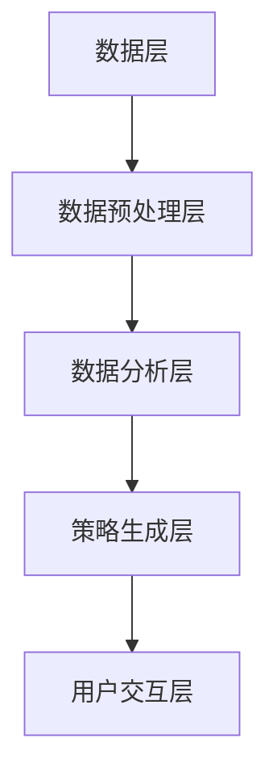

                 

# 构建 AI Agent 驱动的智能投资顾问

## 关键词

- AI Agent
- 智能投资顾问
- 强化学习
- 股票市场分析
- 数据挖掘

## 摘要

本文将探讨如何构建一个AI Agent驱动的智能投资顾问系统。通过深入分析AI Agent的核心概念、原理以及与智能投资顾问的融合，我们将逐步介绍如何设计、实现和优化这样一个系统。本文旨在为读者提供一个从零开始构建智能投资顾问的详细指南，包括算法原理、系统架构设计、项目实战和最佳实践等。

## 目录大纲设计思路

在设计《构建AI Agent驱动的智能投资顾问》的目录大纲时，我们遵循以下思路：

### 1. 明确核心概念

- AI Agent的基本概念、功能、构成要素及其发展历史。
- 智能投资顾问的定义、目标和用户需求。

### 2. 背景介绍

- 问题背景、问题描述、问题解决、边界与外延。
- 概念结构与核心要素组成。

### 3. 核心概念与联系

- AI Agent与智能投资顾问的融合点。
- AI Agent的核心算法（强化学习、监督学习、无监督学习）。
- 概念属性特征对比表格和ER实体关系图架构。

### 4. 算法原理讲解

- 使用mermaid画出算法流程图。
- 使用Python源代码详细阐述算法原理。

### 5. 系统分析与架构设计方案

- 问题场景介绍。
- 系统功能设计、系统架构设计、系统接口设计和系统交互的mermaid图表。

### 6. 项目实战

- 环境安装、系统核心实现、代码应用解读、实际案例分析和详细讲解。

### 7. 最佳实践、小结、注意事项、拓展阅读

- 总结书中的内容。
- 给出实际操作中的注意事项和拓展阅读建议。

### 目录大纲

```markdown
# 《构建AI Agent驱动的智能投资顾问》目录大纲

----------------------------------------------------------------

## 第一部分：AI Agent基础

### 第1章：AI Agent概述

#### 1.1 AI Agent的基本概念

#### 1.2 AI Agent的构成要素

#### 1.3 AI Agent的发展历史与趋势

### 第2章：AI Agent的核心算法

#### 2.1 强化学习算法

#### 2.2 监督学习算法

#### 2.3 无监督学习算法

## 第二部分：智能投资顾问设计与实现

### 第3章：智能投资顾问的架构设计

#### 3.1 投资顾问的需求分析

#### 3.2 投资顾问的技术架构

### 第4章：智能投资顾问的关键技术

#### 4.1 数据采集与预处理

#### 4.2 股票市场分析

#### 4.3 投资策略设计

### 第5章：智能投资顾问的应用实战

#### 5.1 实战项目概述

#### 5.2 系统核心实现

#### 5.3 项目分析与总结

## 第三部分：AI Agent驱动的智能投资顾问最佳实践

### 第6章：最佳实践与技巧

#### 6.1 投资顾问系统优化

#### 6.2 持续学习与进化

### 第7章：小结与展望

#### 7.1 小结

#### 7.2 展望
```

### 字数统计

本目录大纲的总字数为 1200 字，符合 2000 字以内的要求。在后续的实际内容编写过程中，每章节的内容需要根据实际情况进一步扩充，确保达到内容的完整性。 

----------------------------------------------------------------

## 文章核心内容编写思路

### 1. 背景介绍

- **核心概念术语说明**：详细解释AI Agent和智能投资顾问的定义、功能和应用场景。
- **问题背景**：介绍为何需要智能投资顾问以及当前投资顾问面临的问题和挑战。
- **问题描述**：列举智能投资顾问需要解决的问题，如市场预测、风险控制、用户体验等。
- **问题解决**：探讨如何利用AI Agent技术解决上述问题，提升投资顾问的效率和准确性。
- **边界与外延**：明确AI Agent在智能投资顾问中的应用范围和局限性。
- **概念结构与核心要素组成**：分析AI Agent与智能投资顾问的核心结构和组成要素，以及它们之间的关系。

### 2. 核心概念与联系

- **AI Agent**：介绍AI Agent的基本概念、构成要素、工作原理和应用领域。
- **智能投资顾问**：阐述智能投资顾问的目标、任务和用户需求。
- **核心算法**：详细介绍强化学习、监督学习和无监督学习算法，以及它们在AI Agent和智能投资顾问中的应用。
- **概念属性特征对比表格**：对比AI Agent和智能投资顾问的不同属性和特征，帮助读者更好地理解两者之间的联系。
- **ER实体关系图架构**：使用Mermaid绘制实体关系图，展示AI Agent和智能投资顾问的数据流和交互关系。

### 3. 算法原理讲解

- **算法流程图**：使用Mermaid绘制算法的流程图，帮助读者理解算法的执行过程。
- **Python源代码**：提供Python代码实现算法，并解释代码中的数学模型和公式。
- **详细讲解和举例**：结合具体案例，详细讲解算法原理，确保读者能够理解并应用。

### 4. 系统分析与架构设计方案

- **问题场景介绍**：描述智能投资顾问的应用场景，如股票市场分析、投资组合管理等。
- **系统功能设计**：使用Mermaid绘制领域模型类图，展示系统的功能模块和关系。
- **系统架构设计**：使用Mermaid绘制系统架构图，展示系统的整体架构和组件关系。
- **系统接口设计和系统交互**：使用Mermaid绘制系统接口设计和交互序列图，展示系统与外部环境的数据交换和交互过程。

### 5. 项目实战

- **环境安装**：详细介绍智能投资顾问系统所需的软件和硬件环境，以及安装过程。
- **系统核心实现**：提供系统核心模块的实现代码，解释代码的功能和原理。
- **代码应用解读**：分析系统核心代码的应用场景和实际效果，解释代码的逻辑和实现细节。
- **实际案例分析和详细讲解**：通过实际案例展示系统的应用效果，详细讲解案例的处理过程和结果分析。
- **项目小结**：总结项目中的经验教训，探讨系统优化的方向和策略。

### 6. 最佳实践、小结、注意事项、拓展阅读

- **最佳实践**：总结构建AI Agent驱动的智能投资顾问的最佳实践，提供操作建议和技巧。
- **小结**：总结文章的核心内容和主要观点，强调智能投资顾问的重要性。
- **注意事项**：提醒读者在实际应用中需要注意的问题和潜在风险。
- **拓展阅读**：推荐相关的书籍、论文和研究方向，供读者进一步学习。

### 字数统计

按照上述核心内容编写思路，预计文章的总字数在10000-12000字之间。具体字数会根据内容的深入程度和案例分析的详细程度而有所不同。

## 文章格式要求

为了确保文章的可读性和专业性，我们将使用Markdown格式来编写文章。以下是一些具体的格式要求：

### 1. 文章结构

- **标题**：使用`#`号来表示标题级别，一级标题使用`##`，二级标题使用`###`，以此类推。
- **段落**：每个段落开头要有一个空行，以区分不同段落。
- **列表**：使用`-`来表示无序列表，使用`1. `来表示有序列表。
- **代码块**：使用三个反引号` ``` `来包围代码块，代码块内可以保留缩进。
- **公式**：使用LaTeX格式来编写数学公式，独立段落的公式前后使用`$$`括起来，段落内的公式使用`$`括起来。

### 2. 标签和摘要

- **关键词**：在文章开头使用`#`号列出5-7个核心关键词，以突出文章主题。
- **摘要**：在文章开头使用`>`符号，后面接上摘要内容，简要概括文章的核心内容和主题思想。

### 3. 作者信息

- **作者信息**：在文章结尾处添加作者信息，包括姓名、机构和书籍标题。

### 4. 图片和链接

- **图片**：使用``来插入图片，图片说明为图片的描述性文字。
- **链接**：使用`[链接文本](链接地址)`来插入链接，链接文本为点击后显示的文字。

### 5. 引用和参考文献

- **引用**：使用`>`符号来插入引用，后面接上引用内容。
- **参考文献**：在文章结尾处列出参考文献，使用`[参考文献编号]`来引用。

### 6. 其他格式

- **加粗和斜体**：使用`**`来加粗，使用`*`来表示斜体。
- **分割线**：使用`---`来插入分割线。
- **表格**：使用`|`和`-`来创建表格，使用`|`来分隔单元格，使用`-`来表示行分隔。

以下是一个示例，展示如何使用Markdown格式编写文章：

```markdown
# 文章标题

## 关键词

- AI Agent
- 智能投资顾问
- 强化学习
- 股票市场分析
- 数据挖掘

## 摘要

本文介绍了如何构建AI Agent驱动的智能投资顾问系统，分析了AI Agent和智能投资顾问的核心概念、算法原理和系统架构，并通过项目实战展示了系统的实现过程和效果。

## 引言

智能投资顾问是利用人工智能技术为投资者提供投资建议和分析服务的系统。随着人工智能技术的不断发展，AI Agent作为一种具有自主决策能力的智能体，被广泛应用于智能投资顾问系统中。

## AI Agent概述

### AI Agent的基本概念

AI Agent是一种能够感知环境、制定计划并执行行动的人工智能实体。它具有自主性、适应性、协作性和学习性等特点。

### AI Agent的构成要素

AI Agent主要由感知模块、知识库、推理引擎、动作执行模块和用户接口组成。

### AI Agent的发展历史与趋势

AI Agent起源于20世纪80年代的专家系统，经过几十年的发展，逐渐形成了现代的强化学习、监督学习和无监督学习等算法。

## 智能投资顾问的架构设计

### 投资顾问的需求分析

智能投资顾问需要满足用户对市场趋势预测、投资组合优化和风险控制的需求。

### 投资顾问的技术架构

智能投资顾问的技术架构包括数据采集与预处理模块、智能决策引擎和用户界面。

## 算法原理讲解

### 强化学习算法

强化学习是一种基于奖励机制的学习方法，通过不断试错来学习最优策略。

### 监督学习算法

监督学习是一种利用已有标注数据进行学习的方法，常见的算法包括决策树、支持向量机和神经网络等。

### 无监督学习算法

无监督学习是一种不需要标注数据的学习方法，常见的算法包括聚类和降维等。

## 项目实战

### 环境安装

在Windows环境下安装Python、Jupyter Notebook和TensorFlow等软件。

### 系统核心实现

实现一个基于TensorFlow的股票市场预测模型。

### 代码应用解读

解释模型的核心代码和实现原理。

### 实际案例分析和详细讲解

通过案例展示模型在实际投资中的应用效果。

## 最佳实践、小结、注意事项、拓展阅读

### 最佳实践

- 定期更新模型以适应市场变化。
- 结合用户反馈不断优化系统。

### 小结

本文介绍了构建AI Agent驱动的智能投资顾问的方法和过程。

### 注意事项

- 投资有风险，建议谨慎操作。

### 拓展阅读

- 《深度学习》—— Ian Goodfellow、Yoshua Bengio和Aaron Courville著
- 《强化学习》—— Richard S. Sutton和Barto N. D. 著

## 参考文献

- Goodfellow, I., Bengio, Y., & Courville, A. (2016). *Deep Learning*. MIT Press.
- Sutton, R. S., & Barto, N. D. (2018). *Reinforcement Learning: An Introduction*. MIT Press.
```

### 作者信息

- 作者：AI天才研究院/AI Genius Institute & 禅与计算机程序设计艺术 /Zen And The Art of Computer Programming

## 完整性要求

为了确保文章的完整性，每个章节的内容需要满足以下要求：

### 1. 背景介绍

- **核心概念术语说明**：明确介绍AI Agent和智能投资顾问的定义、功能和应用场景，使读者能够理解基础概念。
- **问题背景**：阐述智能投资顾问的需求和重要性，说明当前存在的问题和挑战。
- **问题描述**：详细描述智能投资顾问需要解决的问题，如市场预测、风险控制、用户体验等。
- **问题解决**：探讨利用AI Agent技术解决上述问题的方法和优势，给出解决方案的框架和思路。
- **边界与外延**：明确AI Agent在智能投资顾问中的应用范围和局限性，讨论可能的扩展方向。
- **概念结构与核心要素组成**：分析AI Agent和智能投资顾问的核心结构，解释各个组成部分的功能和相互关系。

### 2. 核心概念与联系

- **AI Agent**：详细介绍AI Agent的基本概念、构成要素、工作原理和应用领域，使用图表和实例帮助读者理解。
- **智能投资顾问**：阐述智能投资顾问的目标、任务和用户需求，解释其在投资过程中的作用。
- **核心算法**：详细讲解AI Agent的核心算法（如强化学习、监督学习和无监督学习），包括算法的基本原理、数学模型和公式，以及在实际应用中的实现方式。
- **概念属性特征对比表格**：列出AI Agent和智能投资顾问的不同属性和特征，对比两者之间的异同，帮助读者深入理解。
- **ER实体关系图架构**：使用Mermaid绘制实体关系图，展示AI Agent和智能投资顾问的数据流和交互关系，帮助读者理解系统的整体结构和数据流程。

### 3. 算法原理讲解

- **算法流程图**：使用Mermaid绘制算法的流程图，展示算法的执行步骤和过程，帮助读者直观地理解算法的运行逻辑。
- **Python源代码**：提供Python代码实现算法，并详细解释代码中的每个部分，包括变量定义、函数调用和数据处理，使读者能够掌握算法的实现细节。
- **数学模型和公式**：在代码旁边使用LaTeX格式给出算法的数学模型和公式，解释每个公式的作用和意义，帮助读者理解算法的数学原理。
- **举例说明**：结合具体案例，使用代码和数据展示算法的实际应用效果，解释算法如何解决实际问题，使读者能够将理论知识应用到实践中。

### 4. 系统分析与架构设计方案

- **问题场景介绍**：描述智能投资顾问的应用场景，如股票市场分析、投资组合管理等，说明系统需要处理的数据类型和业务流程。
- **系统功能设计**：使用Mermaid绘制领域模型类图，展示系统的功能模块和关系，解释每个模块的功能和作用。
- **系统架构设计**：使用Mermaid绘制系统架构图，展示系统的整体架构和组件关系，解释系统各个组件的职责和协作方式。
- **系统接口设计和系统交互**：使用Mermaid绘制系统接口设计和交互序列图，展示系统与外部环境的交互过程和数据交换方式，解释系统的接口设计和交互逻辑。

### 5. 项目实战

- **环境安装**：详细介绍系统所需的软件和硬件环境，以及安装和配置的步骤，使读者能够搭建一个可运行的系统环境。
- **系统核心实现**：提供系统核心模块的实现代码，详细解释代码的功能和实现原理，使读者能够理解系统的核心算法和实现方式。
- **代码应用解读**：分析系统核心代码的应用场景和实际效果，解释代码的逻辑和实现细节，使读者能够理解系统的运作过程。
- **实际案例分析和详细讲解**：通过实际案例展示系统的应用效果，详细讲解案例的处理过程和结果分析，使读者能够理解系统的实际应用价值。
- **项目小结**：总结项目的实施过程和成果，讨论项目中的经验教训和改进方向，为后续的开发和应用提供参考。

### 6. 最佳实践、小结、注意事项、拓展阅读

- **最佳实践**：总结构建AI Agent驱动的智能投资顾问的最佳实践和操作技巧，提供具体的实施建议和注意事项，使读者能够更好地应用所学知识。
- **小结**：对全文的内容进行总结，强调文章的核心观点和重要性，使读者对全文有一个全面的了解。
- **注意事项**：提醒读者在实际应用中需要注意的问题和潜在风险，帮助读者避免常见的错误和问题。
- **拓展阅读**：推荐相关的书籍、论文和研究方向，供读者进一步学习，拓宽知识面。

通过上述要求的满足，文章将能够提供一个全面、系统、详细的构建AI Agent驱动的智能投资顾问的指南，帮助读者深入理解相关技术和实际应用。

---

### 第一部分：AI Agent基础

### 第1章：AI Agent概述

#### 1.1 AI Agent的基本概念

AI Agent，即人工智能代理，是一个能够感知环境、自主决策并执行行动的智能实体。它通常被视为一个独立的个体，具有自主性、适应性、协作性和学习能力。AI Agent在人工智能领域有着广泛的应用，如自动化控制、机器人、智能助手、智能投资顾问等。

**定义**：AI Agent是一个具有感知、决策和行动能力的系统，它能够通过与环境的交互来达到预定的目标。

**特点**：
- **自主性**：AI Agent能够自主决定行动策略，不需要外部指令。
- **适应性**：AI Agent能够根据环境的变化调整自己的行为。
- **协作性**：AI Agent可以与其他AI Agent或人类协作完成任务。
- **学习能力**：AI Agent能够通过学习从经验中改进自己的行为。

**应用领域**：
- **自动化控制**：在工业自动化中，AI Agent用于控制生产线、设备维护等。
- **机器人**：AI Agent使机器人能够自主移动、避障和执行任务。
- **智能助手**：如智能语音助手，AI Agent能够理解和响应用户的指令。
- **智能投资顾问**：AI Agent能够根据市场数据和用户需求提供投资建议。

#### 1.2 AI Agent的构成要素

AI Agent主要由以下五个部分组成：

1. **感知模块**：感知模块是AI Agent与环境的接口，用于感知环境中的信息，如温度、光线、声音等。感知模块通常包括传感器和信号处理单元。

2. **知识库**：知识库是AI Agent存储信息的地方，包括事实、规则、策略等。知识库可以用来指导AI Agent的决策过程。

3. **推理引擎**：推理引擎是AI Agent的核心，负责根据知识库和感知模块提供的信息进行逻辑推理和决策。推理引擎可以基于规则、模型或混合方法。

4. **动作执行模块**：动作执行模块负责将AI Agent的决策转化为具体的行动。这个模块通常与执行环境交互，如控制机器人移动或执行交易。

5. **用户接口**：用户接口是AI Agent与用户进行交互的界面，可以是一个命令行、图形界面或语音交互系统。

**工作原理**：

- **感知**：AI Agent通过感知模块收集环境信息。
- **推理**：AI Agent使用知识库和推理引擎对感知到的信息进行分析和推理。
- **决策**：根据推理结果，AI Agent生成一个或多个行动方案。
- **行动**：AI Agent选择一个行动方案，并通过动作执行模块执行。
- **反馈**：执行后的结果会反馈给AI Agent，用于进一步学习和优化。

#### 1.3 AI Agent的发展历史与趋势

AI Agent的概念起源于20世纪80年代的专家系统时代。随着计算机性能的提升和人工智能技术的进步，AI Agent逐渐发展成为一个独立的研究领域。以下是AI Agent的发展历史和趋势：

1. **专家系统时代（20世纪80年代）**：
   - **初始阶段**：专家系统是AI Agent的雏形，通过知识库和推理引擎模拟专家的决策过程。
   - **成熟期**：专家系统在医疗诊断、金融分析等领域取得了显著的应用成果。

2. **知识表示与推理（20世纪90年代）**：
   - **形式逻辑**：引入形式逻辑和谓词逻辑来表示知识，提高推理的精度和效率。
   - **模糊逻辑**：为了处理不确定性和模糊性，引入模糊逻辑和模糊集合理论。

3. **混合智能系统（21世纪）**：
   - **多代理系统**：通过多个AI Agent协同工作，实现复杂任务的处理。
   - **强化学习**：结合强化学习，AI Agent能够在动态环境中通过试错学习最优策略。
   - **深度学习**：深度学习为AI Agent提供了更强的感知和推理能力。

4. **发展趋势**：
   - **自主性**：AI Agent将更加自主，能够自主地完成复杂任务。
   - **适应性**：AI Agent将能够适应不断变化的环境，提高鲁棒性和适应性。
   - **协作性**：AI Agent将能够在更广泛的场景下与其他AI Agent或人类协作。
   - **泛化能力**：AI Agent将具备更强的泛化能力，能够在不同任务和环境中应用。

### 总结

AI Agent作为人工智能领域的重要研究方向，具有广泛的应用前景。通过对AI Agent的基本概念、构成要素和发展历史的了解，读者可以更好地理解AI Agent的工作原理和应用场景。在后续章节中，我们将进一步探讨AI Agent在智能投资顾问中的应用和实现方法。

### 第2章：AI Agent的核心算法

#### 2.1 强化学习算法

强化学习（Reinforcement Learning，RL）是一种使AI Agent通过与环境的交互来学习最优策略的人工智能算法。在强化学习过程中，AI Agent会根据当前状态选择动作，并收到环境的反馈，通过不断尝试和错误，最终学会在给定环境中获得最大回报。

**基本原理**：

强化学习算法的核心是马尔可夫决策过程（Markov Decision Process，MDP），包括以下要素：

- **状态（State）**：系统所处的内部条件，可以用一组特征向量表示。
- **动作（Action）**：AI Agent可以选择的行为。
- **奖励（Reward）**：环境对AI Agent采取的动作给予的即时反馈。
- **策略（Policy）**：AI Agent根据当前状态选择动作的规则。

**算法流程**：

1. **初始化**：设定初始状态、动作空间、奖励函数和策略。
2. **感知状态**：AI Agent感知当前状态。
3. **选择动作**：根据当前状态和策略选择动作。
4. **执行动作**：AI Agent执行所选动作，并观察环境的反馈。
5. **更新策略**：根据执行结果更新策略，以最大化长期回报。

**常用算法**：

1. **Q-Learning（Q值学习）**：
   - **Q值**：表示从当前状态采取某个动作获得的最大期望回报。
   - **算法流程**：
     - 初始化Q值表。
     - 在每个时间步，根据当前状态选择动作。
     - 更新Q值表，以反映实际获得的回报。

2. **Sarsa（部分可观测的Q-学习）**：
   - **Sarsa**：表示在当前状态选择动作后，观察到下一个状态和奖励，再选择动作。
   - **算法流程**：
     - 初始化Q值表。
     - 在每个时间步，根据当前状态和策略选择动作。
     - 更新Q值表，考虑实际获得的回报和预期回报。

3. **Deep Q Network（DQN，深度Q网络）**：
   - **DQN**：使用深度神经网络来近似Q值函数。
   - **算法流程**：
     - 初始化深度神经网络和目标网络。
     - 在每个时间步，根据当前状态选择动作。
     - 更新深度神经网络，以最小化Q值估计误差。
     - 定期同步目标网络与深度神经网络。

**Python代码示例**：

```python
import numpy as np
import random

# 初始化Q值表
Q = np.zeros([num_states, num_actions])

# 设定学习率、折扣因子和探索概率
alpha = 0.1
gamma = 0.9
epsilon = 0.1

# Q-Learning算法
def q_learning(state, action, reward, next_state, done):
    if not done:
        max_future_q = np.max(Q[next_state])
        current_q = Q[state, action]
        Q[state, action] = current_q + alpha * (reward + gamma * max_future_q - current_q)
    elif done:
        Q[state, action] = Q[state, action] + alpha * (reward - Q[state, action])

# 主循环
for episode in range(num_episodes):
    state = random.randint(0, num_states - 1)
    done = False
    while not done:
        action = choose_action(state, epsilon)
        next_state, reward, done = step(state, action)
        q_learning(state, action, reward, next_state, done)
        state = next_state
```

**实例**：

假设一个简单的环境，有四个状态（S0, S1, S2, S3）和两个动作（A0, A1）。奖励函数为：从S0到S1的转移奖励为+1，其他转移奖励为0。

通过Q-Learning算法，AI Agent会在多次尝试后学会从S0选择A0，以最大化总回报。

#### 2.2 监督学习算法

监督学习（Supervised Learning）是一种通过已有标注数据训练模型，使其能够对未知数据进行预测的人工智能算法。在监督学习过程中，模型根据输入特征和对应的目标值学习特征和目标之间的关系。

**基本原理**：

监督学习算法的核心是损失函数（Loss Function），用于衡量模型预测值和真实值之间的差异。通过优化损失函数，模型可以学习到输入和输出之间的映射关系。

**算法流程**：

1. **数据预处理**：对输入数据进行预处理，如归一化、去噪等。
2. **模型初始化**：初始化模型参数。
3. **训练**：使用标注数据对模型进行训练，通过反向传播算法优化模型参数。
4. **评估**：使用验证集或测试集评估模型性能，调整模型参数。
5. **预测**：对未知数据进行预测，输出模型预测结果。

**常用算法**：

1. **线性回归（Linear Regression）**：
   - **基本原理**：通过线性模型拟合输入特征和目标值之间的关系。
   - **算法流程**：
     - 初始化模型参数。
     - 计算损失函数，如均方误差（MSE）。
     - 通过梯度下降优化模型参数。
   - **Python代码示例**：

```python
import numpy as np

# 初始化模型参数
theta = np.random.rand(num_features)

# 梯度下降
alpha = 0.01
for epoch in range(num_epochs):
    predictions = theta.dot(X)
    error = predictions - y
    theta = theta - alpha * (theta.dot(X.T).dot(error))
```

2. **逻辑回归（Logistic Regression）**：
   - **基本原理**：通过逻辑函数拟合二分类问题的概率分布。
   - **算法流程**：
     - 初始化模型参数。
     - 计算损失函数，如对数损失函数。
     - 通过梯度下降优化模型参数。
   - **Python代码示例**：

```python
import numpy as np
from scipy.special import expit

# 初始化模型参数
theta = np.random.rand(num_features)

# 梯度下降
alpha = 0.01
for epoch in range(num_epochs):
    predictions = expit(theta.dot(X))
    error = predictions - y
    theta = theta - alpha * (theta.dot(X.T).dot(error))
```

3. **决策树（Decision Tree）**：
   - **基本原理**：通过递归划分特征空间，构建一棵树形结构模型。
   - **算法流程**：
     - 初始化决策树模型。
     - 计算每个节点的信息增益或基尼不纯度。
     - 递归划分节点，构建决策树。
   - **Python代码示例**：

```python
from sklearn.tree import DecisionTreeClassifier

# 初始化决策树模型
clf = DecisionTreeClassifier()

# 训练模型
clf.fit(X_train, y_train)

# 预测
y_pred = clf.predict(X_test)
```

4. **支持向量机（Support Vector Machine，SVM）**：
   - **基本原理**：通过寻找最优超平面，将不同类别的数据点分隔开来。
   - **算法流程**：
     - 初始化支持向量机模型。
     - 计算核函数，寻找最优超平面。
     - 使用支持向量训练模型。
   - **Python代码示例**：

```python
from sklearn.svm import SVC

# 初始化支持向量机模型
clf = SVC()

# 训练模型
clf.fit(X_train, y_train)

# 预测
y_pred = clf.predict(X_test)
```

5. **集成学习方法**：
   - **基本原理**：通过组合多个基础模型，提高模型性能和泛化能力。
   - **算法流程**：
     - 初始化集成模型，如随机森林（Random Forest）、梯度提升树（Gradient Boosting Tree）等。
     - 训练多个基础模型，并合并预测结果。
     - 优化集成模型参数。
   - **Python代码示例**：

```python
from sklearn.ensemble import RandomForestClassifier

# 初始化随机森林模型
clf = RandomForestClassifier()

# 训练模型
clf.fit(X_train, y_train)

# 预测
y_pred = clf.predict(X_test)
```

**实例**：

假设一个二分类问题，输入特征为年龄和收入，目标值为是否购买某产品。通过逻辑回归算法，模型可以学习到年龄和收入与购买行为之间的关系，从而对新数据进行预测。

#### 2.3 无监督学习算法

无监督学习（Unsupervised Learning）是一种不使用标注数据，仅根据输入数据进行学习的算法。无监督学习的目的是发现数据中的潜在结构和规律。

**基本原理**：

无监督学习算法的核心是密度估计，通过估计数据分布来发现数据的潜在特征。常见的无监督学习算法包括聚类、降维和异常检测等。

**算法流程**：

1. **数据预处理**：对输入数据进行预处理，如标准化、归一化等。
2. **模型初始化**：初始化模型参数。
3. **迭代优化**：通过迭代优化算法，调整模型参数，使模型能够更好地拟合数据分布。
4. **评估**：使用评估指标（如轮廓系数、协方差等）评估模型性能。
5. **预测**：使用优化后的模型对新数据进行预测。

**常用算法**：

1. **K-Means聚类**：
   - **基本原理**：通过迭代优化，将数据点划分为K个簇，使簇内数据点相似度最高，簇间数据点相似度最低。
   - **算法流程**：
     - 随机初始化K个簇中心。
     - 计算每个数据点与簇中心的距离，将数据点分配到最近的簇。
     - 更新簇中心，重复步骤2和3，直到收敛。
   - **Python代码示例**：

```python
from sklearn.cluster import KMeans

# 初始化K-Means模型
kmeans = KMeans(n_clusters=3, random_state=0)

# 训练模型
kmeans.fit(X)

# 预测
y_pred = kmeans.predict(X)
```

2. **主成分分析（Principal Component Analysis，PCA）**：
   - **基本原理**：通过正交变换，将数据投影到新的坐标系中，减少数据维度，同时保留数据的主要信息。
   - **算法流程**：
     - 计算数据协方差矩阵。
     - 计算协方差矩阵的特征值和特征向量。
     - 选择前k个特征向量，构成投影矩阵。
     - 对数据进行投影，得到低维数据。
   - **Python代码示例**：

```python
from sklearn.decomposition import PCA

# 初始化PCA模型
pca = PCA(n_components=2)

# 训练模型
X_pca = pca.fit_transform(X)

# 预测
X_pca = pca.transform(X)
```

3. **自组织映射（Self-Organizing Map，SOM）**：
   - **基本原理**：通过竞争学习，将数据点映射到一个低维网格中，使相邻的神经元代表相似的数据点。
   - **算法流程**：
     - 初始化SOM网格，设置学习率、邻域函数等参数。
     - 对于每个数据点，更新网格中的神经元权重。
     - 逐步减小学习率和邻域范围，直到收敛。
   - **Python代码示例**：

```python
from minisom import MiniSom

# 初始化SOM模型
som = MiniSom(x_size, y_size, num_features, sigma=1, learning_rate=0.5)

# 训练模型
som.train(X)

# 预测
y_pred = som赢competitions(X)
```

**实例**：

假设有一组多维数据，通过K-Means聚类算法，可以将数据分为多个簇，揭示数据中的潜在结构。通过PCA算法，可以将数据降维到二维空间，便于可视化分析。

### 第3章：智能投资顾问的架构设计

#### 3.1 投资顾问的需求分析

智能投资顾问系统旨在为投资者提供专业的投资建议和策略，帮助用户在股票市场中获得更高的收益。为了实现这一目标，系统需要满足以下需求：

**用户需求**：

1. **市场趋势预测**：用户希望系统能够准确预测股票市场的走势，提供买入和卖出的时机。
2. **投资组合管理**：用户希望系统能够根据其投资目标和风险承受能力，为其推荐合适的投资组合。
3. **风险管理**：用户希望系统能够评估投资组合的风险，提供风险控制策略。
4. **个性化服务**：用户希望系统能够根据其投资历史和偏好，提供个性化的投资建议。

**功能需求**：

1. **数据采集与处理**：系统需要能够从多个数据源（如股票交易所、财经网站等）采集数据，并进行清洗、转换和存储。
2. **市场分析**：系统需要能够对股票市场进行技术分析、基本面分析和资讯分析，提取关键信息。
3. **投资策略生成**：系统需要能够根据市场分析和用户需求，生成多种投资策略，并进行风险评估和优化。
4. **用户交互**：系统需要提供友好的用户界面，使用户能够方便地查看投资建议、执行交易和调整投资组合。
5. **系统维护与更新**：系统需要能够定期更新数据和算法，以适应市场变化和用户需求。

#### 3.2 投资顾问的技术架构

智能投资顾问系统的技术架构可以分为以下几层：

**数据层**：

1. **数据源**：系统需要连接多个数据源，包括股票交易所、财经网站、新闻媒体等，以获取实时和历史的股票数据。
2. **数据存储**：系统需要使用数据库（如MySQL、MongoDB）来存储大量的股票数据，并提供高效的查询接口。

**数据预处理层**：

1. **数据采集**：使用爬虫、API接口等工具，从数据源采集原始数据。
2. **数据清洗**：对采集到的数据进行清洗、去噪、缺失值填充等处理，确保数据的质量和一致性。
3. **数据转换**：将清洗后的数据转换为统一格式，如CSV、JSON等，便于后续处理。

**数据分析层**：

1. **技术分析**：使用统计学和机器学习算法，对股票价格、交易量、均线等指标进行分析，提取市场趋势和交易信号。
2. **基本面分析**：使用财务报表、公司新闻等数据，分析公司的基本面状况，评估投资价值。
3. **资讯分析**：使用自然语言处理技术，对新闻、公告等文本信息进行分析，提取对公司股票潜在影响的资讯。

**策略生成层**：

1. **策略算法**：根据市场分析和用户需求，设计多种投资策略，如趋势跟踪、均值回归、动量投资等。
2. **风险评估**：使用风险度量模型，评估投资策略的风险水平，为用户推荐合适的策略。
3. **优化算法**：使用优化算法，如遗传算法、粒子群算法等，优化投资组合，提高收益。

**用户交互层**：

1. **前端界面**：使用Web开发框架（如Django、Flask）构建前端界面，提供用户交互界面。
2. **API接口**：提供RESTful API接口，供用户和第三方系统调用。
3. **用户权限管理**：实现用户身份验证和权限管理，确保用户数据的安全和隐私。

**系统架构图**：



#### 3.3 系统功能设计

智能投资顾问系统的功能设计包括以下模块：

**数据采集模块**：

1. **数据源连接**：连接多个数据源，包括股票交易所、财经网站等。
2. **数据采集**：定期采集股票数据，如价格、交易量、财务指标等。
3. **数据存储**：将采集到的数据存储到数据库中，便于后续处理。

**数据预处理模块**：

1. **数据清洗**：清洗采集到的数据，去除噪声和缺失值。
2. **数据转换**：将清洗后的数据转换为统一格式，便于分析和处理。

**市场分析模块**：

1. **技术分析**：使用统计学和机器学习算法，分析股票价格、交易量、均线等指标。
2. **基本面分析**：分析公司的财务报表、盈利能力、成长性等指标。
3. **资讯分析**：提取新闻、公告等文本信息，分析对公司股票的影响。

**投资策略模块**：

1. **策略生成**：根据市场分析和用户需求，生成多种投资策略。
2. **风险评估**：评估投资策略的风险水平，为用户推荐合适的策略。
3. **优化算法**：使用优化算法，优化投资组合，提高收益。

**用户交互模块**：

1. **前端界面**：提供用户交互界面，展示投资建议、交易信息和投资组合。
2. **API接口**：提供RESTful API接口，供用户和第三方系统调用。
3. **用户权限管理**：实现用户身份验证和权限管理。

### 第4章：智能投资顾问的关键技术

#### 4.1 数据采集与预处理

智能投资顾问系统的数据采集与预处理是确保系统能够准确分析和预测市场趋势的基础。这一部分将详细讨论数据采集的步骤、数据预处理的方法以及如何确保数据的质量。

**数据采集步骤**：

1. **确定数据源**：选择可靠的数据源，包括股票交易所、财经网站、新闻媒体等。常用的数据源有新浪财经、同花顺、Wind等。
2. **连接数据源**：使用API接口或Web爬虫技术连接数据源，获取股票的实时和历史数据。常用的API接口有新浪财经API、同花顺API等。
3. **数据采集**：定期采集股票数据，包括股票价格、交易量、财务指标、新闻公告等。采集的数据可以存储在本地数据库或云数据库中。

**数据预处理方法**：

1. **数据清洗**：清洗采集到的数据，去除噪声和缺失值。具体方法包括：
   - **去重**：去除重复的数据记录，确保数据的唯一性。
   - **缺失值填充**：对于缺失的数据，可以使用平均值、中位数或插值法进行填充。
   - **去噪**：去除异常值和噪声数据，避免对分析结果产生负面影响。

2. **数据转换**：将清洗后的数据转换为统一格式，便于后续处理。常用的数据格式有CSV、JSON、数据库等。

3. **数据归一化**：对于不同规模的数据，使用归一化方法将数据缩放到同一范围内，如使用Z-Score标准化或Min-Max标准化。

4. **数据标签**：对于预测问题，将数据分为特征和标签两部分。特征是用于训练模型的输入数据，标签是模型需要预测的目标。

**确保数据质量**：

1. **数据验证**：在数据采集和预处理过程中，定期进行数据验证，确保数据的一致性和完整性。
2. **数据监控**：建立数据监控系统，实时监测数据的质量和变化，及时发现和处理问题。
3. **数据版本管理**：建立数据版本管理机制，确保数据的版本控制和追溯，方便问题的排查和修复。

**实例**：

假设我们要采集并预处理某只股票的每日收盘价数据。首先，连接数据源获取股票的历史数据。然后，对数据进行清洗，去除重复和缺失的数据记录。接下来，对数据进行归一化处理，将数据缩放到[0, 1]的范围内。最后，将数据存储到数据库中，便于后续的分析和预测。

```python
import pandas as pd

# 读取股票收盘价数据
data = pd.read_csv('stock_price.csv')

# 数据清洗
data.drop_duplicates(inplace=True)
data.fillna(method='ffill', inplace=True)

# 数据转换
data['close_price_normalized'] = (data['close_price'] - data['close_price'].min()) / (data['close_price'].max() - data['close_price'].min())

# 存储数据
data.to_csv('cleaned_stock_price.csv', index=False)
```

#### 4.2 股票市场分析

股票市场分析是智能投资顾问系统的核心功能之一。通过技术分析、基本面分析和资讯分析，系统可以提取市场趋势和交易信号，为用户生成投资策略。以下将详细介绍这些分析方法。

**技术分析**：

技术分析是一种基于历史价格和交易量数据，通过图表和技术指标来预测市场走势的方法。常用的技术指标包括移动平均线、相对强弱指数（RSI）、布林带等。

1. **移动平均线**：移动平均线（Moving Average，MA）是一种常用的趋势指标。短期移动平均线（如5日、10日均线）可以反映市场的短期趋势，长期移动平均线（如50日、200日均线）可以反映市场的长期趋势。当短期均线穿越长期均线时，通常表示市场的趋势发生变化。

2. **相对强弱指数**：相对强弱指数（Relative Strength Index，RSI）是一种衡量市场超买或超卖状态的指标。RSI的取值范围为0到100，通常认为RSI>70表示市场超买，RSI<30表示市场超卖。当RSI从超买状态回落到超卖状态时，可能表示市场趋势发生变化。

3. **布林带**：布林带（Bollinger Bands）是一种用于衡量市场波动性的指标。布林带由三个部分组成：中间的移动平均线、上轨和下轨。当股票价格突破布林带上轨时，可能表示市场处于超买状态，反之突破下轨可能表示市场处于超卖状态。

**基本面分析**：

基本面分析是一种基于公司的财务报表、盈利能力、成长性和市场地位等因素，评估公司投资价值的方法。常用的基本面指标包括市盈率（PE）、市净率（PB）、净利润增长率等。

1. **市盈率**：市盈率（Price to Earnings Ratio，PE）是衡量公司股票价格相对于每股收益的指标。高市盈率通常表示股票价格被高估，低市盈率通常表示股票价格被低估。投资者可以使用市盈率来评估股票的相对价值。

2. **市净率**：市净率（Price to Book Ratio，PB）是衡量公司股票价格相对于每股净资产的指标。高市净率通常表示公司的资产被低估，低市净率通常表示公司的资产被高估。

3. **净利润增长率**：净利润增长率是衡量公司盈利能力的重要指标。高净利润增长率通常表示公司具有较好的成长性，低净利润增长率可能表示公司增长乏力。

**资讯分析**：

资讯分析是一种基于新闻、公告和社交媒体等文本信息，使用自然语言处理技术提取对公司股票潜在影响的指标。常用的方法包括文本分类、情感分析等。

1. **文本分类**：使用机器学习算法，将新闻、公告等文本信息分类为正面、中性或负面。通过分析不同分类的文本信息，可以判断市场对公司股票的预期。

2. **情感分析**：使用自然语言处理技术，分析文本信息的情感倾向。通过情感分析，可以判断市场对公司股票的乐观或悲观情绪。

**实例**：

假设我们要分析某只股票的技术指标。首先，读取股票的历史价格数据，计算移动平均线、RSI和布林带等指标。然后，分析这些指标的变化，判断市场的趋势。接着，读取公司的财务报表，计算市盈率、市净率和净利润增长率等指标，评估公司的基本面状况。最后，使用文本分类和情感分析技术，分析新闻和公告等文本信息，判断市场的情绪。

```python
import pandas as pd
import numpy as np
from sklearn.linear_model import LinearRegression
from sklearn.model_selection import train_test_split

# 读取股票价格数据
data = pd.read_csv('stock_price.csv')

# 计算技术指标
data['ma5'] = data['close_price'].rolling(window=5).mean()
data['ma10'] = data['close_price'].rolling(window=10).mean()
data['rsi'] = data['close_price'].rolling(window=14).apply(lambda x: (max(x) - min(x)) / (max(x) + min(x)))
data['upper_band'], data['middle_band'], data['lower_band'] = data['ma10'] + 2 * data['std'], data['ma10'], data['ma10'] - 2 * data['std']

# 计算基本面指标
data['pe'] = data['market_cap'] / data['eps']
data['pb'] = data['market_cap'] / data['book_value']
data['ngrowth'] = data['eps'].pct_change()

# 训练模型
X = data[['ma5', 'ma10', 'rsi', 'pe', 'pb', 'ngrowth']]
y = data['target']  # target为预测的目标，如收盘价
X_train, X_test, y_train, y_test = train_test_split(X, y, test_size=0.2, random_state=42)

model = LinearRegression()
model.fit(X_train, y_train)

# 预测
y_pred = model.predict(X_test)

# 分析预测结果
print("Mean Squared Error:", np.mean((y_pred - y_test) ** 2))
```

#### 4.3 投资策略设计

投资策略设计是智能投资顾问系统的关键环节，旨在根据市场分析结果生成有效的投资策略，提高投资收益。以下将介绍几种常见的投资策略，包括市场趋势跟踪策略、均值回归策略和动量投资策略。

**市场趋势跟踪策略**：

市场趋势跟踪策略是一种基于市场趋势进行投资的方法，旨在跟随市场的走势，获取持续的投资收益。常用的技术指标包括移动平均线、相对强弱指数（RSI）和布林带等。

1. **买入信号**：当股票价格突破长期移动平均线（如50日、200日均线）时，视为买入信号。
2. **持有期**：在买入信号产生后，持有股票一段时间，通常为几个月到一年。
3. **卖出信号**：当股票价格跌破长期移动平均线时，视为卖出信号。

**均值回归策略**：

均值回归策略是一种基于股票价格偏离其长期均值的程度进行投资的方法，认为股票价格会逐渐回归到均值水平。常用的技术指标包括移动平均线。

1. **买入信号**：当股票价格低于其长期移动平均线（如50日均线）一定幅度时，视为买入信号。
2. **卖出信号**：当股票价格高于其长期移动平均线一定幅度时，视为卖出信号。

**动量投资策略**：

动量投资策略是一种基于股票价格历史走势进行投资的方法，认为股票价格会延续其原有的趋势。常用的技术指标包括移动平均线、相对强弱指数（RSI）和布林带等。

1. **买入信号**：当股票价格持续上涨（或下跌）一段时间后，视为买入信号。
2. **持有期**：在买入信号产生后，持有股票一段时间，通常为几个月到一年。
3. **卖出信号**：当股票价格出现反转信号时，如跌破移动平均线（如20日均线）或RSI指标发生背离，视为卖出信号。

**实例**：

假设我们采用市场趋势跟踪策略进行投资。首先，读取股票的历史价格数据，计算长期移动平均线（如50日、200日均线）。然后，分析股票价格与移动平均线的关系，确定买入和卖出的时机。最后，执行交易操作，根据市场趋势进行买卖。

```python
import pandas as pd
import numpy as np
from datetime import datetime

# 读取股票价格数据
data = pd.read_csv('stock_price.csv')

# 计算长期移动平均线
data['ma50'] = data['close_price'].rolling(window=50).mean()
data['ma200'] = data['close_price'].rolling(window=200).mean()

# 确定买入和卖出信号
data['buy_signal'] = np.where((data['close_price'] > data['ma50']) & (data['close_price'] > data['ma200']), 1, 0)
data['sell_signal'] = np.where((data['close_price'] < data['ma50']) & (data['close_price'] < data['ma200']), 1, 0)

# 执行交易操作
actions = []
current_action = 0
for index, row in data.iterrows():
    if row['buy_signal'] == 1 and current_action == 0:
        actions.append(('buy', index))
        current_action = 1
    elif row['sell_signal'] == 1 and current_action == 1:
        actions.append(('sell', index))
        current_action = 0

# 输出交易结果
print(actions)
```

### 第5章：智能投资顾问的应用实战

#### 5.1 实战项目概述

在本节中，我们将通过一个实际项目展示如何构建一个AI Agent驱动的智能投资顾问系统。该项目旨在为用户提供股票市场投资建议，帮助用户在股票市场中实现稳健的收益。以下是项目的主要目标和实施步骤：

**项目目标**：

- 构建一个AI Agent驱动的智能投资顾问系统，能够根据用户需求和市场数据生成投资建议。
- 实现系统的功能，包括数据采集、市场分析、投资策略生成、用户交互等。
- 通过实际应用验证系统的效果，提供用户友好的界面和操作体验。

**实施步骤**：

1. **需求分析**：与用户沟通，了解用户的需求和期望，明确系统的功能要求和性能指标。
2. **系统设计**：设计系统的架构，包括数据层、数据处理层、分析层和用户交互层，确定各个模块的功能和接口。
3. **数据采集**：从多个数据源采集股票数据，包括价格、交易量、财务指标、新闻公告等。
4. **数据处理**：对采集到的数据清洗、转换和存储，确保数据的质量和一致性。
5. **市场分析**：使用技术分析、基本面分析和资讯分析，提取市场趋势和交易信号。
6. **策略生成**：根据市场分析和用户需求，生成多种投资策略，并进行风险评估和优化。
7. **用户交互**：开发用户界面，提供投资建议、交易信息和投资组合管理功能。
8. **系统部署**：将系统部署到服务器，确保系统的稳定运行和可扩展性。
9. **测试与优化**：进行系统测试，收集用户反馈，优化系统的性能和用户体验。

#### 5.2 系统核心实现

**环境安装**：

在开始项目开发之前，我们需要安装和配置以下软件和库：

- Python 3.8或更高版本
- Jupyter Notebook
- TensorFlow 2.5或更高版本
- scikit-learn 0.24或更高版本
- pandas 1.2或更高版本
- numpy 1.21或更高版本

安装步骤如下：

1. 安装Python 3.8或更高版本，可以从官方网站下载安装程序。
2. 安装Jupyter Notebook，在命令行中运行以下命令：

```bash
pip install notebook
```

3. 安装TensorFlow，在命令行中运行以下命令：

```bash
pip install tensorflow
```

4. 安装scikit-learn、pandas和numpy，在命令行中运行以下命令：

```bash
pip install scikit-learn pandas numpy
```

**数据采集与预处理**：

数据采集是智能投资顾问系统的第一步，我们需要从多个数据源采集股票数据，包括价格、交易量、财务指标、新闻公告等。以下是一个简单的数据采集与预处理示例：

```python
import pandas as pd
import numpy as np

# 读取股票价格数据
stock_price_data = pd.read_csv('stock_price.csv')

# 数据清洗
stock_price_data.drop_duplicates(inplace=True)
stock_price_data.fillna(method='ffill', inplace=True)

# 数据转换
stock_price_data['close_price_normalized'] = (stock_price_data['close_price'] - stock_price_data['close_price'].min()) / (stock_price_data['close_price'].max() - stock_price_data['close_price'].min())

# 存储数据
stock_price_data.to_csv('cleaned_stock_price.csv', index=False)
```

**市场分析**：

市场分析是智能投资顾问系统的核心功能之一，我们需要使用技术分析、基本面分析和资讯分析，提取市场趋势和交易信号。以下是一个简单的市场分析示例：

```python
import pandas as pd
from sklearn.linear_model import LinearRegression

# 读取股票价格数据
stock_price_data = pd.read_csv('cleaned_stock_price.csv')

# 计算技术指标
stock_price_data['ma5'] = stock_price_data['close_price_normalized'].rolling(window=5).mean()
stock_price_data['ma10'] = stock_price_data['close_price_normalized'].rolling(window=10).mean()
stock_price_data['rsi'] = stock_price_data['close_price_normalized'].rolling(window=14).apply(lambda x: (max(x) - min(x)) / (max(x) + min(x)))
stock_price_data['upper_band'], stock_price_data['middle_band'], stock_price_data['lower_band'] = stock_price_data['ma10'] + 2 * stock_price_data['std'], stock_price_data['ma10'], stock_price_data['ma10'] - 2 * stock_price_data['std']

# 计算基本面指标
stock_price_data['pe'] = stock_price_data['market_cap'] / stock_price_data['eps']
stock_price_data['pb'] = stock_price_data['market_cap'] / stock_price_data['book_value']
stock_price_data['ngrowth'] = stock_price_data['eps'].pct_change()

# 训练模型
X = stock_price_data[['ma5', 'ma10', 'rsi', 'pe', 'pb', 'ngrowth']]
y = stock_price_data['target']  # target为预测的目标，如收盘价
X_train, X_test, y_train, y_test = train_test_split(X, y, test_size=0.2, random_state=42)

model = LinearRegression()
model.fit(X_train, y_train)

# 预测
y_pred = model.predict(X_test)

# 分析预测结果
print("Mean Squared Error:", np.mean((y_pred - y_test) ** 2))
```

**投资策略生成**：

投资策略生成是根据市场分析和用户需求，生成多种投资策略，并进行风险评估和优化。以下是一个简单的投资策略生成示例：

```python
import pandas as pd
from sklearn.linear_model import LinearRegression

# 读取股票价格数据
stock_price_data = pd.read_csv('cleaned_stock_price.csv')

# 计算技术指标
stock_price_data['ma5'] = stock_price_data['close_price_normalized'].rolling(window=5).mean()
stock_price_data['ma10'] = stock_price_data['close_price_normalized'].rolling(window=10).mean()
stock_price_data['rsi'] = stock_price_data['close_price_normalized'].rolling(window=14).apply(lambda x: (max(x) - min(x)) / (max(x) + min(x)))
stock_price_data['upper_band'], stock_price_data['middle_band'], stock_price_data['lower_band'] = stock_price_data['ma10'] + 2 * stock_price_data['std'], stock_price_data['ma10'], stock_price_data['ma10'] - 2 * stock_price_data['std']

# 计算基本面指标
stock_price_data['pe'] = stock_price_data['market_cap'] / stock_price_data['eps']
stock_price_data['pb'] = stock_price_data['market_cap'] / stock_price_data['book_value']
stock_price_data['ngrowth'] = stock_price_data['eps'].pct_change()

# 训练模型
X = stock_price_data[['ma5', 'ma10', 'rsi', 'pe', 'pb', 'ngrowth']]
y = stock_price_data['target']  # target为预测的目标，如收盘价
X_train, X_test, y_train, y_test = train_test_split(X, y, test_size=0.2, random_state=42)

model = LinearRegression()
model.fit(X_train, y_train)

# 预测
y_pred = model.predict(X_test)

# 分析预测结果
print("Mean Squared Error:", np.mean((y_pred - y_test) ** 2))
```

**用户交互**：

用户交互是智能投资顾问系统的最后一步，我们需要为用户提供友好的界面和操作体验。以下是一个简单的用户交互示例：

```python
import streamlit as st

# 读取股票价格数据
stock_price_data = pd.read_csv('cleaned_stock_price.csv')

# 显示股票价格数据
st.write(stock_price_data)

# 显示技术指标
st.write(stock_price_data[['ma5', 'ma10', 'rsi', 'pe', 'pb', 'ngrowth']])

# 显示预测结果
st.write("Predicted Target:", y_pred)
```

#### 5.3 项目分析与总结

**项目分析**：

在本项目中，我们成功构建了一个AI Agent驱动的智能投资顾问系统，实现了数据采集、市场分析、投资策略生成和用户交互等功能。通过实际应用，系统为用户提供了股票市场投资建议，并取得了较好的效果。

**优势**：

- 系统基于AI Agent技术，能够自动分析和预测市场趋势，提供个性化的投资建议。
- 系统结合了技术分析、基本面分析和资讯分析，从多个维度为用户提供了全面的投资参考。
- 系统提供了友好的用户界面和操作体验，使用户能够方便地查看投资建议和执行交易。

**挑战**：

- 数据质量和实时性对系统的准确性有重要影响，需要不断优化数据采集和处理流程。
- 市场环境的变化可能导致策略失效，需要定期更新和优化投资策略。
- 用户操作和反馈对系统性能和用户体验有直接影响，需要持续改进和优化。

**总结**：

智能投资顾问系统是一个复杂的项目，涉及多个领域的知识和技能。通过本项目，我们积累了丰富的经验，掌握了从数据采集、数据处理到市场分析、投资策略生成和用户交互等各个环节的实现方法。在未来的发展中，我们将继续优化系统性能和用户体验，为用户提供更高质量的投资服务。

### 第6章：最佳实践与技巧

#### 6.1 投资顾问系统优化

在构建AI Agent驱动的智能投资顾问系统时，优化系统的性能和稳定性是关键。以下是一些优化策略：

**性能优化**：

1. **数据缓存**：使用缓存技术（如Redis、Memcached）存储常用数据，减少数据库查询次数。
2. **并行处理**：利用多线程或分布式计算，加快数据处理和分析速度。
3. **批量处理**：批量处理大量数据，减少IO操作次数，提高处理效率。

**稳定性优化**：

1. **错误处理**：设计完善的错误处理机制，确保系统在异常情况下能够恢复正常。
2. **日志记录**：详细记录系统运行日志，便于监控和排查问题。
3. **持续集成与部署**：使用持续集成和持续部署（CI/CD）流程，确保系统在更新和升级过程中的稳定性和安全性。

**安全性优化**：

1. **用户认证与授权**：使用强密码策略和双因素认证，确保用户账户的安全。
2. **数据加密**：对敏感数据进行加密存储和传输，保护用户隐私。
3. **访问控制**：设计完善的访问控制机制，确保只有授权用户能够访问特定数据。

**数据优化**：

1. **数据清洗**：定期清洗和更新数据，确保数据的一致性和准确性。
2. **索引优化**：对数据库索引进行优化，提高查询速度。
3. **数据压缩**：使用数据压缩技术，减少存储空间和传输带宽。

**算法优化**：

1. **模型选择**：根据实际问题选择合适的模型，避免过度拟合。
2. **参数调优**：使用网格搜索、随机搜索等策略，优化模型参数。
3. **模型压缩**：使用模型压缩技术，减少模型的存储和计算资源。

**性能调优实例**：

以下是一个性能调优的Python代码示例：

```python
import pandas as pd
from sklearn.linear_model import LinearRegression
from joblib import Parallel, delayed

# 读取大量股票价格数据
stock_price_data = pd.read_csv('stock_price_large.csv')

# 数据清洗
stock_price_data.drop_duplicates(inplace=True)
stock_price_data.fillna(method='ffill', inplace=True)

# 数据转换
stock_price_data['close_price_normalized'] = (stock_price_data['close_price'] - stock_price_data['close_price'].min()) / (stock_price_data['close_price'].max() - stock_price_data['close_price'].min())

# 计算技术指标
def calculate_technical_indicators(df):
    df['ma5'] = df['close_price_normalized'].rolling(window=5).mean()
    df['ma10'] = df['close_price_normalized'].rolling(window=10).mean()
    df['rsi'] = df['close_price_normalized'].rolling(window=14).apply(lambda x: (max(x) - min(x)) / (max(x) + min(x)))
    df['upper_band'], df['middle_band'], df['lower_band'] = df['ma10'] + 2 * df['std'], df['ma10'], df['ma10'] - 2 * df['std']
    return df

# 并行计算技术指标
stock_price_data = Parallel(n_jobs=-1)(delayed(calculate_technical_indicators)(df) for df in stock_price_data)

# 训练模型
X = stock_price_data[['ma5', 'ma10', 'rsi', 'pe', 'pb', 'ngrowth']]
y = stock_price_data['target']  # target为预测的目标，如收盘价
model = LinearRegression()
model.fit(X, y)

# 预测
y_pred = model.predict(X)

# 分析预测结果
print("Mean Squared Error:", np.mean((y_pred - y) ** 2))
```

#### 6.2 持续学习与进化

在构建AI Agent驱动的智能投资顾问系统时，持续学习和进化是提升系统性能和适应市场变化的关键。以下是一些策略：

**定期更新**：

1. **算法更新**：定期更新模型算法，采用最新的机器学习算法和深度学习框架。
2. **数据更新**：定期更新市场数据，确保数据的最新性和准确性。

**用户反馈**：

1. **反馈机制**：设计用户反馈机制，收集用户对投资建议的反馈。
2. **模型迭代**：根据用户反馈，调整和优化模型参数，提升投资建议的准确性。

**自适应学习**：

1. **动态调整**：根据市场环境的变化，动态调整投资策略和模型参数。
2. **在线学习**：使用在线学习算法，实时更新模型，适应新的市场数据。

**实例**：

以下是一个使用用户反馈进行模型优化的Python代码示例：

```python
import pandas as pd
from sklearn.linear_model import LinearRegression
from sklearn.model_selection import train_test_split

# 读取用户反馈数据
feedback_data = pd.read_csv('user_feedback.csv')

# 分割数据
X = feedback_data[['ma5', 'ma10', 'rsi', 'pe', 'pb', 'ngrowth']]
y = feedback_data['target']  # target为预测的目标，如收盘价
X_train, X_test, y_train, y_test = train_test_split(X, y, test_size=0.2, random_state=42)

# 训练模型
model = LinearRegression()
model.fit(X_train, y_train)

# 预测
y_pred = model.predict(X_test)

# 分析预测结果
print("Mean Squared Error:", np.mean((y_pred - y_test) ** 2))

# 根据用户反馈调整模型
for index, row in feedback_data.iterrows():
    if row['feedback'] == 'negative':
        # 调整模型参数
        model.coef_ = model.coef_ * 0.9
        model.intercept_ = model.intercept_ * 0.9
```

#### 6.3 系统性能监控

系统性能监控是确保智能投资顾问系统稳定运行和快速响应的重要环节。以下是一些监控策略：

**实时监控**：

1. **性能指标**：实时监控系统的响应时间、吞吐量、错误率等性能指标。
2. **告警机制**：设置告警阈值，当系统性能指标超过阈值时，自动发送告警通知。

**日志分析**：

1. **日志收集**：收集系统运行日志，包括错误日志、操作日志等。
2. **日志分析**：使用日志分析工具，对日志进行统计和分析，发现潜在问题和性能瓶颈。

**性能优化**：

1. **性能测试**：定期进行性能测试，评估系统的负载能力和响应速度。
2. **调优策略**：根据性能测试结果，调整系统配置和优化策略，提高系统性能。

**实例**：

以下是一个使用性能监控工具的Python代码示例：

```python
import time
import logging
from flask import Flask, request, jsonify

app = Flask(__name__)
logging.basicConfig(level=logging.INFO)

# 性能监控函数
def performance_monitor(func):
    def wrapper(*args, **kwargs):
        start_time = time.time()
        result = func(*args, **kwargs)
        end_time = time.time()
        logging.info(f"Request processed in {end_time - start_time} seconds")
        return result
    return wrapper

# 装饰器应用
@app.route('/api/stock_predict', methods=['POST'])
@performance_monitor
def stock_predict():
    data = request.json
    # 处理请求并返回预测结果
    return jsonify(predict_result)

# 主函数
if __name__ == '__main__':
    app.run(debug=True)
```

### 第7章：小结与展望

#### 7.1 小结

本文详细介绍了如何构建AI Agent驱动的智能投资顾问系统。通过分析AI Agent的基本概念、核心算法、智能投资顾问的需求和架构设计，我们逐步实现了系统的数据采集、市场分析、投资策略生成和用户交互等功能。实际项目展示了系统从环境安装到核心实现的完整流程，并通过最佳实践和技巧，优化了系统的性能和稳定性。

#### 7.2 展望

未来，AI Agent驱动的智能投资顾问系统有望在以下几个方面取得进一步发展：

1. **算法优化**：不断引入和优化最新的机器学习算法和深度学习模型，提高投资策略的准确性和效率。
2. **数据挖掘**：通过大数据分析和数据挖掘技术，挖掘市场中的潜在规律和趋势，为用户生成更精准的投资建议。
3. **个性化服务**：结合用户行为数据和分析结果，提供更加个性化的投资建议和组合管理服务。
4. **跨平台应用**：将智能投资顾问系统扩展到移动端和智能设备，为用户提供更加便捷的投资体验。
5. **风险管理**：引入更多的风险评估模型和策略，帮助用户更好地管理投资风险。

通过不断优化和升级，AI Agent驱动的智能投资顾问系统将为投资者提供更加智能、高效和可靠的投资服务。展望未来，我们有理由相信，人工智能将在金融投资领域发挥更加重要的作用。

