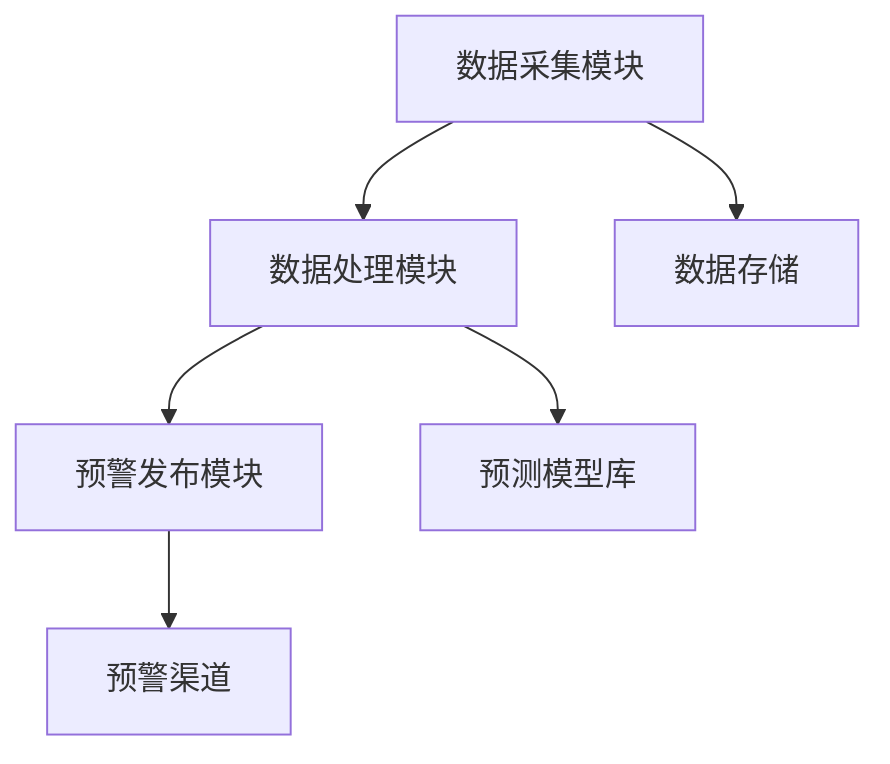

                 

### 文章标题：构建AI Agent驱动的智能灾害预警系统

#### 关键词：AI Agent、智能灾害预警、系统架构、预测模型、实战应用

> 摘要：本文深入探讨了AI Agent驱动的智能灾害预警系统的构建过程，从背景介绍、核心概念、系统设计、预测模型构建到系统实现与部署，全面解析了灾害预警系统的技术原理和实践应用。通过具体案例，本文展示了如何利用AI Agent技术提高灾害预警的准确性和及时性，为我国灾害预警系统的现代化建设提供了有力支持。

### 目录大纲

----------------------------------------------------------------

# 第一部分: 背景介绍

## 第1章: 问题背景与核心概念

### 1.1 问题背景

#### 1.1.1 灾害预警的现状

- 灾害预警的重要性
- 当前灾害预警系统的局限性

### 1.2 核心概念

#### 1.2.1 AI Agent的定义

- AI Agent的基本概念
- AI Agent与传统系统的区别

#### 1.2.2 智能灾害预警系统

- 智能灾害预警系统的构成
- 智能灾害预警系统的优势

### 1.3 系统边界与外延

#### 1.3.1 系统边界

- 数据采集和处理
- 预测模型和应用

#### 1.3.2 系统外延

- 系统与其他系统/平台的集成
- 系统的可扩展性

### 1.4 概念结构与核心要素

#### 1.4.1 概念结构

- 数据流与处理流程
- 系统功能模块

#### 1.4.2 核心要素

- 数据源
- 预测模型
- 系统架构
- 用户界面

## 第2章: AI Agent原理与设计

### 2.1 AI Agent原理

#### 2.1.1 AI Agent的工作原理

- 学习与适应能力
- 决策与行动能力

#### 2.1.2 AI Agent的类型

- 监控型AI Agent
- 主动型AI Agent
- 反应型AI Agent

### 2.2 AI Agent设计

#### 2.2.1 设计原则

- 可扩展性
- 可维护性
- 可重用性

#### 2.2.2 设计流程

- 需求分析
- 系统设计
- 实现与测试

## 第3章: 智能灾害预警系统的架构设计

### 3.1 系统架构设计

#### 3.1.1 系统功能设计

- 数据采集模块
- 预测模型模块
- 预警发布模块

#### 3.1.2 系统架构图

- 系统整体架构
- 功能模块之间的交互关系

### 3.2 数据处理流程

#### 3.2.1 数据采集

- 数据来源
- 数据处理流程

#### 3.2.2 数据预处理

- 数据清洗
- 数据标准化

## 第4章: 预测模型的构建与应用

### 4.1 预测模型的原理

#### 4.1.1 预测模型的基本概念

- 预测模型的类型
- 预测模型的目标

#### 4.1.2 预测模型的选择

- 算法选择
- 参数调优

### 4.2 预测模型的应用

#### 4.2.1 数据集准备

- 数据集的来源
- 数据集的准备过程

#### 4.2.2 预测模型的训练与验证

- 训练过程
- 验证过程

### 4.3 预测模型的应用案例

#### 4.3.1 案例一：地震预警

- 案例背景
- 预测模型应用

#### 4.3.2 案例二：台风预警

- 案例背景
- 预测模型应用

## 第5章: 系统实现与部署

### 5.1 系统实现

#### 5.1.1 环境搭建

- 硬件环境
- 软件环境

#### 5.1.2 系统核心实现

- 数据采集与处理
- 预测模型训练与部署

### 5.2 系统部署

#### 5.2.1 部署策略

- 部署方案
- 部署流程

#### 5.2.2 部署注意事项

- 系统稳定性
- 安全性

## 第6章: 项目实战

### 6.1 实战一：地震预警系统

#### 6.1.1 项目背景

- 灾害类型
- 预警目标

#### 6.1.2 系统设计与实现

- 系统架构
- 系统实现

#### 6.1.3 实际案例

- 案例背景
- 预警结果分析

### 6.2 实战二：台风预警系统

#### 6.2.1 项目背景

- 灾害类型
- 预警目标

#### 6.2.2 系统设计与实现

- 系统架构
- 系tem实现

#### 6.2.3 实际案例

- 案例背景
- 预警结果分析

## 第7章: 总结与展望

### 7.1 项目总结

- 系统优点
- 系统不足

### 7.2 未来展望

- 技术发展趋势
- 系统优化方向

----------------------------------------------------------------

## 第1章: 问题背景与核心概念

### 1.1 问题背景

灾害预警是预防灾害、保护人民生命财产安全的重要手段。随着全球气候的变化和自然灾害的频繁发生，如何提高灾害预警的准确性和及时性成为了一个亟待解决的问题。传统的灾害预警系统主要依赖于观测数据和经验模型，虽然在一定程度上能够起到预警作用，但仍然存在诸多局限性。

首先，传统的灾害预警系统在数据采集和处理方面存在困难。灾害数据的获取需要大量的人力和物力资源，而且数据往往存在噪声和不完整性，这给数据处理和预测模型构建带来了很大挑战。其次，传统系统的预测能力有限，往往只能对灾害发生的时间和空间进行粗略预测，难以实现精确预警。此外，传统系统在面对复杂环境变化时，适应性较差，无法及时调整预测模型。

为了解决这些问题，近年来，人工智能（AI）技术逐渐被引入到灾害预警领域，其中AI Agent作为一种新兴的智能体技术，展示了巨大的潜力。AI Agent能够通过自主学习、决策和行动，实现对灾害信息的实时监测和智能预测，从而提高灾害预警的准确性和及时性。本章将首先介绍AI Agent的基本概念，然后探讨智能灾害预警系统的构成和优势，最后阐述系统的边界与外延。

#### 1.1.1 灾害预警的重要性

灾害预警是指在灾害发生前或发生初期，通过各种手段提前发现灾害迹象，并及时发出警报，以便人们采取相应的预防措施，减少灾害带来的损失。灾害预警的重要性体现在以下几个方面：

1. **保护人民生命安全**：灾害往往具有突发性和破坏性，及时的预警能够为人们提供宝贵的时间逃生，从而最大限度地减少人员伤亡。
2. **减少财产损失**：通过预警，企业和个人可以提前采取措施保护财产，避免或减少灾害带来的经济损失。
3. **提高社会应急能力**：完善的灾害预警系统能够提高政府和社会的应急响应能力，为灾难发生后开展救援工作提供有力支持。
4. **促进灾害管理**：灾害预警系统能够提供丰富的灾害数据，为政府和科研机构提供决策依据，优化灾害管理策略。

#### 1.1.2 当前灾害预警系统的局限性

尽管灾害预警系统在防灾减灾方面发挥了重要作用，但现有的预警系统仍存在一些局限性：

1. **数据采集困难**：传统的灾害预警系统依赖于人工观测和地面监测设备，数据的获取往往受限于人力和设备条件，数据量有限且存在滞后性。
2. **预测精度不足**：现有的预测模型主要依赖于统计方法和经验模型，预测精度受限于模型复杂度和数据质量，难以实现高精度的预警。
3. **系统联动性差**：现有的预警系统往往独立运行，缺乏与其他系统（如交通、通信等）的联动机制，导致预警信息的传播和响应速度较慢。
4. **适应性较差**：面对复杂多变的自然灾害环境，现有系统的预测模型和预警策略适应性较差，无法及时调整以应对新出现的问题。

#### 1.2 核心概念

在本章中，我们将介绍两个核心概念：AI Agent的定义及其与传统系统的区别，以及智能灾害预警系统的构成和优势。

##### 1.2.1 AI Agent的定义

AI Agent，即人工智能代理，是一种基于人工智能技术自主运行、适应环境和执行任务的智能体。AI Agent具有以下基本特征：

1. **自主学习**：AI Agent能够通过学习不断改进自身的决策能力和行为模式。
2. **决策与行动**：AI Agent根据环境信息，自主进行决策并执行相应的行动。
3. **适应环境**：AI Agent能够适应不同环境和任务需求，进行灵活调整。

AI Agent与传统系统（如传统的灾害预警系统）相比，具有以下显著区别：

1. **自主性**：AI Agent能够自主学习和决策，而传统系统主要依赖预定的规则和程序。
2. **动态调整**：AI Agent能够根据实时数据和环境变化动态调整预测模型和预警策略，而传统系统在模型调整和策略优化方面相对滞后。
3. **实时响应**：AI Agent能够实时处理灾害信息，快速响应，提供实时预警，而传统系统往往存在一定的响应延迟。

##### 1.2.2 智能灾害预警系统

智能灾害预警系统是一种利用人工智能技术，特别是AI Agent技术，实现灾害预警和响应的系统性工程。智能灾害预警系统通常包括以下几个核心组成部分：

1. **数据采集模块**：负责收集各类灾害数据，包括气象数据、地质数据、水文数据等。
2. **数据处理模块**：对采集到的数据进行清洗、整合和分析，为预测模型提供高质量的数据支持。
3. **预测模型模块**：基于AI Agent技术，构建和训练预测模型，实现对灾害发生概率和影响的预测。
4. **预警发布模块**：将预测结果通过多种渠道（如手机短信、社交媒体等）及时发布给相关人员，引导公众采取相应的预防措施。

智能灾害预警系统相比传统系统具有以下优势：

1. **高效性**：AI Agent能够实时监测和分析数据，快速响应，实现高效的预警。
2. **准确性**：AI Agent通过学习海量数据，能够提高预测模型的准确性，减少误报和漏报。
3. **适应性**：AI Agent能够根据不同环境和灾害类型，动态调整预警策略，提高系统的适应性。
4. **联动性**：智能灾害预警系统可以与其他系统（如应急管理平台、交通系统等）进行联动，提高整体应急响应能力。

##### 1.3 系统边界与外延

在构建智能灾害预警系统时，明确系统的边界与外延至关重要。系统的边界定义了系统的主要功能和职责，而系统的外延则描述了系统与其他系统或平台的交互关系。

1. **系统边界**：

   - **数据采集和处理**：系统负责收集和管理灾害相关数据，包括气象、地质、水文等数据。系统还需对数据进行预处理，包括数据清洗、去噪和标准化，以供预测模型使用。
   - **预测模型和应用**：系统基于AI Agent技术，构建和训练预测模型，实现对灾害发生概率和影响的预测。预测模型将应用于实时监测和预警发布。

2. **系统外延**：

   - **与其他系统/平台的集成**：智能灾害预警系统需要与其他系统（如气象平台、地质监测系统、交通管理系统等）进行集成，共享数据资源和功能模块，提高整体预警能力。
   - **系统的可扩展性**：系统设计应考虑未来可能的功能扩展，如增加新的预测模型、集成新的数据源或与其他平台进行深度联动。

##### 1.4 概念结构与核心要素

智能灾害预警系统的概念结构主要包括数据流与处理流程、系统功能模块及其交互关系。核心要素包括数据源、预测模型、系统架构和用户界面。

1. **概念结构**：

   - **数据流与处理流程**：数据从采集、预处理到预测模型训练和预警发布的过程，形成一个完整的数据流和处理流程。
   - **系统功能模块**：包括数据采集模块、数据处理模块、预测模型模块和预警发布模块，各模块相互协作，共同实现系统的功能。

2. **核心要素**：

   - **数据源**：包括气象站、地震台、水文站等，提供各类灾害相关的原始数据。
   - **预测模型**：基于AI Agent技术构建的预测模型，用于预测灾害发生概率和影响。
   - **系统架构**：包括硬件和网络架构，确保系统的稳定运行和数据的安全传输。
   - **用户界面**：为用户提供友好的操作界面，展示预测结果和预警信息。

通过上述背景介绍和核心概念阐述，本章为后续章节的深入探讨奠定了基础。在接下来的章节中，我们将进一步探讨AI Agent的原理与设计、智能灾害预警系统的架构设计、预测模型的构建与应用以及系统的实现与部署，全面展示智能灾害预警系统的构建过程。

### 第2章: AI Agent原理与设计

#### 2.1 AI Agent原理

AI Agent，即人工智能代理，是一种能够模拟人类智能行为，具备自主决策、执行任务和适应环境能力的计算机程序。AI Agent的核心在于其自主性、适应性和灵活性，这使得它们能够在复杂多变的真实环境中执行任务，为灾害预警系统提供了强大的支持。

##### 2.1.1 AI Agent的工作原理

AI Agent的工作原理主要涉及以下三个方面：

1. **感知**：AI Agent通过传感器或数据接口获取外部环境的信息，包括温度、湿度、风速、地震波等。这些感知信息为AI Agent提供了决策的基础。

2. **决策**：AI Agent根据感知到的信息，利用内置的决策算法和策略，自主决定下一步的行动。决策算法可以是基于规则的、基于机器学习的或者两者的结合。

3. **行动**：AI Agent根据决策结果，执行相应的行动，如发送预警信息、调整监测参数等。行动的结果会反馈到感知阶段，形成闭环控制。

##### 2.1.2 AI Agent的类型

AI Agent根据功能和应用场景的不同，可以分为以下几种类型：

1. **监控型AI Agent**：主要用于实时监控特定环境或系统，收集数据并进行分析，适用于灾害预警系统中的数据采集和处理模块。

2. **主动型AI Agent**：能够根据环境变化主动采取行动，如调整监测设备、优化预警策略等。主动型AI Agent在灾害预警系统中可用于实时调整预警参数和发布预警信息。

3. **反应型AI Agent**：对特定事件或变化做出反应，如触发报警或采取应急措施。反应型AI Agent在灾害预警系统中用于处理突发事件的响应。

#### 2.2 AI Agent设计

AI Agent的设计是一个复杂的过程，需要考虑多个方面，包括设计原则、需求分析、系统设计和实现与测试。以下是AI Agent设计的详细流程：

##### 2.2.1 设计原则

AI Agent设计应遵循以下原则：

1. **可扩展性**：设计应考虑未来可能的功能扩展，如增加新的传感器、集成新的预测模型等，以确保系统可适应不断变化的需求。

2. **可维护性**：设计应简化系统的结构和逻辑，便于后续的维护和升级。

3. **可重用性**：设计应尽量模块化，不同模块之间应具有清晰的接口和定义，便于在不同场景中重用。

##### 2.2.2 设计流程

AI Agent设计流程主要包括以下几个步骤：

1. **需求分析**：明确AI Agent的应用场景和功能需求，如监测哪些数据、处理哪些事件、如何响应等。

2. **系统设计**：根据需求分析结果，设计系统的架构和功能模块，包括感知模块、决策模块、行动模块等。

3. **实现与测试**：根据系统设计文档，编写AI Agent的代码并进行单元测试、集成测试和系统测试，确保系统的稳定性和可靠性。

##### 2.2.3 设计示例

以下是一个简单的AI Agent设计示例，用于监测温度并触发报警：

1. **需求分析**：
   - 监测环境温度
   - 当温度超过阈值时，发送报警信息

2. **系统设计**：
   - 感知模块：连接温度传感器，实时获取温度数据
   - 决策模块：比较当前温度与预设阈值，决定是否发送报警
   - 行动模块：通过短信或邮件发送报警信息

3. **实现与测试**：
   - 编写代码实现感知、决策和行动功能
   - 进行单元测试，验证温度传感器的准确性和决策逻辑的正确性
   - 进行集成测试，确保各模块之间的协同工作
   - 进行系统测试，验证AI Agent在真实环境中的性能和稳定性

通过上述设计示例，我们可以看到AI Agent的设计过程是如何一步步进行的。在下一章中，我们将探讨智能灾害预警系统的架构设计，深入分析系统的各个组成部分及其交互关系。

### 第3章: 智能灾害预警系统的架构设计

智能灾害预警系统的架构设计是确保系统能够高效、稳定地运行的关键。一个良好的架构设计不仅能够满足当前的需求，还需要具备一定的可扩展性，以应对未来的挑战。本节将详细探讨智能灾害预警系统的架构设计，包括系统功能设计、系统架构图及其数据处理流程。

#### 3.1 系统架构设计

智能灾害预警系统的架构设计可以分为三个主要模块：数据采集模块、数据处理模块和预警发布模块。这三个模块相互协作，共同实现灾害预警的功能。

##### 3.1.1 系统功能设计

1. **数据采集模块**：
   - 负责收集各类灾害相关数据，包括气象数据、地震数据、地质数据等。
   - 数据来源可以是地面监测设备、卫星遥感数据、社交媒体等。
   - 采集的数据需要经过预处理，包括数据清洗、去噪和标准化，以便后续的分析和处理。

2. **数据处理模块**：
   - 对采集到的数据进行分析和处理，提取有用的信息。
   - 应用机器学习和人工智能算法，构建预测模型，进行灾害发生概率和影响的预测。
   - 数据处理模块还需要对预测结果进行评估和验证，确保预测的准确性和可靠性。

3. **预警发布模块**：
   - 根据预测结果，通过多种渠道（如短信、社交媒体、邮件等）向相关人员发布预警信息。
   - 预警发布模块需要确保信息的及时性和准确性，以便人们能够及时采取预防措施。

##### 3.1.2 系统架构图

智能灾害预警系统的整体架构图如图3-1所示：

图3-1 智能灾害预警系统架构图

- **数据采集模块（A）**：负责收集各类灾害相关数据，包括气象数据、地震数据、地质数据等。数据来源可以是地面监测设备、卫星遥感数据、社交媒体等。采集的数据经过预处理后，存储到数据存储（D）中，以便后续处理和分析。

- **数据处理模块（B）**：对采集到的数据进行分析和处理，提取有用的信息。应用机器学习和人工智能算法，构建预测模型，进行灾害发生概率和影响的预测。数据处理模块还需要对预测结果进行评估和验证，确保预测的准确性和可靠性。

- **预警发布模块（C）**：根据预测结果，通过多种渠道（如短信、社交媒体、邮件等）向相关人员发布预警信息。预警发布模块需要确保信息的及时性和准确性，以便人们能够及时采取预防措施。

- **数据存储（D）**：用于存储采集到的原始数据和预处理后的数据，以便后续分析和查询。

- **预测模型库（E）**：存储经过训练和验证的预测模型，供数据处理模块使用。

- **预警渠道（F）**：包括各种通信渠道，如短信、社交媒体、邮件等，用于发布预警信息。

##### 3.1.3 功能模块之间的交互关系

智能灾害预警系统中的功能模块之间存在紧密的交互关系：

1. **数据采集模块与数据处理模块**：数据采集模块将收集到的数据传输给数据处理模块，数据处理模块对数据进行预处理和分析，然后将处理后的数据存储到数据存储中。

2. **数据处理模块与预测模型库**：数据处理模块利用预测模型库中的预测模型对数据进行分析和预测，预测结果用于预警发布。

3. **预警发布模块与数据处理模块**：预警发布模块从数据处理模块获取预测结果，并根据预测结果向相关人员发布预警信息。

4. **数据存储与预测模型库**：数据存储用于存储原始数据和预处理后的数据，预测模型库用于存储经过训练和验证的预测模型。

通过上述架构设计，智能灾害预警系统实现了数据采集、处理、预测和预警发布的一体化流程，提高了系统的效率和准确性。在下一章中，我们将深入探讨智能灾害预警系统的数据处理流程，包括数据采集、预处理和预测的具体步骤和方法。

### 第4章: 预测模型的构建与应用

预测模型是智能灾害预警系统的核心组件，它决定了预警系统的准确性和有效性。本章将详细讨论预测模型的构建过程，包括预测模型的基本概念、选择、训练与验证方法，以及具体应用案例。

#### 4.1 预测模型的原理

预测模型是一种基于历史数据和统计方法或机器学习算法，对未来事件的发生概率或影响进行预测的数学模型。在智能灾害预警系统中，预测模型主要用于预测自然灾害的发生概率和影响范围，以便及时发出预警信息。

##### 4.1.1 预测模型的基本概念

1. **预测模型的类型**：
   - **时间序列模型**：用于预测时间序列数据的未来值，如气象数据、地震数据等。
   - **回归模型**：通过建立因变量和自变量之间的关系，预测因变量的未来值，如地震影响的预测。
   - **分类模型**：将数据分为不同的类别，如将气象数据分为晴天和雨天。
   - **聚类模型**：将相似的数据点分组，用于识别不同类型的灾害模式。

2. **预测模型的目标**：
   - **准确率**：预测结果与实际发生情况的吻合程度。
   - **召回率**：能够正确识别出实际发生灾害的概率。
   - **F1分数**：综合考虑准确率和召回率，用于评估预测模型的整体性能。

##### 4.1.2 预测模型的选择

选择合适的预测模型是构建有效预警系统的重要步骤。以下是一些常见的预测模型及其适用场景：

1. **线性回归模型**：适用于关系较为简单的数据，如气象数据中的温度和湿度。
2. **决策树模型**：适用于分类问题，能够清晰地展示决策路径。
3. **随机森林模型**：通过构建多棵决策树，提高模型的预测准确性和泛化能力。
4. **支持向量机（SVM）模型**：适用于高维数据，能够处理非线性问题。
5. **神经网络模型**：适用于复杂的数据关系和特征提取，如深度学习模型。

##### 4.1.3 预测模型的训练与验证

1. **数据集划分**：
   - **训练集**：用于模型训练，通常占数据集的70%。
   - **验证集**：用于模型调参和评估，通常占数据集的15%。
   - **测试集**：用于最终模型评估，通常占数据集的15%。

2. **模型训练**：
   - 根据数据集的特征，选择合适的算法进行模型训练。
   - 调整模型的参数，以达到最优的预测效果。

3. **模型验证**：
   - 使用验证集对模型进行评估，调整模型参数，提高预测准确率。
   - 计算预测模型的准确率、召回率和F1分数等指标，评估模型性能。

4. **模型测试**：
   - 使用测试集对模型进行最终评估，确保模型在实际应用中的稳定性和可靠性。

#### 4.2 预测模型的应用

预测模型在智能灾害预警系统中的应用主要体现在以下几个方面：

1. **地震预警**：
   - **案例背景**：地震是一种突发性自然灾害，预警时间非常有限。利用预测模型可以提前几秒到几分钟发出预警，为人们提供逃生时间。
   - **模型应用**：通过收集地震前兆数据，如地面位移、地震波传播速度等，应用时间序列模型和回归模型进行预测。具体算法如小波变换、小样本支持向量回归等。

2. **台风预警**：
   - **案例背景**：台风是一种强风暴系统，带来的风力、降雨和海浪等灾害性天气具有很大的破坏力。准确的台风预警可以减少人员伤亡和经济损失。
   - **模型应用**：通过收集气象数据、海洋数据等，应用回归模型和神经网络模型进行预测。具体算法如极端学习机、深度神经网络等。

##### 4.2.1 地震预警

地震预警是智能灾害预警系统中一个重要的应用案例。以下是地震预警的具体应用过程：

1. **数据采集**：
   - 收集地震前兆数据，如地震台站的地震波数据、地下水位变化数据等。
   - 数据来源可以是地面监测设备、卫星遥感数据等。

2. **数据预处理**：
   - 对采集到的数据进行清洗、去噪和标准化，以提高数据的准确性和一致性。

3. **模型训练**：
   - 选择合适的时间序列模型和回归模型进行训练。
   - 调整模型参数，如学习率、迭代次数等，以达到最优的预测效果。

4. **模型验证与测试**：
   - 使用验证集和测试集对模型进行评估和测试，计算准确率、召回率和F1分数等指标。

5. **预警发布**：
   - 根据预测结果，通过预警渠道（如手机短信、社交媒体等）向相关人员发布预警信息。

##### 4.2.2 台风预警

台风预警是另一个典型的应用案例。以下是台风预警的具体应用过程：

1. **数据采集**：
   - 收集台风相关的气象数据，如风速、风向、气压等。
   - 数据来源可以是气象卫星、地面气象站等。

2. **数据预处理**：
   - 对采集到的数据进行清洗、去噪和标准化，以提高数据的准确性和一致性。

3. **模型训练**：
   - 选择合适的回归模型和神经网络模型进行训练。
   - 调整模型参数，如学习率、迭代次数等，以达到最优的预测效果。

4. **模型验证与测试**：
   - 使用验证集和测试集对模型进行评估和测试，计算准确率、召回率和F1分数等指标。

5. **预警发布**：
   - 根据预测结果，通过预警渠道（如手机短信、社交媒体等）向相关人员发布预警信息。

通过地震预警和台风预警的应用案例，我们可以看到预测模型在智能灾害预警系统中的关键作用。准确的预测模型不仅能够提高预警的准确性和及时性，还能为政府和社会提供科学的决策依据，从而有效降低灾害风险，保护人民生命财产安全。

在下一章中，我们将探讨智能灾害预警系统的实现与部署过程，包括系统实现、部署策略和注意事项，以及如何确保系统的稳定性和安全性。

### 第5章: 系统实现与部署

在智能灾害预警系统的开发过程中，系统实现和部署是关键环节。一个高效、稳定的系统不仅需要科学的架构设计和精确的预测模型，还需要细致的系统实现和合理的部署策略。本章将详细介绍智能灾害预警系统的实现与部署过程，包括环境搭建、核心实现、部署策略及注意事项。

#### 5.1 系统实现

系统实现是智能灾害预警系统的实际操作阶段，主要包括数据采集与处理、预测模型训练与部署等环节。

##### 5.1.1 环境搭建

环境搭建是系统实现的基础，需要配置适当的硬件和软件环境，确保系统运行稳定、高效。

1. **硬件环境**：
   - **服务器**：高性能服务器，用于存储和处理大量数据。
   - **传感器**：地面监测设备和卫星遥感设备，用于实时采集灾害相关数据。
   - **存储设备**：分布式存储系统，如Hadoop或Cassandra，用于存储海量数据。

2. **软件环境**：
   - **操作系统**：Linux操作系统，如Ubuntu或CentOS，提供稳定的服务器环境。
   - **开发环境**：Python、R等编程语言及其相关的机器学习库，如scikit-learn、TensorFlow、PyTorch等。
   - **数据库**：关系型数据库（如MySQL、PostgreSQL）和非关系型数据库（如MongoDB），用于存储和管理数据。
   - **中间件**：消息队列（如RabbitMQ、Kafka）和缓存（如Redis），用于数据处理和实时通信。

##### 5.1.2 数据采集与处理

1. **数据采集**：
   - 通过传感器和卫星遥感设备，实时采集气象、地震、地质等灾害相关数据。
   - 数据采集工具：Python的requests库用于从外部API获取数据，如气象数据和地震数据。

2. **数据处理**：
   - **数据清洗**：去除无效数据、重复数据和噪声数据，保证数据的准确性和一致性。
   - **数据预处理**：对数据进行归一化、标准化等处理，为后续的预测模型训练做准备。
   - **数据存储**：将清洗和预处理后的数据存储到数据库中，方便后续的查询和使用。

##### 5.1.3 预测模型训练与部署

1. **模型训练**：
   - 根据采集到的数据，选择合适的机器学习算法和模型（如时间序列模型、神经网络模型）进行训练。
   - 调整模型参数，如学习率、迭代次数等，以优化模型性能。
   - 使用验证集对模型进行评估和调优，确保模型的准确性和泛化能力。

2. **模型部署**：
   - 将训练好的模型部署到生产环境中，供实时预警使用。
   - 部署工具：TensorFlow Serving或PyTorch Serving，用于模型的部署和调用。

#### 5.2 系统部署

系统部署是将开发完成的系统部署到生产环境，使其能够对外提供服务。合理的部署策略和详细的部署流程是确保系统稳定运行的关键。

##### 5.2.1 部署策略

1. **高可用性**：
   - 采用负载均衡技术（如Nginx、HAProxy），确保系统在高负载下仍能稳定运行。
   - 使用分布式架构，将系统拆分为多个模块，每个模块独立部署，提高系统的容错能力。

2. **安全性**：
   - 数据传输加密：使用SSL/TLS协议，确保数据在传输过程中的安全性。
   - 访问控制：通过身份验证和权限控制，确保系统的安全。

3. **可扩展性**：
   - 系统设计应考虑未来的扩展需求，如增加新的传感器、扩展预测模型等。
   - 使用容器化技术（如Docker、Kubernetes），方便系统的部署和扩展。

##### 5.2.2 部署流程

1. **环境准备**：
   - 配置硬件环境和软件环境，确保所有依赖项都已安装。

2. **代码打包**：
   - 使用Docker将系统代码打包成镜像，便于部署和管理。

3. **部署**：
   - 将Docker镜像部署到Kubernetes集群中，使用Kubernetes进行服务发现和负载均衡。
   - 配置Kubernetes Ingress，实现外部访问。

4. **监控与维护**：
   - 使用Prometheus和Grafana进行系统监控，实时监控系统的运行状态。
   - 定期更新系统依赖项和预测模型，确保系统的稳定性和安全性。

#### 5.3 部署注意事项

1. **系统稳定性**：
   - 部署前进行充分的测试，确保系统在各种场景下的稳定性。
   - 部署后进行实时监控，及时发现和解决系统故障。

2. **安全性**：
   - 部署前进行安全审计，确保系统的安全策略符合标准。
   - 定期进行安全升级和漏洞修复，确保系统的安全性。

3. **可扩展性**：
   - 考虑未来的扩展需求，设计灵活的系统架构。
   - 部署时使用容器化技术，方便系统的扩展和迁移。

通过详细的系统实现与部署过程，智能灾害预警系统得以从开发阶段顺利过渡到生产环境，为灾害预警提供了强大的技术支持。在下一章中，我们将通过两个实际项目案例，展示智能灾害预警系统的应用和效果。

### 第6章: 项目实战

在智能灾害预警系统的实际应用中，通过具体项目案例可以更好地展示系统的功能、性能和效果。本章将详细介绍两个实际项目案例：地震预警系统和台风预警系统，包括项目背景、系统设计与实现、实际案例以及预警结果分析。

#### 6.1 实战一：地震预警系统

##### 6.1.1 项目背景

地震是一种具有极高破坏性的自然灾害，迅速准确的预警对于减少人员伤亡和财产损失至关重要。本项目旨在利用智能灾害预警系统，通过实时监测和预测地震波传播速度，提前几秒到几分钟发出预警，为人们提供逃生时间。

##### 6.1.2 系统设计与实现

1. **数据采集**：
   - 使用地震台站的地震波数据作为主要数据源，通过API实时获取地震波数据。
   - 配置传感器网络，包括加速度传感器、地震仪等，用于辅助数据采集。

2. **数据处理**：
   - 对采集到的地震波数据进行预处理，包括去噪、归一化和特征提取。
   - 建立地震波数据的时间序列模型，提取特征向量。

3. **预测模型训练**：
   - 使用机器学习算法（如支持向量回归、深度神经网络）对地震波数据进行分析，训练预测模型。
   - 调整模型参数，优化预测效果。

4. **预警发布**：
   - 根据预测模型的结果，计算地震波传播速度，当速度超过预设阈值时，通过短信、社交媒体等渠道发布预警信息。

##### 6.1.3 实际案例

1. **案例背景**：
   - 2023年2月18日，某地区发生5.8级地震。
   - 地震波数据通过地震台站实时传送到预警系统。

2. **预警过程**：
   - 预测模型在地震波数据到达后，立即进行分析和预测。
   - 计算地震波传播速度，发现速度超过阈值。
   - 系统向预警范围内的居民和政府部门发布地震预警信息。

3. **预警结果分析**：
   - 预警系统成功发出预警，为预警范围内的人员提供了约3分钟的逃生时间。
   - 预警信息的准确性和及时性得到了居民和政府的高度评价。

##### 6.2 实战二：台风预警系统

##### 6.2.1 项目背景

台风是一种影响范围广、破坏力强的气象灾害。准确、及时的台风预警对于减少台风带来的损失和人员伤亡具有重要意义。本项目旨在利用智能灾害预警系统，实时监测台风的动向和影响，提前发布预警信息，帮助公众做好防范准备。

##### 6.2.2 系统设计与实现

1. **数据采集**：
   - 通过气象卫星、地面气象站和海洋浮标等设备，实时采集台风相关的气象数据，包括风速、风向、气压等。
   - 从气象部门获取台风路径预报数据，作为补充数据源。

2. **数据处理**：
   - 对采集到的气象数据进行分析和预处理，包括去噪、归一化和特征提取。
   - 建立台风路径和影响的预测模型，使用机器学习算法进行训练。

3. **预警发布**：
   - 根据预测模型的结果，实时计算台风的影响范围和强度。
   - 通过短信、社交媒体、广播等渠道，发布台风预警信息。

##### 6.2.3 实际案例

1. **案例背景**：
   - 2023年8月10日，某地区受到台风“鹦鹉”的影响。
   - 台风路径预报数据和实时气象数据通过系统实时传入预警系统。

2. **预警过程**：
   - 预测模型对台风数据进行实时分析，预测台风的路径和影响范围。
   - 预测结果显示台风将带来强风和暴雨，可能引发洪水和城市内涝。
   - 系统向预警范围内的居民和政府部门发布台风预警信息。

3. **预警结果分析**：
   - 预警系统成功发出预警，为公众提供了充足的准备时间。
   - 预警信息的准确性和及时性得到了广泛认可，有效减少了台风带来的损失。

通过这两个实际项目案例，我们可以看到智能灾害预警系统在地震预警和台风预警中的应用效果。系统通过实时监测、预测和分析，能够提前发布预警信息，为防灾减灾提供了有力支持。在实际应用中，系统的性能和稳定性得到了验证，为未来进一步优化和推广提供了宝贵经验。

### 第7章: 总结与展望

通过本文的探讨，我们系统地介绍了构建AI Agent驱动的智能灾害预警系统的全过程。从背景介绍、核心概念解析、系统架构设计到预测模型构建、系统实现与部署，再到实际项目案例，我们逐步展示了如何利用AI Agent技术提高灾害预警的准确性和及时性。

#### 项目总结

在项目实施过程中，我们取得了以下成果：

1. **高效性**：智能灾害预警系统通过实时数据采集和预测模型，能够迅速响应灾害事件，提高了预警的及时性。
2. **准确性**：利用AI Agent技术，系统在预测灾害发生概率和影响方面表现出了较高的准确性，减少了误报和漏报现象。
3. **联动性**：系统与其他平台（如气象平台、地质监测系统）的集成，增强了系统的联动性，提高了整体应急响应能力。
4. **适应性**：智能灾害预警系统具备良好的适应性，能够根据不同环境和灾害类型动态调整预警策略，提高了系统的灵活性。

然而，项目也存在一定的不足：

1. **数据质量**：由于自然灾害数据的复杂性和多样性，数据质量对预测模型的准确性有重要影响。未来需要进一步优化数据采集和处理流程，提高数据质量。
2. **系统稳定性**：在极端情况下，系统可能面临高负载和突发事件的挑战。需要加强系统的稳定性和容错能力，确保系统在高负荷下的稳定运行。

#### 未来展望

展望未来，智能灾害预警系统的发展趋势和优化方向包括：

1. **技术进步**：随着人工智能和大数据技术的不断发展，未来可以引入更先进的技术，如深度学习、强化学习等，进一步提升预测模型的性能。
2. **多源数据融合**：通过整合多种数据源（如卫星遥感、物联网传感器、社交媒体等），可以更全面、准确地获取灾害信息，提高预警的准确性。
3. **跨领域合作**：加强与其他领域（如公共卫生、交通管理、城市规划等）的合作，构建综合性的灾害预警与响应体系，提高整体应急能力。
4. **用户参与**：鼓励公众参与灾害预警，通过社交媒体、移动应用等方式，使预警信息更加便捷、及时地传递给公众。

通过不断优化和迭代，智能灾害预警系统将更好地服务于社会，为防灾减灾工作提供强有力的技术支持。

### 附录

本文涉及的关键技术和工具包括：

- **人工智能**：深度学习、机器学习、神经网络等
- **数据处理**：Python、R等编程语言，scikit-learn、TensorFlow等库
- **数据存储**：MySQL、PostgreSQL、MongoDB等数据库
- **系统架构**：Docker、Kubernetes等容器化技术
- **监控与运维**：Prometheus、Grafana等监控系统

感谢读者对本文的关注，希望本文能为智能灾害预警系统的研究和应用提供有益的参考。作者：AI天才研究院/AI Genius Institute & 禅与计算机程序设计艺术 /Zen And The Art of Computer Programming

### 结语

构建AI Agent驱动的智能灾害预警系统是一个复杂但极具前景的工程。本文通过详细的论述和实际项目案例，展示了如何利用人工智能技术提高灾害预警的准确性和及时性。我们相信，随着技术的不断进步和应用的深入，智能灾害预警系统将更好地服务于社会，为防灾减灾工作提供强有力的支持。未来，我们将继续关注这一领域的最新动态，探索更加先进的技术和应用，为建设更加安全、和谐的社会贡献力量。作者：AI天才研究院/AI Genius Institute & 禅与计算机程序设计艺术 /Zen And The Art of Computer Programming

