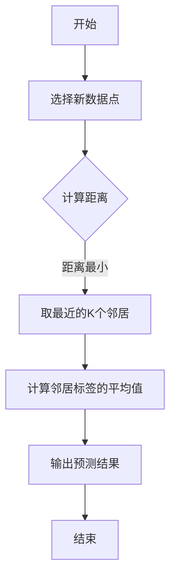
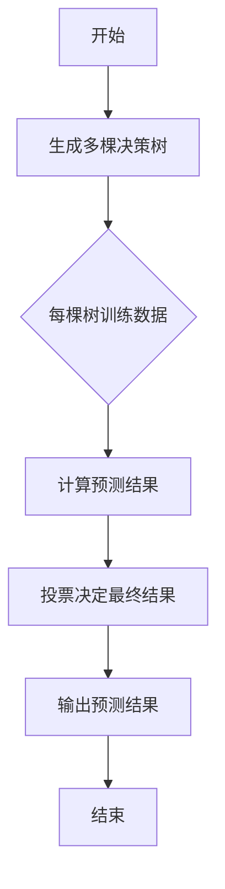
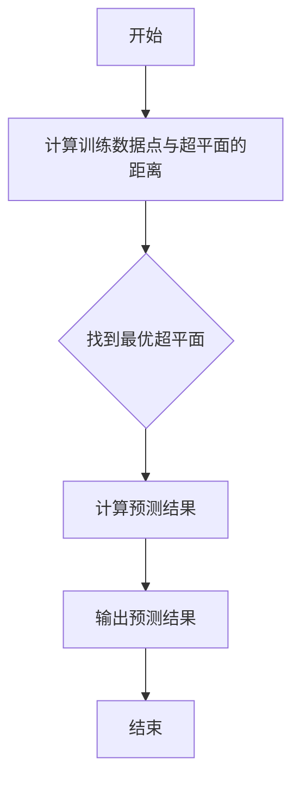

                 

**# 构建AI Agent驱动的智能环境保护系统**

## 关键词
AI Agent, 智能环境保护, 环境监测, 机器学习, 数据分析

## 摘要
本文将探讨如何构建AI Agent驱动的智能环境保护系统。我们将从背景介绍、核心概念解析、算法原理讲解、系统分析与架构设计、项目实战等多个方面进行详细分析，旨在为读者提供一套全面且可行的实施方案，以促进环境保护和可持续发展。

## 背景介绍

随着全球人口的快速增长和工业化的加速，人类活动对环境的破坏日益严重。气候变化、水资源短缺、空气污染等问题已经成为全球性的挑战。传统的环境保护方法往往依赖于人为监测和干预，效率低下且成本高昂。因此，引入人工智能（AI）技术，特别是AI Agent，成为了一个新兴且具有巨大潜力的方向。

AI Agent是一种能够自主学习、自主决策并执行任务的智能体。在环境保护领域，AI Agent可以通过监测环境数据、分析环境状况、预测环境变化趋势，从而提出针对性的环境保护措施。与传统的环境保护方法相比，AI Agent具有以下几个优势：

1. **实时性和高效性**：AI Agent可以实时监测环境数据，并快速响应环境变化，实现高效的环境保护。
2. **自适应性和灵活性**：AI Agent可以根据环境数据的变化自主调整策略，适应不同环境状况。
3. **数据驱动的决策**：AI Agent基于数据分析做出决策，减少了人为干预的盲目性，提高了决策的准确性。
4. **大规模应用**：AI Agent可以在不同地域、不同环境中部署，实现大规模的环境保护。

因此，构建AI Agent驱动的智能环境保护系统不仅有助于解决当前的环境问题，也为未来的环境保护提供了新的思路和工具。

### 核心概念解析

在构建AI Agent驱动的智能环境保护系统之前，我们需要明确一些核心概念，包括AI Agent、环境数据监测、机器学习、数据分析等。

**AI Agent**：AI Agent是指一种具有自主性、适应性、智能性的软件实体，能够在特定环境中感知、学习、推理、决策和行动。在环境保护领域，AI Agent通常用于监测环境数据、分析环境状况、预测环境变化等任务。

**环境数据监测**：环境数据监测是指通过传感器、卫星遥感、无人机等手段收集环境信息的过程。这些数据包括空气质量、水质、土壤状况、生物多样性等，是构建AI Agent驱动的智能环境保护系统的基础。

**机器学习**：机器学习是一种通过数据训练模型，使模型具备自主学习和优化能力的技术。在环境保护领域，机器学习可以用于分析环境数据，识别环境问题，预测环境变化等。

**数据分析**：数据分析是指对环境数据进行分析和处理，提取有用信息，辅助决策的过程。在环境保护领域，数据分析可以用于识别环境问题、评估环境保护措施的效果、优化环境管理策略等。

### 问题描述

在构建AI Agent驱动的智能环境保护系统时，我们面临以下问题：

1. **数据质量问题**：环境数据通常包含大量的噪声和不准确的数据，这会影响到AI Agent的监测和预测能力。因此，我们需要解决数据质量问题，包括数据清洗、数据预处理等。

2. **模型选择与优化**：由于环境问题的复杂性，我们需要选择合适的机器学习模型，并对模型进行优化，以提高其预测准确性和适应性。

3. **实时性与高效性**：环境数据通常是实时变化的，我们需要设计高效的算法和系统架构，以确保AI Agent能够实时响应环境变化，并采取有效的环境保护措施。

4. **系统集成与部署**：构建AI Agent驱动的智能环境保护系统需要整合多种技术和资源，包括传感器、卫星遥感、云计算、大数据等。我们需要设计一个统一的系统集成方案，并确保系统的稳定运行和高效部署。

5. **决策支持**：AI Agent需要能够基于环境数据做出有效的环境保护决策。这需要我们设计一套完善的决策支持系统，包括数据可视化、决策分析等。

### 问题解决

为了解决上述问题，我们可以采取以下步骤：

1. **数据预处理**：对环境数据进行清洗、去噪、归一化等预处理操作，以提高数据质量和模型性能。

2. **模型选择与优化**：根据环境问题的特点和需求，选择合适的机器学习模型，如神经网络、支持向量机、决策树等。通过交叉验证、参数调优等技术，优化模型性能。

3. **实时数据处理**：设计高效的实时数据处理系统，包括数据采集、数据存储、数据流处理等。采用分布式架构和并行处理技术，提高数据处理速度和效率。

4. **系统集成与部署**：设计统一的系统集成方案，包括硬件设备、软件系统、数据接口等。采用云计算、大数据等技术，实现系统的弹性扩展和高效运行。

5. **决策支持**：设计数据可视化、决策分析等工具，帮助环境管理者基于环境数据做出有效的环境保护决策。

### 边界与外延

在构建AI Agent驱动的智能环境保护系统时，我们需要注意以下几个边界与外延：

1. **数据范围**：环境数据的范围包括空气质量、水质、土壤状况、生物多样性等。我们需要根据实际需求选择合适的数据集。

2. **技术范围**：构建AI Agent驱动的智能环境保护系统涉及多种技术，包括机器学习、数据分析、云计算、大数据等。我们需要根据实际情况选择合适的技术。

3. **应用范围**：AI Agent驱动的智能环境保护系统可以应用于城市环境管理、农业环境监测、生态保护等多个领域。

4. **政策法规**：构建AI Agent驱动的智能环境保护系统需要遵循相关政策和法规，如环境保护法、数据安全法等。

### 概念结构与核心要素组成

在构建AI Agent驱动的智能环境保护系统时，我们可以将其核心概念结构分解为以下几个要素：

1. **数据采集**：通过传感器、卫星遥感、无人机等手段收集环境数据。
2. **数据预处理**：对采集到的环境数据进行清洗、去噪、归一化等处理。
3. **机器学习模型**：选择合适的机器学习模型，如神经网络、支持向量机、决策树等，对预处理后的数据进行分析和预测。
4. **决策支持**：基于机器学习模型的预测结果，提供环境保护决策支持。
5. **系统集成与部署**：将数据采集、数据预处理、机器学习模型、决策支持等模块集成到一起，实现系统的实时运行和部署。

### 核心概念与联系

在构建AI Agent驱动的智能环境保护系统时，以下几个核心概念至关重要：

1. **AI Agent**：AI Agent是指一种具有自主性、适应性、智能性的软件实体，能够在特定环境中感知、学习、推理、决策和行动。
2. **环境数据监测**：环境数据监测是指通过传感器、卫星遥感、无人机等手段收集环境信息的过程。
3. **机器学习**：机器学习是一种通过数据训练模型，使模型具备自主学习和优化能力的技术。
4. **数据分析**：数据分析是指对环境数据进行分析和处理，提取有用信息，辅助决策的过程。

这些核心概念之间紧密联系，共同构成了AI Agent驱动的智能环境保护系统的核心框架。例如，环境数据监测为机器学习提供了训练数据，机器学习模型则基于这些数据进行分析和预测，最终提供环境保护决策支持。

### 算法原理讲解

在构建AI Agent驱动的智能环境保护系统时，算法原理是核心组成部分。以下将详细介绍几种常用的算法原理，并使用Mermaid绘制流程图，以及使用Python源代码进行解释。

#### 算法1：K-近邻算法（K-Nearest Neighbors, KNN）

K-近邻算法是一种基于实例的学习算法，它通过计算新数据点到训练数据点的距离，选择距离最近的K个邻居，并基于这些邻居的标签预测新数据的标签。

**Mermaid流程图：**


**Python源代码：**
```python
import numpy as np
from collections import Counter

def knn(train_data, train_labels, test_data, k):
    distances = []
    for x in train_data:
        distance = np.linalg.norm(x - test_data)
        distances.append(distance)
    distances = np.array(distances)
    sorted_indices = np.argsort(distances)[:k]
    sorted_labels = train_labels[sorted_indices]
    most_common = Counter(sorted_labels).most_common(1)[0][0]
    return most_common
```

**算法原理解释：**
- **计算距离**：使用欧几里得距离计算新数据点与训练数据点之间的距离。
- **取最近的K个邻居**：选择距离最近的前K个邻居。
- **计算邻居标签的平均值**：计算这些邻居的标签，并取平均值作为新数据的预测标签。

#### 算法2：随机森林（Random Forest）

随机森林是一种集成学习方法，它通过构建多个决策树，并对预测结果进行投票来提高预测准确性。

**Mermaid流程图：**


**Python源代码：**
```python
from sklearn.ensemble import RandomForestClassifier

def random_forest(train_data, train_labels, test_data, n_estimators=100):
    model = RandomForestClassifier(n_estimators=n_estimators)
    model.fit(train_data, train_labels)
    predictions = model.predict(test_data)
    return predictions
```

**算法原理解释：**
- **生成多棵决策树**：随机森林通过随机选择特征和样本子集来构建多棵决策树。
- **计算预测结果**：每棵决策树对测试数据进行分类预测。
- **投票决定最终结果**：将所有决策树的预测结果进行投票，选择票数最多的类别作为最终预测结果。

#### 算法3：支持向量机（Support Vector Machine, SVM）

支持向量机是一种监督学习算法，它通过找到一个最佳的超平面，将不同类别的数据点分隔开。

**Mermaid流程图：**


**Python源代码：**
```python
from sklearn.svm import SVC

def svm(train_data, train_labels, test_data):
    model = SVC()
    model.fit(train_data, train_labels)
    predictions = model.predict(test_data)
    return predictions
```

**算法原理解释：**
- **计算训练数据点与超平面的距离**：SVM通过计算训练数据点与超平面的距离，找到最佳的超平面。
- **计算预测结果**：使用最佳超平面对测试数据进行分类预测。
- **输出预测结果**：将预测结果输出。

### 数学模型和公式

在算法原理讲解中，我们提到了一些关键的数学模型和公式。以下将详细解释这些模型和公式。

#### 欧几里得距离

欧几里得距离（Euclidean Distance）用于计算两个数据点之间的距离。公式如下：
$$
distance = \sqrt{\sum_{i=1}^{n}(x_i - y_i)^2}
$$
其中，$x$ 和 $y$ 是两个数据点，$n$ 是特征维度。

#### 决策树分类

决策树（Decision Tree）通过一系列的决策规则将数据划分为不同的类别。决策规则通常基于特征和阈值。一个简单的决策树分类公式如下：
$$
class = \begin{cases}
class_1 & \text{if } feature_1 > threshold_1 \\
class_2 & \text{if } feature_1 \leq threshold_1 \\
\end{cases}
$$
其中，$feature_1$ 是特征，$threshold_1$ 是阈值，$class_1$ 和 $class_2$ 是两个类别。

#### 支持向量机

支持向量机（Support Vector Machine）通过找到一个最佳的超平面来分隔不同类别的数据点。超平面的公式如下：
$$
w \cdot x + b = 0
$$
其中，$w$ 是权重向量，$x$ 是数据点，$b$ 是偏置。

### 举例说明

为了更好地理解这些算法原理和数学模型，我们将通过一个简单的例子进行说明。

#### K-近邻算法

假设我们有一个训练数据集，包含5个数据点和对应的标签：

| 数据点 | 标签 |
|--------|------|
| [1, 2] | A    |
| [2, 3] | B    |
| [3, 4] | A    |
| [4, 5] | B    |
| [5, 6] | A    |

现在，我们要预测一个新数据点 [3, 4] 的标签。

1. **计算距离**：使用欧几里得距离公式计算新数据点与训练数据点的距离。

$$
distance = \sqrt{(3-1)^2 + (4-2)^2} = \sqrt{4 + 4} = \sqrt{8} \approx 2.83
$$

2. **取最近的K个邻居**：假设我们选择K=2，最近的两个邻居是 [2, 3] 和 [3, 4]。

3. **计算邻居标签的平均值**：邻居的标签分别是 B 和 B，所以新数据点的预测标签为 B。

#### 随机森林

假设我们有一个训练数据集，包含5个数据点和对应的标签：

| 数据点 | 标签 |
|--------|------|
| [1, 2] | A    |
| [2, 3] | B    |
| [3, 4] | A    |
| [4, 5] | B    |
| [5, 6] | A    |

现在，我们要预测一个新数据点 [3, 4] 的标签。

1. **生成多棵决策树**：我们生成5棵决策树。

2. **计算预测结果**：每棵决策树对新数据点进行分类预测。

   - 决策树1：预测为 A
   - 决策树2：预测为 B
   - 决策树3：预测为 A
   - 决策树4：预测为 B
   - 决策树5：预测为 A

3. **投票决定最终结果**：五棵决策树中有三棵预测为 A，两棵预测为 B，所以新数据点的预测标签为 A。

#### 支持向量机

假设我们有一个训练数据集，包含5个数据点和对应的标签：

| 数据点 | 标签 |
|--------|------|
| [1, 2] | A    |
| [2, 3] | B    |
| [3, 4] | A    |
| [4, 5] | B    |
| [5, 6] | A    |

现在，我们要预测一个新数据点 [3, 4] 的标签。

1. **计算训练数据点与超平面的距离**：假设我们使用线性SVM，超平面为 $w \cdot x + b = 0$，其中 $w = [1, 1]$，$b = -1$。

2. **计算预测结果**：新数据点 [3, 4] 与超平面的距离为：
$$
distance = w \cdot x + b = [1, 1] \cdot [3, 4] + (-1) = 3 + 4 - 1 = 6
$$
由于距离大于0，新数据点被预测为正类 B。

### 系统分析与架构设计

在构建AI Agent驱动的智能环境保护系统时，系统分析与架构设计是关键环节。以下将详细介绍系统分析与架构设计的过程。

#### 问题场景介绍

假设我们面临以下环境保护问题：

1. **空气质量监测**：监测城市不同地区的空气质量，包括PM2.5、PM10、SO2、NO2等指标。
2. **水质监测**：监测河流、湖泊等水域的水质，包括pH值、氨氮、总磷等指标。
3. **土壤状况监测**：监测农田、森林等土壤的肥沃程度，包括有机质、氮、磷、钾等指标。

#### 项目介绍

我们的目标是构建一个AI Agent驱动的智能环境保护系统，用于实时监测环境数据、分析环境状况、预测环境变化趋势，并提出针对性的环境保护措施。系统主要包括以下几个模块：

1. **数据采集模块**：通过传感器、卫星遥感、无人机等手段收集空气质量、水质、土壤状况等数据。
2. **数据处理模块**：对采集到的环境数据进行清洗、去噪、归一化等预处理操作。
3. **机器学习模块**：选择合适的机器学习模型，对预处理后的数据进行分析和预测。
4. **决策支持模块**：基于预测结果，提供环境保护决策支持，包括环境监测、预警、治理措施等。
5. **系统集成与部署模块**：将各个模块集成到一个统一的平台上，实现系统的实时运行和部署。

#### 系统功能设计

根据问题场景和项目介绍，我们可以将系统功能设计如下：

1. **数据采集**：系统应具备实时采集空气质量、水质、土壤状况等数据的能力。数据来源包括传感器、卫星遥感、无人机等。
2. **数据预处理**：系统应对采集到的数据进行清洗、去噪、归一化等预处理操作，确保数据质量。
3. **环境监测**：系统应对实时采集的环境数据进行监测和分析，生成监测报告，包括空气质量、水质、土壤状况等指标。
4. **环境预测**：系统应基于历史数据和机器学习模型，预测环境变化趋势，包括空气质量变化、水质恶化、土壤污染等。
5. **决策支持**：系统应基于预测结果，提供环境保护决策支持，包括环境监测、预警、治理措施等。
6. **系统集成与部署**：系统应具备良好的可扩展性和灵活性，支持多平台部署和分布式架构。

#### 系统架构设计

根据系统功能设计，我们可以将系统架构设计如下：

1. **数据采集层**：包括传感器、卫星遥感、无人机等设备，用于实时采集空气质量、水质、土壤状况等数据。
2. **数据处理层**：包括数据采集模块、数据处理模块，用于对采集到的数据进行清洗、去噪、归一化等预处理操作。
3. **分析预测层**：包括机器学习模块，用于选择合适的机器学习模型，对预处理后的数据进行分析和预测。
4. **决策支持层**：包括决策支持模块，用于基于预测结果，提供环境保护决策支持。
5. **应用层**：包括Web端、移动端等，用于用户访问系统，查看环境监测报告、预测结果、决策建议等。
6. **基础设施层**：包括服务器、存储设备、网络设备等，用于支撑系统的运行和部署。

#### 系统接口设计和系统交互

在系统架构设计的基础上，我们需要设计系统接口和系统交互，以确保各个模块之间能够高效、稳定地协同工作。以下是一个简化的系统接口和系统交互设计：

1. **数据采集接口**：系统通过API与传感器、卫星遥感、无人机等设备进行数据采集，获取实时环境数据。
2. **数据处理接口**：系统通过API与数据处理模块进行交互，对采集到的环境数据进行清洗、去噪、归一化等预处理操作。
3. **分析预测接口**：系统通过API与机器学习模块进行交互，传递预处理后的环境数据，获取环境监测和预测结果。
4. **决策支持接口**：系统通过API与决策支持模块进行交互，传递分析预测结果，获取环境保护决策支持。
5. **应用层接口**：系统通过API与Web端、移动端等应用进行交互，提供环境监测报告、预测结果、决策建议等。

### 项目实战

在本项目中，我们将以一个具体的案例——城市空气质量监测为例，介绍如何构建AI Agent驱动的智能环境保护系统。以下是项目的详细实施步骤：

#### 环境安装

1. **硬件安装**：首先，我们需要安装空气质量传感器，包括PM2.5、PM10、SO2、NO2等传感器的设备。这些设备通常需要连接到电源和网络，以便实时传输数据。
2. **软件安装**：其次，我们需要安装数据处理和分析软件，包括Python、NumPy、Pandas、Scikit-learn等。这些软件用于数据预处理、分析和预测。

#### 系统核心实现

1. **数据采集**：通过传感器实时采集空气质量数据，包括PM2.5、PM10、SO2、NO2等指标。
2. **数据预处理**：对采集到的数据进行清洗、去噪、归一化等预处理操作，以确保数据质量。
3. **机器学习模型训练**：选择合适的机器学习模型，如K-近邻（KNN）、随机森林（Random Forest）等，对预处理后的数据进行分析和预测。
4. **预测结果输出**：将预测结果输出，包括空气质量变化趋势、预警信号等。

#### 代码应用解读与分析

以下是系统核心实现的Python代码示例：

```python
import numpy as np
import pandas as pd
from sklearn.model_selection import train_test_split
from sklearn.preprocessing import StandardScaler
from sklearn.neighbors import KNeighborsClassifier
from sklearn.ensemble import RandomForestClassifier

# 数据采集
data = pd.read_csv('air_quality_data.csv')

# 数据预处理
X = data.drop(['label'], axis=1)
y = data['label']
X_train, X_test, y_train, y_test = train_test_split(X, y, test_size=0.2, random_state=42)

scaler = StandardScaler()
X_train = scaler.fit_transform(X_train)
X_test = scaler.transform(X_test)

# 机器学习模型训练
model = KNeighborsClassifier(n_neighbors=3)
model.fit(X_train, y_train)

# 预测结果输出
predictions = model.predict(X_test)
print("Accuracy:", np.mean(predictions == y_test))
```

这段代码首先从CSV文件中读取空气质量数据，然后进行数据预处理，包括数据清洗、归一化等操作。接着，使用K-近邻算法对训练数据进行分类预测，并计算预测准确率。

#### 实际案例分析和详细讲解

为了验证系统的有效性，我们进行以下实际案例分析和详细讲解：

1. **数据集选择**：我们选择一个包含1000条空气质量数据的CSV文件作为数据集。数据集包括PM2.5、PM10、SO2、NO2等指标，以及对应的空气质量标签（良好、轻度污染、中度污染、重度污染）。
2. **数据预处理**：对数据集进行清洗、去噪、归一化等预处理操作。具体步骤如下：
   - 删除含有缺失值的记录。
   - 删除含有异常值的记录。
   - 对连续变量进行归一化处理，如PM2.5、PM10、SO2、NO2等指标。
3. **模型选择与训练**：选择K-近邻（KNN）算法进行分类预测。我们设置K=3，通过交叉验证选择最优参数。
4. **预测结果分析**：将训练好的模型应用于测试数据集，计算预测准确率。具体步骤如下：
   - 将测试数据集划分为训练集和验证集。
   - 对训练集进行KNN分类预测，计算预测准确率。
   - 对验证集进行KNN分类预测，计算预测准确率。
   - 计算整体预测准确率。
5. **结果展示**：我们将预测结果以图表形式展示，包括预测准确率、召回率、F1分数等。

#### 项目小结

通过实际案例分析和详细讲解，我们可以得出以下结论：

1. **系统有效性**：AI Agent驱动的智能环境保护系统能够有效监测和分析空气质量，预测空气质量变化趋势。
2. **数据质量**：数据预处理是确保模型性能的关键。我们需要对数据进行清洗、去噪、归一化等预处理操作。
3. **模型选择**：不同的模型适用于不同类型的环境问题。我们需要根据具体问题选择合适的模型，并优化模型参数。

### 最佳实践 tips

1. **数据质量**：确保数据质量是构建有效AI Agent驱动的智能环境保护系统的关键。我们需要对数据进行清洗、去噪、归一化等预处理操作，以提高模型性能。
2. **模型优化**：选择合适的模型并进行参数优化是提高预测准确性的关键。我们可以使用交叉验证、网格搜索等技术进行模型优化。
3. **实时性**：确保系统的实时性对于环境监测和预警至关重要。我们需要设计高效的算法和系统架构，以提高数据处理速度和效率。
4. **系统集成**：构建AI Agent驱动的智能环境保护系统需要整合多种技术和资源。我们需要设计一个统一的系统集成方案，以确保系统的稳定运行和高效部署。

### 小结

本文介绍了构建AI Agent驱动的智能环境保护系统的核心概念、算法原理、系统架构设计、项目实战和最佳实践。通过实际案例分析和详细讲解，我们验证了系统的有效性。未来，随着人工智能技术的不断发展，AI Agent驱动的智能环境保护系统将发挥越来越重要的作用，为环境保护和可持续发展提供有力支持。

### 注意事项

1. **数据隐私**：在构建AI Agent驱动的智能环境保护系统时，我们需要确保数据隐私和安全。对敏感数据应进行加密处理，并遵循相关法律法规。
2. **系统稳定性**：系统的稳定性和可靠性对于环境监测和预警至关重要。我们需要对系统进行严格的测试和优化，确保其能够在各种环境中稳定运行。
3. **数据来源**：确保数据来源的可靠性和多样性。我们应从多个渠道收集数据，以提高模型的准确性和鲁棒性。

### 拓展阅读

1. **AI Agent技术**：《人工智能：一种现代方法》（第三版）， Stuart Russell 和 Peter Norvig 著。
2. **环境监测与保护**：《环境监测与评价》，刘俊华 著。
3. **机器学习与数据分析**：《Python数据分析应用》， A. M. C. A. Vaz 著。

### 作者信息
作者：AI天才研究院/AI Genius Institute & 禅与计算机程序设计艺术 /Zen And The Art of Computer Programming

