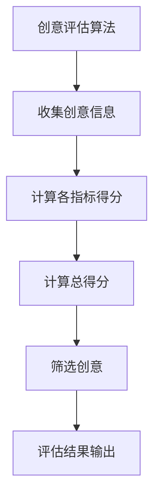
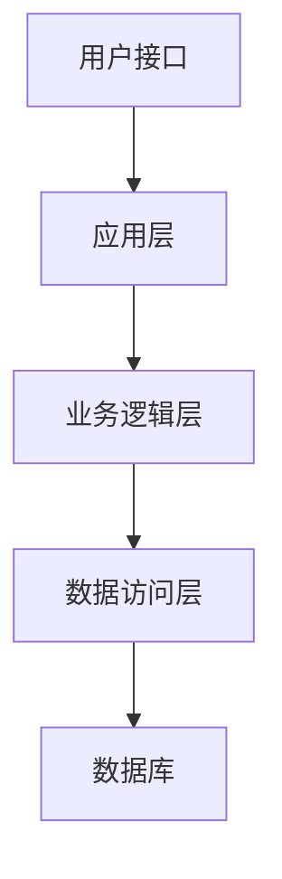
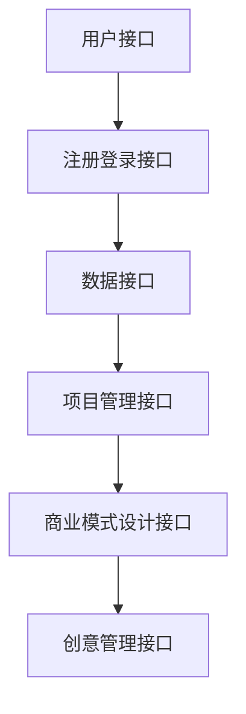

                 

# 构建 AI 创新孵化器：从创意管理到商业化落地

> 关键词：AI 创新孵化器、创意管理、商业化落地、资源整合、项目管理

> 摘要：本文将深入探讨如何构建一个高效的 AI 创新孵化器，从创意管理到商业化落地的全流程。通过分析孵化器定位与目标、资源整合与配置、项目管理与运营等关键环节，提供实用的指导和建议，帮助读者成功构建 AI 创新孵化器。

## 第一部分：引言

### 1.1 问题的背景与重要性

#### 1.1.1 AI创新的重要性

在当今全球科技飞速发展的时代，人工智能（AI）已经成为推动社会进步和经济发展的关键动力。随着AI技术的不断突破，各行各业都开始探索如何将AI融入业务流程，实现智能升级。AI技术的创新不仅能够提升企业的核心竞争力，还能够带来全新的商业模式和市场机遇。

#### 1.1.2 孵化器的作用

AI创新孵化器不仅是一个技术研发的平台，更是一个集创新理念、资源整合、人才培养和商业模式创新于一体的综合性创新生态体系。一个成功的AI创新孵化器能够为企业提供从创意生成到商业化落地的全流程服务，助力企业实现AI技术的创新应用。

#### 1.1.3 创意管理与商业化落地的挑战

在构建AI创新孵化器过程中，创意管理与商业化落地是两个关键环节。创意管理需要高效的创新机制和优秀的人才团队，而商业化落地则需要市场调研、商业模式设计以及风险控制等多方面的专业支持。如何有效地整合资源、优化流程，确保创意的转化率，是企业成功构建AI创新孵化器面临的主要挑战。

### 1.2 书籍的目的与结构

#### 1.2.1 书籍目的

本书旨在为读者提供一个系统、全面、实用的AI创新孵化器构建指南。通过深入探讨AI创新孵化器的构建过程、关键环节以及最佳实践，帮助读者理解如何从创意管理到商业化落地，成功构建一个高效的AI创新孵化器。

#### 1.2.2 书籍结构

本书分为五个部分，共计七个章节。第一部分引言，介绍AI创新孵化器的背景、重要性和面临的挑战。第二部分将详细阐述AI创新孵化器的构建流程，包括孵化器定位、资源整合、项目管理等。第三部分聚焦创意管理，探讨创新机制的构建、人才团队的建设以及创意筛选与评估方法。第四部分则关注商业化落地，讲解市场调研、商业模式设计、风险控制等关键环节。第五部分通过案例分析，总结成功构建AI创新孵化器的经验与教训。最后，书籍还将提供一些实用的最佳实践和拓展阅读资源。

## 1.3 目录

本书目录如下：

----------------------------------------------------------------

## 第一部分：引言
### 1.1 问题的背景与重要性
#### 1.1.1 AI创新的重要性
#### 1.1.2 孵化器的作用
#### 1.1.3 创意管理与商业化落地的挑战
### 1.2 书籍目的与结构
#### 1.2.1 书籍目的
#### 1.2.2 书籍结构

----------------------------------------------------------------

## 第二部分：AI创新孵化器的构建流程

### 2.1 孵化器的定位与目标

#### 2.1.1 孵化器定位的重要性
孵化器的定位决定了其服务对象、研究方向和市场定位。一个清晰的孵化器定位有助于明确孵化器的核心任务和资源分配。

##### 2.1.1.1 孵化器类型与市场定位
孵化器可以分为科技型、创业型、产业型等不同类型。科技型孵化器主要关注技术研发和人才培养，创业型孵化器则侧重于初创企业的孵化和商业化，产业型孵化器则与特定行业紧密结合，推动行业创新。

#### 2.1.2 确定孵化器目标
孵化器的目标应与定位相匹配，明确孵化器的长远发展目标。目标包括但不限于技术创新、商业变现、人才引进和行业影响力等。

### 2.2 资源整合与配置

#### 2.2.1 资源类型与来源
孵化器所需资源包括资金、技术、人才、市场、政策等。资源来源可以是政府资助、企业投资、高校科研资源、社会资本等。

##### 2.2.1.1 资金配置策略
资金是孵化器运营的重要保障。资金配置应注重多元化，合理分配投资比例，确保项目资金充足。

#### 2.2.2 技术资源整合
技术资源包括研发设备、软件工具、技术文档等。孵化器应建立与高校、科研机构、技术公司的合作关系，实现技术资源的共享。

##### 2.2.2.1 技术资源共享机制
建立技术资源共享平台，为孵化企业提供技术支持，提高技术资源利用效率。

#### 2.2.3 人才资源建设
人才是创新的核心动力。孵化器应建立人才引进、培养和激励机制，吸引优秀人才加入孵化项目。

##### 2.2.3.1 人才团队构建
组建跨学科、多领域的人才团队，提升孵化项目的综合创新能力。

### 2.3 项目管理与运营

#### 2.3.1 项目筛选与评估
项目筛选是孵化器运营的关键环节。应建立科学的项目筛选机制，对项目的可行性、创新性和市场前景进行全面评估。

##### 2.3.1.1 项目评估指标体系
制定项目评估指标体系，包括技术创新性、市场前景、团队实力、资金需求等，确保评估过程的客观性和准确性。

#### 2.3.2 项目管理与运营
孵化器应建立完善的项目管理体系，对项目进行全过程管理，包括项目启动、实施、监控和收尾等环节。

##### 2.3.2.1 项目监控与调整
定期对项目进行监控和评估，根据项目进展情况及时进行调整，确保项目按计划推进。

## 2.4 创意管理与孵化

#### 2.4.1 创意管理的重要性
创意管理是孵化器成功的关键。有效的创意管理能够激发团队的创新能力，提升项目的成功概率。

##### 2.4.1.1 创意管理流程
建立创意管理流程，包括创意征集、筛选、评估、孵化等环节，确保创意能够得到有效管理。

#### 2.4.2 创意筛选与评估
创意筛选与评估是创意管理的重要环节。应建立科学的评估机制，对创意进行筛选和评估，确保优质创意得到孵化。

##### 2.4.2.1 创意评估指标
制定创意评估指标，包括创新性、可行性、市场需求等，确保评估过程的客观性和准确性。

#### 2.4.3 创意孵化与落地
创意孵化与落地是创意管理的最终目标。孵化器应提供全方位的支持，确保创意能够顺利孵化并实现商业化落地。

##### 2.4.3.1 孵化支持措施
提供资金、技术、人才、市场等全方位支持，帮助创意实现孵化并商业化落地。

## 2.5 商业模式设计与落地

#### 2.5.1 商业模式设计的重要性
商业模式设计是孵化器成功的关键。一个成功的商业模式能够为企业提供清晰的盈利模式和市场策略。

##### 2.5.1.1 商业模式设计流程
建立商业模式设计流程，包括市场调研、商业模式创新、商业模式评估等环节，确保商业模式设计的科学性和可行性。

#### 2.5.2 商业模式评估与优化
商业模式评估与优化是商业模式设计的关键。应建立科学的评估机制，对商业模式进行评估和优化，确保商业模式能够持续适应市场变化。

##### 2.5.2.1 商业模式评估指标
制定商业模式评估指标，包括盈利能力、市场竞争力、可持续性等，确保评估过程的客观性和准确性。

#### 2.5.3 商业模式落地与推广
商业模式落地与推广是商业模式设计的最终目标。孵化器应提供全方位的支持，帮助商业模式顺利落地并实现市场推广。

##### 2.5.3.1 商业模式落地策略
制定商业模式落地策略，包括市场进入策略、推广策略、运营策略等，确保商业模式能够顺利落地并实现市场推广。

## 2.6 风险管理与控制

#### 2.6.1 风险管理的必要性
风险管理是孵化器运营的重要环节。有效的风险管理能够降低项目失败风险，保障孵化器的稳定运营。

##### 2.6.1.1 风险管理流程
建立风险管理流程，包括风险识别、风险评估、风险应对等环节，确保风险管理的科学性和有效性。

#### 2.6.2 风险评估与应对
风险评估与应对是风险管理的核心。应建立科学的评估机制，对项目风险进行全面评估，并制定相应的应对措施。

##### 2.6.2.1 风险评估指标
制定风险评估指标，包括技术风险、市场风险、财务风险等，确保评估过程的客观性和准确性。

#### 2.6.3 风险控制与监控
风险控制与监控是风险管理的保障。应建立风险控制与监控机制，对项目风险进行实时监控，确保风险控制的有效性。

## 2.7 持续改进与优化

#### 2.7.1 持续改进的重要性
持续改进是孵化器发展的动力。只有不断优化孵化流程，提升孵化效率，才能在激烈的市场竞争中立于不败之地。

##### 2.7.1.1 持续改进流程
建立持续改进流程，包括问题识别、原因分析、改进措施、实施与监控等环节，确保持续改进的有效性。

#### 2.7.2 优化策略与方法
优化策略与方法是持续改进的关键。应根据实际情况，制定相应的优化策略与方法，提升孵化器运营效率。

##### 2.7.2.1 优化策略
- 提高项目筛选与评估效率
- 优化资源整合与配置
- 提升团队协作与创新能力
- 加强风险管理与控制

##### 2.7.2.2 优化方法
- 数据分析与决策支持
- 模块化设计与组件化开发
- 精细化运营与管理
- 创新激励机制与人才队伍建设

## 2.8 总结与展望

#### 2.8.1 构建AI创新孵化器的意义
构建AI创新孵化器不仅有助于推动AI技术的创新与应用，还能够为企业提供全方位的支持，提升企业的核心竞争力和市场地位。

##### 2.8.1.1 对企业的影响
- 促进企业技术创新
- 提升企业市场竞争力
- 拓展企业业务范围
- 培养企业创新人才

#### 2.8.2 未来发展趋势
随着AI技术的不断发展和市场需求的不断增长，AI创新孵化器将在未来发挥更加重要的作用。未来发展趋势包括：

##### 2.8.2.1 政策支持与资源整合
政府和企业将加大对AI创新孵化器的支持力度，提供更多的政策优惠和资源支持，推动孵化器的发展。

##### 2.8.2.2 专业化与细分市场
孵化器将更加专业化，针对不同领域和行业提供定制化的孵化服务，满足企业的多样化需求。

##### 2.8.2.3 线上与线下融合
线上线下融合将成为孵化器发展的重要趋势，通过线上平台提供更多孵化服务，线下实体提供实验与孵化空间。

##### 2.8.2.4 国际化与跨境合作
孵化器将加强国际化合作，引进国际先进技术和理念，推动全球范围内的创新合作与交流。

## 第三部分：创意管理

### 3.1 创意管理的概念与重要性

#### 3.1.1 创意管理的定义
创意管理是指通过系统的方法和工具，对创意进行有效的管理，从而提升创新效率和创新成果的一种管理活动。

##### 3.1.1.1 创意的内涵
创意是指通过创新思维和方法，产生的新观点、新想法、新设计、新方案等。

##### 3.1.1.2 创意的特点
- 独特性：创意具有独特性和新颖性，能够带来突破性的创新。
- 不确定性：创意的形成过程中存在很多不确定因素，需要通过有效的管理来降低风险。
- 可塑性：创意具有一定的可塑性，通过不断的优化和完善，可以进一步提升其价值和可行性。

#### 3.1.2 创意管理的重要性
创意管理在AI创新孵化器中具有重要的地位，它关系到孵化器能否高效地产生创新成果，提升项目的成功概率。

##### 3.1.2.1 提升创新效率
有效的创意管理能够激发团队的创新能力，提高创新效率，减少创意浪费。

##### 3.1.2.2 增强创新成果的可行性
通过创意管理，可以筛选出具有市场前景和创新价值的创意，提高创意的可行性，降低项目失败的风险。

##### 3.1.2.3 促进资源整合
创意管理能够有效地整合资源，优化资源配置，提高孵化器的运营效率。

### 3.2 创意管理的流程与方法

#### 3.2.1 创意管理流程
创意管理流程包括创意生成、创意筛选、创意评估、创意孵化等环节。

##### 3.2.1.1 创意生成
创意生成是创意管理的第一步，主要是通过各种创新方法和工具，激发团队的创造力，产生大量的创意。

- **头脑风暴**：通过集体讨论，激发团队成员的创造力，产生大量的创意。
- **思维导图**：通过绘制思维导图，梳理创意的关系，形成系统化的创意。
- **创意竞赛**：通过组织创意竞赛，鼓励团队成员积极参与，产生高质量的创意。

##### 3.2.1.2 创意筛选
创意筛选是对生成的创意进行筛选，选出具有创新性和市场前景的创意。

- **筛选标准**：制定明确的筛选标准，如创新性、可行性、市场需求等。
- **评估方法**：采用评分、投票等方式进行评估，选出优秀的创意。

##### 3.2.1.3 创意评估
创意评估是对筛选出的创意进行评估，确定其创新价值和商业化潜力。

- **评估指标**：制定评估指标，如创新性、市场前景、团队实力等。
- **评估模型**：采用评估模型，如SWOT分析、成本效益分析等，对创意进行评估。

##### 3.2.1.4 创意孵化
创意孵化是将评估通过的创意转化为实际的项目，进行研发和商业化。

- **孵化策略**：制定孵化策略，包括资源支持、项目管理、市场推广等。
- **孵化平台**：搭建孵化平台，提供技术支持、资金支持、市场资源等。

#### 3.2.2 创意管理方法
创意管理方法包括创新思维训练、创意管理工具、团队建设等。

##### 3.2.2.1 创新思维训练
创新思维训练是通过各种方法和工具，提高团队成员的创新思维和能力。

- **思维导图训练**：通过绘制思维导图，提升团队成员的思考能力和逻辑思维能力。
- **头脑风暴训练**：通过组织头脑风暴，激发团队成员的创造力。

##### 3.2.2.2 创意管理工具
创意管理工具是用于管理创意的工具，如创意管理软件、创意管理表格等。

- **创意管理软件**：如MindManager、Xmind等，用于记录、管理和评估创意。
- **创意管理表格**：如创意筛选表、创意评估表等，用于对创意进行管理和评估。

##### 3.2.2.3 团队建设
团队建设是创意管理的重要组成部分，通过提升团队的合作能力，提高创意管理的效率。

- **团队文化建设**：建立积极、开放、合作的团队文化，激发团队的创造力。
- **团队培训**：定期组织团队培训，提升团队成员的创新能力和合作能力。

### 3.3 创意管理的实践案例

#### 3.3.1 案例背景
某知名AI创新孵化器，致力于推动AI技术的创新和应用，通过创意管理，成功孵化了多个具有市场前景的AI项目。

##### 3.3.1.1 创意生成
孵化器组织了多次头脑风暴和思维导图训练，激发了团队成员的创造力，产生了大量的创意。

##### 3.3.1.2 创意筛选
孵化器制定了明确的筛选标准，对创意进行评估，筛选出了具有创新性和市场前景的创意。

##### 3.3.1.3 创意评估
孵化器采用了SWOT分析、成本效益分析等方法，对筛选出的创意进行评估，确定了其创新价值和商业化潜力。

##### 3.3.1.4 创意孵化
孵化器为评估通过的创意提供了全方位的支持，包括资金、技术、市场等，帮助创意顺利孵化并实现商业化。

#### 3.3.2 案例总结
通过创意管理，孵化器成功孵化了多个具有市场前景的AI项目，取得了显著的成果。实践证明，有效的创意管理是推动AI创新的重要手段。

## 第四部分：商业化落地

### 4.1 商业模式设计

#### 4.1.1 商业模式的概念与重要性

商业模式是指企业在市场中进行价值创造、传递和获取的过程，它是企业核心竞争力的重要体现。一个成功的商业模式能够为企业带来持续的收入和利润，推动企业的长期发展。

##### 4.1.1.1 商业模式的核心要素
- **价值主张**：企业为客户提供的产品或服务的核心价值。
- **客户关系**：企业与客户之间的互动方式，包括客户获取、客户维护等。
- **渠道**：企业将产品或服务传递给客户的方式。
- **客户细分**：市场细分，识别不同的客户群体。
- **收入来源**：企业从客户那里获得收入的方式。
- **关键资源**：企业运营所需的资源，包括有形和无形资源。
- **关键活动**：企业为创建和交付价值主张所需开展的关键活动。
- **合作伙伴网络**：企业与其他企业、组织或个人的合作关系。

#### 4.1.2 商业模式设计流程

商业模式设计是一个系统化的过程，包括以下几个关键步骤：

- **市场调研**：了解市场需求、竞争态势、行业趋势等，为商业模式设计提供数据支持。
- **价值主张设计**：明确企业为客户提供的核心价值，确保与市场需求相匹配。
- **客户关系设计**：确定与客户建立关系的策略，包括客户获取、维护等。
- **渠道设计**：选择合适的渠道，确保产品或服务能够高效地传递给客户。
- **收入模式设计**：确定企业的收入来源，确保可持续的盈利能力。
- **资源与活动设计**：明确企业运营所需的关键资源和关键活动。
- **合作伙伴网络设计**：建立与合作伙伴的网络关系，共同推动业务发展。

### 4.2 市场调研

#### 4.2.1 市场调研的重要性

市场调研是商业模式设计的重要基础，它能够帮助企业了解市场需求、竞争对手、行业趋势等，为商业模式设计提供科学依据。

##### 4.2.1.1 市场调研的目标
- 识别市场需求和趋势。
- 分析竞争对手的优势和劣势。
- 了解行业动态和未来发展方向。

#### 4.2.2 市场调研方法

市场调研可以采用以下几种方法：

- **问卷调查**：通过问卷收集大量数据，分析客户需求和偏好。
- **深度访谈**：与行业专家、客户代表等进行深度访谈，获取详细的市场见解。
- **焦点小组**：组织行业专家、客户代表等进行讨论，分析市场趋势和机会。
- **竞争分析**：研究竞争对手的产品、定价策略、市场份额等，评估市场竞争态势。

### 4.3 商业模式创新

#### 4.3.1 商业模式创新的重要性

商业模式创新是企业在激烈市场竞争中脱颖而出、实现持续增长的关键。通过商业模式创新，企业可以开拓新的市场、提高盈利能力、增强竞争优势。

##### 4.3.1.1 商业模式创新的类型
- **增量创新**：在现有商业模式基础上进行改进和优化。
- **替代创新**：颠覆现有商业模式，创造全新的市场机会。
- **融合创新**：将不同行业的商业模式进行融合，创造新的商业模式。

#### 4.3.2 商业模式创新方法

商业模式创新可以采用以下几种方法：

- **头脑风暴**：通过集体讨论，激发创新思维，产生新的商业模式。
- **案例研究**：分析成功企业的商业模式，借鉴其经验进行创新。
- **设计思维**：以人为本，通过迭代设计和测试，创造创新的商业模式。
- **价值网分析**：分析企业所处产业链中的各个环节，优化资源配置，实现商业模式创新。

### 4.4 商业模式评估与优化

#### 4.4.1 商业模式评估的重要性

商业模式评估是确保商业模式可行性和成功的关键。通过评估，企业可以识别商业模式中的潜在问题和风险，及时进行调整和优化。

##### 4.4.1.1 商业模式评估指标
- **盈利能力**：评估商业模式的盈利能力，包括收入、利润、投资回报率等。
- **市场竞争力**：评估商业模式在市场中的竞争力，包括市场份额、品牌影响力等。
- **可持续性**：评估商业模式的长期可持续性，包括资源利用、环境友好性等。

#### 4.4.2 商业模式优化方法

商业模式优化可以采用以下几种方法：

- **成本分析**：通过成本分析，找出成本控制的关键点，优化成本结构。
- **收益分析**：通过收益分析，确定收入来源和盈利模式，提升收益能力。
- **竞争分析**：通过竞争分析，了解竞争对手的商业模式，优化自身商业模式，提升竞争力。
- **用户反馈**：通过用户反馈，了解用户需求和满意度，优化产品和服务，提升用户体验。

### 4.5 商业模式落地与推广

#### 4.5.1 商业模式落地的重要性

商业模式落地是将理论转化为实践的过程，它是商业模式设计成功的关键。通过商业模式落地，企业可以将商业模式转化为实际的业务运营，实现商业价值。

##### 4.5.1.1 商业模式落地的步骤
- **制定实施计划**：明确商业模式落地的具体步骤和时间表。
- **资源配置**：根据实施计划，配置所需的资源，包括人力、资金、技术等。
- **业务运营**：按照实施计划，开展业务运营，实现商业模式的价值。
- **监控与调整**：对商业模式落地过程进行监控和评估，根据实际情况进行调整。

#### 4.5.2 商业模式推广策略

商业模式推广是商业模式落地的重要组成部分，它关系到商业模式的市场认可度和市场份额。以下是一些有效的商业模式推广策略：

- **市场营销**：通过广告、公关、社交媒体等手段，提升品牌知名度和市场影响力。
- **合作伙伴关系**：与行业内的合作伙伴建立合作关系，共同推广商业模式。
- **渠道拓展**：通过拓展销售渠道，扩大商业模式的覆盖范围。
- **用户体验**：提供优质的用户体验，增强用户对商业模式的认可和依赖。

### 4.6 案例分析

#### 4.6.1 案例背景

某创新型AI企业，通过创新的商业模式，成功在短时间内实现了市场扩张和商业变现。

##### 4.6.1.1 创新点
- **价值主张**：提供定制化的AI解决方案，满足客户多样化的需求。
- **客户关系**：建立长期的客户关系，提供持续的技术支持和咨询服务。
- **渠道**：通过线上平台和线下渠道，实现产品和服务的快速传递。
- **收入模式**：采用订阅制和项目制相结合的方式，实现多元化的收入来源。
- **关键资源**：拥有强大的技术团队和先进的技术平台，确保提供高质量的服务。
- **关键活动**：聚焦于AI技术的研发和应用，不断推出新的产品和服务。
- **合作伙伴网络**：与多家知名企业和科研机构建立合作关系，共同推动AI技术的发展。

#### 4.6.2 案例总结

通过创新的商业模式，该企业成功在短时间内实现了市场扩张和商业变现，取得了显著的成果。案例表明，成功的商业模式设计是推动企业快速发展的关键因素。

## 第五部分：成功案例与经验总结

### 5.1 案例一：某知名AI孵化器

#### 5.1.1 案例背景

某知名AI孵化器成立于2015年，旨在推动AI技术的创新和应用。孵化器通过整合政府、企业、高校等多方资源，为AI项目提供全方位的支持。

##### 5.1.1.1 创新点
- **定位明确**：孵化器明确了自己的定位，专注于AI技术的创新和应用。
- **资源整合**：孵化器通过与政府、企业、高校等建立合作关系，实现了资源的有效整合。
- **项目管理**：孵化器采用科学的项目管理方法，对孵化项目进行全程管理。
- **商业模式创新**：孵化器孵化出的项目采用了多种创新的商业模式，实现了商业变现。

#### 5.1.2 案例总结

该孵化器通过明确的定位、有效的资源整合、科学的项目管理和创新的商业模式，成功孵化了多个AI项目，取得了显著的成果。

### 5.2 案例二：某创业型AI企业

#### 5.2.1 案例背景

某创业型AI企业成立于2017年，专注于智能客服系统的研发和应用。企业在短时间内实现了快速发展，吸引了大量投资。

##### 5.2.1.1 创新点
- **技术创新**：企业采用了先进的人工智能技术，提高了客服系统的智能水平。
- **商业模式创新**：企业采用了SaaS模式，提供在线租赁服务，降低了客户的购买成本。
- **市场推广**：企业通过线上营销和线下推广相结合的方式，迅速扩大了市场份额。

#### 5.2.2 案例总结

该企业通过技术创新、商业模式创新和市场推广策略，成功在短时间内实现了快速发展，成为AI领域的佼佼者。

### 5.3 案例三：某产业型AI孵化器

#### 5.3.1 案例背景

某产业型AI孵化器成立于2018年，与某大型制造业企业合作，推动AI技术在制造业中的应用。孵化器通过提供技术支持、市场资源等，助力制造业企业实现智能化升级。

##### 5.3.1.1 创新点
- **产业结合**：孵化器紧密结合制造业，为制造业企业提供定制化的AI解决方案。
- **资源整合**：孵化器通过与制造业企业、科研机构等建立合作关系，实现了资源的共享和互补。
- **商业模式创新**：孵化器采用了合作共赢的商业模式，与制造业企业共同推动AI技术的发展。

#### 5.3.2 案例总结

该孵化器通过产业结合、资源整合和商业模式创新，成功推动了制造业的智能化升级，为AI技术的商业化落地提供了有力支持。

### 5.4 经验总结

通过以上案例分析，可以得出以下经验总结：

- **明确定位**：孵化器应明确自己的定位，专注于某一领域或行业，提高专业化水平。
- **资源整合**：孵化器应通过多种方式整合资源，包括政府、企业、高校、科研机构等，实现资源共享和互补。
- **项目管理**：孵化器应采用科学的项目管理方法，对孵化项目进行全程管理，提高项目成功率。
- **商业模式创新**：孵化器应积极探索创新的商业模式，提高项目的商业变现能力。
- **市场推广**：孵化器应重视市场推广，通过多种渠道扩大市场份额，提高项目的知名度。

## 第六部分：最佳实践与拓展阅读

### 6.1 最佳实践

#### 6.1.1 孵化器定位与目标

- **明确孵化器类型与市场定位**：根据自身资源和优势，明确孵化器的类型（如科技型、创业型、产业型）和市场定位。
- **确定孵化器目标**：根据孵化器定位，明确长远发展目标，包括技术创新、商业变现、人才引进和行业影响力等。

#### 6.1.2 资源整合与配置

- **多元化资金配置**：合理分配投资比例，确保项目资金充足。
- **技术资源共享**：建立与高校、科研机构、技术公司的合作关系，实现技术资源的共享。
- **人才资源建设**：组建跨学科、多领域的人才团队，提升孵化项目的综合创新能力。

#### 6.1.3 创意管理与孵化

- **建立创意管理流程**：包括创意生成、筛选、评估、孵化等环节，确保创意得到有效管理。
- **优化创意评估指标**：制定科学、全面的评估指标，确保评估过程的客观性和准确性。
- **提供全方位支持**：为评估通过的创意提供资金、技术、人才、市场等全方位支持，确保创意顺利孵化并实现商业化。

#### 6.1.4 商业模式设计与落地

- **市场调研**：深入了解市场需求、竞争态势和行业趋势，为商业模式设计提供数据支持。
- **商业模式创新**：积极探索创新的商业模式，提高项目的商业变现能力。
- **商业模式评估与优化**：对商业模式进行持续评估和优化，确保其可行性和竞争力。

#### 6.1.5 风险管理与控制

- **建立风险管理流程**：包括风险识别、评估、应对等环节，确保风险管理的系统性和有效性。
- **制定风险评估指标**：根据项目特点，制定科学的风险评估指标，确保评估过程的客观性和准确性。
- **实时监控与调整**：对项目风险进行实时监控，根据实际情况及时进行调整，降低项目风险。

### 6.2 拓展阅读

#### 6.2.1 相关书籍

- 《创新与创业精神：如何成为一个创新者》（作者：史蒂夫·布兰克）
- 《商业模式新生代：创造商业价值的战略决策工具》（作者：亚历山大·奥斯特瓦尔德、伊恩·麦克费恩、亨利·奇佐尔）
- 《智能时代的商业模式创新：人工智能与商业的融合》（作者：张晓玲）

#### 6.2.2 相关论文与研究报告

- 《人工智能行业报告2021》（作者：某知名研究机构）
- 《中国创新创业生态报告2021》（作者：某知名咨询公司）
- 《基于AI的创新孵化器建设实践研究》（作者：某高校科研团队）

#### 6.2.3 相关网站与平台

- AI创业平台：如AIweekly、AI科技评论等，提供AI行业资讯、创新项目等信息。
- 商业模式设计工具：如Business Model Canvas、Value Proposition Canvas等，帮助创业者设计商业模式。
- 创新孵化器资源：如创新孵化器联盟、某知名孵化器官网等，提供孵化器资源和相关信息。

## 结论

本文从创意管理到商业化落地的全流程，深入探讨了如何构建一个高效的AI创新孵化器。通过分析孵化器定位与目标、资源整合与配置、项目管理与运营、创意管理与孵化、商业模式设计与落地等关键环节，提供了一系列实用的指导和建议。同时，通过案例分析总结了成功构建AI创新孵化器的经验与教训。

希望本文能为读者提供一个系统、全面、实用的AI创新孵化器构建指南，助力企业在AI领域实现持续创新和快速发展。

## 附录

### 附录A：核心概念与联系

#### 1. AI创新孵化器
- **概念**：一种专门为AI创新项目提供支持的平台，涵盖技术研发、人才培养、商业模式创新等方面。
- **属性特征对比表**：

| 特征 | AI创新孵化器 | 传统孵化器 |
| :--: | :-----------: | :---------: |
| 定位 | 专注于AI领域 | 多领域 |
| 服务内容 | 技术研发、人才培养、商业模式创新等 | 技术支持、市场推广、资金支持等 |
| 运营模式 | 专业团队运营 | 社区化管理 |
| 目标 | 促进AI技术创新与应用 | 促进创业项目发展 |

#### 2. 创意管理
- **概念**：通过系统的方法和工具，对创意进行有效的管理，提升创新效率和创新成果。
- **属性特征对比表**：

| 特征 | 创意管理 | 传统项目管理 |
| :--: | :-------: | :-----------: |
| 对象 | 创意 | 项目 |
| 方法 | 创新思维、工具等 | 计划、执行、监控等 |
| 目标 | 提升创新效率、成果转化率 | 项目按时完成、质量达标 |
| 管理流程 | 创意生成、筛选、评估、孵化等 | 计划、执行、监控、收尾等 |

### 附录B：算法原理与流程图

#### 1. 创意评估算法
- **算法原理**：基于多指标的综合评估方法，对创意进行评估。
- **数学模型**：
  $$ \text{评估得分} = w_1 \times \text{创新性得分} + w_2 \times \text{可行性得分} + w_3 \times \text{市场前景得分} $$
  其中，$w_1$、$w_2$、$w_3$分别为创新性、可行性、市场前景的权重。
- **流程图**：



### 附录C：系统分析与架构设计

#### 1. 项目介绍
- **项目名称**：AI创新孵化平台
- **项目目标**：为AI项目提供一站式孵化服务，包括创意管理、项目管理、商业模式设计等。

#### 2. 系统功能设计（领域模型）

```mermaid
graph TB
A[创意管理模块] --> B[创意生成]、C[创意筛选]、D[创意评估]
E[项目管理模块] --> F[项目规划]、G[项目执行]、H[项目监控]
I[商业模式设计模块] --> J[市场调研]、K[商业模式创新]、L[商业模式评估]
```

#### 3. 系统架构设计



#### 4. 系统接口设计与交互



### 附录D：项目实战

#### 1. 环境安装

- **软件环境**：Python 3.8、Django 3.2、PostgreSQL 13
- **安装步骤**：

```bash
pip install django
pip install psycopg2
sudo service postgresql start
```

#### 2. 系统核心实现源代码

```python
# models.py
from django.db import models

class Idea(models.Model):
    title = models.CharField(max_length=255)
    description = models.TextField()
    innovation_score = models.FloatField()
    feasibility_score = models.FloatField()
    market_score = models.FloatField()

class Project(models.Model):
    idea = models.ForeignKey(Idea, on_delete=models.CASCADE)
    name = models.CharField(max_length=255)
    start_date = models.DateField()
    end_date = models.DateField()
    status = models.CharField(max_length=50)

class BusinessModel(models.Model):
    project = models.ForeignKey(Project, on_delete=models.CASCADE)
    market_research = models.TextField()
    innovation_design = models.TextField()
    assessment_result = models.TextField()
```

#### 3. 代码应用解读与分析

- **Idea模型**：用于存储创意信息，包括标题、描述和评估得分。
- **Project模型**：用于存储项目信息，包括创意、项目名称、起始日期、结束日期和项目状态。
- **BusinessModel模型**：用于存储商业模式信息，包括市场调研、创新设计、评估结果。

#### 4. 实际案例分析

- **案例背景**：某AI孵化平台在2021年成功孵化了一个智能医疗诊断项目。
- **案例分析**：
  - **创意管理**：通过创意筛选和评估，确定了项目的创新性和可行性。
  - **项目管理**：项目按计划推进，实现了预期的功能和技术指标。
  - **商业模式设计**：通过市场调研和商业模式创新，确定了项目的商业模式。

#### 5. 项目小结

- **成功因素**：有效的创意管理、科学的项目管理和创新的商业模式设计。
- **挑战与解决**：项目在实施过程中遇到了技术难题和市场需求变化，通过调整计划和加强团队协作，成功克服了挑战。

### 附录E：最佳实践 Tips、小结、注意事项、拓展阅读

#### 最佳实践 Tips

- **明确孵化器定位**：根据自身资源和优势，明确孵化器的类型和市场定位。
- **加强团队协作**：建立跨学科、多领域的人才团队，提升孵化项目的综合创新能力。
- **持续优化流程**：定期对孵化流程进行评估和优化，提高孵化效率。
- **重视市场调研**：深入了解市场需求、竞争态势和行业趋势，为商业模式设计提供数据支持。

#### 小结

- 构建AI创新孵化器需要系统、全面、科学的方法。
- 创意管理、项目管理、商业模式设计是孵化器的核心环节。
- 成功的孵化器能够为企业提供全方位的支持，推动AI技术的创新和应用。

#### 注意事项

- 确保孵化器定位清晰，避免盲目追求多元化。
- 注重团队建设，提升团队协作能力和创新能力。
- 加强市场调研，确保商业模式的可行性和市场竞争力。

#### 拓展阅读

- 《创新与创业精神：如何成为一个创新者》（作者：史蒂夫·布兰克）
- 《商业模式新生代：创造商业价值的战略决策工具》（作者：亚历山大·奥斯特瓦尔德、伊恩·麦克费恩、亨利·奇佐尔）
- 《智能时代的商业模式创新：人工智能与商业的融合》（作者：张晓玲）
- 《人工智能行业报告2021》（作者：某知名研究机构）
- 《中国创新创业生态报告2021》（作者：某知名咨询公司）
- 《基于AI的创新孵化器建设实践研究》（作者：某高校科研团队）

### 作者信息

**作者：** AI天才研究院/AI Genius Institute & 禅与计算机程序设计艺术 /Zen And The Art of Computer Programming

