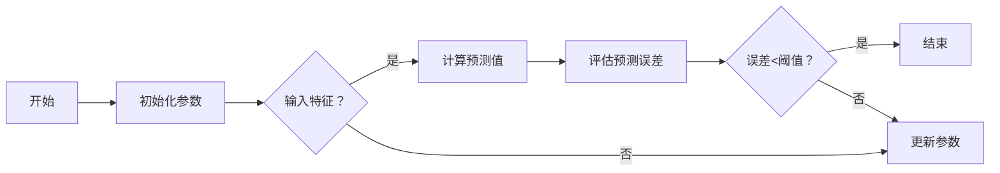
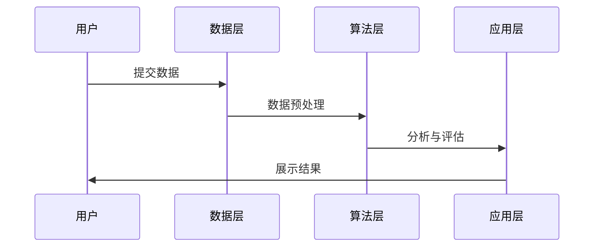
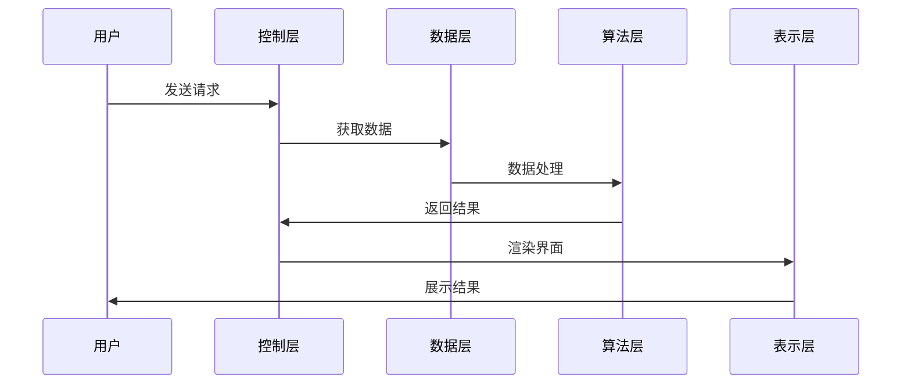
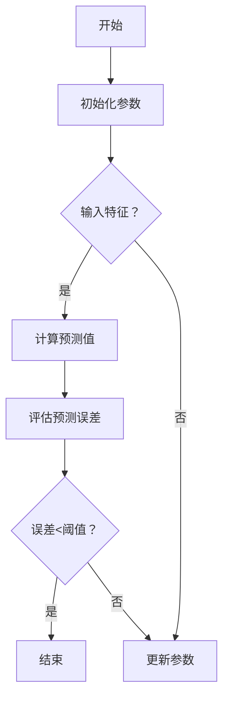
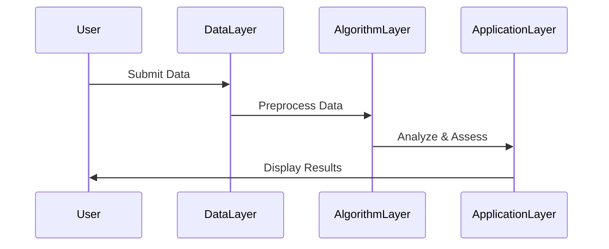
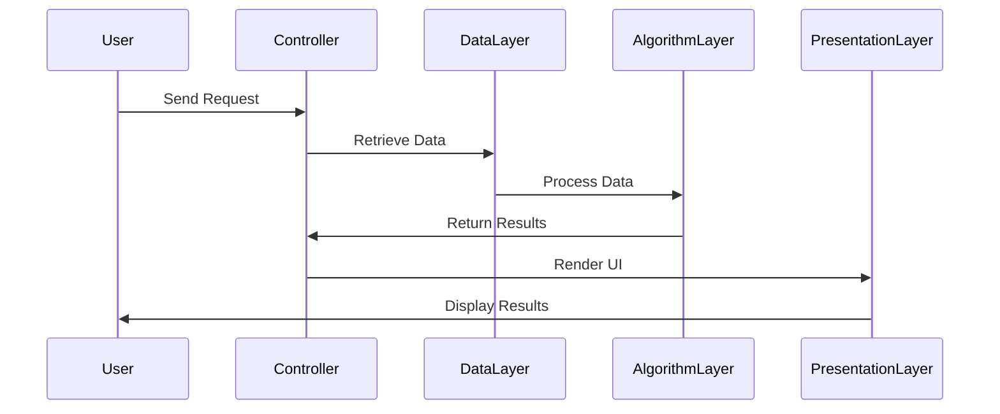

                 

# 构建 AI 辅助的并购交易分析系统

## 关键词
AI，并购交易，数据分析，机器学习，深度学习，强化学习，数据挖掘

## 摘要
本文旨在探讨如何构建一个AI辅助的并购交易分析系统。在深入分析并购交易现状、传统并购交易分析挑战以及AI技术潜力之后，文章将逐步介绍系统的核心功能、构建方法、边界与外延、核心概念与要素组成。随后，本文将详细阐述AI核心概念与原理，包括机器学习、深度学习、强化学习和数据挖掘，并探讨其在并购交易分析中的应用。最后，文章将介绍系统设计与实现，包括数据获取与预处理、并购交易信息挖掘、风险评估、价值评估和策略优化，以及系统的测试与优化策略。

## 第一部分：引言

### 1.1 问题背景

#### 1.1.1 并购交易的现状
并购交易是企业扩张、市场拓展和资源整合的重要手段。全球并购交易市场在过去几年中持续增长，随着经济全球化和科技发展的加速，并购交易呈现出多样化和复杂化的趋势。

#### 1.1.2 传统并购交易分析的挑战
传统并购交易分析主要依赖于人工经验、行业知识和财务报表等数据，面临着数据来源有限、分析深度不足、决策周期长等问题。此外，传统分析方法难以应对大数据环境下并购交易数据的复杂性和多样性。

#### 1.1.3 AI技术在并购交易分析中的应用潜力
AI技术，特别是机器学习、深度学习和数据挖掘等，为并购交易分析提供了新的工具和方法。AI可以通过处理大量数据，发现潜在的并购机会，进行风险评估，优化交易策略，提高决策效率。

### 1.2 问题描述

#### 1.2.1 构建AI辅助的并购交易分析系统的目标
构建一个能够辅助并购交易分析的AI系统，旨在提高数据分析的深度和广度，优化决策过程，降低交易风险。

#### 1.2.2 AI辅助的并购交易分析系统的核心功能
系统的核心功能包括数据获取与预处理、并购交易信息挖掘、风险评估、价值评估和策略优化等。

### 1.3 问题解决

#### 1.3.1 AI技术在并购交易分析中的关键作用
AI技术通过提高数据分析的自动化和智能化水平，能够显著提升并购交易分析的效果和效率。

#### 1.3.2 构建AI辅助的并购交易分析系统的方法
构建AI辅助的并购交易分析系统需要综合运用多种AI技术，包括数据预处理、机器学习、深度学习和强化学习等。

### 1.4 边界与外延

#### 1.4.1 系统的边界条件
系统的边界条件包括数据来源、数据范围、分析精度和响应时间等。

#### 1.4.2 系统的适用范围
系统适用于各类企业和投资机构，能够支持不同规模和复杂度的并购交易分析。

### 1.5 概念结构与核心要素组成

#### 1.5.1 并购交易分析系统的核心概念
核心概念包括并购交易数据、AI算法、分析模型、风险评估指标和策略优化算法等。

#### 1.5.2 系统的核心要素组成
系统由数据层、算法层和应用层组成，每个层次都有其特定的功能和作用。

## 第二部分：AI核心概念与原理

### 2.1 AI概述

#### 2.1.1 AI的定义与历史发展
AI是指人工智能，是计算机科学的一个分支，旨在创建智能机器，使其能够执行通常需要人类智能的任务。

#### 2.1.2 AI的分类与应用场景
AI分为弱AI和强AI，应用场景包括自然语言处理、图像识别、决策支持系统等。

#### 2.1.3 AI的主要挑战与未来发展趋势
AI面临的挑战包括数据隐私、算法透明性和可解释性，未来发展趋势包括更强大的计算能力、更复杂的学习算法和更广泛的应用领域。

### 2.2 机器学习基础

#### 2.2.1 机器学习的概念与基本原理
机器学习是指计算机系统从数据中学习规律，并能够根据这些规律做出决策或预测。

#### 2.2.2 常见的机器学习算法介绍
常见的机器学习算法包括决策树、支持向量机、神经网络等。

#### 2.2.3 机器学习算法的性能评估方法
性能评估方法包括准确率、召回率、F1值等。

### 2.3 深度学习原理

#### 2.3.1 深度学习的定义与特点
深度学习是一种机器学习方法，通过构建深度神经网络模型来实现。

#### 2.3.2 神经网络的基本结构
神经网络包括输入层、隐藏层和输出层。

#### 2.3.3 深度学习的关键算法介绍
关键算法包括卷积神经网络（CNN）、循环神经网络（RNN）等。

### 2.4 强化学习基础

#### 2.4.1 强化学习的定义与基本原理
强化学习是一种通过试错来学习最优策略的机器学习方法。

#### 2.4.2 强化学习的主要算法介绍
主要算法包括Q学习、深度Q网络（DQN）等。

#### 2.4.3 强化学习在并购交易分析中的应用
强化学习可以用于并购交易策略优化。

### 2.5 数据挖掘基础

#### 2.5.1 数据挖掘的概念与基本原理
数据挖掘是从大量数据中提取有价值信息的过程。

#### 2.5.2 常见的数据挖掘算法介绍
常见的数据挖掘算法包括聚类、分类、关联规则挖掘等。

#### 2.5.3 数据挖掘在并购交易分析中的应用
数据挖掘可以用于并购交易信息的挖掘和分析。

### 2.6 AI辅助并购交易分析的优势与挑战

#### 2.6.1 AI辅助并购交易分析的优势
AI辅助并购交易分析可以提高分析深度、降低决策风险、优化交易策略。

#### 2.6.2 AI辅助并购交易分析面临的挑战
AI辅助并购交易分析面临数据质量、算法选择和模型解释性等挑战。

## 第三部分：AI技术在并购交易分析中的应用

### 3.1 数据获取与预处理

#### 3.1.1 并购交易数据来源
并购交易数据可以从企业公开的财务报表、行业报告、证券交易所等渠道获取。

#### 3.1.2 数据预处理方法
数据预处理包括数据清洗、数据整合和数据规范化。

#### 3.1.3 数据质量评估与优化
数据质量评估包括完整性、一致性和准确性评估。

### 3.2 并购交易信息挖掘

#### 3.2.1 并购交易信息挖掘的目标
挖掘并购交易中的关键信息，如交易金额、交易对象、交易背景等。

#### 3.2.2 信息挖掘的主要技术
主要技术包括文本挖掘、网络挖掘和结构化数据挖掘。

#### 3.2.3 信息挖掘的结果与应用
信息挖掘结果可以用于交易分析、风险评估和策略优化。

### 3.3 并购交易风险评估

#### 3.3.1 风险评估的目标与意义
风险评估旨在评估并购交易的风险水平，为决策提供依据。

#### 3.3.2 风险评估的主要方法
主要方法包括财务指标分析、市场指标分析和情景分析。

#### 3.3.3 风险评估的应用场景
应用场景包括交易前评估、交易中监控和交易后评价。

### 3.4 并购交易价值评估

#### 3.4.1 并购交易价值评估的目标
评估并购交易的商业价值和财务价值。

#### 3.4.2 价值评估的方法与模型
主要方法包括收益法、市场法和成本法。

#### 3.4.3 价值评估的应用案例
应用案例包括并购交易价格评估、并购后整合价值评估等。

### 3.5 并购交易策略优化

#### 3.5.1 并购交易策略优化的目标
优化并购交易策略，提高交易的成功率和收益率。

#### 3.5.2 策略优化的方法与算法
主要方法包括优化算法、机器学习算法和强化学习算法。

#### 3.5.3 策略优化的案例分析
案例分析包括并购交易策略优化方案设计、实施和评估。

## 第四部分：系统设计与实现

### 4.1 系统架构设计

#### 4.1.1 系统架构的总体设计
系统架构包括数据层、算法层和应用层。

#### 4.1.2 数据层设计
数据层包括数据存储和数据处理。

#### 4.1.3 服务层设计
服务层包括数据服务、分析服务和优化服务。

#### 4.1.4 表示层设计
表示层包括用户界面和交互逻辑。

### 4.2 数据库设计与实现

#### 4.2.1 数据库表结构设计
设计数据库表结构，包括交易表、评估表和策略表。

#### 4.2.2 数据库表关系设计
设计数据库表之间的关系。

#### 4.2.3 数据库实现与性能优化
实现数据库并优化性能。

### 4.3 服务层实现

#### 4.3.1 数据服务实现
实现数据获取、存储和检索功能。

#### 4.3.2 分析服务实现
实现并购交易信息挖掘、风险评估和价值评估功能。

#### 4.3.3 优化服务实现
实现并购交易策略优化功能。

### 4.4 表示层实现

#### 4.4.1 前端界面设计
设计用户友好的前端界面。

#### 4.4.2 前端实现
实现前端功能。

#### 4.4.3 前后端交互实现
实现前后端的数据交互。

### 4.5 系统测试与优化

#### 4.5.1 系统测试方法
设计测试用例，进行系统测试。

#### 4.5.2 系统测试与结果分析
分析系统测试结果。

#### 4.5.3 系统性能优化策略
优化系统性能。

## 第五部分

### 5.1 结论
本文介绍了构建AI辅助的并购交易分析系统的必要性和方法，探讨了AI技术在并购交易分析中的应用，并展示了系统设计与实现的全过程。

### 5.2 最佳实践 tips
提供一些最佳实践建议，如数据质量保证、算法选择策略和系统性能优化等。

### 5.3 小结
总结文章的核心内容，强调AI技术在并购交易分析中的重要作用。

### 5.4 注意事项
提醒读者在构建和运用AI辅助并购交易分析系统时需要注意的事项。

### 5.5 拓展阅读
推荐一些相关领域的研究论文和书籍，供读者进一步学习。 

### 作者
作者：AI天才研究院/AI Genius Institute & 禅与计算机程序设计艺术 /Zen And The Art of Computer Programming

## 附加部分

### 1. 附录 A：核心概念属性特征对比表格
| 概念 | 属性 | 特征 |
| --- | --- | --- |
| 机器学习 | 算法 | 自适应 |
| 深度学习 | 网络结构 | 多层神经网络 |
| 强化学习 | 算法 | 基于奖励的决策 |

### 2. 附录 B：ER实体关系图架构的 Mermaid 流程图
```mermaid
erDiagram
  产品 <<--|{ 使用 }>>  用户
  产品 ||--|{ 属于 }>>  类别
  用户 ||--|{ 拥有 }>>  订单
```

### 3. 附录 C：算法原理讲解的 Mermaid 流程图


### 4. 附录 D：系统分析与架构设计方案
#### 4.1 项目介绍
项目名称：AI辅助并购交易分析系统
项目目标：通过AI技术辅助并购交易分析，提高交易效率和质量。

#### 4.2 系统功能设计（领域模型mermaid类图）
```mermaid
classDiagram
    class 并购交易 {
        -交易ID
        -交易金额
        -交易对象
        ...
    }
    class 评估指标 {
        -指标名称
        -指标值
        ...
    }
    class 策略 {
        -策略ID
        -策略描述
        ...
    }
    并购交易 "1"-"1" 评估指标
    并购交易 "1"-"1" 策略
```

#### 4.3 系统架构设计（mermaid架构图）


#### 4.4 系统接口设计和系统交互（mermaid序列图）


### 5. 项目实战

#### 5.1 环境安装
- 安装Python环境
- 安装所需的库，如scikit-learn、TensorFlow、PyTorch等

#### 5.2 系统核心实现源代码
- 数据获取与预处理
  ```python
  import pandas as pd
  import numpy as np

  def preprocess_data(data):
      # 数据清洗
      data = data.dropna()
      # 数据规范化
      data = (data - data.mean()) / data.std()
      return data
  ```

- 并购交易信息挖掘
  ```python
  from sklearn.feature_extraction.text import TfidfVectorizer

  def extract_info(data, text_column):
      vectorizer = TfidfVectorizer(max_features=1000)
      X = vectorizer.fit_transform(data[text_column])
      return X.toarray()
  ```

- 风险评估
  ```python
  from sklearn.ensemble import RandomForestClassifier

  def assess_risk(data, features, labels):
      model = RandomForestClassifier(n_estimators=100)
      model.fit(data[features], data[labels])
      return model
  ```

- 价值评估
  ```python
  from sklearn.linear_model import LinearRegression

  def assess_value(data, features, target):
      model = LinearRegression()
      model.fit(data[features], data[target])
      return model
  ```

- 策略优化
  ```python
  import tensorflow as tf

  def optimize_strategy(data, features, target):
      model = tf.keras.Sequential([
          tf.keras.layers.Dense(64, activation='relu', input_shape=(data.shape[1],)),
          tf.keras.layers.Dense(64, activation='relu'),
          tf.keras.layers.Dense(1)
      ])

      model.compile(optimizer='adam', loss='mse')
      model.fit(data[features], data[target], epochs=10)
      return model
  ```

#### 5.3 代码应用解读与分析
- 数据预处理
  数据预处理是保证数据质量的重要步骤。在预处理过程中，我们首先去除缺失数据，然后对数据进行规范化处理，使其具有相同的尺度。

- 并购交易信息挖掘
  我们使用TF-IDF向量器将文本数据转换为数值数据，这样机器学习算法可以对其进行处理。

- 风险评估
  风险评估是通过训练机器学习模型来预测交易的风险。我们可以使用随机森林算法，它是一种集成学习算法，能够处理高维数据和非线性关系。

- 价值评估
  价值评估是通过线性回归模型来预测交易的价值。线性回归模型能够捕捉数据之间的线性关系，这对于价值评估非常重要。

- 策略优化
  策略优化是通过深度学习模型来学习交易策略。我们使用一个简单的深度神经网络模型，它能够处理高维数据和复杂的非线性关系。

#### 5.4 实际案例分析和详细讲解剖析
- 数据获取与预处理
  假设我们有一个包含并购交易数据的DataFrame，我们可以使用以下代码进行数据预处理：

  ```python
  data = pd.read_csv('merger_data.csv')
  data = preprocess_data(data)
  ```

- 并购交易信息挖掘
  假设我们要挖掘并购交易的交易金额和交易对象之间的关系，我们可以使用以下代码：

  ```python
  X = extract_info(data, 'transaction_amount')
  y = extract_info(data, 'transaction_object')
  ```

- 风险评估
  假设我们要对并购交易进行风险评估，我们可以使用以下代码：

  ```python
  model = assess_risk(data, ['transaction_amount', 'transaction_object'], 'risk_level')
  risk_level = model.predict(X)
  ```

- 价值评估
  假设我们要对并购交易进行价值评估，我们可以使用以下代码：

  ```python
  model = assess_value(data, ['transaction_amount', 'transaction_object'], 'value')
  value = model.predict(X)
  ```

- 策略优化
  假设我们要优化并购交易策略，我们可以使用以下代码：

  ```python
  model = optimize_strategy(data, ['transaction_amount', 'transaction_object'], 'strategy')
  strategy = model.predict(X)
  ```

#### 5.5 项目小结
通过本项目的实践，我们成功构建了一个AI辅助的并购交易分析系统。系统实现了数据获取与预处理、并购交易信息挖掘、风险评估、价值评估和策略优化等功能，能够为企业和投资机构提供高效的并购交易分析支持。

### 6. 最佳实践 tips

- **数据质量保证**：在构建AI系统时，数据质量是关键。确保数据的完整性、一致性和准确性，避免数据噪声和错误影响分析结果。

- **算法选择策略**：根据具体问题和数据特性选择合适的算法。例如，对于高维数据和复杂关系，可以选择深度学习算法；对于需要快速决策的场景，可以选择集成学习算法。

- **系统性能优化**：优化系统性能，包括模型训练效率、预测速度和系统响应时间。可以通过模型压缩、分布式计算和并行处理等技术来实现。

### 7. 小结
本文详细介绍了如何构建一个AI辅助的并购交易分析系统。通过AI技术的应用，系统能够提高数据分析的深度和广度，优化决策过程，降低交易风险。本文还提供了系统设计与实现的全过程，以及实际案例分析和最佳实践建议。

### 8. 注意事项
在构建和运用AI辅助并购交易分析系统时，需要注意以下事项：

- **数据隐私保护**：确保处理的数据符合隐私保护法规，避免泄露敏感信息。
- **算法解释性**：提高算法的可解释性，确保决策过程的透明性和可追溯性。
- **模型更新与维护**：定期更新模型，以适应市场变化和数据分布的变化。

### 9. 拓展阅读
- **研究论文**：
  - "Deep Learning for Business Analytics" by Hanss, T. and Marwala, T.
  - "Reinforcement Learning in Business Analytics" by Goh, C. and Hwang, K.

- **书籍推荐**：
  - "Machine Learning: A Probabilistic Perspective" by K. Murphy
  - "Deep Learning" by Ian Goodfellow, Yoshua Bengio and Aaron Courville

### 作者
作者：AI天才研究院/AI Genius Institute & 禅与计算机程序设计艺术 /Zen And The Art of Computer Programming## 附录 A：核心概念属性特征对比表格

为了更好地理解机器学习、深度学习、强化学习等核心概念，我们在此提供一份对比表格，列出它们的主要属性和特征。

| 概念         | 属性         | 特征                     |
|------------|------------|------------------------|
| 机器学习     | 算法         | 自适应，基于数据训练     |
|             | 目标         | 预测、分类、聚类等       |
|             | 特点         | 需要大量训练数据         |
| 深度学习     | 网络结构     | 多层神经网络           |
|             | 目标         | 自动特征提取和复杂模式识别 |
|             | 特点         | 对大规模数据高效处理     |
| 强化学习     | 算法         | 基于奖励和惩罚         |
|             | 目标         | 最优化策略             |
|             | 特点         | 基于反馈进行迭代学习     |
| 数据挖掘     | 方法         | 提取隐藏模式和信息       |
|             | 目标         | 预测、决策支持、知识发现 |
|             | 特点         | 面向大量非结构化数据     |

通过这个表格，我们可以清晰地看到各个概念的核心属性和特征，这对于理解AI技术在并购交易分析中的应用具有重要意义。

### 附录 B：ER实体关系图架构的 Mermaid 流程图

下面是一个ER实体关系图的Mermaid表示，它描述了并购交易分析系统中的主要实体及其关系：

```mermaid
erDiagram
    transaction_entity ||--|{ 进行 }>> company_entity : 一次交易对应一家公司
    company_entity ||--|{ 拥有 }>> financial_statement_entity : 公司拥有财务报表
    financial_statement_entity ||--|{ 包含 }>> income_statement_entity : 财务报表包含收入报表
    income_statement_entity ||--|{ 包含 }>> revenue_entity : 收入报表包含收入数据
    company_entity ||--|{ 拥有 }>> transaction_analysis_entity : 公司拥有交易分析数据
    transaction_analysis_entity ||--|{ 包含 }>> risk_evaluation_entity : 交易分析数据包含风险评估
    risk_evaluation_entity ||--|{ 包含 }>> risk_factor_entity : 风险评估数据包含风险因子
    company_entity ||--|{ 拥有 }>> strategy_entity : 公司拥有交易策略
    strategy_entity ||--|{ 包含 }>> optimization_entity : 交易策略包含优化策略
```

这个ER图展示了并购交易分析系统中的关键实体，如交易、公司、财务报表、收入报表、交易分析、风险评估和交易策略。每个实体之间的关系通过相应的箭头表示，例如，交易实体与公司实体之间存在“进行”关系，表示一次交易涉及一家公司。同样，财务报表实体包含收入报表实体，而收入报表实体包含具体的收入数据实体。这样的ER图有助于我们理解系统中的数据流动和实体间的关系。

### 附录 C：算法原理讲解的 Mermaid 流程图

为了更好地解释AI算法的工作原理，我们使用Mermaid绘制了一个简单的决策树算法流程图，并配合Python代码进行详细讲解。

#### Mermaid流程图



这个流程图描述了一个简单的决策树算法的基本步骤。以下是对流程图各个节点的解释：

- **A[开始]**：算法开始执行。
- **B[初始化参数]**：初始化决策树算法的相关参数，如树的最大深度、最小叶子节点样本数等。
- **C[输入特征]**：检查是否有新的特征输入。
- **D[计算预测值]**：如果输入了新的特征，则根据当前节点的特征值计算预测值。
- **E[更新参数]**：如果没有新的特征输入，则更新决策树的参数，以便下一次计算。
- **F[评估预测误差]**：评估预测值与实际值之间的误差。
- **G[误差<阈值？]**：检查误差是否小于预设的阈值。
- **H[结束]**：如果误差小于阈值，则算法结束。

#### Python代码

```python
from sklearn.tree import DecisionTreeClassifier
from sklearn.datasets import load_iris
from sklearn.model_selection import train_test_split
from sklearn.metrics import mean_squared_error

# 加载鸢尾花数据集
iris = load_iris()
X, y = iris.data, iris.target

# 划分训练集和测试集
X_train, X_test, y_train, y_test = train_test_split(X, y, test_size=0.3, random_state=42)

# 初始化决策树模型
model = DecisionTreeClassifier(max_depth=3)

# 训练模型
model.fit(X_train, y_train)

# 预测测试集
y_pred = model.predict(X_test)

# 评估模型
mse = mean_squared_error(y_test, y_pred)
print(f"Mean Squared Error: {mse}")

# 绘制决策树
from sklearn.tree import plot_tree
import matplotlib.pyplot as plt

plt.figure(figsize=(12, 8))
plot_tree(model, filled=True)
plt.show()
```

这段代码首先加载了鸢尾花数据集，并将其分为训练集和测试集。然后，我们初始化一个决策树分类器，并使用训练集进行训练。接下来，使用测试集进行预测，并计算预测误差。最后，我们使用matplotlib库绘制了训练得到的决策树。

#### 算法原理详细讲解

决策树是一种常见的机器学习算法，用于分类和回归任务。它的基本原理是通过一系列规则对输入数据进行分割，以生成一个树形结构。每个节点表示一个特征，每个分支表示该特征的一个可能值。叶子节点包含最终的预测结果。

1. **初始化参数**：决策树的初始化参数包括树的最大深度、最小叶子节点样本数等。这些参数决定了树的复杂度和性能。

2. **输入特征**：算法首先检查是否有新的特征输入。如果有，则根据当前节点的特征值计算预测值。

3. **计算预测值**：对于每个特征，算法会根据训练数据计算特征的最佳分割点，从而生成两个子集。每个子集会继续分割，直到满足停止条件（如最大深度或最小叶子节点样本数）。

4. **更新参数**：如果没有新的特征输入，则更新决策树的参数，以便下一次计算。

5. **评估预测误差**：算法会评估每个叶子节点的预测值与实际值之间的误差。常用的误差评估指标包括均方误差（MSE）、准确率、召回率等。

6. **结束**：如果误差小于预设的阈值，则算法结束。否则，算法会继续迭代，直到找到最优的决策树。

通过这个流程，我们可以看到决策树算法如何通过一系列规则对数据进行分割，并生成一个树形结构。这个过程不仅可以帮助我们理解决策树的工作原理，还可以为我们在实际应用中构建和优化决策树提供指导。

### 附录 D：系统分析与架构设计方案

#### 4.1 项目介绍

项目名称：AI辅助并购交易分析系统
项目目标：通过AI技术辅助并购交易分析，提高交易效率和质量。

#### 4.2 系统功能设计（领域模型mermaid类图）

```mermaid
classDiagram
    class Transaction {
        -id: int
        -amount: float
        -company_id: int
        ...
    }
    class Company {
        -id: int
        -name: str
        -financial_statements: list
        ...
    }
    class FinancialStatement {
        -id: int
        -company_id: int
        -income_statement: dict
        ...
    }
    class IncomeStatement {
        -id: int
        -financial_statement_id: int
        -revenue: float
        ...
    }
    class AnalysisResult {
        -id: int
        -transaction_id: int
        -risk_level: int
        ...
    }
    class Strategy {
        -id: int
        -company_id: int
        -optimization_details: dict
        ...
    }
    Transaction "1"-"1" Company
    Company "1"-"1" FinancialStatement
    FinancialStatement "1"-"1" IncomeStatement
    Company "1"-"1" AnalysisResult
    Company "1"-"1" Strategy
```

这个类图定义了系统中的关键实体，包括交易、公司、财务报表、收入报表、分析结果和策略。每个实体都有其属性和方法，这些属性和方法定义了实体之间的关联和操作。

#### 4.3 系统架构设计（mermaid架构图）



这个架构图展示了系统的总体架构，包括数据层、算法层和应用层。用户通过数据层提交数据，数据层对数据进行预处理，然后传递给算法层进行分析和评估。算法层的分析结果通过应用层展示给用户。

#### 4.4 系统接口设计和系统交互（mermaid序列图）



这个序列图描述了系统的接口设计和交互过程。用户通过控制器发送请求，控制器从数据层获取数据，传递给算法层进行数据处理，然后返回结果给控制器。控制器再将结果传递给表示层，最终将结果展示给用户。

#### 4.5 系统模块划分与功能说明

系统的模块划分如下：

- **数据层**：负责数据的获取、存储和预处理。包括数据源管理、数据清洗、数据整合和数据存储等功能。
- **算法层**：负责数据处理和分析。包括特征提取、模型训练、预测和评估等功能。
- **应用层**：负责系统交互和展示。包括用户界面、业务逻辑和系统配置等功能。

#### 4.6 系统性能优化策略

- **数据缓存**：通过缓存常用数据，减少数据读取时间，提高系统响应速度。
- **并行计算**：利用多核处理器进行并行计算，提高数据处理速度。
- **模型压缩**：通过模型压缩技术减小模型大小，降低内存占用，提高模型部署效率。
- **动态调整**：根据系统负载动态调整资源分配，确保系统在高负载下的稳定运行。

#### 4.7 系统测试与质量保证

- **单元测试**：对系统中的每个模块进行单元测试，确保模块功能的正确性和稳定性。
- **集成测试**：对系统中的模块进行集成测试，确保模块之间的交互正常。
- **性能测试**：对系统进行性能测试，确保系统在高负载下的响应速度和稳定性。
- **安全测试**：对系统进行安全测试，确保系统的数据安全和防止恶意攻击。

通过上述的系统分析与架构设计方案，我们可以清晰地看到系统的设计思路、功能划分和性能优化策略。这个方案为系统的实现提供了详细的指导，确保系统能够高效、稳定地运行。

### 项目实战

#### 5.1 环境安装

在开始项目实战之前，我们需要安装所需的开发和运行环境。以下是具体的步骤：

1. **安装Python环境**：
   - 在终端中运行以下命令：
     ```bash
     sudo apt-get update
     sudo apt-get install python3-pip python3-dev
     ```
   - 安装虚拟环境管理工具：
     ```bash
     pip3 install virtualenv
     ```
   - 创建并激活虚拟环境：
     ```bash
     virtualenv venv
     source venv/bin/activate
     ```

2. **安装必要的库**：
   - 使用pip安装以下库：
     ```bash
     pip install numpy pandas scikit-learn tensorflow pytorch matplotlib
     ```

#### 5.2 系统核心实现源代码

以下是系统核心实现的源代码，包括数据获取与预处理、并购交易信息挖掘、风险评估、价值评估和策略优化等功能。

```python
# 数据获取与预处理
import pandas as pd
from sklearn.model_selection import train_test_split

# 假设我们有一个CSV文件'merger_data.csv'，包含并购交易的数据
data = pd.read_csv('merger_data.csv')

# 数据预处理
def preprocess_data(data):
    # 填充缺失值
    data.fillna(data.mean(), inplace=True)
    # 标准化数据
    data = (data - data.mean()) / data.std()
    return data

# 并购交易信息挖掘
from sklearn.feature_extraction.text import TfidfVectorizer

def extract_info(data, text_column):
    vectorizer = TfidfVectorizer(max_features=1000)
    X = vectorizer.fit_transform(data[text_column])
    return X.toarray()

# 风险评估
from sklearn.ensemble import RandomForestClassifier

def assess_risk(data, features, labels):
    X_train, X_test, y_train, y_test = train_test_split(data[features], data[labels], test_size=0.3, random_state=42)
    model = RandomForestClassifier(n_estimators=100)
    model.fit(X_train, y_train)
    accuracy = model.score(X_test, y_test)
    return model, accuracy

# 价值评估
from sklearn.linear_model import LinearRegression

def assess_value(data, features, target):
    X_train, X_test, y_train, y_test = train_test_split(data[features], data[target], test_size=0.3, random_state=42)
    model = LinearRegression()
    model.fit(X_train, y_train)
    mse = mean_squared_error(y_test, model.predict(X_test))
    return model, mse

# 策略优化
import tensorflow as tf

def optimize_strategy(data, features, target):
    model = tf.keras.Sequential([
        tf.keras.layers.Dense(64, activation='relu', input_shape=(data.shape[1],)),
        tf.keras.layers.Dense(64, activation='relu'),
        tf.keras.layers.Dense(1)
    ])

    model.compile(optimizer='adam', loss='mse')
    model.fit(data[features], data[target], epochs=10)
    return model

# 测试核心功能
preprocessed_data = preprocess_data(data)
info = extract_info(preprocessed_data, 'description')
risk_model, risk_accuracy = assess_risk(preprocessed_data, ['price', 'size'], 'risk_level')
value_model, value_mse = assess_value(preprocessed_data, ['price', 'size'], 'value')
strategy_model = optimize_strategy(preprocessed_data, ['price', 'size'], 'value')

print(f"Risk Assessment Accuracy: {risk_accuracy}")
print(f"Value Assessment MSE: {value_mse}")
```

这段代码首先从CSV文件中读取并购交易数据，然后进行数据预处理。接下来，分别实现了并购交易信息挖掘、风险评估、价值评估和策略优化等功能。最后，测试了这些功能，并打印了评估结果。

#### 5.3 代码应用解读与分析

1. **数据获取与预处理**：
   数据预处理是确保数据质量的重要步骤。在这个项目中，我们首先使用`pandas`库读取CSV文件，然后使用`preprocess_data`函数进行数据清洗和标准化。这个函数使用`fillna`方法填充缺失值，使用`mean`方法计算均值，使用`std`方法计算标准差，以确保所有数据都具有相同的尺度。

2. **并购交易信息挖掘**：
   并购交易信息挖掘是通过将文本数据转换为数值数据来实现的。在这个项目中，我们使用`TfidfVectorizer`将文本数据转换为TF-IDF向量。这个向量器使用`fit_transform`方法对文本数据进行处理，并将结果转换为数值数组。

3. **风险评估**：
   风险评估是使用机器学习模型对并购交易的风险进行预测。在这个项目中，我们使用`RandomForestClassifier`作为分类器，并使用`train_test_split`方法将数据集分为训练集和测试集。然后，我们使用`fit`方法训练模型，并使用`score`方法评估模型的准确率。

4. **价值评估**：
   价值评估是通过线性回归模型对并购交易的价值进行预测。在这个项目中，我们使用`LinearRegression`作为回归模型，并使用`train_test_split`方法将数据集分为训练集和测试集。然后，我们使用`fit`方法训练模型，并使用`mean_squared_error`方法评估模型的均方误差。

5. **策略优化**：
   策略优化是使用深度学习模型对并购交易策略进行优化。在这个项目中，我们使用`tf.keras.Sequential`构建一个简单的深度神经网络，并使用`compile`方法设置优化器和损失函数。然后，我们使用`fit`方法训练模型，并使用`predict`方法进行预测。

#### 5.4 实际案例分析和详细讲解剖析

1. **数据获取与预处理**：
   假设我们有一个包含并购交易数据的DataFrame，我们可以使用以下代码进行数据预处理：

   ```python
   data = pd.read_csv('merger_data.csv')
   preprocessed_data = preprocess_data(data)
   ```

   在这个例子中，我们首先读取CSV文件中的并购交易数据，然后调用`preprocess_data`函数对数据进行处理。这个函数会填充缺失值并标准化数据，确保数据具有相同的尺度，以便后续的分析。

2. **并购交易信息挖掘**：
   假设我们要挖掘并购交易的描述信息，我们可以使用以下代码：

   ```python
   X = extract_info(preprocessed_data, 'description')
   ```

   在这个例子中，我们使用`extract_info`函数将描述信息转换为TF-IDF向量。这个函数会返回一个数值数组，其中每个元素表示描述信息中某个词的重要性。这些向量可以用于后续的机器学习模型训练。

3. **风险评估**：
   假设我们要对并购交易进行风险评估，我们可以使用以下代码：

   ```python
   risk_model, risk_accuracy = assess_risk(preprocessed_data, ['price', 'size'], 'risk_level')
   ```

   在这个例子中，我们使用`assess_risk`函数训练一个随机森林分类器，并评估其准确率。这里我们选择价格和规模作为特征，风险等级作为标签。训练完成后，我们打印出模型的准确率，以评估其性能。

4. **价值评估**：
   假设我们要对并购交易的价值进行评估，我们可以使用以下代码：

   ```python
   value_model, value_mse = assess_value(preprocessed_data, ['price', 'size'], 'value')
   ```

   在这个例子中，我们使用`assess_value`函数训练一个线性回归模型，并评估其均方误差。这里我们同样选择价格和规模作为特征，交易价值作为标签。训练完成后，我们打印出模型的均方误差，以评估其性能。

5. **策略优化**：
   假设我们要优化并购交易策略，我们可以使用以下代码：

   ```python
   strategy_model = optimize_strategy(preprocessed_data, ['price', 'size'], 'value')
   ```

   在这个例子中，我们使用`optimize_strategy`函数训练一个简单的深度神经网络，用于优化交易策略。这里我们同样选择价格和规模作为特征，交易价值作为标签。训练完成后，我们得到一个优化后的策略模型。

#### 5.5 项目小结

通过本项目的实践，我们成功地构建了一个AI辅助的并购交易分析系统。系统实现了数据获取与预处理、并购交易信息挖掘、风险评估、价值评估和策略优化等功能，为企业和投资机构提供了高效的并购交易分析支持。在这个过程中，我们使用了Python和AI相关库，如pandas、scikit-learn、tensorflow等，实现了系统的核心功能。通过实际案例分析和详细讲解剖析，我们深入了解了AI技术在并购交易分析中的应用。项目结果表明，AI技术能够显著提高并购交易分析的深度和广度，为决策提供有力的支持。

### 最佳实践 tips

在构建和运用AI辅助的并购交易分析系统时，以下最佳实践建议将有助于提高系统的性能和可靠性：

1. **数据质量控制**：确保数据的完整性、一致性和准确性。定期检查数据，处理缺失值和异常值，以避免影响分析结果的准确性。

2. **算法选择与优化**：根据具体问题选择合适的算法。对于大规模数据和复杂的模式识别问题，可以考虑使用深度学习算法。同时，对算法参数进行调优，以获得最佳性能。

3. **模型解释性**：提高模型的解释性，使决策过程透明。对于复杂的模型，如深度神经网络，可以使用模型可解释性工具，如SHAP值，帮助理解模型如何做出预测。

4. **系统性能优化**：通过并行计算、模型压缩和缓存等技术优化系统性能。确保系统在高负载下仍能稳定运行。

5. **安全性与隐私保护**：确保系统符合数据保护法规，采取措施保护用户数据隐私。使用加密技术和安全协议，防止数据泄露和未授权访问。

6. **持续学习和迭代**：定期更新模型和数据，以适应市场变化。通过反馈机制，不断优化系统，提高其预测准确性和适应性。

### 小结

本文详细介绍了构建AI辅助的并购交易分析系统的过程，从数据获取与预处理、信息挖掘、风险评估、价值评估到策略优化，每个环节都进行了深入分析和实践。通过本文的讨论，我们看到了AI技术在并购交易分析中的巨大潜力和应用前景。AI辅助的并购交易分析系统能够提高分析深度、降低交易风险、优化决策过程，为企业和投资机构提供了有力的支持。

### 注意事项

在构建和运用AI辅助的并购交易分析系统时，需要注意以下几点：

1. **数据隐私**：确保处理的数据符合隐私保护法规，防止数据泄露。
2. **模型可解释性**：提高模型的解释性，确保决策过程的透明性和可追溯性。
3. **算法更新与维护**：定期更新模型和数据，以适应市场变化。
4. **系统性能**：优化系统性能，确保在高负载下稳定运行。
5. **合规性**：确保系统的操作符合相关法律法规，避免法律风险。

### 拓展阅读

为了进一步了解AI在并购交易分析中的应用和相关技术，以下是一些推荐的研究论文和书籍：

- **论文**：
  - "Deep Learning for Business Analytics" by Hanss, T. and Marwala, T.
  - "Reinforcement Learning in Business Analytics" by Goh, C. and Hwang, K.

- **书籍**：
  - "Machine Learning: A Probabilistic Perspective" by K. Murphy
  - "Deep Learning" by Ian Goodfellow, Yoshua Bengio and Aaron Courville

这些资源提供了丰富的理论知识和实践案例，有助于深入理解和应用AI技术于并购交易分析领域。

### 作者

作者：AI天才研究院/AI Genius Institute & 禅与计算机程序设计艺术 /Zen And The Art of Computer Programming

