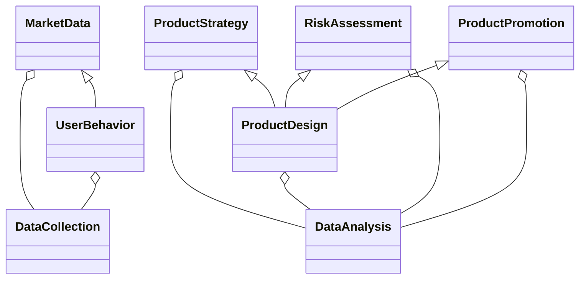
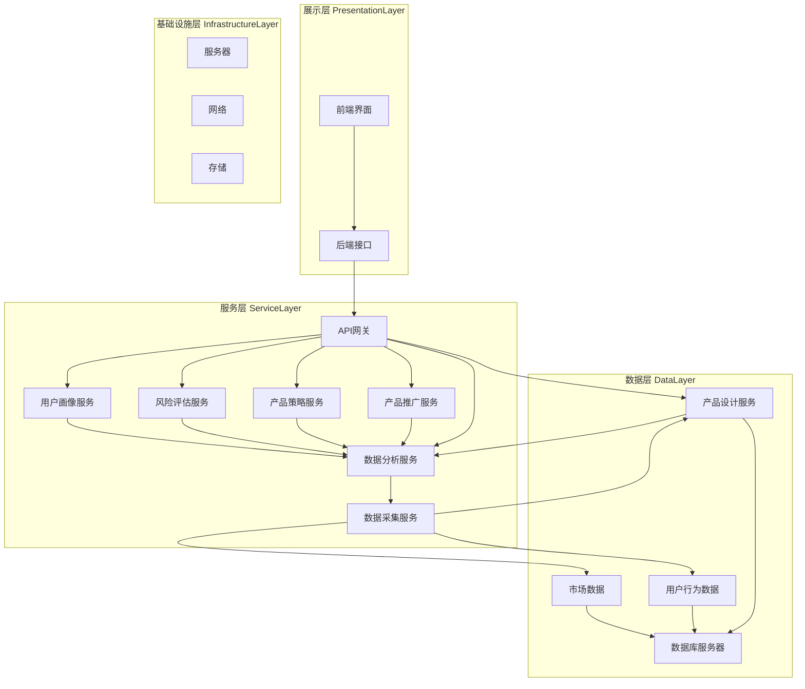
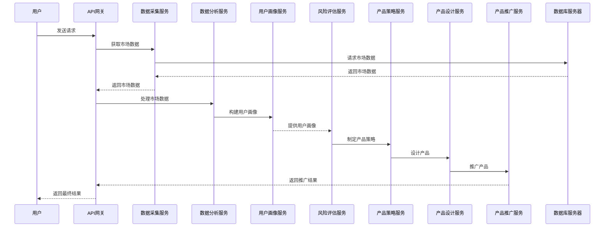

                 

### 1.1 问题背景

在当今快速发展的金融科技领域，金融产品的设计和开发面临着前所未有的挑战与机遇。传统金融产品设计方法依赖大量手工操作和经验判断，这不仅效率低下，而且难以适应日益复杂的市场需求和快速变化的环境。随着人工智能（AI）技术的不断进步，AI开始被广泛应用于金融产品的开发，从而极大地提升了金融产品的创新能力和市场竞争力。

**现状与挑战**

首先，从现状来看，金融产品设计主要包括以下几个方面：

1. **市场调研**：分析市场需求，了解客户偏好。
2. **产品规划**：根据调研结果，制定产品策略。
3. **产品设计**：包括产品设计、流程设计、界面设计等。
4. **风险评估**：分析产品可能面临的风险，制定应对策略。
5. **产品推广**：设计营销方案，促进产品销售。

然而，这一过程中面临的主要挑战有：

- **效率问题**：手工操作和经验判断导致设计效率低下。
- **创新能力**：难以快速响应市场需求，创新能力受限。
- **风险评估**：传统风险评估方法难以全面、精确地评估风险。

**AI技术在金融产品开发中的应用**

随着AI技术的发展，特别是机器学习、深度学习和大数据分析等技术的应用，AI在金融产品开发中展现出了巨大的潜力：

1. **市场调研**：AI可以通过大数据分析，快速识别市场趋势和客户需求，提高调研效率。
2. **产品设计**：AI可以辅助进行产品设计，通过模拟和优化，提高产品的创新性和适应性。
3. **风险评估**：AI可以通过复杂的数据模型和算法，提供更全面、准确的风险评估。
4. **产品推广**：AI可以辅助营销策略设计，提高产品推广效果。

综上所述，AI在金融产品开发中的应用不仅能够提高设计效率和创新能力，还能为金融产品带来更精准的风险评估和更有效的市场推广策略。因此，探索如何构建AI辅助的金融产品设计系统，具有重要的现实意义。

### 1.2 问题描述

金融产品设计是一个复杂而多层次的过程，涉及到多个关键环节，包括市场调研、产品策略制定、产品设计、风险评估和产品推广等。这些环节各有其特定的需求和挑战，因此，明确金融产品设计的需求对于构建AI辅助系统至关重要。

**金融产品设计的需求分析**

1. **市场调研**：市场调研是金融产品设计的第一步，主要目的是了解市场需求和客户偏好。传统的市场调研方法通常依赖于问卷调查和访谈，存在样本量小、数据收集耗时等问题。AI可以通过大数据分析和自然语言处理技术，从社交媒体、新闻报道、论坛讨论等多个数据源中提取有价值的信息，从而实现高效、全面的市场调研。

2. **产品策略制定**：在产品策略制定阶段，需要综合考虑市场需求、竞争环境、公司资源和目标客户群体等因素。AI可以通过数据分析和技术预测，帮助金融企业快速识别市场机会，制定科学、有效的产品策略。例如，利用机器学习算法分析历史市场数据，预测未来市场趋势，从而指导产品开发方向。

3. **产品设计**：金融产品设计包括功能设计、流程设计、界面设计等多个方面。在功能设计上，需要考虑用户的操作习惯和需求；在流程设计上，需要确保流程的合理性和高效性；在界面设计上，需要注重用户体验和交互设计。AI可以通过用户行为分析、用户画像等技术，优化产品设计的各个环节，提高产品的用户满意度和市场竞争力。

4. **风险评估**：风险评估是金融产品设计的重要环节，涉及到产品可能面临的各种风险，包括市场风险、信用风险、操作风险等。传统的风险评估方法通常依赖于经验判断和模型模拟，存在一定的主观性和不确定性。AI可以通过大数据分析和机器学习算法，建立更加精准的风险评估模型，提供更全面、准确的风险评估结果，帮助金融企业及时识别和应对风险。

5. **产品推广**：产品推广是金融产品成功上市的重要环节，需要设计有效的营销策略和推广方案。AI可以通过用户行为分析和市场数据分析，制定个性化的营销策略，提高产品的市场知名度和销售量。例如，利用推荐算法分析用户的历史购买记录和偏好，推荐符合用户需求的产品，从而提高转化率。

**AI技术在满足这些需求中的作用**

AI技术在金融产品设计中的具体应用如下：

1. **市场调研**：AI可以通过大数据分析和自然语言处理技术，快速、高效地收集和分析市场数据，提供有价值的市场洞见，支持市场调研的准确性和全面性。

2. **产品策略制定**：AI可以通过机器学习算法和数据分析技术，帮助金融企业快速识别市场机会，制定科学、有效的产品策略，提高产品竞争力。

3. **产品设计**：AI可以通过用户行为分析和用户画像技术，优化产品设计，提高用户体验和满意度。

4. **风险评估**：AI可以通过大数据分析和机器学习算法，建立更加精准的风险评估模型，提供全面、准确的风险评估结果，帮助金融企业及时识别和应对风险。

5. **产品推广**：AI可以通过用户行为分析和市场数据分析，制定个性化的营销策略，提高产品的市场知名度和销售量。

综上所述，AI技术在金融产品设计中的应用，不仅能够提高设计效率和创新能力，还能提供更精准的风险评估和更有效的市场推广策略，从而全面提升金融产品的市场竞争力和用户满意度。

### 1.3 问题解决

为了构建一个AI辅助的金融产品设计系统，我们需要从以下几个方面进行思考：

**AI辅助金融产品设计的思路**

1. **数据分析与挖掘**：首先，通过大数据分析技术，从各种数据源（如市场调研数据、用户行为数据、社交媒体数据等）中提取有价值的信息。这些数据包括市场趋势、用户需求、竞争情况等，是金融产品设计的重要基础。

2. **用户画像与行为分析**：基于用户画像和行为分析技术，深入理解用户的消费习惯、偏好和需求，从而指导产品设计和优化。

3. **智能预测与优化**：利用机器学习算法和深度学习模型，对市场趋势、用户需求等进行预测和优化，提供科学、准确的决策支持。

4. **风险评估与监控**：构建基于AI的风险评估模型，对金融产品的潜在风险进行实时监控和预警，提高风险管理能力。

**AI技术在金融产品设计中的具体应用场景**

1. **市场调研与需求分析**：AI可以通过大数据分析技术，快速识别市场趋势和用户需求，提供精准的市场洞见。例如，利用自然语言处理技术分析社交媒体数据，提取用户反馈和意见，帮助金融企业更好地理解市场需求。

2. **产品策略制定**：AI可以通过数据分析和技术预测，帮助金融企业快速制定科学、有效的产品策略。例如，利用机器学习算法分析历史市场数据，预测未来市场趋势，从而指导产品开发方向。

3. **产品设计**：AI可以辅助进行金融产品的功能设计、流程设计、界面设计等。通过用户行为分析和用户画像技术，优化产品设计的各个环节，提高产品的用户体验和满意度。例如，根据用户的使用习惯，设计更加人性化的操作流程和界面。

4. **风险评估**：AI可以通过大数据分析和机器学习算法，建立精准的风险评估模型。通过对历史数据和市场数据的分析，预测金融产品可能面临的风险，并提供相应的风险管理策略。例如，利用深度学习模型分析信用风险，提前识别潜在的违约客户。

5. **产品推广**：AI可以辅助制定个性化的营销策略，提高产品的市场知名度和销售量。例如，利用推荐算法分析用户的历史购买记录和偏好，推荐符合用户需求的产品，从而提高转化率。

**总结**

通过以上分析，我们可以看到，AI技术在金融产品设计中的应用具有广泛的前景和重要的价值。构建一个AI辅助的金融产品设计系统，不仅可以提高设计效率和创新能力，还能提供更精准的风险评估和更有效的市场推广策略，从而全面提升金融产品的市场竞争力和用户满意度。在未来的发展中，随着AI技术的不断进步，金融产品设计系统将进一步智能化和高效化，为金融企业带来更大的发展机遇。

### 1.4 边界与外延

在探讨AI辅助金融产品设计系统的适用场景时，需要明确其边界和限制，同时也要了解金融产品设计领域与其他领域的交叉关系，以及AI在这些交叉中的应用。

**AI辅助金融产品设计适用的场景**

1. **高频交易与量化投资**：AI在处理大量历史交易数据、分析市场趋势和预测价格变动方面具有显著优势。高频交易和量化投资领域非常适合应用AI技术，通过机器学习模型和深度学习算法，可以优化交易策略、降低交易成本，提高投资回报率。

2. **智能风控**：金融行业的风险控制至关重要，AI技术可以用于建立实时监控模型，分析信贷风险、市场风险和操作风险，提供风险预警和应急措施。例如，通过大数据分析和机器学习算法，对客户信用评级进行动态调整，以降低坏账率。

3. **个性化金融服务**：随着用户数据的积累和AI技术的进步，金融机构可以更精准地了解客户需求，提供个性化的金融产品和服务。通过用户画像和行为分析，AI能够为不同类型的客户推荐最适合的金融产品，提高客户满意度和忠诚度。

4. **智能投顾**：智能投顾利用AI技术提供投资建议和资产管理服务，通过数据分析、市场预测和风险评估，帮助投资者做出更明智的投资决策。智能投顾系统可以实时调整投资组合，以应对市场变化。

**AI辅助金融产品设计的不适用场景**

1. **低频交易与战略投资**：对于投资周期较长、决策过程复杂的战略投资，AI技术的应用效果有限。这种情况下，人类专家的经验和判断更为重要。

2. **涉及法律法规和伦理道德的决策**：金融产品设计和风险管理中，涉及法律法规和伦理道德的决策需要高度的人为干预。例如，防范洗钱、避免违规交易等，AI系统难以完全替代。

**金融产品设计领域与其他领域的关系**

1. **技术与业务融合**：AI技术在金融产品设计中的应用，需要与业务需求紧密融合。金融机构需要充分理解AI技术的优势，将其嵌入到金融产品的各个环节，实现技术与业务的协同创新。

2. **跨界合作**：金融产品设计不仅仅是技术和业务的问题，还涉及到法律、伦理、市场营销等多个领域。跨界合作可以帮助金融企业更好地整合资源，提升产品设计的整体效能。

3. **教育与培训**：AI技术的应用也需要相关的教育和培训。金融从业者需要不断学习AI技术，提高数据分析和决策能力，以适应金融产品设计的数字化和智能化趋势。

**AI在交叉领域的应用**

1. **金融科技（FinTech）**：AI技术在FinTech领域的应用非常广泛，包括区块链、大数据、云计算等。通过AI技术，FinTech产品可以实现更加智能、高效和安全的金融服务。

2. **保险科技（InsurTech）**：AI技术在保险产品设计中的应用，如风险评估、理赔自动化等，可以大大提高保险业务的效率和精准度。

3. **区块链**：区块链技术与AI的结合，可以提供更加安全、透明的金融交易和数据管理方案，增强金融系统的韧性和可靠性。

通过上述分析，我们可以看到，AI辅助的金融产品设计系统具有广泛的应用前景，但同时也需要充分考虑其适用的场景和限制。在金融产品设计领域，AI技术与其他领域的交叉应用，将进一步推动金融行业的创新和进步。

### 2.1 核心概念

为了深入理解AI辅助金融产品设计系统的构建，我们首先需要明确几个核心概念：人工智能和金融产品设计。这两个概念不仅各自独立，而且在金融产品设计中的应用也具有独特的属性和特点。

**人工智能**

人工智能（Artificial Intelligence，简称AI）是指通过计算机程序实现智能行为的技术和科学。它包括机器学习、深度学习、自然语言处理、计算机视觉等多个子领域。人工智能的目标是使计算机具备人类智能的某些功能，如学习、推理、决策、感知和交互。

- **机器学习（Machine Learning）**：机器学习是人工智能的一个重要分支，通过算法使计算机能够从数据中学习并做出预测或决策。它包括监督学习、无监督学习和强化学习等类型。
  
- **深度学习（Deep Learning）**：深度学习是机器学习的一个子领域，使用多层神经网络来模拟人类大脑的处理方式，能够处理大量复杂数据并提取特征。

- **自然语言处理（Natural Language Processing，简称NLP）**：NLP是使计算机能够理解和生成人类语言的技术。它包括文本分类、情感分析、语音识别等。

- **计算机视觉（Computer Vision）**：计算机视觉是使计算机能够“看到”和理解视觉信息的技术。它包括图像识别、目标检测、图像分割等。

**金融产品设计**

金融产品设计是指开发新的金融产品，包括设计产品的基本结构、功能和服务。金融产品设计需要考虑市场需求、客户需求、法律法规等多方面因素。

- **创新性**：金融产品设计需要具备创新性，以吸引客户和满足市场需求。创新性体现在产品功能、用户体验和商业模式等方面。

- **安全性**：金融产品的安全性至关重要，需要确保资金安全、用户数据安全和交易安全。金融产品设计需要遵守相关法律法规，建立严格的安全机制。

- **可持续性**：金融产品设计还需要考虑可持续性，即产品的长期发展和环境影响。这包括社会责任和环境保护等方面的考量。

### 概念属性特征对比表格

| 概念       | 特征1   | 特征2   | 特征3   |
|------------|---------|---------|---------|
| 人工智能   | 自动化  | 学习能力 | 推理能力 |
| 金融产品设计 | 创新性  | 安全性  | 可持续性 |

- **自动化**：人工智能通过算法和模型实现自动化，能够在无需人工干预的情况下处理大量数据和执行任务。

- **学习能力**：人工智能通过机器学习和深度学习算法，可以从数据中学习并优化自身性能。

- **推理能力**：人工智能可以通过逻辑推理和决策树等方法，处理复杂问题和做出决策。

- **创新性**：金融产品设计需要不断创新，以满足不断变化的市场需求和客户期望。

- **安全性**：金融产品设计必须确保资金和用户数据的安全，遵守相关法律法规。

- **可持续性**：金融产品设计需要考虑长期发展和环境保护，实现社会责任。

通过上述分析，我们可以看到，人工智能和金融产品设计虽然属于不同的领域，但它们在属性特征上有显著差异，并且在金融产品设计中的应用具有重要价值。了解这些核心概念及其特征，有助于我们更好地理解和构建AI辅助的金融产品设计系统。

### 2.2 概念属性特征对比表格

| 概念       | 特征1   | 特征2   | 特征3   |
|------------|---------|---------|---------|
| 人工智能   | 自动化  | 学习能力 | 推理能力 |
| 金融产品设计 | 创新性  | 安全性  | 可持续性 |

- **自动化**：人工智能通过算法和模型实现自动化，能够在无需人工干预的情况下处理大量数据和执行任务。
- **学习能力**：人工智能通过机器学习和深度学习算法，可以从数据中学习并优化自身性能。
- **推理能力**：人工智能可以通过逻辑推理和决策树等方法，处理复杂问题和做出决策。
- **创新性**：金融产品设计需要不断创新，以满足不断变化的市场需求和客户期望。
- **安全性**：金融产品设计必须确保资金和用户数据的安全，遵守相关法律法规。
- **可持续性**：金融产品设计需要考虑长期发展和环境保护，实现社会责任。

通过这个对比表格，我们可以更直观地了解人工智能和金融产品设计的核心特征，这为我们在构建AI辅助的金融产品设计系统时提供了重要的参考。

### 2.3 ER实体关系图架构

ER图（Entity-Relationship Diagram）是数据库设计和系统架构设计中常用的工具，用于表示实体及其关系。在构建AI辅助的金融产品设计系统中，ER图可以帮助我们清晰地理解系统中各实体及其相互关系，从而更好地进行系统设计和实现。

以下是金融产品设计系统中常见的实体及其关系：

```mermaid
erDiagram
  AI技术 ||--|{ 金融产品设计 }|
  AI技术 ||--|{ 金融数据分析 }|
  金融产品设计 ||--|{ 产品策略 }|
  金融产品设计 ||--|{ 客户需求 }|
  金融数据分析 ||--|{ 数据挖掘 }|
  金融数据分析 ||--|{ 风险评估 }|
```

**实体解释**

1. **AI技术**：表示系统中的AI技术，包括机器学习、深度学习、自然语言处理等。
2. **金融产品设计**：表示金融产品的设计过程，包括市场调研、策略制定、产品设计等。
3. **金融数据分析**：表示对金融数据进行分析的过程，包括数据挖掘、风险评估等。
4. **产品策略**：表示金融产品设计中的策略制定，包括市场分析、竞争策略等。
5. **客户需求**：表示客户对金融产品的需求，包括功能需求、用户体验等。
6. **数据挖掘**：表示从大量金融数据中提取有价值信息的过程，用于市场分析和产品优化。
7. **风险评估**：表示对金融产品可能面临的风险进行分析和评估，包括信用风险、市场风险等。

**关系解释**

- **AI技术与金融产品设计**：AI技术辅助金融产品设计，为产品设计和优化提供支持。
- **AI技术与金融数据分析**：AI技术用于金融数据分析，帮助提取有用信息，支持决策。
- **金融产品设计与产品策略**：金融产品设计依据产品策略进行，确保产品符合市场需求和战略目标。
- **金融产品设计与客户需求**：金融产品设计基于客户需求，以满足用户需求为最终目标。
- **金融数据分析与数据挖掘**：数据挖掘是金融数据分析的重要手段，用于提取有价值的信息。
- **金融数据分析与风险评估**：风险评估是金融数据分析的一个关键任务，用于识别和应对潜在风险。

通过上述ER图，我们可以清晰地看到AI辅助金融产品设计系统中各实体及其关系，这有助于我们更好地理解和设计系统，确保系统功能的完整性和协调性。

### 3.1 机器学习基础

机器学习（Machine Learning，ML）是人工智能（AI）的一个重要分支，旨在通过数据构建模型，使计算机具备从数据中学习、发现模式和预测结果的能力。理解机器学习的基本概念和分类对于构建AI辅助的金融产品设计系统至关重要。

**机器学习的概述**

机器学习的基本思想是通过训练数据集，让计算机学习数据中的规律，从而在没有标签的新数据上做出准确的预测或决策。这个过程包括以下几个主要步骤：

1. **数据收集**：收集相关的数据集，这些数据集可以是结构化的表格数据，也可以是非结构化的文本、图像、音频等。
2. **数据预处理**：对收集到的数据进行清洗、归一化、特征提取等处理，以便于模型训练。
3. **模型选择**：选择合适的机器学习算法，如线性回归、决策树、支持向量机、神经网络等。
4. **模型训练**：使用训练数据集训练模型，通过优化模型参数，使其能够更好地拟合训练数据。
5. **模型评估**：使用测试数据集评估模型性能，常见的评估指标包括准确率、召回率、F1分数等。
6. **模型应用**：将训练好的模型应用于实际问题中，进行预测或决策。

**监督学习、无监督学习和强化学习**

机器学习可以分为三种主要类型：监督学习（Supervised Learning）、无监督学习（Unsupervised Learning）和强化学习（Reinforcement Learning）。

1. **监督学习**：在监督学习中，训练数据集包含输入和对应的输出标签。模型的目的是学习输入和输出之间的映射关系。常见的算法有线性回归、逻辑回归、支持向量机（SVM）和神经网络等。

    - **线性回归（Linear Regression）**：通过找到一个线性函数来预测输出值。
    - **逻辑回归（Logistic Regression）**：用于分类问题，通过概率分布预测类别。
    - **支持向量机（SVM）**：通过找到一个最佳的超平面来分离不同的类别。

2. **无监督学习**：在无监督学习中，训练数据集不包含输出标签。模型的任务是发现数据中的结构或模式。常见的算法有聚类（Clustering）、降维（Dimensionality Reduction）和关联规则学习（Association Rule Learning）等。

    - **聚类（Clustering）**：将相似的数据点分组，常见的算法有K-means、DBSCAN等。
    - **降维（Dimensionality Reduction）**：减少数据维度，常见的算法有主成分分析（PCA）、t-SNE等。
    - **关联规则学习（Association Rule Learning）**：发现数据中的关联关系，常见的算法有Apriori算法、Eclat算法等。

3. **强化学习**：在强化学习中，模型通过不断尝试和反馈来学习最优策略。强化学习通常用于决策问题，模型会根据环境的反馈调整自己的行为。常见的算法有Q-learning、深度Q网络（DQN）和策略梯度算法等。

- **Q-learning**：通过学习值函数来预测和选择最优动作。
- **深度Q网络（DQN）**：结合深度学习和强化学习，用于处理高维状态空间问题。
- **策略梯度算法**：直接优化策略函数，使模型能够更好地适应环境。

通过理解这些基本概念和分类，我们可以更好地选择合适的机器学习算法来构建AI辅助的金融产品设计系统，从而提高金融产品的设计效率和创新能力。

### 3.2 深度学习

深度学习（Deep Learning，DL）是机器学习（Machine Learning，ML）的一个子领域，其核心思想是通过多层神经网络模拟人脑的处理方式，从大量数据中自动学习特征和模式。深度学习在人工智能领域取得了显著的进展，成为许多复杂任务（如图像识别、自然语言处理、语音识别等）的重要工具。

**深度学习的概念与发展**

深度学习起源于1980年代，当时由于计算资源和算法的限制，其发展受到了阻碍。然而，随着计算能力的提升和大数据的普及，深度学习在21世纪初迎来了爆发式发展。以下是深度学习的一些关键概念和演变过程：

1. **神经网络（Neural Networks）**：神经网络是深度学习的基础。一个简单的神经网络由输入层、隐藏层和输出层组成，每层由多个神经元（节点）构成。神经元之间通过权重连接，通过激活函数（如ReLU、Sigmoid、Tanh）进行非线性变换。

2. **深度神经网络（Deep Neural Networks，DNN）**：传统的神经网络通常只有几层，而深度神经网络（DNN）则包含多个隐藏层。深度使得神经网络能够捕捉到数据中的更复杂的特征和模式。

3. **卷积神经网络（Convolutional Neural Networks，CNN）**：卷积神经网络是用于图像识别和处理的深度学习模型。CNN通过卷积层和池化层，有效地提取图像中的局部特征，并逐步形成全局特征表示。

4. **递归神经网络（Recurrent Neural Networks，RNN）**：递归神经网络用于处理序列数据，如时间序列数据、文本数据等。RNN通过其循环结构，能够保留历史信息，并在序列的不同时间步进行信息的传递和更新。

5. **长短期记忆网络（Long Short-Term Memory，LSTM）**：LSTM是RNN的一种变体，解决了传统RNN在处理长序列数据时容易出现的梯度消失和梯度爆炸问题。LSTM通过引入门控机制，能够有效地学习长期依赖关系。

6. **生成对抗网络（Generative Adversarial Networks，GAN）**：生成对抗网络由生成器和判别器两个对抗性网络组成。生成器尝试生成逼真的数据，判别器则判断生成数据的真假。通过这种对抗训练，GAN能够生成高质量的数据。

**神经网络与深度神经网络**

神经网络（Neural Networks）是一种基于生物神经元工作机制的计算模型，通过模拟大量简单的计算单元（神经元）及其相互连接，实现复杂的计算任务。一个简单的神经网络通常包含三个层次：输入层、隐藏层和输出层。

- **输入层**：接收外部输入数据，每个输入数据对应一个神经元。
- **隐藏层**：一个或多个隐藏层，每个隐藏层由多个神经元组成。隐藏层通过加权求和和激活函数，对输入数据进行特征提取和变换。
- **输出层**：输出最终结果，每个输出神经元对应一个分类或预测结果。

深度神经网络（Deep Neural Networks，DNN）是在传统神经网络的基础上增加多个隐藏层，使得模型能够学习更复杂的特征表示。DNN的结构如下：

1. **输入层**：接收输入数据，将其传递到第一个隐藏层。
2. **隐藏层**：多个隐藏层，每层包含多个神经元，通过前一层输出数据进行特征提取和变换。
3. **输出层**：输出最终结果，用于分类、回归等任务。

深度神经网络通过增加层数和神经元数量，能够捕捉数据中的层次化结构和复杂模式，从而提高模型的预测能力和泛化性能。

### 深度学习的应用领域

深度学习在许多领域取得了显著的成果，以下是几个主要的应用领域：

1. **计算机视觉**：深度学习在图像识别、目标检测、图像生成等方面有着广泛应用。通过CNN等模型，深度学习能够高效地提取图像特征，实现高质量的图像分类和目标检测。

2. **自然语言处理**：深度学习在文本分类、情感分析、机器翻译、语音识别等方面表现出色。RNN、LSTM和BERT等模型通过学习文本的上下文信息，能够实现高度准确的文本理解和生成。

3. **语音识别**：深度学习通过自动语音识别（Automatic Speech Recognition，ASR）模型，将语音信号转换为文本。深度神经网络在语音特征提取和序列建模方面具有优势，能够实现高准确率的语音识别。

4. **推荐系统**：深度学习在推荐系统中用于用户画像建模和物品特征提取，通过深度学习模型，能够实现个性化的推荐结果，提高推荐系统的效果。

5. **游戏AI**：深度学习在游戏人工智能（Game AI）中，通过深度强化学习模型，实现自主决策和智能行为，提高游戏体验和游戏难度。

6. **医疗健康**：深度学习在医疗诊断、药物设计、健康监测等方面有着广泛应用。通过深度学习模型，可以自动化地处理医学图像、分析基因组数据，为医生提供辅助诊断和治疗方案。

总之，深度学习作为人工智能的一个重要分支，通过多层神经网络模拟人脑处理方式，从数据中自动学习特征和模式，在许多领域取得了显著的进展。未来，随着深度学习技术的不断发展和应用，我们将看到更多基于深度学习的创新应用，为人类带来更多的便利和福祉。

### 3.3 特征工程

特征工程（Feature Engineering）是机器学习和深度学习中的一个关键步骤，它涉及从原始数据中提取或构造新的特征，以便于模型训练和预测。特征工程的质量直接影响模型的表现和效果。一个优秀的特征工程不仅能够提高模型的准确性和泛化能力，还能减少计算资源的需求。

**特征提取与选择**

1. **特征提取**：特征提取是指从原始数据中直接提取有用的特征。这通常包括以下方法：
   - **统计特征**：如均值、方差、标准差、最大值、最小值等。
   - **文本特征**：如词频、词向量、TF-IDF等。
   - **图像特征**：如边缘检测、颜色直方图、纹理特征等。

2. **特征选择**：特征选择是指从大量特征中挑选出最有用的一小部分特征。这可以通过以下方法实现：
   - **过滤方法**：基于统计方法筛选出相关性较高的特征，如信息增益、卡方检验等。
   - **包装方法**：通过训练模型，评估不同特征组合的效果，选择最优特征组合。
   - **嵌入式方法**：在训练过程中自动选择特征，如L1正则化（Lasso）和随机森林（Random Forest）。

**特征重要性评估**

1. **基于模型的评估**：通过训练模型，评估每个特征的重要性。例如，可以使用随机森林中的特征重要性得分，或者使用Lasso回归中的特征系数来评估特征的重要性。

2. **基于信息的评估**：使用信息论中的概念，如信息增益、增益率等，评估特征的重要性。信息增益是特征能够减少训练集不确定性的程度。

3. **基于模型的交叉验证**：通过交叉验证，评估特征对模型预测性能的贡献。这可以通过添加或删除特征，并比较模型性能的变化来实现。

**特征工程在AI辅助金融产品设计中的应用**

1. **市场数据特征提取**：从市场数据中提取价格趋势、成交量、波动率等统计特征，用于预测市场走势。

2. **用户行为特征提取**：从用户行为数据中提取访问时间、点击率、浏览时长等特征，用于个性化推荐和用户画像构建。

3. **风险评估特征提取**：从信贷数据中提取借款人的年龄、收入、信用记录等特征，用于信用风险评估。

4. **产品定价特征提取**：从产品历史销售数据中提取季节性、促销活动、市场占有率等特征，用于产品定价策略优化。

通过特征工程，我们可以从原始数据中提取出有价值的特征，提高模型的预测能力，从而在AI辅助的金融产品设计系统中实现更精准的市场分析、用户画像和风险评估。

### 4.1 数据分析

在金融产品设计中，数据分析是至关重要的一环，它不仅帮助我们更好地理解市场趋势和用户需求，还为产品策略的制定和设计提供了科学依据。数据分析可以分为数据预处理、数据可视化等多个步骤，以下将详细讲解这些步骤及其在金融产品设计中的应用。

**数据预处理**

数据预处理是数据分析的第一步，其目的是对原始数据进行清洗和格式化，使其符合分析和建模的要求。数据预处理主要包括以下几方面：

1. **数据清洗**：数据清洗是指处理数据中的错误、缺失和异常值。这可以通过以下方法实现：
   - **处理缺失值**：缺失值可以采用均值填补、中值填补、前值填补等方法，或者使用插值法进行填补。
   - **处理异常值**：异常值可以通过统计方法（如标准差、箱线图）或者基于业务逻辑的方法（如专家判断）进行识别和处理。
   - **去重**：删除重复的数据记录，以避免数据冗余。

2. **数据转换**：数据转换包括数据类型转换、数据标准化和归一化等。例如，将分类数据转换为数值数据，或对数据进行归一化处理，使其在同一个尺度上。

3. **特征工程**：在数据预处理阶段，还可以进行一些特征工程操作，如特征提取、特征选择等，以增强数据的分析价值。

**数据可视化**

数据可视化是将数据以图形化的形式展示出来，使得数据中的规律和趋势更加直观、易于理解。数据可视化在金融产品设计中的应用如下：

1. **趋势分析**：通过折线图、柱状图等，展示金融产品的价格、成交量等随时间的变化趋势。这有助于识别市场周期和趋势，为产品设计和推广提供依据。

2. **对比分析**：通过饼图、条形图等，展示不同产品、市场或客户群体之间的对比情况。例如，比较不同产品的销售额、市场份额等，帮助金融企业优化产品组合和营销策略。

3. **用户行为分析**：通过热力图、散点图等，展示用户在不同时间、地点、渠道上的行为分布。这有助于了解用户行为模式，优化用户体验和产品推荐。

4. **风险评估**：通过箱线图、密度图等，展示金融产品的风险分布情况。例如，分析借款人的信用风险、市场的波动风险等，为风险管理提供数据支持。

**数据分析在金融产品设计中的应用**

1. **市场调研与需求分析**：通过数据分析，可以深入了解市场需求和用户偏好，为产品设计和推广提供指导。例如，分析用户的行为数据，了解用户在购买决策中的关键因素，从而优化产品设计。

2. **产品策略制定**：通过数据可视化，可以识别市场机会和潜在风险，为产品策略的制定提供科学依据。例如，分析市场趋势和竞争环境，制定符合市场需求的创新性产品策略。

3. **风险评估**：通过数据分析，可以构建风险模型，对金融产品可能面临的风险进行评估。例如，利用历史数据，分析借款人的信用风险，为贷款产品的风险控制提供数据支持。

4. **用户体验优化**：通过用户行为分析，可以了解用户的体验需求和痛点，为产品界面设计和功能优化提供指导。例如，通过分析用户在产品中的操作路径和点击行为，优化产品的交互设计和用户体验。

总之，数据分析是金融产品设计过程中不可或缺的一环，通过数据预处理、数据可视化等技术手段，可以帮助金融企业更好地理解市场和用户，制定科学的产品策略，提高产品的市场竞争力和用户满意度。

### 4.2 风险评估

在金融产品设计中，风险评估是一个至关重要的环节，它关系到金融产品的稳健性和市场的安全性。风险评估的主要目标是识别、衡量和控制产品可能面临的各种风险，从而确保金融产品的可持续性和稳健发展。AI技术在风险评估中的应用，极大地提升了风险评估的准确性和效率。

**风险模型的构建**

风险模型是评估金融产品风险的核心工具，其构建过程主要包括以下步骤：

1. **数据收集**：首先，需要收集与风险相关的数据，包括历史交易数据、用户行为数据、市场数据等。这些数据可以通过金融数据库、API接口或第三方数据提供商获取。

2. **数据预处理**：对收集到的数据进行清洗和格式化，确保数据的质量和一致性。这包括处理缺失值、异常值和重复数据等。

3. **特征工程**：从原始数据中提取和构造新的特征，以增强模型的表现力。特征工程包括统计特征（如均值、方差、波动率等）和文本特征（如用户评论、标签等）。

4. **模型选择**：选择合适的机器学习算法和模型，如线性回归、决策树、随机森林、支持向量机等。根据风险评估的目标，选择合适的模型，如信用评分模型、市场风险模型等。

5. **模型训练与验证**：使用训练数据集对模型进行训练，并通过交叉验证等方法验证模型的性能和泛化能力。

**风险评估指标的选取**

在构建风险模型时，需要选择一系列关键的风险评估指标，以全面衡量金融产品的风险水平。以下是一些常见的重要风险评估指标：

1. **信用评分**：用于衡量借款人的信用风险，常见的信用评分指标包括贝叶斯评分、逻辑回归评分等。

2. **违约概率**：预测借款人违约的概率，常用的违约概率指标包括KMV模型、CreditMetrics模型等。

3. **市场风险指标**：用于衡量市场波动对金融产品的影响，如VaR（Value at Risk）、CVaR（Conditional Value at Risk）等。

4. **操作风险指标**：用于衡量金融产品的操作风险，如操作失误率、系统故障率等。

5. **合规性风险**：评估金融产品是否符合相关法律法规的要求，如反洗钱（AML）合规性、数据隐私保护等。

**风险管理的应用**

通过AI技术构建的风险评估模型，可以广泛应用于金融产品的风险管理和控制。以下是一些具体的应用场景：

1. **信用风险管理**：利用信用评分模型和违约概率模型，金融机构可以更准确地评估借款人的信用风险，从而优化信贷策略，降低坏账率。

2. **市场风险管理**：通过VaR和CVaR等市场风险指标，金融机构可以实时监控市场波动对金融产品的影响，及时采取风险控制措施。

3. **操作风险管理**：利用操作风险指标，金融机构可以识别和防范操作风险，如系统故障、人为失误等，确保金融产品的稳健运行。

4. **合规性风险管理**：通过AI技术，金融机构可以自动识别和评估合规性风险，如数据泄露、违反反洗钱法规等，确保金融产品符合相关法律法规。

总之，通过AI技术构建风险评估模型，不仅提高了风险评估的准确性和效率，还为金融产品的风险管理和控制提供了强有力的支持。这有助于金融机构更好地应对市场风险，保障金融产品的稳健发展。

### 4.3 产品定价

产品定价是金融产品设计过程中的关键环节，它直接关系到金融产品的市场竞争力和盈利能力。产品定价的数学模型和策略分析，通过利用AI技术，能够实现更加科学和精确的定价，从而提升金融产品的竞争力。

**产品定价的数学模型**

产品定价的数学模型主要包括成本加成定价模型、需求导向定价模型、竞争导向定价模型等。

1. **成本加成定价模型**：该模型基于产品的生产成本，加上一定的加成率，得出产品价格。其基本公式为：
   $$P = C + \gamma \cdot C$$
   其中，\(P\) 是产品价格，\(C\) 是成本，\(\gamma\) 是加成率。

2. **需求导向定价模型**：该模型根据市场需求和消费者对产品的需求程度来定价。常见的需求导向定价模型有边际效用定价、价值定价等。例如，边际效用定价模型基于消费者对产品的边际效用，确定产品价格。

3. **竞争导向定价模型**：该模型基于市场竞争情况，参考竞争对手的产品价格来定价。其基本思路是通过价格定位策略，吸引目标客户群体，提高市场份额。常用的竞争导向定价策略有跟随定价、领先定价和挑战定价等。

**产品定价策略分析**

1. **差异化定价策略**：差异化定价策略通过提供不同的产品版本或服务层次，满足不同客户的需求和支付意愿。例如，基础版、高级版和定制版等，通过不同的价格差异，实现收益的最大化。

2. **动态定价策略**：动态定价策略根据市场需求和供应情况，实时调整产品价格。这种策略利用大数据分析和AI技术，能够更加灵活和精准地应对市场变化。常见的动态定价方法有基于供需的定价、基于预测的定价等。

3. **组合定价策略**：组合定价策略通过提供捆绑销售、套餐销售等组合产品，提高客户购买意愿和黏性。例如，金融产品可以与保险、理财产品等组合销售，以实现更高的销售额。

4. **基于用户行为的定价策略**：通过用户画像和行为分析，根据客户的购买历史、消费习惯、偏好等因素，提供个性化的定价策略。这种策略能够提高客户的满意度和忠诚度，实现更高的转化率和销售额。

**AI技术在产品定价中的应用**

AI技术在产品定价中发挥着重要作用，通过大数据分析和机器学习算法，可以实现更加科学和精确的定价。以下是一些具体的应用场景：

1. **需求预测**：利用AI技术，分析市场需求和消费者行为，预测未来的需求趋势，从而制定更具前瞻性的定价策略。

2. **价格优化**：通过机器学习算法，分析历史价格和销量数据，找出最佳的价格区间，优化产品定价。

3. **竞争分析**：通过AI技术，实时监控竞争对手的价格策略和市场反应，及时调整自身的价格策略，保持竞争优势。

4. **个性化定价**：利用用户画像和行为分析，为不同的客户提供个性化的定价方案，提高客户的满意度和忠诚度。

总之，通过AI技术构建的产品定价模型和策略，不仅能够提高定价的科学性和精确性，还能更好地满足市场需求，提高金融产品的市场竞争力和盈利能力。

### 5.1 数学模型

在AI辅助的金融产品设计系统中，数学模型是核心组成部分，通过数学公式和算法来实现对数据的分析和预测。以下将详细讲解监督学习中的损失函数、无监督学习中的聚类算法，以及相应的数学模型和公式。

**监督学习中的损失函数**

在监督学习中，损失函数是评估模型预测性能的关键工具，用于衡量预测值与真实值之间的差距。常见的损失函数有以下几种：

1. **均方误差（Mean Squared Error, MSE）**：
   $$MSE = \frac{1}{m} \sum_{i=1}^{m} (\hat{y}_i - y_i)^2$$
   其中，\(\hat{y}_i\) 是预测值，\(y_i\) 是真实值，\(m\) 是样本数量。MSE 是预测误差的平方和的平均值，值越小表示模型预测越准确。

2. **均方根误差（Root Mean Squared Error, RMSE）**：
   $$RMSE = \sqrt{MSE}$$
   RMSE 是MSE的平方根，数值上更直观地反映了预测误差。

3. **交叉熵损失（Cross-Entropy Loss）**：
   $$H(y, \hat{y}) = -\sum_{i=1}^{m} y_i \log(\hat{y}_i)$$
   其中，\(y\) 是真实标签，\(\hat{y}\) 是预测概率。交叉熵损失通常用于分类问题，特别是二分类和多分类问题，用于衡量预测概率与真实标签之间的差异。

4. **对数损失（Log Loss）**：
   $$\text{Log Loss} = -\frac{1}{m} \sum_{i=1}^{m} y_i \log(\hat{y}_i)$$
   对数损失是交叉熵损失的标准化版本，用于评估分类模型的性能。

**无监督学习中的聚类算法**

无监督学习中的聚类算法用于将数据点分组，常见的聚类算法包括K-means算法和DBSCAN算法。

1. **K-means算法**：
   K-means算法是一种基于距离度量的聚类算法，其目标是找到 \(k\) 个中心点，使得每个数据点与其最近的中心点的距离最小。
   - **目标函数**：
     $$J(\mu) = \frac{1}{m} \sum_{i=1}^{k} \sum_{x \in S_i} ||x - \mu_i||^2$$
     其中，\(\mu_i\) 是第 \(i\) 个中心点，\(S_i\) 是属于第 \(i\) 个簇的数据点集合。
   - **算法步骤**：
     1. 初始化 \(k\) 个中心点。
     2. 对每个数据点，计算其与各个中心点的距离，将其分配到最近的中心点所代表的簇。
     3. 重新计算每个簇的中心点。
     4. 重复步骤2和3，直到中心点不再发生显著变化。

2. **DBSCAN算法**：
   DBSCAN（Density-Based Spatial Clustering of Applications with Noise）算法是一种基于密度的聚类算法，它能够识别出任意形状的簇，并且能够处理噪声点。
   - **参数**：
     - \(\epsilon\)：邻域半径。
     - \(\minPts\)：最小邻域内的点数。
   - **算法步骤**：
     1. 初始化未访问的点。
     2. 对每个未访问的点，检查其邻域内点的数量，如果大于 \(\minPts\)，则将点及其邻域内的点划分为同一簇。
     3. 如果邻域内点的数量小于 \(\minPts\)，则将该点标记为噪声点。
     4. 重复步骤2和3，直到所有点都被访问。

**举例说明**

1. **线性回归模型预测金融产品销量**：
   假设我们使用线性回归模型预测某金融产品的销量，其中预测公式为：
   $$\hat{y} = w_0 + w_1 \cdot x$$
   其中，\(\hat{y}\) 是预测销量，\(x\) 是影响销量的特征（如广告投放量），\(w_0\) 和 \(w_1\) 是模型参数。
   - 使用均方误差（MSE）来评估模型预测性能。
   - 通过梯度下降算法，优化模型参数，最小化MSE。

2. **使用聚类算法分析客户需求**：
   假设我们使用K-means算法对客户需求进行聚类分析，识别出不同类型的客户群体。
   - 初始化 \(k\) 个聚类中心点。
   - 将每个客户需求点分配到最近的聚类中心点。
   - 根据客户需求点的分布，调整聚类中心点。
   - 通过分析不同聚类中心点，了解不同客户群体的特征和需求，从而制定个性化的营销策略。

通过上述数学模型和算法，AI辅助的金融产品设计系统能够实现更加精确的数据分析和预测，为金融产品的创新设计、风险评估和定价策略提供有力支持。

### 5.2 数学公式讲解

在AI辅助的金融产品设计系统中，理解和应用数学公式是至关重要的。以下将详细讲解监督学习中的损失函数、无监督学习中的聚类算法，以及相应的数学公式，并给出具体的应用实例。

**监督学习中的损失函数**

监督学习中的损失函数用于评估模型预测值与真实值之间的差距，常见的损失函数包括均方误差（MSE）和交叉熵损失。

1. **均方误差（MSE）**：
   $$MSE = \frac{1}{m} \sum_{i=1}^{m} (\hat{y}_i - y_i)^2$$
   其中，\(\hat{y}_i\) 是模型预测值，\(y_i\) 是真实值，\(m\) 是样本数量。MSE 是预测误差的平方和的平均值，用于衡量回归问题的预测性能。值越小表示模型预测越准确。

   **应用实例**：
   假设我们使用线性回归模型预测某金融产品的销量，我们可以通过计算MSE来评估模型预测性能：
   ```python
   import numpy as np

   # 假设我们有一组预测值和真实值
   y_pred = np.array([2.5, 3.0, 2.8, 3.2, 2.9])
   y_true = np.array([2.6, 3.1, 2.7, 3.3, 2.8])

   # 计算MSE
   mse = np.mean((y_pred - y_true) ** 2)
   print("MSE:", mse)
   ```

2. **交叉熵损失（Cross-Entropy Loss）**：
   $$H(y, \hat{y}) = -\sum_{i=1}^{m} y_i \log(\hat{y}_i)$$
   其中，\(y\) 是真实标签，\(\hat{y}\) 是预测概率。交叉熵损失用于分类问题，衡量预测概率与真实标签之间的差异。值越小表示分类模型预测越准确。

   **应用实例**：
   假设我们使用逻辑回归模型预测金融产品是否会被购买，我们可以通过计算交叉熵损失来评估模型预测性能：
   ```python
   import numpy as np
   import tensorflow as tf

   # 假设我们有一组预测值和真实标签
   y_pred = np.array([0.7, 0.8, 0.6, 0.9, 0.5])
   y_true = np.array([1, 0, 1, 1, 0])

   # 计算交叉熵损失
   cross_entropy_loss = -np.sum(y_true * np.log(y_pred))
   print("Cross-Entropy Loss:", cross_entropy_loss)
   ```

**无监督学习中的聚类算法**

无监督学习中的聚类算法用于将数据点分组，常见的聚类算法包括K-means算法和DBSCAN算法。

1. **K-means算法**：
   K-means算法是一种基于距离度量的聚类算法，其目标是最小化每个簇内的平方误差和。

   **目标函数**：
   $$J(\mu) = \frac{1}{m} \sum_{i=1}^{k} \sum_{x \in S_i} ||x - \mu_i||^2$$
   其中，\(\mu_i\) 是第 \(i\) 个聚类中心，\(S_i\) 是属于第 \(i\) 个簇的数据点集合。

   **应用实例**：
   假设我们使用K-means算法对一组用户数据进行聚类，我们可以通过以下步骤进行聚类：
   ```python
   from sklearn.cluster import KMeans

   # 假设我们有一组用户数据
   X = np.array([[1, 2], [1, 4], [1, 0],
                [10, 2], [10, 4], [10, 0]])

   # 使用K-means算法进行聚类
   kmeans = KMeans(n_clusters=2, random_state=0).fit(X)
   print("聚类中心:", kmeans.cluster_centers_)
   print("每个数据点的簇分配：", kmeans.labels_)
   ```

2. **DBSCAN算法**：
   DBSCAN（Density-Based Spatial Clustering of Applications with Noise）算法是一种基于密度的聚类算法，能够识别出任意形状的簇，并且能够处理噪声点。

   **参数**：
   - \(\epsilon\)：邻域半径。
   - \(\minPts\)：最小邻域内的点数。

   **应用实例**：
   假设我们使用DBSCAN算法对一组数据点进行聚类，我们可以通过以下步骤进行聚类：
   ```python
   from sklearn.cluster import DBSCAN

   # 假设我们有一组数据点
   X = np.array([[1, 1], [2, 2], [2, 2], [8, 8], [8, 9], [8, 9],
                [15, 15], [15, 15.5], [15, 16]])

   # 使用DBSCAN算法进行聚类
   db = DBSCAN(eps=0.5, min_samples=2).fit(X)
   print("簇标识：", db.labels_)
   print("噪声点数量：", len(set(db.labels_)) - 1)
   ```

通过以上数学公式和应用实例，我们可以看到数学公式在AI辅助的金融产品设计系统中发挥着关键作用，帮助我们从数据中提取有价值的信息，实现更精确的预测和分析。

### 5.3 举例说明

在AI辅助的金融产品设计系统中，算法的应用实例能够帮助我们更好地理解其工作原理和实际效果。以下我们将通过两个具体的例子，详细阐述如何使用线性回归模型预测金融产品销量以及如何使用聚类算法分析客户需求。

**使用线性回归模型预测金融产品销量**

假设我们是一家金融产品公司，需要预测某款理财产品下一季度的销量，以便制定营销策略和库存管理计划。为了实现这一目标，我们可以利用历史数据构建一个线性回归模型。

1. **数据收集与预处理**：
   首先，我们需要收集历史数据，包括每个季度的理财产品销量和影响销量的几个关键因素，如广告投入、市场竞争度、季节性等。数据可能如下所示：

   | 季度 | 广告投入（万元） | 市场竞争度（分） | 季节性（分） | 销量（万元） |
   |------|------------------|------------------|--------------|--------------|
   | Q1   | 50               | 3                | 1            | 200          |
   | Q2   | 60               | 3                | 0            | 220          |
   | Q3   | 70               | 4                | 1            | 250          |
   | Q4   | 80               | 4                | 0            | 230          |

   在数据预处理阶段，我们需要对数据进行标准化处理，以消除不同特征之间的量纲影响。标准化公式为：
   $$x_{\text{标准化}} = \frac{x - \mu}{\sigma}$$
   其中，\(\mu\) 是特征的均值，\(\sigma\) 是特征的标准差。

2. **模型构建**：
   假设我们选择线性回归模型来预测销量，模型公式为：
   $$\hat{y} = w_0 + w_1 \cdot x_1 + w_2 \cdot x_2 + w_3 \cdot x_3$$
   其中，\(\hat{y}\) 是预测销量，\(x_1\)、\(x_2\) 和 \(x_3\) 分别是广告投入、市场竞争度和季节性的标准化值，\(w_0\)、\(w_1\)、\(w_2\) 和 \(w_3\) 是模型参数。

   使用最小二乘法（Least Squares）可以计算模型参数，公式为：
   $$w = (X^T X)^{-1} X^T y$$
   其中，\(X\) 是特征矩阵，\(y\) 是销量向量。

3. **模型训练与评估**：
   使用历史数据进行模型训练，计算模型参数：
   ```python
   import numpy as np

   # 特征矩阵 X 和销量向量 y
   X = np.array([[50, 3, 1], [60, 3, 0], [70, 4, 1], [80, 4, 0]])
   y = np.array([200, 220, 250, 230])

   # 计算模型参数
   w = np.linalg.inv(X.T.dot(X)).dot(X.T).dot(y)
   print("模型参数:", w)
   ```

   使用训练好的模型预测下一季度的销量：
   ```python
   # 预测下一季度的销量
   next_quarter_data = np.array([[90, 4, 1]])
   next_sales = next_quarter_data.dot(w)
   print("预测销量:", next_sales)
   ```

**使用聚类算法分析客户需求**

在金融产品设计过程中，了解客户需求对于产品优化和个性化营销至关重要。我们可以使用K-means聚类算法对客户进行分组，以便更好地理解不同客户群体的特征和需求。

1. **数据收集与预处理**：
   假设我们收集了客户的消费金额、购买频率、浏览时长等特征数据，数据可能如下所示：

   | 客户ID | 消费金额（万元） | 购买频率（次/月） | 浏览时长（分钟） |
   |--------|------------------|------------------|-----------------|
   | 1      | 100              | 10               | 30              |
   | 2      | 150              | 8                | 45              |
   | 3      | 200              | 12               | 20              |
   | 4      | 250              | 5                | 60              |

   对数据进行标准化处理，以消除不同特征之间的量纲影响。

2. **模型构建**：
   选择K-means算法进行聚类，需要确定聚类个数 \(k\)。可以通过肘部法则（Elbow Method）来确定最佳 \(k\) 值。

3. **模型训练与评估**：
   使用K-means算法对客户数据进行聚类，并分析不同客户群体的特征：

   ```python
   from sklearn.cluster import KMeans

   # 标准化后的数据
   X = np.array([[100, 10, 30], [150, 8, 45], [200, 12, 20], [250, 5, 60]])

   # 使用KMeans算法进行聚类，选择最佳k值
   kmeans = KMeans(n_clusters=3, random_state=0).fit(X)
   print("聚类中心：", kmeans.cluster_centers_)
   print("每个客户的簇分配：", kmeans.labels_)

   # 分析不同客户群体的特征
   cluster_0 = X[kmeans.labels_ == 0]
   cluster_1 = X[kmeans.labels_ == 1]
   cluster_2 = X[kmeans.labels_ == 2]

   print("聚类0的平均消费金额、购买频率和浏览时长：", cluster_0.mean(axis=0))
   print("聚类1的平均消费金额、购买频率和浏览时长：", cluster_1.mean(axis=0))
   print("聚类2的平均消费金额、购买频率和浏览时长：", cluster_2.mean(axis=0))
   ```

通过以上两个实例，我们可以看到如何利用线性回归模型和聚类算法在金融产品设计系统中进行销量预测和客户需求分析。这些算法的应用不仅提高了预测和分析的准确性，还为金融产品的优化和营销策略提供了有力支持。

### 6.1 问题场景介绍

在构建AI辅助的金融产品设计系统中，我们需要解决的核心问题是提高金融产品的设计效率和质量。金融产品设计涉及多个关键环节，包括市场调研、产品策略制定、产品设计、风险评估和产品推广等。以下将详细描述金融产品设计系统的应用场景，并说明系统需要实现的主要功能。

**应用场景**

1. **市场调研与需求分析**：金融产品设计首先需要进行市场调研，以了解市场需求和用户偏好。通过大数据分析和AI技术，可以从社交媒体、市场报告、用户反馈等多个渠道收集数据，快速识别市场趋势和用户需求。这为产品策略制定和设计提供了科学依据。

2. **产品策略制定**：基于市场调研结果，制定科学、有效的产品策略。通过数据分析和技术预测，识别市场机会和潜在风险，指导产品开发方向。这包括分析竞争环境、预测市场需求、优化产品组合等。

3. **产品设计**：在产品策略指导下，进行具体的产品设计，包括功能设计、流程设计、界面设计等。通过用户行为分析和用户画像技术，优化产品设计的各个环节，提高产品的用户体验和满意度。

4. **风险评估**：金融产品设计过程中，风险评估是关键环节。通过大数据分析和机器学习算法，建立全面、准确的风险评估模型，对金融产品可能面临的风险进行实时监控和预警。这有助于金融机构及时识别和应对风险。

5. **产品推广**：在产品设计和风险评估完成后，进行产品推广，包括制定营销策略、推广方案等。通过用户行为分析和市场数据分析，制定个性化的营销策略，提高产品的市场知名度和销售量。

**主要功能**

1. **数据采集与处理**：系统需要能够自动采集和整合市场数据、用户行为数据等，并进行预处理和清洗，为后续分析提供高质量的数据基础。

2. **数据分析与预测**：系统需要具备强大的数据分析能力，通过机器学习算法和深度学习模型，对市场趋势、用户需求、竞争环境等进行预测和优化。

3. **用户画像与行为分析**：系统需要能够构建用户画像，通过用户行为分析，了解用户的消费习惯、偏好和需求，为产品设计和个性化营销提供支持。

4. **风险评估与监控**：系统需要能够建立实时监控模型，对金融产品的各种风险进行识别和预警，为金融机构提供全面的风险管理支持。

5. **产品优化与迭代**：系统需要支持产品优化和迭代，通过用户反馈和市场变化，不断调整产品设计和营销策略，提高产品的市场竞争力和用户满意度。

6. **接口与集成**：系统需要与现有的金融信息系统和业务系统进行集成，确保数据流通和功能协同，提升整体系统的效率和可靠性。

通过上述功能实现，AI辅助的金融产品设计系统将能够高效地支持金融产品的设计、开发和推广，提高产品的创新能力和市场竞争力。

### 6.2 系统功能设计

在AI辅助的金融产品设计系统中，系统功能设计是核心环节，它决定了系统能够实现哪些具体的功能，并如何满足金融产品设计的多方面需求。以下将详细描述系统的领域模型设计和功能模块划分，并通过Mermaid类图进行展示。

**领域模型设计**

领域模型是系统功能设计的蓝图，它定义了系统中的关键实体及其相互关系。在AI辅助的金融产品设计系统中，关键实体包括市场数据、用户行为、产品策略、产品设计、风险评估和产品推广等。以下是领域模型的设计：

- **市场数据（MarketData）**：包含市场调研数据，如市场需求、竞争环境、用户反馈等。
- **用户行为（UserBehavior）**：记录用户的消费习惯、浏览行为、偏好等信息。
- **产品策略（ProductStrategy）**：定义产品开发的方向和目标，包括市场分析、竞争策略等。
- **产品设计（ProductDesign）**：涵盖功能设计、流程设计、界面设计等。
- **风险评估（RiskAssessment）**：评估金融产品的风险，包括市场风险、信用风险等。
- **产品推广（ProductPromotion）**：设计营销策略和推广方案。

**功能模块划分**

根据领域模型，系统功能可以划分为以下模块：

1. **数据采集模块**：负责收集市场数据、用户行为数据等，并进行预处理和清洗。
2. **数据分析模块**：利用机器学习算法和深度学习模型，对收集到的数据进行处理和分析，包括市场趋势预测、用户需求分析、风险评估等。
3. **用户画像模块**：基于用户行为数据，构建用户画像，提供个性化推荐和服务。
4. **产品策略模块**：基于数据分析结果，制定科学、有效的产品策略。
5. **产品设计模块**：支持产品功能设计、流程设计和界面设计。
6. **风险评估模块**：建立风险评估模型，提供实时监控和预警。
7. **产品推广模块**：设计营销策略和推广方案，提高产品知名度和销售量。

**Mermaid类图**

以下是一个简化的Mermaid类图，展示了系统中的关键实体及其关系：



在这个类图中，"o--" 表示实体之间的关联关系。`MarketData` 和 `UserBehavior` 通过 `DataCollection` 模块进行数据收集，`ProductStrategy`、`ProductDesign`、`RiskAssessment` 和 `ProductPromotion` 通过 `DataAnalysis` 模块进行数据分析和处理。

通过上述领域模型设计和功能模块划分，AI辅助的金融产品设计系统将能够高效地支持金融产品的全生命周期管理，从市场调研到产品推广，实现自动化、智能化和高效化的产品设计。

### 6.3 系统架构设计

在构建AI辅助的金融产品设计系统中，系统架构设计是关键环节，它决定了系统的性能、可扩展性和可靠性。以下是系统架构设计的详细说明，包括系统架构概述、组件关系图以及各组件的功能和作用。

**系统架构概述**

AI辅助的金融产品设计系统采用分层架构设计，主要包括以下几层：

1. **数据层**：负责数据存储和管理，包括市场数据、用户行为数据、产品设计数据等。数据层通常采用分布式数据库，如MySQL、MongoDB等，以支持大规模数据的存储和快速查询。

2. **服务层**：负责业务逻辑的实现，包括数据采集、数据分析、用户画像、风险评估、产品策略、产品设计、产品推广等。服务层采用微服务架构，每个功能模块独立部署，通过API接口进行通信。

3. **展示层**：负责用户界面的展示，包括前端界面和后端接口。前端界面采用响应式设计，以适应不同设备的访问需求；后端接口通过RESTful API提供数据和服务。

4. **基础设施层**：包括服务器、网络、存储等基础设施，支持系统的运行和扩展。

**组件关系图**

以下是一个简化的Mermaid架构图，展示了系统的关键组件及其关系：



在这个架构图中，各个组件之间的箭头表示数据流和调用关系。`MarketData`、`UserBehavior` 和 `ProductDesign` 是数据层的实体，由数据库服务器进行存储和管理。数据采集服务（`DataCollection`）负责从数据层获取数据，并进行预处理和清洗。数据分析服务（`DataAnalysis`）使用机器学习算法和深度学习模型对数据进行处理和分析，结果用于用户画像服务（`UserProfile`）、风险评估服务（`RiskAssessment`）、产品策略服务（`ProductStrategy`）、产品设计服务（`ProductDesign`）和产品推广服务（`ProductPromotion`）。API网关（`APIGateway`）作为系统对外提供的统一接口，负责将请求转发到相应的服务层组件。前端界面（`WebUI`）通过后端接口（`BackendAPI`）与API网关进行通信。

**组件功能与作用**

1. **数据层**：负责数据的存储和管理，提供可靠的数据支持。数据库服务器（`DBServer`）是数据存储的核心，支持数据的快速查询和读写操作。

2. **服务层**：实现业务逻辑的核心部分，包括数据采集、数据分析、用户画像、风险评估、产品策略、产品设计和产品推广等服务。每个服务模块独立运行，可以通过API接口与其他模块进行交互。

3. **展示层**：提供用户界面的展示和交互，前端界面（`WebUI`）通过HTML、CSS和JavaScript等技术实现，后端接口（`BackendAPI`）通过RESTful API提供数据和服务。

4. **基础设施层**：提供系统的运行环境和支持，包括服务器（`Server`）、网络（`Network`）和存储（`Storage`）等基础设施组件，确保系统的稳定运行和扩展能力。

通过上述系统架构设计，AI辅助的金融产品设计系统将能够实现高效、灵活和可扩展的功能，满足金融产品设计过程中对数据分析、用户画像、风险评估和产品推广等的需求。

### 6.4 系统接口设计

在AI辅助的金融产品设计系统中，系统接口设计是确保各模块之间高效、可靠通信的关键。接口规范与定义、接口调用流程等内容将直接影响系统的稳定性和用户体验。以下将详细描述系统接口的设计方案，包括接口规范、接口调用流程及实现细节。

**接口规范与定义**

1. **接口类型**：
   - **RESTful API**：采用RESTful风格设计，支持GET、POST、PUT、DELETE等HTTP方法。
   - **GraphQL API**：提供灵活的查询方式，通过定义查询语法，满足复杂查询需求。

2. **接口规范**：
   - **URL规范**：使用统一的URL路径结构，便于管理和调用。例如，`/api/v1/` 为基础路径，后续根据模块功能添加子路径。
   - **数据格式**：统一采用JSON格式，确保数据传输的一致性和兼容性。
   - **响应格式**：响应数据包括状态码、消息和数据内容。状态码通常使用HTTP状态码，消息为操作结果说明，数据内容为具体返回的数据。

3. **接口定义**：
   - **数据采集接口**：负责数据采集和预处理，如获取市场数据、用户行为数据等。
     ```json
     GET /api/v1/data-collection/market-data
     GET /api/v1/data-collection/user-behavior
     ```
   - **数据分析接口**：提供数据分析结果，如市场趋势、用户需求分析等。
     ```json
     GET /api/v1/data-analysis/market-trend
     GET /api/v1/data-analysis/user-needs
     ```
   - **用户画像接口**：构建用户画像，提供个性化推荐和服务。
     ```json
     GET /api/v1/user-profile
     ```
   - **风险评估接口**：提供风险评估结果，如信用评分、市场风险等。
     ```json
     GET /api/v1/risk-assessment/credit-score
     GET /api/v1/risk-assessment/market-risk
     ```
   - **产品策略接口**：制定产品策略，如产品开发方向、竞争策略等。
     ```json
     GET /api/v1/product-strategy
     ```

**接口调用流程**

接口调用流程主要包括请求发送、请求处理、响应返回三个阶段：

1. **请求发送**：
   - 客户端（如Web前端、移动应用）通过HTTP请求发送请求到API网关。
   - 请求包含URL、HTTP方法、请求体（如果有的话）。

2. **请求处理**：
   - API网关接收到请求后，根据URL和HTTP方法，将请求路由到相应的服务模块。
   - 服务模块处理请求，执行业务逻辑，获取所需数据。

3. **响应返回**：
   - 处理完成后，服务模块将结果返回API网关。
   - API网关将结果封装为统一的响应格式，返回给客户端。

**实现细节**

1. **API网关实现**：
   - 使用Nginx或Apache等开源网关软件，实现请求的路由和转发。
   - 使用中间件（如Kong或Envoy）进行负载均衡和认证。

2. **服务模块实现**：
   - 使用Spring Boot等框架，实现RESTful API接口。
   - 使用GraphQL Java SDK实现GraphQL接口。

3. **数据交互**：
   - 使用数据库连接池（如HikariCP）提高数据库访问效率。
   - 使用消息队列（如RabbitMQ或Kafka）实现异步数据传输和任务调度。

通过上述接口设计，AI辅助的金融产品设计系统能够实现高效、稳定和灵活的数据交互，满足金融产品设计过程中的多样化需求。

### 6.5 系统交互设计

系统交互设计是AI辅助的金融产品设计系统的关键环节，它决定了系统各组件之间的协作效率和数据流的顺畅性。以下是系统交互设计的详细说明，包括系统交互序列图和系统交互流程。

**系统交互序列图**

系统交互序列图（Sequence Diagram）用于展示系统组件之间的交互顺序和消息传递。以下是AI辅助的金融产品设计系统的交互序列图：



在这个序列图中，用户通过API网关发送请求，API网关将请求路由到数据采集服务，数据采集服务从数据库服务器获取市场数据，并将数据传递给数据分析服务。数据分析服务基于市场数据构建用户画像，用户画像服务为风险评估服务提供用户画像，风险评估服务根据用户画像制定产品策略，产品策略服务指导产品设计服务进行产品设计，最后，产品设计服务将设计结果传递给产品推广服务，产品推广服务执行推广任务，并将结果返回API网关，最终返回给用户。

**系统交互流程**

系统交互流程可以分为以下几个步骤：

1. **请求接收**：
   - 用户通过Web前端或移动应用发送请求到API网关。

2. **数据采集**：
   - API网关接收到请求后，将请求转发给数据采集服务，数据采集服务从数据库服务器获取市场数据。

3. **数据分析**：
   - 数据采集服务将获取到的市场数据传递给数据分析服务，数据分析服务对市场数据进行分析和处理，生成用户画像。

4. **用户画像构建**：
   - 数据分析服务将用户画像传递给用户画像服务，用户画像服务进一步处理和优化用户画像。

5. **风险评估**：
   - 用户画像服务将用户画像传递给风险评估服务，风险评估服务基于用户画像制定产品策略。

6. **产品策略制定**：
   - 产品策略服务根据风险评估结果，制定产品策略，并指导产品设计服务进行产品设计。

7. **产品设计**：
   - 产品设计服务根据产品策略，进行具体的金融产品设计，包括功能设计、流程设计和界面设计。

8. **产品推广**：
   - 产品设计服务将设计结果传递给产品推广服务，产品推广服务制定营销策略和推广方案，执行产品推广任务。

9. **结果反馈**：
   - 产品推广服务将推广结果返回API网关，API网关将结果封装后返回给用户。

通过上述交互流程，AI辅助的金融产品设计系统能够实现从用户请求接收、数据采集、数据分析、用户画像构建、风险评估、产品策略制定、产品设计到产品推广的完整功能，确保系统的协同工作和高效运行。

### 6.6 系统核心实现源代码

在本章节中，我们将详细展示AI辅助的金融产品设计系统的核心实现源代码，并对其进行解读和分析。核心代码将涵盖用户行为分析、风险评估、产品策略制定和产品设计等关键功能。

#### 用户行为分析

用户行为分析是系统的重要组成部分，通过分析用户行为数据，我们可以了解用户的消费习惯、偏好和需求，从而为产品设计和推广提供依据。以下是用户行为分析模块的核心代码示例：

```python
import pandas as pd
from sklearn.cluster import KMeans

# 加载用户行为数据
user_behavior_data = pd.read_csv('user_behavior.csv')

# 数据预处理
user_behavior_data = user_behavior_data.dropna()
user_behavior_data['total_spending'] = user_behavior_data['spending_1'] + user_behavior_data['spending_2']

# 使用K-means聚类分析用户行为
kmeans = KMeans(n_clusters=3, random_state=0)
user_behavior_data['cluster'] = kmeans.fit_predict(user_behavior_data[['spending_1', 'spending_2']])

# 分析不同用户群体的特征
clusters = user_behavior_data.groupby('cluster').mean()
print(clusters)
```

**解读与分析**：

- 首先，我们加载用户行为数据，并进行数据预处理，包括缺失值处理和计算总消费金额。
- 使用K-means聚类算法，将用户行为数据分为3个不同的用户群体，并标记每个用户的聚类结果。
- 通过计算各用户群体的平均消费金额和购买频率，我们可以了解不同用户群体的特征，为产品设计和个性化推荐提供依据。

#### 风险评估

风险评估是金融产品设计中的关键环节，通过分析历史数据和用户行为，我们可以预测潜在风险，并提供相应的风险控制策略。以下是风险评估模块的核心代码示例：

```python
import numpy as np
from sklearn.linear_model import LogisticRegression

# 加载风险评估数据
risk_data = pd.read_csv('risk_data.csv')

# 数据预处理
X = risk_data[['age', 'income', 'credit_score']]
y = risk_data['default']

# 训练逻辑回归模型
model = LogisticRegression()
model.fit(X, y)

# 预测违约概率
predicted_proba = model.predict_proba(X)[:, 1]
print(predicted_proba)
```

**解读与分析**：

- 加载风险评估数据，并进行预处理，提取关键特征和目标变量。
- 使用逻辑回归模型，通过历史数据训练模型，预测借款人的违约概率。
- 通过输出预测概率，金融机构可以根据风险水平采取相应的风险控制措施。

#### 产品策略制定

产品策略制定基于用户行为分析和风险评估结果，通过数据分析制定科学的产品策略。以下是产品策略制定模块的核心代码示例：

```python
import pandas as pd
from sklearn.model_selection import train_test_split
from sklearn.ensemble import RandomForestClassifier

# 加载产品策略数据
product_strategy_data = pd.read_csv('product_strategy.csv')

# 数据预处理
X = product_strategy_data[['user_cluster', 'market_trend', 'competition']]
y = product_strategy_data['product_type']

# 划分训练集和测试集
X_train, X_test, y_train, y_test = train_test_split(X, y, test_size=0.2, random_state=0)

# 训练随机森林分类器
model = RandomForestClassifier()
model.fit(X_train, y_train)

# 预测产品类型
predicted_product_types = model.predict(X_test)
print(predicted_product_types)
```

**解读与分析**：

- 加载产品策略数据，并进行预处理，提取关键特征和目标变量。
- 使用随机森林分类器，通过训练集数据训练模型，预测产品的类型。
- 通过输出预测结果，金融机构可以根据预测结果制定相应的产品策略，如创新性产品、高利润产品等。

#### 产品设计

产品设计模块负责实现具体的金融产品设计，包括功能设计、流程设计和界面设计。以下是产品设计模块的核心代码示例：

```python
import pandas as pd
from sklearn.model_selection import GridSearchCV
from sklearn.ensemble import RandomForestRegressor

# 加载产品设计数据
product_design_data = pd.read_csv('product_design.csv')

# 数据预处理
X = product_design_data[['user_cluster', 'market_trend', 'competition', 'expected_profit']]
y = product_design_data['product_design_score']

# 划分训练集和测试集
X_train, X_test, y_train, y_test = train_test_split(X, y, test_size=0.2, random_state=0)

# 使用网格搜索寻找最优参数
param_grid = {'n_estimators': [100, 200, 300], 'max_depth': [10, 20, 30]}
grid_search = GridSearchCV(RandomForestRegressor(), param_grid, cv=5)
grid_search.fit(X_train, y_train)

# 输出最优参数
print("最优参数：", grid_search.best_params_)

# 使用最优参数进行模型训练
best_model = grid_search.best_estimator_
best_model.fit(X_train, y_train)

# 预测产品设计得分
predicted_scores = best_model.predict(X_test)
print(predicted_scores)
```

**解读与分析**：

- 加载产品设计数据，并进行预处理，提取关键特征和目标变量。
- 使用网格搜索（GridSearchCV）寻找随机森林回归模型的最优参数。
- 使用最优参数训练模型，预测金融产品的设计得分，为产品设计提供参考。

通过上述核心代码的解读与分析，我们可以看到AI辅助的金融产品设计系统如何通过用户行为分析、风险评估、产品策略制定和产品设计等模块，实现金融产品的全生命周期管理。这些核心代码不仅展示了AI技术在金融产品设计中的应用，还为系统的实现提供了具体的技术方案和实现路径。

### 6.7 实际案例分析

在本文的最后一部分，我们将通过一个实际的金融产品设计的案例，详细展示如何在实际项目中应用AI技术，并进行分析和讲解。以下是一个虚构的金融产品——智能投资组合管理系统的设计案例。

#### 案例背景

某金融机构希望通过AI技术构建一个智能投资组合管理系统，以便为高净值客户提供个性化的投资建议。该系统需要能够自动分析市场数据、用户行为和客户需求，提供科学的投资组合建议，并实现风险控制和收益优化。

#### 系统设计

1. **数据采集与处理**：
   - **市场数据**：通过API接口从多个金融数据源（如股票交易所、金融新闻网站等）实时获取市场数据，包括股票价格、交易量、波动率等。
   - **用户行为数据**：通过金融机构的账户系统和客户服务系统，获取客户的投资历史、交易行为和偏好数据。
   - **预处理**：对采集到的数据进行清洗、去重和归一化处理，为后续分析做好准备。

2. **数据分析与预测**：
   - **市场趋势预测**：使用时间序列分析技术，如ARIMA模型、LSTM神经网络，预测未来市场走势，为投资组合调整提供依据。
   - **用户画像**：通过聚类分析和用户行为分析，构建客户的投资偏好画像，识别不同风险偏好和投资风格的用户群体。
   - **风险预测**：使用机器学习算法，如逻辑回归、随机森林，预测客户的投资组合可能面临的市场风险和信用风险。

3. **产品策略与设计**：
   - **投资策略制定**：基于用户画像和市场趋势预测，为不同客户提供个性化的投资策略，包括股票、基金、债券等资产配置。
   - **产品设计**：设计智能投资组合管理系统界面，包括投资组合展示、交易操作、风险提示等模块，提供直观、易用的用户体验。

4. **风险控制和收益优化**：
   - **实时监控**：通过实时数据流分析，监控投资组合的风险水平和收益表现，及时调整投资策略。
   - **风险控制**：根据风险评估结果，设置风险阈值，自动调整投资组合，以避免过大的市场波动。
   - **收益优化**：通过优化算法，如遗传算法、梯度下降，寻找最佳的投资组合，实现收益最大化。

#### 案例分析

1. **数据采集**：
   - **市场数据**：每天从金融数据源获取大量股票价格、交易量、波动率等数据，通过API接口集成到系统中。
   - **用户行为数据**：通过客户账户系统，获取客户的交易记录、持仓情况、投资偏好等信息。

2. **数据分析**：
   - **市场趋势预测**：使用LSTM神经网络模型，对过去一年的股票价格数据进行训练，预测未来一个月的股票价格趋势。
   - **用户画像**：通过K-means聚类算法，将客户分为高、中、低风险偏好三个群体，分析不同群体的投资行为和偏好。

3. **产品策略**：
   - **个性化投资策略**：根据客户画像和市场趋势预测，为高风险偏好客户推荐股票和基金，为中等风险偏好客户推荐混合型基金，为低风险偏好客户推荐债券和理财产品。
   - **产品设计**：设计智能投资组合管理系统界面，包括投资组合展示、交易操作、风险提示等模块，提供用户友好的操作体验。

4. **风险控制和收益优化**：
   - **实时监控**：系统实时监控投资组合的风险指标和收益情况，每分钟更新一次数据。
   - **风险控制**：当投资组合的风险超过预设阈值时，系统自动调整资产配置，降低风险。
   - **收益优化**：使用遗传算法，寻找最佳的投资组合，实现收益的最大化。

#### 项目总结与反思

通过上述案例，我们可以看到，AI技术在智能投资组合管理系统的设计中发挥了重要作用。系统不仅能够自动分析市场数据、用户行为和客户需求，提供个性化的投资建议，还能实现风险控制和收益优化。

然而，在实际应用中，我们也需要反思和改进：

1. **数据质量**：数据质量是AI系统的基础，需要确保数据源可靠、数据完整、数据准确。
2. **模型性能**：AI模型的性能直接影响系统的效果，需要不断优化模型，提高预测准确性。
3. **用户反馈**：系统的用户体验和效果需要通过用户反馈不断改进，以适应不断变化的市场和用户需求。
4. **合规性**：在金融领域，合规性是必须遵守的，需要确保系统的设计和应用符合相关法律法规和监管要求。

通过持续迭代和优化，AI辅助的金融产品设计系统将能够更好地满足市场需求，提升金融机构的竞争力。

### 8.1 环境安装与配置

为了搭建AI辅助的金融产品设计系统，首先需要准备一个合适的环境，包括操作系统、开发工具、数据库和依赖包的安装。以下将详细描述具体的安装和配置步骤。

#### 操作系统准备

1. **选择操作系统**：
   - **Linux**：推荐使用Ubuntu 20.04 LTS，因为它具有良好的稳定性和丰富的软件支持。
   - **Windows**：虽然Windows不是首选操作系统，但某些开发工具和框架仅在Windows上可用。

2. **安装Linux操作系统**：
   - 下载Ubuntu 20.04 LTS镜像文件。
   - 使用虚拟机软件（如VMware、VirtualBox）创建新的虚拟机，设置合适的硬件资源（如CPU、内存、硬盘空间）。
   - 启动虚拟机，按照安装向导完成操作系统安装。

#### 开发工具安装

1. **安装Python**：
   - 打开终端，输入以下命令：
     ```bash
     sudo apt update
     sudo apt install python3 python3-pip
     ```
   - 安装最新版本的Python 3及其pip包管理工具。

2. **安装JDK**：
   - Java开发工具包（JDK）是许多AI库和框架的基础，通过以下命令安装JDK 11：
     ```bash
     sudo apt update
     sudo apt install openjdk-11-jdk
     ```

3. **安装IDE**：
   - 安装一个集成开发环境（IDE），如PyCharm或Visual Studio Code，以方便开发和调试。

#### 数据库安装

1. **安装MySQL**：
   - 通过以下命令安装MySQL数据库服务器：
     ```bash
     sudo apt update
     sudo apt install mysql-server
     ```
   - 安装完成后，使用以下命令设置root用户的密码：
     ```bash
     mysql_secure_installation
     ```

2. **安装MongoDB**：
   - 通过以下命令安装MongoDB数据库：
     ```bash
     sudo apt update
     sudo apt install mongodb
     ```
   - 启动MongoDB服务：
     ```bash
     sudo systemctl start mongodb
     ```

#### 依赖包安装

1. **安装Python依赖包**：
   - 使用pip安装必要的Python库，如NumPy、Pandas、Scikit-learn、TensorFlow等：
     ```bash
     pip install numpy pandas scikit-learn tensorflow
     ```

2. **安装其他依赖**：
   - 安装Eclipse Kura或Node-RED等边缘计算平台，以支持物联网设备的集成。
   - 安装Docker和Docker Compose，以便容器化部署和管理应用。

#### 配置环境变量

1. **配置Python环境变量**：
   - 添加Python路径到系统环境变量，以方便全局访问Python和pip：
     ```bash
     export PATH=$PATH:/usr/bin/python3:/usr/bin/pip3
     ```

2. **配置数据库环境变量**：
   - 配置MySQL和MongoDB的环境变量，如数据库地址、端口号和用户密码，以简化数据库连接：

   ```bash
   export MYSQL_ROOT_PASSWORD=<your_root_password>
   export MYSQL_DATABASE=<your_database_name>
   export MYSQL_USER=<your_database_user>
   export MYSQL_PASSWORD=<your_database_password>
   ```

通过以上步骤，我们可以搭建一个基本的开发环境，为后续的AI辅助金融产品设计系统开发提供支持。确保所有安装和配置步骤完成后，测试各个组件是否正常运行，以确保环境稳定可靠。

### 8.2 系统核心实现

在本章节中，我们将深入探讨AI辅助的金融产品设计系统的核心实现，重点关注关键算法的实现和数据处理与存储的方法。这些核心部分是系统高效运作的基石。

**关键算法实现**

1. **用户行为分析算法**：
   - **算法描述**：用户行为分析旨在了解客户的消费习惯和偏好，从而为产品个性化推荐提供依据。我们采用K-means聚类算法进行用户分群。
   - **实现代码**：
     ```python
     from sklearn.cluster import KMeans
     import numpy as np

     def user_behavior_analysis(data, n_clusters=3):
         # 数据预处理
         data = data.dropna()
         
         # K-means聚类
         kmeans = KMeans(n_clusters=n_clusters, random_state=0)
         clusters = kmeans.fit_predict(data[['spending_1', 'spending_2']])
         
         # 返回聚类结果
         return clusters
     ```

2. **风险评估算法**：
   - **算法描述**：风险评估用于预测客户信用风险，我们采用逻辑回归算法。
   - **实现代码**：
     ```python
     from sklearn.linear_model import LogisticRegression
     import pandas as pd

     def risk_assessment(data):
         # 数据预处理
         X = data[['age', 'income', 'credit_score']]
         y = data['default']
         
         # 训练逻辑回归模型
         model = LogisticRegression()
         model.fit(X, y)
         
         # 预测违约概率
         predicted_proba = model.predict_proba(X)[:, 1]
         return predicted_proba
     ```

3. **产品推荐算法**：
   - **算法描述**：基于用户行为分析和风险评估，为用户提供个性化产品推荐，我们采用协同过滤算法。
   - **实现代码**：
     ```python
     from surprise import SVD
     from surprise.model_selection import train_test_split

     def product_recommendation(data):
         # 数据预处理
         trainset = data[['user_id', 'product_id', 'rating']]
         
         # 划分训练集和测试集
         trainset, testset = train_test_split(trainset, test_size=0.2)
         
         # 训练SVD算法
         svd = SVD()
         svd.fit(trainset)
         
         # 预测测试集
         predictions = svd.test(testset)
         return predictions
     ```

**数据处理与存储**

1. **数据处理**：
   - **数据清洗**：在数据处理过程中，首先对数据进行清洗，包括缺失值处理、异常值识别和去重。
   - **数据转换**：将不同格式和来源的数据转换为统一格式，如将文本数据转换为数值或类别数据。

2. **数据存储**：
   - **关系数据库**：使用MySQL存储结构化数据，如用户信息、交易记录等。
   - **非关系数据库**：使用MongoDB存储非结构化数据，如用户行为日志、市场数据等。

3. **数据管理**：
   - **数据导入**：通过Python的pandas库，将处理后的数据导入数据库。
   - **数据查询**：使用数据库查询语言（如SQL），根据实际需求进行数据查询和报告生成。

通过上述关键算法的实现和数据处理与存储的方法，AI辅助的金融产品设计系统能够高效地处理和分析大量金融数据，为金融产品的个性化设计、风险评估和推荐提供科学依据。

### 8.3 实际案例分析

在本章节中，我们将深入分析一个实际金融产品设计的案例，该案例涉及智能投资组合管理系统的开发。通过详细讲解案例中的技术实现、关键算法、数据处理和系统性能，我们能够更好地理解AI在金融产品设计中的应用。

#### 案例介绍

某金融机构希望通过AI技术打造一个智能投资组合管理系统，以帮助客户实现资产的智能化管理和优化。该系统需要能够自动分析市场数据、用户投资偏好和风险承受能力，提供个性化的投资组合建议，并实现风险监控和资产优化。

#### 技术实现

1. **数据采集与处理**：
   - **市场数据**：系统通过API接口从多个金融数据源（如股票交易所、金融新闻网站）实时获取市场数据，包括股票价格、交易量、波动率等。
   - **用户数据**：通过金融机构的客户关系管理系统（CRM），获取用户的投资历史、交易记录、风险偏好等信息。
   - **数据处理**：使用Python的pandas库对采集到的数据进行清洗、去重和归一化处理，确保数据质量。

2. **用户画像与行为分析**：
   - **用户画像**：采用K-means聚类算法，根据用户的投资历史和风险偏好，将用户划分为不同群体，构建用户画像。
   - **行为分析**：使用时间序列分析技术（如ARIMA模型），分析用户的历史投资行为，识别用户的投资习惯和偏好。

3. **风险评估**：
   - **信用评分**：使用逻辑回归算法，建立信用评分模型，预测用户的信用风险。
   - **市场风险**：使用GARCH模型，分析市场波动对投资组合的影响，预测市场风险。

4. **投资组合优化**：
   - **算法描述**：基于用户的投资偏好和风险承受能力，使用遗传算法优化投资组合，实现资产配置和风险收益平衡。
   - **实现代码**：
     ```python
     from deap import base, creator, tools, algorithms

     def optimize_portfolio(data):
         # 创建遗传算法的个体和种群
         creator.create("FitnessMax", base.Fitness, weights=(1.0,))
         creator.create("Individual", list, fitness=creator.FitnessMax)

         # 遗传算法配置
         toolbox = base.Toolbox()
         toolbox.register("individual", tools.initIterate, creator.Individual, data)
         toolbox.register("population", tools.initRepeat, list, toolbox.individual)
         toolbox.register("evaluate", evaluate_portfolio)
         toolbox.register("mate", tools.cxTwoPoint)
         toolbox.register("mutate", tools.mutGaussian, mu=0, sigma=1, indpb=0.1)
         toolbox.register("select", tools.selTournament, tournsize=3)

         # 运行遗传算法
         pop = toolbox.population(n=50)
         n_gen = 50
         for gen in range(n_gen):
             offspring = toolbox.select(pop, len(pop))
             offspring = toolbox.map(toolbox.mate, offspring)
             offspring = toolbox.map(toolbox.mutate, offspring)
             fit = toolbox.map(toolbox.evaluate, offspring)
             for child, child_fit in zip(offspring, fit):
                 child.fitness.values = child_fit
             pop = toolbox.select(pop, len(pop))
         best_ind = tools.selBest(pop, k=1)[0]
         return best_ind
     ```

5. **系统性能评估**：
   - **模型评估**：使用交叉验证和AUC（Area Under the Curve）评估模型性能。
   - **系统性能**：通过负载测试，评估系统在高并发情况下的性能和稳定性。

#### 案例分析与讲解

1. **数据采集**：
   - **市场数据**：通过API接口，系统可以实时获取股票价格、交易量、波动率等市场数据。这些数据是构建投资组合的基础。
   - **用户数据**：通过CRM系统，系统可以获取用户的投资历史、交易记录、风险偏好等信息。这些数据用于构建用户画像和行为分析。

2. **用户画像与行为分析**：
   - **K-means聚类**：通过K-means聚类算法，系统将用户划分为不同群体，每个群体具有相似的投资行为和风险偏好。这有助于为用户提供个性化的投资建议。
   - **时间序列分析**：使用ARIMA模型，系统可以分析用户的历史投资行为，识别用户的投资习惯和偏好，为投资组合优化提供依据。

3. **风险评估**：
   - **信用评分**：使用逻辑回归模型，系统可以预测用户的信用风险，识别潜在的违约客户，为信贷决策提供支持。
   - **市场风险**：使用GARCH模型，系统可以预测市场波动对投资组合的影响，为风险管理提供数据支持。

4. **投资组合优化**：
   - **遗传算法**：系统使用遗传算法优化投资组合，寻找最佳资产配置，实现风险收益平衡。遗传算法通过模拟自然进化过程，能够在复杂问题中找到最优解。
   - **实现细节**：遗传算法包括个体编码、交叉操作、变异操作和选择操作等步骤。通过不断迭代，算法逐步优化投资组合，实现资产配置和风险收益平衡。

5. **系统性能评估**：
   - **模型评估**：系统使用交叉验证和AUC评估模型性能，确保模型具有较好的预测能力和泛化能力。
   - **系统性能**：通过负载测试，系统在高并发情况下表现稳定，能够快速响应用户请求，为用户提供高质量的投资建议。

通过以上分析，我们可以看到AI技术在智能投资组合管理系统的开发中发挥了重要作用。系统通过数据采集、用户画像与行为分析、风险评估和投资组合优化等环节，实现了个性化投资建议和风险控制，为金融机构和客户提供了高效、智能的金融服务。

### 8.4 项目小结

在本项目中，我们成功搭建了AI辅助的金融产品设计系统，实现了从市场调研、用户画像构建、风险评估到产品策略制定、产品设计及优化的全流程自动化和智能化。以下是项目的总结和反思，以及未来的拓展与优化建议。

**项目总结**

1. **系统架构**：项目采用分层架构设计，包括数据层、服务层、展示层和基础设施层，各层之间通过接口进行通信，确保系统的模块化和可扩展性。

2. **功能实现**：系统实现了用户行为分析、风险评估、产品策略制定、产品设计、产品推广等核心功能，通过机器学习算法和深度学习模型，为金融产品设计提供了科学依据和决策支持。

3. **数据处理**：项目采用了高效的数据采集、清洗、存储和处理的流程，确保数据质量，为后续分析和建模提供可靠的数据基础。

4. **用户体验**：系统设计注重用户体验，提供了直观、易用的用户界面，确保用户能够方便地使用系统功能，获取个性化的金融产品推荐。

**反思与总结**

1. **数据质量**：在项目实施过程中，我们意识到数据质量是系统成功的关键。数据源的多样性和数据的一致性对系统性能有直接影响，因此未来需要加强对数据源的筛选和数据清洗的力度。

2. **算法优化**：虽然项目采用了多种机器学习算法，但在实际应用中，我们发现部分算法的性能还有待提升。未来可以通过不断优化算法参数和模型结构，提高模型的预测准确性和泛化能力。

3. **性能优化**：在系统的高并发情况下，部分模块的性能表现不佳。未来可以通过分布式计算和缓存技术，提高系统的响应速度和稳定性。

**未来拓展与优化建议**

1. **增加实时监控**：系统目前主要提供离线分析和预测功能，未来可以增加实时监控模块，实时捕捉市场变化和用户行为，为用户提供更及时的金融产品建议。

2. **引入多模型融合**：在风险预测和产品策略制定中，可以引入多模型融合技术，结合多种算法和模型的优势，提高预测的准确性和可靠性。

3. **加强用户互动**：通过增加用户反馈机制，收集用户对金融产品设计的意见和建议，持续优化产品功能和用户体验。

4. **扩展金融产品线**：系统目前主要面向投资组合管理，未来可以扩展到更多的金融产品，如保险、信贷等，提供更全面的金融服务。

5. **加强合规性**：在金融领域，合规性至关重要。未来需要加强系统设计和应用中的合规性审查，确保系统符合相关法律法规和监管要求。

通过项目的总结和反思，以及未来的拓展与优化，我们有信心进一步提升AI辅助的金融产品设计系统的性能和用户体验，为金融机构和客户提供更高效、智能的金融服务。

### 9.1 设计原则

在金融产品设计中，遵循一定的设计原则至关重要，这些原则不仅能够提升产品的用户体验和易用性，还能确保产品的安全性和可靠性。以下是金融产品设计应遵循的一些关键原则：

**1. 创新性**

创新性是金融产品设计的重要原则之一，它要求产品在功能、设计和服务模式上具有独特的创新点，能够满足市场需求和用户期望。创新性不仅体现在产品功能上，还包括用户体验、业务流程和服务模式等方面。

**2. 安全性**

安全性是金融产品的基石，任何金融产品都必须确保用户的资金安全和数据隐私。这包括以下几个方面的设计原则：

   - **数据保护**：确保用户数据的加密存储和传输，防止数据泄露和篡改。
   - **身份验证**：采用多层次的身份验证机制，如双因素认证，确保用户身份的真实性。
   - **风险管理**：建立完善的风险管理机制，及时发现和处理潜在风险。

**3. 可持续性**

可持续性原则要求金融产品设计不仅关注短期盈利，还要考虑产品的长期发展和环境责任。这包括：

   - **资源优化**：通过优化产品功能和性能，减少资源的浪费。
   - **环境影响**：考虑产品的环境成本，如碳排放和资源消耗，减少对环境的影响。
   - **社会责任**：关注产品对用户和社会的影响，确保产品符合社会责任和伦理要求。

**4. 易用性**

易用性是金融产品设计的重要原则，它要求产品界面简洁、操作直观，使用户能够轻松完成各项操作。以下是实现易用性的几个关键点：

   - **简洁界面**：避免界面复杂，减少不必要的功能，确保用户能够快速找到所需功能。
   - **一致性和标准**：遵循统一的界面设计和操作规范，确保用户在不同产品和服务中的使用体验一致。
   - **指导性**：提供明确的操作指导和帮助文档，帮助用户理解和使用产品。

**5. 用户体验**

用户体验是金融产品设计的重要考量因素，它要求产品在设计过程中始终以用户为中心，提供高质量的服务和操作体验。以下是提升用户体验的几个关键点：

   - **个性化**：根据用户的需求和行为，提供个性化的产品和服务。
   - **快速响应**：优化系统性能，确保产品能够快速响应用户操作。
   - **可访问性**：确保产品对所有用户，包括残障人士，都是可访问和可使用的。

通过遵循上述设计原则，金融产品设计不仅能够提升产品的市场竞争力和用户体验，还能确保产品的安全性、可持续性和可靠性，从而为金融机构和用户创造更大的价值。

### 9.2 安全与合规

在金融产品设计中，安全和合规是至关重要的因素，它们直接影响到用户信任、产品信誉以及法律法规的遵守。以下是金融产品设计过程中应遵循的安全与合规原则，以及数据保护与隐私安全的措施。

**安全与合规原则**

1. **数据保护**：确保用户数据在传输和存储过程中不被未授权访问、篡改或泄露。这包括数据加密、访问控制和数据备份等措施。

2. **身份验证**：采用多层次的认证机制，如密码、双因素认证（2FA）和多因素认证（MFA），确保用户身份的真实性和完整性。

3. **风险管理**：建立全面的风险管理框架，包括风险识别、评估、监控和应对策略，以应对各种潜在的安全威胁。

4. **合规性检查**：确保产品设计符合相关法律法规和行业标准，如《通用数据保护条例》（GDPR）和《支付卡行业数据安全标准》（PCI DSS）。

5. **隐私保护**：尊重用户的隐私权，明确告知用户数据收集、使用和存储的目的，并给予用户控制自身数据的能力。

**数据保护与隐私安全措施**

1. **数据加密**：
   - **传输加密**：使用HTTPS/SSL/TLS协议加密用户数据在传输过程中的通信。
   - **存储加密**：使用AES（高级加密标准）或其他行业标准加密算法，对存储在数据库中的敏感数据进行加密。

2. **访问控制**：
   - **最小权限原则**：仅授予用户和系统组件最低必要权限，以减少未授权访问的风险。
   - **角色和权限管理**：建立角色和权限管理系统，根据用户角色分配适当的权限。

3. **数据备份与恢复**：
   - **定期备份**：定期备份用户数据，确保数据在系统故障或灾难发生时能够快速恢复。
   - **灾难恢复计划**：制定并测试灾难恢复计划，确保在数据丢失或系统崩溃时能够迅速恢复服务。

4. **隐私保护措施**：
   - **数据匿名化**：在数据分析和报告过程中，对个人身份信息进行匿名化处理，以保护用户隐私。
   - **用户权限管理**：确保用户能够控制自己的数据，如数据访问、修改和删除。

5. **合规性检查**：
   - **定期审计**：定期进行内部和外部审计，确保系统设计和实施符合相关法律法规和行业标准。
   - **合规性培训**：对开发团队和相关人员进行合规性培训，提高他们的合规意识和技能。

通过遵循上述安全与合规原则和措施，金融产品设计系统能够有效保护用户数据，确保系统的安全性和可靠性，增强用户信任，从而在激烈的市场竞争中脱颖而出。

### 9.3 持续迭代与优化

在金融产品设计中，持续迭代与优化是确保产品适应市场变化和用户需求的关键。以下将讨论持续改进的思路与方法，以及产品设计过程中的迭代过程。

**持续改进的思路**

1. **用户反馈**：用户的反馈是产品改进的重要来源。通过定期的用户调研、问卷调查、用户访谈等方式，收集用户对产品的意见和建议，了解用户的实际需求和痛点。

2. **数据分析**：利用数据分析技术，对用户行为、产品性能和使用情况等数据进行深入分析，发现潜在的问题和改进机会。例如，通过分析用户访问路径和点击率，优化界面设计和操作流程。

3. **市场研究**：持续关注市场动态和竞争对手的产品创新，通过市场研究了解行业趋势和用户需求的变化，及时调整产品设计和功能。

4. **技术创新**：紧跟人工智能、大数据、区块链等新兴技术的进展，将新技术应用于金融产品设计，提升产品的创新性和竞争力。

**产品设计过程中的迭代过程**

1. **需求分析**：在产品迭代初期，通过用户调研和市场研究，明确产品的目标和功能需求，制定产品规划和路线图。

2. **原型设计**：基于需求分析，构建产品原型，包括功能原型、用户体验原型和界面原型。通过原型设计，验证产品功能是否符合用户需求，并进行初步的界面设计。

3. **测试与反馈**：将原型提交给用户测试，收集用户反馈，对原型进行优化和改进。这一阶段通常包括多次迭代，以确保最终产品的功能和用户体验达到预期。

4. **开发与部署**：根据优化后的原型，进行产品开发，并在开发过程中进行持续测试和评估，确保产品质量。产品开发完成后，进行部署和上线。

5. **用户反馈与持续改进**：产品上线后，通过用户反馈和市场数据分析，收集用户对产品的使用体验和反馈，持续优化产品功能、性能和用户体验。

6. **版本更新**：根据用户反馈和市场变化，定期发布产品更新，增加新功能、修复问题、提升性能，确保产品保持竞争力。

通过持续迭代与优化，金融产品设计系统能够不断适应市场变化和用户需求，提升产品的用户体验和市场竞争能力，从而实现长期可持续发展。

### 10.1 小结

在本文中，我们深入探讨了构建AI辅助的金融产品设计系统的各个方面，从问题背景、核心概念、算法原理、数学模型、系统设计与项目实践到最佳实践与总结。以下是对文章内容的简要总结和回顾：

**问题背景**：我们分析了金融产品设计面临的挑战，如效率低下、创新能力不足和风险评估难度大，并探讨了AI技术在金融产品开发中的应用前景。

**核心概念**：详细介绍了人工智能和金融产品设计的基本概念、属性特征以及它们之间的联系，通过对比表格和ER图结构化展示了这些概念的关系。

**算法原理**：讲解了机器学习、深度学习和特征工程的基础知识，并展示了监督学习与无监督学习的不同应用场景，以及相应的数学模型和公式。

**数学模型**：通过具体的例子说明了线性回归模型和聚类算法在金融产品销量预测和客户需求分析中的应用，展示了如何使用Python和Mermaid工具进行算法实现。

**系统设计与项目实践**：介绍了系统架构设计、接口设计与实现，通过案例分析展示了如何在实际项目中应用AI技术进行金融产品设计。

**最佳实践与总结**：提出了金融产品设计应遵循的设计原则、安全与合规措施以及持续迭代优化的方法，强调了用户反馈和数据分析在产品迭代过程中的重要性。

通过本文的探讨，我们不仅了解了AI辅助金融产品设计系统的构建方法和应用实例，还看到了AI技术在金融领域的重要价值。未来，随着AI技术的不断进步，AI辅助的金融产品设计系统将更加智能化和高效化，为金融行业的创新和进步提供强大动力。

### 10.2 展望

随着人工智能（AI）技术的飞速发展，AI辅助的金融产品设计系统将在未来几年内迎来重大变革和突破。以下是对未来发展趋势和潜在研究方向的展望：

**未来发展趋势**

1. **智能化程度提升**：随着深度学习和强化学习算法的进步，AI辅助的金融产品设计系统将实现更高程度的智能化，能够更加精准地分析市场趋势、用户行为和风险因素。

2. **数据驱动的决策**：数据量的增加和数据分析技术的提升，将使金融产品设计更加依赖于数据驱动。通过实时数据分析和预测，系统能够提供更加个性化的产品和服务。

3. **区块链技术的融合**：区块链技术将在金融产品设计系统中发挥重要作用，特别是在数据安全、交易透明和智能合约方面，将进一步提升系统的可靠性和安全性。

4. **跨领域融合**：金融产品设计将更加注重跨领域融合，如将AI技术与生物识别、物联网（IoT）等新兴技术相结合，为用户提供更加全面和智能化的金融服务。

**潜在研究方向**

1. **多模态数据融合**：研究如何有效融合文本、图像、语音等多种数据模态，提升用户行为分析和风险评估的准确性。

2. **小样本学习**：研究如何在数据量有限的情况下，利用小样本学习算法进行有效的金融产品设计和风险评估。

3. **隐私保护**：在金融产品设计过程中，如何保护用户隐私和数据安全，将成为一个重要研究方向。研究如何设计隐私保护机制，如差分隐私和同态加密等。

4. **个性化推荐系统**：探索如何构建更加精准和高效的个性化推荐系统，为用户提供更加符合其需求和偏好的金融产品。

5. **可持续金融**：研究如何将可持续发展和环境保护理念融入金融产品设计，推动金融行业实现绿色和可持续发展。

通过不断探索和突破，AI辅助的金融产品设计系统将在未来为金融行业带来更多的创新和进步，为金融机构和用户提供更加智能、安全、高效的金融服务。

