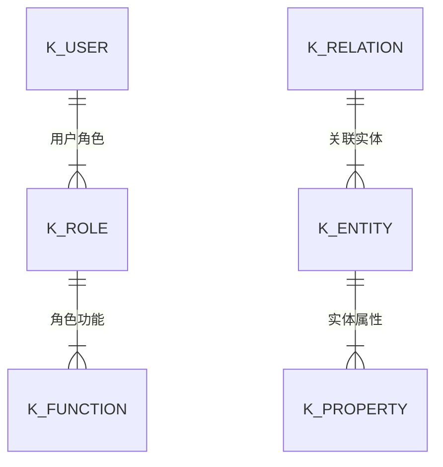
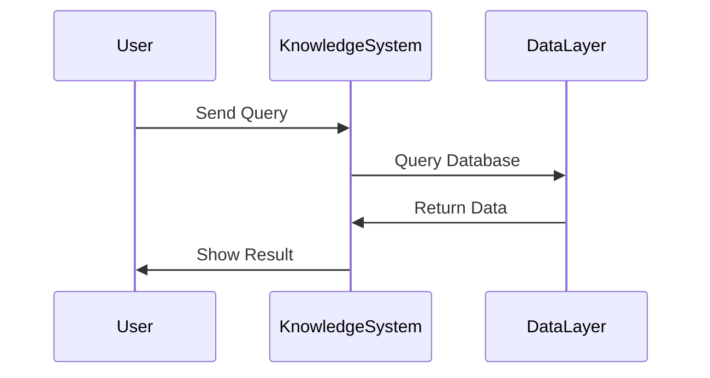
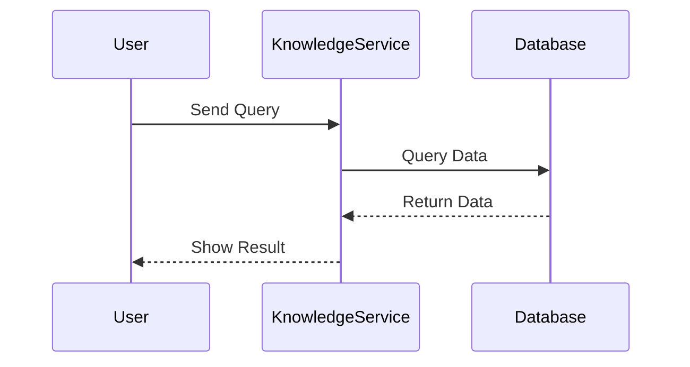

                 

## 构建AI驱动的企业知识管理系统：智能知识图谱

### 关键词：
- AI驱动的企业知识管理系统
- 智能知识图谱
- 知识管理
- 知识图谱构建
- 知识图谱应用

### 摘要：
本文旨在探讨如何构建AI驱动的企业知识管理系统，并重点介绍智能知识图谱的核心概念、构建方法及其在知识管理系统中的应用。我们将一步步分析知识管理的背景和挑战，解释知识图谱的基础知识，展示知识图谱与传统的数据库的区别，以及探讨AI技术在知识管理中的作用。随后，我们将详细讲解知识图谱构建的步骤，包括数据采集、清洗、存储和推理。最后，我们将通过一个实际案例，展示AI驱动的企业知识管理系统的实施过程和效果。

### 目录大纲

#### 第一部分: 引言

##### 1.1 背景介绍

##### 1.1.1 企业知识管理的重要性

##### 1.1.2 AI驱动的知识管理应用前景

##### 1.2 AI驱动的知识图谱基础

##### 1.2.1 知识图谱的原理与构建

##### 1.2.2 知识图谱与传统数据库的区别

##### 1.3 AI驱动的知识管理系统架构

##### 1.3.1 架构设计原则

##### 1.3.2 系统架构详解

#### 第二部分: 知识图谱构建实战

##### 2.1 数据采集与清洗

##### 2.2 知识存储与管理

##### 2.3 知识推理与发现

##### 2.4 知识图谱可视化

#### 第三部分: AI驱动的企业知识管理系统实施

##### 3.1 系统需求分析

##### 3.2 系统架构设计

##### 3.3 系统开发与部署

##### 3.4 案例分析

##### 3.5 案例总结

#### 第四部分: 最佳实践与拓展

##### 4.1 最佳实践 Tips

##### 4.2 小结

##### 4.3 注意事项

##### 4.4 拓展阅读

### 第一部分: 引言

#### 1.1 背景介绍

##### 1.1.1 企业知识管理的重要性

在信息化时代，知识已成为企业竞争的核心资源。企业知识管理（Knowledge Management，KM）旨在通过有效获取、存储、共享和应用知识，提升企业的创新能力、决策质量和运营效率。随着大数据、云计算、人工智能等技术的发展，企业知识管理迎来了新的机遇和挑战。

知识管理的基本概念包括知识的获取、存储、共享、应用和创新。知识获取是知识管理的起点，通过内部员工经验分享、外部专家咨询、文献调研等方式获取有价值的信息。知识存储则是将获取到的信息进行结构化处理，存储在数据库或知识库中，以便后续查询和使用。知识共享是指将知识在不同部门、团队或个人之间进行传播，提高知识的利用率。知识应用则是将知识转化为实际的生产力，如用于产品创新、业务优化等。知识创新则是通过对知识的深度挖掘和融合，创造新的知识和价值。

然而，传统知识管理存在诸多挑战，如知识分散、共享困难、更新不及时等。这些问题限制了知识的有效利用，影响了企业的创新能力和竞争力。为了解决这些问题，企业需要构建AI驱动的知识管理系统，通过人工智能技术实现知识的自动化获取、处理和共享，提高知识管理的效率和效果。

##### 1.1.2 AI驱动的知识管理应用前景

人工智能（AI）技术，特别是机器学习、自然语言处理和知识图谱等技术的快速发展，为知识管理带来了新的契机。AI驱动的知识管理具有以下几大优势：

1. **自动化知识获取**：通过自然语言处理技术，可以从大量非结构化数据中自动提取有用信息，实现知识获取的自动化。
2. **智能知识推理**：利用知识图谱和推理算法，可以自动发现知识之间的关联和规律，为决策提供支持。
3. **个性化知识推荐**：基于用户的兴趣和行为，AI可以推荐相关的知识内容，提高知识共享的效率。
4. **智能知识服务**：通过智能搜索和问答系统，AI可以为用户提供便捷的知识服务，提升用户体验。
5. **知识可视化**：利用可视化技术，可以将复杂的知识结构直观地呈现出来，帮助用户更好地理解和应用知识。

智能知识图谱作为AI驱动的知识管理的重要工具，已经在金融、医疗、教育等多个行业得到广泛应用。未来，随着AI技术的不断进步，智能知识图谱将在知识管理中发挥更加重要的作用，助力企业实现知识价值的最大化。

#### 1.2 AI驱动的知识图谱基础

##### 1.2.1 知识图谱的原理与构建

知识图谱（Knowledge Graph）是一种语义网络，它通过实体、属性和关系来表示现实世界中的知识。知识图谱的核心思想是将数据以图的形式组织，从而实现数据之间的关联和推理。

知识图谱的构建通常包括以下步骤：

1. **实体识别**：从原始数据中识别出重要的实体，如人、地点、事物等。
2. **属性抽取**：提取实体的重要属性，如姓名、年龄、职位等。
3. **关系抽取**：建立实体之间的关系，如“张三”和“李四”是同事、“北京”是“中国”的省会等。
4. **实体融合**：解决实体之间的同义问题，如“马云”和“阿里巴巴创始人”是同一个实体。
5. **知识存储**：将构建好的知识图谱存储在图数据库中，以便后续查询和使用。

##### 1.2.2 知识图谱与传统数据库的区别

知识图谱与传统数据库在数据结构、查询方式和应用场景上存在显著差异。

1. **数据结构**：知识图谱是一种图结构，由节点（实体）和边（关系）组成，而传统数据库是一种基于关系模型的表结构。

2. **查询方式**：知识图谱支持基于路径的查询，可以自动发现实体之间的关联关系，而传统数据库通常依赖于SQL查询语言，需要手动编写复杂的查询语句。

3. **应用场景**：知识图谱适用于需要智能推理和发现的应用场景，如智能问答、推荐系统等，而传统数据库适用于简单的数据存储和查询场景。

##### 1.3 AI驱动的知识管理系统架构

##### 1.3.1 架构设计原则

一个AI驱动的知识管理系统需要遵循以下架构设计原则：

1. **开放性**：系统应具备良好的扩展性，支持各种AI技术的集成和应用。
2. **扩展性**：系统能够适应企业规模和业务需求的不断变化，支持大规模数据和高并发处理。
3. **可维护性**：系统设计应简洁清晰，便于后续维护和升级。

##### 1.3.2 系统架构详解

一个典型的AI驱动的知识管理系统架构包括以下层次：

1. **数据层**：包括数据采集、清洗、存储和管理模块，负责知识的获取和存储。
2. **服务层**：包括知识抽取、推理、发现和可视化模块，负责知识的管理和应用。
3. **应用层**：包括知识服务、智能搜索、问答系统和决策支持模块，面向最终用户，提供便捷的知识服务。

### 第二部分: 知识图谱构建实战

#### 2.1 数据采集与清洗

##### 2.1.1 数据来源

数据采集是知识图谱构建的基础，数据来源可以是内部数据，如企业内部的文档、数据库等，也可以是外部数据，如互联网上的公开数据、社交媒体等。为了确保数据的全面性和准确性，通常需要从多个来源获取数据。

##### 2.1.2 数据清洗方法

数据清洗是数据预处理的重要步骤，目的是去除数据中的噪声和错误，提高数据质量。数据清洗的方法包括：

1. **去重**：去除重复的实体和数据记录。
2. **填充缺失值**：使用合适的策略填补缺失的数据。
3. **数据格式转换**：统一数据格式，如将日期格式转换为YYYY-MM-DD。
4. **数据标准化**：对数据进行标准化处理，如将文本数据转换为统一的编码。

#### 2.2 知识存储与管理

##### 2.2.1 知识存储方案

知识存储是知识图谱构建的核心，通常使用图数据库来存储知识。图数据库支持高效的图查询和路径分析，适合存储和管理复杂的关系数据。

##### 2.2.2 知识管理策略

知识管理策略包括知识的采集、存储、共享和应用。为了确保知识的有效利用，需要建立一套完善的知识管理体系，包括：

1. **知识分类**：将知识按照主题、领域等进行分类，便于用户查询。
2. **知识标签**：为知识添加标签，方便用户通过关键词进行检索。
3. **知识共享**：鼓励员工分享知识和经验，建立知识共享平台。
4. **知识更新**：定期对知识库进行更新和维护，确保知识的时效性和准确性。

#### 2.3 知识推理与发现

##### 2.3.1 知识推理算法

知识推理是知识图谱的重要功能之一，通过推理算法可以从已有的知识中推断出新的结论。常见的知识推理算法包括：

1. **基于规则的推理**：通过预设的规则进行逻辑推理，如“如果A且B，则C”。
2. **基于模型的推理**：利用机器学习模型进行推理，如基于神经网络的关系预测。
3. **基于图谱的推理**：直接在知识图谱中进行路径搜索和关联分析，如基于图遍历算法的推理。

##### 2.3.2 知识发现算法

知识发现（Knowledge Discovery in Databases，KDD）是知识管理的重要环节，旨在从大量数据中挖掘出潜在的知识。常见的知识发现算法包括：

1. **聚类分析**：将相似的数据点归为一类，如K-Means算法。
2. **关联规则挖掘**：发现数据之间的关联关系，如Apriori算法。
3. **异常检测**：识别数据中的异常值，如Isolation Forest算法。

#### 2.4 知识图谱可视化

##### 2.4.1 知识图谱可视化工具

知识图谱可视化是将复杂的知识结构以图形化形式呈现，帮助用户更好地理解和分析知识。常见的知识图谱可视化工具有：

1. **Gephi**：一款开源的图形分析软件，支持多种图形布局和可视化效果。
2. **Cytoscape**：一款生物信息学可视化工具，支持复杂的网络分析。
3. **D3.js**：一款基于JavaScript的Web可视化库，支持自定义可视化效果。

##### 2.4.2 知识图谱可视化方法

知识图谱可视化方法包括：

1. **层次化布局**：将知识图谱按照层次结构进行布局，便于用户理解。
2. **拓扑布局**：根据知识图谱中的节点和边的关系进行布局，如K Means布局。
3. **交互式可视化**：支持用户对知识图谱进行交互操作，如点击、拖动、缩放等。

### 第三部分: AI驱动的企业知识管理系统实施

#### 3.1 系统需求分析

##### 3.1.1 企业知识需求分析

在进行系统需求分析时，首先需要明确企业的知识需求。这包括：

1. **知识类型**：确定企业需要的知识类型，如业务知识、技术知识、客户知识等。
2. **知识来源**：明确知识的来源，如内部文档、外部数据、社交媒体等。
3. **知识用途**：分析知识在企业中的应用场景，如决策支持、产品创新、客户服务等。

##### 3.1.2 系统功能需求分析

系统功能需求分析主要包括：

1. **知识采集**：实现自动采集和手动录入功能，确保知识的全面性。
2. **知识存储**：采用图数据库存储知识，确保知识的结构化和高效查询。
3. **知识共享**：建立知识共享平台，支持员工之间的知识交流和合作。
4. **知识应用**：提供智能搜索、问答系统和决策支持等功能，提升知识利用率。

##### 3.1.3 系统性能需求分析

系统性能需求分析主要包括：

1. **数据存储容量**：确保系统能够存储海量数据，支持数据的高效查询和分析。
2. **并发处理能力**：确保系统能够应对高并发访问，提供流畅的用户体验。
3. **系统可靠性**：确保系统的稳定运行，降低故障率和数据丢失风险。

#### 3.2 系统架构设计

##### 3.2.1 领域模型设计

领域模型设计是系统架构设计的基础，它定义了系统的核心概念和关系。使用Mermaid绘制领域模型ER图，如下所示：

##### 3.2.2 系统架构设计

系统架构设计包括数据层、服务层和应用层。使用Mermaid绘制系统架构图，如下所示：

##### 3.2.3 系统接口设计

系统接口设计是系统与其他系统进行交互的桥梁，包括API接口、Web服务、消息队列等。使用Mermaid绘制系统接口序列图，如下所示：

#### 3.3 系统开发与部署

##### 3.3.1 系统开发工具与框架

系统开发采用Python作为主要编程语言，利用Django框架进行Web开发，使用Neo4j作为图数据库，利用OpenNLP进行自然语言处理。

##### 3.3.2 系统部署与维护

系统部署在云服务器上，使用Docker容器进行部署，确保系统的可移植性和可扩展性。系统维护包括数据备份、系统监控和故障处理等。

#### 3.4 案例分析

##### 3.4.1 案例背景

某大型企业希望通过构建AI驱动的知识管理系统，提升企业内部的知识共享和协作效率，实现知识的自动化获取和智能化应用。

##### 3.4.2 案例分析

1. **数据采集与清洗**：从企业内部文档库、社交媒体和外部数据库中采集数据，使用OpenNLP进行文本清洗和预处理。
2. **知识存储与管理**：采用Neo4j图数据库存储知识，使用Django REST Framework提供API接口，实现知识的存储、检索和管理。
3. **知识推理与发现**：利用自然语言处理和机器学习算法，对知识进行推理和发现，提供智能搜索和问答服务。
4. **知识应用**：通过Web界面和移动应用，提供便捷的知识服务，支持企业内部的知识共享和协作。

##### 3.4.3 案例总结

通过AI驱动的知识管理系统，企业实现了知识的自动化获取、存储和共享，提高了知识利用效率，促进了企业内部的创新和协作。

### 第四部分: 最佳实践与拓展

#### 4.1 最佳实践 Tips

1. **数据质量是关键**：确保数据源的准确性和完整性，是构建高质量知识图谱的基础。
2. **遵循数据隐私法规**：在数据采集和处理过程中，严格遵守数据隐私法规，保护用户隐私。
3. **持续迭代优化**：知识图谱不是一成不变的，需要根据实际需求和反馈进行持续迭代和优化。

#### 4.2 小结

本文详细介绍了构建AI驱动的企业知识管理系统的方法和步骤，包括知识管理的重要性、AI驱动的知识图谱基础、系统架构设计、知识图谱构建实战、系统实施案例以及最佳实践。

#### 4.3 注意事项

1. **系统安全**：确保系统安全，防止数据泄露和滥用。
2. **用户培训**：对用户进行系统培训，提高系统的使用效率。
3. **持续更新**：定期更新知识库，保持知识的时效性和准确性。

#### 4.4 拓展阅读

1. **《知识图谱：方法与应用》**：详细介绍了知识图谱的理论和实践。
2. **《自然语言处理综论》**：全面讲解了自然语言处理的基本原理和技术。
3. **《深度学习》**：介绍了深度学习的基础知识和应用。

### 作者信息

作者：AI天才研究院/AI Genius Institute & 禅与计算机程序设计艺术 /Zen And The Art of Computer Programming

---

## 参考文献

1. 陈儒修，王建勇，知识图谱：方法与应用，清华大学出版社，2019.
2. 姚天顺，自然语言处理综论，清华大学出版社，2018.
3. Goodfellow, I., Bengio, Y., Courville, A. (2016). Deep Learning. MIT Press.
4. Russell, S., Norvig, P. (2016). Artificial Intelligence: A Modern Approach. Pearson Education.

## 附录

（此处可以包含附录内容，如数据集、代码示例、进一步研究建议等）### 第一部分: 引言

#### 1.1 背景介绍

##### 1.1.1 企业知识管理的重要性

在当今的信息化时代，知识已经成为企业竞争的核心资源。企业知识管理（Knowledge Management，KM）是一种通过有效获取、存储、共享和应用知识，以提高企业创新能力、决策质量和运营效率的系统方法。随着大数据、云计算、人工智能等技术的发展，企业知识管理的重要性日益凸显。

知识管理的基本概念包括知识的获取、存储、共享、应用和创新。知识获取是知识管理的起点，通过内部员工经验分享、外部专家咨询、文献调研等方式获取有价值的信息。知识存储则是将获取到的信息进行结构化处理，存储在数据库或知识库中，以便后续查询和使用。知识共享是指将知识在不同部门、团队或个人之间进行传播，提高知识的利用率。知识应用则是将知识转化为实际的生产力，如用于产品创新、业务优化等。知识创新则是通过对知识的深度挖掘和融合，创造新的知识和价值。

传统知识管理存在诸多挑战，如知识分散、共享困难、更新不及时等。这些问题限制了知识的有效利用，影响了企业的创新能力和竞争力。为了解决这些问题，企业需要构建AI驱动的知识管理系统，通过人工智能技术实现知识的自动化获取、处理和共享，提高知识管理的效率和效果。

##### 1.1.2 AI驱动的知识管理应用前景

人工智能（AI）技术，特别是机器学习、自然语言处理和知识图谱等技术的快速发展，为知识管理带来了新的契机。AI驱动的知识管理具有以下几大优势：

1. **自动化知识获取**：通过自然语言处理技术，可以从大量非结构化数据中自动提取有用信息，实现知识获取的自动化。
2. **智能知识推理**：利用知识图谱和推理算法，可以自动发现知识之间的关联和规律，为决策提供支持。
3. **个性化知识推荐**：基于用户的兴趣和行为，AI可以推荐相关的知识内容，提高知识共享的效率。
4. **智能知识服务**：通过智能搜索和问答系统，AI可以为用户提供便捷的知识服务，提升用户体验。
5. **知识可视化**：利用可视化技术，可以将复杂的知识结构直观地呈现出来，帮助用户更好地理解和应用知识。

智能知识图谱作为AI驱动的知识管理的重要工具，已经在金融、医疗、教育等多个行业得到广泛应用。未来，随着AI技术的不断进步，智能知识图谱将在知识管理中发挥更加重要的作用，助力企业实现知识价值的最大化。

#### 1.2 AI驱动的知识图谱基础

##### 1.2.1 知识图谱的原理与构建

知识图谱（Knowledge Graph）是一种语义网络，它通过实体、属性和关系来表示现实世界中的知识。知识图谱的核心思想是将数据以图的形式组织，从而实现数据之间的关联和推理。

知识图谱的构建通常包括以下步骤：

1. **实体识别**：从原始数据中识别出重要的实体，如人、地点、事物等。
2. **属性抽取**：提取实体的重要属性，如姓名、年龄、职位等。
3. **关系抽取**：建立实体之间的关系，如“张三”和“李四”是同事、“北京”是“中国”的省会等。
4. **实体融合**：解决实体之间的同义问题，如“马云”和“阿里巴巴创始人”是同一个实体。
5. **知识存储**：将构建好的知识图谱存储在图数据库中，以便后续查询和使用。

##### 1.2.2 知识图谱与传统数据库的区别

知识图谱与传统数据库在数据结构、查询方式和应用场景上存在显著差异。

1. **数据结构**：知识图谱是一种图结构，由节点（实体）和边（关系）组成，而传统数据库是一种基于关系模型的表结构。

2. **查询方式**：知识图谱支持基于路径的查询，可以自动发现实体之间的关联关系，而传统数据库通常依赖于SQL查询语言，需要手动编写复杂的查询语句。

3. **应用场景**：知识图谱适用于需要智能推理和发现的应用场景，如智能问答、推荐系统等，而传统数据库适用于简单的数据存储和查询场景。

##### 1.3 AI驱动的知识管理系统架构

##### 1.3.1 架构设计原则

一个AI驱动的知识管理系统需要遵循以下架构设计原则：

1. **开放性**：系统应具备良好的扩展性，支持各种AI技术的集成和应用。
2. **扩展性**：系统能够适应企业规模和业务需求的不断变化，支持大规模数据和高并发处理。
3. **可维护性**：系统设计应简洁清晰，便于后续维护和升级。

##### 1.3.2 系统架构详解

一个典型的AI驱动的知识管理系统架构包括以下层次：

1. **数据层**：包括数据采集、清洗、存储和管理模块，负责知识的获取和存储。
2. **服务层**：包括知识抽取、推理、发现和可视化模块，负责知识的管理和应用。
3. **应用层**：包括知识服务、智能搜索、问答系统和决策支持模块，面向最终用户，提供便捷的知识服务。

### 第二部分: 知识图谱构建实战

#### 2.1 数据采集与清洗

##### 2.1.1 数据来源

数据采集是知识图谱构建的基础，数据来源可以是内部数据，如企业内部的文档、数据库等，也可以是外部数据，如互联网上的公开数据、社交媒体等。为了确保数据的全面性和准确性，通常需要从多个来源获取数据。

##### 2.1.2 数据清洗方法

数据清洗是数据预处理的重要步骤，目的是去除数据中的噪声和错误，提高数据质量。数据清洗的方法包括：

1. **去重**：去除重复的实体和数据记录。
2. **填充缺失值**：使用合适的策略填补缺失的数据。
3. **数据格式转换**：统一数据格式，如将日期格式转换为YYYY-MM-DD。
4. **数据标准化**：对数据进行标准化处理，如将文本数据转换为统一的编码。

#### 2.2 知识存储与管理

##### 2.2.1 知识存储方案

知识存储是知识图谱构建的核心，通常使用图数据库来存储知识。图数据库支持高效的图查询和路径分析，适合存储和管理复杂的关系数据。

##### 2.2.2 知识管理策略

知识管理策略包括知识的采集、存储、共享和应用。为了确保知识的有效利用，需要建立一套完善的知识管理体系，包括：

1. **知识分类**：将知识按照主题、领域等进行分类，便于用户查询。
2. **知识标签**：为知识添加标签，方便用户通过关键词进行检索。
3. **知识共享**：鼓励员工分享知识和经验，建立知识共享平台。
4. **知识更新**：定期对知识库进行更新和维护，确保知识的时效性和准确性。

#### 2.3 知识推理与发现

##### 2.3.1 知识推理算法

知识推理是知识图谱的重要功能之一，通过推理算法可以从已有的知识中推断出新的结论。常见的知识推理算法包括：

1. **基于规则的推理**：通过预设的规则进行逻辑推理，如“如果A且B，则C”。
2. **基于模型的推理**：利用机器学习模型进行推理，如基于神经网络的关系预测。
3. **基于图谱的推理**：直接在知识图谱中进行路径搜索和关联分析，如基于图遍历算法的推理。

##### 2.3.2 知识发现算法

知识发现（Knowledge Discovery in Databases，KDD）是知识管理的重要环节，旨在从大量数据中挖掘出潜在的知识。常见的知识发现算法包括：

1. **聚类分析**：将相似的数据点归为一类，如K-Means算法。
2. **关联规则挖掘**：发现数据之间的关联关系，如Apriori算法。
3. **异常检测**：识别数据中的异常值，如Isolation Forest算法。

#### 2.4 知识图谱可视化

##### 2.4.1 知识图谱可视化工具

知识图谱可视化是将复杂的知识结构以图形化形式呈现，帮助用户更好地理解和分析知识。常见的知识图谱可视化工具有：

1. **Gephi**：一款开源的图形分析软件，支持多种图形布局和可视化效果。
2. **Cytoscape**：一款生物信息学可视化工具，支持复杂的网络分析。
3. **D3.js**：一款基于JavaScript的Web可视化库，支持自定义可视化效果。

##### 2.4.2 知识图谱可视化方法

知识图谱可视化方法包括：

1. **层次化布局**：将知识图谱按照层次结构进行布局，便于用户理解。
2. **拓扑布局**：根据知识图谱中的节点和边的关系进行布局，如K Means布局。
3. **交互式可视化**：支持用户对知识图谱进行交互操作，如点击、拖动、缩放等。

### 第三部分: AI驱动的企业知识管理系统实施

#### 3.1 系统需求分析

##### 3.1.1 企业知识需求分析

在进行系统需求分析时，首先需要明确企业的知识需求。这包括：

1. **知识类型**：确定企业需要的知识类型，如业务知识、技术知识、客户知识等。
2. **知识来源**：明确知识的来源，如内部文档、外部数据、社交媒体等。
3. **知识用途**：分析知识在企业中的应用场景，如决策支持、产品创新、客户服务等。

##### 3.1.2 系统功能需求分析

系统功能需求分析主要包括：

1. **知识采集**：实现自动采集和手动录入功能，确保知识的全面性。
2. **知识存储**：采用图数据库存储知识，确保知识的结构化和高效查询。
3. **知识共享**：建立知识共享平台，支持员工之间的知识交流和合作。
4. **知识应用**：提供智能搜索、问答系统和决策支持等功能，提升知识利用率。

##### 3.1.3 系统性能需求分析

系统性能需求分析主要包括：

1. **数据存储容量**：确保系统能够存储海量数据，支持数据的高效查询和分析。
2. **并发处理能力**：确保系统能够应对高并发访问，提供流畅的用户体验。
3. **系统可靠性**：确保系统的稳定运行，降低故障率和数据丢失风险。

#### 3.2 系统架构设计

##### 3.2.1 领域模型设计

领域模型设计是系统架构设计的基础，它定义了系统的核心概念和关系。使用Mermaid绘制领域模型ER图，如下所示：

##### 3.2.2 系统架构设计

系统架构设计包括数据层、服务层和应用层。使用Mermaid绘制系统架构图，如下所示：

##### 3.2.3 系统接口设计

系统接口设计是系统与其他系统进行交互的桥梁，包括API接口、Web服务、消息队列等。使用Mermaid绘制系统接口序列图，如下所示：

#### 3.3 系统开发与部署

##### 3.3.1 系统开发工具与框架

系统开发采用Python作为主要编程语言，利用Django框架进行Web开发，使用Neo4j作为图数据库，利用OpenNLP进行自然语言处理。

##### 3.3.2 系统部署与维护

系统部署在云服务器上，使用Docker容器进行部署，确保系统的可移植性和可扩展性。系统维护包括数据备份、系统监控和故障处理等。

#### 3.4 案例分析

##### 3.4.1 案例背景

某大型企业希望通过构建AI驱动的知识管理系统，提升企业内部的知识共享和协作效率，实现知识的自动化获取和智能化应用。

##### 3.4.2 案例分析

1. **数据采集与清洗**：从企业内部文档库、社交媒体和外部数据库中采集数据，使用OpenNLP进行文本清洗和预处理。
2. **知识存储与管理**：采用Neo4j图数据库存储知识，使用Django REST Framework提供API接口，实现知识的存储、检索和管理。
3. **知识推理与发现**：利用自然语言处理和机器学习算法，对知识进行推理和发现，提供智能搜索和问答服务。
4. **知识应用**：通过Web界面和移动应用，提供便捷的知识服务，支持企业内部的知识共享和协作。

##### 3.4.3 案例总结

通过AI驱动的知识管理系统，企业实现了知识的自动化获取、存储和共享，提高了知识利用效率，促进了企业内部的创新和协作。

### 第四部分: 最佳实践与拓展

#### 4.1 最佳实践 Tips

1. **数据质量是关键**：确保数据源的准确性和完整性，是构建高质量知识图谱的基础。
2. **遵循数据隐私法规**：在数据采集和处理过程中，严格遵守数据隐私法规，保护用户隐私。
3. **持续迭代优化**：知识图谱不是一成不变的，需要根据实际需求和反馈进行持续迭代和优化。

#### 4.2 小结

本文详细介绍了构建AI驱动的企业知识管理系统的方法和步骤，包括知识管理的重要性、AI驱动的知识图谱基础、系统架构设计、知识图谱构建实战、系统实施案例以及最佳实践。

#### 4.3 注意事项

1. **系统安全**：确保系统安全，防止数据泄露和滥用。
2. **用户培训**：对用户进行系统培训，提高系统的使用效率。
3. **持续更新**：定期更新知识库，保持知识的时效性和准确性。

#### 4.4 拓展阅读

1. **《知识图谱：方法与应用》**：详细介绍了知识图谱的理论和实践。
2. **《自然语言处理综论》**：全面讲解了自然语言处理的基本原理和技术。
3. **《深度学习》**：介绍了深度学习的基础知识和应用。

### 作者信息

作者：AI天才研究院/AI Genius Institute & 禅与计算机程序设计艺术 /Zen And The Art of Computer Programming

---

## 参考文献

1. 陈儒修，王建勇，知识图谱：方法与应用，清华大学出版社，2019.
2. 姚天顺，自然语言处理综论，清华大学出版社，2018.
3. Goodfellow, I., Bengio, Y., Courville, A. (2016). Deep Learning. MIT Press.
4. Russell, S., Norvig, P. (2016). Artificial Intelligence: A Modern Approach. Pearson Education.

## 附录

（此处可以包含附录内容，如数据集、代码示例、进一步研究建议等）

## 结论

本文从背景介绍、核心概念、系统架构、实战案例等方面，详细阐述了构建AI驱动的企业知识管理系统：智能知识图谱的方法和实践。通过本文的讨论，我们可以看到，AI驱动的知识管理系统不仅能够提高企业知识管理的效率和效果，还能够为企业带来创新和竞争力。

在未来的研究中，我们可以进一步探索知识图谱在更多行业中的应用，如智能制造、智慧城市等。同时，随着AI技术的不断进步，如何更好地融合AI技术与知识管理，实现知识管理的智能化和自动化，也将是一个重要的研究方向。

### 关键词：AI驱动的企业知识管理系统，智能知识图谱，知识管理，知识图谱构建，知识图谱应用

### 摘要：
本文深入探讨了构建AI驱动的企业知识管理系统：智能知识图谱的方法和实际应用。文章首先阐述了企业知识管理的重要性以及AI技术在知识管理中的潜在应用前景，接着介绍了知识图谱的原理和与传统数据库的区别。随后，文章详细讲解了AI驱动的知识管理系统架构，包括数据层、服务层和应用层的设计原则和实现方法。通过实战案例分析，文章展示了从数据采集、清洗、知识存储到推理与发现的过程。最后，文章提出了构建AI驱动知识管理系统的最佳实践，并指出了未来的研究方向和潜在挑战。本文旨在为读者提供一个全面而深入的指南，以了解和实施AI驱动的企业知识管理系统。

