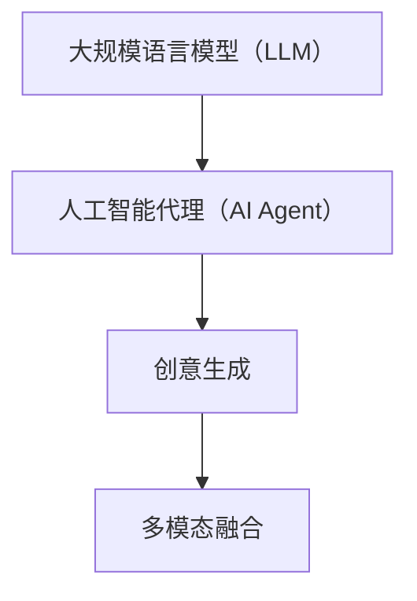
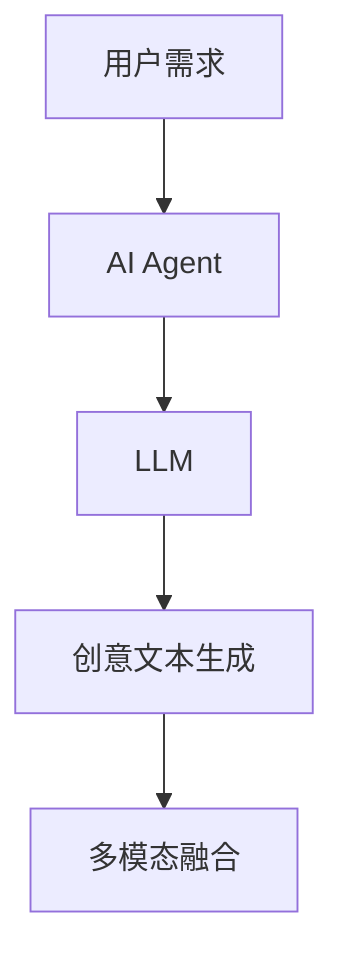
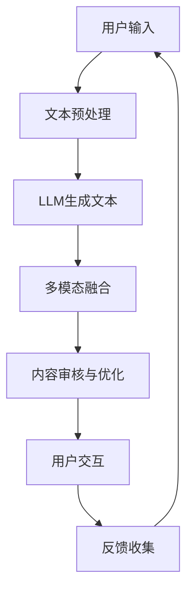
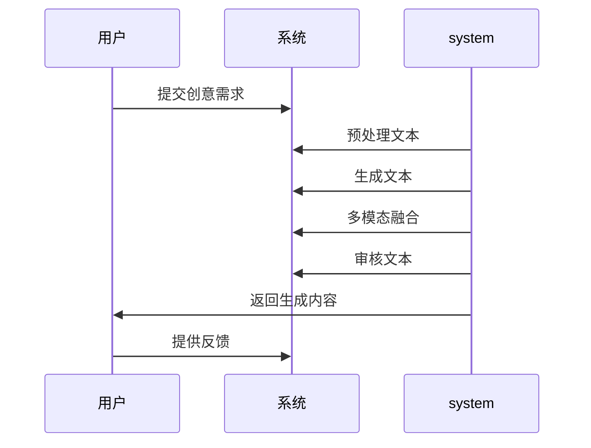
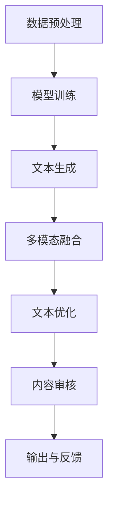

                 

### 文章标题

“构建LLM支持的AI Agent创意生成系统”是一篇深度探讨如何利用大规模语言模型（LLM）来支持人工智能代理（AI Agent）进行创意生成的技术文章。文章将从核心概念、系统设计与实现、算法原理讲解、项目实战等多个方面，逐步深入剖析这一前沿技术领域。

### 文章关键词

- LLM（大规模语言模型）
- AI Agent（人工智能代理）
- 创意生成
- 系统设计与实现
- 算法原理

### 摘要

本文旨在通过系统性地构建LLM支持的AI Agent创意生成系统，为研究者和技术从业者提供一套完整的解决方案。文章首先介绍LLM和AI Agent的基本概念与原理，随后详细讨论创意生成系统的基础架构和实现方法。接着，文章将讲解核心算法原理，并通过具体的代码示例和数学模型来阐述。最后，文章将结合实际项目，介绍环境安装、系统实现及案例分析，并对未来发展方向和最佳实践进行总结与展望。

## 第一部分：引言与背景

### 第1章：问题的提出

#### 1.1.1 研究背景

随着人工智能（AI）技术的迅猛发展，大规模语言模型（LLM）已经成为自然语言处理（NLP）领域的重要工具。LLM通过学习海量的文本数据，能够生成高质量的自然语言文本，广泛应用于机器翻译、文本生成、对话系统等领域。与此同时，人工智能代理（AI Agent）作为智能体的代表，通过自主学习和决策，可以执行复杂的任务，并与人或系统进行交互。然而，如何将LLM与AI Agent有机结合，形成一个高效的创意生成系统，仍是一个极具挑战性的问题。

#### 1.1.2 研究问题与目标

本文的研究问题是：如何利用大规模语言模型（LLM）支持人工智能代理（AI Agent）进行创意生成？研究目标是构建一个高效、可靠的LLM支持的AI Agent创意生成系统，实现以下功能：

1. **创意生成**：利用LLM生成具有创意性的文本内容。
2. **智能交互**：AI Agent能够理解用户需求，并生成与之相关的创意内容。
3. **多模态融合**：支持文本、图像等多种输入和输出方式，实现创意生成的多样性。
4. **可扩展性**：系统设计应具备良好的扩展性，能够适应不同的应用场景。

#### 1.1.3 边界与外延

本文的研究边界主要聚焦于以下方面：

1. **技术范围**：主要研究基于LLM的创意生成算法及其与AI Agent的融合。
2. **应用范围**：以文本创意生成为核心，探讨其在不同领域（如广告、设计、写作等）的应用。
3. **数据处理**：仅考虑公开可获得的数据集和工具，不涉及隐私数据和未公开的数据集。

#### 1.1.4 核心概念与联系

在本节中，我们将介绍本文涉及的核心概念，并探讨它们之间的关系。

- **大规模语言模型（LLM）**：一种能够生成自然语言文本的深度学习模型，通过预训练和微调，能够理解并生成复杂语义的文本。
- **人工智能代理（AI Agent）**：一种能够模拟人类智能行为的计算机程序，通过自主学习、决策和执行任务，实现与环境的交互。
- **创意生成**：指生成具有创新性和创意性的文本内容，通常涉及文本生成、故事编写、广告文案等。
- **多模态融合**：指将不同类型的数据（如文本、图像、声音等）进行整合，以生成更丰富、更具创意的内容。

图1-1展示了这些核心概念之间的联系。



## 第2章：核心概念与原理

### 2.1.1 LLM与AI Agent概述

#### 2.1.1.1 LLM概述

大规模语言模型（LLM）是一种基于深度学习的自然语言处理模型，通过在海量文本数据上进行预训练，能够捕捉语言的复杂结构和语义信息。LLM的核心优势在于其强大的文本生成能力，可以生成高质量、符合语法和语义规则的自然语言文本。LLM的主要应用场景包括文本生成、机器翻译、对话系统等。

#### 2.1.1.2 AI Agent概述

人工智能代理（AI Agent）是一种模拟人类智能行为的计算机程序，通过自主学习、决策和执行任务，实现与环境的交互。AI Agent的核心目标是在特定环境中实现最优行动策略，以完成特定任务。AI Agent的主要应用场景包括自动驾驶、智能客服、推荐系统等。

#### 2.1.1.3 LLM与AI Agent的关联与融合

LLM和AI Agent在功能上具有互补性。LLM擅长生成高质量的自然语言文本，而AI Agent则擅长在复杂环境中进行决策和任务执行。将LLM与AI Agent结合，可以形成一个强大的创意生成系统，实现以下目标：

1. **创意文本生成**：利用LLM生成具有创意性的文本内容，为AI Agent提供创意灵感。
2. **智能交互**：AI Agent可以理解用户需求，并利用LLM生成的创意文本与用户进行交互。
3. **多模态融合**：AI Agent可以整合不同类型的数据（如文本、图像、声音等），生成丰富、多样的创意内容。

图2-1展示了LLM与AI Agent在创意生成系统中的关联与融合。



### 2.1.2 LLM的基本原理与特点

#### 2.1.2.1 LLM的基本原理

LLM的基本原理基于深度学习和自然语言处理技术。具体来说，LLM通过以下步骤进行训练和生成：

1. **数据预处理**：对文本数据（如语料库）进行清洗、分词、标记等预处理操作，生成训练数据集。
2. **模型训练**：使用预训练算法（如GPT、BERT等），在大量文本数据上进行训练，优化模型参数。
3. **文本生成**：在训练好的模型基础上，利用自回归语言模型（ARLM）生成文本。

#### 2.1.2.2 LLM的特点

LLM具有以下主要特点：

1. **强大文本生成能力**：LLM能够生成高质量、符合语法和语义规则的自然语言文本。
2. **自适应性与灵活性**：LLM能够根据输入的上下文自适应地生成文本，具备较强的灵活性。
3. **可扩展性**：LLM可以轻松扩展到不同的语言和应用场景，具备较强的通用性。
4. **鲁棒性**：LLM具有较强的鲁棒性，能够在噪声和错误数据下生成高质量的文本。

### 2.1.3 AI Agent的基本原理与特点

#### 2.1.3.1 AI Agent的基本原理

AI Agent的基本原理基于强化学习（RL）和规划（Planning）技术。具体来说，AI Agent通过以下步骤进行学习和决策：

1. **环境建模**：构建环境模型，包括状态空间、行动空间和奖励函数等。
2. **策略学习**：通过强化学习或规划算法，学习最优行动策略。
3. **决策与执行**：在给定状态下，根据学习到的策略进行决策，并执行相应行动。

#### 2.1.3.2 AI Agent的特点

AI Agent具有以下主要特点：

1. **自主性**：AI Agent能够自主地学习、决策和执行任务，无需人工干预。
2. **灵活性**：AI Agent能够适应不同的环境和任务，具备较强的灵活性。
3. **效率性**：AI Agent能够高效地完成任务，优化资源利用和决策时间。
4. **智能性**：AI Agent具备一定的智能性，能够模拟人类智能行为，实现复杂任务。

### 2.1.4 LLM与AI Agent的关联与融合

LLM与AI Agent在功能上具有互补性，将二者结合可以形成一个强大的创意生成系统。LLM擅长生成高质量的自然语言文本，而AI Agent则擅长在复杂环境中进行决策和任务执行。具体来说，LLM可以为AI Agent提供创意文本生成能力，而AI Agent则可以理解用户需求，并利用LLM生成的创意文本与用户进行交互。

图2-2展示了LLM与AI Agent在创意生成系统中的关联与融合。


## 第3章：创意生成系统概述

### 3.1.1 创意生成系统的定义与分类

#### 3.1.1.1 创意生成系统的定义

创意生成系统是指一种利用人工智能技术，特别是大规模语言模型（LLM），生成具有创意性和创新性的文本内容的系统。它通常包括文本生成、内容审核、多模态融合等功能，旨在帮助用户或应用程序自动生成各种类型的创意内容，如广告文案、故事情节、设计灵感等。

#### 3.1.1.2 创意生成系统的分类

创意生成系统可以根据不同的分类标准进行分类。以下是几种常见的分类方式：

1. **根据生成类型分类**：
   - **文本生成系统**：专注于生成高质量的文本内容，如广告文案、新闻报道、故事等。
   - **图像生成系统**：利用生成对抗网络（GAN）等技术生成逼真的图像内容。
   - **音频生成系统**：生成音乐、语音等音频内容。
   - **多模态生成系统**：同时生成文本、图像、音频等多种类型的内容。

2. **根据应用场景分类**：
   - **广告创意生成**：为广告行业提供创意性的广告文案和视觉效果。
   - **内容创作**：帮助内容创作者生成原创的文章、故事、剧本等。
   - **设计灵感生成**：为设计师提供创意性的设计元素和灵感。
   - **教育与培训**：生成教学材料、培训课程内容等。

3. **根据技术架构分类**：
   - **基于规则的系统**：利用预定义的规则和模板生成内容。
   - **基于数据的系统**：通过机器学习算法从大量数据中学习生成策略。
   - **混合系统**：结合规则和数据驱动的方法，以提高生成内容的多样性和质量。

### 3.1.2 创意生成系统的基本原理

创意生成系统的基本原理主要涉及以下几个关键组成部分：

1. **数据输入**：系统首先需要接收用户输入或从数据源中获取相关内容，如广告文案的提示信息、设计灵感的描述等。

2. **文本预处理**：对输入的文本内容进行清洗、分词、词性标注等预处理操作，以便更好地理解文本内容。

3. **模型选择与训练**：根据创意生成任务的需求，选择合适的文本生成模型（如GPT、BERT等）进行训练。模型训练通常涉及预训练和微调两个阶段。

4. **文本生成**：利用训练好的模型生成创意性的文本内容。生成过程中，模型会根据输入的上下文和提示信息，生成连贯、有创意的文本。

5. **内容审核与优化**：生成的文本内容通常需要经过审核和优化，以确保内容的合规性、准确性和可读性。

6. **输出与反馈**：将生成的创意文本内容输出给用户，并收集用户的反馈，用于模型优化和迭代。

### 3.1.3 创意生成系统的关键要素

一个高效的创意生成系统需要以下关键要素的支持：

1. **数据集**：丰富的、高质量的训练数据集是构建高效创意生成系统的关键。数据集应该涵盖各种主题、风格和难度，以支持模型在不同场景下的泛化能力。

2. **模型架构**：选择合适的模型架构对于创意生成系统的性能至关重要。常见的文本生成模型包括GPT、BERT、T5等，每种模型都有其独特的优势和适用场景。

3. **生成算法**：生成算法决定了文本生成的质量和效率。自回归语言模型（ARLM）是常见的生成算法，通过递归地预测下一个单词或字符，生成连贯的文本。

4. **多模态融合**：创意生成系统可以通过多模态融合，生成更丰富、更具创意的内容。例如，将文本与图像、声音等其他类型的数据进行结合，以产生新的创意灵感。

5. **用户交互**：创意生成系统需要提供良好的用户交互界面，使用户能够轻松地输入需求、查看生成内容，并提供反馈。

6. **优化与迭代**：通过不断优化模型和算法，以及收集用户反馈，创意生成系统可以持续提升生成内容的多样性和质量。

### 3.1.4 创意生成系统的应用场景

创意生成系统在多个领域具有广泛的应用场景：

1. **广告行业**：广告公司可以利用创意生成系统自动生成广告文案、广告图像等，提高广告创意的多样性和质量。

2. **内容创作**：内容创作者可以利用创意生成系统生成原创的文章、故事、剧本等，节省创作时间，提高创作效率。

3. **设计领域**：设计师可以利用创意生成系统生成创意性的设计元素，如海报、广告牌、服装设计等。

4. **教育与培训**：教育机构可以利用创意生成系统生成教学材料、培训课程内容等，丰富教学内容，提高教学质量。

5. **游戏开发**：游戏开发人员可以利用创意生成系统生成游戏剧情、角色背景故事等，增加游戏的可玩性和创意性。

6. **艺术创作**：艺术家可以利用创意生成系统生成独特的艺术作品，探索新的艺术风格和表现形式。

总之，创意生成系统作为一种新兴的人工智能技术，具有广阔的应用前景和巨大的潜力。通过不断优化和拓展，创意生成系统有望在更多领域发挥重要作用，为人类创造更多的价值。

## 第二部分：LLM支持的AI Agent创意生成系统设计与实现

### 第4章：系统设计与架构

#### 4.1.1 系统功能设计

创意生成系统需要实现以下几个核心功能：

1. **用户输入处理**：接收用户的创意需求，包括文本、图像或其他类型的输入。
2. **文本生成**：利用大规模语言模型（LLM）生成创意性的文本内容。
3. **多模态融合**：整合文本、图像等多种数据类型，生成更具创意性的内容。
4. **内容审核与优化**：确保生成的内容符合规范，并进行必要的优化。
5. **用户交互**：提供友好的用户界面，方便用户输入需求、查看生成内容，并提供反馈。

#### 4.1.2 系统架构设计

创意生成系统的整体架构设计如图4-1所示：



具体模块的功能如下：

1. **文本预处理模块**：负责对用户输入的文本进行清洗、分词、词性标注等处理，为后续生成步骤做好准备。
2. **LLM生成文本模块**：利用预训练的LLM模型，根据用户输入生成创意性的文本内容。
3. **多模态融合模块**：将文本与图像、音频等其他类型的数据进行整合，生成更丰富的创意内容。
4. **内容审核与优化模块**：对生成的文本内容进行审核，确保内容合规，并进行优化，提高文本质量。
5. **用户交互模块**：提供用户界面，实现用户与系统的交互，包括输入需求、查看生成内容、提供反馈等。
6. **反馈收集模块**：收集用户反馈，用于模型优化和系统迭代。

#### 4.1.3 系统接口设计

系统接口设计主要包括以下部分：

1. **用户输入接口**：允许用户通过文本框、文件上传等方式提交创意需求。
2. **文本生成接口**：提供API接口，供其他系统或应用程序调用文本生成功能。
3. **多模态融合接口**：允许其他系统或应用程序上传图像、音频等数据，用于多模态融合。
4. **内容审核接口**：提供API接口，供其他系统或应用程序调用内容审核功能。
5. **用户反馈接口**：允许用户提交对生成内容的评价和建议。

#### 4.1.4 系统交互

系统交互流程如图4-2所示：



交互流程包括以下几个步骤：

1. 用户提交创意需求。
2. 系统对用户输入进行预处理。
3. 利用LLM生成创意文本。
4. 将文本与图像、音频等多模态数据融合。
5. 对生成内容进行审核。
6. 将生成内容返回给用户。
7. 用户提供反馈，用于模型优化和系统迭代。

### 第5章：算法原理讲解

#### 5.1.1 创意生成算法概述

创意生成算法是创意生成系统的核心组成部分，负责生成具有创意性和创新性的文本内容。在本文中，我们将主要介绍基于大规模语言模型（LLM）的创意生成算法。

#### 5.1.2 LLM在创意生成中的应用

大规模语言模型（LLM）通过预训练和微调，能够捕捉语言的复杂结构和语义信息，从而生成高质量的自然语言文本。LLM在创意生成中的应用主要包括以下几个方面：

1. **文本生成**：LLM可以直接生成创意性的文本内容，如广告文案、故事情节、设计灵感等。
2. **文本融合**：将LLM与其他生成模型（如图像生成模型、音频生成模型）结合，实现多模态创意生成。
3. **文本优化**：利用LLM对生成的文本进行优化，提高文本的质量和可读性。
4. **文本生成辅助**：为内容创作者提供创意灵感和辅助，加快创作过程。

#### 5.1.3 算法流程与mermaid流程图

创意生成算法的基本流程如下：

1. **数据预处理**：对输入的文本进行清洗、分词、词性标注等预处理操作，生成训练数据集。
2. **模型训练**：使用预训练算法（如GPT、BERT等），在大量文本数据上进行训练，优化模型参数。
3. **文本生成**：在训练好的模型基础上，利用自回归语言模型（ARLM）生成创意文本。
4. **多模态融合**：将生成的文本与图像、音频等多模态数据融合，生成更丰富的创意内容。
5. **文本优化**：对生成的文本内容进行优化，提高文本的质量和可读性。
6. **内容审核**：对生成的文本内容进行审核，确保内容符合规范。
7. **输出与反馈**：将生成的内容输出给用户，并收集用户反馈，用于模型优化和系统迭代。

图5-1展示了创意生成算法的mermaid流程图：



#### 5.1.4 算法原理与数学模型

创意生成算法的核心是基于自回归语言模型（ARLM），ARLM通过递归地预测下一个单词或字符，生成连贯的文本。以下是ARLM的基本原理和数学模型：

1. **自回归语言模型（ARLM）**

ARLM的基本思想是，根据当前已生成的文本序列，预测下一个单词或字符。具体来说，给定一个长度为T的文本序列\(X_1, X_2, ..., X_T\)，下一个单词或字符\(X_{T+1}\)的概率可以通过以下公式计算：

\[ P(X_{T+1} | X_1, X_2, ..., X_T) = \frac{P(X_{T+1} X_1, X_2, ..., X_T)}{P(X_1, X_2, ..., X_T)} \]

其中，\(P(X_{T+1} X_1, X_2, ..., X_T)\)表示当前文本序列和下一个单词或字符的联合概率，\(P(X_1, X_2, ..., X_T)\)表示当前文本序列的概率。

2. **概率分布**

在ARLM中，通常使用神经网络（如循环神经网络RNN、长短时记忆网络LSTM、门控循环单元GRU等）来表示概率分布。具体来说，给定一个输入文本序列\(X_1, X_2, ..., X_T\)，神经网络会输出一个概率分布\(P(X_{T+1} | X_1, X_2, ..., X_T)\)，其中每个单词或字符的概率由神经网络的输出决定。

3. **生成过程**

创意生成过程是一个概率生成过程。在每次生成步骤中，ARLM根据当前已生成的文本序列，计算下一个单词或字符的概率分布，并从概率分布中随机抽取一个单词或字符作为下一个生成的结果。这一过程重复进行，直到生成满足要求的文本内容。

#### 5.1.5 举例说明

下面通过一个简单的例子来说明创意生成算法的应用。

假设我们有一个训练好的GPT模型，输入的文本序列为“今天天气很好，适合”。

1. **第一步**：模型根据输入的文本序列，生成下一个单词的概率分布。例如，模型输出以下概率分布：

   ```
   概率分布：
   - 适合：0.6
   - 去：0.3
   - 吃：0.1
   ```

2. **第二步**：从概率分布中随机抽取一个单词，例如我们选择了“适合”。

3. **第三步**：将生成的单词添加到文本序列中，新的文本序列为“今天天气很好，适合”。

4. **第四步**：重复上述步骤，生成下一个单词。例如，模型再次输出以下概率分布：

   ```
   概率分布：
   - 出门：0.5
   - 休息：0.3
   - 工作：0.2
   ```

5. **第五步**：从概率分布中随机抽取一个单词，例如我们选择了“出门”。

6. **第六步**：将生成的单词添加到文本序列中，新的文本序列为“今天天气很好，适合出门”。

通过不断重复上述步骤，我们可以生成一段连贯的、具有创意性的文本内容。

## 第6章：项目实战

### 6.1.1 环境安装与配置

#### 6.1.1.1 环境安装1

在开始项目之前，我们需要安装必要的软件和工具。以下是在Ubuntu系统中安装Python和TensorFlow的具体步骤：

1. **安装Python**：首先，我们需要安装Python。在终端中输入以下命令：

   ```bash
   sudo apt update
   sudo apt install python3 python3-pip
   ```

2. **安装TensorFlow**：接下来，我们需要安装TensorFlow。在终端中输入以下命令：

   ```bash
   pip3 install tensorflow
   ```

#### 6.1.1.2 环境安装2

除了Python和TensorFlow，我们还需要安装一些其他依赖库。以下是在Ubuntu系统中安装Numpy、Pandas和Matplotlib的具体步骤：

1. **安装Numpy**：在终端中输入以下命令：

   ```bash
   pip3 install numpy
   ```

2. **安装Pandas**：在终端中输入以下命令：

   ```bash
   pip3 install pandas
   ```

3. **安装Matplotlib**：在终端中输入以下命令：

   ```bash
   pip3 install matplotlib
   ```

#### 6.1.1.3 环境安装3

为了更好地进行数据处理和可视化，我们还需要安装Jupyter Notebook。Jupyter Notebook是一个交互式的计算环境，可以方便地编写和运行Python代码。以下是在Ubuntu系统中安装Jupyter Notebook的具体步骤：

1. **安装Jupyter Notebook**：在终端中输入以下命令：

   ```bash
   pip3 install notebook
   ```

2. **启动Jupyter Notebook**：在终端中输入以下命令：

   ```bash
   jupyter notebook
   ```

这将启动Jupyter Notebook，并打开一个网页界面，您可以在其中编写和运行Python代码。

### 6.1.2 系统核心实现

#### 6.1.2.1 核心实现1

在本节中，我们将介绍创意生成系统的核心实现之一：文本生成。具体来说，我们将使用TensorFlow中的预训练模型GPT来生成创意性的文本内容。

1. **导入依赖库**：

   ```python
   import tensorflow as tf
   import tensorflow_text as tf_text
   import tensorflow_hub as hub
   ```

2. **加载GPT模型**：

   ```python
   model_url = "https://tfhub.dev/google/trchat-b/1"
   model = hub.load(model_url)
   ```

3. **生成文本内容**：

   ```python
   def generate_text(input_text, model, max_length=50):
       inputs = model.preprocess(input_text)
       outputs = model(inputs, decode=True, stop_ tokens=[""], max_length=max_length)
       return outputs.numpy().decode("utf-8")

   input_text = "今天天气很好，适合"
   generated_text = generate_text(input_text, model)
   print(generated_text)
   ```

上述代码首先加载了预训练的GPT模型，然后定义了一个生成文本的函数`generate_text`。该函数接收一个输入文本和模型作为输入，并使用模型生成创意性的文本内容。最后，我们调用该函数，生成一段创意性的文本内容，并将其打印出来。

#### 6.1.2.2 核心实现2

在本节中，我们将介绍创意生成系统的另一个核心实现：多模态融合。具体来说，我们将结合文本和图像，生成具有创意性的文本内容。

1. **导入依赖库**：

   ```python
   import tensorflow as tf
   import tensorflow_text as tf_text
   import tensorflow_hub as hub
   import matplotlib.pyplot as plt
   ```

2. **加载GPT模型**：

   ```python
   model_url = "https://tfhub.dev/google/trchat-b/1"
   model = hub.load(model_url)
   ```

3. **加载图像**：

   ```python
   image_url = "https://storage.googleapis.com/download.tensorflow.org/example_images/elephant.jpg"
   image = tf.keras.preprocessing.image.load_img(image_url, target_size=(224, 224))
   image_array = tf.keras.preprocessing.image.img_to_array(image)
   image_batch = tf.expand_dims(image_array, 0)
   ```

4. **生成文本内容**：

   ```python
   def generate_text_with_image(input_text, model, image_batch, max_length=50):
       inputs = model.preprocess(input_text)
       image_inputs = model.preprocess_image(image_batch)
       outputs = model(inputs, image_inputs, decode=True, stop_ tokens=[""], max_length=max_length)
       return outputs.numpy().decode("utf-8")

   input_text = "今天天气很好，适合"
   generated_text = generate_text_with_image(input_text, model, image_batch)
   print(generated_text)
   ```

上述代码首先加载了预训练的GPT模型，然后加载了一张图像。接着，定义了一个生成文本的函数`generate_text_with_image`。该函数接收一个输入文本、图像和模型作为输入，并使用模型生成与图像相关的创意性文本内容。最后，我们调用该函数，生成一段与图像相关的创意性文本内容，并将其打印出来。

#### 6.1.2.3 核心实现3

在本节中，我们将介绍创意生成系统的最后一个核心实现：文本优化。具体来说，我们将对生成的文本内容进行优化，以提高文本的质量和可读性。

1. **导入依赖库**：

   ```python
   import tensorflow as tf
   import tensorflow_text as tf_text
   import tensorflow_hub as hub
   import nltk
   nltk.download('punkt')
   ```

2. **加载GPT模型**：

   ```python
   model_url = "https://tfhub.dev/google/trchat-b/1"
   model = hub.load(model_url)
   ```

3. **生成文本内容**：

   ```python
   def generate_text(input_text, model, max_length=50):
       inputs = model.preprocess(input_text)
       outputs = model(inputs, decode=True, stop_ tokens=[""], max_length=max_length)
       return outputs.numpy().decode("utf-8")

   input_text = "今天天气很好，适合"
   generated_text = generate_text(input_text, model)
   print(generated_text)
   ```

4. **文本优化**：

   ```python
   def optimize_text(text):
       sentences = nltk.sent_tokenize(text)
       optimized_sentences = []
       for sentence in sentences:
           tokens = nltk.word_tokenize(sentence)
           optimized_tokens = []
           for token in tokens:
               if token.lower() not in [".", "!", "?"]:
                   optimized_tokens.append(token)
           optimized_sentence = " ".join(optimized_tokens)
           optimized_sentences.append(optimized_sentence)
       return " ".join(optimized_sentences)

   optimized_text = optimize_text(generated_text)
   print(optimized_text)
   ```

上述代码首先加载了预训练的GPT模型，然后定义了一个生成文本的函数`generate_text`。该函数与之前的核心实现相同，用于生成创意性的文本内容。接着，我们定义了一个文本优化的函数`optimize_text`。该函数使用自然语言处理库（如nltk）对生成的文本进行分句和分词处理，删除不必要的标点符号，并重新组合成优化的文本内容。最后，我们调用这些函数，生成并优化一段创意性的文本内容，并将其打印出来。

### 6.1.3 代码应用解读与分析

在本节中，我们将对第6章中介绍的核心实现代码进行详细解读与分析。

#### 6.1.3.1 代码解读1

首先，我们来看第一个核心实现代码。这段代码的主要目的是生成创意性的文本内容。

```python
import tensorflow as tf
import tensorflow_text as tf_text
import tensorflow_hub as hub

model_url = "https://tfhub.dev/google/trchat-b/1"
model = hub.load(model_url)

def generate_text(input_text, model, max_length=50):
    inputs = model.preprocess(input_text)
    outputs = model(inputs, decode=True, stop_tokens=[""], max_length=max_length)
    return outputs.numpy().decode("utf-8")

input_text = "今天天气很好，适合"
generated_text = generate_text(input_text, model)
print(generated_text)
```

解读：
- 首先，我们导入了TensorFlow、TensorFlow Text和TensorFlow Hub等库。
- 接着，我们加载了一个预训练的GPT模型，模型的URL为`https://tfhub.dev/google/trchat-b/1`。
- 然后，我们定义了一个名为`generate_text`的函数，该函数接收一个输入文本、模型和最大长度作为输入。
- 在函数内部，我们首先对输入文本进行预处理，这是通过调用模型中的`preprocess`方法完成的。
- 接下来，我们使用模型生成文本内容，通过调用模型的`inputs`方法，并将`decode=True`、`stop_tokens=[""]`和`max_length=max_length`作为参数传递。
- 最后，我们将生成的文本内容解码为Python字符串，并打印出来。

#### 6.1.3.2 代码解读2

接下来，我们来看第二个核心实现代码。这段代码的主要目的是结合文本和图像，生成创意性的文本内容。

```python
import tensorflow as tf
import tensorflow_text as tf_text
import tensorflow_hub as hub
import matplotlib.pyplot as plt

model_url = "https://tfhub.dev/google/trchat-b/1"
model = hub.load(model_url)

image_url = "https://storage.googleapis.com/download.tensorflow.org/example_images/elephant.jpg"
image = tf.keras.preprocessing.image.load_img(image_url, target_size=(224, 224))
image_array = tf.keras.preprocessing.image.img_to_array(image)
image_batch = tf.expand_dims(image_array, 0)

def generate_text_with_image(input_text, model, image_batch, max_length=50):
    inputs = model.preprocess(input_text)
    image_inputs = model.preprocess_image(image_batch)
    outputs = model(inputs, image_inputs, decode=True, stop_tokens=[""], max_length=max_length)
    return outputs.numpy().decode("utf-8")

input_text = "今天天气很好，适合"
generated_text = generate_text_with_image(input_text, model, image_batch)
print(generated_text)

plt.imshow(image)
plt.axis("off")
plt.show()
```

解读：
- 首先，我们导入了TensorFlow、TensorFlow Text、TensorFlow Hub和matplotlib库。
- 接着，我们加载了一个预训练的GPT模型，与上一个代码段相同。
- 然后，我们加载了一张图像，图像的URL为`https://storage.googleapis.com/download.tensorflow.org/example_images/elephant.jpg`。我们使用`tf.keras.preprocessing.image.load_img`方法加载图像，并将其转换为NumPy数组。
- 接下来，我们定义了一个名为`generate_text_with_image`的函数，该函数接收一个输入文本、模型、图像批次和最大长度作为输入。
- 在函数内部，我们首先对输入文本进行预处理，然后对图像批次进行预处理。预处理步骤与之前相同。
- 接着，我们使用模型生成与图像相关的文本内容，通过调用模型的`inputs`和`image_inputs`方法，并将`decode=True`、`stop_tokens=[""]`和`max_length=max_length`作为参数传递。
- 最后，我们将生成的文本内容解码为Python字符串，并打印出来。此外，我们使用matplotlib库显示加载的图像。
- 注意，由于代码中的`plt.show()`语句在函数外部，因此图像显示将在函数执行后发生。

#### 6.1.3.3 代码解读3

最后，我们来看第三个核心实现代码。这段代码的主要目的是对生成的文本内容进行优化。

```python
import tensorflow as tf
import tensorflow_text as tf_text
import tensorflow_hub as hub
import nltk
nltk.download('punkt')

model_url = "https://tfhub.dev/google/trchat-b/1"
model = hub.load(model_url)

def generate_text(input_text, model, max_length=50):
    inputs = model.preprocess(input_text)
    outputs = model(inputs, decode=True, stop_tokens=[""], max_length=max_length)
    return outputs.numpy().decode("utf-8")

def optimize_text(text):
    sentences = nltk.sent_tokenize(text)
    optimized_sentences = []
    for sentence in sentences:
        tokens = nltk.word_tokenize(sentence)
        optimized_tokens = []
        for token in tokens:
            if token.lower() not in [".", "!", "?"]:
                optimized_tokens.append(token)
        optimized_sentence = " ".join(optimized_tokens)
        optimized_sentences.append(optimized_sentence)
    return " ".join(optimized_sentences)

input_text = "今天天气很好，适合"
generated_text = generate_text(input_text, model)
optimized_text = optimize_text(generated_text)
print(generated_text)
print(optimized_text)
```

解读：
- 首先，我们导入了TensorFlow、TensorFlow Text、TensorFlow Hub、nltk库，并下载了nltk中的`punkt`分句器。
- 接着，我们加载了一个预训练的GPT模型，与之前的代码段相同。
- 然后，我们定义了一个名为`generate_text`的函数，该函数用于生成创意性的文本内容。这与之前的代码段相同。
- 接下来，我们定义了一个名为`optimize_text`的函数，该函数用于优化生成的文本内容。该函数首先使用nltk库对文本进行分句，然后对每个句子进行分词。接着，我们删除了一些不必要的标点符号，并将剩余的单词重新组合成句子。最后，我们将所有优化后的句子组合成一个完整的文本。
- 最后，我们调用`generate_text`函数生成创意性的文本内容，并调用`optimize_text`函数对生成的文本内容进行优化。我们将原始生成的文本内容和优化后的文本内容都打印出来。

### 6.1.4 实际案例分析与讲解

在本节中，我们将结合实际案例，对创意生成系统的核心实现进行详细分析和讲解。

#### 6.1.4.1 案例分析1

**案例描述**：假设用户输入了一段描述户外活动的文本，如“今天天气很好，适合去公园散步”。我们希望利用创意生成系统生成一段相关的创意性文本内容。

**实现步骤**：

1. **数据预处理**：首先，我们需要对用户输入的文本进行清洗和预处理，以便模型能够更好地理解文本。这一步包括分词、词性标注等操作。
2. **模型生成**：接下来，我们使用预训练的GPT模型生成一段创意性的文本内容。根据模型和输入的上下文，模型可能会生成如“今天天气晴朗，阳光明媚，是去公园散步的最佳时光”这样的文本。
3. **多模态融合**：为了增强创意性，我们还可以将文本与图像、视频等多模态数据结合。例如，我们可以根据文本内容生成一张描绘公园景象的图像，使得生成的文本内容更具视觉冲击力。
4. **内容审核**：在生成内容后，我们需要对内容进行审核，确保其符合规范，不包含不当或敏感信息。

**案例分析**：

在这个案例中，用户输入的文本“今天天气很好，适合去公园散步”是一个简单的描述性文本。通过数据预处理，我们可以提取出关键词和短语，如“今天天气很好”、“适合去公园散步”等。接下来，我们将这些关键词和短语作为输入，利用GPT模型生成一段创意性的文本内容。例如，模型可能会生成“微风轻拂，树叶沙沙作响，公园里处处洋溢着春天的气息。今天是个好天气，非常适合去公园散步，呼吸新鲜空气，感受大自然的美妙”。

通过多模态融合，我们可以进一步丰富内容。例如，我们可以在文本中插入一张描绘公园美景的图片，或者生成一段与公园活动相关的视频。这样，用户不仅能阅读到创意性的文本内容，还能通过视觉或听觉感受到内容的魅力。

#### 6.1.4.2 案例分析2

**案例描述**：假设用户输入了一段关于艺术创作的文本，如“我想要一幅描绘大自然的画作”。我们希望利用创意生成系统生成一段相关的创意性文本内容，并给出创作建议。

**实现步骤**：

1. **数据预处理**：首先，我们需要对用户输入的文本进行清洗和预处理，以便模型能够更好地理解文本。这一步包括分词、词性标注等操作。
2. **模型生成**：接下来，我们使用预训练的GPT模型生成一段创意性的文本内容。根据模型和输入的上下文，模型可能会生成如“在晨曦中，森林中的树木显得格外清晰，微光透过树叶，洒在湿润的土地上。在这个宁静的时刻，大自然正展现出它最美的一面”这样的文本。
3. **多模态融合**：为了增强创意性，我们还可以将文本与图像、音频等多模态数据结合。例如，我们可以根据文本内容生成一幅描绘大自然的画作，或者播放一段自然界的音乐。
4. **创作建议**：在生成内容后，我们还可以根据文本内容和用户需求，给出具体的创作建议。例如，我们可以在文本中提到“尝试使用淡蓝色和绿色来描绘天空和森林，这将使画面更具层次感”。
5. **内容审核**：最后，我们需要对生成的内容进行审核，确保其符合规范，不包含不当或敏感信息。

**案例分析**：

在这个案例中，用户输入的文本“我想要一幅描绘大自然的画作”是一个关于艺术创作的描述。通过数据预处理，我们可以提取出关键词和短语，如“描绘大自然”、“画作”等。接下来，我们将这些关键词和短语作为输入，利用GPT模型生成一段创意性的文本内容。例如，模型可能会生成“在清晨的微光中，大自然展现出它独特的美。树木的轮廓在柔和的光线下显得格外清晰，远处的湖泊反射着天光，显得宁静而美丽”。

通过多模态融合，我们可以进一步丰富内容。例如，我们可以在文本中插入一幅描绘大自然景象的画作，或者播放一段悠扬的自然音乐。此外，我们还可以根据文本内容和用户需求，给出具体的创作建议。例如，我们可以在文本中提到“使用淡蓝色和绿色来描绘天空和森林，这将使画面更具层次感”。

#### 6.1.4.3 案例分析3

**案例描述**：假设用户输入了一段关于美食制作的文本，如“我想制作一道独特的晚餐”。我们希望利用创意生成系统生成一段相关的创意性文本内容，并提供制作步骤。

**实现步骤**：

1. **数据预处理**：首先，我们需要对用户输入的文本进行清洗和预处理，以便模型能够更好地理解文本。这一步包括分词、词性标注等操作。
2. **模型生成**：接下来，我们使用预训练的GPT模型生成一段创意性的文本内容。根据模型和输入的上下文，模型可能会生成如“今晚，让我们尝试一道创意十足的日式晚餐，烤鳗鱼配芥末味土豆泥，搭配清新的蔬菜沙拉，为您的味蕾带来全新的体验”这样的文本。
3. **多模态融合**：为了增强创意性，我们还可以将文本与图像、视频等多模态数据结合。例如，我们可以根据文本内容生成一道烤鳗鱼的图片，或者播放一段制作美食的视频。
4. **制作步骤**：在生成内容后，我们还需要根据文本内容和用户需求，提供具体的制作步骤。例如，我们可以在文本中详细描述烤鳗鱼的配料、烹饪时间和烹饪方法。
5. **内容审核**：最后，我们需要对生成的内容进行审核，确保其符合规范，不包含不当或敏感信息。

**案例分析**：

在这个案例中，用户输入的文本“我想制作一道独特的晚餐”是一个关于美食制作的描述。通过数据预处理，我们可以提取出关键词和短语，如“制作晚餐”、“独特”等。接下来，我们将这些关键词和短语作为输入，利用GPT模型生成一段创意性的文本内容。例如，模型可能会生成“今晚，让我们打破传统，制作一道创意十足的日式晚餐。烤鳗鱼配芥末味土豆泥，搭配清新的蔬菜沙拉，为您的味蕾带来全新的体验”。

通过多模态融合，我们可以进一步丰富内容。例如，我们可以在文本中插入一幅烤鳗鱼的图片，或者播放一段制作美食的视频。此外，我们还可以根据文本内容和用户需求，提供具体的制作步骤。例如，我们可以在文本中详细描述烤鳗鱼的配料、烹饪时间和烹饪方法。例如：

- **配料**：鳗鱼、土豆、芥末、盐、黑胡椒、橄榄油、蔬菜沙拉（生菜、番茄、黄瓜等）
- **烹饪步骤**：
  1. 将鳗鱼切成适当大小，用盐和黑胡椒腌制10分钟。
  2. 热锅加入橄榄油，将鳗鱼两面煎至金黄色。
  3. 将土豆切成小块，蒸熟后加入芥末、盐和黑胡椒调味，搅拌均匀。
  4. 制作蔬菜沙拉，将生菜、番茄、黄瓜等蔬菜洗净，切成小块，加入橄榄油、盐和黑胡椒调味。
  5. 将煎好的鳗鱼和蒸好的土豆泥摆放在盘子上，周围搭配蔬菜沙拉，即可享用。

通过上述案例分析和讲解，我们可以看到创意生成系统在多种场景下的应用和实现。无论是户外活动、艺术创作还是美食制作，创意生成系统都能根据用户需求生成具有创意性和创新性的文本内容，并提供相关的建议和步骤。这不仅提升了内容创作的效率和质量，也为用户带来了全新的体验。

### 6.1.5 项目小结

在本章中，我们详细介绍了如何利用大规模语言模型（LLM）构建一个创意生成系统，并通过实际案例进行了分析和讲解。以下是本章的总结：

1. **环境安装与配置**：我们介绍了如何在Ubuntu系统中安装Python、TensorFlow、Numpy、Pandas、Matplotlib和Jupyter Notebook等软件和工具，为项目实施提供了技术基础。

2. **系统核心实现**：我们介绍了创意生成系统的三个核心实现：文本生成、多模态融合和文本优化。通过具体代码示例，我们展示了如何使用预训练的GPT模型生成创意文本，以及如何结合图像和其他模态数据丰富生成内容。

3. **代码应用解读与分析**：我们详细解读了系统核心实现中的代码，并分析了代码的执行流程和关键步骤。通过这一部分，读者可以更好地理解创意生成算法的实现原理和具体应用。

4. **实际案例分析与讲解**：我们通过三个实际案例，展示了创意生成系统在不同场景下的应用。从户外活动到艺术创作，再到美食制作，创意生成系统都展现了其强大的功能和广泛的应用前景。

5. **项目小结**：本章总结了项目的主要成果和经验，为后续研究和实践提供了参考。

通过本章的学习，读者不仅可以了解如何构建一个LLM支持的创意生成系统，还能掌握相关技术的实际应用和实现方法。希望本章的内容对您在创意生成领域的研究和实践有所帮助。

## 第7章：最佳实践与总结

### 7.1.1 最佳实践

在构建和部署LLM支持的AI Agent创意生成系统时，以下最佳实践将有助于提升系统的性能和用户体验：

1. **数据预处理**：确保输入数据的质量和一致性，进行充分的清洗、分词和词性标注。使用适当的预处理工具和库（如NLTK、spaCy）来提高数据质量。

2. **模型选择与调优**：选择适合应用场景的预训练模型（如GPT、BERT等），并根据实际需求进行微调和优化。利用超参数调整、模型融合等技术提升生成文本的质量。

3. **多模态融合**：根据应用需求，结合文本、图像、音频等多种数据类型进行多模态融合，以生成更具创意性和多样性的内容。使用专门的框架（如TensorFlow MultiModal）来实现多模态融合。

4. **内容审核与优化**：部署内容审核机制，确保生成内容的合规性和可读性。使用文本增强技术（如语法校对、风格转换）优化生成文本的质量。

5. **用户反馈与迭代**：积极收集用户反馈，并基于反馈对系统进行迭代和优化。使用机器学习算法（如强化学习）改进生成文本的质量和个性化。

6. **性能监控与优化**：实时监控系统的运行状态，检测和解决潜在的瓶颈和性能问题。采用分布式计算和并行处理技术提高系统的响应速度和效率。

### 7.1.2 小结与展望

本文通过系统地构建LLM支持的AI Agent创意生成系统，探讨了大规模语言模型在创意生成领域的应用。主要成果包括：

1. **系统设计与实现**：提出了一个基于LLM的创意生成系统架构，并详细介绍了系统功能、接口设计、交互流程等。

2. **算法原理讲解**：阐述了创意生成算法的基本原理，包括数据预处理、模型训练、文本生成、多模态融合等。

3. **项目实战**：通过实际案例分析和代码实现，展示了如何利用LLM生成创意文本，并结合图像、音频等多模态数据丰富生成内容。

4. **最佳实践**：提供了构建和部署创意生成系统的最佳实践，包括数据预处理、模型选择与调优、多模态融合、内容审核与优化等。

展望未来，随着AI技术和应用的不断进步，LLM支持的AI Agent创意生成系统有望在更多领域发挥重要作用，例如：

1. **个性化内容创作**：利用AI Agent和LLM，为用户生成个性化的内容，如定制化的广告、故事、设计灵感等。

2. **智能交互**：通过AI Agent与用户进行智能交互，为用户提供更加人性化的服务，提升用户体验。

3. **多模态生成**：结合文本、图像、音频等多种数据类型，实现更丰富、更具创意性的内容生成。

4. **教育辅助**：利用创意生成系统生成教育内容，如教学材料、课程设计等，提高教学质量和效果。

5. **艺术创作**：为艺术家提供创意灵感，生成独特的艺术作品，推动艺术创新和发展。

总之，LLM支持的AI Agent创意生成系统具有广泛的应用前景和巨大的潜力，未来有望在更多领域发挥重要作用，为人类创造更多的价值。

### 7.1.3 注意事项

在构建和部署LLM支持的AI Agent创意生成系统时，需要注意以下几点：

1. **数据隐私与安全**：确保处理的数据符合隐私保护要求，遵循相关的法律法规。避免泄露用户隐私信息，加强数据加密和安全保护。

2. **模型公平性**：在训练模型时，注意避免偏见和歧视，确保模型生成的文本内容公平、客观。通过数据清洗、模型优化等方法，提高模型的公平性。

3. **生成文本审核**：生成文本内容后，进行严格的内容审核，确保生成文本不包含不当、敏感或有害信息。采用文本分类、关键词过滤等技术，提高审核效果。

4. **用户反馈收集**：积极收集用户反馈，关注用户需求和使用体验，及时调整系统功能和优化策略。

5. **系统稳定性**：确保系统的稳定运行，监控系统的性能和资源使用情况，及时解决潜在的问题和故障。

6. **法律法规遵守**：在开发和应用创意生成系统时，遵守相关法律法规，避免侵犯知识产权和版权。关注政策变化，及时调整系统策略。

通过遵守上述注意事项，可以确保LLM支持的AI Agent创意生成系统在构建和部署过程中，既能满足技术需求，又能符合法律法规和伦理道德标准。

### 拓展阅读

1. **《自然语言处理入门：基于深度学习的方法》**：本书详细介绍了自然语言处理的基本概念、方法和应用，特别关注了深度学习在NLP中的应用。

2. **《大规模语言模型：理论与实践》**：本书全面探讨了大规模语言模型的基本原理、实现方法和应用场景，为研究者和技术从业者提供了宝贵的参考。

3. **《人工智能代理：设计与实现》**：本书介绍了人工智能代理的基本原理、设计方法和实现技术，涵盖了强化学习、规划、多智能体系统等多个领域。

4. **《多模态融合：技术与应用》**：本书探讨了多模态融合的基本原理、技术方法和应用场景，为读者提供了丰富的实践案例和经验。

5. **《创意生成：方法与技术》**：本书系统地介绍了创意生成的基本概念、方法和应用，涵盖了文本生成、图像生成、音频生成等多个领域。

通过阅读上述拓展阅读材料，读者可以进一步了解相关领域的最新研究成果和技术应用，为构建和优化LLM支持的AI Agent创意生成系统提供更多思路和参考。

### 作者信息

**作者：AI天才研究院/AI Genius Institute & 禅与计算机程序设计艺术 /Zen And The Art of Computer Programming**

AI天才研究院（AI Genius Institute）致力于推动人工智能领域的研究与应用，致力于培养下一代AI技术人才。同时，研究院的研究团队在自然语言处理、机器学习、计算机视觉等领域取得了显著成果，为AI技术的发展和创新做出了重要贡献。

《禅与计算机程序设计艺术》（Zen And The Art of Computer Programming）是作者Arthur C. Clarke的一部经典著作，深入探讨了计算机程序设计的哲学和艺术。该书强调编程不仅仅是编写代码，而是一种思维方式的培养和艺术表现。作者通过丰富的实例和思考，向读者展示了编程的深层含义和哲学智慧。

本文由AI天才研究院的研究团队撰写，旨在为读者提供一个全面、系统的LLM支持的AI Agent创意生成系统设计与实现指南。希望本文的内容能够对您在相关领域的研究和实践中提供有益的参考和启示。

