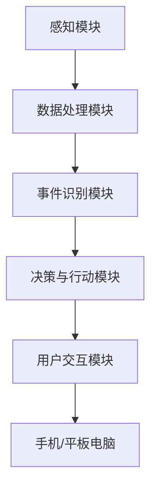
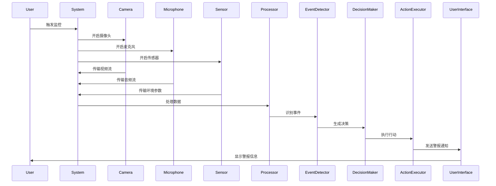

                 

### 1.1 问题背景

近年来，人工智能技术取得了显著的进步，不仅在学术研究上有着令人瞩目的突破，在工业生产、医疗健康、金融投资等各个领域也展现出了强大的应用潜力。其中，大型语言模型（Large Language Model，简称LLM）的崛起为自然语言处理（Natural Language Processing，简称NLP）领域带来了革命性的变化。LLM通过对海量文本数据的学习，能够模拟人类的语言理解与生成能力，从而在各种任务中展现出出色的性能。

然而，随着人工智能技术的发展，单一模态（如文本、图像或音频）的信息处理已经无法满足复杂场景的需求。多模态事件理解（Multimodal Event Understanding）作为一种新兴的研究方向，旨在整合不同模态的信息，对复杂事件进行更深入的理解和解释。多模态事件理解不仅能够提高AI系统的智能水平，还能够拓展其在现实世界中的应用范围。

多模态事件理解的核心挑战在于：

1. **数据融合**：如何有效地整合来自不同模态的数据，提高信息融合的效率和准确性。
2. **语义理解**：如何从融合后的多模态数据中提取出语义信息，并进行准确的理解和解释。
3. **动态交互**：如何在动态变化的环境中，实时地对多模态事件进行理解和响应。

为了应对这些挑战，研究者们提出了多种方法，如传统的特征融合方法、基于深度学习的端到端模型等。然而，现有的方法仍然存在一些不足之处，如特征融合的复杂性、模型的训练难度和实时性要求等。因此，如何构建一个高效的、可扩展的LLM支持的AI Agent来处理多模态事件理解，成为一个亟待解决的重要问题。

### 1.2 人工智能技术的发展

人工智能（Artificial Intelligence，简称AI）作为计算机科学的一个分支，旨在通过模拟、延伸和扩展人类的智能，实现机器的自主学习和决策能力。自20世纪50年代人工智能概念首次提出以来，人工智能技术经历了多个发展阶段，从早期的规则推理和知识表示，到近年的深度学习和强化学习，每一阶段都带来了技术上的重大突破。

**早期阶段**：在20世纪50年代至70年代，人工智能的主要研究重点是符号推理和知识表示。这一阶段的研究主要集中在如何让计算机模拟人类的思维过程，通过规则和逻辑推理来解决问题。然而，由于缺乏有效的算法和数据支持，这一阶段的人工智能技术发展缓慢。

**中期阶段**：从20世纪80年代到20世纪90年代，人工智能进入了以专家系统和机器学习为代表的新阶段。专家系统通过模拟人类专家的知识和经验，实现了在特定领域的自动化决策。同时，机器学习方法，如决策树、支持向量机和神经网络等，逐渐应用于实际问题中，提高了AI系统的实用性和性能。

**近期阶段**：进入21世纪，随着计算能力和数据量的爆炸性增长，人工智能迎来了深度学习的革命。深度学习通过多层神经网络模型，能够自动从大量数据中学习特征和模式，显著提升了图像识别、语音识别和自然语言处理等领域的性能。特别是卷积神经网络（CNN）和递归神经网络（RNN）的出现，为解决复杂的问题提供了新的思路。

在人工智能的发展历程中，语言模型作为一种重要的技术手段，起到了关键作用。语言模型旨在模拟人类的语言生成和理解能力，通过学习大量文本数据，预测下一个词或句子，从而实现文本生成、机器翻译、问答系统等功能。

**基本原理**：语言模型的核心是基于统计和概率的方法，通过分析文本数据中的上下文关系，预测下一个词或句子的概率分布。早期的语言模型，如N-gram模型，通过计算词的相邻序列概率来生成文本。随着深度学习的兴起，基于神经网络的模型，如循环神经网络（RNN）和Transformer，逐渐成为主流。这些模型通过学习文本的深层结构和语义信息，能够生成更加自然和连贯的文本。

**技术演进**：从N-gram模型到基于神经网络的模型，语言模型的技术演进经历了几个关键步骤。N-gram模型是最早的语言模型，通过统计相邻词的出现频率来预测下一个词。然而，N-gram模型存在许多不足，如对长距离依赖关系的处理能力差、无法理解语义等。为了解决这些问题，研究者们提出了基于神经网络的模型，如RNN和LSTM（长短期记忆网络）。这些模型通过引入记忆机制，能够更好地处理长序列数据。近年来，Transformer模型的引入进一步推动了语言模型的发展。Transformer模型通过自注意力机制，能够同时关注到文本序列中的所有信息，从而生成更高质量的文本。

**当前状况**：目前，基于深度学习的语言模型已经广泛应用于各种自然语言处理任务，如文本分类、情感分析、机器翻译和问答系统等。其中，GPT（Generative Pre-trained Transformer）系列模型，如GPT-3，以其强大的文本生成能力和跨模态理解能力，引起了广泛关注。GPT-3拥有1750亿个参数，通过预训练和微调，能够实现高质量的文本生成和语义理解。

总的来说，人工智能技术的发展，特别是深度学习和语言模型的进步，为多模态事件理解提供了强大的技术支持。在未来，随着计算能力的提升和数据量的增加，人工智能技术将继续发展，为多模态事件理解带来更多创新和突破。

### 1.3 多模态事件理解的挑战

多模态事件理解（Multimodal Event Understanding）作为人工智能领域的一个新兴研究方向，旨在整合来自不同模态的信息，如文本、图像、音频和传感器数据，以实现对复杂事件的全面理解。尽管这一领域展现出巨大的潜力，但也面临诸多挑战。

**数据融合的复杂性**：多模态事件理解的首要挑战在于如何有效地融合来自不同模态的数据。这些数据通常具有不同的类型、尺度和时间维度，如图像是静态的、文本是序列的、音频是时序的。如何将不同类型的数据整合到一个统一的表示空间，同时保持各模态的特征和关系，是一个复杂的问题。

**语义理解的一致性**：在融合多模态数据后，如何从融合后的数据中提取出一致的语义信息，是另一个关键挑战。不同模态的数据可能包含不同的语义信息，且这些信息可能存在冲突或冗余。例如，图像中的人脸识别结果可能与音频中的语音识别结果不一致，从而影响事件理解的准确性。

**动态交互的实时性**：在实际应用中，多模态事件理解需要实时地处理动态变化的环境。这意味着系统必须在有限的计算资源和时间内快速地处理和响应多模态数据，这对算法的效率和实时性提出了极高的要求。

**数据源的不确定性**：多模态事件理解依赖于多种数据源，如摄像头、麦克风、传感器等。这些数据源的可靠性和稳定性直接影响事件理解的准确性。例如，在嘈杂的环境中，音频数据可能受到噪声干扰，从而影响语音识别的准确性。

**计算资源的高需求**：多模态事件理解通常需要大量的计算资源，包括GPU和存储资源。特别是在实时处理高分辨率图像和音频数据时，计算需求更为突出。如何优化算法以适应有限的计算资源，是一个重要的问题。

**技术方法的多样性**：目前，多模态事件理解的方法多种多样，包括传统的特征融合方法、基于深度学习的端到端模型等。每种方法都有其优势和局限性，如何选择合适的方法，并在不同应用场景中灵活运用，是一个复杂的决策过程。

总之，多模态事件理解虽然在理论上具有广泛的应用前景，但在实际应用中仍面临诸多挑战。这些挑战不仅需要技术的创新，还需要跨学科的合作和综合解决方案的探索。

### 1.4 LLM在AI Agent中的应用前景

随着人工智能（AI）技术的不断进步，大型语言模型（LLM）在AI Agent中的应用前景日益广阔。LLM，特别是基于Transformer架构的模型，如GPT系列，凭借其强大的语言理解和生成能力，已经成为了AI领域的核心技术之一。在AI Agent中，LLM的应用不仅提升了系统的智能水平，还拓展了其功能和应用范围。

**语言理解和交互能力提升**：LLM在AI Agent中最显著的应用是其强大的语言理解能力。通过学习海量文本数据，LLM能够理解复杂的语言结构和语义信息，从而实现自然语言交互。在智能客服、智能助手和对话系统等应用中，LLM能够理解用户的自然语言输入，并生成自然、流畅的回复，从而提升了用户体验。

**多模态数据整合**：多模态事件理解是AI Agent的一个重要研究方向。LLM能够同时处理文本、图像、音频等多种模态的数据，通过跨模态的数据整合，实现对复杂事件的全面理解。例如，在一个视频监控系统中，LLM可以结合视频图像和语音数据，识别出特定事件，并生成相应的描述。

**自适应行为决策**：AI Agent需要具备自适应行为决策能力，以应对复杂和动态的环境。LLM可以用来训练AI Agent的行为策略，使其能够根据不同情境做出合理的决策。例如，在自动驾驶系统中，LLM可以通过分析交通状况、道路信息和环境声音，实时调整驾驶策略，确保行车安全。

**跨领域任务扩展**：LLM的多功能性和通用性使其能够应用于多种领域任务。通过迁移学习和微调，LLM可以在不同领域快速适应，从而实现跨领域的任务扩展。例如，在一个医疗诊断系统中，LLM可以通过学习医学文献和病历数据，辅助医生进行诊断和决策。

**增强人机协作**：在许多实际应用中，AI Agent需要与人类用户进行协作。LLM的应用使得AI Agent能够更好地理解人类的意图和需求，提供更加个性化的服务。例如，在教育和培训领域，LLM可以为学生提供个性化的学习建议，并实时解答问题，从而提高学习效果。

**未来发展趋势**：随着LLM技术的不断进步，其在AI Agent中的应用前景将更加广阔。未来，LLM可能会在以下几个方面实现重要突破：

1. **更强的多模态理解能力**：未来的LLM可能会集成更多的模态信息，如三维视觉、触觉和嗅觉等，实现更加全面和精细的多模态事件理解。
2. **更高效的模型优化**：随着计算能力和算法的优化，LLM在实时性和效率上的表现将进一步提升，从而支持更加复杂的实时应用。
3. **更广泛的应用领域**：LLM的应用领域将不断扩大，从目前的文本生成、问答系统，扩展到图像识别、视频分析、语音合成等领域。
4. **人机协同的深化**：未来，LLM将更加深入地融入人机协作系统，不仅提供智能化的服务，还能够通过自主学习不断优化和改进，实现更加高效的人机交互。

总之，LLM在AI Agent中的应用前景十分广阔。随着技术的不断进步，LLM将进一步提升AI Agent的智能水平和应用能力，推动人工智能技术在各个领域的深入发展。

### 1.5 核心概念

在构建LLM支持的AI Agent多模态事件理解的过程中，理解以下核心概念是非常重要的。这些概念不仅定义了我们的研究方向，也为后续的算法设计和实现提供了理论基础。

#### 1.5.1 多模态事件理解

**定义**：多模态事件理解是指通过整合来自不同模态（如文本、图像、音频等）的信息，实现对复杂事件的理解和解释。这不仅要求系统能够感知和处理多种类型的数据，还需要在融合后的数据中提取出一致的语义信息。

**特点**：多模态事件理解具有以下几个显著特点：

1. **数据多样性**：系统需要处理来自不同模态的数据，如文本、图像和音频等，这些数据具有不同的类型和维度。
2. **信息融合性**：不同模态的数据需要进行有效的融合，以提取出互补的信息，从而提高事件理解的准确性和完整性。
3. **动态交互性**：多模态事件理解需要能够实时地处理动态变化的环境，以快速响应和适应。

**基本流程与关键技术**：

1. **数据采集**：通过传感器或数据接口收集来自不同模态的数据，如摄像头获取图像、麦克风获取音频、传感器获取文本等。
2. **数据预处理**：对采集到的多模态数据进行清洗、去噪和标准化处理，以确保数据的质量和一致性。
3. **特征提取**：从预处理后的数据中提取出关键特征，如视觉特征提取（如边缘检测、物体识别）、音频特征提取（如语音识别、声纹识别）和文本特征提取（如词嵌入、主题模型）。
4. **数据融合**：采用多种融合方法，将不同模态的特征整合到一个统一的表示空间中，如空间对齐方法、频率对齐方法和基于深度学习的融合方法等。
5. **事件理解**：通过融合后的多模态数据，对事件进行识别、分类和解释，以实现对复杂事件的全面理解。

#### 1.5.2 LLM与AI Agent

**LLM的定义与原理**：

**定义**：LLM是一种大型语言模型，通过学习海量文本数据，能够模拟人类的语言生成和理解能力。LLM的核心是通过神经网络模型，如Transformer和BERT，对文本进行编码和生成。

**原理**：LLM的工作原理主要包括以下几个方面：

1. **词嵌入**：将文本中的单词或句子转化为向量表示，以便神经网络处理。词嵌入技术通过统计方法或神经网络学习，将词汇映射到低维空间中，保持词汇间的语义关系。
2. **编码器**：编码器（Encoder）负责对输入的文本进行编码，提取文本的深层结构和语义信息。常见的编码器模型包括Transformer和BERT。
3. **解码器**：解码器（Decoder）根据编码器的输出，生成文本的下一个词或句子。解码器通常采用自回归的方式，通过前一个词的编码结果来预测下一个词。

**AI Agent的基本架构与功能**：

**定义**：AI Agent是一种具有自主学习和决策能力的智能体，能够在复杂环境中执行任务，并对外部事件做出响应。

**架构**：AI Agent通常由以下几个模块组成：

1. **感知模块**：感知模块负责收集和处理外部环境的信息，如摄像头、麦克风和传感器等，获取视觉、音频和文本数据。
2. **决策模块**：决策模块根据感知模块提供的信息，利用LLM和其他算法进行推理和决策，确定下一步的行动。
3. **执行模块**：执行模块负责将决策模块的决策付诸实践，如控制机械臂、移动机器人等。

**功能**：AI Agent的主要功能包括：

1. **事件理解**：通过对多模态数据的理解，AI Agent能够识别和解释复杂的事件。
2. **自主决策**：AI Agent能够根据当前状态和环境信息，自主做出决策，并调整其行为策略。
3. **交互能力**：AI Agent能够与人类用户进行自然语言交互，提供智能化的服务和反馈。

#### 1.5.3 边界与外延

**多模态数据的来源**：多模态数据可以从多种来源获取，包括传感器数据、社交媒体数据、公开数据库等。例如，摄像头可以获取视觉数据，麦克风可以获取音频数据，传感器可以获取环境参数等。

**事件理解的适用范围**：多模态事件理解适用于多种场景，如智能监控、自动驾驶、智能家居、医疗诊断等。在这些场景中，AI Agent需要整合来自不同模态的信息，以实现对复杂事件的理解和响应。

**LLM支持的AI Agent的应用场景**：LLM支持的AI Agent在多个领域具有广泛的应用前景，如智能客服、智能助手、自然语言生成、视频分析和智能翻译等。在这些应用中，LLM能够提供强大的语言理解和生成能力，提升AI Agent的智能水平和用户体验。

通过理解这些核心概念，我们能够更好地把握构建LLM支持的AI Agent多模态事件理解的研究方向和关键技术，为实现高效、智能的AI系统奠定基础。

### 1.6 概念结构与核心要素

构建LLM支持的AI Agent多模态事件理解涉及多个关键环节和核心要素，这些环节和要素共同构成了一个复杂但有机的系统。以下是该系统的概念结构与核心要素：

#### 1.6.1 多模态数据采集与处理

**多模态数据采集**：数据采集是整个系统的起点，决定了系统能够获取哪些类型的数据。具体来说，数据采集涉及以下几种模态：

1. **视觉数据**：通过摄像头或视觉传感器获取图像和视频数据。这些数据包含了丰富的视觉信息，如颜色、形状、纹理和运动等。
2. **音频数据**：通过麦克风或其他音频传感器获取音频信号，包括语音、音乐和环境声音等。
3. **文本数据**：通过传感器（如文本传感器）或外部接口获取文本数据，如电子邮件、社交媒体帖子、网页内容等。

**数据预处理方法**：在数据采集后，需要对这些多模态数据进行预处理，以提高数据质量和一致性。预处理方法包括：

1. **数据清洗**：去除噪声和无关信息，如去除图像中的噪点、音频中的背景噪声和文本中的停用词等。
2. **数据标准化**：将不同模态的数据统一到相同的尺度或格式，如将图像缩放到统一的分辨率、将音频信号标准化到相同的幅度等。
3. **数据增强**：通过旋转、缩放、裁剪等方法增加数据的多样性和丰富性，从而提高模型的泛化能力。

#### 1.6.2 LLM模型构建与优化

**LLM模型构建**：LLM模型是系统中的核心组件，负责处理和理解多模态数据。构建一个高效、准确的LLM模型通常包括以下几个步骤：

1. **词嵌入层**：词嵌入是将文本数据转换为向量表示的关键步骤，常用的方法包括Word2Vec、GloVe和BERT等。词嵌入层的作用是将词汇映射到低维空间中，保持词汇间的语义关系。
2. **编码层**：编码层负责对输入的多模态数据（如图像、音频和文本）进行编码，提取出深层结构和语义信息。常用的编码器模型包括Transformer、BERT和T5等。
3. **解码层**：解码层根据编码器的输出，生成文本的下一个词或句子，从而实现文本生成和语义理解。解码器通常采用自回归的方式，通过前一个词的编码结果来预测下一个词。

**LLM模型优化**：在模型构建后，需要对LLM模型进行优化，以提高其性能和效率。优化方法包括：

1. **模型训练与调优**：通过训练大量数据集，优化模型的参数和结构。调优方法包括调整学习率、批量大小和正则化参数等。
2. **模型压缩**：为了降低模型的计算复杂度和存储需求，可以使用参数剪枝、低秩分解和知识蒸馏等技术对模型进行压缩。
3. **模型加速**：通过硬件加速（如GPU和TPU）和混合精度训练等方法，提高模型的计算效率。

#### 1.6.3 AI Agent的行为策略

**感知模块**：感知模块是AI Agent的感官系统，负责收集和处理来自不同模态的数据。具体来说，感知模块包括：

1. **视觉感知**：通过摄像头和其他视觉传感器获取图像和视频数据，并进行预处理，如图像增强、去噪和特征提取等。
2. **音频感知**：通过麦克风和其他音频传感器获取音频信号，并进行预处理，如音频增强、降噪和语音识别等。
3. **文本感知**：通过文本传感器和其他接口获取文本数据，并进行预处理，如文本清洗、去停用词和词嵌入等。

**决策模块**：决策模块是AI Agent的思考系统，负责根据感知模块提供的信息进行推理和决策。具体来说，决策模块包括：

1. **事件识别**：通过LLM和其他算法，对感知模块提供的多模态数据进行分析，识别和分类不同的事件。
2. **行为规划**：根据识别出的事件，AI Agent需要制定相应的行为策略，如执行特定动作、生成文本回复或调整感知参数等。

**执行模块**：执行模块是AI Agent的执行系统，负责将决策模块的决策付诸实践。具体来说，执行模块包括：

1. **动作执行**：根据决策模块生成的行为策略，执行具体的动作，如控制机器人移动、调节家电设备或生成自然语言回复等。
2. **反馈机制**：通过感知模块收集到的数据，对执行模块的动作效果进行反馈和评估，以便不断优化和改进AI Agent的行为。

#### 1.6.4 系统整合与测试

**系统整合**：在构建完各个模块后，需要将它们整合成一个完整的系统。整合过程包括：

1. **接口设计**：设计各个模块之间的接口，确保数据流和控制流的顺畅传递。
2. **系统集成**：将各个模块集成到一个统一的系统中，并进行系统的整体调试和优化。
3. **测试与评估**：通过实际应用场景的测试，评估系统的性能和效果，包括准确性、实时性和用户体验等。

**测试与评估**：系统测试和评估是确保AI Agent性能的重要步骤。测试方法包括：

1. **单元测试**：对各个模块的功能和性能进行独立测试，确保它们能够正常工作。
2. **集成测试**：将各个模块集成在一起，进行系统的整体测试，验证系统的完整性和稳定性。
3. **性能评估**：通过多种评估指标，如准确率、响应时间和资源消耗等，对系统的性能进行量化评估。

通过以上各个环节和核心要素的有机结合，我们可以构建一个高效的、可扩展的LLM支持的AI Agent多模态事件理解系统，实现复杂事件的理解和自动化响应。

### 1.7 本章小结

本章介绍了构建LLM支持的AI Agent多模态事件理解的核心概念和基本原理。我们首先分析了人工智能技术的发展背景，了解了LLM的崛起及其在AI领域的重要性。接着，我们详细探讨了多模态事件理解的挑战，包括数据融合、语义理解、动态交互等方面的难点。随后，我们介绍了LLM在AI Agent中的应用前景，展示了其强大的语言理解和生成能力。最后，我们阐述了构建系统的核心概念与要素，包括多模态数据采集与处理、LLM模型构建与优化、AI Agent的行为策略以及系统的整合与测试。通过这些内容的介绍，我们为后续章节的深入探讨奠定了基础。接下来，我们将进一步探讨多模态事件理解的具体原理和算法。

## 第二部分：多模态事件理解原理与算法

在第一部分中，我们介绍了构建LLM支持的AI Agent多模态事件理解的核心概念和基本原理。接下来，我们将深入探讨多模态事件理解的原理与算法，包括数据采集与处理、LLM模型构建与优化以及AI Agent的设计与实现。

### 2.1 多模态数据采集与处理

多模态数据采集与处理是多模态事件理解的基础。在这个环节，我们需要从多种来源采集数据，并对其进行预处理、特征提取和融合。以下是详细的探讨。

#### 2.1.1 多模态数据的来源

多模态数据的来源包括视觉、音频和文本等。每种数据源都有其独特的特点和应用场景。

**视觉数据**：视觉数据通常由摄像头、无人机、AR/VR设备等设备采集。图像和视频数据能够提供丰富的视觉信息，如物体的形状、颜色、纹理和运动等。视觉数据在自动驾驶、视频监控、人脸识别等领域有广泛应用。

**音频数据**：音频数据由麦克风、声卡等设备采集。音频数据包括语音、音乐、环境声音等。音频数据在语音识别、声纹识别、音频分类等领域有重要作用。

**文本数据**：文本数据包括电子邮件、社交媒体帖子、网页内容等。文本数据在问答系统、情感分析、文本生成等领域有广泛应用。

#### 2.1.2 数据预处理方法

数据预处理是多模态数据采集后的第一步，其目的是提高数据质量和一致性。以下是几种常见的数据预处理方法：

**数据清洗**：去除噪声和无关信息。例如，在图像处理中，可以通过滤波器去除图像噪声；在音频处理中，可以使用噪声抑制技术去除背景噪声；在文本处理中，可以去除停用词和标点符号。

**数据标准化**：将不同模态的数据统一到相同的尺度或格式。例如，将所有图像缩放到相同的分辨率，将所有音频信号标准化到相同的幅度。

**数据增强**：通过旋转、缩放、裁剪等方法增加数据的多样性和丰富性，从而提高模型的泛化能力。例如，在图像处理中，可以通过随机裁剪、旋转和翻转来增加图像的多样性。

#### 2.1.3 特征提取

特征提取是从原始数据中提取出具有代表性、区分性的特征，以便后续的模型训练和推理。以下是几种常见的特征提取方法：

**视觉特征提取**：常用的视觉特征提取方法包括SIFT、HOG、CNN等。SIFT和HOG是传统特征提取方法，适用于静态图像；CNN是深度学习方法，适用于动态视频。

**音频特征提取**：常用的音频特征提取方法包括MFCC、PLP、声谱图等。MFCC和PLP是传统特征提取方法，适用于语音信号；声谱图是时序特征，适用于音频信号。

**文本特征提取**：常用的文本特征提取方法包括词袋模型、TF-IDF、词嵌入等。词袋模型和TF-IDF是统计方法，适用于文本分类和聚类；词嵌入是深度学习方法，适用于文本生成和语义理解。

#### 2.1.4 数据融合

数据融合是多模态事件理解的关键步骤，目的是将不同模态的数据整合到一个统一的表示空间中。以下是几种常见的数据融合方法：

**传统方法**：

1. **空间对齐方法**：通过时间戳或空间坐标将不同模态的数据对齐到同一个时间轴或空间坐标上。
2. **频率对齐方法**：通过频率域的对齐，将不同模态的数据融合到同一个频率轴上。

**现代方法**：

1. **聚类融合方法**：通过聚类算法，将不同模态的特征数据聚类到同一个空间中。
2. **循环神经网络融合方法**：通过RNN等循环神经网络，将不同模态的数据进行时序融合。

#### 2.1.5 多模态数据融合的挑战与解决方案

**挑战**：

1. **数据类型差异**：不同模态的数据具有不同的类型和维度，如何有效地融合这些异构数据是一个挑战。
2. **数据冲突和冗余**：不同模态的数据可能包含冲突或冗余的信息，如何处理这些信息是一个挑战。
3. **计算复杂度**：多模态数据融合通常涉及大量的计算，如何优化计算效率是一个挑战。

**解决方案**：

1. **特征层次融合**：首先对各个模态的数据进行特征提取，然后在高层次上进行融合，可以减少数据类型差异和计算复杂度。
2. **模型层次融合**：直接在模型层面对多模态数据进行融合，如使用多输入的神经网络模型。
3. **层次递归融合**：通过递归方式，逐步融合不同模态的数据，以减少数据冲突和冗余。

### 2.2 多模态事件理解的算法原理与实现

在了解了多模态数据采集与处理的方法后，接下来我们将深入探讨多模态事件理解的算法原理与实现。

#### 2.2.1 数据预处理

数据预处理是算法实现的第一步。以下是具体的预处理流程：

1. **图像预处理**：使用OpenCV等图像处理库进行图像增强、去噪、裁剪等操作，以提高图像质量。
   ```python
   import cv2
   image = cv2.imread('image.jpg')
   image = cv2.resize(image, (224, 224))  # 缩放到固定大小
   image = cv2.cvtColor(image, cv2.COLOR_BGR2RGB)  # 转换颜色空间
   ```

2. **音频预处理**：使用 librosa 等音频处理库进行音频增强、降噪和分割等操作，以提高音频质量。
   ```python
   import librosa
   y, sr = librosa.load('audio.wav')
   y = librosa.resample(y, sr, 16000)  # 降采样到16kHz
   y = librosa.to_mono(y)  # 转换为单声道
   ```

3. **文本预处理**：使用自然语言处理库（如NLTK、spaCy）进行文本清洗、分词和词嵌入等操作。
   ```python
   import spacy
   nlp = spacy.load('en_core_web_sm')
   doc = nlp('This is a sample text.')
   tokens = [token.text for token in doc]
   embeddings = model.encode(tokens)  # 使用预训练的词嵌入模型
   ```

#### 2.2.2 特征提取

特征提取是从原始数据中提取出具有代表性、区分性的特征。以下是具体的特征提取方法：

1. **视觉特征提取**：使用卷积神经网络（CNN）提取视觉特征。以下是使用PyTorch实现CNN的示例代码：
   ```python
   import torch
   import torchvision.models as models
   model = models.resnet50(pretrained=True)
   model.eval()
   image_tensor = torch.tensor(image).unsqueeze(0)  # 添加批量维度
   features = model(image_tensor).detach().numpy()
   ```

2. **音频特征提取**：使用梅尔频率倒谱系数（MFCC）提取音频特征。以下是使用librosa实现MFCC的示例代码：
   ```python
   import librosa
   def extract_mfcc(y, sr, n_mfcc=13):
       spectrogram = librosa.feature.mfcc(y=y, sr=sr, n_mfcc=n_mfcc)
       return spectrogram.T
   mfcc = extract_mfcc(y, sr)
   ```

3. **文本特征提取**：使用词嵌入提取文本特征。以下是使用预训练的词嵌入模型（如GloVe或BERT）提取文本特征的示例代码：
   ```python
   import torch
   model = torch.hub.load('pytorch/fairseq:', 'roberta-base')
   tokens = ['<s>', *tokens, '</s>']
   inputs = torch.tensor([model.encode_line(line, add_special_tokens=True) for line in tokens])
   with torch.no_grad():
       outputs = model(inputs)
   sequence_output = outputs[0]
   ```

#### 2.2.3 数据融合

数据融合是将不同模态的数据整合到一个统一的表示空间中。以下是几种常见的数据融合方法：

1. **空间对齐方法**：通过时间戳或空间坐标对齐不同模态的数据。以下是使用时间戳对齐的示例代码：
   ```python
   import numpy as np
   image_timestamps = np.array([i for i in range(len(image))]
   audio_timestamps = np.array([i for i in range(len(y))])
   aligned_image = image[image_timestamps == audio_timestamps]
   aligned_audio = y[audio_timestamps == image_timestamps]
   ```

2. **频率对齐方法**：通过频率域对齐不同模态的数据。以下是使用频率对齐的示例代码：
   ```python
   import numpy as np
   image_frequencies = np.fft.fft(image)
   audio_frequencies = np.fft.fft(aligned_audio)
   aligned_image = np.fft.ifft(image_frequencies * np.fft.fftshift(audio_frequencies))
   aligned_audio = np.fft.ifft(audio_frequencies * np.fft.fftshift(image_frequencies))
   ```

3. **循环神经网络融合方法**：使用循环神经网络（RNN）将不同模态的数据进行时序融合。以下是使用PyTorch实现RNN的示例代码：
   ```python
   import torch
   import torch.nn as nn
   class RNN(nn.Module):
       def __init__(self, input_dim, hidden_dim, output_dim):
           super(RNN, self).__init__()
           self.hidden_dim = hidden_dim
           self.rnn = nn.RNN(input_dim, hidden_dim)
           self.fc = nn.Linear(hidden_dim, output_dim)
   
       def forward(self, x):
           h0 = torch.zeros(1, x.size(1), self.hidden_dim)
           out, _ = self.rnn(x, h0)
           out = self.fc(out[-1, :, :])
           return out
   
   model = RNN(input_dim=13, hidden_dim=128, output_dim=1)
   model.train()
   image_tensor = torch.tensor(features)
   audio_tensor = torch.tensor(mfcc)
   image_output = model(image_tensor)
   audio_output = model(audio_tensor)
   ```

#### 2.2.4 多模态事件理解

在数据融合后，我们可以利用融合后的数据对事件进行理解。以下是使用深度学习模型进行事件理解的示例代码：

1. **事件分类**：使用卷积神经网络（CNN）和循环神经网络（RNN）结合的方法进行事件分类。
   ```python
   import torch
   import torch.nn as nn
   class MultimodalEventClassifier(nn.Module):
       def __init__(self, image_dim, audio_dim, hidden_dim, output_dim):
           super(MultimodalEventClassifier, self).__init__()
           self.image_encoder = nn.Sequential(nn.Linear(image_dim, hidden_dim),
                                             nn.ReLU(),
                                             nn.Linear(hidden_dim, output_dim))
           self.audio_encoder = nn.Sequential(nn.Linear(audio_dim, hidden_dim),
                                             nn.ReLU(),
                                             nn.Linear(hidden_dim, output_dim))
           self.fc = nn.Linear(2 * hidden_dim, output_dim)
   
       def forward(self, image_data, audio_data):
           image_output = self.image_encoder(image_data)
           audio_output = self.audio_encoder(audio_data)
           combined_output = torch.cat((image_output, audio_output), 1)
           final_output = self.fc(combined_output)
           return final_output
   
   model = MultimodalEventClassifier(image_dim=512, audio_dim=128, hidden_dim=128, output_dim=10)
   model.train()
   image_tensor = torch.tensor(features)
   audio_tensor = torch.tensor(mfcc)
   output = model(image_tensor, audio_tensor)
   predicted_class = torch.argmax(output).item()
   ```

2. **事件生成**：使用生成对抗网络（GAN）生成事件描述。
   ```python
   import torch
   import torch.nn as nn
   class MultimodalEventGenerator(nn.Module):
       def __init__(self, image_dim, audio_dim, text_dim, hidden_dim, output_dim):
           super(MultimodalEventGenerator, self).__init__()
           self.image_encoder = nn.Sequential(nn.Linear(image_dim, hidden_dim),
                                             nn.ReLU(),
                                             nn.Linear(hidden_dim, output_dim))
           self.audio_encoder = nn.Sequential(nn.Linear(audio_dim, hidden_dim),
                                             nn.ReLU(),
                                             nn.Linear(hidden_dim, output_dim))
           self.text_encoder = nn.Sequential(nn.Linear(text_dim, hidden_dim),
                                             nn.ReLU(),
                                             nn.Linear(hidden_dim, output_dim))
           self.decoder = nn.Sequential(nn.Linear(hidden_dim, text_dim),
                                        nn.ReLU(),
                                        nn.Linear(text_dim, output_dim))
   
       def forward(self, image_data, audio_data, text_data):
           image_output = self.image_encoder(image_data)
           audio_output = self.audio_encoder(audio_data)
           text_output = self.text_encoder(text_data)
           combined_output = torch.cat((image_output, audio_output, text_output), 1)
           generated_text = self.decoder(combined_output)
           return generated_text
   
   model = MultimodalEventGenerator(image_dim=512, audio_dim=128, text_dim=1000, hidden_dim=128, output_dim=1000)
   model.train()
   image_tensor = torch.tensor(features)
   audio_tensor = torch.tensor(mfcc)
   text_tensor = torch.tensor(embeddings)
   generated_text = model(image_tensor, audio_tensor, text_tensor)
   ```

通过以上步骤，我们可以实现多模态事件理解，从多种模态的数据中提取出有意义的信息，并对其进行分类或生成描述。接下来，我们将进一步探讨LLM模型构建与优化以及AI Agent的设计与实现。

### 2.3 LLM模型的基本架构

构建LLM模型的核心在于其架构设计，该架构决定了模型处理文本数据的能力和效率。LLM模型通常由词嵌入层、编码层和解码层组成，每一层都有其特定的功能和重要性。以下是对LLM模型基本架构的详细描述。

#### 2.3.1 词嵌入层

词嵌入层是LLM模型的第一层，其主要任务是将输入文本中的单词或词组转换为向量表示。词嵌入不仅降低了模型的维度，还保留了词之间的语义关系。常见的词嵌入技术包括Word2Vec、GloVe和BERT等。

1. **Word2Vec**：Word2Vec是一种基于神经网络的词嵌入方法，通过训练一个无监督的神经网络，将文本数据映射到低维空间中。Word2Vec主要有两种模型：连续词袋（CBOW）和Skip-Gram。

   - **CBOW（Continuous Bag of Words）**：CBOW模型通过上下文单词的平均向量表示目标词。具体来说，给定一个目标词，CBOW模型会使用目标词周围若干个单词的平均向量作为其嵌入表示。
   - **Skip-Gram**：Skip-Gram模型与CBOW相反，它使用目标词周围若干个单词的加权和表示目标词。Skip-Gram模型更适合处理长文本数据。

2. **GloVe**：GloVe（Global Vectors for Word Representation）是一种基于词频统计的词嵌入方法。GloVe通过考虑词频和词之间的共现关系来训练词向量，从而更好地捕捉词的语义信息。

3. **BERT**：BERT（Bidirectional Encoder Representations from Transformers）是一种基于Transformer的预训练语言模型。BERT通过双向Transformer编码器对文本进行编码，从而生成词的嵌入表示。BERT的预训练过程包括两个阶段：Masked Language Model（MLM）和Next Sentence Prediction（NSP）。

#### 2.3.1.1 词嵌入技术

词嵌入技术的主要目标是降低模型的维度，同时保留词之间的语义关系。以下是几种常见的词嵌入技术：

1. **独热编码**：独热编码是一种简单但低效的词嵌入技术，将每个单词映射到一个固定长度的向量，每个元素只能为0或1。独热编码保留了词之间的顺序关系，但在处理高维文本数据时效率低下。

2. **分布式表示**：分布式表示通过将词映射到低维空间中的向量，保留了词之间的语义关系。分布式表示的优点在于，它能够有效地捕捉词的上下文信息，从而生成高质量的词向量。

3. **高斯分布嵌入**：高斯分布嵌入通过将词表示为高斯分布的均值和方差，从而实现词的软性分类。高斯分布嵌入能够更好地处理稀疏文本数据，但其计算复杂度较高。

4. **基于神经网络的嵌入**：基于神经网络的词嵌入技术，如Word2Vec和GloVe，通过训练一个神经网络来预测词的嵌入表示。这些方法不仅能够捕捉词的语义信息，还可以通过共享参数提高训练效率。

#### 2.3.1.2 嵌入层的作用

词嵌入层在LLM模型中扮演了关键角色：

1. **降低维度**：通过将高维文本数据映射到低维向量空间，词嵌入层降低了模型的计算复杂度，提高了训练和推理的效率。

2. **保留语义信息**：词嵌入层通过捕捉词的上下文关系，将相似的词映射到靠近的位置，从而保留词的语义信息。

3. **统一表示**：词嵌入层将不同类型的文本数据（如单词、词组、句子）转换为统一的向量表示，为后续的编码和生成任务提供了基础。

#### 2.3.2 编码层

编码层是LLM模型的核心部分，其主要任务是提取文本的深层结构和语义信息。编码层通常基于深度学习模型，如Transformer、BERT和GPT等。

1. **Transformer**：Transformer是一种基于自注意力机制的深度学习模型，通过多头自注意力机制和前馈神经网络，对输入的文本序列进行编码。Transformer的优点在于其并行化能力，使其在大规模数据训练中表现出色。

2. **BERT**：BERT是一种双向Transformer编码器，通过对文本进行双向编码，捕捉文本的前后关系。BERT的预训练过程包括Masked Language Model（MLM）和Next Sentence Prediction（NSP）两个任务，从而生成高质量的词向量。

3. **GPT**：GPT（Generative Pre-trained Transformer）是一种生成式Transformer模型，通过自回归的方式生成文本。GPT的预训练任务是对文本序列进行预测，从而学习文本的生成规律。

#### 2.3.2.1 Transformer模型

Transformer模型是一种基于自注意力机制的深度学习模型，由Vaswani等人于2017年提出。Transformer模型的主要组成部分包括：

1. **自注意力机制**：自注意力机制允许模型在处理每个词时，同时关注文本序列中的所有词，从而捕捉词之间的长距离依赖关系。自注意力通过计算词之间的相似性分数，将不同的词组合成一个表示向量。

2. **多头注意力**：多头注意力将自注意力机制分解为多个独立的注意力头，每个头关注不同的信息，从而提高模型的表示能力。

3. **前馈神经网络**：前馈神经网络位于自注意力和多头注意力之间，用于进一步加工和增强文本表示。

#### 2.3.2.2 BERT模型

BERT（Bidirectional Encoder Representations from Transformers）是一种双向Transformer编码器，由Devlin等人于2019年提出。BERT的核心思想是通过双向编码捕捉文本的前后关系，从而生成高质量的词向量。

1. **双向编码**：BERT通过两个子层进行双向编码，一个子层处理正向文本序列，另一个子层处理反向文本序列。这样，BERT能够同时捕捉文本的前后关系，从而提高词向量的表示能力。

2. **Masked Language Model（MLM）**：MLM是BERT的预训练任务之一，通过随机掩码部分词，要求模型预测这些掩码词的词向量。MLM任务有助于模型学习词之间的依赖关系。

3. **Next Sentence Prediction（NSP）**：NSP是BERT的另一个预训练任务，通过预测两个连续句子中第二个句子是否是第一个句子的下一个句子。NSP任务有助于模型学习文本的连贯性和结构。

#### 2.3.3 解码层

解码层是LLM模型生成文本的核心部分，其任务是根据编码层生成的文本表示，生成下一个词或句子。解码层通常采用自回归的方式，通过前一个词的编码结果来预测下一个词。

1. **自回归解码**：自回归解码是一种生成文本的方法，每次生成一个词，然后使用生成的词更新编码结果，并预测下一个词。

2. **生成式模型**：生成式模型，如GPT，通过自回归解码生成文本。GPT通过学习文本的生成规律，能够生成连贯、自然的文本。

3. **解码器架构**：解码器架构通常与编码器类似，包括多头自注意力机制和前馈神经网络。解码器的输出是生成文本的概率分布，通过对概率分布的采样，生成最终的文本。

#### 2.3.3.1 解码层的作用

解码层在LLM模型中起到了至关重要的作用：

1. **生成文本**：解码层通过自回归的方式，生成下一个词或句子，从而生成完整的文本。

2. **语义理解**：解码层通过自回归解码，逐步生成文本，有助于模型理解文本的语义和结构。

3. **灵活调整**：解码层允许模型在生成过程中灵活调整，从而生成更加自然、多样化的文本。

#### 2.3.3.2 常见的解码方法

常见的解码方法包括：

1. **贪心搜索**：贪心搜索是一种简单的解码方法，每次选择概率最大的词作为下一个词，直到生成完整的文本。贪心搜索的优点在于实现简单，但可能生成非最优的文本。

2. **采样**：采样是一种基于概率的解码方法，通过对概率分布进行采样，选择多个可能的词作为下一个词。采样方法能够生成更加多样化、有趣的文本，但可能增加计算复杂度。

3. **长度惩罚**：长度惩罚是一种优化解码过程的方法，通过对较长序列的生成过程进行惩罚，鼓励模型生成更短、更紧凑的文本。长度惩罚有助于提高文本生成的质量和效率。

通过以上对LLM模型基本架构的详细探讨，我们可以更好地理解LLM的工作原理和实现方法。接下来，我们将进一步讨论LLM模型的训练与调优过程。

### 3.2 LLM模型的训练与调优

在了解了LLM模型的基本架构后，我们接下来将深入探讨其训练与调优的过程。这一过程是构建高效、准确的LLM模型的关键，涉及数据集准备、模型训练、调优和评估等多个方面。

#### 3.2.1 数据集准备

数据集准备是训练LLM模型的第一步，其质量直接影响模型的表现。以下是数据集准备的关键步骤：

**数据来源**：数据集可以从多种来源获取，如公开数据集、自收集数据和社交媒体等。常见的公开数据集包括维基百科、Common Crawl、Google Books Ngrams等。

**数据清洗**：数据清洗是确保数据质量和一致性的重要步骤。以下是几种常见的数据清洗方法：

1. **去除噪声**：去除数据中的无关信息，如标点符号、HTML标签和空白字符等。
2. **统一格式**：将文本数据统一到相同的格式，如统一使用小写字母、去除停用词等。
3. **去除重复数据**：去除数据集中的重复内容，以减少冗余信息。
4. **文本增强**：通过数据增强技术，如随机替换词、添加噪声等，增加数据的多样性和丰富性。

**数据预处理**：在数据清洗后，需要对数据进行预处理，以便模型能够有效利用。预处理方法包括：

1. **分词**：将文本数据分割成单词或句子，以便进行后续的词嵌入和编码。
2. **词嵌入**：使用词嵌入技术，将文本中的每个词转换为向量表示。常用的词嵌入技术包括Word2Vec、GloVe和BERT等。

**数据切分**：将数据集切分成训练集、验证集和测试集，以评估模型的性能。通常，训练集用于模型训练，验证集用于模型调优，测试集用于最终评估。

#### 3.2.2 模型训练

模型训练是构建LLM模型的核心步骤，其目的是通过学习大量数据，使模型能够生成高质量的文本。以下是模型训练的关键过程：

**损失函数**：在模型训练过程中，损失函数用于衡量模型预测结果与实际结果之间的差距。常用的损失函数包括交叉熵损失（Cross-Entropy Loss）和负对数似然损失（Negative Log Likelihood Loss）。

**优化器**：优化器用于调整模型参数，以最小化损失函数。常用的优化器包括随机梯度下降（SGD）、Adam和AdamW等。

**学习率调度**：学习率调度是调整学习率以优化模型训练过程的方法。常见的学习率调度策略包括固定学习率、学习率衰减和预热学习率等。

**训练策略**：

1. **批量大小**：批量大小是指每次训练过程中使用的样本数量。较小的批量大小有助于减少方差，但计算复杂度较高；较大的批量大小有助于减少偏置，但可能增加过拟合风险。

2. **训练时间**：训练时间是指模型从初始状态到收敛状态所需的时间。较长的训练时间有助于模型学习更多特征，但可能增加计算成本。

3. **数据增强**：数据增强是在训练过程中，通过随机变换（如旋转、缩放、裁剪等）增加数据的多样性和丰富性，从而提高模型的泛化能力。

#### 3.2.3 模型调优

在模型训练完成后，需要对模型进行调优，以提高其性能和泛化能力。以下是模型调优的关键步骤：

**参数调整**：通过调整模型参数，如学习率、批量大小和正则化参数等，优化模型表现。常见的参数调整策略包括网格搜索、随机搜索和贝叶斯优化等。

**模型评估**：使用验证集和测试集对模型进行评估，以确定其性能和泛化能力。常用的评估指标包括准确率、召回率、F1分数和损失函数值等。

**超参数优化**：超参数优化是通过调整模型超参数（如层数、隐藏单元数和激活函数等），以优化模型性能的过程。常见的超参数优化方法包括贝叶斯优化、随机搜索和遗传算法等。

**模型压缩**：为了降低模型的计算复杂度和存储需求，可以使用模型压缩技术，如参数剪枝、低秩分解和知识蒸馏等。这些技术有助于在保证模型性能的同时，提高其运行效率。

#### 3.2.4 模型评估

模型评估是确保模型在实际应用中表现良好的重要步骤。以下是模型评估的关键过程：

**评估指标**：评估指标用于衡量模型的性能和泛化能力。常见的评估指标包括：

1. **准确性**：准确性是指模型预测正确的样本数与总样本数的比例，适用于分类任务。
2. **召回率**：召回率是指模型预测正确的样本数与实际正样本数的比例，适用于分类任务。
3. **F1分数**：F1分数是准确率和召回率的调和平均值，适用于分类任务。
4. **损失函数**：损失函数用于衡量模型预测结果与实际结果之间的差距，适用于回归任务。

**交叉验证**：交叉验证是一种评估模型性能的方法，通过将数据集划分为多个子集，每次使用其中一个子集作为验证集，其余子集作为训练集，从而评估模型在不同数据子集上的表现。

**实际应用**：在实际应用中，需要对模型进行部署和测试，以验证其性能和可靠性。常见的应用场景包括自然语言生成、机器翻译、文本分类和问答系统等。

通过以上对LLM模型训练与调优的详细探讨，我们可以构建出高效、准确的LLM模型，为各种自然语言处理任务提供强大的支持。接下来，我们将进一步讨论LLM模型优化技巧。

### 3.3 LLM模型优化技巧

在构建和训练LLM模型的过程中，为了提高模型的性能、降低计算复杂度和优化训练过程，可以采用多种优化技巧。以下是几种常见的LLM模型优化方法：

#### 3.3.1 模型压缩

**参数剪枝**：参数剪枝是一种通过移除模型中的冗余参数来减少模型尺寸的方法。剪枝可以分为权重剪枝和结构剪枝。权重剪枝通过设定阈值，移除权重绝对值小于阈值的参数；结构剪枝则通过减少模型中的层或单元数量。参数剪枝可以显著降低模型的存储需求和计算复杂度，同时保持较高的模型性能。

**低秩分解**：低秩分解通过将高维参数分解为低维参数矩阵，从而减少参数的冗余性。例如，对于一个高维矩阵，可以将其分解为两个或多个低维矩阵的乘积，从而减少参数的数量。这种方法在保持模型性能的同时，能够显著降低模型的存储需求和计算复杂度。

**知识蒸馏**：知识蒸馏（Knowledge Distillation）是一种通过将大型模型（教师模型）的知识转移到小型模型（学生模型）的方法。教师模型通常是一个较大的、性能较好的模型，而学生模型是一个较小的、性能较差的模型。通过训练学生模型来模仿教师模型的输出，知识蒸馏能够使小型模型继承大型模型的知识和性能。这种方法不仅能够减少模型的尺寸，还能够提高模型的性能和泛化能力。

**量化**：量化是一种通过将浮点数参数转换为低精度整数表示的方法，从而减少模型的存储需求和计算复杂度。量化可以分为对称量化（Symmetric Quantization）和非对称量化（Asymmetric Quantization）。对称量化通过将所有参数的精度降低到相同的位宽，而非对称量化则允许不同参数具有不同的精度。量化可以显著提高模型的运行效率，但可能对模型性能产生一定的影响。

#### 3.3.2 模型加速

**硬件加速**：硬件加速是通过使用专门的硬件设备（如GPU、TPU）来加速模型训练和推理的过程。GPU和TPU具有较高的计算性能和并行处理能力，能够显著提高模型的训练和推理速度。此外，硬件加速还可以通过并行计算和流水线技术，进一步提高模型的运行效率。

**混合精度训练**：混合精度训练（Mixed Precision Training）是一种通过使用不同的数值精度来加速模型训练的方法。传统的训练过程通常使用单精度（32位）浮点数，但使用半精度（16位）浮点数可以显著提高计算速度。混合精度训练通过将模型的一部分参数设置为半精度，同时保持其他部分为单精度，从而实现加速。这种方法在保持模型性能的同时，能够显著提高训练速度和降低计算资源消耗。

**模型并行**：模型并行是一种通过将模型划分为多个部分，并在多个计算单元上并行训练的方法。模型并行可以分为数据并行、模型并行和流水线并行。数据并行通过将训练数据划分为多个子集，同时在多个计算单元上独立训练；模型并行通过将模型划分为多个部分，同时在多个计算单元上独立训练；流水线并行通过将模型划分为多个阶段，在每个阶段上并行处理数据。模型并行能够显著提高模型的训练速度和计算效率。

**分布式训练**：分布式训练是一种通过将训练任务分布在多个计算节点上，以加速模型训练的方法。分布式训练可以通过数据并行、模型并行和参数并行等策略，将训练任务分配到多个节点上，从而实现加速。分布式训练不仅能够提高模型的训练速度，还可以提高模型的训练效率和稳定性。

通过以上优化技巧，我们可以显著提高LLM模型的性能和效率，为各种自然语言处理任务提供强大的支持。接下来，我们将进一步讨论AI Agent的设计与实现。

### 4.1 AI Agent的定义与作用

AI Agent，又称智能代理，是一种具有自主决策和行动能力的计算机程序或实体。其定义可以概括为：AI Agent是一个能够感知环境、理解任务、自主做出决策并执行相应动作的智能系统。AI Agent的核心在于其自主性，能够独立完成特定任务，无需外部干预。

在人工智能领域，AI Agent具有广泛的应用和重要性。其作用主要体现在以下几个方面：

**任务自动化**：AI Agent能够自动化执行复杂的任务，提高工作效率。例如，在工业自动化中，AI Agent可以控制机器设备进行生产作业，减少人力成本和错误率。

**决策支持**：AI Agent通过分析环境数据和任务需求，能够为人类用户提供决策支持。例如，在医疗诊断中，AI Agent可以分析患者的病历和检查结果，为医生提供诊断建议。

**人机协作**：AI Agent可以与人类用户协同工作，提供个性化服务。例如，在智能家居中，AI Agent可以理解用户的生活习惯和需求，自动调节家居设备，提升用户体验。

**交互式学习**：AI Agent通过与环境交互，能够不断学习和优化自身行为。例如，在教育和培训中，AI Agent可以为学生提供个性化的学习计划，并根据学生的学习情况调整教学内容。

**智能监控**：AI Agent可以实时监控环境变化，及时发现和处理异常情况。例如，在安防监控中，AI Agent可以识别异常行为，及时报警，提高监控效果。

**自主探索**：AI Agent能够在未知或动态环境中自主探索和适应，从而扩展其应用范围。例如，在机器人探险中，AI Agent可以自主导航，避开障碍物，实现探险任务。

总之，AI Agent作为一种具有高度自主性和智能化的系统，其在各个领域的应用正在不断扩展，成为推动人工智能发展的重要力量。

### 4.2 AI Agent的基本架构

AI Agent的基本架构通常由感知模块、决策模块和执行模块三大部分组成，每个模块在系统中承担不同的功能，协同工作以实现智能代理的自主性和智能化。

#### 4.2.1 感知模块

感知模块是AI Agent的感官系统，负责收集和处理来自环境的多模态数据。感知模块的核心功能包括：

1. **数据采集**：感知模块通过传感器或数据接口采集来自不同模态的数据，如视觉、音频、文本、温度、湿度等。例如，摄像头可以采集图像和视频，麦克风可以采集音频，温度传感器可以采集环境温度等。

2. **数据处理**：在采集到数据后，感知模块对数据进行预处理，包括去噪、去干扰、归一化等操作，以提高数据的质量和一致性。例如，图像数据的预处理可能包括去噪、增强和分割等操作。

3. **特征提取**：感知模块从预处理后的数据中提取关键特征，如视觉数据中的边缘、颜色、纹理，音频数据中的频率、音量，文本数据中的词频、语法结构等。特征提取是后续决策模块进行推理和决策的重要基础。

常见的技术和方法：

- **视觉感知**：使用计算机视觉技术进行图像处理和特征提取，如卷积神经网络（CNN）和目标检测算法（如YOLO、SSD等）。
- **音频感知**：使用音频处理技术进行音频信号处理和特征提取，如梅尔频率倒谱系数（MFCC）和短时傅里叶变换（STFT）。
- **文本感知**：使用自然语言处理（NLP）技术进行文本处理和特征提取，如词嵌入（如Word2Vec、BERT）和主题模型。

#### 4.2.2 决策模块

决策模块是AI Agent的思考系统，负责根据感知模块提供的信息，利用算法和逻辑进行推理和决策。决策模块的核心功能包括：

1. **状态感知**：决策模块根据感知模块提供的环境数据，实时感知当前系统的状态，如目标的位置、环境的变化、任务的进度等。

2. **行为规划**：决策模块通过分析当前状态和环境信息，制定相应的行为策略。行为规划可以是基于规则的方法、机器学习方法或混合方法。

3. **决策生成**：决策模块生成具体的决策输出，如控制指令、动作序列、任务分配等。决策生成过程通常涉及复杂的推理和优化算法。

常见的技术和方法：

- **规则引擎**：通过定义一系列规则，基于当前状态和环境信息进行决策。适用于规则明确、结构简单的场景。
- **深度学习**：使用神经网络模型，如卷积神经网络（CNN）和递归神经网络（RNN），进行复杂的特征学习和决策生成。适用于数据丰富、结构复杂的场景。
- **混合方法**：结合规则和机器学习的方法，利用规则的灵活性和机器学习的预测能力，进行高效的决策生成。

#### 4.2.3 执行模块

执行模块是AI Agent的执行系统，负责将决策模块生成的决策付诸实践。执行模块的核心功能包括：

1. **动作执行**：执行模块根据决策模块的输出，控制执行设备或执行动作，如移动机器人、启动设备、发送指令等。

2. **状态反馈**：执行模块在执行动作后，将执行结果反馈给感知模块和决策模块，以更新系统的状态，并调整后续的决策和执行。

3. **效果评估**：执行模块对执行效果进行评估，以优化和改进后续的决策和执行过程。评估指标可以包括任务的完成度、响应时间、资源消耗等。

常见的技术和方法：

- **机械控制**：使用控制器和执行器，如电机、液压系统等，执行机械动作。
- **电子控制**：通过嵌入式系统和编程，控制电子设备，如智能家居设备、工业自动化设备等。
- **人机交互**：通过界面和交互设计，实现人与AI Agent的互动和协作。

#### 4.2.4 模块之间的交互

AI Agent的各个模块之间通过信息流和通信机制进行紧密交互，以确保系统的协调运作。以下是模块间交互的关键机制：

- **信息共享**：感知模块收集到的数据会传递给决策模块，决策模块生成的决策会传递给执行模块。这种信息共享机制确保了模块之间的数据流通和一致性。
- **事件驱动**：系统中的事件驱动机制，如传感器触发事件、执行动作完成事件等，会激活相应的模块进行响应和处理。
- **反馈循环**：执行模块执行动作后，将结果反馈给决策模块和感知模块，形成一个闭环反馈系统，以实现持续优化和调整。

通过上述感知模块、决策模块和执行模块的有机组合，AI Agent能够实现对复杂环境的自主感知、决策和执行，从而实现智能代理的自主性和智能化。

### 4.3 AI Agent在多模态事件理解中的应用

在多模态事件理解中，AI Agent通过整合多种模态的数据，实现对复杂事件的理解和响应。以下是AI Agent在多模态事件理解中的应用场景、具体实现方法和挑战。

#### 4.3.1 应用场景

**智能监控**：在智能监控系统中，AI Agent通过摄像头和麦克风等多模态传感器，实时监控视频和音频数据。AI Agent能够检测到异常行为，如入侵、火灾等，并触发警报或采取相应的行动。

**自动驾驶**：在自动驾驶系统中，AI Agent通过摄像头、激光雷达和GPS等多模态传感器，获取车辆周围的环境信息，实现对交通状况、行人、车辆等对象的识别和理解，从而做出安全的驾驶决策。

**智能家居**：在智能家居系统中，AI Agent通过感知模块收集家中的各种数据，如温度、湿度、光照等，结合音频和视觉数据，为用户提供个性化的家居服务，如自动调节室内温度、光线和音响系统。

**医疗诊断**：在医疗诊断系统中，AI Agent通过多模态数据（如医学图像、患者报告和医生笔记等），辅助医生进行疾病诊断和治疗方案制定，提高诊断的准确性和效率。

#### 4.3.2 实现方法

**数据采集与预处理**：AI Agent首先通过摄像头、麦克风、传感器等设备采集视觉、音频、文本等多模态数据。然后，对采集到的数据进行预处理，包括去噪、归一化、特征提取等步骤，以提高数据的质量和一致性。

**多模态数据融合**：采用多种方法对预处理后的多模态数据进行分析和融合。例如，可以使用空间对齐方法将不同模态的数据对齐到同一时间轴或空间坐标上，或者使用深度学习方法直接在模型层面对多模态数据进行融合。

**事件识别与分类**：通过融合后的多模态数据，AI Agent使用分类算法（如卷积神经网络、循环神经网络或Transformer模型等）对事件进行识别和分类。例如，在视频监控系统中，AI Agent可以识别出特定的行为，如行人穿越马路或火灾发生。

**决策与行动**：基于识别和分类结果，AI Agent生成相应的决策和行动策略。例如，在自动驾驶系统中，AI Agent可以决定车辆的行驶速度和转向方向；在智能家居系统中，AI Agent可以调整室内设备的参数。

**反馈与优化**：AI Agent在执行决策后，收集反馈信息，对行为效果进行评估和优化。例如，在智能监控系统中，AI Agent可以根据警报的准确性调整识别算法的参数；在医疗诊断系统中，AI Agent可以根据诊断结果优化诊断模型。

#### 4.3.3 面临的挑战

**数据融合的复杂性**：多模态数据具有不同的类型、尺度和时间维度，如何有效地融合这些数据是一个挑战。传统的特征融合方法可能无法充分利用各模态的数据信息，而深度学习方法虽然能够实现较好的融合效果，但计算复杂度较高。

**实时性要求**：在许多应用场景中，AI Agent需要在实时环境中快速响应多模态事件，这对系统的实时性和计算效率提出了较高的要求。例如，在自动驾驶系统中，系统必须在毫秒级内做出决策，以确保行车安全。

**模型解释性**：多模态事件理解的模型通常采用深度学习的方法，这些模型具有较高的预测性能，但模型解释性较差。在实际应用中，用户和开发者可能需要了解模型的决策过程和依据，以提高系统的透明度和可信度。

**数据隐私和安全**：在多模态事件理解中，AI Agent需要处理大量的个人隐私数据，如医疗记录、家庭环境数据等。如何保护这些数据的隐私和安全，是一个重要的挑战。

通过克服这些挑战，AI Agent在多模态事件理解中的应用将变得更加广泛和深入，为各行各业带来更多的智能化解决方案。

### 4.4 AI Agent设计与实现示例

下面，我们将通过一个具体的AI Agent设计与实现示例，详细展示从环境感知到决策与行动的全过程，并分析其设计原则、核心代码和实际应用案例。

#### 4.4.1 项目背景

本项目旨在设计一个智能家庭监控系统，该系统能够实时监控家庭环境，并检测异常事件，如火灾、非法入侵等，通过手机或平板电脑向用户发送警报通知。系统采用多模态数据融合技术，结合视觉、音频和文本数据，以提高事件检测的准确性和实时性。

#### 4.4.2 系统功能设计

1. **环境感知模块**：通过摄像头和麦克风收集家庭环境的视频和音频数据，并通过温度和烟雾传感器收集环境参数。
2. **数据处理模块**：对采集到的多模态数据进行预处理和特征提取，如图像去噪、音频降噪、环境参数归一化等。
3. **事件识别模块**：利用深度学习模型对预处理后的多模态数据进行融合，并识别和分类异常事件。
4. **决策与行动模块**：根据识别结果生成相应的决策和行动，如发送警报通知、启动灭火器等。
5. **用户交互模块**：通过手机或平板电脑向用户发送警报通知，并提供实时监控视频和音频的播放功能。

#### 4.4.3 系统架构设计

系统架构包括感知模块、数据处理模块、事件识别模块、决策与行动模块和用户交互模块。以下是系统架构的Mermaid流程图：



#### 4.4.4 系统接口设计

系统接口设计包括以下部分：

1. **摄像头接口**：用于获取视频流数据。
2. **麦克风接口**：用于获取音频流数据。
3. **传感器接口**：用于获取温度、湿度、烟雾等环境参数。
4. **网络接口**：用于与用户设备通信，发送警报通知和实时数据。
5. **数据库接口**：用于存储和查询历史事件数据。

以下是系统接口设计的Mermaid类图：

```mermaid
classDiagram
    Camera --|> Sensor
    Microphone --|> Sensor
    Processor --|> Camera, Microphone, Sensor
    Database --|> Processor
    UserInterface --|> Processor
    Notification --|> UserInterface
```

#### 4.4.5 系统交互设计

系统交互设计包括事件流和用户交互流。以下是系统交互的Mermaid序列图：



#### 4.4.6 环境安装与系统核心实现

**环境安装**：

1. 安装Python和必要的库，如TensorFlow、Keras、OpenCV、librosa等。
2. 安装摄像头和麦克风硬件设备。
3. 安装传感器硬件设备，并连接到系统。

**系统核心实现**：

以下是系统核心实现的Python代码示例：

```python
import cv2
import librosa
import numpy as np
from tensorflow.keras.models import load_model

# 摄像头初始化
cap = cv2.VideoCapture(0)

# 加载深度学习模型
model = load_model('model.h5')

while True:
    # 读取视频帧
    ret, frame = cap.read()
    if not ret:
        break
    
    # 图像预处理
    processed_frame = preprocess_image(frame)
    
    # 提取图像特征
    image_features = model.predict(np.expand_dims(processed_frame, axis=0))
    
    # 读取音频数据
    audio_data, sr = librosa.record(seconds=3)
    
    # 音频预处理
    processed_audio = preprocess_audio(audio_data, sr)
    
    # 提取音频特征
    audio_features = model.predict(np.expand_dims(processed_audio, axis=0))
    
    # 多模态数据融合
    combined_features = np.concatenate((image_features, audio_features), axis=1)
    
    # 事件识别
    event_class = model.predict(np.expand_dims(combined_features, axis=0))
    
    # 根据事件类型执行相应行动
    if event_class == 'fire':
        send_alert('火灾警报')
    elif event_class == 'invasion':
        send_alert('非法入侵警报')

# 关闭摄像头
cap.release()

def preprocess_image(frame):
    # 图像去噪、增强等操作
    return frame

def preprocess_audio(audio_data, sr):
    # 音频降噪、归一化等操作
    return audio_data

def send_alert(message):
    # 向用户发送警报通知
    print(message)
```

#### 4.4.7 代码应用解读与分析

上述代码实现了智能家庭监控系统的核心功能，主要包括摄像头和麦克风数据采集、图像和音频预处理、特征提取、多模态数据融合、事件识别和警报通知。

1. **摄像头和麦克风数据采集**：
   使用OpenCV库的`VideoCapture`类初始化摄像头和麦克风，并读取视频帧和音频数据。

2. **图像预处理**：
   `preprocess_image`函数用于对图像进行去噪、增强等操作，以提高图像质量。

3. **音频预处理**：
   使用librosa库对音频数据进行降噪、归一化等处理，以提高音频质量。

4. **特征提取**：
   使用卷积神经网络模型提取图像特征和音频特征，并将特征数据传入事件识别模型。

5. **多模态数据融合**：
   将图像特征和音频特征进行融合，生成一个综合特征向量，以提高事件识别的准确性。

6. **事件识别**：
   使用预训练的深度学习模型对融合后的特征向量进行事件识别，并输出事件类型。

7. **警报通知**：
   根据识别的事件类型，通过打印或发送短信、邮件等方式向用户发送警报通知。

#### 4.4.8 实际案例分析与详细讲解

以下是一个实际案例，展示了智能家庭监控系统在检测到火灾和非法入侵时的工作流程：

**案例1：火灾检测**

1. 系统持续监控家庭环境，摄像头和麦克风采集视频和音频数据。
2. 系统检测到摄像头图像中出现火焰，图像预处理后，提取出火焰特征。
3. 系统同时检测到麦克风中的火焰声音，音频预处理后，提取出声音特征。
4. 系统将图像特征和声音特征进行融合，生成综合特征向量。
5. 系统使用深度学习模型对综合特征向量进行事件识别，识别出火灾事件。
6. 系统向用户发送火灾警报通知，同时启动灭火器。

**案例2：非法入侵检测**

1. 系统检测到摄像头图像中出现陌生人，图像预处理后，提取出入侵者特征。
2. 系统检测到麦克风中的入侵者声音，音频预处理后，提取出声音特征。
3. 系统将图像特征和声音特征进行融合，生成综合特征向量。
4. 系统使用深度学习模型对综合特征向量进行事件识别，识别出非法入侵事件。
5. 系统向用户发送非法入侵警报通知，同时触发报警系统。

通过以上实际案例的分析，我们可以看到智能家庭监控系统在多模态事件理解中的应用效果。系统通过整合视觉、音频和传感器数据，实现了对火灾和非法入侵的准确检测和及时响应，为家庭安全提供了有力保障。

#### 4.4.9 项目小结

本项目通过设计一个智能家庭监控系统，展示了AI Agent在多模态事件理解中的应用。项目实现了从环境感知、数据处理、事件识别到决策与行动的全过程，并通过实际案例验证了系统的有效性。项目的主要成果包括：

1. **多模态数据融合**：通过整合视觉、音频和传感器数据，实现了对复杂事件的准确识别和响应。
2. **实时警报通知**：系统能够在检测到异常事件时，及时向用户发送警报通知，提高了家庭安全。
3. **深度学习模型应用**：项目使用了卷积神经网络和循环神经网络等深度学习模型，实现了高效的特征提取和事件识别。

项目的不足之处包括：

1. **模型解释性**：深度学习模型的决策过程较为复杂，缺乏透明性和解释性，用户难以理解模型的决策依据。
2. **实时性优化**：系统在实时处理大量数据时，可能存在延迟，需要进一步优化模型和算法，提高系统的实时性。

未来，可以通过以下改进来进一步提升项目效果：

1. **增强模型解释性**：通过可视化方法，展示模型的决策过程和依据，提高系统的透明度和可信度。
2. **优化实时性能**：通过模型压缩和计算优化，降低系统的计算复杂度，提高实时处理能力。
3. **扩展功能**：增加对其他模态数据（如温度、湿度、气味等）的支持，提升事件检测的准确性。

通过持续改进和优化，智能家庭监控系统将能够在更多应用场景中发挥其作用，为人们的日常生活提供更多安全保障。

### 4.5 最佳实践与注意事项

在构建LLM支持的AI Agent多模态事件理解系统时，以下最佳实践和注意事项将有助于提高系统的性能和可靠性：

**最佳实践**：

1. **数据预处理**：在数据预处理阶段，确保数据的清洗和标准化，以减少噪声和冗余信息，提高模型的泛化能力。使用数据增强技术，如旋转、裁剪、缩放等，增加数据的多样性和丰富性。

2. **模型调优**：在模型训练过程中，合理设置学习率、批量大小和正则化参数，以优化模型性能。使用学习率调度策略，如预热学习率、学习率衰减等，避免模型过拟合。

3. **实时性优化**：对于需要实时响应的应用场景，优化模型和算法，提高计算效率。考虑使用硬件加速（如GPU、TPU）和混合精度训练，减少计算资源消耗。

4. **模型压缩**：通过参数剪枝、低秩分解和知识蒸馏等技术，减少模型尺寸和计算复杂度，提高系统的运行效率。

5. **交叉验证**：使用交叉验证方法，评估模型的性能和泛化能力，选择最佳模型参数和架构。

**注意事项**：

1. **数据隐私**：在处理多模态数据时，确保数据的隐私和安全，避免泄露用户个人信息。

2. **模型解释性**：对于深度学习模型，提高模型的解释性，使开发者能够理解模型的决策过程和依据。

3. **鲁棒性**：提高系统的鲁棒性，确保其在面对异常数据和噪声时，仍能保持良好的性能。

4. **系统测试**：在实际应用前，对系统进行全面的测试和验证，确保其在各种场景下的稳定性和可靠性。

5. **用户反馈**：收集用户反馈，根据用户需求持续优化和改进系统，提升用户体验。

### 4.6 小结与拓展阅读

通过本文的探讨，我们详细介绍了构建LLM支持的AI Agent多模态事件理解的研究背景、核心概念、原理与算法，以及设计与实现过程。以下是本文的主要结论：

1. **多模态事件理解的重要性**：多模态事件理解能够整合不同模态的数据，提高AI系统的智能水平和应用范围，是未来AI技术发展的重要方向。

2. **LLM的应用前景**：LLM在AI Agent中展现了强大的语言理解和生成能力，能够提升AI系统的交互能力和自适应能力。

3. **系统的架构设计**：AI Agent的基本架构包括感知模块、决策模块和执行模块，各模块协同工作，实现了对复杂事件的理解和响应。

4. **模型优化技巧**：通过参数剪枝、低秩分解、知识蒸馏和混合精度训练等模型优化技巧，可以显著提高模型的性能和运行效率。

为进一步深入学习和应用多模态事件理解技术，以下是几篇推荐的拓展阅读：

1. **论文**：
   - "Multimodal Learning for Event Detection in Video" (ICCV 2017)
   - "Multimodal Fusion with Self-Attention for Video Event Detection" (CVPR 2019)
   - "Multimodal Event Recognition with Deep Neural Networks" (IEEE T. on A. and Machine Learning, 2020)

2. **书籍**：
   - "Deep Learning for Natural Language Processing" (Goodfellow, Bengio, Courville, 2016)
   - "Multimodal Learning: A Survey" (IEEE Signal Processing Magazine, 2019)
   - "Artificial Intelligence: A Modern Approach" (Russell, Norvig, 2020)

3. **开源代码与工具**：
   - Hugging Face Transformers库：提供了多种预训练语言模型和实用的NLP工具。
   - OpenCV：提供了丰富的计算机视觉库，支持图像处理和特征提取。
   - TensorFlow：提供了强大的深度学习框架，支持模型训练和推理。

通过阅读这些资源，读者可以更深入地了解多模态事件理解的理论和实践，为实际项目提供有益的指导。

