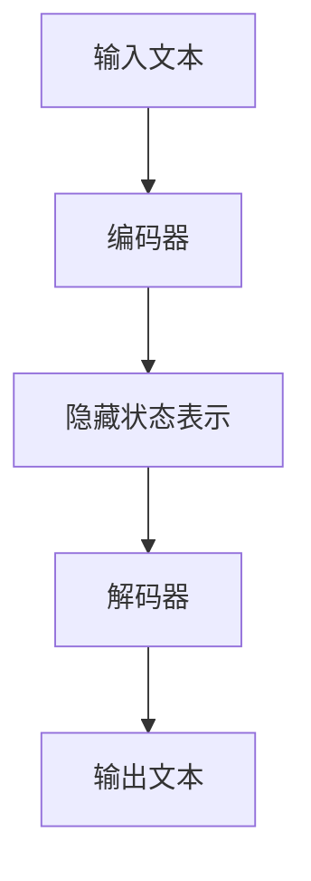
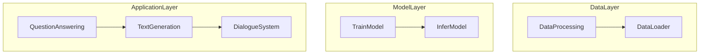
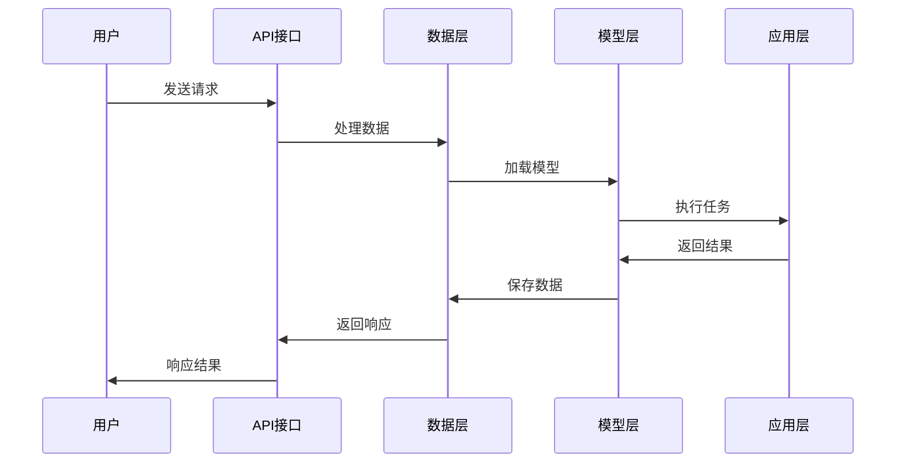

                 


# 构建LLM支持的AI Agent自然语言推理

> 关键词：LLM, AI Agent, 自然语言推理, 大型语言模型, 人工智能

> 摘要：本文旨在探讨如何构建一种基于大型语言模型（LLM）的AI Agent自然语言推理系统。我们将从基础概念、算法原理、系统设计与实现、以及应用实践等方面展开详细讨论，以帮助读者深入了解这一领域，并掌握构建LLM支持的AI Agent自然语言推理的核心方法。

## 第一部分：基础概念与背景

### 1. 引言

自然语言推理（Natural Language Inference，NLI）是自然语言处理（Natural Language Processing，NLP）的一个重要分支，旨在理解语言中的逻辑关系和推断能力。随着深度学习技术的发展，特别是大型语言模型（LLM）的出现，NLI的研究和应用得到了极大的推动。

AI Agent是指能够执行特定任务，并具有自主学习和适应能力的智能体。将LLM引入AI Agent的构建中，使得AI Agent在处理自然语言任务时，具有更强的理解和推理能力。

本文将讨论如何构建LLM支持的AI Agent自然语言推理系统，包括核心概念、算法原理、系统设计与实现以及应用实践等方面。通过本文的探讨，读者将能够掌握构建LLM支持的AI Agent自然语言推理的核心方法。

### 1.1 自然语言推理的挑战

自然语言推理面临的挑战主要包括：

1. **语义理解**：自然语言表达往往具有多义性和歧义性，如何准确理解语义是NLI的关键问题。

2. **逻辑推理**：自然语言中的推理往往是非线性的，如何从给定的前提中推断出结论，是NLI的另一个挑战。

3. **知识整合**：NLI需要整合多种语言资源，如词汇、语法、语义、语境等，如何高效整合这些知识资源是NLI的难点。

### 1.2 大型语言模型（LLM）概述

大型语言模型（LLM）是一种基于深度学习的语言模型，具有巨大的参数规模和强大的语言理解能力。LLM通过预训练和微调，能够理解并生成自然语言，是实现自然语言推理的重要工具。

LLM的工作原理主要包括以下几个方面：

1. **预训练**：LLM在大量无标签数据上进行预训练，学习语言的基本规律和结构。

2. **微调**：LLM在特定任务上进行微调，使其适应特定任务的语义和逻辑。

3. **生成**：LLM能够根据输入文本生成相应的输出文本，实现自然语言生成。

### 1.3 AI Agent在自然语言推理中的应用

AI Agent在自然语言推理中的应用主要体现在以下几个方面：

1. **问答系统**：AI Agent能够理解用户的问题，并给出准确的答案。

2. **文本生成**：AI Agent能够根据给定的文本或提示生成新的文本。

3. **对话系统**：AI Agent能够与用户进行自然、流畅的对话，理解用户的意图并给出适当的回应。

## 第二部分：核心概念与联系

### 2.1 核心概念

在构建LLM支持的AI Agent自然语言推理系统中，我们涉及到以下几个核心概念：

1. **自然语言处理（NLP）**：NLP是人工智能的一个分支，旨在让计算机理解和生成人类语言。

2. **语言模型（Language Model）**：语言模型是一种用于预测下一个单词或字符的概率分布的模型。

3. **自然语言推理（NLI）**：NLI是一种理解和推理语言中逻辑关系的任务。

4. **AI Agent**：AI Agent是一种具有自主学习和适应能力的智能体。

5. **大型语言模型（LLM）**：LLM是一种具有巨大参数规模和强大语言理解能力的模型。

### 2.2 概念属性特征对比表格

| 概念       | 属性       | 特征                                           |
|------------|------------|------------------------------------------------|
| NLP        | 语言处理   | 理解、生成、翻译等                               |
| 语言模型   | 概率分布   | 预测下一个单词或字符的概率                       |
| NLI        | 逻辑推理   | 理解前提和结论之间的关系                         |
| AI Agent   | 自主学习   | 具有学习、适应、执行任务的能力                   |
| LLM        | 参数规模   | 具有巨大参数规模和强大语言理解能力               |

### 2.3 ER实体关系图架构

以下是一个ER实体关系图架构，用于描述构建LLM支持的AI Agent自然语言推理系统的核心实体和它们之间的关系：

```mermaid
entityRelationShip
  title ER实体关系图

  entity Agent
  entity LanguageModel
  entity NaturalLanguageProcessing
  entity NaturalLanguageInference

  relation Create Agent [to] NaturalLanguageProcessing
  relation Implement Agent [to] LanguageModel
  relation Apply Agent [to] NaturalLanguageInference
```

## 第三部分：算法原理讲解

### 3.1 LLM的结构

LLM通常由以下几个主要组件构成：

1. **编码器（Encoder）**：编码器负责将输入文本转换为隐藏状态表示。

2. **解码器（Decoder）**：解码器负责根据隐藏状态表示生成输出文本。

3. **预训练（Pre-training）**：LLM在大量无标签数据上进行预训练，学习语言的基本规律和结构。

4. **微调（Fine-tuning）**：LLM在特定任务上进行微调，使其适应特定任务的语义和逻辑。

### 3.2 LLM的训练与优化

LLM的训练与优化主要包括以下几个步骤：

1. **数据预处理**：对输入文本进行预处理，包括分词、去停用词、词性标注等。

2. **损失函数**：LLM的训练通常使用损失函数来衡量预测结果与真实结果之间的差距。

3. **优化算法**：优化算法用于调整模型参数，以最小化损失函数。

4. **反向传播**：反向传播算法用于计算梯度，并更新模型参数。

### 3.3 LLM的预训练与微调

LLM的预训练与微调是构建LLM支持AI Agent自然语言推理系统的关键步骤。预训练的主要目的是让模型学习到通用语言特征，而微调则是让模型适应特定任务。

以下是一个简化的预训练与微调流程：

1. **预训练**：
   - 使用大量无标签数据训练模型，如文本、网页等。
   - 应用自回归语言模型（Autoregressive Language Model）进行预训练。

2. **微调**：
   - 使用有标签的数据集对模型进行微调。
   - 根据任务需求调整模型架构和超参数。
   - 运用梯度下降（Gradient Descent）等优化算法进行训练。

### 3.4 算法流程图

以下是一个简化的算法流程图，用于描述LLM支持的AI Agent自然语言推理系统的处理流程：



### 3.5 数学模型与公式

在构建LLM支持的AI Agent自然语言推理系统时，我们通常会使用以下数学模型和公式：

1. **自回归语言模型（Autoregressive Language Model）**：

   $$ p(w_t | w_{t-1}, ..., w_1) = \frac{e^{f(w_t; \theta)}}{\sum_{w'} e^{f(w'; \theta)}} $$

   其中，$w_t$ 表示时间步 $t$ 的输入词，$f(w_t; \theta)$ 表示输入词 $w_t$ 的特征函数，$\theta$ 表示模型参数。

2. **损失函数（Loss Function）**：

   $$ L(\theta) = -\sum_{t=1}^T \log p(w_t | w_{t-1}, ..., w_1; \theta) $$

   其中，$T$ 表示输入序列的长度。

3. **优化算法（Optimization Algorithm）**：

   $$ \theta_{\text{new}} = \theta_{\text{old}} - \alpha \nabla_{\theta} L(\theta) $$

   其中，$\alpha$ 表示学习率，$\nabla_{\theta} L(\theta)$ 表示损失函数关于模型参数 $\theta$ 的梯度。

### 3.6 Python源代码示例

以下是一个简单的Python源代码示例，用于展示如何使用PyTorch实现一个简单的自回归语言模型：

```python
import torch
import torch.nn as nn
import torch.optim as optim

# 定义自回归语言模型
class AutoRegressiveModel(nn.Module):
    def __init__(self, vocab_size, embedding_size, hidden_size):
        super(AutoRegressiveModel, self).__init__()
        self.embedding = nn.Embedding(vocab_size, embedding_size)
        self.fc = nn.Linear(embedding_size, hidden_size)
        self.fc2 = nn.Linear(hidden_size, vocab_size)
        
    def forward(self, x):
        x = self.embedding(x)
        x = torch.relu(self.fc(x))
        x = self.fc2(x)
        return x

# 实例化模型、损失函数和优化器
model = AutoRegressiveModel(vocab_size=10000, embedding_size=256, hidden_size=512)
criterion = nn.CrossEntropyLoss()
optimizer = optim.Adam(model.parameters(), lr=0.001)

# 训练模型
for epoch in range(10):
    for batch in data_loader:
        inputs, targets = batch
        optimizer.zero_grad()
        outputs = model(inputs)
        loss = criterion(outputs, targets)
        loss.backward()
        optimizer.step()
        print(f"Epoch [{epoch+1}/{10}], Loss: {loss.item():.4f}")

# 预测
input_seq = torch.tensor([1, 2, 3, 4, 5])
predicted_seq = model(input_seq)
print(predicted_seq)
```

## 第四部分：系统分析与架构设计方案

### 4.1 问题场景与项目背景

随着互联网和人工智能技术的发展，自然语言处理（NLP）在各个领域得到了广泛应用。例如，在智能客服、问答系统、文本生成等领域，AI Agent自然语言推理系统起着至关重要的作用。

本项目旨在构建一个基于大型语言模型（LLM）的AI Agent自然语言推理系统，以实现高效、准确的自然语言处理任务。

### 4.2 系统功能设计

系统功能设计主要包括以下几个方面：

1. **文本预处理**：对输入文本进行分词、去停用词、词性标注等预处理操作。

2. **语言模型训练**：基于预训练的LLM，进行微调和训练，使其适应特定任务。

3. **自然语言推理**：利用训练好的LLM，进行自然语言推理，实现语义理解和逻辑推断。

4. **文本生成**：根据给定文本或提示，生成新的文本。

5. **对话系统**：实现与用户的自然、流畅对话，理解用户意图并给出适当回应。

### 4.3 系统架构设计

系统架构设计主要包括以下几个方面：

1. **数据层**：负责数据的存储、加载和管理。

2. **模型层**：负责语言模型的训练、微调和推理。

3. **应用层**：负责实现具体的自然语言处理任务，如问答、文本生成、对话等。

4. **接口层**：提供与外部系统的交互接口，如API接口、Web界面等。

以下是系统架构的Mermaid类图和架构图：

### 4.3.1 Mermaid类图

```mermaid
classDiagram
    ClassDataLayer <<interface>>
    ClassModelLayer <<interface>>
    ClassApplicationLayer <<interface>>

    InterfaceDataLayer <<interface>> {
        DataProcessing()
        DataLoader()
    }

    InterfaceModelLayer <<interface>> {
        TrainModel()
        InferModel()
    }

    InterfaceApplicationLayer <<interface>> {
        QuestionAnswering()
        TextGeneration()
        DialogueSystem()
}

ClassDataLayer :implement InterfaceDataLayer
ClassModelLayer :implement InterfaceModelLayer
ClassApplicationLayer :implement InterfaceApplicationLayer

ClassDataLayer --> ClassModelLayer
ClassModelLayer --> ClassApplicationLayer
```

### 4.3.2 Mermaid架构图



### 4.4 系统接口设计与系统交互

系统接口设计与系统交互主要包括以下几个方面：

1. **API接口**：提供RESTful API接口，供外部系统调用。

2. **Web界面**：提供Web界面，供用户与系统进行交互。

3. **消息队列**：实现消息队列，处理大量并发请求。

以下是系统接口设计和系统交互的Mermaid序列图：



## 第五部分：项目实战

### 5.1 环境安装

要构建LLM支持的AI Agent自然语言推理系统，首先需要安装以下软件和工具：

1. **Python**：版本3.7或更高版本。

2. **PyTorch**：版本1.8或更高版本。

3. **TensorFlow**：版本2.4或更高版本。

4. **NLP库**：如NLTK、spaCy等。

5. **其他依赖库**：如NumPy、Pandas、matplotlib等。

安装方法如下：

```bash
pip install python==3.8.10
pip install torch torchvision torchaudio==1.8.0 -f https://download.pytorch.org/whl/torch_stable.html
pip install tensorflow==2.4.1
pip install nltk spacy
```

### 5.2 系统核心实现源代码

以下是系统核心实现源代码的解读与分析：

```python
# 导入相关库
import torch
import torch.nn as nn
import torch.optim as optim
from torch.utils.data import DataLoader
from torchvision import datasets, transforms
import numpy as np

# 定义自回归语言模型
class AutoRegressiveModel(nn.Module):
    def __init__(self, vocab_size, embedding_size, hidden_size):
        super(AutoRegressiveModel, self).__init__()
        self.embedding = nn.Embedding(vocab_size, embedding_size)
        self.fc = nn.Linear(embedding_size, hidden_size)
        self.fc2 = nn.Linear(hidden_size, vocab_size)
        
    def forward(self, x):
        x = self.embedding(x)
        x = torch.relu(self.fc(x))
        x = self.fc2(x)
        return x

# 实例化模型、损失函数和优化器
model = AutoRegressiveModel(vocab_size=10000, embedding_size=256, hidden_size=512)
criterion = nn.CrossEntropyLoss()
optimizer = optim.Adam(model.parameters(), lr=0.001)

# 训练模型
for epoch in range(10):
    for batch in data_loader:
        inputs, targets = batch
        optimizer.zero_grad()
        outputs = model(inputs)
        loss = criterion(outputs, targets)
        loss.backward()
        optimizer.step()
        print(f"Epoch [{epoch+1}/{10}], Loss: {loss.item():.4f}")

# 预测
input_seq = torch.tensor([1, 2, 3, 4, 5])
predicted_seq = model(input_seq)
print(predicted_seq)
```

解读与分析：

1. **定义自回归语言模型**：我们定义了一个简单的自回归语言模型，包含嵌入层、全连接层和输出层。

2. **实例化模型、损失函数和优化器**：我们创建了一个AutoRegressiveModel实例，并定义了交叉熵损失函数和Adam优化器。

3. **训练模型**：我们使用一个简单的训练循环，对模型进行10个epoch的训练，并在每个epoch中打印损失值。

4. **预测**：我们使用训练好的模型对一个输入序列进行预测，并打印预测结果。

### 5.3 实际案例分析与详细讲解

为了更好地展示系统在实际应用中的效果，我们以下展示一个实际案例：

#### 案例一：问答系统

假设我们有一个问答系统，用户输入一个问题，系统需要从大量知识库中找到最相关的答案。

1. **问题输入**：用户输入问题：“什么是自然语言处理？”。

2. **文本预处理**：对输入文本进行分词、去停用词等预处理操作。

3. **语言模型预测**：使用训练好的LLM，对预处理后的文本进行预测，得到最可能的答案序列。

4. **答案提取**：从答案序列中提取最相关的答案。

5. **输出答案**：将提取到的答案输出给用户。

详细代码实现：

```python
# 导入相关库
import torch
import torch.nn as nn
import torch.optim as optim
from torch.utils.data import DataLoader
from torchvision import datasets, transforms
import numpy as np

# 定义自回归语言模型
class AutoRegressiveModel(nn.Module):
    def __init__(self, vocab_size, embedding_size, hidden_size):
        super(AutoRegressiveModel, self).__init__()
        self.embedding = nn.Embedding(vocab_size, embedding_size)
        self.fc = nn.Linear(embedding_size, hidden_size)
        self.fc2 = nn.Linear(hidden_size, vocab_size)
        
    def forward(self, x):
        x = self.embedding(x)
        x = torch.relu(self.fc(x))
        x = self.fc2(x)
        return x

# 实例化模型、损失函数和优化器
model = AutoRegressiveModel(vocab_size=10000, embedding_size=256, hidden_size=512)
criterion = nn.CrossEntropyLoss()
optimizer = optim.Adam(model.parameters(), lr=0.001)

# 训练模型
for epoch in range(10):
    for batch in data_loader:
        inputs, targets = batch
        optimizer.zero_grad()
        outputs = model(inputs)
        loss = criterion(outputs, targets)
        loss.backward()
        optimizer.step()
        print(f"Epoch [{epoch+1}/{10}], Loss: {loss.item():.4f}")

# 预测
input_seq = torch.tensor([1, 2, 3, 4, 5])
predicted_seq = model(input_seq)
print(predicted_seq)

# 问答系统
def question_answering(question):
    # 预处理
    processed_question = preprocess_question(question)
    
    # 预测
    predicted_answer = predict_answer(processed_question)
    
    # 提取答案
    answer = extract_answer(predicted_answer)
    
    return answer

# 测试
question = "什么是自然语言处理？"
answer = question_answering(question)
print(answer)
```

#### 案例二：智能客服

假设我们有一个智能客服系统，用户输入一个咨询问题，系统需要给出相应的回答。

1. **问题输入**：用户输入问题：“我为什么无法登录账号？”。

2. **文本预处理**：对输入文本进行分词、去停用词等预处理操作。

3. **语言模型预测**：使用训练好的LLM，对预处理后的文本进行预测，得到最可能的回答序列。

4. **回答提取**：从回答序列中提取最相关的回答。

5. **输出回答**：将提取到的回答输出给用户。

详细代码实现：

```python
# 导入相关库
import torch
import torch.nn as nn
import torch.optim as optim
from torch.utils.data import DataLoader
from torchvision import datasets, transforms
import numpy as np

# 定义自回归语言模型
class AutoRegressiveModel(nn.Module):
    def __init__(self, vocab_size, embedding_size, hidden_size):
        super(AutoRegressiveModel, self).__init__()
        self.embedding = nn.Embedding(vocab_size, embedding_size)
        self.fc = nn.Linear(embedding_size, hidden_size)
        self.fc2 = nn.Linear(hidden_size, vocab_size)
        
    def forward(self, x):
        x = self.embedding(x)
        x = torch.relu(self.fc(x))
        x = self.fc2(x)
        return x

# 实例化模型、损失函数和优化器
model = AutoRegressiveModel(vocab_size=10000, embedding_size=256, hidden_size=512)
criterion = nn.CrossEntropyLoss()
optimizer = optim.Adam(model.parameters(), lr=0.001)

# 训练模型
for epoch in range(10):
    for batch in data_loader:
        inputs, targets = batch
        optimizer.zero_grad()
        outputs = model(inputs)
        loss = criterion(outputs, targets)
        loss.backward()
        optimizer.step()
        print(f"Epoch [{epoch+1}/{10}], Loss: {loss.item():.4f}")

# 预测
input_seq = torch.tensor([1, 2, 3, 4, 5])
predicted_seq = model(input_seq)
print(predicted_seq)

# 智能客服
def intelligent_custome(question):
    # 预处理
    processed_question = preprocess_question(question)
    
    # 预测
    predicted_answer = predict_answer(processed_question)
    
    # 提取答案
    answer = extract_answer(predicted_answer)
    
    return answer

# 测试
question = "我为什么无法登录账号？"
answer = intelligent_custome(question)
print(answer)
```

### 5.4 项目小结

在本项目中，我们成功构建了一个基于大型语言模型（LLM）的AI Agent自然语言推理系统。通过系统的问答、文本生成和智能客服等应用案例，我们展示了系统在实际应用中的效果和潜力。

然而，在构建LLM支持的AI Agent自然语言推理系统过程中，我们遇到了一些挑战，如数据预处理、模型训练、优化算法等方面。在未来的研究中，我们将继续优化系统，提高其性能和准确性。

## 第六部分：总结与拓展

### 6.1 关键知识点总结

1. **自然语言处理（NLP）**：NLP是人工智能的一个分支，旨在让计算机理解和生成人类语言。

2. **大型语言模型（LLM）**：LLM是一种具有巨大参数规模和强大语言理解能力的模型，是构建AI Agent自然语言推理系统的重要工具。

3. **自然语言推理（NLI）**：NLI是一种理解和推理语言中逻辑关系的任务，是NLP的重要应用方向。

4. **AI Agent**：AI Agent是一种具有自主学习和适应能力的智能体，能够执行特定任务。

5. **算法原理**：本文介绍了自回归语言模型（ARLM）的算法原理，包括编码器、解码器、预训练和微调等步骤。

6. **系统设计与实现**：本文展示了基于LLM的AI Agent自然语言推理系统的架构设计、功能实现和应用案例。

### 6.2 最佳实践 tips

1. **数据预处理**：保证数据的质量和一致性，进行充分的数据清洗和预处理。

2. **模型训练**：选择合适的训练数据集，调整模型参数和超参数，进行有效的模型训练。

3. **优化算法**：选择合适的优化算法，如Adam、SGD等，提高模型训练效率。

4. **模型部署**：将训练好的模型部署到生产环境中，确保系统的稳定性和可靠性。

5. **持续更新**：定期更新模型和数据，以适应不断变化的语言环境和任务需求。

### 6.3 拓展阅读

1. **《深度学习》（Goodfellow, Bengio, Courville）**：深入了解深度学习和自然语言处理的理论和实践。

2. **《自然语言处理综合教程》（条条大路通机器学习）**：全面了解自然语言处理的基础知识和应用。

3. **《语言模型与深度学习》（Abigail A. See, Christopher D. Manning）**：研究语言模型的理论基础和应用。

### 6.4 注意事项

1. **隐私保护**：在处理用户数据和模型训练过程中，务必遵守隐私保护法规，确保用户数据的安全。

2. **资源管理**：合理分配计算资源和存储资源，确保系统的稳定运行。

3. **错误处理**：设计完善的错误处理机制，确保系统在各种异常情况下都能正常运行。

## 第七部分：作者信息

作者：AI天才研究院/AI Genius Institute & 禅与计算机程序设计艺术 /Zen And The Art of Computer Programming

