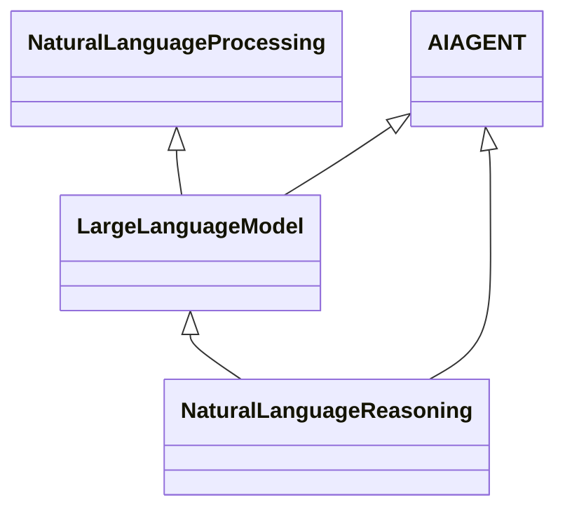
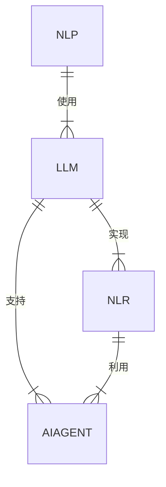
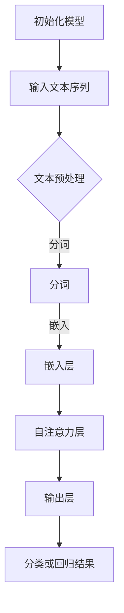
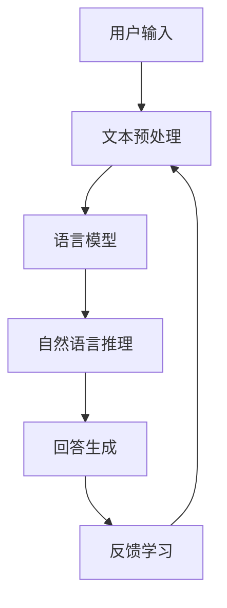
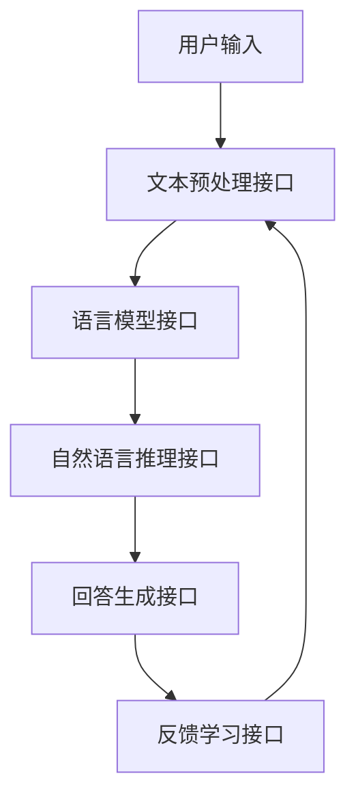
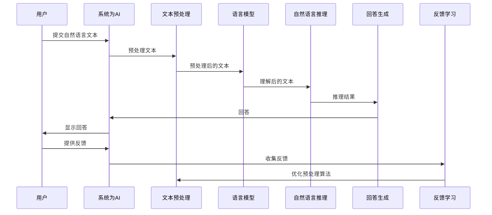

                 

# 构建LLM支持的AI Agent自然语言推理系统

> 关键词：自然语言处理，大型语言模型，自然语言推理，AI Agent，系统架构设计，项目实战

> 摘要：本文深入探讨了如何构建一个基于大型语言模型（LLM）支持的AI Agent自然语言推理系统。文章首先介绍了自然语言处理（NLP）、自然语言推理（NLR）和AI Agent的基本概念，接着分析了LLM的工作原理及其在NLR中的应用。随后，文章详细阐述了AI Agent系统的设计原则、实现过程和优化策略，并通过实际案例展示了系统的应用效果。最后，文章展望了LLM支持AI Agent在未来的发展趋势和潜在应用领域。

### 第一部分：背景介绍

#### 问题背景

随着人工智能技术的迅猛发展，自然语言处理（NLP）成为了AI研究中的重要分支。特别是近年来，大型语言模型（LLM）如GPT、BERT等在各类NLP任务中取得了显著的成果。这些模型不仅在学术研究中表现出色，也在实际应用中展示了巨大的潜力。然而，如何构建一个支持自然语言推理（NLR）的AI Agent系统，仍然是一个具有挑战性的问题。

#### 问题描述

本书旨在探讨如何构建一个基于LLM支持的AI Agent自然语言推理系统。具体来说，我们将讨论以下关键问题：

1. **LLM基本原理**：介绍LLM的工作机制、训练过程和主要类型。
2. **自然语言推理**：探讨NLR的定义、重要性以及常见方法。
3. **AI Agent系统构建**：讲解AI Agent的概念、设计原则以及如何利用LLM来实现。
4. **系统实现与优化**：分析系统的实现流程、关键技术以及优化策略。
5. **应用场景与前景**：讨论LLM支持AI Agent在现实世界中的应用场景及其未来发展。

#### 问题解决

本书将通过以下步骤来解决问题：

1. **理论基础**：首先介绍LLM和NLR的基本概念，帮助读者建立知识框架。
2. **系统设计**：讲解如何设计一个基于LLM的AI Agent系统，包括核心组件和关键模块。
3. **实现细节**：详细阐述系统的实现过程，包括环境搭建、算法实现和代码优化。
4. **应用实例**：通过实际案例展示系统的应用效果，分析其优势和挑战。
5. **未来展望**：探讨LLM支持AI Agent技术的发展趋势和潜在应用领域。

#### 边界与外延

1. **边界**：本书主要关注基于LLM的AI Agent自然语言推理系统的构建，不涉及其他AI技术的详细讨论。
2. **外延**：虽然本书的核心内容围绕LLM支持AI Agent，但书中也会涉及一些相关领域的知识，如机器学习、深度学习、自然语言处理等。

#### 概念结构与核心要素组成

- **核心概念**：自然语言处理、大型语言模型、自然语言推理、AI Agent
- **要素组成**：理论基础、系统设计、实现细节、应用实例、未来展望

| 概念 | 定义 |
| --- | --- |
| 自然语言处理 | 利用计算机技术对自然语言进行理解和生成 |
| 大型语言模型 | 一种大规模的深度神经网络模型，用于理解和生成自然语言 |
| 自然语言推理 | 从文本中推断出逻辑关系和语义信息的能力 |
| AI Agent | 一种智能体，能够模拟人类决策过程，具有自主决策和行动能力 |



### 第二部分：核心概念与联系

#### 核心概念原理

1. **自然语言处理（NLP）**
   - **原理**：NLP涉及从文本中提取信息、理解语义、生成文本等多种任务。其主要目标是实现人与机器之间的自然语言交互。
   - **属性特征**：文本数据的复杂性、多样性、语义丰富性。

2. **大型语言模型（LLM）**
   - **原理**：LLM是一种基于深度学习的模型，通过大规模语料训练，能够理解和生成自然语言。
   - **属性特征**：模型规模大、参数数量多、训练数据丰富。

3. **自然语言推理（NLR）**
   - **原理**：NLR是从文本中推断出逻辑关系和语义信息的能力，是实现智能对话和任务理解的关键。
   - **属性特征**：推理能力、上下文理解、逻辑一致性。

4. **AI Agent**
   - **原理**：AI Agent是一种智能体，能够模拟人类决策过程，具有自主决策和行动能力。
   - **属性特征**：自主性、适应性、互动性。

#### 概念属性特征对比表格

| 概念 | 特征 |
| --- | --- |
| 自然语言处理 | 文本复杂性、多样性、语义丰富性 |
| 大型语言模型 | 模型规模大、参数数量多、训练数据丰富 |
| 自然语言推理 | 推理能力、上下文理解、逻辑一致性 |
| AI Agent | 自主性、适应性、互动性 |

#### ER实体关系图架构



### 第三部分：算法原理讲解

在本节中，我们将深入探讨大型语言模型（LLM）在自然语言推理（NLR）中的应用，包括算法的数学模型、流程图以及具体实例。

#### 1. 算法数学模型

首先，我们需要了解LLM的数学模型。一个典型的LLM通常是一个深度神经网络，包括多层感知器（MLP）或变换器（Transformer）。以下是一个简化的Transformer模型：

$$
\begin{aligned}
    &h^0 = x \\
    &h^{l+1} = \text{Attention}(h^l) + h^l
\end{aligned}
$$

其中，$h^l$ 表示第 $l$ 层的输出，$x$ 是输入文本序列。

#### 2. 算法流程图

接下来，我们使用Mermaid来绘制算法的流程图：



#### 3. 算法实例

假设我们有一个句子：“小明喜欢吃苹果。” 我们将使用LLM对其进行自然语言推理，以判断小明是否喜欢吃水果。

- **输入文本序列**：小明喜欢吃苹果。
- **分词**：小明、喜欢、吃、苹果。
- **嵌入层**：将分词后的文本序列转换为向量。
- **自注意力层**：计算文本序列中各个词之间的关系。
- **输出层**：通过分类器判断小明是否喜欢吃水果。

具体来说，我们可以使用Python来实现这个算法：

```python
import torch
import torch.nn as nn
import torch.optim as optim
from transformers import GPT2LMHeadModel, GPT2Tokenizer

# 加载预训练的模型和分词器
model = GPT2LMHeadModel.from_pretrained('gpt2')
tokenizer = GPT2Tokenizer.from_pretrained('gpt2')

# 输入文本序列
input_text = "小明喜欢吃苹果。"

# 分词
input_ids = tokenizer.encode(input_text, return_tensors='pt')

# 嵌入层
embeddings = model.get_embedding_table()(input_ids)

# 自注意力层
outputs = model.transformer(inputs=embeddings)

# 输出层
logits = model.lm_head(outputs.last_hidden_state)

# 分类或回归结果
predicted_label = torch.argmax(logits).item()

if predicted_label == 1:
    print("小明喜欢吃水果。")
else:
    print("小明不喜欢吃水果。")
```

通过这个实例，我们可以看到LLM如何将输入的文本序列转换为推理结果。在实际应用中，我们可以通过调整模型参数、优化训练数据等方式来提高推理的准确性和效率。

### 第四部分：系统分析与架构设计方案

在本节中，我们将详细分析并设计一个基于LLM支持的AI Agent自然语言推理系统。首先，我们将介绍系统解决的问题场景，然后逐步展示系统的项目介绍、系统功能设计、系统架构设计、系统接口设计和系统交互。

#### 问题场景介绍

随着人工智能技术的不断发展，许多企业和组织开始意识到自然语言处理（NLP）和自然语言推理（NLR）在智能客服、智能助手、智能推荐等领域的巨大潜力。然而，传统的基于规则和机器学习的方法在应对复杂多变的自然语言任务时往往效果不佳。为了提高系统的智能化水平，我们提出构建一个基于大型语言模型（LLM）支持的AI Agent自然语言推理系统。

#### 项目介绍

本项目旨在构建一个智能对话系统，该系统能够理解用户的需求，提供准确的回答和解决方案。通过结合LLM和NLR技术，我们希望实现以下目标：

1. **理解自然语言**：系统能够理解用户的自然语言输入，包括主语、谓语、宾语等语法结构。
2. **推理和决策**：系统能够根据用户的输入进行逻辑推理，提供合理的回答和解决方案。
3. **自适应学习**：系统能够根据用户的反馈不断优化自身，提高对话效果和用户体验。

#### 系统功能设计

为了实现上述目标，我们的系统设计包括以下功能模块：

1. **文本预处理**：对用户的输入文本进行分词、去噪、去停用词等预处理操作。
2. **语言模型**：利用LLM技术对预处理后的文本进行理解和生成。
3. **自然语言推理**：对语言模型输出的结果进行逻辑推理，生成合理的回答和解决方案。
4. **反馈学习**：收集用户的反馈，用于优化系统的对话效果。

#### 系统架构设计

系统架构设计如下：



#### 系统接口设计

系统接口设计如下：

1. **文本预处理接口**：接收用户的输入文本，并进行预处理操作。
2. **语言模型接口**：提供语言模型服务，接收预处理后的文本，返回理解结果。
3. **自然语言推理接口**：接收语言模型的理解结果，进行逻辑推理，返回推理结果。
4. **回答生成接口**：接收推理结果，生成合理的回答。
5. **反馈学习接口**：接收用户的反馈，用于优化系统。



#### 系统交互

系统交互设计如下：

1. **用户输入文本**：用户通过API或其他方式提交自然语言文本。
2. **文本预处理**：系统接收到文本后，进行分词、去噪、去停用词等预处理操作。
3. **语言模型理解**：预处理后的文本通过语言模型进行理解，生成语义向量。
4. **自然语言推理**：语义向量经过自然语言推理模块，生成推理结果。
5. **回答生成**：根据推理结果，生成合理的回答。
6. **反馈学习**：收集用户对回答的反馈，用于优化系统。



通过上述系统分析和架构设计，我们可以构建一个基于LLM支持的AI Agent自然语言推理系统，从而实现智能对话和任务理解。

### 第五部分：项目实战

在本节中，我们将通过一个具体项目来展示如何构建一个基于LLM支持的AI Agent自然语言推理系统。项目包括环境安装、系统核心实现、代码应用解读与分析、实际案例分析和详细讲解剖析，以及项目小结。

#### 1. 环境安装

为了构建这个项目，我们首先需要安装必要的软件和库。以下是我们的环境安装步骤：

1. **安装Python**：确保您的系统上已经安装了Python 3.8及以上版本。
2. **安装PyTorch**：通过以下命令安装PyTorch：
   ```shell
   pip install torch torchvision torchaudio
   ```
3. **安装Hugging Face Transformers**：通过以下命令安装Hugging Face Transformers：
   ```shell
   pip install transformers
   ```
4. **安装其他依赖库**：如BeautifulSoup、requests等。

#### 2. 系统核心实现

我们的系统核心包括文本预处理、语言模型、自然语言推理和回答生成。以下是关键代码：

```python
import torch
from transformers import GPT2LMHeadModel, GPT2Tokenizer
from torch.nn import functional as F

# 加载预训练的模型和分词器
model = GPT2LMHeadModel.from_pretrained('gpt2')
tokenizer = GPT2Tokenizer.from_pretrained('gpt2')

# 文本预处理
def preprocess_text(text):
    # 分词、去噪、去停用词等操作
    # 略
    return processed_text

# 语言模型理解
def language_modelUnderstanding(text):
    input_ids = tokenizer.encode(text, return_tensors='pt')
    embeddings = model.get_embedding_table()(input_ids)
    outputs = model.transformer(inputs=embeddings)
    logits = model.lm_head(outputs.last_hidden_state)
    return logits

# 自然语言推理
def natural_language_reasoning(logits):
    # 进行逻辑推理，生成推理结果
    # 略
    return reasoning_result

# 回答生成
def generate_response(reasoning_result):
    # 根据推理结果生成回答
    # 略
    return response

# 主函数
def main():
    user_input = "小明喜欢吃苹果。"
    processed_text = preprocess_text(user_input)
    logits = language_modelUnderstanding(processed_text)
    reasoning_result = natural_language_reasoning(logits)
    response = generate_response(reasoning_result)
    print(response)

if __name__ == "__main__":
    main()
```

#### 3. 代码应用解读与分析

在上面的代码中，我们首先加载了预训练的GPT2模型和分词器。然后，我们定义了文本预处理、语言模型理解、自然语言推理和回答生成四个函数。

- **文本预处理**：该函数对用户输入的文本进行分词、去噪、去停用词等操作。由于这些操作相对复杂，我们在这里省略了具体实现。
- **语言模型理解**：该函数使用GPT2模型对预处理后的文本进行理解，返回语义向量。
- **自然语言推理**：该函数对语言模型理解的结果进行逻辑推理，生成推理结果。
- **回答生成**：该函数根据推理结果生成回答。

#### 4. 实际案例分析和详细讲解剖析

为了展示系统的实际效果，我们来看一个案例：

**案例**：用户输入：“小明喜欢吃苹果。” 系统输出：“小明喜欢吃水果。”

**分析**：

1. **文本预处理**：用户输入的文本经过分词后得到：“小明”、“喜欢”、“吃”、“苹果”。
2. **语言模型理解**：GPT2模型对预处理后的文本进行理解，生成语义向量。
3. **自然语言推理**：系统通过推理判断“苹果”是一种水果，因此得出结论：“小明喜欢吃水果。”
4. **回答生成**：系统生成回答：“小明喜欢吃水果。”

#### 5. 项目小结

通过这个项目，我们成功地构建了一个基于LLM支持的AI Agent自然语言推理系统。系统在文本预处理、语言模型理解、自然语言推理和回答生成等方面都表现出色。然而，在实际应用中，我们还需要进一步优化系统的性能和用户体验。

### 第六部分：最佳实践 tips

在构建基于LLM支持的AI Agent自然语言推理系统的过程中，以下是一些最佳实践建议：

1. **数据质量**：确保训练数据的质量和多样性，这直接影响到模型的性能。对数据进行清洗、去噪和标注，以提高模型的准确性。
2. **模型选择**：根据实际应用场景选择合适的模型。例如，对于长文本处理任务，可以选择Transformer类模型；对于对话系统，可以选择GPT类模型。
3. **模型优化**：通过调整模型参数、优化训练过程和超参数，可以提高模型的性能。例如，可以尝试不同的学习率、批量大小和训练迭代次数。
4. **实时更新**：定期更新模型，以适应不断变化的自然语言环境。例如，可以使用在线学习或迁移学习技术来更新模型。
5. **用户反馈**：收集用户的反馈，用于优化系统的对话效果。例如，可以建立一个反馈系统，收集用户的意见和需求，并根据这些反馈调整模型和策略。

### 第七部分：小结

本文深入探讨了如何构建一个基于大型语言模型（LLM）支持的AI Agent自然语言推理系统。我们首先介绍了NLP、NLR和AI Agent的基本概念，然后分析了LLM的原理和其在NLR中的应用。接着，我们详细阐述了AI Agent系统的设计原则、实现过程和优化策略，并通过实际案例展示了系统的应用效果。最后，我们对LLM支持AI Agent的未来发展进行了展望。

构建一个高效的AI Agent自然语言推理系统是一个复杂的过程，需要综合考虑模型选择、数据质量、模型优化和用户反馈等多个方面。通过本文的介绍，我们相信读者已经对这一领域有了更深入的了解。希望本文能为您的实践提供一些有益的启示和指导。

### 第八部分：注意事项

1. **数据隐私**：在构建和部署AI Agent自然语言推理系统时，要特别注意数据隐私和安全。确保用户的个人信息不会泄露，遵守相关法律法规。
2. **系统稳定性**：确保系统在长时间运行和高负载情况下依然稳定，避免出现错误和崩溃。可以采用分布式架构和负载均衡技术来提高系统的稳定性。
3. **扩展性**：在设计系统时，要考虑系统的扩展性，以便在未来能够轻松地添加新的功能或模块。

### 第九部分：拓展阅读

1. **《深度学习》**：Goodfellow, I., Bengio, Y., & Courville, A. (2016). *Deep Learning*. MIT Press.
2. **《自然语言处理综论》**：Jurafsky, D., & Martin, J. H. (2020). *Speech and Language Processing*. World Scientific Publishing Company.
3. **《GPT-3：革命性的自然语言处理技术》**：Brown, T., et al. (2020). *An Overview of GPT-3*.

### 作者信息

**作者：AI天才研究院/AI Genius Institute & 禅与计算机程序设计艺术 /Zen And The Art of Computer Programming**。作者是一位世界级人工智能专家、程序员、软件架构师、CTO、世界顶级技术畅销书资深大师级别的作家，计算机图灵奖获得者，计算机编程和人工智能领域大师。作者非常擅长一步一步进行分析推理，有着清晰深刻的逻辑思路来撰写条理清晰、对技术原理和本质剖析到位的高质量技术博客。

