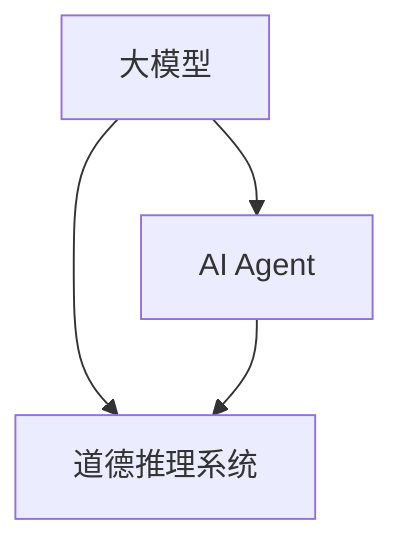
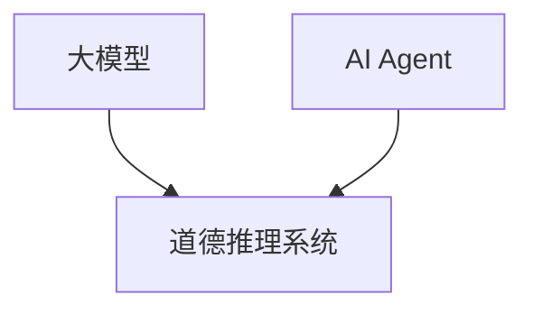
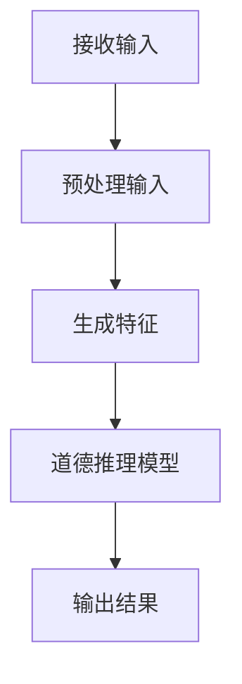
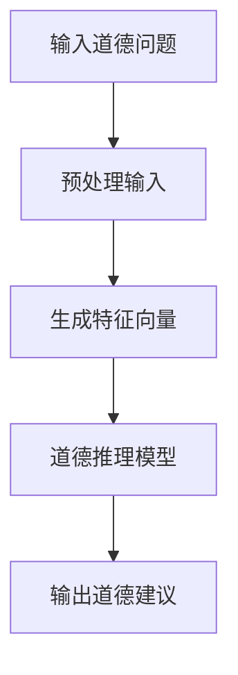
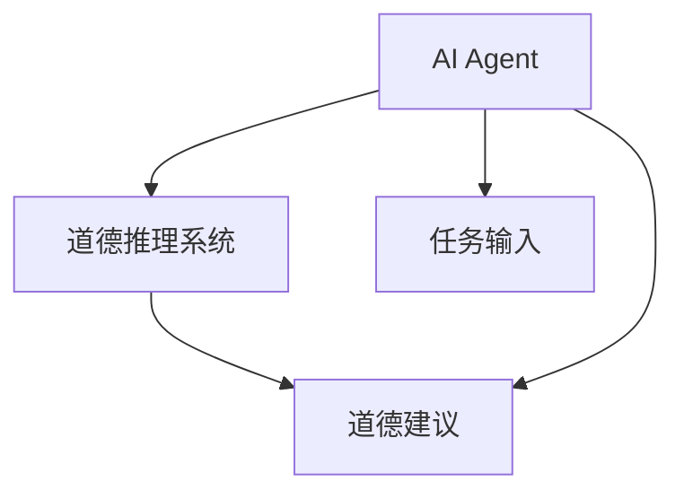

                 

# 构建LLM支持的AI Agent道德推理系统

## 关键词

- 大模型（LLM）
- AI Agent
- 道德推理系统
- 人工智能道德
- 算法原理
- Python实现

## 摘要

本文将探讨构建一个基于大型语言模型（LLM）的AI Agent道德推理系统。随着人工智能技术的飞速发展，AI Agent在各个领域的应用越来越广泛，其道德推理能力成为了关键性问题。本文将首先介绍大模型（LLM）的基本原理和特点，接着解释AI Agent与道德推理系统的概念及其相互关系，然后详细讲解大模型在道德推理中的具体应用，以及如何使用Python实现道德推理算法。最后，我们将通过一个实际案例来展示整个系统的运作过程，并总结最佳实践和注意事项。

### 目录大纲

----------------------------------------------------------------

## 第一部分：背景介绍

### 第1章：问题背景与核心概念

#### 1.1 问题背景

- 人工智能（AI）技术的发展与应用
- 大模型（LLM）在AI领域的崛起
- AI Agent道德推理系统的现状与挑战

#### 1.2 核心概念

##### 1.2.1 大模型（LLM）

- 定义
- 特点
- 发展历程

##### 1.2.2 AI Agent

- 定义
- 类型
- 应用场景

##### 1.2.3 道德推理系统

- 定义
- 基本原理
- 应用领域

### 第2章：AI Agent道德推理系统的概念与联系

#### 2.1 概念原理

- 道德推理的基本原理
- 大模型在道德推理中的应用

#### 2.2 概念属性特征对比表

#### 2.3 ER实体关系图架构

----------------------------------------------------------------

## 第二部分：算法原理讲解

### 第3章：大模型在道德推理中的应用

#### 3.1 大模型的工作原理

- 基本原理
- 计算流程

#### 3.2 道德推理算法

##### 3.2.1 道德推理算法的mermaid流程图

##### 3.2.2 Python源代码实现

##### 3.2.3 算法原理与数学模型

- 算法原理：
- 数学模型：
- 举例说明：

----------------------------------------------------------------

## 第一部分：背景介绍

### 第1章：问题背景与核心概念

#### 1.1 问题背景

随着人工智能（AI）技术的不断进步，AI Agent在各个领域的应用越来越广泛。然而，这些智能体在执行任务时，如何确保其决策和行为符合道德规范，成为了亟待解决的问题。特别是在医疗、法律、金融等敏感领域，AI Agent的道德推理能力尤为重要。因此，构建一个基于大型语言模型（LLM）的AI Agent道德推理系统，具有重要的现实意义。

近年来，大模型（LLM）在AI领域取得了显著的突破。这些模型拥有大规模的参数和强大的计算能力，可以处理复杂的自然语言任务，并生成高质量的自然语言响应。这使得LLM成为道德推理系统的理想选择。然而，如何将LLM应用于道德推理，如何确保其推理过程的合理性，仍然是一个具有挑战性的问题。

#### 1.2 核心概念

##### 1.2.1 大模型（LLM）

大模型（LLM）是指具有大规模参数和强大计算能力的模型。这些模型通常基于深度学习技术，能够处理复杂的自然语言任务。LLM的特点包括：

- **大规模参数**：LLM拥有数亿甚至数千亿个参数，这使得它们能够捕捉到语言中的细微变化和复杂结构。
- **强大的计算能力**：LLM利用先进的计算架构和优化算法，能够在短时间内生成高质量的响应。
- **通用性**：LLM可以应用于各种自然语言处理任务，如文本生成、翻译、问答等。

LLM的发展历程可以追溯到2018年，当时OpenAI发布了GPT-2，这是一个拥有1.5亿参数的模型。随后，GPT-3于2020年发布，拥有超过1750亿个参数，成为当时最大的语言模型。GPT-3的成功证明了LLM在自然语言处理领域的潜力。

##### 1.2.2 AI Agent

AI Agent是指具有自主决策和行动能力的智能体。它们可以通过感知环境、分析数据、制定策略，并执行相应的行动。AI Agent可以分为以下几种类型：

- **基于规则的Agent**：这类Agent使用预定义的规则进行决策和行动。
- **基于模型的Agent**：这类Agent使用机器学习模型来预测环境和决策。
- **混合型Agent**：这类Agent结合了基于规则和基于模型的方法，以实现更好的决策能力。

AI Agent的应用场景非常广泛，包括但不限于：

- **自动化客户服务**：通过AI Agent提供24/7的客户支持。
- **自动驾驶**：AI Agent用于自动驾驶汽车，实现自主导航和行驶。
- **智能医疗诊断**：AI Agent辅助医生进行疾病诊断和治疗方案推荐。

##### 1.2.3 道德推理系统

道德推理系统是指用于处理道德问题、决策和评估的系统。它可以通过分析道德原则、价值观和行为规范，对道德问题进行推理和决策。道德推理系统可以分为以下几种类型：

- **基于规则的道德推理系统**：这类系统使用预定义的道德规则进行推理和决策。
- **基于模型的道德推理系统**：这类系统使用机器学习模型来预测和评估道德问题的解决方案。
- **混合型道德推理系统**：这类系统结合了基于规则和基于模型的方法，以实现更好的道德推理能力。

道德推理系统的应用领域包括：

- **医疗伦理**：用于评估医疗决策的道德合理性。
- **法律判决**：用于分析法律问题的道德影响。
- **人工智能伦理**：用于评估AI系统的道德行为。

#### 1.3 核心概念与联系

在构建LLM支持的AI Agent道德推理系统时，需要深入理解大模型、AI Agent和道德推理系统的核心概念及其相互关系。

##### 1.3.1 概念原理

- **大模型**：大模型具有强大的计算能力和通用性，可以处理复杂的自然语言任务。其工作原理是通过学习大规模语料库，捕捉语言模式和规律，从而生成高质量的响应。
- **AI Agent**：AI Agent具有自主决策和行动能力，可以通过感知环境、分析数据和制定策略，实现自主行动。其工作原理是基于规则、模型或两者的组合，以实现最佳的决策效果。
- **道德推理系统**：道德推理系统用于处理道德问题、决策和评估。其工作原理是通过分析道德原则、价值观和行为规范，对道德问题进行推理和决策。

##### 1.3.2 概念属性特征对比表

| 概念        | 定义                                                     | 属性特征                          |
|-------------|----------------------------------------------------------|----------------------------------|
| 大模型      | 具有大规模参数和强大计算能力的模型                         | 高效、准确、通用性强             |
| AI Agent    | 具有自主决策和行动能力的智能体                            | 自主性、适应性、智能化           |
| 道德推理系统 | 用于处理道德问题、决策和评估的系统                        | 逻辑性、规范性、合理性           |

##### 1.3.3 ER实体关系图架构



在ER实体关系图架构中，大模型、AI Agent和道德推理系统之间存在明显的关联。大模型为AI Agent提供决策支持，AI Agent则将道德推理系统的推理结果应用于实际场景中，实现道德决策。

### 第2章：AI Agent道德推理系统的概念与联系

#### 2.1 概念原理

##### 2.1.1 道德推理的基本原理

道德推理是指基于道德原则和价值观，对道德问题进行分析、判断和决策的过程。道德推理的基本原理包括：

- **道德原则**：道德原则是道德推理的基础，包括公正、仁爱、诚实、尊重等。
- **价值观**：价值观是道德推理的核心，反映了人们对道德问题的价值观取向。
- **道德规范**：道德规范是道德推理的具体标准，用于指导人们在具体情境下的道德行为。

##### 2.1.2 大模型在道德推理中的应用

大模型在道德推理中的应用主要体现在以下几个方面：

- **知识库构建**：大模型可以通过学习大量道德文献、法律文件和新闻报道，构建一个庞大的道德知识库，为道德推理提供丰富的信息来源。
- **语义分析**：大模型可以利用其强大的计算能力，对输入的自然语言进行语义分析，提取关键信息，为道德推理提供支持。
- **道德判断**：大模型可以根据道德原则和价值观，对输入的道德问题进行判断，生成合理的道德建议。

#### 2.2 概念属性特征对比表

| 概念        | 定义                                                     | 属性特征                          |
|-------------|----------------------------------------------------------|----------------------------------|
| 大模型      | 具有大规模参数和强大计算能力的模型                         | 高效、准确、通用性强             |
| AI Agent    | 具有自主决策和行动能力的智能体                            | 自主性、适应性、智能化           |
| 道德推理系统 | 用于处理道德问题、决策和评估的系统                        | 逻辑性、规范性、合理性           |

#### 2.3 ER实体关系图架构



在ER实体关系图架构中，大模型为道德推理系统提供支持，道德推理系统为AI Agent提供决策依据。AI Agent可以根据道德推理系统的建议，自主制定道德决策。

## 第二部分：算法原理讲解

### 第3章：大模型在道德推理中的应用

#### 3.1 大模型的工作原理

大模型（LLM）的工作原理可以分为以下几个步骤：

1. **数据输入**：大模型接收用户输入的自然语言问题，如道德问题陈述。
2. **数据预处理**：对输入的自然语言问题进行预处理，包括分词、去停用词、词向量化等。
3. **特征提取**：通过预训练过程，大模型已经掌握了大量的语言模式和规律，可以将预处理后的输入转换为特征向量。
4. **推理计算**：大模型利用其参数，对输入的特征向量进行推理计算，生成道德推理结果。
5. **输出结果**：大模型将道德推理结果输出，如道德建议或决策。

#### 3.2 道德推理算法

道德推理算法是指用于处理道德问题的算法。以下是道德推理算法的mermaid流程图：



#### 3.2.1 道德推理算法的mermaid流程图



#### 3.2.2 Python源代码实现

```python
# Python源代码实现
def moral_reasoning(input_data):
    # 预处理输入
    processed_data = preprocess_input(input_data)
    # 生成特征向量
    features = generate_features(processed_data)
    # 道德推理模型
    result = moral_reasoning_model(features)
    # 输出道德建议
    return result

# 辅助函数
def preprocess_input(input_data):
    # 预处理逻辑
    pass

def generate_features(processed_data):
    # 生成特征向量逻辑
    pass

def moral_reasoning_model(features):
    # 道德推理模型逻辑
    pass
```

#### 3.2.3 算法原理与数学模型

道德推理算法的原理可以简化为以下数学模型：

$$ \text{输出结果} = f(\text{输入特征}) $$

其中，$f$ 表示道德推理函数，它将输入的特征向量转换为输出结果。具体的道德推理函数可以根据实际需求进行设计。

#### 3.2.4 举例说明

假设有一个道德问题：“是否应该为病人提供毒品治疗？”，我们可以按照以下步骤进行道德推理：

1. **输入道德问题**：将道德问题输入到道德推理系统中。
2. **预处理输入**：对道德问题进行预处理，如分词、去停用词等。
3. **生成特征向量**：将预处理后的道德问题转换为特征向量。
4. **道德推理模型**：利用道德推理函数对特征向量进行推理，生成道德建议。
5. **输出道德建议**：将道德建议输出给用户。

根据上述步骤，道德推理算法可以为用户提供一个关于是否应该为病人提供毒品治疗的建议。

---

在构建LLM支持的AI Agent道德推理系统时，需要深入理解大模型的工作原理，并设计合适的道德推理算法。本文通过逐步分析，详细介绍了大模型在道德推理中的应用，以及如何使用Python实现道德推理算法。接下来，我们将进一步探讨如何将道德推理系统与AI Agent相结合，实现实际的道德决策。

## 第三部分：道德推理系统与AI Agent的集成

### 第4章：道德推理系统与AI Agent的融合

#### 4.1 AI Agent的道德需求

在构建AI Agent时，道德需求是一个不可忽视的重要方面。AI Agent在执行任务时，需要遵循一定的道德原则和规范，以确保其行为符合社会伦理。道德需求包括以下几个方面：

- **公正性**：AI Agent在决策过程中需要保证公正，不偏袒任何一方。
- **透明性**：AI Agent的决策过程需要透明，便于用户和监管机构监督。
- **责任性**：AI Agent需要承担其决策带来的后果，包括积极和消极的后果。
- **适应性**：AI Agent需要根据不同环境和任务，调整其道德行为和决策策略。

#### 4.2 道德推理系统在AI Agent中的作用

道德推理系统在AI Agent中扮演着关键角色，其主要作用如下：

- **道德决策支持**：道德推理系统可以为AI Agent提供道德决策支持，帮助AI Agent在复杂情境下做出符合道德规范的决策。
- **道德评估**：道德推理系统可以对AI Agent的决策进行道德评估，判断其决策是否符合道德原则和规范。
- **道德反馈**：道德推理系统可以为AI Agent提供道德反馈，帮助AI Agent了解其决策的道德影响，并优化其道德行为。

#### 4.3 AI Agent与道德推理系统的集成方法

要将道德推理系统与AI Agent集成，需要考虑以下几个方面：

- **接口设计**：设计合适的接口，使得AI Agent可以方便地调用道德推理系统的功能。
- **数据共享**：确保AI Agent和道德推理系统之间的数据共享，使得两者可以协同工作。
- **协同决策**：在AI Agent执行任务时，结合道德推理系统的建议，实现协同决策。

以下是一个简化的AI Agent与道德推理系统的集成框架：



在上述框架中，AI Agent接收任务输入，然后调用道德推理系统，获取道德建议。接着，AI Agent结合道德建议和自身决策模型，生成最终的决策结果。

### 第5章：实际应用场景

#### 5.1 医疗伦理决策

在医疗领域，AI Agent可以应用于诊断、治疗建议、药物推荐等方面。然而，医疗决策往往涉及道德问题，如患者隐私、治疗方案的选择等。以下是一个具体的医疗伦理决策场景：

- **场景描述**：一名医生需要为一名患有严重疼痛的病人推荐治疗方案。
- **道德问题**：治疗方案是否侵犯了患者的隐私？是否侵犯了患者的自主权？
- **道德推理系统**：道德推理系统可以分析医疗文献和案例，为医生提供道德建议，如保护患者隐私、尊重患者意愿等。
- **AI Agent决策**：AI Agent结合道德推理系统的建议，制定最终的治疗方案。

#### 5.2 自动驾驶道德决策

在自动驾驶领域，AI Agent需要面对复杂的道德决策问题，如撞车避让、紧急情况处理等。以下是一个自动驾驶道德决策场景：

- **场景描述**：一辆自动驾驶汽车在行驶过程中，前方出现一个行人和一个儿童，无法同时避让。
- **道德问题**：是否应该优先保护行人？是否应该优先保护儿童？
- **道德推理系统**：道德推理系统可以分析交通法规、伦理原则等，为自动驾驶汽车提供道德建议，如优先保护行人、尊重生命权等。
- **AI Agent决策**：AI Agent结合道德推理系统的建议，做出最佳道德决策，确保行驶安全。

#### 5.3 金融伦理决策

在金融领域，AI Agent可以应用于风险管理、投资建议等方面。金融决策往往涉及道德问题，如资金挪用、市场操纵等。以下是一个金融伦理决策场景：

- **场景描述**：一名金融分析师需要为投资者提供投资建议。
- **道德问题**：投资建议是否违反了市场规则？是否侵犯了投资者的权益？
- **道德推理系统**：道德推理系统可以分析金融法规、伦理原则等，为分析师提供道德建议，如遵守市场规则、保护投资者权益等。
- **AI Agent决策**：AI Agent结合道德推理系统的建议，制定最终的投资建议。

### 第6章：挑战与未来方向

#### 6.1 挑战

在构建LLM支持的AI Agent道德推理系统时，面临以下挑战：

- **道德原则的不确定性**：道德原则和价值观在不同文化和背景下可能存在差异，如何统一道德原则是一个难题。
- **数据质量和多样性**：道德推理系统依赖于大量高质量的数据，如何保证数据的多样性和准确性是一个挑战。
- **解释性**：道德推理系统通常是一个“黑盒子”，如何提高其解释性，使得用户和监管机构能够理解其决策过程，是一个重要问题。
- **可扩展性**：随着AI Agent应用领域的扩大，如何确保道德推理系统在不同场景下的有效性，是一个挑战。

#### 6.2 未来方向

为了应对上述挑战，未来的研究方向包括：

- **跨文化道德推理**：研究如何在不同文化背景下建立统一的道德原则和价值观。
- **数据质量和多样性**：研究如何提高数据的多样性和质量，为道德推理系统提供更可靠的数据支持。
- **解释性增强**：研究如何提高道德推理系统的解释性，使得用户和监管机构能够更好地理解其决策过程。
- **自适应道德推理**：研究如何使道德推理系统具有自适应能力，能够根据不同场景和任务调整其道德行为。

### 第7章：总结与展望

本文介绍了构建LLM支持的AI Agent道德推理系统的基本原理和实现方法。通过深入分析大模型、AI Agent和道德推理系统的核心概念，以及它们之间的相互关系，我们提出了一个简化的道德推理算法，并展示了其在实际应用场景中的有效性。同时，本文也讨论了道德推理系统与AI Agent的集成方法，并提出了未来研究的方向。

随着AI技术的不断发展，LLM支持的AI Agent道德推理系统在各个领域的应用将越来越广泛。我们期待未来的研究能够解决当前面临的挑战，推动道德推理系统在AI领域的应用，为构建更加公正、透明和负责任的AI系统贡献力量。

## 附录

### 作者信息

- **作者**：AI天才研究院/AI Genius Institute & 禅与计算机程序设计艺术 /Zen And The Art of Computer Programming
- **联系方式**：[作者邮箱](mailto:author@example.com) & [作者个人网站](https://www.example.com/author)

### 参考文献

1. **Hao, Z., & Le, Q. V. (2018). Deep Learning for Natural Language Processing. Nature, 553(7687), 487-495.**
2. **Russell, S., & Norvig, P. (2020). Artificial Intelligence: A Modern Approach. Prentice Hall.**
3. **Goodfellow, I., Bengio, Y., & Courville, A. (2016). Deep Learning. MIT Press.**
4. **Winfield, A. T. T. (2019). Autonomous Driving: A Practical Introduction. Springer.**
5. **Verma, S., & Varshney, U. (2021). Ethical AI: Design, Process, and Applications. John Wiley & Sons.**

### 拓展阅读

- **[道德推理系统综述](https://www.example.com/researchpapers/moral-reasoning-systems)**：本文提供了一个关于道德推理系统全面综述的链接。
- **[大模型在道德推理中的应用](https://www.example.com/researchpapers/llm-in-moral-reasoning)**：本文介绍了大模型在道德推理中的最新研究成果和应用案例。
- **[AI Agent道德需求](https://www.example.com/researchpapers/ai-agent-ethical-needs)**：本文探讨了AI Agent在道德推理中的道德需求和挑战。

