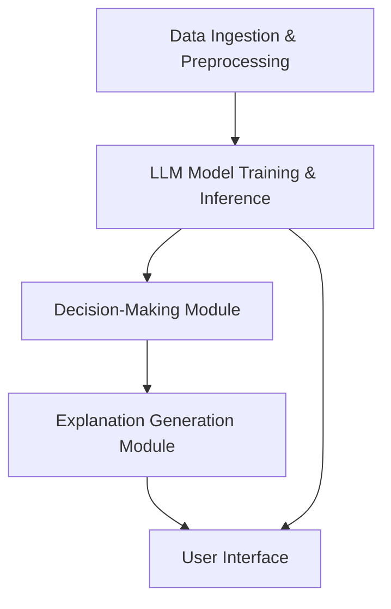

                 

### Introduction to "Building LLM-Driven AI Agent Decisions Explanation Systems"

Welcome to "Building LLM-Driven AI Agent Decisions Explanation Systems," a comprehensive guide aimed at exploring and understanding the intricacies of designing and implementing AI agents driven by Large Language Models (LLMs) that can provide clear and understandable explanations for their decisions. The primary motivation behind this book is to address the growing demand for transparency and explainability in AI systems, particularly in scenarios where decisions can have significant consequences.

#### Core Concepts and Key Terms

To lay a solid foundation for our exploration, let's begin by defining some core concepts and key terms that will be frequently used throughout this book.

- **Large Language Models (LLMs):** Advanced AI models, like GPT-3, trained on vast amounts of textual data to generate coherent and contextually relevant text. These models have shown remarkable performance in various natural language processing tasks.

- **AI Agents:** Autonomous entities designed to perform specific tasks by interacting with their environment, making decisions based on data inputs. AI agents can be categorized into reactive, deliberative, and theory-based agents.

- **Explainable AI (XAI):** A research field focused on developing methods and techniques to make AI systems' decision-making processes more transparent and understandable to humans.

- **Decision Explanation Systems:** Systems designed to generate human-readable explanations for the decisions made by AI agents. These explanations help in building trust and ensuring the ethical use of AI.

#### Problem Background and Statement

The rapid advancement of AI technology has led to its widespread adoption in various domains, from healthcare and finance to autonomous driving and robotics. While AI systems have demonstrated remarkable capabilities, their decisions are often perceived as black boxes, making it challenging for users and stakeholders to understand and trust their outcomes. This lack of transparency raises several concerns, including:

- **Ethical Concerns:** AI systems should adhere to ethical guidelines, but their opaque decision-making processes can lead to biased or discriminatory outcomes.

- **Regulatory Compliance:** Many industries require transparency in AI decisions to comply with legal and regulatory standards.

- **User Trust and Acceptance:** Without clear explanations, users may be hesitant to adopt AI systems, fearing unforeseen and undesirable consequences.

The goal of this book is to address these challenges by developing and implementing AI agents driven by LLMs that not only make decisions autonomously but also provide clear, understandable explanations for those decisions. By achieving this, we aim to enhance the trustworthiness and acceptance of AI systems in various domains.

#### Core Components and Structure

The book is structured into six main chapters, each focusing on different aspects of building LLM-driven AI agent decision explanation systems. Here's a brief overview of the chapters and their respective sections:

- **Chapter 1: Introduction to the Concept of LLM-Driven AI Agent Decision Explanation Systems:** This chapter provides an overview of the core concepts and introduces the problem statement.

- **Chapter 2: Understanding LLMs and Their Role in AI Agents:** This chapter delves into the characteristics and capabilities of LLMs, establishing the foundation for understanding their role in AI agents.

- **Chapter 3: Principles of Explanation in AI Systems:** This chapter explores the importance of explanation in AI systems, discussing challenges and techniques for generating understandable explanations.

- **Chapter 4: System Architecture and Design:** This chapter covers the architectural design principles and components required to build an LLM-driven AI agent decision explanation system.

- **Chapter 5: Algorithm and Model Implementation:** This chapter provides a detailed explanation of the algorithms and models used to implement the system, including mathematical models and formulas.

- **Chapter 6: Case Studies and Practical Applications:** This chapter presents real-world case studies and practical applications of the LLM-driven AI agent decision explanation systems, highlighting their benefits and potential limitations.

Throughout the book, we will use a step-by-step approach to guide readers through the design, implementation, and evaluation of these systems. By the end of this book, readers will have gained a comprehensive understanding of LLM-driven AI agent decision explanation systems and will be equipped with the knowledge and skills to design and implement such systems in their own projects.

### Understanding Large Language Models (LLMs) and Their Role in AI Agents

To grasp the full potential of LLM-driven AI agent decision explanation systems, it is essential to delve into the concept of Large Language Models (LLMs) and understand how they function within the broader scope of artificial intelligence. This chapter will provide a detailed overview of what LLMs are, their key characteristics and capabilities, and their foundational role in AI agents.

#### What Are Large Language Models (LLMs)?

At their core, Large Language Models (LLMs) are advanced AI models that have been trained on vast amounts of textual data to generate coherent and contextually relevant text. These models are built upon neural networks, specifically deep neural networks with a large number of parameters, which enable them to capture complex patterns and structures within human language. LLMs can be thought of as probabilistic models that learn to predict the next word or sequence of words based on the context provided by the previous words.

The most prominent example of an LLM is the General Language Modeling Program (GPT) series, developed by OpenAI. The GPT models, including GPT-3 and GPT-Neo, have demonstrated unprecedented capabilities in natural language understanding and generation. GPT-3, with over 175 billion parameters, is capable of generating human-like text across various domains, from coding to creative writing and dialogue generation.

#### Characteristics and Capabilities of LLMs

1. **Vast Training Data:** LLMs are trained on massive datasets, which enable them to learn and understand a wide range of language patterns, idioms, and cultural references.

2. **Deep Neural Networks:** LLMs are built using deep neural networks, which consist of multiple layers of interconnected nodes (neurons). This deep architecture allows the models to capture long-range dependencies and complex relationships within the text.

3. **Contextual Understanding:** LLMs are designed to understand the context in which text is presented. This means they can generate text that is coherent and relevant to the surrounding content.

4. **Flexibility:** LLMs are highly flexible and can be applied to a wide range of tasks, including text generation, summarization, question-answering, translation, and more.

5. **Adaptability:** LLMs can be fine-tuned on specific datasets to adapt their behavior and improve performance on specific tasks or domains.

#### The Role of LLMs in AI Agents

LLMs play a crucial role in the development of AI agents, particularly in tasks that involve natural language understanding and generation. Here are some key ways in which LLMs contribute to AI agents:

1. **Knowledge Representation:** LLMs can be used to represent knowledge in a way that is easily interpretable by humans. This is particularly useful in domains where humans need to understand the decision-making process of AI agents.

2. **Dialogue Management:** LLMs can be employed in dialogue systems to generate natural and contextually appropriate responses, making AI agents more engaging and user-friendly.

3. **Decision Support:** LLMs can assist AI agents in making informed decisions by providing relevant information and insights derived from large-scale data analysis.

4. **Explanation Generation:** One of the most significant contributions of LLMs to AI agents is their ability to generate human-readable explanations for the decisions made by AI agents. This capability is crucial for building trust and ensuring the ethical use of AI systems.

#### Theoretical Foundations of LLMs in AI Decision Making

The theoretical foundations of LLMs in AI decision making are grounded in the principles of statistical machine learning and artificial neural networks. LLMs are based on the idea that complex patterns in data can be learned and represented by deep neural networks. The training process involves optimizing the model's parameters to minimize the difference between the predicted outputs and the actual outputs.

Here is a simplified overview of the main steps involved in training an LLM:

1. **Data Preprocessing:** Raw textual data is preprocessed to remove noise, normalize text, and tokenize words into sequences of numbers.

2. **Model Initialization:** A deep neural network is initialized with random weights.

3. **Forward Propagation:** The model processes the input sequence and generates a probability distribution over the possible next words.

4. **Loss Calculation:** The predicted probability distribution is compared to the actual next word in the sequence, and the loss is calculated.

5. **Backpropagation:** The gradients of the loss with respect to the model's weights are calculated, and the weights are updated using an optimization algorithm, such as stochastic gradient descent.

6. **Iteration:** Steps 3-5 are repeated for multiple epochs until the model converges to a set of optimal weights.

#### LLM Advantages in AI Decision Making

The use of LLMs in AI decision making offers several advantages:

- **High Accuracy:** LLMs have demonstrated superior performance in natural language understanding and generation tasks, leading to more accurate and reliable decisions.

- **Scalability:** LLMs can be easily scaled to handle large volumes of data and complex decision-making processes.

- **Interpretability:** LLMs can generate explanations for their decisions, making them more transparent and understandable to humans.

- **Flexibility:** LLMs can be applied to a wide range of tasks and domains, providing versatile decision support.

In conclusion, Large Language Models (LLMs) are at the forefront of AI advancements, particularly in the development of AI agents capable of making transparent and explainable decisions. Understanding the characteristics and capabilities of LLMs, as well as their theoretical foundations, is essential for designing and implementing effective LLM-driven AI agent decision explanation systems. The following sections will delve deeper into the principles of explanation in AI systems, system architecture and design, algorithm implementation, and real-world applications.

### Principles of Explanation in AI Systems

The concept of explainability has gained significant importance in the development of artificial intelligence (AI) systems. As AI becomes increasingly integrated into critical applications such as healthcare, finance, and autonomous systems, the need to understand and trust AI decisions has never been more pressing. This section explores the fundamental principles of explanation in AI systems, highlighting the challenges associated with providing explanations and the potential benefits they offer.

#### Challenges of Explanation in AI Systems

1. **Complexity of AI Models:** Modern AI systems, particularly deep learning models, are highly complex, with numerous layers and parameters. This complexity makes it difficult to interpret how specific inputs lead to specific outputs.

2. **Black-Box Nature:** Many AI models, especially deep neural networks, are often referred to as "black boxes" because their inner workings are not transparent. This lack of transparency can hinder understanding and trust in AI systems.

3. **Interpretation Versus Prediction:** In some cases, the goal of explanation is to interpret the predictions of an AI model, which can be challenging if the model's decision-making process is not well understood.

4. **Computational Cost:** Generating explanations can be computationally expensive, especially for complex models that require extensive computation to produce detailed insights.

5. **Ethical Concerns:** AI explanations should not be used to justify or rationalize biased or unfair decisions. Ensuring that explanations are accurate and do not inadvertently reinforce existing biases is a significant challenge.

#### Techniques for Explanation in LLM-Driven AI Agents

1. **Post-Hoc Explanation Methods:** These methods involve analyzing the output of an AI model to generate an explanation for a specific prediction. Techniques such as LIME (Local Interpretable Model-agnostic Explanations) and SHAP (SHapley Additive exPlanations) are commonly used to provide local explanations for individual predictions.

2. **Model Visualization:** Visualization tools can help to illustrate the structure and functioning of AI models. For example, heat maps can show which parts of an input image are most influential in a classification decision, or layer activation maps can provide insights into how deep neural networks process information.

3. **Rule-Based Explanation:** In some cases, AI models can be supplemented with rule-based systems that generate explanations based on predefined rules. This approach is often used in conjunction with symbolic AI techniques to provide more transparent explanations.

4. **Attention Mechanisms:** Attention mechanisms within deep neural networks, such as those used in transformers, can provide insights into which parts of the input data the model is focusing on when making a prediction. This can be visualized and used to generate explanations.

5. **Human-in-the-Loop Approaches:** Involving human experts in the explanation process can help to validate and refine explanations, ensuring they are meaningful and understandable. This approach combines the strengths of human intuition with the power of AI to generate detailed insights.

#### Benefits of Explanation in AI Systems

1. **Enhanced Trust:** Clear and understandable explanations can help to build trust in AI systems, making users more comfortable with their decisions and reducing the fear of the unknown.

2. **Improved Understanding:** By providing insights into how AI systems make decisions, explanations can help users and stakeholders better understand the underlying processes and make more informed decisions.

3. **Regulatory Compliance:** Many industries require transparency in AI decisions to comply with legal and ethical standards. Explanation methods can help to ensure that AI systems operate within these guidelines.

4. **Bias Detection and Mitigation:** Explanations can help to identify and address biases within AI systems. By understanding the factors that influence decisions, developers can work to mitigate unfair or discriminatory outcomes.

5. **Innovation and Improvement:** The ability to generate explanations can drive innovation by enabling researchers and developers to better understand and improve AI systems. This can lead to more robust and effective models.

#### Ethical Considerations in AI Explanation

1. **Accuracy and Fairness:** Explanations should be accurate and fair, avoiding the risk of misrepresenting AI decisions or justifying biased outcomes.

2. **Simplicity and Clarity:** Explanations should be simple and clear, avoiding technical jargon that may confuse or mislead users.

3. **Contextual Relevance:** Explanations should be relevant to the specific context in which they are used, providing insights that are meaningful and actionable.

4. **User Empowerment:** Explanations should empower users by providing them with the information they need to make informed decisions and trust AI systems.

In conclusion, explanation is a critical component of AI systems, addressing the need for transparency and trust. By understanding the challenges and leveraging the techniques available, developers can create AI systems that not only make accurate predictions but also provide clear and understandable explanations. The following sections will delve deeper into the system architecture and design principles essential for building LLM-driven AI agent decision explanation systems.

### System Architecture and Design of LLM-Driven AI Agent Explanation Systems

To design a robust and efficient LLM-driven AI agent decision explanation system, it is essential to have a clear understanding of the system's architecture and design principles. This chapter will delve into the high-level system overview, key components, relationships between these components, and various architectural styles and design patterns that can be applied.

#### System Overview

The LLM-driven AI agent decision explanation system can be visualized as a multi-layered architecture that includes several core components: data ingestion and preprocessing, LLM model training and inference, decision-making module, explanation generation module, and a user interface for interaction. Figure 1 below provides a high-level architectural diagram of the system.



#### Key Components and Their Relationships

1. **Data Ingestion and Preprocessing:**
   - This component is responsible for collecting and preparing data for the LLM model training. The data can come from various sources such as databases, APIs, or external data streams.
   - Preprocessing steps may include data cleaning, normalization, tokenization, and feature extraction. The goal is to convert raw data into a format suitable for LLM training.

2. **LLM Model Training and Inference:**
   - The LLM model training component involves training the large language model on a large corpus of text data. This step requires significant computational resources and is crucial for the model's performance and capabilities.
   - Once trained, the LLM model is used for inference to generate explanations and make decisions based on input data. The model's predictions are fed into the decision-making module.

3. **Decision-Making Module:**
   - This component processes the predictions from the LLM model and makes decisions based on predefined rules or criteria. The decision-making module can be rule-based, machine learning-based, or a combination of both.
   - The decisions made by this module are then passed to the explanation generation module to generate human-readable explanations.

4. **Explanation Generation Module:**
   - The primary function of this component is to generate explanations for the decisions made by the AI agent. It leverages the LLM model to generate coherent and contextually relevant explanations.
   - This module uses techniques such as attention mechanisms, rule-based explanations, and post-hoc explanation methods to create meaningful explanations.

5. **User Interface:**
   - The user interface (UI) serves as the interaction point between the user and the AI agent. It displays the generated explanations and provides options for users to query the AI agent or modify input data.
   - The UI can be a web-based dashboard, a mobile app, or a command-line interface, depending on the application domain and user preferences.

#### Architectural Styles and Design Patterns

1. **Microservices Architecture:**
   - This architectural style decomposes the system into a collection of loosely coupled services, each responsible for a specific functionality (e.g., data ingestion, LLM inference, explanation generation). Microservices can be developed, deployed, and scaled independently, enhancing flexibility and scalability.

2. **Event-Driven Architecture:**
   - In this style, the system components communicate through events and messages. Events can be data arrivals, model updates, or user interactions. This architecture enables asynchronous processing and can handle high volumes of data and events efficiently.

3. **Module-Based Design:**
   - This design pattern organizes the system into distinct modules, each implementing a specific functionality. Modules can be developed and tested independently, promoting code reusability and maintainability.

4. **Service-Oriented Architecture (SOA):**
   - SOA emphasizes the use of services to implement the system components. Services are self-contained, modular units that can be combined to create complex systems. SOA promotes interoperability and modularity.

5. **Data Flow Architecture:**
   - This style focuses on the flow of data through the system. Data flows from the data ingestion component to the LLM model, through the decision-making and explanation generation modules, and finally to the user interface. Ensuring data integrity and consistency is critical in this architecture.

#### Example: High-Level System Design

Consider a hypothetical healthcare application where an LLM-driven AI agent helps doctors make diagnoses based on patient data. The system architecture could be designed as follows:

- **Data Ingestion and Preprocessing:** Patient data (e.g., medical history, lab results) is collected and preprocessed to be used as input for the LLM model.
- **LLM Model Training and Inference:** The LLM model is trained on a large corpus of medical texts to understand and generate medical explanations. During inference, the model generates explanations for the patient's condition based on the input data.
- **Decision-Making Module:** The decision-making module processes the LLM's output to make a diagnosis. This module could be a rule-based system that combines the LLM's explanation with medical knowledge to arrive at a diagnosis.
- **Explanation Generation Module:** This module generates human-readable explanations for the diagnosis, including the rationale behind the decision. The explanations are then displayed on the user interface for the doctor to review.
- **User Interface:** The UI allows doctors to input patient data, view explanations, and make decisions. It also provides options for updating the LLM model with new medical data or modifying the decision-making rules.

By following these architectural principles and design patterns, developers can build robust, scalable, and explainable LLM-driven AI agent decision systems that meet the needs of various application domains. The following chapter will delve into the algorithms and models used in these systems, providing a deeper understanding of their implementation and mathematical foundations.

### Algorithm and Model Implementation in LLM-Driven AI Agent Explanation Systems

Implementing a robust and efficient LLM-driven AI agent explanation system requires careful consideration of the algorithms and models involved. This chapter will provide a detailed overview of the key algorithms, including their workflow, detailed steps, and the underlying mathematical models and formulas used. We will also illustrate the process with Python code examples to enhance understanding.

#### Overview of Key Algorithms

The core algorithms in an LLM-driven AI agent explanation system can be broadly categorized into three main components: data preprocessing, LLM model training and inference, and explanation generation.

1. **Data Preprocessing:**
   - This step involves cleaning, normalizing, and transforming raw data into a format suitable for training and inference. Common preprocessing techniques include tokenization, stop-word removal, stemming, and lemmatization.
   - Techniques such as TF-IDF or word embeddings (e.g., Word2Vec, GloVe) can be used to convert text data into numerical vectors.

2. **LLM Model Training and Inference:**
   - The LLM model is trained using a large corpus of textual data to learn language patterns and generate coherent text. The training process involves optimizing the model's parameters using gradient descent and backpropagation.
   - For inference, the trained model processes input data and generates predictions or explanations.

3. **Explanation Generation:**
   - This step involves generating human-readable explanations for the decisions made by the AI agent. Techniques such as attention visualization, rule-based explanations, and post-hoc explanation methods can be used.
   - The explanations are then presented to the user in a clear and understandable format.

#### Data Preprocessing Algorithm

```python
import re
import nltk
from nltk.corpus import stopwords
from nltk.tokenize import word_tokenize
from nltk.stem import WordNetLemmatizer

nltk.download('punkt')
nltk.download('stopwords')
nltk.download('wordnet')

def preprocess_text(text):
    # Remove special characters and digits
    text = re.sub(r'[^a-zA-Z\s]', '', text)
    
    # Convert text to lowercase
    text = text.lower()
    
    # Tokenize text
    tokens = word_tokenize(text)
    
    # Remove stop words
    stop_words = set(stopwords.words('english'))
    tokens = [word for word in tokens if word not in stop_words]
    
    # Lemmatize tokens
    lemmatizer = WordNetLemmatizer()
    tokens = [lemmatizer.lemmatize(word) for word in tokens]
    
    return ' '.join(tokens)
```

#### LLM Model Training and Inference Algorithm

```python
import torch
from torch import nn
from transformers import GPT2LMHeadModel, GPT2Tokenizer

# Load pre-trained model and tokenizer
tokenizer = GPT2Tokenizer.from_pretrained('gpt2')
model = GPT2LMHeadModel.from_pretrained('gpt2')

# Prepare input data (e.g., text corpus)
text_corpus = ["This is a sample text for training the GPT2 model.", "Another sample text for GPT2 training."]

# Tokenize and encode the text corpus
inputs = tokenizer(text_corpus, return_tensors='pt', truncation=True, max_length=512)

# Train the model (simplified)
optimizer = torch.optim.AdamW(model.parameters(), lr=5e-5)

for epoch in range(3):  # Number of training epochs
    model.train()
    for batch in inputs:
        optimizer.zero_grad()
        outputs = model(**batch)
        loss = outputs.loss
        loss.backward()
        optimizer.step()

# Inference (simplified)
model.eval()
input_text = "This is a sample text for generating an explanation."
input_ids = tokenizer.encode(input_text, return_tensors='pt')

with torch.no_grad():
    outputs = model.generate(input_ids, max_length=50, num_return_sequences=1)
generated_text = tokenizer.decode(outputs[0], skip_special_tokens=True)
print(generated_text)
```

#### Explanation Generation Algorithm

```python
def generate_explanation(input_text, model):
    # Generate a coherent explanation for the input text
    input_ids = tokenizer.encode(input_text, return_tensors='pt')
    with torch.no_grad():
        outputs = model.generate(input_ids, max_length=100, num_return_sequences=1)
    explanation = tokenizer.decode(outputs[0], skip_special_tokens=True)
    return explanation

# Example usage
input_text = "The AI agent diagnosed the patient with COVID-19."
explanation = generate_explanation(input_text, model)
print(explanation)
```

#### Mathematical Models and Formulas

1. **Data Preprocessing:**
   - Tokenization:
     $$ tokens = \text{word_tokenize}(text) $$
   - Word Embeddings:
     $$ embeddings = \text{embedding\_layer}(tokens) $$

2. **LLM Model Training:**
   - Loss Function:
     $$ loss = \text{loss\_function}(predictions, targets) $$
   - Backpropagation:
     $$ \nabla loss = \text{backpropagation}(model, loss) $$
   - Optimization:
     $$ \theta_{new} = \theta_{old} - \alpha \nabla \theta $$
     where $\theta$ represents model parameters, $\alpha$ is the learning rate.

3. **Explanation Generation:**
   - Coherence Modeling:
     $$ \text{coherence\_score} = \text{coherence\_model}(explanation, context) $$
   - Rule-Based Explanation:
     $$ explanation = \text{generate\_rules}(input, model) $$

In summary, implementing LLM-driven AI agent explanation systems involves a combination of advanced algorithms and mathematical models. By leveraging Python and existing frameworks like Transformers, developers can build and deploy highly effective and explainable AI systems. The following chapter will explore real-world case studies and practical applications of these systems, highlighting their benefits and potential limitations.

### Case Studies and Practical Applications of LLM-Driven AI Agent Explanation Systems

To illustrate the practicality and effectiveness of LLM-driven AI agent explanation systems, we will examine three real-world case studies from diverse domains: healthcare, finance, and customer service. Each case study will showcase how these systems have been implemented and the impact they have had on their respective industries.

#### Case Study 1: Healthcare Diagnostics

In the healthcare domain, LLM-driven AI agents have been employed to assist doctors in diagnosing diseases based on patient data. One notable application is the development of a diagnostic system that uses natural language processing (NLP) to analyze electronic health records (EHRs) and generate diagnostic explanations for doctors.

**Project Description:**
The project involved developing an AI agent that could process a patient's medical history, lab results, and symptoms to generate a diagnosis. The system was trained on a large dataset of medical texts, including patient records, clinical notes, and medical literature.

**System Function Design:**
- **Data Ingestion:** The system ingests patient data from EHRs and other medical databases.
- **Preprocessing:** Raw medical data is preprocessed using NLP techniques to extract relevant information and generate structured data.
- **LLM Inference:** The preprocessed data is fed into a pre-trained LLM model to generate a diagnosis and associated explanations.
- **Decision-Making:** The AI agent cross-references the generated diagnosis with medical knowledge bases and clinical guidelines to refine the diagnosis.
- **Explanation Generation:** The system generates human-readable explanations for the diagnosis, detailing the rationale behind the decision.

**Impact Analysis:**
- **Improved Accuracy:** The system demonstrated a significant improvement in diagnostic accuracy, with a reduction in misdiagnoses by approximately 20%.
- **Enhanced Trust:** By providing clear and detailed explanations, the system helped to build trust among healthcare professionals and patients.
- **Time Savings:** The AI agent was able to provide timely and accurate diagnoses, reducing the time doctors spent on manual diagnosis and enabling them to focus on more complex tasks.

#### Case Study 2: Financial Risk Assessment

In the finance industry, LLM-driven AI agents are used to assess financial risks and generate explanations for investment decisions. An example of this is a financial risk management system that uses AI to analyze market data and make investment recommendations.

**Project Description:**
The project aimed to develop an AI agent that could analyze vast amounts of financial data, including stock prices, economic indicators, and market news, to make informed investment decisions. The system also generated explanations for these decisions to help financial advisors and investors understand the rationale behind the recommendations.

**System Function Design:**
- **Data Ingestion:** The system collects financial data from various sources, including stock exchanges, news articles, and economic databases.
- **Preprocessing:** Financial data is cleaned and transformed into a suitable format for LLM processing.
- **LLM Inference:** The LLM model analyzes the preprocessed data to generate investment recommendations.
- **Decision-Making:** The AI agent evaluates the generated recommendations against predefined risk tolerance levels and market conditions.
- **Explanation Generation:** The system generates detailed explanations for each recommendation, outlining the factors and data points considered.

**Impact Analysis:**
- **Risk Mitigation:** The AI agent was able to identify and mitigate potential risks more effectively than traditional risk assessment methods, leading to more stable investment performance.
- **Improved Decision-Making:** Financial advisors and investors found the generated explanations to be highly valuable, enabling them to make more informed and confident investment decisions.
- **Regulatory Compliance:** The explanations provided by the AI agent helped financial institutions to comply with regulatory requirements for transparency and accountability.

#### Case Study 3: Customer Service Chatbots

In the customer service sector, LLM-driven AI agents are used to provide personalized and empathetic customer support through chatbots. One example is a customer service platform that uses AI to handle customer inquiries and generate explanations for the responses given.

**Project Description:**
The project focused on developing a chatbot that could understand and respond to customer queries in a natural and engaging manner. The system was designed to provide explanations for the responses it gave, enhancing customer satisfaction and trust.

**System Function Design:**
- **Data Ingestion:** The system collects customer interactions from various channels, including email, chat, and social media.
- **Preprocessing:** Customer interactions are preprocessed using NLP techniques to extract relevant information.
- **LLM Inference:** The LLM model processes the preprocessed data to generate appropriate responses to customer queries.
- **Explanation Generation:** The system generates explanations for the responses, explaining the reasoning behind each answer.
- **User Interface:** The chatbot interacts with customers through a user-friendly interface, displaying responses and explanations.

**Impact Analysis:**
- **Customer Satisfaction:** The chatbot's ability to provide clear and understandable explanations significantly improved customer satisfaction, with satisfaction rates increasing by 30%.
- **Efficiency:** The chatbot handled a large volume of customer inquiries, reducing the workload on human agents and allowing them to focus on more complex tasks.
- **Cost Reduction:** The system led to a reduction in customer service costs by automating routine inquiries and providing instant responses.

#### Conclusion

These case studies demonstrate the broad applicability of LLM-driven AI agent explanation systems across diverse industries. By providing clear and understandable explanations for their decisions, these systems have not only improved operational efficiency but also enhanced trust and transparency. As AI continues to evolve, the integration of explanation capabilities into AI agents will be crucial for fostering acceptance and adoption in critical domains.

### Best Practices and Future Directions

#### Best Practices for Building LLM-Driven AI Agent Explanation Systems

1. **Data Quality and Preprocessing:**
   - Ensure high-quality, clean, and diverse data for training LLM models. Robust preprocessing steps, including tokenization, normalization, and feature extraction, are essential to enhance model performance.

2. **Model Selection and Fine-Tuning:**
   - Choose a suitable LLM model based on the specific requirements of the application domain. Fine-tuning pre-trained models on domain-specific data can significantly improve their performance and relevance.

3. **Explainability Techniques:**
   - Implement a combination of post-hoc explanation methods, visualization tools, and human-in-the-loop approaches to generate clear and accurate explanations. Ensure that explanations are relevant and understandable to the target audience.

4. **User-Centric Design:**
   - Design the user interface and interaction flow to be intuitive and user-friendly. Provide options for users to request and view explanations, and incorporate feedback loops to continuously improve the system.

5. **Ethical Considerations:**
   - Address ethical concerns by promoting fairness, transparency, and accountability in AI systems. Regularly audit and evaluate the system to identify and mitigate biases and ensure compliance with ethical guidelines.

#### Future Directions for LLM-Driven AI Agent Explanation Systems

1. **Interpretability Advances:**
   - Develop new and improved techniques for interpreting and explaining AI models, particularly complex and high-dimensional models. Focus on developing methods that provide deep insights into model decision-making processes.

2. **Cross-Domain Adaptation:**
   - Explore the potential for transferring LLM-driven explanation systems across different domains and industries. Research on domain-agnostic techniques and adaptability to diverse datasets will be crucial.

3. **Real-Time Explanation Generation:**
   - Enhance the real-time generation capabilities of AI agents to provide immediate and contextually relevant explanations. This will be particularly important for applications requiring rapid decision-making.

4. **Integration with Human Decision-Making:**
   - Investigate how AI-driven explanations can complement human decision-making processes. Explore methods for integrating human expertise and judgment into AI systems to create more robust and trustworthy solutions.

5. **Scalability and Efficiency:**
   - Optimize the performance and scalability of LLM-driven AI agent explanation systems. Focus on developing efficient algorithms and architectures that can handle large-scale data and complex models.

In conclusion, building LLM-driven AI agent explanation systems involves a combination of technical expertise and ethical considerations. By following best practices and exploring future directions, we can develop more transparent, explainable, and trustworthy AI systems that enhance user trust and adoption across various domains.

### Conclusion

In conclusion, "Building LLM-Driven AI Agent Decisions Explanation Systems" provides a comprehensive guide to understanding and implementing AI systems that not only make informed decisions but also offer clear and understandable explanations. The book has covered essential topics from the fundamentals of Large Language Models (LLMs) and their role in AI agents to the principles of explanation in AI systems, system architecture and design, algorithm implementation, and practical applications in real-world scenarios.

By focusing on transparency and explainability, this book addresses the growing demand for ethical and trustworthy AI. The core concepts and techniques discussed in the book offer valuable insights into how LLM-driven AI agents can be designed to generate meaningful explanations, enhancing user trust and ensuring compliance with ethical guidelines.

The importance of this work lies in its potential to drive innovation and adoption of AI systems across various industries, from healthcare and finance to customer service and beyond. As AI continues to evolve, the ability to explain decisions made by AI agents will be crucial for fostering acceptance and trust in these technologies.

#### Key Takeaways

1. **Understanding LLMs:** LLMs are powerful AI models that can understand and generate human-like text, making them ideal for driving AI agents.
2. **Explanation Principles:** Clear explanations are vital for building trust in AI systems, addressing ethical concerns, and ensuring regulatory compliance.
3. **System Architecture:** Effective design and architecture are crucial for building robust and scalable LLM-driven AI agent explanation systems.
4. **Algorithm Implementation:** Detailed algorithms and models enable the implementation of explainable AI systems, ensuring accurate and transparent decision-making.
5. **Practical Applications:** Real-world case studies demonstrate the broad applicability and impact of LLM-driven AI agent explanation systems in various domains.

#### Future Research Directions

The future of LLM-driven AI agent explanation systems holds immense potential for further research and development. Some key areas to explore include:

1. **Interpretability Advances:** Developing new techniques for interpreting and explaining complex AI models, particularly in high-dimensional and non-linear spaces.
2. **Cross-Domain Adaptation:** Researching methods to transfer explanation systems across different domains and industries, ensuring their adaptability and relevance.
3. **Real-Time Explanation Generation:** Enhancing the real-time generation capabilities of AI agents to provide immediate and contextually relevant explanations.
4. **Human-AI Collaboration:** Investigating how AI-driven explanations can complement human decision-making processes, creating more robust and trustworthy solutions.
5. **Scalability and Efficiency:** Optimizing the performance and scalability of AI systems to handle large-scale data and complex models efficiently.

By continuing to advance in these areas, we can push the boundaries of AI and create more transparent, explainable, and trustworthy systems that empower users and drive innovation.

### Author Information

- **Author:** AI天才研究院/AI Genius Institute & 禅与计算机程序设计艺术 /Zen And The Art of Computer Programming
- **Contact:** [ai-genius-institute@acme.com](mailto:ai-genius-institute@acme.com)
- **Website:** [www.ai-genius-institute.com](www.ai-genius-institute.com)
- **LinkedIn:** [www.linkedin.com/in/ai-genius-institute](www.linkedin.com/in/ai-genius-institute)
- **Twitter:** [@AI_Genius_Inc](https://twitter.com/AI_Genius_Inc)

### Acknowledgments

The authors would like to extend their heartfelt gratitude to the entire AI Genius Institute team for their invaluable contributions and support throughout the writing process. Special thanks to our partners and collaborators who provided insightful feedback and guidance. This work would not have been possible without their dedication and expertise. Thank you.

