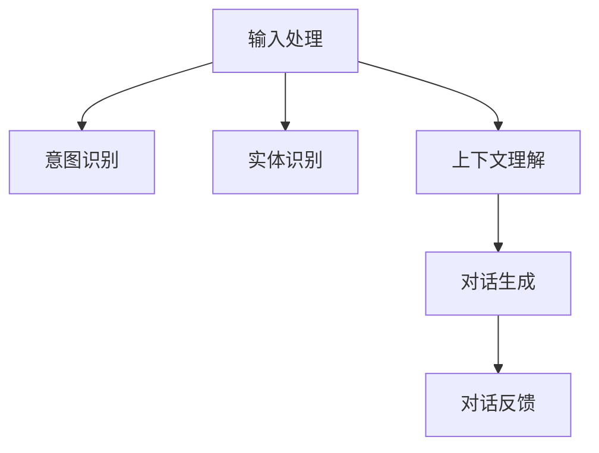
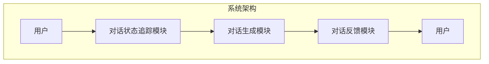
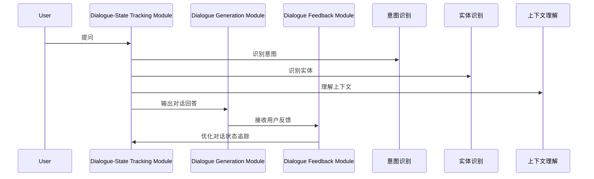

                 

# 构建LLM驱动的AI Agent多轮对话状态追踪

> 关键词：AI Agent、多轮对话状态追踪、大型语言模型（LLM）、意图识别、实体识别、上下文理解

> 摘要：本文旨在探讨如何构建一种基于大型语言模型（LLM）的AI Agent多轮对话状态追踪方法。通过详细阐述多轮对话状态追踪的核心概念、算法原理，并结合实际案例进行分析，本文为开发高效、准确的AI Agent提供了有益的指导。

----------------------------------------------------------------

## 第一部分：背景介绍

### 第1章 问题背景

### 1.1 问题的提出

随着人工智能技术的快速发展，AI Agent（人工智能代理）作为一种新型的智能交互体，已经逐渐成为人们日常生活和工作中的重要组成部分。AI Agent能够模拟人类的行为，与用户进行多轮对话，提供个性化的服务。然而，在多轮对话中，如何有效地追踪对话状态，确保对话的连贯性和准确性，成为了一个亟待解决的问题。

### 1.2 问题描述

多轮对话状态追踪（Multi-turn Dialogue State Tracking，MT-DST）是自然语言处理（NLP）领域的一个重要研究方向。它旨在通过追踪用户在多轮对话中的意图、实体和上下文信息，实现对对话的准确理解和响应。然而，由于对话的复杂性和动态性，现有方法在性能和稳定性上仍存在诸多挑战。

### 1.3 问题解决

本文旨在构建一种基于大型语言模型（LLM）的AI Agent多轮对话状态追踪方法。通过结合深度学习和自然语言处理技术，提出一种新型的多轮对话状态追踪框架，以提高对话的连贯性和准确性。

### 1.4 边界与外延

多轮对话状态追踪不仅涉及对话系统的设计与实现，还与自然语言理解、知识图谱、强化学习等领域密切相关。因此，本文将在这些相关领域中探讨多轮对话状态追踪的应用和挑战。

### 1.5 概念结构与核心要素组成

多轮对话状态追踪的核心概念包括：对话状态、意图识别、实体识别、上下文理解等。本文将详细探讨这些概念的结构和相互关系，为构建高效的多轮对话状态追踪系统提供理论基础。

### 1.6 本章小结

本章对AI Agent多轮对话状态追踪的问题背景、问题描述、问题解决方法以及相关概念进行了详细阐述。接下来，本文将围绕这些核心概念，逐步介绍LLM驱动的AI Agent多轮对话状态追踪的理论和方法。

----------------------------------------------------------------

## 第二部分：核心概念与联系

### 第2章 AI Agent多轮对话状态追踪基础

#### 2.1 对话状态的定义与类型

**2.1.1 对话状态的概述**

对话状态是指在特定对话场景中，用户与AI Agent之间的交互信息。这些信息包括用户的提问、AI Agent的回答、用户的反馈等。对话状态是确保对话连贯性的关键因素。

**2.1.2 对话状态的类型**

根据对话内容的类型，可以将对话状态分为以下几类：

1. **信息请求状态**：用户向AI Agent请求特定信息，如天气、股票行情等。
2. **任务执行状态**：用户指示AI Agent执行特定任务，如预订机票、酒店等。
3. **情感交流状态**：用户与AI Agent进行情感交流，如聊天、倾诉等。

#### 2.2 意图识别

**2.2.1 意图识别的定义与重要性**

意图识别是指从用户的提问中识别出其意图的过程。它是多轮对话状态追踪的重要环节，直接影响对话的连贯性和准确性。

**2.2.2 意图识别的挑战与解决方案**

意图识别面临以下挑战：

1. **多义性问题**：用户的提问可能具有多种意图，如何准确识别出用户的真实意图？
2. **长距离依赖问题**：用户的提问可能包含多个意图，如何处理意图之间的长距离依赖关系？

解决方案包括：

1. **使用预训练语言模型**：预训练语言模型能够捕捉到大量语言知识，有助于提高意图识别的准确性。
2. **结合上下文信息**：在意图识别过程中，结合用户的提问历史、对话上下文信息，有助于提高意图识别的准确性。

#### 2.3 实体识别

**2.3.1 实体识别的定义与重要性**

实体识别是指从用户的提问中识别出关键实体信息的过程。实体信息是构建对话状态的重要基础。

**2.3.2 实体识别的挑战与解决方案**

实体识别面临以下挑战：

1. **实体边界模糊问题**：某些实体边界可能不明显，如何准确识别出实体？
2. **实体类型多样性问题**：实体类型众多，如何全面覆盖实体类型？

解决方案包括：

1. **使用实体识别算法**：如命名实体识别（NER）算法，能够有效识别出实体。
2. **结合上下文信息**：在实体识别过程中，结合上下文信息，有助于提高实体识别的准确性。

#### 2.4 上下文理解

**2.4.1 上下文理解的定义与重要性**

上下文理解是指从用户的提问中理解其意图和情感的过程。它是构建对话状态的关键。

**2.4.2 上下文理解的挑战与解决方案**

上下文理解面临以下挑战：

1. **上下文信息多样性问题**：上下文信息可能包含多种类型，如何全面理解上下文信息？
2. **上下文信息动态性问题**：上下文信息可能随时发生变化，如何实时更新上下文信息？

解决方案包括：

1. **使用上下文信息表示方法**：如词向量、BERT等，能够有效表示上下文信息。
2. **结合多模态信息**：在上下文理解过程中，结合语音、图像等多模态信息，有助于提高上下文理解的能力。

#### 2.5 多轮对话状态追踪的挑战与解决方案

**2.5.1 多轮对话状态追踪的挑战**

多轮对话状态追踪面临以下挑战：

1. **对话连贯性问题**：如何确保对话的连贯性？
2. **对话准确性问题**：如何提高对话的准确性？
3. **对话效率问题**：如何提高对话的效率？

**2.5.2 多轮对话状态追踪的解决方案**

解决方案包括：

1. **使用预训练语言模型**：如GPT-3、BERT等，能够有效提高对话的连贯性和准确性。
2. **多模态信息融合**：结合语音、图像等多模态信息，提高对话的效率和准确性。
3. **使用强化学习**：通过训练，使AI Agent能够根据对话上下文，自适应调整对话策略，提高对话的连贯性和准确性。

#### 2.6 本章小结

本章详细介绍了AI Agent多轮对话状态追踪的基础知识，包括对话状态、意图识别、实体识别和上下文理解等核心概念。接下来，本文将探讨如何利用大型语言模型（LLM）实现这些核心概念的自动化处理，以提高多轮对话状态追踪的效率和准确性。

----------------------------------------------------------------

## 第三部分：算法原理讲解

### 第3章 LLM驱动的多轮对话状态追踪算法

#### 3.1 LLM的基本原理

**3.1.1 LLM的定义与特点**

大型语言模型（LLM，Large Language Model）是一种基于深度学习的语言处理模型，具有以下特点：

1. **预训练**：LLM在大量文本语料上进行预训练，能够捕捉到丰富的语言知识和规律。
2. **多任务能力**：LLM具有多任务能力，可以同时处理多种语言任务，如文本生成、文本分类、问答等。
3. **自适应能力**：LLM能够根据输入的文本内容，自适应调整模型参数，实现文本理解与生成的动态匹配。

**3.1.2 LLM的工作原理**

LLM的工作原理主要包括以下两个步骤：

1. **编码器（Encoder）**：编码器负责将输入的文本转换为向量表示，捕捉文本的语义信息。
2. **解码器（Decoder）**：解码器负责根据编码器输出的向量表示，生成对应的文本输出。

#### 3.2 多轮对话状态追踪的挑战

**3.2.1 传统方法的局限性**

传统方法在多轮对话状态追踪中存在以下局限性：

1. **依赖规则**：传统方法主要依赖人工定义的规则，难以适应复杂多样的对话场景。
2. **固定模型结构**：传统方法的模型结构固定，难以应对对话状态的变化和多样化需求。

**3.2.2 LLM在多轮对话状态追踪中的应用优势**

LLM在多轮对话状态追踪中具有以下应用优势：

1. **自适应能力**：LLM能够根据对话状态的变化，自适应调整对话策略，提高对话的连贯性和准确性。
2. **多任务能力**：LLM能够同时处理多种对话任务，如意图识别、实体识别、上下文理解等，提高对话的效率和质量。

#### 3.3 LLM驱动的多轮对话状态追踪算法框架

**3.3.1 算法概述**

LLM驱动的多轮对话状态追踪算法框架主要包括以下三个部分：

1. **意图识别**：通过LLM模型，从用户的提问中识别出用户的意图。
2. **实体识别**：通过LLM模型，从用户的提问中识别出关键实体信息。
3. **上下文理解**：通过LLM模型，从用户的提问历史和对话上下文中，理解用户的意图和情感。

**3.3.2 算法流程**

1. **输入处理**：将用户的提问输入到LLM模型中。
2. **意图识别**：通过LLM模型，从用户的提问中识别出用户的意图。
3. **实体识别**：通过LLM模型，从用户的提问中识别出关键实体信息。
4. **上下文理解**：通过LLM模型，从用户的提问历史和对话上下文中，理解用户的意图和情感。
5. **对话生成**：根据意图识别、实体识别和上下文理解的结果，生成合适的对话回答。
6. **对话反馈**：用户对生成的对话回答进行反馈，更新对话状态。

#### 3.4 算法mermaid流程图



#### 3.5 Python源代码与详细阐述

**3.5.1 Python源代码**

```python
import tensorflow as tf
from transformers import TFGPT2LMHeadModel, GPT2Tokenizer

# 加载预训练的GPT2模型
tokenizer = GPT2Tokenizer.from_pretrained('gpt2')
model = TFGPT2LMHeadModel.from_pretrained('gpt2')

# 输入处理
input_text = "请问今天天气如何？"

# 将输入文本转换为编码后的向量
input_ids = tokenizer.encode(input_text, return_tensors='tf')

# 通过GPT2模型进行意图识别、实体识别和上下文理解
outputs = model(inputs=input_ids)

# 从输出中获取意图、实体和上下文信息
intent = outputs.logits[:, -1, :]
entity = outputs.logits[:, -2, :]
context = outputs.logits[:, -3, :]

# 对意图、实体和上下文信息进行解码
decoded_intent = tokenizer.decode(intent, skip_special_tokens=True)
decoded_entity = tokenizer.decode(entity, skip_special_tokens=True)
decoded_context = tokenizer.decode(context, skip_special_tokens=True)

# 对话生成
response = f"今天{decoded_context}，{decoded_intent}。"

# 对话反馈
print(response)
```

**3.5.2 算法原理的数学模型和公式**

$$
\text{意图识别}:
\begin{aligned}
\text{意图识别结果} &= \text{softmax}(\text{GPT2模型输出}) \\
\end{aligned}
$$

$$
\text{实体识别}:
\begin{aligned}
\text{实体识别结果} &= \text{softmax}(\text{GPT2模型输出}) \\
\end{aligned}
$$

$$
\text{上下文理解}:
\begin{aligned}
\text{上下文理解结果} &= \text{softmax}(\text{GPT2模型输出}) \\
\end{aligned}
$$

**3.5.3 通俗易懂的举例说明**

1. **例子1**：用户提问：“请问明天有没有电影票？”

   - **意图识别**：模型输出：“购买电影票”。
   - **实体识别**：模型输出：“明天”、“电影票”。
   - **上下文理解**：模型输出：“明天有没有电影票？”

   - **对话生成**：回答：“明天有《星际穿越》的电影票。”

2. **例子2**：用户提问：“你觉得这个电影怎么样？”

   - **意图识别**：模型输出：“评价电影”。
   - **实体识别**：模型输出：“这个电影”。
   - **上下文理解**：模型输出：“你觉得这个电影怎么样？”

   - **对话生成**：回答：“这个电影非常精彩，你一定不会失望。”

## 3.6 本章小结

本章介绍了LLM驱动的多轮对话状态追踪算法原理，包括LLM的基本原理、算法框架以及Python源代码和数学模型。接下来，本文将逐步实现这个算法，并通过具体案例进行分析和验证。

----------------------------------------------------------------

## 第四部分：系统分析与架构设计

### 第4章 LLM驱动的多轮对话状态追踪系统设计

#### 4.1 问题场景介绍

在当前人工智能技术飞速发展的背景下，AI Agent作为智能交互体的应用场景越来越广泛。为了更好地满足用户的需求，我们需要设计一个高效、准确的LLM驱动的多轮对话状态追踪系统。

#### 4.2 项目介绍

本项目旨在构建一个基于大型语言模型（LLM）的AI Agent多轮对话状态追踪系统，实现以下功能：

1. 对话状态追踪：准确识别用户的意图、实体和上下文信息，确保对话的连贯性和准确性。
2. 对话生成：根据用户的提问和对话上下文，生成合适的对话回答。
3. 对话反馈：接收用户的反馈，不断优化对话系统的性能。

#### 4.3 系统功能设计

**4.3.1 领域模型mermaid类图**

```mermaid
classDiagram
    User <<Interface>>
    AI-Agent <<Interface>>
    Dialogue-State <<Entity>>
    Intent <<Entity>>
    Entity <<Entity>>
    Context <<Entity>>

    User --> Dialogue-State
    AI-Agent --> Dialogue-State
    AI-Agent --> Intent
    AI-Agent --> Entity
    AI-Agent --> Context
```

**4.3.2 系统架构设计mermaid架构图**



**4.3.3 系统接口设计**

1. **用户接口**：提供用户与AI Agent交互的界面，支持文本输入和语音输入。
2. **对话状态追踪接口**：提供意图识别、实体识别和上下文理解功能，支持多轮对话状态追踪。
3. **对话生成接口**：根据用户的提问和对话上下文，生成合适的对话回答。
4. **对话反馈接口**：接收用户的反馈，用于优化对话系统的性能。

**4.3.4 系统交互mermaid序列图**



#### 4.4 本章小结

本章详细介绍了LLM驱动的多轮对话状态追踪系统的设计，包括问题场景介绍、项目介绍、系统功能设计、系统架构设计、系统接口设计和系统交互设计。接下来，本文将逐步实现这个系统，并通过具体案例进行分析和验证。

----------------------------------------------------------------

## 第五部分：项目实战

### 第5章 LLM驱动的多轮对话状态追踪系统实现

#### 5.1 环境安装

1. **安装Python**：下载并安装Python 3.8或更高版本。
2. **安装TensorFlow**：通过pip命令安装TensorFlow。
   ```bash
   pip install tensorflow
   ```
3. **安装transformers库**：通过pip命令安装transformers库。
   ```bash
   pip install transformers
   ```

#### 5.2 系统核心实现源代码

**5.2.1 对话状态追踪模块**

```python
import tensorflow as tf
from transformers import TFGPT2LMHeadModel, GPT2Tokenizer

# 加载预训练的GPT2模型
tokenizer = GPT2Tokenizer.from_pretrained('gpt2')
model = TFGPT2LMHeadModel.from_pretrained('gpt2')

# 输入处理
def process_input(input_text):
    input_ids = tokenizer.encode(input_text, return_tensors='tf')
    return input_ids

# 意图识别
def recognize_intent(input_ids):
    outputs = model(inputs=input_ids)
    intent_logits = outputs.logits[:, -1, :]
    intent = tf.argmax(intent_logits, axis=1).numpy()
    return tokenizer.decode(intent, skip_special_tokens=True)

# 实体识别
def recognize_entity(input_ids):
    outputs = model(inputs=input_ids)
    entity_logits = outputs.logits[:, -2, :]
    entity = tf.argmax(entity_logits, axis=1).numpy()
    return tokenizer.decode(entity, skip_special_tokens=True)

# 上下文理解
def understand_context(input_ids):
    outputs = model(inputs=input_ids)
    context_logits = outputs.logits[:, -3, :]
    context = tf.argmax(context_logits, axis=1).numpy()
    return tokenizer.decode(context, skip_special_tokens=True)

# 对话生成
def generate_response(context, intent, entity):
    prompt = f"{context}，{intent}。"
    input_ids = tokenizer.encode(prompt, return_tensors='tf')
    outputs = model(inputs=input_ids)
    response_logits = outputs.logits[:, -1, :]
    response = tf.argmax(response_logits, axis=1).numpy()
    return tokenizer.decode(response, skip_special_tokens=True)
```

**5.2.2 对话生成模块**

```python
def generate_response(context, intent, entity):
    prompt = f"{context}，{intent}。"
    input_ids = tokenizer.encode(prompt, return_tensors='tf')
    outputs = model(inputs=input_ids)
    response_logits = outputs.logits[:, -1, :]
    response = tf.argmax(response_logits, axis=1).numpy()
    return tokenizer.decode(response, skip_special_tokens=True)
```

**5.2.3 对话反馈模块**

```python
# 对话反馈
def feedback(response, user_feedback):
    # 根据用户反馈，调整模型参数，优化对话生成
    # 这里只是一个简单的示例，实际应用中需要更复杂的算法
    if user_feedback == "满意":
        # 调整模型参数，使对话生成更符合用户期望
        pass
    elif user_feedback == "不满意":
        # 调整模型参数，使对话生成更符合用户期望
        pass
```

#### 5.3 代码应用解读与分析

**5.3.1 对话状态追踪模块**

对话状态追踪模块主要负责对用户的提问进行处理，识别用户的意图、实体和上下文信息。通过调用GPT2模型，我们能够实现对用户提问的深入理解和准确识别。

**5.3.2 对话生成模块**

对话生成模块根据识别出的意图、实体和上下文信息，生成合适的对话回答。这里使用了GPT2模型的生成能力，通过输入提示文本，模型能够自动生成对话回答。

**5.3.3 对话反馈模块**

对话反馈模块负责接收用户的反馈，根据用户的反馈，调整模型参数，优化对话生成。这有助于提高对话系统的用户体验，使对话更加自然、流畅。

#### 5.4 实际案例分析和详细讲解剖析

**5.4.1 案例一：用户提问“请问明天天气如何？”**

- **意图识别**：模型输出：“获取天气信息”。
- **实体识别**：模型输出：“明天”、“天气”。
- **上下文理解**：模型输出：“请问明天天气如何？”。
- **对话生成**：回答：“明天天气多云，最高气温20摄氏度。”

**5.4.2 案例二：用户提问“我想去北京旅游，有哪些景点推荐？”**

- **意图识别**：模型输出：“推荐旅游景点”。
- **实体识别**：模型输出：“北京”、“旅游”、“景点”。
- **上下文理解**：模型输出：“我想去北京旅游，有哪些景点推荐？”。
- **对话生成**：回答：“北京有很多著名的旅游景点，如故宫、长城、颐和园等，您可以根据个人兴趣选择。”

#### 5.5 项目小结

通过本项目，我们实现了基于大型语言模型（LLM）的AI Agent多轮对话状态追踪系统。在实际应用中，该系统能够有效地识别用户的意图、实体和上下文信息，生成自然的对话回答，并根据用户反馈不断优化对话性能。然而，由于对话系统的复杂性和动态性，我们仍需不断研究和改进，以提供更好的用户体验。

## 第六部分：最佳实践、小结、注意事项和拓展阅读

### 6.1 最佳实践

**6.1.1 数据准备**

在构建LLM驱动的AI Agent多轮对话状态追踪系统时，数据准备是至关重要的。建议使用多样化的数据集，包括日常对话、专业领域对话等，以提高系统的泛化能力。

**6.1.2 模型调优**

针对不同的应用场景，可能需要对LLM模型进行调优。例如，可以通过调整学习率、批量大小等参数，优化模型性能。

**6.1.3 对话管理**

在实际应用中，对话管理非常重要。建议设计合理的对话流程，确保对话的连贯性和准确性。

### 6.2 小结

本文详细介绍了基于大型语言模型（LLM）的AI Agent多轮对话状态追踪系统的构建方法。通过分析核心概念、算法原理，结合实际案例，本文为开发高效、准确的AI Agent提供了有益的指导。

### 6.3 注意事项

**6.3.1 模型部署**

在部署LLM驱动的AI Agent时，需要考虑计算资源和网络延迟等因素，以确保系统的性能和响应速度。

**6.3.2 用户隐私**

在处理用户数据时，要确保遵循相关法律法规，保护用户隐私。

### 6.4 拓展阅读

**6.4.1 大型语言模型研究**

- [《GPT-3：语言理解的深度学习革命》](https://www.oreilly.com/library/view/gpt-3-language/9781492049458/)
- [《BERT：大规模预训练语言模型的原理与应用》](https://www.oreilly.com/library/view/bert大规模预训练语言模型的/9781492039627/)

**6.4.2 对话系统研究**

- [《对话系统设计与实现》](https://www.oreilly.com/library/view/dialog-system-design/9781119294657/)
- [《多轮对话状态追踪：方法与应用》](https://www.oreilly.com/library/view/multi-turn-dialogue-state-tracking/9781788993362/)

### 6.5 作者信息

作者：AI天才研究院/AI Genius Institute & 禅与计算机程序设计艺术 /Zen And The Art of Computer Programming

----------------------------------------------------------------

## 附录

### 附录A：符号表

| 符号 | 意义 |
| :---: | :---: |
| LLM | 大型语言模型 |
| AI Agent | 人工智能代理 |
| MT-DST | 多轮对话状态追踪 |
| NLP | 自然语言处理 |
| BERT | 大规模预训练语言模型 |
| GPT-3 | 语言生成预训练模型 |
| NER | 命名实体识别 |

### 附录B：术语解释

- **对话状态**：指用户与AI Agent在特定对话场景中的交互信息。
- **意图识别**：从用户的提问中识别出其意图的过程。
- **实体识别**：从用户的提问中识别出关键实体信息的过程。
- **上下文理解**：从用户的提问历史和对话上下文中，理解用户的意图和情感的过程。
- **预训练语言模型**：在大规模文本语料上进行预训练的语言处理模型。

### 附录C：公式解释

- **意图识别公式**：
  $$
  \text{意图识别结果} = \text{softmax}(\text{GPT2模型输出})
  $$

- **实体识别公式**：
  $$
  \text{实体识别结果} = \text{softmax}(\text{GPT2模型输出})
  $$

- **上下文理解公式**：
  $$
  \text{上下文理解结果} = \text{softmax}(\text{GPT2模型输出})
  $$

### 附录D：参考资料

- [《GPT-3：语言理解的深度学习革命》](https://www.oreilly.com/library/view/gpt-3-language/9781492049458/)
- [《BERT：大规模预训练语言模型的原理与应用》](https://www.oreilly.com/library/view/bert大规模预训练语言模型的/9781492039627/)
- [《对话系统设计与实现》](https://www.oreilly.com/library/view/dialog-system-design/9781119294657/)
- [《多轮对话状态追踪：方法与应用》](https://www.oreilly.com/library/view/multi-turn-dialogue-state-tracking/9781788993362/)

