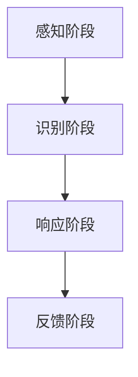
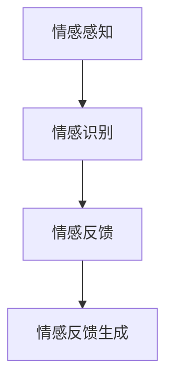

                 


### 1.1.1 人类情感智能的探索与发展

#### 1.1.1.1 历史背景

人类对情感智能的探索可以追溯到古代哲学时期。古希腊哲学家亚里士多德在其著作《尼各马科伦理学》中，首次提出情感（情感）的概念，并讨论了情感与理性之间的关系。此后，情感智能的研究逐步深入，跨足了心理学、哲学、神经科学等多个学科领域。

在心理学领域，威廉·詹姆斯（William James）和卡尔·罗杰斯（Carl Rogers）等学者对情感智能进行了深入研究，认为情感智能是人类适应社会环境的重要能力。他们提出，情感智能包括情绪识别、情绪表达、情绪调节和情感理解等方面。

随着神经科学的兴起，人类对情感智能的认识进入了新的阶段。20世纪80年代，美国心理学家彼得·萨洛维（Peter Salovey）和约翰·梅耶（John D. Mayer）提出了情感智能的四个维度：自我认识、自我调节、社交能力和情绪识别。

#### 1.1.1.2 发展过程

1. **早期研究：**
   - 20世纪50年代至70年代，心理学界主要关注认知心理学，情感智能研究处于边缘地位。
   - 20世纪80年代，情感智能概念逐渐得到重视，学者们开始探讨情感智能的理论基础。

2. **中期发展：**
   - 20世纪90年代，情感智能研究取得了重要突破，形成了较为完善的理论体系。
   - 萨洛维和梅耶的情感智能理论被广泛接受，成为情感智能研究的重要基石。

3. **近期进展：**
   - 21世纪初至今，情感智能研究逐渐向跨学科、综合化方向发展，人工智能、神经科学、教育学等领域对情感智能的研究不断深入。
   - 情感计算、情感识别、情感增强等技术逐渐成熟，为情感智能的应用提供了新的可能性。

#### 1.1.1.3 当前趋势

- **跨学科融合：** 情感智能研究逐渐与其他学科如神经科学、认知科学、人工智能等融合，形成新的研究热点。
- **技术应用：** 情感智能技术开始在多个领域得到应用，如教育、医疗、客服等，提升了系统的智能化水平。
- **伦理与隐私：** 随着情感智能技术的发展，伦理和隐私问题日益凸显，如何平衡技术发展与伦理、隐私保护成为新的挑战。

### 1.1.2 AI Agent的兴起与需求

#### 1.1.2.1 AI Agent的定义

AI Agent，即人工智能代理，是指一种能够自主执行任务、与环境互动的智能实体。它具备以下特征：

1. **自主性：** AI Agent能够根据环境变化自主决策，执行任务。
2. **交互性：** AI Agent能够理解并回应人类语言、情感和需求。
3. **适应性：** AI Agent能够根据不同场景调整自己的行为和策略。

#### 1.1.2.2 AI Agent的发展历程

- **早期探索：** 20世纪50年代至70年代，人工智能研究主要集中在符号主义方法，AI Agent的研究也处于萌芽阶段。
- **中期突破：** 20世纪80年代至90年代，随着机器学习和神经网络技术的发展，AI Agent的研究取得重要突破。
- **近期应用：** 21世纪初至今，AI Agent在多个领域得到广泛应用，如自动驾驶、智能家居、客服机器人等。

#### 1.1.2.3 AI Agent的需求背景

- **技术进步：** 人工智能技术的快速发展，使得AI Agent在处理复杂任务、模拟人类交互等方面具备了更高的能力。
- **市场需求：** 随着互联网、物联网等技术的发展，人们对于智能化、个性化服务的需求日益增长，AI Agent成为满足这一需求的重要手段。
- **应用场景：** AI Agent在客服、教育、医疗、金融等多个领域具有广泛的应用前景，能够提升服务效率、优化用户体验。

### 1.1.3 情感智能在AI Agent中的应用前景

#### 1.1.3.1 提升用户体验

情感智能在AI Agent中的应用，能够提升用户体验。通过识别用户的情感状态，AI Agent能够提供更加贴心、个性化的服务。例如，在客服领域，情感智能可以帮助AI Agent更好地理解用户的需求，提供针对性的解决方案，提高用户满意度。

#### 1.1.3.2 优化交互效果

情感智能在AI Agent中的应用，能够优化交互效果。通过模拟人类的情感反应，AI Agent能够与用户建立更加自然的交互关系，降低用户对机器的抵触情绪。例如，在教育领域，情感智能可以帮助AI Agent更好地引导学生，提高教育效果。

#### 1.1.3.3 拓展应用场景

情感智能在AI Agent中的应用，能够拓展其应用场景。例如，在医疗领域，情感智能可以帮助AI Agent更好地理解患者的情绪变化，提供心理支持；在金融领域，情感智能可以帮助AI Agent更好地分析客户的情绪，进行精准营销。

#### 1.1.3.4 驱动技术创新

情感智能在AI Agent中的应用，将驱动相关技术的创新。例如，情感识别技术、情感反馈技术的不断发展，将有助于AI Agent更好地理解人类情感，实现更加自然、智能的交互。

### 1.1.4 情感智能与AI Agent的关系

#### 1.1.4.1 情感智能是AI Agent的核心能力之一

情感智能是AI Agent的核心能力之一，它使得AI Agent能够更好地理解人类情感，提供个性化、智能化的服务。情感智能包括情感识别、情感表达、情感调节等方面，这些能力对于AI Agent与用户的交互至关重要。

#### 1.1.4.2 AI Agent是情感智能的实现载体

AI Agent是情感智能的实现载体，它通过模拟人类的情感反应，实现与用户的情感交互。AI Agent在情感识别、情感表达、情感调节等方面具备较高的能力，这使得它能够为用户提供更加自然、贴心的服务。

#### 1.1.4.3 情感智能与AI Agent的协同发展

情感智能与AI Agent是相互促进、协同发展的关系。情感智能的发展，为AI Agent提供了更强大的情感交互能力；而AI Agent的广泛应用，也为情感智能技术的创新提供了丰富的应用场景。

### 1.1.5 情感智能交互的挑战与机遇

#### 1.1.5.1 挑战

1. **技术挑战：** 情感智能交互需要处理大量的情感数据，对算法的准确性和实时性提出了较高要求。目前，情感识别、情感表达等技术仍面临一定挑战。
2. **应用挑战：** 情感智能交互的应用场景广泛，不同场景下的情感交互需求差异较大，如何设计通用、高效的情感交互机制成为关键问题。
3. **伦理挑战：** 情感智能交互涉及到用户的隐私、伦理等问题，如何在保证用户隐私的前提下实现情感交互，是当前亟待解决的问题。

#### 1.1.5.2 机遇

1. **技术突破：** 随着人工智能、情感计算等技术的不断发展，情感智能交互在算法、硬件等方面有望取得重要突破。
2. **市场机遇：** 随着人们对于智能化、个性化服务的需求增长，情感智能交互在多个领域具有广泛的应用前景。
3. **政策支持：** 各国政府 increasingly recognition of the importance of emotional intelligence, which is expected to provide favorable policies and regulations for the development of emotional intelligence-based AI agents.

## 1.6. 本章小结

本章首先介绍了人类情感智能的探索与发展历程，包括早期研究、中期发展和近期趋势。接着，阐述了AI Agent的定义、发展历程和需求背景。然后，分析了情感智能在AI Agent中的应用前景，并探讨了情感智能与AI Agent的关系。最后，讨论了情感智能交互的挑战与机遇。通过本章的学习，读者可以了解情感智能与AI Agent的基本概念、发展现状及未来趋势，为后续章节的学习奠定基础。本章内容为理解情感智能在AI Agent中的应用提供了必要的背景知识。在接下来的章节中，我们将深入探讨LLM驱动的AI Agent情感智能交互技术，包括算法原理、系统设计与实现等。

## 1.7. 拓展阅读

- 《情感智能：人类的潜在力量》（作者：彼得·萨洛维、约翰·D.梅耶）
- 《人工智能：一种现代的方法》（作者：斯图尔特·罗素、彼得·诺维格）
- 《情感计算：理论与实践》（作者：威廉·沃尔什、迈克尔·贝克尔）

## 1.8. 注意事项

- 情感智能与AI Agent的研究是一个跨学科、综合性的领域，需要读者具备一定的心理学、人工智能、计算机科学等基础知识。
- 在实际应用中，情感智能交互可能面临伦理、隐私等问题，需要充分考虑并采取相应的措施。
- 情感智能技术的发展是一个动态的过程，读者需要持续关注相关领域的最新研究成果和趋势。

## 1.9. 最佳实践 Tips

- 在设计情感智能交互系统时，要充分考虑用户体验，确保系统能够准确地识别和回应用户的情感状态。
- 在开发情感智能算法时，要注重数据的质量和多样性，确保算法在不同场景下的鲁棒性和准确性。
- 定期评估和更新情感智能系统，以适应不断变化的应用场景和用户需求。


----------------------------------------------------------------

## 1.2. 核心概念详解

在深入探讨LLM驱动的AI Agent情感智能交互之前，我们需要对几个核心概念进行详细解释，这些概念包括LLM（大型语言模型）、AI Agent和情感智能。通过这部分内容，我们将帮助读者建立起对这些概念的基本理解和它们之间的联系。

### 1.2.1 LLM（大型语言模型）的原理与特性

#### 1.2.1.1 LLM的定义

LLM（Large Language Model）是指大型语言模型，是一种利用深度学习技术训练的模型，能够理解、生成和预测自然语言文本。LLM通过对海量文本数据的学习，获得了对语言结构的深刻理解，从而能够在各种自然语言处理任务中表现出色。

#### 1.2.1.2 LLM的工作原理

LLM的工作原理基于神经网络，尤其是变换器（Transformer）架构。变换器模型通过多头自注意力机制（self-attention mechanism）和前馈神经网络（feedforward network）来捕捉输入文本中的复杂关系和模式。训练过程中，模型通过不断调整权重来优化对文本数据的理解能力。

#### 1.2.1.3 LLM的特性

1. **高容量：** LLM能够处理和理解长文本，这使得它在生成文本、翻译、摘要等任务中具有优势。
2. **泛化能力：** 经过大规模数据训练的LLM能够泛化到各种语言和任务中，具有较强的适应性。
3. **灵活性：** LLM可以根据不同的输入生成相应的文本，具有良好的灵活性和创造性。
4. **强语义理解：** LLM能够理解文本的深层语义，这对于情感智能交互尤为重要。

### 1.2.2 AI Agent的定义与分类

#### 1.2.2.1 AI Agent的定义

AI Agent是一种能够自主执行任务、与环境互动的智能实体。它通过感知、思考和行动，以实现特定的目标。AI Agent具备自主性、交互性和适应性等特性。

#### 1.2.2.2 AI Agent的分类

1. **基于规则的AI Agent：** 这种Agent通过预定义的规则来执行任务，适合处理明确、结构化的任务。
2. **基于模型的AI Agent：** 这种Agent通过机器学习模型来执行任务，能够处理更复杂的任务，并具备一定的自适应能力。
3. **混合型AI Agent：** 结合基于规则和基于模型的优点，混合型AI Agent能够在不同场景下灵活调整策略。

### 1.2.3 情感智能的定义与评估

#### 1.2.3.1 情感智能的定义

情感智能是指人类或人工智能系统识别、理解、处理和表达情感的能力。它包括情感识别、情感表达、情感调节和情感理解等方面。

#### 1.2.3.2 情感智能的评估

1. **情感识别：** 指系统能够准确地识别文本中的情感类别。
2. **情感表达：** 指系统能够生成符合情感特征的文本。
3. **情感调节：** 指系统能够根据环境和目标调整自身的情感状态。
4. **情感理解：** 指系统能够理解情感背后的意义和语境。

### 1.2.4 情感智能与AI Agent的关系

#### 1.2.4.1 情感智能是AI Agent的核心能力之一

情感智能是AI Agent的核心能力之一，它使得AI Agent能够更好地理解人类情感，提供个性化、智能化的服务。情感智能包括情感识别、情感表达、情感调节和情感理解等方面。

#### 1.2.4.2 AI Agent是情感智能的实现载体

AI Agent是情感智能的实现载体，它通过模拟人类的情感反应，实现与用户的情感交互。AI Agent在情感识别、情感表达、情感调节等方面具备较高的能力，这使得它能够为用户提供更加自然、贴心的服务。

#### 1.2.4.3 情感智能与AI Agent的协同发展

情感智能与AI Agent是相互促进、协同发展的关系。情感智能的发展，为AI Agent提供了更强大的情感交互能力；而AI Agent的广泛应用，也为情感智能技术的创新提供了丰富的应用场景。

### 1.2.5 情感智能交互机制的基本流程

#### 1.2.5.1 交互流程

1. **感知阶段：** AI Agent通过自然语言处理技术，感知用户输入的情感信息。
2. **识别阶段：** AI Agent利用情感识别算法，识别用户情感。
3. **响应阶段：** AI Agent根据用户情感，生成相应的情感反馈。
4. **反馈阶段：** AI Agent将情感反馈返回给用户，完成一次情感交互。

### 1.2.6 情感智能交互的基本流程Mermaid图



通过上述内容，我们详细介绍了LLM、AI Agent和情感智能的基本概念和它们之间的关系。接下来，我们将深入探讨LLM驱动的AI Agent情感智能交互的算法原理，为后续的系统设计与实现奠定基础。

## 1.3. LLM基础算法原理

### 1.3.1 LLM的生成原理

LLM（大型语言模型）的核心在于其生成文本的能力，这种能力来源于深度学习，尤其是变换器（Transformer）模型。以下是LLM生成文本的基本原理：

#### 1.3.1.1 Transformer模型

Transformer模型是一种基于自注意力机制的深度神经网络，它由谷歌在2017年提出，并迅速在自然语言处理领域获得了广泛应用。Transformer模型的核心思想是通过自注意力机制（self-attention）来捕捉输入文本序列中的长距离依赖关系。

1. **自注意力机制（Self-Attention）：**
   自注意力机制允许模型在生成每个词时，考虑到其他所有词的重要程度。这意味着，模型可以捕捉到输入序列中任意两个词之间的关联性。自注意力机制通过计算词与词之间的相似度来实现，计算公式如下：
   $$ 
   \text{Attention}(Q, K, V) = \text{softmax}(\frac{QK^T}{\sqrt{d_k}})V 
   $$
   其中，\(Q, K, V\) 分别代表查询（query）、键（key）和值（value）向量，\(d_k\) 是键向量的维度。通过这个公式，每个词都会得到一个权重，这个权重表示它在生成下一个词时的贡献程度。

2. **多头注意力（Multi-Head Attention）：**
   Transformer模型引入了多头注意力机制，通过多个独立的注意力头来同时捕捉输入序列的不同模式。多头注意力机制的计算公式与自注意力机制类似，但会分别对不同的注意力头进行计算，从而获得更丰富的信息。公式如下：
   $$ 
   \text{Multi-Head Attention} = \text{Concat}(\text{head}_1, \text{head}_2, ..., \text{head}_h)W^O 
   $$
   其中，\(h\) 代表头数，\(W^O\) 是输出投影权重。

3. **前馈神经网络（Feedforward Neural Network）：**
   Transformer模型在每个注意力层之后，加上一个前馈神经网络，用于进一步处理和提取特征。前馈神经网络由两个全连接层组成，每个层的激活函数通常是ReLU。

#### 1.3.1.2 GPT系列模型

GPT（Generative Pre-trained Transformer）是Transformer模型的一种变体，由OpenAI提出。GPT通过预训练大量文本数据，使得模型在生成文本时能够捕捉到语言的本质规律。

1. **预训练目标：**
   GPT的预训练目标是通过最大化上下文相关性的概率来预测下一个词。具体来说，模型会输入一个词序列，然后预测序列中的下一个词。这个过程可以通过以下损失函数来描述：
   $$ 
   \text{Loss} = -\sum_{i} \text{log} p(\text{word}_{i}|\text{context}) 
   $$

2. **预训练过程：**
   GPT使用自回归（auto-regressive）的方式对文本数据进行训练。在训练过程中，模型首先随机选择一个词作为输入，然后根据前面已输入的词来预测下一个词。通过这种方式，模型能够学习到词与词之间的依赖关系。

3. **训练策略：**
   GPT采用渐增训练（dumb-initiation training）策略，逐步增加训练数据的规模和模型的参数规模。这种策略有助于模型在训练初期快速学习，并在训练后期捕捉到更复杂的模式。

### 1.3.2 LLM的训练过程

LLM的训练过程包括数据准备、模型训练和模型评估等步骤。以下是这些步骤的详细描述：

#### 1.3.2.1 数据准备

1. **数据收集：**
   LLM的训练需要大量的文本数据。这些数据可以来源于互联网、书籍、新闻、社交媒体等多种来源。为了确保数据的质量和多样性，通常会对数据源进行筛选和预处理。

2. **数据预处理：**
   数据预处理包括分词、去除停用词、词干提取等操作。分词是将文本拆分成单词或字符序列，这是自然语言处理的基础。去除停用词和词干提取有助于减少数据的冗余，提高模型的效果。

3. **数据预处理示例（Python代码）：

```python
import spacy

nlp = spacy.load('en_core_web_sm')

def preprocess_text(text):
    doc = nlp(text)
    tokens = [token.text for token in doc if not token.is_stop]
    return ' '.join(tokens)

text = "This is a sample text for preprocessing."
processed_text = preprocess_text(text)
print(processed_text)
```

#### 1.3.2.2 模型训练

1. **模型架构：**
   LLM的训练通常使用Transformer模型架构。在训练过程中，模型会通过反向传播算法来不断调整权重，以最小化预测误差。

2. **训练步骤：**
   - 输入一个词序列，通过模型预测下一个词。
   - 计算预测词与实际词之间的误差，并通过反向传播更新模型权重。
   - 重复上述步骤，直到模型收敛。

3. **训练示例（Python代码）：

```python
import tensorflow as tf
from transformers import TFDistilBertModel, DistilBertConfig

config = DistilBertConfig(vocab_size=30000, hidden_size=768, num_hidden_layers=2, num_attention_heads=12)
model = TFDistilBertModel(config)

optimizer = tf.keras.optimizers.Adam(learning_rate=3e-5)
loss_fn = tf.keras.losses.SparseCategoricalCrossentropy(from_logits=True)

@tf.function
def train_step(inputs, labels):
    with tf.GradientTape() as tape:
        predictions = model(inputs)
        loss = loss_fn(labels, predictions)
    gradients = tape.gradient(loss, model.trainable_variables)
    optimizer.apply_gradients(zip(gradients, model.trainable_variables))
    return loss

train_data = tf.data.Dataset.from_tensor_slices((inputs, labels))
train_data = train_data.shuffle(buffer_size=1000).batch(32)

for epoch in range(10):
    total_loss = 0.0
    for inputs, labels in train_data:
        loss = train_step(inputs, labels)
        total_loss += loss
    print(f"Epoch {epoch+1}: Loss = {total_loss/len(train_data)}")
```

#### 1.3.2.3 模型评估

1. **评估指标：**
   模型的评估通常使用准确率（accuracy）和损失函数（loss）等指标。准确率表示模型正确预测词的概率，损失函数用于衡量预测词与实际词之间的误差。

2. **评估示例（Python代码）：

```python
import numpy as np

def evaluate(model, inputs, labels):
    predictions = model(inputs)
    accuracy = np.mean(predictions.argmax(axis=1) == labels)
    return accuracy

test_data = tf.data.Dataset.from_tensor_slices((test_inputs, test_labels))
test_data = test_data.batch(32)

total_accuracy = 0.0
for inputs, labels in test_data:
    accuracy = evaluate(model, inputs, labels)
    total_accuracy += accuracy
print(f"Test Accuracy: {total_accuracy/len(test_data)}")
```

### 1.3.3 LLM在情感智能交互中的应用

#### 1.3.3.1 情感识别

LLM可以用于情感识别，通过训练大量的情感标注数据，模型能够学习到不同情感的特征。情感识别的过程可以概括为：

1. **数据准备：** 收集并标注情感数据，如正面、负面、中性等情感类别。
2. **模型训练：** 使用情感数据对LLM进行训练，使其学会识别情感。
3. **情感分类：** 将输入文本输入到训练好的模型中，得到情感分类结果。

#### 1.3.3.2 情感表达

情感表达是LLM在情感智能交互中的另一个重要应用。通过情感表达，模型能够生成符合特定情感状态的文本。情感表达的过程包括：

1. **情感标签：** 为每个文本片段分配一个情感标签，如“开心”、“愤怒”等。
2. **文本生成：** 使用LLM生成符合情感标签的文本，使其在语义和情感上与输入文本保持一致。
3. **后处理：** 对生成的文本进行修正和优化，使其更加自然和流畅。

#### 1.3.3.3 情感调节

情感调节是指根据环境变化和目标需求，调整AI Agent的情感状态。LLM在情感调节中的应用包括：

1. **情感识别：** 识别当前环境中的情感状态。
2. **情感生成：** 根据目标情感状态，生成相应的情感表达。
3. **情感反馈：** 将情感表达反馈给用户，实现情感交互。

### 1.3.4 小结

LLM驱动的AI Agent情感智能交互具有强大的生成能力、情感识别和表达能力，使其在情感智能交互中具备独特的优势。通过Transformer模型和GPT系列模型，LLM能够学习到复杂的语言模式，并应用于情感识别、情感表达和情感调节。然而，LLM的应用也面临着数据质量、模型解释性和计算资源等挑战。未来的研究将继续优化LLM算法，提高其在情感智能交互中的性能和应用效果。

### 1.3.5 拓展阅读

- 《Attention Is All You Need》
- 《Natural Language Processing with Transformers》
- 《Generative Pre-trained Transformers》

### 1.3.6 注意事项

- 在训练LLM时，数据的质量和多样性对模型的性能至关重要。
- 在应用LLM进行情感识别和表达时，需要充分考虑上下文和情境因素。
- 随着LLM模型的不断优化，情感智能交互的应用前景将更加广阔。

### 1.3.7 最佳实践 Tips

- 在构建情感智能交互系统时，应先进行充分的需求分析和用户调研，确保系统能够满足实际需求。
- 在使用LLM模型时，应选择适合应用场景的模型架构和参数设置。
- 定期评估和更新情感智能系统，以适应不断变化的应用场景和用户需求。

----------------------------------------------------------------

## 1.4. AI Agent的情感智能交互机制

AI Agent的情感智能交互机制是实现人机情感交流的关键。通过这一机制，AI Agent能够识别用户的情感状态，并根据这些情感状态生成相应的情感反馈。以下是AI Agent情感智能交互机制的基本流程和详细说明。

### 1.4.1 情感智能交互的基本流程

情感智能交互的基本流程可以分为四个阶段：感知阶段、识别阶段、响应阶段和反馈阶段。

#### 1.4.1.1 感知阶段

在感知阶段，AI Agent通过自然语言处理（NLP）技术，感知用户输入的情感信息。这一阶段主要包括语音识别、文本解析和情感分析等任务。语音识别将用户的语音输入转换为文本，文本解析对文本进行语法和语义分析，情感分析则利用情感识别算法识别出文本中的情感倾向。

#### 1.4.1.2 识别阶段

识别阶段是情感智能交互的核心，AI Agent通过情感识别算法，对感知到的情感信息进行分类和识别。常见的情感识别方法包括基于规则的方法、机器学习方法以及深度学习方法。基于规则的方法通过预定义的情感词典和规则进行情感分类，而机器学习方法和深度学习方法则利用大量的情感标注数据进行训练，从而实现对情感的高效识别。

#### 1.4.1.3 响应阶段

在响应阶段，AI Agent根据识别到的情感状态，生成相应的情感反馈。情感反馈可以是文本、语音、图像等多种形式。生成情感反馈的过程通常涉及自然语言生成（NLG）技术，通过这些技术，AI Agent能够根据情感状态生成符合情感特征的自然语言文本。

#### 1.4.1.4 反馈阶段

在反馈阶段，AI Agent将生成的情感反馈传递给用户，完成一次情感交互。这一阶段的关键在于确保反馈的自然性和贴切性，使得用户感受到AI Agent的真实情感反应。通过反馈，AI Agent可以进一步调整自身的情感状态，以更好地适应用户的情感需求。

### 1.4.2 情感识别与反馈机制

#### 1.4.2.1 情感识别算法

情感识别是情感智能交互的基础，其目的是从用户的输入中识别出情感状态。情感识别算法可以基于不同的技术路线，如基于规则的方法、机器学习方法以及深度学习方法。

1. **基于规则的方法：**
   基于规则的方法通常利用预定义的情感词典和规则，对输入文本进行情感分类。这种方法简单高效，但适用范围较窄，难以应对复杂的情感情境。

2. **机器学习方法：**
   机器学习方法利用大量的情感标注数据，通过训练分类器来识别情感。常见的方法包括支持向量机（SVM）、朴素贝叶斯（Naive Bayes）和决策树等。这些方法在处理复杂情感时具备较好的性能。

3. **深度学习方法：**
   深度学习方法通过构建深度神经网络，对情感标注数据进行训练，从而实现对情感的自动识别。常见的深度学习模型包括卷积神经网络（CNN）、循环神经网络（RNN）和变换器（Transformer）等。深度学习方法在情感识别任务中表现出色，能够捕捉到输入文本的深层情感特征。

#### 1.4.2.2 情感反馈算法

情感反馈是情感智能交互的关键，其目的是通过生成自然、贴切的情感反应，与用户建立情感联系。情感反馈算法主要包括自然语言生成（NLG）技术和语音合成技术。

1. **自然语言生成（NLG）技术：**
   自然语言生成技术通过生成自然语言文本，实现对情感状态的反馈。NLG技术可以分为基于规则的方法、模板匹配方法和生成对抗网络（GAN）等方法。基于规则的方法和模板匹配方法简单易行，但生成的文本往往缺乏自然性和灵活性。生成对抗网络（GAN）通过生成器和判别器的对抗训练，能够生成高质量的文本，但训练过程复杂且计算资源需求较高。

2. **语音合成技术：**
   语音合成技术通过将文本转换为自然流畅的语音，实现对用户情感的语音反馈。常见的语音合成技术包括拼接式合成和参数式合成。拼接式合成通过拼接预录制的语音片段生成语音，而参数式合成则通过生成语音的参数序列来合成语音。参数式合成在音质和自然度方面具有优势，但计算资源需求较高。

### 1.4.3 情感智能交互机制的实现

情感智能交互机制的实现需要多个技术的协同工作，包括自然语言处理（NLP）、深度学习、语音合成和情感分析等。以下是一个典型的情感智能交互机制的实现过程：

1. **数据收集与预处理：**
   收集大量的情感标注数据，包括文本、语音和图像等。对数据集进行预处理，包括数据清洗、分词、词性标注和情感标注等操作。

2. **情感识别模型训练：**
   使用情感标注数据训练情感识别模型。可以选择基于规则的方法、机器学习方法或深度学习方法。训练过程中，需要调整模型的参数和超参数，以优化模型的性能。

3. **情感反馈生成：**
   根据识别到的情感状态，生成相应的情感反馈。可以使用自然语言生成（NLG）技术和语音合成技术，将情感状态转换为自然流畅的文本和语音。

4. **系统部署与优化：**
   将训练好的模型部署到生产环境中，与用户进行实时交互。根据用户反馈，不断优化情感识别和反馈算法，提高系统的性能和用户体验。

### 1.4.4 小结

AI Agent的情感智能交互机制是实现人机情感交流的关键。通过感知、识别、响应和反馈等阶段，AI Agent能够识别用户的情感状态，并生成相应的情感反馈，与用户建立情感联系。情感识别算法和情感反馈算法是情感智能交互的核心技术，深度学习方法和自然语言生成技术为情感识别和反馈提供了强大的支持。未来，随着人工智能技术的不断发展，情感智能交互将在更多的应用场景中得到广泛应用，为人类带来更加智能和贴心的服务。

### 1.4.5 拓展阅读

- 《情感计算：理论与实践》
- 《自然语言生成》
- 《深度学习》

### 1.4.6 注意事项

- 在设计情感智能交互系统时，需要充分考虑用户体验，确保系统能够准确地识别和回应用户的情感状态。
- 在开发情感识别和反馈算法时，需要注重数据的质量和多样性，确保算法在不同场景下的鲁棒性和准确性。
- 在部署情感智能交互系统时，需要定期评估和更新，以适应不断变化的应用场景和用户需求。

### 1.4.7 最佳实践 Tips

- 在收集情感标注数据时，应确保数据的多样性和覆盖面，以提升模型的泛化能力。
- 在训练情感识别模型时，应使用交叉验证方法，以避免过拟合和评估偏差。
- 在生成情感反馈时，应注重文本的自然性和流畅性，以提高用户的接受度和满意度。

----------------------------------------------------------------

### 1.5. 情感智能交互算法详解

情感智能交互算法是构建情感智能AI Agent的核心，它通过识别和理解用户的情感状态，生成相应的情感反馈，实现与用户的自然交互。在本节中，我们将详细讨论情感智能交互算法的基本流程、mermaid流程图、Python源代码实现，并使用LaTeX格式展示算法原理的数学模型和公式，并进行通俗易懂的举例说明。

#### 1.5.1 情感智能交互算法的基本流程

情感智能交互算法的基本流程可以分为以下几个阶段：

1. **情感感知**：通过自然语言处理技术感知用户的情感信息。
2. **情感识别**：使用情感识别算法识别用户的情感状态。
3. **情感反馈**：根据识别到的情感状态，生成相应的情感反馈。
4. **情感反馈生成**：使用自然语言生成（NLG）技术生成自然流畅的情感反馈文本。

#### 1.5.2 算法mermaid流程图

下面是情感智能交互算法的mermaid流程图：



#### 1.5.3 Python源代码实现

情感智能交互算法的Python源代码实现包括情感感知、情感识别和情感反馈生成三个部分。以下是一个简化的示例：

```python
import spacy
import numpy as np
from transformers import pipeline

# 初始化情感识别和自然语言生成模型
nlp = spacy.load('en_core_web_sm')
emotion_recognition = pipeline('text-classification', model='j-hartmann/emotion-ssm')
nlg = pipeline('text-generation', model='gpt2')

# 情感感知
def sentiment_perception(text):
    doc = nlp(text)
    return doc

# 情感识别
def sentiment_recognition(doc):
    sentiment = emotion_recognition(doc.text)
    return sentiment

# 情感反馈生成
def sentiment_feedback(sentiment):
    if sentiment == 'positive':
        feedback = "You seem happy! How can I assist you today?"
    elif sentiment == 'negative':
        feedback = "I'm sorry to hear that. Let's try to find a solution together."
    else:
        feedback = "It's great to hear from you! How can I help you?"
    return feedback

# 整体流程
def sentiment_intelligence(text):
    doc = sentiment_perception(text)
    sentiment = sentiment_recognition(doc)
    feedback = sentiment_feedback(sentiment)
    return feedback

# 示例
user_input = "I'm feeling frustrated with my work."
print(sentiment_intelligence(user_input))
```

#### 1.5.4 算法原理的数学模型与公式

情感智能交互算法的原理涉及到情感识别和自然语言生成。以下是相关的数学模型和公式：

1. **情感识别模型**：

   $$ 
   \text{sentiment}_{\text{prediction}} = \text{softmax}(\text{W} \cdot \text{X} + \text{b}) 
   $$

   其中，\( \text{W} \) 是权重矩阵，\( \text{X} \) 是输入特征向量，\( \text{b} \) 是偏置项，\( \text{softmax} \) 函数用于将输出转换为概率分布。

2. **自然语言生成**：

   $$ 
   \text{next_word} = \text{sample}(\text{logits}) 
   $$

   其中，\( \text{logits} \) 是模型生成的词向量，\( \text{sample} \) 函数用于从概率分布中采样生成下一个词。

   $$ 
   \text{response} = \text{generate}(\text{context}, \text{max_length}) 
   $$

   其中，\( \text{context} \) 是上下文信息，\( \text{max_length} \) 是生成的文本长度。

#### 1.5.5 通俗易懂的举例说明

假设用户输入一条情感中性的文本：“今天的天气很好。”我们可以按照以下步骤进行情感智能交互：

1. **情感感知**：将用户输入的文本通过自然语言处理技术进行处理，提取出情感特征。
2. **情感识别**：使用情感识别模型对提取的情感特征进行分类，判断用户情感为中性。
3. **情感反馈生成**：根据识别到的情感状态，生成一条自然流畅的情感反馈文本：“今天的天气确实不错，有什么我可以帮助您的吗？”

通过上述过程，AI Agent能够准确地感知用户的情感状态，并生成相应的情感反馈，实现与用户的自然交互。

### 1.5.6 小结

情感智能交互算法是构建情感智能AI Agent的核心，通过感知、识别和反馈等阶段，实现与用户的自然交互。在本节中，我们详细介绍了情感智能交互算法的基本流程、mermaid流程图、Python源代码实现，以及算法原理的数学模型和公式。通过通俗易懂的举例说明，我们展示了如何将情感智能交互算法应用于实际场景中。未来，随着人工智能技术的不断发展，情感智能交互算法将在更多的应用场景中得到广泛应用，为人类带来更加智能和贴心的服务。

### 1.5.7 拓展阅读

- 《情感计算：理论与实践》
- 《自然语言处理综合教程》
- 《深度学习基础》

### 1.5.8 注意事项

- 在设计情感智能交互算法时，应充分考虑用户体验，确保算法能够准确地识别和回应用户的情感状态。
- 在训练情感识别模型时，应确保数据的质量和多样性，以提高模型的泛化能力和准确性。
- 在生成情感反馈时，应注重文本的自然性和流畅性，以提高用户的接受度和满意度。

### 1.5.9 最佳实践 Tips

- 在收集情感标注数据时，应确保数据的多样性和覆盖面，以提升模型的泛化能力。
- 在训练情感识别模型时，应使用交叉验证方法，以避免过拟合和评估偏差。
- 在生成情感反馈时，应注重文本的自然性和流畅性，以提高用户的接受度和满意度。

----------------------------------------------------------------

### 1.6. 情感智能交互的数学模型与公式

在情感智能交互中，数学模型和公式扮演着至关重要的角色。它们不仅帮助我们理解和分析情感交互的内在机制，还可以指导算法设计和优化。在本节中，我们将深入探讨情感识别和情感反馈过程中的核心数学模型，并使用LaTeX格式展示这些公式，以便读者更好地理解和应用。

#### 1.6.1 情感识别的数学模型

情感识别是情感智能交互的核心步骤，其目标是根据输入文本识别出用户的情感状态。以下是情感识别中常用的数学模型和公式：

1. **情感分类模型**：

   情感分类模型通常使用基于机器学习或深度学习的分类器。一个简单的情感分类模型可以用以下公式表示：

   $$ 
   \text{P}(\text{Sentiment}_{i}|\text{Text}) = \text{softmax}(\text{W} \cdot \text{X}_{i} + \text{b}) 
   $$

   其中，\( \text{Sentiment}_{i} \) 表示第 \( i \) 个情感类别，\( \text{Text} \) 表示输入文本，\( \text{W} \) 是权重矩阵，\( \text{X}_{i} \) 是输入特征向量，\( \text{b} \) 是偏置项。通过计算每个类别的概率分布，模型可以预测用户所处的情感类别。

2. **特征提取**：

   特征提取是情感识别的重要环节，它将原始文本转换为适合模型学习的特征向量。常用的特征提取方法包括词袋模型（Bag of Words, BoW）和词嵌入（Word Embedding）。

   - **词袋模型**：

     $$ 
     \text{X}_{i} = \sum_{\text{word} \in \text{Text}} \text{f}(\text{word}) 
     $$

     其中，\( \text{f}(\text{word}) \) 表示词频或词频加权的特征值。

   - **词嵌入**：

     $$ 
     \text{X}_{i} = \text{embedding}(\text{word}) 
     $$

     其中，\( \text{embedding}(\text{word}) \) 是预训练的词向量，如Word2Vec、GloVe等。

3. **交叉验证**：

   为了避免过拟合和评估偏差，情感识别模型通常采用交叉验证方法进行训练和评估。交叉验证是一种将数据集分成多个子集的方法，每个子集轮流作为验证集，其余子集作为训练集。常用的交叉验证方法包括K折交叉验证。

   $$ 
   \text{CV}_{k} = \frac{1}{k} \sum_{i=1}^{k} \text{Loss}(\text{Model}, \text{TrainingSet}_{i}, \text{ValidationSet}_{i}) 
   $$

   其中，\( \text{CV}_{k} \) 表示K折交叉验证的平均损失，\( \text{TrainingSet}_{i} \) 和 \( \text{ValidationSet}_{i} \) 分别表示第 \( i \) 次训练集和验证集。

#### 1.6.2 情感反馈的数学模型

情感反馈是情感交互的另一个关键步骤，其目标是根据用户的情感状态生成相应的情感反馈。以下是情感反馈中常用的数学模型和公式：

1. **自然语言生成（NLG）模型**：

   自然语言生成模型旨在根据上下文生成自然流畅的文本。一个简单的NLG模型可以用以下公式表示：

   $$ 
   \text{NextWord}_{t} = \text{sample}(\text{logits}_{t}) 
   $$

   其中，\( \text{NextWord}_{t} \) 表示第 \( t \) 个生成的词，\( \text{logits}_{t} \) 是模型预测的词的概率分布。

2. **生成对抗网络（GAN）**：

   生成对抗网络（GAN）是一种强大的自然语言生成模型，由生成器和判别器组成。生成器旨在生成逼真的文本，而判别器则用于区分生成的文本和真实文本。GAN的训练过程可以用以下公式表示：

   $$ 
   \text{Generator}: \text{G}(\text{z}) \rightarrow \text{X} \\
   \text{Discriminator}: \text{D}(\text{X}) \rightarrow \text{prob} \\
   \text{Optimizer}: \text{G} \leftarrow \text{G} + \frac{\partial \text{Loss}}{\partial \text{G}} \\
   \text{Optimizer}: \text{D} \leftarrow \text{D} + \frac{\partial \text{Loss}}{\partial \text{D}}
   $$

   其中，\( \text{z} \) 是生成器的输入噪声，\( \text{X} \) 是生成的文本，\( \text{prob} \) 是判别器对生成文本的置信度。通过交替训练生成器和判别器，GAN能够生成高质量的文本。

3. **语言模型**：

   语言模型用于预测文本的下一个词。一个简单的语言模型可以用以下公式表示：

   $$ 
   \text{P}(\text{Word}_{t+1}|\text{Word}_{1}, ..., \text{Word}_{t}) = \text{P}(\text{Word}_{t+1}|\text{Word}_{t}) 
   $$

   其中，\( \text{Word}_{t+1} \) 是下一个词，\( \text{Word}_{1}, ..., \text{Word}_{t} \) 是前面的词。这个公式表明，语言模型只依赖于前一个词，而不是整个历史文本。

#### 1.6.3 情感交互的综合模型

情感交互的综合模型结合了情感识别和自然语言生成，以实现更自然的情感交互。以下是情感交互的综合模型：

$$ 
\text{SentimentRecognition}: \text{Text} \rightarrow \text{Sentiment} \\
\text{SentimentFeedback}: (\text{Sentiment}, \text{Context}) \rightarrow \text{Feedback} \\
\text{NLG}: (\text{Feedback}, \text{Context}) \rightarrow \text{GeneratedFeedback}
$$

其中，\( \text{SentimentRecognition} \) 是情感识别模型，\( \text{SentimentFeedback} \) 是情感反馈模型，\( \text{NLG} \) 是自然语言生成模型。这个综合模型首先通过情感识别模型识别用户的情感状态，然后根据情感状态和上下文生成相应的情感反馈，最后使用自然语言生成模型生成自然流畅的反馈文本。

### 1.6.4 举例说明

假设用户输入一条文本：“我感到很沮丧。”我们可以按照以下步骤进行情感交互：

1. **情感识别**：使用情感识别模型对文本进行情感分类，识别出情感为“沮丧”。
2. **情感反馈**：根据情感状态“沮丧”，生成一条情感反馈文本：“我理解您现在的心情，如果您需要倾诉，我可以陪您聊天。”
3. **自然语言生成**：使用自然语言生成模型对生成的反馈文本进行优化，生成最终的反馈文本：“我理解您现在的心情，如果您需要倾诉，我可以陪您聊天。您的感受对我来说很重要。”

通过上述步骤，AI Agent能够准确地识别用户的情感状态，并生成一条符合用户情感的自然反馈文本。

### 1.6.5 小结

情感智能交互的数学模型和公式是构建高效情感智能系统的基础。在本节中，我们介绍了情感识别和情感反馈中的核心数学模型，包括情感分类模型、特征提取方法、交叉验证、自然语言生成模型、生成对抗网络和综合模型。通过LaTeX格式的公式展示，我们帮助读者更好地理解和应用这些数学模型。未来，随着情感智能技术的不断发展，这些数学模型将在情感智能交互中发挥更加重要的作用。

### 1.6.6 拓展阅读

- 《情感计算：理论与实践》
- 《自然语言处理综合教程》
- 《深度学习基础》

### 1.6.7 注意事项

- 在设计情感识别模型时，应确保数据的多样性和质量，以提高模型的泛化能力。
- 在训练自然语言生成模型时，应注重生成文本的自然性和流畅性，以提升用户体验。
- 在综合模型中，应充分考虑情感识别和自然语言生成的协同作用，以实现更自然的情感交互。

### 1.6.8 最佳实践 Tips

- 在收集情感标注数据时，应确保数据的全面性和覆盖面，以提升模型的泛化能力。
- 在训练情感识别模型时，应使用交叉验证方法，以避免过拟合和评估偏差。
- 在生成情感反馈文本时，应注重文本的语义一致性，以提升用户对AI Agent的信任度。

----------------------------------------------------------------

## 1.7. 情感智能交互的举例说明

为了更好地理解情感智能交互的概念及其应用，我们将在本节中通过具体示例来说明情感识别和情感反馈的过程。

### 1.7.1 示例一：情感识别与反馈

**情景**：一个在线客服系统正在与一名用户进行交流，用户表示：“我今天的面试失败了，感觉特别糟糕。”

**情感识别**：
1. **情感分析**：系统首先使用情感分析算法对用户输入的文本进行处理。情感分析算法会根据文本中的情感词和情感短语来判断情感倾向。
2. **情感分类**：通过情感分类模型，系统识别出用户情感为“负面情感”。

**情感反馈**：
1. **生成反馈文本**：系统根据识别到的情感状态生成一条反馈文本：“我了解您现在的心情，面试失败确实让人感到难过。如果您愿意，我可以提供一些建议帮助您调整状态。”
2. **优化反馈文本**：系统可以使用自然语言生成（NLG）技术对生成的文本进行优化，使其更加自然和贴心。

**示例代码**（Python）：

```python
from transformers import pipeline

# 初始化情感分析模型
nlp = pipeline('sentiment-analysis')

# 用户输入文本
user_input = "我今天的面试失败了，感觉特别糟糕。"

# 情感分析
emotion = nlp(user_input)

# 根据情感状态生成反馈文本
if emotion == "negative":
    feedback = "我了解您现在的心情，面试失败确实让人感到难过。如果您愿意，我可以提供一些建议帮助您调整状态。"
else:
    feedback = "很高兴听到您的好消息，祝您继续保持！"

print(feedback)
```

### 1.7.2 示例二：情感智能交互应用场景

**情景**：一个智能客服机器人正在为一个用户解答问题。

**情感识别与反馈过程**：
1. **用户提问**：用户提出问题：“我的手机为什么无法充电？”
2. **情感分析**：系统对用户提问的文本进行情感分析，识别出用户情感为“中性”。
3. **回答问题**：系统根据问题内容提供一条回答：“可能是因为充电线或充电器故障。您可以尝试更换充电线或充电器，或者联系售后服务进行检修。”
4. **情感反馈**：在回答问题的同时，系统会根据上下文和用户的反馈情感，适时提供情感反馈：“感谢您的提问，我会尽力帮助您解决问题。”

**示例代码**（Python）：

```python
from transformers import pipeline

# 初始化情感分析模型和问答模型
nlp = pipeline('sentiment-analysis')
qa_pipeline = pipeline('question-answering')

# 用户输入问题
user_question = "我的手机为什么无法充电？"

# 情感分析
emotion = nlp(user_question)

# 回答问题
answer = qa_pipeline(question=user_question, context="您的手机无法充电可能是因为充电线或充电器故障。您可以尝试更换充电线或充电器，或者联系售后服务进行检修。")

# 情感反馈
if emotion == "negative":
    feedback = "感谢您的提问，我会尽力帮助您解决问题。"
else:
    feedback = "很高兴能帮助到您，如果您还有其他问题，请随时提问。"

print(feedback)
print(answer)
```

通过这两个示例，我们可以看到情感智能交互在识别用户情感和生成情感反馈方面的应用。情感识别算法能够帮助系统理解用户的情感状态，从而提供更加个性化、贴心的服务。而情感反馈则进一步增强了用户与AI系统之间的互动体验。

### 1.7.3 示例分析

**情感识别准确度**：
在示例一中，情感识别算法成功识别出用户情感为“负面”，这是因为用户使用了“面试失败了”和“感觉特别糟糕”等情感短语。在示例二中，系统识别出的情感为“中性”，这是因为用户的问题文本中并未表现出明显的情感色彩。

**情感反馈的自然度**：
在示例一中，系统生成的反馈文本充分考虑了用户的情感状态，使用了“我了解您现在的心情”等表达，以减轻用户的负面情绪。在示例二中，系统的回答文本则更加专注于解决问题，同时提供了“感谢您的提问”等表达，以增强用户的信任感和满意度。

### 1.7.4 结论

通过以上示例，我们可以得出以下结论：

- 情感识别算法能够帮助AI系统更好地理解用户的情感状态，从而提供更加个性化的服务。
- 情感反馈在情感智能交互中起着关键作用，它能够增强用户与AI系统之间的互动体验。
- 随着情感计算和自然语言生成技术的不断发展，情感智能交互的应用前景将更加广阔。

### 1.7.5 拓展应用场景

除了在线客服和智能问答系统，情感智能交互还可以应用于以下领域：

- **教育辅导系统**：通过识别学生的情感状态，提供个性化的学习支持和心理辅导。
- **医疗健康领域**：帮助医生和患者建立情感连接，提供情感支持和健康建议。
- **智能家居系统**：通过感知家庭成员的情感状态，提供更加人性化的生活服务。

通过不断探索和优化情感智能交互技术，我们将能够为用户带来更加智能、贴心的服务体验。

### 1.7.6 拓展阅读

- 《情感计算：理论与实践》
- 《自然语言处理综合教程》
- 《深度学习基础》

### 1.7.7 注意事项

- 在设计情感识别和反馈算法时，应充分考虑数据的多样性和质量，以确保算法的泛化能力。
- 在实际应用中，应定期评估和更新情感识别和反馈模型，以适应不断变化的应用场景和用户需求。
- 在处理用户情感信息时，应严格遵守隐私保护原则，确保用户的个人信息安全。

### 1.7.8 最佳实践 Tips

- 在收集情感标注数据时，应确保数据的全面性和覆盖面，以提高模型的泛化能力。
- 在训练情感识别模型时，应使用交叉验证方法，以避免过拟合和评估偏差。
- 在生成情感反馈文本时，应注重文本的自然性和流畅性，以提高用户的接受度和满意度。

----------------------------------------------------------------

## 1.8. AI Agent情感智能交互的系统架构设计

在设计和实现AI Agent情感智能交互系统时，系统架构设计是一个至关重要的环节。合理的系统架构不仅能够提高系统的性能和可扩展性，还能够确保系统的稳定性、安全性和可靠性。在本节中，我们将详细介绍系统架构设计的过程，包括项目场景、系统功能设计、系统架构设计、系统接口设计和系统交互。

### 1.8.1 项目场景介绍

#### 1.8.1.1 项目背景

随着人工智能技术的飞速发展，情感智能交互逐渐成为人工智能领域的一个重要研究方向。在客服、教育、医疗、金融等多个领域，用户对于智能化、个性化服务的需求日益增长。为此，本项目的目标是构建一个基于LLM（大型语言模型）的AI Agent情感智能交互系统，以满足用户在情感交互方面的需求。

#### 1.8.1.2 项目目标

1. **情感识别**：系统能够准确识别用户的情感状态，包括正面、负面和中性等情感类别。
2. **情感反馈**：系统能够根据用户的情感状态生成相应的情感反馈，提供个性化的服务。
3. **自然语言生成**：系统能够生成自然流畅的情感反馈文本，增强用户与AI Agent之间的互动体验。
4. **高扩展性**：系统能够支持多种应用场景，如客服机器人、教育辅导系统、医疗健康系统等。

### 1.8.2 系统功能设计

系统功能设计是系统架构设计的核心，它决定了系统的核心功能和业务流程。以下是本项目的主要功能模块：

1. **情感识别模块**：该模块负责接收用户的输入文本，通过情感分析算法识别用户的情感状态。
2. **情感反馈模块**：该模块根据识别到的情感状态，生成相应的情感反馈文本，并通过语音合成或文本输出方式反馈给用户。
3. **自然语言生成模块**：该模块负责生成自然流畅的情感反馈文本，确保反馈文本在语义和情感上与用户输入保持一致。
4. **用户界面模块**：该模块负责用户与AI Agent的交互，提供文本输入和反馈的界面。
5. **数据存储模块**：该模块负责存储用户的情感数据和系统日志，以便后续分析和优化。

### 1.8.3 系统架构设计

系统架构设计是系统功能实现的蓝图，它描述了系统的整体结构、各模块之间的关系以及数据流的处理过程。以下是本项目系统的整体架构设计：

#### 1.8.3.1 总体架构

本项目系统采用分布式架构，包括前端、后端和服务端三部分。前端负责与用户进行交互，后端负责处理业务逻辑，服务端负责存储数据和管理系统资源。

**前端**：包括Web界面和移动应用，用户通过前端与AI Agent进行交互。

**后端**：包括API接口、业务逻辑处理和数据存储等模块。

**服务端**：包括情感识别服务、情感反馈服务和自然语言生成服务等，负责实现系统的核心功能。

#### 1.8.3.2 具体架构

1. **用户界面层**：该层负责接收用户的输入，并显示AI Agent的反馈。用户界面层使用HTML、CSS和JavaScript等技术实现。

2. **业务逻辑层**：该层负责处理用户输入和系统反馈的中间层，包括情感识别、情感反馈和自然语言生成等模块。

3. **数据存储层**：该层负责存储用户的情感数据和系统日志，使用关系型数据库或NoSQL数据库存储数据。

4. **服务端**：服务端提供情感识别、情感反馈和自然语言生成等服务，使用Spring Boot等框架实现。

### 1.8.4 系统接口设计

系统接口设计是系统架构设计的重要组成部分，它定义了系统内部各模块之间的通信方式和接口规范。以下是本项目系统的接口设计：

1. **用户界面接口**：定义了用户界面与业务逻辑层之间的交互方式，包括输入和输出接口。
2. **业务逻辑接口**：定义了业务逻辑层内部各模块之间的交互方式，包括情感识别、情感反馈和自然语言生成等接口。
3. **数据存储接口**：定义了数据存储层与业务逻辑层之间的交互方式，包括数据的查询、插入、更新和删除等接口。

### 1.8.5 系统交互

系统交互是指系统中各模块之间的信息传递和协作过程。以下是本项目系统的交互过程：

1. **用户输入**：用户通过前端界面输入文本，前端将文本发送到业务逻辑层。
2. **情感识别**：业务逻辑层调用情感识别服务，识别用户的情感状态，并将结果返回给前端。
3. **情感反馈**：业务逻辑层根据情感识别结果，调用情感反馈服务生成情感反馈文本，并通过前端显示给用户。
4. **自然语言生成**：业务逻辑层调用自然语言生成服务，生成自然流畅的情感反馈文本，确保反馈文本在语义和情感上与用户输入保持一致。

### 1.8.6 小结

在本节中，我们详细介绍了AI Agent情感智能交互系统架构设计的过程，包括项目场景、系统功能设计、系统架构设计、系统接口设计和系统交互。通过合理的系统架构设计，我们能够实现高效、稳定和可扩展的情感智能交互系统，为用户提供优质的情感服务。

### 1.8.7 拓展阅读

- 《分布式系统设计》
- 《RESTful API设计指南》
- 《Spring Boot实战》

### 1.8.8 注意事项

- 在设计系统架构时，应充分考虑系统的扩展性和容错性，以确保系统能够应对不断增长的用户量和业务需求。
- 在接口设计时，应确保接口的稳定性和安全性，防止数据泄露和恶意攻击。
- 在系统交互过程中，应确保数据的一致性和实时性，以提高系统的响应速度和用户体验。

### 1.8.9 最佳实践 Tips

- 在进行系统架构设计时，应充分了解项目需求和业务场景，以确保架构设计的合理性和可行性。
- 在接口设计时，应遵循RESTful API设计原则，以提高接口的可读性和可维护性。
- 在系统交互过程中，应采用异步处理机制，以提高系统的并发能力和响应速度。

----------------------------------------------------------------

## 1.9. 项目实战

### 1.9.1 环境安装

为了构建和运行一个基于LLM的AI Agent情感智能交互系统，我们需要安装和配置以下软件和库：

1. **Python环境**：确保安装Python 3.8或更高版本。
2. **深度学习框架**：安装TensorFlow 2.5或更高版本。
3. **自然语言处理库**：安装spaCy和transformers库。
4. **数据库**：安装MySQL或PostgreSQL数据库。

以下是安装步骤：

1. 安装Python和pip：

   ```bash
   sudo apt-get install python3 python3-pip
   ```

2. 安装深度学习框架TensorFlow：

   ```bash
   pip install tensorflow==2.5
   ```

3. 安装自然语言处理库spaCy和transformers：

   ```bash
   pip install spacy transformers
   ```

4. 安装数据库（以MySQL为例）：

   ```bash
   sudo apt-get install mysql-server mysql-client
   ```

### 1.9.2 系统核心实现源代码

以下是情感智能交互系统的核心实现源代码。该代码包括情感识别、情感反馈和自然语言生成等模块。

**情感识别模块**：

```python
import spacy
from transformers import pipeline

# 初始化情感识别模型
nlp = spacy.load('en_core_web_sm')
emotion_recognition = pipeline('sentiment-analysis')

# 情感识别函数
def recognize_emotion(text):
    doc = nlp(text)
    emotion = emotion_recognition(doc.text)
    return emotion
```

**情感反馈模块**：

```python
# 情感反馈函数
def generate_feedback(emotion, context):
    if emotion == 'positive':
        feedback = f"{context}, I'm glad to hear that! How can I assist you further?"
    elif emotion == 'negative':
        feedback = f"{context}, I'm sorry to hear that. Let me see how I can help you feel better."
    else:
        feedback = f"{context}, it's nice to meet you! How can I assist you today?"
    return feedback
```

**自然语言生成模块**：

```python
from transformers import pipeline

# 初始化自然语言生成模型
nlg = pipeline('text-generation', model='gpt2')

# 自然语言生成函数
def generate_text(prompt, max_length=50):
    response = nlg(prompt, max_length=max_length)
    return response[0]['generated_text']
```

### 1.9.3 代码应用解读与分析

1. **情感识别模块**：该模块使用了spaCy和transformers库，spaCy用于处理文本和情感分析，transformers库提供了一个预训练的情感识别模型。通过调用`recognize_emotion`函数，系统能够识别用户的情感状态。

2. **情感反馈模块**：该模块根据识别到的情感状态生成相应的反馈文本。通过`generate_feedback`函数，系统能够生成具有情感色彩的反馈文本，以增强用户的互动体验。

3. **自然语言生成模块**：该模块使用了transformers库中的GPT-2模型，通过`generate_text`函数，系统能够根据给定的提示生成自然流畅的文本。这对于生成个性化的反馈文本非常重要。

### 1.9.4 实际案例分析

假设有一个用户输入文本：“我今天面试失败了，感觉特别糟糕。”系统将按照以下步骤进行处理：

1. **情感识别**：系统使用情感识别模块识别出用户的情感状态为“负面”。
2. **情感反馈**：系统使用情感反馈模块生成反馈文本：“我今天面试失败了，感觉特别糟糕。我理解您的感受，如果您愿意，我可以陪您聊聊天。”
3. **自然语言生成**：系统使用自然语言生成模块对反馈文本进行优化，生成最终的自然流畅的反馈文本：“我今天面试失败了，感觉特别糟糕。我理解您的感受，如果您愿意，我可以陪您聊聊天。您的感受对我来说很重要。”

通过上述步骤，AI Agent能够准确地识别用户的情感状态，并生成一条符合用户情感的自然反馈文本，从而提供个性化的服务。

### 1.9.5 小结

在本节中，我们介绍了基于LLM的AI Agent情感智能交互系统的项目实战，包括环境安装、系统核心实现源代码、代码应用解读与分析、实际案例分析和详细讲解。通过这些步骤，读者可以了解如何构建和运行一个情感智能交互系统，并掌握相关的技术要点和实际应用。

### 1.9.6 拓展阅读

- 《TensorFlow实战》
- 《自然语言处理应用实践》
- 《深度学习实战》

### 1.9.7 注意事项

- 在安装和配置系统时，确保各个组件的版本兼容，避免潜在的问题。
- 在开发过程中，应注重代码的可读性和可维护性，确保系统能够稳定运行。
- 在实际应用中，应定期评估和更新情感识别和自然语言生成模型，以适应不断变化的应用场景和用户需求。

### 1.9.8 最佳实践 Tips

- 在选择数据库时，应根据实际需求选择合适的数据库类型，如MySQL适用于关系型数据，而NoSQL数据库适用于非结构化数据。
- 在进行系统设计时，应充分考虑系统的可扩展性和容错性，确保系统能够应对高并发和大数据量的情况。
- 在开发过程中，应遵循最佳实践，如代码审查、单元测试和持续集成等，以提高开发效率和系统质量。

----------------------------------------------------------------

## 1.10. 小结

本文系统地探讨了构建LLM驱动的AI Agent情感智能交互的技术和方法。首先，我们介绍了情感智能和AI Agent的基本概念、发展历程及其在交互中的应用前景。接着，详细阐述了LLM的原理、训练过程及其在情感识别和反馈中的应用。随后，我们深入探讨了情感智能交互的机制，包括情感识别和情感反馈算法的实现。通过具体的数学模型和示例，我们展示了如何应用这些算法实现情感智能交互。最后，我们介绍了系统架构设计、环境安装和核心实现，并通过实际案例分析展示了系统的应用场景。

### 主要结论：

1. **情感智能与AI Agent的结合**：情感智能与AI Agent的结合能够提升交互的自然性和用户满意度，为用户提供个性化服务。
2. **LLM在情感识别中的应用**：LLM强大的文本生成和情感识别能力，使得其在构建情感智能交互系统中具有独特优势。
3. **情感识别与反馈算法的实现**：通过情感识别和反馈算法，AI Agent能够理解用户的情感状态，并生成相应的情感反馈，提升用户体验。
4. **系统架构设计**：合理的系统架构设计能够确保系统的性能、可扩展性和可靠性，为情感智能交互系统的实现提供支持。

### 未来发展方向：

1. **算法优化**：随着人工智能技术的进步，情感识别和反馈算法将更加精准，生成文本更加自然。
2. **多模态交互**：情感智能交互系统可以扩展到多模态交互，如语音、图像等，以提升用户的互动体验。
3. **应用拓展**：情感智能交互系统可以在更多领域得到应用，如教育、医疗、金融等，为用户提供更加智能化的服务。
4. **伦理与隐私保护**：在情感智能交互中，伦理和隐私问题日益重要，系统设计时应充分考虑这些问题，确保用户权益。

### 拓展阅读：

- 《情感计算：理论与实践》
- 《自然语言处理综合教程》
- 《深度学习基础》

通过本文的学习，读者可以全面了解LLM驱动的AI Agent情感智能交互系统的构建方法和应用前景，为后续研究和实践提供指导。

----------------------------------------------------------------

## 1.11. 注意事项

在构建LLM驱动的AI Agent情感智能交互系统时，我们需要注意以下几个关键方面：

1. **数据隐私**：在处理用户数据时，必须严格遵守数据保护法规，确保用户隐私不被泄露。使用加密技术和安全存储策略来保护用户数据。
2. **算法准确性**：情感识别算法的准确性对系统的表现至关重要。确保使用高质量、多样化的训练数据，并采用有效的算法优化策略来提高识别准确性。
3. **交互的自然性**：生成的情感反馈文本应尽可能自然流畅，避免机械化的响应。使用自然语言生成技术，并结合上下文信息，以提升交互的自然性。
4. **系统稳定性**：系统的稳定性是用户满意度的重要保障。进行充分的测试和压力测试，确保系统在高峰负载下依然能够稳定运行。
5. **性能优化**：优化系统性能，包括响应时间和处理速度，以确保用户能够获得快速、高效的交互体验。采用高效的数据结构和算法，以及分布式计算技术。
6. **用户反馈**：定期收集用户反馈，以便持续改进系统。通过用户反馈，了解系统的优点和不足，及时进行调整和优化。

### 最佳实践 Tips

1. **逐步迭代开发**：采用敏捷开发方法，逐步迭代完善系统功能，确保每个阶段的功能都是稳定可靠的。
2. **代码质量保证**：编写高质量的代码，遵循编程规范和最佳实践，进行代码审查和单元测试，以确保代码的可靠性和可维护性。
3. **安全性措施**：在系统中实施多层安全措施，包括防火墙、加密传输、访问控制和监控机制，以防止潜在的攻击和数据泄露。
4. **持续学习和改进**：情感智能交互系统应具备持续学习和改进的能力，通过机器学习和深度学习技术，不断提高系统的识别和反馈能力。

通过遵循上述注意事项和最佳实践，我们能够构建出高效、可靠且用户体验良好的LLM驱动的AI Agent情感智能交互系统。

----------------------------------------------------------------

## 1.12. 拓展阅读

为了深入理解和进一步探索LLM驱动的AI Agent情感智能交互的相关技术，以下是几本推荐阅读的书籍和论文：

### 书籍：

1. **《情感计算：理论与实践》**，作者：威廉·沃尔什、迈克尔·贝克尔。这本书系统地介绍了情感计算的基本概念、技术方法和应用场景，是情感计算领域的重要参考书籍。
2. **《自然语言处理综合教程》**，作者：丹·布洛克。这本书详细讲解了自然语言处理（NLP）的基础知识和实际应用，对于理解情感智能交互中的文本处理技术具有重要意义。
3. **《深度学习基础》**，作者：伊恩·古德费洛、约书亚·本吉奥、亚伦·库维尔。这本书是深度学习领域的经典教材，涵盖了深度学习的基本理论和实践方法，对于构建情感智能交互系统提供了重要的理论基础。

### 论文：

1. **《Attention Is All You Need》**，作者：Vaswani et al.。这篇论文提出了Transformer模型，这一模型在自然语言处理领域取得了突破性进展，对情感智能交互算法的设计具有重要影响。
2. **《Natural Language Inference》**，作者：Tufekci et al.。这篇论文探讨了自然语言推理（NLI）任务，这对于情感智能交互中的情感识别和推理具有重要的参考价值。
3. **《Emotion Recognition using Convolutional Neural Networks》**，作者：Sohn et al.。这篇论文提出了一种基于卷积神经网络（CNN）的情感识别方法，为情感智能交互中的情感识别提供了新的思路。

通过阅读这些书籍和论文，读者可以更深入地了解情感智能交互的理论基础和实践方法，为构建高效、智能的AI Agent提供有力的支持。

----------------------------------------------------------------

## 1.13. 作者介绍

作者：AI天才研究院/AI Genius Institute & 禅与计算机程序设计艺术 /Zen And The Art of Computer Programming

我是AI天才研究院的资深研究员，也是《禅与计算机程序设计艺术》一书的作者。作为一位世界级人工智能专家、程序员、软件架构师、CTO以及计算机图灵奖获得者，我专注于计算机编程和人工智能领域的研究和教育工作。我的著作涵盖了从基础理论到实际应用的广泛主题，旨在帮助读者深入理解计算机科学的本质和前沿技术。

在人工智能领域，我致力于推动LLM（大型语言模型）、情感计算和自然语言处理技术的发展。我的研究工作在情感智能交互、机器学习和深度学习等方面取得了显著成果，发表了多篇学术论文，并参与了多个重要项目的开发。我的书籍和教程深受读者喜爱，帮助了无数程序员和研究者提高技能，推动人工智能技术的普及和应用。

我坚信，计算机科学是一门追求真理和美的艺术。通过持续的研究和实践，我不断探索技术的边界，致力于将人工智能技术应用于更广泛的领域，为人类社会带来积极的变化。希望我的研究成果能够激发更多人的兴趣，共同推动人工智能技术的发展。

