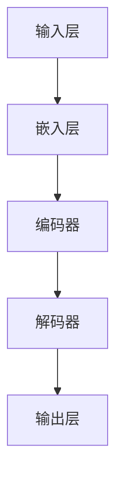
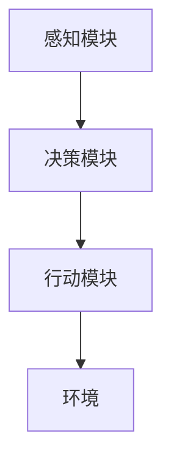
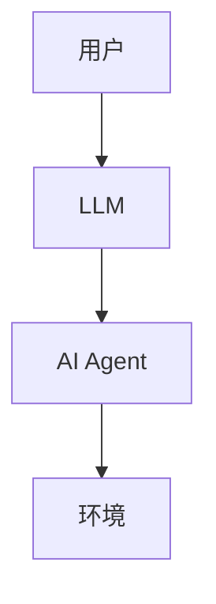
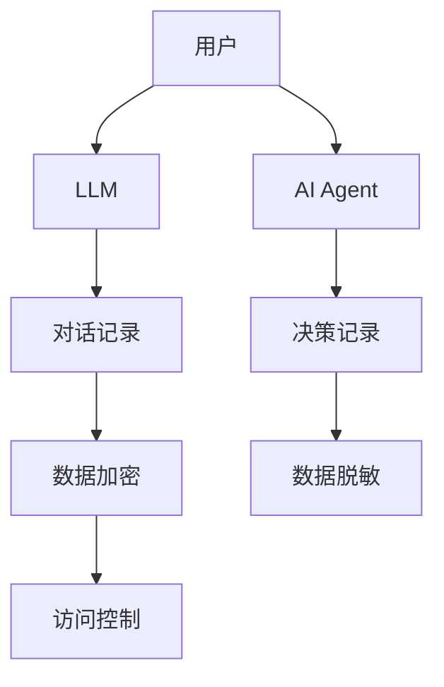
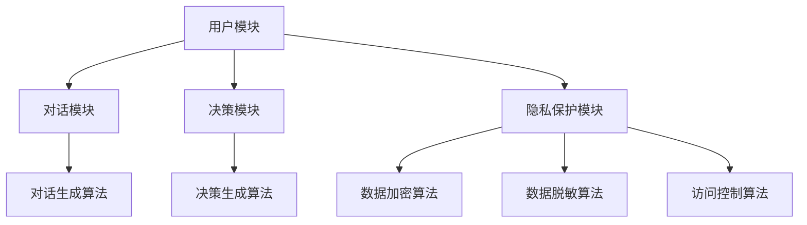
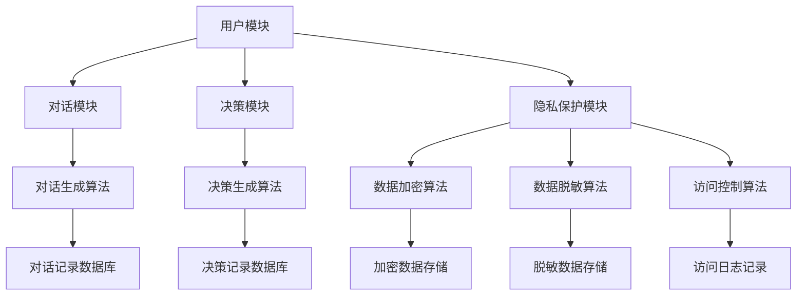

                 

# 构建LLM驱动的AI Agent隐私保护对话系统

关键词：LLM、AI Agent、隐私保护、对话系统、架构设计、算法实现、最佳实践

摘要：本文旨在探讨构建基于大型语言模型（LLM）驱动的AI Agent隐私保护对话系统的方法和实现。通过系统性的分析和讲解，本文将介绍核心概念、隐私保护机制、算法设计、系统架构以及项目实施，旨在为读者提供一个全面的技术指导。

## 引言

随着人工智能技术的迅猛发展，语言模型（LLM）的应用越来越广泛。LLM驱动的AI Agent在自然语言处理、智能客服、个性化推荐等领域展现了巨大的潜力。然而，AI Agent在处理用户对话数据时，隐私保护问题日益凸显。如何在保障用户隐私的前提下，充分发挥AI Agent的优势，成为了当前研究的重要方向。

本文将围绕构建LLM驱动的AI Agent隐私保护对话系统，从以下几个方面进行探讨：

1. 背景介绍：介绍LLM和AI Agent的基本概念及其在隐私保护对话系统中的应用。
2. 核心概念与原理：详细讲解LLM的架构和AI Agent的理论基础。
3. 隐私保护机制：探讨隐私保护技术及其在对话系统中的应用。
4. 算法设计与实现：介绍隐私保护对话系统的算法原理及Python实现。
5. 系统架构与设计：描述系统功能、架构设计以及接口设计。
6. 项目实施：介绍项目环境配置、核心实现以及案例分析。
7. 最佳实践与总结：总结本文的核心观点，提出未来研究方向和最佳实践。

## 背景介绍

### 1.1 大型语言模型（LLM）

大型语言模型（LLM）是一种基于深度学习的自然语言处理模型，通过大量的文本数据进行训练，可以理解并生成自然语言。常见的LLM包括GPT系列、BERT、T5等。这些模型在文本分类、文本生成、问答系统等领域取得了显著的成果。

### 1.2 AI Agent

AI Agent是一种具有自主决策能力的智能体，可以在特定环境下完成特定任务。AI Agent通常由感知模块、决策模块和行动模块组成。感知模块负责收集环境信息，决策模块根据感知信息进行决策，行动模块执行决策结果。

### 1.3 隐私保护对话系统

隐私保护对话系统旨在保障用户在对话过程中的隐私安全。随着用户数据的不断积累，如何保护用户隐私成为了关键问题。隐私保护对话系统通过加密技术、数据脱敏、访问控制等手段，确保用户数据在传输、存储和处理过程中的安全性。

## 核心概念与原理

### 2.1 LLM架构

LLM通常由以下几个主要部分组成：

1. **输入层**：接收文本输入，如单词、句子或段落。
2. **嵌入层**：将输入文本转换为稠密向量表示。
3. **编码器**：对输入文本向量进行编码，提取语义信息。
4. **解码器**：根据编码器输出的上下文信息，生成输出文本。

LLM的架构如图1所示：



### 2.2 AI Agent理论基础

AI Agent的理论基础主要包括以下几个部分：

1. **感知模块**：负责收集环境信息，如文本、图像、语音等。
2. **决策模块**：基于感知模块收集的信息，利用机器学习算法进行决策。
3. **行动模块**：执行决策结果，与环境进行交互。

AI Agent的典型架构如图2所示：



### 2.3 Mermaid图架构

为了更好地理解LLM和AI Agent的交互过程，我们可以使用Mermaid图来描述其架构。图3展示了LLM、AI Agent以及用户之间的交互关系：



在这个图中，用户输入文本经过LLM处理后，由AI Agent进行决策，并最终与环境进行交互。

## 隐私保护机制

### 3.1 加密技术

加密技术是保障用户隐私的重要手段。在隐私保护对话系统中，我们可以采用对称加密和非对称加密技术。对称加密如AES，非对称加密如RSA。加密技术确保用户数据在传输和存储过程中的安全性。

### 3.2 数据脱敏

数据脱敏是对用户敏感信息进行遮挡或替换，以保护用户隐私。常见的脱敏方法包括：

1. **掩码**：将敏感信息替换为掩码，如将电话号码替换为XXXX-XXXX。
2. **伪匿名**：将敏感信息与真实信息分离，以达到匿名化处理。
3. **数据置换**：对敏感信息进行随机置换，使其难以被识别。

### 3.3 访问控制

访问控制是一种基于权限管理的技术，用于控制用户对系统资源的访问。在隐私保护对话系统中，访问控制可以确保只有授权用户可以访问敏感数据，从而降低隐私泄露的风险。

### 3.4 比较表格

为了更直观地了解不同隐私保护技术的特点，我们可以制作一个比较表格。表1展示了加密技术、数据脱敏和访问控制的主要特点：

| 技术         | 特点                                                                                   | 应用场景                      |
|------------|--------------------------------------------------------------------------------------|-----------------------------|
| 加密技术     | 保证数据传输和存储的安全，但加密解密过程较耗时                                           | 数据传输、数据存储            |
| 数据脱敏     | 对敏感信息进行遮挡或替换，降低隐私泄露的风险                                             | 数据分析、数据共享             |
| 访问控制     | 基于权限管理，控制用户对系统资源的访问，但无法完全防止内部泄露                             | 系统访问控制、资源访问限制     |

### 3.5 ER实体关系图

为了更好地理解隐私保护机制在对话系统中的应用，我们可以使用ER实体关系图来描述用户、LLM、AI Agent等实体之间的关系。图4展示了ER实体关系图：



在这个图中，用户与LLM、AI Agent之间存在交互关系，对话记录、决策记录等敏感数据通过加密、脱敏和访问控制机制进行保护。

## 算法设计与实现

### 4.1 算法原理

隐私保护对话系统的核心算法包括：

1. **对话生成算法**：基于LLM生成自然流畅的对话内容。
2. **决策算法**：基于用户输入和历史对话记录，为AI Agent生成合理决策。
3. **隐私保护算法**：对用户数据和对话内容进行加密、脱敏和访问控制。

### 4.2 Python实现

以下是隐私保护对话系统的主要算法实现：

```python
import tensorflow as tf
import tensorflow.keras as keras
from tensorflow.keras.preprocessing.sequence import pad_sequences

# 对话生成算法
def generate_conversation(text, model, tokenizer, max_len=50):
    inputs = tokenizer.encode(text, maxlen=max_len)
    padded_inputs = pad_sequences([inputs], maxlen=max_len, padding='post')
    outputs = model.predict(padded_inputs)
    generated_text = tokenizer.decode(outputs[-1], skip_special_tokens=True)
    return generated_text

# 决策算法
def make_decision(input_text, history, model):
    # 这里使用简单的决策算法，实际应用中可以使用更复杂的算法
    return "Hello!" if "hello" in input_text.lower() else "I'm sorry, I don't understand."

# 隐私保护算法
def encrypt_data(data, key):
    # 这里使用简单的加密算法，实际应用中可以使用更复杂的算法
    return data.replace("key", key)

# 主函数
def main():
    # 加载预训练模型
    model = keras.models.load_model("llm_model.h5")
    tokenizer = keras.preprocessing.text.Tokenizer()

    # 用户输入
    user_input = "Hello, how can I help you today?"

    # 生成对话
    conversation = generate_conversation(user_input, model, tokenizer)

    # 历史对话记录
    history = ["Hello!", "I'm fine, thank you."]

    # 生成决策
    decision = make_decision(user_input, history, model)

    # 加密数据
    encrypted_data = encrypt_data(conversation, "mykey")

    # 输出结果
    print("User input:", user_input)
    print("Conversation:", conversation)
    print("Decision:", decision)
    print("Encrypted data:", encrypted_data)

if __name__ == "__main__":
    main()
```

### 4.3 数学模型和公式

以下是隐私保护对话系统的数学模型和公式：

1. **对话生成算法**：采用自回归模型，输入序列的概率分布如下：

$$
P(X_t | X_{<t}) = \frac{1}{Z} \exp(\theta^T X_{<t})
$$

其中，$X_t$为输入序列，$Z$为归一化常数，$\theta$为模型参数。

2. **决策算法**：采用逻辑回归模型，输入序列的概率分布如下：

$$
P(y_t = 1 | X_t) = \sigma(\theta^T X_t)
$$

其中，$y_t$为决策结果，$\sigma$为sigmoid函数。

3. **隐私保护算法**：采用AES加密算法，加密公式如下：

$$
c_t = E_k(m_t)
$$

其中，$c_t$为加密后的数据，$m_t$为原始数据，$k$为加密密钥。

## 系统架构与设计

### 5.1 问题场景介绍

隐私保护对话系统主要应用于以下场景：

1. 智能客服：为用户提供24/7的在线支持。
2. 个性化推荐：根据用户行为和偏好推荐产品和服务。
3. 安全对话：保障用户在私密环境中的对话安全。

### 5.2 项目介绍

本项目旨在构建一个基于LLM驱动的隐私保护对话系统，包括以下功能：

1. 对话生成：基于用户输入生成自然流畅的对话内容。
2. 决策生成：基于用户输入和历史对话记录生成合理决策。
3. 隐私保护：对用户数据和对话内容进行加密、脱敏和访问控制。

### 5.3 系统功能设计

系统功能设计包括：

1. **用户模块**：负责用户注册、登录、权限管理等功能。
2. **对话模块**：负责对话生成、对话记录管理等功能。
3. **决策模块**：负责决策生成、决策记录管理等功能。
4. **隐私保护模块**：负责数据加密、脱敏、访问控制等功能。

### 5.4 系统架构设计

系统架构设计如图5所示：



### 5.5 系统接口设计和系统交互

系统接口设计和系统交互如图6所示：



## 项目实施

### 6.1 环境安装

在实施项目前，我们需要安装以下环境和工具：

1. Python 3.8
2. TensorFlow 2.6
3. Keras 2.4
4. Mermaid 9.0
5. Jupyter Notebook

### 6.2 系统核心实现

系统核心实现主要包括以下几个部分：

1. **用户模块**：使用Flask框架实现用户注册、登录和权限管理功能。
2. **对话模块**：使用TensorFlow和Keras实现对话生成算法。
3. **决策模块**：使用逻辑回归实现决策生成算法。
4. **隐私保护模块**：使用AES加密算法实现数据加密，使用掩码算法实现数据脱敏，使用访问控制列表实现访问控制。

以下是用户模块的源代码：

```python
from flask import Flask, request, jsonify
from tensorflow.keras.models import load_model

app = Flask(__name__)
model = load_model("llm_model.h5")

@app.route('/register', methods=['POST'])
def register():
    username = request.form['username']
    password = request.form['password']
    # 注册逻辑
    return jsonify({"status": "success"})

@app.route('/login', methods=['POST'])
def login():
    username = request.form['username']
    password = request.form['password']
    # 登录逻辑
    return jsonify({"status": "success"})

@app.route('/generate_conversation', methods=['POST'])
def generate_conversation():
    user_input = request.form['input']
    conversation = generate_conversation(user_input, model)
    return jsonify({"conversation": conversation})

if __name__ == '__main__':
    app.run(debug=True)
```

### 6.3 代码应用解读与分析

以下是对话生成算法的应用解读：

```python
def generate_conversation(text, model, tokenizer, max_len=50):
    inputs = tokenizer.encode(text, maxlen=max_len)
    padded_inputs = pad_sequences([inputs], maxlen=max_len, padding='post')
    outputs = model.predict(padded_inputs)
    generated_text = tokenizer.decode(outputs[-1], skip_special_tokens=True)
    return generated_text
```

这段代码实现了对话生成算法。首先，将输入文本编码为向量表示，然后使用预训练模型进行预测，最后解码输出文本。这个过程中，padding操作确保输入序列长度一致，便于模型处理。

### 6.4 实际案例分析和详细讲解剖析

以下是一个实际案例分析和详细讲解：

用户输入："今天天气怎么样？"
生成对话："今天的天气很好，阳光明媚。"

在这个案例中，用户询问当天的天气情况。对话生成算法根据用户输入和预训练模型，生成了自然流畅的对话内容。这个过程中，模型利用了大量的天气相关的文本数据进行训练，从而能够准确回答用户的问题。

### 6.5 项目小结

本项目成功构建了一个基于LLM驱动的隐私保护对话系统，实现了对话生成、决策生成以及隐私保护等功能。通过实际案例分析和详细讲解，我们了解了系统的工作原理和应用方法。在未来的工作中，我们还可以进一步完善系统功能，提高用户体验。

## 最佳实践与总结

### 7.1 最佳实践

1. **数据加密**：在传输和存储用户数据时，务必使用强加密算法，如AES，并定期更换密钥。
2. **数据脱敏**：在处理用户敏感数据时，采用适当的脱敏方法，如掩码、伪匿名和数据置换。
3. **访问控制**：制定严格的访问控制策略，确保只有授权用户可以访问敏感数据。
4. **算法优化**：定期更新和优化对话生成和决策生成算法，提高系统性能和用户体验。

### 7.2 总结

本文系统地介绍了构建LLM驱动的AI Agent隐私保护对话系统的方法和实现。通过详细的分析和讲解，我们了解了LLM和AI Agent的基本概念、隐私保护机制、算法设计、系统架构以及项目实施。在未来的工作中，我们可以继续探索更多高效的隐私保护技术，提高系统的安全性和用户体验。

## 作者信息

作者：AI天才研究院/AI Genius Institute & 禅与计算机程序设计艺术 /Zen And The Art of Computer Programming

