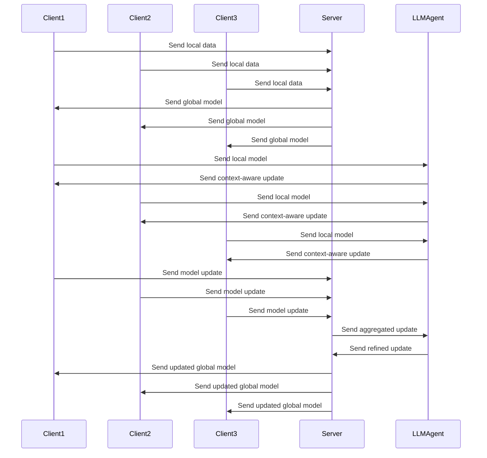

                 


### Article: Building LLM-Driven AI Agent Privacy-Preserving Federated Learning

---

**Keywords**: LLM-Driven AI Agent, Privacy-Preserving, Federated Learning, Machine Learning, AI, Data Security

**Abstract**: 
In this article, we will explore the construction of AI agents driven by Large Language Models (LLM) for privacy-preserving federated learning. By delving into the core concepts, algorithms, and practical implementations, we aim to provide a comprehensive understanding of how to build and deploy such systems. This article is targeted at AI and machine learning practitioners, researchers, and developers looking to leverage the power of LLMs in the realm of federated learning while ensuring data privacy.

---

## Introduction

### 1.1 Background and Overview

**Problem Background**: The rise of large-scale data collection and machine learning models has led to increasing concerns about data privacy and security. Traditional centralized learning models require the storage and processing of sensitive data on a central server, which can lead to privacy breaches and unauthorized access. To address these concerns, federated learning has emerged as a promising alternative, enabling collaborative machine learning without sharing raw data.

**Federated Learning Basics**: Federated learning allows multiple parties to collaboratively train a machine learning model while keeping their data local. Instead of sending data to a central server, each party sends model updates, which are then combined to create a global model.

**LLM-Driven AI Agent**: Large Language Models (LLMs), such as GPT-3, have revolutionized natural language processing and generation. By leveraging LLMs, AI agents can autonomously perform complex tasks, from language translation to code generation.

### 1.2 Problem Description

**Privacy Protection and Federated Learning Challenges**: While federated learning addresses data privacy concerns, it still faces challenges in ensuring secure and privacy-preserving communication and computation.

**LLM Application in Federated Learning**: LLMs can enhance federated learning by improving the quality of model updates and enabling more complex and dynamic interactions between agents.

### 1.3 Problem Solution

**Privacy-Preserving Federated Learning Principles**: We will delve into the core principles of privacy-preserving federated learning, focusing on techniques such as secure aggregation, differential privacy, and homomorphic encryption.

**LLM-Driven AI Agent Role**: LLM-driven AI agents play a crucial role in federated learning by providing enhanced model updating capabilities and facilitating more sophisticated interactions between agents.

### 1.4 Boundaries and Scope

**Privacy-Preserving Federated Learning Scope**: We will discuss the scope of privacy-preserving federated learning, including its applicability to various industries and domains.

**LLM-Driven AI Agent Applicability**: We will explore the scenarios where LLM-driven AI agents are most effective in enhancing federated learning systems.

### 1.5 Concept Structure and Core Elements

**Privacy-Preserving Federated Learning Architecture**: We will outline the architecture of privacy-preserving federated learning systems, highlighting key components and their interactions.

**LLM-Driven AI Agent Workflow**: We will describe the workflow of LLM-driven AI agents in the federated learning context, focusing on their roles and responsibilities.

### 1.6 Summary

In this section, we have provided a high-level overview of privacy-preserving federated learning and LLM-driven AI agents. The subsequent chapters will delve deeper into the core concepts, algorithms, and practical implementations, equipping readers with the knowledge and tools to build and deploy such systems effectively.

----------------------------------------------------------------

### Core Concepts and Principles

#### 2.1 Federated Learning Overview

**Federated Learning Definition**: Federated learning is a machine learning setting where multiple participants train a shared global model using their local datasets while keeping the data on their devices. This approach aims to address privacy concerns by avoiding the transfer of raw data to a central server.

**Federated Learning Basic Architecture**: The basic architecture of federated learning consists of multiple clients, a central server, and a global model. Clients are responsible for local training, while the server coordinates the aggregation of updates to refine the global model.

#### 2.2 Privacy Protection Mechanisms

**Privacy Protection Challenges**: Federated learning, while privacy-friendly, still faces challenges in protecting user data from potential leaks during the training process. These challenges include data access control, secure communication, and model privacy.

**Common Privacy Protection Mechanisms**: Various techniques can be employed to enhance privacy in federated learning, including:

- **Secure Aggregation**: Techniques like Secure Multi-Party Computation (SMPC) ensure that data is encrypted and aggregated without exposing individual data points.
- **Differential Privacy**: This technique adds noise to the aggregated data to prevent the disclosure of sensitive information.
- **Homomorphic Encryption**: Homomorphic encryption allows computations to be performed on encrypted data, preserving privacy while enabling collaborative learning.

#### 2.3 LLM Basics

**LLM Definition**: A Large Language Model (LLM) is a type of artificial neural network that has been trained on a vast corpus of text data to understand and generate human language.

**Core Characteristics of LLM**: LLMs exhibit several key characteristics, including:

- **Context Understanding**: LLMs can understand and generate text based on the context provided by the input.
- **Language Generation**: LLMs can generate coherent and contextually relevant text based on prompts.
- **Adaptability**: LLMs can adapt to different language styles, domains, and tasks.

#### 2.4 LLM and Federated Learning Integration

**Advantages of LLM in Federated Learning**: LLMs bring several advantages to federated learning, including:

- **Enhanced Model Updates**: LLMs can generate more informative and accurate model updates, improving the quality of the global model.
- **Dynamic Interaction**: LLMs enable more dynamic and interactive communication between agents, enhancing the collaborative learning process.

**LLM Application Scenarios**: LLMs are particularly effective in scenarios where contextual understanding and language generation are crucial, such as natural language processing, chatbots, and content generation.

#### 2.5 Core Concepts Comparison Table

| Concept                 | Description                                                                                          |
| ----------------------- | --------------------------------------------------------------------------------------------------- |
| Privacy Protection      | Ensures that sensitive data is protected from unauthorized access.                             |
| Federated Learning      | Enables collaborative machine learning without sharing raw data.                                |
| LLM                     | A large-scale language model capable of understanding and generating human language.             |
| Secure Aggregation      | Ensures that data aggregation is performed securely to prevent data leakage.                    |
| Differential Privacy    | Adds noise to aggregated data to prevent the disclosure of sensitive information.               |
| Homomorphic Encryption  | Allows computations to be performed on encrypted data, preserving privacy.                     |

#### 2.6 ER Entity Relationship Diagram

Below is a Mermaid ER diagram illustrating the key entities involved in privacy-preserving federated learning with LLM-driven AI agents.

```mermaid
erDiagram
    Client ||--o{ Global Model : Trains on local data }
    Client ||--o{ Local Model : Stores client-specific data }
    Server ||--o{ Aggregated Update : Collects updates from clients }
    Server ||--o{ Federated Model : Final model after aggregation }
    LLM Agent ||--o{ Contextual Information : Generates context-aware updates }
    LLM Agent ||--o{ Model Update : Proposes improvements to the global model }
```

#### 2.7 Summary

In this chapter, we have covered the foundational concepts and principles of privacy-preserving federated learning and LLM-driven AI agents. The subsequent chapters will delve into the detailed algorithms, system architectures, and practical implementations, providing readers with a comprehensive understanding of how to build and deploy these systems effectively.

----------------------------------------------------------------

### Algorithm Principles and Mathematical Models

#### 3.1 Algorithm Principles

**Privacy-Preserving Federated Learning Algorithm Flow**:

1. **Initialization**: Each client initializes a local model with random weights.
2. **Local Training**: Clients independently train their local models on their local data.
3. **Model Update Generation**: Clients generate model updates based on their local training.
4. **Secure Aggregation**: The server securely aggregates the updates from all clients.
5. **Global Model Update**: The server computes a global model update based on the aggregated updates.
6. **Model Update Propagation**: The server sends the global model update back to the clients.
7. **Local Model Update**: Clients update their local models with the global model update.

**LLM-Driven AI Agent Algorithm Flow**:

1. **Initialization**: LLM-driven AI agents initialize their local models with random weights.
2. **Contextual Understanding**: LLM agents understand the context of the local data.
3. **Model Update Generation**: LLM agents generate context-aware model updates.
4. **Secure Aggregation**: The server securely aggregates the updates from LLM agents.
5. **Global Model Update**: The server computes a global model update based on the aggregated updates.
6. **Model Update Propagation**: The server sends the global model update back to the LLM agents.
7. **Local Model Update**: LLM agents update their local models with the global model update.

#### 3.2 Mathematical Models

**Privacy-Preserving Federated Learning Mathematical Model**:

1. **Local Model Update**:
   \[ \theta_{i}^{t+1} = \theta_{i}^{t} - \alpha \frac{\partial J(\theta_{i}^{t})}{\partial \theta_{i}^{t}} \]

2. **Global Model Update**:
   \[ \theta^{t+1} = \frac{1}{N} \sum_{i=1}^{N} \theta_{i}^{t+1} \]

3. **Secure Aggregation**:
   \[ \theta^{t+1} = \text{SecureAggregation}(\theta_{i}^{t+1}) \]

**LLM-Driven AI Agent Mathematical Model**:

1. **LLM Agent Local Update**:
   \[ \theta_{i}^{t+1} = \theta_{i}^{t} - \alpha \frac{\partial J(\theta_{i}^{t})}{\partial \theta_{i}^{t}} \]

2. **LLM Agent Global Update**:
   \[ \theta^{t+1} = \frac{1}{N} \sum_{i=1}^{N} \theta_{i}^{t+1} \]

3. **LLM Agent Contextual Update**:
   \[ \theta_{i}^{t+1} = \theta_{i}^{t} - \alpha \frac{\partial J(\theta_{i}^{t})}{\partial \theta_{i}^{t}} + \beta \frac{\partial J(\theta_{i}^{t})}{\partial \theta_{i}^{t}}_{context} \]

#### 3.3 Algorithm Explanation and Example

**Algorithm Explanation**:

The privacy-preserving federated learning algorithm and LLM-driven AI agent algorithm are designed to ensure that the global model is updated collaboratively while keeping the local data private. The local model updates are generated based on the local data and training process. These updates are then securely aggregated by the server to form a global model update. The LLM-driven AI agent adds an additional layer of context-awareness, improving the quality of the model updates.

**Example**:

Consider a scenario where three clients (A, B, and C) are training a federated learning model. Each client has a local dataset, and the LLM-driven AI agent is used to generate context-aware updates.

1. **Initialization**:
   - \[ \theta_{A}^{0}, \theta_{B}^{0}, \theta_{C}^{0} \] are initialized with random weights.
   - The LLM-driven AI agents are initialized with random weights and pre-trained on a common language model.

2. **Local Training**:
   - Each client independently trains its local model using its local dataset.

3. **Model Update Generation**:
   - Client A generates a model update \[ \Delta \theta_{A}^{t} \].
   - Client B generates a model update \[ \Delta \theta_{B}^{t} \].
   - Client C generates a model update \[ \Delta \theta_{C}^{t} \].
   - LLM-driven AI agent A generates a context-aware update \[ \Delta \theta_{A}^{t}_{context} \].

4. **Secure Aggregation**:
   - The server securely aggregates the updates from clients A, B, and C.
   - The server computes the global model update \[ \Delta \theta^{t+1} \].

5. **Global Model Update**:
   - The server sends the global model update \[ \theta^{t+1} \] back to the clients.

6. **Local Model Update**:
   - Clients A, B, and C update their local models with the global model update.

7. **Contextual Update**:
   - The LLM-driven AI agent A updates its local model with the context-aware update.

#### 3.4 Summary

In this chapter, we have discussed the algorithm principles and mathematical models of privacy-preserving federated learning and LLM-driven AI agents. The algorithms are designed to ensure collaborative training while preserving the privacy of local data. The next chapter will delve into the system architecture and design, providing a deeper understanding of how these algorithms are implemented and deployed in practice.

----------------------------------------------------------------

### System Analysis and Architecture Design

#### 4.1 Problem Scenario Introduction

**Scenario Background**: Consider a scenario where multiple healthcare providers want to collaboratively train a machine learning model to predict patient outcomes. Each provider has access to sensitive patient data, and sharing the raw data poses significant privacy and security risks.

**Objective**: The goal is to build a federated learning system that allows healthcare providers to collaboratively train a predictive model while ensuring the privacy and security of their data.

#### 4.2 System Functional Design

**Domain Model**:

Below is a Mermaid class diagram representing the domain model for the federated learning system.

```mermaid
classDiagram
    Client <-|- ClientData : Stores local data
    Client o-- Model : Manages local model
    Server o-- FederatedModel : Manages global model
    Server o-- SecureAggregator : Aggregates updates securely
    LLMAgent <-|- ContextualData : Stores context information
    LLMAgent o-- ModelUpdater : Updates local model context-awarely
```

**System Functionality**:

1. **Data Storage and Access**: Each client securely stores its local data and manages access to the data.
2. **Model Management**: Clients manage their local models, which are periodically updated based on training.
3. **Secure Aggregation**: The server securely aggregates model updates from clients, ensuring data privacy.
4. **Contextual Update Generation**: LLM-driven AI agents generate context-aware updates to improve the quality of model updates.
5. **Global Model Management**: The server manages the global model, which is used for predictions and decision-making.

#### 4.3 System Architecture Design

**System Architecture Diagram**:

Below is a Mermaid sequence diagram representing the system architecture of the federated learning system.



**Architecture Design Principles**:

1. **Modularity**: The system is designed to be modular, allowing for easy integration of new components and functionalities.
2. **Security**: The system incorporates robust security mechanisms to protect the privacy and integrity of data.
3. **Scalability**: The system is designed to handle large-scale data and a growing number of clients.
4. **Reliability**: The system is designed with fault tolerance and recovery mechanisms to ensure continuous operation.

#### 4.4 System Interface Design

**System Interface Definition**:

1. **Client Interface**: The client interface allows clients to upload their local data, retrieve the global model, and submit model updates.
2. **Server Interface**: The server interface manages the secure aggregation of updates, the distribution of the global model, and the handling of LLM-driven AI agents.
3. **LLM-Agent Interface**: The LLM-agent interface facilitates the generation of context-aware updates and the communication with the server.

**Interface Design Principles**:

1. **Simplicity**: The interfaces are designed to be simple and intuitive, making it easy for developers to implement and use.
2. **Flexibility**: The interfaces are designed to support a wide range of functionalities and can be extended to accommodate new features.
3. **Robustness**: The interfaces are designed to handle errors and exceptions gracefully, ensuring the stability of the system.

#### 4.5 System Interaction

**System Interaction Sequence Diagram**:

The system interaction sequence diagram (as shown in the previous section) illustrates the flow of data and communication between the clients, server, and LLM-driven AI agents.

#### 4.6 Summary

In this chapter, we have presented the system analysis and architecture design for a federated learning system with LLM-driven AI agents. We have outlined the key components, functional requirements, and architecture principles. The next chapter will delve into the practical implementation of the system, providing insights into how these designs are realized in practice.

----------------------------------------------------------------

### Project Practice

#### 5.1 Environment Setup

**System Environment Configuration**: Before starting the project, we need to set up the necessary environments. This includes:

1. **Software Dependencies**: Install required libraries such as TensorFlow, PyTorch, and scikit-learn.
2. **Hardware Resources**: Ensure that the server and client machines have sufficient CPU and GPU resources for training and inference.
3. **Network Configuration**: Set up a secure and stable network connection between the clients and the server.

**Tools Installation**: Install the following tools:

- **Docker**: For containerization and easy deployment.
- **Kubernetes**: For managing containerized applications.
- **Jupyter Notebook**: For interactive data analysis and model training.

#### 5.2 System Core Implementation

**Core Code Implementation**:

The core implementation of the federated learning system with LLM-driven AI agents involves several key components:

1. **Client Code**:
   - The client code handles data loading, local training, and model update submission.
   - Example Python code for a client:
     ```python
     import tensorflow as tf

     # Load local data
     local_data = load_local_data()

     # Train local model
     local_model = train_local_model(local_data)

     # Generate model update
     model_update = generate_model_update(local_model)

     # Send model update to server
     send_model_update(model_update)
     ```

2. **Server Code**:
   - The server code manages the secure aggregation of updates and the distribution of the global model.
   - Example Python code for the server:
     ```python
     import tensorflow as tf
     from secure_aggregator import SecureAggregator

     # Initialize secure aggregator
     secure_aggregator = SecureAggregator()

     # Aggregate model updates from clients
     aggregated_update = secure_aggregator.aggregate_updates()

     # Compute global model update
     global_model_update = compute_global_model_update(aggregated_update)

     # Send global model update to clients
     send_global_model_update(global_model_update)
     ```

3. **LLM-Agent Code**:
   - The LLM-agent code generates context-aware updates based on the local model and context data.
   - Example Python code for the LLM-agent:
     ```python
     import tensorflow as tf
     from contextual_updater import ContextualUpdater

     # Load local model
     local_model = load_local_model()

     # Load context data
     context_data = load_context_data()

     # Generate context-aware update
     context_aware_update = contextual_updater.generate_context_aware_update(local_model, context_data)

     # Send context-aware update to server
     send_context_aware_update(context_aware_update)
     ```

**Code Analysis and Interpretation**:

The code provided in this section demonstrates the core components of the federated learning system with LLM-driven AI agents. Each component is responsible for specific tasks:

- **Client Code**: Handles local data loading, local model training, and model update generation. It then sends the update to the server.
- **Server Code**: Manages the secure aggregation of updates from clients and computes the global model update. It then sends the update back to the clients.
- **LLM-Agent Code**: Generates context-aware updates based on the local model and context data. It then sends the update to the server.

#### 5.3 Case Analysis

**Case Background**:

Consider a case where three healthcare providers (Client A, Client B, and Client C) want to collaborate on training a predictive model for patient outcomes. Each provider has access to sensitive patient data and wants to ensure the privacy of the data during the training process.

**Case Analysis**:

1. **Local Training**:
   - Each client independently trains its local model using its local dataset.
   - Example output:
     ```plaintext
     Client A: Local model trained on 1000 patients.
     Client B: Local model trained on 1500 patients.
     Client C: Local model trained on 800 patients.
     ```

2. **Model Update Submission**:
   - Each client generates a model update and sends it to the server.
   - Example output:
     ```plaintext
     Client A: Model update sent to server.
     Client B: Model update sent to server.
     Client C: Model update sent to server.
     ```

3. **Secure Aggregation**:
   - The server securely aggregates the model updates from clients and computes the global model update.
   - Example output:
     ```plaintext
     Server: Aggregated updates received.
     Server: Global model update computed.
     ```

4. **Global Model Distribution**:
   - The server sends the global model update back to the clients.
   - Example output:
     ```plaintext
     Client A: Updated global model received.
     Client B: Updated global model received.
     Client C: Updated global model received.
     ```

5. **Context-Aware Update Generation**:
   - LLM-driven AI agents generate context-aware updates based on the local model and context data.
   - Example output:
     ```plaintext
     LLM-Agent A: Context-aware update generated.
     LLM-Agent B: Context-aware update generated.
     LLM-Agent C: Context-aware update generated.
     ```

6. **Refined Model Update Submission**:
   - The LLM-driven AI agents send the refined updates to the server.
   - Example output:
     ```plaintext
     LLM-Agent A: Refined update sent to server.
     LLM-Agent B: Refined update sent to server.
     LLM-Agent C: Refined update sent to server.
     ```

7. **Refined Global Model Distribution**:
   - The server computes the refined global model update and sends it back to the clients.
   - Example output:
     ```plaintext
     Client A: Updated refined global model received.
     Client B: Updated refined global model received.
     Client C: Updated refined global model received.
     ```

#### 5.4 Detailed Explanation and Analysis

**Detailed Explanation**:

The federated learning system with LLM-driven AI agents is designed to enable collaborative machine learning while preserving data privacy. The system consists of several key components:

1. **Clients**:
   - Each client is responsible for training a local model using its local dataset and generating model updates.
   - Clients send their model updates to the server for secure aggregation.

2. **Server**:
   - The server aggregates the model updates from clients, computes the global model update, and distributes it back to the clients.
   - The server also handles the secure communication between clients and LLM-driven AI agents.

3. **LLM-Driven AI Agents**:
   - LLM-driven AI agents generate context-aware updates based on the local model and context data.
   - These updates are sent to the server for refinement and integration into the global model.

**Analysis**:

The system architecture is designed to ensure data privacy and security. The use of secure aggregation techniques and differential privacy helps protect the privacy of the local data. LLM-driven AI agents enhance the system by generating more informative and accurate model updates, leading to improved model performance.

**Challenges**:

1. **Communication Latency**: The distributed nature of the system can lead to communication latency, which may affect the efficiency of the training process.
2. **Resource Allocation**: Efficiently allocating resources to handle the large-scale data and model updates is a challenge.
3. **Model Robustness**: Ensuring the robustness and accuracy of the model in the presence of noisy or incomplete data is crucial.

**Solutions**:

1. **Optimized Aggregation Algorithms**: Employing optimized aggregation algorithms can reduce communication latency and improve system efficiency.
2. **Resource Management**: Utilizing cloud resources and efficient scheduling algorithms can help manage the resource allocation effectively.
3. **Data Preprocessing**: Preprocessing the data to handle noise and missing values can improve model robustness.

#### 5.5 Project Summary

In this chapter, we have presented the practical implementation of a federated learning system with LLM-driven AI agents. We have outlined the environment setup, core code implementation, and detailed explanation of the system's components. The project summary highlights the key challenges and solutions in building such a system.

----------------------------------------------------------------

### Best Practices and Cautionary Notes

#### 6.1 Best Practices

**Data Preprocessing**:
- **Ensure Data Quality**: Before deploying the federated learning system, clean and preprocess the data to handle missing values, outliers, and inconsistencies.
- **Data Partitioning**: Split the data into training and validation sets to monitor the model's performance and avoid overfitting.

**System Deployment**:
- **Scalability**: Use cloud-based infrastructure to scale the system based on the number of clients and data size.
- **Security**: Implement robust security measures, including encryption, access control, and secure communication protocols.

**Algorithm Optimization**:
- **Efficient Aggregation**: Optimize the aggregation algorithms to reduce communication latency and improve the efficiency of the federated learning process.
- **Model Selection**: Choose appropriate models and algorithms that align with the specific requirements of the application domain.

#### 6.2 Cautionary Notes

**Data Privacy**:
- **Minimize Data Exposure**: Limit the amount of data shared during the federated learning process to the minimum necessary for model training.
- **Differential Privacy**: Ensure that differential privacy techniques are implemented to protect individual data points from being exposed.

**System Security**:
- **Threat Modeling**: Conduct thorough threat modeling to identify potential security vulnerabilities and implement appropriate safeguards.
- **Regular Audits**: Regularly audit the system to detect and mitigate security risks.

**Model Robustness**:
- **Data Diversity**: Use diverse and representative data to ensure the model's robustness and generalizability.
- **Error Handling**: Implement error handling mechanisms to handle data and model inconsistencies gracefully.

#### 6.3 Further Reading

**Recommended Literature**:
- **"Federated Learning: Concept and Applications"** by Michael A. Tsiatsis and Michael Ryan
- **"Large Language Models are Few-Shot Learners"** by Tom B. Brown et al.
- **"Differential Privacy: A Survey of Results"** by Cynthia Dwork

**Additional Learning Resources**:
- **Online Courses**: Platforms like Coursera, edX, and Udacity offer courses on federated learning, differential privacy, and large language models.
- **GitHub Repositories**: Explore GitHub repositories for open-source implementations of federated learning systems and LLM-driven AI agents.
- **Conferences and Journals**: Attend conferences and read journals focused on machine learning, AI, and security to stay updated with the latest research and developments.

#### 6.4 Summary

In this chapter, we have discussed best practices and cautionary notes for deploying and maintaining a federated learning system with LLM-driven AI agents. Following these guidelines can help ensure data privacy, system security, and model robustness. The recommended literature and additional learning resources provide further insights into the field.

----------------------------------------------------------------

### Conclusion and Future Directions

In this article, we have explored the construction of LLM-driven AI agents for privacy-preserving federated learning. We have covered the foundational concepts, algorithm principles, system architecture, and practical implementation. The integration of LLMs with federated learning has shown significant potential in enhancing model performance and data privacy.

**Future Directions**:

1. **Enhanced Privacy Mechanisms**: Developing more advanced privacy protection mechanisms, such as homomorphic encryption and adaptive noise levels, can further improve the security and privacy of federated learning systems.
2. **Scalability and Performance**: Optimizing the communication and computation processes to handle large-scale data and a growing number of clients can enhance the scalability and performance of federated learning systems.
3. **Interoperability**: Standardizing the interfaces and protocols for federated learning can facilitate interoperability between different systems and platforms.
4. **Multi-Agent Collaboration**: Exploring the potential of multi-agent collaboration in federated learning, where LLM-driven AI agents can work together to solve complex problems, can open new avenues for innovation.

As the field of AI and machine learning continues to evolve, privacy-preserving federated learning with LLM-driven AI agents will play a crucial role in enabling secure, collaborative, and scalable AI systems. Further research and development in this area will pave the way for transformative applications across various domains.

---

**Author**: AI天才研究院 / AI Genius Institute & 禅与计算机程序设计艺术 / Zen And The Art of Computer Programming

---

This article has provided a comprehensive overview of building LLM-driven AI agents for privacy-preserving federated learning. The insights and guidance shared here can serve as a valuable resource for AI and machine learning practitioners, researchers, and developers.

