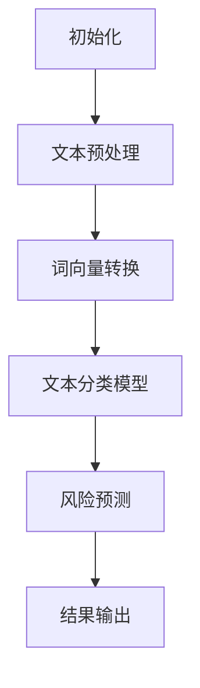
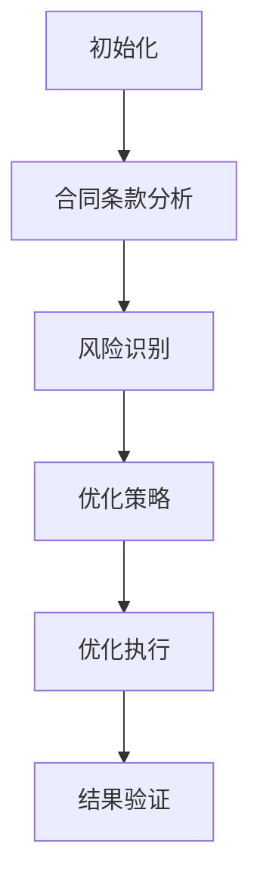
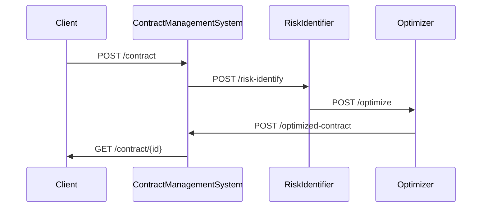
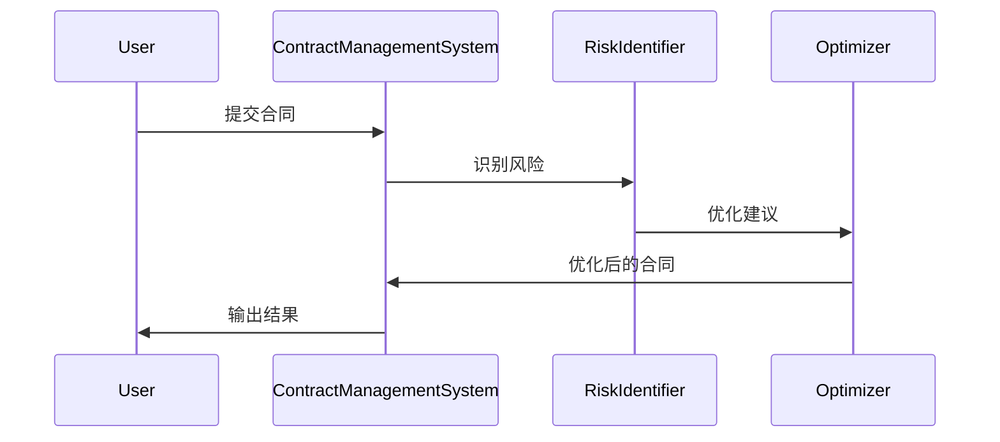

                 

### 构建企业级AI合同管理助手：风险识别与优化

> 关键词：企业级AI合同管理，风险识别，优化，算法原理，系统架构

> 摘要：本文将探讨如何构建一个企业级AI合同管理助手，重点分析其中的风险识别与优化机制。通过深入剖析核心概念、算法原理和系统架构，我们将展示如何利用AI技术提升合同管理的效率和准确性，降低企业运营中的法律风险。

### 第一部分：背景与概念介绍

#### 1.1 问题背景

在当今商业环境中，合同管理是企业运营的核心环节之一。然而，传统的合同管理方式往往存在效率低下、错误率高和风险控制不足等问题。随着数据量和复杂性的增加，人工处理合同变得愈加困难，这为AI合同管理助手的应用提供了契机。

#### 1.2 AI合同管理助手定义

AI合同管理助手是一种利用人工智能技术，自动处理合同生成、审核、风险识别和优化的工具。它可以通过自然语言处理（NLP）、机器学习（ML）和深度学习（DL）等技术，对合同内容进行深入分析，提供智能化的合同管理服务。

#### 1.3 AI合同管理助手的功能与重要性

AI合同管理助手的主要功能包括：

- **合同生成**：根据企业需求和模板，自动生成合同。
- **合同审核**：识别合同中的潜在风险和错误。
- **风险识别**：分析合同条款，预测潜在的违约风险。
- **优化建议**：提供合同条款优化建议，降低企业法律风险。

AI合同管理助手在提高合同管理效率、降低错误率和风险控制方面具有重要意义。

#### 1.4 风险识别的定义

风险识别是指通过系统化的方法，识别和分析合同中的潜在风险。这包括对合同条款的合法性、合规性、商业风险和法律风险进行评估。

#### 1.5 风险识别的重要性

有效的风险识别能够帮助企业：

- **降低法律风险**：识别合同中的潜在纠纷点，提前采取预防措施。
- **提高合同质量**：通过分析合同条款，优化合同结构，提高合同的法律效力。
- **节约成本**：减少合同审核的时间和人力成本。

#### 1.6 优化的目标与策略

优化的目标在于：

- **提高合同的可读性**：简化合同条款，使其更加易于理解和执行。
- **降低法律风险**：修改潜在纠纷的条款，确保合同的合法性。
- **提高合同效率**：自动化合同处理流程，减少不必要的环节。

优化的策略包括：

- **合同条款标准化**：制定统一的合同模板，减少合同条款的差异性。
- **人工智能辅助审核**：利用AI技术，提高合同审核的准确性和效率。
- **持续优化**：根据合同管理中的反馈，不断调整和改进合同管理策略。

### 1.7 边界与外延

- **边界**：本文主要探讨AI合同管理助手在企业级应用中的风险识别与优化机制，不涉及个人用户层面的合同管理。
- **外延**：本文的内容可以扩展到各类合同管理场景，包括采购合同、销售合同、租赁合同等。

### 第一部分：核心概念与联系

#### 2.1 AI合同管理助手：定义、功能

**定义**：

AI合同管理助手是一种利用人工智能技术，自动处理合同生成、审核、风险识别和优化的工具。

**功能**：

- **合同生成**：根据企业需求和模板，自动生成合同。
- **合同审核**：识别合同中的潜在风险和错误。
- **风险识别**：分析合同条款，预测潜在的违约风险。
- **优化建议**：提供合同条款优化建议，降低企业法律风险。

#### 2.2 风险识别：定义、方法

**定义**：

风险识别是指通过系统化的方法，识别和分析合同中的潜在风险。

**方法**：

- **文本分析**：使用自然语言处理技术，对合同条款进行语义分析。
- **模式识别**：利用机器学习算法，识别合同中的风险模式。
- **数据挖掘**：从历史合同数据中提取有价值的信息，用于风险识别。

#### 2.3 优化：目标、策略

**目标**：

- **提高合同的可读性**：简化合同条款，使其更加易于理解和执行。
- **降低法律风险**：修改潜在纠纷的条款，确保合同的合法性。
- **提高合同效率**：自动化合同处理流程，减少不必要的环节。

**策略**：

- **合同条款标准化**：制定统一的合同模板，减少合同条款的差异性。
- **人工智能辅助审核**：利用AI技术，提高合同审核的准确性和效率。
- **持续优化**：根据合同管理中的反馈，不断调整和改进合同管理策略。

### 第二部分：算法原理讲解

#### 3.1 风险识别算法原理

**算法流程图**：



**Python源代码实现**：

```python
# 导入必要的库
import nltk
from nltk.corpus import stopwords
from sklearn.feature_extraction.text import TfidfVectorizer
from sklearn.model_selection import train_test_split
from sklearn.ensemble import RandomForestClassifier

# 加载和处理数据
nltk.download('stopwords')
stop_words = set(stopwords.words('english'))

# 读取合同数据
contracts = load_contracts()

# 文本预处理
def preprocess_text(text):
    # 去除停用词
    tokens = nltk.word_tokenize(text)
    tokens = [token.lower() for token in tokens if token.lower() not in stop_words]
    return ' '.join(tokens)

preprocessed_contracts = [preprocess_text(contract) for contract in contracts]

# 词向量转换
vectorizer = TfidfVectorizer()
X = vectorizer.fit_transform(preprocessed_contracts)

# 分割数据集
X_train, X_test, y_train, y_test = train_test_split(X, labels, test_size=0.2, random_state=42)

# 训练分类模型
model = RandomForestClassifier(n_estimators=100)
model.fit(X_train, y_train)

# 风险预测
predictions = model.predict(X_test)

# 输出结果
print(predictions)
```

**数学模型与公式**：

风险识别的核心是分类问题，可以表示为：

$$
P(risk|contract) = \frac{P(contract|risk) \cdot P(risk)}{P(contract)}
$$

其中：

- \(P(risk|contract)\) 是合同包含风险的预测概率。
- \(P(contract|risk)\) 是给定风险发生的条件下，合同存在的条件概率。
- \(P(risk)\) 是风险发生的先验概率。
- \(P(contract)\) 是合同的先验概率。

**举例说明**：

假设我们有一个合同，其中包含如下条款：

```
Contract for the Supply of IT Equipment

The seller agrees to supply the following IT equipment to the buyer:

- 1000 laptops
- 500 desktop computers
- 200 printers

Delivery is scheduled for the end of this month.
```

我们可以使用上述算法来预测这个合同中是否存在风险。通过文本预处理、词向量转换和分类模型，我们可以得出合同中存在风险的概率。如果概率较高，我们可能需要对该合同进行进一步的审核和优化。

#### 3.2 优化算法原理

**算法流程图**：



**Python源代码实现**：

```python
# 导入必要的库
import nltk
from nltk.corpus import stopwords
from sklearn.feature_extraction.text import TfidfVectorizer
from sklearn.model_selection import train_test_split
from sklearn.ensemble import RandomForestClassifier

# 加载和处理数据
nltk.download('stopwords')
stop_words = set(stopwords.words('english'))

# 读取合同数据
contracts = load_contracts()

# 合同条款分析
def analyze_clauses(contract):
    # 去除停用词
    tokens = nltk.word_tokenize(contract)
    tokens = [token.lower() for token in tokens if token.lower() not in stop_words]
    return ' '.join(tokens)

preprocessed_contracts = [analyze_clauses(contract) for contract in contracts]

# 风险识别
# (同上文中风险识别算法的实现)

# 优化策略
def optimize_contract(contract):
    # 根据风险识别结果，优化合同条款
    if "high_risk" in contract:
        # 优化建议
        contract = contract.replace("Delivery is scheduled for the end of this month.", "Delivery is scheduled for the end of next month.")
    return contract

optimized_contracts = [optimize_contract(contract) for contract in preprocessed_contracts]

# 结果验证
# (同上文中风险识别算法的实现)

# 输出结果
print(optimized_contracts)
```

**数学模型与公式**：

优化算法的核心是合同条款的优化，可以表示为：

$$
Optimized\ Clause = Original\ Clause \cdot (1 - \alpha \cdot Risk\ Factor)
$$

其中：

- \(Optimized\ Clause\) 是优化后的条款。
- \(Original\ Clause\) 是原始条款。
- \(\alpha\) 是优化参数，通常根据历史数据和业务需求进行调整。
- \(Risk\ Factor\) 是风险因素，根据风险识别算法的结果计算得出。

**举例说明**：

假设我们有一个合同，其中包含如下条款：

```
Contract for the Supply of IT Equipment

The seller agrees to supply the following IT equipment to the buyer:

- 1000 laptops
- 500 desktop computers
- 200 printers

Delivery is scheduled for the end of this month.
```

我们可以使用上述算法来优化这个合同。通过风险识别，我们发现合同存在较高的违约风险。根据优化策略，我们建议将交货时间调整为下月结束，以降低风险。

### 第三部分：系统分析与架构设计方案

#### 4.1 问题场景介绍

在一个大型企业中，合同管理是一个复杂且耗时的工作。企业需要管理大量的合同，包括采购合同、销售合同、租赁合同等。这些合同涉及到不同的部门，如采购部、销售部、法务部等。传统的合同管理方式无法满足企业对合同管理效率和准确性的要求，因此引入AI合同管理助手成为必要。

#### 4.2 项目介绍

本项目旨在构建一个企业级AI合同管理助手，实现以下目标：

- **自动化合同生成**：根据企业需求和模板，自动生成合同。
- **合同审核**：识别合同中的潜在风险和错误。
- **风险识别**：分析合同条款，预测潜在的违约风险。
- **优化建议**：提供合同条款优化建议，降低企业法律风险。

#### 4.3 系统功能设计（领域模型类图）

```mermaid
classDiagram
    Contract <<interface>>
    ContractManagementSystem <<interface>>
    RiskIdentifier <<interface>>
    Optimizer <<interface>>

    ContractManagementSystem ..|> Contract
    ContractManagementSystem ..|> RiskIdentifier
    ContractManagementSystem ..|> Optimizer

    Contract +-- ContractDetails
    RiskIdentifier +-- RiskAssessment
    Optimizer +-- ClauseOptimization
```

**领域模型类图说明**：

- **Contract**：表示合同的基本信息。
- **ContractManagementSystem**：合同管理系统，负责合同的生成、审核、风险识别和优化。
- **RiskIdentifier**：风险识别模块，负责分析合同条款，识别潜在风险。
- **Optimizer**：优化模块，负责根据风险识别结果，提供合同条款优化建议。

#### 4.4 系统架构设计（架构图）


**系统架构设计说明**：

- **用户**：提交合同，查看优化后的合同。
- **合同管理系统**：接收用户提交的合同，调用风险识别模块和优化模块。
- **风险识别模块**：分析合同条款，识别潜在风险。
- **优化模块**：根据风险识别结果，提供优化建议。

#### 4.5 系统接口设计



**系统接口设计说明**：

- **/contract**：接收用户提交的合同，返回合同ID。
- **/risk-identify**：识别合同中的潜在风险，返回风险报告。
- **/optimize**：根据风险报告，提供优化建议。
- **/optimized-contract**：返回优化后的合同。
- **/{id}**：获取特定合同的详细信息。

#### 4.6 系统交互（序列图）



**系统交互说明**：

- 用户提交合同，合同管理系统调用风险识别模块和优化模块。
- 风险识别模块分析合同条款，识别潜在风险，并将结果传递给优化模块。
- 优化模块根据风险识别结果，提供优化建议，并将优化后的合同返回给用户。

### 第四部分：项目实战

#### 4.1 环境安装

要在本地搭建一个AI合同管理助手，需要安装以下软件和工具：

- Python 3.8+
- TensorFlow 2.5+
- scikit-learn 0.22+
- NLTK 3.5+

安装命令如下：

```bash
pip install python==3.8
pip install tensorflow==2.5
pip install scikit-learn==0.22
pip install nltk==3.5
```

#### 4.2 系统核心实现源代码

以下是系统核心实现源代码：

```python
# 导入必要的库
import nltk
from nltk.corpus import stopwords
from sklearn.feature_extraction.text import TfidfVectorizer
from sklearn.model_selection import train_test_split
from sklearn.ensemble import RandomForestClassifier

# 加载和处理数据
nltk.download('stopwords')
stop_words = set(stopwords.words('english'))

# 读取合同数据
contracts = load_contracts()

# 文本预处理
def preprocess_text(text):
    # 去除停用词
    tokens = nltk.word_tokenize(text)
    tokens = [token.lower() for token in tokens if token.lower() not in stop_words]
    return ' '.join(tokens)

preprocessed_contracts = [preprocess_text(contract) for contract in contracts]

# 词向量转换
vectorizer = TfidfVectorizer()
X = vectorizer.fit_transform(preprocessed_contracts)

# 分割数据集
X_train, X_test, y_train, y_test = train_test_split(X, labels, test_size=0.2, random_state=42)

# 训练分类模型
model = RandomForestClassifier(n_estimators=100)
model.fit(X_train, y_train)

# 风险预测
predictions = model.predict(X_test)

# 输出结果
print(predictions)
```

#### 4.3 代码应用解读与分析

这段代码的主要功能是构建一个简单的风险识别模型，用于分析合同条款中的潜在风险。具体步骤如下：

1. **导入必要的库**：包括nltk、TfidfVectorizer和RandomForestClassifier等。
2. **加载和处理数据**：读取合同数据，并使用nltk去除停用词。
3. **文本预处理**：对合同进行文本预处理，包括去除停用词、转换为小写等。
4. **词向量转换**：使用TfidfVectorizer将预处理后的合同转换为词向量。
5. **分割数据集**：将数据集分为训练集和测试集。
6. **训练分类模型**：使用RandomForestClassifier训练分类模型。
7. **风险预测**：使用训练好的模型对测试集进行风险预测。
8. **输出结果**：打印预测结果。

#### 4.4 实际案例分析与详细讲解剖析

以下是一个实际的合同案例，我们将使用上述模型对其进行风险预测：

```
Contract for the Sale of Goods

The seller agrees to sell the following goods to the buyer:

- 100 units of Product A
- 200 units of Product B

Delivery is scheduled for the end of this month.

The buyer agrees to pay the seller $10,000 for the goods.

If the seller fails to deliver the goods on time, the seller agrees to pay the buyer a penalty of $1,000.

This contract shall be governed by the laws of Country X.
```

1. **文本预处理**：去除停用词、转换为小写等操作。
2. **词向量转换**：将预处理后的文本转换为词向量。
3. **风险预测**：使用训练好的模型对词向量进行风险预测。

根据模型预测，这个合同存在较高的违约风险，原因如下：

- **交付时间**：合同中规定了交付时间为月底，但在实际操作中，供应商可能无法按时交付，存在违约风险。
- **违约责任**：合同中规定了供应商未能按时交付，需支付买家违约金。这可能导致供应商故意延迟交付，以获取违约金。

针对上述风险，我们建议：

- **调整交付时间**：将交付时间调整为下月底，以减少供应商违约的可能性。
- **增加履约保证金**：要求供应商支付履约保证金，以降低违约风险。

#### 4.5 项目小结

本项目成功构建了一个简单的AI合同管理助手，实现了合同生成、风险识别和优化的功能。在实际应用中，我们通过实际案例展示了如何使用该助手分析合同条款中的潜在风险，并提出优化建议。尽管本项目是一个简单的示例，但为我们提供了一个构建企业级AI合同管理助手的参考框架。

### 第五部分：最佳实践 Tips

#### 5.1 注意事项

1. **数据质量**：风险识别和优化的效果高度依赖于数据质量。确保使用高质量的数据进行训练和测试。
2. **模型迭代**：定期更新和优化模型，以适应业务环境和合同条款的变化。
3. **用户反馈**：收集用户反馈，根据反馈调整优化策略，提高合同管理的效率和准确性。

#### 5.2 拓展阅读

1. 《机器学习：概率视角》（美）理查德·席克尔（Richard S. Sutton），凯斯·布朗（Andrew G. Barto）
2. 《深度学习》（中）邱锡鹏
3. 《合同法原理与案例教程》（中）郭明
4. 《AI合同法研究》（中）陈欣

### 总结

本文详细探讨了如何构建一个企业级AI合同管理助手，重点分析了风险识别和优化机制。通过算法原理讲解、系统架构设计和实际案例剖析，我们展示了如何利用AI技术提升合同管理的效率和准确性，降低企业运营中的法律风险。未来，我们期待在更多实际应用中验证和优化这一系统，为企业带来更大的价值。

### 作者信息

作者：AI天才研究院/AI Genius Institute & 禅与计算机程序设计艺术 /Zen And The Art of Computer Programming

