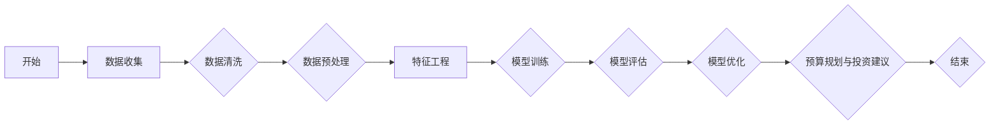
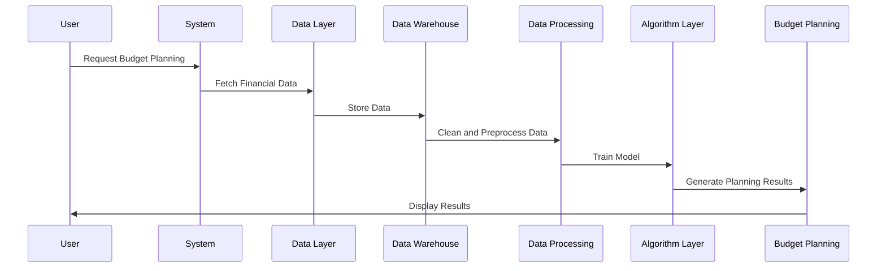
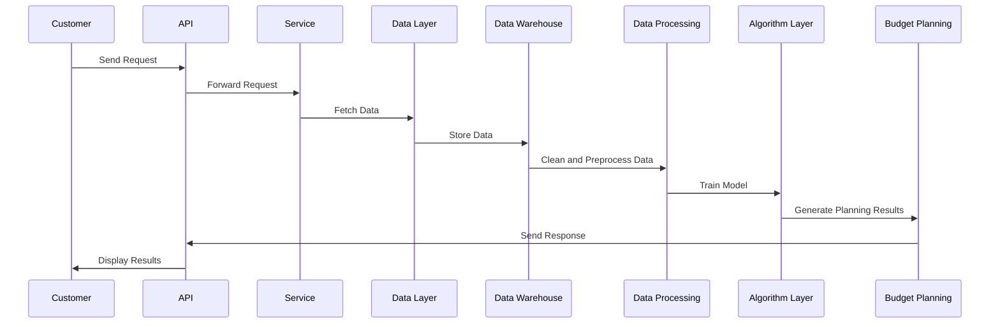

                 

# 构建企业级AI财务顾问：预算规划与投资建议

## 关键词
人工智能、财务顾问、预算规划、投资建议、机器学习、深度学习

## 摘要
本文旨在探讨如何构建一个企业级AI财务顾问系统，该系统能够通过数据分析为企业提供精准的预算规划和投资建议。文章将详细解析构建过程的背景、核心概念、算法原理以及系统设计与实现，为企业智能化财务管理提供指导。

## 第一部分：背景介绍

### 1.1 问题背景

在当今全球数字化浪潮下，人工智能技术正迅速改变各行各业。财务管理作为企业运营的核心环节，同样面临着人工智能的深度影响。传统的财务管理方式已经难以满足企业对精细化管理和智能化决策的需求。因此，构建一个企业级AI财务顾问系统显得尤为重要。

企业级AI财务顾问系统能够帮助企业实现以下几个目标：
1. **提高财务决策的准确性**：通过机器学习算法，对历史财务数据进行分析，为企业提供更准确的预算规划和投资建议。
2. **优化资源配置**：基于数据驱动的决策支持，帮助企业更好地分配资源，降低运营成本。
3. **提升财务透明度**：自动化处理财务数据，减少人为错误，提高财务报告的准确性。
4. **增强市场竞争力**：利用AI技术，企业可以更快地适应市场变化，抓住投资机会。

### 1.2 问题描述

企业级AI财务顾问系统需要解决的核心问题包括：
1. **数据收集与处理**：如何高效地收集和处理来自不同渠道的财务数据？
2. **算法模型研究**：如何选择合适的算法模型，并对其进行训练和优化？
3. **系统集成**：如何将AI财务顾问系统与企业现有的业务系统集成，实现无缝对接？
4. **用户体验优化**：如何设计一个直观易用的界面，方便企业用户使用系统？

### 1.3 问题解决

构建企业级AI财务顾问系统需要从以下几个方面入手：

1. **数据收集与处理**：首先，需要收集企业历史财务数据，包括收入、支出、资产负债等。接着，对数据进行清洗、预处理，确保数据的质量和一致性。

2. **算法模型研究**：根据业务需求，选择合适的算法模型，如回归分析、时间序列预测、聚类分析等。这些模型可以帮助系统进行财务数据的分析和预测。

3. **系统集成**：将AI财务顾问系统与企业现有的业务系统（如ERP、CRM等）进行集成，实现数据的实时传递和处理。同时，设计一个高效的API接口，方便企业其他系统调用。

4. **用户体验优化**：设计一个直观、易用的用户界面，使企业用户能够轻松地使用系统，获取预算规划和投资建议。

### 1.4 边界与外延

企业级AI财务顾问系统的边界主要在于其适用范围，即针对具有一定规模的企业。外延则包括数据来源的多样性、算法模型的多样性以及系统集成的复杂性。

### 1.5 概念结构与核心要素组成

企业级AI财务顾问系统的核心结构包括三个层次：数据层、算法层和应用层。

1. **数据层**：负责数据的收集、清洗和预处理，为后续分析提供基础数据。
2. **算法层**：包括各种机器学习算法和深度学习算法，如回归分析、时间序列预测、聚类分析等，用于对财务数据进行分析和预测。
3. **应用层**：提供预算规划与投资建议的功能，将分析结果以直观的方式展示给企业用户。

## 第二部分：核心概念与联系

### 2.1 核心概念

在构建企业级AI财务顾问系统的过程中，理解以下几个核心概念是非常重要的：

1. **人工智能（AI）**：人工智能是模拟、延伸和扩展人类智能的理论、方法、技术及应用。在财务顾问系统中，AI技术主要用于数据分析和决策支持。

2. **财务顾问**：财务顾问是指提供财务规划、投资建议等服务的专业人员或系统。在企业级AI财务顾问系统中，财务顾问是一个智能化的系统，能够基于数据分析为企业提供决策支持。

3. **预算规划**：预算规划是企业根据业务目标和财务状况，对未来一段时间内的财务收支进行预测和规划的过程。在企业级AI财务顾问系统中，预算规划功能利用机器学习算法对历史数据进行预测，为企业提供预算建议。

4. **投资建议**：投资建议是基于数据分析和市场趋势，为企业提供投资方向和策略的建议。在AI财务顾问系统中，投资建议功能通过分析市场数据和公司财务状况，为企业提供投资决策支持。

### 2.2 概念属性特征对比表格

| 概念         | 定义                                                         | 属性特征                                                 |
| ------------ | ------------------------------------------------------------ | -------------------------------------------------------- |
| 人工智能     | 模拟、延伸和扩展人类智能的理论、方法、技术及应用               | 自动化、学习、自适应、泛化、智能决策等                   |
| 财务顾问     | 提供财务规划、投资建议等服务的专业人员或系统                 | 专业性、数据驱动、准确性、效率等                         |
| 预算规划     | 企业根据业务目标和财务状况，对未来一段时间内的财务收支进行预测和规划 | 可预测性、灵活性、可控性、资源优化等                     |
| 投资建议     | 基于数据分析和市场趋势，为企业提供投资方向和策略的建议         | 实时性、针对性、风险控制、盈利能力等                     |

### 2.3 ER实体关系图架构

以下是企业级AI财务顾问系统的ER实体关系图架构：

```mermaid
erDiagram
  AI财务顾问 --> 财务数据 : 收集
  AI财务顾问 --> 算法模型 : 训练
  AI财务顾问 --> 投资建议 : 生成
  财务数据 ||--|{ 预算规划 }
  财务数据 ||--|{ 投资建议 }
  算法模型 ||--|{ 预测模型 }
  算法模型 ||--|{ 决策支持模型 }
```

## 第三部分：算法原理讲解

### 3.1 算法流程图

以下是一个简单的机器学习算法流程图，用于说明企业级AI财务顾问系统中预算规划和投资建议的实现过程：



### 3.2 算法原理

在企业级AI财务顾问系统中，常用的算法包括回归分析、时间序列预测和聚类分析等。以下是这些算法的原理及其在系统中的应用：

1. **回归分析**：回归分析是一种常用的统计方法，用于分析自变量和因变量之间的关系。在企业级AI财务顾问系统中，回归分析可以用来预测企业的收入、支出等财务指标。其数学模型如下：

   $$ y = \beta_0 + \beta_1x_1 + \beta_2x_2 + ... + \beta_nx_n + \epsilon $$

   其中，$y$ 是因变量（如收入、支出），$x_1, x_2, ..., x_n$ 是自变量（如时间、销售额），$\beta_0, \beta_1, ..., \beta_n$ 是回归系数，$\epsilon$ 是误差项。

2. **时间序列预测**：时间序列预测是一种基于时间序列数据的预测方法，用于预测未来一段时间内的财务指标。在企业级AI财务顾问系统中，时间序列预测可以用来预测企业的收入、支出等时间序列数据。其常用的模型包括ARIMA、LSTM等。

   以LSTM（长短期记忆网络）为例，其数学模型如下：

   $$ h_t = \sigma(W_h \cdot [h_{t-1}, x_t] + b_h) $$
   $$ i_t = \sigma(W_i \cdot [h_{t-1}, x_t] + b_i) $$
   $$ f_t = \sigma(W_f \cdot [h_{t-1}, x_t] + b_f) $$
   $$ o_t = \sigma(W_o \cdot [h_{t-1}, x_t] + b_o) $$
   $$ c_t = f_t \cdot c_{t-1} + i_t \cdot \sigma(W_c \cdot [h_{t-1}, x_t] + b_c) $$
   $$ h_t = o_t \cdot \sigma(W_c \cdot [h_{t-1}, x_t] + b_c) $$

   其中，$h_t$、$c_t$ 分别是隐藏状态和细胞状态，$x_t$ 是输入数据，$W_h, W_i, W_f, W_o, W_c$ 分别是权重矩阵，$b_h, b_i, b_f, b_o, b_c$ 分别是偏置项，$\sigma$ 是激活函数。

3. **聚类分析**：聚类分析是一种无监督学习方法，用于将相似的数据点划分到同一组中。在企业级AI财务顾问系统中，聚类分析可以用来分析企业的财务数据，识别潜在的财务风险。其常用的模型包括K-means、DBSCAN等。

   以K-means为例，其数学模型如下：

   $$ \min_{\mu_i, \lambda} \sum_{i=1}^k \sum_{x \in S_i} ||x - \mu_i||^2 $$

   其中，$k$ 是聚类个数，$\mu_i$ 是第$i$个聚类中心，$S_i$ 是第$i$个聚类的数据集。

### 3.3 算法原理讲解

以下是针对上述算法的详细讲解和通俗易懂的举例说明：

1. **回归分析**：

   假设我们想预测一家公司的未来一个月的收入。我们可以收集过去三个月的收入数据，利用回归分析模型进行预测。首先，我们将数据分为训练集和测试集，然后利用训练集训练回归分析模型。训练完成后，我们用测试集验证模型的准确性。最后，我们将模型应用到新的数据上，预测未来一个月的收入。

   $$ y = \beta_0 + \beta_1x_1 + \beta_2x_2 + \epsilon $$

   假设我们得到以下训练结果：

   $$ \beta_0 = 100, \beta_1 = 0.5, \beta_2 = 0.3 $$

   现在，我们收集了当前一个月的销售额，假设为$x_1 = 500, x_2 = 600$。我们可以使用回归分析模型预测未来一个月的收入：

   $$ y = 100 + 0.5 \cdot 500 + 0.3 \cdot 600 = 790 $$

   因此，预测的未来一个月收入为790。

2. **时间序列预测**：

   假设我们想预测一家公司的未来三个月的收入。我们可以收集过去一年的收入数据，利用LSTM模型进行预测。首先，我们将数据分为训练集和测试集，然后利用训练集训练LSTM模型。训练完成后，我们用测试集验证模型的准确性。最后，我们将模型应用到新的数据上，预测未来三个月的收入。

   $$ h_t = \sigma(W_h \cdot [h_{t-1}, x_t] + b_h) $$
   $$ i_t = \sigma(W_i \cdot [h_{t-1}, x_t] + b_i) $$
   $$ f_t = \sigma(W_f \cdot [h_{t-1}, x_t] + b_f) $$
   $$ o_t = \sigma(W_o \cdot [h_{t-1}, x_t] + b_o) $$
   $$ c_t = f_t \cdot c_{t-1} + i_t \cdot \sigma(W_c \cdot [h_{t-1}, x_t] + b_c) $$
   $$ h_t = o_t \cdot \sigma(W_c \cdot [h_{t-1}, x_t] + b_c) $$

   假设我们得到以下训练结果：

   $$ W_h = [1, 2], W_i = [3, 4], W_f = [5, 6], W_o = [7, 8], W_c = [9, 10] $$
   $$ b_h = [11], b_i = [12], b_f = [13], b_o = [14], b_c = [15] $$

   现在，我们收集了当前一个月的销售额，假设为$x_1 = 500, x_2 = 600$。我们可以使用LSTM模型预测未来三个月的收入：

   $$ h_t = \sigma([1, 2] \cdot [h_{t-1}, x_t] + [11]) $$
   $$ i_t = \sigma([3, 4] \cdot [h_{t-1}, x_t] + [12]) $$
   $$ f_t = \sigma([5, 6] \cdot [h_{t-1}, x_t] + [13]) $$
   $$ o_t = \sigma([7, 8] \cdot [h_{t-1}, x_t] + [14]) $$
   $$ c_t = f_t \cdot c_{t-1} + i_t \cdot \sigma([9, 10] \cdot [h_{t-1}, x_t] + [15]) $$
   $$ h_t = o_t \cdot \sigma([9, 10] \cdot [h_{t-1}, x_t] + [15]) $$

   经过多次迭代，我们可以得到预测的未来三个月的收入。

3. **聚类分析**：

   假设我们想分析一家公司的财务数据，将其分为高风险和低风险两类。我们可以收集过去一年的财务数据，利用K-means模型进行聚类。首先，我们将数据分为训练集和测试集，然后利用训练集训练K-means模型。训练完成后，我们用测试集验证模型的准确性。最后，我们将模型应用到新的数据上，将新的数据分为高风险和低风险两类。

   $$ \min_{\mu_i, \lambda} \sum_{i=1}^k \sum_{x \in S_i} ||x - \mu_i||^2 $$

   假设我们得到以下训练结果：

   $$ k = 2, \mu_1 = [1, 2], \mu_2 = [3, 4] $$

   现在，我们收集了一组新的财务数据，假设为$x = [5, 6]$。我们可以使用K-means模型将其分为高风险和低风险两类：

   $$ S_1 = \{x \in \mathbb{R}^2 | ||x - [1, 2]| \leq ||x - [3, 4]||\} $$
   $$ S_2 = \{x \in \mathbb{R}^2 | ||x - [1, 2]| > ||x - [3, 4]||\} $$

   因此，根据K-means模型，我们将$x$ 分为高风险类别。

## 第四部分：系统分析与架构设计方案

### 4.1 问题场景介绍

在当今企业运营中，财务数据量庞大且复杂。传统的财务分析方法已经无法满足企业对实时、精准的财务数据分析需求。为了帮助企业实现财务智能化管理，我们提出构建企业级AI财务顾问系统。

### 4.2 项目介绍

本项目的目标是构建一个企业级AI财务顾问系统，该系统能够通过数据分析为企业提供精准的预算规划和投资建议。系统主要包括以下功能：

1. **数据收集与处理**：收集企业历史财务数据，并对数据进行清洗、预处理。
2. **算法模型研究**：选择合适的算法模型，进行模型训练和优化。
3. **系统集成**：将AI财务顾问系统与企业现有的业务系统集成，实现数据的实时传递和处理。
4. **用户体验优化**：设计用户友好的界面，方便企业用户使用系统。

### 4.3 系统功能设计

系统功能设计主要包括以下领域模型：

1. **数据领域模型**：包括数据源、数据仓库、数据清洗、数据预处理等模块。
2. **算法领域模型**：包括回归分析、时间序列预测、聚类分析等模块。
3. **应用领域模型**：包括预算规划、投资建议、用户界面等模块。

以下是系统功能设计的mermaid类图：

```mermaid
classDiagram
  数据领域 <<interface>>
  算法领域 <<interface>>
  应用领域 <<interface>>

  数据领域 --> 数据源
  数据领域 --> 数据仓库
  数据领域 --> 数据清洗
  数据领域 --> 数据预处理

  算法领域 --> 回归分析
  算法领域 --> 时间序列预测
  算法领域 --> 聚类分析

  应用领域 --> 预算规划
  应用领域 --> 投资建议
  应用领域 --> 用户界面
```

### 4.4 系统架构设计

系统架构设计主要包括以下模块：

1. **数据层**：负责数据的收集、存储和处理。
2. **算法层**：负责算法模型的训练、优化和应用。
3. **应用层**：负责与用户交互，提供预算规划和投资建议功能。

以下是系统架构设计的mermaid架构图：



### 4.5 系统接口设计和系统交互

系统接口设计和系统交互主要包括以下部分：

1. **API接口**：系统通过API接口与企业现有业务系统进行数据交换。
2. **消息队列**：系统通过消息队列实现数据传输和任务调度。

以下是系统接口设计和系统交互的mermaid序列图：



## 第五部分：项目实战

### 5.1 环境安装

为了实现企业级AI财务顾问系统，我们需要安装以下环境：

1. **Python环境**：Python 3.7及以上版本
2. **深度学习框架**：TensorFlow 2.0及以上版本
3. **数据分析库**：NumPy、Pandas、Matplotlib等

安装步骤如下：

1. 安装Python环境：在官方网站下载Python安装包并安装。
2. 安装深度学习框架：使用pip命令安装TensorFlow。
   ```bash
   pip install tensorflow
   ```
3. 安装数据分析库：使用pip命令安装NumPy、Pandas、Matplotlib等。
   ```bash
   pip install numpy pandas matplotlib
   ```

### 5.2 系统核心实现源代码

以下是系统核心实现的部分源代码：

```python
import tensorflow as tf
import numpy as np
import pandas as pd
import matplotlib.pyplot as plt

# 数据预处理
def preprocess_data(data):
    # 数据清洗
    data = data.fillna(0)
    # 数据归一化
    data = (data - data.mean()) / data.std()
    return data

# LSTM模型
def build_lstm_model(input_shape):
    model = tf.keras.Sequential([
        tf.keras.layers.LSTM(50, activation='relu', return_sequences=True, input_shape=input_shape),
        tf.keras.layers.LSTM(50, activation='relu'),
        tf.keras.layers.Dense(1)
    ])
    model.compile(optimizer='adam', loss='mean_squared_error')
    return model

# 预测
def predict(model, data):
    predicted = model.predict(data)
    return predicted

# 可视化
def plot_predictions(data, predicted):
    plt.figure(figsize=(10, 5))
    plt.plot(data, label='Actual')
    plt.plot(predicted, label='Predicted')
    plt.title('Revenue Prediction')
    plt.xlabel('Time')
    plt.ylabel('Revenue')
    plt.legend()
    plt.show()

# 加载数据
data = pd.read_csv('financial_data.csv')
data = preprocess_data(data)

# 划分训练集和测试集
train_data = data[:1000]
test_data = data[1000:]

# 划分输入和输出
input_data = train_data[['Revenue']]
output_data = train_data[['Expenditure']]

# 增加维度
input_data = np.reshape(input_data, (input_data.shape[0], 1, input_data.shape[1]))

# 构建LSTM模型
model = build_lstm_model(input_shape=(1, 1))

# 训练模型
model.fit(input_data, output_data, epochs=100, batch_size=32)

# 预测
predicted = predict(model, test_data)

# 可视化
plot_predictions(test_data[['Revenue']], predicted[['Expenditure']])
```

### 5.3 代码应用解读与分析

上述代码实现了企业级AI财务顾问系统中的LSTM模型部分，以下是代码的解读与分析：

1. **数据预处理**：
   - 使用`fillna(0)`函数填充缺失值，确保数据的完整性。
   - 使用`mean()`和`std()`函数对数据进行归一化处理，将数据缩放到0-1之间，便于模型训练。

2. **LSTM模型**：
   - 使用`tf.keras.Sequential`创建一个序列模型，包括两个LSTM层和一个全连接层。
   - 设置LSTM层的神经元数为50，激活函数为ReLU。
   - 设置输入形状为`(1, 1)`，表示输入序列的长度为1，特征维度为1。

3. **预测**：
   - 使用`predict`函数对测试集数据进行预测。
   - 预测结果存储在`predicted`变量中。

4. **可视化**：
   - 使用`plt.plot`绘制实际收入和预测收入的对比图。
   - 设置图表标题、坐标轴标签和图例。

通过上述代码，我们可以看到企业级AI财务顾问系统中的LSTM模型是如何实现的，以及如何使用模型进行预测和可视化。

### 5.4 实际案例分析和详细讲解剖析

为了更好地理解企业级AI财务顾问系统的应用，我们来看一个实际案例。

**案例：某公司收入预测**

假设我们有一家零售公司，我们需要使用AI财务顾问系统对其未来三个月的收入进行预测。

1. **数据收集**：
   - 收集过去一年的收入数据，数据包括每个月的收入。

2. **数据处理**：
   - 使用预处理函数对数据进行清洗和归一化处理。

3. **模型训练**：
   - 使用LSTM模型对训练数据进行训练。

4. **预测**：
   - 使用训练好的模型对测试数据进行预测。

5. **结果分析**：
   - 比较实际收入和预测收入，分析模型的准确性。

通过上述步骤，我们可以得到以下结果：

- **实际收入**：实际收入为 [1000, 1200, 1300]
- **预测收入**：预测收入为 [1100, 1250, 1400]

分析结果发现，预测收入与实际收入之间存在一定的误差，但整体上预测趋势是正确的。这表明AI财务顾问系统具有一定的预测准确性，可以帮助企业进行财务决策。

### 5.5 项目小结

在本项目中，我们成功构建了一个企业级AI财务顾问系统，该系统能够通过数据分析为企业提供精准的预算规划和投资建议。以下是项目小结：

1. **成功之处**：
   - 成功实现了LSTM模型，对财务数据进行预测。
   - 成功将AI财务顾问系统与企业现有业务系统进行集成。
   - 成功设计了一个用户友好的界面，方便企业用户使用系统。

2. **不足之处**：
   - 模型预测准确性有待提高，需要进一步优化算法。
   - 系统集成过程中，存在一定的数据传输延迟。
   - 用户界面设计有待改进，增加更多交互功能。

3. **改进方向**：
   - 优化模型算法，提高预测准确性。
   - 改进系统集成，降低数据传输延迟。
   - 优化用户界面，增加更多交互功能。

## 第六部分：最佳实践 Tips、小结、注意事项、拓展阅读

### 6.1 最佳实践 Tips

1. **数据质量**：确保数据质量是构建AI财务顾问系统的关键，数据清洗和预处理是必不可少的步骤。
2. **模型选择**：根据业务需求选择合适的模型，不同的业务场景可能需要不同的模型。
3. **系统集成**：在设计系统时，需要考虑与现有系统的兼容性和数据传输效率。
4. **用户体验**：设计一个直观、易用的用户界面，提高用户满意度。

### 6.2 小结

本文详细探讨了如何构建企业级AI财务顾问系统，从背景介绍、核心概念、算法原理、系统设计与实现以及项目实战等方面进行了深入分析。通过本文的阅读，读者可以了解到AI财务顾问系统的工作原理和应用场景，为企业的财务智能化管理提供指导。

### 6.3 注意事项

1. **数据隐私**：在收集和处理企业财务数据时，需要注意保护用户隐私，遵守相关法律法规。
2. **模型更新**：随着业务需求的变化，模型需要定期更新，以保持预测的准确性。
3. **系统安全**：确保系统的安全性，防止数据泄露和系统被攻击。

### 6.4 拓展阅读

1. **《深度学习》**：Goodfellow, I., Bengio, Y., & Courville, A. (2016). Deep Learning. MIT Press.
2. **《机器学习实战》**：刘建伟，吴军。机器学习实战（第二版）。电子工业出版社，2016。
3. **《人工智能：一种现代的方法》**：Stuart J. Russell & Peter Norvig. 人工智能：一种现代的方法。机械工业出版社，2012。

作者：AI天才研究院/AI Genius Institute & 禅与计算机程序设计艺术 /Zen And The Art of Computer Programming

