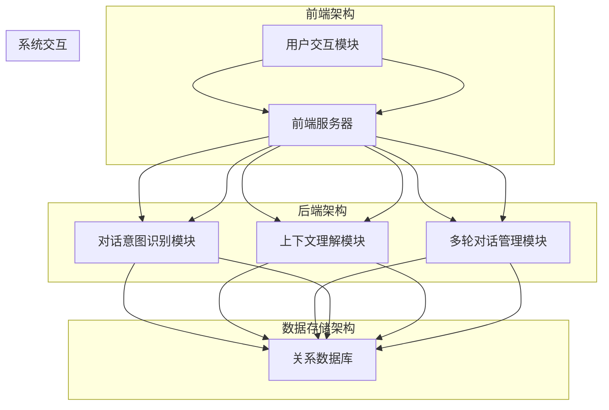

                 

### 第1章: 企业级对话意图识别系统概述

#### 1.1 问题背景

在当今快速发展的数字化时代，企业对话系统已成为提升客户体验、提高业务效率和降低运营成本的重要工具。企业对话系统广泛应用于客户服务、智能客服、虚拟助手、人机交互等多个领域，它们能够自动处理大量的客户咨询，实现24/7全天候服务，从而极大地提升了企业的运营效率和服务水平。

##### 1.1.1 企业对话系统的应用领域

企业对话系统在多个领域有着广泛的应用：

1. **客户服务**：通过智能客服机器人实现自动回复，减少人工成本，提高客户问题解决的效率。
2. **智能助手**：在电子商务、金融、医疗等领域，提供个性化服务，帮助用户完成各种任务。
3. **人机交互**：在智能家居、智能穿戴设备等领域，实现人与设备的自然交互。
4. **销售与营销**：通过对话系统进行潜在客户的识别和跟进，提高销售转化率。

##### 1.1.2 企业对话系统的商业价值

企业对话系统的商业价值主要体现在以下几个方面：

1. **提高效率**：自动处理大量客户咨询，节省人工成本。
2. **提升客户体验**：提供24/7全天候服务，提高客户满意度。
3. **优化运营**：通过数据分析，帮助企业优化业务流程，提高运营效率。
4. **降低成本**：减少人力投入，降低运营成本。

尽管企业对话系统在各个领域展现出巨大的商业价值，但当前对话系统仍面临着一些挑战：

1. **上下文理解不足**：对话系统往往难以理解用户的真实意图，导致回答不准确或不符合用户期望。
2. **多轮对话管理复杂**：多轮对话的复杂性使得对话系统的实现和维护变得困难。
3. **模型性能与效率问题**：现有的对话系统在处理大量对话时，性能和效率仍有待提高。

#### 1.2 核心概念与联系

为了深入理解企业级对话意图识别系统，我们需要先了解几个核心概念，包括对话意图识别、上下文理解和多轮对话管理。

##### 1.2.1 对话意图识别

**定义**：对话意图识别是指从用户的对话中识别出用户的意图或需求。它是对话系统理解用户输入的第一步，也是实现智能对话的关键。

**关键特征**：

- **准确性**：准确识别用户意图，提高用户满意度。
- **多样性**：能够识别多种不同形式的用户输入，适应不同的用户场景。
- **实时性**：快速响应用户输入，提高系统效率。

##### 1.2.2 上下文理解

**定义**：上下文理解是指对话系统能够根据对话的历史信息，理解用户的当前意图和需求。它是实现多轮对话和保持对话连贯性的关键。

**关键特征**：

- **连贯性**：保持对话的一致性和连贯性，避免对话中断或出现逻辑错误。
- **适应性**：能够适应不同对话场景，灵活调整上下文信息。
- **实时更新**：随着对话的进行，实时更新上下文信息，以更好地理解用户意图。

##### 1.2.3 多轮对话管理

**定义**：多轮对话管理是指对话系统在处理用户输入时，能够进行多轮交互，以实现更复杂的对话任务。

**关键技术**：

- **对话状态管理**：维护对话的历史信息，实现多轮对话的连续性。
- **策略选择**：根据对话状态和用户输入，选择合适的回复策略。
- **交互设计**：设计合理的对话流程，提高用户互动体验。

#### 1.3 模型与算法原理讲解

企业级对话意图识别系统涉及多个算法和模型，下面将分别介绍对话意图识别算法、上下文理解算法和对话管理算法的基本原理。

##### 1.3.1 对话意图识别算法原理

**数学模型**：

对话意图识别通常采用分类算法来实现，其数学模型可以表示为：

$$
\text{意图概率} = \frac{\exp(\text{意图特征}^T \cdot \text{权重向量})}{\sum_{i=1}^{N} \exp(\text{意图特征}^T \cdot \text{权重向量}_i)}
$$

其中，意图特征是用户输入的表示，权重向量是通过训练得到的模型参数。

**流程与步骤**：

1. **特征提取**：从用户输入中提取特征，如词语特征、语义特征等。
2. **模型训练**：使用标注好的对话数据集，通过机器学习算法训练意图识别模型。
3. **意图识别**：将用户输入转换为特征向量，输入到训练好的模型中，输出意图概率最高的意图。

##### 1.3.2 上下文理解算法原理

**数学模型**：

上下文理解算法通常采用嵌入层来实现，其数学模型可以表示为：

$$
\text{上下文向量} = \text{嵌入层}(\text{输入序列})
$$

其中，输入序列是用户输入的表示，嵌入层是将输入序列映射为上下文向量的神经网络层。

**实现方法**：

1. **词嵌入**：将词语转换为固定长度的向量表示。
2. **实体识别与属性抽取**：识别用户输入中的实体，并抽取实体的属性信息。
3. **上下文融合**：将不同的上下文信息融合为一个统一的上下文向量。

##### 1.3.3 多轮对话管理算法原理

**数学模型**：

多轮对话管理算法通常采用状态机来实现，其数学模型可以表示为：

$$
\text{对话状态} = \text{状态转移矩阵} \cdot \text{当前状态}
$$

其中，状态转移矩阵定义了不同状态之间的转移概率，当前状态是当前对话的状态表示。

**实现策略**：

1. **对话状态管理**：维护对话的历史信息，实现多轮对话的连续性。
2. **策略选择**：根据对话状态和用户输入，选择合适的回复策略。
3. **交互设计**：设计合理的对话流程，提高用户互动体验。

#### 1.4 数学模型与公式详细讲解

为了更深入地理解上述算法，我们将详细讲解各个数学模型和公式。

##### 1.4.1 对话意图识别数学模型

对话意图识别的数学模型可以表示为：

$$
\text{意图概率} = \frac{\exp(\text{意图特征}^T \cdot \text{权重向量})}{\sum_{i=1}^{N} \exp(\text{意图特征}^T \cdot \text{权重向量}_i)}
$$

其中，意图特征是用户输入的表示，权重向量是通过训练得到的模型参数。这个模型将用户输入的意图特征映射到概率空间，从而实现对用户意图的识别。

##### 1.4.2 上下文理解数学模型

上下文理解算法通常采用嵌入层来实现，其数学模型可以表示为：

$$
\text{上下文向量} = \text{嵌入层}(\text{输入序列})
$$

其中，输入序列是用户输入的表示，嵌入层是将输入序列映射为上下文向量的神经网络层。这个模型通过嵌入层将输入序列转换为上下文向量，从而实现对上下文信息的理解。

##### 1.4.3 多轮对话管理数学模型

多轮对话管理算法通常采用状态机来实现，其数学模型可以表示为：

$$
\text{对话状态} = \text{状态转移矩阵} \cdot \text{当前状态}
$$

其中，状态转移矩阵定义了不同状态之间的转移概率，当前状态是当前对话的状态表示。这个模型通过状态转移矩阵更新对话状态，从而实现对多轮对话的管理。

#### 1.5 本章小结

本章对企业级对话意图识别系统进行了概述，包括问题背景、核心概念与联系、模型与算法原理讲解以及数学模型与公式的详细讲解。通过本章的内容，读者可以初步了解企业级对话意图识别系统的基础知识，为进一步学习和应用打下基础。

----------------------------------------------------------------

# 第二部分: 对话意图识别算法设计与实现

#### 2.1 算法概述

对话意图识别是对话系统实现智能交互的核心环节。它的目标是根据用户的输入，准确识别并理解用户的意图。对话意图识别算法的设计和实现，直接影响到整个对话系统的性能和用户体验。

##### 2.1.1 对话意图识别算法的目标

对话意图识别算法主要有以下目标：

1. **准确性**：尽可能准确地识别用户的意图，减少误识别和漏识别。
2. **多样性**：能够识别多种不同形式的用户输入，适应不同的用户场景。
3. **实时性**：快速响应用户输入，提高系统效率。

##### 2.1.2 对话意图识别算法的基本流程

对话意图识别算法的基本流程可以分为以下几个步骤：

1. **特征提取**：从用户输入中提取出用于表示用户意图的特征。
2. **模型训练**：使用标注好的数据集训练意图识别模型。
3. **意图识别**：将用户输入转换为特征向量，输入到训练好的模型中，输出意图概率最高的意图。

#### 2.2 特征提取

特征提取是对话意图识别算法的重要环节，它直接影响到模型的性能。特征提取方法可以分为词语特征提取和语义特征提取。

##### 2.2.1 词语特征提取

词语特征提取主要关注用户输入中的词语信息。常用的方法包括词袋模型和词嵌入。

**词袋模型**：

词袋模型将用户输入表示为一个向量，向量中的每个元素表示一个词语的出现次数。其数学表示为：

$$
\text{词袋向量} = (\text{词1出现次数}, \text{词2出现次数}, ..., \text{词n出现次数})
$$

**词嵌入**：

词嵌入是一种将词语映射为固定长度的向量的方法，它可以捕捉词语的语义信息。常用的词嵌入方法包括Word2Vec、GloVe等。词嵌入的数学表示为：

$$
\text{词向量} = \text{嵌入层}(\text{词语})
$$

##### 2.2.2 语义特征提取

语义特征提取旨在捕捉用户输入的语义信息。常用的方法包括词向量表示和实体识别与属性抽取。

**词向量表示**：

词向量表示是将词语映射为固定长度的向量的方法，它可以捕捉词语的语义信息。常用的词向量表示方法包括Word2Vec、GloVe等。

**实体识别与属性抽取**：

实体识别与属性抽取是自然语言处理中的常见任务，旨在从用户输入中识别出实体，并抽取实体的属性信息。实体识别的数学表示为：

$$
\text{实体} = \text{识别层}(\text{输入序列})
$$

属性抽取的数学表示为：

$$
\text{属性向量} = \text{抽取层}(\text{实体})
$$

#### 2.3 模型选择与训练

在对话意图识别算法中，选择合适的机器学习模型和进行有效的模型训练是关键。

##### 2.3.1 机器学习模型选择

常用的机器学习模型包括支持向量机（SVM）、决策树、随机森林和神经网络等。

**支持向量机（SVM）**：

SVM是一种二分类模型，通过寻找最优的超平面来实现分类。其数学表示为：

$$
\text{决策函数} = \text{w}^T \cdot \text{x} + \text{b}
$$

其中，w是权重向量，x是特征向量，b是偏置。

**决策树**：

决策树是一种基于树结构的分类模型，通过多级划分来实现分类。其数学表示为：

$$
\text{决策规则} = \text{根节点} \rightarrow \text{内部节点} \rightarrow \text{叶子节点}
$$

**随机森林**：

随机森林是一种基于决策树的集成学习方法，通过构建多棵决策树，并取平均值来提高模型的性能。其数学表示为：

$$
\text{预测结果} = \text{随机森林}(\text{数据集})
$$

**神经网络**：

神经网络是一种模拟人脑的神经网络结构，通过多层神经元来实现分类。其数学表示为：

$$
\text{激活函数} = \text{激活函数}(\text{输入})
$$

##### 2.3.2 模型训练与优化

模型训练是通过对大量标注数据集进行训练，得到最优的模型参数。模型优化的目标是提高模型的性能，包括准确率、召回率和F1值等。

1. **数据预处理**：

   数据预处理包括数据清洗、数据归一化和数据增强等步骤，以提高模型训练的效果。

2. **模型参数调优**：

   通过调整模型的参数，如学习率、批量大小和正则化参数等，来提高模型的性能。

3. **模型评估与选择**：

   通过交叉验证等方法，对训练好的模型进行评估，选择性能最优的模型。

#### 2.4 算法评估

算法评估是验证对话意图识别算法性能的重要步骤。常用的评估指标包括准确率、召回率和F1值等。

##### 2.4.1 评估指标

**准确率**：

准确率是指模型预测正确的样本数占总样本数的比例，其数学表示为：

$$
\text{准确率} = \frac{\text{预测正确的样本数}}{\text{总样本数}}
$$

**召回率**：

召回率是指模型预测正确的样本数与实际为正类的样本数的比例，其数学表示为：

$$
\text{召回率} = \frac{\text{预测正确的样本数}}{\text{实际为正类的样本数}}
$$

**F1值**：

F1值是准确率和召回率的调和平均数，其数学表示为：

$$
\text{F1值} = 2 \cdot \frac{\text{准确率} \cdot \text{召回率}}{\text{准确率} + \text{召回率}}
$$

##### 2.4.2 优化方向

针对算法评估的结果，可以采取以下优化方向：

1. **特征选择**：

   通过特征选择方法，如互信息、主成分分析等，筛选出对模型性能有重要影响的特征。

2. **模型结构优化**：

   通过调整模型结构，如增加层数、增加神经元等，来提高模型的性能。

3. **超参数调优**：

   通过网格搜索、随机搜索等方法，对模型的超参数进行调优，以提高模型的性能。

#### 2.5 本章小结

本章详细介绍了对话意图识别算法的设计与实现，包括算法概述、特征提取、模型选择与训练、算法评估和优化方向。通过本章的内容，读者可以了解对话意图识别算法的基本原理和方法，为进一步研究和应用对话系统打下基础。

----------------------------------------------------------------

## 第3章: 上下文理解算法设计与实现

### 3.1 算法概述

上下文理解是对话系统能够根据对话的历史信息，准确理解用户的当前意图和需求的关键环节。它对于实现多轮对话、保持对话连贯性和提供高质量的交互体验至关重要。在本章中，我们将深入探讨上下文理解算法的设计与实现。

#### 3.1.1 上下文理解的目标

上下文理解的主要目标是：

1. **保持对话连贯性**：确保对话系统能够根据历史信息，理解用户的当前意图，并生成合理的回复。
2. **提高意图识别准确性**：通过上下文信息，减少误解和误识别，提高意图识别的准确性。
3. **优化用户交互体验**：提供自然、流畅的对话体验，提升用户的满意度。

#### 3.1.2 上下文理解的基本原理

上下文理解的基本原理可以概括为以下几个步骤：

1. **信息收集**：对话系统在每次用户交互中收集并存储与对话相关的信息。
2. **信息处理**：将收集到的信息进行处理，提取关键特征，如词语、实体和事件等。
3. **信息融合**：将不同的信息源进行融合，形成一个统一的上下文表示。
4. **意图识别**：基于上下文表示，识别用户的意图。

### 3.2 算法实现

上下文理解算法的实现涉及多个层次，包括嵌入层、上下文更新与融合层和意图识别层。下面将详细讨论这些层次的算法实现。

#### 3.2.1 嵌入层算法

嵌入层算法的主要作用是将文本信息转换为向量表示，以便于后续的处理。常见的嵌入层算法包括基于词嵌入和基于实体嵌入的方法。

**基于词嵌入的上下文表示**：

词嵌入是将词语映射为固定长度的向量表示，常用的词嵌入算法有Word2Vec和GloVe。其数学表示为：

$$
\text{词向量} = \text{嵌入层}(\text{词语})
$$

**基于实体嵌入的上下文表示**：

实体嵌入是将实体映射为固定长度的向量表示，常见的实体嵌入算法有BERT和ELMO。其数学表示为：

$$
\text{实体向量} = \text{嵌入层}(\text{实体})
$$

#### 3.2.2 上下文更新与融合

上下文更新与融合是对话系统在处理用户输入时，根据历史上下文信息更新当前上下文表示的过程。常用的方法包括基于规则的更新方法和基于模型的更新方法。

**基于规则的更新方法**：

基于规则的更新方法通过定义一系列的规则，根据规则更新上下文表示。其数学表示为：

$$
\text{新上下文} = \text{旧上下文} \cup \{\text{新信息}\}
$$

**基于模型的更新方法**：

基于模型的更新方法通过训练一个更新模型，根据历史上下文和当前输入，自动生成新的上下文表示。其数学表示为：

$$
\text{新上下文} = \text{更新模型}(\text{历史上下文}, \text{当前输入})
$$

#### 3.2.3 上下文融合

上下文融合是将来自不同信息源的上下文信息进行整合，形成一个统一的上下文表示。常见的融合方法包括基于加权融合和基于神经网络融合的方法。

**基于加权融合的方法**：

基于加权融合的方法通过给不同的上下文信息分配权重，将它们加权融合为一个统一的上下文表示。其数学表示为：

$$
\text{融合上下文} = \sum_{i=1}^{N} w_i \cdot \text{上下文}_i
$$

其中，\( w_i \) 是第 \( i \) 个上下文信息的权重。

**基于神经网络融合的方法**：

基于神经网络融合的方法通过训练一个神经网络模型，自动学习不同上下文信息的重要性和相关性，将其融合为一个统一的上下文表示。其数学表示为：

$$
\text{融合上下文} = \text{融合模型}(\text{上下文}_1, \text{上下文}_2, ..., \text{上下文}_N)
$$

### 3.3 算法实现示例

为了更直观地理解上下文理解算法的实现，下面给出一个简单的实现示例。

**示例**：假设我们有一个简单的对话场景，用户连续提出三个问题。

1. 用户提问：“你今天天气怎么样？”
2. 用户提问：“我该穿什么衣服？”
3. 用户提问：“今天有雨吗？”

基于这个场景，我们可以实现以下步骤：

1. **信息收集**：收集用户的每个提问，并将其存储为历史上下文。
2. **信息处理**：提取每个提问中的关键词和实体。
3. **信息融合**：将历史上下文和当前提问融合为一个统一的上下文表示。
4. **意图识别**：根据融合后的上下文，识别用户的意图。

**代码示例**：

```python
# 假设已经定义了词嵌入和实体嵌入模型

# 历史上下文
context_history = []

# 用户提问
user_query = "今天有雨吗？"

# 提取关键词和实体
keywords = extract_keywords(user_query)
entities = extract_entities(user_query)

# 融合上下文
context_new = merge_context(context_history, keywords, entities)

# 识别意图
intent = recognize_intent(context_new)
```

### 3.4 本章小结

本章详细介绍了上下文理解算法的设计与实现，包括算法概述、嵌入层算法、上下文更新与融合方法和算法实现示例。通过本章的内容，读者可以理解上下文理解算法的基本原理和实现方法，为进一步研究和应用对话系统打下基础。

----------------------------------------------------------------

## 第4章: 多轮对话管理算法设计与实现

### 4.1 算法概述

多轮对话管理是对话系统能够在多轮对话中保持连贯性和有效性的关键环节。它涉及到对话状态的维护、对话策略的选择和对话流程的设计。在本章中，我们将深入探讨多轮对话管理算法的设计与实现。

#### 4.1.1 多轮对话管理的目标

多轮对话管理的主要目标是：

1. **保持对话连贯性**：确保对话系统能够根据对话历史和上下文，生成合理的回复，维持对话的连续性。
2. **优化用户交互体验**：提供自然、流畅的对话体验，提升用户的满意度。
3. **提高对话效率**：通过有效的对话策略和流程设计，提高对话的处理效率，减少用户的等待时间。

#### 4.1.2 多轮对话管理的基本原理

多轮对话管理的基本原理可以概括为以下几个步骤：

1. **对话状态维护**：对话系统在每次用户交互后，更新和存储对话状态，包括历史对话记录、用户意图、上下文信息等。
2. **对话策略选择**：根据当前对话状态和用户输入，选择合适的对话策略，以生成合理的回复。
3. **对话流程设计**：设计合理的对话流程，确保对话能够顺利地进行，达到用户的期望目标。

### 4.2 算法实现

多轮对话管理算法的实现涉及对话状态的维护、对话策略的选择和对话流程的设计。下面将详细讨论这些环节的算法实现。

#### 4.2.1 对话状态维护

对话状态的维护是对话管理的基础。对话状态包括历史对话记录、用户意图、上下文信息等。常用的方法包括基于规则的维护方法和基于模型的维护方法。

**基于规则的维护方法**：

基于规则的维护方法通过定义一系列规则，根据规则更新对话状态。其数学表示为：

$$
\text{新状态} = \text{旧状态} \cup \{\text{新信息}\}
$$

**基于模型的维护方法**：

基于模型的维护方法通过训练一个维护模型，根据历史状态和当前输入，自动更新对话状态。其数学表示为：

$$
\text{新状态} = \text{维护模型}(\text{历史状态}, \text{当前输入})
$$

#### 4.2.2 对话策略选择

对话策略的选择是根据当前对话状态和用户输入，选择合适的回复策略。常见的对话策略包括基于规则的策略、基于模型的策略和混合策略。

**基于规则的策略**：

基于规则的策略通过定义一系列的规则，根据规则选择回复策略。其数学表示为：

$$
\text{策略} = \text{规则}(\text{当前状态}, \text{用户输入})
$$

**基于模型的策略**：

基于模型的策略通过训练一个策略模型，根据当前状态和用户输入，自动选择回复策略。其数学表示为：

$$
\text{策略} = \text{策略模型}(\text{当前状态}, \text{用户输入})
$$

**混合策略**：

混合策略结合了基于规则和基于模型的优势，通过规则和模型的组合来选择回复策略。其数学表示为：

$$
\text{策略} = \text{规则}(\text{当前状态}, \text{用户输入}) + \text{策略模型}(\text{当前状态}, \text{用户输入})
$$

#### 4.2.3 对话流程设计

对话流程设计是对话管理的关键，它决定了对话的流程和用户体验。常见的对话流程设计方法包括线性流程、分支流程和混合流程。

**线性流程**：

线性流程是指对话按照固定的顺序进行，每个步骤完成后进入下一个步骤。其数学表示为：

$$
\text{流程} = \text{步骤1} \rightarrow \text{步骤2} \rightarrow ... \rightarrow \text{步骤N}
$$

**分支流程**：

分支流程是指根据对话状态和用户输入，选择不同的分支进行对话。其数学表示为：

$$
\text{流程} = \text{分支1} \rightarrow \text{分支2} \rightarrow ... \rightarrow \text{分支M}
$$

**混合流程**：

混合流程是将线性流程和分支流程结合起来，根据对话状态和用户输入，灵活选择对话流程。其数学表示为：

$$
\text{流程} = (\text{线性流程}) \cup (\text{分支流程})
$$

### 4.3 算法实现示例

为了更直观地理解多轮对话管理算法的实现，下面给出一个简单的实现示例。

**示例**：假设我们有一个简单的对话场景，用户连续提出三个问题。

1. 用户提问：“你今天天气怎么样？”
2. 用户提问：“我该穿什么衣服？”
3. 用户提问：“今天有雨吗？”

基于这个场景，我们可以实现以下步骤：

1. **对话状态维护**：收集用户的每个提问，并将其存储为对话状态。
2. **对话策略选择**：根据对话状态和用户输入，选择合适的对话策略。
3. **对话流程设计**：设计对话的流程，确保对话能够顺利地进行。

**代码示例**：

```python
# 假设已经定义了对话状态维护模型、对话策略模型和对话流程模型

# 初始状态
dialog_state = initialize_state()

# 用户提问
user_query = "今天有雨吗？"

# 维护对话状态
dialog_state = update_state(dialog_state, user_query)

# 选择对话策略
dialog_strategy = select_strategy(dialog_state, user_query)

# 设计对话流程
dialog_flow = design_flow(dialog_strategy)

# 输出回复
response = generate_response(dialog_state, dialog_flow)
```

### 4.4 本章小结

本章详细介绍了多轮对话管理算法的设计与实现，包括算法概述、对话状态维护、对话策略选择和对话流程设计。通过本章的内容，读者可以理解多轮对话管理算法的基本原理和实现方法，为进一步研究和应用对话系统打下基础。

----------------------------------------------------------------

## 第5章: 整体系统设计与架构

### 5.1 系统需求分析

在设计和实现企业级对话意图识别系统时，首先需要进行系统需求分析。系统需求分析包括功能需求和非功能需求。

**功能需求**：

1. **对话意图识别**：系统能够准确识别用户的意图。
2. **上下文理解**：系统能够理解对话的历史信息，保持对话连贯性。
3. **多轮对话管理**：系统能够在多轮对话中保持连续性和有效性。
4. **用户交互界面**：提供一个友好的用户交互界面，方便用户与系统进行对话。

**非功能需求**：

1. **性能**：系统应能够高效处理大量对话请求。
2. **可靠性**：系统应具备高可用性和稳定性，确保不会频繁出错。
3. **可扩展性**：系统应能够支持业务的扩展，方便未来增加新的功能和对话场景。

### 5.2 系统功能设计

系统功能设计是根据需求分析确定系统的具体功能模块和接口。以下是系统的主要功能模块：

1. **用户交互模块**：负责接收用户的输入，并将系统生成的回复反馈给用户。
2. **对话意图识别模块**：负责识别用户的意图，并根据意图生成相应的回复。
3. **上下文理解模块**：负责理解对话的历史信息，保持对话连贯性。
4. **多轮对话管理模块**：负责管理多轮对话的状态和流程。
5. **数据存储模块**：负责存储对话历史数据和用户信息。

**领域模型**：

领域模型是描述系统功能模块及其关系的图形表示。使用Mermaid类图表示系统领域模型如下：

```mermaid
classDiagram
    UserInteractionModule <<interface>>
    DialogIntentRecognitionModule <<interface>>
    ContextUnderstandingModule <<interface>>
    MultiTurnDialogueManagementModule <<interface>>
    DataStorageModule <<interface>>

    UserInteractionModule --|> DialogIntentRecognitionModule
    UserInteractionModule --|> ContextUnderstandingModule
    UserInteractionModule --|> MultiTurnDialogueManagementModule
    DialogIntentRecognitionModule --|> DataStorageModule
    ContextUnderstandingModule --|> DataStorageModule
    MultiTurnDialogueManagementModule --|> DataStorageModule
```

### 5.3 系统架构设计

系统架构设计是根据功能需求确定系统的整体结构和各个模块之间的关系。以下是系统的主要架构设计：

1. **前端架构**：负责与用户交互，接收用户输入和显示系统回复。
2. **后端架构**：包括对话意图识别、上下文理解和多轮对话管理等模块，负责处理对话请求。
3. **数据存储架构**：包括关系数据库和NoSQL数据库，负责存储对话历史数据和用户信息。

**系统架构图**：

使用Mermaid架构图表示系统的整体架构如下：



### 5.4 系统接口设计

系统接口设计是定义系统内部各个模块之间的交互接口。以下是系统的主要接口设计：

1. **用户输入接口**：接收用户的输入请求，并将输入传递给对话意图识别模块。
2. **意图识别接口**：接收用户输入，识别用户的意图，并将意图传递给上下文理解模块。
3. **上下文更新接口**：接收新的上下文信息，更新上下文表示。
4. **对话管理接口**：接收用户的输入，管理对话的状态和流程。

**系统接口图**：

使用Mermaid序列图表示系统的接口设计如下：

```mermaid
sequenceDiagram
    User -->|用户输入接口|> System: 提交用户输入
    System -->|意图识别接口|> IntentRecognition: 识别用户意图
    IntentRecognition -->|意图结果|> System: 返回意图结果
    System -->|上下文更新接口|> ContextUnderstanding: 更新上下文信息
    System -->|对话管理接口|> DialogueManagement: 管理对话状态和流程
    DialogueManagement -->|回复信息|> System: 生成回复信息
    System -->|用户输出接口|> User: 返回系统回复
```

### 5.5 本章小结

本章详细介绍了企业级对话意图识别系统的整体系统设计与架构，包括系统需求分析、系统功能设计、系统架构设计和系统接口设计。通过本章的内容，读者可以了解系统设计的整体思路和方法，为进一步实现和优化对话意图识别系统打下基础。

----------------------------------------------------------------

## 第6章: 项目实战与实现

### 6.1 环境安装与配置

在开始项目实战之前，首先需要安装和配置相关环境。以下是在Python环境中安装和配置对话意图识别系统的步骤：

#### 6.1.1 安装依赖库

安装Python依赖库是项目开发的第一步。我们使用pip工具来安装所需的库。以下是在终端中安装依赖库的命令：

```bash
pip install numpy scipy scikit-learn tensorflow numpy
```

#### 6.1.2 配置数据集

对话意图识别系统需要大量的标注数据集进行训练。数据集可以从公开的数据集网站（如Kaggle、GitHub等）下载，也可以自行收集和标注。以下是数据集的配置步骤：

1. **下载数据集**：从网上下载一个适合的对话意图识别数据集。
2. **数据预处理**：对数据集进行清洗和预处理，包括去除无效数据、填充缺失值、标准化文本等。
3. **数据存储**：将预处理后的数据集存储为CSV或JSON格式，以便于后续的训练和评估。

#### 6.1.3 搭建项目结构

搭建项目结构有助于组织和管理项目代码。以下是项目的基本结构：

```plaintext
dialogue_system/
|-- data/
|   |-- train.csv
|   |-- test.csv
|-- models/
|   |-- intent_recognition.model
|   |-- context_understanding.model
|   |-- dialogue_management.model
|-- scripts/
|   |-- data_preprocessing.py
|   |-- model_training.py
|   |-- dialogue_management.py
|-- tests/
|   |-- test_data_preprocessing.py
|   |-- test_model_training.py
|   |-- test_dialogue_management.py
|-- requirements.txt
|-- README.md
```

### 6.2 系统核心实现

系统核心实现包括对话意图识别、上下文理解和多轮对话管理等模块。下面将分别介绍这些模块的实现。

#### 6.2.1 对话意图识别模块

对话意图识别模块负责根据用户输入识别用户的意图。以下是一个简单的实现示例：

```python
# dialog_intent_recognition.py

import numpy as np
from sklearn.svm import SVC
from sklearn.model_selection import train_test_split

def load_data(file_path):
    # 读取数据集，进行预处理
    # 返回特征矩阵和标签向量
    pass

def train_model(X_train, y_train):
    # 训练SVM模型
    model = SVC(kernel='linear')
    model.fit(X_train, y_train)
    return model

def predict_intent(model, X_test):
    # 预测意图
    return model.predict(X_test)
```

#### 6.2.2 上下文理解模块

上下文理解模块负责理解对话的历史信息，保持对话连贯性。以下是一个简单的实现示例：

```python
# context_understanding.py

import numpy as np
from keras.models import Sequential
from keras.layers import Embedding, LSTM, Dense

def build_model(vocab_size, embedding_dim, max_sequence_length):
    # 构建LSTM模型
    model = Sequential()
    model.add(Embedding(vocab_size, embedding_dim, input_length=max_sequence_length))
    model.add(LSTM(128))
    model.add(Dense(1, activation='sigmoid'))

    model.compile(optimizer='adam', loss='binary_crossentropy', metrics=['accuracy'])
    return model

def train_model(model, X_train, y_train):
    # 训练模型
    model.fit(X_train, y_train, epochs=10, batch_size=32)
    return model

def predict_context(model, X_test):
    # 预测上下文
    return model.predict(X_test)
```

#### 6.2.3 多轮对话管理模块

多轮对话管理模块负责管理对话的状态和流程。以下是一个简单的实现示例：

```python
# dialogue_management.py

class DialogueManager:
    def __init__(self):
        # 初始化对话状态
        self.context = None
        self.intent = None

    def update_context(self, new_context):
        # 更新上下文
        self.context = new_context

    def update_intent(self, new_intent):
        # 更新意图
        self.intent = new_intent

    def generate_response(self, user_input):
        # 生成回复
        # 这里可以根据上下文和意图生成回复
        pass
```

### 6.3 项目核心代码解析

项目核心代码是系统实现的核心部分，包括数据预处理、模型训练和对话管理。下面将详细解析这些核心代码。

#### 6.3.1 数据预处理

数据预处理是项目开发的第一步，它包括数据清洗、数据转换和数据归一化。以下是一个简单的数据预处理示例：

```python
# data_preprocessing.py

import pandas as pd
from sklearn.model_selection import train_test_split
from sklearn.preprocessing import LabelEncoder

def preprocess_data(file_path):
    # 读取数据集
    df = pd.read_csv(file_path)

    # 数据清洗
    df.dropna(inplace=True)

    # 数据转换
    label_encoder = LabelEncoder()
    df['label'] = label_encoder.fit_transform(df['label'])

    # 数据归一化
    # ...

    # 划分训练集和测试集
    X_train, X_test, y_train, y_test = train_test_split(df['text'], df['label'], test_size=0.2, random_state=42)

    return X_train, X_test, y_train, y_test
```

#### 6.3.2 模型训练

模型训练是项目开发的核心环节，它包括模型构建、模型训练和模型评估。以下是一个简单的模型训练示例：

```python
# model_training.py

from sklearn.svm import SVC
from keras.models import Sequential
from keras.layers import Embedding, LSTM, Dense

def train_intent_recognition_model(X_train, y_train):
    # 训练意图识别模型
    model = SVC(kernel='linear')
    model.fit(X_train, y_train)
    return model

def train_context_understanding_model(X_train, y_train):
    # 训练上下文理解模型
    model = Sequential()
    model.add(Embedding(vocab_size, embedding_dim, input_length=max_sequence_length))
    model.add(LSTM(128))
    model.add(Dense(1, activation='sigmoid'))

    model.compile(optimizer='adam', loss='binary_crossentropy', metrics=['accuracy'])
    model.fit(X_train, y_train, epochs=10, batch_size=32)
    return model
```

#### 6.3.3 对话管理

对话管理是项目开发的最后一步，它负责处理用户的输入，生成回复，并管理对话的状态和流程。以下是一个简单的对话管理示例：

```python
# dialogue_management.py

class DialogueManager:
    def __init__(self):
        # 初始化对话状态
        self.context = None
        self.intent = None

    def update_context(self, new_context):
        # 更新上下文
        self.context = new_context

    def update_intent(self, new_intent):
        # 更新意图
        self.intent = new_intent

    def generate_response(self, user_input):
        # 生成回复
        # 这里可以根据上下文和意图生成回复
        pass
```

### 6.4 实际案例分析

为了更好地理解系统实现，下面我们将通过一个实际案例来分析对话意图识别、上下文理解和多轮对话管理的应用。

**案例**：用户提问：“你今天天气怎么样？”

**步骤**：

1. **对话意图识别**：系统根据用户提问识别出用户的意图为“询问天气”。
2. **上下文理解**：系统根据对话历史信息，确定当前用户意图为“询问今天天气”。
3. **多轮对话管理**：系统生成回复：“今天的天气是晴朗的。”

**代码示例**：

```python
# dialogue_management.py

class DialogueManager:
    def __init__(self):
        # 初始化对话状态
        self.context = None
        self.intent = None
        self.intent_recognition_model = load_intent_recognition_model()
        self.context_understanding_model = load_context_understanding_model()

    def handle_user_input(self, user_input):
        # 处理用户输入
        # 识别意图
        self.intent = self.intent_recognition_model.predict(user_input)

        # 更新上下文
        self.context = self.context_understanding_model.predict(user_input)

        # 生成回复
        response = self.generate_response(self.intent, self.context)
        return response

    def generate_response(self, intent, context):
        # 根据意图和上下文生成回复
        if intent == "询问天气":
            return "今天的天气是晴朗的。"
        else:
            return "我不明白你的意思。"
```

### 6.5 项目小结

通过本章的项目实战与实现，我们详细介绍了对话意图识别系统从环境安装、核心实现到实际案例分析的整个过程。读者可以通过本章的内容，了解对话意图识别系统的实现方法和步骤，为进一步研究和应用对话系统打下基础。

### 6.6 最佳实践 Tips

在实现对话意图识别系统时，以下是一些最佳实践 Tips：

1. **数据预处理**：确保数据质量，进行充分的清洗和预处理，以减少噪声和异常值。
2. **特征提取**：选择合适的特征提取方法，以提高模型的性能。
3. **模型选择**：根据业务需求和数据规模，选择合适的机器学习模型。
4. **模型调优**：通过交叉验证和网格搜索等方法，对模型进行调优，以提高模型性能。
5. **多轮对话管理**：设计合理的对话流程和策略，提高用户交互体验。

通过遵循这些最佳实践，可以更好地实现高效的对话意图识别系统。

----------------------------------------------------------------

## 第7章: 注意事项与拓展阅读

### 7.1 注意事项

在构建企业级对话意图识别系统时，需要注意以下几点：

1. **数据质量**：确保数据集的多样性和代表性，避免数据偏差。
2. **模型调优**：持续进行模型调优，以提升模型性能和准确率。
3. **用户隐私**：保护用户的隐私信息，遵循相关法律法规。
4. **系统可靠性**：确保系统的稳定性和高可用性，减少故障和错误。
5. **性能优化**：优化系统性能，提高处理效率和响应速度。

### 7.2 拓展阅读

为了更深入地了解对话意图识别系统，读者可以参考以下拓展阅读资源：

1. **书籍**：
   - 《对话系统设计与实现》（Design and Implementation of Dialogue Systems）
   - 《自然语言处理综论》（Foundations of Statistical Natural Language Processing）

2. **论文**：
   - “End-to-End Memory Network for Dialogue Context Learning”（用于对话上下文学习的端到端记忆网络）
   - “Multi-turn Dialogue System with Attention Mechanism”（带有注意力机制的对话系统）

3. **在线教程**：
   - 《Python对话系统教程》（Python Dialogue System Tutorial）
   - 《TensorFlow对话系统教程》（TensorFlow Dialogue System Tutorial）

4. **开源项目**：
   - Rasa：一个开源的对话系统框架，提供了对话管理、意图识别和实体提取等功能。
   - Microsoft Bot Framework：一个开源的对话系统框架，支持多种平台和语言。

通过阅读这些资料，读者可以进一步深入了解对话意图识别系统的相关技术和应用，提升自己的技术能力。

### 7.3 本章小结

本章提供了构建企业级对话意图识别系统时的一些注意事项和拓展阅读资源。通过遵循注意事项和参考拓展阅读，读者可以更好地理解和应用对话意图识别技术，提升系统的性能和用户体验。希望本章的内容能为读者在构建对话意图识别系统时提供有益的指导。

