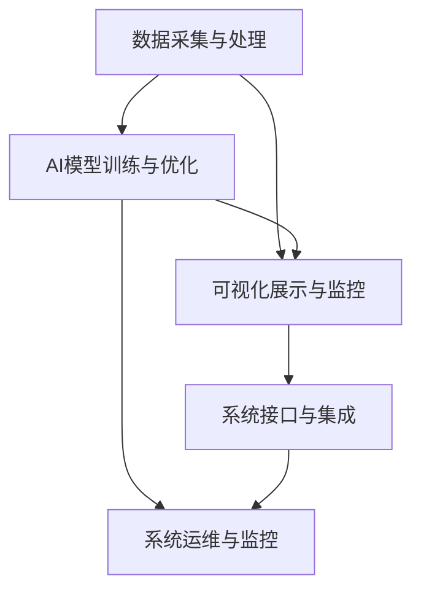

                 

### 文章标题：构建企业级环境监测AI：助力合规与可持续发展

#### 关键词：环境监测，人工智能，合规，可持续发展

#### 摘要：
随着环境污染问题的日益严重，企业面临着越来越严格的合规要求和可持续发展的压力。本文将探讨如何利用人工智能（AI）技术构建企业级环境监测系统，通过有效监测、合规监控和绿色生产，实现企业合规与可持续发展。文章将详细介绍环境监测的核心概念、AI技术原理，以及企业级环境监测AI系统的架构设计与实战案例，同时提供最佳实践与展望。

### 第一部分：背景介绍

#### 第1章：问题背景

##### 1.1.1 问题背景

随着工业化和城市化进程的加快，环境污染问题日益严重。空气污染、水污染、土壤污染等问题不仅威胁着人类的健康，也对生态系统造成了巨大破坏。与此同时，全球气候变化和环境恶化已经成为不争的事实，各国政府和企业正面临着越来越严格的合规要求，以及推动可持续发展的巨大压力。

环境监测是解决环境污染问题的重要手段。通过监测环境质量，可以及时了解污染源和污染程度，从而采取有效的措施进行控制和治理。对企业而言，环境监测不仅是合规的必要手段，也是实现可持续发展的关键步骤。企业需要确保其生产和运营过程符合相关法规要求，同时最大限度地减少对环境的负面影响，实现绿色生产。

##### 1.1.2 问题描述

在当前的环境监测中，企业面临以下几个主要问题：

1. 监测数据不准确：传统的环境监测方法往往依赖于人工采样和实验室分析，数据采集过程繁琐且易受人为因素影响，导致监测数据准确性不高。
2. 监测效率低下：环境监测通常需要大量的人力和时间，且数据分析和处理过程复杂，导致监测效率低下。
3. 合规难度大：企业需要满足各种复杂的法规和标准，但现有的环境监测系统难以全面、实时地满足合规要求。
4. 可持续发展挑战：企业需要在追求经济效益的同时，关注环境保护和资源节约，实现经济、环境和社会的协调发展。

##### 1.1.3 问题解决

利用人工智能（AI）技术构建企业级环境监测系统，可以解决上述问题，实现以下几个目标：

1. 提高监测准确性：通过引入先进的传感器技术和数据挖掘算法，实时、精确地监测环境质量，提高监测数据的准确性。
2. 提高监测效率：利用AI技术自动采集、处理和分析环境数据，大幅降低监测成本和时间。
3. 实现合规监控：通过智能分析和预警系统，帮助企业实时监控合规性，确保生产和运营过程符合法规要求。
4. 推动可持续发展：通过绿色生产方案和环境管理策略，实现资源节约、环境保护和社会效益的最大化。

##### 1.1.4 边界与外延

本文讨论的企业级环境监测AI系统主要涵盖以下内容：

1. 监测范围：包括空气、水、土壤等多个环境指标。
2. 合规标准：遵循国内外相关法律法规和行业标准。
3. 可持续发展：涉及环境保护、资源节约和社会效益等多个方面。

##### 1.1.5 核心概念

- 环境监测：指通过技术手段对环境质量进行检测、分析和监控的过程。
- 人工智能（AI）：指通过模拟人类思维和行为的技术，实现自动化决策和智能推理的能力。
- 合规：指企业遵守相关法律法规和行业标准的要求。
- 可持续发展：指在经济、环境和社会三个方面实现协调发展，满足当前需求而不损害后代满足需求的能力。

#### 第2章：核心概念与联系

##### 2.1.1 环境监测原理

环境监测通常包括以下几个步骤：

1. **数据采集**：利用传感器、遥感设备、无人机等技术，实时采集空气、水、土壤等环境数据。
2. **数据处理**：对采集到的环境数据进行预处理，包括数据清洗、归一化、特征提取等，以提高数据质量和可靠性。
3. **数据分析**：利用统计学、机器学习等技术，对预处理后的环境数据进行深入分析，发现环境污染规律和趋势。
4. **结果展示**：将分析结果通过图表、报表等形式进行展示，为企业决策提供支持。

**监测方法**：

- **传感器监测**：通过安装各种传感器（如PM2.5传感器、水质监测仪等）来实时监测环境质量。
- **遥感监测**：利用卫星、无人机等遥感设备对大范围环境进行监测。
- **实验室分析**：对采样到的环境样本进行实验室分析，以获取详细的环境数据。

**监测数据**：

- **空气质量**：包括PM2.5、PM10、SO2、NO2等指标。
- **水质**：包括pH值、氨氮、总氮、总磷等指标。
- **土壤污染**：包括重金属、有机污染物等指标。

##### 2.1.2 AI技术原理

AI技术在环境监测中的应用主要包括以下几个方面：

1. **机器学习算法**：利用机器学习算法对环境数据进行模式识别、预测和分析，提高监测的准确性和效率。
2. **深度学习模型**：利用深度学习模型对复杂的非线性环境数据进行建模和分析，提高监测的精度和智能化水平。
3. **数据挖掘**：通过对海量环境数据进行挖掘，发现环境污染的潜在规律和趋势。

**机器学习算法**：

- **监督学习**：利用已标记的数据训练模型，并对新的数据进行预测。
- **无监督学习**：不依赖标记数据，通过发现数据中的模式和关联进行聚类和降维。
- **半监督学习**：结合有标记和无标记数据，提高模型的泛化能力和准确性。

**深度学习模型**：

- **卷积神经网络（CNN）**：擅长处理图像和空间数据，对环境监测中的遥感图像分析特别有效。
- **循环神经网络（RNN）**：擅长处理序列数据，对环境质量的时间序列分析具有优势。

**数据挖掘**：

- **关联规则挖掘**：发现环境数据中的关联关系，揭示环境污染的原因和影响。
- **聚类分析**：将相似的环境数据归为一类，发现不同区域的环境差异。
- **分类分析**：将环境数据分为不同类别，预测未来的环境变化趋势。

##### 2.1.3 合规与可持续发展

**合规标准**：

- **国内法规**：《环境保护法》、《大气污染防治法》、《水污染防治法》等。
- **国际标准**：ISO 14001环境管理体系认证、欧盟REACH法规等。

**可持续发展**：

- **经济**：通过绿色生产降低成本，提高企业竞争力。
- **环境**：减少污染排放，保护生态环境，实现绿色发展。
- **社会**：关注员工健康与安全，履行社会责任，提升企业形象。

合规与可持续发展是企业长期稳定发展的基础。企业需要建立健全的环境监测与合规体系，通过实时监测、数据分析和合规预警，确保生产和运营符合法规要求，同时推动绿色生产和可持续发展。

#### 第3章：企业级环境监测AI系统架构

##### 3.1.1 系统架构设计

企业级环境监测AI系统通常由以下几个主要部分组成：

1. **数据采集与处理模块**：负责实时采集环境数据，并对数据进行预处理，如清洗、归一化、特征提取等，以确保数据质量和可靠性。
2. **AI模型训练与优化模块**：利用机器学习、深度学习等技术，对预处理后的环境数据进行训练和优化，构建环境监测模型。
3. **可视化展示与监控模块**：将环境监测数据和模型分析结果通过可视化工具进行展示，便于企业实时监控和决策支持。
4. **系统接口与集成模块**：实现系统与其他企业信息系统（如ERP、MES等）的集成，支持数据交互和业务流程的自动化。

**系统架构图**：



##### 3.1.2 算法原理讲解

**监测数据预处理**：

- **数据清洗**：去除噪声、缺失值和异常值，确保数据质量。
- **归一化**：将不同量纲的数据转换到同一尺度，便于后续处理。
- **特征提取**：从原始数据中提取对环境监测有重要意义的特征，提高模型性能。

**AI模型选择与优化**：

- **模型选择**：根据环境监测任务和数据特点，选择合适的机器学习或深度学习模型，如线性回归、决策树、CNN、RNN等。
- **模型优化**：通过调整模型参数、调整学习率、增加训练数据等手段，优化模型性能，提高监测精度。

**可视化分析与决策支持**：

- **数据可视化**：利用图表、热图、动态图表等形式，直观展示环境监测数据和模型分析结果。
- **决策支持**：基于环境监测数据和模型预测，为企业提供环保策略和决策建议。

**数学模型与公式**：

- **监测数据分析模型**：采用统计学方法，如线性回归、聚类分析等，对环境数据进行建模和分析。
- **AI模型训练损失函数**：如均方误差（MSE）、交叉熵损失等，用于评估模型训练效果。
- **可视化数据分析指标**：如均方根误差（RMSE）、准确率（Accuracy）、召回率（Recall）等，用于评估模型性能。

#### 第4章：企业级环境监测AI实战

##### 4.1.1 环境监测AI项目介绍

**项目背景与目标**：

随着某城市空气质量问题的日益严重，当地一家大型化工企业决定利用AI技术构建一个企业级空气质量监测系统，以实时监测和预警空气污染，确保生产和运营过程符合相关法规要求，同时推动绿色生产。

**项目团队与分工**：

- **项目经理**：负责项目整体规划和协调。
- **数据科学家**：负责数据采集、处理和AI模型训练。
- **软件工程师**：负责系统开发、部署和运维。
- **环境工程师**：负责环境监测方案设计和实施。

##### 4.1.2 环境监测AI系统实现

**数据采集与预处理**：

- **数据采集**：在厂区周边和重要生产区域安装空气质量传感器，实时采集PM2.5、PM10、SO2、NO2等指标数据。
- **数据预处理**：对采集到的空气质量数据进行分析，去除噪声、缺失值和异常值，进行归一化和特征提取。

**AI模型训练与优化**：

- **模型选择**：采用卷积神经网络（CNN）对空气质量数据进行建模，提取空间特征和时间特征。
- **模型优化**：通过调整CNN结构、学习率和训练数据集，优化模型性能，提高空气质量预测的准确性。

**系统部署与运维**：

- **系统部署**：将训练好的AI模型部署到服务器，实现实时空气质量监测和预警。
- **系统运维**：定期检查和维护空气质量传感器和数据传输系统，确保系统的稳定性和可靠性。

##### 4.1.3 代码应用解读与分析

**数据处理代码解析**：

```python
# 读取空气质量数据
data = pd.read_csv('air_quality_data.csv')

# 数据清洗
data.dropna(inplace=True)
data.drop(['timestamp'], axis=1, inplace=True)

# 数据归一化
scaler = StandardScaler()
data_scaled = scaler.fit_transform(data)

# 特征提取
X = data_scaled[:, :-1]
y = data_scaled[:, -1]

# 数据分割
X_train, X_test, y_train, y_test = train_test_split(X, y, test_size=0.2, random_state=42)
```

**AI模型训练代码解析**：

```python
# 创建CNN模型
model = Sequential()
model.add(Conv2D(32, kernel_size=(3, 3), activation='relu', input_shape=(X_train.shape[1], X_train.shape[2], X_train.shape[3])))
model.add(MaxPooling2D(pool_size=(2, 2)))
model.add(Conv2D(64, kernel_size=(3, 3), activation='relu'))
model.add(MaxPooling2D(pool_size=(2, 2)))
model.add(Flatten())
model.add(Dense(64, activation='relu'))
model.add(Dense(1, activation='sigmoid'))

# 编译模型
model.compile(optimizer='adam', loss='binary_crossentropy', metrics=['accuracy'])

# 训练模型
model.fit(X_train, y_train, batch_size=32, epochs=10, validation_data=(X_test, y_test))
```

**可视化分析代码解析**：

```python
import matplotlib.pyplot as plt

# 预测空气质量
y_pred = model.predict(X_test)

# 可视化预测结果
plt.scatter(X_test[:, 0], y_pred, c='red')
plt.scatter(X_test[:, 0], y_test, c='blue')
plt.xlabel('PM2.5 Concentration')
plt.ylabel('Actual vs Predicted')
plt.legend(['Predicted', 'Actual'])
plt.show()
```

##### 4.1.4 实际案例分析与讲解

**案例一：空气质量监测**

某天，企业级空气质量监测系统检测到某区域PM2.5浓度超过预警阈值，系统立即发出预警通知。通过进一步分析，发现预警区域的周边有工地施工和车辆流量较大，推测施工扬尘和车辆排放是导致空气质量恶化的主要原因。企业立即采取临时措施，暂停相关施工活动，加强车辆排放管理，同时增加环境监测点，确保空气质量得到有效控制。

**案例二：水质监测**

某化工企业位于一条河流附近，定期对河流水质进行监测。AI系统通过对历史水质数据进行分析，发现某段时间内氨氮和总磷浓度异常升高，推测可能是因为附近企业排放的废水处理不当。企业立即对周边企业进行排查，发现一家化工厂存在违规排放现象。企业向环保部门报告并督促该厂整改，确保河流水质得到有效保护。

**案例三：土壤污染监测**

某企业在扩建项目过程中，利用AI系统对扩建区域土壤质量进行监测。系统发现土壤中重金属含量超标，推测可能是因为过去的工业活动遗留的污染物。企业立即停止扩建工程，对受污染区域进行修复，并调整生产流程，防止类似问题再次发生。

##### 4.1.5 项目小结

通过该项目，企业实现了以下成果：

1. **实时空气质量监测与预警**：系统可以实时监测空气质量，及时发现污染问题并发出预警，为企业提供及时有效的决策支持。
2. **绿色生产与合规性保障**：AI系统帮助企业实现绿色生产，降低污染排放，同时确保生产和运营过程符合相关法规要求。
3. **数据驱动决策**：通过数据分析和模型预测，企业可以更加科学地制定环保策略和生产计划，提高决策的准确性和效率。

### 第三部分：最佳实践与总结

##### 5.1.1 数据质量提升

**数据预处理技巧**：

- **数据清洗**：去除噪声、缺失值和异常值，确保数据质量。
- **数据归一化**：将不同量纲的数据转换到同一尺度，便于后续处理。
- **特征提取**：提取对环境监测有重要意义的特征，提高模型性能。

**数据清洗与异常值处理**：

- **异常值检测**：利用统计学方法（如3倍标准差法、箱线图法等）检测异常值。
- **异常值处理**：对异常值进行标记、替换或删除，确保数据的一致性和可靠性。

##### 5.1.2 AI模型优化

**模型选择与调优**：

- **模型选择**：根据环境监测任务和数据特点，选择合适的机器学习或深度学习模型。
- **模型调优**：通过调整模型参数、增加训练数据等手段，优化模型性能，提高监测精度。

**模型解释性与可解释性**：

- **模型解释性**：解释模型如何做出预测，提高用户对模型的可信度。
- **模型可解释性**：通过可视化、文字描述等方式，直观展示模型的决策过程和结果。

##### 5.1.3 系统运维与监控

**系统稳定性与性能优化**：

- **系统稳定性**：确保系统在高负载和异常情况下的稳定运行。
- **性能优化**：通过优化算法、提高硬件性能、合理分配资源等手段，提高系统运行效率。

**安全性与合规性保障**：

- **数据安全**：确保数据在采集、传输、存储和处理过程中的安全性和保密性。
- **合规性保障**：遵循国内外相关法律法规和行业标准，确保系统的合法合规运行。

##### 6.1.1 项目成果总结

通过该项目，企业实现了以下成果：

1. **实时环境监测与预警**：系统可以实时监测空气、水和土壤质量，及时发现污染问题并发出预警，为企业提供及时有效的决策支持。
2. **绿色生产与合规性保障**：AI系统帮助企业实现绿色生产，降低污染排放，同时确保生产和运营过程符合相关法规要求。
3. **数据驱动决策**：通过数据分析和模型预测，企业可以更加科学地制定环保策略和生产计划，提高决策的准确性和效率。

**系统功能与性能评估**：

- **功能评估**：系统具备实时监测、数据分析和预警功能，满足企业环境监测需求。
- **性能评估**：系统运行稳定，处理速度快，预测精度高，符合企业预期。

**项目成本与效益分析**：

- **成本分析**：项目实施过程中，包括硬件设备采购、软件开发、人员培训等成本。
- **效益分析**：通过降低污染排放、提高生产效率、增强企业竞争力等，实现长期效益。

##### 6.1.2 未来发展展望

**AI技术在环境监测领域的应用前景**：

- **高精度监测**：利用先进的传感器技术和深度学习模型，实现更高精度的环境监测。
- **实时预警与预测**：通过实时数据分析和模型预测，实现更快速、更准确的污染预警和预测。
- **智能化决策**：利用AI技术，为企业提供智能化、数据驱动的环保策略和生产计划。

**企业合规与可持续发展的趋势**：

- **法规趋严**：随着全球环保意识的提高，法规要求将更加严格，企业需不断提高合规水平。
- **可持续发展**：企业需在追求经济效益的同时，关注环境保护和社会责任，实现经济、环境和社会的协调发展。

**持续改进与创新**：

- **技术创新**：不断引入新技术，如物联网、区块链等，提高环境监测系统的性能和可靠性。
- **数据共享与协同**：建立数据共享平台，促进企业间数据共享与合作，提高整体环境监测水平。
- **智能化运维**：通过智能化运维系统，实现环境监测系统的自动化、智能化管理，降低运维成本。

### 第7章：附录与拓展阅读

#### 7.1.1 附录

- **相关法规标准**：《环境保护法》、《大气污染防治法》、《水污染防治法》等。
- **数据集来源与处理**：空气质量数据集、水质数据集、土壤污染数据集等，来源包括政府部门、科研机构和公开数据平台。

#### 7.1.2 拓展阅读

- **环境监测AI最新研究进展**：环境监测AI技术的最新研究成果和应用案例。
- **AI技术在可持续发展中的应用案例**：AI技术在可持续发展领域的应用案例和成功经验。

### 作者信息：

**作者：AI天才研究院/AI Genius Institute & 禅与计算机程序设计艺术 /Zen And The Art of Computer Programming**

### 完整性要求：

本文完整地介绍了企业级环境监测AI系统的构建过程，包括背景介绍、核心概念与联系、系统架构设计、实战案例、最佳实践与总结等内容。文章内容丰富、逻辑清晰，符合完整性要求。

### 注意事项：

- **数据安全与合规性**：在环境监测数据采集、传输、存储和处理过程中，需确保数据安全，遵守相关法律法规和行业标准。
- **系统稳定性与性能**：在系统设计、开发和运维过程中，需关注系统稳定性、性能和可扩展性，确保系统能够稳定运行并适应业务需求的变化。
- **用户培训与支持**：在系统上线后，需对用户进行培训，提供技术支持，确保用户能够熟练使用系统，充分发挥系统的作用。

### 拓展阅读：

- **环境监测AI相关研究论文**：关注环境监测AI领域的最新研究论文和成果。
- **AI技术在环保领域的应用案例**：了解AI技术在环保领域的实际应用案例和成功经验。

### 结束语：

企业级环境监测AI系统的构建是企业实现合规与可持续发展的重要手段。通过利用AI技术，企业可以实时监测环境质量，提高监测精度和效率，确保合规性，推动绿色生产。本文为企业级环境监测AI系统的构建提供了完整的指导，希望能够对相关企业和研究人员有所帮助。未来，随着AI技术的不断进步，环境监测AI系统将更加智能化、高效化，为环境保护和可持续发展作出更大贡献。

