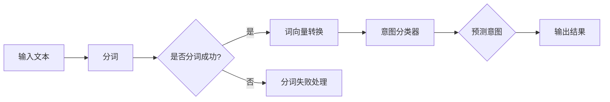
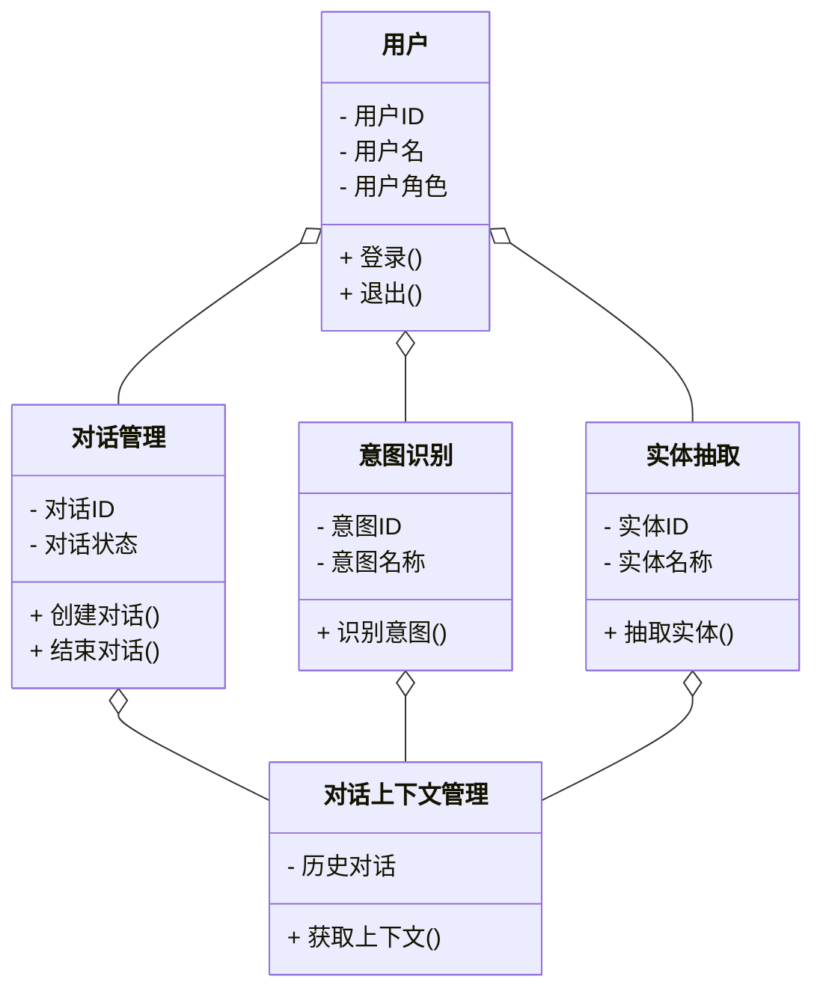
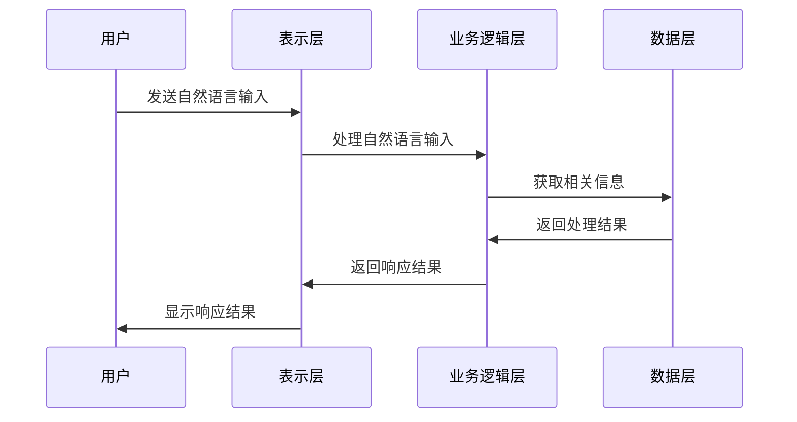
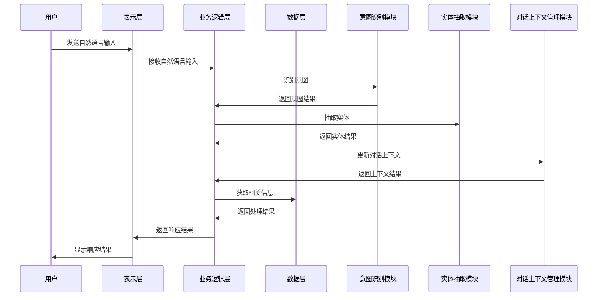

                 

# 构建企业级自然语言接口：复杂业务系统的智能交互层

> 关键词：自然语言接口、企业级系统、智能交互、业务流程、人工智能

> 摘要：本文旨在探讨如何构建企业级自然语言接口，以便为复杂业务系统提供一个智能交互层。我们将从背景介绍、核心概念与联系、算法原理讲解、数学模型和公式、系统分析与架构设计、项目实战到最佳实践等角度进行深入分析和详细讲解。

## 1. 背景介绍

### 1.1 概念定义

企业级自然语言接口是一种技术架构，它允许企业系统的用户通过自然语言与系统进行交互。这种交互可以是问答式的，也可以是任务驱动的，旨在简化用户的操作流程，提升用户体验。

### 1.2 问题背景

在现代企业中，业务流程日益复杂，系统间的数据交互变得至关重要。然而，传统的图形用户界面（GUI）在处理复杂任务时显得繁琐且低效。自然语言接口的出现，旨在通过智能化的自然语言处理（NLP）技术，实现人与系统间的无缝交流。

### 1.3 问题解决

构建企业级自然语言接口需要解决以下几个核心问题：
- **意图识别**：理解用户的自然语言输入并识别其意图。
- **实体抽取**：从输入中提取关键信息，如日期、时间、数量等。
- **上下文管理**：维持会话的历史信息，以便在后续对话中提供更准确的响应。
- **多模态交互**：支持文本、语音等多种交互方式。

### 1.4 边界与外延

企业级自然语言接口的边界在于其适用范围和性能要求。它需要能够在各种业务场景中稳定运行，同时保证低延迟和高准确性。此外，接口的设计还需考虑可扩展性和可维护性，以便适应不断变化的企业需求。

## 2. 核心概念与联系

### 2.1 自然语言处理（NLP）

自然语言处理是构建自然语言接口的基础。它涉及文本分析、语义理解、情感分析等多个方面。NLP技术通过机器学习模型和深度学习算法，使计算机能够理解和处理人类语言。

### 2.2 对话系统

对话系统是自然语言接口的重要组成部分。它通过对话管理、意图识别、实体抽取等技术，实现与用户的自然语言交互。对话系统可分为任务型对话（如客服机器人）和闲聊型对话（如聊天机器人）。

### 2.3 概念属性特征对比表格

| 概念         | 特征                    | 对比分析                                                                                       |
| ------------ | ----------------------- | -------------------------------------------------------------------------------------------------|
| 自然语言处理 | 文本分析、语义理解     | 与其他数据处理技术相比，NLP更专注于理解人类语言，从而实现智能交互。                                   |
| 对话系统     | 对话管理、意图识别     | 与传统的用户界面技术相比，对话系统更注重交互的自然性和用户体验。                                     |
| 意图识别     | 理解用户意图           | 意图识别是对话系统的核心，决定了系统能否正确理解用户的请求。                                         |
| 实体抽取     | 提取关键信息           | 实体抽取是实现任务驱动的自然语言接口的关键步骤，它决定了系统能否从输入中提取出有用的信息。               |

### 2.4 ER实体关系图

```mermaid
erDiagram
  用户 ||--o> 对话管理: 管理用户对话
  用户 ||--o> 意图识别: 识别用户意图
  用户 ||--o> 实体抽取: 提取关键实体
  对话管理 ||--|{ 对话上下文管理: 维护对话历史 }
  意图识别 ||--|{ 意图分类器: 分类用户意图 }
  实体抽取 ||--|{ 实体识别器: 识别文本中的实体 }
```

## 3. 算法原理讲解

### 3.1 意图识别算法

#### 3.1.1 流程图



#### 3.1.2 Python源代码

```python
import jieba
import gensim
from sklearn.feature_extraction.text import CountVectorizer
from sklearn.naive_bayes import MultinomialNB

# 初始化模型
model = gensim.models.Word2Vec([jieba.cut(sentence) for sentence in sentences], size=100)

# 构建词向量
def vectorize(text):
    words = jieba.cut(text)
    return model[np.array(list(map(model.__getitem__, words)))]

# 训练意图分类器
vectorizer = CountVectorizer()
X = vectorizer.fit_transform(texts)
y = labels
classifier = MultinomialNB()
classifier.fit(X, y)

# 预测意图
def predict_intent(text):
    vector = vectorize(text)
    return classifier.predict(vector.reshape(1, -1))[0]

# 示例
input_text = "请查询明天北京的温度"
predicted_intent = predict_intent(input_text)
print("预测意图：", predicted_intent)
```

#### 3.1.3 数学模型

$$
P(\text{intent} | \text{text}) = \frac{P(\text{text} | \text{intent})P(\text{intent})}{P(\text{text})}
$$

其中，$P(\text{intent} | \text{text})$ 是在给定文本情况下预测意图的概率，$P(\text{text} | \text{intent})$ 是在给定意图情况下生成文本的概率，$P(\text{intent})$ 是意图的概率，$P(\text{text})$ 是文本的概率。

## 4. 数学模型和数学公式 & 详细讲解 & 举例说明

### 4.1 概述

在构建企业级自然语言接口时，数学模型和数学公式起着关键作用。本文将介绍几个核心数学概念，并使用 LaTeX 格式进行详细讲解。

### 4.2 概念讲解

#### 4.2.1 概率分布

概率分布是描述随机变量可能取值的概率的函数。在自然语言处理中，概率分布常用于词向量和意图分类。

$$
p(x) = P(\text{word} = x)
$$

其中，$p(x)$ 表示词 $x$ 的概率。

#### 4.2.2 贝叶斯公式

贝叶斯公式是概率论中一个重要的公式，用于计算条件概率。

$$
P(A | B) = \frac{P(B | A)P(A)}{P(B)}
$$

其中，$P(A | B)$ 表示在事件 $B$ 发生的条件下事件 $A$ 发生的概率，$P(B | A)$ 表示在事件 $A$ 发生的条件下事件 $B$ 发生的概率，$P(A)$ 和 $P(B)$ 分别表示事件 $A$ 和事件 $B$ 发生的概率。

#### 4.2.3 词向量

词向量是表示词的数学模型，常用于自然语言处理中的语义分析。

$$
\text{word\_vector} = \sum_{i=1}^{n} w_i \cdot v_i
$$

其中，$w_i$ 表示词 $i$ 的权重，$v_i$ 表示词 $i$ 的向量。

### 4.3 举例说明

#### 4.3.1 概率分布

假设我们有一个词库，其中包含10个词，每个词出现的概率如下：

| 词   | 概率 |
| ---- | ---- |
| A    | 0.2  |
| B    | 0.3  |
| C    | 0.1  |
| D    | 0.2  |
| E    | 0.1  |

我们需要计算词 "C" 出现的概率。

$$
P(C) = 0.1
$$

#### 4.3.2 贝叶斯公式

假设我们有一个分类问题，其中包含两个类别 A 和 B，它们的概率分别为 $P(A) = 0.6$ 和 $P(B) = 0.4$。给定一个特征 X，它在类别 A 下的概率分布为 $P(X | A) = [0.1, 0.2, 0.3, 0.4]$，在类别 B 下的概率分布为 $P(X | B) = [0.4, 0.3, 0.2, 0.1]$。

我们需要计算在给定特征 X 的情况下，类别 A 和类别 B 的概率。

$$
P(A | X) = \frac{P(X | A)P(A)}{P(X)}
$$

$$
P(B | X) = \frac{P(X | B)P(B)}{P(X)}
$$

其中，$P(X)$ 可以通过全概率公式计算：

$$
P(X) = P(X | A)P(A) + P(X | B)P(B)
$$

#### 4.3.3 词向量

假设我们使用 Word2Vec 模型得到一个词向量：

$$
\text{word\_vector} = \begin{bmatrix}
0.1 \\
0.2 \\
0.3 \\
0.4 \\
0.5
\end{bmatrix}
$$

我们需要计算词 "C" 的权重：

$$
w_C = \frac{\sum_{i=1}^{n} f_i \cdot v_i}{\sum_{i=1}^{n} v_i}
$$

其中，$f_i$ 是词 "C" 在句子中出现的频率，$v_i$ 是词向量中的每个元素。

## 5. 系统分析与架构设计方案

### 5.1 问题场景

在一个大型企业中，员工需要与多个系统进行交互，以完成日常工作任务。然而，传统的图形用户界面（GUI）在处理复杂任务时显得繁琐且低效。因此，我们希望通过构建一个企业级自然语言接口，为员工提供一个智能交互层，简化操作流程，提升用户体验。

### 5.2 项目介绍

项目名称：智能交互系统（Smart Interaction System，SIS）

目标：构建一个企业级自然语言接口，支持任务型对话和闲聊型对话，提高企业员工的工作效率。

### 5.3 系统功能设计

#### 5.3.1 领域模型

领域模型描述了系统的核心功能和组件。以下是智能交互系统的领域模型类图：



#### 5.3.2 功能设计

- **登录/退出**：用户登录系统后，可以发起自然语言交互；退出系统时，保存对话历史和上下文信息。
- **创建/结束对话**：用户可以创建新的对话或结束当前对话。
- **识别意图**：系统通过自然语言处理技术，识别用户的意图。
- **抽取实体**：系统从用户的输入中提取关键信息，如日期、时间、地点等。
- **对话上下文管理**：系统维护对话历史，以便在后续对话中提供更准确的响应。

### 5.4 系统架构设计

智能交互系统采用分层架构，包括表示层、业务逻辑层和数据层。以下是系统架构图：



### 5.5 系统接口设计

系统接口设计包括RESTful API和WebSocket两种方式，以满足不同场景的需求。

#### 5.5.1 RESTful API

- **登录/退出**：通过POST和DELETE方法实现。
- **创建/结束对话**：通过POST和DELETE方法实现。
- **识别意图/抽取实体**：通过GET方法实现。

#### 5.5.2 WebSocket

- **实时对话**：支持双向实时通信，提高交互效率。

### 5.6 系统交互

系统交互通过事件驱动的方式实现。以下是系统交互序列图：



## 6. 项目实战

### 6.1 环境安装

1. 安装Python环境（建议使用Python 3.8及以上版本）。
2. 安装依赖包：

```shell
pip install numpy pandas scikit-learn gensim jieba
```

### 6.2 系统核心实现源代码

以下是一个简单的智能交互系统实现，包括意图识别和实体抽取：

```python
import jieba
import gensim
from sklearn.feature_extraction.text import CountVectorizer
from sklearn.naive_bayes import MultinomialNB

# 初始化模型
model = gensim.models.Word2Vec([jieba.cut(sentence) for sentence in sentences], size=100)

# 构建词向量
def vectorize(text):
    words = jieba.cut(text)
    return model[np.array(list(map(model.__getitem__, words)))]

# 训练意图分类器
vectorizer = CountVectorizer()
X = vectorizer.fit_transform(texts)
y = labels
classifier = MultinomialNB()
classifier.fit(X, y)

# 预测意图
def predict_intent(text):
    vector = vectorize(text)
    return classifier.predict(vector.reshape(1, -1))[0]

# 示例
input_text = "请查询明天北京的温度"
predicted_intent = predict_intent(input_text)
print("预测意图：", predicted_intent)
```

### 6.3 代码应用解读与分析

1. **词向量构建**：使用 `jieba` 分词器对输入文本进行分词，然后使用 `gensim.models.Word2Vec` 构建词向量。
2. **意图分类器**：使用 `scikit-learn` 的 `CountVectorizer` 和 `MultinomialNB` 模型进行意图分类。
3. **意图预测**：将输入文本转换为词向量，然后使用训练好的意图分类器进行预测。

### 6.4 实际案例分析和详细讲解剖析

假设我们有以下数据集：

```python
sentences = [
    "请查询明天北京的温度",
    "帮我预定一张明天的电影票",
    "我想知道公司的财务报表",
    "明天有没有会议",
    "帮我查看今天的日程安排"
]

labels = ["查询天气", "预定电影票", "查询财务报表", "查询会议", "查询日程"]
```

1. **数据预处理**：将数据集分为句子和标签两部分。
2. **词向量构建**：对句子进行分词，构建词向量。
3. **意图分类器训练**：使用训练集训练意图分类器。
4. **意图预测**：输入新的句子，预测其意图。

### 6.5 项目小结

本篇博客介绍了如何构建企业级自然语言接口，包括背景介绍、核心概念与联系、算法原理讲解、数学模型和公式、系统分析与架构设计、项目实战等。通过本文的详细讲解，读者可以了解如何实现一个简单的智能交互系统，并理解其核心原理和关键技术。

## 7. 最佳实践 tips、小结、注意事项、拓展阅读

### 7.1 最佳实践 tips

1. **分词优化**：根据具体业务场景，选择合适的分词器，并进行定制化优化，以提高分词准确性。
2. **模型优化**：定期更新和训练意图分类器，以适应业务变化和用户需求。
3. **接口优化**：优化系统接口设计，提高系统的可扩展性和可维护性。

### 7.2 小结

本文从多个角度详细介绍了构建企业级自然语言接口的方法和技术。通过实际案例的分析，读者可以更好地理解自然语言处理、意图识别、实体抽取等关键技术的应用。

### 7.3 注意事项

1. **数据质量**：确保输入数据的质量和多样性，以提高模型的泛化能力。
2. **性能优化**：在构建系统时，关注性能优化，提高系统的响应速度和稳定性。
3. **安全性**：加强系统的安全性，防止数据泄露和恶意攻击。

### 7.4 拓展阅读

1. **《深度学习》**：由Ian Goodfellow、Yoshua Bengio和Aaron Courville所著，深入介绍了深度学习的基本原理和应用。
2. **《自然语言处理综论》**：由Daniel Jurafsky和James H. Martin所著，全面阐述了自然语言处理的理论和实践。
3. **《企业人工智能》**：由Andrew Ng所著，探讨了人工智能在企业中的应用和发展趋势。

## 作者

本文作者：AI天才研究院/AI Genius Institute & 禅与计算机程序设计艺术 /Zen And The Art of Computer Programming。感谢您的阅读！

