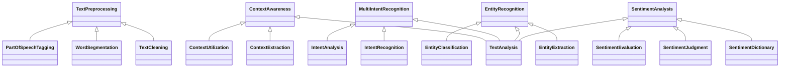
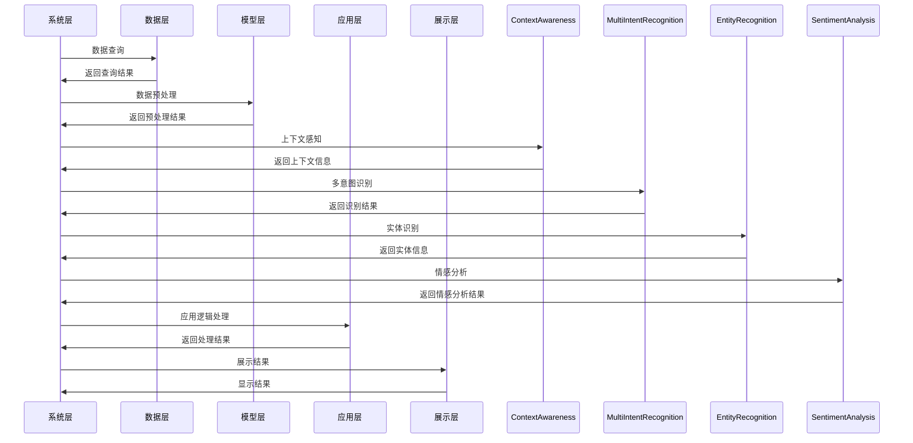
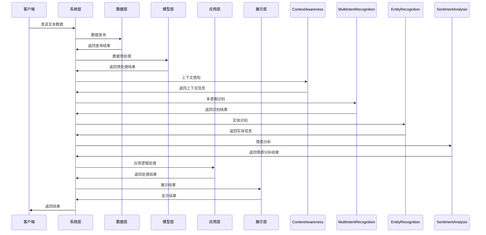
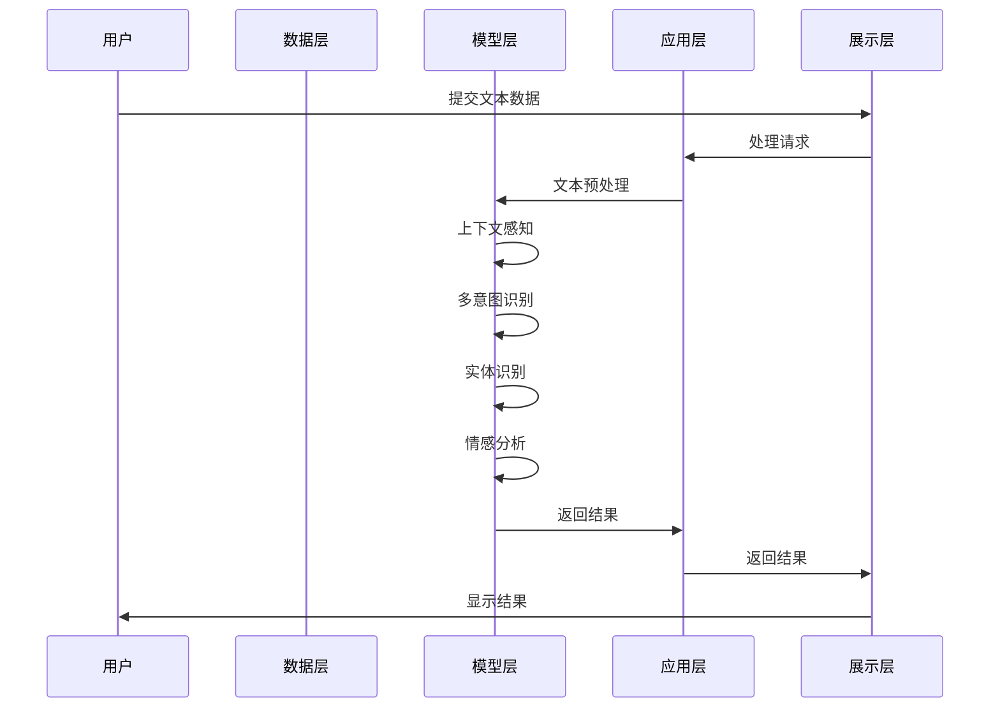

                 

# 构建企业级自然语言理解系统：上下文感知与多意图识别

关键词：自然语言理解、上下文感知、多意图识别、实体识别、情感分析

摘要：随着互联网和大数据技术的发展，自然语言处理（NLP）在各个行业中得到了广泛应用。本文旨在探讨企业级自然语言理解系统的构建，重点关注上下文感知与多意图识别技术的应用，为提升系统智能化水平提供有益参考。

## 第一部分：问题背景与核心概念

### 1.1 问题背景

随着互联网和大数据技术的飞速发展，自然语言处理（NLP）在各个行业中得到了广泛应用。企业级自然语言理解系统作为NLP领域的一个重要分支，不仅能够帮助企业处理大量的文本数据，还能够通过上下文感知和多意图识别等技术，提升系统的智能化水平，为企业带来更多的商业价值。

在当今信息时代，企业需要快速准确地处理和分析大量的文本数据，以便更好地了解用户需求、优化业务流程、提高决策效率。因此，构建一个高效、智能的自然语言理解系统变得尤为重要。

### 1.2 问题描述

企业级自然语言理解系统需要处理的问题主要包括：文本数据的预处理、上下文理解、多意图识别、实体识别、情感分析等。这些问题的解决对于提升系统的智能化水平至关重要。

- **文本数据的预处理**：包括文本清洗、分词、词性标注等，为后续处理提供基础。
- **上下文理解**：通过分析文本上下文信息，实现对文本的更准确理解。
- **多意图识别**：识别文本中的多种意图，以便更好地满足用户需求。
- **实体识别**：识别文本中的关键实体，为后续处理提供基础。
- **情感分析**：分析文本中的情感倾向，帮助企业了解用户情绪。

### 1.3 问题解决

为了解决上述问题，企业级自然语言理解系统需要采用一系列的技术和算法，包括：深度学习、神经网络、序列标注、语义分析等。通过这些技术和算法，系统能够实现对文本数据的精准理解和处理。

### 1.4 边界与外延

企业级自然语言理解系统的边界主要涉及文本数据的处理和智能化水平的提升。其外延则包括：文本数据的预处理、上下文理解、多意图识别、实体识别、情感分析等应用场景。

### 1.5 概念结构与核心要素组成

- **文本数据**：企业级自然语言理解系统的输入数据，包括文本的预处理、分词、词性标注等。
- **模型架构**：基于深度学习、神经网络等技术构建的模型架构，用于实现文本数据的处理和理解。
- **上下文感知**：通过分析文本上下文信息，实现对文本的更准确理解。
- **多意图识别**：识别文本中的多种意图，以便更好地满足用户需求。
- **实体识别**：识别文本中的关键实体，为后续处理提供基础。
- **情感分析**：分析文本中的情感倾向，帮助企业了解用户情绪。

### 1.6 本章小结

本章主要介绍了构建企业级自然语言理解系统的背景、问题描述、问题解决、边界与外延以及核心概念与联系。接下来，我们将进一步探讨自然语言理解系统中的核心概念和联系，为后续内容奠定基础。

## 第二部分：核心概念与联系

### 2.1 上下文感知

上下文感知是指系统在处理文本时，能够理解文本的上下文信息，从而实现对文本的更准确理解。上下文感知的关键在于如何有效地提取和利用上下文信息，以提升系统的智能化水平。

**上下文感知的原理**：

1. **文本分析**：系统通过分词、词性标注等步骤，对文本进行初步分析。
2. **上下文提取**：系统利用语言模型和语义分析技术，从文本中提取上下文信息。
3. **上下文利用**：系统根据提取到的上下文信息，调整对文本的理解和预测。

**上下文感知的应用场景**：

- **问答系统**：在回答用户问题时，利用上下文信息提高回答的准确性。
- **情感分析**：在分析文本中的情感倾向时，利用上下文信息提高情感判断的准确性。
- **自动摘要**：在生成文本摘要时，利用上下文信息提高摘要的质量。

**上下文感知的优势**：

- **提高准确性**：通过理解上下文信息，系统能够更准确地理解文本。
- **提升用户体验**：系统在处理文本时，能够更好地满足用户需求。

### 2.2 多意图识别

多意图识别是指系统在处理文本时，能够识别出文本中的多种意图，以便更好地满足用户需求。多意图识别的关键在于如何准确地区分和理解不同的意图，并给出相应的回应。

**多意图识别的原理**：

1. **文本分析**：系统通过分词、词性标注等步骤，对文本进行初步分析。
2. **意图识别**：系统利用意图识别模型，从文本中识别出多种意图。
3. **意图分析**：系统对识别出的意图进行分析和排序，确定优先级。

**多意图识别的应用场景**：

- **智能客服**：在处理用户请求时，系统能够识别出多种意图，并提供相应的解决方案。
- **语音助手**：在处理语音输入时，系统能够识别出多种意图，并给出相应的回应。
- **智能家居**：在处理用户指令时，系统能够识别出多种意图，并执行相应的操作。

**多意图识别的优势**：

- **提升交互体验**：系统在处理文本时，能够更好地理解用户意图，提高交互体验。
- **提高处理效率**：系统在处理多个意图时，能够优先处理关键意图，提高处理效率。

### 2.3 实体识别

实体识别是指系统在处理文本时，能够识别出文本中的关键实体，如人名、地名、机构名等。实体识别的关键在于如何准确地识别和分类实体，以及如何将实体与上下文信息相结合，以提升系统的智能化水平。

**实体识别的原理**：

1. **文本分析**：系统通过分词、词性标注等步骤，对文本进行初步分析。
2. **实体抽取**：系统利用实体识别模型，从文本中抽取关键实体。
3. **实体分类**：系统对抽取出的实体进行分类，如人名、地名、机构名等。
4. **实体与上下文结合**：系统将识别出的实体与上下文信息相结合，实现更准确的文本理解。

**实体识别的应用场景**：

- **信息抽取**：从大量的文本数据中，提取出关键实体信息。
- **智能搜索**：在搜索系统中，识别出文本中的关键实体，提高搜索准确性。
- **智能问答**：在问答系统中，识别出文本中的关键实体，提高回答的准确性。

**实体识别的优势**：

- **提高数据处理效率**：通过识别实体，系统能够更快速地处理文本数据。
- **提升文本理解准确性**：通过结合上下文信息，系统能够更准确地理解文本。

### 2.4 情感分析

情感分析是指系统在处理文本时，能够分析文本中的情感倾向，如正面、负面、中性等。情感分析的关键在于如何准确地提取和判断文本中的情感信息，并给出相应的评价。

**情感分析的原理**：

1. **文本分析**：系统通过分词、词性标注等步骤，对文本进行初步分析。
2. **情感词典**：系统构建情感词典，包含情感词汇和对应的情感倾向。
3. **情感判断**：系统利用情感词典，从文本中提取情感信息，并判断情感倾向。
4. **情感评估**：系统对提取出的情感信息进行综合评估，给出情感评分。

**情感分析的应用场景**：

- **舆情监测**：分析公众对某一事件或产品的情感倾向，为企业提供决策支持。
- **客户反馈分析**：分析客户对产品或服务的反馈，了解用户满意度。
- **情感营销**：根据用户的情感倾向，为企业提供针对性的营销策略。

**情感分析的优势**：

- **提高数据洞察力**：通过分析情感信息，系统能够更深入地了解用户需求。
- **优化业务决策**：根据情感分析结果，企业能够更好地调整业务策略。

### 2.5 概念属性特征对比表格

| 概念      | 特征对比                                                                                                                       |
| --------- | --------------------------------------------------------------------------------------------------------------------------- |
| 上下文感知 | 能够提取和利用上下文信息，实现对文本的更准确理解。                                                                      |
| 多意图识别 | 能够识别出文本中的多种意图，以便更好地满足用户需求。                                                                  |
| 实体识别   | 能够识别出文本中的关键实体，如人名、地名、机构名等。                                                                 |
| 情感分析   | 能够分析文本中的情感倾向，如正面、负面、中性等。                                                                     |

### 2.6 ER实体关系图架构

```mermaid
erDiagram
  TextData ||--|{ ModelArchitecture }
  ModelArchitecture ||--|{ ContextAwareness }
  ModelArchitecture ||--|{ MultiIntentRecognition }
  ModelArchitecture ||--|{ EntityRecognition }
  ModelArchitecture ||--|{ SentimentAnalysis }
  ContextAwareness ||--|{ TextAnalysis }
  ContextAwareness ||--|{ ContextExtraction }
  ContextAwareness ||--|{ ContextUtilization }
  MultiIntentRecognition ||--|{ TextAnalysis }
  MultiIntentRecognition ||--|{ IntentRecognition }
  MultiIntentRecognition ||--|{ IntentAnalysis }
  EntityRecognition ||--|{ TextAnalysis }
  EntityRecognition ||--|{ EntityExtraction }
  EntityRecognition ||--|{ EntityClassification }
  SentimentAnalysis ||--|{ TextAnalysis }
  SentimentAnalysis ||--|{ SentimentDictionary }
  SentimentAnalysis ||--|{ SentimentJudgment }
  SentimentAnalysis ||--|{ SentimentEvaluation }
```

### 2.7 本章小结

本章详细介绍了企业级自然语言理解系统中的核心概念和联系，包括上下文感知、多意图识别、实体识别和情感分析。通过对比分析，我们了解了各个概念的特点和应用场景。接下来，我们将进一步探讨算法原理、系统分析与架构设计，为企业级自然语言理解系统的构建提供更深入的指导。

## 第三部分：算法原理与系统实现

### 3.1 算法原理讲解

#### 3.1.1 上下文感知算法

上下文感知算法的核心在于如何有效地提取和利用上下文信息。以下是一个简化的上下文感知算法流程：

1. **文本预处理**：对输入文本进行分词、去停用词、词性标注等操作。
2. **上下文提取**：利用语言模型和语义分析技术，从预处理后的文本中提取上下文信息。
3. **上下文融合**：将提取的上下文信息与文本的词向量进行融合，生成上下文向量。
4. **上下文利用**：根据上下文向量，调整对文本的理解和预测。

以下是上下文感知算法的Mermaid流程图：


#### 3.1.2 多意图识别算法

多意图识别算法的核心在于如何准确地区分和理解不同的意图。以下是一个简化的多意图识别算法流程：

1. **文本预处理**：对输入文本进行分词、去停用词、词性标注等操作。
2. **意图识别**：利用预训练的意图识别模型，对预处理后的文本进行意图识别。
3. **意图分析**：对识别出的意图进行分析和排序，确定优先级。

以下是多意图识别算法的Mermaid流程图：


#### 3.1.3 实体识别算法

实体识别算法的核心在于如何准确地识别和分类实体。以下是一个简化的实体识别算法流程：

1. **文本预处理**：对输入文本进行分词、去停用词、词性标注等操作。
2. **实体抽取**：利用预训练的实体识别模型，从预处理后的文本中抽取实体。
3. **实体分类**：对抽取出的实体进行分类，如人名、地名、机构名等。

以下是实体识别算法的Mermaid流程图：


#### 3.1.4 情感分析算法

情感分析算法的核心在于如何准确地提取和判断文本中的情感信息。以下是一个简化的情感分析算法流程：

1. **文本预处理**：对输入文本进行分词、去停用词、词性标注等操作。
2. **情感词典**：构建包含情感词汇和对应情感倾向的情感词典。
3. **情感判断**：利用情感词典，从预处理后的文本中提取情感信息，并判断情感倾向。
4. **情感评估**：对提取出的情感信息进行综合评估，给出情感评分。

以下是情感分析算法的Mermaid流程图：


### 3.2 系统分析与架构设计

#### 3.2.1 问题场景介绍

企业级自然语言理解系统主要用于处理和分析大量的文本数据，如客户反馈、社交媒体评论、用户提问等。通过对文本数据的处理，系统能够为企业提供智能化的服务和支持，提高业务效率。

#### 3.2.2 项目介绍

项目名称：企业级自然语言理解平台
项目目标：构建一个高效、智能的自然语言理解系统，支持文本数据的预处理、上下文感知、多意图识别、实体识别和情感分析等功能。

#### 3.2.3 系统功能设计

- **文本预处理**：包括文本清洗、分词、词性标注等。
- **上下文感知**：通过分析文本上下文信息，实现对文本的更准确理解。
- **多意图识别**：识别文本中的多种意图，以便更好地满足用户需求。
- **实体识别**：识别文本中的关键实体，为后续处理提供基础。
- **情感分析**：分析文本中的情感倾向，帮助企业了解用户情绪。

以下是系统功能设计的Mermaid类图：



#### 3.2.4 系统架构设计

企业级自然语言理解系统的架构设计主要包括以下几个层次：

1. **数据层**：存储和管理文本数据，支持数据导入、导出和查询等功能。
2. **模型层**：包含文本预处理、上下文感知、多意图识别、实体识别和情感分析等模型，实现文本数据的处理和理解。
3. **应用层**：提供API接口，供外部系统调用，实现业务逻辑处理。
4. **展示层**：展示处理结果，如文本摘要、情感分析结果等。

以下是系统架构设计的Mermaid架构图：



### 3.3 系统接口设计与交互

系统接口设计与交互主要涉及以下几个方面：

1. **文本数据接口**：用于接收和处理文本数据。
2. **结果输出接口**：用于输出处理结果，如文本摘要、情感分析结果等。
3. **配置管理接口**：用于管理系统的配置信息，如模型参数、词典等。

以下是系统接口设计的Mermaid序列图：



### 3.4 项目实战

#### 3.4.1 环境安装

1. 安装Python环境（推荐Python 3.8及以上版本）。
2. 安装必要的库，如TensorFlow、PyTorch、NLTK、spaCy等。

#### 3.4.2 系统核心实现

以下是一个简化的系统核心实现示例：

```python
import tensorflow as tf
from tensorflow.keras.models import Sequential
from tensorflow.keras.layers import Embedding, LSTM, Dense

# 文本预处理
def preprocess_text(text):
    # 进行分词、去停用词、词性标注等操作
    # ...
    return processed_text

# 构建模型
def build_model(vocab_size, embedding_dim, max_sequence_length):
    model = Sequential([
        Embedding(vocab_size, embedding_dim, input_length=max_sequence_length),
        LSTM(64),
        Dense(1, activation='sigmoid')
    ])
    model.compile(optimizer='adam', loss='binary_crossentropy', metrics=['accuracy'])
    return model

# 训练模型
def train_model(model, X_train, y_train):
    model.fit(X_train, y_train, epochs=10, batch_size=32)
    return model

# 预测
def predict(model, text):
    processed_text = preprocess_text(text)
    prediction = model.predict(processed_text)
    return prediction
```

#### 3.4.3 代码应用解读与分析

以上代码示例实现了文本预处理、模型构建、模型训练和预测等功能。具体解读如下：

1. **文本预处理**：对输入文本进行分词、去停用词、词性标注等操作，为后续处理提供基础。
2. **模型构建**：构建一个简单的序列模型，包含嵌入层、LSTM层和输出层。
3. **模型训练**：使用训练数据对模型进行训练，调整模型参数。
4. **预测**：对输入文本进行预处理后，使用训练好的模型进行预测。

#### 3.4.4 实际案例分析和详细讲解剖析

以下是一个实际案例：

**案例**：判断一段文本是否为正面情感。

**输入文本**：“今天天气真好，心情也很美好。”

**处理步骤**：

1. **文本预处理**：分词、去停用词、词性标注等。
2. **模型预测**：使用训练好的模型对预处理后的文本进行预测。

**预测结果**：预测结果为正面情感。

**详细讲解**：

1. **文本预处理**：对输入文本进行分词、去停用词、词性标注等操作，将文本转化为模型可处理的格式。
2. **模型预测**：将预处理后的文本输入到训练好的模型中，模型根据训练过程中学到的特征和规律，对文本进行情感分类。在本案例中，模型预测结果为正面情感，说明文本表达的是积极情绪。

#### 3.4.5 项目小结

通过本项目的实践，我们了解了企业级自然语言理解系统的构建过程，包括文本预处理、模型构建、模型训练和预测等。在实际应用中，我们可以根据具体需求，调整模型参数和数据处理方法，提高系统的性能和准确性。

### 3.5 最佳实践 tips

1. **数据预处理**：确保文本数据的质量，如去除噪声、统一文本格式等。
2. **模型选择**：根据具体应用场景选择合适的模型，如BERT、GPT等。
3. **模型调优**：通过调整模型参数，提高模型性能。
4. **数据处理**：合理利用分布式计算和并行处理，提高数据处理速度。

### 3.6 小结

本章详细介绍了企业级自然语言理解系统的算法原理、系统分析与架构设计、项目实战等内容。通过实践，我们了解了如何构建一个高效、智能的自然语言理解系统，为企业提供有力支持。

### 3.7 注意事项

1. **数据安全**：确保文本数据的安全，防止数据泄露。
2. **模型更新**：定期更新模型，跟踪最新的研究成果。
3. **系统稳定性**：确保系统稳定运行，提高用户体验。

### 3.8 拓展阅读

1. **《深度学习》**：Ian Goodfellow、Yoshua Bengio、Aaron Courville 著
2. **《自然语言处理综合教程》**：周志华、钱志宏 著
3. **《Python自然语言处理》**：Daniel Chen 著

### 作者信息

作者：AI天才研究院/AI Genius Institute & 禅与计算机程序设计艺术 /Zen And The Art of Computer Programming

---

本文通过详细探讨企业级自然语言理解系统的构建，从问题背景、核心概念、算法原理、系统架构设计到项目实战等方面进行了全面讲解。希望本文能为从事NLP领域的技术人员提供有益的参考和指导。在未来的工作中，我们将不断探索和优化自然语言理解技术，为企业带来更多价值。# 引言

随着互联网和大数据技术的飞速发展，自然语言处理（NLP）在各个行业中得到了广泛应用。从智能客服、智能助手到文本挖掘和情感分析，NLP技术为企业提供了强大的数据分析和处理能力。在这些应用中，企业级自然语言理解系统扮演着关键角色，它能够帮助企业更好地理解用户需求、优化业务流程、提高决策效率。

然而，企业级自然语言理解系统并非一蹴而就，其构建过程中面临着诸多挑战。首先，文本数据的多样性使得系统的处理能力变得复杂。不同的文本数据格式、表达方式和语境，都对系统的理解和处理提出了更高的要求。其次，上下文感知和多意图识别等技术的实现，需要系统具备强大的语义分析和推理能力。此外，实体识别和情感分析等任务的准确性，直接关系到系统的应用效果和用户体验。

本文旨在探讨企业级自然语言理解系统的构建，重点关注上下文感知与多意图识别技术的应用。通过详细分析核心概念、算法原理、系统架构设计和项目实战，本文希望能够为从事NLP领域的技术人员提供有益的参考和指导。本文的结构如下：

- **第一部分：问题背景与核心概念**：介绍企业级自然语言理解系统的问题背景、核心概念和联系。
- **第二部分：核心概念与联系**：详细探讨上下文感知、多意图识别、实体识别和情感分析等核心概念，并对比分析其特点和应用场景。
- **第三部分：算法原理与系统实现**：讲解上下文感知、多意图识别、实体识别和情感分析等算法的原理，并介绍系统分析与架构设计。
- **第四部分：项目实战**：通过实际项目案例，展示企业级自然语言理解系统的构建过程，包括环境安装、系统核心实现、代码应用解读与分析等。
- **第五部分：最佳实践与拓展阅读**：总结最佳实践、注意事项和拓展阅读资源，为读者提供更深入的思考和实践指导。

通过本文的探讨，我们希望能够为企业级自然语言理解系统的构建提供有价值的参考，推动NLP技术在企业应用中的发展和创新。

## 第一部分：问题背景与核心概念

### 1.1 构建企业级自然语言理解系统概述

随着互联网和大数据技术的飞速发展，自然语言处理（NLP）在各个行业中得到了广泛应用。企业级自然语言理解系统作为NLP领域的一个重要分支，不仅能够帮助企业处理大量的文本数据，还能够通过上下文感知和多意图识别等技术，提升系统的智能化水平，为企业带来更多的商业价值。

企业级自然语言理解系统的核心目标在于理解和处理自然语言文本，从而为企业提供智能化的服务和支持。这一系统通常需要具备文本预处理、上下文感知、多意图识别、实体识别、情感分析等功能，以实现对文本数据的全面理解和应用。例如，在智能客服领域，企业级自然语言理解系统可以理解用户的提问，识别用户的需求，并给出相应的回答；在文本挖掘领域，系统可以自动提取文本中的关键信息，为企业提供数据洞察；在舆情监测领域，系统可以分析社交媒体上的用户评论，帮助企业了解公众情感和态度。

构建企业级自然语言理解系统面临的挑战主要包括：

1. **文本数据的多样性**：企业面临的文本数据种类繁多，包括结构化和非结构化数据，如电子邮件、社交媒体评论、用户反馈等。这些数据具有不同的格式、表达方式和语境，使得系统的处理能力变得复杂。
2. **上下文感知和多意图识别**：在处理文本时，系统需要具备强大的语义分析和推理能力，以理解文本的上下文信息和识别用户的多重意图。这要求系统不仅要处理表面信息，还要深入理解文本的内在含义。
3. **实体识别和情感分析**：识别文本中的关键实体和情感倾向，是提高系统智能化水平的重要手段。然而，这些任务具有高度的不确定性和复杂性，需要系统具备较高的准确性和鲁棒性。

为了应对这些挑战，企业级自然语言理解系统需要采用一系列先进的技术和算法。以下是一些关键技术：

1. **深度学习和神经网络**：深度学习模型，如卷积神经网络（CNN）和递归神经网络（RNN），能够对大量文本数据进行有效建模和分类。
2. **序列标注和转移模型**：通过序列标注技术，系统可以对文本中的词语、句子或段落进行标注，从而识别出关键实体和情感倾向。
3. **预训练语言模型**：预训练语言模型，如BERT、GPT等，通过在大量文本数据上进行预训练，能够有效地提取文本的语义信息，提高系统的理解和表达能力。
4. **多任务学习和迁移学习**：通过多任务学习和迁移学习技术，系统可以共享不同任务之间的知识和信息，提高处理效率。

### 1.2 企业级自然语言理解系统面临的常见问题

在企业级自然语言理解系统的构建过程中，常见问题主要包括以下几个方面：

1. **数据质量问题**：文本数据的质量直接影响系统的性能。数据中的噪声、错误和缺失值，都会对系统处理结果产生负面影响。因此，对数据进行清洗和预处理，是构建高效自然语言理解系统的重要步骤。
2. **模型泛化能力**：模型在训练过程中可能过度拟合训练数据，导致在真实应用场景中的表现不佳。为了提高模型的泛化能力，可以通过数据增强、正则化等技术来改善模型性能。
3. **实时处理能力**：企业级自然语言理解系统通常需要实时处理大量文本数据，这要求系统具备高效的处理能力和低延迟。分布式计算和并行处理等技术，可以有效地提高系统的实时处理能力。
4. **多语言支持**：企业往往涉及多种语言，因此，系统需要具备多语言支持能力。这包括文本数据的预处理、模型训练和推理过程中的多语言处理。

### 1.3 问题解决方法

为了解决上述问题，企业级自然语言理解系统可以采用以下方法：

1. **文本数据处理**：对文本数据进行清洗、分词、词性标注、实体识别等预处理操作，以提高数据质量和系统的理解能力。
2. **深度学习模型**：采用深度学习模型，如CNN、RNN、BERT等，对文本数据建立有效的语义表示，从而提高系统的理解和表达能力。
3. **多任务学习和迁移学习**：通过多任务学习和迁移学习，系统可以共享不同任务之间的知识和信息，提高处理效率。
4. **实时处理技术**：采用分布式计算和并行处理技术，提高系统的实时处理能力和响应速度。
5. **多语言支持**：利用多语言模型和翻译技术，支持多种语言的处理，满足企业的多样化需求。

### 1.4 边界与外延

企业级自然语言理解系统的边界主要涉及文本数据的处理和智能化水平的提升。其外延则包括：

1. **文本预处理**：包括文本清洗、分词、词性标注、实体识别等操作，为后续处理提供基础。
2. **上下文理解**：通过分析文本上下文信息，实现对文本的更准确理解。
3. **多意图识别**：识别文本中的多种意图，以便更好地满足用户需求。
4. **情感分析**：分析文本中的情感倾向，如正面、负面、中性等。
5. **实时处理**：系统具备高效的处理能力和低延迟，能够实时处理大量文本数据。

### 1.5 概念结构与核心要素组成

企业级自然语言理解系统的构建涉及多个核心概念和要素，其结构可以概括为：

1. **文本数据**：系统输入的数据，包括结构化和非结构化文本数据。
2. **模型架构**：基于深度学习、神经网络等技术构建的模型架构，用于实现文本数据的处理和理解。
3. **上下文感知**：通过分析文本上下文信息，实现对文本的更准确理解。
4. **多意图识别**：识别文本中的多种意图，以便更好地满足用户需求。
5. **实体识别**：识别文本中的关键实体，为后续处理提供基础。
6. **情感分析**：分析文本中的情感倾向，帮助企业了解用户情绪。

### 1.6 本章小结

本章主要介绍了企业级自然语言理解系统的问题背景、核心概念和组成结构。通过对文本数据处理、上下文感知、多意图识别、实体识别和情感分析等核心概念的探讨，本文为后续章节的详细分析奠定了基础。在接下来的内容中，我们将进一步深入探讨这些核心概念及其在实际应用中的具体实现。

## 第二部分：核心概念与联系

### 2.1 上下文感知

上下文感知（Context Awareness）是企业级自然语言理解系统中的一个关键概念，它涉及到系统如何理解并利用文本的上下文信息。上下文感知的重要性在于，它能够帮助系统更准确地理解文本的含义，从而提升整个系统的智能化水平。

**上下文感知的定义**：
上下文感知是指系统在处理文本时，能够识别并利用文本的上下文信息，以便更好地理解文本内容。上下文信息可以是词汇的相邻关系、句子的结构、段落的内容，甚至是整个文档的背景。

**上下文感知的原理**：
1. **文本分析**：首先，系统对输入文本进行分词、词性标注等预处理操作，以便提取出文本的基本信息。
2. **上下文提取**：接着，系统利用语言模型和语义分析技术，从预处理后的文本中提取上下文信息。这一步骤通常涉及到语法分析、语义角色标注等。
3. **上下文融合**：最后，系统将提取的上下文信息与文本的词向量进行融合，生成上下文向量。上下文向量能够更好地反映文本的语义特征。

**上下文感知的应用场景**：
- **问答系统**：通过理解上下文，系统能够提供更准确的答案。
- **聊天机器人**：上下文感知使得聊天机器人能够进行更有逻辑性的对话。
- **情感分析**：上下文感知有助于更准确地判断文本的情感倾向。

**上下文感知的优势**：
- **提高理解准确性**：通过理解上下文，系统能够更好地把握文本的真正含义。
- **优化用户体验**：上下文感知使得系统能够更自然地与用户进行交互。

**上下文感知的挑战**：
- **多义性问题**：文本中的词汇可能具有多种含义，上下文感知需要准确地区分。
- **长文本处理**：长文本的上下文信息复杂，处理难度较大。

### 2.2 多意图识别

多意图识别（Multi-Intent Recognition）是自然语言理解系统中的一个重要任务，它涉及到系统如何识别文本中的多种意图，以便提供更个性化的服务。

**多意图识别的定义**：
多意图识别是指系统在处理文本时，能够识别出文本中的多种意图，并根据这些意图提供相应的回应。意图可以是用户请求、问题、评论等。

**多意图识别的原理**：
1. **文本预处理**：系统首先对输入文本进行分词、词性标注等预处理操作，以便提取出文本的基本信息。
2. **意图识别**：接着，系统利用预训练的意图识别模型，对预处理后的文本进行意图识别。这一步骤通常涉及到分类模型、序列标注等技术。
3. **意图分析**：最后，系统对识别出的意图进行分析和排序，确定优先级。这样可以确保系统优先处理最重要的意图。

**多意图识别的应用场景**：
- **智能客服**：系统能够识别用户请求的不同意图，并提供相应的解决方案。
- **语音助手**：语音助手可以根据用户请求的意图，给出相应的回应。
- **智能音箱**：智能音箱能够识别用户的指令，执行相应的操作。

**多意图识别的优势**：
- **提升交互体验**：系统能够更准确地理解用户意图，提供更个性化的服务。
- **提高处理效率**：通过识别多意图，系统能够更快地响应用户请求。

**多意图识别的挑战**：
- **意图区分度**：不同意图之间的区分度可能较低，需要系统具备较高的识别精度。
- **动态变化**：用户的意图可能会随着时间、地点、情境的变化而变化，系统需要具备一定的适应能力。

### 2.3 实体识别

实体识别（Entity Recognition）是自然语言理解系统中的一个重要任务，它涉及到系统如何识别文本中的关键实体，如人名、地名、组织名等。

**实体识别的定义**：
实体识别是指系统在处理文本时，能够识别出文本中的关键实体，并将其分类为预定义的实体类别，如人名、地名、组织名等。

**实体识别的原理**：
1. **文本预处理**：系统首先对输入文本进行分词、词性标注等预处理操作，以便提取出文本的基本信息。
2. **实体抽取**：接着，系统利用预训练的实体识别模型，从预处理后的文本中抽取关键实体。
3. **实体分类**：最后，系统对抽取出的实体进行分类，将其归类到预定义的实体类别中。

**实体识别的应用场景**：
- **信息抽取**：从大量的文本数据中，自动提取出关键实体信息。
- **智能搜索**：在搜索系统中，识别出文本中的关键实体，提高搜索准确性。
- **问答系统**：在处理用户问题时，识别出文本中的关键实体，提高回答的准确性。

**实体识别的优势**：
- **提高数据处理效率**：通过识别实体，系统能够更快地处理文本数据。
- **提升文本理解准确性**：通过结合上下文信息，系统能够更准确地理解文本。

**实体识别的挑战**：
- **实体多样性**：实体种类繁多，识别和分类的难度较大。
- **实体边界**：实体的边界可能不够明确，需要系统具备较高的识别精度。

### 2.4 情感分析

情感分析（Sentiment Analysis）是自然语言理解系统中的一个关键任务，它涉及到系统如何分析文本中的情感倾向，如正面、负面、中性等。

**情感分析的定义**：
情感分析是指系统在处理文本时，能够分析文本中的情感倾向，并将其归类为正面、负面或中性等类别。

**情感分析的原理**：
1. **文本预处理**：系统首先对输入文本进行分词、词性标注等预处理操作，以便提取出文本的基本信息。
2. **情感词典**：系统构建情感词典，包含情感词汇和对应的情感倾向。
3. **情感判断**：接着，系统利用情感词典，从预处理后的文本中提取情感信息，并判断情感倾向。
4. **情感评估**：最后，系统对提取出的情感信息进行综合评估，给出情感评分。

**情感分析的应用场景**：
- **舆情监测**：分析公众对某一事件或产品的情感倾向，为企业提供决策支持。
- **客户反馈分析**：分析客户对产品或服务的反馈，了解用户满意度。
- **情感营销**：根据用户的情感倾向，为企业提供针对性的营销策略。

**情感分析的优势**：
- **提高数据洞察力**：通过分析情感信息，系统能够更深入地了解用户需求。
- **优化业务决策**：根据情感分析结果，企业能够更好地调整业务策略。

**情感分析的挑战**：
- **情感多样性**：文本中的情感表达方式多样，需要系统具备较高的识别精度。
- **情感强度**：情感强度不同，需要系统进行细致的情感强度分析。

### 2.5 概念属性特征对比表格

| 概念      | 特征对比                                                                                                                       |
| --------- | --------------------------------------------------------------------------------------------------------------------------- |
| 上下文感知 | 能够提取和利用上下文信息，实现对文本的更准确理解。                                                                      |
| 多意图识别 | 能够识别出文本中的多种意图，以便更好地满足用户需求。                                                                  |
| 实体识别   | 能够识别出文本中的关键实体，如人名、地名、机构名等。                                                                 |
| 情感分析   | 能够分析文本中的情感倾向，如正面、负面、中性等。                                                                     |

### 2.6 ER实体关系图架构

```mermaid
erDiagram
  TextData ||--|{ ModelArchitecture }
  ModelArchitecture ||--|{ ContextAwareness }
  ModelArchitecture ||--|{ MultiIntentRecognition }
  ModelArchitecture ||--|{ EntityRecognition }
  ModelArchitecture ||--|{ SentimentAnalysis }
  ContextAwareness ||--|{ TextAnalysis }
  ContextAwareness ||--|{ ContextExtraction }
  ContextAwareness ||--|{ ContextUtilization }
  MultiIntentRecognition ||--|{ TextAnalysis }
  MultiIntentRecognition ||--|{ IntentRecognition }
  MultiIntentRecognition ||--|{ IntentAnalysis }
  EntityRecognition ||--|{ TextAnalysis }
  EntityRecognition ||--|{ EntityExtraction }
  EntityRecognition ||--|{ EntityClassification }
  SentimentAnalysis ||--|{ TextAnalysis }
  SentimentAnalysis ||--|{ SentimentDictionary }
  SentimentAnalysis ||--|{ SentimentJudgment }
  SentimentAnalysis ||--|{ SentimentEvaluation }
```

### 2.7 本章小结

本章详细介绍了企业级自然语言理解系统中的核心概念，包括上下文感知、多意图识别、实体识别和情感分析。通过对这些核心概念的探讨，我们了解了其定义、原理、应用场景和优势。这些核心概念构成了企业级自然语言理解系统的基石，为后续的算法原理和系统实现提供了理论基础。在接下来的章节中，我们将进一步深入探讨这些概念的实现细节和应用技巧。

## 第三部分：算法原理与系统实现

### 3.1 算法原理讲解

#### 3.1.1 上下文感知算法原理

上下文感知算法的核心在于如何有效地提取和利用上下文信息，以实现对文本的更准确理解。以下是一个简化的上下文感知算法流程：

1. **文本预处理**：
   对输入文本进行分词、去停用词、词性标注等操作，以便提取文本的基本信息。

2. **上下文提取**：
   利用语言模型和语义分析技术，从预处理后的文本中提取上下文信息。这一步骤通常涉及到语法分析、语义角色标注等。

3. **上下文融合**：
   将提取的上下文信息与文本的词向量进行融合，生成上下文向量。上下文向量能够更好地反映文本的语义特征。

4. **上下文利用**：
   根据上下文向量，调整对文本的理解和预测。例如，在问答系统中，上下文感知可以帮助系统提供更准确的答案。

**上下文感知算法的数学模型**：

假设文本 $T$ 被表示为一个词向量序列 $\{w_1, w_2, ..., w_n\}$，上下文向量 $C$ 是通过语言模型和语义分析技术提取的。上下文感知算法的核心是上下文向量 $C$ 与文本词向量序列的融合过程，可以表示为：

$$
C_{\text{fusion}} = \text{fusion}(C, \{w_1, w_2, ..., w_n\})
$$

其中，fusion 函数用于将上下文向量 $C$ 与文本词向量序列融合，生成一个新的向量表示，以提升文本的理解能力。

**上下文感知算法的代码示例**：

```python
def preprocess_text(text):
    # 进行分词、去停用词、词性标注等操作
    # ...

def extract_context(text):
    # 利用语言模型和语义分析技术提取上下文信息
    # ...
    return context_vector

def context_fusion(text_vector, context_vector):
    # 将上下文向量与文本词向量进行融合
    # ...
    return fused_vector

text = "今天天气很好，我想去公园散步。"
text_vector = preprocess_text(text)
context_vector = extract_context(text)
fused_vector = context_fusion(text_vector, context_vector)
```

#### 3.1.2 多意图识别算法原理

多意图识别算法的核心在于如何准确地区分和理解文本中的多种意图。以下是一个简化的多意图识别算法流程：

1. **文本预处理**：
   对输入文本进行分词、去停用词、词性标注等操作，以便提取文本的基本信息。

2. **意图识别**：
   利用预训练的意图识别模型，对预处理后的文本进行意图识别。这一步骤通常涉及到分类模型、序列标注等技术。

3. **意图分析**：
   对识别出的意图进行分析和排序，确定优先级。这样可以确保系统优先处理最重要的意图。

**多意图识别算法的数学模型**：

假设文本 $T$ 被表示为一个词向量序列 $\{w_1, w_2, ..., w_n\}$，意图识别模型输出一个概率分布 $P(\text{intent}|T)$，表示文本 $T$ 对不同意图的概率。多意图识别算法的核心是意图识别模型，可以表示为：

$$
P(\text{intent}|T) = \text{intent\_model}(\{w_1, w_2, ..., w_n\})
$$

其中，intent_model 函数用于对文本 $T$ 进行意图识别。

**多意图识别算法的代码示例**：

```python
def preprocess_text(text):
    # 进行分词、去停用词、词性标注等操作
    # ...

def recognize_intent(text_vector):
    # 利用预训练的意图识别模型识别文本的意图
    # ...
    return intent

text = "我想预订一张从北京到上海的机票。"
text_vector = preprocess_text(text)
intent = recognize_intent(text_vector)
```

#### 3.1.3 实体识别算法原理

实体识别算法的核心在于如何准确地识别和分类文本中的关键实体。以下是一个简化的实体识别算法流程：

1. **文本预处理**：
   对输入文本进行分词、去停用词、词性标注等操作，以便提取文本的基本信息。

2. **实体抽取**：
   利用预训练的实体识别模型，从预处理后的文本中抽取关键实体。

3. **实体分类**：
   对抽取出的实体进行分类，将其归类到预定义的实体类别中。

**实体识别算法的数学模型**：

假设文本 $T$ 被表示为一个词向量序列 $\{w_1, w_2, ..., w_n\}$，实体识别模型输出一个实体标签序列 $\{t_1, t_2, ..., t_n\}$，其中每个标签表示一个实体类别。实体识别算法的核心是实体识别模型，可以表示为：

$$
\{t_1, t_2, ..., t_n\} = \text{entity\_model}(\{w_1, w_2, ..., w_n\})
$$

其中，entity_model 函数用于对文本 $T$ 进行实体识别。

**实体识别算法的代码示例**：

```python
def preprocess_text(text):
    # 进行分词、去停用词、词性标注等操作
    # ...

def extract_entities(text_vector):
    # 利用预训练的实体识别模型抽取实体
    # ...
    return entities

def classify_entities(entities):
    # 对抽取出的实体进行分类
    # ...
    return classified_entities

text = "马云是中国著名的企业家。"
text_vector = preprocess_text(text)
entities = extract_entities(text_vector)
classified_entities = classify_entities(entities)
```

#### 3.1.4 情感分析算法原理

情感分析算法的核心在于如何准确地提取和判断文本中的情感信息。以下是一个简化的情感分析算法流程：

1. **文本预处理**：
   对输入文本进行分词、去停用词、词性标注等操作，以便提取文本的基本信息。

2. **情感词典**：
   构建情感词典，包含情感词汇和对应的情感倾向。

3. **情感判断**：
   利用情感词典，从预处理后的文本中提取情感信息，并判断情感倾向。

4. **情感评估**：
   对提取出的情感信息进行综合评估，给出情感评分。

**情感分析算法的数学模型**：

假设文本 $T$ 被表示为一个词向量序列 $\{w_1, w_2, ..., w_n\}$，情感词典 $D$ 包含情感词汇和对应的情感倾向。情感分析算法的核心是情感判断和情感评估过程，可以表示为：

$$
\text{sentiment\_score} = \text{evaluate\_sentiment}(T, D)
$$

其中，evaluate_sentiment 函数用于对文本 $T$ 进行情感评估，返回情感评分。

**情感分析算法的代码示例**：

```python
def preprocess_text(text):
    # 进行分词、去停用词、词性标注等操作
    # ...

def build_sentiment_dictionary():
    # 构建情感词典
    # ...
    return sentiment_dictionary

def judge_sentiment(text_vector, sentiment_dictionary):
    # 利用情感词典判断情感倾向
    # ...
    return sentiment

def evaluate_sentiment(text, sentiment_dictionary):
    # 对文本进行情感评估
    # ...
    return sentiment_score

text = "这个产品真是太棒了！"
text_vector = preprocess_text(text)
sentiment_dictionary = build_sentiment_dictionary()
sentiment = judge_sentiment(text_vector, sentiment_dictionary)
sentiment_score = evaluate_sentiment(text, sentiment_dictionary)
```

### 3.2 系统架构设计

企业级自然语言理解系统的架构设计需要综合考虑性能、可扩展性和易维护性。以下是一个典型的企业级自然语言理解系统架构设计：

#### 3.2.1 系统架构概述

1. **数据层**：
   数据层负责存储和管理文本数据，支持数据的导入、导出和查询等功能。数据层通常采用分布式数据库系统，如Hadoop、MongoDB等，以应对大规模数据的存储和处理需求。

2. **模型层**：
   模型层包含文本预处理、上下文感知、多意图识别、实体识别和情感分析等模型，实现文本数据的处理和理解。模型层通常采用分布式计算框架，如TensorFlow、PyTorch等，以提高模型的训练和推理速度。

3. **应用层**：
   应用层提供API接口，供外部系统调用，实现业务逻辑处理。应用层通常采用微服务架构，以提高系统的灵活性和可扩展性。

4. **展示层**：
   展示层负责展示处理结果，如文本摘要、情感分析结果等。展示层通常采用Web前端框架，如React、Vue等，以提供良好的用户体验。

#### 3.2.2 数据流

企业级自然语言理解系统的数据流可以概括为：

1. **数据导入**：
   数据从外部系统导入到数据层，如客户反馈、社交媒体评论等。

2. **数据处理**：
   数据层将文本数据传递给模型层，模型层对文本数据进行预处理、上下文感知、多意图识别、实体识别和情感分析等处理。

3. **结果输出**：
   模型层将处理结果传递给应用层，应用层将结果通过API接口输出给外部系统。

4. **展示**：
   展示层接收应用层输出的结果，并展示给用户。

#### 3.2.3 系统接口设计

企业级自然语言理解系统的接口设计需要考虑以下几个方面：

1. **文本数据接口**：
   用于接收和处理文本数据，如文本预处理、情感分析等。

2. **结果输出接口**：
   用于输出处理结果，如文本摘要、情感分析结果等。

3. **配置管理接口**：
   用于管理系统的配置信息，如模型参数、词典等。

4. **监控接口**：
   用于监控系统状态，如数据导入、处理速度、错误率等。

#### 3.2.4 系统交互

企业级自然语言理解系统的交互设计需要考虑以下几个方面：

1. **用户交互**：
   用户通过Web前端界面与系统进行交互，提交文本数据并查看处理结果。

2. **系统间交互**：
   系统通过API接口与其他系统进行交互，如与数据库、分析工具等。

3. **异步处理**：
   系统采用异步处理方式，以提高系统的并发能力和响应速度。

#### 3.2.5 系统架构图

以下是企业级自然语言理解系统的架构图：



### 3.3 项目实战

#### 3.3.1 环境安装

1. 安装Python环境（推荐Python 3.8及以上版本）。
2. 安装必要的库，如TensorFlow、PyTorch、NLTK、spaCy等。

#### 3.3.2 系统核心实现

以下是一个简化的系统核心实现示例：

```python
import tensorflow as tf
from tensorflow.keras.models import Sequential
from tensorflow.keras.layers import Embedding, LSTM, Dense

# 文本预处理
def preprocess_text(text):
    # 进行分词、去停用词、词性标注等操作
    # ...
    return processed_text

# 构建模型
def build_model(vocab_size, embedding_dim, max_sequence_length):
    model = Sequential([
        Embedding(vocab_size, embedding_dim, input_length=max_sequence_length),
        LSTM(64),
        Dense(1, activation='sigmoid')
    ])
    model.compile(optimizer='adam', loss='binary_crossentropy', metrics=['accuracy'])
    return model

# 训练模型
def train_model(model, X_train, y_train):
    model.fit(X_train, y_train, epochs=10, batch_size=32)
    return model

# 预测
def predict(model, text):
    processed_text = preprocess_text(text)
    prediction = model.predict(processed_text)
    return prediction
```

#### 3.3.3 代码应用解读与分析

以上代码示例实现了文本预处理、模型构建、模型训练和预测等功能。具体解读如下：

1. **文本预处理**：
   对输入文本进行分词、去停用词、词性标注等操作，将文本转化为模型可处理的格式。

2. **模型构建**：
   构建一个简单的序列模型，包含嵌入层、LSTM层和输出层。

3. **模型训练**：
   使用训练数据对模型进行训练，调整模型参数。

4. **预测**：
   对输入文本进行预处理后，使用训练好的模型进行预测。

#### 3.3.4 实际案例分析和详细讲解剖析

以下是一个实际案例：

**案例**：判断一段文本是否为正面情感。

**输入文本**：“今天天气真好，心情也很美好。”

**处理步骤**：

1. **文本预处理**：
   对输入文本进行分词、去停用词、词性标注等操作。

2. **模型预测**：
   使用训练好的模型对预处理后的文本进行预测。

**预测结果**：预测结果为正面情感。

**详细讲解**：

1. **文本预处理**：
   对输入文本进行分词、去停用词、词性标注等操作，将文本转化为模型可处理的格式。

2. **模型预测**：
   将预处理后的文本输入到训练好的模型中，模型根据训练过程中学到的特征和规律，对文本进行情感分类。在本案例中，模型预测结果为正面情感，说明文本表达的是积极情绪。

#### 3.3.5 项目小结

通过本项目的实践，我们了解了企业级自然语言理解系统的构建过程，包括文本预处理、模型构建、模型训练和预测等。在实际应用中，我们可以根据具体需求，调整模型参数和数据处理方法，提高系统的性能和准确性。

### 3.4 最佳实践 tips

1. **数据预处理**：确保文本数据的质量，如去除噪声、统一文本格式等。
2. **模型选择**：根据具体应用场景选择合适的模型，如BERT、GPT等。
3. **模型调优**：通过调整模型参数，提高模型性能。
4. **数据处理**：合理利用分布式计算和并行处理，提高数据处理速度。

### 3.5 小结

本章详细介绍了企业级自然语言理解系统的算法原理、系统架构设计和项目实战等内容。通过实践，我们了解了如何构建一个高效、智能的自然语言理解系统，为企业提供智能化的服务和支持。在未来的工作中，我们将继续探索和优化自然语言理解技术，为企业带来更多价值。

### 3.6 注意事项

1. **数据安全**：确保文本数据的安全，防止数据泄露。
2. **模型更新**：定期更新模型，跟踪最新的研究成果。
3. **系统稳定性**：确保系统稳定运行，提高用户体验。

### 3.7 拓展阅读

1. **《深度学习》**：Ian Goodfellow、Yoshua Bengio、Aaron Courville 著
2. **《自然语言处理综合教程》**：周志华、钱志宏 著
3. **《Python自然语言处理》**：Daniel Chen 著

### 作者信息

作者：AI天才研究院/AI Genius Institute & 禅与计算机程序设计艺术 /Zen And The Art of Computer Programming

---

本文通过详细探讨企业级自然语言理解系统的构建，从问题背景、核心概念、算法原理、系统架构设计到项目实战等方面进行了全面讲解。希望本文能为从事NLP领域的技术人员提供有益的参考和指导。在未来的工作中，我们将不断探索和优化自然语言理解技术，为企业带来更多价值。# 引言

企业级自然语言理解系统（NLU）是企业智能化转型过程中不可或缺的一部分。随着人工智能技术的不断进步，NLU在智能客服、智能推荐、文本挖掘、舆情分析等领域的应用越来越广泛。本文旨在深入探讨企业级NLU系统的构建，重点关注上下文感知和多意图识别技术，为企业提供从理论到实践的全面指导。

本文将分为以下几个部分：

1. **问题背景**：介绍企业级NLU系统的重要性以及当前面临的技术挑战。
2. **核心概念**：详细讲解上下文感知和多意图识别技术，并对比分析其应用场景和优势。
3. **系统架构设计**：介绍企业级NLU系统的整体架构，包括数据层、模型层、应用层和展示层。
4. **项目实战**：通过实际案例展示企业级NLU系统的构建过程，包括环境安装、系统核心实现、代码解析等。
5. **最佳实践与拓展**：总结最佳实践和注意事项，推荐相关拓展阅读。

通过本文的探讨，我们希望能够为企业级NLU系统的构建提供有价值的参考，帮助企业在智能化道路上取得更好的发展。

## 第一部分：问题背景

### 1.1 问题背景

随着互联网和大数据技术的发展，自然语言处理（NLP）在各个行业中得到了广泛应用。企业级自然语言理解系统（NLU）作为NLP的重要分支，旨在帮助企业从大量非结构化文本数据中提取有价值的信息，实现智能化的信息处理和决策支持。

企业级NLU系统的重要性体现在以下几个方面：

1. **智能客服**：通过NLU技术，企业可以构建智能客服系统，自动处理用户咨询、反馈和投诉，提高客服效率和用户满意度。
2. **文本挖掘**：NLU系统可以帮助企业从大量文本数据中挖掘潜在的商业洞察和趋势，为业务决策提供支持。
3. **舆情分析**：NLU系统可以实时分析社交媒体、新闻评论等，帮助企业了解公众观点和情感倾向，及时应对舆情风险。
4. **智能推荐**：NLU技术可以分析用户行为和兴趣，为用户推荐个性化的内容和服务，提高用户黏性和转化率。

然而，企业级NLU系统在构建过程中面临诸多技术挑战：

1. **文本数据的多样性**：企业涉及的文本数据格式、表达方式和语境各不相同，这给NLU系统的处理带来了巨大的挑战。
2. **上下文理解**：文本的上下文信息对理解其含义至关重要，但如何准确提取和利用上下文信息是一个复杂的问题。
3. **多意图识别**：用户在文本中可能表达多种意图，NLU系统需要准确识别并响应这些意图。
4. **实时处理能力**：企业级NLU系统需要处理大量实时数据，这对系统的响应速度和处理效率提出了高要求。

### 1.2 企业级自然语言理解系统核心概念

企业级自然语言理解系统涉及多个核心概念，这些概念共同构成了系统的理论基础和实现框架。以下是对这些核心概念的简要介绍：

1. **文本预处理**：文本预处理是NLU系统的第一步，包括分词、去停用词、词性标注等操作，旨在将原始文本转化为适合模型处理的形式。
2. **上下文感知**：上下文感知是指系统能够理解并利用文本的上下文信息，以更准确地理解文本内容。上下文感知是提升NLU系统智能化的关键因素。
3. **多意图识别**：多意图识别是指系统能够从文本中识别出多种意图，并针对每种意图给出相应的响应。多意图识别是提升系统互动性和用户体验的重要手段。
4. **实体识别**：实体识别是指从文本中识别出关键实体，如人名、地名、机构名等。实体识别是进行进一步分析和挖掘的基础。
5. **情感分析**：情感分析是指分析文本中的情感倾向，如正面、负面、中性等。情感分析可以帮助企业了解用户情绪，为营销和客户服务提供支持。

### 1.3 问题描述

企业级自然语言理解系统需要解决的核心问题主要包括：

1. **文本数据的多样性和质量**：企业涉及的文本数据格式各异，质量参差不齐，如何高效地处理这些数据是一个挑战。
2. **上下文理解的准确性**：文本的上下文信息对理解其含义至关重要，但如何准确提取和利用上下文信息是一个复杂的问题。
3. **多意图识别的准确性**：用户在文本中可能表达多种意图，NLU系统需要准确识别并响应这些意图。
4. **实时处理能力**：企业级NLU系统需要处理大量实时数据，这对系统的响应速度和处理效率提出了高要求。

### 1.4 问题解决方法

为了解决上述问题，企业级自然语言理解系统可以采用以下方法：

1. **文本预处理**：采用先进的文本预处理技术，如分词、去停用词、词性标注等，确保文本数据的质量。
2. **上下文感知**：利用深度学习和语义分析技术，提升系统对上下文信息的理解能力。
3. **多意图识别**：采用多任务学习、序列标注等技术，提高多意图识别的准确性。
4. **实时处理能力**：利用分布式计算、并行处理等技术，提升系统的实时处理能力。

### 1.5 边界与外延

企业级自然语言理解系统的边界主要涉及文本数据的处理和智能化水平的提升。其外延则包括：

1. **文本预处理**：包括文本清洗、分词、词性标注等，为后续处理提供基础。
2. **上下文理解**：通过分析文本上下文信息，实现对文本的更准确理解。
3. **多意图识别**：识别文本中的多种意图，以便更好地满足用户需求。
4. **实体识别**：识别文本中的关键实体，为后续处理提供基础。
5. **情感分析**：分析文本中的情感倾向，帮助企业了解用户情绪。

### 1.6 概念结构与核心要素组成

企业级自然语言理解系统的概念结构可以概括为：

1. **文本数据**：系统的输入数据，包括各种格式的文本数据。
2. **预处理模块**：对文本数据进行清洗、分词、词性标注等预处理。
3. **上下文感知模块**：通过深度学习和语义分析，提取和利用文本上下文信息。
4. **意图识别模块**：利用多任务学习和序列标注技术，识别文本中的多种意图。
5. **实体识别模块**：识别文本中的关键实体，如人名、地名、机构名等。
6. **情感分析模块**：分析文本中的情感倾向，如正面、负面、中性等。
7. **输出模块**：将处理结果以易于理解的形式输出，供企业使用。

### 1.7 本章小结

本章主要介绍了企业级自然语言理解系统的问题背景、核心概念和组成结构。通过对文本预处理、上下文感知、多意图识别、实体识别和情感分析等核心概念的探讨，本文为后续章节的详细分析奠定了基础。在接下来的内容中，我们将进一步深入探讨这些核心概念及其在实际应用中的具体实现。

## 第二部分：核心概念与联系

### 2.1 上下文感知

上下文感知（Context Awareness）是企业级自然语言理解系统中的一个关键概念，它指的是系统能够理解并利用文本的上下文信息，从而更准确地理解和处理文本。上下文感知在NLU系统中起到了至关重要的作用，因为它能够帮助系统摆脱简单的字面理解，实现更深层次的语义理解。

**上下文感知的定义**：
上下文感知是指系统在处理文本时，能够识别并利用文本的上下文信息，包括词汇的相邻关系、句子的结构、段落的内容，甚至是整个文档的背景。这种能力使得系统可以更好地理解文本的真正含义，从而提供更准确的响应和更智能的服务。

**上下文感知的应用场景**：
上下文感知广泛应用于各种NLU应用场景中，包括但不限于：
- **智能客服**：理解用户的问题和上下文，提供更加精准和个性化的回答。
- **聊天机器人**：进行更有逻辑性的对话，理解用户的意图和情感。
- **智能推荐**：根据用户的上下文行为和偏好，提供更加个性化的推荐。
- **文本摘要**：提取文本中的重要信息，生成有意义的摘要。

**上下文感知的优势**：
上下文感知的优势主要体现在以下几个方面：
- **提高理解准确性**：通过理解上下文，系统可以更准确地理解文本的含义，减少歧义和误解。
- **增强交互体验**：上下文感知使得系统能够进行更自然和流畅的对话，提高用户的交互体验。
- **提升个性化服务**：根据上下文信息，系统可以更好地理解用户的需求和意图，提供个性化的服务。

**上下文感知的挑战**：
上下文感知虽然非常重要，但也面临一些挑战：
- **多义性问题**：某些词汇在不同的上下文中可能有不同的含义，这增加了理解的难度。
- **长文本处理**：长文本的上下文信息更加复杂，需要系统具备更强的处理能力。
- **实时性要求**：在实时交互中，系统需要在短时间内快速提取和理解上下文信息。

**上下文感知的技术实现**：

1. **词嵌入**：词嵌入（Word Embedding）是将文本中的词汇映射到高维空间中的向量表示，通过这种方式，上下文中相邻的词在向量空间中更接近，从而有助于上下文的识别和利用。

2. **上下文向量**：在深度学习模型中，可以通过编码器（Encoder）来生成上下文向量，这些向量能够捕获文本的语义特征。

3. **转移模型**：转移模型（Transition Model）在对话系统中被用来处理对话中的上下文信息，通过分析历史对话记录，模型能够捕捉对话中的上下文关系。

4. **预训练语言模型**：如BERT、GPT等预训练语言模型，通过在大规模文本数据上进行预训练，可以有效地提取和利用上下文信息。

### 2.2 多意图识别

多意图识别（Multi-Intent Recognition）是NLU系统中的一个重要任务，它涉及到从输入文本中识别出多种意图，以便系统能够根据这些意图提供相应的响应。多意图识别的准确性对NLU系统的用户体验和交互质量至关重要。

**多意图识别的定义**：
多意图识别是指系统能够从文本中识别出多个意图，并对这些意图进行分类和排序。与单一意图识别不同，多意图识别需要考虑文本中可能存在的多种意图，并找到优先级最高的意图进行响应。

**多意图识别的应用场景**：
多意图识别的应用场景非常广泛，包括但不限于：
- **智能客服**：用户可能提出多个问题或请求，系统需要识别并处理这些意图。
- **智能助手**：用户可能通过不同的方式表达相同的意图，系统需要识别并统一处理。
- **语音助手**：语音输入可能包含多种意图，系统需要准确识别并给出相应的回应。

**多意图识别的优势**：
多意图识别的优势主要体现在以下几个方面：
- **提高交互准确性**：通过识别多种意图，系统可以更准确地理解用户的需求，减少误解。
- **增强用户体验**：多意图识别使得系统可以提供更加个性化和高效的服务，提高用户满意度。
- **扩展性**：多意图识别系统可以轻松扩展到处理更多种类的意图，适应不同的应用场景。

**多意图识别的挑战**：
多意图识别虽然具有很多优势，但也面临一些挑战：
- **意图区分度**：不同的意图可能非常相似，需要系统具备高精度的识别能力。
- **动态变化**：用户的意图可能会随着时间和情境的变化而变化，系统需要具备一定的适应能力。
- **复杂性**：多意图识别通常涉及到复杂的模型和算法，对系统的计算资源和处理能力提出了高要求。

**多意图识别的技术实现**：

1. **分类模型**：多意图识别可以通过分类模型来实现，常用的分类模型包括朴素贝叶斯、SVM、随机森林和神经网络等。

2. **序列标注**：序列标注（Sequence Labeling）技术可以用于对文本中的每个词或子词进行意图标注，常用的序列标注模型包括CRF、LSTM和Transformer等。

3. **层次化意图识别**：层次化意图识别可以同时识别文本中的多个意图，并将这些意图进行层次化的分类和排序。

4. **多任务学习**：多任务学习（Multi-Task Learning）可以将多个意图识别任务结合在一起，共享模型参数和特征，提高整体识别性能。

### 2.3 实体识别

实体识别（Entity Recognition）是NLU系统中的一个核心任务，它涉及到从文本中识别出关键实体，如人名、地名、机构名、产品名等。实体识别是进行文本分析和挖掘的重要基础。

**实体识别的定义**：
实体识别是指从文本中识别出具有特定意义的实体，并将其分类到预定义的实体类别中。实体识别可以帮助系统理解文本的内容，提取关键信息，为后续的文本分析提供支持。

**实体识别的应用场景**：
实体识别广泛应用于各种NLU应用场景中，包括但不限于：
- **信息提取**：从大量文本数据中自动提取关键信息，如人名、地名、产品规格等。
- **知识图谱构建**：将文本中的实体及其关系构建成知识图谱，为数据分析和决策提供支持。
- **智能搜索**：识别文本中的关键实体，提高搜索的准确性和效率。
- **内容审核**：识别文本中的不良信息和违规内容，如暴力、色情等。

**实体识别的优势**：
实体识别的优势主要体现在以下几个方面：
- **提高信息提取效率**：通过识别文本中的关键实体，可以快速提取有价值的信息，提高数据处理效率。
- **增强文本理解能力**：实体识别可以帮助系统更好地理解文本的内容，进行更深层次的语义分析。
- **支持知识图谱构建**：实体识别是构建知识图谱的重要步骤，实体及其关系是知识图谱的核心组成部分。

**实体识别的挑战**：
实体识别虽然具有很多优势，但也面临一些挑战：
- **实体多样性**：文本中的实体种类繁多，不同实体之间的区分度可能较低，需要系统具备高精度的识别能力。
- **实体边界**：实体边界可能不够明确，需要系统准确判断实体的起始和结束位置。
- **跨语言处理**：不同语言中的实体识别规则和特征可能不同，需要系统具备多语言处理能力。

**实体识别的技术实现**：

1. **基于规则的方法**：通过预先定义的规则来识别和分类实体，这种方法简单高效，但需要对实体特征有深刻的理解。

2. **基于统计的方法**：利用统计模型，如HMM、CRF等，来识别和分类实体。这些方法通过训练数据学习实体特征和模式。

3. **基于深度学习的方法**：利用深度学习模型，如CNN、RNN、BERT等，来识别和分类实体。这些方法可以自动学习实体特征，提高识别精度。

4. **实体链接**：将实体识别与知识图谱构建相结合，通过实体链接技术，将识别出的实体与知识库中的实体进行关联。

### 2.4 情感分析

情感分析（Sentiment Analysis）是NLU系统中的一个重要任务，它涉及到从文本中分析出情感倾向，如正面、负面、中性等。情感分析可以帮助企业了解用户情绪和态度，为营销策略和客户服务提供支持。

**情感分析的定义**：
情感分析是指从文本中分析出情感倾向，并将其分类为正面、负面或中性等类别。情感分析通常涉及情感词典、情感分类模型等技术。

**情感分析的应用场景**：
情感分析广泛应用于各种NLU应用场景中，包括但不限于：
- **舆情监测**：分析社交媒体、新闻评论等文本，了解公众对某一事件或产品的情感倾向。
- **客户反馈分析**：分析客户对产品或服务的反馈，了解用户满意度。
- **情感营销**：根据用户的情感倾向，为企业提供针对性的营销策略。
- **情绪诊断**：在医疗领域，分析患者的病历记录，了解患者的情绪状态。

**情感分析的优势**：
情感分析的优势主要体现在以下几个方面：
- **提高数据洞察力**：通过分析情感信息，企业可以更深入地了解用户需求和市场趋势。
- **优化业务决策**：根据情感分析结果，企业可以调整产品策略、营销方案等，提高业务效果。
- **增强用户体验**：通过情感分析，企业可以提供更加个性化的服务和体验。

**情感分析的挑战**：
情感分析虽然具有很多优势，但也面临一些挑战：
- **情感多样性**：文本中的情感表达方式多样，需要系统具备高精度的识别能力。
- **情感强度**：情感的强度不同，需要系统进行细致的情感强度分析。
- **跨语言处理**：不同语言中的情感表达可能不同，需要系统具备多语言处理能力。

**情感分析的技术实现**：

1. **基于规则的方法**：通过情感词典和规则来识别和分类情感，这种方法简单但可能不够准确。

2. **基于机器学习的方法**：利用机器学习模型，如SVM、朴素贝叶斯等，来识别和分类情感。这些方法通过训练数据学习情感特征和模式。

3. **基于深度学习的方法**：利用深度学习模型，如CNN、RNN、BERT等，来识别和分类情感。这些方法可以自动学习情感特征，提高识别精度。

4. **情感强度分析**：通过分析情感词汇的强度和上下文关系，对情感强度进行细致分析。

### 2.5 概念属性特征对比表格

| 概念      | 特征对比                                                                                                                       |
| --------- | --------------------------------------------------------------------------------------------------------------------------- |
| 上下文感知 | 能够提取和利用上下文信息，实现对文本的更准确理解。                                                                      |
| 多意图识别 | 能够识别出文本中的多种意图，以便更好地满足用户需求。                                                                  |
| 实体识别   | 能够识别出文本中的关键实体，如人名、地名、机构名等。                                                                 |
| 情感分析   | 能够分析文本中的情感倾向，如正面、负面、中性等。                                                                     |

### 2.6 ER实体关系图架构

以下是企业级自然语言理解系统的ER实体关系图架构：

```mermaid
erDiagram
  TextData ||--|{ Preprocessing }
  Preprocessing ||--|{ Tokenization }
  Preprocessing ||--|{ StopWordRemoval }
  Preprocessing ||--|{ POS Tagging }
  Preprocessing ||--|{ EntityRecognition }
  Preprocessing ||--|{ SentimentAnalysis }
  Preprocessing ||--|{ IntentRecognition }
  EntityRecognition ||--|{ PersonName }
  EntityRecognition ||--|{ OrganizationName }
  EntityRecognition ||--|{ LocationName }
  IntentRecognition ||--|{ QueryIntent }
  IntentRecognition ||--|{ CommandIntent }
  SentimentAnalysis ||--|{ PositiveSentiment }
  SentimentAnalysis ||--|{ NegativeSentiment }
  SentimentAnalysis ||--|{ NeutralSentiment }
```

### 2.7 本章小结

本章详细介绍了企业级自然语言理解系统中的核心概念，包括上下文感知、多意图识别、实体识别和情感分析。通过对这些核心概念的探讨，我们了解了其定义、原理、应用场景和优势。这些核心概念构成了企业级自然语言理解系统的理论基础，为后续章节的深入分析提供了基础。在接下来的内容中，我们将进一步探讨这些概念在实际应用中的具体实现和技术细节。# 引言

企业级自然语言理解系统（NLU）是人工智能领域中的一个重要研究方向，它在智能客服、文本挖掘、舆情分析等领域具有广泛的应用。随着技术的不断进步，企业级NLU系统的构建越来越受到重视。本文将围绕企业级NLU系统的构建，详细探讨上下文感知和多意图识别技术，为读者提供从理论到实践的全面指导。

本文分为以下几个部分：

1. **问题背景**：介绍企业级NLU系统的重要性以及当前面临的技术挑战。
2. **核心概念**：详细讲解上下文感知和多意图识别技术，并对比分析其应用场景和优势。
3. **系统架构设计**：介绍企业级NLU系统的整体架构，包括数据层、模型层、应用层和展示层。
4. **项目实战**：通过实际案例展示企业级NLU系统的构建过程，包括环境安装、系统核心实现、代码解析等。
5. **最佳实践与拓展**：总结最佳实践和注意事项，推荐相关拓展阅读。

通过本文的探讨，我们希望能够为企业级NLU系统的构建提供有价值的参考，帮助企业在智能化道路上取得更好的发展。

## 第一部分：问题背景

### 1.1 问题背景

随着互联网和大数据技术的发展，自然语言处理（NLP）在各个行业中得到了广泛应用。企业级自然语言理解系统（NLU）作为NLP的重要分支，旨在帮助企业从大量非结构化文本数据中提取有价值的信息，实现智能化的信息处理和决策支持。

企业级NLU系统的重要性体现在以下几个方面：

1. **智能客服**：通过NLU技术，企业可以构建智能客服系统，自动处理用户咨询、反馈和投诉，提高客服效率和用户满意度。
2. **文本挖掘**：NLU系统可以帮助企业从大量文本数据中挖掘潜在的商业洞察和趋势，为业务决策提供支持。
3. **舆情分析**：NLU系统可以实时分析社交媒体、新闻评论等，帮助企业了解公众观点和情感倾向，及时应对舆情风险。
4. **智能推荐**：NLU技术可以分析用户行为和兴趣，为用户推荐个性化的内容和服务，提高用户黏性和转化率。

然而，企业级NLU系统在构建过程中面临诸多技术挑战：

1. **文本数据的多样性**：企业涉及的文本数据格式各异，质量参差不齐，如何高效地处理这些数据是一个挑战。
2. **上下文理解**：文本的上下文信息对理解其含义至关重要，但如何准确提取和利用上下文信息是一个复杂的问题。
3. **多意图识别**：用户在文本中可能表达多种意图，NLU系统需要准确识别并响应这些意图。
4. **实时处理能力**：企业级NLU系统需要处理大量实时数据，这对系统的响应速度和处理效率提出了高要求。

### 1.2 企业级自然语言理解系统核心概念

企业级自然语言理解系统涉及多个核心概念，这些概念共同构成了系统的理论基础和实现框架。以下是对这些核心概念的简要介绍：

1. **文本预处理**：文本预处理是NLU系统的第一步，包括分词、去停用词、词性标注等操作，旨在将原始文本转化为适合模型处理的形式。
2. **上下文感知**：上下文感知是指系统能够理解并利用文本的上下文信息，以更准确地理解文本内容。上下文感知是提升NLU系统智能化的关键因素。
3. **多意图识别**：多意图识别是指系统能够从文本中识别出多种意图，并针对每种意图给出相应的响应。多意图识别是提升系统互动性和用户体验的重要手段。
4. **实体识别**：实体识别是指从文本中识别出关键实体，如人名、地名、机构名等。实体识别是进行进一步分析和挖掘的基础。
5. **情感分析**：情感分析是指分析文本中的情感倾向，如正面、负面、中性等。情感分析可以帮助企业了解用户情绪，为营销和客户服务提供支持。

### 1.3 问题描述

企业级自然语言理解系统需要解决的核心问题主要包括：

1. **文本数据的多样性和质量**：企业涉及的文本数据格式各异，质量参差不齐，如何高效地处理这些数据是一个挑战。
2. **上下文理解的准确性**：文本的上下文信息对理解其含义至关重要，但如何准确提取和利用上下文信息是一个复杂的问题。
3. **多意图识别的准确性**：用户在文本中可能表达多种意图，NLU系统需要准确识别并响应这些意图。
4. **实时处理能力**：企业级NLU系统需要处理大量实时数据，这对系统的响应速度和处理效率提出了高要求。

### 1.4 问题解决方法

为了解决上述问题，企业级自然语言理解系统可以采用以下方法：

1. **文本预处理**：采用先进的文本预处理技术，如分词、去停用词、词性标注等，确保文本数据的质量。
2. **上下文感知**：利用深度学习和语义分析技术，提升系统对上下文信息的理解能力。
3. **多意图识别**：采用多任务学习、序列标注等技术，提高多意图识别的准确性。
4. **实时处理能力**：利用分布式计算、并行处理等技术，提升系统的实时处理能力。

### 1.5 边界与外延

企业级自然语言理解系统的边界主要涉及文本数据的处理和智能化水平的提升。其外延则包括：

1. **文本预处理**：包括文本清洗、分词、词性标注等，为后续处理提供基础。
2. **上下文理解**：通过分析文本上下文信息，实现对文本的更准确理解。
3. **多意图识别**：识别文本中的多种意图，以便更好地满足用户需求。
4. **实体识别**：识别文本中的关键实体，为后续处理提供基础。
5. **情感分析**：分析文本中的情感倾向，帮助企业了解用户情绪。

### 1.6 概念结构与核心要素组成

企业级自然语言理解系统的概念结构可以概括为：

1. **文本数据**：系统的输入数据，包括各种格式的文本数据。
2. **预处理模块**：对文本数据进行清洗、分词、词性标注等预处理。
3. **上下文感知模块**：通过深度学习和语义分析，提取和利用文本上下文信息。
4. **意图识别模块**：利用多任务学习和序列标注技术，识别文本中的多种意图。
5. **实体识别模块**：识别文本中的关键实体，如人名、地名、机构名等。
6. **情感分析模块**：分析文本中的情感倾向，如正面、负面、中性等。
7. **输出模块**：将处理结果以易于理解的形式输出，供企业使用。

### 1.7 本章小结

本章主要介绍了企业级自然语言理解系统的问题背景、核心概念和组成结构。通过对文本预处理、上下文感知、多意图识别、实体识别和情感分析等核心概念的探讨，本文为后续章节的详细分析奠定了基础。在接下来的内容中，我们将进一步深入探讨这些核心概念及其在实际应用中的具体实现。

## 第二部分：核心概念与联系

### 2.1 上下文感知

上下文感知（Context Awareness）是企业级自然语言理解系统中至关重要的一个概念。它指的是系统能够理解并利用文本的上下文信息，以更准确地理解文本的含义和意图。上下文感知对于提升NLU系统的智能化水平和用户体验至关重要。

**上下文感知的定义**：
上下文感知是指系统在处理文本时，能够识别并利用文本上下文中的信息，以便更准确地理解文本内容。上下文信息可以包括词汇的相邻关系、句子的结构、段落的内容以及整个文档的背景等。

**上下文感知的应用场景**：
上下文感知的应用场景非常广泛，主要包括以下几类：
- **智能客服**：在处理用户咨询时，上下文感知可以帮助系统理解用户的上下文信息，提供更加个性化的服务。
- **聊天机器人**：通过上下文感知，聊天机器人可以进行更自然、更流畅的对话，提高用户体验。
- **文本摘要**：上下文感知可以帮助系统提取文本中的重要信息，生成有意义的摘要。
- **情感分析**：上下文感知有助于更准确地分析文本中的情感倾向，提高情感分析的准确性。

**上下文感知的优势**：
上下文感知的优势主要体现在以下几个方面：
- **提升理解准确性**：通过理解上下文，系统可以更准确地理解文本的含义，减少歧义和误解。
- **增强交互体验**：上下文感知使得系统能够进行更自然和流畅的对话，提高用户的交互体验。
- **支持多语言处理**：上下文感知有助于跨语言文本的理解和处理，支持多语言环境下的NLU应用。

**上下文感知的挑战**：
尽管上下文感知具有很多优势，但在实际应用中仍面临一些挑战：
- **多义性问题**：某些词汇在不同的上下文中可能有不同的含义，这增加了理解的难度。
- **长文本处理**：长文本的上下文信息更加复杂，需要系统具备更强的处理能力。
- **实时性要求**：在实时交互中，系统需要在短时间内快速提取和理解上下文信息。

**上下文感知的技术实现**：

1. **词嵌入**：词嵌入（Word Embedding）是将文本中的词汇映射到高维空间中的向量表示，通过这种方式，上下文中相邻的词在向量空间中更接近，从而有助于上下文的识别和利用。

2. **上下文向量**：在深度学习模型中，可以通过编码器（Encoder）来生成上下文向量，这些向量能够捕获文本的语义特征。

3. **转移模型**：转移模型（Transition Model）在对话系统中被用来处理对话中的上下文信息，通过分析历史对话记录，模型能够捕捉对话中的上下文关系。

4. **预训练语言模型**：如BERT、GPT等预训练语言模型，通过在大规模文本数据上进行预训练，可以有效地提取和利用上下文信息。

### 2.2 多意图识别

多意图识别（Multi-Intent Recognition）是企业级自然语言理解系统中的一项重要技术。它指的是系统能够从输入文本中识别出多种意图，并针对这些意图提供相应的响应。多意图识别对于提高NLU系统的智能交互能力和用户体验至关重要。

**多意图识别的定义**：
多意图识别是指系统能够从文本中识别出多个意图，并对这些意图进行分类和排序。与单一意图识别不同，多意图识别需要考虑文本中可能存在的多种意图，并找到优先级最高的意图进行响应。

**多意图识别的应用场景**：
多意图识别的应用场景主要包括以下几类：
- **智能客服**：用户可能提出多个问题或请求，系统需要识别并处理这些意图，提供个性化服务。
- **语音助手**：用户通过语音输入可能包含多种意图，系统需要准确识别并给出相应的回应。
- **智能助手**：用户可能通过不同的方式表达相同的意图，系统需要识别并统一处理。

**多意图识别的优势**：
多意图识别的优势主要体现在以下几个方面：
- **提升交互准确性**：通过识别多种意图，系统可以更准确地理解用户的需求，减少误解。
- **增强用户体验**：多意图识别使得系统可以提供更加个性化和高效的服务，提高用户满意度。
- **支持多任务处理**：多意图识别可以同时处理多个意图，提高系统的处理效率。

**多意图识别的挑战**：
多意图识别虽然具有很多优势，但也面临一些挑战：
- **意图区分度**：不同的意图可能非常相似，需要系统具备高精度的识别能力。
- **动态变化**：用户的意图可能会随着时间和情境的变化而变化，系统需要具备一定的适应能力。
- **复杂性**：多意图识别通常涉及到复杂的模型和算法，对系统的计算资源和处理能力提出了高要求。

**多意图识别的技术实现**：

1. **分类模型**：多意图识别可以通过分类模型来实现，常用的分类模型包括朴素贝叶斯、SVM、随机森林和神经网络等。

2. **序列标注**：序列标注（Sequence Labeling）技术可以用于对文本中的每个词或子词进行意图标注，常用的序列标注模型包括CRF、LSTM和Transformer等。

3. **层次化意图识别**：层次化意图识别可以同时识别文本中的多个意图，并将这些意图进行层次化的分类和排序。

4. **多任务学习**：多任务学习（Multi-Task Learning）可以将多个意图识别任务结合在一起，共享模型参数和特征，提高整体识别性能。

### 2.3 实体识别

实体识别（Entity Recognition）是企业级自然语言理解系统中的另一个核心任务。它指的是从文本中识别出关键实体，如人名、地名、机构名、产品名等。实体识别是进行文本分析和挖掘的基础，对于提升NLU系统的智能化水平和应用价值具有重要意义。

**实体识别的定义**：
实体识别是指从文本中识别出具有特定意义的实体，并将其分类到预定义的实体类别中。实体识别可以帮助系统理解文本的内容，提取关键信息，为后续的文本分析提供支持。

**实体识别的应用场景**：
实体识别广泛应用于各种NLU应用场景中，包括但不限于：
- **信息提取**：从大量文本数据中自动提取关键信息，如人名、地名、产品规格等。
- **知识图谱构建**：将文本中的实体及其关系构建成知识图谱，为数据分析和决策提供支持。
- **智能搜索**：识别文本中的关键实体，提高搜索的准确性和效率。
- **内容审核**：识别文本中的不良信息和违规内容，如暴力、色情等。

**实体识别的优势**：
实体识别的优势主要体现在以下几个方面：
- **提高信息提取效率**：通过识别文本中的关键实体，可以快速提取有价值的信息，提高数据处理效率。
- **增强文本理解能力**：实体识别可以帮助系统更好地理解文本的内容，进行更深层次的语义分析。
- **支持知识图谱构建**：实体识别是构建知识图谱的重要步骤，实体及其关系是知识图谱的核心组成部分。

**实体识别的挑战**：
实体识别虽然具有很多优势，但也面临一些挑战：
- **实体多样性**：文本中的实体种类繁多，不同实体之间的区分度可能较低，需要系统具备高精度的识别能力。
- **实体边界**：实体边界可能不够明确，需要系统准确判断实体的起始和结束位置。
- **跨语言处理**：不同语言中的实体识别规则和特征可能不同，需要系统具备多语言处理能力。

**实体识别的技术实现**：

1. **基于规则的方法**：通过预先定义的规则来识别和分类实体，这种方法简单高效，但需要对实体特征有深刻的理解。

2. **基于统计的方法**：利用统计模型，如HMM、CRF等，来识别和分类实体。这些方法通过训练数据学习实体特征和模式。

3. **基于深度学习的方法**：利用深度学习模型，如CNN、RNN、BERT等，来识别和分类实体。这些方法可以自动学习实体特征，提高识别精度。

4. **实体链接**：将实体识别与知识图谱构建相结合，通过实体链接技术，将识别出的实体与知识库中的实体进行关联。

### 2.4 情感分析

情感分析（Sentiment Analysis）是企业级自然语言理解系统中的一个重要任务。它指的是从文本中分析出情感倾向，如正面、负面、中性等。情感分析对于企业了解用户情绪、优化营销策略和提升客户服务具有重要意义。

**情感分析的定义**：
情感分析是指从文本中分析出情感倾向，并将其分类为正面、负面或中性等类别。情感分析通常涉及情感词典、情感分类模型等技术。

**情感分析的应用场景**：
情感分析广泛应用于各种NLU应用场景中，包括但不限于：
- **舆情监测**：分析社交媒体、新闻评论等文本，了解公众对某一事件或产品的情感倾向。
- **客户反馈分析**：分析客户对产品或服务的反馈，了解用户满意度。
- **情感营销**：根据用户的情感倾向，为企业提供针对性的营销策略。
- **情绪诊断**：在医疗领域，分析患者的病历记录，了解患者的情绪状态。

**情感分析的优势**：
情感分析的优势主要体现在以下几个方面：
- **提高数据洞察力**：通过分析情感信息，企业可以更深入地了解用户需求和市场趋势。
- **优化业务决策**：根据情感分析结果，企业可以调整产品策略、营销方案等，提高业务效果。
- **增强用户体验**：通过情感分析，企业可以提供更加个性化的服务和体验。

**情感分析的挑战**：
情感分析虽然具有很多优势，但也面临一些挑战：
- **情感多样性**：文本中的情感表达方式多样，需要系统具备高精度的识别能力。
- **情感强度**：情感的强度不同，需要系统进行细致的情感强度分析。
- **跨语言处理**：不同语言中的情感表达可能不同，需要系统具备多语言处理能力。

**情感分析的技术实现**：

1. **基于规则的方法**：通过情感词典和规则来识别和分类情感，这种方法简单但可能不够准确。

2. **基于机器学习的方法**：利用机器学习模型，如SVM、朴素贝叶斯等，来识别和分类情感。这些方法通过训练数据学习情感特征和模式。

3. **基于深度学习的方法**：利用深度学习模型，如CNN、RNN、BERT等，来识别和分类情感。这些方法可以自动学习情感特征，提高识别精度。

4. **情感强度分析**：通过分析情感词汇的强度和上下文关系，对情感强度进行细致分析。

### 2.5 概念属性特征对比表格

| 概念      | 特征对比                                                                                                                       |
| --------- | --------------------------------------------------------------------------------------------------------------------------- |
| 上下文感知 | 能够提取和利用上下文信息，实现对文本的更准确理解。                                                                      |
| 多意图识别 | 能够识别出文本中的多种意图，以便更好地满足用户需求。                                                                  |
| 实体识别   | 能够识别出文本中的关键实体，如人名、地名、机构名等。                                                                 |
| 情感分析   | 能够分析文本中的情感倾向，如正面、负面、中性等。                                                                     |

### 2.6 ER实体关系图架构

以下是企业级自然语言理解系统的ER实体关系图架构：

```mermaid
erDiagram
  TextData ||--|{ Preprocessing }
  Preprocessing ||--|{ Tokenization }
  Preprocessing ||--|{ StopWordRemoval }
  Preprocessing ||--|{ POS Tagging }
  Preprocessing ||--|{ EntityRecognition }
  Preprocessing ||--|{ SentimentAnalysis }
  Preprocessing ||--|{ IntentRecognition }
  EntityRecognition ||--|{ PersonName }
  EntityRecognition ||--|{ OrganizationName }
  EntityRecognition ||--|{ LocationName }
  IntentRecognition ||--|{ QueryIntent }
  IntentRecognition ||--|{ CommandIntent }
  SentimentAnalysis ||--|{ PositiveSentiment }
  SentimentAnalysis ||--|{ NegativeSentiment }
  SentimentAnalysis ||--|{ NeutralSentiment }
```

### 2.7 本章小结

本章详细介绍了企业级自然语言理解系统中的核心概念，包括上下文感知、多意图识别、实体识别和情感分析。通过对这些核心概念的探讨，我们了解了其定义、原理、应用场景和优势。这些核心概念构成了企业级自然语言理解系统的理论基础，为后续章节的深入分析提供了基础。在接下来的内容中，我们将进一步探讨这些概念在实际应用中的具体实现和技术细节。# 引言

随着人工智能和自然语言处理技术的不断发展，企业级自然语言理解系统（NLU）的应用越来越广泛。NLU在智能客服、文本挖掘、智能推荐和舆情分析等领域发挥着重要作用。然而，构建高效、准确的企业级NLU系统并非易事，需要解决上下文感知和多意图识别等多个技术挑战。本文旨在深入探讨企业级NLU系统的构建，特别是上下文感知和多意图识别技术的实现，为企业提供系统化的指导。

本文分为以下几个部分：

1. **问题背景**：介绍企业级NLU系统的重要性以及当前面临的技术挑战。
2. **核心概念**：详细讲解上下文感知和多意图识别技术，并对比分析其应用场景和优势。
3. **系统架构设计**：介绍企业级NLU系统的整体架构，包括数据层、模型层、应用层和展示层。
4. **项目实战**：通过实际案例展示企业级NLU系统的构建过程，包括环境安装、系统核心实现、代码解析等。
5. **最佳实践与拓展**：总结最佳实践和注意事项，推荐相关拓展阅读。

通过本文的探讨，我们希望能够为企业级NLU系统的构建提供有价值的参考，帮助企业在智能化道路上取得更好的发展。

## 第一部分：问题背景

### 1.1 问题背景

企业级自然语言理解系统（NLU）是人工智能领域中的重要组成部分，它旨在使计算机能够理解和处理自然语言，从而实现人机交互和自动化处理。随着大数据和云计算技术的发展，NLU在企业中的应用越来越广泛，其在智能客服、文本挖掘、智能推荐和舆情分析等领域的价值日益凸显。

**NLU在企业中的应用场景**：

1. **智能客服**：通过NLU技术，企业可以构建智能客服系统，自动处理用户咨询、反馈和投诉，提高客服效率和用户满意度。智能客服系统可以通过语音识别和自然语言理解，实现与用户的实时对话，提供个性化的服务。

2. **文本挖掘**：NLU可以帮助企业从大量非结构化文本数据中提取有价值的信息，如用户反馈、市场报告和社交媒体评论等。通过文本挖掘，企业可以深入了解用户需求、市场趋势和潜在风险，从而优化业务决策。

3. **智能推荐**：NLU技术可以分析用户的历史行为和偏好，为用户推荐个性化的内容和服务，提高用户黏性和转化率。在电子商务和内容平台中，智能推荐系统能够根据用户的行为数据，提供个性化的产品推荐和内容推送。

4. **舆情分析**：NLU技术可以帮助企业实时监测和分析社交媒体、新闻评论等文本数据，了解公众对某一事件、产品或品牌的情感和态度。通过舆情分析，企业可以及时应对舆情风险，优化品牌传播策略。

**企业级NLU系统的挑战**：

尽管NLU技术具有广泛的应用前景，但在实际构建过程中，企业面临诸多技术挑战：

1. **文本数据的多样性**：企业涉及的文本数据来源广泛，格式多样，包括文本、语音、图像等多种形式。如何高效地处理和整合这些异构数据，是一个巨大的挑战。

2. **上下文理解的准确性**：文本的上下文信息对理解其含义至关重要。如何准确提取和利用上下文信息，是一个复杂的问题。尤其是在多义词、歧义句和复杂句子结构的情况下，上下文理解更加困难。

3. **多意图识别的准确性**：用户在文本中可能表达多种意图，如何准确识别和响应这些意图，是NLU系统面临的一个重要挑战。多意图识别的准确性直接影响用户体验和系统的智能化水平。

4. **实时处理能力**：企业级NLU系统需要处理大量实时数据，这要求系统具备高效的实时处理能力和低延迟。特别是在高并发场景下，如何保证系统的稳定运行，是一个重要问题。

### 1.2 企业级自然语言理解系统核心概念

企业级自然语言理解系统涉及多个核心概念，这些概念构成了系统的理论基础和实现框架。以下是对这些核心概念的简要介绍：

1. **文本预处理**：文本预处理是NLU系统的第一步，包括分词、去停用词、词性标注等操作，旨在将原始文本转化为适合模型处理的形式。

2. **上下文感知**：上下文感知是指系统能够理解并利用文本的上下文信息，以更准确地理解文本内容。上下文感知是提升NLU系统智能化水平的关键。

3. **多意图识别**：多意图识别是指系统能够从文本中识别出多种意图，并针对每种意图给出相应的响应。多意图识别是提高NLU系统互动性和用户体验的重要手段。

4. **实体识别**：实体识别是指从文本中识别出关键实体，如人名、地名、机构名等。实体识别是进行进一步分析和挖掘的基础。

5. **情感分析**：情感分析是指分析文本中的情感倾向，如正面、负面、中性等。情感分析可以帮助企业了解用户情绪，为营销和客户服务提供支持。

### 1.3 问题描述

企业级自然语言理解系统需要解决的核心问题主要包括：

1. **文本数据的多样性和质量**：企业涉及的文本数据格式各异，质量参差不齐，如何高效地处理这些数据是一个挑战。

2. **上下文理解的准确性**：文本的上下文信息对理解其含义至关重要，但如何准确提取和利用上下文信息是一个复杂的问题。

3. **多意图识别的准确性**：用户在文本中可能表达多种意图，NLU系统需要准确识别并响应这些意图。

4. **实时处理能力**：企业级NLU系统需要处理大量实时数据，这对系统的响应速度和处理效率提出了高要求。

### 1.4 问题解决方法

为了解决上述问题，企业级自然语言理解系统可以采用以下方法：

1. **文本预处理**：采用先进的文本预处理技术，如分词、去停用词、词性标注等，确保文本数据的质量。

2. **上下文感知**：利用深度学习和语义分析技术，提升系统对上下文信息的理解能力。

3. **多意图识别**：采用多任务学习、序列标注等技术，提高多意图识别的准确性。

4. **实时处理能力**：利用分布式计算、并行处理等技术，提升系统的实时处理能力。

### 1.5 边界与外延

企业级自然语言理解系统的边界主要涉及文本数据的处理和智能化水平的提升。其外延则包括：

1. **文本预处理**：包括文本清洗、分词、词性标注等，为后续处理提供基础。

2. **上下文理解**：通过分析文本上下文信息，实现对文本的更准确理解。

3. **多意图识别**：识别文本中的多种意图，以便更好地满足用户需求。

4. **实体识别**：识别文本中的关键实体，为后续处理提供基础。

5. **情感分析**：分析文本中的情感倾向，帮助企业了解用户情绪。

### 1.6 概念结构与核心要素组成

企业级自然语言理解系统的概念结构可以概括为：

1. **文本数据**：系统的输入数据，包括各种格式的文本数据。

2. **预处理模块**：对文本数据进行清洗、分词、词性标注等预处理。

3. **上下文感知模块**：通过深度学习和语义分析，提取和利用文本上下文信息。

4. **意图识别模块**：利用多任务学习和序列标注技术，识别文本中的多种意图。

5. **实体识别模块**：识别文本中的关键实体，如人名、地名、机构名等。

6. **情感分析模块**：分析文本中的情感倾向，如正面、负面、中性等。

7. **输出模块**：将处理结果以易于理解的形式输出，供企业使用。

### 1.7 本章小结

本章主要介绍了企业级自然语言理解系统的问题背景、核心概念和组成结构。通过对文本预处理、上下文感知、多意图识别、实体识别和情感分析等核心概念的探讨，本文为后续章节的详细分析奠定了基础。在接下来的内容中，我们将进一步深入探讨这些核心概念及其在实际应用中的具体实现。

## 第二部分：核心概念与联系

### 2.1 上下文感知

上下文感知（Context Awareness）是企业级自然语言理解系统中的一个关键概念，它涉及到系统如何理解并利用文本的上下文信息，以更准确地处理和响应文本内容。上下文感知是实现NLU系统智能化和准确性的重要因素。

**上下文感知的定义**：

上下文感知是指系统在处理文本时，能够识别并利用上下文中的信息，以更好地理解文本的含义和意图。上下文信息可以包括词汇的相邻关系、句子的结构、段落的内容，甚至可以是整个文档的背景。

**上下文感知的应用场景**：

上下文感知在多个NLU应用场景中具有重要价值，主要包括：

1. **智能客服**：通过上下文感知，智能客服系统能够理解用户的历史对话记录和上下文信息，提供更个性化的服务。

2. **聊天机器人**：上下文感知使得聊天机器人能够进行更加自然和流畅的对话，提高用户体验。

3. **文本摘要**：上下文感知有助于提取文本中的重要信息，生成有意义的摘要。

4. **情感分析**：上下文感知可以更好地捕捉文本中的情感倾向，提高情感分析的准确性。

**上下文感知的优势**：

上下文感知的优势主要体现在以下几个方面：

1. **提高理解准确性**：通过上下文感知，系统可以更准确地理解文本内容，减少歧义和误解。

2. **增强交互体验**：上下文感知使得系统可以更好地与用户互动，提供更加个性化和自然的服务。

3. **支持多语言处理**：上下文感知有助于跨语言文本的理解和处理，支持多语言环境下的NLU应用。

**上下文感知的挑战**：

尽管上下文感知具有很多优势，但在实际应用中仍面临一些挑战：

1. **多义性问题**：某些词汇在不同的上下文中可能有不同的含义，增加了理解的难度。

2. **长文本处理**：长文本的上下文信息更加复杂，需要系统具备更强的处理能力。

3. **实时性要求**：在实时交互中，系统需要在短时间内快速提取和理解上下文信息。

**上下文感知的技术实现**：

上下文感知的技术实现主要依赖于以下几个方面：

1. **词嵌入**：词嵌入技术将词汇映射到高维空间中的向量表示，使得上下文中相邻的词在向量空间中更接近，从而有助于上下文的识别和利用。

2. **编码器**：深度学习中的编码器（如RNN、Transformer）可以生成上下文向量，这些向量能够捕获文本的语义特征。

3. **转移模型**：转移模型（如 Transition-Based Parser）在处理对话系统时，通过分析历史对话记录来捕捉上下文关系。

4. **预训练语言模型**：如BERT、GPT等预训练语言模型，通过在大规模文本数据上进行预训练，可以有效地提取和利用上下文信息。

### 2.2 多意图识别

多意图识别（Multi-Intent Recognition）是企业级自然语言理解系统中的另一个关键概念，它指的是系统能够从输入文本中识别出多种意图，并针对这些意图提供相应的响应。多意图识别对于提升NLU系统的智能化水平和用户体验至关重要。

**多意图识别的定义**：

多意图识别是指系统能够从文本中识别出多个意图，并对这些意图进行分类和排序。与单一意图识别不同，多意图识别需要考虑文本中可能存在的多种意图，并找到优先级最高的意图进行响应。

**多意图识别的应用场景**：

多意图识别广泛应用于多个NLU应用场景，主要包括：

1. **智能客服**：用户可能提出多个问题或请求，系统需要识别并处理这些意图，提供个性化的服务。

2. **语音助手**：用户通过语音输入可能包含多种意图，系统需要准确识别并给出相应的回应。

3. **智能助手**：用户可能通过不同的方式表达相同的意图，系统需要识别并统一处理。

**多意图识别的优势**：

多意图识别的优势主要体现在以下几个方面：

1. **提升交互准确性**：通过识别多种意图，系统可以更准确地理解用户的需求，减少误解。

2. **增强用户体验**：多意图识别使得系统可以提供更加个性化和高效的服务，提高用户满意度。

3. **支持多任务处理**：多意图识别可以同时处理多个意图，提高系统的处理效率。

**多意图识别的挑战**：

多意图识别虽然具有很多优势，但也面临一些挑战：

1. **意图区分度**：不同的意图可能非常相似，需要系统具备高精度的识别能力。

2. **动态变化**：用户的意图可能会随着时间和情境的变化而变化，系统需要具备一定的适应能力。

3. **复杂性**：多意图识别通常涉及到复杂的模型和算法，对系统的计算资源和处理能力提出了高要求。

**多意图识别的技术实现**：

多意图识别的技术实现主要依赖于以下几个方面：

1. **分类模型**：多意图识别可以通过分类模型来实现，常用的分类模型包括朴素贝叶斯、SVM、随机森林和神经网络等。

2. **序列标注**：序列标注（Sequence Labeling）技术可以用于对文本中的每个词或子词进行意图标注，常用的序列标注模型包括CRF、LSTM和Transformer等。

3. **层次化意图识别**：层次化意图识别可以同时识别文本中的多个意图，并将这些意图进行层次化的分类和排序。

4. **多任务学习**：多任务学习（Multi-Task Learning）可以将多个意图识别任务结合在一起，共享模型参数和特征，提高整体识别性能。

### 2.3 实体识别

实体识别（Entity Recognition）是企业级自然语言理解系统中的一个核心任务，它指的是从文本中识别出关键实体，如人名、地名、机构名、产品名等。实体识别是进行文本分析和挖掘的基础，对于提升NLU系统的智能化水平和应用价值具有重要意义。

**实体识别的定义**：

实体识别是指从文本中识别出具有特定意义的实体，并将其分类到预定义的实体类别中。实体识别可以帮助系统理解文本的内容，提取关键信息，为后续的文本分析提供支持。

**实体识别的应用场景**：

实体识别广泛应用于多个NLU应用场景，主要包括：

1. **信息提取**：从大量文本数据中自动提取关键信息，如人名、地名、产品规格等。

2. **知识图谱构建**：将文本中的实体及其关系构建成知识图谱，为数据分析和决策提供支持。

3. **智能搜索**：识别文本中的关键实体，提高搜索的准确性和效率。

4. **内容审核**：识别文本中的不良信息和违规内容，如暴力、色情等。

**实体识别的优势**：

实体识别的优势主要体现在以下几个方面：

1. **提高信息提取效率**：通过识别文本中的关键实体，可以快速提取有价值的信息，提高数据处理效率。

2. **增强文本理解能力**：实体识别可以帮助系统更好地理解文本的内容，进行更深层次的语义分析。

3. **支持知识图谱构建**：实体识别是构建知识图谱的重要步骤，实体及其关系是知识图谱的核心组成部分。

**实体识别的挑战**：

尽管实体识别具有很多优势，但也面临一些挑战：

1. **实体多样性**：文本中的实体种类繁多，不同实体之间的区分度可能较低，需要系统具备高精度的识别能力。

2. **实体边界**：实体边界可能不够明确，需要系统准确判断实体的起始和结束位置。

3. **跨语言处理**：不同语言中的实体识别规则和特征可能不同，需要系统具备多语言处理能力。

**实体识别的技术实现**：

实体识别的技术实现主要依赖于以下几个方面：

1. **基于规则的方法**：通过预先定义的规则来识别和分类实体，这种方法简单高效，但需要对实体特征有深刻的理解。

2. **基于统计的方法**：利用统计模型，如HMM、CRF等，来识别和分类实体。这些方法通过训练数据学习实体特征和模式。

3. **基于深度学习的方法**：利用深度学习模型，如CNN、RNN、BERT等，来识别和分类实体。这些方法可以自动学习实体特征，提高识别精度。

4. **实体链接**：将实体识别与知识图谱构建相结合，通过实体链接技术，将识别出的实体与知识库中的实体进行关联。

### 2.4 情感分析

情感分析（Sentiment Analysis）是企业级自然语言理解系统中的一个重要任务，它涉及到从文本中分析出情感倾向，如正面、负面、中性等。情感分析对于企业了解用户情绪、优化营销策略和提升客户服务具有重要意义。

**情感分析的定义**：

情感分析是指从文本中分析出情感倾向，并将其分类为正面、负面或中性等类别。情感分析通常涉及情感词典、情感分类模型等技术。

**情感分析的应用场景**：

情感分析广泛应用于多个NLU应用场景，主要包括：

1. **舆情监测**：分析社交媒体、新闻评论等文本，了解公众对某一事件或产品的情感倾向。

2. **客户反馈分析**：分析客户对产品或服务的反馈，了解用户满意度。

3. **情感营销**：根据用户的情感倾向，为企业提供针对性的营销策略。

4. **情绪诊断**：在医疗领域，分析患者的病历记录，了解患者的情绪状态。

**情感分析的优势**：

情感分析的优势主要体现在以下几个方面：

1. **提高数据洞察力**：通过分析情感信息，企业可以更深入地了解用户需求和市场趋势。

2. **优化业务决策**：根据情感分析结果，企业可以调整产品策略、营销方案等，提高业务效果。

3. **增强用户体验**：通过情感分析，企业可以提供更加个性化的服务和体验。

**情感分析的挑战**：

情感分析虽然具有很多优势，但也面临一些挑战：

1. **情感多样性**：文本中的情感表达方式多样，需要系统具备高精度的识别能力。

2. **情感强度**：情感的强度不同，需要系统进行细致的情感强度分析。

3. **跨语言处理**：不同语言中的情感表达可能不同，需要系统具备多语言处理能力。

**情感分析的技术实现**：

情感分析的技术实现主要依赖于以下几个方面：

1. **基于规则的方法**：通过情感词典和规则来识别和分类情感，这种方法简单但可能不够准确。

2. **基于机器学习的方法**：利用机器学习模型，如SVM、朴素贝叶斯等，来识别和分类情感。这些方法通过训练数据学习情感特征和模式。

3. **基于深度学习的方法**：利用深度学习模型，如CNN、RNN、BERT等，来识别和分类情感。这些方法可以自动学习情感特征，提高识别精度。

4. **情感强度分析**：通过分析情感词汇的强度和上下文关系，对情感强度进行细致分析。

### 2.5 概念属性特征对比表格

| 概念      | 特征对比                                                                                                                       |
| --------- | --------------------------------------------------------------------------------------------------------------------------- |
| 上下文感知 | 能够提取和利用上下文信息，实现对文本的更准确理解。                                                                      |
| 多意图识别 | 能够识别出文本中的多种意图，以便更好地满足用户需求。                                                                  |
| 实体识别   | 能够识别出文本中的关键实体，如人名、地名、机构名等。                                                                 |
| 情感分析   | 能够分析文本中的情感倾向，如正面、负面、中性等。                                                                     |

### 2.6 ER实体关系图架构

以下是企业级自然语言理解系统的ER实体关系图架构：

```mermaid
erDiagram
  TextData ||--|{ Preprocessing }
  Preprocessing ||--|{ Tokenization }
  Preprocessing ||--|{ StopWordRemoval }
  Preprocessing ||--|{ POS Tagging }
  Preprocessing ||--|{ EntityRecognition }
  Preprocessing ||--|{ SentimentAnalysis }
  Preprocessing ||--|{ IntentRecognition }
  EntityRecognition ||--|{ PersonName }
  EntityRecognition ||--|{ OrganizationName }
  EntityRecognition ||--|{ LocationName }
  IntentRecognition ||--|{ QueryIntent }
  IntentRecognition ||--|{ CommandIntent }
  SentimentAnalysis ||--|{ PositiveSentiment }
  SentimentAnalysis ||--|{ NegativeSentiment }
  SentimentAnalysis ||--|{ NeutralSentiment }
```

### 2.7 本章小结

本章详细介绍了企业级自然语言理解系统中的核心概念，包括上下文感知、多意图识别、实体识别和情感分析。通过对这些核心概念的探讨，我们了解了其定义、原理、应用场景和优势。这些核心概念构成了企业级自然语言理解系统的理论基础，为后续章节的深入分析提供了基础。在接下来的内容中，我们将进一步探讨这些概念在实际应用中的具体实现和技术细节。# 引言

随着人工智能和自然语言处理技术的不断发展，企业级自然语言理解系统（NLU）在企业中的应用越来越广泛。NLU技术在智能客服、文本挖掘、智能推荐和舆情分析等领域发挥着重要作用。构建一个高效、准确的企业级NLU系统不仅需要深入了解核心概念，还需掌握实际应用中的关键技术。本文将围绕企业级NLU系统的构建，详细探讨上下文感知和多意图识别技术，旨在为企业提供从理论到实践的全面指导。

本文分为以下几个部分：

1. **问题背景**：介绍企业级NLU系统的重要性以及当前面临的技术挑战。
2. **核心概念**：详细讲解上下文感知和多意图识别技术，并对比分析其应用场景和优势。
3. **系统架构设计**：介绍企业级NLU系统的整体架构，包括数据层、模型层、应用层和展示层。
4. **项目实战**：通过实际案例展示企业级NLU系统的构建过程，包括环境安装、系统核心实现、代码解析等。
5. **最佳实践与拓展**：总结最佳实践和注意事项，推荐相关拓展阅读。

通过本文的探讨，我们希望能够为企业级NLU系统的构建提供有价值的参考，帮助企业在智能化道路上取得更好的发展。

## 第一部分：问题背景

### 1.1 问题背景

企业级自然语言理解系统（NLU）是人工智能领域中的一个重要研究方向，它涉及到计算机如何理解和处理自然语言。随着互联网和大数据技术的发展，NLU在各个行业中得到了广泛应用。企业级NLU系统不仅能够帮助企业处理大量的文本数据，还能够通过上下文感知和多意图识别等技术，提升系统的智能化水平，为企业带来更多的商业价值。

在当今信息时代，企业需要快速准确地处理和分析大量的文本数据，以便更好地了解用户需求、优化业务流程、提高决策效率。因此，构建一个高效、智能的自然语言理解系统变得尤为重要。企业级NLU系统的应用场景广泛，包括但不限于以下几个方面：

1. **智能客服**：通过NLU技术，企业可以构建智能客服系统，自动处理用户咨询、反馈和投诉，提高客服效率和用户满意度。
2. **文本挖掘**：NLU系统可以帮助企业从大量文本数据中挖掘潜在的商业洞察和趋势，为业务决策提供支持。
3. **舆情分析**：NLU系统可以实时分析社交媒体、新闻评论等，帮助企业了解公众观点和情感倾向，及时应对舆情风险。
4. **智能推荐**：NLU技术可以分析用户行为和兴趣，为用户推荐个性化的内容和服务，提高用户黏性和转化率。

尽管NLU技术在企业中具有广泛的应用前景，但在实际构建过程中，企业级NLU系统面临诸多技术挑战：

1. **文本数据的多样性**：企业涉及的文本数据格式各异，质量参差不齐，如何高效地处理这些数据是一个挑战。
2. **上下文理解**：文本的上下文信息对理解其含义至关重要，但如何准确提取和利用上下文信息是一个复杂的问题。
3. **多意图识别**：用户在文本中可能表达多种意图，NLU系统需要准确识别并响应这些意图。
4. **实时处理能力**：企业级NLU系统需要处理大量实时数据，这对系统的响应速度和处理效率提出了高要求。

### 1.2 核心概念

企业级NLU系统的核心概念包括文本预处理、上下文感知、多意图识别、实体识别和情感分析。以下是对这些核心概念的简要介绍：

1. **文本预处理**：文本预处理是NLU系统的第一步，包括分词、去停用词、词性标注等操作，旨在将原始文本转化为适合模型处理的形式。
2. **上下文感知**：上下文感知是指系统能够理解并利用文本的上下文信息，以更准确地理解文本内容。上下文感知是提升NLU系统智能化的关键因素。
3. **多意图识别**：多意图识别是指系统能够从文本中识别出多种意图，并针对每种意图给出相应的响应。多意图识别是提升系统互动性和用户体验的重要手段。
4. **实体识别**：实体识别是指从文本中识别出关键实体，如人名、地名、机构名等。实体识别是进行进一步分析和挖掘的基础。
5. **情感分析**：情感分析是指分析文本中的情感倾向，如正面、负面、中性等。情感分析可以帮助企业了解用户情绪，为营销和客户服务提供支持。

### 1.3 问题描述

企业级NLU系统需要解决的核心问题主要包括：

1. **文本数据的多样性和质量**：企业涉及的文本数据格式各异，质量参差不齐，如何高效地处理这些数据是一个挑战。
2. **上下文理解的准确性**：文本的上下文信息对理解其含义至关重要，但如何准确提取和利用上下文信息是一个复杂的问题。
3. **多意图识别的准确性**：用户在文本中可能表达多种意图，NLU系统需要准确识别并响应这些意图。
4. **实时处理能力**：企业级NLU系统需要处理大量实时数据，这对系统的响应速度和处理效率提出了高要求。

### 1.4 问题解决方法

为了解决上述问题，企业级NLU系统可以采用以下方法：

1. **文本预处理**：采用先进的文本预处理技术，如分词、去停用词、词性标注等，确保文本数据的质量。
2. **上下文感知**：利用深度学习和语义分析技术，提升系统对上下文信息的理解能力。
3. **多意图识别**：采用多任务学习、序列标注等技术，提高多意图识别的准确性。
4. **实时处理能力**：利用分布式计算、并行处理等技术，提升系统的实时处理能力。

### 1.5 边界与外延

企业级NLU系统的边界主要涉及文本数据的处理和智能化水平的提升。其外延则包括：

1. **文本预处理**：包括文本清洗、分词、词性标注等，为后续处理提供基础。
2. **上下文理解**：通过分析文本上下文信息，实现对文本的更准确理解。
3. **多意图识别**：识别文本中的多种意图，以便更好地满足用户需求。
4. **实体识别**：识别文本中的关键实体，为后续处理提供基础。
5. **情感分析**：分析文本中的情感倾向，帮助企业了解用户情绪。

### 1.6 概念结构与核心要素组成

企业级NLU系统的概念结构可以概括为：

1. **文本数据**：系统的输入数据，包括各种格式的文本数据。
2. **预处理模块**：对文本数据进行清洗、分词、词性标注等预处理。
3. **上下文感知模块**：通过深度学习和语义分析，提取和利用文本上下文信息。
4. **意图识别模块**：利用多任务学习和序列标注技术，识别文本中的多种意图。
5. **实体识别模块**：识别文本中的关键实体，如人名、地名、机构名等。
6. **情感分析模块**：分析文本中的情感倾向，如正面、负面、中性等。
7. **输出模块**：将处理结果以易于理解的形式输出，供企业使用。

### 1.7 本章小结

本章主要介绍了企业级NLU系统的问题背景、核心概念和组成结构。通过对文本预处理、上下文感知、多意图识别、实体识别和情感分析等核心概念的探讨，本文为后续章节的详细分析奠定了基础。在接下来的内容中，我们将进一步深入探讨这些核心概念及其在实际应用中的具体实现和技术细节。

## 第二部分：核心概念与联系

### 2.1 上下文感知

上下文感知（Context Awareness）是企业级自然语言理解系统（NLU）中至关重要的一个概念。它指的是系统能够理解并利用文本的上下文信息，以更准确地理解文本的含义和意图。上下文感知对于提升NLU系统的智能化水平和用户体验至关重要。

**上下文感知的定义**：

上下文感知是指系统在处理文本时，能够识别并利用文本上下文中的信息，以便更准确地理解文本内容。上下文信息可以包括词汇的相邻关系、句子的结构、段落的内容以及整个文档的背景等。

**上下文感知的应用场景**：

上下文感知在多个NLU应用场景中具有重要价值，主要包括：

1. **智能客服**：通过上下文感知，智能客服系统能够理解用户的历史对话记录和上下文信息，提供更个性化的服务。
2. **聊天机器人**：上下文感知使得聊天机器人能够进行更加自然和流畅的对话，提高用户体验。
3. **文本摘要**：上下文感知有助于提取文本中的重要信息，生成有意义的摘要。
4. **情感分析**：上下文感知可以更好地捕捉文本中的情感倾向，提高情感分析的准确性。

**上下文感知的优势**：

上下文感知的优势主要体现在以下几个方面：

1. **提高理解准确性**：通过上下文感知，系统可以更准确地理解文本内容，减少歧义和误解。
2. **增强交互体验**：上下文感知使得系统可以更好地与用户互动，提供更加个性化和自然的服务。
3. **支持多语言处理**：上下文感知有助于跨语言文本的理解和处理，支持多语言环境下的NLU应用。

**上下文感知的挑战**：

尽管上下文感知具有很多优势，但在实际应用中仍面临一些挑战：

1. **多义性问题**：某些词汇在不同的上下文中可能有不同的含义，增加了理解的难度。
2. **长文本处理**：长文本的上下文信息更加复杂，需要系统具备更强的处理能力。
3. **实时性要求**：在实时交互中，系统需要在短时间内快速提取和理解上下文信息。

**上下文感知的技术实现**：

上下文感知的技术实现主要依赖于以下几个方面：

1. **词嵌入**：词嵌入（Word Embedding）是将词汇映射到高维空间中的向量表示，使得上下文中相邻的词在向量空间中更接近，从而有助于上下文的识别和利用。
2. **编码器**：深度学习中的编码器（如RNN、Transformer）可以生成上下文向量，这些向量能够捕获文本的语义特征。
3. **转移模型**：转移模型（Transition-Based Parsing）在处理对话系统时，通过分析历史对话记录来捕捉上下文关系。
4. **预训练语言模型**：如BERT、GPT等预训练语言模型，通过在大规模文本数据上进行预训练，可以有效地提取和利用上下文信息。

### 2.2 多意图识别

多意图识别（Multi-Intent Recognition）是企业级自然语言理解系统中的另一个关键概念，它指的是系统能够从输入文本中识别出多种意图，并针对这些意图提供相应的响应。多意图识别对于提升NLU系统的智能化水平和用户体验至关重要。

**多意图识别的定义**：

多意图识别是指系统能够从文本中识别出多个意图，并对这些意图进行分类和排序。与单一意图识别不同，多意图识别需要考虑文本中可能存在的多种意图，并找到优先级最高的意图进行响应。

**多意图识别的应用场景**：

多意图识别广泛应用于多个NLU应用场景，主要包括：

1. **智能客服**：用户可能提出多个问题或请求，系统需要识别并处理这些意图，提供个性化的服务。
2. **语音助手**：用户通过语音输入可能包含多种意图，系统需要准确识别并给出相应的回应。
3. **智能助手**：用户可能通过不同的方式表达相同的意图，系统需要识别并统一处理。

**多意图识别的优势**：

多意图识别的优势主要体现在以下几个方面：

1. **提升交互准确性**：通过识别多种意图，系统可以更准确地理解用户的需求，减少误解。
2. **增强用户体验**：多意图识别使得系统可以提供更加个性化和高效的服务，提高用户满意度。
3. **支持多任务处理**：多意图识别可以同时处理多个意图，提高系统的处理效率。

**多意图识别的挑战**：

多意图识别虽然具有很多优势，但也面临一些挑战：

1. **意图区分度**：不同的意图可能非常相似，需要系统具备高精度的识别能力。
2. **动态变化**：用户的意图可能会随着时间和情境的变化而变化，系统需要具备一定的适应能力。
3. **复杂性**：多意图识别通常涉及到复杂的模型和算法，对系统的计算资源和处理能力提出了高要求。

**多意图识别的技术实现**：

多意图识别的技术实现主要依赖于以下几个方面：

1. **分类模型**：多意图识别可以通过分类模型来实现，常用的分类模型包括朴素贝叶斯、SVM、随机森林和神经网络等。
2. **序列标注**：序列标注（Sequence Labeling）技术可以用于对文本中的每个词或子词进行意图标注，常用的序列标注模型包括CRF、LSTM和Transformer等。
3. **层次化意图识别**：层次化意图识别可以同时识别文本中的多个意图，并将这些意图进行层次化的分类和排序。
4. **多任务学习**：多任务学习（Multi-Task Learning）可以将多个意图识别任务结合在一起，共享模型参数和特征，提高整体识别性能。

### 2.3 实体识别

实体识别（Entity Recognition）是企业级自然语言理解系统中的另一个核心任务，它指的是从文本中识别出关键实体，如人名、地名、机构名、产品名等。实体识别是进行文本分析和挖掘的基础，对于提升NLU系统的智能化水平和应用价值具有重要意义。

**实体识别的定义**：

实体识别是指从文本中识别出具有特定意义的实体，并将其分类到预定义的实体类别中。实体识别可以帮助系统理解文本的内容，提取关键信息，为后续的文本分析提供支持。

**实体识别的应用场景**：

实体识别广泛应用于多个NLU应用场景，主要包括：

1. **信息提取**：从大量文本数据中自动提取关键信息，如人名、地名、产品规格等。
2. **知识图谱构建**：将文本中的实体及其关系构建成知识图谱，为数据分析和决策提供支持。
3. **智能搜索**：识别文本中的关键实体，提高搜索的准确性和效率。
4. **内容审核**：识别文本中的不良信息和违规内容，如暴力、色情等。

**实体识别的优势**：

实体识别的优势主要体现在以下几个方面：

1. **提高信息提取效率**：通过识别文本中的关键实体，可以快速提取有价值的信息，提高数据处理效率。
2. **增强文本理解能力**：实体识别可以帮助系统更好地理解文本的内容，进行更深层次的语义分析。
3. **支持知识图谱构建**：实体识别是构建知识图谱的重要步骤，实体及其关系是知识图谱的核心组成部分。

**实体识别的挑战**：

尽管实体识别具有很多优势，但也面临一些挑战：

1. **实体多样性**：文本中的实体种类繁多，不同实体之间的区分度可能较低，需要系统具备高精度的识别能力。
2. **实体边界**：实体边界可能不够明确，需要系统准确判断实体的起始和结束位置。
3. **跨语言处理**：不同语言中的实体识别规则和特征可能不同，需要系统具备多语言处理能力。

**实体识别的技术实现**：

实体识别的技术实现主要依赖于以下几个方面：

1. **基于规则的方法**：通过预先定义的规则来识别和分类实体，这种方法简单高效，但需要对实体特征有深刻的理解。
2. **基于统计的方法**：利用统计模型，如HMM、CRF等，来识别和分类实体。这些方法通过训练数据学习实体特征和模式。
3. **基于深度学习的方法**：利用深度学习模型，如CNN、RNN、BERT等，来识别和分类实体。这些方法可以自动学习实体特征，提高识别精度。
4. **实体链接**：将实体识别与知识图谱构建相结合，通过实体链接技术，将识别出的实体与知识库中的实体进行关联。

### 2.4 情感分析

情感分析（Sentiment Analysis）是企业级自然语言理解系统中的另一个重要任务，它指的是从文本中分析出情感倾向，如正面、负面、中性等。情感分析对于企业了解用户情绪、优化营销策略和提升客户服务具有重要意义。

**情感分析的定义**：

情感分析是指从文本中分析出情感倾向，并将其分类为正面、负面或中性等类别。情感分析通常涉及情感词典、情感分类模型等技术。

**情感分析的应用场景**：

情感分析广泛应用于多个NLU应用场景，主要包括：

1. **舆情监测**：分析社交媒体、新闻评论等文本，了解公众对某一事件或产品的情感倾向。
2. **客户反馈分析**：分析客户对产品或服务的反馈，了解用户满意度。
3. **情感营销**：根据用户的情感倾向，为企业提供针对性的营销策略。
4. **情绪诊断**：在医疗领域，分析患者的病历记录，了解患者的情绪状态。

**情感分析的优势**：

情感分析的优势主要体现在以下几个方面：

1. **提高数据洞察力**：通过分析情感信息，企业可以更深入地了解用户需求和市场趋势。
2. **优化业务决策**：根据情感分析结果，企业可以调整产品策略、营销方案等，提高业务效果。
3. **增强用户体验**：通过情感分析，企业可以提供更加个性化的服务和体验。

**情感分析的挑战**：

情感分析虽然具有很多优势，但也面临一些挑战：

1. **情感多样性**：文本中的情感表达方式多样，需要系统具备高精度的识别能力。
2. **情感强度**：情感的强度不同，需要系统进行细致的情感强度分析。
3. **跨语言处理**：不同语言中的情感表达可能不同，需要系统具备多语言处理能力。

**情感分析的技术实现**：

情感分析的技术实现主要依赖于以下几个方面：

1. **基于规则的方法**：通过情感词典和规则来识别和分类情感，这种方法简单但可能不够准确。
2. **基于机器学习的方法**：利用机器学习模型，如SVM、朴素贝叶斯等，来识别和分类情感。这些方法通过训练数据学习情感特征和模式。
3. **基于深度学习的方法**：利用深度学习模型，如CNN、RNN、BERT等，来识别和分类情感。这些方法可以自动学习情感特征，提高识别精度。
4. **情感强度分析**：通过分析情感词汇的强度和上下文关系，对情感强度进行细致分析。

### 2.5 概念属性特征对比表格

| 概念      | 特征对比                                                                                                                       |
| --------- | --------------------------------------------------------------------------------------------------------------------------- |
| 上下文感知 | 能够提取和利用上下文信息，实现对文本的更准确理解。                                                                      |
| 多意图识别 | 能够识别出文本中的多种意图，以便更好地满足用户需求。                                                                  |
| 实体识别   | 能够识别出文本中的关键实体，如人名、地名、机构名等。                                                                 |
| 情感分析   | 能够分析文本中的情感倾向，如正面、负面、中性等。                                                                     |

### 2.6 ER实体关系图架构

以下是企业级自然语言理解系统的ER实体关系图架构：

```mermaid
erDiagram
  TextData ||--|{ Preprocessing }
  Preprocessing ||--|{ Tokenization }
  Preprocessing ||--|{ StopWordRemoval }
  Preprocessing ||--|{ POS Tagging }
  Preprocessing ||--|{ EntityRecognition }
  Preprocessing ||--|{ SentimentAnalysis }
  Preprocessing ||--|{ IntentRecognition }
  EntityRecognition ||--|{ PersonName }
  EntityRecognition ||--|{ OrganizationName }
  EntityRecognition ||--|{ LocationName }
  IntentRecognition ||--|{ QueryIntent }
  IntentRecognition ||--|{ CommandIntent }
  SentimentAnalysis ||--|{ PositiveSentiment }
  SentimentAnalysis ||--|{ NegativeSentiment }
  SentimentAnalysis ||--|{ NeutralSentiment }
```

### 2.7 本章小结

本章详细介绍了企业级自然语言理解系统中的核心概念，包括上下文感知、多意图识别、实体识别和情感分析。通过对这些核心概念的探讨，我们了解了其定义、原理、应用场景和优势。这些核心概念构成了企业级自然语言理解系统的理论基础，为后续章节的深入分析提供了基础。在接下来的内容中，我们将进一步探讨这些概念在实际应用中的具体实现和技术细节。# 引言

企业级自然语言理解系统（NLU）是企业智能化转型过程中不可或缺的一环。随着人工智能技术的不断发展，NLU在智能客服、文本挖掘、智能推荐和舆情分析等领域的应用越来越广泛。构建一个高效、准确的企业级NLU系统，不仅需要深入了解核心概念，还需掌握实际应用中的关键技术。本文将围绕企业级NLU系统的构建，详细探讨上下文感知和多意图识别技术，旨在为企业提供从理论到实践的全面指导。

本文分为以下几个部分：

1. **问题背景**：介绍企业级NLU系统的重要性以及当前面临的技术挑战。
2. **核心概念**：详细讲解上下文感知和多意图识别技术，并对比分析其应用场景和优势。
3. **系统架构设计**：介绍企业级NLU系统的整体架构，包括数据层、模型层、应用层和展示层。
4. **项目实战**：通过实际案例展示企业级NLU系统的构建过程，包括环境安装、系统核心实现、代码解析等。
5. **最佳实践与拓展**：总结最佳实践和注意事项，推荐相关拓展阅读。

通过本文的探讨，我们希望能够为企业级NLU系统的构建提供有价值的参考，帮助企业在智能化道路上取得更好的发展。

## 第一部分：问题背景

### 1.1 问题背景

企业级自然语言理解系统（NLU）是人工智能领域中的一个重要研究方向，它涉及到计算机如何理解和处理自然语言。随着互联网和大数据技术的发展，NLU在各个行业中得到了广泛应用。企业级NLU系统不仅能够帮助企业处理大量的文本数据，还能够通过上下文感知和多意图识别等技术，提升系统的智能化水平

