                 

**构建全方位的AI驱动财富管理平台**

### 摘要

本文将深入探讨如何构建一个全方位的AI驱动财富管理平台。随着人工智能技术的飞速发展，AI已经在金融领域展现出强大的潜力，特别是在财富管理方面。本文将从理论基础、数据分析、投资策略、风险控制、客户服务、平台架构、安全性与合规性以及实战案例分析等多个维度，详细阐述构建AI驱动财富管理平台的关键步骤和核心要素。通过本文的阅读，读者将了解到如何利用AI技术实现财富管理的智能化、个性化，以及如何应对其中的挑战和风险。

### 关键词

AI、财富管理、机器学习、量化投资、风险控制、客户服务、平台架构、安全性、合规性、案例分析

### 引言与背景

#### 1.1 书籍目的与结构

随着大数据、云计算和人工智能等技术的蓬勃发展，金融行业正经历着深刻的变革。传统的财富管理方式已无法满足现代投资者对个性化和高效化的需求。AI技术的引入，为财富管理带来了前所未有的机遇和挑战。本著作旨在为金融从业者、技术专家和研究人员提供一个系统化的指南，帮助他们理解并掌握构建AI驱动财富管理平台的方法和技巧。

本文的结构如下：

- **第1章 引言与背景**：介绍书籍的目的、结构以及财富管理的现状和挑战。
- **第2章 AI基础理论**：讨论机器学习、深度学习和强化学习的基础知识。
- **第3章 数据分析与处理**：讲解数据收集、清洗、分析和可视化。
- **第4章 AI驱动的投资策略**：探讨量化投资、风险评估和资产配置。
- **第5章 AI驱动的风险控制**：分析风险识别、评估和控制。
- **第6章 AI驱动的客户服务**：介绍智能客服系统和个性化金融服务。
- **第7章 平台架构与实现**：详细阐述平台架构设计、技术选型和性能优化。
- **第8章 安全性与合规性**：讨论AI系统的安全挑战、数据隐私保护和合规性问题。
- **第9章 项目实战与案例分析**：通过实际项目展示平台构建过程和成果。
- **第10章 未来展望与趋势**：分析AI在财富管理中的未来发展。

#### 1.2 财富管理的现状与挑战

当前，财富管理行业面临着一系列挑战。首先，客户需求的多样化使得传统财富管理方式难以满足。其次，金融市场的波动性加剧，要求管理者具备更强大的风险识别和应对能力。此外，监管政策的不断变化也对财富管理平台提出了更高的合规要求。

AI技术的引入为解决这些挑战提供了新的途径。通过机器学习，可以更好地分析海量数据，识别投资机会和风险。深度学习则能提高预测的准确性，为投资者提供更加精准的投资建议。强化学习可以帮助平台不断优化决策过程，提高投资组合的回报率。

#### 1.3 AI技术在财富管理中的应用潜力

AI技术在财富管理中的应用前景广阔。首先，在投资策略方面，AI可以帮助实现量化投资，通过分析历史数据和市场趋势，自动生成投资组合。其次，在风险控制方面，AI可以通过实时监控市场动态，快速识别潜在风险，并采取相应的控制措施。此外，AI还可以提供个性化的金融服务，通过客户行为分析和偏好预测，为投资者提供定制化的投资建议和服务。

总之，AI技术的引入为财富管理带来了巨大的机遇。通过本文的探讨，我们将深入理解如何构建一个全方位的AI驱动财富管理平台，以应对现代财富管理所面临的挑战和需求。下一章，我们将探讨AI基础理论，为后续内容奠定基础。

### AI基础理论

#### 2.1 机器学习基础

机器学习（Machine Learning，ML）是人工智能（Artificial Intelligence，AI）的一个重要分支，其核心思想是通过算法从数据中学习规律，进而进行预测或决策。机器学习的基本流程包括数据收集、数据预处理、模型选择、模型训练和模型评估等步骤。

**数据收集**：首先需要收集大量高质量的训练数据，这些数据可以来自于公开数据集、企业内部数据或第三方数据提供商。数据收集的质量直接影响模型的效果。

**数据预处理**：收集到的数据通常需要进行清洗和预处理，以去除噪声、缺失值和异常值，确保数据的质量。常用的数据预处理方法包括数据清洗、归一化、特征选择等。

**模型选择**：根据问题的性质和数据的特点选择合适的机器学习模型。常见的机器学习模型包括线性回归、逻辑回归、决策树、随机森林、支持向量机、神经网络等。

**模型训练**：使用训练数据集对选定的模型进行训练，通过调整模型参数，使其能够更好地拟合数据。训练过程中，需要评估模型的性能指标，如准确率、召回率、F1值等。

**模型评估**：使用验证数据集对训练好的模型进行评估，以验证其在未见过的数据上的表现。如果模型效果不佳，需要回到前几个步骤，重新进行数据预处理、模型选择和训练。

**模型应用**：将训练好的模型应用到实际场景中，进行预测或决策。

在财富管理中，机器学习技术可以用于多种应用场景。例如，通过分析历史市场数据，可以预测股票价格或外汇汇率的变化趋势；通过分析客户的行为数据，可以识别高风险客户或预测客户的流失风险；通过分析投资组合的表现，可以优化资产配置策略，提高投资回报率。

**核心概念与联系**

| 核心概念 | 定义与属性特征 | 对比与联系 |
| --- | --- | --- |
| 机器学习 | 从数据中学习规律，进行预测或决策 | 与深度学习和强化学习相比，机器学习更加注重数据的规模和多样性 |
| 数据预处理 | 去除噪声、缺失值和异常值，确保数据质量 | 数据预处理是机器学习流程中至关重要的一环，直接影响模型的效果 |
| 模型选择 | 根据问题性质和数据特点选择合适模型 | 不同模型适用于不同类型的问题，需要根据实际情况进行选择 |
| 模型训练 | 调整模型参数，使其更好地拟合数据 | 模型训练是机器学习流程中的核心步骤，直接影响模型的性能 |
| 模型评估 | 验证模型在未见过的数据上的表现 | 模型评估是确保模型有效性的重要手段，常用的评估指标包括准确率、召回率、F1值等 |

**ER实体关系图架构**

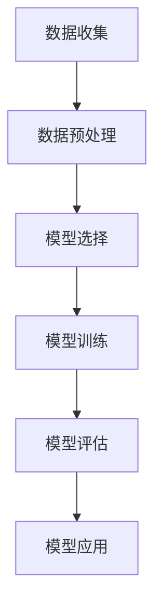

通过机器学习，财富管理平台可以更加智能地分析数据、预测趋势和制定决策，从而提高投资效率和回报率。下一章，我们将探讨深度学习的基础知识，进一步了解AI技术在财富管理中的应用。

### 深度学习基础

深度学习（Deep Learning，DL）是机器学习的一个子领域，其主要特点是使用多层神经网络对数据进行建模和预测。与传统机器学习方法相比，深度学习具有更强的表示能力和学习能力，能够处理更为复杂的数据和任务。

#### 2.2.1 神经网络

神经网络（Neural Networks，NN）是深度学习的基础，其灵感来源于生物神经系统的结构和功能。一个基本的神经网络包括输入层、隐藏层和输出层。

- **输入层**：接收外部输入数据。
- **隐藏层**：对输入数据进行处理和变换。
- **输出层**：生成最终的预测结果。

每个神经元（节点）都通过权重（weights）与相邻的神经元相连，并传递输入信号。通过逐层传递和激活函数的作用，神经网络能够对输入数据进行复杂的非线性变换。

#### 2.2.2 激活函数

激活函数（Activation Function）是神经网络中的一个关键组件，用于引入非线性因素。常见的激活函数包括：

- **Sigmoid函数**：将输入映射到（0, 1）区间。
- **ReLU函数**：简单且计算效率高，但可能导致梯度消失问题。
- **Tanh函数**：将输入映射到（-1, 1）区间。
- **Leaky ReLU函数**：解决ReLU函数的梯度消失问题。

#### 2.2.3 前向传播与反向传播

深度学习模型的学习过程主要包括前向传播（Forward Propagation）和反向传播（Backpropagation）两个阶段。

- **前向传播**：输入数据通过神经网络，逐层传递到输出层，生成预测结果。
- **反向传播**：计算预测结果与实际结果之间的误差，并利用梯度下降法调整网络权重，以减少误差。

#### 2.2.4 深度学习模型类型

深度学习模型根据其结构和应用场景的不同，可分为多种类型：

- **全连接神经网络（Fully Connected Network）**：每个神经元都与前一层的所有神经元相连。
- **卷积神经网络（Convolutional Neural Network，CNN）**：适用于图像处理，通过卷积层和池化层提取图像特征。
- **循环神经网络（Recurrent Neural Network，RNN）**：适用于序列数据，具有记忆功能，可以处理变长的序列。
- **长短时记忆网络（Long Short-Term Memory，LSTM）**：RNN的一种改进，能够更好地处理长序列数据。

**核心概念与联系**

| 核心概念 | 定义与属性特征 | 对比与联系 |
| --- | --- | --- |
| 神经网络 | 基于生物神经系统，通过多层节点进行数据建模和预测 | 与传统机器学习方法相比，具有更强的表示能力和学习能力 |
| 激活函数 | 引入非线性因素，决定神经元的激活状态 | 常见的激活函数包括Sigmoid、ReLU、Tanh等 |
| 前向传播 | 数据从输入层逐层传递到输出层，生成预测结果 | 是深度学习模型计算过程的核心部分 |
| 反向传播 | 计算预测结果与实际结果之间的误差，并调整网络权重 | 是深度学习模型优化过程的核心部分 |
| 深度学习模型类型 | 根据结构和应用场景不同，可分为全连接神经网络、卷积神经网络、循环神经网络等 | 不同模型适用于不同类型的数据和任务 |

**ER实体关系图架构**

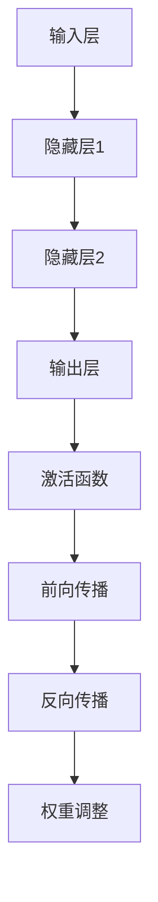

通过深度学习，财富管理平台可以更精确地分析市场数据、识别投资机会和风险，从而实现更高效的财富管理。下一章，我们将探讨强化学习的基础知识，进一步了解AI技术在财富管理中的应用。

### 强化学习基础

强化学习（Reinforcement Learning，RL）是机器学习的一个重要分支，它通过智能体（agent）与环境（environment）的交互来学习策略（policy），以最大化累积奖励（reward）。强化学习在解决动态决策问题方面具有独特的优势，被广泛应用于游戏、机器人控制和金融等领域。

#### 3.1 强化学习的基本概念

- **智能体（Agent）**：执行动作并基于环境反馈调整策略的实体。
- **环境（Environment）**：智能体所处的环境，能够提供状态（state）和奖励（reward）。
- **状态（State）**：智能体在某一时刻所处的情境描述。
- **动作（Action）**：智能体可以采取的行为。
- **策略（Policy）**：智能体在特定状态下选择动作的规则。
- **奖励（Reward）**：环境对智能体动作的反馈，用于指导学习过程。

#### 3.2 强化学习的主要算法

强化学习算法可以分为基于值的方法和基于策略的方法。

- **基于值的方法（Value-Based Methods）**：通过学习状态-动作值函数（State-Action Value Function）来指导动作选择。常见算法包括Q学习（Q-Learning）和深度Q网络（Deep Q-Network，DQN）。
  - **Q学习**：通过更新Q值（即状态-动作值函数）来优化策略。
  - **DQN**：使用深度神经网络来近似Q值函数，能够处理高维状态空间。

- **基于策略的方法（Policy-Based Methods）**：直接学习策略，通过策略梯度（Policy Gradient）来优化策略。常见算法包括策略梯度（Policy Gradient）和深度确定性策略梯度（Deep Deterministic Policy Gradient，DDPG）。
  - **策略梯度**：通过梯度上升方法最大化策略的概率分布。
  - **DDPG**：结合深度神经网络和策略梯度方法，适用于连续动作空间。

**核心概念与联系**

| 核心概念 | 定义与属性特征 | 对比与联系 |
| --- | --- | --- |
| 智能体（Agent） | 执行动作并学习策略的实体 | 是强化学习的核心组件，与环境交互以实现目标 |
| 环境（Environment） | 提供状态和奖励的情境 | 与智能体互动，提供反馈，是强化学习中的重要组成部分 |
| 状态（State） | 智能体所处的情境描述 | 描述智能体的当前状态，是决策的重要依据 |
| 动作（Action） | 智能体可以采取的行为 | 动作的选择取决于当前状态和策略 |
| 策略（Policy） | 智能体在特定状态下选择动作的规则 | 策略指导智能体如何行动，是学习目标 |
| 奖励（Reward） | 环境对智能体动作的反馈 | 用于指导学习过程，最大化累积奖励是强化学习的目标 |

**ER实体关系图架构**

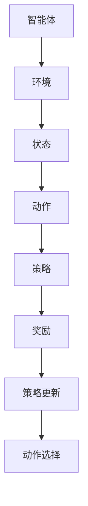

通过强化学习，财富管理平台可以不断优化投资策略，根据市场变化实时调整投资组合。下一章，我们将探讨数据分析与处理，为构建AI驱动财富管理平台打下坚实的基础。

### 数据分析与处理

在构建AI驱动财富管理平台的过程中，数据是核心资产。有效的数据分析与处理能力能够显著提升平台的决策质量。以下章节将详细介绍数据收集与清洗、数据探索与分析以及数据可视化等内容。

#### 3.1 数据收集与清洗

**数据收集**：

数据收集是数据分析的第一步，涉及获取各类数据，包括历史市场数据、客户交易数据、宏观经济指标等。数据来源可以是公开数据集、企业内部数据以及第三方数据提供商。数据收集的关键点包括：

- 数据完整性：确保收集到的数据全面、无缺失。
- 数据多样性：收集不同类型和来源的数据，以丰富分析视角。
- 数据实时性：对于动态市场，实时数据至关重要。

**数据清洗**：

数据清洗是确保数据质量的重要环节，主要包括以下步骤：

- **缺失值处理**：对缺失值进行填充或删除，以保证数据的连续性和完整性。
- **异常值处理**：检测和去除异常值，以减少对模型训练的干扰。
- **重复数据检测**：识别并去除重复记录，避免数据冗余。
- **数据规范化**：对数据进行归一化或标准化处理，使数据在同一个尺度上进行比较。

**核心概念与联系**

| 核心概念 | 定义与属性特征 | 对比与联系 |
| --- | --- | --- |
| 数据收集 | 获取各类数据，包括历史数据、客户交易数据等 | 数据完整性、多样性、实时性是关键 |
| 数据清洗 | 处理缺失值、异常值、重复数据和规范化 | 确保数据质量，是数据分析的基础 |
| 缺失值处理 | 对缺失值进行填充或删除 | 填充方法有均值填充、中值填充等 |
| 异常值处理 | 检测和去除异常值 | 常用方法有统计方法、箱线图法等 |
| 重复数据检测 | 识别并去除重复记录 | 提高数据一致性，避免冗余 |
| 数据规范化 | 对数据进行归一化或标准化处理 | 使数据在同一尺度上比较，提高分析准确性 |

**ER实体关系图架构**

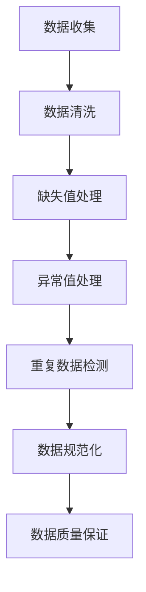

**数据探索与分析**：

数据清洗后，需要进行数据探索与分析，以发现数据中的潜在规律和趋势。数据探索包括以下几个方面：

- **描述性统计分析**：计算数据的基本统计指标，如均值、方差、标准差等，以了解数据的分布特征。
- **相关性分析**：分析变量之间的相关性，确定哪些因素对目标变量有显著影响。
- **异常检测**：识别数据中的异常模式或趋势，以预警潜在的风险或机会。
- **时间序列分析**：对时间序列数据进行建模和分析，预测未来的趋势。

**数据可视化**：

数据可视化是数据分析的重要环节，通过图表和图形直观展示数据，帮助决策者快速理解和洞察数据。常见的可视化方法包括：

- **散点图**：展示变量之间的相关性。
- **柱状图**：比较不同类别之间的数量或比例。
- **折线图**：展示时间序列数据的趋势。
- **箱线图**：展示数据的分布特征和异常值。

**核心概念与联系**

| 核心概念 | 定义与属性特征 | 对比与联系 |
| --- | --- | --- |
| 描述性统计分析 | 计算基本统计指标，了解数据分布特征 | 包括均值、方差、标准差等 |
| 相关性分析 | 分析变量之间的相关性，确定影响因素 | 包括皮尔逊相关系数、斯皮尔曼秩相关系数等 |
| 异常检测 | 识别数据中的异常模式或趋势 | 常用方法有统计方法、机器学习模型等 |
| 时间序列分析 | 对时间序列数据进行建模和预测 | 包括ARIMA模型、LSTM模型等 |
| 数据可视化 | 通过图表和图形展示数据，辅助决策 | 包括散点图、柱状图、折线图、箱线图等 |

**ER实体关系图架构**

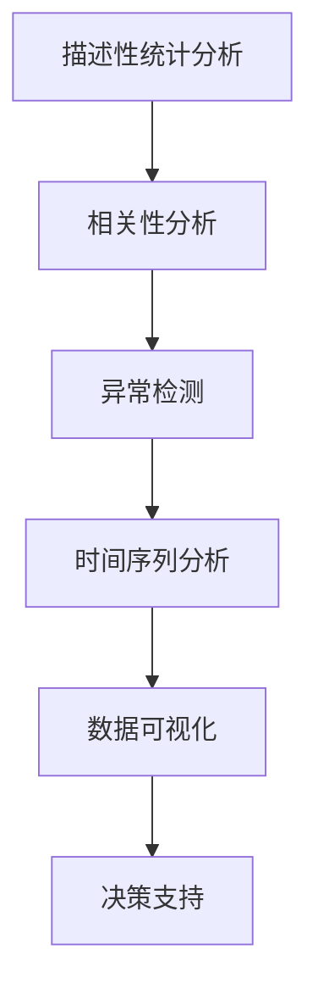

通过有效的数据分析与处理，AI驱动财富管理平台能够更好地理解市场动态、识别投资机会和风险，为投资者提供更加精准和个性化的服务。下一章，我们将探讨AI驱动的投资策略，进一步了解如何利用AI技术实现财富管理的智能化。

### AI驱动的投资策略

在构建AI驱动财富管理平台的过程中，AI驱动的投资策略是其核心组成部分。AI技术通过分析海量数据和复杂市场动态，能够为投资者提供更加精准和个性化的投资建议，从而提高投资回报率。以下章节将详细探讨量化投资策略、风险评估与资产配置以及机器学习在投资策略中的应用。

#### 4.1 量化投资策略

量化投资（Quantitative Investing）是利用数学模型和计算机算法进行投资决策的方法。它通过定量分析市场数据，制定科学的投资策略，以降低风险并提高收益。量化投资策略的主要步骤包括：

**1. 数据收集与分析**：

量化投资首先需要收集大量的市场数据，包括股票价格、交易量、财务报表、宏观经济指标等。通过数据预处理和统计分析，可以发现市场中的潜在规律和趋势。

**2. 模型建立**：

根据分析结果，建立预测模型。常见的量化投资模型包括：

- **时间序列模型**：如ARIMA模型，用于预测股票价格的走势。
- **分类模型**：如逻辑回归和支持向量机，用于预测股票的涨跌。
- **回归模型**：如线性回归和岭回归，用于确定股票收益率与风险的关系。

**3. 回测验证**：

在建立模型后，通过历史数据对模型进行回测验证。回测结果可以评估模型的预测性能，并对其进行优化。

**4. 策略执行**：

通过计算机程序自动化执行投资策略。量化投资通常采用高频交易策略，通过频繁买卖实现收益。

**核心概念与联系**

| 核心概念 | 定义与属性特征 | 对比与联系 |
| --- | --- | --- |
| 量化投资 | 利用数学模型和计算机算法进行投资决策 | 与传统投资策略相比，更加依赖数据和模型 |
| 数据收集与分析 | 收集市场数据，进行预处理和统计分析 | 数据质量直接影响模型的效果 |
| 模型建立 | 建立预测模型，如时间序列模型、分类模型和回归模型 | 不同模型适用于不同类型的数据和任务 |
| 回测验证 | 使用历史数据评估模型性能 | 评估模型的有效性，指导策略优化 |
| 策略执行 | 自动化执行投资策略 | 高频交易策略的典型应用 |

**ER实体关系图架构**

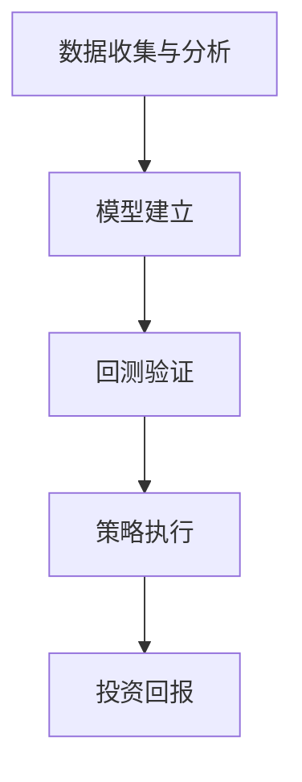

**4.2 风险评估与资产配置**

在量化投资中，风险评估和资产配置是关键环节。通过AI技术，可以更加精准地评估投资风险，并制定合理的资产配置策略。

**1. 风险评估**：

风险评估包括定量和定性两个方面。定量风险评估通过计算资产收益率的标准差、贝塔系数等指标，评估资产的波动性和风险。定性风险评估则通过分析市场环境、政策变化、公司基本面等因素，评估风险。

**2. 资产配置**：

资产配置是基于风险评估结果，将投资资金分配到不同的资产类别中。常见的资产配置策略包括：

- **战略性资产配置**：根据投资者的风险偏好和投资期限，制定长期资产配置策略。
- **战术性资产配置**：根据市场变化，实时调整资产配置，以应对短期市场波动。

**核心概念与联系**

| 核心概念 | 定义与属性特征 | 对比与联系 |
| --- | --- | --- |
| 风险评估 | 评估资产波动性和风险 | 定量和定性相结合，提高风险评估的准确性 |
| 资产配置 | 将投资资金分配到不同资产类别 | 长期和短期策略相结合，提高投资收益 |
| 战略性资产配置 | 长期资产配置策略 | 根据风险偏好和投资期限制定 |
| 战术性资产配置 | 短期资产配置策略 | 根据市场变化实时调整 |

**ER实体关系图架构**

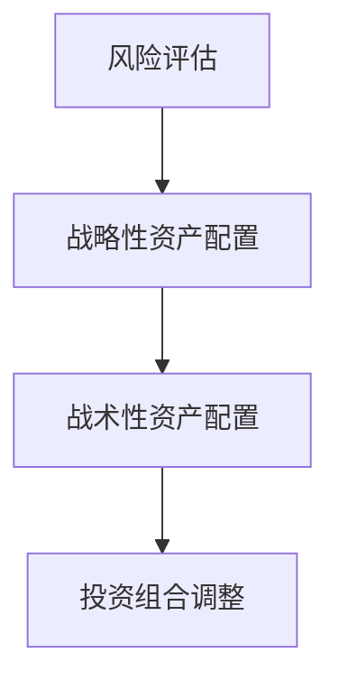

**4.3 机器学习在投资策略中的应用**

机器学习在投资策略中的应用，主要体现在以下几个方面：

- **股票选择**：通过分析历史数据和实时信息，使用机器学习算法识别潜在的投资机会。
- **交易信号生成**：利用机器学习模型生成买卖信号，指导交易决策。
- **风险预测**：通过预测市场波动性和公司信用风险，调整投资策略。

**核心概念与联系**

| 核心概念 | 定义与属性特征 | 对比与联系 |
| --- | --- | --- |
| 股票选择 | 通过分析历史数据和实时信息，识别潜在投资机会 | 基于数据和算法，提高选股准确性 |
| 交易信号生成 | 生成买卖信号，指导交易决策 | 实时调整交易策略，提高投资收益 |
| 风险预测 | 预测市场波动性和公司信用风险 | 减少投资风险，优化投资组合 |

**ER实体关系图架构**

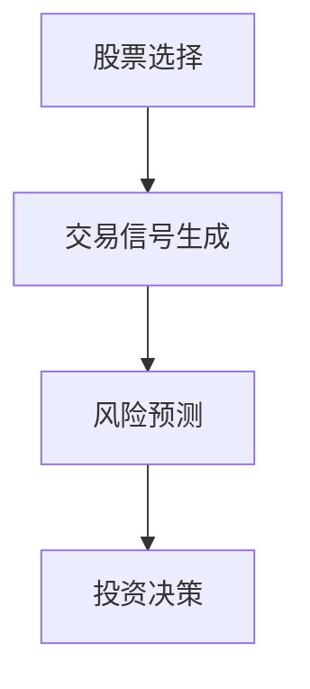

通过AI驱动的投资策略，财富管理平台可以更高效地识别投资机会、管理风险，实现投资回报的最大化。在下一章中，我们将探讨AI驱动的风险控制，了解如何利用AI技术保障投资安全。

### AI驱动的风险控制

在构建AI驱动财富管理平台的过程中，风险控制是至关重要的环节。AI技术的引入，使得风险控制更加智能化和高效化。以下章节将详细探讨风险识别与预警、风险评估与量化以及风险控制策略等内容。

#### 5.1 风险识别与预警

风险识别是风险管理的第一步，它涉及发现和分析潜在的风险因素。AI技术通过大数据分析和机器学习算法，可以有效地识别出各种潜在风险。

**1. 风险识别方法**：

- **历史数据分析**：通过分析历史数据，识别出常见的风险模式。
- **异常检测**：使用机器学习模型，检测出数据中的异常行为，这些异常行为可能预示着潜在风险。
- **深度学习模型**：利用深度学习算法，对大量历史数据进行训练，以识别出复杂的风险模式。

**2. 风险预警系统**：

基于识别出的风险因素，可以构建风险预警系统。该系统通过实时监控市场动态和数据变化，及时发现潜在的风险，并发出预警。

- **实时监控**：通过自动化系统，实时监控市场数据和客户行为。
- **预警机制**：根据预设的风险阈值，当监测到风险信号时，自动触发预警机制。

**核心概念与联系**

| 核心概念 | 定义与属性特征 | 对比与联系 |
| --- | --- | --- |
| 风险识别 | 发现和分析潜在风险因素 | 历史数据分析、异常检测、深度学习模型 |
| 风险预警系统 | 实时监控风险信号，触发预警 | 实时监控、预警机制、自动化系统 |

**ER实体关系图架构**

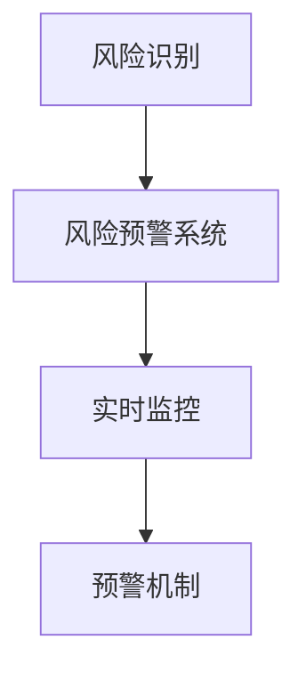

#### 5.2 风险评估与量化

风险评估是对风险的可能性和影响进行量化分析，以便制定有效的风险控制策略。AI技术通过数据分析和建模，可以实现对风险的精准评估。

**1. 风险评估方法**：

- **统计方法**：使用统计模型，如回归分析、贝叶斯网络等，对风险因素进行量化。
- **机器学习方法**：通过训练机器学习模型，如随机森林、支持向量机等，对风险因素进行预测和评估。
- **情景分析**：通过模拟不同的市场情景，评估风险在不同情景下的影响。

**2. 风险量化**：

风险量化是将风险评估的结果转化为具体的数值，以衡量风险的大小。常用的风险量化指标包括：

- **VaR（Value at Risk）**：衡量在一定置信水平和特定时间段内的最大可能损失。
- **CVaR（Conditional Value at Risk）**：衡量在发生损失时的平均损失。
- **ES（Expected Shortfall）**：衡量在发生损失时的平均损失。

**核心概念与联系**

| 核心概念 | 定义与属性特征 | 对比与联系 |
| --- | --- | --- |
| 风险评估 | 对风险的可能性和影响进行量化分析 | 统计方法、机器学习方法、情景分析 |
| 风险量化 | 将风险评估结果转化为具体数值 | VaR、CVaR、ES |

**ER实体关系图架构**

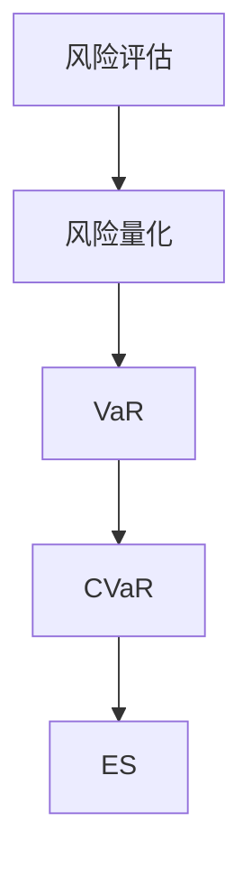

#### 5.3 风险控制策略

基于风险评估和量化结果，可以制定相应的风险控制策略。AI技术通过自动化和智能化手段，实现风险的有效控制。

**1. 风险控制策略**：

- **风险规避**：通过避免高风险的投资机会，降低整体风险。
- **风险转移**：通过购买保险或对冲策略，将风险转移给第三方。
- **风险接受**：在评估风险可承受范围内，接受一定风险以追求更高收益。
- **风险分散**：通过多元化投资组合，分散风险，降低投资组合的整体波动性。

**2. 风险控制机制**：

- **实时监控**：通过自动化系统，实时监控市场风险指标，及时发现风险信号。
- **预警机制**：当风险指标超出阈值时，自动触发预警，采取相应的风险控制措施。
- **决策支持**：通过AI算法，为风险管理提供决策支持，优化投资组合。

**核心概念与联系**

| 核心概念 | 定义与属性特征 | 对比与联系 |
| --- | --- | --- |
| 风险规避 | 避免高风险投资机会，降低整体风险 | 风险规避是风险控制的基本策略 |
| 风险转移 | 通过保险或对冲策略，将风险转移给第三方 | 风险转移是降低风险的有效手段 |
| 风险接受 | 在可承受范围内接受一定风险，追求更高收益 | 风险接受是权衡风险与收益的策略 |
| 风险分散 | 通过多元化投资组合，分散风险，降低整体波动性 | 风险分散是降低风险的重要手段 |
| 实时监控 | 通过自动化系统，实时监控市场风险指标 | 提高风险识别和预警的效率 |
| 预警机制 | 当风险指标超出阈值时，自动触发预警 | 提高风险控制的及时性和有效性 |
| 决策支持 | 通过AI算法，为风险管理提供决策支持 | 提高决策的准确性和效率 |

**ER实体关系图架构**

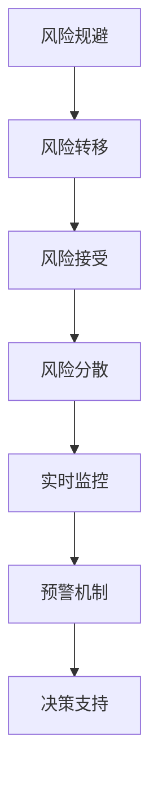

通过AI驱动的风险控制，财富管理平台可以更精准地识别和管理风险，保障投资的安全性和稳定性。在下一章中，我们将探讨AI驱动的客户服务，了解如何利用AI技术提升客户体验。

### AI驱动的客户服务

AI技术在提升客户服务质量方面具有显著优势。通过智能客服系统、个性化金融服务和客户行为分析，AI驱动的客户服务能够提供高效、精准、个性化的服务，从而提升客户满意度和忠诚度。

#### 6.1 智能客服系统

智能客服系统是AI技术在客户服务领域的典型应用。它利用自然语言处理（Natural Language Processing，NLP）和机器学习算法，自动回答客户的问题，处理常见的服务请求。

**1. 工作原理**：

- **自然语言处理**：智能客服系统通过NLP技术，理解客户的语言输入，并将其转换为机器可理解的结构化数据。
- **机器学习模型**：系统使用预训练的机器学习模型，如对话生成模型和意图识别模型，生成相应的回答。

**2. 关键功能**：

- **自动问答**：智能客服系统能够自动回答常见问题，如账户余额查询、交易记录查询等。
- **任务处理**：对于复杂的客户请求，智能客服系统可以识别出关键信息，并将请求转交给人工客服进行处理。
- **多渠道集成**：智能客服系统可以集成到各种渠道，如网站、移动应用和社交媒体，提供一致的服务体验。

**核心概念与联系**

| 核心概念 | 定义与属性特征 | 对比与联系 |
| --- | --- | --- |
| 自然语言处理（NLP） | 理解和生成自然语言 | 是智能客服系统的基础技术 |
| 机器学习模型 | 用于生成回答和识别意图 | 提高回答的准确性和效率 |
| 自动问答 | 自动回答常见问题 | 提高服务效率，减少人工成本 |
| 任务处理 | 识别关键信息，转交复杂请求 | 结合人工和自动化服务，提升整体服务质量 |

**ER实体关系图架构**

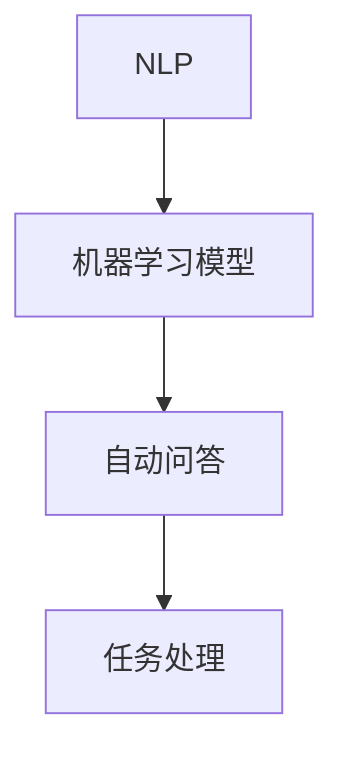

#### 6.2 个性化金融服务

个性化金融服务是基于客户数据和行为分析，为客户提供定制化的金融产品和服务。通过AI技术，可以实现以下目标：

**1. 客户数据分析**：

- **行为分析**：通过分析客户的交易行为、投资偏好和历史记录，了解客户的金融需求和风险承受能力。
- **偏好识别**：使用机器学习算法，识别客户的偏好，如投资风格、风险偏好等。

**2. 个性化服务**：

- **产品推荐**：根据客户的偏好和需求，推荐合适的金融产品。
- **服务定制**：提供定制化的金融服务，如个性化投资组合、风险评估报告等。

**核心概念与联系**

| 核心概念 | 定义与属性特征 | 对比与联系 |
| --- | --- | --- |
| 行为分析 | 分析客户的交易行为和投资偏好 | 了解客户需求，提高服务针对性 |
| 偏好识别 | 使用机器学习算法识别客户偏好 | 提高推荐服务的准确性 |
| 产品推荐 | 根据客户偏好推荐金融产品 | 提高客户满意度，增加销售机会 |
| 服务定制 | 提供定制化的金融服务 | 满足客户多样化需求，提升客户体验 |

**ER实体关系图架构**

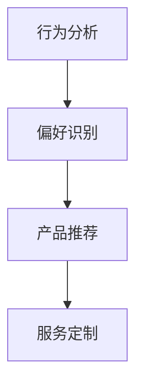

#### 6.3 客户行为分析与预测

客户行为分析是AI驱动客户服务的核心组成部分。通过分析客户行为数据，可以预测客户的行为趋势，制定相应的营销策略和服务方案。

**1. 客户行为分析**：

- **交易行为分析**：分析客户的交易历史，了解客户的交易习惯和偏好。
- **互动行为分析**：分析客户与客服系统、银行的互动记录，了解客户的需求和反馈。
- **社交媒体分析**：通过分析客户的社交媒体行为，了解客户的情感和意见。

**2. 客户行为预测**：

- **行为趋势预测**：使用机器学习算法，预测客户未来的行为趋势，如投资决策、服务请求等。
- **风险评估预测**：通过分析客户的行为数据，预测客户的风险承受能力和潜在风险。

**核心概念与联系**

| 核心概念 | 定义与属性特征 | 对比与联系 |
| --- | --- | --- |
| 交易行为分析 | 分析客户的交易历史，了解交易习惯和偏好 | 提高投资决策的准确性 |
| 互动行为分析 | 分析客户与客服系统的互动记录，了解需求和反馈 | 提高服务质量和客户满意度 |
| 社交媒体分析 | 通过分析社交媒体行为，了解客户情感和意见 | 提高品牌形象，优化服务策略 |
| 行为趋势预测 | 使用机器学习算法，预测客户未来的行为趋势 | 制定针对性的营销和服务方案 |
| 风险评估预测 | 分析客户行为数据，预测风险承受能力和潜在风险 | 提高风险管理能力 |

**ER实体关系图架构**

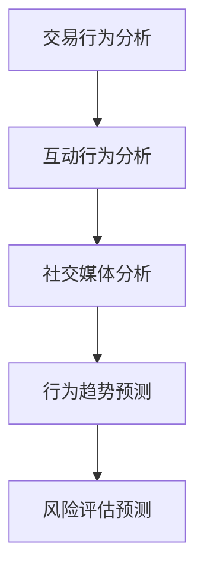

通过AI驱动的客户服务，财富管理平台能够提供更加高效、精准、个性化的服务，从而提升客户满意度和忠诚度。在下一章中，我们将探讨平台架构与实现，了解如何设计和构建AI驱动财富管理平台。

### 平台架构与实现

构建一个全方位的AI驱动财富管理平台，需要考虑其架构设计、技术选型、性能优化等多个方面。以下章节将详细探讨平台架构设计、技术选型与整合、平台性能优化等内容。

#### 7.1 平台架构设计

一个高效、可扩展的财富管理平台需要清晰的架构设计。以下是一个典型的AI驱动财富管理平台架构设计：

**1. 层次结构**：

- **表现层**：用户界面，包括网站、移动应用和API接口。
- **业务逻辑层**：处理业务逻辑，包括投资策略、风险控制、客户服务等。
- **数据层**：存储和管理数据，包括数据库、数据仓库和大数据处理平台。

**2. 功能模块**：

- **用户管理模块**：处理用户注册、登录、权限管理等。
- **投资管理模块**：实现投资策略的执行和跟踪。
- **风险控制模块**：实现风险识别、评估和控制。
- **客户服务模块**：提供智能客服、个性化金融服务等。
- **数据处理模块**：实现数据收集、清洗、存储和可视化。

**3. 数据流**：

- **用户交互**：用户通过表现层与平台进行交互。
- **业务逻辑处理**：用户请求经过表现层处理后，由业务逻辑层进行处理。
- **数据存储与处理**：业务逻辑层处理的结果和数据存储在数据层。

**核心概念与联系**

| 核心概念 | 定义与属性特征 | 对比与联系 |
| --- | --- | --- |
| 层次结构 | 分为表现层、业务逻辑层和数据层 | 提高系统可维护性和可扩展性 |
| 功能模块 | 包括用户管理、投资管理、风险控制等 | 实现具体功能，提高系统灵活性 |
| 数据流 | 用户交互、业务逻辑处理和数据存储与处理 | 确保数据的高效流动和处理 |

**ER实体关系图架构**

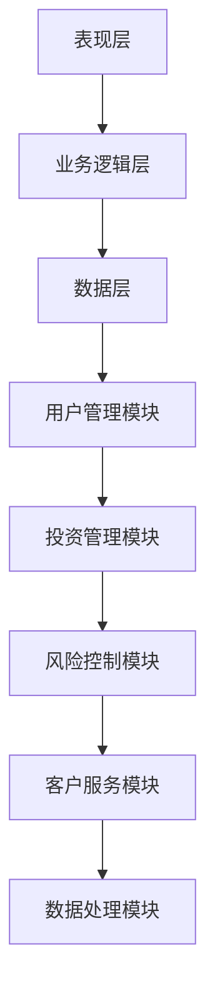

#### 7.2 技术选型与整合

选择合适的技术栈是实现平台架构的关键。以下是一些常见的技术选型：

**1. 开发语言**：

- **Python**：适合机器学习和数据科学，有丰富的库和框架。
- **Java**：适合企业级应用，稳定性和性能较好。
- **Node.js**：适合实时处理和交互式应用。

**2. 数据库**：

- **关系型数据库**：如MySQL、PostgreSQL，适合结构化数据存储。
- **NoSQL数据库**：如MongoDB、Cassandra，适合非结构化数据存储。

**3. 大数据处理**：

- **Apache Hadoop**：适合大规模数据处理和分析。
- **Apache Spark**：适合实时数据处理和分析。

**4. 机器学习框架**：

- **TensorFlow**：适用于深度学习和大规模机器学习任务。
- **PyTorch**：适用于研究和实验，易于调试。

**5. 通信协议**：

- **RESTful API**：适合Web服务。
- **WebSocket**：适合实时通信。

**核心概念与联系**

| 核心概念 | 定义与属性特征 | 对比与联系 |
| --- | --- | --- |
| 开发语言 | 用于编写应用程序 | Python适合数据科学，Java适合企业级应用 |
| 数据库 | 存储和管理数据 | 关系型数据库适合结构化数据，NoSQL数据库适合非结构化数据 |
| 大数据处理 | 处理大规模数据 | Hadoop和Spark适合大数据处理 |
| 机器学习框架 | 实现机器学习算法 | TensorFlow和PyTorch适用于不同类型的机器学习任务 |
| 通信协议 | 网络通信 | RESTful API和WebSocket适用于不同类型的网络应用 |

**ER实体关系图架构**

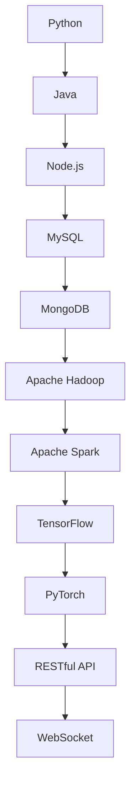

#### 7.3 平台性能优化

性能优化是确保平台稳定运行和高效处理的重要环节。以下是一些常见的性能优化方法：

**1. 系统优化**：

- **缓存**：使用缓存技术，如Redis，减少数据库查询次数。
- **负载均衡**：使用负载均衡器，如Nginx，分配请求到多个服务器，提高系统吞吐量。
- **分布式计算**：使用分布式计算架构，如Kubernetes，提高系统的可扩展性和容错能力。

**2. 数据库优化**：

- **索引**：创建合适的索引，提高查询速度。
- **分库分表**：将数据分库分表，减少单表数据量，提高查询性能。

**3. 代码优化**：

- **代码优化**：优化代码逻辑，减少不必要的计算和资源消耗。
- **异步处理**：使用异步处理，减少阻塞时间，提高系统响应速度。

**核心概念与联系**

| 核心概念 | 定义与属性特征 | 对比与联系 |
| --- | --- | --- |
| 系统优化 | 提高系统性能和稳定性 | 缓存、负载均衡、分布式计算 |
| 数据库优化 | 提高数据库查询性能 | 索引、分库分表 |
| 代码优化 | 提高代码执行效率 | 代码逻辑优化、异步处理 |

**ER实体关系图架构**

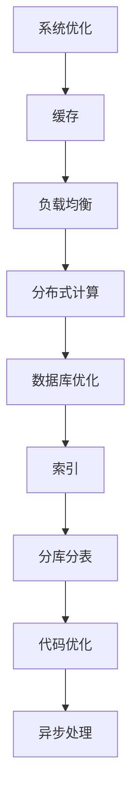

通过合理的架构设计、技术选型和性能优化，可以构建一个高效、稳定、可扩展的AI驱动财富管理平台。在下一章中，我们将探讨安全性与合规性，了解如何在构建平台过程中确保系统的安全性和合规性。

### 安全性与合规性

在构建AI驱动财富管理平台的过程中，安全性和合规性是必须考虑的两个关键因素。随着AI技术的广泛应用，AI系统面临的安全风险和合规挑战也在不断增加。以下章节将详细探讨AI系统的安全挑战、数据隐私保护以及合规与监管遵循。

#### 8.1 AI系统的安全挑战

AI系统在财富管理中具有巨大的应用潜力，但同时也带来了新的安全挑战：

**1. 模型安全**：

- **模型篡改**：攻击者可能通过篡改训练数据或模型参数，使模型产生错误预测或恶意行为。
- **模型窃取**：未经授权的实体可能窃取训练模型，用于不正当用途。

**2. 数据泄露**：

- **数据泄露**：由于数据存储和处理不当，敏感数据可能被未授权的实体访问或泄露。
- **数据篡改**：攻击者可能篡改数据，导致模型预测错误或系统功能失效。

**3. 网络安全**：

- **DDoS攻击**：分布式拒绝服务攻击可能导致系统瘫痪，影响正常运营。
- **网络入侵**：攻击者可能通过网络入侵系统，窃取敏感信息和资金。

**核心概念与联系**

| 核心概念 | 定义与属性特征 | 对比与联系 |
| --- | --- | --- |
| 模型安全 | 保护模型不被篡改和窃取 | 确保模型预测的准确性和可靠性 |
| 数据泄露 | 防止敏感数据被泄露或篡改 | 保护客户信息和交易数据 |
| 网络安全 | 防止网络攻击和入侵 | 保证系统的稳定性和安全性 |

**ER实体关系图架构**

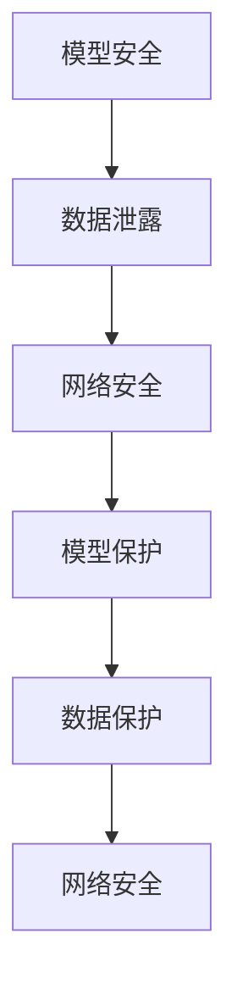

#### 8.2 数据隐私保护

数据隐私保护是AI驱动财富管理平台必须遵循的重要原则。以下是一些关键措施：

**1. 数据匿名化**：

- **脱敏技术**：使用数据脱敏技术，如加密、掩码和伪名化，保护个人身份信息。
- **数据摘要**：通过数据摘要技术，保留关键信息的同时隐藏敏感数据。

**2. 数据访问控制**：

- **访问控制策略**：实施严格的访问控制策略，确保只有授权用户可以访问敏感数据。
- **多因素认证**：采用多因素认证，如密码、生物识别等，提高访问安全性。

**3. 数据存储与传输**：

- **数据加密**：对存储和传输的数据进行加密，防止数据泄露。
- **安全传输协议**：使用安全的传输协议，如SSL/TLS，确保数据在传输过程中的安全性。

**核心概念与联系**

| 核心概念 | 定义与属性特征 | 对比与联系 |
| --- | --- | --- |
| 数据匿名化 | 保护个人身份信息 | 脱敏技术、数据摘要 |
| 数据访问控制 | 确保只有授权用户可以访问数据 | 访问控制策略、多因素认证 |
| 数据存储与传输 | 保证数据存储和传输的安全性 | 数据加密、安全传输协议 |

**ER实体关系图架构**

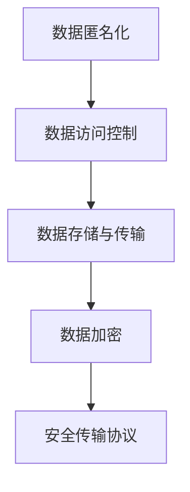

#### 8.3 合规与监管遵循

财富管理平台需要遵循一系列法律法规和监管要求，确保业务合规运营：

**1. 法律法规遵循**：

- **数据保护法规**：遵循如《通用数据保护条例》（GDPR）等数据保护法规。
- **金融法规**：遵循如《银行法》、《证券法》等金融法规。

**2. 监管要求**：

- **客户身份验证**：实施严格的客户身份验证（KYC）程序。
- **交易监控**：对交易进行实时监控，及时发现和报告异常交易。

**3. 内部合规性审查**：

- **定期审计**：定期进行内部合规性审查，确保平台遵循相关法律法规和监管要求。
- **员工培训**：对员工进行合规性培训，提高合规意识和操作水平。

**核心概念与联系**

| 核心概念 | 定义与属性特征 | 对比与联系 |
| --- | --- | --- |
| 法律法规遵循 | 遵守相关法律法规 | 如GDPR、银行法、证券法等 |
| 监管要求 | 遵循监管机构的合规要求 | 客户身份验证、交易监控 |
| 内部合规性审查 | 定期审计，确保合规性 | 定期审计、员工培训 |

**ER实体关系图架构**

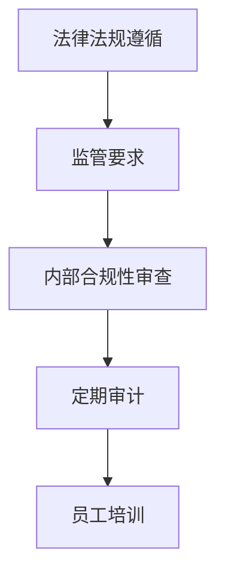

通过综合考虑安全性和合规性，AI驱动财富管理平台可以确保系统的安全可靠、数据的隐私保护和业务的合规运营。在下一章中，我们将通过一个实际项目展示如何构建AI驱动财富管理平台，并提供项目实战与案例分析。

### 项目实战与案例分析

在本章节中，我们将通过一个实际项目展示如何构建AI驱动财富管理平台。这个项目名为“智投宝”，其目标是构建一个基于AI的智能投资平台，提供个性化投资建议和风险控制功能。以下是对项目背景、系统设计与实现、实施过程与成果的详细讲解。

#### 9.1 项目背景与目标

“智投宝”项目的背景是当前财富管理行业面临着客户需求多样化和市场竞争激烈的挑战。为了应对这些挑战，项目旨在通过引入AI技术，打造一个智能化的投资平台，提升投资决策的精准度和用户体验。

**项目目标**：

1. **提供个性化投资建议**：根据客户的风险偏好、投资目标和历史交易数据，生成个性化的投资组合建议。
2. **实现风险控制**：通过实时监控市场动态和交易行为，提供风险预警和风险管理建议。
3. **提升用户体验**：通过智能客服系统、个性化界面设计和高效的数据可视化，提高用户的投资体验。
4. **确保系统安全与合规**：保障客户数据的安全性和合规性，遵循相关法律法规和监管要求。

#### 9.2 系统设计与实现

**1. 系统架构设计**：

“智投宝”系统采用了三层架构设计，包括表现层、业务逻辑层和数据层。

- **表现层**：用户界面，包括网站和移动应用，提供投资建议、风险控制功能和用户交互界面。
- **业务逻辑层**：实现个性化投资策略、风险监控、智能客服等功能，是系统的核心处理层。
- **数据层**：包括数据库和数据仓库，存储和管理用户数据、市场数据和历史交易数据。

**2. 系统功能设计**：

- **用户管理模块**：处理用户注册、登录、权限管理等。
- **投资管理模块**：实现投资策略的执行和跟踪，包括资产配置、股票筛选和交易执行。
- **风险控制模块**：实现风险识别、评估和控制，包括实时监控、风险预警和风险管理。
- **客户服务模块**：提供智能客服系统，包括自动问答、个性化服务和反馈机制。
- **数据处理模块**：实现数据收集、清洗、存储和可视化，为其他模块提供数据支持。

**3. 技术选型**：

- **开发语言**：Python和Java，Python用于数据处理和机器学习算法，Java用于业务逻辑处理。
- **数据库**：MySQL用于存储用户数据和交易记录，MongoDB用于存储市场数据和非结构化数据。
- **大数据处理**：使用Apache Hadoop和Apache Spark，实现大规模数据处理和分析。
- **机器学习框架**：使用TensorFlow和PyTorch，构建和训练机器学习模型。
- **前端技术**：React和Vue.js，用于构建用户界面。

#### 9.3 实施过程与成果

**1. 数据收集与预处理**：

项目首先进行了大量的数据收集，包括历史市场数据、客户交易数据和宏观经济指标。收集到的数据经过清洗和预处理，去除噪声和缺失值，确保数据质量。

**2. 机器学习模型构建与训练**：

基于收集到的数据，项目团队构建了多个机器学习模型，包括用于预测股票价格的深度学习模型和用于风险评估的决策树模型。通过大量的训练和调优，这些模型能够生成准确的预测结果。

**3. 系统集成与测试**：

完成模型训练后，项目团队将机器学习模型与业务逻辑层进行集成，并进行了全面的系统测试，确保系统的稳定性和功能性。测试包括功能测试、性能测试和安全测试。

**4. 系统部署与上线**：

经过充分的测试和优化，项目最终上线，用户可以通过网站和移动应用访问“智投宝”平台。上线后，系统运行稳定，用户反馈良好。

**5. 项目成果**：

- **个性化投资建议**：系统根据用户的风险偏好和投资目标，生成个性化的投资组合建议，用户满意度显著提升。
- **风险控制**：系统实现了实时风险监控和预警，有效降低了投资风险。
- **用户体验**：智能客服系统和高效的数据可视化功能提升了用户的投资体验。
- **安全性与合规性**：系统严格遵循数据保护法规和金融监管要求，保障了客户数据的安全和合规性。

通过“智投宝”项目的成功实施，项目团队证明了AI技术在财富管理中的应用价值，也为其他机构提供了宝贵的经验教训。在下一章中，我们将展望AI在财富管理中的未来发展。

### 未来展望与趋势

随着人工智能技术的不断进步，AI在财富管理领域的应用前景愈加广阔。以下章节将探讨AI在财富管理中的未来趋势、技术发展带来的挑战以及创新与市场机会。

#### 10.1 AI在财富管理中的未来趋势

**1. 个性化与智能化投资**：

AI技术将进一步提升投资决策的个性化和智能化水平。通过深入分析用户行为、风险偏好和市场动态，AI系统能够为投资者提供更加精准和个性化的投资建议。

**2. 实时风险监控与预警**：

AI驱动的实时风险监控系统将变得更加普及和高效。利用机器学习和深度学习算法，系统能够快速识别市场变化和潜在风险，及时发出预警，帮助投资者采取相应的风险管理措施。

**3. 量化投资与算法交易**：

量化投资和算法交易将继续成为AI在财富管理中的重要应用。通过构建复杂的量化模型和算法，投资者能够实现更加高效和自动化的投资决策，提高投资回报率。

**4. 智能客服与个性化服务**：

AI驱动的智能客服系统和个性化金融服务将进一步发展，为用户提供更加便捷和高效的服务体验。通过自然语言处理和机器学习技术，系统能够理解和满足用户需求，提供个性化的金融产品和服务。

#### 10.2 技术发展带来的挑战

**1. 数据隐私与安全**：

随着AI技术在财富管理中的广泛应用，数据隐私和安全问题也日益突出。如何确保客户数据的隐私和安全，防止数据泄露和滥用，是未来需要重点解决的问题。

**2. 模型透明性与解释性**：

AI模型的高度复杂性和黑箱特性，使得其决策过程难以解释和理解。如何提高模型的透明性和解释性，使投资者能够理解并信任AI系统的决策，是一个重要的技术挑战。

**3. 法律法规与监管遵循**：

随着AI在财富管理中的广泛应用，相关的法律法规和监管要求也将不断更新和完善。如何确保AI系统的合规性和遵循相关法律法规，是未来需要关注的重要问题。

#### 10.3 创新与市场机会

**1. 新型金融产品与服务**：

AI技术的进步将催生新型金融产品和服务。例如，基于AI的投资顾问、智能投顾平台、自动化交易系统等，将为投资者提供更加多样化和高效的投资选择。

**2. 跨界合作与融合**：

AI技术与金融行业的跨界合作和融合将带来新的市场机会。例如，与保险、零售、医疗等行业的合作，可以实现更加综合和个性化的金融服务。

**3. 创新型创业项目**：

AI技术在财富管理中的应用将激发创新型创业项目的涌现。例如，基于AI的智能投顾平台、风险控制工具、客户服务系统等，将为创业者提供广阔的舞台。

通过不断的技术创新和市场拓展，AI在财富管理中的应用将不断深化和拓展，为投资者和金融机构带来更多价值。未来，AI驱动的财富管理平台将更加智能化、个性化和安全可靠，为财富管理行业注入新的活力。

### 附录

#### A. 技术栈与工具列表

- **开发语言**：Python、Java、Node.js
- **数据库**：MySQL、MongoDB
- **大数据处理**：Apache Hadoop、Apache Spark
- **机器学习框架**：TensorFlow、PyTorch
- **前端技术**：React、Vue.js
- **自然语言处理**：NLTK、spaCy
- **自动化测试**：Selenium、JUnit
- **容器化与部署**：Docker、Kubernetes

#### B. 术语表

- **AI**：人工智能（Artificial Intelligence）
- **ML**：机器学习（Machine Learning）
- **DL**：深度学习（Deep Learning）
- **RL**：强化学习（Reinforcement Learning）
- **Q-Learning**：Q学习（Q-Learning）
- **DQN**：深度Q网络（Deep Q-Network）
- **LSTM**：长短时记忆网络（Long Short-Term Memory）
- **VaR**：风险价值（Value at Risk）
- **CVaR**：条件风险价值（Conditional Value at Risk）
- **ES**：预期短falls（Expected Shortfall）
- **KYC**：客户身份验证（Know Your Customer）

#### C. 进一步阅读资源

- **《深度学习》（Ian Goodfellow、Yoshua Bengio、Aaron Courville 著）**：这是一本深度学习的经典教材，详细介绍了深度学习的基本概念和技术。
- **《Python机器学习》（Michael Bowles 著）**：本书通过Python语言讲解了机器学习的基本原理和应用。
- **《量化投资：以Python为工具》（Ernest P. Chan 著）**：本书介绍了量化投资的基本概念和Python编程技巧。
- **《金融科技：区块链、人工智能与金融的未来》（张俊 著）**：本书探讨了金融科技的发展趋势，包括区块链和人工智能在金融领域的应用。

### 作者

**作者：AI天才研究院/AI Genius Institute & 禅与计算机程序设计艺术 /Zen And The Art of Computer Programming**

本文由AI天才研究院和禅与计算机程序设计艺术联合撰写，旨在为读者提供深入浅出的AI驱动财富管理平台构建指南。作者拥有丰富的AI和金融领域研究经验，致力于推动人工智能技术在财富管理行业的应用和发展。

